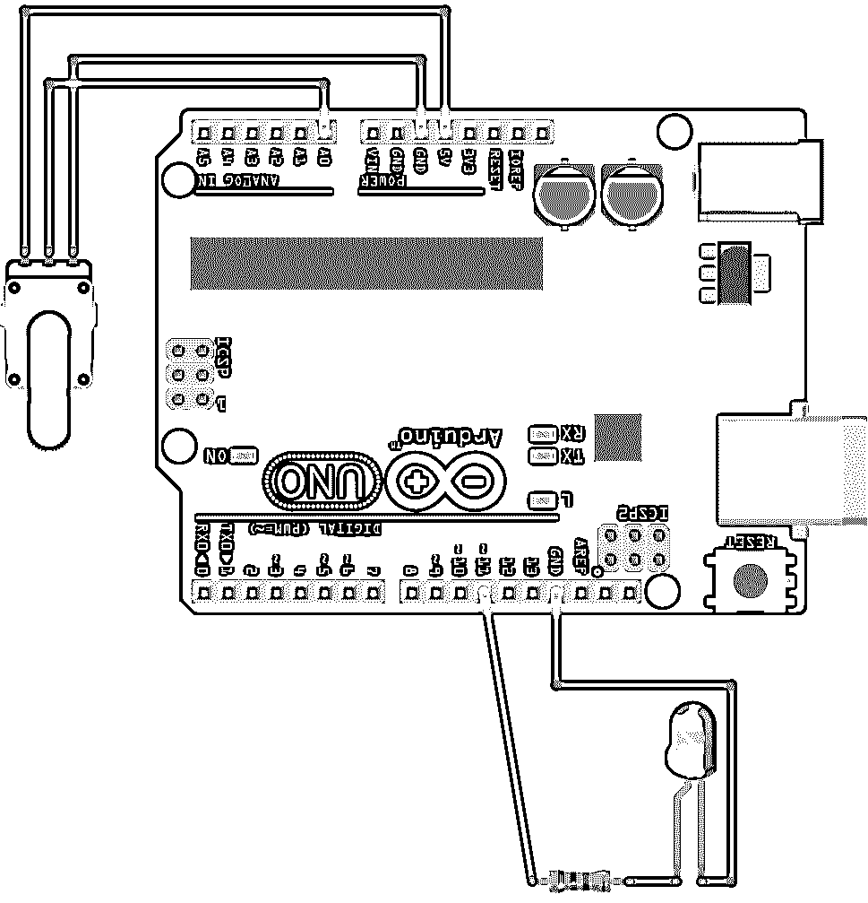

# 使用 Python 的 Arduino:如何入门

> 原文：<https://realpython.com/arduino-python/>

*立即观看**本教程有真实 Python 团队创建的相关视频课程。和文字教程一起看，加深理解: [**Arduino 搭配 Python:如何入门**](/courses/arduino-python/)

微控制器已经存在很长时间了，从复杂的机械到普通的家用电器，它们都被使用。然而，与他们一起工作传统上是为那些受过正规技术培训的人保留的，比如技术员和电气工程师。T2 Arduino T3 的出现使得电子应用程序设计对所有开发者来说变得更加容易。在本教程中，您将了解如何使用 Arduino 和 Python 来开发您自己的电子项目。

**您将学习 Python 与 Arduino 的基础知识，并学习如何:**

*   设置电子电路
*   在 Arduino 上设置 Firmata 协议
*   用 Python 编写 Arduino 的基本应用程序
*   控制模拟和数字输入和输出
*   将 Arduino 传感器和开关与更高级别的应用程序集成
*   使用 Arduino 在电脑上触发通知并发送电子邮件

**免费奖励:** [掌握 Python 的 5 个想法](https://realpython.com/bonus/python-mastery-course/)，这是一个面向 Python 开发者的免费课程，向您展示将 Python 技能提升到下一个水平所需的路线图和心态。

## Arduino 平台

Arduino 是一个由硬件和软件组成的开源平台，允许交互式电子项目的快速开发。Arduino 的出现[吸引了许多不同行业的专业人士的注意，](https://vimeo.com/18539129)[促成了](https://readwrite.com/2014/05/12/arduino-massimo-banzi-diy-electronics-hardware-hacking-builders/)[创客运动](https://en.wikipedia.org/wiki/Maker_culture)的开始。

随着创客运动和[物联网](https://en.wikipedia.org/wiki/Internet_of_things)概念的日益流行，Arduino 已经成为电子原型和 MVP 开发的主要平台之一。

Arduino 使用自己的编程语言，类似于 [C++](https://realpython.com/python-vs-cpp/) 。然而，可以将 Arduino 与 Python 或其他高级编程语言一起使用。事实上，像 Arduino 这样的平台与 Python 配合得很好，特别是对于需要与传感器和其他物理设备集成的应用程序。

总而言之，Arduino 和 Python 可以促进有效的学习环境，鼓励开发人员进入电子设计领域。如果你已经了解了 Python 的基础知识，那么你就可以通过使用 Python 来控制 Arduino。

Arduino 平台包括[硬件](https://www.arduino.cc/en/Main/Products)和软件产品。在本教程中，您将使用 Arduino 硬件和 Python 软件来了解基本电路，以及数字和模拟输入和输出。

[*Remove ads*](/account/join/)

### Arduino 硬件

为了运行这些例子，你需要通过连接**电子元件**来组装电路。您通常可以在电子元件商店或良好的 Arduino 初学者工具包中找到这些项目。你需要:

1.  Arduino Uno 或其他兼容的主板
2.  任何颜色的标准 LED
3.  按钮
4.  10 千欧电位计
5.  470 欧姆的电阻
6.  一个 10 千欧的电阻
7.  一块试验板
8.  各种颜色和尺寸的跳线

让我们仔细看看其中的几个组件。

组件 1 是一个 [**Arduino Uno**](https://store.arduino.cc/usa/arduino-uno-rev3) 或其他兼容板。Arduino 是一个包含许多[板卡](https://www.arduino.cc/en/main/boards)和不同用途模块的项目，Arduino Uno 是其中最基础的。它也是整个 Arduino 家族中使用最多、文档最多的电路板，因此对于刚刚开始接触电子产品的开发人员来说，它是一个非常好的选择。

**注意:** Arduino 是一个开放的硬件平台，因此有许多其他供应商出售可用于运行您在这里看到的示例的兼容主板。在本教程中，您将学习如何使用 Arduino Uno。

元件 5 和 6 是**电阻器。**根据[色码](https://en.wikipedia.org/wiki/Electronic_color_code#Resistor_color-coding)，大多数电阻器由彩色条纹识别。一般来说，前三种颜色代表一个电阻的**值**，第四种颜色代表其**容差**。对于 470 欧姆的电阻，前三种颜色是黄色、紫色和棕色。对于 10 千欧的电阻，前三种颜色是棕色、黑色和橙色。

组件 7 是一个**试验板**，用来连接所有其他组件并组装电路。虽然试验板不是必需的，但如果您打算开始使用 Arduino，建议您购买一个。

### Arduino 软件

除了这些硬件组件，你还需要安装一些软件。该平台包括 [Arduino IDE](https://www.arduino.cc/en/Main/Software) ，一个用于 Arduino 设备编程的集成开发环境，以及其他在线工具。

Arduino 的设计允许你毫不费力地对电路板进行编程。一般来说，您将遵循以下步骤:

1.  将主板连接到您的电脑
2.  安装并打开 Arduino IDE
3.  配置电路板设置
4.  写代码
5.  按下 IDE 上的按钮，将程序上传到板上

要在您的计算机上安装 Arduino IDE，请从 [Arduino 网站](https://www.arduino.cc/en/Main/Software)下载适用于您的操作系统的版本。查看文档中的安装说明:

*   **如果您使用的是 Windows** ，请使用 Windows installer 确保您下载了在 Windows 上使用 Arduino 所需的驱动程序。查看 [Arduino 文档](https://www.arduino.cc/en/guide/windows)了解更多详情。
*   **如果您使用的是 Linux** ，那么您可能需要将您的用户添加到一些组中，以便使用串行端口对 Arduino 进行编程。这个过程在[Arduino Linux 安装指南](https://www.arduino.cc/en/Guide/Linux)中有描述。
*   **如果你使用的是 macOS** ，那么你可以按照[OS X Arduino 安装指南](https://www.arduino.cc/en/Guide/MacOSX)来安装 Arduino IDE。

**注意:**在本教程中，您将使用 Arduino IDE，但是 Arduino 也提供了一个 [web 编辑器](https://create.arduino.cc/getting-started/plugin)，它将允许您使用浏览器对 Arduino 板进行编程。

现在您已经安装了 Arduino IDE 并收集了所有必要的组件，您已经准备好开始使用 Arduino 了！接下来，你将上传一个“你好，世界！”编程到你的板上。

## “你好，世界！”带 Arduino

Arduino IDE 附带了几个示例**草图**，您可以使用它们来学习 Arduino 的基础知识。一个**草图**是一个你可以上传到板上的程序的术语。因为 Arduino Uno 没有附加的显示器，所以你需要一种方法来查看程序的物理输出。您将使用**闪烁**示例草图让 Arduino 板上的内置 LED 闪烁。

### 上传眨眼示例草图

首先，使用 USB 电缆将 Arduino 板连接到您的 PC，然后启动 Arduino IDE。要打开眨眼示例草图，进入*文件*菜单，选择*示例*，然后选择 *01。基本动作*，最后*眨眼*:

[](https://files.realpython.com/media/arduino_ide_open_blink.800adb25f6da.jpg)

Blink 示例代码将被加载到新的 IDE 窗口中。但在将草图上传到电路板之前，您需要通过选择电路板及其连接的端口来配置 IDE。

要配置电路板，进入*工具*菜单，然后进入*电路板*。对于 Arduino Uno，您应该选择 *Arduino/Genuino Uno* :

[](https://files.realpython.com/media/arduino_ide_select_board.ab3e17d0f3e6.jpg)

选择板后，您必须设置适当的端口。再次进入*工具*菜单，这次选择*端口*:

[](https://files.realpython.com/media/arduino_ide_select_port.7eef188bba81.jpg)

端口的名称可能会有所不同，具体取决于您的操作系统。在 Windows 中，端口将被命名为`COM4`、`COM5`或类似的名称。在 macOS 或 Linux 中，你可能会看到类似于`/dev/ttyACM0`或`/dev/ttyUSB0`的东西。如果您在设置端口时遇到任何问题，请查看 [Arduino 故障排除页面](https://www.arduino.cc/en/Guide/Troubleshooting)。

配置好电路板和端口后，就可以将草图上传到 Arduino 了。为此，您只需按下 IDE 工具栏中的*上传*按钮:

[](https://files.realpython.com/media/arduino_ide_buttons.fee61246ed0f.jpg)

当您按下*上传*时，IDE 会编译草图并上传到您的主板上。如果你想检查错误，那么你可以在*上传*之前按*验证*，这样只会编译你的草图。

USB 电缆提供串行连接，用于上传程序和给 Arduino 板供电。在上传过程中，你会看到板上的 led 灯在闪烁。几秒钟后，上传的程序将运行，您将看到 LED 灯每秒闪烁一次:

[](https://files.realpython.com/media/blinking.ad6c84c75f27.gif)

上传完成后，USB 线会继续给 Arduino 板供电。该程序存储在 Arduino 微控制器的闪存中。您也可以使用电池或其他外部[电源](https://www.technobyte.org/2016/07/power-up-the-arduino-uno/)来运行应用程序，而无需 USB 电缆。

[*Remove ads*](/account/join/)

### 连接外部组件

在上一节中，您使用了 Arduino 板上已经存在的 LED。然而，在大多数实际项目中，您需要将外部元件连接到电路板。为了进行这些连接，Arduino 有几个不同类型的**引脚**:

[](https://files.realpython.com/media/arduino_ports.ccba6e743d26.png)

尽管这些连接通常被称为**引脚**，但您可以看到它们并不完全是物理引脚。相反，引脚是插座上的孔，可以连接跳线。在上图中，您可以看到不同的引脚组:

*   **橙色矩形:**这是 13 个**数字引脚**，可以用作输入或输出。它们只能处理数字信号，数字信号有两种不同的级别:
    1.  **电平 0:** 用电压 0V 表示
    2.  **一级:**用 5V 电压表示
*   **绿色矩形:**这是 6 个**模拟引脚**，可以用作模拟输入。它们可以在 0V 到 5V 之间的任意电压下工作。
*   **蓝色矩形:**这是 5 个**电源引脚**。它们主要用于为外部组件供电。

要开始使用外部组件，您将连接一个外部 LED 来运行闪烁示例草图。内置 LED 连接到**数字引脚#13** 。因此，让我们将外部 LED 连接到该引脚，并检查它是否闪烁。(标准 LED 是您之前看到的中列出的组件之一。)

在将任何东西连接到 Arduino 板上之前，最好先将其从电脑上断开。拔下 USB 电缆后，您就可以将 LED 连接到您的主板上了:

[](https://files.realpython.com/media/blink.18009615ed53.png)

请注意，图中显示的是数字引脚面向您的主板。

### 使用试验板

电子电路项目通常涉及测试几个想法，你添加新的元件，并进行调整。然而，直接连接元件可能很棘手，尤其是在电路很大的情况下。

为了方便原型制作，你可以使用一个 [**试验板**](https://en.wikipedia.org/wiki/Breadboard) 来连接组件。这是一个带有几个以特殊方式连接的孔的设备，以便您可以使用跳线轻松连接组件:

[](https://files.realpython.com/media/breadboard.1429308d8fa9.jpg)

通过观察彩色线条可以看出哪些孔是相互连通的。您将使用试验板侧面的孔为电路供电:

*   将**红线**上的一个孔连接到电源上。
*   将**蓝线**上的一个孔接地。

然后，只需使用红色和蓝色线上的其他孔，您就可以轻松地将组件连接到电源或地面。试验板中间的孔按照颜色指示进行连接。你要用这些来连接电路的元件。这两个内部部分由一个小凹陷分开，在这个凹陷上可以连接集成电路(IC)。

您可以使用试验板来组装 Blink 示例草图中使用的电路:

[](https://files.realpython.com/media/blink_2.0a1b1975b7da.png)

对于这个电路，需要注意的是，LED 必须根据其极性连接，否则无法工作。LED 的正极端子称为**阳极**，通常较长。负极端被称为**阴极**并且更短。如果您使用的是回收的组件，那么您也可以通过查找 LED 本身的平面来识别端子。这将指示负极端子的位置。

当您将 LED 连接到 Arduino 引脚时，您总是需要一个电阻来限制其电流，避免过早烧坏 LED。这里，您使用一个 470 欧姆的电阻来实现这一点。您可以按照连接检查电路是否相同:

*   电阻器连接到 Arduino 板上的数字引脚 13。
*   LED 阳极连接到电阻器的另一端。
*   LED 阴极通过蓝线孔接地(GND)。

如需更详细的解释，请查看[如何使用试验板](https://www.youtube.com/watch?v=6WReFkfrUIk)。

完成连接后，将 Arduino 插回 PC 并重新运行 Blink sketch:

[](https://files.realpython.com/media/blinking_2.ff9a0bc7491d.gif)

由于两个发光二极管都连接到数字引脚 13，当草图运行时，它们一起闪烁。

[*Remove ads*](/account/join/)

## “你好，世界！”使用 Arduino 和 Python

在上一节中，您将眨眼草图上传到了 Arduino 板上。Arduino 草图是用类似 C++的语言编写的，当你按下*上传*时，它会被编译并记录在微控制器的闪存中。虽然您可以使用[另一种语言](https://www.makeuseof.com/tag/programming-languages-can-use-arduino/)直接对 Arduino 微控制器编程，但这不是一项简单的任务！

然而，你可以采取一些方法将 Arduino 与 Python 或其他语言结合使用。一种想法是在 PC 上运行主程序，并使用串行连接通过 USB 电缆与 Arduino 通信。草图将负责读取输入，将信息发送到 PC，并从 PC 获取更新以更新 Arduino 输出。

要从 PC 上控制 Arduino，你必须设计一个 PC 和 Arduino 之间的通信协议。例如，您可以考虑包含如下消息的协议:

*   **引脚 13 的值为高:**用于告知 PC 数字输入引脚的状态
*   **设置引脚 11 为低:**用于告诉 Arduino 设置输出引脚的状态

定义好协议后，您可以编写一个 Arduino 草图来向 PC 发送消息，并根据协议更新引脚的状态。在 PC 上，您可以编写一个程序，根据您设计的协议，通过串行连接来控制 Arduino。为此，您可以使用您喜欢的任何语言和库，比如 Python 和 [PySerial](https://pythonhosted.org/pyserial/) 库。

幸运的是，有标准协议可以做到这一切！ [**Firmata**](https://github.com/firmata/protocol) 就是其中之一。该协议建立了一种串行通信格式，允许您读取数字和模拟输入，以及向数字和模拟输出发送信息。

Arduino IDE 包括现成的草图，这些草图将使用 Firmata 协议通过 Python 驱动 Arduino。在 PC 端，有多种语言的协议实现，包括 Python。要开始使用 Firmata，让我们用它来实现一个“Hello，World！”程序。

### 上传 Firmata 草图

在你编写 Python 程序来驱动 Arduino 之前，你必须上传 Firmata 草图，这样你就可以使用那个协议来控制电路板。Arduino IDE 的内置示例中提供了该草图。要打开它，进入*文件*菜单，然后是*示例*，接着是*固件*，最后是*标准固件*:

[](https://files.realpython.com/media/arduino_ide_firmata.35e3f089e6cd.jpg)

草图将被加载到一个新的 IDE 窗口中。要将其上传到 Arduino，您可以按照之前相同的步骤操作:

1.  将 USB 电缆插入电脑。
2.  在 IDE 上选择适当的板和端口。
3.  按*上传*。

上传完成后，您将不会注意到 Arduino 上的任何活动。要控制它，你还需要一个程序，可以通过串行连接与电路板通信。要在 Python 中使用 Firmata 协议，您需要 [pyFirmata](https://github.com/tino/pyFirmata) 包，您可以用 [`pip`](https://realpython.com/what-is-pip/) 安装它:

```py
$ pip install pyfirmata
```

安装完成后，您可以使用 Python 和 Firmata 运行一个等效的 Blink 应用程序:

```py
 1import pyfirmata
 2import time
 3
 4board = pyfirmata.Arduino('/dev/ttyACM0')
 5
 6while True:
 7    board.digital[13].write(1)
 8    time.sleep(1)
 9    board.digital[13].write(0)
10    time.sleep(1)
```

下面是这个程序[的工作方式](https://github.com/tino/pyFirmata#usage)。You [导入](https://realpython.com/python-import/) `pyfirmata`并使用它与 Arduino 板建立串行连接，这由第 4 行中的`board`对象表示。您还可以通过向`pyfirmata.Arduino()`传递一个参数来配置该行中的端口。您可以使用 Arduino IDE 来查找端口。

`board.digital`是一个列表，其元素代表 Arduino 的数字引脚。这些元素有方法`read()`和`write()`，它们将读取和写入管脚的状态。像大多数嵌入式设备程序一样，这个程序主要由一个无限循环组成:

*   **在第 7 行中，**数字引脚 13 打开，这将打开 LED 一秒钟。
*   **在第 9 行，**此引脚关闭，关闭 LED 一秒钟。

现在你已经知道了如何用 Python 控制 Arduino 的基本知识，让我们通过一些应用程序来与它的输入和输出交互。

[*Remove ads*](/account/join/)

### 读取数字输入

**数字输入**只能有两个可能的值。在电路中，每一个值都由不同的电压表示。下表显示了标准 Arduino Uno 板的数字输入表示:

| 价值 | 水平 | 电压 |
| --- | --- | --- |
| Zero | 低的 | 0V |
| one | 高的 | 5V |

为了控制 LED，您将使用一个**按钮**向 Arduino 发送数字输入值。松开按钮时，应该向电路板发送 0V 电压，按下按钮时，应该向电路板发送 5V 电压。下图显示了如何将按钮连接到 Arduino 板:

[](https://files.realpython.com/media/digital_input.5691a8f1d4fe.png)

您可能会注意到，LED 连接到 Arduino 的数字引脚 13，就像以前一样。数字引脚 10 用作数字输入。要连接按钮，您必须使用 10 千欧的电阻器，它在该电路中充当[下拉](https://playground.arduino.cc/CommonTopics/PullUpDownResistor/)。一个**下拉**电阻确保当按钮被释放时数字输入为 0V。

当你松开按钮时，你打开了按钮上两条电线之间的连接。因为没有电流流过电阻，所以第 10 号插脚只接地(GND)。数字输入为 0V，代表 **0** (或**低**)状态。当您按下按钮时，向电阻和数字输入施加 5V 电压。电流流过电阻，数字输入变为 5V，代表 **1** (或**高**)状态。

您也可以使用试验板来组装上述电路:

[](https://files.realpython.com/media/digital_input_2.a46059238b65.png)

现在你已经组装好了电路，你必须在 PC 上运行一个程序来使用 Firmata 控制它。该程序将根据按钮的状态打开 LED:

```py
 1import pyfirmata
 2import time
 3
 4board = pyfirmata.Arduino('/dev/ttyACM0')
 5
 6it = pyfirmata.util.Iterator(board)
 7it.start()
 8
 9board.digital[10].mode = pyfirmata.INPUT
10
11while True:
12    sw = board.digital[10].read()
13    if sw is True:
14        board.digital[13].write(1)
15    else:
16        board.digital[13].write(0)
17    time.sleep(0.1)
```

让我们浏览一下这个程序:

*   **1、2 号线** [导入](https://realpython.com/python-import/) `pyfirmata`和`time`。
*   **线路 4** 使用`pyfirmata.Arduino()`设置与 Arduino 板的连接。
*   第 6 行分配一个迭代器，用于读取电路输入的状态。
*   **第 7 行**启动迭代器，让一个循环与你的主代码并行运行。循环执行`board.iterate()`来更新从 Arduino 板获得的输入值。
*   **第 9 行**用`pyfirmata.INPUT`将引脚 10 设置为数字输入。这是必要的，因为默认配置是使用数字引脚作为输出。
*   **第 11 行**开始一个无限的[循环](https://realpython.com/python-while-loop/)。该循环读取输入引脚的状态，将其存储在`sw`中，并使用该值通过改变引脚 13 的值来打开或关闭 LED。
*   **第 17 行**在`while`循环的迭代之间等待 0.1 秒。这并不是绝对必要的，但这是一个避免 CPU 过载的好办法，当循环中没有 wait 命令时，CPU 会达到 100%的负载。

`pyfirmata`还提供了更简洁的语法来处理输入和输出引脚。当您使用多个大头针工作时，这可能是一个不错的选择。您可以重写前面的程序，使语法更加紧凑:

```py
 1import pyfirmata
 2import time
 3
 4board = pyfirmata.Arduino('/dev/ttyACM0')
 5
 6it = pyfirmata.util.Iterator(board)
 7it.start()
 8
 9digital_input = board.get_pin('d:10:i') 10led = board.get_pin('d:13:o') 11
12while True:
13    sw = digital_input.read()
14    if sw is True:
15        led.write(1) 16    else:
17        led.write(0) 18    time.sleep(0.1)
```

在这个版本中，您使用`board.get_pin()`来创建两个对象。`digital_input`代表数字输入状态，`led`代表 LED 状态。当您运行这个方法时，您必须传递一个由冒号分隔的三个元素组成的字符串参数:

1.  **引脚的类型**(`a`表示模拟，`d`表示数字)
2.  **pin 的编号**
3.  **引脚的模式**(`i`为输入，`o`为输出)

因为`digital_input`是使用引脚 10 的数字输入，所以传递参数`'d:10:i'`。使用引脚 13 将 LED 状态设置为数字输出，因此`led`参数为`'d:13:o'`。

当您使用`board.get_pin()`时，不需要像之前使用`pyfirmata.INPUT`那样明确地将引脚 10 设置为输入。设置引脚后，您可以使用`read()`访问数字输入引脚的状态，并使用`write()`设置数字输出引脚的状态。

数字输入广泛用于电子项目。一些传感器提供数字信号，如存在或门传感器，可用作电路的输入。然而，在某些情况下，您需要测量模拟值，例如距离或物理量。在下一节中，您将看到如何通过 Python 使用 Arduino 读取模拟输入。

[*Remove ads*](/account/join/)

### 读取模拟输入

与只能开或关的数字输入相反，**模拟输入**用于读取某个范围内的值。在 Arduino Uno 上，模拟输入的电压范围为 0V 至 5V。适当的传感器用于测量物理量，例如距离。这些传感器负责在适当的电压范围内对这些物理量进行编码，以便 Arduino 能够读取它们。

为了读取模拟电压，Arduino 使用[](https://en.wikipedia.org/wiki/Analog-to-digital_converter)**模数转换器(ADC)，将输入电压转换为固定位数的数字。这决定了转换的分辨率。Arduino Uno 使用 10 位 ADC，可以确定 1024 种不同的电压电平。*

*模拟输入的电压范围编码为从 0 到 1023 的数字。当施加 0V 时，Arduino 将其编码为数字 **0** 。当施加 5V 电压时，编码数字为 **1023** 。所有中间电压值都按比例编码。

[电位计](https://en.wikipedia.org/wiki/Potentiometer)是一个可变电阻，可以用来设置施加到 Arduino 模拟输入的电压。将它连接到模拟输入，以控制 LED 闪烁的频率:

[](https://files.realpython.com/media/analog_input.b5c94511d649.png)

在这个电路中，LED 的设置和以前一样。电位计的终端连接到地(GND)和 5V 引脚。通过这种方式，中央终端(光标)可以具有 0V 至 5V 范围内的任何电压，具体取决于它的位置，它连接到模拟引脚 A0 上的 Arduino。

使用试验板，可以按如下方式组装该电路:

[](https://files.realpython.com/media/analog_input_2.1d0464a94dd5.png)

在控制 LED 之前，您可以根据电位计的位置，使用电路检查 Arduino 读取的不同值。为此，请在您的 PC 上运行以下程序:

```py
 1import pyfirmata
 2import time
 3
 4board = pyfirmata.Arduino('/dev/ttyACM0')
 5it = pyfirmata.util.Iterator(board)
 6it.start()
 7
 8analog_input = board.get_pin('a:0:i') 9
10while True:
11    analog_value = analog_input.read()
12    print(analog_value)
13    time.sleep(0.1)
```

在第 8 行，您用参数`'a:0:i'`将`analog_input`设置为模拟 A0 输入引脚。在无限的`while`循环内部，你读取这个值，存储在`analog_value`，用 [`print()`](https://realpython.com/python-print/) 显示输出到控制台。当您在程序运行时移动电位计时，您应该输出类似如下的内容:

```py
0.0
0.0293
0.1056
0.1838
0.2717
0.3705
0.4428
0.5064
0.5797
0.6315
0.6764
0.7243
0.7859
0.8446
0.9042
0.9677
1.0
1.0
```

打印值会发生变化，范围从电位计位置在一端时的 0 到电位计位置在另一端时的 1。请注意，这些是浮点值，可能需要根据应用进行转换。

要改变 LED 闪烁的频率，您可以使用`analog_value`来控制 LED 保持亮或灭的时间:

```py
 1import pyfirmata
 2import time
 3
 4board = pyfirmata.Arduino('/dev/ttyACM0')
 5it = pyfirmata.util.Iterator(board)
 6it.start()
 7
 8analog_input = board.get_pin('a:0:i')
 9led = board.get_pin('d:13:o')
10
11while True:
12    analog_value = analog_input.read()
13    if analog_value is not None:
14        delay = analog_value + 0.01 15        led.write(1)
16        time.sleep(delay)
17        led.write(0)
18        time.sleep(delay)
19    else:
20        time.sleep(0.1)
```

这里，您将`delay`计算为`analog_value + 0.01`，以避免`delay`等于零。否则，在最初的几次迭代中，得到`None`的`analog_value`是很常见的。为了避免在运行程序时出错，您在第 13 行使用一个条件来测试`analog_value`是否为`None`。然后，您可以控制 LED 闪烁的周期。

尝试运行程序并改变电位计的位置。您会注意到 LED 闪烁频率的变化:

[](https://files.realpython.com/media/analog_input_demo.8a1831c1c606.gif)

至此，您已经了解了如何在电路中使用数字输入、数字输出和模拟输入。在下一节中，您将看到如何使用模拟输出。

[*Remove ads*](/account/join/)

### 使用模拟输出

在某些情况下，需要一个**模拟输出**来驱动需要模拟信号的设备。Arduino 不包括真正的模拟输出，电压可以设置为某个范围内的任何值。然而，Arduino 确实包括几个 [**脉宽调制**](https://en.wikipedia.org/wiki/Pulse-width_modulation) (PWM)输出。

PWM 是一种调制技术，其中数字输出用于产生具有可变功率的信号。为此，它使用恒定频率的数字信号，其中的[](https://en.wikipedia.org/wiki/Duty_cycle)**占空比根据所需功率而变化。占空比代表信号被设置为**高电平**的时间段。*

*并非所有 Arduino 数字引脚都可以用作 PWM 输出。可以用波浪符号(`~`)来标识:

[](https://files.realpython.com/media/arduino_pwm.e5057a13e704.png)

一些设备被设计成由 PWM 信号驱动，包括一些电机。如果使用模拟滤波器，甚至可以从 PWM 信号中获得真实的模拟信号。在上例中，您使用数字输出来打开或关闭 LED 灯。在本节中，您将根据电位计给出的模拟输入值，使用 PWM 来控制 LED 的亮度。

当 PWM 信号施加到 LED 时，其亮度根据 PWM 信号的占空比而变化。你将使用以下电路:

[](https://files.realpython.com/media/analog_output.6ea6cfee6f56.png)

该电路与上一节中用于测试模拟输入的电路相同，只有一处不同。由于不可能通过引脚 13 使用 PWM，因此用于 LED 的数字输出引脚是引脚 11。

您可以使用试验板组装电路，如下所示:

[](https://files.realpython.com/media/analog_output_2.f8d946a95317.png)

组装好电路后，您可以通过以下程序使用 PWM 控制 led:

```py
 1import pyfirmata
 2import time
 3
 4board = pyfirmata.Arduino('/dev/ttyACM0')
 5
 6it = pyfirmata.util.Iterator(board)
 7it.start()
 8
 9analog_input = board.get_pin('a:0:i')
10led = board.get_pin('d:11:p') 11
12while True:
13    analog_value = analog_input.read()
14    if analog_value is not None:
15        led.write(analog_value) 16    time.sleep(0.1)
```

与您之前使用的程序有一些不同:

1.  **在第 10 行**中，通过传递参数`'d:11:p'`将`led`设置为 PWM 模式。
2.  **在第 15 行**中，你用`analog_value`作为参数调用`led.write()`。这是一个从模拟输入读取的介于 0 和 1 之间的值。

在这里，您可以看到移动电位计时 LED 的行为:

[](https://files.realpython.com/media/analog_output.ba983178383a.gif)

为了显示占空比的变化，将示波器插入引脚 11。当电位计处于零位时，您可以看到 LED 关闭，因为引脚 11 的输出为 0V。当您转动电位计时，LED 会随着 PWM 占空比的增加而变亮。当您将电位计转到底时，占空比达到 100%。LED 以最大亮度持续打开。

通过此示例，您已经了解了使用 Arduino 及其数字和模拟输入和输出的基础知识。在下一节中，您将看到一个使用 Arduino 和 Python 在 PC 上驱动事件的应用程序。

### 使用传感器触发通知

Firmata 是用 Python 开始使用 Arduino 的一个很好的方法，但是需要一台 PC 或其他设备来运行该应用程序可能会很昂贵，并且这种方法在某些情况下可能不实用。然而，当需要使用外部传感器收集数据并将其发送到 PC 时，Arduino 和 Firmata 是一个很好的组合。

在本节中，您将使用一个连接到 Arduino 的按钮来模拟一个**数字传感器**并在您的机器上触发一个通知。对于一个更实际的应用，你可以把按钮想象成一个门传感器，例如，它会触发一个报警通知。

为了在 PC 上显示通知，您将使用标准的 Python [GUI](https://en.wikipedia.org/wiki/Graphical_user_interface) 工具包 [Tkinter](https://wiki.python.org/moin/TkInter) 。当您按下按钮时，将显示一个消息框。要深入了解 Tkinter，请查看使用 Tkinter 的 [Python GUI 编程。](https://realpython.com/python-gui-tkinter/)

您需要组装在[数字输入](#reading-digital-inputs)示例中使用的相同电路:

[](https://files.realpython.com/media/digital_input.5691a8f1d4fe.png)

组装电路后，使用以下程序触发通知:

```py
 1import pyfirmata
 2import time
 3import tkinter
 4from tkinter import messagebox
 5
 6root = tkinter.Tk()
 7root.withdraw()
 8
 9board = pyfirmata.Arduino('/dev/ttyACM0')
10
11it = pyfirmata.util.Iterator(board)
12it.start()
13
14digital_input = board.get_pin('d:10:i')
15led = board.get_pin('d:13:o')
16
17while True:
18    sw = digital_input.read()
19    if sw is True:
20        led.write(1)
21        messagebox.showinfo("Notification", "Button was pressed")
22        root.update()
23        led.write(0)
24    time.sleep(0.1)
```

该程序类似于在[数字输入](#reading-digital-inputs)示例中使用的程序，有一些变化:

*   **第 3 行和第 4 行**导入设置 Tkinter 所需的库。
*   **第 6 行**创建 Tkinter 的主窗口。
*   **第 7 行**告诉 Tkinter 不要在屏幕上显示主窗口。对于这个例子，您只需要看到消息框。
*   **第 17 行**开始`while`循环:
    1.  当您按下按钮时，LED 将点亮，并且`messagebox.showinfo()`显示一个消息框。
    2.  循环暂停，直到用户按下 *OK* 。这样，只要信息出现在屏幕上，LED 就会一直亮着。
    3.  用户按下 *OK* 后，`root.update()`从屏幕上清除消息框，LED 熄灭。

为了扩展通知示例，您甚至可以使用按钮在按下时发送电子邮件:

```py
 1import pyfirmata
 2import time
 3import smtplib
 4import ssl
 5
 6def send_email():
 7    port = 465  # For SSL
 8    smtp_server = "smtp.gmail.com"
 9    sender_email = "<your email address>"
10    receiver_email = "<destination email address>"
11    password = "<password>"
12    message = """Subject: Arduino Notification\n The switch was turned on."""
13
14    context = ssl.create_default_context()
15    with smtplib.SMTP_SSL(smtp_server, port, context=context) as server:
16        print("Sending email")
17        server.login(sender_email, password)
18        server.sendmail(sender_email, receiver_email, message)
19
20board = pyfirmata.Arduino('/dev/ttyACM0')
21
22it = pyfirmata.util.Iterator(board)
23it.start()
24
25digital_input = board.get_pin('d:10:i')
26
27while True:
28    sw = digital_input.read()
29    if sw is True:
30        send_email()
31        time.sleep(0.1)
```

你可以在用 Python 发送邮件的[中了解更多关于`send_email()`的信息。在这里，您使用电子邮件服务器凭证配置该函数，该凭证将用于发送电子邮件。](https://realpython.com/python-send-email/)

**注意:**如果您使用 Gmail 帐户发送电子邮件，那么您需要启用*允许不太安全的应用*选项。关于如何做到这一点的更多信息，请查看用 Python 发送电子邮件的。

通过这些示例应用程序，您已经看到了如何使用 Firmata 与更复杂的 Python 应用程序进行交互。Firmata 允许您使用任何连接到 Arduino 的传感器为您的应用获取数据。然后，您可以在主应用程序中处理数据并做出决策。您甚至可以使用 Firmata 将数据发送到 Arduino 输出，控制开关或 PWM 设备。

如果您对使用 Firmata 与更复杂的应用程序进行交互感兴趣，请尝试以下项目:

*   当温度过高或过低时，温度监视器会发出警报
*   一种模拟光传感器，可以感知灯泡何时烧坏
*   当地面太干燥时，可以自动打开洒水器的水传感器

[*Remove ads*](/account/join/)

## 结论

得益于创客运动和物联网的日益流行，微控制器平台正在崛起。像 Arduino 这样的平台受到了特别的关注，因为它们允许像你这样的开发人员使用他们的技能并投入到电子项目中。

您学习了如何:

*   用 Arduino 和 Python 开发应用
*   使用 Firmata 协议
*   控制模拟和数字输入和输出
*   将传感器与高级 Python 应用程序集成

您还看到了 Firmata 如何成为需要 PC 和依赖传感器数据的项目的非常有趣的替代方案。另外，如果你已经了解 Python，这是一个开始使用 Arduino 的简单方法！

## 延伸阅读

现在你已经知道了用 Python 控制 Arduino 的基础，你可以开始开发更复杂的应用程序了。有几个教程可以帮助您开发集成项目。这里有一些想法:

*   REST API:这些被广泛用于集成不同的应用程序。您可以使用 REST 和 Arduino 构建 API，从传感器获取信息并向执行器发送命令。要了解 REST API，请查看[Python REST API 与 Flask、Connexion 和 SQLAlchemy](https://realpython.com/flask-connexion-rest-api/) 。

*   在本教程中，您使用 Tkinter 构建了一个图形应用程序。然而，还有其他用于桌面应用程序的图形库。要查看替代方案，请查看[如何使用 wxPython](https://realpython.com/python-gui-with-wxpython/) 构建 Python GUI 应用程序。

*   **线程:**你在本教程中使用的无限`while`循环是 Arduino 应用程序的一个非常常见的特性。但是，使用线程运行主循环将允许您同时执行其他任务。要了解如何使用线程，请查看[Python 线程介绍](https://realpython.com/intro-to-python-threading/)。

*   **人脸检测:**物联网 app 整合机器学习和计算机视觉算法的情况很常见。例如，有了这些，你可以建立一个警报，当它在摄像头上检测到人脸时触发通知。要了解更多关于面部识别系统的信息，请查看使用 Python 的[传统面部检测](https://realpython.com/traditional-face-detection-python/)。

最后，除了 Firmata 和 Arduino，在微控制器中使用 Python 还有其他方式:

*   **pySerial:** Arduino Uno 不能直接运行 Python，但是你可以设计自己的 Arduino 草图，并使用 [pySerial](https://github.com/pyserial/pyserial) 来建立串行连接。然后你就可以用自己的协议用 Python 控制 Arduino 了。

*   如果你对直接在微控制器上运行 Python 感兴趣，那就去看看[的 MicroPython](https://realpython.com/micropython/) 项目。它提供了在一些微控制器上执行 Python 的有效实现，如 [ESP8266](https://en.wikipedia.org/wiki/ESP8266) 和 [ESP32](https://en.wikipedia.org/wiki/ESP32) 。

*   **SBCs:** 另一种选择是使用[单板机(SBC)](https://en.wikipedia.org/wiki/Single-board_computer) 比如[树莓派](https://realpython.com/python-raspberry-pi/)来运行 Python。SBC 是完整的 Arduino 大小的计算机，可以运行基于 Linux 的操作系统，允许您使用普通 Python。由于大多数单板机都提供了通用输入和输出引脚，你可以用它来代替大多数应用中的 Arduino。

*立即观看**本教程有真实 Python 团队创建的相关视频课程。和文字教程一起看，加深理解: [**Arduino 搭配 Python:如何入门**](/courses/arduino-python/)*************