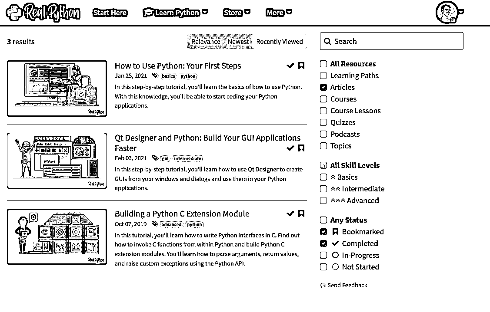

# 新功能:文章书签、完成状态和搜索改进

> 原文：<https://realpython.com/article-bookmarks-search-improvements/>

由于 Real Python 内容库中有近 2，000 个 Python 教程和视频课程，学习者在正确的时间找到正确的资源变得越来越困难。

为了解决这个问题，我们刚刚推出了几个新功能，帮助您轻松找到和查看您正在寻找的学习资源。

以下是最新消息:

## 文章完成状态和书签

就像课程和课程一样，你现在可以**将编写的教程**和**标记为已完成**来跟踪你的学习进度。

这使得保存您想要阅读的教程或保存您认为有价值的教程以供将来参考变得非常容易:

<figcaption class="figure-caption text-center">Article Bookmarks & Completion Status Tracking</figcaption>

例如，当我学习新的东西时，我真的喜欢沉浸在一个话题中，并在一天中使用不同的媒体。

要在真正的 Python 上实践这一点，您可以从标记一些文章和视频课程开始，并在您的手机上加载一两集相关的播客。这样，你就已经在“思维地图”的某个地方找到了这个主题的大致轮廓

接下来，您可以通过逐个完成每个书签资源来填写详细信息。这样，无论你是在平板电脑上观看课程，在电脑上完成书面教程，还是在做家务时听播客，你都可以随时掌握下一步。

在本文中尝试一下书签和文章进度跟踪——只需点击文章顶部、底部或侧边栏中的*标记为已完成* / *书签*按钮。

[*Remove ads*](/account/join/)

## 新的个性化搜索过滤器

我们的网站搜索功能也获得了**新的强大选项，用于根据完成状态、书签等查找和查看内容**。

例如，您现在可以运行个性化搜索查询，如:

*   [*“给我看所有我还没看过的 Django 初学者视频课”*](https://realpython.com/search?q=django&kind=lesson&level=basics&status=not-started)
*   [*“中级篇我已经完成了*](https://realpython.com/search?kind=article&level=intermediate&status=completed)
*   [*“我收藏的所有进阶文章，从我最近看过的开始”*](https://realpython.com/search?kind=article&level=advanced&status=bookmarked&order=recent)

<figcaption class="figure-caption text-center">Search Improvements & Personalized Filters</figcaption>

这将帮助您发现适合您的技能水平和兴趣的新内容，因此您将始终知道下一步应该关注什么，以便将您的 Python 技能提升到下一个水平。

还有更多:

希望从您离开的地方继续您的 Python 之旅吗？使用搜索功能快速找到您最近查看过但尚未完成的[资源列表](https://realpython.com/search?status=in-progress&order=recent)。

您还可以使用这些新的搜索过滤器来查看您过去发现有用的教程和课程。例如，当您想在工作面试或代码审查之前刷新您的记忆时，这是非常好的。

最后，你现在还可以[搜索播客剧集](https://realpython.com/search?kind=podcast)。

## 接下来是什么

我们为给你带来这些新特性而做的数据模型的改变将会在未来给网站带来一些很酷的新改进。

比如个性化首页、个性化推荐、定制教程集，这样你就可以跟踪自己的学习进度。

文章完成状态、书签和搜索改进现在都是实时的。让他们试试这篇文章和[我们的网站搜索](https://realpython.com/search)。

快乐的蟒蛇！*