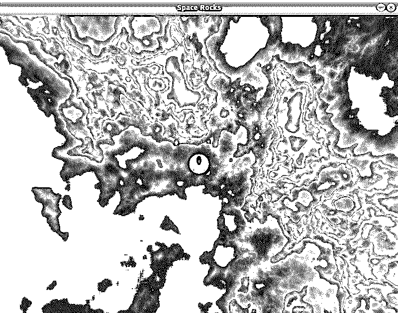

# 用 Python 和 Pygame 构建一个小行星游戏

> 原文：<https://realpython.com/asteroids-game-python/>

*立即观看**本教程有真实 Python 团队创建的相关视频课程。和文字教程一起看，加深理解: [**用 Pygame 用 Python 构建一个小行星游戏**](/courses/asteroids-game-python-pygame/)

你想创建自己的电脑游戏，但又非常喜欢 Python，以至于为了游戏开发者的职业生涯而放弃它吗？有一个解决方案！有了 Pygame 模块，你可以用你惊人的 Python 技能[创造游戏](https://realpython.com/top-python-game-engines/)，从基础到非常复杂。下面，你将通过制作小行星游戏的克隆版来学习如何使用 Pygame！

在本教程中，你将学习如何构建一个完整的游戏，包括:

*   加载**图像**并在屏幕上显示
*   处理**用户输入**以控制游戏
*   **根据**游戏逻辑**移动物体**
*   检测物体之间的碰撞
*   在屏幕上显示**文本**
*   播放**声音**

单击下面的链接下载该项目的代码，并跟随您构建游戏:

**获取源代码:** [点击此处获取源代码，您将在本教程中使用](https://realpython.com/bonus/python-asteroids-code/)用 Python 和 Pygame 构建一个小行星游戏。

我们开始吧！

## 演示:Python 中的小行星游戏

你将要制作的游戏是经典街机游戏[小行星](https://www.youtube.com/watch?v=WYSupJ5r2zo)的克隆版。在游戏中，你控制一艘宇宙飞船，拍摄小行星。如果你的宇宙飞船撞上了小行星，你就输了。如果你击落所有的小行星，你就赢了！

[https://player.vimeo.com/video/511326635?background=1](https://player.vimeo.com/video/511326635?background=1)

[*Remove ads*](/account/join/)

## 项目概述

你的 Python 小行星游戏将以一艘飞船为特色。宇宙飞船可以左右旋转，也可以向前加速。当它不加速时，它会继续以原来的速度运动。宇宙飞船也能发射子弹。

游戏将使用以下按键映射:

| **键** | 行动 |
| --- | --- |
| T2`Right` | 向右旋转飞船 |
| T2`Left` | 向左旋转飞船 |
| T2`Up` | 加速飞船前进 |
| T2`Space` | 拍摄 |
| T2`Esc` | 退出游戏 |

游戏中还会出现六颗大的小行星。当一颗子弹击中一颗大的小行星时，它会分裂成两颗中等大小的小行星。当子弹击中中型小行星时，它会分裂成两个小行星。小行星不会分裂，但会被子弹摧毁。

当小行星与宇宙飞船相撞时，宇宙飞船将被摧毁，游戏将以失败告终。当所有的小行星都消失后，游戏将以胜利告终！

该项目将分为十个步骤:

1.  为 Python 项目设置 Pygame
2.  在游戏中处理输入
3.  加载图像并在屏幕上显示
4.  用图像、位置和一些逻辑创建游戏对象
5.  移动宇宙飞船
6.  移动小行星并探测与宇宙飞船的碰撞
7.  射出子弹，摧毁小行星
8.  将小行星分裂成更小的
9.  播放声音
10.  处理游戏的结尾

每一步都将提供所有必要资源的链接。

## 先决条件

要构建你的小行星游戏，你需要一些更高级的 Python 元素。您应该已经熟悉了语言本身以及类、继承和回调等概念。如果您需要更新这些主题的知识，请查看我们的 Python 3 中的[面向对象编程(OOP)。](https://realpython.com/python3-object-oriented-programming/)

游戏还会使用**向量**来表示位置和方向，以及一些向量运算来移动屏幕上的元素。Pygame 会处理大部分的数学问题，所有必要的概念都会在本教程中解释。不过，如果你想知道更多，那么你可以查看一下[矢量加法](https://www.onlinemathlearning.com/vector-addition.html)。

如果你想深入理解一些概念，Pygame 文档会很有用，但是你会在本教程中找到你需要知道的一切。

## 第一步:Pygame 设置

在这一步的最后，您将拥有一个使用 Pygame 的小 Python 项目。它将显示一个带有标题的窗口，标题用蓝色填充。这将是你的小行星游戏的第一步。你不需要任何特定的游戏开发工具。您最喜欢的文本编辑器和命令行就足够了。

### Python 项目

要整理您的项目，首先要为它创建一个文件夹:

```py
$ mkdir awesome_pygame_project
$ cd awesome_pygame_project
```

和任何 Python 项目一样，你也应该为你的小行星游戏创建一个虚拟环境。你可以在 [Python 虚拟环境:初级读本](https://realpython.com/python-virtual-environments-a-primer/)中阅读更多关于虚拟环境的内容。

完成后，创建一个`requirements.txt`文件并添加一个 Pygame 依赖项。对于这个项目，建议你使用最新版本，这将使你的小行星游戏在 Linux 和 macOS 上无缝运行。您的文件应该如下所示:

```py
pygame==2.0.0
```

接下来，安装依赖项:

```py
(venv) $ python -m pip install -r requirements.txt
```

您可以通过运行以下命令来检查 Pygame 是否安装正确:

```py
(venv) $ python -m pygame.examples.aliens
```

如果一切顺利，那么你应该会看到一个显示 Pygame 外星人游戏的窗口。

[*Remove ads*](/account/join/)

### Pygame Code

现在是时候开始编写自己的代码了！一般来说，Pygame 程序的结构是这样的:

```py
 1initialize_pygame()
 2
 3while True:
 4    handle_input()
 5    process_game_logic()
 6    draw_game_elements()
```

第 3 行开始一个循环，称为**游戏循环**。该循环的每次迭代生成游戏的单个帧，并且通常执行以下操作:

1.  **输入处理:**收集并处理输入，如按下的按钮、鼠标运动和 VR 控制器位置。根据游戏的不同，它可以导致对象改变它们的位置，创建新的对象，请求游戏结束，等等。

2.  游戏逻辑:这是大部分游戏机制实现的地方。在这里，应用物理规则，检测和处理碰撞，人工智能完成其工作，等等。这个部分还负责检查玩家是赢了游戏还是输了游戏。

3.  绘制:如果游戏还没有结束，那么这就是屏幕上画框的地方。它将包括当前游戏中的所有物品，玩家可以看到这些物品。

Pygame 程序的一般结构并不复杂，你可以把它放在一个基本的循环中。然而，考虑到您可能会在未来扩展您的小行星游戏，将所有这些操作封装在一个 Python 类中是一个好主意。

创建一个职业意味着你需要为你的游戏取一个名字，但是“小行星”已经被取了。“太空岩石”怎么样？

创建一个`space_rocks`目录，并在其中创建一个名为`game.py`的文件。这是你放置小行星游戏主要职业的地方:`SpaceRocks`。该文件应该如下所示:

```py
 1import pygame
 2
 3class SpaceRocks:
 4    def __init__(self):
 5        self._init_pygame()
 6        self.screen = pygame.display.set_mode((800, 600))
 7
 8    def main_loop(self):
 9        while True:
10            self._handle_input()
11            self._process_game_logic()
12            self._draw()
13
14    def _init_pygame(self):
15        pygame.init()
16        pygame.display.set_caption("Space Rocks")
17
18    def _handle_input(self):
19        pass
20
21    def _process_game_logic(self):
22        pass
23
24    def _draw(self):
25        self.screen.fill((0, 0, 255))
26        pygame.display.flip()
```

下面是代码中一步一步发生的事情:

*   **Line 1** [导入](https://realpython.com/python-import/)py game 模块以获得其所有令人惊叹的功能。

*   **第 3 行**创建了`SpaceRocks`类。

*   **第 4 行**是`SpaceRocks`类的构造函数，这是放置任何初始化 Pygame 所需方法的绝佳位置。实际的 Pygame 初始化发生在`_init_pygame()`。一会儿你会学到更多关于这个方法的知识。

*   **第 6 行**创建一个显示面。Pygame 中的图像由**表面**表示。这里有一些关于它们的知识:

    *   表面可以在另一个表面上绘制，允许您从简单的图片创建复杂的场景。

    *   每个 Pygame 项目都有一个特殊的表面。该表面代表屏幕，并且是最终将显示给玩家的表面。所有其他表面必须在某个点上画在这个表面上。否则，它们不会显示。

    *   为了创建显示表面，您的程序使用了`pygame.display.set_mode()`。传递给这个方法的唯一参数是屏幕的大小，由两个值组成的[元组](https://realpython.com/python-lists-tuples/)表示:宽度和高度。在这种情况下，Pygame 将创建一个宽度为`800`像素、高度为`600`像素的屏幕。

*   **第 8 行**就是上面讨论的游戏循环。对于每个帧，它包含相同的三个步骤:

    1.  **第 10 行**包含输入处理。

    2.  **第 11 行**包含游戏逻辑。

    3.  **第 12 行**包含图纸。

*   第 14 行定义了一个叫做`_init_pygame()`的方法。这是 Pygame 一次性初始化的地方。该方法做两件事:

    1.  **15 号线**呼叫`pygame.init()`。这一行代码负责设置 Pygame 的惊人特性。每次使用 Pygame 时，都应该在程序开始时调用`pygame.init()`，以确保框架能够正常工作。

    2.  **第 16 行**使用`pygame.display.set_caption()`设置你的 Pygame 程序的标题。在这种情况下，标题将是你的游戏名称:`Space Rocks`。

*   **第 18 行和第 21 行**定义`_handle_input()`和`_process_game_logic()`。它们现在是空的，但是在接下来的部分中，你将添加一些代码来使你的游戏更有趣。

*   **第 24 行**定义`_draw()`。为你的游戏创建一个模板而不在屏幕上显示任何东西是没有意义的，所以这个方法已经有了一些代码。它调用每一帧来绘制屏幕内容，分两步完成:

    1.  **第 25 行**使用`screen.fill()`用一种颜色填充屏幕。该方法采用一个具有三个值的元组，表示三种基本颜色:红色、绿色和蓝色。每个颜色值的范围在`0`和`255`之间，代表其强度。在这个例子中,( 0，0，255)的元组意味着颜色将只由蓝色组成，没有红色或绿色的痕迹。

    2.  **第 26 行**使用`pygame.display.flip()`更新屏幕内容。因为你的游戏最终会显示移动的物体，你将在每一帧调用这个方法来更新显示。因此，您需要在每一帧中用颜色填充您的屏幕，因为该方法将清除前一帧中生成的内容。

这看起来像是很多额外的步骤，但是现在您的代码结构良好，并且具有带描述性名称的方法。下一次你需要改变与绘图相关的东西时，你会知道使用`_draw()`。为了添加输入处理，您将修改`_handle_input()`，等等。

注意:通常，你会在类的开始提取变量，比如屏幕尺寸和颜色。然而，在几个步骤中，您将使用图像替换颜色，并且您不会在此方法之外使用屏幕的大小。因此，您可以保留这些值。

接下来，在您的`space_rocks`文件夹中创建一个`__main__.py`文件。这个文件将负责创建一个新的游戏实例，并通过运行`main_loop()`来启动它。它应该是这样的:

```py
from game import SpaceRocks

if __name__ == "__main__":
    space_rocks = SpaceRocks()
    space_rocks.main_loop()
```

项目的结构现在应该如下所示:

```py
awesome_pygame_project/
|
├── space_rocks/
|   ├── __main__.py
|   └── game.py
|
└── requirements.txt
```

继续运行游戏:

```py
(venv) $ python space_rocks
```

您将看到一个蓝色背景的窗口:

[](https://files.realpython.com/media/pygame-asteroids-project-blue-background.3e26faf0615f.png)

恭喜你，你刚刚创建了一个 Pygame 项目！但是，此时没有退出条件，所以您仍然需要在命令行中使用 `Ctrl` + `C` 来退出它。这就是为什么接下来您将学习输入处理。

[*Remove ads*](/account/join/)

## 第二步:输入处理

至此，你已经有了游戏的主循环，准备好被逻辑填充。在这一步的最后，您还将有一个脚手架来开始插入用户控件。

Pygame 中的大多数输入处理发生在一个**事件循环**中。在每一帧中，您的程序可以获得自前一帧以来发生的事件的集合。这包括鼠标移动、按键等等。然后，一个接一个地处理这些事件。在 Pygame 中，获取那个集合的方法是`pygame.event.get()`。

你现在需要的事件是`pygame.QUIT`。当有人请求程序结束时就会发生这种情况，在 Windows 和 Linux 上通过点击*关闭*，或者按下 `Alt` + `F4` ，或者在 macOS 上按下 `Cmd` + `W` 。通过重写`SpaceRocks._handle_input()`来修改`space_rocks/game.py`，如下所示:

```py
def _handle_input(self):
 for event in pygame.event.get(): if event.type == pygame.QUIT: quit()
```

继续测试它。运行游戏，点击角落里的小 *X* 或使用适当的快捷方式。正如你所料，窗户将会关闭。

但是你可以更进一步。最终，你的游戏将只能用键盘来控制，而不是鼠标。按自定义键关闭窗口怎么样？

Pygame 中还有其他类型的事件，其中之一就是按键事件。它由一个`pygame.KEYDOWN`常数表示。每个这样的事件都有关于被按下的键的信息存储在`event.key`属性中。你可以在 [Pygame 文档](https://www.pygame.org/docs/ref/key.html)中查看不同按键的常量。在这个例子中，通过按下 `Esc` 来关闭游戏，你将使用`pygame.K_ESCAPE`。

再次修改`_handle_input()`方法:

```py
def _handle_input(self):
    for event in pygame.event.get():
 if event.type == pygame.QUIT or ( event.type == pygame.KEYDOWN and event.key == pygame.K_ESCAPE ): quit()
```

现在当你按下 `Esc` 时，你的游戏也会关闭。

你已经成功地显示了一个窗口并正确地关闭了它。但是窗口仍然用单一颜色填充。接下来，您将学习如何加载图像并将其显示在屏幕上。

## 第三步:图像

此时，你有一个游戏窗口，你可以通过按键关闭它。在这一步结束时，您将在该窗口中显示一个图像。

虽然你可以只用彩色矩形和其他简单的形状来制作一个电脑游戏，但是使用图像会使它更有吸引力。在电脑游戏开发中，图像通常被称为**精灵**。当然，游戏使用更多类型的资源，比如声音、字体、动画等等。这些资源统称为**资产**。

随着游戏的成长，保持一个合适的结构是很重要的。因此，首先创建一个名为`assets`的文件夹，并在其中创建另一个名为`sprites`的文件夹。这是你放置游戏中所有精灵的地方。

接下来，下载空间背景的图像，放入`assets/sprites`文件夹。您可以通过单击下面的链接下载源代码:

**获取源代码:** [点击此处获取源代码，您将在本教程中使用](https://realpython.com/bonus/python-asteroids-code/)用 Python 和 Pygame 构建一个小行星游戏。

此外，因为图像将在程序中多次加载，所以最好将此功能提取到单独文件中的单独方法中。创建一个名为`space_rocks/utils.py`的文件，保存所有可重用的方法。然后实现图像加载:

```py
 1from pygame.image import load
 2
 3def load_sprite(name, with_alpha=True):
 4    path = f"assets/sprites/{name}.png"
 5    loaded_sprite = load(path)
 6
 7    if with_alpha:
 8        return loaded_sprite.convert_alpha()
 9    else:
10        return loaded_sprite.convert()
```

事情是这样的:

*   **第 1 行**导入了一个名为`load()`的方法，这个方法对于以后读取图像是必要的。

*   **第 4 行**创建一个图像路径，假设它存储在`assets/sprites`目录中，并且是一个 PNG 文件。这样，以后你只需要提供精灵的名字。

*   **第 5 行**使用`load()`加载图像。这个方法返回一个[表面](https://www.Pygame.org/docs/ref/surface.html)，这是 Pygame 用来表示图像的对象。您可以稍后在屏幕上绘制它(如果您愿意，也可以在其他表面上绘制)。

*   **第 8 行和第 10 行**将图像转换成更适合屏幕的格式，以加快绘图过程。这是通过`convert_alpha()`或`convert()`完成的，取决于你是否想要使用透明。

**注意:**一般来说，你可以对所有类型的图像使用`convert_alpha()`，因为它也可以处理没有透明像素的图像。然而，绘制透明图像比绘制不透明图像要慢一些。

由于电脑游戏都是关于性能的，你将通过选择正确的图像类型和提高游戏速度来练习优化你的游戏，即使只是一点点。

现在，项目的结构如下所示:

```py
awesome_pygame_project/
|
├── assets/
|   |
│   └── sprites/
│       └── space.png
|
├── space_rocks/
│   ├── __main__.py
│   ├── game.py
│   └── utils.py
|
└── requirements.txt
```

现在你的程序可以加载图像了，是时候把蓝色背景换成更有趣的东西了。编辑`space_rocks/game.py`文件:

```py
import pygame

from utils import load_sprite 
class SpaceRocks:
    def __init__(self):
        self._init_pygame()
        self.screen = pygame.display.set_mode((800, 600))
 self.background = load_sprite("space", False) 
    def main_loop(self):
        while True:
            self._handle_input()
            self._process_game_logic()
            self._draw()

    def _init_pygame(self):
        pygame.init()
        pygame.display.set_caption("Space Rocks")

    def _handle_input(self):
        for event in pygame.event.get():
            if event.type == pygame.QUIT or (
                event.type == pygame.KEYDOWN and event.key == pygame.K_ESCAPE
            ):
                quit()

    def _process_game_logic(self):
        pass

    def _draw(self):
 self.screen.blit(self.background, (0, 0))        pygame.display.flip()
```

要在 Pygame 中的另一个表面上显示一个表面，您需要在您想要绘制的表面上调用`blit()`。这个方法有两个参数:

1.  要绘制的表面
2.  你想画它的点

请记住，在 Pygame 中，坐标系从左上角开始。x 轴从左到右，y 轴从上到下:

[](https://files.realpython.com/media/screen-coordinates.e26a53c87043.png)

如你所见，`UP`向量指向上方，将有一个负的 y 坐标。

传递给`blit()`的坐标以两个值给出:`X`和`Y`。它们表示操作后曲面左上角所在的点:

[](https://files.realpython.com/media/blit.ef4dfd9a6d05.png)

如您所见，左上角被 blit 坐标移动以计算正确的位置。

在您的例子中，新背景与屏幕大小相同(`800` × `600`像素)，所以坐标将是`(0, 0)`，代表屏幕的左上角。这样，背景图像将覆盖整个屏幕。

现在运行您的程序，您将看到一个带有背景图像的屏幕:

[](https://files.realpython.com/media/pygame-asteroids-project-space-background.fb9c5194692b.png)

你的游戏现在有一个非常好的背景图像，但是还没有任何事情发生。让我们通过添加一些对象来改变这一点。

[*Remove ads*](/account/join/)

## 第四步:控制游戏对象

在这一点上，你的程序显示了你的小行星游戏将要发生的一小块宇宙的背景图像。它现在有点空，所以在这一部分你将把它填满。您将创建一个表示其他可绘制游戏对象的类，并使用它来显示一艘宇宙飞船和一颗小行星。

### 高级行为

你已经使用了表面，但是 Pygame 还提供了另一个类， [`Sprite`](https://www.pygame.org/docs/ref/sprite.html) ，它是可视对象的基类。它包含一些有用的方法，但是您也可能会遇到一些限制。

一个限制是游戏对象不仅仅是一个精灵。它包含额外的数据，比如它的方向和速度。它还需要更高级的行为，比如发射子弹或播放声音。大多数附加信息和行为不是由`Sprite`类提供的，所以您需要自己添加。

另一个问题是 Pygame 从左上角开始绘制精灵。在你的游戏中，为了移动和旋转一个物体，存储它的中心位置可能更容易。在这种情况下，您必须按照 Pygame 的要求实现一种方法，将该位置转换为左上角。

最后，虽然 Pygame 已经有了检测图像重叠的方法，但它们可能不适合检测物体之间的碰撞。一艘可旋转的宇宙飞船或一颗小行星可能不会填满整个图像，而是填满图像中的圆形区域。在这种情况下，碰撞应该只考虑圆形区域，而不是精灵的整个表面。否则，您可能会得到不正确的结果:

[](https://files.realpython.com/media/sprites-collide.7f56b74ccd7d.png)

在这个例子中，精灵会碰撞，但是游戏对象不会。

这实际上是`Sprite`类可以帮忙的地方，因为您可以将它与`pygame.sprite.collide_circle()`一起使用。该方法使用以两个精灵的表面为中心的圆来检测它们之间的碰撞。然而，检测圆的碰撞并不是一个非常复杂的过程，您可以自己实现它。

考虑到这些问题，内置的 Pygame `Sprite`类应该被扩充，而不是简单地单独使用。在你的游戏中，Pygame 精灵提供了一些有用的特性。相反，为游戏对象实现一个自定义类可能是个好主意。这应该给你更多的控制，帮助你理解一些概念，因为你将自己实现它们。

### 游戏对象类

在这一节中，您将介绍`GameObject`类。它将为所有其他游戏对象封装一些通用的行为和数据。代表特定对象(如宇宙飞船)的类将继承它，并用它们自己的行为和数据扩展它。如果你想更新你的类和继承的知识，那么看看 Python 3 中的[面向对象编程(OOP)。](https://realpython.com/python3-object-oriented-programming/)

`GameObject`类将存储以下数据:

*   **`position`:**2D 屏幕上物体中心的一点
*   **`sprite` :** 用于显示物体的图像
*   **`radius` :** 表示物体位置周围碰撞区域的值
*   **`velocity` :** 用于运动的数值

这是游戏对象的图形表示:

[](https://files.realpython.com/media/game-object.70ece5ff8d84.png)

`sprite`将是一个加载了前面示例中的`load_sprite()`的曲面。`radius`是一个整数，表示从物体中心到碰撞区域边缘的像素数。然而，`position`本身和`velocity`将需要一个新的类型:一个**向量**。

向量类似于元组。在 2D 世界中(就像你游戏中的一样)，向量由两个值表示，分别代表 x 坐标和 y 坐标。这些坐标可以指向一个位置，但也可以表示给定方向上的运动或加速度。向量可以相加，相减，甚至相乘来快速更新精灵的位置。你可以在二维空间的[矢量中阅读更多关于矢量的内容。](https://www.intmath.com/vectors/3-vectors-2-dimensions.php)

因为向量在游戏中非常有用，Pygame 已经为它们提供了一个类:`pygame.math`模块中的`Vector2`。它提供了一些额外的功能，比如计算向量之间的距离和加减向量。这些特性将使你的游戏逻辑更容易实现。

在`space_rocks`目录中，创建一个名为`models.py`的新文件。目前，它将存储`GameObject`类，但稍后你将添加小行星、子弹和宇宙飞船类。该文件应该如下所示:

```py
 1from pygame.math import Vector2
 2
 3class GameObject:
 4    def __init__(self, position, sprite, velocity):
 5        self.position = Vector2(position)
 6        self.sprite = sprite
 7        self.radius = sprite.get_width() / 2
 8        self.velocity = Vector2(velocity)
 9
10    def draw(self, surface):
11        blit_position = self.position - Vector2(self.radius)
12        surface.blit(self.sprite, blit_position)
13
14    def move(self):
15        self.position = self.position + self.velocity
16
17    def collides_with(self, other_obj):
18        distance = self.position.distance_to(other_obj.position)
19        return distance < self.radius + other_obj.radius
```

这里有一个细目分类:

*   **1 号线**进口前面提到的`Vector2`级。

*   **第 3 行**创建了`GameObject`类，你将使用它来表示太空岩石中的所有游戏对象。

*   **第 4 行**是`GameObject`类的构造器。它需要三个参数:

    1.  **`position` :** 物体的中心

    2.  **`sprite` :** 用来绘制这个对象的图像

    3.  **`velocity` :** 每帧更新物体的`position`

*   **第 5 行和第 8 行**确保`position`和`velocity`将始终被表示为用于未来计算的向量，即使元组被传递给构造函数。你可以通过调用`Vector2()`构造函数来实现。如果给它一个元组，那么它会从中创建一个新的向量。如果给它一个向量，它会创建这个向量的副本。

*   **第 7 行**将`radius`计算为`sprite`图像宽度的一半。在这个程序中，游戏对象精灵将总是带有透明背景的正方形。你也可以使用图像的高度——这没什么区别。

*   **第 10 行**定义了`draw()`，它将在作为参数传递的表面上绘制对象的`sprite`。

*   **第 11 行**计算传送图像的正确位置。下面将更详细地描述该过程。请注意，`Vector2()`构造函数接收的是单个数字，而不是一个元组。在这种情况下，它将对两个值都使用该数字。所以`Vector2(self.radius)`相当于`Vector2((self.radius, self.radius))`。

*   第 12 行使用新计算的 blit 位置将你对象的精灵放到给定表面的正确位置。

*   **第 14 行**定义`move()`。它将更新游戏对象的位置。

*   **第 15 行**将速度加到位置上，结果得到一个更新的位置向量。Pygame 使操纵向量变得简单明了，允许你像添加数字一样添加它们。

*   **第 17 行**定义了用于检测碰撞的`collides_with()`方法。

*   **第 18 行**利用`Vector2.distance_to()`计算两个物体之间的距离。

*   **第 19 行**检查该距离是否小于物体半径之和。如果是这样，物体就会发生碰撞。

请注意，你的游戏对象有一个中心位置，但`blit()`需要左上角。因此，blit 位置必须通过将对象的实际位置移动一个向量来计算:

[](https://files.realpython.com/media/blit-pos.69f8ab8c7d52.png)

这个过程发生在`draw()`。

你可以通过添加一艘飞船和一颗小行星来测试这一点。首先将飞船和小行星图像复制到`assets/sprites`。您可以通过单击下面的链接下载源代码:

**获取源代码:** [点击此处获取源代码，您将在本教程中使用](https://realpython.com/bonus/python-asteroids-code/)用 Python 和 Pygame 构建一个小行星游戏。

项目的结构应该如下所示:

```py
awesome_pygame_project/
|
├── assets/
|   |
│   └── sprites/
│       ├── asteroid.png
│       ├── space.png
│       └── spaceship.png
|
├── space_rocks/
│   ├── __main__.py
│   ├── game.py
│   ├── models.py
│   └── utils.py
|
└── requirements.txt
```

现在修改`space_rocks/game.py`文件:

```py
import pygame

from models import GameObject from utils import load_sprite

class SpaceRocks:
    def __init__(self):
        self._init_pygame()
        self.screen = pygame.display.set_mode((800, 600))
        self.background = load_sprite("space", False)
 self.spaceship = GameObject( (400, 300), load_sprite("spaceship"), (0, 0) ) self.asteroid = GameObject( (400, 300), load_sprite("asteroid"), (1, 0) ) 
    def main_loop(self):
        while True:
            self._handle_input()
            self._process_game_logic()
            self._draw()

    def _init_pygame(self):
        pygame.init()
        pygame.display.set_caption("Space Rocks")

    def _handle_input(self):
        for event in pygame.event.get():
            if event.type == pygame.QUIT or (
                event.type == pygame.KEYDOWN and event.key == pygame.K_ESCAPE
            ):
                quit()

    def _process_game_logic(self):
 self.spaceship.move() self.asteroid.move() 
    def _draw(self):
        self.screen.blit(self.background, (0, 0))
 self.spaceship.draw(self.screen) self.asteroid.draw(self.screen)        pygame.display.flip()
```

使用坐标`(400, 300)`，两个对象都被放置在屏幕的中间。两个物体的位置将在每一帧使用`_process_game_logic()`更新，并且它们将使用`_draw()`绘制。

运行这个程序，你会看到一颗小行星向右移动，一艘宇宙飞船停在屏幕中间:

[](https://files.realpython.com/media/pygame-asteroids-project-spaceship-and-asteroid.7453f5f705f6.png)

也可以通过在`_draw()`的末尾临时增加一行来测试`collides_with()`:

```py
print("Collides:", self.spaceship.collides_with(self.asteroid))
```

在命令行中，您会注意到该方法最初是如何打印`True`的，因为小行星覆盖了飞船。后来，随着小行星进一步向右移动，它开始打印`False`。

[*Remove ads*](/account/join/)

### 控制速度

既然你在屏幕上有了移动的物体，是时候考虑一下你的游戏在不同的机器上用不同的处理器会有怎样的表现了。有时它会跑得更快，有时它会跑得更慢。

正因为如此，小行星(很快子弹)将以不同的速度移动，使游戏有时更容易，有时更难。这不是你想要的。你想要的是让你的游戏以固定数量的每秒**帧(FPS)** 运行。

幸运的是，Pygame 可以解决这个问题。它提供了一个带有`tick()`方法的`pygame.time.Clock`类。该方法将等待足够长的时间，以匹配作为参数传递的所需 FPS 值。

继续更新`space_rocks/game.py`:

```py
import pygame

from models import GameObject
from utils import load_sprite

class SpaceRocks:
    def __init__(self):
        self._init_pygame()
        self.screen = pygame.display.set_mode((800, 600))
        self.background = load_sprite("space", False)
 self.clock = pygame.time.Clock()        self.spaceship = GameObject(
            (400, 300), load_sprite("spaceship"), (0, 0)
        )
        self.asteroid = GameObject(
            (400, 300), load_sprite("asteroid"), (1, 0)
        )

    def main_loop(self):
        while True:
            self._handle_input()
            self._process_game_logic()
            self._draw()

    def _init_pygame(self):
        pygame.init()
        pygame.display.set_caption("Space Rocks")

    def _handle_input(self):
        for event in pygame.event.get():
            if event.type == pygame.QUIT or (
                event.type == pygame.KEYDOWN and event.key == pygame.K_ESCAPE
            ):
                quit()

    def _process_game_logic(self):
        self.spaceship.move()
        self.asteroid.move()

    def _draw(self):
        self.screen.blit(self.background, (0, 0))
        self.spaceship.draw(self.screen)
        self.asteroid.draw(self.screen)
        pygame.display.flip()
 self.clock.tick(60)
```

如果你现在运行你的游戏，那么小行星可能会以不同于最初的速度移动。然而，你现在可以肯定，这个速度将保持不变，即使是在拥有超高速处理器的计算机上。那是因为你的游戏会一直以 60 FPS 的速度运行。您还可以尝试传递给`tick()`的不同值，看看有什么不同。

您刚刚学习了如何在屏幕上显示和移动对象。现在你可以给你的游戏添加一些更高级的逻辑。

## 第五步:宇宙飞船

至此，你应该有了一个通用的可绘制和可移动游戏对象的类。在这一步的最后，您将使用它来创建一个可控的宇宙飞船。

您在上一步中创建的类`GameObject`，包含一些通用逻辑，可以被不同的游戏对象重用。但是，每个游戏对象也会实现自己的逻辑。例如，宇宙飞船预计会旋转和加速。它也会发射子弹，但那是以后的事了。

### 创建一个类

飞船的图像已经在您在步骤 4 中添加的`space_rocks/assets`目录中。然而，早先它被用在主游戏文件中，现在你需要在其中一个模型中加载它。要做到这一点，更新`space_rocks/models.py`文件中的 imports 部分:

```py
from pygame.math import Vector2

from utils import load_sprite
```

现在，您可以在同一个文件中创建继承自`GameObject`的`Spaceship`类:

```py
class Spaceship(GameObject):
    def __init__(self, position):
        super().__init__(position, load_sprite("spaceship"), Vector2(0))
```

在这一点上它没有做很多事情——它只是用一个特定的图像和零速度调用了`GameObject`构造函数。但是，您很快就会添加更多的功能。

要使用这个新类，首先需要导入它。像这样更新`space_rocks/game.py`文件中的导入:

```py
import pygame

from models import Spaceship from utils import load_sprite
```

您可能注意到了,`GameObject`类的原始导入已经不存在了。那是因为`GameObject`是作为基类被其他类继承的。你不应该直接使用它，而是导入代表实际游戏对象的类。

这意味着前一步中的小行星将停止工作，但这不是一个大问题。您将很快添加一个表示小行星的适当类。在那之前，你应该把注意力放在太空船上。

继续编辑`SpaceRocks`类，如下所示:

```py
 1class SpaceRocks:
 2    def __init__(self):
 3        self._init_pygame()
 4        self.screen = pygame.display.set_mode((800, 600))
 5        self.background = load_sprite("space", False)
 6        self.clock = pygame.time.Clock()
 7        self.spaceship = Spaceship((400, 300)) 8
 9    def main_loop(self):
10        while True:
11            self._handle_input()
12            self._process_game_logic()
13            self._draw()
14
15    def _init_pygame(self):
16        pygame.init()
17        pygame.display.set_caption("Space Rocks")
18
19    def _handle_input(self):
20        for event in pygame.event.get():
21            if event.type == pygame.QUIT or (
22                event.type == pygame.KEYDOWN and event.key == pygame.K_ESCAPE
23            ):
24                quit()
25
26    def _process_game_logic(self):
27        self.spaceship.move()
28
29    def _draw(self):
30        self.screen.blit(self.background, (0, 0))
31        self.spaceship.draw(self.screen)
32        pygame.display.flip()
33        self.clock.tick(60)
```

发生了两件事:

1.  在第 7 行，您用一个专用的`Spaceship`类替换了基本的`GameObject`类。

2.  您删除了`__init__()`、`_process_game_logic()`和`_draw()`中的所有`self.asteroid`引用。

如果你现在运行游戏，你会在屏幕中间看到一艘宇宙飞船:

[](https://files.realpython.com/media/pygame-asteroids-project-spaceship-in-the-middle.a86344614492.png)

这些变化还没有添加任何新的行为，但是现在您有了一个可以扩展的类。

[*Remove ads*](/account/join/)

### 旋转宇宙飞船

默认情况下，飞船面朝上，朝向屏幕的顶部。你的玩家应该可以左右旋转它。幸运的是，Pygame 内置了旋转精灵的方法，但是有一个小问题。

一般来说，[图像旋转](https://www.codeguru.com/cpp/cpp/algorithms/math/article.php/c10677/AntiAliased-Image-Rotation-Aarot.htm)是一个复杂的过程，需要重新计算新图像中的像素。在重新计算的过程中，关于原始像素的信息会丢失，图像会变形一点。随着每一次旋转，变形变得越来越明显。

因此，将原始精灵存储在`Spaceship`类中并拥有另一个精灵可能是一个更好的主意，该精灵将在飞船每次旋转时更新。

为了使这种方法可行，你需要知道飞船旋转的角度。这可以通过两种方式实现:

1.  将角度保持为浮点值，并在旋转过程中更新它。
2.  保持代表飞船朝向的向量，并使用该向量计算角度。

这两种方法都不错，但是在继续之前你需要选择一种。由于宇宙飞船的位置和速度已经是向量，所以用另一个向量来表示方向是有意义的。这将使添加向量和稍后更新位置变得更加简单。幸运的是，`Vector2`类可以很轻松的旋转，结果不会变形。

首先，在`space_rocks/models.py`文件中创建一个名为`UP`的常量向量。稍后您将把它用作参考:

```py
UP = Vector2(0, -1)
```

记住 Pygame 的 y 轴是从上到下的，所以负值实际上是向上的:

[](https://files.realpython.com/media/asteroids_up_vector.523149b7eda2.png)

接下来，修改`Spaceship`类:

```py
class Spaceship(GameObject):
 MANEUVERABILITY = 3
```

`MANEUVERABILITY`值决定了你的飞船能旋转多快。您之前了解到 Pygame 中的向量可以旋转，该值表示您的飞船方向可以旋转每一帧的角度，以度为单位。使用较大的数字将使飞船旋转得更快，而较小的数字将允许对旋转进行更精细的控制。

接下来，通过修改构造函数向`Spaceship`类添加一个方向:

```py
def __init__(self, position):
 # Make a copy of the original UP vector self.direction = Vector2(UP) 
    super().__init__(position, load_sprite("spaceship"), Vector2(0))
```

方向向量最初将与`UP`向量相同。但是，它以后会被修改，所以您需要创建它的副本。

接下来，您需要在`Spaceship`类中创建一个名为`rotate()`的新方法:

```py
def rotate(self, clockwise=True):
    sign = 1 if clockwise else -1
    angle = self.MANEUVERABILITY * sign
    self.direction.rotate_ip(angle)
```

这种方法将通过顺时针或逆时针旋转来改变方向。`Vector2`类的`rotate_ip()`方法将它旋转一定角度。在此操作过程中，向量的长度不会改变。你可以从使用旋转矩阵的[旋转点中学到更多关于 2D 矢量旋转背后的高级数学知识。](https://www.youtube.com/watch?v=OYuoPTRVzxY)

剩下的就是更新`Spaceship`的图纸了。为此，首先需要导入 [`rotozoom`](https://www.pygame.org/docs/ref/transform.html#pygame.transform.rotozoom) ，它负责缩放和旋转图像:

```py
from pygame.math import Vector2
from pygame.transform import rotozoom 
from utils import load_sprite, wrap_position
```

然后，您可以在`Spaceship`类中覆盖`draw()`方法:

```py
 1def draw(self, surface):
 2    angle = self.direction.angle_to(UP)
 3    rotated_surface = rotozoom(self.sprite, angle, 1.0)
 4    rotated_surface_size = Vector2(rotated_surface.get_size())
 5    blit_position = self.position - rotated_surface_size * 0.5
 6    surface.blit(rotated_surface, blit_position)
```

下面是一步一步的分解:

*   **第 2 行**使用`Vector2`类的`angle_to()`方法来计算一个向量需要旋转的角度，以便与另一个向量指向相同的方向。这使得将飞船的方向转换成以度为单位的旋转角度变得很容易。

*   **第 3 行**使用`rotozoom()`旋转精灵。它获取原始图像、图像应该旋转的角度以及应该应用于 sprite 的比例。在这种情况下，您不想改变大小，所以您保持比例为`1.0`。

*   **线 4 和线 5** 使用`rotated_surface`的尺寸重新计算 blit 位置。该过程描述如下。

*   **第 5 行**包含了`rotated_surface_size * 0.5`操作。这是 Pygame 中你可以对向量做的另一件事。当你把一个向量乘以一个数时，它的所有坐标都乘以那个数。因此，乘以`0.5`将返回一个长度为原来一半的向量。

*   **第 6 行**使用新计算的 blit 位置将图像放在屏幕上。

注意`rotozoom()`返回一个新的旋转图像表面。但是，为了保留原始精灵的所有内容，新图像可能会有不同的大小。在这种情况下，Pygame 将添加一些额外的透明背景:

[](https://files.realpython.com/media/asteroids_rotated_surface.61f02812cd0a.png)

新图像的大小可能与原始图像的大小有很大不同。这就是为什么`draw()`重新计算`rotated_surface`的 blit 位置。记住`blit()`从左上角开始，所以为了使旋转后的图像居中，你还需要将 blit 位置移动图像大小的一半。

现在您需要添加输入处理。然而，事件循环在这里并不完全有效。事件发生时会被记录下来，但您需要不断检查是否按下了某个键。毕竟飞船只要你按下 `Up` 就要加速，按下 `Left` 或者 `Right` 就要不停旋转。

您可以为每个键创建一个标志，在按下该键时设置它，并在释放时重置它。然而，有一个更好的方法。

键盘的当前状态存储在 Pygame 中，可以使用`pygame.key.get_pressed()`获取。它返回一个字典，其中的键常量(如您之前使用的`pygame.K_ESCAPE`)是键，如果键被按下，则值为`True`，否则为`False`。

了解了这一点，您就可以编辑`space_rocks/game.py`文件并更新`SpaceRocks`类的`_handle_input()`方法了。箭头键需要使用的常量是`pygame.K_RIGHT`和`pygame.K_LEFT`:

```py
def _handle_input(self):
    for event in pygame.event.get():
        if event.type == pygame.QUIT or (
            event.type == pygame.KEYDOWN and event.key == pygame.K_ESCAPE
        ):
            quit()

    is_key_pressed = pygame.key.get_pressed()

 if is_key_pressed[pygame.K_RIGHT]: self.spaceship.rotate(clockwise=True) elif is_key_pressed[pygame.K_LEFT]: self.spaceship.rotate(clockwise=False)
```

现在，当您按下箭头键时，您的飞船将左右旋转:

[](https://files.realpython.com/media/pygame-asteroids-project-spaceship-rotated.4c41998e30d4.png)

如你所见，宇宙飞船正确旋转。然而，它还是不动。接下来你会解决的。

[*Remove ads*](/account/join/)

### 加速宇宙飞船

在本节中，您将为您的飞船添加加速度。记住，根据小行星的游戏力学，飞船只能前进。

在你的游戏中，当你按下 `Up` 时，飞船的速度会增加。当你松开钥匙时，飞船将保持当前速度，但不再加速。所以为了让它慢下来，你必须把飞船调头，然后再次按下 `Up` 。

这个过程可能看起来有点复杂，所以在你继续之前，这里有一个简短的回顾:

*   **`direction`** 是描述飞船指向的矢量。
*   **`velocity`** 是描述飞船每帧移动到哪里的矢量。
*   **`ACCELERATION`** 是一个常数，描述飞船每一帧能加速多快。

您可以通过将`direction`向量乘以`ACCELERATION`值并将结果加到当前的`velocity`来计算速度的变化。这只有在引擎开启的情况下才会发生——也就是玩家按下 `Up` 的时候。飞船的新位置通过将当前速度加到飞船的当前位置来计算。无论引擎状态如何，每帧都会发生这种情况。

知道了这一点，您可以将`ACCELERATION`值添加到`Spaceship`类中:

```py
class Spaceship(GameObject):
    MANEUVERABILITY = 3
 ACCELERATION = 0.25
```

然后，在`Spaceship`类中创建`accelerate()`:

```py
def accelerate(self):
    self.velocity += self.direction * self.ACCELERATION
```

现在您可以在`SpaceRocks`中为`_handle_input()`添加输入处理。与旋转类似，这将检查键盘的当前状态，而不是按键事件。 `Up` 的常数为`pygame.K_UP`:

```py
def _handle_input(self):
    for event in pygame.event.get():
        if event.type == pygame.QUIT or (
            event.type == pygame.KEYDOWN and event.key == pygame.K_ESCAPE
        ):
            quit()

    is_key_pressed = pygame.key.get_pressed()

    if is_key_pressed[pygame.K_RIGHT]:
        self.spaceship.rotate(clockwise=True)
    elif is_key_pressed[pygame.K_LEFT]:
        self.spaceship.rotate(clockwise=False)
 if is_key_pressed[pygame.K_UP]: self.spaceship.accelerate()
```

继续测试这个。运行你的游戏，旋转飞船，打开引擎:

[](https://files.realpython.com/media/pygame-asteroids-project-spaceship-rotated-and-moved.7c39723c3774.png)

你的宇宙飞船现在可以移动和旋转了！然而，当它到达屏幕边缘时，它只是不停地移动。这是你应该解决的问题！

### 围绕屏幕缠绕对象

这个游戏的一个重要元素是确保游戏对象不会离开屏幕。你可以让它们从屏幕边缘反弹回来，或者让它们重新出现在屏幕的另一边。在这个项目中，您将实现后者。

首先在`space_rocks/utils.py`文件中导入`Vector2`类:

```py
from pygame.image import load
from pygame.math import Vector2
```

接下来，在同一个文件中创建`wrap_position()`:

```py
 1def wrap_position(position, surface):
 2    x, y = position
 3    w, h = surface.get_size()
 4    return Vector2(x % w, y % h)
```

通过在第 4 行使用[模操作符](https://realpython.com/python-modulo-operator/),你可以确保这个位置不会离开给定表面的区域。在你游戏中，表面就是屏幕。

在`space_rocks/models.py`中导入这个新方法:

```py
from pygame.math import Vector2
from pygame.transform import rotozoom

from utils import load_sprite, wrap_position
```

现在您可以更新`GameObject`类中的`move()`:

```py
def move(self, surface):
 self.position = wrap_position(self.position + self.velocity, surface)
```

注意，使用`wrap_position()`并不是这里唯一的变化。您还向该方法添加了一个新的`surface`参数。那是因为你需要知道这个位置应该环绕的区域。记住也要更新`SpaceRocks`类中的方法调用:

```py
def _process_game_logic(self):
 self.spaceship.move(self.screen)
```

现在你的飞船重新出现在屏幕的另一边。

移动和旋转飞船的逻辑准备好了。但这艘船仍然孤零零地在空旷的太空中。是时候添加一些小行星了！

[*Remove ads*](/account/join/)

## 第六步:小行星

此时，你有了一艘可以在屏幕上移动的飞船。在这一步的最后，你的游戏还会显示一些小行星。此外，你将实现飞船和小行星之间的碰撞。

### 创建一个类

与`Spaceship`类似，您将首先创建一个名为`Asteroid`的类，它继承自`GameObject`。像这样编辑`space_rocks/models.py`文件:

```py
class Asteroid(GameObject):
    def __init__(self, position):
        super().__init__(position, load_sprite("asteroid"), (0, 0))
```

就像之前一样，首先用一个特定的图像调用`GameObject`构造函数。您在前面的一个步骤中添加了图像。

接下来，在`space_rocks/game.py`中导入新类:

```py
import pygame

from models import Asteroid, Spaceship from utils import load_sprite
```

最后，在同一个文件中编辑`SpaceRocks`类的构造函数，创建六个小行星:

```py
def __init__(self):
    self._init_pygame()
    self.screen = pygame.display.set_mode((800, 600))
    self.background = load_sprite("space", False)
    self.clock = pygame.time.Clock()

 self.asteroids = [Asteroid((0, 0)) for _ in range(6)]    self.spaceship = Spaceship((400, 300))
```

既然您有了更多的游戏对象，那么在`SpaceRocks`类中创建一个返回所有对象的 helper 方法将是一个好主意。这个方法将被绘制和移动逻辑使用。这样，您可以在以后引入新类型的游戏对象，并且只修改这一个方法，或者您可以在必要时从该组中排除一些对象。

调用这个方法`_get_game_objects()`:

```py
def _get_game_objects(self):
    return [*self.asteroids, self.spaceship]
```

现在使用它通过编辑`_process_game_logic()`在单个循环中移动所有游戏对象:

```py
def _process_game_logic(self):
 for game_object in self._get_game_objects(): game_object.move(self.screen)
```

同样的道理也适用于`_draw()`:

```py
def _draw(self):
    self.screen.blit(self.background, (0, 0))

 for game_object in self._get_game_objects(): game_object.draw(self.screen) 
    pygame.display.flip()
    self.clock.tick(60)
```

现在运行你的游戏，你应该会看到一个小行星的屏幕:

[](https://files.realpython.com/media/pygame-asteroids-project-asteroids-in-the-corner.6a5d4df1b918.png)

不幸的是，所有的小行星都堆在屏幕的一角。

嗯，这是意料之中的，因为所有的小行星都是以位置`(0, 0)`创建的，它代表左上角。您可以通过在屏幕上设置一个随机位置来改变这一点。

[*Remove ads*](/account/join/)

### 随机化位置

要生成一个随机位置，你必须添加一些导入到`space_rocks/utils.py`文件:

```py
import random 
from pygame.image import load
from pygame.math import Vector2
```

然后，在同一文件中创建一个名为`get_random_position()`的方法:

```py
def get_random_position(surface):
    return Vector2(
        random.randrange(surface.get_width()),
        random.randrange(surface.get_height()),
    )
```

这将在给定的表面上生成一组随机的坐标，并将结果作为一个`Vector2`实例返回。

接下来，在`space_rocks/game.py`文件中导入这个方法:

```py
import pygame

from models import Asteroid, Spaceship
from utils import get_random_position, load_sprite
```

现在使用`get_random_position()`将所有六颗小行星放置在随机位置。修改`SpaceRocks`类的构造函数:

```py
def __init__(self):
    self._init_pygame()
    self.screen = pygame.display.set_mode((800, 600))
    self.background = load_sprite("space", False)
    self.clock = pygame.time.Clock()

 self.asteroids = [ Asteroid(get_random_position(self.screen)) for _ in range(6) ]    self.spaceship = Spaceship((400, 300))
```

现在当你运行游戏时，你会在屏幕上看到一个漂亮的随机分布的小行星:

[](https://files.realpython.com/media/pygame-asteroids-project-wrong-random-position.9322275d4c3a.png)

这看起来好多了，但是有一个小问题:小行星和宇宙飞船是在同一个区域产生的。添加碰撞后，这将导致玩家在开始游戏后立即失败。那太不公平了！

这个问题的一个解决方案是检查位置是否离飞船太近，如果是，生成一个新的，直到找到有效位置。

首先创建一个常数，代表一个必须保持空白的区域。`250`像素的值应该足够了:

```py
class SpaceRocks:
 MIN_ASTEROID_DISTANCE = 250
```

现在你可以修改`SpaceRocks`类的构造函数来确保你的玩家总是有机会获胜:

```py
def __init__(self):
    self._init_pygame()
    self.screen = pygame.display.set_mode((800, 600))
    self.background = load_sprite("space", False)
    self.clock = pygame.time.Clock()

 self.asteroids = []    self.spaceship = Spaceship((400, 300))

 for _ in range(6): while True: position = get_random_position(self.screen) if ( position.distance_to(self.spaceship.position) > self.MIN_ASTEROID_DISTANCE ): break   self.asteroids.append(Asteroid(position))
```

在循环中，您的代码检查小行星的位置是否大于最小小行星距离。如果没有，则循环再次运行，直到找到这样的位置。

再次运行程序，没有一颗小行星会与飞船重叠:

[](https://files.realpython.com/media/pygame-asteroids-project-correct-random-position.1a94ad0790b6.png)

你可以运行游戏几次，以确保每次飞船周围都有一些自由空间。

[*Remove ads*](/account/join/)

### 移动小行星

现在，你的程序显示了六颗小行星在随机的位置上，你可以通过移动它们来增加一点趣味了！与位置类似，小行星的速度也应该是随机的，不仅是方向，还有数值。

首先在`space_rocks/utils.py`文件中创建一个名为`get_random_velocity()`的方法:

```py
def get_random_velocity(min_speed, max_speed):
    speed = random.randint(min_speed, max_speed)
    angle = random.randrange(0, 360)
    return Vector2(speed, 0).rotate(angle)
```

该方法将生成一个在`min_speed`和`max_speed`之间的随机值和一个在 0 到 360 度之间的随机角度。然后它会用那个值创建一个向量，旋转那个角度。

因为小行星无论放在哪里速度都应该是随机的，所以我们直接在`Asteroid`类里用这个方法吧。从更新`space_rocks/models.py`文件中的导入开始:

```py
from pygame.math import Vector2
from pygame.transform import rotozoom
from utils import get_random_velocity, load_sprite, wrap_position
```

注意，你在一个地方设置了随机位置，在另一个地方设置了随机速度。这是因为位置应该只对你开始的六个小行星是随机的，所以它被设置在游戏初始化的`space_rocks/game.py`文件中。然而，对于每个小行星来说，速度是随机的，所以您在`Asteroid`类的构造函数中设置它。

然后在`Asteroid`类的构造函数中使用新方法:

```py
def __init__(self, position):
 super().__init__( position, load_sprite("asteroid"), get_random_velocity(1, 3) )
```

注意，该方法使用了`1`的最小值。这是因为小行星应该总是在移动，至少是一点点。

再次运行你的游戏，看看移动的小行星:

[https://player.vimeo.com/video/511327373?background=1](https://player.vimeo.com/video/511327373?background=1)

你也可以在屏幕上移动飞船。不幸的是，当它遇到小行星时，什么都不会发生。是时候添加一些碰撞了。

### 与宇宙飞船相撞

这个游戏很重要的一部分就是你的飞船有可能被小行星碰撞摧毁。您可以使用[步骤 4](#step-4-controlling-game-objects) 中介绍的`GameObject.collides_with()`来检查碰撞。你只需要为每个小行星调用这个方法。

像这样编辑`SpaceRocks`类中的`_process_game_logic()`方法:

```py
def _process_game_logic(self):
    for game_object in self._get_game_objects():
        game_object.move(self.screen)

 if self.spaceship: for asteroid in self.asteroids: if asteroid.collides_with(self.spaceship): self.spaceship = None break
```

如果任何一颗小行星与宇宙飞船相撞，那么宇宙飞船就会被摧毁。在这个游戏中，你将通过设置`self.spaceship`到 [`None`](https://realpython.com/null-in-python/) 来表示这一点。

注意，在循环的开始还有一个对`self.spaceship`的检查。这是因为，当宇宙飞船被摧毁时，没有理由检查与它的任何碰撞。此外，检测与`None`物体的碰撞会导致错误。

既然飞船有可能有一个值`None`，更新`SpaceRocks`类中的`_get_game_objects()`以避免试图渲染或移动一个被摧毁的飞船是很重要的:

```py
def _get_game_objects(self):
 game_objects = [*self.asteroids]   if self.spaceship: game_objects.append(self.spaceship) 
    return game_objects
```

输入处理也是如此:

```py
def _handle_input(self):
    for event in pygame.event.get():
        if event.type == pygame.QUIT or (
            event.type == pygame.KEYDOWN and event.key == pygame.K_ESCAPE
        ):
            quit()

    is_key_pressed = pygame.key.get_pressed()

 if self.spaceship: if is_key_pressed[pygame.K_RIGHT]: self.spaceship.rotate(clockwise=True) elif is_key_pressed[pygame.K_LEFT]: self.spaceship.rotate(clockwise=False) if is_key_pressed[pygame.K_UP]: self.spaceship.accelerate()
```

你现在可以运行你的游戏，看到飞船在与小行星相撞后消失:

[](https://files.realpython.com/media/pygame-asteroids-project-spaceship-destroyed.3e7e252845fa.png)

你的宇宙飞船现在可以飞来飞去，当它与小行星相撞时会被摧毁。你已经准备好让小行星也有可能被摧毁。

## 第七步:项目符号

在这一点上，你有一些随机放置和移动的小行星和一艘可以四处移动和避开它们的宇宙飞船。在这一步结束时，你的飞船也将能够通过发射子弹来保护自己。

### 创建一个类

首先给`assets/sprites`添加一个子弹的图像。您可以通过单击下面的链接下载源代码:

**获取源代码:** [点击此处获取源代码，您将在本教程中使用](https://realpython.com/bonus/python-asteroids-code/)用 Python 和 Pygame 构建一个小行星游戏。

项目的结构应该如下所示:

```py
awesome_pygame_project/
|
├── assets/
|   |
│   └── sprites/
│       ├── asteroid.png
│       ├── bullet.png
│       ├── space.png
│       └── spaceship.png
|
├── space_rocks/
│   ├── __main__.py
│   ├── game.py
│   ├── models.py
│   └── utils.py
|
└── requirements.txt
```

然后通过创建一个继承自`GameObject`的名为`Bullet`的类来编辑`space_rocks/models.py`文件:

```py
class Bullet(GameObject):
    def __init__(self, position, velocity):
        super().__init__(position, load_sprite("bullet"), velocity)
```

就像之前一样，这只会用一个特定的 sprite 调用`GameObject`构造函数。然而，这一次速度将是一个必需的参数，因为子弹必须移动。

接下来，您应该添加一种跟踪子弹的方法，就像您对小行星所做的那样。编辑`space_rocks/game.py`文件中`SpaceRocks`类的构造函数:

```py
def __init__(self):
    self._init_pygame()
    self.screen = pygame.display.set_mode((800, 600))
    self.background = load_sprite("space", False)
    self.clock = pygame.time.Clock()

    self.asteroids = []
 self.bullets = []    self.spaceship = Spaceship((400, 300))

    for _ in range(6):
        while True:
            position = get_random_position(self.screen)
            if (
                position.distance_to(self.spaceship.position)
                > self.MIN_ASTEROID_DISTANCE
            ):
                break

        self.asteroids.append(Asteroid(position))
```

子弹应该和其他游戏对象一样对待，所以编辑`SpaceRocks`中的`_get_game_object()`方法:

```py
def _get_game_objects(self):
 game_objects = [*self.asteroids, *self.bullets] 
    if self.spaceship:
        game_objects.append(self.spaceship)

    return game_objects
```

项目列表在那里，但是现在是空的。你可以修好它。

### 射出一颗子弹

射击有个小问题。子弹存储在主游戏对象中，由`SpaceRocks`类表示。不过拍摄逻辑要由飞船来决定。是宇宙飞船知道如何创造一种新的子弹，但却是游戏存储并在后来制作子弹的动画。`Spaceship`类需要一种方法来通知`SpaceRocks`类一个子弹已经被创建并且应该被跟踪。

要解决这个问题，您可以向`Spaceship`类添加一个回调函数。该函数将在飞船初始化时由`SpaceRocks`类提供。飞船每创建一个子弹，都会初始化一个`Bullet`对象，然后调用回调。回调会将子弹添加到游戏存储的所有子弹列表中。

首先向`space_rocks/models.py`文件中的`Spaceship`类的构造函数添加一个回调:

```py
def __init__(self, position, create_bullet_callback):
 self.create_bullet_callback = create_bullet_callback    # Make a copy of the original UP vector
    self.direction = Vector2(UP)

    super().__init__(position, load_sprite("spaceship"), Vector2(0))
```

你还需要子弹的速度值:

```py
class Spaceship(GameObject):
    MANEUVERABILITY = 3
    ACCELERATION = 0.25
 BULLET_SPEED = 3
```

接下来，在`Spaceship`类中创建一个名为`shoot()`的方法:

```py
def shoot(self):
    bullet_velocity = self.direction * self.BULLET_SPEED + self.velocity
    bullet = Bullet(self.position, bullet_velocity)
    self.create_bullet_callback(bullet)
```

你从计算子弹的速度开始。子弹总是向前射的，所以你用飞船的方向乘以子弹的速度。因为飞船不一定静止不动，你把它的速度加到子弹的速度上。这样，如果宇宙飞船移动得非常快，你就可以制造出高速子弹。

然后，使用刚刚计算的速度，在与飞船相同的位置创建一个`Bullet`类的实例。最后通过使用回调方法将子弹添加到游戏中的所有子弹中。

现在，在创建飞船时将回调添加到飞船中。项目符号存储在一个列表中，回调函数唯一要做的就是向列表中添加新的项目。因此，`append()`方法应该可以完成这项工作。在`space_rocks/game.py`文件中编辑`SpaceRocks`类的构造函数:

```py
def __init__(self):
    self._init_pygame()
    self.screen = pygame.display.set_mode((800, 600))
    self.background = load_sprite("space", False)
    self.clock = pygame.time.Clock()

    self.asteroids = []
    self.bullets = []
 self.spaceship = Spaceship((400, 300), self.bullets.append) 
    for _ in range(6):
        while True:
            position = get_random_position(self.screen)
            if (
                position.distance_to(self.spaceship.position)
                > self.MIN_ASTEROID_DISTANCE
            ):
                break

        self.asteroids.append(Asteroid(position))
```

最后需要添加的是输入处理。只有当 `Space` 被按下时，子弹才会生成，所以可以使用事件循环。 `Space` 的常数为`pygame.K_SPACE`。

修改`SpaceRocks`类中的`_handle_input()`方法:

```py
def _handle_input(self):
    for event in pygame.event.get():
        if event.type == pygame.QUIT or (
            event.type == pygame.KEYDOWN and event.key == pygame.K_ESCAPE
        ):
            quit()
 elif ( self.spaceship and event.type == pygame.KEYDOWN and event.key == pygame.K_SPACE ): self.spaceship.shoot() 
    is_key_pressed = pygame.key.get_pressed()

    if self.spaceship:
        if is_key_pressed[pygame.K_RIGHT]:
            self.spaceship.rotate(clockwise=True)
        elif is_key_pressed[pygame.K_LEFT]:
            self.spaceship.rotate(clockwise=False)
        if is_key_pressed[pygame.K_UP]:
            self.spaceship.accelerate()
```

请注意，新的输入处理还会检查飞船是否存在。否则，当试图在一个`None`对象上调用`shoot()`时，您可能会遇到错误。

现在运行您的游戏并发射一些子弹:

[](https://files.realpython.com/media/pygame-asteroids-project-many-bullets.de5a02ab9833.png)

你的飞船终于可以发射了！然而，子弹不会离开屏幕，这可能是一个问题。

### 包装子弹

此刻，所有的游戏物体都缠绕在屏幕上。包括子弹。然而，由于这种环绕，屏幕很快就被飞向四面八方的子弹填满了。这可能会让游戏变得太简单了！

您可以通过仅对项目符号禁用换行来解决此问题。像这样覆盖`space_rocks/models.py`文件中`Bullet`类中的`move()`:

```py
def move(self, surface):
    self.position = self.position + self.velocity
```

这样子弹就不会缠绕在屏幕上。然而，它们也不会被摧毁。相反，他们将继续飞向宇宙的无限深渊。很快，你的子弹列表将包含成千上万的元素，并且它们将在每一帧中被处理，导致你的游戏性能下降。

为了避免这种情况，你的游戏应该在子弹一离开屏幕就把它们移除。更新`space_rocks/game.py`文件中`SpaceRocks`类的`_process_game_logic()`方法:

```py
 1def _process_game_logic(self):
 2    for game_object in self._get_game_objects():
 3        game_object.move(self.screen)
 4
 5    if self.spaceship:
 6        for asteroid in self.asteroids:
 7            if asteroid.collides_with(self.spaceship):
 8                self.spaceship = None
 9                break
10
11    for bullet in self.bullets[:]: 12        if not self.screen.get_rect().collidepoint(bullet.position): 13            self.bullets.remove(bullet)
```

请注意，您没有使用原始列表`self.bullets`，而是在第 11 行使用`self.bullets[:]`创建了一个副本。这是因为在遍历列表时从列表中移除元素会导致错误。

Pygame 中的表面有一个`get_rect()`方法，返回一个代表它们面积的矩形。这个矩形又有一个`collidepoint()`方法，如果矩形中包含一个点，则返回`True`，否则返回`False`。使用这两种方法，您可以检查项目符号是否已经离开屏幕，如果是，则将其从列表中删除。

### 与小行星相撞

你的子弹仍然缺少一个关键的元素:摧毁小行星的能力！您将在本节中解决这个问题。

像这样更新`SpaceRocks`类的`_process_game_logic()`方法:

```py
 1def _process_game_logic(self):
 2    for game_object in self._get_game_objects():
 3        game_object.move(self.screen)
 4
 5    if self.spaceship:
 6        for asteroid in self.asteroids:
 7            if asteroid.collides_with(self.spaceship):
 8                self.spaceship = None
 9                break
10
11    for bullet in self.bullets[:]: 12        for asteroid in self.asteroids[:]: 13            if asteroid.collides_with(bullet): 14                self.asteroids.remove(asteroid) 15                self.bullets.remove(bullet) 16                break 17
18    for bullet in self.bullets[:]:
19        if not self.screen.get_rect().collidepoint(bullet.position):
20            self.bullets.remove(bullet)
```

现在，每当检测到一颗子弹和一颗小行星之间的碰撞，两者都将从游戏中删除。注意，就像前面的项目符号循环一样，这里不使用原始列表。相反，您在第 11 行和第 12 行使用`[:]`创建副本。

如果你现在运行你的游戏，并在射击时瞄准好，那么你应该能够摧毁一些小行星:

[](https://files.realpython.com/media/pygame-asteroids-project-some-asteroids-destroyed.d764ea280a1e.png)

你的飞船终于可以保护自己了！然而，游戏中只有六个大目标。接下来，你会让它变得更有挑战性。

## 第八步:分裂小行星

在这一点上，你有一个宇宙飞船，小行星和子弹的游戏。在这一步结束时，你的小行星会在被子弹击中时分裂。一颗大的小行星会变成两颗中等的，一颗中等的会变成两颗小的，一颗小的会消失。

小行星的大小将由一个数字表示:

| 小行星大小 | 小行星类型 |
| --- | --- |
| `3` | 大小行星 |
| `2` | 中型小行星 |
| `1` | 小行星 |

小行星每被撞击一次，都会产生两颗体积更小的小行星。一颗大小为 1 的小行星是个例外，因为它不会产生任何新的小行星。

小行星的大小也将决定其精灵的大小，从而决定其半径。换句话说，小行星的比例将是这样的:

| 小行星大小 | 小行星尺度 | 描述 |
| --- | --- | --- |
| three | one | 默认的精灵和半径 |
| Two | Zero point five | 默认精灵和半径的一半 |
| one | Zero point two five | 默认精灵和半径的四分之一 |

这可能看起来有点复杂，但是您只需要几行代码就可以做到。在`space_rocks/models.py`文件中重写`Asteroid`类的构造函数:

```py
def __init__(self, position, size=3):
    self.size = size

    size_to_scale = {
        3: 1,
        2: 0.5,
        1: 0.25,
    }
    scale = size_to_scale[size]
    sprite = rotozoom(load_sprite("asteroid"), 0, scale)

    super().__init__(
        position, sprite, get_random_velocity(1, 3)
    )
```

这个方法将为一颗小行星指定一个大小，使用默认值`3`，代表一颗大的小行星。它还将使用`rotozoom()`缩放原始精灵。你以前用过它来旋转飞船。如果角度为 0 且比例为 0 以外的任何值，此方法也可用于缩放。在本例中，`size_to_scale`查找表包含不同尺寸的刻度:

| **尺寸** | **刻度** |
| --- | --- |
| three | one |
| Two | Zero point five |
| one | Zero point two five |

最后，将缩放后的精灵传递给`GameObject`类的构造函数，它将根据新的图像大小计算半径。

你的新逻辑要求一颗小行星能够创造新的小行星。情况类似于飞船和子弹，所以可以使用类似的解决方案:回调方法。

再次更新`Asteroid`类的构造函数:

```py
def __init__(self, position, create_asteroid_callback, size=3):
 self.create_asteroid_callback = create_asteroid_callback    self.size = size

    size_to_scale = {
        3: 1,
        2: 0.5,
        1: 0.25,
    }
    scale = size_to_scale[size]
    sprite = rotozoom(load_sprite("asteroid"), 0, scale)

    super().__init__(
        position, sprite, get_random_velocity(1, 3)
    )
```

现在您可以在同一个类中创建一个名为`split()`的方法:

```py
def split(self):
    if self.size > 1:
        for _ in range(2):
            asteroid = Asteroid(
                self.position, self.create_asteroid_callback, self.size - 1
            )
            self.create_asteroid_callback(asteroid)
```

这将在与当前小行星相同的位置创建两个新的小行星。他们每个人的尺寸都会稍微小一点。只有当前的小行星是中型或大型小行星，才会出现这种逻辑。

现在，您可以在`SpaceRocks`类的构造函数中为每个新创建的小行星添加回调。就像在宇宙飞船的例子中一样，您将使用适当列表的`append()`方法:

```py
def __init__(self):
    self._init_pygame()
    self.screen = pygame.display.set_mode((800, 600))
    self.background = load_sprite("space", False)
    self.clock = pygame.time.Clock()

    self.asteroids = []
    self.bullets = []
    self.spaceship = Spaceship((400, 300), self.bullets.append)

    for _ in range(6):
        while True:
            position = get_random_position(self.screen)
            if (
                position.distance_to(self.spaceship.position)
                > self.MIN_ASTEROID_DISTANCE
            ):
                break

 self.asteroids.append(Asteroid(position, self.asteroids.append))
```

当小行星被子弹击中时，记得打电话。更新`SpaceRocks`类的`_process_game_logic()`方法:

```py
def _process_game_logic(self):
    for game_object in self._get_game_objects():
        game_object.move(self.screen)

    if self.spaceship:
        for asteroid in self.asteroids:
            if asteroid.collides_with(self.spaceship):
                self.spaceship = None
                break

    for bullet in self.bullets[:]:
        for asteroid in self.asteroids[:]:
            if asteroid.collides_with(bullet):
                self.asteroids.remove(asteroid)
                self.bullets.remove(bullet)
 asteroid.split()                break

    for bullet in self.bullets[:]:
        if not self.screen.get_rect().collidepoint(bullet.position):
            self.bullets.remove(bullet)
```

如果你现在运行游戏并击落一些小行星，那么你会注意到，它们不是马上消失，而是分裂成更小的小行星:

[](https://files.realpython.com/media/pygame-asteroids-project-multiple-asteroid-sizes.1ee8953f5453.png)

你只是实现了游戏的整个逻辑！宇宙飞船可以移动，它在与小行星碰撞后被摧毁，它发射子弹，小行星分裂成更小的小行星。但此刻游戏是沉默的。接下来你会处理好的。

## 第九步:播放声音

此时，你的程序显示所有的游戏对象，并处理它们之间的交互。在这一步结束时，你的游戏也将播放声音。

在[第 7 步](#step-7-bullets)中，飞船装备了武器。然而，这种武器是完全无声的。从物理学的角度来说，这是非常准确的，因为声音不会在真空中传播(“T2”)在太空中，没有人能听到你的尖叫(“T3”)。然而，在你的游戏中使用声音会使它更有吸引力。

首先，创建一个`assets/sounds`目录，并在那里添加激光声音。您可以通过单击下面的链接下载源代码:

**获取源代码:** [点击此处获取源代码，您将在本教程中使用](https://realpython.com/bonus/python-asteroids-code/)用 Python 和 Pygame 构建一个小行星游戏。

您的项目结构应该如下所示:

```py
awesome_pygame_project/
|
├── assets/
|   |
│   ├── sounds/
│   │   └── laser.wav
|   |
│   └── sprites/
│       ├── asteroid.png
│       ├── bullet.png
│       ├── space.png
│       └── spaceship.png
|
├── space_rocks/
│   ├── __main__.py
│   ├── game.py
│   ├── models.py
│   └── utils.py
|
└── requirements.txt
```

现在您需要加载文件。在 Pygame 中，声音由来自`pygame.mixer`模块的`Sound`类表示。虽然在这个游戏中你将只使用一种声音，但你以后可能会想添加更多的声音。这就是为什么您将创建一个加载声音的辅助方法，类似于您为精灵创建的方法。

首先，在`space_rocks/utils.py`文件中导入`Sound`类:

```py
import random

from pygame.image import load
from pygame.math import Vector2
from pygame.mixer import Sound
```

接下来，在同一文件中创建一个名为`load_sound()`的方法:

```py
def load_sound(name):
    path = f"assets/sounds/{name}.wav"
    return Sound(path)
```

该方法的逻辑与`load_sprite()`相似。它将假设声音总是位于`assets/sounds`目录中，并且是一个 WAV 文件。

您现在可以在`space_rocks/models.py`文件中导入这个新方法:

```py
from pygame.math import Vector2
from pygame.transform import rotozoom

from utils import get_random_velocity, load_sound, load_sprite, wrap_position
```

然后将声音加载到`Spaceship`类的构造函数中:

```py
def __init__(self, position, create_bullet_callback):
    self.create_bullet_callback = create_bullet_callback
 self.laser_sound = load_sound("laser")    # Make a copy of the original UP vector
    self.direction = Vector2(UP)

    super().__init__(position, load_sprite("spaceship"), Vector2(0))
```

最后，你应该在飞船发射时播放声音。更新`shoot()`:

```py
def shoot(self):
    bullet_velocity = self.direction * self.BULLET_SPEED + self.velocity
    bullet = Bullet(self.position, bullet_velocity)
    self.create_bullet_callback(bullet)
 self.laser_sound.play()
```

现在运行游戏，每次射击都会听到声音。

您刚刚学习了如何在 Pygame 中处理音频文件！剩下的就是在游戏结束时显示一条消息。

## 步骤 10:结束游戏

此时，您的游戏已经基本完成，包括输入处理、交互、图像，甚至声音。在这一步结束时，您还将在屏幕上显示游戏的状态。

许多游戏在游戏过程中和游戏结束后都会显示一些附加信息。这可以是剩余的生命值，盾牌等级，弹药数量，任务的总分数等等。在这个游戏中，你将显示游戏的状态。

如果飞船被小行星摧毁，那么屏幕上会出现消息`You lost!`。但是如果所有的小行星都消失了，而宇宙飞船还在，那么你应该显示`You won!`

Pygame 没有任何绘制文本的高级工具，这意味着程序员要做更多的工作。呈现的文本由具有透明背景的表面表示。你可以像操纵精灵一样操纵那个表面，例如通过使用`blit()`。表面本身是使用字体创建的。

在 Pygame 中处理文本的完整过程如下所示:

1.  **创建字体:**字体由 [`pygame.font.Font`](https://www.pygame.org/docs/ref/font.html) 类表示。您可以使用自定义字体文件，也可以使用默认字体。在这个游戏中，你会选择后者。

2.  **用文本创建一个表面:**使用`Font.render()`完成。在本教程的后面，您将了解到更多关于该方法的内容。现在，知道它用渲染的文本和透明的背景创建一个表面就足够了。

3.  将表面 blit 到屏幕上:与 Pygame 中的任何其他表面一样，只有将它 Blit 到屏幕上或最终将显示在屏幕上的另一个表面上，文本才会可见。

您的字体将呈现一种颜色。在[步骤 1](#step-1-pygame-setup) 中，你用三个值创建了一种颜色:红色、绿色和蓝色。在本节中，您将使用一个`Color`类来代替。首先将其导入到`space_rocks/utils.py`文件中:

```py
import random

from pygame import Color from pygame.image import load
from pygame.math import Vector2
from pygame.mixer import Sound
```

然后，在同一文件中创建一个`print_text()`方法:

```py
 1def print_text(surface, text, font, color=Color("tomato")):
 2    text_surface = font.render(text, True, color)
 3
 4    rect = text_surface.get_rect()
 5    rect.center = Vector2(surface.get_size()) / 2
 6
 7    surface.blit(text_surface, rect)
```

事情是这样的:

*   **第 1 行**是你方法的宣言。它需要一个表面来呈现文本、文本本身、字体和颜色。`Color`类提供了许多预定义的颜色，你可以在 [Pygame 库](https://github.com/pygame/pygame/blob/master/src_py/colordict.py)中找到。您的方法将使用名为`"tomato"`的默认颜色。

*   **第 2 行**使用`render()`创建带有文本的表面。它的第一个参数是需要呈现的文本。第二个是一个[抗锯齿](https://techguided.com/what-is-anti-aliasing/)标志。将其设置为`True`将平滑渲染文本的边缘。最后一个参数是文本的颜色。

*   **第 4 行**获得一个矩形，代表你的文本所在的表面区域。那个矩形是`Rect`类的一个实例，可以很容易地移动和对齐。你可以在[文档](https://www.pygame.org/docs/ref/rect.html)中了解更多关于校准的信息。

*   **第 5 行**将矩形的`center`属性设置为屏幕中间的一点。该点通过将屏幕尺寸除以`2`来计算。此操作确保您的文本将显示在屏幕中央。

*   第 7 行在屏幕上绘制文本。注意，这一次，您传递给`blit()`的是一个矩形，而不是一个点。在这种情况下，该方法将获取给定矩形的左上角，并在那里开始位块传送过程。

现在您可以在`space_rocks/game.py`文件中导入这个方法:

```py
import pygame

from models import Asteroid, Spaceship
from utils import get_random_position, load_sprite, print_text
```

现在你需要创建一个字体。您还应该存储将要显示的消息。编辑`SpaceRocks`类的构造函数:

```py
def __init__(self):
    self._init_pygame()
    self.screen = pygame.display.set_mode((800, 600))
    self.background = load_sprite("space", False)
    self.clock = pygame.time.Clock()
 self.font = pygame.font.Font(None, 64) self.message = "" 
    self.asteroids = []
    self.bullets = []
    self.spaceship = Spaceship((400, 300), self.bullets.append)

    for _ in range(6):
        while True:
            position = get_random_position(self.screen)
            if (
                position.distance_to(self.spaceship.position)
                > self.MIN_ASTEROID_DISTANCE
            ):
                break

        self.asteroids.append(Asteroid(position, self.asteroids.append))
```

`Font`类的构造函数有两个参数:

1.  字体文件的名称，其中`None`表示将使用默认字体
2.  以像素为单位的字体大小

需要正确设置消息的内容。当飞船被摧毁后，将其设置为`"You lost!"`。当所有小行星被摧毁后，将其设置为`"You won!"`。编辑`SpaceRocks`类的`_process_game_logic()`方法:

```py
def _process_game_logic(self):
    for game_object in self._get_game_objects():
        game_object.move(self.screen)

    if self.spaceship:
        for asteroid in self.asteroids:
            if asteroid.collides_with(self.spaceship):
                self.spaceship = None
 self.message = "You lost!"                break

    for bullet in self.bullets[:]:
        for asteroid in self.asteroids[:]:
            if asteroid.collides_with(bullet):
                self.asteroids.remove(asteroid)
                self.bullets.remove(bullet)
                asteroid.split()
                break

    for bullet in self.bullets[:]:
        if not self.screen.get_rect().collidepoint(bullet.position):
            self.bullets.remove(bullet)

 if not self.asteroids and self.spaceship: self.message = "You won!"
```

你需要做的最后一件事就是在屏幕上显示消息。更新`SpaceRocks`类的`_draw()`方法:

```py
def _draw(self):
    self.screen.blit(self.background, (0, 0))

    for game_object in self._get_game_objects():
        game_object.draw(self.screen)

 if self.message: print_text(self.screen, self.message, self.font) 
    pygame.display.flip()
    self.clock.tick(60)
```

继续测试它。开始游戏，让飞船撞上小行星:

[](https://files.realpython.com/media/pygame-asteroids-project-you-lost.82ef0efdcfbe.png)

游戏正确显示了消息`You lost!`。

现在再加把劲，努力摧毁所有的小行星。如果您成功做到了这一点，那么您应该会看到一个胜利屏幕:

[](https://files.realpython.com/media/pygame-asteroids-project-you-won.882fac0e26a2.png)

在这一步，你已经学会了如何在屏幕上显示文本信息。这是本教程的最后一步。你的游戏现在完成了！

## 结论

恭喜你，你刚刚用 Python 构建了小行星游戏的克隆版！有了 Pygame，你的 Python 知识可以直接转化到游戏开发项目中。

**在本教程中，您已经学会了如何:**

*   加载**图像**并在屏幕上显示
*   将**输入处理**添加到游戏中
*   用 Python 实现**游戏逻辑**和**碰撞检测**
*   播放**声音**
*   在屏幕上显示**文本**

您经历了设计游戏、构建文件、导入和使用资源以及编写逻辑代码的整个过程。你可以将所有的知识用于你所有令人惊叹的未来项目！

单击下面的链接下载该项目的代码，并跟随您构建游戏:

**获取源代码:** [点击此处获取源代码，您将在本教程中使用](https://realpython.com/bonus/python-asteroids-code/)用 Python 和 Pygame 构建一个小行星游戏。

## 接下来的步骤

你的 Python 小行星游戏已经完成了，但是你还可以添加很多特性。以下是一些让你开始的想法:

*   限制飞船的最大速度。
*   小行星被摧毁时播放声音。
*   给飞船加一个护盾，让它在一次碰撞中幸存下来。
*   记录最高分。
*   让子弹也摧毁宇宙飞船，并把它们包裹在屏幕上，让游戏变得更加困难！

你还能想出什么其他的主意来扩展这个项目？要有创意，要有乐趣！在这种情况下，正如他们所说，空间是极限😃

如果你有兴趣学习更多关于 Python 游戏开发的知识，这里有一些额外的资源:

*   PyGame:Python 游戏编程入门:这篇文章更详细地解释了 py Game。
*   Arcade:Python 游戏框架的初级读本:这篇文章介绍了 Arcade，这是 Python 开发者的另一个游戏框架。
*   [Pygame 项目列表](https://www.pygame.org/tags/all):这个网站展示了很多可以作为灵感的 Pygame 项目。
*   Pygame 文档:在这里你可以找到更多的教程和 Pygame 内部工作原理的详细解释。

*立即观看**本教程有真实 Python 团队创建的相关视频课程。和文字教程一起看，加深理解: [**用 Pygame 用 Python 构建一个小行星游戏**](/courses/asteroids-game-python-pygame/)************