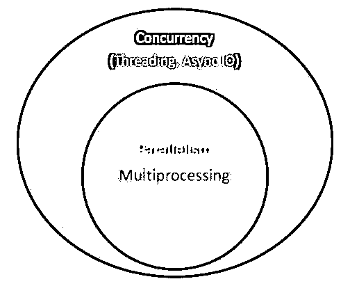

# Python 中的异步 IO:完整演练

> 原文：<https://realpython.com/async-io-python/>

*立即观看**本教程有真实 Python 团队创建的相关视频课程。和书面教程一起看，加深理解: [**动手 Python 3 并发与 asyncio 模块**](/courses/python-3-concurrency-asyncio-module/)

Async IO 是一种并发编程设计，在 Python 中得到了专门的支持，从 Python 3.4 到 3.7 发展迅速，[可能会超过](https://twitter.com/1st1/status/1041855365745455104)。

你可能会恐惧地想，“并发、并行、线程、多处理。已经有很多东西需要理解了。异步 IO 适用于哪里？”

本教程旨在帮助您回答这个问题，让您更牢固地掌握 Python 的异步 IO 方法。

**以下是你将要报道的内容:**

*   异步 IO (async IO) :一种与语言无关的范例(模型)，在许多编程语言中都有实现

*   **`async` / `await`** :两个新的 [Python 关键字](https://realpython.com/python-keywords/)，用于定义协程

*   **`asyncio`** :为运行和管理协程提供基础和 API 的 Python 包

协同程序(专门的生成器函数)是 Python 中异步 IO 的核心，我们稍后将深入研究它们。

**注意**:在本文中，我使用术语**异步 IO** 来表示异步 IO 的语言无关设计，而`asyncio`指的是 Python 包。

在你开始之前，你需要确保你已经设置好使用本教程中的`asyncio`和其他库。

**免费奖励:** [掌握 Python 的 5 个想法](https://realpython.com/bonus/python-mastery-course/)，这是一个面向 Python 开发者的免费课程，向您展示将 Python 技能提升到下一个水平所需的路线图和心态。

## 设置您的环境

您需要 Python 3.7 或更高版本来完整地理解本文，以及`aiohttp`和`aiofiles`包:

```py
$ python3.7 -m venv ./py37async
$ source ./py37async/bin/activate  # Windows: .\py37async\Scripts\activate.bat
$ pip install --upgrade pip aiohttp aiofiles  # Optional: aiodns
```

要获得安装 Python 3.7 和设置虚拟环境的帮助，请查看 [Python 3 安装&设置指南](https://realpython.com/installing-python/)或[虚拟环境入门](https://realpython.com/python-virtual-environments-a-primer/)。

就这样，让我们开始吧。

[*Remove ads*](/account/join/)

## 异步 IO 的 10，000 英尺视角

异步 IO 比它久经考验的表亲多处理和[线程](https://realpython.com/intro-to-python-threading/)更少为人所知。这一节将让您更全面地了解什么是异步 IO，以及它如何适应周围的环境。

### 异步 IO 适合在哪里？

并发性和并行性是不容易深入的扩展主题。虽然本文主要关注异步 IO 及其在 Python 中的实现，但还是有必要花一点时间将异步 IO 与其同类产品进行比较，以便了解异步 IO 如何融入更大的、有时令人眼花缭乱的难题。

**并行**包括同时执行多个操作。**多处理**是一种实现并行的方法，它需要将任务分散到计算机的中央处理单元(CPU 或内核)上。多重处理非常适合 CPU 受限的任务:紧密绑定的 [`for`循环](https://realpython.com/python-for-loop/)和数学计算通常属于这一类。

**并发**是一个比并行稍微宽泛的术语。这表明多个任务能够以重叠的方式运行。(有一种说法是并发并不意味着并行。)

**线程化**是一种并发执行模式，多个[线程](https://en.wikipedia.org/wiki/Thread_(computing))轮流执行任务。一个进程可以包含多个线程。由于其 [GIL](https://realpython.com/python-gil/) ，Python 与线程有着复杂的关系，但这超出了本文的范围。

关于线程，重要的是要知道它更适合 IO 绑定的任务。虽然 CPU 绑定的任务的特点是计算机的内核从头到尾不断努力工作，但 IO 绑定的任务主要是等待输入/输出完成。

综上所述，并发性包括多处理(适用于 CPU 受限的任务)和线程(适用于 IO 受限的任务)。多处理是并行的一种形式，并行是并发的一种特定类型(子集)。Python 标准库通过其`multiprocessing`、`threading`和`concurrent.futures`包为这两个提供了长期的[支持。](https://docs.python.org/3/library/concurrency.html)

现在是时候引入一个新成员了。在过去的几年里，一个独立的设计已经被更全面地构建到 [CPython](https://realpython.com/cpython-source-code-guide/) 中:异步 IO，通过标准库的`asyncio`包和新的`async`和`await`语言关键字来实现。需要明确的是，异步 IO 并不是一个新发明的概念，它已经存在或者正在构建到其他语言和运行时环境中，比如 [Go](https://gobyexample.com/goroutines) 、 [C#](https://docs.microsoft.com/en-us/dotnet/csharp/async) 或者 [Scala](https://docs.scala-lang.org/sips/async.html) 。

Python 文档称`asyncio`包为[编写并发代码](https://docs.python.org/3/library/asyncio.html)的库。但是，异步 IO 不是线程化的，也不是多处理的。它不是建立在这两者之上的。

事实上，async IO 是一个单线程、单进程设计:它使用**协作多任务**，这个术语将在本教程结束时变得更加具体。换句话说，尽管在单个进程中使用单个线程，异步 IO 给人一种并发的感觉。协同程序(异步 IO 的一个核心特性)可以被并发调度，但是它们本身并不是并发的。

重申一下，异步 IO 是并发编程的一种风格，但不是并行。与多处理相比，它与线程更紧密地结合在一起，但与这两者又有很大的不同，它是并发技术中的一个独立成员。

还剩下一个任期。什么东西**异步**是什么意思？这不是一个严格的定义，但是对于我们这里的目的，我可以想到两个属性:

*   异步例程能够在等待最终结果时“暂停”,同时让其他例程运行。
*   [异步代码](https://realpython.com/python-async-features/)，通过上述机制，方便并发执行。换句话说，异步代码提供了并发的外观和感觉。

这里有一个图表，把所有这些放在一起。白色术语代表概念，绿色术语代表实现或影响概念的方式:

[](https://files.realpython.com/media/Screen_Shot_2018-10-17_at_3.18.44_PM.c02792872031.jpg)

我将在这里停止并发编程模型之间的比较。本教程的重点是异步 IO 的子组件，如何使用它，以及围绕它涌现的[API](https://realpython.com/python-api/)。要深入探究线程、多处理和异步 IO，请在这里暂停一下，看看吉姆·安德森的[关于 Python 中并发性的概述](https://realpython.com/python-concurrency/)。吉姆比我有趣得多，而且参加的会议也比我多。

### 异步 IO 解释

异步 IO 初看起来似乎违反直觉，自相矛盾。促进并发代码的东西是如何使用单线程和单 CPU 核的？我从来不擅长编造例子，所以我想借用米格尔·格林伯格 2017 年 [PyCon](https://realpython.com/pycon-guide/) 演讲中的一句话，它非常漂亮地解释了一切:

> 国际象棋大师朱迪特·波尔加主持了一场国际象棋展览，她在展览中与多名业余棋手对弈。她有两种方式进行展览:同步和异步。
> 
> 假设:
> 
> *   24 名反对者
> *   Judit 使每一步棋在 5 秒内移动
> *   每个对手需要 55 秒来移动
> *   游戏平均 30 对棋(总共 60 步)
> 
> **同步版** : Judit 一次玩一个游戏，从不同时玩两个，直到游戏完成。每局游戏花费 *(55 + 5) * 30 == 1800* 秒，即 30 分钟。整个展览需要 *24 * 30 == 720* 分钟，或者 **12 个小时**。
> 
> **异步版** : Judit 从一张桌子移动到另一张桌子，每张桌子移动一次。她离开桌子，让对手在等待时间内进行下一步行动。所有 24 个游戏中的一步棋需要 Judit *24 * 5 == 120* 秒，或者 2 分钟。整个展览现在被缩短到 *120 * 30 == 3600* 秒，或者仅仅 **1 小时**。[(来源)](https://youtu.be/iG6fr81xHKA?t=4m29s)

世界上只有一个朱迪特·波尔加，她只有两只手，一次只能自己做一个动作。但是异步播放将表演时间从 12 小时减少到 1 小时。因此，协作多任务是一种奇特的说法，即程序的事件循环(稍后将详细介绍)与多个任务通信，让每个任务在最佳时间轮流运行。

异步 IO 需要很长的等待时间，否则功能会被阻塞，并允许其他功能在停机期间运行。(一个有效阻塞的函数从它启动的时候到它返回的时候禁止其他函数运行。)

[*Remove ads*](/account/join/)

### 异步 IO 不容易

我听人说过，“能使用异步 IO 就使用异步 IO；必要时使用线程。”事实是，构建持久的多线程代码可能很难，而且容易出错。异步 IO 避免了线程设计中可能遇到的一些潜在的速度障碍。

但这并不是说 Python 中的异步 IO 很容易。注意:当你冒险深入到表面以下时，异步编程也会变得很困难！Python 的异步模型是围绕回调、事件、传输、协议和未来等概念构建的——仅仅是术语就令人生畏。事实上，它的 API 一直在不断变化，这使得它并不容易。

幸运的是，`asyncio`已经发展成熟，它的大部分特性都不再是临时的，同时它的文档也有了很大的改进，一些关于这个主题的优质资源也开始出现。

## `asyncio`包和`async` / `await`包和

现在您已经有了一些异步 IO 设计的背景知识，让我们来探索 Python 的实现。Python 的`asyncio`包(在 Python 3.4 中引入)和它的两个关键字`async`和`await`，服务于不同的目的，但是一起帮助你声明、构建、执行和管理异步代码。

### `async` / `await`语法和本地协程

一句忠告:小心你在互联网上读到的东西。Python 的异步 IO API 从 Python 3.4 到 Python 3.7 发展迅速。一些旧的模式不再被使用，一些最初被禁止的东西现在通过新的引入被允许了。

异步 IO 的核心是协程。协程是 Python 生成器函数的特殊版本。让我们从一个基线定义开始，然后在此基础上继续发展:协程是一个可以在到达`return`之前暂停执行的函数，它可以在一段时间内将控制权间接传递给另一个协程。

稍后，您将更深入地研究如何将传统的生成器改造成协程。目前，了解协程如何工作的最简单方法是开始制作一些。

让我们采用沉浸式方法，编写一些异步 IO 代码。这个简短的程序是异步 IO 的`Hello World`,但对阐明其核心功能大有帮助:

```py
#!/usr/bin/env python3
# countasync.py

import asyncio

async def count():
    print("One")
    await asyncio.sleep(1)
    print("Two")

async def main():
    await asyncio.gather(count(), count(), count())

if __name__ == "__main__":
    import time
    s = time.perf_counter()
    asyncio.run(main())
    elapsed = time.perf_counter() - s
    print(f"{__file__} executed in {elapsed:0.2f} seconds.")
```

当您执行这个文件时，请注意与仅用`def`和`time.sleep()`来定义函数相比看起来有什么不同:

```py
$ python3 countasync.py
One
One
One
Two
Two
Two
countasync.py executed in 1.01 seconds.
```

该输出的顺序是异步 IO 的核心。与每个对`count()`的调用对话是一个单一的事件循环，或协调器。当每个任务到达`await asyncio.sleep(1)`时，该函数对事件循环大喊，并把控制权交还给它，说:“我要睡一秒钟。去吧，同时让其他有意义的事情去做。”

与同步版本相比:

```py
#!/usr/bin/env python3
# countsync.py

import time

def count():
    print("One")
    time.sleep(1)
    print("Two")

def main():
    for _ in range(3):
        count()

if __name__ == "__main__":
    s = time.perf_counter()
    main()
    elapsed = time.perf_counter() - s
    print(f"{__file__} executed in {elapsed:0.2f} seconds.")
```

执行时，顺序和执行时间会有微小但关键的变化:

```py
$ python3 countsync.py
One
Two
One
Two
One
Two
countsync.py executed in 3.01 seconds.
```

虽然使用`time.sleep()`和`asyncio.sleep()`可能看起来很老套，但它们被用作任何涉及等待时间的时间密集型流程的替身。(你能等待的最平凡的事情就是一个基本上什么也不做的`sleep()`电话。)也就是说，`time.sleep()`可以代表任何耗时的阻塞函数调用，而`asyncio.sleep()`则用于代表非阻塞调用(但也需要一些时间来完成)。

正如您将在下一节看到的，等待某事(包括`asyncio.sleep()`)的好处是周围的函数可以暂时将控制权让给另一个更容易立即做某事的函数。相比之下，`time.sleep()`或任何其他阻塞调用都与异步 Python 代码不兼容，因为它会在休眠时间内停止其轨道上的所有东西。

[*Remove ads*](/account/join/)

### 异步 IO 的规则

至此，`async`、`await`的更正式定义以及它们创建的协程函数已经就绪。这一部分有点难懂，但是掌握`async` / `await`是很有用的，所以如果你需要的话可以回到这一部分:

*   语法`async def`引入了一个**本地协程**或者一个**异步生成器**。表达式`async with`和`async for`也是有效的，稍后你会看到它们。

*   关键字`await`将函数控制传递回事件循环。(它暂停周围协程的执行。)如果 Python 在`g()`的范围内遇到了一个`await f()`表达式，这就是`await`告诉事件循环的方式，“暂停`g()`的执行，直到我所等待的东西——即`f()`的结果——被返回。与此同时，让其他事情去运行。”

在代码中，第二个要点大致如下:

```py
async def g():
    # Pause here and come back to g() when f() is ready
    r = await f()
    return r
```

关于何时以及如何使用`async` / `await`，也有一套严格的规则。不管你是还在学习语法还是已经接触过使用`async` / `await`，这些都会很方便:

*   用`async def`引入的函数是协程。它可以使用`await`、`return`或`yield`，但所有这些都是可选的。宣布`async def noop(): pass`有效:

    *   使用`await`和/或`return`创建一个协程函数。要调用一个协程函数，你必须`await`它以得到它的结果。

    *   在`async def`块中使用`yield`不太常见(在 Python 中最近才合法)。这就创建了一个[异步生成器](https://www.python.org/dev/peps/pep-0525/)，用`async for`对其进行迭代。暂时忘掉异步生成器，把注意力集中在协程函数的语法上，协程函数使用了`await`和/或`return`。

    *   任何用`async def`定义的东西都不可以用`yield from`，这样会引出一个 [`SyntaxError`](https://realpython.com/invalid-syntax-python/) 。

*   就像在`def`函数外使用`yield`是一个`SyntaxError`，在`async def`协程外使用`await`是一个`SyntaxError`。您只能在协程程序体中使用`await`。

以下是一些简短的例子，旨在总结上述几条规则:

```py
async def f(x):
    y = await z(x)  # OK - `await` and `return` allowed in coroutines
    return y

async def g(x):
    yield x  # OK - this is an async generator

async def m(x):
    yield from gen(x)  # No - SyntaxError

def m(x):
    y = await z(x)  # Still no - SyntaxError (no `async def` here)
    return y
```

最后，当你使用`await f()`时，要求`f()`是一个可以被[激活的](https://docs.python.org/3/reference/datamodel.html#awaitable-objects)对象。嗯，这不是很有帮助，是吗？现在，只需要知道一个可修改的对象要么是(1)另一个协程，要么是(2)定义一个返回迭代器的`.__await__()` dunder 方法的对象。如果你正在编写一个程序，对于大多数目的来说，你应该只需要担心第一种情况。

这又给我们带来了一个你可能会看到的技术区别:将函数标记为协程的一个老方法是用`@asyncio.coroutine`来修饰一个普通的`def`函数。结果是一个基于**生成器的协程**。自从在 Python 3.5 中使用了`async` / `await`语法以来，这种结构已经过时了。

这两个协程本质上是等价的(都是可调度的)，但是第一个是基于**生成器的**，而第二个是一个**本地协程**:

```py
import asyncio

@asyncio.coroutine
def py34_coro():
    """Generator-based coroutine, older syntax"""
    yield from stuff()

async def py35_coro():
    """Native coroutine, modern syntax"""
    await stuff()
```

如果您自己编写任何代码，为了显式而不是隐式，最好使用本机协程。在 Python 3.10 中，基于生成器的协程将被移除。

在本教程的后半部分，出于解释的目的，我们将讨论基于生成器的协程。引入`async` / `await`的原因是让协程成为 Python 的一个独立特性，可以很容易地与普通的生成器函数区分开来，从而减少模糊性。

不要陷入基于生成器的协程，它们已经被`async`/`await`[故意淘汰](https://www.python.org/dev/peps/pep-0492/#rationale-and-goals)。它们有自己的一套规则(例如，`await`不能用在基于生成器的协程中)，如果你坚持使用`async` / `await`语法，这些规则在很大程度上是不相关的。

事不宜迟，让我们看几个更复杂的例子。

这里有一个异步 IO 如何减少等待时间的例子:给定一个协程`makerandom()`,它不断产生范围在[0，10]内的随机整数，直到其中一个超过一个阈值，您希望让这个协程的多个调用不需要依次等待对方完成。您可以大致遵循上面两个脚本的模式，稍作修改:

```py
#!/usr/bin/env python3
# rand.py

import asyncio
import random

# ANSI colors
c = (
    "\033[0m",   # End of color
    "\033[36m",  # Cyan
    "\033[91m",  # Red
    "\033[35m",  # Magenta
)

async def makerandom(idx: int, threshold: int = 6) -> int:
    print(c[idx + 1] + f"Initiated makerandom({idx}).")
    i = random.randint(0, 10)
    while i <= threshold:
        print(c[idx + 1] + f"makerandom({idx}) == {i} too low; retrying.")
        await asyncio.sleep(idx + 1)
        i = random.randint(0, 10)
    print(c[idx + 1] + f"---> Finished: makerandom({idx}) == {i}" + c[0])
    return i

async def main():
    res = await asyncio.gather(*(makerandom(i, 10 - i - 1) for i in range(3)))
    return res

if __name__ == "__main__":
    random.seed(444)
    r1, r2, r3 = asyncio.run(main())
    print()
    print(f"r1: {r1}, r2: {r2}, r3: {r3}")
```

彩色输出比我能说的多得多，并让您了解这个脚本是如何执行的:

[](https://files.realpython.com/media/asyncio-rand.dffdd83b4256.gif)

<figcaption class="figure-caption text-center">rand.py execution</figcaption>

这个程序使用一个主协程`makerandom()`，并在 3 个不同的输入上同时运行。大多数程序将包含小的、模块化的协程和一个包装函数，该包装函数用于将每个较小的协程链接在一起。 [`main()`](https://realpython.com/python-main-function/) 然后用于通过将中央协程映射到一些可迭代的或池中来收集任务(未来)。

在这个微型示例中，池是`range(3)`。在后面给出的一个更完整的例子中，它是一组需要被并发请求、解析和处理的 URL，并且`main()`封装了每个 URL 的整个例程。

虽然“生成随机整数”(这比任何事情都更受 CPU 限制)可能不是对`asyncio`的最佳选择，但是示例中出现的`asyncio.sleep()`旨在模拟 IO 限制的进程，其中包含不确定的等待时间。例如，`asyncio.sleep()`调用可能代表在消息应用程序中的两个客户端之间发送和接收非随机整数。

[*Remove ads*](/account/join/)

## 异步 IO 设计模式

Async IO 自带一套可能的脚本设计，本节将介绍这些设计。

### 链接协同程序

协程的一个关键特性是它们可以链接在一起。(记住，一个协程对象是可调度的，所以另一个协程可以`await`它。)这允许您将程序分成更小的、可管理的、可回收的协程:

```py
#!/usr/bin/env python3
# chained.py

import asyncio
import random
import time

async def part1(n: int) -> str:
    i = random.randint(0, 10)
    print(f"part1({n}) sleeping for {i} seconds.")
    await asyncio.sleep(i)
    result = f"result{n}-1"
    print(f"Returning part1({n}) == {result}.")
    return result

async def part2(n: int, arg: str) -> str:
    i = random.randint(0, 10)
    print(f"part2{n, arg} sleeping for {i} seconds.")
    await asyncio.sleep(i)
    result = f"result{n}-2 derived from {arg}"
    print(f"Returning part2{n, arg} == {result}.")
    return result

async def chain(n: int) -> None:
    start = time.perf_counter()
    p1 = await part1(n)
    p2 = await part2(n, p1)
    end = time.perf_counter() - start
    print(f"-->Chained result{n} => {p2} (took {end:0.2f} seconds).")

async def main(*args):
    await asyncio.gather(*(chain(n) for n in args))

if __name__ == "__main__":
    import sys
    random.seed(444)
    args = [1, 2, 3] if len(sys.argv) == 1 else map(int, sys.argv[1:])
    start = time.perf_counter()
    asyncio.run(main(*args))
    end = time.perf_counter() - start
    print(f"Program finished in {end:0.2f} seconds.")
```

请仔细注意输出，其中`part1()`休眠的时间长短不一，当结果可用时`part2()`开始处理这些结果:

```py
$ python3 chained.py 9 6 3
part1(9) sleeping for 4 seconds.
part1(6) sleeping for 4 seconds.
part1(3) sleeping for 0 seconds.
Returning part1(3) == result3-1.
part2(3, 'result3-1') sleeping for 4 seconds.
Returning part1(9) == result9-1.
part2(9, 'result9-1') sleeping for 7 seconds.
Returning part1(6) == result6-1.
part2(6, 'result6-1') sleeping for 4 seconds.
Returning part2(3, 'result3-1') == result3-2 derived from result3-1.
-->Chained result3 => result3-2 derived from result3-1 (took 4.00 seconds).
Returning part2(6, 'result6-1') == result6-2 derived from result6-1.
-->Chained result6 => result6-2 derived from result6-1 (took 8.01 seconds).
Returning part2(9, 'result9-1') == result9-2 derived from result9-1.
-->Chained result9 => result9-2 derived from result9-1 (took 11.01 seconds).
Program finished in 11.01 seconds.
```

在这个设置中，`main()`的运行时间将等于它收集和调度的任务的最大运行时间。

### 使用队列

`asyncio`包提供了[队列类](https://docs.python.org/3/library/asyncio-queue.html)，其设计类似于 [`queue`](https://docs.python.org/3/library/queue.html#module-queue) 模块的类。在我们到目前为止的例子中，我们并不真正需要队列结构。在`chained.py`中，每个任务(未来)由一组协同程序组成，这些协同程序显式地相互等待，并通过每个链的单个输入。

还有一种替代结构也可以用于异步 IO:许多相互不关联的生产者将项目添加到队列中。每个生产者可以在交错的、随机的、未通知的时间将多个项目添加到队列中。一群消费者贪婪地从排队的队伍中拉出商品，而不等待任何其他信号。

在这种设计中，没有任何单个消费者与生产者之间的链接。消费者事先不知道生产者的数量，甚至不知道将要添加到队列中的商品的累计数量。

单个生产者或消费者分别花费不同的时间从队列中放入和取出项目。队列作为一种吞吐量，可以与生产者和消费者进行通信，而不需要他们彼此直接对话。

**注意**:由于`queue.Queue()`的线程安全，队列经常在线程化程序中使用，但是当涉及到异步 IO 时，你不需要关心线程安全。(例外情况是当您将两者结合时，但在本教程中不会这样做。)

队列的一个用例(这里就是这样)是队列充当生产者和消费者的传输器，否则生产者和消费者不会直接链接或关联。

这个程序的同步版本看起来相当糟糕:一组阻塞生产者连续地向队列中添加项目，一次一个生产者。只有在所有生产者都完成之后，队列才能被一个消费者一次一个条目地处理。这种设计中有大量的延迟。项目可能会闲置在队列中，而不是被立即拾取和处理。

下面是一个异步版本`asyncq.py`。这个工作流程的挑战部分是，需要给消费者一个信号，表明生产已经完成。否则，`await q.get()`将无限期地挂起，因为队列将被完全处理，但是消费者不会知道生产已经完成。

(非常感谢 StackOverflow [用户](https://stackoverflow.com/a/52615705/7954504)帮助理顺`main()`:关键是`await q.join()`，它会阻塞，直到队列中的所有项目都被接收和处理，然后取消消费者任务，否则它会挂起，并无休止地等待更多队列项目出现。)

以下是完整的脚本:

```py
#!/usr/bin/env python3
# asyncq.py

import asyncio
import itertools as it
import os
import random
import time

async def makeitem(size: int = 5) -> str:
    return os.urandom(size).hex()

async def randsleep(caller=None) -> None:
    i = random.randint(0, 10)
    if caller:
        print(f"{caller} sleeping for {i} seconds.")
    await asyncio.sleep(i)

async def produce(name: int, q: asyncio.Queue) -> None:
    n = random.randint(0, 10)
    for _ in it.repeat(None, n):  # Synchronous loop for each single producer
        await randsleep(caller=f"Producer {name}")
        i = await makeitem()
        t = time.perf_counter()
        await q.put((i, t))
        print(f"Producer {name} added <{i}> to queue.")

async def consume(name: int, q: asyncio.Queue) -> None:
    while True:
        await randsleep(caller=f"Consumer {name}")
        i, t = await q.get()
        now = time.perf_counter()
        print(f"Consumer {name} got element <{i}>"
              f" in {now-t:0.5f} seconds.")
        q.task_done()

async def main(nprod: int, ncon: int):
    q = asyncio.Queue()
    producers = [asyncio.create_task(produce(n, q)) for n in range(nprod)]
    consumers = [asyncio.create_task(consume(n, q)) for n in range(ncon)]
    await asyncio.gather(*producers)
    await q.join()  # Implicitly awaits consumers, too
    for c in consumers:
        c.cancel()

if __name__ == "__main__":
    import argparse
    random.seed(444)
    parser = argparse.ArgumentParser()
    parser.add_argument("-p", "--nprod", type=int, default=5)
    parser.add_argument("-c", "--ncon", type=int, default=10)
    ns = parser.parse_args()
    start = time.perf_counter()
    asyncio.run(main(**ns.__dict__))
    elapsed = time.perf_counter() - start
    print(f"Program completed in {elapsed:0.5f} seconds.")
```

前几个协程是助手函数，返回一个随机字符串、一个小数秒性能计数器和一个随机整数。生产者将 1 到 5 个项目放入队列中。每个条目是一个`(i, t)`的元组，其中`i`是一个随机字符串，`t`是生产者试图将元组放入队列的时间。

当消费者取出一个商品时，它只是使用商品被放入时的时间戳来计算该商品在队列中停留的时间。

请记住，`asyncio.sleep()`是用来模仿其他一些更复杂的协程，如果它是一个常规的阻塞函数，那么它会耗尽时间并阻塞所有其他的执行。

下面是两个生产者和五个消费者的测试运行:

```py
$ python3 asyncq.py -p 2 -c 5
Producer 0 sleeping for 3 seconds.
Producer 1 sleeping for 3 seconds.
Consumer 0 sleeping for 4 seconds.
Consumer 1 sleeping for 3 seconds.
Consumer 2 sleeping for 3 seconds.
Consumer 3 sleeping for 5 seconds.
Consumer 4 sleeping for 4 seconds.
Producer 0 added <377b1e8f82> to queue.
Producer 0 sleeping for 5 seconds.
Producer 1 added <413b8802f8> to queue.
Consumer 1 got element <377b1e8f82> in 0.00013 seconds.
Consumer 1 sleeping for 3 seconds.
Consumer 2 got element <413b8802f8> in 0.00009 seconds.
Consumer 2 sleeping for 4 seconds.
Producer 0 added <06c055b3ab> to queue.
Producer 0 sleeping for 1 seconds.
Consumer 0 got element <06c055b3ab> in 0.00021 seconds.
Consumer 0 sleeping for 4 seconds.
Producer 0 added <17a8613276> to queue.
Consumer 4 got element <17a8613276> in 0.00022 seconds.
Consumer 4 sleeping for 5 seconds.
Program completed in 9.00954 seconds.
```

在这种情况下，项目的处理只需几分之一秒。延迟可能有两个原因:

*   标准，很大程度上不可避免的开销
*   当一个商品出现在队列中时，所有消费者都在睡觉的情况

至于第二个原因，幸运的是，扩展到成百上千的消费者是完全正常的。你用`python3 asyncq.py -p 5 -c 100`应该没问题。这里的要点是，从理论上讲，您可以让不同系统上的不同用户控制生产者和消费者的管理，队列充当中心吞吐量。

到目前为止，您已经看到了三个用`async`和`await`定义的`asyncio`调用协程的相关例子。如果您没有完全理解或者只是想更深入地了解现代协程是如何在 Python 中出现的，那么您可以从下一节开始。

[*Remove ads*](/account/join/)

## 异步 IO 在生成器中的根

前面，您看到了一个旧式的基于生成器的协程的例子，它已经被更显式的本机协程所淘汰。这个例子值得稍微修改一下再展示一下:

```py
import asyncio

@asyncio.coroutine
def py34_coro():
    """Generator-based coroutine"""
    # No need to build these yourself, but be aware of what they are
    s = yield from stuff()
    return s

async def py35_coro():
    """Native coroutine, modern syntax"""
    s = await stuff()
    return s

async def stuff():
    return 0x10, 0x20, 0x30
```

作为一个实验，如果单独调用`py34_coro()`或`py35_coro()`，而不调用`await`，或者不调用`asyncio.run()`或其他`asyncio`的“瓷器”函数，会发生什么？单独调用协程会返回一个协程对象:

>>>

```py
>>> py35_coro()
<coroutine object py35_coro at 0x10126dcc8>
```

从表面上看，这并不有趣。调用协程本身的结果是一个可唤醒的**协程对象**。

该做个小测验了:Python 还有什么类似的特性？(Python 的哪个特性在被单独调用时实际上并没有“做很多事情”？)

希望您正在考虑将**生成器**作为这个问题的答案，因为协程是幕后的增强生成器。在这方面，行为是相似的:

>>>

```py
>>> def gen():
...     yield 0x10, 0x20, 0x30
...
>>> g = gen()
>>> g  # Nothing much happens - need to iterate with `.__next__()`
<generator object gen at 0x1012705e8>
>>> next(g)
(16, 32, 48)
```

碰巧的是，生成器函数是异步 IO 的基础(不管你是否用`async def`而不是旧的`@asyncio.coroutine`包装器来声明协程)。从技术上来说，`await`更类似于`yield from`，而不是`yield`。(但是要记住`yield from x()`只是替换`for i in x(): yield i`的语法糖。)

与异步 IO 相关的生成器的一个关键特性是它们可以有效地随意停止和重启。例如，您可以`break`退出对一个生成器对象的迭代，然后在以后恢复对剩余值的迭代。当一个[发生器函数到达`yield`](https://realpython.com/introduction-to-python-generators/) 时，它产生那个值，但之后它会一直闲置，直到被告知产生它的后续值。

这可以通过一个例子来充实:

>>>

```py
>>> from itertools import cycle
>>> def endless():
...     """Yields 9, 8, 7, 6, 9, 8, 7, 6, ... forever"""
...     yield from cycle((9, 8, 7, 6))

>>> e = endless()
>>> total = 0
>>> for i in e:
...     if total < 30:
...         print(i, end=" ")
...         total += i
...     else:
...         print()
...         # Pause execution. We can resume later.
...         break
9 8 7 6 9 8 7 6 9 8 7 6 9 8

>>> # Resume
>>> next(e), next(e), next(e)
(6, 9, 8)
```

关键字`await`的行为类似，标记一个断点，在这个断点上协程挂起自己，让其他协程工作。“暂停”，在这种情况下，意味着协程已经暂时放弃控制，但没有完全退出或完成。请记住，`yield`以及延伸而来的`yield from`和`await`标志着生成器执行过程中的一个断点。

这是函数和生成器的根本区别。一个函数要么全有，要么全无。一旦开始，它就不会停止，直到碰到一个`return`，然后将那个值推送给调用者(调用它的函数)。另一方面，发电机每次碰到一个`yield`就暂停，不再前进。它不仅能把这个值推到调用栈，而且当你通过调用它的`next()`来恢复它时，它能保持对它的局部变量的控制。

发电机还有第二个不太为人所知的特性也很重要。您也可以通过生成器的`.send()`方法将值发送到生成器中。这允许生成器(和协程)在没有阻塞的情况下互相调用(`await`)。我不会深入研究这个特性的具体细节，因为它主要关系到后台协程的实现，但是您不应该真的需要自己直接使用它。

如果你有兴趣探索更多，你可以从正式引入协程的 [PEP 342](https://www.python.org/dev/peps/pep-0342/) 开始。Brett Cannon 的[在 Python](https://snarky.ca/how-the-heck-does-async-await-work-in-python-3-5/) 中 Async-Await 究竟是如何工作的也是一本好书，关于`asyncio` 的 [PYMOTW 文章也是如此。最后，还有 David Beazley 的](https://pymotw.com/3/asyncio/coroutines.html)[关于协程和并发性的好奇课程](http://www.dabeaz.com/coroutines/)，它深入探究了协程运行的机制。

让我们试着把上面的文章浓缩成几句话:这些协程实际上是通过一种非常规的机制运行的。它们的结果是在调用它们的`.send()`方法时抛出的异常对象的属性。所有这些都有一些不可靠的细节，但它可能不会帮助您在实践中使用这部分语言，所以现在让我们继续。

为了把事情联系在一起，下面是关于协程作为生成器的一些要点:

*   协程是利用生成器方法特性的[再利用生成器](https://www.python.org/dev/peps/pep-0492/#differences-from-generators)。

*   旧的基于生成器的协程使用`yield from`来等待协程结果。本机协程中的现代 Python 语法只是用`await`代替了`yield from`，作为等待协程结果的方式。`await`类似于`yield from`，这样想通常会有所帮助。

*   使用`await`是一个标志断点的信号。它让一个协程暂时中止执行，并允许程序稍后返回。

[*Remove ads*](/account/join/)

### 其他特性:`async for`和异步生成器+理解

除了普通的`async` / `await`，Python 还支持`async for`迭代**异步迭代器**。异步迭代器的目的是让它能够在迭代的每个阶段调用异步代码。

这个概念的自然延伸是一个**异步发电机**。回想一下，您可以在本机协程中使用`await`、`return`或`yield`。在 Python 3.6(通过 PEP 525)中，在协程中使用`yield`成为可能，它引入了异步生成器，目的是允许在同一个协程函数体中使用`await`和`yield`:

>>>

```py
>>> async def mygen(u: int = 10):
...     """Yield powers of 2."""
...     i = 0
...     while i < u:
...         yield 2 ** i
...         i += 1
...         await asyncio.sleep(0.1)
```

最后但同样重要的是，Python 支持**与`async for`的异步理解**。像它的同步表亲一样，这在很大程度上是语法上的糖:

>>>

```py
>>> async def main():
...     # This does *not* introduce concurrent execution
...     # It is meant to show syntax only
...     g = [i async for i in mygen()]
...     f = [j async for j in mygen() if not (j // 3 % 5)]
...     return g, f
...
>>> g, f = asyncio.run(main())
>>> g
[1, 2, 4, 8, 16, 32, 64, 128, 256, 512]
>>> f
[1, 2, 16, 32, 256, 512]
```

这是一个至关重要的区别:**异步生成器和理解都不会使迭代并发**。它们所做的只是提供它们的同步对应物的外观和感觉，但是能够让正在讨论的循环放弃对事件循环的控制，让其他协程运行。

换句话说，异步迭代器和异步生成器并没有被设计成在一个序列或迭代器上同时映射一些函数。它们只是被设计成让封闭的协程允许其他任务轮流执行。只有在使用普通的`for`或`with`会“破坏”协程中`await`的性质的情况下，才需要`async for`和`async with`语句。异步和并发之间的区别是需要把握的关键。

### 事件循环`asyncio.run()`和

您可以将事件循环想象成类似于`while True`循环的东西，它监视协程，获取关于什么是空闲的反馈，并寻找可以同时执行的东西。当一个空闲的协程正在等待的东西变得可用时，它能够唤醒该协程。

到目前为止，事件循环的整个管理都是由一个函数调用隐式处理的:

```py
asyncio.run(main())  # Python 3.7+
```

[`asyncio.run()`](https://github.com/python/cpython/blob/d4c76d960b8b286b75c933780416ace9cda682fd/Lib/asyncio/runners.py#L8) ，Python 3.7 中引入，负责获取事件循环，运行任务直到它们被标记为完成，然后关闭事件循环。

使用`get_event_loop()`有一种更冗长的方式来管理`asyncio`事件循环。典型的模式如下所示:

```py
loop = asyncio.get_event_loop()
try:
    loop.run_until_complete(main())
finally:
    loop.close()
```

在旧的例子中，您可能会看到`loop.get_event_loop()`浮动，但是除非您特别需要对事件循环管理进行微调控制，否则对于大多数程序来说，`asyncio.run()`应该足够了。

如果您确实需要在 Python 程序中与事件循环交互，`loop`是一个很好的老式 Python 对象，它支持用`loop.is_running()`和`loop.is_closed()`进行自省。如果需要更好的控制，你可以操纵它，比如在[中，通过将循环作为参数传递来调度回调](https://docs.python.org/3/library/asyncio-eventloop.html#asyncio-example-lowlevel-helloworld)。

更重要的是理解事件循环背后的机制。关于事件循环，有几点值得强调。

**#1:** 协程在绑定到事件循环之前，不会自己做太多事情。

您之前在关于生成器的解释中已经看到了这一点，但是值得重申一下。如果您有一个等待其他人的主协程，简单地孤立地调用它没有什么效果:

>>>

```py
>>> import asyncio

>>> async def main():
...     print("Hello ...")
...     await asyncio.sleep(1)
...     print("World!")

>>> routine = main()
>>> routine
<coroutine object main at 0x1027a6150>
```

记住使用`asyncio.run()`通过调度`main()`协程(未来对象)在事件循环上执行来实际强制执行:

>>>

```py
>>> asyncio.run(routine)
Hello ...
World!
```

(其他协程可以用`await`执行。典型的做法是将`main()`包装在`asyncio.run()`中，从那里调用带有`await`的链式协同程序。)

**#2:** 默认情况下，异步 IO 事件循环在单个线程和单个 CPU 内核上运行。通常，在一个 CPU 内核中运行一个单线程事件循环就足够了。还可以跨多个内核运行事件循环。查看约翰·里斯在[的演讲，注意你的笔记本电脑可能会自燃。](https://youtu.be/0kXaLh8Fz3k?t=10m30s)

**#3。**事件循环是可插拔的。也就是说，如果您真的愿意，您可以编写自己的事件循环实现，并让它同样运行任务。这在 [`uvloop`](https://github.com/MagicStack/uvloop) 包中得到了很好的演示，它是 Cython 中事件循环的一个实现。

这就是术语“可插拔事件循环”的含义:您可以使用事件循环的任何工作实现，与协程本身的结构无关。`asyncio`包本身附带了[两个不同的事件循环实现](https://docs.python.org/3/library/asyncio-eventloop.html#event-loop-implementations)，默认基于 [`selectors`](https://docs.python.org/3/library/selectors.html#module-selectors) 模块。(第二个实现仅适用于 Windows。)

[*Remove ads*](/account/join/)

## 一个完整的程序:异步请求

你已经走到这一步了，现在是时候开始有趣和无痛的部分了。在本节中，您将使用`aiohttp`构建一个 web 抓取 URL 收集器`areq.py`，这是一个非常快速的异步 HTTP 客户端/服务器框架。(我们只需要客户端部分。)这样的工具可以用来绘制一组站点之间的连接，这些链接形成一个[有向图](https://en.wikipedia.org/wiki/Directed_graph)。

**注意**:你可能想知道为什么 Python 的`requests`包与异步 IO 不兼容。`requests`构建在`urllib3`之上，后者又使用了 Python 的`http`和`socket`模块。

默认情况下，套接字操作是阻塞的。这意味着 Python 不会喜欢`await requests.get(url)`,因为`.get()`不是可盈利的。相比之下，`aiohttp`里几乎所有的东西都是可感知的协程，比如[`session.request()`](https://github.com/aio-libs/aiohttp/blob/508adbb656da2e9ae660da5e98e1e5fa6669a3f4/aiohttp/client.py#L225)[`response.text()`](https://github.com/aio-libs/aiohttp/blob/da75122f6089a250128d2736f2bd88d10e97ca17/aiohttp/client_reqrep.py#L913)。这是一个很棒的包，但是在异步代码中使用`requests`会给自己带来伤害。

高级程序结构将如下所示:

1.  从本地文件中读取一系列 URL，`urls.txt`。

2.  发送对 URL 的 GET 请求并解码结果内容。如果失败，就在那里停下来找一个 URL。

3.  在响应的 HTML 中搜索`href`标签内的 URL。

4.  将结果写入`foundurls.txt`。

5.  尽可能异步并发地完成以上所有工作。(使用`aiohttp`进行请求，使用`aiofiles`进行文件追加。这是非常适合异步 IO 模型的两个主要 IO 示例。)

下面是`urls.txt`的内容。它并不大，主要包含高流量的网站:

```py
$ cat urls.txt
https://regex101.com/
https://docs.python.org/3/this-url-will-404.html
https://www.nytimes.com/guides/
https://www.mediamatters.org/
https://1.1.1.1/
https://www.politico.com/tipsheets/morning-money
https://www.bloomberg.com/markets/economics
https://www.ietf.org/rfc/rfc2616.txt
```

列表中的第二个 URL 应该返回 404 响应，您需要优雅地处理它。如果你运行的是这个程序的扩展版本，你可能需要处理比这更棘手的问题，比如服务器断开和无休止的重定向。

请求本身应该使用单个会话，以利用会话内部连接池的重用。

让我们来看看完整的程序。我们将一步一步地完成以下工作:

```py
#!/usr/bin/env python3
# areq.py

"""Asynchronously get links embedded in multiple pages' HMTL."""

import asyncio
import logging
import re
import sys
from typing import IO
import urllib.error
import urllib.parse

import aiofiles
import aiohttp
from aiohttp import ClientSession

logging.basicConfig(
    format="%(asctime)s  %(levelname)s:%(name)s: %(message)s",
    level=logging.DEBUG,
    datefmt="%H:%M:%S",
    stream=sys.stderr,
)
logger = logging.getLogger("areq")
logging.getLogger("chardet.charsetprober").disabled = True

HREF_RE = re.compile(r'href="(.*?)"')

async def fetch_html(url: str, session: ClientSession, **kwargs) -> str:
    """GET request wrapper to fetch page HTML.

 kwargs are passed to `session.request()`.
 """

    resp = await session.request(method="GET", url=url, **kwargs)
    resp.raise_for_status()
    logger.info("Got response [%s] for URL: %s", resp.status, url)
    html = await resp.text()
    return html

async def parse(url: str, session: ClientSession, **kwargs) -> set:
    """Find HREFs in the HTML of `url`."""
    found = set()
    try:
        html = await fetch_html(url=url, session=session, **kwargs)
    except (
        aiohttp.ClientError,
        aiohttp.http_exceptions.HttpProcessingError,
    ) as e:
        logger.error(
            "aiohttp exception for %s [%s]: %s",
            url,
            getattr(e, "status", None),
            getattr(e, "message", None),
        )
        return found
    except Exception as e:
        logger.exception(
            "Non-aiohttp exception occured: %s", getattr(e, "__dict__", {})
        )
        return found
    else:
        for link in HREF_RE.findall(html):
            try:
                abslink = urllib.parse.urljoin(url, link)
            except (urllib.error.URLError, ValueError):
                logger.exception("Error parsing URL: %s", link)
                pass
            else:
                found.add(abslink)
        logger.info("Found %d links for %s", len(found), url)
        return found

async def write_one(file: IO, url: str, **kwargs) -> None:
    """Write the found HREFs from `url` to `file`."""
    res = await parse(url=url, **kwargs)
    if not res:
        return None
    async with aiofiles.open(file, "a") as f:
        for p in res:
            await f.write(f"{url}\t{p}\n")
        logger.info("Wrote results for source URL: %s", url)

async def bulk_crawl_and_write(file: IO, urls: set, **kwargs) -> None:
    """Crawl & write concurrently to `file` for multiple `urls`."""
    async with ClientSession() as session:
        tasks = []
        for url in urls:
            tasks.append(
                write_one(file=file, url=url, session=session, **kwargs)
            )
        await asyncio.gather(*tasks)

if __name__ == "__main__":
    import pathlib
    import sys

    assert sys.version_info >= (3, 7), "Script requires Python 3.7+."
    here = pathlib.Path(__file__).parent

    with open(here.joinpath("urls.txt")) as infile:
        urls = set(map(str.strip, infile))

    outpath = here.joinpath("foundurls.txt")
    with open(outpath, "w") as outfile:
        outfile.write("source_url\tparsed_url\n")

    asyncio.run(bulk_crawl_and_write(file=outpath, urls=urls))
```

这个脚本比我们最初的玩具程序要长，所以让我们来分解它。

常量`HREF_RE`是一个[正则表达式](https://realpython.com/regex-python/)来提取我们最终要搜索的内容，HTML 中的`href`标签:

>>>

```py
>>> HREF_RE.search('Go to <a href="https://realpython.com/">Real Python</a>')
<re.Match object; span=(15, 45), match='href="https://realpython.com/"'>
```

协程`fetch_html()`是一个 GET 请求的包装器，用于发出请求并解码结果页面 HTML。它发出请求，等待响应，并在非 200 状态的情况下立即引发:

```py
resp = await session.request(method="GET", url=url, **kwargs)
resp.raise_for_status()
```

如果状态正常，`fetch_html()`返回页面 HTML (a `str`)。值得注意的是，这个函数中没有异常处理。逻辑是将该异常传播给调用者，并让它在那里得到处理:

```py
html = await resp.text()
```

我们称之为`await` `session.request()`和`resp.text()`是因为它们是聪明的协程。否则，请求/响应周期将是应用程序中长尾的、占用时间的部分，但是有了异步 IO，`fetch_html()`让事件循环处理其他现成的工作，比如解析和写入已经获取的 URL。

协程链中的下一个是`parse()`，它在`fetch_html()`上等待一个给定的 URL，然后从该页面的 HTML 中提取所有的`href`标签，确保每个标签都是有效的，并将其格式化为一个绝对路径。

不可否认的是，`parse()`的第二部分是阻塞的，但是它包括一个快速的正则表达式匹配，并确保发现的链接成为绝对路径。

在这种特定的情况下，这个同步代码应该快速且不显眼。但是请记住，给定协程中的任何一行都会阻塞其他协程，除非该行使用了`yield`、`await`或`return`。如果解析是一个更密集的过程，您可能想考虑用 [`loop.run_in_executor()`](https://docs.python.org/3/library/asyncio-eventloop.html#executing-code-in-thread-or-process-pools) 在它自己的过程中运行这个部分。

接下来，协程`write()`获取一个文件对象和一个 URL，并等待`parse()`返回一个解析后的 URL 的`set`，通过使用`aiofiles`(一个用于异步文件 IO 的包)将每个 URL 与其源 URL 一起异步写入文件。

最后，`bulk_crawl_and_write()`作为脚本协程链的主要入口点。它使用单个会话，并为最终从`urls.txt`读取的每个 URL 创建一个任务。

以下是值得一提的几点:

*   默认的`ClientSession`有一个[适配器](https://aiohttp.readthedocs.io/en/stable/client_reference.html#connectors)，最多有 100 个开放连接。要改变这一点，可以将一个`asyncio.connector.TCPConnector`的实例传递给`ClientSession`。您还可以基于每个主机指定限制。

*   您可以为整个会话和单个请求指定最大[超时](https://aiohttp.readthedocs.io/en/stable/client_quickstart.html#timeouts)。

*   这个脚本还使用了`async with`，它与一个[异步上下文管理器](https://www.python.org/dev/peps/pep-0492/#asynchronous-context-managers-and-async-with)一起工作。我没有用一整节的篇幅来介绍这个概念，因为从同步到异步上下文管理器的转换相当简单。后者必须定义`.__aenter__()`和`.__aexit__()`，而不是`.__exit__()`和`.__enter__()`。正如您所料，`async with`只能在用`async def`声明的协程函数中使用。

如果你想了解更多，GitHub 上的本教程的[伴随文件](https://github.com/realpython/materials/tree/master/asyncio-walkthrough)也附带了注释和文档字符串。

下面是执行的全部荣耀，因为`areq.py`在不到一秒的时间内获取、解析和保存 9 个 URL 的结果:

```py
$ python3 areq.py
21:33:22 DEBUG:asyncio: Using selector: KqueueSelector
21:33:22 INFO:areq: Got response [200] for URL: https://www.mediamatters.org/
21:33:22 INFO:areq: Found 115 links for https://www.mediamatters.org/
21:33:22 INFO:areq: Got response [200] for URL: https://www.nytimes.com/guides/
21:33:22 INFO:areq: Got response [200] for URL: https://www.politico.com/tipsheets/morning-money
21:33:22 INFO:areq: Got response [200] for URL: https://www.ietf.org/rfc/rfc2616.txt
21:33:22 ERROR:areq: aiohttp exception for https://docs.python.org/3/this-url-will-404.html [404]: Not Found
21:33:22 INFO:areq: Found 120 links for https://www.nytimes.com/guides/
21:33:22 INFO:areq: Found 143 links for https://www.politico.com/tipsheets/morning-money
21:33:22 INFO:areq: Wrote results for source URL: https://www.mediamatters.org/
21:33:22 INFO:areq: Found 0 links for https://www.ietf.org/rfc/rfc2616.txt
21:33:22 INFO:areq: Got response [200] for URL: https://1.1.1.1/
21:33:22 INFO:areq: Wrote results for source URL: https://www.nytimes.com/guides/
21:33:22 INFO:areq: Wrote results for source URL: https://www.politico.com/tipsheets/morning-money
21:33:22 INFO:areq: Got response [200] for URL: https://www.bloomberg.com/markets/economics
21:33:22 INFO:areq: Found 3 links for https://www.bloomberg.com/markets/economics
21:33:22 INFO:areq: Wrote results for source URL: https://www.bloomberg.com/markets/economics
21:33:23 INFO:areq: Found 36 links for https://1.1.1.1/
21:33:23 INFO:areq: Got response [200] for URL: https://regex101.com/
21:33:23 INFO:areq: Found 23 links for https://regex101.com/
21:33:23 INFO:areq: Wrote results for source URL: https://regex101.com/
21:33:23 INFO:areq: Wrote results for source URL: https://1.1.1.1/
```

那还不算太寒酸！作为健全性检查，您可以检查输出的行数。在我的例子中，它是 626，但请记住这可能会有波动:

```py
$ wc -l foundurls.txt
 626 foundurls.txt

$ head -n 3 foundurls.txt
source_url  parsed_url
https://www.bloomberg.com/markets/economics https://www.bloomberg.com/feedback
https://www.bloomberg.com/markets/economics https://www.bloomberg.com/notices/tos
```

**下一步**:如果你想提高赌注，让这个网络爬虫[递归](https://realpython.com/python-thinking-recursively/)。您可以使用 [`aio-redis`](https://github.com/aio-libs/aioredis) 来跟踪树中哪些 URL 已经被抓取，以避免请求它们两次，并使用 Python 的`networkx`库连接链接。

记得态度好一点。发送 1000 个并发请求到一个小的、没有戒心的网站是非常糟糕的。有一些方法可以限制一个批处理中并发请求的数量，比如使用`asyncio`的 [sempahore](https://stackoverflow.com/q/40836800/7954504) 对象，或者使用像这样的模式[。如果您不注意这个警告，您可能会得到大量的`TimeoutError`异常，最终只会损害您自己的程序。](https://www.artificialworlds.net/blog/2017/05/31/python-3-large-numbers-of-tasks-with-limited-concurrency/)

[*Remove ads*](/account/join/)

## 上下文中的异步 IO

现在您已经看到了大量的代码，让我们退后一分钟，考虑一下什么时候异步 IO 是理想的选择，以及如何进行比较以得出结论，或者选择不同的并发模型。

### 何时以及为什么异步 IO 是正确的选择？

本教程不是一篇关于异步 IO、线程和多处理的长篇论文。然而，了解异步 IO 何时可能是三者中的最佳选择是很有用的。

异步 IO 与多处理之间的战争实际上根本不是一场战争。事实上，它们可以被[用在演唱会](https://youtu.be/0kXaLh8Fz3k?t=10m30s)上。如果你有多个相当一致的 CPU 受限任务(一个很好的例子是在库`scikit-learn`或`keras`中的[网格搜索](http://scikit-learn.org/stable/modules/grid_search.html#parallelism)，多处理应该是一个明显的选择。

如果所有的函数都使用阻塞调用，那么简单地在每个函数前面放上`async`并不是一个好主意。(这实际上会降低代码的速度。)但是如前所述，有些地方异步 IO 和多处理可以和谐共存。

异步 IO 和线程之间的竞争更加直接。我在介绍中提到“线程很难。”完整的故事是，即使在线程似乎很容易实现的情况下，由于竞争条件和内存使用等原因，它仍然可能导致臭名昭著的无法跟踪的错误。

线程化的扩展性也不如异步 IO，因为线程是一种可用性有限的系统资源。创建数千个线程在很多机器上会失败，我不建议一开始就尝试。创建数千个异步 IO 任务是完全可行的。

当您有多个 IO 绑定任务时，异步 IO 会大放异彩，否则这些任务会受到阻塞 IO 绑定等待时间的支配，例如:

*   网络 IO，不管你的程序是服务器端还是客户端

*   无服务器设计，如点对点、多用户网络，如群组聊天室

*   在读/写操作中，您希望模仿“一劳永逸”的风格，但不太担心锁定您正在读取和写入的内容

不使用它的最大原因是`await`只支持定义一组特定方法的一组特定对象。如果您想对某个 DBMS 进行异步读取操作，您不仅需要为该 DBMS 找到一个 Python 包装器，还需要找到一个支持`async` / `await`语法的包装器。包含同步调用的协同程序会阻止其他协同程序和任务运行。

关于使用`async` / `await`的库列表，请参见本教程末尾的[列表](#libraries-that-work-with-asyncawait)。

### 是异步 IO，但是是哪一个呢？

本教程关注异步 IO、`async` / `await`语法，以及使用`asyncio`进行事件循环管理和指定任务。`asyncio`肯定不是唯一的异步 IO 库。Nathaniel J. Smith 的观察说明了很多问题:

> 再过几年，`asyncio`可能会发现自己沦为精明的开发人员避免使用的 stdlib 库之一，比如`urllib2`。
> 
> …
> 
> 实际上，我所争论的是`asyncio`是它自身成功的受害者:当它被设计时，它使用了最好的方法；但从那以后，受`asyncio`启发的工作——比如增加了`async`/`await`——已经改变了局面，以便我们可以做得更好，而现在`asyncio`被它早先的承诺束缚住了手脚。[(来源)](https://vorpus.org/blog/some-thoughts-on-asynchronous-api-design-in-a-post-asyncawait-world/)

为此，一些知名的替代产品做了`asyncio`所做的事情，尽管使用不同的 API 和不同的方法，它们是 [`curio`](https://github.com/dabeaz/curio) 和 [`trio`](https://github.com/python-trio/trio) 。就我个人而言，我认为如果你正在构建一个中等规模、简单明了的程序，仅仅使用`asyncio`就足够了，也是可以理解的，并且可以让你避免在 Python 的标准库之外添加另一个大的依赖项。

但是无论如何，看看`curio`和`trio`，你可能会发现它们以一种对用户来说更直观的方式完成了同样的事情。这里提出的许多与包无关的概念也应该渗透到可选的异步 IO 包中。

## 零零碎碎的东西

在接下来的几个部分中，你将会涉及到`asyncio`和`async` / `await`的一些杂七杂八的部分，这些部分到目前为止还没有完全融入到教程中，但是对于构建和理解一个完整的程序仍然很重要。

### 其他顶级`asyncio`功能

除了`asyncio.run()`，你已经看到了一些其他的包级函数，比如`asyncio.create_task()`和`asyncio.gather()`。

您可以使用`create_task()`来调度协程对象的执行，后面跟着`asyncio.run()`:

>>>

```py
>>> import asyncio

>>> async def coro(seq) -> list:
...     """'IO' wait time is proportional to the max element."""
...     await asyncio.sleep(max(seq))
...     return list(reversed(seq))
...
>>> async def main():
...     # This is a bit redundant in the case of one task
...     # We could use `await coro([3, 2, 1])` on its own
...     t = asyncio.create_task(coro([3, 2, 1]))  # Python 3.7+
...     await t
...     print(f't: type {type(t)}')
...     print(f't done: {t.done()}')
...
>>> t = asyncio.run(main())
t: type <class '_asyncio.Task'>
t done: True
```

这种模式有一个微妙之处:如果你没有在`main()`内`await t`，它可能会在`main()`发出完成信号之前完成。因为`asyncio.run(main())` [调用`loop.run_until_complete(main())`](https://github.com/python/cpython/blob/7e18deef652a9d413d5dbd19d61073ba7eb5460e/Lib/asyncio/runners.py#L43) ，事件循环只关心`main()`是否完成(没有`await t`出现)，而不是在`main()`内创建的任务是否完成。没有`await t`，循环的其他任务[将被取消](https://github.com/python/cpython/blob/7e18deef652a9d413d5dbd19d61073ba7eb5460e/Lib/asyncio/runners.py#L46)，可能在它们完成之前。如果您需要获得当前待定任务的列表，您可以使用`asyncio.Task.all_tasks()`。

**注意** : `asyncio.create_task()`是 Python 3.7 中引入的。在 Python 3.6 或更低版本中，用`asyncio.ensure_future()`代替`create_task()`。

另外，还有`asyncio.gather()`。虽然它没有做什么特别的事情，但是`gather()`的目的是将一组协程(未来)整齐地放入一个单一的未来中。结果，它返回一个单一的 future 对象，并且，如果您`await asyncio.gather()`并指定多个任务或协程，您将等待它们全部完成。(这与我们之前的例子中的`queue.join()`有些相似。)结果`gather()`将是输入的结果列表:

>>>

```py
>>> import time
>>> async def main():
...     t = asyncio.create_task(coro([3, 2, 1]))
...     t2 = asyncio.create_task(coro([10, 5, 0]))  # Python 3.7+
...     print('Start:', time.strftime('%X'))
...     a = await asyncio.gather(t, t2)
...     print('End:', time.strftime('%X'))  # Should be 10 seconds
...     print(f'Both tasks done: {all((t.done(), t2.done()))}')
...     return a
...
>>> a = asyncio.run(main())
Start: 16:20:11
End: 16:20:21
Both tasks done: True
>>> a
[[1, 2, 3], [0, 5, 10]]
```

您可能已经注意到,`gather()`等待您传递的 Futures 或 coroutines 的整个结果集。或者，您可以在`asyncio.as_completed()`上循环，按照任务完成的顺序获取任务。该函数返回一个迭代器，在任务完成时产生任务。下面，`coro([3, 2, 1])`的结果将在`coro([10, 5, 0])`完成之前可用，而`gather()`的情况并非如此:

>>>

```py
>>> async def main():
...     t = asyncio.create_task(coro([3, 2, 1]))
...     t2 = asyncio.create_task(coro([10, 5, 0]))
...     print('Start:', time.strftime('%X'))
...     for res in asyncio.as_completed((t, t2)):
...         compl = await res
...         print(f'res: {compl} completed at {time.strftime("%X")}')
...     print('End:', time.strftime('%X'))
...     print(f'Both tasks done: {all((t.done(), t2.done()))}')
...
>>> a = asyncio.run(main())
Start: 09:49:07
res: [1, 2, 3] completed at 09:49:10
res: [0, 5, 10] completed at 09:49:17
End: 09:49:17
Both tasks done: True
```

最后，你可能还会看到`asyncio.ensure_future()`。您应该很少需要它，因为它是一个底层的管道 API，并且大部分被稍后介绍的`create_task()`所取代。

[*Remove ads*](/account/join/)

### `await`的优先顺序

虽然它们的行为有些相似，但关键字`await`的优先级明显高于`yield`。这意味着，因为它被更紧密地绑定，所以在很多情况下，在`yield from`语句中需要括号，而在类似的`await`语句中不需要。更多信息，参见 PEP 492 中`await`表达式的[示例。](https://www.python.org/dev/peps/pep-0492/#examples-of-await-expressions)

## 结论

你现在可以使用`async` / `await`和基于它构建的库了。以下是你所学内容的回顾:

*   异步 IO 是一种与语言无关的模型，也是一种通过让协程相互间接通信来实现并发的方式

*   Python 新的`async`和`await`关键字的细节，用于标记和定义协程

*   `asyncio`，提供运行和管理协程的 API 的 Python 包

## 资源

### Python 版本细节

Python 中的异步 IO 发展迅速，很难跟踪什么时候出现了什么。这里列出了与`asyncio`相关的 Python 小版本变化和介绍:

*   3.3:`yield from`表达式允许发电机委托。

*   3.4: `asyncio`以临时 API 状态引入 Python 标准库中。

*   3.5: `async`和`await`成为 Python 语法的一部分，用于表示和等待协程。它们还不是保留关键字。(你仍然可以定义名为`async`和`await`的函数或变量。)

*   3.6:引入了异步生成器和异步理解。`asyncio`的 API 被声明为稳定的而非临时的。

*   3.7: `async`和`await`成为保留关键字。(它们不能用作标识符。)他们打算取代`asyncio.coroutine()`装潢师。`asyncio.run()`被引入到`asyncio`包中，在[之外还有一堆其他的特性](https://docs.python.org/3/whatsnew/3.7.html#whatsnew37-asyncio)。

如果你想要安全(并且能够使用`asyncio.run()`)，就使用 Python 3.7 或更高版本来获得全套特性。

### 文章

以下是额外资源的精选列表:

*   真正的 Python: [用并发加速你的 Python 程序](https://realpython.com/python-concurrency/)
*   真正的 Python: [什么是 Python 全局解释器锁？](https://realpython.com/python-gil/)
*   CPython:`asyncio`包[来源](https://github.com/python/cpython/tree/master/Lib/asyncio)
*   Python 文档:[数据模型>协程](https://docs.python.org/3/reference/datamodel.html#coroutines)
*   talk Python:[Python 中的异步技术和例子](https://training.talkpython.fm/courses/details/async-in-python-with-threading-and-multiprocessing)
*   Brett Cannon: [在 Python 3.5 中，Async-Await 到底是如何工作的？](https://snarky.ca/how-the-heck-does-async-await-work-in-python-3-5/)
*   PYMOTW: [`asyncio`](https://pymotw.com/3/asyncio/)
*   A.杰西·德维斯和吉多·范·罗苏姆:[一个带有异步协同程序的网络爬虫](http://aosabook.org/en/500L/a-web-crawler-with-asyncio-coroutines.html)
*   安迪·皮尔斯:[Python 协程的状态:`yield from`](http://www.andy-pearce.com/blog/posts/2016/Jun/the-state-of-python-coroutines-yield-from/)
*   Nathaniel J. Smith: [关于后`async` / `await`世界](https://vorpus.org/blog/some-thoughts-on-asynchronous-api-design-in-a-post-asyncawait-world/)中异步 API 设计的一些想法
*   阿明·罗纳彻:[我不懂 Python 的 Asyncio](http://lucumr.pocoo.org/2016/10/30/i-dont-understand-asyncio/)
*   安迪·巴兰:[系列上`asyncio`](http://www.artificialworlds.net/blog/2017/05/31/basic-ideas-of-python-3-asyncio-concurrency/) (四贴)
*   堆栈溢出:`async` - `await`函数中的 [Python `asyncio.semaphore`](https://stackoverflow.com/q/40836800/7954504)
*   耶雷·迪亚兹:
    *   [面向 Python 开发人员的 AsyncIO】](https://hackernoon.com/asyncio-for-the-working-python-developer-5c468e6e2e8e)
    *   [Asyncio 协程模式:超越`await`](https://medium.com/python-pandemonium/asyncio-coroutine-patterns-beyond-await-a6121486656f)

几个 Python *新特性*部分更详细地解释了语言变化背后的动机:

*   [Python 3.3 的新特性](https://docs.python.org/3/whatsnew/3.3.html#pep-380) ( `yield from`和 PEP 380)
*   Python 3.6 的新特性 (PEP 525 & 530)

来自大卫·比兹利:

*   [生成器:系统程序员的窍门](http://www.dabeaz.com/generators/)
*   [一个关于协程和并发的奇怪课程](http://www.dabeaz.com/coroutines/)
*   [发电机:最后的边界](http://dabeaz.com/finalgenerator/index.html)

YouTube 会谈:

*   [约翰·里斯——用 AsyncIO 和多处理技术思考 GIL 之外的世界——PyCon 2018](https://youtu.be/0kXaLh8Fz3k)
*   [主题演讲 David Beazley -感兴趣的话题(Python Asyncio)](https://youtu.be/ZzfHjytDceU)
*   [David Beazley - Python 从头开始并发:直播！- PyCon 2015](https://youtu.be/MCs5OvhV9S4)
*   [Raymond Hettinger，关于并发性的主题演讲，PyBay 2017](https://youtu.be/9zinZmE3Ogk)
*   [思考并发性，Python 核心开发人员 Raymond Hettinger](https://youtu.be/Bv25Dwe84g0)
*   [Miguel Grinberg 异步 Python for the Complete 初学者 PyCon 2017](https://youtu.be/iG6fr81xHKA)
*   [Yury Selivanov asyn cait 和 asyncio 在 Python 3 6 及以后的 PyCon 2017](https://youtu.be/2ZFFv-wZ8_g)
*   《异步中的恐惧和等待:通往协程之梦核心的野蛮之旅》
*   什么是异步，它是如何工作的，我应该在什么时候使用它？(2014 年 APAC PyCon)

### 相关 pep

| 精力 | 创建日期 |
| --- | --- |
| [PEP 342–通过增强生成器的协同程序](https://www.python.org/dev/peps/pep-0342/) | 2005-05 |
| [PEP 380–委托给子发电机的语法](https://www.python.org/dev/peps/pep-0380/) | 2009-02 |
| [PEP 3153–异步 IO 支持](https://www.python.org/dev/peps/pep-3153/) | 2011-05 |
| [PEP 3156–异步 io 支持重启:“异步 IO”模块](https://www.python.org/dev/peps/pep-3156/) | 2012-12 |
| [PEP 492–具有异步和等待语法的协同程序](https://www.python.org/dev/peps/pep-0492/) | 2015-04 |
| [PEP 525–异步发电机](https://www.python.org/dev/peps/pep-0525/) | 2016-07 |
| [PEP 530–异步理解](https://www.python.org/dev/peps/pep-0530/) | 2016-09 |

[*Remove ads*](/account/join/)

### 与`async` / `await` 一起工作的库

从 [aio-libs](https://github.com/aio-libs) :

*   [`aiohttp`](https://github.com/aio-libs/aiohttp) :异步 HTTP 客户端/服务器框架
*   [`aioredis`](https://github.com/aio-libs/aioredis) :异步 IO 重定向支持
*   [`aiopg`](https://github.com/aio-libs/aiopg) :异步 IO PostgreSQL 支持
*   [`aiomcache`](https://github.com/aio-libs/aiomcache) :异步 IO memcached 客户端
*   [`aiokafka`](https://github.com/aio-libs/aiokafka) :异步 IO Kafka 客户端
*   [`aiozmq`](https://github.com/aio-libs/aiozmq) :异步 IO ZeroMQ 支持
*   [`aiojobs`](https://github.com/aio-libs/aiojobs) :管理后台任务的作业调度器
*   [`async_lru`](https://github.com/aio-libs/async_lru) :简单的 [LRU 缓存](https://realpython.com/lru-cache-python/)用于异步 IO

从 [magicstack](https://magic.io/) :

*   [`uvloop`](https://github.com/MagicStack/uvloop) :超快速异步 IO 事件循环
*   [`asyncpg`](https://github.com/MagicStack/asyncpg) :(也很快)异步 IO PostgreSQL 支持

从其他主机:

*   [`trio`](https://github.com/python-trio/trio) :更友好的`asyncio`意在展示一种彻底简单的设计
*   [`aiofiles`](https://github.com/Tinche/aiofiles) :异步文件 IO
*   [`asks`](https://github.com/theelous3/asks) :异步请求——类似 http 库
*   [`asyncio-redis`](https://github.com/jonathanslenders/asyncio-redis) :异步 IO 重定向支持
*   [`aioprocessing`](https://github.com/dano/aioprocessing) :集成`multiprocessing`模块和`asyncio`
*   [`umongo`](https://github.com/Scille/umongo) :异步 IO MongoDB 客户端
*   [`unsync`](https://github.com/alex-sherman/unsync) :不同步`asyncio`
*   [`aiostream`](https://github.com/vxgmichel/aiostream) :类似`itertools`，但异步

*立即观看**本教程有真实 Python 团队创建的相关视频课程。和书面教程一起看，加深理解: [**动手 Python 3 并发与 asyncio 模块**](/courses/python-3-concurrency-asyncio-module/)************