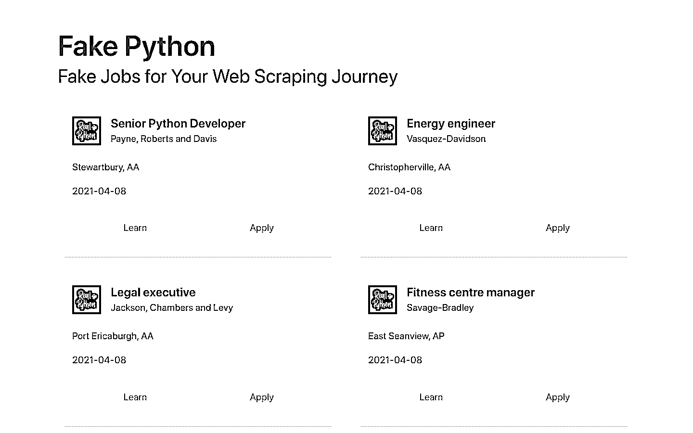
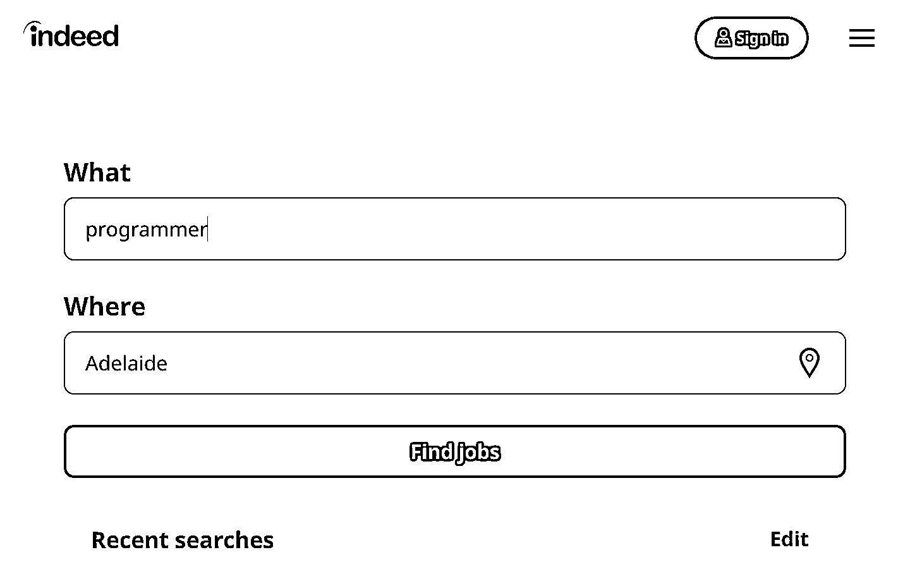
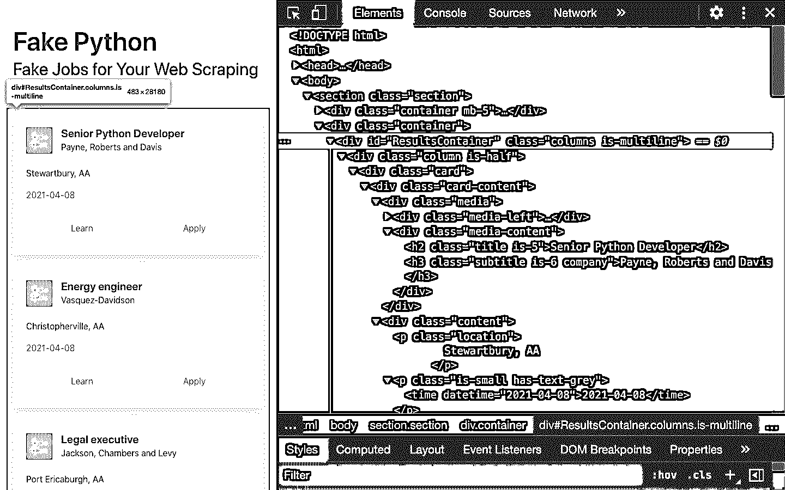

# 美汤:用 Python 构建 Web 刮刀

> 原文：<https://realpython.com/beautiful-soup-web-scraper-python/>

*立即观看**本教程有真实 Python 团队创建的相关视频课程。和写好的教程一起看，加深理解: [**网刮用美汤和 Python**](/courses/web-scraping-beautiful-soup/)

互联网上令人难以置信的大量数据对于任何研究领域或个人兴趣来说都是丰富的资源。为了有效地收集数据，你需要熟练掌握[](https://realpython.com/python-web-scraping-practical-introduction/)**。Python 库`requests`和 Beautiful Soup 是这项工作的强大工具。如果你喜欢通过动手的例子来学习，并且对 Python 和 HTML 有基本的了解，那么这个教程就是为你准备的。*

***在本教程中，您将学习如何:**

*   解密编码在**URL**中的数据
*   使用`requests`和美汤**从网络上抓取和解析数据**
*   从头到尾遍历一条**网页抓取管道**
*   构建一个脚本,从网络上获取工作机会，并在你的控制台上显示相关信息

通过这个项目的工作，你将获得在万维网上抓取任何静态网站所需的过程和工具的知识。您可以点击下面的链接下载项目源代码:

**获取示例代码:** [单击此处获取示例代码，您将在本教程的项目和示例中使用](https://realpython.com/bonus/beautiful-soup/)。

我们开始吧！

## 什么是网页抓取？

网络搜集是从互联网上收集信息的过程。甚至复制粘贴你最喜欢的歌曲的歌词也是一种网络抓取的形式！然而，“网络搜集”这个词通常指的是一个涉及自动化的过程。[一些网站不喜欢自动抓取器收集他们的数据](https://realpython.com/podcasts/rpp/12/)，而另一些网站则不介意。

如果你是出于教育目的而刮一页，那么你不太可能有任何问题。尽管如此，在你开始一个大规模项目之前，自己做一些调查，确保你没有违反任何服务条款是个好主意。

[*Remove ads*](/account/join/)

### 抓取网页的原因

假设你在网上和现实生活中都是一名冲浪者，你正在找工作。然而，你不是在找一份简单的工作。有了冲浪者的心态，你就在等待一个绝佳的机会来冲浪！

有一个求职网站正好提供你想要的工作种类。不幸的是，一个新的职位千载难逢，而且该网站不提供电子邮件通知服务。你想每天检查一下，但这听起来并不是最有趣和最有成效的消磨时间的方式。

值得庆幸的是，世界提供了其他方式来应用冲浪者的心态！不用每天查看工作网站，你可以使用 Python 来帮助自动化你的工作搜索的重复部分。**自动网页抓取**可以是一个加快数据收集过程的解决方案。你写一次你的代码，它会多次从很多页面获取你想要的信息。

相比之下，当您尝试手动获取想要的信息时，您可能会花费大量时间点击、滚动和搜索，尤其是当您需要来自定期更新新内容的网站的大量数据时。手动抓取网页会花费很多时间和重复。

网络上有如此多的信息，而且新的信息还在不断增加。您可能会对至少其中一些数据感兴趣，而且其中大部分都是现成的。无论你实际上是在找工作，还是想下载你最喜欢的艺术家的所有歌词，自动网络抓取都可以帮助你实现目标。

### 网络抓取的挑战

网络是从许多来源有机地发展起来的。它结合了许多不同的技术、风格和个性，并且一直发展到今天。换句话说，网络是一团糟！因此，在浏览网页时，你会遇到一些挑战:

*   **品种:**每个网站都不一样。虽然你会遇到重复出现的一般结构，但每个网站都是独一无二的，如果你想提取相关信息，就需要进行个性化处理。

*   **持久性:**网站不断变化。假设你已经建立了一个闪亮的新的网页抓取工具，它可以自动从你感兴趣的资源中挑选你想要的。你第一次[运行你的脚本](https://realpython.com/run-python-scripts/)时，它运行得完美无缺。但是当你不久之后运行同样的脚本时，你会遇到令人沮丧的冗长的[回溯栈](https://realpython.com/python-traceback/)！

不稳定的脚本是一个现实的场景，因为许多网站正在积极发展。一旦站点的结构改变了，你的抓取器可能就不能正确地导航站点地图或者找到相关的信息。好消息是，网站的许多变化都是小而渐进的，所以你很可能只需做最小的调整就能更新你的 scraper。

然而，请记住，由于互联网是动态的，您将构建的抓取器可能需要不断的维护。您可以设置[持续集成](https://realpython.com/python-continuous-integration/)来定期运行抓取测试，以确保您的主脚本不会在您不知情的情况下中断。

### 网络抓取的替代方案:API

一些网站提供商提供[应用编程接口(API)](https://realpython.com/python-api/)，允许你以预定义的方式访问他们的数据。使用 API，您可以避免解析 HTML。相反，你可以使用像 [JSON](https://realpython.com/python-json/) 和 XML 这样的格式直接访问数据。HTML 主要是一种向用户可视化展示内容的方式。

当您使用 API 时，这个过程通常比通过 web 抓取收集数据更稳定。这是因为开发人员创建的 API 是供程序使用的，而不是供人眼使用的。

一个网站的前端表现可能会经常改变，但是网站设计的这种改变不会影响它的 API 结构。API 的结构通常更持久，这意味着它是站点数据的更可靠来源。

然而，API*也可以*改变。多样性和持久性的挑战既适用于 API，也适用于网站。此外，如果所提供的文档缺乏质量，自己检查 API 的结构会困难得多。

使用 API 收集信息所需的方法和工具超出了本教程的范围。要了解更多信息，请查看 Python 中的 [API 集成。](https://realpython.com/api-integration-in-python/)

## 刮假 Python 作业现场

在本教程中，您将构建一个 web scraper，从[假 Python Jobs](https://realpython.github.io/fake-jobs/) 站点获取 Python 软件开发人员职位列表。这是一个有虚假招聘信息的示例网站，你可以随意抓取来训练你的技能。您的 web scraper 将解析网站上的 HTML，挑选出相关的信息，并针对特定的单词过滤内容。

**注意:**本教程的前一个版本侧重于抓取[怪物](https://www.monster.com)工作板，它已经改变，不再提供静态 HTML 内容。本教程的更新版本侧重于一个自托管的静态网站，它保证保持不变，并给你一个可靠的操场来练习你需要的网络抓取技能。

你可以从网上任何一个你能看到的网站上刮下来，但是这样做的难度取决于网站。本教程向您介绍了网页抓取，以帮助您了解整个过程。然后，你可以对每个你想抓取的网站应用同样的过程。

在整个教程中，你还会遇到一些**练习块**。您可以单击展开它们，并通过完成其中描述的任务来挑战自己。

[*Remove ads*](/account/join/)

## 步骤 1:检查你的数据源

在你写任何 Python 代码之前，你需要了解你想要抓取的网站。这应该是你想要解决的任何网络抓取项目的第一步。你需要了解网站的结构来提取对你有用的信息。首先用你最喜欢的浏览器打开你想要抓取的网站。

### 浏览网站

就像任何一个典型的求职者一样，点击网站并与之互动。例如，您可以滚动浏览网站的主页:

[](https://files.realpython.com/media/bs4-fake-python-index.b76716592442.png)

可以看到很多卡片格式的招聘信息，每个都有两个按钮。如果您点击*应用*，那么您将看到一个新页面，其中包含所选工作的更多详细描述。您可能还会注意到，当您与网站交互时，浏览器地址栏中的 URL 会发生变化。

### 破译 URL 中的信息

程序员可以在一个 URL 中编码很多信息。如果你先熟悉了 URL 的工作原理以及它们是由什么组成的，你的网络抓取之旅会容易得多。例如，您可能会发现自己在具有以下 URL 的详细信息页面上:

```py
https://realpython.github.io/fake-jobs/jobs/senior-python-developer-0.html
```

您可以将上述 URL 分解为两个主要部分:

1.  **基本 URL** 代表网站搜索功能的路径。在上面的例子中，基本 URL 是`https://realpython.github.io/fake-jobs/`。
2.  **以`.html`结尾的具体站点位置**是工作描述唯一资源的路径。

在这个网站上发布的任何工作都将使用相同的基本 URL。但是，独特资源的位置会因您查看的具体职位而异。

URL 可以包含比文件位置更多的信息。一些网站使用**查询参数**对您在执行搜索时提交的值进行编码。您可以将它们视为发送到数据库以检索特定记录的查询字符串。

您将在 URL 的末尾找到查询参数。例如，如果您转到[实际上是](https://au.indeed.com)，通过搜索栏在“澳大利亚”中搜索“软件开发人员”，您会看到 URL 发生了变化，将这些值作为查询参数包括在内:

```py
https://au.indeed.com/jobs?q=software+developer&l=Australia
```

这个 URL 中的查询参数是`?q=software+developer&l=Australia`。查询参数由三部分组成:

1.  **Start:** 查询参数的开头用问号(`?`)表示。
2.  **信息:**构成一个查询参数的信息片段被编码成键-值对，其中相关的键和值通过等号(`key=value`)连接在一起。
3.  **分隔符:**每个 URL 可以有多个查询参数，用一个&符号(`&`)分隔。

有了这些信息，您可以将 URL 的查询参数分成两个键值对:

1.  **`q=software+developer`** 选择工作类型。
2.  **`l=Australia`** 选择工作的地点。

尝试改变搜索参数，并观察如何影响你的网址。继续在顶部的搜索栏中输入新值:



<figcaption class="figure-caption text-center">Change these values to observe the changes in the URL.</figcaption>

接下来，尝试直接在 URL 中更改这些值。看看当您将以下 URL 粘贴到浏览器的地址栏时会发生什么:

```py
https://au.indeed.com/jobs?q=developer&l=perth
```

如果您更改并提交网站搜索框中的值，那么它将直接反映在 URL 的查询参数中，反之亦然。如果你改变其中任何一个，那么你会在网站上看到不同的结果。

正如您所看到的，浏览网站的 URL 可以让您了解如何从网站的服务器检索数据。

回到[假 Python Jobs](https://realpython.github.io/fake-jobs/) 继续探索。这个网站是一个纯粹的静态网站，它不在数据库上运行，这就是为什么在这个抓取教程中你不必使用查询参数。

[*Remove ads*](/account/join/)

### 使用开发工具检查网站

接下来，您将想要了解更多关于数据是如何组织显示的信息。您需要理解页面结构，以便从 HTML 响应中选择您想要的内容，您将在接下来的步骤中收集这些响应。

**开发者工具**可以帮助你了解一个网站的结构。所有现代浏览器都安装了开发工具。在这一节中，你将看到如何使用 Chrome 中的开发者工具。这个过程将与其他现代浏览器非常相似。

在 macOS 上的 Chrome 中，选择*视图* → *开发者* → *开发者工具*，就可以通过菜单打开开发者工具。在 Windows 和 Linux 上，您可以通过单击右上角的菜单按钮(`⋮`)并选择*更多工具* → *开发者工具*来访问它们。您也可以通过右击页面并选择*检查*选项或使用[键盘快捷键](https://developer.chrome.com/docs/devtools/shortcuts/)来访问您的开发人员工具:

*   **Mac:**`Cmd`+`Alt`+`I`
*   **Windows/Linux:**`Ctrl`+`Shift`+`I`

开发者工具允许你交互式地探索站点的[文档对象模型(DOM)](https://en.wikipedia.org/wiki/Document_Object_Model) 来更好地理解你的源代码。要深入你的页面的 DOM，在开发者工具中选择*元素*标签。您将看到一个带有可点击 HTML 元素的结构。您可以在浏览器中展开、折叠甚至编辑元素:

[](https://files.realpython.com/media/bs4-devtools.f0a236ca5fa3.png)

<figcaption class="figure-caption text-center">The HTML on the right represents the structure of the page you can see on the left.</figcaption>

您可以将浏览器中显示的文本视为该页面的 HTML 结构。如果你感兴趣，那么你可以在 [CSS-TRICKS](https://css-tricks.com/dom/) 上阅读更多关于 DOM 和 HTML 的区别。

当您右键单击页面上的元素时，您可以选择 *Inspect* 来缩放到它们在 DOM 中的位置。您还可以将鼠标悬停在右侧的 HTML 文本上，看到页面上相应的元素亮起。

单击展开特定任务的练习模块，练习使用开发人员工具:


找到一个单一的工作发布。它被包装在什么 HTML 元素中，它还包含哪些 HTML 元素？

四处游玩，探索！你越了解你正在处理的页面，就越容易刮开它。然而，不要被那些 HTML 文本弄得不知所措。您将使用编程的力量来逐步通过这个迷宫，挑选与您相关的信息。

## 第二步:从页面中抓取 HTML 内容

既然您已经对正在处理的东西有了概念，那么是时候开始使用 Python 了。首先，您需要将站点的 HTML 代码放入 Python 脚本中，以便与它进行交互。对于这个任务，您将使用 Python 的 [`requests`](https://realpython.com/python-requests/) 库。

在安装任何外部包之前，为您的项目创建一个虚拟环境。激活新的虚拟环境，然后在终端中键入以下命令来安装外部`requests`库:

```py
(venv) $ python -m pip install requests
```

然后在你最喜欢的文本编辑器中打开一个新文件。检索 HTML 只需要几行代码:

```py
import requests

URL = "https://realpython.github.io/fake-jobs/"
page = requests.get(URL)

print(page.text)
```

这段代码向给定的 URL 发出一个 [HTTP `GET`请求](https://realpython.com/python-requests/#the-get-request)。它检索服务器发回的 HTML 数据，并将这些数据存储在一个 Python 对象中。

如果你[打印`page`的`.text`属性](https://realpython.com/python-print/)，那么你会注意到它看起来就像你之前用浏览器的开发工具检查的 HTML。您成功地从 Internet 上获取了静态站点内容！现在，您可以从 Python 脚本中访问该站点的 HTML。

[*Remove ads*](/account/join/)

### 静态网站

你在本教程中抓取的网站提供静态 HTML 内容。在这种情况下，托管站点的服务器发回 HTML 文档，这些文档已经包含了用户将看到的所有数据。

当您之前使用开发人员工具检查该页面时，您发现一个职位发布由以下看起来又长又乱的 HTML 组成:

```py
<div class="card">
  <div class="card-content">
    <div class="media">
      <div class="media-left">
        <figure class="image is-48x48">
          
        </figure>
      </div>
      <div class="media-content">
        <h2 class="title is-5">Senior Python Developer</h2>
        <h3 class="subtitle is-6 company">Payne, Roberts and Davis</h3>
      </div>
    </div>

    <div class="content">
      <p class="location">Stewartbury, AA</p>
      <p class="is-small has-text-grey">
        <time datetime="2021-04-08">2021-04-08</time>
      </p>
    </div>
    <footer class="card-footer">
      <a
        href="https://www.realpython.com"
        target="_blank"
        class="card-footer-item"
        >Learn</a
      >
      <a
        href="https://realpython.github.io/fake-jobs/jobs/senior-python-developer-0.html"
        target="_blank"
        class="card-footer-item"
        >Apply</a
      >
    </footer>
  </div>
</div>
```

要理解一大段 HTML 代码可能很有挑战性。为了更容易阅读，你可以使用一个 [HTML 格式器](https://webformatter.com/html)来自动清理它。良好的可读性有助于您更好地理解任何代码块的结构。虽然它可能有助于改进 HTML 格式，也可能没有，但总是值得一试。

注意:记住，每个网站看起来都不一样。这就是为什么在前进之前，有必要检查和理解你当前正在处理的网站的结构。

您将遇到的 HTML 有时会令人困惑。幸运的是，这个工作板的 HTML 在您感兴趣的元素上有描述性的**类名**:

*   **`class="title is-5"`** 包含了职位发布的标题。
*   **`class="subtitle is-6 company"`** 包含提供职位的公司名称。
*   **`class="location"`** 包含你将要工作的地点。

如果您曾经迷失在一大堆 HTML 中，请记住，您可以随时返回到您的浏览器，并使用开发工具来进一步交互式地探索 HTML 结构。

到目前为止，您已经成功地利用了 Python 的`requests`库的强大功能和用户友好的设计。只用几行代码，您就成功地从 Web 上抓取了静态 HTML 内容，并使其可用于进一步处理。

然而，当你抓取网站时，你可能会遇到更具挑战性的情况。在学习如何从刚刚搜集的 HTML 中挑选相关信息之前，您将快速浏览两种更具挑战性的情况。

### 隐藏的网站

有些页面包含隐藏在登录名后面的信息。这意味着你需要一个账户来从页面中抓取任何内容。从 Python 脚本发出 HTTP 请求的过程不同于从浏览器访问页面的过程。仅仅因为你可以通过你的浏览器登录页面，并不意味着你可以用你的 Python 脚本抓取它。

然而，`requests`库自带了处理认证的内置能力。使用这些技术，您可以在从 Python 脚本发出 HTTP 请求时登录网站，然后抓取隐藏在登录后面的信息。您不需要登录就可以访问工作公告板信息，这也是本教程不讨论身份验证的原因。

### 动态网站

在本教程中，你将学习如何抓取一个静态网站。静态站点很容易处理，因为服务器向您发送的 HTML 页面已经包含了响应中的所有页面信息。您可以解析 HTML 响应，并立即开始挑选相关数据。

另一方面，对于一个动态网站来说，服务器可能根本不会发回任何 HTML。相反，您可以接收到作为响应的 [JavaScript](https://realpython.com/python-vs-javascript/) 代码。这段代码看起来与您用浏览器的开发工具检查页面时看到的完全不同。

**注意:**在本教程中，术语**动态网站**指的是当你在浏览器中查看页面时，不会返回相同 HTML 的网站。

许多现代 web 应用程序被设计为与客户端的浏览器协作来提供它们的功能。这些应用程序不是发送 HTML 页面，而是发送 **JavaScript** 代码，指示你的浏览器创建想要的 HTML。Web 应用程序以这种方式提供动态内容，将工作从服务器转移到客户端机器，同时避免页面重新加载，改善整体用户体验。

浏览器中发生的情况与脚本中发生的情况不同。您的浏览器将努力执行从服务器接收的 JavaScript 代码，并在本地为您创建 DOM 和 HTML。但是，如果您在 Python 脚本中请求一个动态网站，那么您将不会获得 HTML 页面内容。

当你使用`requests`时，你只接收服务器发回的内容。在动态网站的情况下，你最终会得到一些 JavaScript 代码，而不是 HTML。从你收到的 JavaScript 代码到你感兴趣的内容的唯一方法是**执行**代码，就像你的浏览器一样。`requests`库不能为您做到这一点，但是有其他解决方案可以做到。

例如， [`requests-html`](https://github.com/psf/requests-html) 是由`requests`库的作者创建的一个项目，它允许您使用类似于`requests`中的语法来呈现 JavaScript。它还包括通过使用**漂亮的汤**来解析数据的能力。

**注:**另一种流行的抓取动态内容的选择是[硒](https://realpython.com/modern-web-automation-with-python-and-selenium/)。您可以将 Selenium 视为一个精简的浏览器，它在将呈现的 HTML 响应传递给脚本之前为您执行 JavaScript 代码。

在本教程中，您不会深入研究抓取动态生成的内容。现在，如果你需要创建一个动态的网站，记住上面提到的选项之一就足够了。

[*Remove ads*](/account/join/)

## 第三步:用美汤解析 HTML 代码

你已经成功地从互联网上抓取了一些 HTML，但是当你看它的时候，它看起来就像一个巨大的混乱。到处都有成吨的 HTML 元素，成千上万的属性散布在各处——难道不是也混合了一些 JavaScript 吗？现在是时候在 Python 的帮助下解析这个冗长的代码响应，使其更易于访问，并挑选出您想要的数据。

[美汤](https://www.crummy.com/software/BeautifulSoup/bs4/doc/)是用于**解析结构化数据**的 Python 库。它允许您以类似于使用开发工具与网页交互的方式与 HTML 交互。该库公开了几个直观的函数，您可以使用它们来研究您收到的 HTML。首先，使用您的终端安装 Beautiful Soup:

```py
(venv) $ python -m pip install beautifulsoup4
```

然后，[在 Python 脚本中导入](https://realpython.com/python-import/)库，并创建一个漂亮的 Soup 对象:

```py
import requests
from bs4 import BeautifulSoup 
URL = "https://realpython.github.io/fake-jobs/"
page = requests.get(URL)

soup = BeautifulSoup(page.content, "html.parser")
```

当您添加这两行突出显示的代码时，您创建了一个漂亮的 Soup 对象，它将前面抓取的 HTML 内容作为输入。

**注意:**为了避免字符编码的问题，你需要传递`page.content`而不是`page.text`。`.content`属性保存原始字节，比您之前使用`.text`属性打印的文本表示更容易解码。

第二个参数是`"html.parser"`，它确保使用[合适的解析器](https://www.crummy.com/software/BeautifulSoup/bs4/doc/#differences-between-parsers)来解析 HTML 内容。

### 通过 ID 查找元素

在 HTML 网页中，每个元素都可以分配一个`id`属性。顾名思义，`id`属性使得元素在页面上是唯一可识别的。您可以通过按 ID 选择特定元素来开始解析页面。

切换回开发人员工具，识别包含所有职位发布的 HTML 对象。将鼠标悬停在页面的某些部分上并使用右键单击*来检查*来进行浏览。

**注意:**定期切换回您的浏览器并使用开发者工具交互式地浏览页面会有所帮助。这有助于您了解如何找到您正在寻找的确切元素。

您正在寻找的元素是一个具有值为`"ResultsContainer"`的`id`属性的`<div>`。它也有一些其他的属性，但是下面是你正在寻找的要点:

```py
<div id="ResultsContainer">
  <!-- all the job listings -->
</div>
```

Beautiful Soup 允许您通过 ID 找到特定的 HTML 元素:

```py
results = soup.find(id="ResultsContainer")
```

为了便于查看，你可以在打印时美化任何漂亮的汤。如果您在上面刚刚赋值的`results`变量上调用`.prettify()`，那么您将看到包含在`<div>`中的所有 HTML:

```py
print(results.prettify())
```

当您使用元素的 ID 时，您可以从其余的 HTML 中挑选出一个元素。现在，您可以只处理页面 HTML 的这一特定部分。看起来汤变得有点稀了！不过，还是挺密的。

[*Remove ads*](/account/join/)

### 通过 HTML 类名查找元素

您已经看到每个职位发布都包装在一个带有类`card-content`的`<div>`元素中。现在，您可以使用名为`results`的新对象，并只选择其中的招聘信息。毕竟，这些是您感兴趣的 HTML 部分！您可以在一行代码中做到这一点:

```py
job_elements = results.find_all("div", class_="card-content")
```

在这里，您调用一个漂亮的 Soup 对象上的`.find_all()`,它返回一个[可迭代的](https://docs.python.org/3/glossary.html#term-iterable),包含该页面上显示的所有工作列表的所有 HTML。

看一看它们:

```py
for job_element in job_elements:
    print(job_element, end="\n"*2)
```

这已经很好了，但是仍然有很多 HTML！您在前面已经看到，您的页面在某些元素上有描述性的类名。您可以使用`.find()`从每个职位发布中挑选出这些子元素:

```py
for job_element in job_elements:
 title_element = job_element.find("h2", class_="title") company_element = job_element.find("h3", class_="company") location_element = job_element.find("p", class_="location")    print(title_element)
    print(company_element)
    print(location_element)
    print()
```

每个`job_element`是另一个`BeautifulSoup()`对象。因此，您可以对它使用与其父元素`results`相同的方法。

有了这个代码片段，您就离真正感兴趣的数据越来越近了。尽管如此，所有这些 HTML 标签和属性仍然存在很多问题:

```py
<h2 class="title is-5">Senior Python Developer</h2>
<h3 class="subtitle is-6 company">Payne, Roberts and Davis</h3>
<p class="location">Stewartbury, AA</p>
```

接下来，您将学习如何缩小输出范围，只访问您感兴趣的文本内容。

### 从 HTML 元素中提取文本

您只想查看每个工作发布的标题、公司和地点。看哪！美味的汤已经覆盖了你。您可以将`.text`添加到一个漂亮的 Soup 对象中，只返回该对象包含的 HTML 元素的**文本内容**:

```py
for job_element in job_elements:
    title_element = job_element.find("h2", class_="title")
    company_element = job_element.find("h3", class_="company")
    location_element = job_element.find("p", class_="location")
 print(title_element.text) print(company_element.text) print(location_element.text)    print()
```

运行上面的代码片段，您将看到显示的每个元素的文本。然而，你也有可能得到一些额外的空白**。因为你现在正在使用 [Python 字符串](https://realpython.com/python-strings/)，你可以`.strip()`多余的空白。您还可以应用任何其他熟悉的 Python 字符串方法来进一步清理您的文本:**

```py
for job_element in job_elements:
    title_element = job_element.find("h2", class_="title")
    company_element = job_element.find("h3", class_="company")
    location_element = job_element.find("p", class_="location")
 print(title_element.text.strip()) print(company_element.text.strip()) print(location_element.text.strip())    print()
```

结果看起来好得多:

```py
Senior Python Developer
Payne, Roberts and Davis
Stewartbury, AA

Energy engineer
Vasquez-Davidson
Christopherville, AA

Legal executive
Jackson, Chambers and Levy
Port Ericaburgh, AA
```

这是一份可读的工作列表，其中还包括公司名称和每个工作的地点。然而，你正在寻找一个软件开发人员的职位，这些结果也包含了许多其他领域的职位信息。

[*Remove ads*](/account/join/)

### 通过类名和文本内容查找元素

并非所有的工作列表都是开发人员的工作。你不用把网站上列出的所有工作都打印出来，而是先用关键词筛选出来。

您知道页面中的职位保存在`<h2>`元素中。要仅过滤特定的作业，您可以使用 [`string`参数](https://www.crummy.com/software/BeautifulSoup/bs4/doc/#the-string-argument):

```py
python_jobs = results.find_all("h2", string="Python")
```

这段代码查找包含的字符串与`"Python"`完全匹配的所有`<h2>`元素。注意，你是在直接调用第一个`results`变量的方法。如果您继续将上面的代码片段输出到您的控制台，那么您可能会失望，因为它将是空的:

>>>

```py
>>> print(python_jobs)
[]
```

搜索结果中有*和*Python 作业，那么为什么没有显示出来呢？

当你像上面那样使用`string=`时，你的程序会准确地寻找字符串*。拼写、大小写或空格方面的任何差异都将阻止元素匹配。在下一节中，您将找到一种使您的搜索字符串更加通用的方法。

### 传递一个函数给一个漂亮的汤方法

除了字符串之外，有时还可以将函数作为参数传递给漂亮的 Soup 方法。您可以将前面的代码行改为使用函数:

```py
python_jobs = results.find_all(
    "h2", string=lambda text: "python" in text.lower()
)
```

现在你将一个**匿名函数**传递给`string=`参数。 [lambda 函数](https://realpython.com/python-lambda/)查看每个`<h2>`元素的文本，将其转换为小写，并检查子字符串`"python"`是否存在。您可以使用这种方法检查是否成功识别了所有 Python 作业:

>>>

```py
>>> print(len(python_jobs))
10
```

您的程序找到了标题中包含单词`"python"`的`10`匹配职位！

根据文本内容查找元素是过滤 HTML 响应中特定信息的一种有效方法。Beautiful Soup 允许您使用精确的字符串或函数作为参数来过滤 Beautiful Soup 对象中的文本。

然而，当您尝试运行 scraper 来打印出过滤后的 Python 作业的信息时，您会遇到一个错误:

```py
AttributeError: 'NoneType' object has no attribute 'text'
```

这条消息是一个[常见错误](https://realpython.com/python-traceback/)，当你从互联网上搜集信息时会经常遇到。检查`python_jobs`列表中元素的 HTML。它看起来像什么？你认为错误来自哪里？

### 识别错误条件

当您查看`python_jobs`中的单个元素时，您会看到它仅由包含职位的`<h2>`元素组成:

```py
<h2 class="title is-5">Senior Python Developer</h2>
```

当您重新查看用于选择项目的代码时，您会发现这就是您的目标。您仅筛选了包含单词`"python"`的职位发布的`<h2>`标题元素。如您所见，这些元素不包括关于工作的其他信息。

您之前收到的错误消息与此相关:

```py
AttributeError: 'NoneType' object has no attribute 'text'
```

您试图在`python_jobs`的每个元素中找到职位、公司名称和职位的位置，但是每个元素只包含职位文本。

你勤奋的解析库仍然会寻找其他的，并返回 [`None`](https://realpython.com/null-in-python/) ，因为它找不到它们。然后，当您试图从这些`None`对象之一中提取`.text`属性时，`print()`失败并显示错误消息。

您要查找的文本嵌套在过滤器返回的`<h2>`元素的同级元素中。Beautiful Soup 可以帮助您选择每个 Beautiful Soup 对象的兄弟元素、子元素和父元素。

[*Remove ads*](/account/join/)

### 访问父元素

获取所有所需信息的一种方法是从您识别的`<h2>`元素开始，在 DOM 的层次结构中向上移动。再看一下一个职位发布的 HTML。找到包含职位的`<h2>`元素以及包含您感兴趣的所有信息的最接近的父元素:

```py
<div class="card">
 <div class="card-content">    <div class="media">
      <div class="media-left">
        <figure class="image is-48x48">
          
        </figure>
 </div>      <div class="media-content">
        <h2 class="title is-5">Senior Python Developer</h2>
        <h3 class="subtitle is-6 company">Payne, Roberts and Davis</h3>
      </div>
    </div>

    <div class="content">
      <p class="location">Stewartbury, AA</p>
      <p class="is-small has-text-grey">
        <time datetime="2021-04-08">2021-04-08</time>
      </p>
    </div>
    <footer class="card-footer">
      <a
        href="https://www.realpython.com"
        target="_blank"
        class="card-footer-item"
        >Learn</a
      >
      <a
        href="https://realpython.github.io/fake-jobs/jobs/senior-python-developer-0.html"
        target="_blank"
        class="card-footer-item"
        >Apply</a
      >
    </footer>
  </div>
</div>
```

带有`card-content`类的`<div>`元素包含了您想要的所有信息。它是使用过滤器找到的`<h2>` title 元素的第三级父元素。

记住这些信息后，您现在可以使用`python_jobs`中的元素并获取它们的曾祖父元素来访问您想要的所有信息:

```py
python_jobs = results.find_all(
    "h2", string=lambda text: "python" in text.lower()
)

python_job_elements = [
    h2_element.parent.parent.parent for h2_element in python_jobs
]
```

您添加了一个[列表理解](https://realpython.com/list-comprehension-python/)，它对通过 lambda 表达式过滤得到的`python_jobs`中的每个`<h2>`标题元素进行操作。您正在选择每个`<h2>`标题元素的父元素的父元素的父元素。那可是三代以上！

当您查看一个工作发布的 HTML 时，您发现这个类名为`card-content`的特定父元素包含了您需要的所有信息。

现在您可以修改您的 [`for`循环](https://realpython.com/python-for-loop/)中的代码来迭代父元素:

```py
for job_element in python_job_elements:
    # -- snip --
```

当您下次运行您的脚本时，您将看到您的代码再次可以访问所有相关信息。这是因为您现在循环的是`<div class="card-content">`元素，而不仅仅是`<h2>`标题元素。

使用每个漂亮的 Soup 对象自带的`.parent`属性，为您提供了一种直观的方式来遍历您的 DOM 结构并处理您需要的元素。您也可以用类似的方式访问子元素和同级元素。阅读[导航树](https://www.crummy.com/software/BeautifulSoup/bs4/doc/#navigating-the-tree)了解更多信息。

### 从 HTML 元素中提取属性

此时，您的 Python 脚本已经抓取了站点并过滤了相关职位发布的 HTML。干得好！但是，还缺少的是求职的环节。

当您查看页面时，您发现每张卡片底部有两个链接。如果您以处理其他元素的方式来处理 link 元素，您将无法获得感兴趣的 URL:

```py
for job_element in python_job_elements:
    # -- snip --
    links = job_element.find_all("a")
    for link in links:
        print(link.text.strip())
```

如果您运行这个代码片段，那么您将得到链接文本`Learn`和`Apply`，而不是相关联的 URL。

这是因为`.text`属性只留下了 HTML 元素的可见内容。它去掉了所有的 HTML 标签，包括包含 URL 的 HTML 属性，只留下链接文本。要获取 URL，您需要提取其中一个 HTML 属性的值，而不是丢弃它。

链接元素的 URL 与`href`属性相关联。您正在寻找的特定 URL 是单个职位发布的 HTML 底部第二个`<a>`标签的`href`属性的值:

```py
 <!-- snip -->
    <footer class="card-footer">
        <a href="https://www.realpython.com" target="_blank"
           class="card-footer-item">Learn</a>
        <a href="https://realpython.github.io/fake-jobs/jobs/senior-python-developer-0.html"
           target="_blank"
           class="card-footer-item">Apply</a>
    </footer>
  </div>
</div>
```

从获取工作卡中的所有`<a>`元素开始。然后，使用方括号符号提取它们的`href`属性的值:

```py
for job_element in python_job_elements:
    # -- snip --
    links = job_element.find_all("a")
    for link in links:
 link_url = link["href"]        print(f"Apply here: {link_url}\n")
```

在这个代码片段中，您首先从每个经过筛选的职位发布中获取所有链接。然后使用`["href"]`提取包含 URL 的`href`属性，并将其打印到您的控制台。

在下面的练习模块中，您可以找到挑战的说明，以优化您收到的链接结果:


每个工作卡都有两个关联的链接。您只需要寻找第*个第二*个链接。如何编辑上面显示的代码片段，以便总是只收集第二个链接的 URL？

单击解决方案模块，阅读本练习的可能解决方案:


要获取每个工作卡的第二个链接的 URL，可以使用下面的代码片段:

```py
for job_element in python_job_elements:
 link_url = job_element.find_all("a")[1]["href"]    print(f"Apply here: {link_url}\n")
```

您通过索引(`[1]`)从`.find_all()`的结果中选择了*的第二个*链接元素。然后使用方括号符号直接提取 URL，并处理`href`属性(`["href"]`)。

您也可以使用相同的方括号符号来提取其他 HTML 属性。

[*Remove ads*](/account/join/)

## 继续练习

如果您已经编写了本教程旁边的代码，那么您可以直接运行您的脚本，您将会看到在您的终端上弹出的假的作业信息。你的下一步是解决一个**现实生活中的工作板**！要继续练习您的新技能，请使用以下任意或所有网站重新浏览网页抓取流程:

*   [PythonJobs](https://pythonjobs.github.io/)
*   [远程(点)公司](https://remote.co/remote-jobs/developer/)
*   [的确](https://au.indeed.com/jobs)

链接的网站以静态 HTML 响应的形式返回搜索结果，类似于假的 Python 求职板。因此，你可以只用`requests`和漂亮的汤来刮它们。

使用其他网站从头开始再次浏览本教程。你会发现每个网站的结构都是不同的，你需要以稍微不同的方式重新构建代码来获取你想要的数据。应对这个挑战是实践你刚刚学到的概念的好方法。虽然这可能会让你不时地流汗，但你的编码技能会因此变得更强！

在你的第二次尝试中，你还可以探索美丽的汤的其他特点。使用[文档](https://www.crummy.com/software/BeautifulSoup/bs4/doc/)作为你的指南和灵感。额外的练习将帮助你更熟练地使用 Python、`requests`和 Beautiful Soup 进行网页抓取。

为了结束您的 web 抓取之旅，您可以对您的代码进行最后的改造，并创建一个**命令行界面(CLI)** 应用程序，该应用程序抓取一个工作公告板，并根据每次执行时可以输入的关键字过滤结果。您的 CLI 工具允许您搜索特定类型的作业或特定位置的作业。

如果您有兴趣了解如何将您的脚本改编为命令行界面，那么请查看[如何使用 argparse](https://realpython.com/command-line-interfaces-python-argparse/) 在 Python 中构建命令行界面。

## 结论

`requests`库为您提供了一种使用 Python 从互联网获取静态 HTML 的用户友好方式。然后，您可以用另一个名为 Beautiful Soup 的包解析 HTML。这两个软件包都是值得信赖的，有助于您的网络抓取冒险的伙伴。你会发现美汤会迎合你的大部分解析需求，包括[导航](https://www.crummy.com/software/BeautifulSoup/bs4/doc/#navigating-the-tree)和[高级搜索](https://www.crummy.com/software/BeautifulSoup/bs4/doc/#searching-the-tree)。

在本教程中，您学习了如何使用 Python、`requests`和 Beautiful Soup 从 Web 上抓取数据。您构建了一个从互联网上获取职位发布的脚本，并从头到尾经历了完整的 web 抓取过程。

**您学习了如何:**

*   从头到尾遍历一条**网页抓取管道**
*   用你浏览器的**开发者工具**检查你目标网站的 **HTML 结构**
*   解密编码在**URL**中的数据
*   使用 Python 的 **`requests`库**下载页面的 **HTML 内容**
*   **用**美汤**解析**下载的 HTML，提取相关信息
*   构建一个脚本,从网络上获取工作机会，并在你的控制台上显示相关信息

有了这个广阔的管道和工具箱中的两个强大的库，你就可以出去看看还能找到什么网站。玩得开心，永远记得要尊重和负责任地使用你的编程技能。

您可以通过单击下面的链接下载您在本教程中构建的示例脚本的源代码:

**获取示例代码:** [单击此处获取示例代码，您将在本教程的项目和示例中使用](https://realpython.com/bonus/beautiful-soup/)。

*立即观看**本教程有真实 Python 团队创建的相关视频课程。和写好的教程一起看，加深理解: [**网刮用美汤和 Python**](/courses/web-scraping-beautiful-soup/)****************