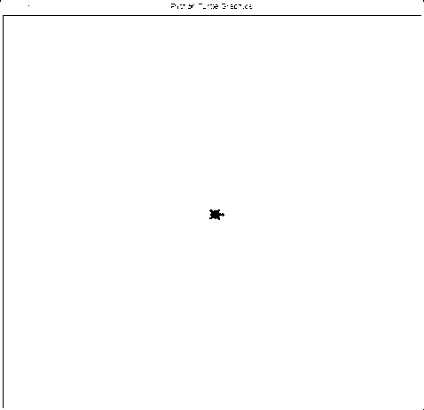
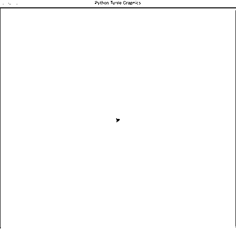

# Python 海龟入门指南

> 原文：<https://realpython.com/beginners-guide-python-turtle/>

*立即观看**本教程有真实 Python 团队创建的相关视频课程。配合文字教程一起看，加深理解: [**蟒龟初学**](/courses/python-turtle-beginners/)

当我还是个孩子的时候，我曾经学过 [Logo](https://en.wikipedia.org/wiki/Logo_(programming_language)) ，一种编程语言，里面有一只乌龟，你只需要几个命令就可以在屏幕上移动它。我记得当我控制屏幕上的这个小东西时，我感觉自己像个计算机天才，这也是我最初对编程感兴趣的原因。Python `turtle`库提供了类似的交互特性，让新程序员体验使用 Python 的感觉。

**在本教程中，您将:**

*   **了解**什么是 Python `turtle`库
*   **学习**如何在电脑上设置`turtle`
*   用 Python `turtle`库**编程**
*   **掌握**一些重要的 Python 概念和`turtle`命令
*   利用你所学的知识开发一个简短但有趣的游戏

如果你是 Python 的初学者，那么本教程将帮助你在 Python 库的帮助下迈出编程世界的第一步！

**免费奖励:** 并学习 Python 3 的基础知识，如使用数据类型、字典、列表和 Python 函数。

## 了解 Python `turtle`库

`turtle`是一个预装的 Python 库，通过为用户提供虚拟画布，用户可以创建图片和形状。你用来画画的屏幕笔被称为**海龟**，这就是这个图书馆的名字。简而言之，Python `turtle`库帮助新程序员以有趣和互动的方式体验用 Python 编程的感觉。

`turtle`主要用于向孩子介绍计算机的世界。这是理解 Python 概念的一种简单而通用的方式。这为[的孩子们](https://realpython.com/best-python-books/#python-for-kids-a-playful-introduction-to-programming)迈出 Python 编程的第一步提供了一个很好的途径。话虽如此，Python `turtle`库并不仅限于小家伙！事实证明，它对尝试学习 Python 的成年人非常有用，这对于 Python [初学者](https://realpython.com/learning-paths/python3-introduction/)来说非常有用。

使用 Python `turtle`库，您可以绘制和创建各种类型的形状和图像。这里有一个你可以用`turtle`制作的绘图类型的例子:

[](https://files.realpython.com/media/Turtle_Initial_Demo_GIF.923f9cc7d490.gif)

很酷，对吧？这只是你可以使用 Python `turtle`库绘制的许多不同图形中的一个。大多数开发人员使用`turtle`来绘制形状、创建设计和制作图像。其他人使用`turtle`来创建迷你游戏和动画，就像你在上面看到的那样。

[*Remove ads*](/account/join/)

## `turtle` 入门

在继续之前，您需要做两件重要的事情来充分利用本教程:

1.  **Python 环境:**确保你熟悉你的编程[环境](https://realpython.com/learning-paths/perfect-your-python-development-setup/)。你可以用[闲置](https://realpython.com/python-idle/)或者 [Jupyter 笔记本](https://realpython.com/jupyter-notebook-introduction/)这样的应用来和`turtle`一起编程。然而，如果你不习惯使用它们，那么你可以用 [REPL](https://realpython.com/interacting-with-python/) 编程，你将在本教程中使用它。

2.  **Python 版本:**确保你的电脑上有 Python 的[版本 3。如果没有，那么你可以从](https://realpython.com/python-introduction/) [Python 网站](https://www.python.org/downloads/)下载。要帮助设置，请查看 [Python 3 安装&设置指南](https://realpython.com/installing-python/)。

`turtle`的好处是它是一个内置的库，所以你不需要安装任何新的包。您所需要做的就是[将库](https://realpython.com/absolute-vs-relative-python-imports/)导入到您的 Python 环境中，在本例中就是 REPL。打开 REPL 应用程序后，您可以通过键入以下代码行在其上运行 Python 3:

>>>

```py
>>> python3
```

这会将 Python 3 调用到您的 REPL 应用程序中，并为您打开环境。

在开始 Python 编程之前，您需要理解什么是**库**。在非计算机世界里，图书馆是存放不同类型书籍的地方。你可以随时查阅这些书，从中获取你需要的任何信息，然后把它们放回原处。

在计算机世界里，图书馆也是类似的工作方式。根据定义，**库**是一组重要的函数和方法，您可以通过访问它们来简化编程。Python `turtle`库包含了创建图像所需的所有方法和函数。要访问一个 Python 库，您需要[将它](https://realpython.com/python-import/)导入到您的 Python 环境中，就像这样:

>>>

```py
>>> import turtle
```

现在您的 Python 环境中已经有了`turtle`，您可以开始用它编程了。`turtle`是一个图形库，这意味着你需要创建一个单独的窗口(称为**屏幕**)来执行每个绘图命令。你可以通过初始化一个[变量](https://realpython.com/python-variables/)来创建这个屏幕。

在 Python 中，您使用**变量**来存储稍后将在您的程序中使用的信息。当你给一个变量赋值的时候，你**初始化了这个变量。因为变量的值不是恒定的，所以在程序执行过程中它会改变几次。**

现在，要打开`turtle`屏幕，你用下面的方法为它初始化一个变量:

>>>

```py
>>> s = turtle.getscreen()
```

您应该会看到一个单独的窗口打开:

[](https://files.realpython.com/media/Screenshot_2019-12-10_at_7.40.34_AM.86e4071c3bb4.png)

这个窗口被称为**屏幕**。您可以在这里查看代码的输出。屏幕中间的黑色小三角形被称为**龟**。

注意:记住当你给一个变量命名时，你需要选择一个看你程序的人容易理解的名字。但是，您还必须选择一个方便使用的名称，特别是因为您将在整个程序中经常调用它！

例如，选择一个像`my_turtle_screen_name`这样的名字会使输入变得乏味，而像`Joe`或`a`这样的名字会显得非常随意。使用单个字母字符，如本例中的`s`，会更合适。那是因为它短而甜，清楚的记得字母`s`指的是**屏**。

接下来，初始化变量`t`，然后在整个程序中使用它来引用海龟:

>>>

```py
>>> t = turtle.Turtle()
```

就像屏幕一样，你也可以给这个变量取另一个名字，比如`a`或者`Jane`甚至`my_turtle`，但是在这种情况下，你将坚持使用`t`。

你现在有了屏幕和海龟。屏幕就像一块画布，而乌龟就像一支笔。你可以设定乌龟在屏幕上移动。海龟有一些多变的特征，比如大小、颜色和速度。它总是指向一个特定的方向，并且会向那个方向移动，除非你告诉它:

*   当 **up** 时，表示移动时不画线。
*   当**向下**时，表示移动时会画一条线。

在下一节中，您将探索使用 Python `turtle`库编程的不同方式。

[*Remove ads*](/account/join/)

## 用`turtle` 编程

使用 Python `turtle`库编程时，你要学的第一件事是如何让海龟朝你想要的方向移动。接下来，你将学习如何定制你的海龟和它的环境。最后，您将学习几个额外的命令，使用它们您可以执行一些特殊的任务。

### 移动乌龟

乌龟可以向四个方向移动:

*   向前
*   向后的
*   左边的
*   对吧

乌龟朝它面对的方向移动`.forward()`或`.backward()`。您可以通过将`.left()`或`.right()`旋转一定角度来改变这个方向。您可以像这样尝试这些命令:

>>>

```py
>>> t.right(90)
>>> t.forward(100)
>>> t.left(90)
>>> t.backward(100)
```

当你运行这些命令时，海龟将向右转 90 度，向前移动 100 个单位，向左转 90 度，向后移动 100 个单位。您可以在下图中看到这一点:

[](https://files.realpython.com/media/Update_-_Moving_Turtle_VIDEO_GIF.61623cf40fed.gif)

您也可以使用这些命令的缩写版本:

*   **`t.rt()`** 而不是`t.right()`
*   **`t.fd()`** 而不是`t.forward()`
*   **`t.lt()`** 而不是`t.left()`
*   **`t.bk()`** 而不是`t.backward()`

你也可以从当前位置画一条线到屏幕上的任意位置。这是在坐标的帮助下完成的:

[](https://files.realpython.com/media/Turtle_EDIT_Graph.790c213ce0ba.jpg)

屏幕被分成四个[象限](https://www.mathsisfun.com/data/cartesian-coordinates.html)。乌龟在你程序开始时最初定位的点是`(0,0)`。这就是所谓的**家**。要将乌龟移动到屏幕上的任何其他区域，您可以使用`.goto()`并像这样输入坐标:

>>>

```py
>>> t.goto(100,100)
```

您的输出将如下所示:

[](https://files.realpython.com/media/TURTLE_EDIT_GOTO_GIF.ac9b7de34b40.gif)

您从当前位置到屏幕上的点`(100,100)`画了一条线。

要将海龟带回原位，您可以键入以下命令:

>>>

```py
>>> t.home()
```

这就像一个快捷命令，把乌龟送回`(0,0)`点。比敲`t.goto(0,0)`还快。

[*Remove ads*](/account/join/)

### 画一个形状

现在你知道了海龟的动作，你可以继续制作实际的形状了。你可以从画**多边形**开始，因为它们都由以一定角度连接的直线组成。这里有一个例子，你可以试试:

>>>

```py
>>> t.fd(100)
>>> t.rt(90)
>>> t.fd(100)
>>> t.rt(90)
>>> t.fd(100)
>>> t.rt(90)
>>> t.fd(100)
```

您的输出将如下所示:

[](https://files.realpython.com/media/TURTLE_SQUARE_EDIT.626bc3fccd67.gif)

干得好！你刚刚画了一个正方形。这样，乌龟就可以被编程**创造出不同的形状和形象**。

现在，尝试绘制一个矩形，使用此代码作为模板。记住，在一个长方形里，所有的四条边都不相等。您需要相应地更改代码。一旦你这样做了，你甚至可以通过增加边数和改变角度来创建其他多边形。

### 绘制预设图形

假设你想画一个**圆**。如果你试图用画正方形的方法来画它，那将会非常乏味，你将不得不花很多时间来画这个形状。谢天谢地，Python `turtle`库为此提供了一个解决方案。您可以使用一个命令来绘制圆:

>>>

```py
>>> t.circle(60)
```

您将得到如下输出:

[](https://files.realpython.com/media/Update_-_Turtle_Circle_GIF.14906fdf5060.gif)

括号内的数字是圆的**半径**。您可以通过更改圆的半径值来增大或减小圆的大小。

同理，你也可以画一个**点**，无非就是一个填满的圆。键入以下命令:

>>>

```py
>>> t.dot(20)
```

你会得到一个这样的实心圆:

[](https://files.realpython.com/media/Turtle_Dot_Pic.8f171e2c7d98.png)

括号内的数字是圆点的直径。就像圆一样，你可以通过改变它的直径值来增加或减少点的大小。

到目前为止做得很好！你已经学会了如何移动乌龟，并用它创造不同的形状。在接下来的几节中，您将看到如何根据您的需求定制您的 turtle 及其环境。

### 改变屏幕颜色

默认情况下，`turtle`总是打开一个白色背景的屏幕。但是，您可以使用以下命令随时更改屏幕的**颜色**:

>>>

```py
>>> turtle.bgcolor("blue")
```

您可以将`"blue"`替换为任何其他颜色。试试`"green"`或者`"red"`。你会得到这样一个结果:

[](https://files.realpython.com/media/1-BG_COLOR-GIF.8619d9e1783f.gif)

只要输入他们的十六进制代码[T2 号，你就可以为你的屏幕使用多种颜色。要了解更多关于使用不同颜色的知识，请查看 Python 库`turtle`文档](https://en.wikipedia.org/wiki/Web_colors)。

[*Remove ads*](/account/join/)

### 更改屏幕标题

有时，你可能想改变屏幕的**标题**。你可以让它更个性化，比如`"My Turtle Program"`，或者更适合你正在做的事情，比如`"Drawing Shapes With Turtle"`。您可以在此命令的帮助下更改屏幕标题:

>>>

```py
>>> turtle.title("My Turtle Program")
```

您的标题栏现在将显示:

[](https://files.realpython.com/media/Change_in_Screen_Title_UPDATE.bf645f90e3d0.jpg)

这样，你可以根据自己的喜好改变屏幕的标题。

### 改变乌龟的大小

你可以增加或减少屏幕上海龟的**尺寸**，使其变大或变小。这仅改变形状的大小，而不影响笔在屏幕上绘制时的输出。尝试键入以下命令:

>>>

```py
>>> t.shapesize(1,5,10)
>>> t.shapesize(10,5,1)
>>> t.shapesize(1,10,5)
>>> t.shapesize(10,1,5)
```

您的输出将如下所示:

[](https://files.realpython.com/media/Turtle_Shape_Size_Updated_GIF.3f31c5f85340.gif)

给出的数字是乌龟大小的参数:

*   拉伸长度
*   拉伸宽度
*   轮廓宽度

您可以根据自己的喜好更改这些内容。在上面给出的例子中，你可以看到乌龟外表的明显不同。关于如何改变乌龟大小的更多信息，请查看 Python 库[文档](https://docs.python.org/3/library/turtle.html#turtle.turtlesize)。

### 改变笔的尺寸

前面的命令只改变了乌龟形状的大小。但是，有时，您可能需要增加或减少笔的**粗细**。您可以使用以下命令来完成此操作:

>>>

```py
>>> t.pensize(5)
>>> t.forward(100)
```

这将导致如下结果:

[](https://files.realpython.com/media/Pen_Size_GIF.4d1fb1beefd6.gif)

如你所见，你的笔的大小现在是原来的五倍(原来是一倍)。试着多画一些不同大小的线，比较它们之间的粗细差异。

[*Remove ads*](/account/join/)

### 改变乌龟和钢笔的颜色

当你第一次打开一个新的屏幕时，乌龟开始是一个黑色的图形，并用黑色墨水绘制。根据您的要求，您可以做两件事:

*   **改变乌龟的颜色:**改变填充颜色。
*   **改变笔的颜色:**改变轮廓或墨水颜色。

如果你愿意，你甚至可以两者都选。在你改变颜色之前，增加你的乌龟的大小，以帮助你更清楚地看到颜色的差异。键入以下代码:

>>>

```py
>>> t.shapesize(3,3,3)
```

现在，要更改乌龟的颜色(或填充)，您可以键入以下内容:

>>>

```py
>>> t.fillcolor("red")
```

你的乌龟看起来会像这样:

[](https://files.realpython.com/media/Turtle_Fill_Color_Red_Update.216d34fcf201.png)

要更改钢笔(或轮廓)的颜色，请键入以下内容:

>>>

```py
>>> t.pencolor("green")
```

你的乌龟看起来会像这样:

[](https://files.realpython.com/media/Turtle_Pen_Color_Updated.362202ac18cb.png)

要更改两者的颜色，请键入以下内容:

>>>

```py
>>> t.color("green", "red")
```

你的乌龟看起来会像这样:

[](https://files.realpython.com/media/Turtle_Color_One_Line_Green_and_Red_Updated.060568e73634.png)

这里，第一种颜色用于钢笔，第二种颜色用于填充。注意，改变钢笔和填充的颜色也会相应地改变屏幕上海龟的颜色。

### 填充图像

在图像中着色通常会使图像看起来更好，不是吗？Python `turtle`库为你提供了给你的绘图添加颜色的选项。尝试键入以下代码，看看会发生什么:

>>>

```py
>>> t.begin_fill()
>>> t.fd(100)
>>> t.lt(120)
>>> t.fd(100)
>>> t.lt(120)
>>> t.fd(100)
>>> t.end_fill()
```

当您执行这段代码时，您将得到一个用纯色填充的三角形，如下所示:

[](https://files.realpython.com/media/Turtle_Begin_End_Fill_GIF.849f73374a22.gif)

当你使用`.begin_fill()`时，你告诉你的程序你将要画一个需要填充的闭合形状。然后，您使用`.end_fill()`来表示您已经完成了形状的创建，现在可以填充它了。

[*Remove ads*](/account/join/)

### 改变乌龟的形状

乌龟的最初形状并不是真正的乌龟，而是三角形。然而，你可以**改变海龟的样子**，当你这么做的时候，你有几个选择。您可以通过键入以下命令来查看其中的一些:

>>>

```py
>>> t.shape("turtle")
>>> t.shape("arrow")
>>> t.shape("circle")
```

乌龟的形状会相应地改变，就像这样:

[](https://files.realpython.com/media/4-Turtle_Shape-Gif.daf6a648bd8c.gif)

您也可以尝试几个其他选项:

*   平方
*   箭
*   圆
*   龟
*   三角形
*   经典的

经典造型就是原始造型。查看 Python `turtle`库[文档](https://docs.python.org/3/library/turtle.html#turtle.shape)，了解更多关于你可以使用的形状类型。

### 改变笔速

海龟通常以适中的速度移动。如果你想降低或增加**速度**来让你的乌龟移动得更慢或更快，那么你可以通过键入以下命令来实现:

>>>

```py
>>> t.speed(1)
>>> t.forward(100)
>>> t.speed(10)
>>> t.forward(100)
```

这段代码将首先降低速度并向前移动乌龟，然后提高速度并再次向前移动乌龟，就像这样:

[](https://files.realpython.com/media/Update_-_Turtle_Speed_1_and_10.a35c56e8f016.gif)

速度可以是从 0(最低速度)到 10(最高速度)之间的任何数字。你可以摆弄你的代码，看看乌龟跑得有多快或多慢。

### 一行定制

假设你想设置你的海龟的特征如下:

*   **钢笔颜色:**紫色
*   **填充颜色:**橙色
*   **笔尺寸:** 10
*   **笔速:** 9

从您刚刚学到的内容来看，代码应该是这样的:

>>>

```py
>>> t.pencolor("purple")
>>> t.fillcolor("orange")
>>> t.pensize(10)
>>> t.speed(9)
>>> t.begin_fill()
>>> t.circle(90)
>>> t.end_fill()
```

很长，但没那么糟，对吧？

现在，想象一下如果你有十只不同的海龟。改变他们所有的特征对你来说是非常令人厌倦的！好消息是，您可以通过修改单行代码中的参数来减少工作量，如下所示:

>>>

```py
>>> t.pen(pencolor="purple", fillcolor="orange", pensize=10, speed=9)
>>> t.begin_fill()
>>> t.circle(90)
>>> t.end_fill()
```

这会给你一个这样的结果:

[](https://files.realpython.com/media/TURTLE_EDIT_SINGLE_LINE_CUSTOMISATION_GIF.c30c0839af72.gif)

这一行代码改变了整个笔，而您不必单独改变每个特征。要了解关于这个命令的更多信息，请查看 Python `turtle`库[文档](https://docs.python.org/3/library/turtle.html#turtle.pen)。

干得好！现在你已经学会了定制你的乌龟和屏幕，看看用 Python `turtle`库绘图时需要的其他一些重要命令。

[*Remove ads*](/account/join/)

### 上下拿起笔

有时候，你可能想把你的乌龟移到屏幕上的另一个点，而不在屏幕上画任何东西。为此，您可以使用`.penup()`。然后，当你想再次开始绘图时，你使用`.pendown()`。使用您之前用来绘制正方形的代码尝试一下。尝试键入以下代码:

>>>

```py
>>> t.fd(100)
>>> t.rt(90)
>>> t.penup()
>>> t.fd(100)
>>> t.rt(90)
>>> t.pendown()
>>> t.fd(100)
>>> t.rt(90)
>>> t.penup()
>>> t.fd(100)
>>> t.pendown()
```

当您运行这段代码时，您的输出将如下所示:

[](https://files.realpython.com/media/Screenshot_2019-10-01_at_9.22.37_PM.20eeea07c674.png)

这里，通过在原始程序之间添加一些额外的命令，您已经获得了两条平行线而不是一个正方形。

### 撤销更改

不管你多小心，总有出错的可能。不过，别担心！Python `turtle`库为您提供了撤销所做操作的选项。如果你想**撤销**你做的最后一件事，那么输入以下内容:

>>>

```py
>>> t.undo()
```

这将撤消您运行的最后一个命令。如果你想撤销你最后的三个命令，那么你可以敲三次`t.undo()`。

### 清除屏幕

现在，你可能已经在你的屏幕上看到很多了，因为你已经开始学习本教程了。要为更多内容腾出空间，只需键入以下命令:

>>>

```py
>>> t.clear()
```

这将清理您的屏幕，以便您可以继续绘画。这里注意，你的变量不会改变，海龟会保持原来的位置。如果你的屏幕上除了原来的海龟之外还有其他的海龟，那么它们的图形不会被清除，除非你在代码中明确地把它们叫出来。

### 重置环境

您也可以选择使用**重置**命令重新开始。屏幕会被清空，海龟的设置会恢复到默认参数。你需要做的就是输入下面的命令:

>>>

```py
>>> t.reset()
```

这就清除了屏幕，把海龟带回到原来的位置。您的默认设置，如乌龟的大小、形状、颜色和其他特征，也将被恢复。

既然您已经学习了使用 Python `turtle`库编程的基础知识，那么您将了解一些在编程时可能会用到的额外特性。

### 留下印记

你可以选择在屏幕上留下你的海龟的印记，这只是海龟的印记。尝试键入以下代码，看看它是如何工作的:

>>>

```py
>>> t.stamp()
8
>>> t.fd(100)
>>> t.stamp()
9
>>> t.fd(100)
```

您的输出将如下所示:

[](https://files.realpython.com/media/RP_STAMPS_GIF.05609e29d05f.gif)

出现的数字是海龟的位置或标记 ID。现在，如果你想删除一个特定的邮票，然后只需使用以下:

>>>

```py
>>> t.clearstamp(8)
```

这将清除标记 ID 为`8`的那个。

[*Remove ads*](/account/join/)

### 克隆你的乌龟

有时候，你可能需要不止一只海龟出现在屏幕上。稍后在期末专题中，你会看到一个例子。现在，你可以通过把你现在的乌龟克隆到你的环境中来得到另一只乌龟。尝试运行以下代码来创建一只克隆乌龟`c`，然后在屏幕上移动两只乌龟:

>>>

```py
>>> c = t.clone()
>>> t.color("magenta")
>>> c.color("red")
>>> t.circle(100)
>>> c.circle(60)
```

输出将如下所示:

[](https://files.realpython.com/media/TURTLE_EDIT_CLONE_GIF.1736204d0292.gif)

厉害！

现在您已经对 Python `turtle`库中的一些重要命令有了概念，您已经准备好继续学习一些您需要理解的概念。在用任何语言编程时，这些概念都是非常必要的。

## 使用循环和条件语句

当你进入高级编程时，你会发现自己经常使用**循环和条件语句**。这就是为什么，在这一节，你会看到几个海龟程序使用了这些类型的命令。这将为你理解这些概念提供一个实用的方法。但是，在开始之前，请记住以下三个定义:

1.  **循环**是一组不断重复直到满足特定条件的指令。
2.  **条件语句**根据满足的条件执行某项任务。
3.  **缩进**用于定义代码块，尤其是在使用循环和条件语句时。一般来说，你可以通过点击键盘上的 `Tab` 键来创建缩进。

现在，让我们继续探索这些命令吧！

### `for`循环

你还记得你用来创建一个正方形的程序吗？你必须重复同一行代码四次，就像这样:

>>>

```py
>>> t.fd(100)
>>> t.rt(90)
>>> t.fd(100)
>>> t.rt(90)
>>> t.fd(100)
>>> t.rt(90)
>>> t.fd(100)
>>> t.rt(90)
```

一个更短的方法是借助一个 [`for`循环](https://realpython.com/courses/python-for-loop/)。尝试运行以下代码:

>>>

```py
>>> for i in range(4):
...     t.fd(100)
...     t.rt(90)
```

在这里，`i`就像一个**计数器**，从零开始，一直递增 1。当你说`in range(4)`时，你是在告诉程序这个`i`的值应该小于 4。它会在`i`达到 4 之前终止程序。

以下是该程序的工作原理:

1.  **I = 0，**乌龟向前移动 100 个单位，然后向右旋转 90 度。
2.  **在 i = 0 + 1 = 1，**乌龟向前移动 100 个单位，然后向右旋转 90 度。
3.  **在 i = 1 + 1 = 2，**乌龟向前移动 100 个单位，然后向右旋转 90 度。
4.  **在 i = 2 + 1 = 3，**乌龟向前移动 100 个单位，然后向右旋转 90 度。

海龟会退出循环。要检查`i`的值，键入`i`然后按下 `Enter`键。您将得到`i`的值等于 3:

>>>

```py
>>> i
3
```

注意，程序中第 2 行和第 3 行之前的空白是缩进**。这表明这 3 行代码形成了一个单独的代码块。要了解更多关于 Python 中的`for`循环，请查看[Python“for”循环(有限迭代)](https://realpython.com/python-for-loop/)。**

**[*Remove ads*](/account/join/)

### `while`循环

[`while`循环](https://realpython.com/courses/mastering-while-loops/)用于在满足某个条件时执行某个任务。如果条件不再满足，那么您的代码将终止该进程。通过输入以下代码，您可以使用`while`循环创建一系列圆:

>>>

```py
>>> n=10
>>> while n <= 40:
...     t.circle(n)
...     n = n+10
```

当您运行这段代码时，您会看到圆圈一个接一个地出现，并且每个新的圆圈都比前一个大:

[](https://files.realpython.com/media/TURTLE_EDIT_WHILE_LOOP_GIF.c0b9eae029cc.gif)

这里，`n`用作计数器。您需要指定在每个循环中您希望`n`的值增加多少。看一下这个迷你演示，了解该程序是如何工作的:

1.  **n = 10，**乌龟画了一个半径为 10 个单位的圆。之后，`n`的值增加 10。
2.  **n = 20，**乌龟画了一个半径为 20 个单位的圆。再次将`n`的值增加 10。
3.  **n = 30，**乌龟画了一个半径为 30 个单位的圆。第三次，`n`的值增加 10。
4.  **n = 40，**乌龟画了一个半径为 40 个单位的圆。最后一次，`n`的值增加 10。
5.  **在 n = 50 时，** `n`不再小于或等于 40。该循环被终止。

要阅读更多关于`while`循环的内容，请查看[Python“while”循环(无限迭代)](https://realpython.com/python-while-loop/)。

### 条件语句

您使用[条件语句](https://realpython.com/python-conditional-statements/)来检查给定的条件是否为真。如果是，则执行相应的命令。尝试在此程序中键入:

>>>

```py
>>> u = input("Would you like me to draw a shape? Type yes or no: ")
>>> if u == "yes":
...     t.circle(50)
```

`input()`用于获取用户的**输入**。这里，它将用户的响应存储在变量`u`下。接下来，它会将`u`的值与提供的条件进行比较，并检查`u`的值是否为`"yes"`。如果是`"yes"`，那么你的程序画一个圆。如果用户输入其他任何东西，那么程序不会做任何事情。

**注:**比较运算符`==`表示一个**比较**。它被用来检查一个东西的值是否等于另一个东西的值。赋值运算符`=`用于给某物赋值。要了解这两者之间的更多区别，请查看 Python 中的[操作符和表达式。](https://realpython.com/python-operators-expressions/)

当您将一个`else`子句添加到一个`if`语句时，您可以根据条件是真还是假来指定两个结果。让我们来看看这个程序:

>>>

```py
>>> u = input("Would you like me to draw a shape? Type yes or no: ")
>>> if u == "yes":
...     t.circle(50)
>>> else:
...     print("Okay")
```

这里，您告诉程序显示一个特定的输出，即使用户没有说`"yes"`。你用 [`print()`](https://realpython.com/python-print/) 在屏幕上显示一些预定义的字符。

注意，用户不需要输入`"no"`。他们可以键入任何其他东西，在这种情况下，结果将总是`"Okay"`，因为你没有明确地告诉程序用户需要键入`"no"`。不过，不用担心，这是可以解决的。您可以添加一个`elif`子句，为程序提供几个条件及其各自的输出，如下所示:

>>>

```py
>>> u = input("Would you like me to draw a shape? Type yes or no: ")
>>> if u == "yes":
...     t.circle(50)
>>> elif u == "no":
...     print("Okay")
>>> else:
...     print("Invalid Reply")
```

正如您所看到的，这个程序现在有多个结果，这取决于它接收到的输入。下面是这段代码的工作原理:

*   **如果你输入`"yes"`、**，代码会根据你的指示处理输入并画一个圆。
*   **如果你输入`"no"`，**，那么代码打印出来`"Okay"`，你的程序终止。
*   **如果你输入其他任何东西，**比如`"Hello"`或者`"Sandwich"`，那么代码打印`"Invalid Reply"`并且你的程序终止。

请注意，这个程序是区分大小写的，所以当您试用它时，请确保相应地将字符串置于大写或小写。

要了解更多关于条件语句的信息，请查看 Python 中的[条件语句。](https://realpython.com/python-conditional-statements/)

[*Remove ads*](/account/join/)

## 最终项目:巨蟒龟比赛

到目前为止，你已经学会了如何定制你的 turtle 环境，如何让 turtle 在屏幕上移动，如何使用循环和条件语句来改进你的代码。现在是您编程之旅中最重要的部分了。在本节中，您将通过创建一个可以与朋友一起玩的有趣游戏，将您所学的全部内容应用到一个程序中。

在开始之前，你需要了解这个游戏:

1.  目标:乌龟最先到达家的玩家赢得游戏。

2.  **怎么玩:**

    *   每个玩家掷骰子得到一个数字。
    *   然后玩家把他们的乌龟移动那么多步。
    *   玩家轮流玩，直到其中一方获胜。
3.  **结构:**

    *   每个玩家都有一只不同颜色的乌龟。您可以有两个以上的玩家，但是在本教程中，您将创建一个双人游戏。
    *   每只海龟都有它必须到达的家的位置。
    *   每个玩家使用一个骰子随机选择一个数值。在您的程序中，骰子由 1 到 6 的数字列表表示。

现在你已经理解了游戏的逻辑，你可以开始创建它了！首先，您需要设置环境。

### 设置游戏环境

从导入 Python `turtle`库开始。之后，导入内置的`random`库，您将使用它从[列表中随机选择一个项目](https://realpython.com/python-lists-tuples/):

>>>

```py
>>> import turtle
>>> import random
```

一旦这些库被成功地调用到您的环境中，您就可以继续您的程序的其余部分了。

### 建立海龟和家园

现在你必须创建两只代表玩家的乌龟。每只乌龟都有不同的颜色，对应不同的玩家。这里，一号玩家是绿色的，二号玩家是蓝色的**:**

**>>>

```py
>>> player_one = turtle.Turtle()
>>> player_one.color("green")
>>> player_one.shape("turtle")
>>> player_one.penup()
>>> player_one.goto(-200,100)
>>> player_two = player_one.clone()
>>> player_two.color("blue")
>>> player_two.penup()
>>> player_two.goto(-200,-100)
```

一旦你创造了海龟，你把它们放在它们的起始位置，并确保这些位置是对齐的。请注意，您通过克隆一号玩家的海龟，改变其颜色，并将其放置在不同的起点，从而创建了二号玩家的海龟。

你现在需要为海龟们建立家园。这些家园将成为每只海龟的终点。每个海龟的家都用一个圆圈来代表。在这里，您需要确保两个住宅与起点的距离相等:

>>>

```py
>>> player_one.goto(300,60)
>>> player_one.pendown()
>>> player_one.circle(40)
>>> player_one.penup()
>>> player_one.goto(-200,100)
>>> player_two.goto(300,-140)
>>> player_two.pendown()
>>> player_two.circle(40)
>>> player_two.penup()
>>> player_two.goto(-200,-100)
```

画完各自的家之后，你把海龟们送回他们的起始位置:

[](https://files.realpython.com/media/UPDATE_Turtle_Race_Setup_Blue_and_Green.16e6da3cc20d.png)

厉害！你的游戏的视觉方面已经完成了。现在，您可以创建将用于玩游戏的骰子。

### 创建模具

你可以用一个 **[列表](https://realpython.com/courses/lists-tuples-python/)** 为你的游戏创建一个虚拟骰子，这是一个有序的物品序列。在现实生活中，你可能会准备购物清单和待办事项清单来帮助你保持条理。在 Python 中，列表以类似的方式工作。

在这种情况下，您将使用一个列表来创建骰子。首先，您按照从 1 到 6 的升序定义您的数字列表。您可以定义一个列表，方法是给它一个名称，然后用方括号将它的项目括起来，如下所示:

>>>

```py
>>> die = [1,2,3,4,5,6]
```

这份名单现在已经变成了你的骰子。要掷骰子，你所要做的就是给你的系统编程，从中随机选择一个数字。所选的数字将被视为骰子的输出。

### 开发游戏

是时候为剩下的游戏开发代码了。这里将使用循环和条件语句，所以需要注意缩进和空格。首先，看看你的程序运行游戏需要采取的步骤:

1.  第一步:首先，你要告诉你的程序去检查是否有一只海龟到达了它的家。
2.  如果他们没有，那么你将告诉你的程序允许玩家继续尝试。
3.  第三步:在每个循环中，你告诉你的程序从列表中随机选择一个数字来掷骰子。
4.  第四步:然后你告诉它相应地移动相应的乌龟，移动的步数取决于随机选择的结果。

程序不断重复这个过程，一旦其中一只海龟达到目标，程序就会停止。下面是代码的样子:

>>>

```py
 1>>> for i in range(20):
 2...     if player_one.pos() >= (300,100):
 3...             print("Player One Wins!")
 4...             break
 5...     elif player_two.pos() >= (300,-100):
 6...             print("Player Two Wins!")
 7...             break
 8...     else:
 9...             player_one_turn = input("Press 'Enter' to roll the die ")
10...             die_outcome = random.choice(die)
11...             print("The result of the die roll is: ")
12...             print(die_outcome)
13...             print("The number of steps will be: ")
14...             print(20*die_outcome)
15...             player_one.fd(20*die_outcome)
16...             player_two_turn = input("Press 'Enter' to roll the die ")
17...             die_outcome = random.choice(die)
18...             print("The result of the die roll is: ")
19...             print(die_outcome)
20...             print("The number of steps will be: ")
21...             print(20*die_outcome)
22...             player_two.fd(20*die_outcome)
```

您的最终输出看起来会像这样:

[](https://files.realpython.com/media/Update_-_Turtle_Race_Green_and_Blue.b1ee6be37a9f.gif)

简而言之，这就是代码正在做的事情:

1.  **线 1** 设置一个`for`循环，范围从 1 到 20。

2.  **第 2 行到第 7 行**检查任何一个玩家是否达到了他们的目标。如果其中一个有，那么程序打印出相应的语句，并结束循环。

3.  如果两个玩家都没有赢，第 8 行将程序移到下一组步骤。

4.  **第 9 行**打印出一条声明，要求玩家一按下 `Enter` 键掷骰子。

5.  **第 10 行**从列表`die`中取一个随机值，并存储在`die_outcome`中。

6.  **第 11 行**在显示掷骰子结果之前打印一份声明。

7.  **第 12 行**打印骰子结果。

8.  **第 14 行**将该值乘以 20，以减少完成游戏所需的总步骤数。

9.  **第 15 行**将玩家一的乌龟向前移动该步数。

10.  **第 16 行到第 22 行**对二号玩家重复这些步骤。

重复整个`for`循环，直到玩家的一只乌龟到达最终位置。

**注意:**在 Python 中，你用星号(`*`)来表示乘法。这就是所谓的**算术运算符**。也可以用加号(`+`)做加法，减号(`-`)做减法，斜线(`/`)做除法。要了解算术运算符的更多信息，请查看 Python 中的[运算符和表达式的算术运算符部分。](https://realpython.com/python-operators-expressions/#arithmetic-operators)

请记住，你可以自定义游戏，所以继续玩吧！你可以添加更多的乌龟，改变颜色，改变速度，甚至制造一些障碍来挑战你的玩家。这一切都取决于你作为游戏的开发者！

## 结论

在本教程中，您已经学习了如何使用 Python `turtle`库进行编程，并掌握了一些非常重要的编程概念。你知道如何处理变量初始化、循环、条件语句、缩进、列表和操作符。这对您来说是一个很好的开始，尤其是如果您是 Python 编程语言的新手！

**现在你可以:**

*   **建立**Python`turtle`库
*   移动你的乌龟
*   **定制**你的乌龟和它的环境
*   **程序**你的乌龟
*   **使用**基本编程概念
*   创建一个可以和朋友一起玩的游戏

现在，您已经准备好开始一些更高级的 Python 编程了。为了在您的 Python 之旅中更进一步，请查看[Python 简介](https://realpython.com/learning-paths/python3-introduction/)和[学习 Python 编程的 11 个初学者技巧](https://realpython.com/python-beginner-tips/)。只要记住努力工作并不断练习，你会发现你很快就成为一名 Python 专家了！

*立即观看**本教程有真实 Python 团队创建的相关视频课程。配合文字教程一起看，加深理解: [**蟒龟初学**](/courses/python-turtle-beginners/)****************