# 最好的 Python 书籍

> 原文：<https://realpython.com/best-python-books/>

在本文中，我们通过一组书评，重点介绍了学习 Python 的最佳书籍。每一篇评论都让你领略了这本书的内容，涵盖的主题，以及用来阐述这些主题的背景。不同的书籍会引起不同人的共鸣，这取决于书籍的风格和介绍、读者的背景以及其他因素。

Python 是一种令人惊叹的编程语言。它可以应用于几乎任何编程任务，允许快速开发和调试，并带来了可以说是最受欢迎的用户社区的支持。

开始使用 Python 就像学习任何新技能一样:找到一个你能联系到的资源来指导你的学习是很重要的。幸运的是，有很多优秀的书籍可以帮助你学习编程的基本概念和 Python 编程的细节。由于资源丰富，很难确定哪本书最适合你的情况。

如果你是 Python 新手，任何一本[入门书籍](#best-books-for-learning-python)都会给你打下坚实的基础。

也许你想和你的孩子一起学习 Python，或者教一群孩子 Python。查看[适合儿童的最佳 Python 书籍](#best-python-books-for-kids)以获取针对年轻读者的资源。

随着您在 Python 之旅中的进展，您会想要更深入地挖掘以最大化代码的效率。[最佳中级和高级 Python 书籍](#best-intermediate-and-advanced-python-books)提供了帮助您提高 Python 技能的洞察力，使您能够成为 Python 专家。

读完这些评论后，如果你仍然不确定选择哪本书，出版商通常会提供一个样本章节或章节，给你一个该书提供的例子。阅读这本书的样本会让你对作者的步调、风格和期望有一个最有代表性的了解。

不管哪本书最突出，想想我们的书评人史蒂文·c·豪厄尔的轶事:

> “一位喜欢的教授曾经告诉我，‘你先读哪本书并不重要。“总是第二个最有意义，”
> 
> 我不能说我一直都是这种情况，但我确实发现，当第一次给我留下困惑或沮丧时，第二次推荐会有所不同。
> 
> 当学习 Python 类时，我很难理解我所选的前两本书中使用的例子。直到我提到的第三本书，这些概念才开始产生共鸣。
> 
> 重要的一课是，如果你陷入困境或受挫，你所拥有的资源没有帮助，那么不要放弃。看看另一本书，搜索网页，在论坛上提问，或者只是休息一下。"

**注意:**本文包含亚马逊等零售商的附属链接，因此您可以通过点击并购买一些链接来支持真正的 Python。从这些链接中的任何一个购买都不会增加你的额外费用。附属链接绝不会以任何方式影响我们的编辑决策。

## 学习 Python 的最佳书籍

如果您是 Python 的新手，您可能会遇到以下两种情况之一:

1.  你是编程新手，想从学习 Python 开始。
2.  你在另一种语言上有一定的编程经验，现在想学习 Python。

本节主要讨论这两种情况中的第一种，并对我们认为最适合初学编程和 Python 的读者的 Python 编程书籍进行了评述。因此，这些书不需要以前的编程经验。他们从绝对的基础开始，教授一般的编程概念以及它们如何应用于 Python。

**注意:**如果你正在为有经验的程序员寻找**最好的 Python 书籍**，请考虑以下在[简介](#best-books-for-learning-python)和[高级](#best-intermediate-and-advanced-python-books)部分有完整评论的书籍:

*   [*思 Python*](#think-python) :这个列表最基本，*思 Python* 提供了全面的 Python 参考。
*   [*流畅的 Python*](#fluent-python):Python 的简单性让你可以快速开始编码，这本书教你如何编写地道的 Python 代码，同时深入探讨该语言的几个深层主题。
*   [*有效的 Python: 59 种写出更好的 Python 的方法*](#effective-python-59-ways-to-write-better-python) :这本相对较短的书是 59 篇文章的合集，与*流畅的 Python* 类似，专注于教你如何写出真正的 Python 代码。
*   [*Python 食谱*](#python-cookbook) :作为一本食谱，这将是一本关于如何使用 Python 来完成你用另一种语言完成的任务的好参考。

或者，你可能更喜欢直接去官方的 Python 教程，这是一个写得很好很全面的资源。

[*Remove ads*](/account/join/)

### Python 速成班

埃里克·马特斯*(无淀粉出版社，2016)*

[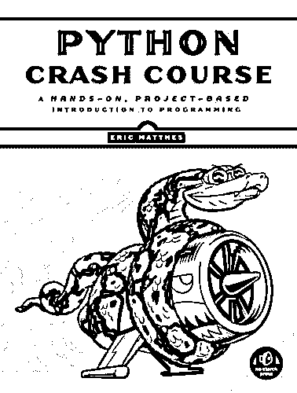](https://realpython.com/asins/1593276036/)

它按照罐头上说的做，而且做得很好。这本书从基本 Python 元素和数据结构的演练开始，通过变量、字符串、数字、列表和元组，概述了如何使用它们。

接下来，`if`包括了语句和逻辑测试，接着是对字典的探究。

之后，这本书涵盖了用户输入、 [`while`循环](https://realpython.com/python-while-loop/)、函数、类、文件处理，以及代码测试和调试。

那只是书的前半部分！在后半部分，您将参与三个主要项目，创建一些聪明有趣的应用程序。

第一个项目是一个外星人入侵游戏，本质上是太空入侵者，使用`pygame`包开发。你设计一艘船(使用类)，然后编程如何驾驶它，让它发射子弹。然后，你设计几类外星人，让外星人舰队移动，让击落他们成为可能。最后，您添加一个记分牌和一个高分列表来完成游戏。

在那之后，下一个项目包括使用`matplotlib`的数据可视化、随机行走、掷骰子和一点点统计分析，使用`pygal`包创建图形和图表。您将学习如何下载各种格式的数据，将其导入 Python，并可视化结果，以及如何与 web APIs 交互，从 GitHub 和 HackerNews 中检索和可视化数据。

第三个项目引导您使用 Django 创建一个完整的 web 应用程序，以建立一个学习日志来跟踪用户学习了什么。它涵盖了如何安装 Django、设置项目、设计模型、创建管理界面、设置用户帐户、基于每个用户管理访问控制、使用 Bootstrap 设计整个应用程序的样式，以及最终将其部署到 Heroku。

这本书写得很好，组织得很好。它提供了大量有用的练习以及三个具有挑战性和娱乐性的项目，构成了本书的后半部分。*(由大卫·施勒辛格审核。)*

*   [亚马逊上的视图](https://realpython.com/asins/1593276036/)
*   [在出版商网站上查看](https://nostarch.com/pythoncrashcourse)

### Head-First Python，第二版

保罗·巴里*(奥莱利，2016)*

[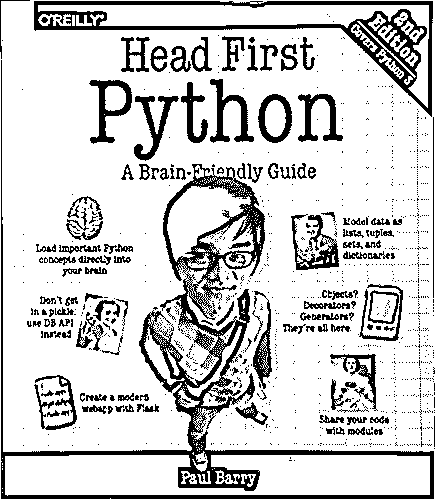](https://realpython.com/asins/1491919531/)

我真的很喜欢 *Head-First* 系列的书，尽管它们在整体内容上比本节中的许多其他推荐都要轻。代价是这种方法使这本书更加用户友好。

如果你是那种喜欢一次学习一小块相当独立的东西的人，并且你希望有大量的具体例子和相关概念的说明，那么 *Head-First* 系列适合你。出版商的网站对他们的方法有如下描述:

> “基于认知科学和学习理论的最新研究， *Head-First Python* 使用视觉丰富的格式来吸引你的思维，而不是让你睡着的大量文本方法。为什么要浪费时间纠结新概念？这种多感官的学习体验是为你的大脑真正的工作方式而设计的。”[(来源)](http://shop.oreilly.com/product/0636920036777.do)

塞满了插图、例子、旁白和其他花絮， *Head-First Python* 始终引人入胜且易于阅读。这本书从深入列表并解释如何使用和操作它们开始了它的 Python 之旅。然后进入模块、错误和文件处理。每个主题都围绕一个统一的项目:通过公共网关接口(CGI)使用 Python 为学校体育教练构建一个动态网站。

之后，这本书会花时间教你如何使用 Android 应用程序与你创建的网站进行交互。您将学习处理用户输入、争论数据，并了解在 web 上部署和扩展 Python 应用程序所涉及的内容。

虽然这本书不如其他一些书全面，但它以一种更容易理解、更轻松、更有效的方式涵盖了大量 Python 任务。如果你一开始觉得写程序有点吓人，那就更是如此了。

这本书旨在指导你应对任何挑战。虽然内容更加集中，但这本书有足够的材料让你忙碌和学习。你不会无聊的。如果你觉得大多数编程书籍太枯燥，这可能是一本适合你开始学习 Python 的好书。(由大卫·施勒辛格和史蒂文·c·豪厄尔审核。)

*   [亚马逊上的视图](https://realpython.com/asins/1491919531/)
*   [在出版商网站上查看](http://shop.oreilly.com/product/0636920036777.do)

[*Remove ads*](/account/join/)

### 用 Python 发明你自己的电脑游戏，第 4 版

阿尔·斯威加特*(无淀粉，2017)*

[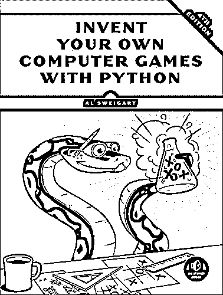](https://realpython.com/asins/1593277954/)

如果游戏是你的事情，或者你甚至有自己的游戏想法，这将是学习 Python 的完美书籍。在本书中，您将学习编程和 Python 的基础知识，并通过应用程序练习来构建经典游戏。

从 Python shell 和 REPL 循环的介绍开始，接下来是基本的“你好，世界！”脚本，您可以开始制作一个基本的数字猜测游戏，包括随机数、流控制、类型转换和[布尔](https://realpython.com/python-boolean/)数据。之后，编写一个讲笑话的小脚本来说明打印语句、转义字符和基本字符串操作的使用。

下一个项目是一个基于文本的洞穴探索游戏，龙的领域，它向您介绍流程图和函数，指导您如何定义自己的参数和参数，并解释布尔运算符、全局和局部范围以及`sleep()`函数。

在简要介绍了如何调试 Python 代码之后，接下来您将使用 ASCII 作品实现 Hangman 游戏，同时学习列表、`in`操作符、方法、`elif`语句、`random`模块和一些字符串方法。

然后，在学习字典、键值对和多变量赋值的同时，用新特性扩展 Hangman 游戏，比如单词列表和难度级别。

你的下一个项目是一个井字游戏，它介绍了一些高级人工智能概念，向你展示了如何在条件句中短路求值，并解释了`None`值以及访问列表的一些不同方式。

你在这本书其余部分的旅程也是如此。您将在构建智多星风格的数字猜测游戏时学习嵌套循环，声纳狩猎游戏的笛卡尔坐标，编写凯撒密码的密码学，以及实现黑白棋(也称为奥赛罗)时的人工智能，其中计算机可以与自己对弈。

在所有这些之后，有一个在 PyGame 游戏中使用图形的潜水:你将涵盖如何动画图形，管理碰撞检测，以及使用声音，图像和精灵。为了将所有这些概念结合在一起，这本书将指导你制作一个图形化的避障游戏。

这本书做得很好，每个项目都是一个独立的单元，这一事实使它具有吸引力和可访问性。如果你喜欢边做边学，那么你会喜欢这本书的。

这本书只在需要时介绍概念的事实可能是一个缺点。虽然它更像是一个指南而不是参考，但在熟悉的游戏背景下教授的广泛内容使它成为学习 Python 的最佳书籍之一。*(由大卫·施勒辛格审核。)*

*   [亚马逊上的视图](https://realpython.com/asins/1593277954/)
*   [在作者网站上查看](https://inventwithpython.com/)

### 思考 Python:如何像计算机科学家一样思考，第二版

艾伦·b·唐尼*(奥莱利，2015)*

[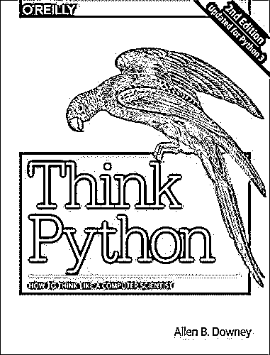](https://realpython.com/asins/1491939362/)

如果通过创建视频游戏来学习 Python 对你来说太无聊，可以考虑艾伦·唐尼的书 *Think Python* ，这本书采用了更严肃的方法。

正如标题所言，这本书的目标是教你编码人员如何思考编码，并且做得很好。与其他书籍相比，它更加枯燥，组织方式更加线性。这本书以一种非常直截了当、清晰而全面的方式，关注你需要了解的关于基本 Python 编程的一切。

与其他类似的书籍相比，它没有深入到一些更高级的领域，而是覆盖了更广泛的材料，包括其他书籍没有涉及的主题。这类主题的例子包括运算符重载、多态性、算法分析以及可变性与不可变性。

以前的版本有点轻练习，但最新版本在很大程度上纠正了这个缺点。这本书包含四个相当深入的项目，以案例研究的形式呈现，但总的来说，与许多其他书籍相比，它的直接应用练习较少。

如果你喜欢只是事实的一步一步的演示，并且你想获得专业程序员如何看待问题的一点额外的洞察力，这本书是一个很好的选择。(由大卫·施勒辛格和史蒂文·c·豪厄尔审核。)

*   [亚马逊上的视图](https://realpython.com/asins/1491939362/)
*   [在出版商网站上查看](https://greenteapress.com/wp/think-python-2e/)

[*Remove ads*](/account/join/)

### 物理学中的有效计算:Python 研究领域指南

安东尼·斯科帕茨，凯瑟琳·d·哈夫*(奥莱利，2015)*

[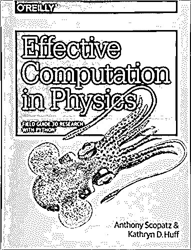](https://realpython.com/asins/1491901535/)

这是我第一次学习 Python 时希望拥有的书。

尽管它的名字，这本书对于没有物理、研究或计算问题经验的人来说是一个极好的选择。

这确实是使用 Python 的一个领域指南。除了实际教授您 Python 之外，它还涵盖了相关主题，如命令行和版本控制，以及软件的测试和部署。

除了是一个很好的学习资源之外，这本书也将作为一个很好的 Python 参考，因为主题组织得很好，有大量穿插的例子和练习。

这本书被分为四个恰当命名的部分:开始，完成，做好，和开始。

“入门”部分包含您立即投入运行所需的一切。它从 bash 命令行基础的一章开始。(是的，你甚至可以为 Windows 安装 [bash。)然后，这本书继续解释 Python 的基础，触及了所有预期的主题:操作符、字符串、变量、容器、逻辑和流控制。此外，有整整一章致力于所有不同类型的函数，另一章是关于类和](https://gitforwindows.org/)[面向对象编程。](https://realpython.com/python3-object-oriented-programming/)

在此基础上，完成部分进入了 Python 的更以数据为中心的领域。请注意，这一部分约占全书的三分之一，最适用于科学家、工程师和数据科学家。如果那是你，享受吧。如果没有，请随意跳过，挑出任何相关的部分。但是请务必阅读本节的最后一章，因为它将教您如何使用 pip、conda、虚拟机和 Docker 容器部署软件。

对于那些对处理数据感兴趣的人来说，这一节首先简要介绍了数据分析和可视化的基本库。然后有一个单独的章节专门介绍正则表达式、NumPy、数据存储(包括执行核外操作)、专用数据结构(哈希表、数据帧、D 树和 k-d 树)和并行计算。

“正确使用”一节将教您如何避免和克服许多与使用 Python 相关的常见陷阱。它首先通过教您如何使用`make`构建软件管道来扩展关于部署软件的讨论。然后，您将学习如何使用 Git 和 GitHub 来跟踪、存储和组织您的代码编辑，这个过程称为版本控制。本节最后将教您如何调试和测试代码，这是两项非常有价值的技能。

最后一部分，把它拿出来，集中于与你的代码的消费者有效地沟通，包括你自己。它涵盖了文档、标记语言(主要是 LaTeX)、代码协作和软件许可等主题。这一部分，也是本书，以一个按主题组织的科学 Python 项目的长列表结束。

这本书的突出之处在于，除了教授 Python 的所有基础知识之外，它还教授您 Pythonistas 使用的许多技术。这确实是学习 Python 的最佳书籍之一。

它也作为一个很好的参考，将一个完整的词汇表，书目和索引。这本书肯定有科学的含义，但是如果你没有科学背景，也不用担心。没有数学方程式，当你的同事看到你在钻研计算物理学时，你甚至会给他们留下深刻的印象！史蒂文·C·豪威尔评论。)

*   [亚马逊上的视图](https://realpython.com/asins/1491901535/)
*   [在作者网站上查看](http://shop.oreilly.com/product/0636920033424.do)

### 艰难地学习 Python 3

泽德·a·肖*(艾迪森-韦斯利，2016)*

[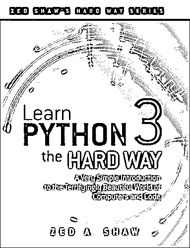](https://realpython.com/asins/0134692888/)

*艰难地学 Python*经典。我非常喜欢这本书的方法。当你学会“艰难的方式”时，你必须:

1.  自己输入所有代码
2.  做所有的练习
3.  为你遇到的问题找到自己的解决方案

这本书的伟大之处在于它的内容呈现得非常好。每一章都有清晰的呈现。代码示例都很简洁，结构良好，并且切中要点。这些练习是有益的，你遇到的任何问题都不是不可克服的。你最大的风险是印刷错误。读完这本书，你肯定不再是 Python 的初学者。

不要让标题让你分心。如果你把眼光放长远，这条“艰难的路”最终会是一条容易的路。没有人喜欢输入很多东西，但这是编程实际涉及的内容，所以从一开始就习惯它是有好处的。这本书的一个好处是，它现在已经经过了几个版本的改进，所以现在任何粗糙的边缘都变得很好很光滑。

这本书由一系列超过五十个练习组成，每一个都建立在前一个的基础上，每一个都教给你这门语言的一些新的特征。从练习 0 开始，在计算机上安装 Python，开始编写简单的程序。您将学习变量、数据类型、函数、逻辑、循环、列表、调试、字典、面向对象编程、继承和打包。你甚至可以使用游戏引擎创建一个简单的游戏。

接下来的章节涵盖了自动化测试、对用户输入进行词法扫描以解析句子，以及将你的游戏放到网上的 [`lpthw.web`包](https://pypi.org/project/lpthw.web/)等概念。

泽德是一位迷人、耐心的作家，他从不掩饰细节。如果你以正确的方式阅读这本书——“艰难的方式”,遵循贯穿全文的学习建议以及编程练习，当你完成时，你将远远超越初级程序员阶段。*(由大卫·施勒辛格审核。)*

*   [亚马逊上的视图](https://realpython.com/asins/0134692888/)
*   [在作者网站上查看](https://learnpythonthehardway.org/python3/)

**注:**在本文包含的所有书籍中，这是唯一一部评论有些褒贬不一的书。堆栈溢出(SO)社区已经编制了一份包含 22 个投诉的列表，以以下声明开头:

> “我们注意到一个普遍趋势，使用[*艰难地学习 Python 的用户*在 SO 和聊天中发布没有多大意义的问题。这要归功于书中使用的结构和技巧。”[(来源)](https://sopython.com/wiki/LPTHW_Complaints)

他们提供了自己的推荐教程列表[，包括以下内容:](https://sopython.com/wiki/What_tutorial_should_I_read%3F)

*   [官方 Python 3 教程](https://docs.python.org/3/tutorial/)
*   [*潜入 Python 3*](https://realpython.com/asins/1430224150/)
*   [用 Python 发明系列](http://inventwithpython.com/)，其中包括 [*用 Python 发明自己的电脑游戏*](#invent-your-own-computer-games-with-python)
*   [*想蟒*](#think-python-how-to-think-like-a-computer-scientist-2nd-edition)

尽管对《艰难地学习 Python》有负面的批评，大卫·施勒辛格和 T2 的亚马逊书评人同意这本书是值得的，尽管你可能想用另一本可以作为参考的 Python 书来补充你的图书馆。此外，在向 Stack Overflow 发布问题之前，一定要做好尽职调查，因为该社区有时会有些粗鲁。

[*Remove ads*](/account/join/)

### 真正的 Python 课程，第 1 部分

真正的 Python 团队*(真正的 Python，2017)*

[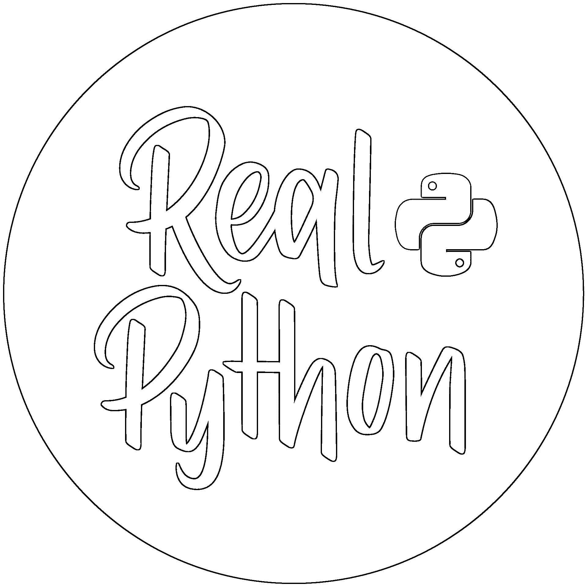](https://realpython.com/products/real-python-course/)

这本电子书是真正的 Python 课程系列的 [*中三本书的第一本。它的目标是帮助您启动并运行，它在实现这一目标方面做得非常好。这本书是解释性散文、示例代码和复习练习的混合体。穿插的复习练习通过让你立即应用你所学的东西来巩固你的学习。*](https://realpython.com/products/real-python-course/)

与前几本书一样，前面提供了在您的计算机上安装和运行 Python 的清晰说明。在设置部分之后，不是给出一个干巴巴的数据类型概述，*真正的 Python* 只是从字符串开始，实际上是相当彻底的:在你读到第 30 页之前，你就学习了字符串切片。

然后，这本书通过向您展示如何使用一些可以应用的类方法，让您很好地感受 Python 的魅力。接下来，您将学习编写函数和循环，使用条件逻辑，使用列表和字典，以及读写文件。

然后事情变得非常有趣！一旦你学会了用`pip`(和从源代码)安装包，*真正的 Python* 涵盖了与 PDF 文件交互和操作，在 Python 内部使用 SQL，从网页抓取数据，使用`numpy`和`matplotlib`做科学计算，最后，用`EasyGUI`和`tkinter`创建图形用户界面。

关于真正的 Python，我最喜欢的是，除了以全面友好的方式讲述基础知识之外，这本书还探索了 Python 的一些其他书都没有触及的更高级的用途，比如网络抓取。还有另外两卷，深入更高级的 Python 开发。*(由大卫·施勒辛格审阅。)*

*   [查看真实的 Python](https://realpython.com/products/real-python-course/)

**免责声明:**几年前，我第一次开始使用*真正的 Python* 书籍，当时它们还处于测试阶段。我当时认为——现在仍然认为——它们是学习 Python 语言及其几种用法的最佳资源之一。我在真正的 Python 网站上写文章是最近的事情，我的评论是完全独立的。—大卫

## 最佳儿童 Python 书籍

下面的书是针对那些对教孩子编程感兴趣的成年人的，同时也有可能让他们自己学习编程。这两本书都推荐给 9 岁或 10 岁的孩子，但它们也非常适合大一点的孩子。

重要的是要注意，这些书并不意味着只是交给一个孩子，取决于他们的年龄。对于想和孩子一起学习 Python 的父母来说，它们是理想的选择。

### 面向儿童的 Python:有趣的编程介绍

杰森·r·布里格斯*(无淀粉，2013)*

[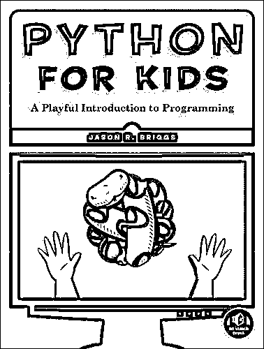](https://realpython.com/asins/1593274076/)

“俏皮”没错！不管书名如何，这是一本老少皆宜的有趣的书。它为 Python 编程提供了清晰易懂的介绍。它有大量的插图，例子简单明了，对于那些想有良好基础的人来说，它是一个可靠的指南。

这本书以一个优秀的、详细的指南开始，介绍如何在你的系统上安装 Python，无论是 Windows、OS X 还是 Ubuntu Linux。然后介绍 Python shell 以及如何将它用作一个简单的计算器。这是为了介绍一些基本概念，如变量和算术运算。

接下来，处理可重复项，这一章通过字符串、列表、元组和字典逐步展开。

一旦完成，Python `turtle`库就被用来开始处理海龟图形，这是一个教孩子编程的流行框架。从那里，这本书通过条件语句，循环，函数和模块前进。

涵盖了类和对象，接下来是关于 Python 内置函数的非常精彩的一节，然后是关于许多有用的 Python 库和模块的一节。本书更详细地回顾了海龟图形，之后介绍了用于创建用户界面、更好的图形甚至动画的`tkinter`。

本书的第 1 部分“学习编程”到此结束，剩下的部分集中在构建两个有趣的应用程序项目上。第一个项目是建立一个单人版本的 [Pong](https://en.wikipedia.org/wiki/Pong) ，名为 Bounce！这集成了函数、类和控制流的编程概念，以及使用`tkinter`创建界面、向画布演示、执行几何计算和使用事件绑定创建交互性的任务。

在第二个项目中，你制作一个侧滚视频游戏，斯蒂克曼先生跑向出口。这个游戏应用了很多和弹跳一样的概念和任务！但是具有更大的深度和增加的复杂性。在这个过程中，你还会接触到开源的图像处理程序 [GIMP](https://www.gimp.org/) ，用来创建你的游戏资产。这本书从这两个游戏中获得了惊人的收益，让它们工作既有教育意义又很有趣。

我非常喜欢这本书。无论你是年轻的，或者只是内心年轻，如果你正在寻找一个有趣的，平易近人的，对 Python 和编程的介绍，你会喜欢这本书。(由大卫·施勒辛格和史蒂文·c·豪厄尔审核。)

*   [亚马逊上的视图](https://realpython.com/asins/1593274076/)
*   [在出版商网站上查看](https://nostarch.com/pythonforkids)

[*Remove ads*](/account/join/)

### 教你的孩子编码:Python 编程的父母友好指南

布赖森·佩恩*(无淀粉，2015)*

[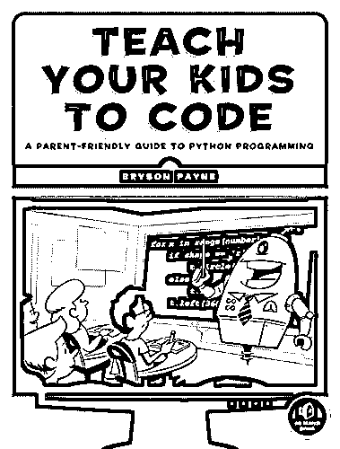](https://realpython.com/asins/1593276141/)

这本书类似于面向儿童的*Python，但更像标题所暗示的那样，是面向与孩子一起学习编码的成年人的。这本书与大多数[入门书籍](#best-books-for-learning-python)的区别在于几乎每一页都使用了颜色和插图。这本书写得很好，把学习编码作为教孩子解决问题技能的一种方式。

通常情况下，这本书从 Python 安装指南开始。与 [*Python for Kids*](#python-for-kids-a-playful-introduction-to-programming) 相比，本书中的指南更加粗略，但完全足够。

第一个活动是海龟图形。这里给出了绘制旋转正方形的一些基本变化，最初没有很多基本的解释，只是为了介绍一般的概念，但在本节结束时，您将会对基础有一个相当好的理解。

接下来，解释 Python 中的计算、变量和数学。一旦字符串被涵盖，这本书将所有这些都带回海龟图形，以增强和探索之前所做的工作。到目前为止，代码解释非常清楚，有明确的逐行细节。你很难理解任何代码。

接下来探索列表，就像`eval()`函数一样。引入循环，然后用它来创建越来越复杂的图形。接下来是条件表达式，还有布尔逻辑和运算符。

`random`图书馆引入了一个猜谜游戏和随机放置的海龟图形螺旋。你可以通过掷骰子和挑牌来进一步探索随机性，这导致你创建了游戏 Yahtzee 和 War。

接下来研究功能、更高级的图形和用户交互。

这本书然后分支覆盖使用 PyGame 创建更高级的图形和动画，然后用户交互创建一个非常简单的绘图程序。

至此，您已经拥有了创建一些真正游戏的所有工具。介绍了 Pong 的全功能版本和泡泡游戏的开发。两者都提供了足够的深度来提出一些挑战和保持兴趣。

我最喜欢这本书的地方是它的大量编程挑战，以及每章结尾的精彩总结，提醒你涵盖了哪些内容。如果你和你的孩子对编程感兴趣，这本书会带你们走得更远，你们会有很多乐趣。正如作者 Bryson Payne 博士在他最近的 TEDx 演讲中所说，“走出你的舒适区，学会使用技术语言。”*(大卫·施勒辛格和史蒂文·c·豪厄尔评论。)*

*   [亚马逊上的视图](https://realpython.com/asins/1593276141/)
*   [在出版商网站上查看](https://nostarch.com/teachkids)

## 最佳中级和高级 Python 书籍

了解 Python 是一回事。知道什么是 Pythonic 需要练习。有时 Python 的低门槛会给人一种错误的想法，认为这种语言不如其他语言，认为风格无关紧要，或者认为最佳实践只是个人偏好的问题。你见过看起来像 C 或 Fortran 的 Python 代码吗？

学习如何有效地使用 Python 需要对 Python 的本质有所了解。Python 编程利用 Python 语言的实现方式来最大化代码的效率。

幸运的是，有一些优秀的书籍，包含了专家的指导，旨在帮助你掌握你所学的知识，提高你的技能。本节中的任何一本书都会让你对 Python 编程概念有更深入的理解，并教你如何编写*开发者风格的* Python 代码。注意，这些绝不是入门书籍。它们不包括入门的基础知识。如果你已经在用 Python 编程，并且想在成为一名真正的 Python 爱好者的道路上进一步磨练你的技能，这些书将会很有帮助。

### Python 技巧:令人敬畏的 Python 特性自助餐

丹·巴德 *(dbader.org，2017)*

[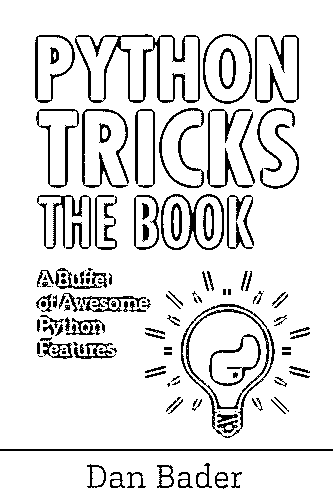](https://realpython.com/asins/1775093301/)

本书阐释了鲜为人知的宝贵 Python 特性和最佳实践，旨在帮助您更深入地了解 Python。43 个小节中的每一个都提出了一个不同的概念，称为 Python 技巧，讨论和易于理解的代码示例说明了如何利用这个概念。

本书的内容分为以下几个部分:

*   更干净 Python 的模式
*   有效功能
*   类和面向对象
*   Python 中常见的数据结构
*   循环和迭代
*   字典技巧
*   Pythonic 生产力技术

正如封面上所说，内容被组织成“自助餐”，每个小节都是一个独立的主题，有简短的介绍、示例、讨论和一系列关键要点。因此，你可以随意跳到最吸引人的部分。

除了这本书之外，我特别喜欢 12 个额外的视频，当你购买这本书作为电子书时可以看到。它们的平均长度为 11 分钟，非常适合在午餐时间观看。每个视频都使用清晰简洁的代码示例来说明不同的概念，这些代码示例易于复制。虽然一些视频涵盖了熟悉的概念，但它们仍然提供了有趣的见解，没有拖沓。史蒂文·c·豪厄尔评论。)

*   [亚马逊上的视图](https://realpython.com/asins/1775093301/)
*   [查看真实的 Python](https://realpython.com/products/python-tricks-book/)

**免责声明:**虽然这本书是通过 Real Python 正式发行的，但我还是独立于我与 Real Python 的联系推荐它。在我有机会为真正的 Python 写作之前，我在这本书首次发行时购买了它。为了进一步证明这本书的价值，查看一下[亚马逊评论](https://realpython.com/asins/1775093301/#customerReviews) : 148，平均 4.8 分(5 颗星)。—史蒂夫

[*Remove ads*](/account/join/)

### 流畅的 Python:清晰、简洁、有效的编程

卢西亚诺·拉马拉*(∞2014)*

[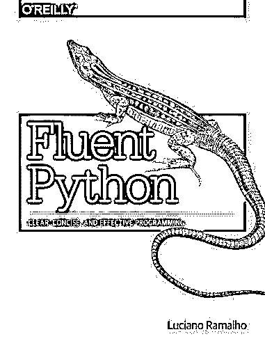](https://realpython.com/asins/1491946008/)

这本书是为希望精通 Python 3 的有经验的 Python 2 程序员编写的。因此，这本书非常适合那些有着扎实的 Python 基础(2 或 3)的人，他们希望自己的技能更上一层楼。此外，这本书也可以作为一个来自其他语言的有经验的程序员的参考，他想要查找“我如何在 Python 中做`<x>`？”

这本书是按主题组织的，所以每一部分都可以独立阅读。虽然本书中涉及的许多主题都可以在入门书籍中找到，但 *Fluent Python* 提供了更多的细节，阐明了 Python 语言的许多更微妙且被忽视的特性。

这些章节分为以下六个部分:

1.  **序言**:介绍 Python 的面向对象特性和保持 Python 库一致性的特殊方法
2.  **数据结构**:涵盖序列、映射、集合、`str`和`bytes`的区别
3.  **作为对象的函数**:解释函数在 Python 语言中作为一级对象的后果
4.  面向对象的习惯用法:包括引用、可变性、实例、多重继承和操作符重载
5.  **控制流**:扩展了基本条件，涵盖了生成器、上下文管理器、协同程序、`yield from`语法和使用`asyncio`的并发性的概念
6.  元编程:探索类的鲜为人知的方面，讨论动态属性和特性、属性描述符、类装饰符和元类

几乎每一页都有代码示例，并且有编号的标注将代码行链接到有用的描述，这本书非常平易近人。此外，代码示例面向交互式 Python 控制台，这是一种探索和学习所介绍概念的实用方法。

当我有一个关于 Python 的问题时，我会求助于这本书，希望得到一个比栈溢出更全面的解释。当我有一点空闲时间，只想学点新东西的时候，我也喜欢读这本书。不止一次，我发现我最近从这本书上学到的一个概念出乎意料地成为我必须解决的一个问题的完美解决方案。史蒂文·c·豪厄尔评论。)

*   [亚马逊上的视图](https://realpython.com/asins/1491946008/)
*   [在出版商网站上查看](http://shop.oreilly.com/product/0636920032519.do)

### 有效的 Python:写出更好的 Python 的 59 种方法

布雷特·斯拉特金*(艾迪森-韦斯利，2015 年)*

[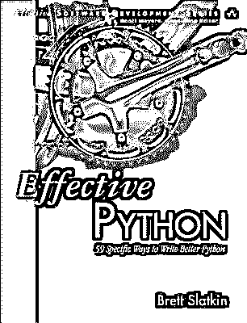](https://realpython.com/asins/0134034287/)

这本书是 59 篇独立文章的集合，这些文章建立在对 Python 的基本理解之上，教授 Python 最佳实践、鲜为人知的功能和内置工具。这些主题的复杂性各不相同，从了解您使用的 Python 版本这一简单概念开始，到识别内存泄漏这一更复杂但通常被忽略的概念结束。

每篇文章都是示例代码、讨论和需要记住的事情列表的组合。

因为每篇文章都是独立的，所以这是一本很好的书，可以让你专注于最适用或有趣的主题。这也使得它非常适合一次阅读一篇文章。每篇文章大约两到四页长，你可以每天抽出时间读一篇文章，在两到三个月内读完这本书(取决于你是否在周末阅读)。

文章分为以下 8 章:

1.  **Python 思维**:介绍执行常见任务的最佳方式，同时利用 Python 的实现方式
2.  **函数**:阐明 Python 函数的细微差别，并概述如何使用函数来阐明意图、促进重用和减少错误
3.  **类和继承**:概述了使用 Python 类时的最佳实践
4.  **元类和属性**:阐明元类这个有点神秘的话题，教你如何使用它们来创建直观的功能
5.  **并发和并行**:解释如何用 Python 编写多线程应用
6.  **内置模块**:引入一些 Python 鲜为人知的内置库，使您的代码更加有用和可靠
7.  **协作**:讨论适当的文档、打包、依赖性和虚拟环境
8.  **生产**:涵盖调试、优化、测试和内存管理等主题

如果你有一个坚实的 Python 基础，并想填补漏洞，加深理解，并学习一些不太明显的 Python 特性，这将是一本适合你的好书。史蒂文·c·豪厄尔评论。)

*   [亚马逊上的视图](https://realpython.com/asins/0134853989/)
*   [在作者网站上查看](https://effectivepython.com/)

[*Remove ads*](/account/join/)

### Python 食谱

大卫·比兹利和布莱恩·k·琼斯*(奥莱利，2013 年第三版)*

[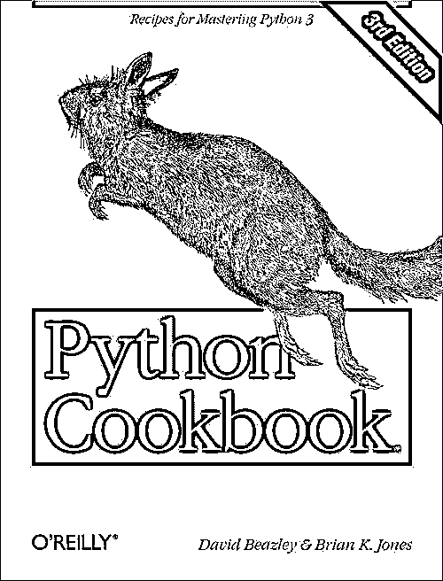](https://realpython.com/asins/1449340377/)

使这本书脱颖而出的是它的详细程度。代码*烹饪书*通常被设计成短小精悍的手册，用来说明做日常工作的巧妙方法。在这种情况下， *Python 食谱*中的每个食谱都有一个扩展的代码解决方案，以及作者对该解决方案的一些特定元素的讨论。

每个配方都以一个清晰的问题陈述开始，例如，“您想要编写一个装饰器，向包装函数的调用签名添加一个额外的参数。”然后，它跳转到一个使用现代的、惯用的 Python 3 代码、模式和数据结构的解决方案，通常花费 4 到 5 页来讨论这个解决方案。

基于它更复杂的例子，以及作者在前言中的推荐，这可能是我们列表中最高级的 Python 书籍。尽管如此，如果您认为自己是中级 Python 程序员，也不要害怕。到底是谁在评判？有句老话是这样说的:

> “成为更好的篮球运动员的最好方法是输给你能找到的最好的运动员，而不是打败最差的运动员。”

你可能会看到一些你没有完全理解的代码块——过几个月再来看。在你掌握了一些额外的概念后，重读这些章节，你会突然明白。大多数章节开始时相当简单，然后逐渐变得更加激烈。

这本书的后半部分举例说明了装饰模式、闭包、访问函数和回调函数等设计。

从可靠的来源阅读总是好的，这本书的作者当然符合这一要求。大卫·比兹利是 PyCon 等活动的主题演讲人，也是 [*Python 基本参考*](https://realpython.com/asins/0672329786/) 的作者。同样，Brian K. Jones 是一名首席技术官，也是一本 Python 杂志的创始人，还是普林斯顿的 [Python 用户组(PUG-IP)](https://www.meetup.com/pug-ip/?_cookie-check=09STgWAF3KD4GDD6) 的创始人。

这个特别的版本是用 Python 3.3 编写和测试的。(由布拉德·所罗门审核。)

*   [亚马逊上的视图](https://realpython.com/asins/1449340377/)
*   [在出版商网站上查看](http://shop.oreilly.com/product/0636920027072.do)

* * *

## 获取编码！

Python 令人惊叹的一点是，与许多其他语言相比，它的入门门槛相对较低。尽管如此，学习 Python 是一个永无止境的过程。这种语言与如此广泛的任务相关，并且发展如此之快，以至于总会有新的东西需要发现和学习。虽然您可以在一两周内学会足够多的 Python 来做一些有趣的事情，但是使用 Python 二十年的人会告诉您，他们仍然在学习使用这种灵活且不断发展的语言可以做的新事情。

要最终成为一名成功的 Python 程序员，您需要从一个坚实的基础开始，然后更深入地理解这种语言是如何工作的，以及如何最好地使用它。为了获得坚实的基础，学习 Python 的任何一本[最佳书籍](#best-books-for-learning-python)都不会错。如果你想和孩子一起学习 Python，或者教一群孩子，看看[儿童最佳 Python 书籍列表](#best-python-books-for-kids)。熟悉之后，看看一些[最好的中级和高级 Python 书籍](#best-intermediate-and-advanced-python-books)，深入挖掘那些不太明显的概念，这将提高代码的效率。

所有这些书都将教你需要知道什么才能称自己为合法的 Python 程序员。唯一缺少的成分是*你*。********