# Brython:浏览器中的 Python

> 原文：<https://realpython.com/brython-python-in-browser/>

如果你是一个喜欢编写 Python 而不是 JavaScript 的 web 开发人员，那么运行在浏览器中的 Python 实现 [Brython](https://brython.info/) 可能是一个有吸引力的选择。

[JavaScript](https://developer.mozilla.org/en-US/docs/Web/JavaScript) 是**前端 web 开发**的事实语言。复杂的 JavaScript 引擎是所有现代互联网浏览器的固有部分，自然会驱使开发人员用 JavaScript 编写前端 web 应用程序。 **Brython** 通过让 Python 成为浏览器中的一级公民语言，并可以访问浏览器中所有现有的 JavaScript 库和 API，提供了两个世界的最佳选择。

**在本教程中，您将学习如何:**

*   在您的本地环境中安装 Brython
*   在浏览器中使用**Python**
*   编写与 JavaScript 交互的 Python 代码
***   使用您的 web 应用程序部署 **Python***   用 Python 创建**浏览器扩展***   将 Brython 与 web 应用程序的其他 Python 实现进行比较*

*作为一名熟悉 [web 开发](https://realpython.com/learning-paths/become-python-web-developer/)的中级 Python 开发人员，如果你还具备一些 [HTML](https://developer.mozilla.org/en-US/docs/Learn/HTML) 和 JavaScript 的知识，你将从本教程中获益匪浅。对于 JavaScript 复习者，请查看[Python vs . Python istas 的 JavaScript](https://realpython.com/python-vs-javascript/)。

您可以通过单击下面的链接下载本教程中示例的源材料:

**获取源代码:** [点击此处获取源代码，您将在本教程中使用](https://realpython.com/bonus/brython-browser-python-code/)了解如何使用 Brython 在浏览器中运行 Python。

## 在浏览器中运行 Python:好处

尽管 JavaScript 是前端 web 开发中无处不在的语言，但以下几点可能适用于您:

*   你可能不喜欢用 JavaScript 写代码。
*   您可能想要利用您的 Python 技能。
*   您可能不想花时间学习 JavaScript 来探索浏览器技术。
*   您可能不喜欢被迫学习和使用 JavaScript 来实现 web 应用程序。

不管是什么原因，许多开发人员更喜欢使用基于 Python 的替代方案来利用浏览器的功能，而不是 JavaScript。

在浏览器中运行 Python 有几个好处。它允许您:

*   在服务器和浏览器中执行相同的 Python 代码
*   使用 Python 与各种浏览器 API 协同工作
*   用 Python 操作文档对象模型(DOM)
*   使用 Python 与现有的 JavaScript 库如 Vue.js 和 jQuery 进行交互
*   使用 Brython 编辑器向 Python 学生教授 Python 语言
*   用 Python 编程时保持趣味性

与 JavaScript 中的相同代码相比，在浏览器中使用 Python 的一个副作用是性能损失。然而，这个缺点并没有超过上面概述的任何好处。

[*Remove ads*](/account/join/)

### 实现同构 Web 开发

[同构 JavaScript](https://en.wikipedia.org/wiki/Isomorphic_JavaScript) ，或者说**通用 JavaScript** ，强调 JavaScript 应用要同时运行在客户端和服务器端。这是假设后端是基于 JavaScript 的，即一个[节点](https://nodejs.org/en/)服务器。使用 [Flask](https://realpython.com/learning-paths/flask-by-example/) 或 [Django](https://realpython.com/tutorials/django/) 的 Python 开发者也可以将同构原理应用于 Python，前提是他们可以在浏览器中运行 Python。

Brython 允许您用 Python 构建前端，并在客户机和服务器之间共享模块。例如，您可以共享验证函数，如以下代码，该代码对美国电话号码进行规范化和验证:

```py
 1import re
 2
 3def normalize_us_phone(phone: str) -> str:
 4    """Extract numbers and digits from a given phone number"""
 5    return re.sub(r"[^\da-zA-z]", "", phone)
 6
 7def is_valid_us_phone(phone: str) -> bool:
 8    """Validate 10-digit phone number"""
 9    normalized_number = normalize_us_phone(phone)
10    return re.match(r"^\d{10}$", normalized_number) is not None
```

`normalize_us_phone()`消除任何非字母数字字符，而如果输入字符串恰好包含十位数字且不包含字母字符，则`is_valid_us_phone()`返回`True`。相同的代码可以在 Python 服务器上运行的进程和使用 Brython 构建的客户端之间共享。

### 访问网络应用编程接口

互联网浏览器将标准化的 web APIs 暴露给 JavaScript。这些标准是 T2 HTML 生活标准 T3 的一部分。一些 web API 示例包括:

*   [网络存储](https://developer.mozilla.org/en-US/docs/Web/API/Web_Storage_API)
*   [网络加密](https://developer.mozilla.org/en-US/docs/Web/API/Web_Crypto_API)
*   [网络工作者](https://developer.mozilla.org/en-US/docs/Web/API/Web_Workers_API)
*   [历史](https://developer.mozilla.org/en-US/docs/Web/API/History)
*   [网址](https://developer.mozilla.org/en-US/docs/Web/API/URL_API)

Brython 允许您使用 web APIs 并与 JavaScript 交互。您将在后面的章节中使用一些 web APIs。

### 原型和 JavaScript 库

Python 经常被用于构建代码片段、语言结构或更大想法的原型。有了 Brython，这种常见的编码实践在您的浏览器中变得可用。例如，你可以使用 [Brython 控制台](https://brython.info/tests/console.html)或交互式[编辑器](https://brython.info/tests/editor.html)来试验一段代码。

打开在线编辑器，键入以下代码:

```py
 1from browser import ajax
 2
 3def on_complete(req):
 4    print(req.text)
 5
 6language = "fr"
 7
 8ajax.get(f"https://fourtonfish.com/hellosalut/?lang={language}",
 9         blocking=True,
10         oncomplete=on_complete)
```

下面是这段代码的工作原理:

*   **线 1** [进口](https://realpython.com/python-import/)`ajax`模块。
*   **第 3 行**定义了`on_complete()`，得到`ajax.get()`响应后调用的[回调函数](https://developer.mozilla.org/en-US/docs/Glossary/Callback_function)。
*   **第 6 行**使用 [HelloSalut API](https://fourtonfish.com/project/hellosalut-api/) 调用`ajax.get()`来检索法语中“hello”的翻译。注意，当您在 Brython 编辑器中执行这段代码时，`blocking`可以是`True`或`False`。如果您在 Brython 控制台中执行相同的代码，则需要使用`True`。

点击输出窗格上方的*运行*以查看以下结果:

```py
{"code":"fr","hello":"Salut"} <completed  in  5.00  ms>
```

尝试将语言从`fr`修改为`es`并观察结果。该 API 支持的语言代码在 [HelloSalut 文档](https://fourtonfish.com/project/hellosalut-api/)中列出。

**注** : HelloSalut 是互联网上可用的公共 API 之一，列在[公共 APIs GitHub 项目](https://github.com/public-apis/public-apis)中。

您可以在在线编辑器中修改代码片段，以使用不同的公共 API。例如，尝试从[公共 API 项目](https://api.publicapis.org/)中获取一个[随机公共 API](https://github.com/davemachado/public-api#get-random) :

```py
 1from browser import ajax
 2
 3def on_complete(req):
 4    print(req.text)
 5
 6ajax.get("https://api.publicapis.org/random",
 7         blocking=True,
 8         oncomplete=on_complete)
```

将上面的代码复制到在线 Brython 编辑器中，然后单击 *Run* 来显示结果。下面是一个 JSON 格式的例子:

```py
{ "count":  1, "entries":  [ { "API":  "Open Government, USA", "Description":  "United States Government Open Data", "Auth":  "", "HTTPS":  true, "Cors":  "unknown", "Link":  "https://www.data.gov/", "Category":  "Government" } ] }
```

因为端点获取一个随机项目，所以您可能会得到不同的结果。有关 JSON 格式的更多信息，请查看在 Python 中使用 JSON 数据的[。](https://realpython.com/python-json/)

您可以像在 [Python 解释器](https://docs.python.org/3/tutorial/interpreter.html)中一样，使用原型来尝试常规的 Python 代码。因为您是在浏览器环境中，所以 Brython 还提供了以下方法:

*   了解如何使用[web API](https://developer.mozilla.org/en-US/docs/Web/API)
*   与[文档对象模型](https://developer.mozilla.org/en-US/docs/Web/API/Document_Object_Model)交互
*   使用现有的 JavaScript 库，如 [jQuery](https://jquery.com/) 、 [D3](https://d3js.org/) 和 [Bokeh](https://docs.bokeh.org/en/latest/index.html) 以及 JavaScript UI 框架，如 [Vue.js](https://vuejs.org/)

作为一种快捷方式，您可以通过打开 Brython 网站上的控制台或编辑器来利用上述大多数功能。这不需要您在本地计算机上安装或运行任何东西。相反，它为您提供了一个与 Python 和 web 技术互动的在线平台。

[*Remove ads*](/account/join/)

### 向学生教授 Python

Brython 既是 Python 编译器，也是用 JavaScript 编写的解释器。因此，您可以在浏览器中编译和运行 Python 代码。Brython 网站上的在线编辑器展示了这一特性的一个很好的例子。

使用在线编辑器，Python 在浏览器中运行。不需要[在机器上安装 Python](https://realpython.com/installing-python/) ，也不需要发送代码到服务器执行。对于用户来说，反馈是即时的，这种方法不会将后端暴露给恶意脚本。学生们可以在任何装有工作浏览器的设备上使用 Python 进行实验，比如手机或 Chromebooks，即使是在网络连接不稳定的情况下。

### 将性能考虑在内

Brython 网站指出，该实现的[执行速度](https://brython.info/speed_results.html)与 CPython 相当。但是 Brython 是在浏览器中执行的，这个环境中的引用是烘焙到浏览器引擎中的 JavaScript。因此，预计 Brython 会比手写的、经过良好调整的 JavaScript 慢。

Brython 将 Python 代码编译成 JavaScript，然后执行生成的代码。这些步骤对整体性能有影响，并且 Brython 可能不总是满足您的性能要求。在某些情况下，您可能需要将一些代码执行委托给 JavaScript，甚至是 [WebAssembly](https://webassembly.org/) 。在关于 [WebAssembly](#webassembly) 的一节中，您将看到如何构建 WebAssembly 以及如何使用 Python 中的结果代码。

但是，不要让感知到的性能影响您使用 Brython。例如，导入 Python 模块可能会导致从服务器下载相应的模块。为了说明这种情况，请打开 Brython 控制台并执行以下代码:

>>>

```py
>>> import uuid
```

直到显示提示的延迟(在测试机器上为 390 ms)是明显的。这是因为 Brython 必须下载`uuid`及其依赖项，然后编译下载的资源。然而，从那一点开始，在执行`uuid`中可用的功能时没有延迟。例如，您可以用下面的代码生成一个[随机通用唯一标识符](https://en.wikipedia.org/wiki/Universally_unique_identifier#Version_4_(random))，UUID 版本 4:

>>>

```py
>>> uuid.uuid4()
UUID('291930f9-0c79-4c24-85fd-f76f2ada0b2a')
```

调用`uuid.uuid4()`生成一个 [`UUID`](https://docs.python.org/3/library/uuid.html#uuid.UUID) 对象，其字符串表示打印在控制台中。调用`uuid.uuid4()`会立即返回，比最初导入`uuid`模块要快得多。

### 玩得开心

如果您正在阅读本教程，那么您可能对在浏览器中编写 Python 代码感兴趣。对于大多数 Python 爱好者来说，看到 Python 代码在浏览器中执行是令人兴奋的，它唤醒了一种乐趣和无尽的可能性。

Brython 的作者 Pierre Quentel 和该项目的贡献者们在承担使这种语言与网络浏览器兼容的巨大任务的同时，也牢记着 Python 的乐趣。

为了证明这一点，将您的浏览器指向 Brython 交互式控制台，并在 Python 提示符下键入以下内容:

```py
import this
```

与 Python 在本地机器上的体验类似，Brython 动态编译并执行指令，并打印出 Python 的禅。它发生在浏览器中，Python 代码的执行不需要与后端服务器进行任何交互:

[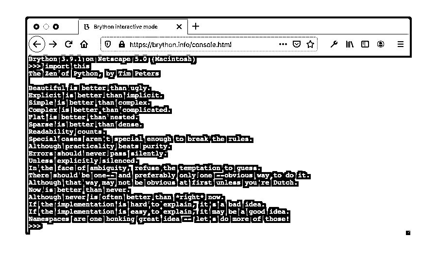](https://files.realpython.com/media/brython_console.93b0a40d6b6e.png)

您还可以在相同的浏览器环境中使用以下代码尝试另一个经典 Python [复活节彩蛋](https://en.wikipedia.org/wiki/Easter_egg_%28media%29):

```py
import antigravity
```

Brython 包含了与 Python 参考实现中相同的[幽默](https://www.python.org/doc/humor/)。

现在您已经熟悉了使用 Brython 的基础知识，您将在下面的小节中探索更多的高级特性。

[*Remove ads*](/account/join/)

## 安装 Brython

尝试 Brython 的在线控制台是一个好的开始，但它不允许您部署 Python 代码。在本地环境中安装 Brython 有几种不同的选择:

*   [CDN](#cdn-installation)
*   [GitHub](#github-installation)
*   [黑桃](#pypi-installation)
*   [npm](#npm-installation)

下面列出了每种方法的说明，但是如果你已经做了决定，可以直接跳到你喜欢的方法。

### CDN 安装

[内容交付网络(CDN)](https://en.wikipedia.org/wiki/Content_delivery_network) 是一个服务器网络，可以提高在线内容的性能和下载速度。您可以从几个不同的 cdn 安装 Brython 库:

*   [CDNJS](https://cdnjs.com/libraries/brython)
*   jsdelivr
*   [CDNPKG](https://www.cdnpkg.com/brython)

如果您想部署一个静态网站，并以最小的开销向您的页面添加一些动态行为，您可以选择此安装。除了使用 Python 而不是 JavaScript 之外，您可以将此选项视为对 [jQuery](https://jquery.com/) 的替代。

为了说明 Brython 和 CDN 的用法，我们将使用 CDNJS。使用以下 HTML 代码创建一个文件:

```py
 1<!doctype html>
 2<html>
 3    <head>
 4        <script
 5          src="https://cdnjs.cloudflare.com/ajax/libs/brython/3.9.0/brython.js">  6  </script>
 7    </head>
 8    <body onload="brython()"> 9        <script type="text/python">  10  import  browser  11  browser.alert("Hello Real Python!")  12  </script>
13    </body>
14</html>
```

以下是该 HTML 页面的关键元素:

*   **线 5** 从 CDNJS 装载`brython.js`。

*   **第 8 行**在[文件加载完成](https://developer.mozilla.org/en-US/docs/Web/API/GlobalEventHandlers/onload)后执行`brython()`。`brython()`读取当前作用域内的 Python 代码，编译成 JavaScript。更多细节请参见[了解 Brython 如何工作](#understanding-how-brython-works)一节。

*   **第 9 行**设置脚本的类型为`text/python`。这向 Brython 表明需要编译和执行哪些代码。

*   **第 10 行**导入了`browser`，这是一个 Brython 模块，它公开了允许与浏览器交互的对象和函数。

*   **第 11 行**调用`alert()`，显示一个消息框，文本为`"Hello Real Python!"`

将文件另存为`index.html`，然后双击该文件，用默认的互联网浏览器打开它。浏览器显示一个消息框，点击*确定*关闭消息框:

[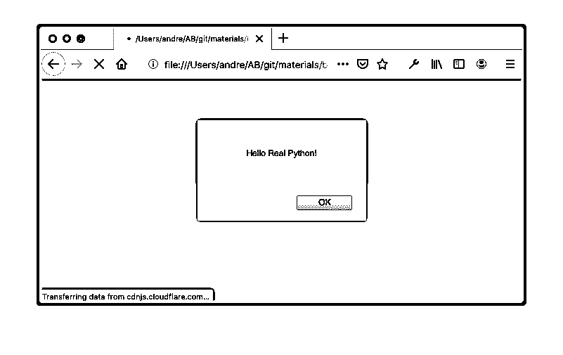](https://files.realpython.com/media/alert_hello_rp.17d47dea5175.png)

为了减小下载文件的大小，尤其是在生产中，请考虑使用最小化版本的`brython.js`:

```py
 1<script
 2  src="https://cdnjs.cloudflare.com/ajax/libs/brython/3.9.0/brython.min.js"> 3</script>
```

从用户的角度来看，最小化版本将减少下载时间和感知延迟。在[了解 Brython 如何工作](#understanding-how-brython-works)中，您将了解浏览器如何加载 Brython 以及如何执行上面的 Python 代码。

### GitHub 安装

GitHub 安装与 CDN 安装非常相似，但是它允许您使用最新的开发版本实现 Brython 应用程序。您可以复制前面的示例，并修改`head`元素中的 URL，以获得下面的`index.html`:

```py
<!doctype html>
<html>
  <head>
    <script
      src="https://raw.githack.com/brython-dev/brython/master/www/src/brython.js"> </script>
  </head>
  <body onload="brython()">
    <script type="text/python"> import  browser browser.alert("Hello Real Python!") </script>
  </body>
</html>
```

将该文件保存到本地目录后，双击`index.html`在浏览器中呈现您在安装 CDN 时获得的相同页面。

[*Remove ads*](/account/join/)

### PyPI 安装

到目前为止，您还不需要在本地环境中安装任何东西。相反，您已经在 HTML 文件中指出了浏览器可以在哪里找到 Brython 包。当浏览器打开页面时，它会从适当的环境(CDN 或 GitHub)下载 Brython JavaScript 文件。

Brython 也可以本地安装在 [PyPI](https://pypi.org/project/brython/) 上。PyPI 安装适合您，如果:

*   在指向 CDN 文件时，您需要对 Brython 环境进行更多的控制和定制。
*   你的背景是 Python，你熟悉 [`pip`](https://realpython.com/what-is-pip/) 。
*   您希望在开发过程中进行本地安装以最小化网络延迟。
*   您希望以更细粒度的方式管理您的项目和可交付成果。

从 PyPI 安装 Brython 会安装`brython_cli`，这是一个命令行工具，您可以使用它来自动化一些功能，例如生成项目模板或打包和捆绑模块，以简化 Brython 项目的部署。

要了解更多细节，您可以查阅[本地安装文档](https://brython.info/static_doc/en/install.html)，查看安装后`brython-cli`在您的环境中可用的功能。`brython-cli`仅适用于这种类型的安装。如果您从 [CDN](#cdn-installation) 或使用 [npm](#npm-installation) 安装，则它不可用。在本教程的后面，你将看到`brython-cli`的实际应用。

在安装 Brython 之前，您需要为这个项目创建一个 [Python 虚拟环境](https://realpython.com/python-virtual-environments-a-primer/)。

在 Linux 或 macOS 上，执行以下命令:

```py
$ python3 -m venv .venv --prompt brython
$ source .venv/bin/activate
(brython) $ python -m pip install --upgrade pip
Collecting pip
 Downloading pip-20.2.4-py2.py3-none-any.whl (1.5 MB)
 |████████████████████████████████| 1.5 MB 1.3 MB/s
Installing collected packages: pip
 Attempting uninstall: pip
 Found existing installation: pip 20.2.3
 Uninstalling pip-20.2.3:
 Successfully uninstalled pip-20.2.3
```

在 Windows 上，您可以进行如下操作:

```py
> python3 -m venv .venv --prompt brython
> .venv\Scripts\activate
(brython) > python -m pip install --upgrade pip
Collecting pip
 Downloading pip-20.2.4-py2.py3-none-any.whl (1.5 MB)
 |████████████████████████████████| 1.5 MB 1.3 MB/s
Installing collected packages: pip
 Attempting uninstall: pip
 Found existing installation: pip 20.2.3
 Uninstalling pip-20.2.3:
 Successfully uninstalled pip-20.2.3
```

您已经为您的项目创建了一个专用的 Python 环境，并用最新版本更新了`pip`。

在接下来的步骤中，您将安装 Brython 并创建一个默认项目。这些命令在 Linux、macOS 和 Windows 上是相同的:

```py
(brython) $ python -m pip install brython
Collecting brython
 Downloading brython-3.9.0.tar.gz (1.2 MB)
 |████████████████████████████████| 1.2 MB 1.4 MB/s
Using legacy 'setup.py install' for brython, since package 'wheel'
is not installed.
Installing collected packages: brython
 Running setup.py install for brython ... done
(brython) $ mkdir web
(brython) $ cd web
(brython) $ brython-cli --install
Installing Brython 3.9.0
done
```

您已经从 PyPI 安装了 Brython，创建了一个名为`web`的空文件夹，并通过执行安装期间在虚拟环境中复制的`brython-cli`生成了默认的项目框架。

在`web`文件夹中，`brython-cli --install`创建了一个项目模板，并生成了以下文件:

| 文件 | 描述 |
| --- | --- |
| `README.txt` | 关于如何运行 Python HTTP 服务器并打开`demo.html`的文档 |
| `brython.js` | 核心 Brython 引擎(编译器、运行时和浏览器界面) |
| `brython_stdlib.js` | 布里森标准图书馆 |
| `demo.html` | [Brython 演示 HTML 页面](https://brython.info/demo.html)的源代码 |
| `index.html` | 可以用作项目起始页的基本示例 |
| `unicode.txt` | [`unicodedata`](https://docs.python.org/3/library/unicodedata.html) 使用的 Unicode 字符数据库(UCD) |

为了测试这个新创建的 web 项目，您可以使用以下命令启动一个本地 Python web 服务器:

```py
(brython) $ python -m http.server
Serving HTTP on :: port 8000 (http://[::]:8000/) ...
```

当您执行`python -m http.server`时，Python 在端口 8000 上启动一个 web 服务器。期望的默认页面是`index.html`。将您的互联网浏览器指向`http://localhost:8000`，显示一个带有文本`Hello`的页面:

[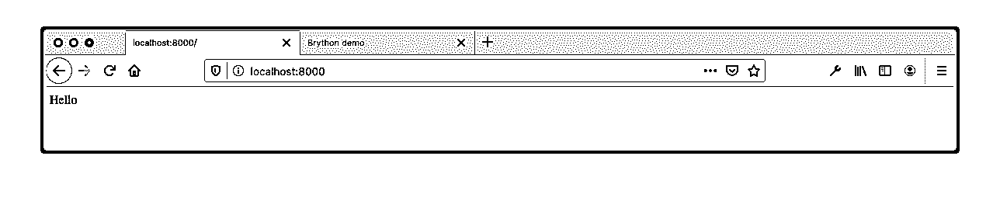](https://files.realpython.com/media/brython_index.743c41c96830.png)

更完整的例子，你可以把浏览器地址栏里的[网址](https://en.wikipedia.org/wiki/URL)改成`http://localhost:8000/demo.html`。您应该会看到一个类似于 Brython 演示页面的页面:

[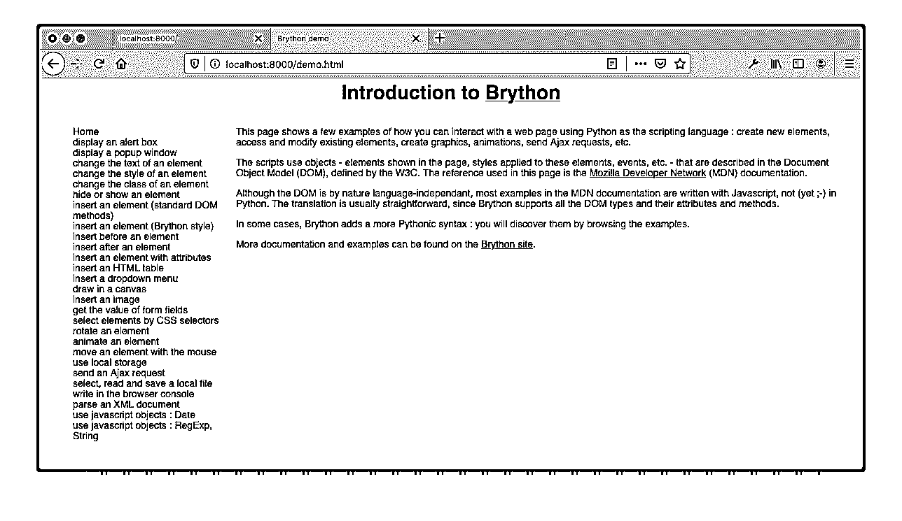](https://files.realpython.com/media/brython_demo.5d14c684988c.png)

使用这种方法，Brython JavaScript 文件直接从本地环境加载。注意`index.html`的`head`元素中的`src`属性:

```py
 1<!doctype html>
 2<html>
 3  <head>
 4   <meta charset="utf-8">
 5   <script type="text/javascript" src="brython.js"></script>
 6   <script type="text/javascript" src="brython_stdlib.js"></script> 7  </head>
 8  <body onload="brython(1)"> 9    <script type="text/python"> 10  from  browser  import  document  11  document  <=  "Hello"  12  </script>
13  </body>
14</html>
```

上面的 HTML 是缩进的，以增强本教程的可读性。命令`brython_cli --install`不缩进它生成的初始 HTML 模板。

HTML 文件引入了一些新的 Brython 特性:

*   **第 6 行**加载`brython_stdlib.js`，编译成 JavaScript 的 Python 标准库。

*   **第 8 行**用参数`1`调用`brython()`将错误信息打印到[浏览器控制台](https://developer.mozilla.org/en-US/docs/Tools/Browser_Console)。

*   **10 号线**从`browser`导入`document`模块。访问 DOM 的函数在`document`中可用。

*   **第 11 行**显示了作为[语法糖](https://en.wikipedia.org/wiki/Syntactic_sugar)添加到 Python 中的新符号(`<=`)。在这个例子中，`document <= "Hello"`是`document.body.appendChild(document.createTextNode("Hello"))`的替代品。关于这些 DOM 函数的详细信息，请查看 [`Document.createTextNode`](https://developer.mozilla.org/en-US/docs/Web/API/Document/createTextNode) 。

操作符`<=`用于向 DOM 元素添加子节点。您将在[的 Brython](#the-dom-api-in-brython) 的 DOM API 中看到关于使用特定于 Brython 的操作符的更多细节。

[*Remove ads*](/account/join/)

### npm 安装

如果你精通 JavaScript 生态系统，那么 [npm 安装](https://www.npmjs.com/package/brython)可能会吸引你。在执行此安装之前，需要 [Node.js](https://nodejs.org/en/) 和 [npm](https://www.npmjs.com/) 。

使用 npm 安装将使 JavaScript Brython 模块像其他 JavaScript 模块一样在您的项目中可用。然后，您将能够利用您最喜欢的 JavaScript 工具来测试、打包和部署 Brython 解释器和库。如果您已经在 npm 中安装了现有的 JavaScript 库，那么这种安装是理想的。

**注意**:如果您的系统上没有安装 Node.js 和 npm，那么考虑阅读本节的剩余部分，因为您可以安全地跳过安装本身。对于任何示例，本教程的其余部分都不依赖于 npm 安装方法。

假设您的系统上安装了 npm，通过调用空目录中的`npm init --yes`创建一个默认的 [`package.json`文件](https://docs.npmjs.com/creating-a-package-json-file):

```py
$ npm init --yes
Wrote to /Users/john/projects/brython/npm_install/package.json:

{
 "name": "npm_install",
 "version": "1.0.0",
 "description": "",
 "main": "index.js",
 "scripts": {
 "test": "echo \"Error: no test specified\" && exit 1"
 },
 "keywords": [],
 "author": "",
 "license": "ISC"
}
```

要将 Brython 集成到您的项目中，请执行以下命令:

```py
$ npm install brython
npm notice created a lockfile as package-lock.json. You should commit this file.
npm WARN npm_install@1.0.0 No description
npm WARN npm_install@1.0.0 No repository field.

+ brython@3.9.0
added 1 package from 1 contributor and audited 1 package in 1.778s
found 0 vulnerabilities
```

您可以忽略这些警告，并注意到 Brython 已添加到您的项目中。要确认，打开`package.json`并确保有一个`dependencies`属性指向一个包含`brython`条目的对象:

```py
 1{ 2  "name":  "npm_install", 3  "version":  "1.0.0", 4  "description":  "", 5  "main":  "index.js", 6  "scripts":  { 7  "test":  "echo \"Error: no test specified\" && exit 1" 8  }, 9  "author":  "", 10  "license":  "ISC", 11  "dependencies":  {  12  "brython":  "^3.9.0"  13  }  14}
```

至于前面的例子，你可以创建下面的`index.html`并用浏览器打开它。这个例子不需要 web 服务器，因为浏览器能够在本地加载 JavaScript 文件`node_modules/brython/brython.js`:

```py
 1<!doctype html>
 2<html>
 3<head>
 4  <meta charset="utf-8">
 5  <script
 6    type="text/javascript"
 7    src="node_modules/brython/brython.js" defer> 8  </script>
 9</head>
10<body onload="brython()">
11<script type="text/python"> 12from  browser  import  document 13document  <=  "Hello" 14</script>
15</body>
16</html>
```

浏览器渲染`index.html`并从`index.html`中的`script` URL 加载`brython.js`。在本例中，您看到了一种利用 JavaScript 生态系统安装 Brython 的不同方式。在本教程的剩余部分，您将编写依赖于 CDN 安装或 PyPI 安装的代码。

### 概述 Brython 安装选项

Brython 一只脚涉足 Python 世界，另一只脚涉足 JavaScript。不同的安装选项说明了这种跨技术的情况。根据你的背景，选择最吸引你的装置。

下表为您提供了一些指导:

| 安装类型 | 语境 |
| --- | --- |
| **CDN** | 您希望部署一个静态网站，并以最小的开销向页面添加一些动态行为。除了使用 Python 而不是 JavaScript 之外，您可以将此选项视为 jQuery 的替代品。 |
| **GitHub** | 这类似于 CDN 安装，但是您想要试验最先进的 Brython 版本。 |
| **黑桃** | 你的背景是 Python。您熟悉`pip`以及如何创建 Python 虚拟环境。您的项目可能需要一些您想要在本地环境或源代码存储库中维护的定制。您希望对将要分发的包有更多的控制权。您希望在无法访问互联网的封闭环境中进行部署。 |
| **npm** | 你的背景是 JavaScript。您熟悉 JavaScript 工具，尤其是 Node.js 和 npm。您的项目可能需要一些您想要在本地环境或源代码存储库中维护的定制。你想对你要分发的包有更多的控制权。您希望在无法访问互联网的封闭环境中进行部署。 |

下表总结了您可以使用的不同安装选项。在下一节中，您将了解更多关于 Brython 的工作原理。

## 了解 Brython 如何工作

您对安装 Brython 的不同方法的浏览为您提供了一些关于实现如何工作的高级线索。以下是到目前为止您在本教程中发现的一些特征的总结:

*   它是 JavaScript 中的 Python 实现。
*   它是 Python 到 JavaScript 的翻译器，是在浏览器中执行的运行时。
*   它公开了两个主要的 JavaScript 文件库:
    1.  **`brython.js`** 是 Brython 语言的核心，详见 [Brython 核心组件](#brython-core-components)。
    2.  **`brython_stdlib.js`** 就是[布里森标准库](#brython-standard-library)。
*   它调用`brython()`，用`text/python`类型编译包含在`script`标签中的 Python 代码。

在接下来的几节中，您将更详细地了解 Brython 是如何工作的。

[*Remove ads*](/account/join/)

### Brython 核心组件

Brython 的核心包含在`brython.js`或`brython.min.js`中，是 Brython 引擎的最小化版本。两者都包括以下关键组件:

*   **`brython()`** 是 JavaScript 全局名称空间中暴露的主要 JavaScript 函数。如果不调用这个函数，就不能执行任何 Python 代码。这是唯一需要显式调用的 JavaScript 函数。

*   **`__BRYTHON__`** 是一个 JavaScript 全局对象，保存运行 Python 脚本所需的所有内部对象。当您编写 Brython 应用程序时，不会直接使用该对象。如果您查看 Brython 代码，包括 JavaScript 和 Python，那么您会看到定期出现的`__BRYTHON__`。您不需要使用此对象，但是当您看到错误或想要在浏览器控制台中调试代码时，您应该知道它。

*   **内置类型**是 JavaScript 中 [Python 内置类型](https://docs.python.org/3/library/stdtypes.html)的实现。比如 [py_int.js](https://github.com/brython-dev/brython/blob/master/www/src/py_int.js) 、 [py_string.js](https://github.com/brython-dev/brython/blob/master/www/src/py_string.js) 和 [py_dicts.js](https://github.com/brython-dev/brython/blob/master/www/src/py_dict.js) 分别是 [`int`](https://docs.python.org/3/library/stdtypes.html#numeric-types-int-float-complex) 、 [`str`](https://docs.python.org/3/library/stdtypes.html#text-sequence-type-str) 和 [`dict`](https://docs.python.org/3/library/stdtypes.html#mapping-types-dict) 的实现。

*   **`browser`** 是[浏览器模块](https://github.com/brython-dev/brython/blob/master/www/doc/en/browser.md)，它公开了前端 web 应用程序中常用的 JavaScript 对象，如使用 [`document`](https://brython.info/static_doc/en/dom_api.html) 的 DOM 接口和使用 [`window`对象](https://brython.info/static_doc/en/jsobjects.html)的浏览器窗口。

在学习本教程中的示例时，您将看到这些组件的运行。

### 布里森标准库

现在您已经对核心 Brython 文件`brython.js`有了一个总体的概念，接下来您将学习它的配套文件`brython_stdlib.js`。

`brython_stdlib.js`公开 Python 标准库。当生成这个文件时，Brython 将 Python 标准库编译成 JavaScript，并将结果连接成包`brython_stdlib.js`。

Brython 旨在尽可能接近 Python 参考实现 [CPython](https://www.python.org/) 。关于 CPython 的更多信息，请查看[CPython 源代码指南](https://realpython.com/cpython-source-code-guide/)和 [CPython 内部指南](https://realpython.com/products/cpython-internals-book/)。

由于 Brython 是在 web 浏览器的环境中运行的，所以它有一些限制。例如，浏览器不允许直接访问文件系统，所以用`os.open()`打开文件是不可能的。与 web 浏览器无关的功能可能无法实现。例如，下面的代码运行在 Brython 环境中:

>>>

```py
>>> import os
>>> os.unlink()
Traceback (most recent call last):
 File <string>, line 1, in <module>
NotImplementedError: posix.unlink is not implemented
```

[`os.unlink()`](https://docs.python.org/3/library/os.html#os.unlink) 引发了一个异常，因为从浏览器环境中删除一个本地文件是不安全的，而[文件和目录条目 API](https://wicg.github.io/entries-api/) 只是一个提议草案。

Brython 只支持原生 Python 模块。它不支持用 C 构建的 [Python 模块，除非它们已经用 JavaScript 重新实现了。比如](https://realpython.com/build-python-c-extension-module/) [`hashlib`](https://docs.python.org/3/library/hashlib.html) 在 CPython 中用 [C](https://github.com/python/cpython/blob/37834136d0afe51d274bfc79d8705514cbe73727/Modules/hashlib.h) 编写，在 Brython 中用 [JavaScript](https://github.com/brython-dev/brython/blob/02365fa0eb746fca7b044968335c9c954d7e55ff/www/src/libs/hashlib.js) 实现。您可以参考 Brython 发行版中的[模块列表，与 CPython 实现进行比较。](https://brython.info/static_doc/en/stdlib.html)

您需要包含`brython_stdlib.js`或`brython_stdlib.min.js`来从 Python 标准库中导入模块。

### 布里森在行动

此时，您可能想知道 Brython 在只知道其 JavaScript 引擎的浏览器中的行为。重用前面的示例和浏览器中可用的工具，您将了解在浏览器中执行 Python 代码的过程。

在 [CDN 服务器安装](#cdn-installation)部分，您看到了以下示例:

```py
 1<!doctype html>
 2<html>
 3    <head>
 4        <script
 5            src="https://cdnjs.cloudflare.com/ajax/libs/brython/3.9.0/brython.js"> 6  </script>
 7    </head>
 8    <body onload="brython()">
 9        <script type="text/python"> 10  import  browser 11  browser.alert("Hello Real Python!") 12  </script>
13    </body>
14</html>
```

加载并解析 HTML 页面后，`brython()`采取以下步骤:

1.  读取元素`<script type="text/python">`中包含的 Python 代码
2.  将 Python 代码编译成等效的 JavaScript
3.  用 [`eval()`](https://developer.mozilla.org/en-US/docs/Web/JavaScript/Reference/Global_Objects/eval) 评估生成的 JavaScript 代码

在上面的示例中，Python 代码嵌入在 HTML 文件中:

```py
<script type="text/python"> import  browser browser.alert("Hello Real Python!") </script>
```

另一种选择是从单独的文件下载 Python 代码:

```py
<head>
    <script src="https://www.example.com/main.py"
            type="text/python"></script>
</head>
```

在这种情况下，Python 文件如下所示:

```py
import browser
browser.alert("Hello Real Python!")
```

将 Python 代码从 HTML 代码中分离出来是一种更简洁的方法，并且允许您利用代码编辑器的优势和功能。大多数编辑器支持 HTML 中的嵌入式 JavaScript，但不支持 HTML 中的内联 Python。

[*Remove ads*](/account/join/)

### Brython 的内部结构

本节将深入探讨将 Python 代码转换为 JavaScript 的过程。如果你对这些细节不感兴趣，那么可以跳过这一节，因为这不是理解本教程其余部分所必需的。为了演示这个过程并了解 Brython 的内部情况，请执行以下步骤:

1.  打开 [Brython 主页](https://brython.info)。
2.  在 Mac 上用`Cmd`+`Alt`+`I`或者在 Windows 和 Linux 上用`Ctrl`+`Shift`+`I`打开 web 控制台。

在浏览器 JavaScript [REPL](https://en.wikipedia.org/wiki/Read%E2%80%93eval%E2%80%93print_loop) 中，键入并执行以下代码:

```py
>  eval(__BRYTHON__.python_to_js("import browser; browser.console.log('Hello Brython!')"));
```

`python_to_js()`将提供的 Python 代码解析编译成 JavaScript，然后在 web 浏览器中执行 JavaScript。您应该会得到以下结果:

[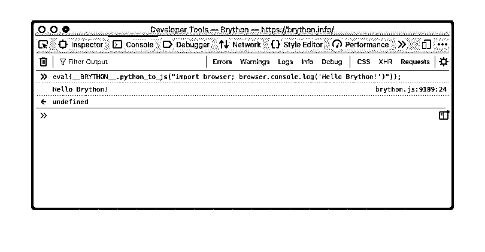](https://files.realpython.com/media/eval_python_to_js.d4d628fcb3f2.png)

将`eval()`应用到 Brython 代码会在浏览器控制台中打印出`"Hello Brython!"`。 [JavaScript 函数](https://developer.mozilla.org/en-US/docs/Web/JavaScript/Reference/Functions)返回`undefined`，这是 JavaScript 中函数的默认返回值。

当您构建一个 Brython 应用程序时，您不需要显式调用 JavaScript 模块中的函数。提供这个示例只是为了演示 Brython 如何在幕后操作。意识到`__BRYTHON__`可以帮助你阅读 Brython 代码，甚至在你获得更多经验时为项目做出贡献。它还将帮助您更好地理解浏览器控制台中可能显示的异常。

JavaScript `__BRYTHON__`对象在 JavaScript 全局范围内可用，您可以通过浏览器 JavaScript 控制台访问它。

## 在浏览器中使用 Brython

至此，您已经对 Brython 有了足够的了解，可以使用更详细的示例了。在本节中，您将实现一个 [Base64](https://en.wikipedia.org/wiki/Base64) 计算器，在浏览器中使用 DOM API 和其他通常只能从 JavaScript 获得的功能进行实验。

您可以通过单击下面的链接下载本教程中示例的源代码:

**获取源代码:** [点击此处获取源代码，您将在本教程中使用](https://realpython.com/bonus/brython-browser-python-code/)了解如何使用 Brython 在浏览器中运行 Python。

您将从学习如何使用 Python 和 HTML 操作 DOM 开始。

### Brython 中的 DOM API

为了试验 Brython 中可用的 DOM 操作，您将构建一个表单来将一个字符串编码为 [Base64](https://docs.python.org/3/library/base64.html) 。完成后的表单将如下所示:

[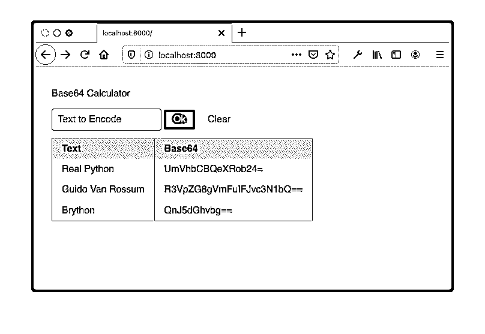](https://files.realpython.com/media/form_base64.4a722f3d9ba2.png)

创建以下 HTML 文件，并将其命名为`index.html`:

```py
 1<!-- index.html -->
 2<!DOCTYPE html >
 3<html>
 4  <head>
 5    <meta charset="utf-8"/>
 6    <link rel="stylesheet"
 7          href="https://cdnjs.cloudflare.com/ajax/libs/pure/2.0.3/pure-min.css" />
 8    <script
 9        src="https://cdnjs.cloudflare.com/ajax/libs/brython/3.9.0/brython.min.js"> 10  </script>
11    <script
12        src="https://cdnjs.cloudflare.com/ajax/libs/brython/3.9.0/brython_stdlib.min.js"> 13  </script>
14    <script src="main.py" type="text/python" defer></script>
15    <style>body  {  padding:  30px;  }</style>
16  </head>
17  <body onload="brython()">
18    <form class="pure-form" onsubmit="return false;">
19      <fieldset>
20        <legend>Base64 Calculator</legend>
21        <input type="text" id="text-src" placeholder="Text to Encode" />
22        <button
23          type="submit" id="submit"
24          class="pure-button pure-button-primary"
25          autocomplete="off">Ok</button>
26        
27      </fieldset>
28    </form>
29    <div id="b64-display"></div>
30  </body>
31</html>
```

上面的 HTML 加载静态资源，定义 UI 布局，并启动 Python 编译:

*   第 7 行加载了 [PureCSS](https://purecss.io/) 样式表来改进默认的 HTML 样式。这对于 Brython 的工作是不必要的。

*   **第 9 行**加载最小化版本的 Brython 引擎。

*   **第 12 行**加载最小化版本的 Brython 标准库。

*   **第 14 行**加载`main.py`，处理这个静态 HTML 页面的动态逻辑。注意 [`defer`](https://developer.mozilla.org/en-US/docs/Web/HTML/Element/script) 的用法。它有助于同步资源的加载和评估，有时需要确保 Brython 和任何 Python 脚本在执行`brython()`之前被完全加载。

*   **第 21 行**描述了一个 [`input`](https://developer.mozilla.org/en-US/docs/Web/HTML/Element/input) 字段。该字段将要编码的字符串作为参数。

*   **第 22 到 25 行**定义了触发页面主要逻辑的默认 [`button`](https://developer.mozilla.org/en-US/docs/Web/HTML/Element/button) 。你可以在下面的`main.py`中看到这个逻辑的实现。

*   **第 26 行**定义了一个`button`来清理页面上的数据和元素。这在下面的`main.py`中实现。

*   **第 29 行**声明了一个 [`div`](https://developer.mozilla.org/en-US/docs/Web/HTML/Element/div) 来作为表格的占位符。

相关的 Python 代码`main.py`如下:

```py
 1from browser import document, prompt, html, alert 2import base64 3
 4b64_map = {} 5
 6def base64_compute(_): 7    value = document["text-src"].value 8    if not value:
 9        alert("You need to enter a value")
10        return
11    if value in b64_map:
12        alert(f"'The base64 value of '{value}' already exists: '{b64_map[value]}'")
13        return
14    b64data = base64.b64encode(value.encode()).decode()
15    b64_map[value] = b64data
16    display_map()
17
18def clear_map(_) -> None: 19    b64_map.clear()
20    document["b64-display"].clear()
21
22def display_map() -> None: 23    table = html.TABLE(Class="pure-table")
24    table <= html.THEAD(html.TR(html.TH("Text") + html.TH("Base64")))
25    table <= (html.TR(html.TD(key) + html.TD(b64_map[key])) for key in b64_map)
26    base64_display = document["b64-display"]
27    base64_display.clear()
28    base64_display <= table
29    document["text-src"].value = ""
30
31document["submit"].bind("click", base64_compute) 32document["clear-btn"].bind("click", clear_map)
```

Python 代码显示了回调函数的定义和操纵 DOM 的机制:

*   **第 1 行**导入用于与 DOM 交互的模块和`brython.min.js`中的浏览器 API 代码。

*   **第 2 行**导入`base64`，在 Brython 标准库中有`brython_stdlib.min.js`。

*   **第 4 行**声明了一个[字典](https://realpython.com/python-dicts/)，您将使用它在 HTML 页面的生命周期中存储数据。

*   **第 6 行**定义了事件处理程序`base64_compute()`，它对 ID 为`text-src`的输入字段中输入的文本的 Base64 值进行编码。这是一个回调函数，将事件作为参数。该参数不在函数中使用，但在 Brython 中是必需的，在 JavaScript 中是可选的。按照惯例，您可以使用`_`作为虚拟占位符。在[谷歌 Python 风格指南](https://google.github.io/styleguide/pyguide.html#214-decision)中描述了这种用法的一个例子。

*   **第 7 行**检索用`text-src`标识的 DOM 元素的值。

*   **第 18 行**定义了事件处理程序`clear_map()`，该事件处理程序清除该页面上的数据以及数据的显示。

*   **第 22 行**定义了`display_map()`，它取`b64_map`中包含的数据并显示在页面的表单下。

*   **第 26 行**检索 ID 为`text-src`的 DOM 元素。

*   第 29 行清除 ID 为`text-src`的 DOM 元素的值。

*   **第 31 行**将`submit`按钮的 [`onclick`事件](https://developer.mozilla.org/en-US/docs/Web/SVG/Attribute/onclick)绑定到`base64_compute()`。

*   **第 32 行**将`clear-btn`按钮的`onclick`事件绑定到`clear_map()`。

为了操作 DOM，Brython 使用了两个操作符:

1.  **`<=`** 是 Brython 特有的新操作符，用于向节点添加子节点。你可以在第 22 行定义的`display_map()`中看到一些这种用法的例子。

2.  **`+`** 是 [`Element.insertAdjacentHTML('afterend')`](https://developer.mozilla.org/en-US/docs/Web/API/Element/insertAdjacentHTML) 的替代，增加了同级节点。

您可以在取自`display_map()`的以下语句中看到这两个运算符:

```py
table <= html.THEAD(html.TR(html.TH("Text") + html.TH("Base64")))
```

您可以将上面的代码理解为“向[表格元素](https://developer.mozilla.org/en-US/docs/Web/HTML/Element/table)添加一个[表格标题元素](https://developer.mozilla.org/en-US/docs/Web/HTML/Element/thead)，其中包含一个由两个相邻的[表格数据单元格元素](https://developer.mozilla.org/en-US/docs/Web/HTML/Element/td)组成的[表格行元素](https://developer.mozilla.org/en-US/docs/Web/HTML/Element/tr)。它在浏览器中呈现为以下 HTML 代码:

```py
<table>
<thead><tr><th>Text</th><th>Base64</th></tr></thead>
</table>
```

HTML 代码显示了表格元素标题行的嵌套结构。下面是相同代码的一种更具可读性的格式:

```py
<table>
  <thead>
    <tr>
      <th>Text</th>
      <th>Base64</th>
    </tr>
  </thead>
</table>
```

要在 Brython 控制台中观察结果，可以输入以下代码块:

>>>

```py
>>> from browser import html
>>> table = html.TABLE()
>>> table <= html.THEAD(html.TR(html.TH("Text") + html.TH("Base64")))
>>> table.outerHTML
'<table><thead><tr><th>Text</th><th>Base64</th></tr></thead></table>'
```

要执行全部代码，您需要启动一个 web 服务器。和前面一样，您在与两个文件`index.html`和`main.py`相同的目录中启动内置的 Python web 服务器:

```py
$ python3 -m http.server
Serving HTTP on :: port 8000 (http://[::]:8000/) ...
```

启动 web 服务器后，将浏览器指向`http://localhost:8000`。页面看起来像这样:

[](https://files.realpython.com/media/form_base64.4a722f3d9ba2.png)

您将在 [Browser Web API](#browser-web-api) 一节中扩展这个示例，允许在页面重新加载之间存储数据。

[*Remove ads*](/account/join/)

### 导入到 Brython

可以使用`import`访问编译成 JavaScript 的 Python 模块或 Brython 模块。

[Python 模块](https://docs.python.org/3/tutorial/modules.html)是项目根文件夹中扩展名为`.py`的文件，或者对于 Python 包，是包含`__init__.py`文件的子文件夹中的文件。要在 Brython 代码中导入 Python 模块，需要启动一个 web 服务器。关于 Python 模块的更多信息，请查看 [Python 模块和包——简介](https://realpython.com/python-modules-packages/)。

要探索如何将 Python 模块导入到您的 Brython 代码中，请遵循关于使用 PyPI 安装[一节中描述的说明，创建并激活一个 Python 虚拟环境，安装 Brython，并修改`index.html`，如下所示:](#pypi-installation)

```py
<!doctype html>
<html>

<head>
<meta charset="utf-8">
<script type="text/javascript" src="brython.js"></script>
<script type="text/javascript" src="brython_stdlib.js"></script>
</head>

<body onload="brython()">

<script type="text/python"> from  browser  import  document,  html,  window import  sys import  functional selection  =  functional.take(10,  range(10000)) numbers  =  ', '.join([str(x)  for  x  in  selection]) document  <=  html.P(f"{sys.version=}") document  <=  html.P(f"{numbers=}") </script>

</body>

</html>
```

上面的 HTML 文件公开了从核心引擎(`browser`)、标准库(`sys`)和本地 Python 模块(`functional`)导入的模块。下面是`functional.py`的内容:

```py
import itertools

def take(n, iterable):
    "Return first n items of the iterable as a list"
    return list(itertools.islice(iterable, n))
```

该模块实现 [`itertools`配方](https://docs.python.org/3/library/itertools.html#itertools-recipes)之一的`take()`。`take()`返回给定 iterable 的前 *n* 个元素。就靠`itertools.slice()`了。

如果您试图用浏览器从文件系统中打开`index.html`，那么您将在浏览器控制台中得到以下错误:

```py
Traceback (most recent call last):
 File file:///Users/andre/brython/code/import/index.html/__main__
 line 3, in <module>
 import functional
ModuleNotFoundError: functional
```

导入 Python 模块需要启动本地 web 服务器。启动本地 web 服务器，将浏览器指向`http://localhost:8000`。您应该会看到以下 HTML 页面:

[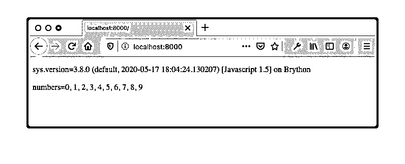](https://files.realpython.com/media/python_import.8d62678174e7.png)

对于正在运行的 web 服务器，当执行`import functional`时，浏览器能够获取模块`functional.py`。两个值`sys.version`和`numbers`的结果由嵌入的 Python 脚本的最后两行插入到 HTML 文件中，并由浏览器呈现。

### 减少导入大小

在前一个示例的项目目录中，为了减小导入的 JavaScript 模块的大小并将 Python 模块预编译成 JavaScript，您可以使用带有选项`--modules`的`brython-cli`:

```py
$ brython-cli --modules
Create brython_modules.js with all the modules used by the application
searching brython_stdlib.js...
finding packages...
script in html index.html
```

这将生成`brython_modules.js`，你可以修改`index.html`的`head`元素如下:

```py
 1<head>
 2<meta charset="utf-8">
 3<script type="text/javascript" src="brython.js"></script>
 4<script type="text/javascript" src="brython_modules.js"></script> 5</head>
```

第 4 行将原始脚本源从`brython_stdlib.js`更改为`brython_modules.js`。

用浏览器打开`index.html`或将浏览器指向本地服务器会呈现相同的 HTML 页面。请注意以下几点:

1.  您可以在浏览器中呈现 HTML 页面，而无需运行 web 服务器。
2.  您不需要分发`functional.py`，因为代码已经被转换成 JavaScript 并捆绑在`brython_modules.js`中。
3.  不需要加载`brython_stdlib.js`。

命令行工具`brython-cli --modules`提供了从标准库中删除不必要代码的解决方案，并将您的 python 模块编译成 JavaScript 代码。这有助于打包您的应用程序，从而减少资源下载量。

**注意:**与导入 Python 模块类似，加载带有 HTML `script`元素的 Python 模块需要您启动一个 web 服务器。考虑下面的 HTML `script`元素:

```py
<script src="main.py" type="text/python"></script>
```

当 Brython 函数被执行并加载一个指向 Python 文件的`script`内容时，它试图执行一个 Ajax 调用，这只能在 web 服务器运行时才能完成。如果您尝试从文件系统中打开该文件，浏览器 JavaScript 控制台中将显示类似以下内容的错误:

```py
IOError: can't load external script at file:///project/main.py
(Ajax calls not supported with protocol file:///)
```

安全保护阻止您从本地文件系统加载`main.py`。您可以通过运行本地文件服务器来解决此问题。有关此行为的更多信息，请参见 [Brython 文档](https://brython.info/static_doc/en/file_or_http.html)。

[*Remove ads*](/account/join/)

## 与 JavaScript 交互

Brython 允许 Python 代码与 JavaScript 代码进行交互。最常见的模式是从 Brython 访问 JavaScript。反过来，虽然可能，但并不常见。在 [JavaScript 单元测试](#javascript-unit-tests)一节中，您将看到一个 JavaScript 调用 Python 函数的例子。

### JavaScript

到目前为止，您已经经历了一些 Python 代码与 JavaScript 代码交互的场景。特别是，您已经能够通过调用`browser.alert()`来显示消息框。

在 Brython 控制台中运行的以下三个示例中，您可以看到`alert`正在运行，而不是在标准的 CPython 解释器 shell 中:

>>>

```py
>>> import browser
>>> browser.alert("Real Python")
```

或者你可以使用`window`:

>>>

```py
>>> from browser import window
>>> window.alert("Real Python")
```

或者你可以使用`this`:

>>>

```py
>>> from javascript import this
>>> this().alert("Real Python")
```

由于 Brython 暴露的新层以及`alert()`和`window`的全局性质，你可以在`browser.window`甚至在`javascript.this`上调用`alert`。

以下是允许访问 JavaScript 函数的主要 Brython 模块:

| 模块 | 语境 | 例子 |
| --- | --- | --- |
| `browser` | 包含内置名称和模块 | `browser.alert()` |
| `browser.document` | 访问 DOM | `document.getElementById("element-id")`
T1】 |
| `browser.html` | 创建 HTML 元素 | `html.H1("This is the title")` |
| `browser.window` | 访问 [`Window`](https://developer.mozilla.org/en-US/docs/Web/API/Window) 函数和对象 | `window.navigator`
T1】 |
| `javascript` | 访问 JavaScript 中定义的对象 | `javascript.this()`
T1】 |

除了浏览器中可用的 JavaScript 函数和 API，您还可以访问自己编写的 JavaScript 函数。以下示例演示了如何从 Brython 访问自定义 JavaScript 函数:

```py
 1<!doctype html>
 2<html>
 3  <head>
 4    <meta charset="utf-8">
 5    <script
 6        src="https://cdnjs.cloudflare.com/ajax/libs/brython/3.9.0/brython.js"> 7  </script>
 8    <script type="text/javascript"> 9  function  myMessageBox(name)  {  10  window.alert(`Hello ${name}!`); 11  } 12  </script>
13  </head>
14  <body onload="brython()">
15    <script type="text/python"> 16  from  browser  import  window 17  window.myMessageBox("Jon")  18  </script>
19  </body>
20</html>
```

它是这样工作的:

*   **第 9 行**定义了 JavaScript 块中的自定义函数`myMessageBox()`。
*   **第十七行**调用`myMessageBox()`。

您可以使用相同的特性来访问 JavaScript 库。在 [Web UI 框架](#web-ui-framework)一节中，您将看到如何与 Vue.js 交互，这是一个流行的 Web UI 框架。

### 浏览器 Web API

浏览器公开了可以从 JavaScript 访问的 web APIs，Brython 也可以访问相同的 API。在本节中，您将扩展 Base64 计算器来存储浏览器页面重新加载之间的数据。

允许此功能的 web API 是 [Web 存储 API](https://developer.mozilla.org/en-US/docs/Web/API/Web_Storage_API) 。它包括两种机制:

1.  [T2`sessionStorage`](https://developer.mozilla.org/en-US/docs/Web/API/Window/sessionStorage)
2.  [T2`localStorage`](https://developer.mozilla.org/en-US/docs/Web/API/Window/localStorage)

在接下来的例子中，您将使用`localStorage`。

正如您在前面所学的，Base64 计算器创建一个字典，其中包含映射到该字符串的 Base64 编码值的输入字符串。页面加载后，数据会保留在内存中，但在重新加载页面时会被清除。将数据保存到`localStorage`将在页面重新加载之间保留字典。`localStorage`是一个[键值存储](https://en.wikipedia.org/wiki/Key-value_database)。

要访问`localStorage`，需要导入`storage`。为了接近最初的实现，您将把字典数据以 [JSON 格式](https://realpython.com/python-json/)加载并保存到`localStorage`。保存和获取数据的键将是`b64data`。修改后的代码包括新的导入和一个`load_data()`函数:

```py
from browser.local_storage import storage import json, base64 
def load_data():
    data = storage.get("b64data")
    if data:
        return json.loads(data)
    else:
        storage["b64data"] = json.dumps({})
        return {}
```

加载 Python 代码时执行`load_data()`。它从`localStorage`获取 JSON 数据，并填充一个 Python 字典，该字典将用于在页面生命周期内在内存中保存数据。如果在`localStorage`中没有找到`b64data`，那么在`localStorage`中为关键字`b64data`创建一个空字典，并返回一个空字典。

你可以通过展开下面的方框来查看包含`load_data()`的完整 Python 代码。它展示了如何使用`localStorage` web API 作为持久存储，而不是依赖短暂的内存存储，就像本例前面的实现一样。


以下代码显示了如何使用浏览器`localStorage`管理数据:

```py
 1from browser import document, prompt, html, alert
 2from browser.local_storage import storage 3import json, base64 4
 5def load_data(): 6    data = storage.get("b64data")
 7    if data:
 8        return json.loads(data)
 9    else:
10        storage["b64data"] = json.dumps({})
11        return {}
12
13def base64_compute(evt):
14    value = document["text-src"].value
15    if not value:
16        alert("You need to enter a value")
17        return
18    if value in b64_map:
19        alert(f"'{value}' already exists: '{b64_map[value]}'")
20        return
21    b64data = base64.b64encode(value.encode()).decode()
22    b64_map[value] = b64data
23    storage["b64data"] = json.dumps(b64_map) 24    display_map()
25
26def clear_map(evt):
27    b64_map.clear()
28    storage["b64data"] = json.dumps({})
29    document["b64-display"].clear() 30
31def display_map():
32    if not b64_map:
33        return
34    table = html.TABLE(Class="pure-table")
35    table <= html.THEAD(html.TR(html.TH("Text") + html.TH("Base64")))
36    table <= (html.TR(html.TD(key) + html.TD(b64_map[key])) for key in b64_map)
37    base64_display = document["b64-display"]
38    base64_display.clear()
39    base64_display <= table
40    document["text-src"].value = ""
41
42b64_map = load_data()
43display_map() 44document["submit"].bind("click", base64_compute)
45document["clear-btn"].bind("click", clear_map)
```

新行将突出显示。当文件在调用`brython()`时被加载和处理时，全局字典`b64_map`由`load_data()`填充。当页面重新加载时，从`localStorage`中获取数据。

每次计算新的 Base64 值时，`b64_map`的内容被转换为 [JSON](https://developer.mozilla.org/en-US/docs/Web/JavaScript/Reference/Global_Objects/JSON) 并存储在本地存储器中。存储的关键是`b64data`。

您可以从`browser`和其他子模块访问所有 web API 函数。关于访问 web API 的高级文档可以在 [Brython 文档](https://brython.info/static_doc/en/jsobjects.html)中找到。更多细节，你可以参考 [web API 文档](https://developer.mozilla.org/en-US/docs/Web/API)并使用 [Brython 控制台](https://brython.info/console.html)来试验 web API。

在某些情况下，您可能需要在熟悉的 Python 函数和 web APIs 函数之间做出选择。例如，在上面的代码中，您使用了 Python Base64 编码，`base64.b64encode()`，但是您也可以使用 JavaScript 的 [`btoa()`](https://developer.mozilla.org/en-US/docs/Web/API/WindowOrWorkerGlobalScope/btoa) :

>>>

```py
>>> from browser import window
>>> window.btoa("Real Python")
'UmVhbCBQeXRob24='
```

您可以在在线控制台中测试这两种变体。使用`window.btoa()`只能在 Brython 上下文中工作，而`base64.b64encode()`可以用常规的 Python 实现来执行，如 [CPython](https://realpython.com/cpython-source-code-guide/) 。注意，在 CPython 版本中，`base64.b64encode()`采用一个 [`bytearray`](https://docs.python.org/3/library/stdtypes.html#bytearray) 作为参数类型，而 JavaScript `window.btoa()`采用一个字符串。

如果性能是一个问题，那么考虑使用 JavaScript 版本。

[*Remove ads*](/account/join/)

### Web UI 框架

像 [Angular](https://angular.io/) 、 [React](https://reactjs.org/) 、 [Vue.js](https://vuejs.org/) 或 [Svelte](https://svelte.dev/) 等流行的 JavaScript UI 框架已经成为前端开发人员工具包的重要组成部分，Brython 与其中一些框架无缝集成。在本节中，您将使用 Vue.js 版本 3 和 Brython 构建一个应用程序。

您将构建的应用程序是一个计算字符串的散列值的表单。下面是正在运行的 HTML 页面的屏幕截图:

[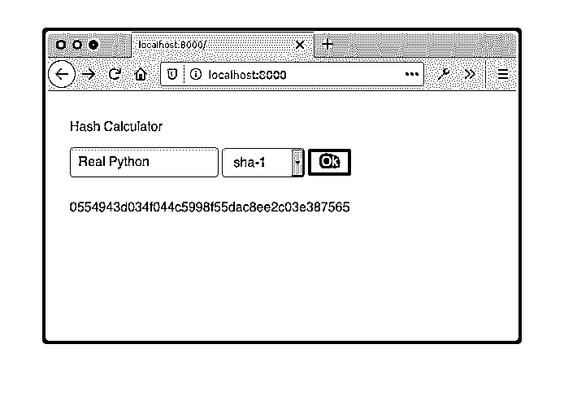](https://files.realpython.com/media/brython_vuejs.0cf435f1328a.png)

HTML 页面的`body`以声明方式定义了绑定和模板:

```py
<!DOCTYPE html >
<html>
  <head>
    <meta charset="utf-8"/>
    <link
      rel="stylesheet"
      href="https://cdnjs.cloudflare.com/ajax/libs/pure/2.0.3/pure-min.min.css"/>
    <script src="https://cdnjs.cloudflare.com/ajax/libs/vue/3.0.2/vue.global.prod.js"></script>
    <script src="https://cdnjs.cloudflare.com/ajax/libs/brython/3.9.0/brython.min.js"></script>
    <script src="https://cdnjs.cloudflare.com/ajax/libs/brython/3.9.0/brython_stdlib.min.js"></script>
    <script src="main.py" type="text/python"></script>
    <style> body  {  padding:  30px;  } [v-cloak]  {  visibility:  hidden;  } </style>
  </head>

<body onload="brython(1)">
  <div id="app">
    <form class="pure-form" onsubmit="return false;">
      <fieldset>
        <legend>Hash Calculator</legend>
        <input type="text" v-model.trim="input_text"
               placeholder="Text to Encode" autocomplete="off"/>
        <select v-model="algo" v-cloak>
          <option v-for="name in algos" v-bind:value="name">

          </option>
        </select>
        <button @click="compute_hash" type="submit"
                class="pure-button pure-button-primary">Ok</button>
      </fieldset>
    </form>
    <p v-cloak></p>
  </div>
</body>
```

如果您不熟悉 Vue，那么您可以快速了解下面的一些内容，但是请随意查阅官方文档以获取更多信息:

*   **[Vue.js 指令](https://v3.vuejs.org/api/directives.html)** 是特殊的属性值，以`v-`为前缀，提供 DOM 和 [Vue.js 组件的值之间的动态行为和数据映射](https://v3.vuejs.org/guide/component-basics.html):
    *   **`v-model.trim="input_text"`** 将输入值绑定到 [Vue 模型](https://v3.vuejs.org/guide/migration/v-model.html#_3-x-syntax) `input_text`并修剪该值。
    *   **`v-model="algo"`** 将下拉列表的值绑定到`algo`。
    *   **`v-for="name in algos"`** 将选项值绑定到`name`。
*   **[Vue 模板](https://vuejs.org/v2/guide/syntax.html)** 用双花括号括起来的变量表示。Vue.js 用 Vue 组件中的相应值替换相应的占位符:
    *   **T2`hash_value`**
    *   **T2`name`**
*   **[事件处理程序](https://v3.vuejs.org/guide/events.html)** 用一个 at 符号(`@`)标识，就像在`@click="compute_hash"`中一样。

相应的 Python 代码描述了 Vue 和附加的业务逻辑:

```py
 1from browser import alert, window
 2from javascript import this
 3import hashlib
 4
 5hashes = {
 6    "sha-1": hashlib.sha1,
 7    "sha-256": hashlib.sha256,
 8    "sha-512": hashlib.sha512,
 9}
10
11Vue = window.Vue 12
13def compute_hash(evt):
14    value = this().input_text 15    if not value:
16        alert("You need to enter a value")
17        return
18    hash_object = hashes[this().algo]()
19    hash_object.update(value.encode())
20    hex_value = hash_object.hexdigest()
21    this().hash_value = hex_value 22
23def created():
24    for name in hashes:
25        this().algos.append(name) 26    this().algo = next(iter(hashes)) 27
28app = Vue.createApp(
29    {
30        "el": "#app",
31        "created": created,
32        "data": lambda _: {"hash_value": "", "algos": [], "algo": "", "input_text": ""},
33        "methods": {"compute_hash": compute_hash},
34    }
35)
36
37app.mount("#app")
```

Vue.js 的声明性质显示在带有 Vue 指令和模板的 HTML 文件中。这也在 Python 代码中用第 11 行和第 28 到 35 行的 Vue 组件声明进行了演示。这种声明性技术将 DOM 的节点值与 Vue 数据连接起来，允许框架的[反应性](https://vuejs.org/v2/guide/reactivity.html#Declaring-Reactive-Properties)行为。

这消除了您在前一个示例中必须编写的一些样板代码。例如，请注意，您不必用类似于`document["some_id"]`的表达式从 DOM 中选择元素。创建 Vue 应用程序并调用`app.mount()`处理 Vue 组件到相应 DOM 元素的映射以及 JavaScript 函数的绑定。

在 Python 中，访问 Vue 对象字段需要使用`javascript.this()`引用 Vue 对象:

*   **第 14 行**获取组件字段`this().input_text`的值。
*   **第 21 行**更新数据成分`this().hash_value`。
*   **第 25 行**向列表`this().algos`添加一个算法。
*   **第 26 行**用`hashes{}`的第一个键实例化`this().algo`。

如果结合 Brython 的 Vue 介绍激发了您的兴趣，那么您可能想看看 [vuepy 项目](https://pypi.org/project/vuepy/)，它为 Vue.js 提供了完整的 Python 绑定，并使用 Brython 在浏览器中运行 Python。

### 网络组装

在某些情况下，可以使用 [WebAssembly](https://webassembly.org/) 来提高 Brython 甚至 JavaScript 的性能。 **WebAssembly** ，或 **Wasm** ，是所有主流浏览器都支持的二进制代码。它可以在浏览器中提供比 JavaScript 更好的性能，并且是像 [C](https://en.wikipedia.org/wiki/C_%28programming_language%29) 、 [C++](https://en.wikipedia.org/wiki/C%2B%2B) 和 [Rust](https://www.rust-lang.org/) 这样的语言的编译目标。如果你没有使用 Rust 或 Wasm，那么你可以跳过这一节。

在下面演示 WebAssembly 使用方法的示例中，您将在 Rust 中实现一个函数，并从 Python 中调用它。

这不是一个彻底的生锈教程。它只是触及了表面。关于 Rust 的更多细节，请查看 Rust 文档。

从使用`rustup`安装防锈的[开始。要编译 Wasm 文件，还需要添加](https://www.rust-lang.org/tools/install) [`wasm32`目标](https://rustwasm.github.io/book/reference/add-wasm-support-to-crate.html):

```py
$ rustup target add wasm32-unknown-unknown
```

使用 [`cargo`](https://doc.rust-lang.org/cargo/reference/index.html) 创建一个项目，在 Rust 安装时安装:

```py
$ cargo new --lib op
```

上面的命令在名为`op`的文件夹中创建一个框架项目。在这个文件夹中，您将找到`Cargo.toml`，Rust build 配置文件，您需要修改它以表明您想要创建一个动态库。您可以通过添加突出显示的部分来做到这一点:

```py
[package] name  =  "op" version  =  "0.1.0" authors  =  ["John <john@example.com>"] edition  =  "2018" [lib]  crate-type=["cdylib"]  
[dependencies]
```

修改`src/lib.rs`，将其内容替换为以下内容:

```py
#[no_mangle] pub  extern  fn double_first_and_add(x: u32,  y: u32)  -> u32 { (2  *  x)  +  y }
```

在项目的根目录中，即`Cargo.toml`所在的位置，编译您的项目:

```py
$ cargo build --target wasm32-unknown-unknown
```

接下来，用下面的`index.html`创建一个`web`目录:

```py
 1<!-- index.html -->
 2<!DOCTYPE html>
 3<html>
 4<head>
 5  <script src="https://cdnjs.cloudflare.com/ajax/libs/brython/3.9.0/brython.min.js"></script>
 6  <script src="main.py" type="text/python"></script> 7</head>
 8<body onload="brython()">
 9
10<form class="pure-form" onsubmit="return false;">
11  <h2>Custom Operation using Wasm + Brython</h2>
12  <fieldset>
13    <legend>Multiply first number by 2 and add result to second number</legend>
14    <input type="number" value="0" id="number-1" placeholder="1st number"
15           autocomplete="off" required/>
16    <input type="number" value="0" id="number-2" placeholder="2nd number"
17           autocomplete="off" required/>
18    <button type="submit" id="submit" class="pure-button pure-button-primary">
19        Execute
20    </button>
21  </fieldset>
22</form>
23
24<br/>
25<div id="result"></div>
26</body>
27</html>
```

上面的第 6 行从同一个目录加载了下面的`main.py`:

```py
 1from browser import document, window
 2
 3double_first_and_add = None
 4
 5def add_rust_fn(module): 6  global double_first_and_add
 7  double_first_and_add = module.instance.exports.double_first_and_add 8
 9def add_numbers(evt):
10    nb1 = document["number-1"].value or 0
11    nb2 = document["number-2"].value or 0
12    res = double_first_and_add(nb1, nb2)
13    document["result"].innerHTML = f"Result: ({nb1} * 2) + {nb2} = {res}"
14
15document["submit"].bind("click", add_numbers)
16window.WebAssembly.instantiateStreaming(window.fetch("op.wasm")).then(add_rust_fn)
```

突出显示的线条是允许 Brython 访问 Rust 函数`double_first_and_add()`的粘合剂:

*   **第 16 行**使用`WebAssembly`读取`op.wasm`，然后在 Wasm 文件下载时调用`add_rust_fn()`。
*   **第 5 行**实现`add_rust_fn()`，以 Wasm 模块为参数。
*   **第 7 行**将`double_first_and_add()`赋予本地`double_first_and_add`名称，使其对 Python 可用。

在同一个`web`目录下，从`target/wasm32-unknown-unknown/debug/op.wasm`复制`op.wasm`:

```py
$ cp target/wasm32-unknown-unknown/debug/op.wasm web
```

项目文件夹布局如下所示:

```py
├── Cargo.lock
├── Cargo.toml
├── src
│   └── lib.rs
├── target
│   ...
└── web
    ├── index.html
    ├── main.py
    └── op.wasm
```

这显示了用`cargo new`创建的 Rust 项目的文件夹结构。为了清楚起见，`target`被部分省略。

现在在`web`中启动一个服务器:

```py
$ python3 -m http.server
Serving HTTP on :: port 8000 (http://[::]:8000/) ...
```

最后，将你的网络浏览器指向`http://localhost:8000`。您的浏览器应该呈现如下所示的页面:

[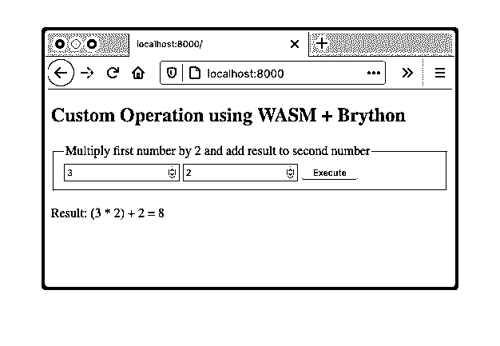](https://files.realpython.com/media/wasm_brython.612eae738edf.png)

这个项目展示了如何创建一个可以在 JavaScript 或 Brython 中使用的 WebAssembly。由于构建 Wasm 文件会产生很大的开销，这不应该是解决特定问题的首选方法。

如果 JavaScript 不能满足您的性能需求，那么 Rust 可能是一个选项。如果您已经有 Wasm 代码可以与之交互，无论是您构建的代码还是现有的 Wasm 库，这都非常有用。

使用 Rust 生成 WebAssembly 的另一个好处是它可以访问 Python 或 JavaScript 中不存在的库。如果您想使用用 C 编写的 Python 库，而该库不能与 Brython 一起使用，那么它也很有用。如果 Rust 中存在这样一个库，那么您可以考虑构建一个 Wasm 文件来与 Brython 一起使用。

## 在 Brython 中应用异步开发

**同步编程**可能是你最熟悉的计算行为。例如，当执行三个语句 A、B 和 C 时，一个程序首先执行 A，然后执行 B，最后执行 C，每个语句在将程序传递给下一个语句之前都会阻塞程序流。

想象一种技术，首先执行 A，调用 B 但不立即执行，然后执行 C。你可以把 B 想成是未来被执行的[承诺](https://developer.mozilla.org/en-US/docs/Learn/JavaScript/Asynchronous/Introducing#Promises)。因为 B 是非阻塞的，所以它被认为是[异步的](https://developer.mozilla.org/en-US/docs/Glossary/asynchronous)。要了解异步编程的更多背景知识，您可以查看[Python](https://realpython.com/python-async-features/)中的异步特性入门。

JavaScript 是单线程的，并且依赖于异步处理，尤其是在涉及网络通信的时候。例如，获取 API 的结果不需要阻塞其他 JavaScript 函数的执行。

使用 Brython，您可以通过许多组件访问异步特性:

*   [JavaScript 回调](https://javascript.info/callbacks)
*   [JavaScript 承诺](https://developer.mozilla.org/en-US/docs/Learn/JavaScript/Asynchronous/Introducing#Promises)
*   [T2`browser.ajax`](https://brython.info/static_doc/en/ajax.html)
*   [T2`browser.aio`](https://brython.info/static_doc/en/aio.html)

随着 JavaScript 的发展，回调逐渐被承诺或[异步函数](https://developer.mozilla.org/en-US/docs/Web/JavaScript/Reference/Statements/async_function)所取代。在本教程中，您将学习如何使用 Brython 的 promises 以及如何使用`browser.ajax`和`browser.aio`模块，这两个模块利用了 JavaScript 的异步特性。

CPython 库中的 [`asyncio`模块](https://docs.python.org/3/library/asyncio.html)不能在浏览器上下文中使用，在 Brython 中被替换为`browser.aio`。

### JavaScript 在 Brython 中承诺

在 JavaScript 中， [promise](https://developer.mozilla.org/en-US/docs/Web/JavaScript/Reference/Global_Objects/Promise) 是一个可能在未来某个时候产生结果的对象。完成时产生的值将是错误的值或原因。

下面的例子说明了如何使用 Brython 的 JavaScript `Promise`对象。您可以在在线控制台中使用此示例:

>>>

```py
 1>>> from browser import timer, window
 2>>> def message_in_future(success, error):
 3...   timer.set_timeout(lambda: success("Message in the future"), 3000)
 4...
 5>>> def show_message(msg):
 6...   window.alert(msg)
 7...
 8>>> window.Promise.new(message_in_future).then(show_message)
 9<Promise object>
```

在 web 控制台中，您可以获得关于 Python 代码执行的即时反馈:

*   **第 1 行**导入`timer`来设置超时，导入`window`来访问`Promise`对象。
*   **第 2 行**定义了一个[执行器](https://javascript.info/promise-basics)，`message_in_future()`，当承诺成功时，在超时结束时返回一条消息。
*   **第 5 行**定义了一个显示警告的函数`show_message()`。
*   **第 8 行**创建一个与执行人的承诺，用一个 [`then`](https://developer.mozilla.org/en-US/docs/Web/JavaScript/Reference/Global_Objects/Promise/then) 块链接，允许访问承诺的结果。

在上面的例子中，超时模拟了一个长时间运行的函数。承诺的真正用途可能涉及网络呼叫。在`3`秒后，承诺成功完成，值为`"Message in the future"`。

如果 executor 函数`message_in_future()`检测到一个错误，那么它可以调用`error()`,将错误原因作为参数。您可以用一个新的链接方法`.catch()`在`Promise`对象上实现它，如下所示:

>>>

```py
>>> window.Promise.new(message_in_future).then(show_message).catch(show_message)
```

您可以在下图中看到成功完成承诺的行为:

[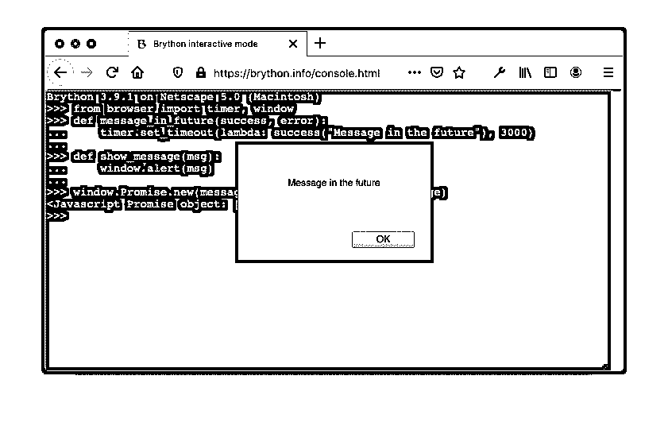](https://files.realpython.com/media/brython_promise.185bfe38e9ca.png)

当您在控制台中运行代码时，您可以看到首先创建了`Promise`对象，然后，在超时之后，显示消息框。

### Brython 中的 Ajax

当函数被限定为 [I/O 绑定](https://en.wikipedia.org/wiki/I/O_bound)时，异步函数特别有用。这与 [CPU 绑定的](https://en.wikipedia.org/wiki/CPU-bound)函数形成了对比。一个 **I/O 绑定的函数**是一个主要花费时间等待输入或输出完成的函数，而一个 **CPU 绑定的函数**是计算。通过网络调用 API 或查询数据库是 I/O 绑定的执行，而计算素数序列是 CPU 绑定的。

Brython 的`browser.ajax`公开了像`get()`和`post()`这样的 HTTP 函数，默认情况下，它们是异步的。这些函数采用一个可以设置为`True`的`blocking`参数来同步呈现相同的函数。

要异步调用[HTTP`GET`T3，调用`ajax.get()`如下:](https://developer.mozilla.org/en-US/docs/Web/HTTP/Methods/GET)

```py
ajax.get(url, oncomplete=on_complete)
```

要以阻塞模式获取 API，请将`blocking`参数设置为`True`:

```py
ajax.get(url, blocking=True, oncomplete=on_complete)
```

以下代码显示了阻塞 Ajax 调用和非阻塞 Ajax 调用之间的区别:

```py
 1from browser import ajax, document
 2import javascript
 3
 4def show_text(req):
 5    if req.status == 200:
 6        log(f"Text received: '{req.text}'")
 7    else:
 8        log(f"Error: {req.status} - {req.text}")
 9
10def log(message):
11    document["log"].value += f"{message}  \n"
12
13def ajax_get(evt): 14    log("Before async get")
15    ajax.get("/api.txt", oncomplete=show_text)
16    log("After async get")
17
18def ajax_get_blocking(evt): 19    log("Before blocking get")
20    try:
21        ajax.get("/api.txt", blocking=True, oncomplete=show_text)
22    except Exception as exc:
23        log(f"Error: {exc.__name__} - Did you start a local web server?")
24    else:
25        log("After blocking get")
26
27document["get-btn"].bind("click", ajax_get)
28document["get-blocking-btn"].bind("click", ajax_get_blocking)
```

上面的代码演示了同步和异步两种行为:

*   **第 13 行**定义了`ajax_get()`，它使用`ajax.get()`从远程文件中获取文本。`ajax.get()`的默认行为是异步的。`ajax_get()`返回，分配给参数`oncomplete`的`show_text()`在收到远程文件`/api.txt`后被回调。

*   **第 18 行**定义了`ajax_get_blocking()`，演示了如何将`ajax.get()`用于阻塞行为。在这个场景中，`show_text()`在`ajax_get_blocking()`返回之前被调用。

当您运行完整的示例并单击*异步获取*和*阻塞获取*时，您将看到以下屏幕:

[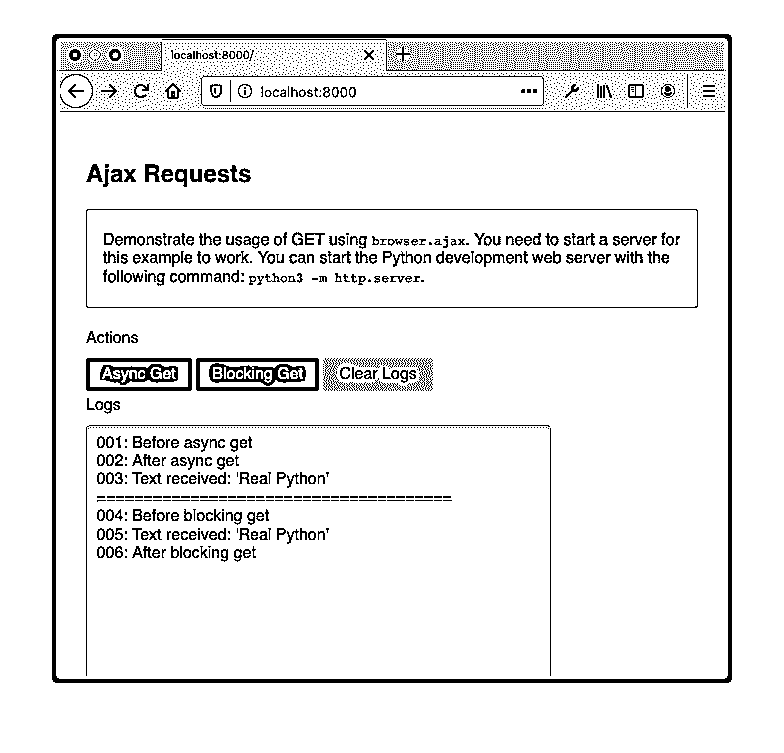](https://files.realpython.com/media/browser_ajax.16b096e31e29.png)

您可以看到，在第一个场景中，`ajax_get()`被完全执行，API 调用的结果异步发生。在第二种情况下，在从`ajax_get_blocking()`返回之前显示 API 调用的结果。

### Brython 中的异步 IO

随着 [`asyncio`](https://docs.python.org/3/library/asyncio.html) ，Python 3.4 开始暴露新的异步能力。在 Python 3.5 中，异步支持增加了 [`async` / `await`语法](https://docs.python.org/3/whatsnew/3.5.html#whatsnew-pep-492)。由于与[浏览器事件循环](https://developer.mozilla.org/en-US/docs/Web/JavaScript/EventLoop)不兼容，Brython 实现了 [`browser.aio`](https://brython.info/static_doc/en/aio.html) 作为标准`asyncio`的替代。

Brython 模块`browser.aio`和 Python 模块`asyncio`都支持使用`async`和`await`关键字，并共享通用函数，如`run()`和`sleep()`。两个模块都实现了其他不同的功能，这些功能与它们各自的执行上下文有关，CPython 上下文环境用于`asyncio`，浏览器环境用于`browser.aio`。

#### 协程程序

你可以使用`run()`和`sleep()`来创建[协程](https://docs.python.org/3/library/asyncio-task.html#coroutine)。为了说明在 Brython 中实现的协同程序的行为，您将实现一个在 [CPython 文档](https://docs.python.org/3/library/asyncio-task.html#coroutine)中可用的协同程序示例的变体:

```py
 1from browser import aio as asyncio 2import time
 3
 4async def say_after(delay, what): 5    await asyncio.sleep(delay) 6    print(what)
 7
 8async def main(): 9    print(f"started at {time.strftime('%X')}")
10
11    await say_after(1, 'hello')
12    await say_after(2, 'world')
13
14    print(f"finished at {time.strftime('%X')}")
15
16asyncio.run(main())
```

除了第一行`import`之外，代码与您在 CPython 文档中找到的一样。它演示了关键字`async`和`await`的用法，并展示了`run()`和`sleep()`的实际应用:

*   **第 1 行**使用`asyncio`作为`browser.aio`的别名。尽管它隐藏了`aio`，但它保持代码接近 Python 文档示例，以便于比较。
*   **第 4 行**声明协程`say_after()`。注意`async`的使用。
*   **第 5 行**用`await`调用`asyncio.sleep()`，以便当前函数将控制权让给另一个函数，直到`sleep()`完成。
*   **第 8 行**声明了另一个协程，该协程本身将调用协程`say_after()`两次。
*   **第 9 行**调用`run()`，这是一个非阻塞函数，它将一个协程(本例中为`main()`)作为参数。

注意，在浏览器的上下文中，`aio.run()`利用了内部 JavaScript 事件循环。这与 CPython 中的相关函数`asyncio.run()`不同，后者完全管理事件循环。

要执行这段代码，将其粘贴到在线 Brython 编辑器中，然后单击 *Run* 。您应该会得到类似以下屏幕截图的输出:

[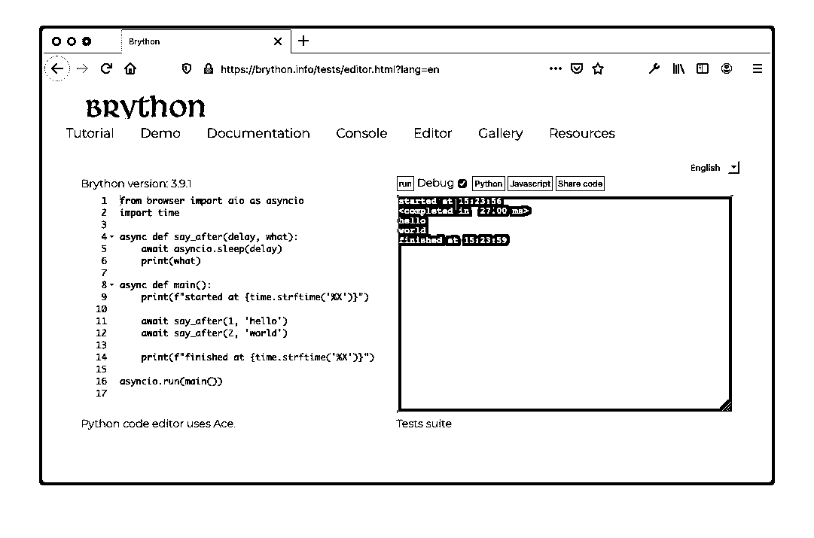](https://files.realpython.com/media/brython_aio.e76bb6bc79aa.png)

首先执行脚本，然后显示`"hello"`，最后显示`"world"`。

关于 Python 中协同程序的更多细节，可以查看 Python 中的[异步 IO:完整演练](https://realpython.com/async-io-python/)。

异步 I/O 的一般概念适用于所有采用这种模式的平台。在 JavaScript 中，事件循环本质上是环境的一部分，而在 CPython 中，这是使用由`asyncio`公开的函数来管理的。

上面的例子是一个有意的练习，目的是保持代码完全如 Python 文档示例所示。使用 Brython 在浏览器中编码时，建议显式使用`browser.aio`，您将在下一节中看到。

#### 网络特定功能

如前一节所述，要对 API 发出异步调用，您可以编写如下函数:

```py
async def process_get(url):
    req = await aio.get(url)
```

注意关键字`async`和`await`的使用。该功能需要定义为`async`才能使用`await`呼叫。在执行该函数期间，当到达对`await aio.get(url)`的调用时，该函数将控制权交还给主事件循环，同时等待网络调用`aio.get()`完成。程序执行的其余部分不会被阻塞。

下面是一个如何调用`process_get()`的例子:

```py
aio.run(process_get("/some_api"))
```

函数`aio.run()`执行协程`process_get()`。它是非阻塞的。

一个更完整的代码示例展示了如何使用关键字`async`和`await`以及`aio.run()`和`aio.get()`是如何互补的:

```py
 1from browser import aio, document
 2import javascript
 3
 4def log(message):
 5    document["log"].value += f"{message}  \n"
 6
 7async def process_get(url): 8    log("Before await aio.get")
 9    req = await aio.get(url) 10    log(f"Retrieved data: '{req.data}'")
11
12def aio_get(evt):
13    log("Before aio.run")
14    aio.run(process_get("/api.txt")) 15    log("After aio.run")
16
17document["get-btn"].bind("click", aio_get)
```

在 Python 3 的最新版本中，您可以使用`async`和`await`关键字:

*   **第 7 行**用关键字`async`定义`process_get()`。
*   **第 9 行**用关键字`await`调用`aio.get()`。使用`await`需要用`async`定义封闭函数。
*   **第 14 行**展示了如何使用`aio.run()`，它将被调用的`async`函数作为参数。

要运行完整的示例，您需要启动一个 web 服务器。可以用`python3 -m http.server`启动 Python 开发 web 服务器。它在端口 8000 和默认页面`index.html`上启动一个本地 web 服务器:

[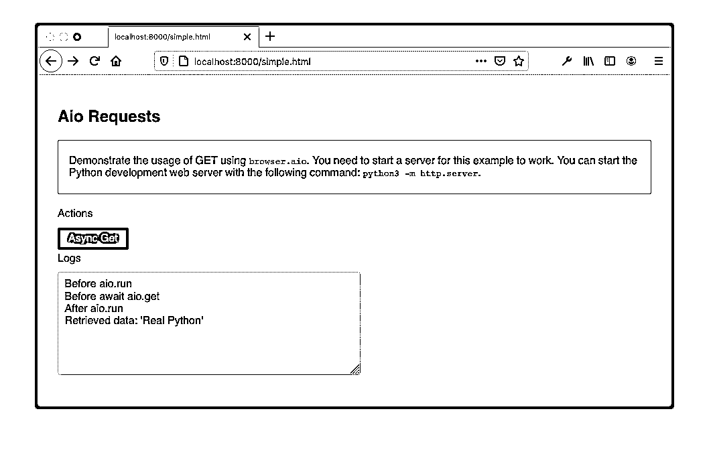](https://files.realpython.com/media/browser_aio.e3c9594eba20.png)

截图显示了点击*异步获取*后执行的步骤顺序。使用`aio`模块和关键字`async`和`await`的组合展示了如何拥抱 JavaScript 提倡的异步编程模型。

## 分发和打包一个 Brython 项目

您用来安装 Brython 的方法可能会影响您部署 Brython 项目的方式和位置。特别是，要部署到 PyPI，最好的选择是首先从 PyPI 安装 Brython，然后用`brython-cli`创建您的项目。但是到私有服务器或云提供商的典型 web 部署可以利用您选择的任何安装方法。

您有几个部署选项:

*   手动和自动部署
*   部署到 PyPI
*   部署到 CDN

在接下来的几节中，您将探索其中的每一个。

### 手动和自动 Web 部署

您的应用程序包含您的网站所需的所有静态依赖项、CSS、JavaScript、Python 和图像文件。Brython 是 JavaScript 文件的一部分。所有文件都可以按原样部署在您选择的提供者上。你可以参考 [Web 开发教程](https://realpython.com/tutorials/web-dev/)和[用 Fabric 和 Ansible 实现 Django 部署自动化](https://realpython.com/automating-django-deployments-with-fabric-and-ansible/)来了解关于部署你的 Brython 应用的细节。

如果您决定使用`brython-cli --modules`来预编译您的 Python 代码，那么您部署的文件将没有任何 Python 源代码，只有`brython.js`和`brython_modules.js`。你也不会包含`brython_stdlib.js`，因为所需的模块已经包含在`brython_modules.js`中了。

### 部署到 PyPI

当您从 PyPI 安装 Brython 时，您可以使用`brython-cli`创建一个可以部署到 PyPI 的包。创建这样一个包的目的是扩展默认的 Brython 模板作为定制项目的基础，并使 Brython 网站可以从 PyPI 获得。

按照从 PyPI 安装[一节中的说明，在您的新`web`项目中执行以下命令:](#pypi-installation)

```py
$ brython-cli --make_dist
```

系统会提示您回答几个旨在创建`brython_setup.json`的问题，您可以稍后修改这些问题。该命令完成后，您将拥有一个名为`__dist__`的目录，其中包含创建可安装包所需的文件。

您可以在本地测试这个新包的安装，如下所示:

```py
$ pip install -e __dist__
```

随后，您还可以通过执行以下命令来确认新命令与`web`包一起部署在本地:

```py
$ python -m web --help
usage: web.py [-h] [--install]

optional arguments:
 -h, --help  show this help message and exit
 --install   Install web in an empty directory
```

请注意，`web`命令的行为与 Brython 在初始安装后的行为完全一样。您刚刚创建了一个可定制安装的 Brython 包，它可以部署到 PyPI。关于如何将包部署到 PyPI 的完整描述，请查看[如何将开源 Python 包发布到 PyPI](https://realpython.com/pypi-publish-python-package/) 。

一旦部署到 PyPI，您就可以在一个 [Python 虚拟环境](https://realpython.com/python-virtual-environments-a-primer/)中安装带有`pip`的 Brython 包。您将能够使用您创建的新命令创建新的定制应用程序:

```py
$ python -m <application_name> --install
```

总而言之，下面是部署到 PyPI 的步骤:

1.  从 PyPI 安装 Brython。
2.  用`brython-cli --install`创建一个项目。
3.  用`brython-cli --make-dist`从你的项目创建一个可安装的包。
4.  将这个包部署到 PyPI。

其他安装方法——CDN、GitHub 和 NPM——不包括`brython-cli`,因此不太适合准备 PyPI 包。

### 部署到 CDN

正如`brython.js`和`brython_stdlibs.js`在 CDN 服务器上可用一样，您也可以将您的静态资产、图像、样式和 JavaScript 文件，包括您的 Python 文件或`brython_modules.js`部署到 CDN。cdn 的示例包括:

*   [Cloudflare](https://www.cloudflare.com/)
*   [谷歌云 CDN](https://cloud.google.com/cdn/)
*   [Azure CDN](https://azure.microsoft.com/en-us/services/cdn/)
*   [亚马逊 CloudFront](https://aws.amazon.com/cloudfront/)
*   [阿卡迈](https://www.akamai.com/)

如果你的应用是开源的，那么你可以获得免费的 CDN 支持。例子包括 [CDNJS](https://cdnjs.com/) 和 [jsDelivr](https://www.jsdelivr.com/) 。

## 创建谷歌浏览器扩展

Chrome 扩展是利用网络技术构建的组件，集成到 Chrome 中以定制你的浏览环境。通常，这些扩展的图标会出现在 Chrome 窗口的顶部，地址栏的右边。

在 Chrome 网上商店上可以获得公共扩展。为了学习，您将从本地文件安装 Google Chrome 扩展:

[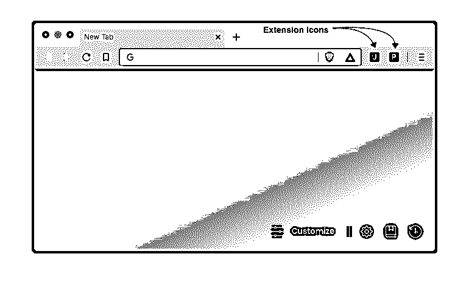](https://files.realpython.com/media/chrome_extention_icons.75fa9c34d677.png)

在 Brython 中实现 Google Chrome 扩展之前，您将首先实现一个 JavaScript 版本，然后将其翻译成 Brython。

### JS 中的 Hello World 扩展

首先，您将实现一个执行以下操作的扩展:

1.  点击扩展图标时打开一个弹出窗口
2.  单击弹出窗口按钮时打开提示消息
3.  将您输入的消息附加到初始弹出窗口的底部

下面的屏幕截图说明了这种行为:

[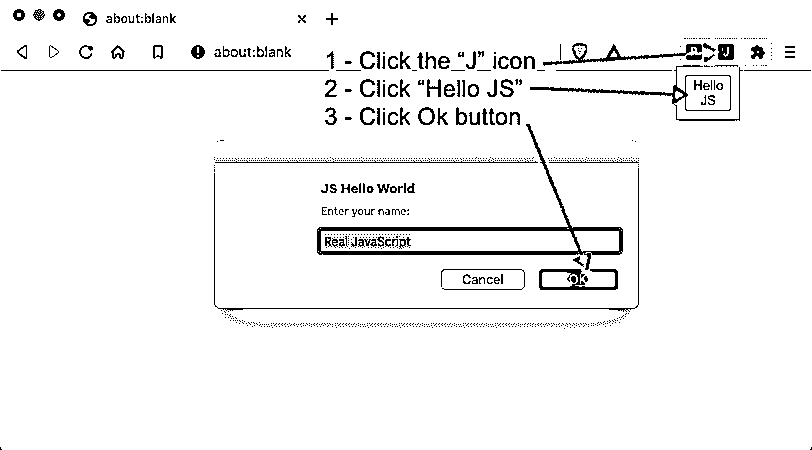](https://files.realpython.com/media/js_chrome_extension.c9600b5ca16b.png)

在空文件夹中，创建文件`manifest.json`来配置扩展名:

```py
 1// manifest.json 2{ 3  "name":  "JS Hello World", 4  "version":  "1.0", 5  "description":  "Hello World Chrome Extension in JavaScript", 6  "manifest_version":  2, 7  "browser_action":  { 8  "default_popup":  "popup.html"  9  }, 10  "permissions":  ["declarativeContent",  "storage",  "activeTab"] 11}
```

本例中的重要字段是默认弹出文件`popup.html`，您也必须创建该文件。关于其他字段和更多的信息，你可以参考[清单文件格式文档](https://developer.chrome.com/extensions/manifest)。

在同一个文件夹中，创建用于定义用户界面扩展的`popup.html`文件:

```py
 1<!-- popup.html -->
 2<!DOCTYPE html>
 3<html>
 4  <head>
 5    <script src="popup.js" defer></script>
 6  </head>
 7  <body>
 8    
 9    <div id="hello"></div>
10  </body>
11</html>
```

HTML 文件包含一个到扩展的 JavaScript 业务逻辑的链接，并描述了它的用户界面:

*   **第 5 行**指的是`popup.js`，里面包含了扩展的逻辑。
*   **第 8 行**定义了一个`button`，它将被绑定到`popup.js`中的一个处理程序。
*   **第 9 行**声明了一个由 JavaScript 代码用来显示一些文本的字段。

您还需要创建`popup.js`:

```py
 1// popup.js 2'use strict'; 3
 4let  helloButton  =  document.getElementById("hello-btn"); 5
 6helloButton.onclick  =  function  (element)  { 7  const  defaultName  =  "Real JavaScript"; 8  let  name  =  prompt("Enter your name:",  defaultName); 9  if  (!name)  { 10  name  =  defaultName; 11  } 12  document.getElementById("hello").innerHTML  =  `Hello, ${name}!`; 13};
```

JavaScript 代码的主要逻辑包括声明一个绑定到 HTML 容器的字段`hello-btn`的`onclick`处理程序:

*   **第 2 行**调用[脚本模式](https://developer.mozilla.org/en-US/docs/Web/JavaScript/Reference/Strict_mode)，该模式在 JavaScript 中启用更严格的验证来揭示 JavaScript 错误。
*   **第 4 行**选择由`popup.html`中的`hello-btn`标识的字段，并将其赋给一个变量。
*   **第 6 行**定义了当用户点击按钮时处理事件的处理器。这个事件处理程序提示用户输入他们的名字，然后将用`hello`标识的`<div>`的内容更改为提供的名字。

安装此扩展之前，请执行以下步骤:

1.  打开屏幕右侧的谷歌 Chrome 菜单。
2.  打开子菜单*更多工具*。
3.  点击*扩展*。

屏幕将显示您当前安装的扩展，如果有的话。它可能看起来像这样:

[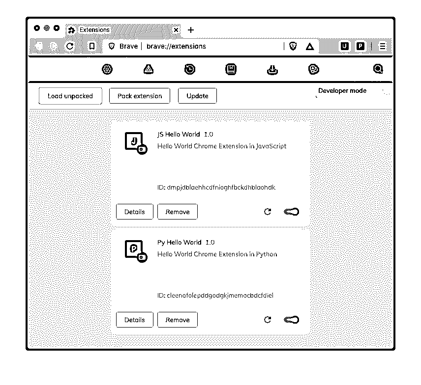](https://files.realpython.com/media/chrome_extensions.b3aa540f1464.png)

要安装新的扩展，您需要采取以下步骤:

1.  确保在屏幕的右上角启用了开发人员模式。
2.  点击*加载解包*。
3.  选择包含您刚刚创建的所有文件的文件夹。

如果在安装过程中没有出现错误，那么您现在应该会在浏览器地址栏的右侧看到一个带有 *J* 的新图标。要测试您的扩展，请单击下面显示的工具栏的 *J* 图标:

[](https://files.realpython.com/media/chrome_extension_toolbar_j.6eeeccd4e26d.png)

如果在安装或执行过程中出现任何错误，您应该会在扩展卡的*移除*按钮右侧看到一个红色错误按钮:

[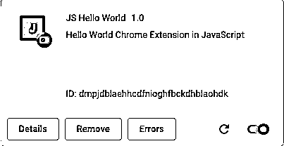](https://files.realpython.com/media/extension_error.f3ed90c23637.png)

您可以点击*错误*来显示错误并确定根本原因。更正后，通过单击扩展卡右下角的圆形箭头重新加载该扩展，然后重复该过程，直到它按预期工作。

要测试新安装的扩展，可以点击浏览器工具栏右侧显示的 *J* 图标。如果图标没有显示，那么点击*扩展*列出已安装的扩展，并选择与您刚刚安装的 JS Hello World 扩展对齐的图钉按钮。

### Python 中的 Hello World 扩展

如果你已经到了这一步，那么你已经完成了最困难的步骤，主要是熟悉创建和安装 Chrome 扩展的过程。这些步骤与 Brython 类似，您将在本节中了解到一些不同之处。

清单文件将是不同的，具有不同的扩展名，并且为了更好地衡量，具有不同的描述:

```py
 1// manifest.json 2{ 3  "name":  "Py Hello World",  4  "version":  "1.0", 5  "description":  "Hello World Chrome Extension in Python",  6  "manifest_version":  2, 7  "browser_action":  { 8  "default_popup":  "popup.html" 9  }, 10  "content_security_policy":  "script-src 'self' 'unsafe-eval';object-src 'self'",  11  "permissions":  ["declarativeContent",  "storage",  "activeTab"] 12}
```

注意，你还必须包括一个新的属性， [`content_security_policy`](https://developer.chrome.com/extensions/contentSecurityPolicy) 。这是需要的，以便在 chrome 扩展系统中可以放松针对`eval()` 的[策略。记住](https://developer.chrome.com/extensions/contentSecurityPolicy#relaxing-eval) [Brython 使用`eval()`](#brythons-internals) 。

这不是你在 Brython 中引入和控制的东西。如果你想使用 Brython 作为浏览器扩展的语言，你需要启用 using `eval()`。如果您不将`unsafe-eval`添加到`content_security_policy`，那么您将会看到以下错误:

```py
Uncaught EvalError: Refused to evaluate a string as JavaScript because
'unsafe-eval' is not an allowed source of script in the following Content
Security Policy directive: "script-src 'self' blob: filesystem:".
```

HTML 文件也将有一些更新，如下所示:

```py
 1<!-- popup.html -->
 2<!DOCTYPE html>
 3<html>
 4  <head>
 5    <script src="brython.min.js" defer></script> 6    <script src="init_brython.js" defer></script> 7    <script src="popup.py" type="text/python" defer></script> 8  </head>
 9  <body> 10    
11    <div id="hello"></div>
12  </body>
13</html>
```

HTML 代码与您用 JavaScript 创建 Chrome 扩展的代码非常相似。一些细节值得注意:

*   **线 5** 从本地包装载`brython.min.js`。出于安全原因，[只加载本地脚本](https://developer.chrome.com/extensions/contentSecurityPolicy#resourceLoading)，你不能从 CDN 之类的外部来源加载。
*   **第 6 行**加载`init_brython.js`，调用`brython()`。
*   **7 号线**加载`popup.py`。
*   **第 9 行**宣告`body`没有通常的`onload="brython()"`。

另一个安全约束阻止您在`body`标签的`onload`事件中调用`brython()`。解决方法是在文档中添加一个[监听器](https://developer.mozilla.org/en-US/docs/Web/API/EventTarget/addEventListener)，并指示浏览器在文档内容加载后执行`brython()`:

```py
// init_brython.js document.addEventListener('DOMContentLoaded',  function  ()  { brython(); });
```

最后，您可以在下面的 Python 代码中看到该应用程序的主要逻辑:

```py
# popup.py
from browser import document, prompt

def hello(evt):
    default = "Real Python"
    name = prompt("Enter your name:", default)
    if not name:
        name = default
    document["hello"].innerHTML = f"Hello, {name}!"

document["hello-btn"].bind("click", hello)
```

这样，您就可以像处理 JavaScript chrome 扩展一样继续安装和测试了。

## 测试和调试 Brython

目前没有方便的库用于单元测试 Brython 代码。随着 Brython 的发展，您将看到更多在浏览器中测试和调试 Python 代码的选项。可以利用 Python 单元测试框架开发一个可以在浏览器之外使用的独立 Python 模块。在浏览器中，带有浏览器驱动程序的 Selenium 是一个不错的选择。调试也是有限的，但也是可能的。

### Python 单元测试

Python 的单元测试框架，像内置的 [`unittest`](https://docs.python.org/3/library/unittest.html) 和 [`pytest`](https://docs.pytest.org/en/stable/) ，在浏览器中不工作。您可以将这些框架用于 Python 模块，这些模块也可以在 CPython 的上下文中执行。任何像`browser`这样的特定于 Brython 的模块都不能在命令行用这样的工具进行测试。有关 Python 单元测试的更多信息，请查看[Python 测试入门](https://realpython.com/python-testing/)。

### 硒

Selenium 是一个自动化浏览器的框架。它与浏览器中使用的语言无关，无论是 JavaScript、 [Elm](https://elm-lang.org/) 、Wasm 还是 Brython，因为它使用了 [WebDriver](https://www.selenium.dev/) 的概念，就像用户与浏览器交互一样。你可以查看[使用 Python 和 Selenium 的现代 Web 自动化](https://realpython.com/modern-web-automation-with-python-and-selenium/)来获得关于这个框架的更多信息。

### JavaScript 单元测试

有许多专注于 JavaScript 的测试框架，如 [Mocha](https://mochajs.org/) 、 [Jasmine](https://jasmine.github.io/index.html) 和 [QUnit](https://api.qunitjs.com/) ，它们在完整的 JavaScript 生态系统中表现良好。但是它们不一定非常适合在浏览器中运行的单元测试 Python 代码。一个选项要求将 Brython 函数全局暴露给 JavaScript，这违背了最佳实践。

为了说明将 Brython 函数暴露给 JavaScript 的选项，您将使用 [QUnit](https://api.qunitjs.com/) ，这是一个 JavaScript 单元测试套件，可以在 HTML 文件中独立运行:

```py
 1<!-- index.html -->
 2<!DOCTYPE html >
 3<html>
 4
 5<head>
 6  <meta charset="utf-8">
 7  <meta name="viewport" content="width=device-width">
 8  <title>Test Suite</title>
 9  <link rel="stylesheet" href="https://code.jquery.com/qunit/qunit-2.13.0.css">
10  <script src="https://cdnjs.cloudflare.com/ajax/libs/brython/3.9.0/brython.min.js"></script>
11  <script src="https://code.jquery.com/qunit/qunit-2.13.0.js"></script> 12</head>
13
14<body onload="brython()">
15<div id="qunit"></div>
16<div id="qunit-fixture"></div>
17<script type="text/python"> 18from  browser  import  window 19
20def  python_add(a,  b): 21  return  a  +  b 22
23window.py_add  =  python_add  24</script>
25
26<script> 27const  js_add  =  (a,  b)  =>  a  +  b; 28QUnit.module('js_add_test',  function()  {  29  QUnit.test('should add two numbers',  function(assert)  { 30  assert.equal(js_add(1,  1),  2,  '1 + 1 = 2 (javascript'); 31  }); 32}); 33
34QUnit.module('py_add_test',  function()  {  35  QUnit.test('should add two numbers in Brython',  function(assert)  { 36  assert.equal(py_add(2,  3),  5,  '2 + 3 = 5 (python)'); 37  }); 38}); 39
40QUnit.module('py_add_failed_test',  function()  {  41  QUnit.test('should add two numbers in Brython (failure)',  function(assert)  { 42  assert.equal(py_add(2,  3),  6,  '2 + 3 != 6 (python)'); 43  }); 44}); 45</script>
46
47</body>
48</html>
```

在一个 HTML 文件中，您编写了 Python 代码、JavaScript 代码和 JavaScript 测试来验证在浏览器中执行的两种语言的函数:

*   **第 11 行**导入 QUnit 框架。
*   第 23 行将`python_add()`暴露给 JavaScript。
*   **第 28 行**定义了`js_add_test`来测试 JavaScript 函数`js_add()`。
*   **第 34 行**定义了`py_add_test`来测试 Python 函数`python_add()`。
*   **第 40 行**定义了`py_add_failed_test`来测试有错误的 Python 函数`python_add()`。

您不需要启动 web 服务器来执行单元测试。在浏览器中打开`index.html`，您应该看到以下内容:

[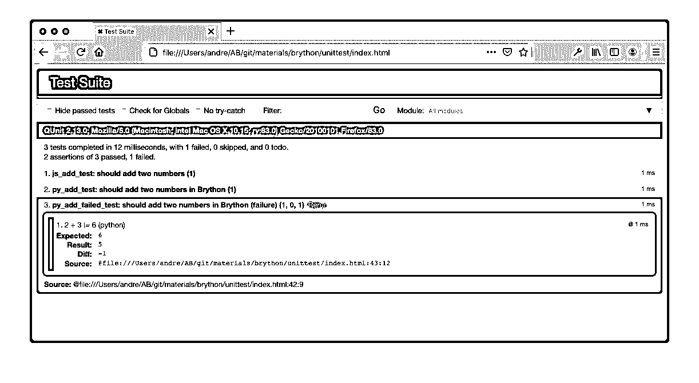](https://files.realpython.com/media/qunit_brython.01ff31a05d3a.png)

该页面显示了两个成功的测试`js_add_test()`和`py_add_test()`，以及一个失败的测试`py_add_failed_test()`。

向 JavaScript 公开 Python 函数展示了如何使用 JavaScript 单元测试框架在浏览器中执行 Python。尽管可以进行测试，但通常不建议这样做，因为它可能会与现有的 JavaScript 名称冲突。

### 在 Brython 中调试

在撰写本文时，还没有调试 Brython 应用程序的用户友好工具。您无法生成一个允许您在浏览器开发工具中逐步调试的[源映射](https://developer.mozilla.org/en-US/docs/Tools/Debugger/How_to/Use_a_source_map)文件。

这不应该阻止你使用 Brython。以下是一些有助于调试和排除 Brython 代码故障的提示:

*   **使用`print()`或`browser.console.log()`或**在浏览器的开发者工具控制台中打印变量值。
*   **使用 f-string 调试**，如[中所述，Python 3.8](https://realpython.com/python38-new-features/) 中的酷新特性。
*   使用[开发者工具](https://developers.google.com/web/tools/chrome-devtools/storage/indexeddb)偶尔清除浏览器的索引数据库。
*   **在开发过程中，通过选中浏览器开发工具的网络选项卡中的*禁用缓存*复选框，禁用浏览器缓存**。
*   **将[选项](https://brython.info/static_doc/en/options.html)添加到`brython()`** 中，使额外的调试信息能够显示在 JavaScript 控制台中。
*   **在本地**复制`brython.js`和`brython_stdlib.min.js`以加快开发时的重装速度。
*   **启动本地服务器**当你`import` Python 代码。
*   **对 Chrome 扩展进行故障诊断时，从扩展**打开检查器。

Python 的一个优点是 [REPL(读取-评估-打印循环)](https://en.wikipedia.org/wiki/Read%E2%80%93eval%E2%80%93print_loop)。在线 Brython 控制台提供了一个实验、测试和调试一些代码片段行为的平台。

## 探索布里森的替代品

Brython 并不是在浏览器中编写 Python 代码的唯一选择。有几种选择:

*   [雕塑](https://skulpt.org/)
*   [转密码](https://www.transcrypt.org/)
*   [Pyodide](https://github.com/iodide-project/pyodide/)
*   [py . js](https://pypyjs.org/)

每个实现都从不同的角度处理这个问题。Brython 试图通过提供与 JavaScript 相同的 web API 和 DOM 操作来替代 JavaScript，但它具有 Python 语法和习惯用法的吸引力。与一些可能有不同目标的替代方案相比，它被打包成一个小下载。

**注:**在 [PyCon US 2022](https://realpython.com/real-python-pycon-us-2022/) 上，一个新的替代方案亮相: [PyScript](https://pyscript.net/) ！关于这个新框架的指南，您可以在 Web 浏览器中查看一下 PyScript:Python。

这些框架相比如何？

### 雕塑

[Skulpt](https://skulpt.org/) 在浏览器中将 Python 代码编译成 JavaScript。编译发生在页面加载之后，而在 Brython 中，编译发生在页面加载期间。

虽然它没有内置的函数来操作 DOM，但 Skulpt 在应用程序上非常接近 Brython。这包括教育用途和成熟的 Python 应用，正如 [Anvil](https://anvil.works/) 所展示的。

Skulpt 是一个向 Python 3 迁移的维护项目。对于与浏览器中的执行兼容的模块，Brython 基本上与 CPython 3.9 相当。

### 转加密

[Transcrypt](https://www.transcrypt.org/) 包含一个命令行工具，可以将 Python 代码编译成 JavaScript 代码。据说提前编译的是[(AOT)](https://en.wikipedia.org/wiki/Ahead-of-time_compilation)。然后可以将生成的代码加载到浏览器中。Transcrypt 占用空间很小，大约 100KB。速度很快，支持 DOM 操作。

Skulpt 和 Brython 的区别在于，在下载并在浏览器中使用 Transcrypt 之前，先用 Transcrypt 编译器将 Transcrypt 编译成 JavaScript。这实现了速度和小尺寸。然而，它阻止了 Transcrypt 像其他平台一样被用作教育平台。

### Pyodide

Pyodide 是 CPython 解释器的 WebAssembly 编译。它在浏览器中解释 Python 代码。没有 JavaScript 编译阶段。虽然 Pyodide 和 PyPy.js 一样，需要你下载大量数据，但它装载了科学库，如 [NumPy](https://realpython.com/tutorials/numpy/) 、 [Pandas](https://realpython.com/pandas-python-explore-dataset/) 、 [Matplotlib](https://realpython.com/python-matplotlib-guide/) 等等。

你可以把 Pyodide 看作是一个完全在浏览器中运行的 Jupyter 笔记本环境，而不是由后端服务器提供服务。你可以用一个[活生生的例子](https://alpha.iodide.io/notebooks/300/)来试验 Pyodide。

### pypy . js〔t0〕

PyPy.js 使用 [PyPy](https://www.pypy.org/) Python 解释器，用 [emscripten](https://emscripten.org/) 编译成 JavaScript，使其兼容在浏览器中运行。

除了项目当前的休眠状态之外，PyPy.js 还是一个很大的包，大约 10 MB，这对于典型的 web 应用程序来说是禁止的。打开 [PyPy.js 主页](https://pypyjs.org/)，仍然可以在浏览器中使用 PyPy.js 作为学习 Python 的平台。

PyPy.js 用 emscripten 编译成 JavaScript。Pyodide 更进一步，特别是利用 emscripten 和 Wasm 来编译 Python C 扩展，如 WebAssembly 的 [NumPy](https://numpy.org/) 。

在撰写本文时，PyPy.js 似乎没有得到维护。关于编译过程的类似情况，可以考虑 Pyodide。

## 结论

在本教程中，您已经深入了解了在浏览器中编写 Python 代码的几个方面。这可能会让您对尝试 Python 进行前端开发产生一些兴趣。

**在本教程中，您已经学会了如何:**

*   在本地环境中安装和使用 Brython
*   **在你的前端网络应用中用 Python** 替换 JavaScript
*   操纵 **DOM**
*   与 **JavaScript** 交互
*   创建**浏览器扩展**
*   比较 Brython 的**备选方案**

除了访问通常为 JavaScript 保留的特性之外，Brython 的最佳用途之一是作为学习和教学工具。你可以访问运行在浏览器中的 Python [编辑器](https://brython.info/tests/editor.html)和[控制台](https://brython.info/tests/console.html)，开始探索如今 Brython 的许多用途。

要查看您在本教程中看到的示例，您可以通过单击下面的链接下载源代码:

**获取源代码:** [点击此处获取源代码，您将在本教程中使用](https://realpython.com/bonus/brython-browser-python-code/)了解如何使用 Brython 在浏览器中运行 Python。************