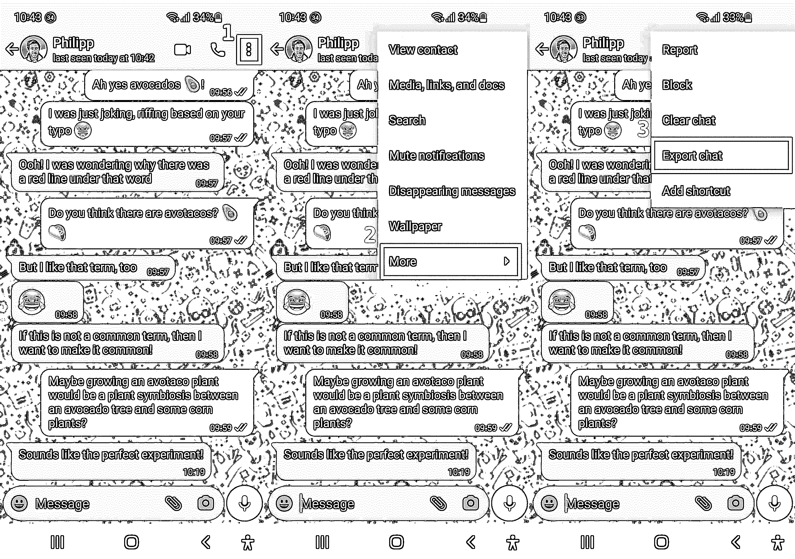
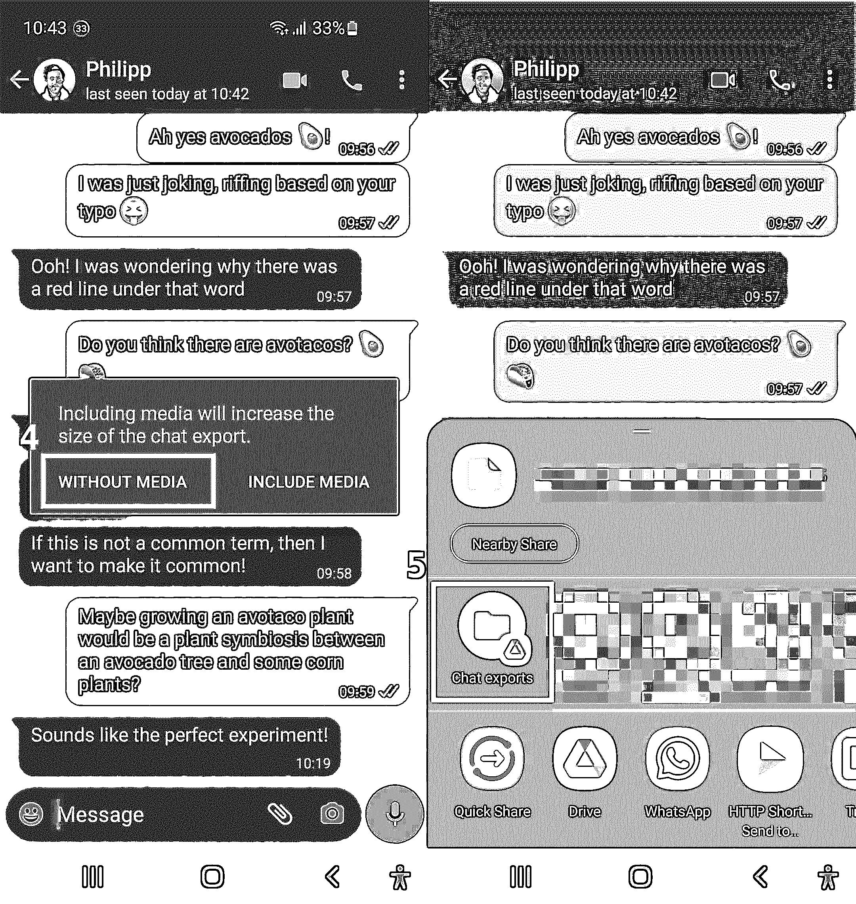

# 用 Python 构建一个聊天机器人

> 原文：<https://realpython.com/build-a-chatbot-python-chatterbot/>

聊天机器人可以提供实时客户支持，因此是许多行业的宝贵资产。当你理解了**聊天机器人**库的基础知识，你就可以**用几行 Python 代码来构建和训练**一个**自学聊天机器人**。

在第一步中，你将立即启动并运行基本的聊天机器人[，但最有趣的部分是学习阶段，这时你开始训练你的聊天机器人。您的训练数据的质量和准备情况将对您的聊天机器人的性能产生很大影响。](#step-1-create-a-chatbot-using-python-chatterbot)

为了模拟真实世界中创建行业相关聊天机器人的过程，您将学习如何定制聊天机器人的响应。你可以通过准备 **WhatsApp 聊天数据**来训练聊天机器人。您可以应用类似的过程，从任何领域特定主题的不同对话数据中训练您的机器人。

**在本教程中，您将学习如何:**

*   用聊天机器人构建一个命令行聊天机器人
*   训练聊天机器人定制它的反应
*   **导出**您的 WhatsApp 聊天记录
*   使用**正则表达式**对聊天导出执行**数据清理**
*   用特定行业的数据重新训练聊天机器人

您还将了解 ChatterBot 如何存储您的训练数据，您将找到关于[下一步](#next-steps)的建议和指针，因此您可以开始收集真实的用户数据，并让 chatter bot 从中学习。

总的来说，在本教程中，您将快速浏览使用 ChatterBot 创建聊天机器人的基础知识，并了解 Python 如何让您在无需编写大量代码的情况下获得有趣且有用的结果。

**源代码:** [点击这里下载免费的源代码](https://realpython.com/bonus/build-a-chatbot-python-chatterbot-code/)，你将使用它来构建一个聊天机器人。

## 演示

在本教程结束时，您将拥有一个命令行聊天机器人，它可以用半有意义的回复来响应您的输入:

[https://player.vimeo.com/video/751629412](https://player.vimeo.com/video/751629412)

你将通过准备 WhatsApp 聊天数据并使用它来训练聊天机器人来实现这一点。除了从你的自动化训练中学习，聊天机器人还会随着时间的推移而改进，因为它从用户互动中获得了更多的问题和回答。

[*Remove ads*](/account/join/)

## 项目概述

ChatterBot 库结合了语言语料库、文本处理、机器学习算法以及数据存储和检索，允许您构建灵活的聊天机器人。

你可以通过用相关数据训练它来构建一个特定行业的聊天机器人。此外，聊天机器人会记住用户的响应，并继续构建其内部的[图结构](https://en.wikipedia.org/wiki/Graph_(abstract_data_type))，以改进它可以给出的响应。

**注意:**虽然 ChatterBot 仍然是一个流行的用 Python 构建聊天机器人的开源解决方案，但它已经有一段时间没有得到积极的维护，因此积累了大量的[问题](https://github.com/gunthercox/ChatterBot/issues/)。

该项目的多个分支实现了对现有代码库的修复和更新，但是您必须亲自挑选实现您正在寻找的解决方案的分支，然后[直接从 GitHub](https://realpython.com/what-is-pip/#installing-packages-from-your-github-repositories) 安装它。叉子也可能带有[附加安装说明](https://github.com/feignbird/ChatterBot-spacy_fixed#installation)。

然而，开始时，你不会用叉子。相反，您将使用库的特定固定版本，如分布在 PyPI 上的[。你会在](https://pypi.org/project/ChatterBot/)[第一步](#step-1-create-a-chatbot-using-python-chatterbot)中找到更多关于安装聊天机器人的信息。

在本教程中，您将从一个未经训练的聊天机器人开始，展示使用 Python 的 ChatterBot 创建一个交互式聊天机器人有多快。你也会注意到未经训练的聊天机器人的词汇量有多小。

接下来，您将学习如何训练这样一个聊天机器人，并检查略有改善的结果。你的训练数据越丰富、质量越高，你的聊天机器人的反应就越好。

因此，您可以获取您的 WhatsApp 聊天记录，或者使用提供的`chat.txt`文件，您可以从这里下载:

**源代码:** [点击这里下载免费的源代码](https://realpython.com/bonus/build-a-chatbot-python-chatterbot-code/)，你将使用它来构建一个聊天机器人。

输入数据很少以您需要的形式出现，因此您将清理聊天导出数据，使其成为有用的输入格式。此过程将向您展示一些可用于数据清理的工具，这可能有助于您准备其他输入数据以提供给您的聊天机器人。

数据清理后，您将重新训练您的聊天机器人，并让它再次旋转以体验改进的性能。

当您从头到尾完成这个过程时，您将会很好地理解如何使用 ChatterBot 库构建和训练 Python 聊天机器人，以便它能够提供与相关回复的交互体验。

## 先决条件

在开始之前，确保您有一个适用于这个 ChatterBot 项目的 Python 版本。您需要的 Python 版本取决于您的操作系统:

*   [*视窗*](#windows-1)
**   [*Linux*](#linux-1)**   [*macOS*](#macos-1)*

**您需要使用低于 3.8 的 Python 版本才能成功使用本教程中推荐的 ChatterBot 版本。使用`pyenv-win` 可以[安装 Python 3.7.9。](https://realpython.com/python-coding-setup-windows/#installing-python-with-pyenv-for-windows)

您应该能够使用各种 Python 版本在 Ubuntu Linux 上运行该项目。但是，如果你碰到任何问题，那么你可以尝试[安装 Python 3.7.9](https://realpython.com/installing-python/#how-to-install-python-on-linux) ，例如使用 [`pyenv`](https://realpython.com/intro-to-pyenv/) 。

您可以使用各种 Python 版本运行该项目。聊天机器人是用 Python 3.10.7 版本构建和测试的，但也应该可以在旧版本的 Python 上运行。

如果您已经为您的操作系统安装了正确的 Python 版本，那么您就可以开始了。在学习本教程的过程中，您将接触到一些 Python 概念:

*   [条件语句](https://realpython.com/python-conditional-statements/)
*   [`while`](https://realpython.com/python-while-loop/) 循环进行迭代
*   [列表和元组](https://realpython.com/python-lists-tuples/)
*   [Python 函数](https://realpython.com/defining-your-own-python-function/)
*   [子串检查](https://realpython.com/python-string-contains-substring/)和[子串替换](https://realpython.com/replace-string-python/)
*   [文件输入/输出](https://realpython.com/read-write-files-python/)
*   [Python 理解](https://realpython.com/list-comprehension-python/)和[生成器表达式](https://realpython.com/introduction-to-python-generators/)
*   [正则表达式(regex)](https://realpython.com/regex-python/) 使用`re`

如果您对这些概念感到满意，那么您可能会对编写本教程的代码感到满意。如果您在开始本教程之前没有掌握所有的必备知识，那也没关系！事实上，你可以通过前进和开始来学习更多。如果遇到困难，您可以随时停下来查看此处链接的资源。

## 步骤 1:使用 Python 聊天机器人创建一个聊天机器人

在这一步中，您将设置一个虚拟环境并安装必要的依赖项。您还将创建一个可以回复您的命令行聊天机器人——但是它还没有非常有趣的回复。

要开始你的聊天机器人项目，创建并激活一个[虚拟环境](https://realpython.com/python-virtual-environments-a-primer/)，然后安装`chatterbot`和`pytz`:

*   [*视窗*](#windows-2)
**   [**Linux + macOS**](#linux-macos-2)*

```py
PS> python -m venv venv
PS> venv\Scripts\activate
(venv) PS> python -m pip install chatterbot==1.0.4 pytz
```

```py
$ python -m venv venv
$ source venv/bin/activate
(venv) $ python -m pip install chatterbot==1.0.4 pytz
```

在终端应用程序中运行这些命令会将 ChatterBot 及其依赖项安装到一个新的 Python 虚拟环境中。

**注:**在撰写本文的时候，[的 ChatterBot 库](https://github.com/gunthercox/ChatterBot)已经有一段时间没怎么维护了。因此，它面临着一些很快就会变得恼人的问题。

对于本教程，您将使用 ChatterBot 1.0.4，它也适用于 macOS 和 Linux 上的新 Python 版本。在 Windows 上，你必须使用低于 3.8 的 Python 版本。ChatterBot 1.0.4 附带了一些本项目不需要的依赖项。然而，如果您尝试使用 ChatterBot 的新版本或删除一些依赖项，您将很快遇到更多问题。

所以，只要放松到这个选定的版本，给它一个旋转。如果你已经迷上了，并且需要更多，那么你可以在以后切换到一个新的版本。

安装完成后，运行`python -m pip freeze`应该会显示已安装的依赖项列表，类似于您可以在提供的示例代码的`requirements.txt`文件中找到的内容:

**源代码:** [点击这里下载免费的源代码](https://realpython.com/bonus/build-a-chatbot-python-chatterbot-code/)，你将使用它来构建一个聊天机器人。

安装完成后，忽略该库目前存在的一些问题，您就可以开始了！创建一个新的 Python 文件，将其命名为`bot.py`，并添加启动和运行基本聊天机器人所需的代码:

```
 1# bot.py
 2
 3from chatterbot import ChatBot
 4
 5chatbot = ChatBot("Chatpot")
 6
 7exit_conditions = (":q", "quit", "exit")
 8while True:
 9    query = input("> ")
10    if query in exit_conditions:
11        break
12    else:
13        print(f"🪴 {chatbot.get_response(query)}")
```py

在第 3 行导入`ChatBot`之后，您在第 5 行创建了一个`ChatBot`的实例。唯一需要的参数是一个名字，您称这个为`"Chatpot"`。不，这不是打字错误——在本教程中，您将实际构建一个健谈的花盆聊天机器人！你很快就会注意到，花盆可能并不是最好的谈话对象。

在第 8 行，您创建了一个 [`while`循环](https://realpython.com/python-while-loop/)，它将一直循环下去，除非您输入第 7 行定义的退出条件之一。最后，在第 13 行，您在之前创建的`ChatBot`实例上调用`.get_response()`，并将您在第 9 行收集并分配给`query`的用户输入传递给它。

短脚本最后一行对`.get_response()`的调用是与您的`chatbot`的唯一交互。然而，你有一个可以运行的命令行聊天机器人，你可以带着它转一圈。

当您运行`bot.py`时，ChatterBot 可能会下载一些与 [NLTK 项目](https://realpython.com/python-nltk-sentiment-analysis/)相关的数据和语言模型。它会将一些相关信息打印到您的控制台上。Python 不会在后续运行中再次下载这些数据。

**注意:**NLTK 项目[将 ChatterBot 使用的数据](https://www.nltk.org/data)安装到操作系统的默认位置:

*   **视窗:** `C:\nltk_data\`
*   **Linux:**T0】
*   **macOS:** `/Users/<username>/nltk_data/`

NLTK 会在你的聊天机器人第一次运行时自动创建目录。

如果您准备好与您新开发的`Chatpot`进行交流，那么您可以继续运行 Python 文件:

```
$ python bot.py
```py

在建立语言模型之后，您将看到您在`bot.py`中定义的大于号(`>`)作为您的输入提示。您现在可以开始与您的聊天锅互动了:

```
> hello
🪴 hello
> are you a plant?
🪴 hello
> can you chat, pot?
🪴 hello
```

嗯……你的聊天室正在*响应*，但是它真的很难扩展。很难对盆栽植物有更多的期望——毕竟，它从未见过世面！

**注意:**在 Windows PowerShell 上，盆栽植物表情符号(🪴)可能无法正确显示。您可以随意用您喜欢的任何其他提示来替换它。

即使你的聊天锅还没有太多的话要说，它已经在学习和成长。要对此进行测试，请停止当前会话。您可以通过键入退出条件之一来实现这一点— `":q"`、`"quit"`或`"exit"`。那就另找时间启动聊天机器人。输入不同的信息，您会注意到聊天机器人会记住您在上次运行时输入的内容:

```
> hi
🪴 hello
> what's up?
🪴 are you a plant?
```py

在第一次运行期间，ChatterBot 创建了一个 [SQLite](https://www.sqlite.org/about.html) 数据库文件，其中存储了您的所有输入并将它们与可能的响应联系起来。您的工作目录中应该会弹出三个新文件:

```
./
├── bot.py
├── db.sqlite3 ├── db.sqlite3-shm └── db.sqlite3-wal
```py

ChatterBot 使用默认的`SQLStorageAdapter`和[创建一个 SQLite 文件数据库](https://github.com/gunthercox/ChatterBot/blob/1.0/chatterbot/storage/sql_storage.py#L31)，除非你指定一个不同的[存储适配器](https://chatterbot.readthedocs.io/en/stable/storage/index.html)。

**注:**主数据库文件为`db.sqlite3`，另外两个以 [`-wal`](https://www.sqlite.org/tempfiles.html#write_ahead_log_wal_files) 和 [`-shm`](https://www.sqlite.org/tempfiles.html#shared_memory_files) 结尾的是临时支持文件。

因为你在聊天开始时既说了*你好*又说了*嗨*，所以你的聊天室知道它可以互换使用这些信息。这意味着如果你和你的新聊天机器人聊很多，它会逐渐给你更好的回复。但是手动改进它的响应听起来是一个漫长的过程！

现在，您已经创建了一个可用的命令行聊天机器人，您将学习如何训练它，以便您可以进行稍微更有趣的对话。

[*Remove ads*](/account/join/)

## 第二步:开始训练你的聊天机器人

在上一步中，您构建了一个可以从命令行与之交互的聊天机器人。聊天机器人是从一张白纸开始的，和它聊天并不有趣。

在这一步中，您将使用`ListTrainer`训练您的聊天机器人，让它从一开始就变得更聪明。您还将了解 ChatterBot 自带的内置训练器，包括它们的局限性。

你的聊天机器人不必从头开始，ChatterBot 为你提供了一个快速训练你的机器人的方法。您将使用[聊天机器人的`ListTrainer`](https://chatterbot.readthedocs.io/en/stable/training.html#training-via-list-data) 提供一些对话示例，让您的聊天机器人有更多的发展空间:

```
 1# bot.py
 2
 3from chatterbot import ChatBot
 4from chatterbot.trainers import ListTrainer 5
 6chatbot = ChatBot("Chatpot")
 7
 8trainer = ListTrainer(chatbot) 9trainer.train([ 10    "Hi", 11    "Welcome, friend 🤗", 12]) 13trainer.train([ 14    "Are you a plant?", 15    "No, I'm the pot below the plant!", 16]) 17
18exit_conditions = (":q", "quit", "exit")
19while True:
20    query = input("> ")
21    if query in exit_conditions:
22        break
23    else:
24        print(f"🪴 {chatbot.get_response(query)}")
```py

在第 4 行，导入`ListTrainer`，在第 8 行将`chatbot`传递给它以创建`trainer`。

在第 9 到 12 行，您设置了第一轮训练，在这里您将两个字符串的列表传递给`trainer.train()`。使用`.train()`将条目注入到数据库中，以构建 ChatterBot 用来选择可能回复的图结构。

**注意:**如果你向`ListTrainer.train()`传递一个正好有两个项目的 iterable，那么 ChatterBot 认为第一个项目是一个语句，第二个项目是一个可接受的响应。

您可以运行多个培训会话，因此在第 13 到 16 行中，您向 chatbot 的数据库添加了另一条语句和另一条回复。

如果您现在使用`python bot.py`再次运行交互式聊天机器人，您可以从它那里得到与以前略有不同的响应:

```
> hi
🪴 Welcome, friend 🤗
> hello
🪴 are you a plant?
> me?
🪴 are you a plant?
> yes
🪴 hi
> are you a plant?
🪴 No, I'm the pot below the plant!
> cool
🪴 Welcome, friend 🤗
```py

对话还不够流畅，以至于你想进行第二次约会，但是有额外的背景，你以前没有！当你用更多的数据训练你的聊天机器人时，它会更好地响应用户的输入。

聊天机器人库附带了一些语料库，你可以用它们来训练你的聊天机器人。然而，在撰写本文时，如果您试图直接使用这些资源，就会出现一些问题。

**注意:**问题来自于依赖项版本之间的不匹配，以及您使用的 Python 版本。你*可以*绕过他们，但这需要你自己做一些调整。

或者，您可以使用`pyYAML` 自己解析语料库文件[，因为它们被](https://realpython.com/python-yaml/)[存储为 YAML 文件](https://github.com/gunthercox/chatterbot-corpus/blob/master/chatterbot_corpus/data/english/computers.yml)。

虽然提供的语料库可能对你来说足够了，但在本教程中，你将完全跳过它们，而是学习如何使用 ChatterBot 的`ListTrainer`来调整你自己的对话输入数据。

为了训练你的聊天机器人回答与行业相关的问题，你可能需要使用自定义数据，例如来自你公司的现有支持请求或聊天记录。

接下来，您将逐步完成将 WhatsApp 对话中的聊天数据转换为可用于训练您的聊天机器人的格式。如果你自己的资源是 WhatsApp 的对话数据，那么你可以直接使用这些步骤。如果您的数据来自其他地方，那么您可以调整这些步骤以适应您的特定文本格式。

首先，您将学习如何从 WhatsApp 聊天对话中导出数据。

## 第三步:导出 WhatsApp 聊天记录

在这一步结束时，您将下载一个包含 WhatsApp 对话的聊天历史的 TXT 文件。如果你没有 WhatsApp 帐户或者不想使用自己的对话数据，那么你可以下载下面的聊天导出示例:

**源代码:** [点击这里下载免费的源代码](https://realpython.com/bonus/build-a-chatbot-python-chatterbot-code/)，你将使用它来构建一个聊天机器人。

如果您要使用提供的聊天历史示例，您可以跳到下一部分，在那里您将[清理您的聊天导出](#step-4-clean-your-chat-export)。

要导出您在 WhatsApp 上的对话历史，您需要在手机上打开该对话。进入对话屏幕后，您可以访问导出菜单:

1.  点击右上角的三个点(⋮)打开主菜单。
2.  选择*更多*调出附加菜单选项。
3.  选择*导出聊天*创建您的对话的 TXT 导出。

在下面拼接在一起的截图中，你可以看到三个连续的步骤编号并用红色标出:

[](https://files.realpython.com/media/whatsapp-export-instructions.851f28025997.jpeg)

一旦你点击了*导出聊天*，你需要决定是否包括媒体，如照片或音频信息。因为你的聊天机器人只处理文本，选择没有媒体的*。然后，您可以声明要将文件发送到哪里。

同样，你可以在两张拼接在一起的 WhatsApp 截图中看到这些后续步骤的示例，下面有红色数字和轮廓:

[](https://files.realpython.com/media/whatsapp-export-instructions-2.9035f97fd000.jpg)

在本例中，您将聊天导出文件保存到名为 *Chat exports* 的 Google Drive 文件夹中。你必须在你的 Google Drive 中设置这个文件夹，然后才能选择它作为一个选项。当然，你不需要使用 Google Drive。只要您保存或发送您的聊天导出文件，以便您可以在您的计算机上访问它，您就可以开始了。

一旦完成，切换回你的电脑。找到您保存的文件，并将其下载到您的机器上。

具体来说，您应该将文件保存到也包含`bot.py`的文件夹中，并将其重命名为`chat.txt`。然后，用[你最喜欢的文本编辑器](https://realpython.com/python-ides-code-editors-guide/)打开它，检查你收到的数据:

```
9/15/22, 14:50 - Messages and calls are end-to-end encrypted.
⮑ No one outside of this chat, not even WhatsApp, can read
⮑ or listen to them. Tap to learn more.
9/15/22, 14:49 - Philipp: Hi Martin, Philipp here!
9/15/22, 14:50 - Philipp: I'm ready to talk about plants!
9/15/22, 14:51 - Martin: Oh that's great!
9/15/22, 14:52 - Martin: I've been waiting for a good convo about
⮑ plants for a long time
9/15/22, 14:52 - Philipp: We all have.
9/15/22, 14:52 - Martin: Did you know they need water to grow?
...
```py

如果您还记得 ChatterBot 是如何处理训练数据的，那么您会发现这种格式并不适合用于训练。

当聊天机器人回复用户消息时，聊天机器人使用完整的行作为消息。在这个聊天导出的例子中，它将包含所有的消息元数据。这意味着你的友好锅将研究日期，时间和用户名！不是很好的谈话肥料。

为了避免这个问题，在使用聊天导出数据训练您的聊天机器人之前，您需要清理它。

[*Remove ads*](/account/join/)

## 第四步:清理你的聊天导出

在这一步中，您将清理 WhatsApp 聊天导出数据，以便您可以使用它作为输入，就特定于行业的主题训练您的聊天机器人。在这个例子中，主题将是…室内植物！

你用来训练聊天机器人的大多数数据在产生有用的结果之前都需要某种清理。就像老话说的那样:

> 垃圾输入，垃圾输出([来源](https://en.wikipedia.org/wiki/Garbage_in,_garbage_out)

花些时间浏览您正在处理的数据，并确定潜在的问题:

```
9/15/22, 14:50 - Messages and calls are end-to-end encrypted.
⮑ No one outside of this chat, not even WhatsApp, can read
⮑ or listen to them. Tap to learn more.

...

9/15/22, 14:50 - Philipp: I'm ready to talk about plants!

...

9/16/22, 06:34 - Martin: <Media omitted>

...
```py

例如，您可能注意到所提供的聊天导出的第一行不是对话的一部分。此外，每条实际消息都以元数据开始，包括日期、时间和消息发送者的用户名。

如果您进一步向下滚动对话文件，您会发现一些行不是真正的消息。因为你没有在聊天导出中包含媒体文件，WhatsApp 用文本`<Media omitted>`替换了这些文件。

所有这些数据都会干扰你的聊天机器人的输出，而且肯定会让它听起来不太像对话。因此，删除这些数据是个好主意。

在将数据提交给 ChatterBot 进行训练之前，打开一个新的 Python 文件对数据进行预处理。首先读入文件内容并删除聊天元数据:

```
 1# cleaner.py
 2
 3import re
 4
 5def remove_chat_metadata(chat_export_file):
 6    date_time = r"(\d+\/\d+\/\d+,\s\d+:\d+)"  # e.g. "9/16/22, 06:34"
 7    dash_whitespace = r"\s-\s"  # " - "
 8    username = r"([\w\s]+)"  # e.g. "Martin"
 9    metadata_end = r":\s"  # ": "
10    pattern = date_time + dash_whitespace + username + metadata_end
11
12    with open(chat_export_file, "r") as corpus_file:
13        content = corpus_file.read()
14    cleaned_corpus = re.sub(pattern, "", content)
15    return tuple(cleaned_corpus.split("\n"))
16
17if __name__ == "__main__":
18    print(remove_chat_metadata("chat.txt"))
```py

该函数使用[内置的`re`模块](https://docs.python.org/3/library/re.html)从聊天导出文件中删除与对话无关的消息元数据，该模块允许您[使用正则表达式](https://realpython.com/regex-python/):

*   **三号线**进口`re`。

*   **第 6 到 9 行**定义了多个正则表达式模式。构建多个模式有助于您跟踪匹配的内容，并让您能够灵活地使用单独的[捕获组](https://realpython.com/regex-python/#capturing-groups)在以后应用进一步的预处理。例如，通过访问`username`，你可以通过合并同一用户连续发送的消息来进行分组对话。

*   **第 10 行**将您在第 6 到 9 行中定义的正则表达式模式连接成一个模式。完整模式匹配您想要移除的所有元数据。

*   **第 12 行和第 13 行**打开聊天导出文件并将数据读入内存。

*   **第 14 行**使用`re.sub()`将您在`pattern`中定义的模式的每一次出现替换为一个空字符串(`""`)，有效地将其从字符串中删除。

*   **第 15 行**首先使用`.split("\n")`将文件内容字符串分割成列表项。这将`cleaned_corpus`分解成一个列表，其中每行代表一个单独的项目。然后，你将这个列表转换成一个元组，并从`remove_chat_metadata()`返回它。

*   **第 17 行和第 18 行**使用 Python 的[名-main 习语](https://realpython.com/if-name-main-python/)以`"chat.txt"`为参数调用`remove_chat_metadata()`，这样你就可以在运行脚本时检查输出了。

最终，您将使用`cleaner`作为一个模块，并将功能直接导入到`bot.py`中。但是当您开发脚本时，检查中间输出是有帮助的，例如用一个`print()`调用，如第 18 行所示。

**注意:**在你开发代码的时候，经常运行你的脚本是个好主意。作为打印输出的替代方法，您可以使用`breakpoint()`到[用`pdb`](https://realpython.com/python-debugging-pdb/) 检查您的代码。如果你使用诸如`pdb`这样的调试器，那么你可以与代码对象交互，而不仅仅是打印一个静态的表示。

从每一行中删除消息元数据后，您还需要删除几行与对话无关的完整内容。为此，在数据清理脚本中创建第二个函数:

```
 1# cleaner.py
 2
 3# ...
 4
 5def remove_non_message_text(export_text_lines):
 6    messages = export_text_lines[1:-1]
 7
 8    filter_out_msgs = ("<Media omitted>",)
 9    return tuple((msg for msg in messages if msg not in filter_out_msgs))
10
11if __name__ == "__main__":
12    message_corpus = remove_chat_metadata("chat.txt")
13    cleaned_corpus = remove_non_message_text(message_corpus)
14    print(cleaned_corpus)
```py

在`remove_non_message_text()`中，您已经编写了允许您从对话语料库中删除无关行的代码:

*   **第 6 行**删除每个 WhatsApp 聊天导出自带的第一个介绍行，以及文件末尾的空行。

*   **第 8 行**创建一个元组，您可以在其中定义要从数据中排除哪些字符串，以便进行训练。现在，它只包含一个字符串，但是如果您想删除其他内容，您可以快速地将更多的字符串作为条目添加到这个元组中。

*   **第 9 行**使用一个[生成器表达式](https://realpython.com/introduction-to-python-generators/)过滤`filter_out_msgs`中定义的字符串`messages`，在返回之前将它转换成一个元组。

最后，您还修改了第 12 行到第 14 行。您现在在变量`message_corpus`中收集第一个函数调用的返回值，然后将它用作`remove_non_message_text()`的参数。您保存对`cleaned_corpus`的函数调用的结果，并将该值打印到控制台的第 14 行。

因为您想将`cleaner`视为一个模块并在`bot.py`中运行清理代码，所以现在最好将 name-main 习语中的代码重构为一个主函数，然后您可以在`bot.py`中导入并调用它:

```
 1# cleaner.py
 2
 3import re
 4
 5def clean_corpus(chat_export_file):
 6    message_corpus = remove_chat_metadata(chat_export_file)
 7    cleaned_corpus = remove_non_message_text(message_corpus)
 8    return cleaned_corpus
 9
10# ...
11
12# Deleted: if __name__ == "__main__":
```py

您通过将函数调用从 name-main 习语移动到一个专用函数`clean_corpus()`中来重构您的代码，这个函数是您在文件顶部定义的。在第 6 行中，您用参数`chat_export_file`替换了`"chat.txt"`，使其更加通用。您将在调用函数时提供文件名。`clean_corpus()`函数返回清理过的语料库，你可以用它来训练你的聊天机器人。

在创建了你的清理模块之后，你现在可以返回到`bot.py`并将代码集成到你的管道中。

[*Remove ads*](/account/join/)

## 第五步:用自定义数据训练你的聊天机器人，并开始聊天

在这一步中，您将使用在上一步中清理的 WhatsApp 对话数据来训练您的聊天机器人。你最终将拥有一个聊天机器人，你已经对特定行业的对话数据进行了训练，你将能够与机器人聊天——关于室内植物！

打开`bot.py`,在代码中包含对你的清理函数的调用:

```
 1# bot.py
 2
 3from chatterbot import ChatBot
 4from chatterbot.trainers import ListTrainer
 5from cleaner import clean_corpus 6
 7CORPUS_FILE = "chat.txt" 8
 9chatbot = ChatBot("Chatpot")
10
11trainer = ListTrainer(chatbot)
12cleaned_corpus = clean_corpus(CORPUS_FILE) 13trainer.train(cleaned_corpus) 14
15exit_conditions = (":q", "quit", "exit")
16while True:
17    query = input("> ")
18    if query in exit_conditions:
19        break
20    else:
21        print(f"🪴 {chatbot.get_response(query)}")
```py

您不需要在这个文件中做很多额外的工作，因为您已经准备好了您的清理函数:

*   **五号线**从`cleaner`进口`clean_corpus()`。

*   **第 7 行**定义了你的聊天导出文件的文件名。在这个例子中，假设它叫做`"chat.txt"`，它和`bot.py`位于同一个目录中。如果你需要更高级的路径处理，那么看看 [Python 的`pathlib`](https://realpython.com/python-pathlib/) 模块。

*   **第 12 行**将您的清理代码应用到聊天历史文件，并返回一组清理过的消息，您称之为`cleaned_corpus`。

*   **第 13 行**最后使用这些数据作为`.train()`的输入，用 WhatsApp 的对话数据有效地训练你的聊天机器人。

很重要的一点是，ChatterBot 对待包含两个以上项目的 iterable 的方式与只有两个项目的情况略有不同，就像您在之前的训练中遇到的情况一样:

> 如果您提供更长的培训对话列表，那么这将把列表中的每个项目建立为对列表中其前一个项目的可能响应。([来源](https://chatterbot.readthedocs.io/en/stable/training.html#training-via-list-data))

根据您的输入数据，这可能是也可能不是您想要的。对于所提供的 WhatsApp 聊天导出数据，这并不理想，因为并不是每一行都代表一个问题和一个答案。

为了解决这个问题，您可以对您的数据应用额外的预处理，您可能希望将同一个人发送的所有消息分组到一行中，或者按照时间和日期将聊天导出分块。这样，在特定时间段内发送的消息可以被视为单个对话。

总是有更多的东西需要清理，以改善您的输入数据！然而，在本教程中，是时候让对话式室内植物聊天机器人再试一次了。运行`bot.py`并与你的健谈锅聊天，测试它的反应如何因训练而改变:

```
> hi
🪴 Welcome, friend 🤗
> thanks for the green welcome
🪴 I let you
> you let me be here?
🪴 It's a monsters!
> did you mean monstera?
🪴 The leafs are getting dryer and dryer. But she's growing new ones
> who?
🪴 Do raindrops touch their leaves?
> very philosophical!
🪴 Lol
> ;)
🪴 I don't grow any crop at home
> no crops in pots
🪴 Ah, gotcha!
> ah, I just thought you meant that
🪴 But water makes sense
> yes, water in pots
🪴 Do you have any plant care pro tips?
> water.
🪴 I always thought that love and music was more than enough
> haha
🪴 Well, no. Just the balcony. This worked best
> ok, balcony is notes
🪴 I let you
```py

您的聊天机器人根据您提供给它的训练数据增加了它的反应范围。正如你可能注意到的，当你和你的聊天机器人互动时，回应并不总是很有意义。

ChatterBot 使用完整的句子作为回复，而你只是在一个很小的会话数据样本上训练它。小规模的训练数据意味着它没有一个大的回复池可供选择。因为数据是会话式的，所以并不是所有的句子作为回答都非常有用。但是`Chatpot`正在尽一切努力为你输入的任何新邮件找到最佳匹配的回复！

为了选择对输入的响应，默认情况下，ChatterBot 使用`BestMatch` [逻辑适配器](https://chatterbot.readthedocs.io/en/stable/logic/index.html#logic-adapters)。这个逻辑适配器使用 [Levenshtein 距离](https://en.wikipedia.org/wiki/Levenshtein_distance)来比较输入字符串和数据库中的所有语句。然后，它选择最接近输入字符串的语句回复。

如果您使用结构良好的输入数据，那么 ChatterBot 的默认设置会为您提供良好的开箱即用结果。如果你准备做一些额外的工作来得到你想要的，那么你很幸运！ChatterBot 允许进行大量的定制，并提供一些指导来引导您朝着正确的方向前进:

| 主题 | 方法 | 说明 |
| --- | --- | --- |
| 培养 | 继承自 [`Trainer`](https://github.com/gunthercox/ChatterBot/blob/1.0/chatterbot/trainers.py) | [创建新的培训课程](https://chatterbot.readthedocs.io/en/stable/training.html?highlight=graph#creating-a-new-training-class) |
| 输入预处理 | 写一个函数，[取并返回一个`Statement`](https://github.com/gunthercox/ChatterBot/blob/1.0/chatterbot/preprocessors.py) | [创建新的预处理器](https://chatterbot.readthedocs.io/en/stable/preprocessors.html#creating-new-preprocessors) |
| 选择响应 | 继承自 [`LogicAdapter`](https://github.com/gunthercox/ChatterBot/blob/1.0/chatterbot/logic/logic_adapter.py) | [创建一个新的逻辑适配器](https://chatterbot.readthedocs.io/en/stable/logic/create-a-logic-adapter.html) |
| 存储数据 | 继承自 [`StorageAdapter`](https://github.com/gunthercox/ChatterBot/blob/1.0/chatterbot/storage/storage_adapter.py) | [创建新的存储适配器](https://chatterbot.readthedocs.io/en/stable/storage/create-a-storage-adapter.html) |
| 比较语句 | 编写一个函数，它采用两个语句并返回一个介于 0 和 1 之间的数字 | [创建新的比较函数](https://chatterbot.readthedocs.io/en/stable/comparisons.html#use-your-own-comparison-function) |

ChatterBot 为您提供了合理的默认值。但是如果你想定制这个过程的任何部分，那么它给你所有的自由去做。

在本节中，您将所有东西放回一起，并使用从 WhatsApp 对话聊天导出的干净语料库来训练您的聊天机器人。在这一点上，你已经可以和你的聊天机器人进行有趣的对话了，尽管它们可能有些荒谬。根据你的训练数据的数量和质量，你的聊天机器人可能已经或多或少有用了。

## 结论

恭喜你，你已经使用 ChatterBot 库构建了一个 Python 聊天机器人！你的聊天机器人还不是一个智能工厂，但每个人都必须从某个地方开始。你已经通过从 WhatsApp 聊天导出的预处理对话数据来训练聊天机器人，从而帮助它成长。

**在本教程中，您学习了如何:**

*   用聊天机器人构建一个命令行聊天机器人
*   训练聊天机器人定制它的回答
*   **导出**您的 WhatsApp 聊天记录
*   使用**正则表达式**对聊天导出执行**数据清理**
*   用特定行业的数据重新训练聊天机器人

因为所提供的 WhatsApp 聊天导出中特定行业的聊天数据集中在室内植物上，`Chatpot`现在对室内植物护理有了一些看法。如果你问起，它会很乐意与你分享——或者真的，当你问起*任何*的事情时。

大数据带来大成果！你可以想象，用更多的输入数据，尤其是更相关的数据来训练你的聊天机器人，会产生更好的结果。

[*Remove ads*](/account/join/)

## 接下来的步骤

ChatterBot 提供了一种将库安装为 Django 应用程序的方式。下一步，你可以[将 ChatterBot 集成到你的 Django 项目](https://chatterbot.readthedocs.io/en/stable/django/index.html)中，[将其部署为 web 应用](https://realpython.com/django-hosting-on-heroku/)。

您还可以通过使用不同的存储适配器来交换数据库后端，并将您的 Django ChatterBot 连接到生产就绪的数据库。

完成设置后，您部署的聊天机器人可以根据来自世界各地的用户反馈不断改进。

即使您现在继续在 CLI 上运行 chatbot，也有许多方法可以改进项目并继续了解 ChatterBot 库:

*   **处理更多边缘情况:**您的正则表达式模式可能无法捕获所有 WhatsApp 用户名。当[为你的代码](https://realpython.com/python-hash-table/#build-a-hash-table-prototype-in-python-with-tdd)构建测试时，你可以抛出一些边缘案例来提高解析的稳定性。

*   **改进对话:**将您的输入数据分组为对话，以便您的训练输入将同一用户在一小时内发送的连续消息视为一条消息。

*   **解析 ChatterBot 语料库:**跳过依赖冲突，[直接安装`PyYAML`](https://realpython.com/python-yaml/) ，自己解析 [chatterbot-corpus](https://github.com/gunthercox/chatterbot-corpus/) 中提供的部分训练语料库。使用其中的一个或多个来继续训练您的聊天机器人。

*   **构建自定义预处理器:** ChatterBot 可以在将用户输入发送到逻辑适配器之前对其进行修改。您可以使用内置的预处理程序，例如删除空白。构建一个[定制预处理器](https://chatterbot.readthedocs.io/en/stable/preprocessors.html#creating-new-preprocessors)，它可以[替换用户输入中的脏话](https://realpython.com/replace-string-python/)。

*   **包含额外的逻辑适配器:** ChatterBot 自带了几个预装的[逻辑适配器](https://chatterbot.readthedocs.io/en/stable/logic/index.html)，比如用于[数学求值的](https://github.com/gunthercox/ChatterBot/blob/1.0/chatterbot/logic/mathematical_evaluation.py)和[时间逻辑](https://github.com/gunthercox/ChatterBot/blob/1.0/chatterbot/logic/time_adapter.py)。将这些逻辑适配器添加到您的聊天机器人，以便它可以执行计算并告诉您当前时间。

*   **编写一个定制的逻辑适配器:**创建一个[定制的逻辑适配器](https://chatterbot.readthedocs.io/en/stable/logic/create-a-logic-adapter.html)，它在特定的用户输入时触发，例如当你的用户要求一个笑话时。

*   **合并一个 API 调用:**构建一个逻辑适配器，它可以[与 API 服务](https://chatterbot.readthedocs.io/en/stable/logic/create-a-logic-adapter.html#interacting-with-services)进行交互，例如通过重新调整你的[天气 CLI 项目](https://realpython.com/build-a-python-weather-app-cli/)的用途，以便它可以在你的聊天机器人中工作。

你可以做很多事情！查看您的聊天机器人的建议:

```
> what should i do next?
🪴 Yeah! I want them to be strong and take care of themselves at some point
```

很棒的建议！或者…至少它看起来像是你的聊天机器人在告诉你，你应该帮助它变得更加自给自足？

为了让你的聊天机器人更好地处理输入，下一步要做的就是加入更多更好的训练数据。如果你这样做了，并且利用了 ChatterBot 提供的所有定制特性，那么你就可以创建一个比这里的`🪴 Chatpot`反应更及时的聊天机器人。

如果你对室内植物不感兴趣，那么选择你自己的聊天机器人想法，用独特的数据进行训练。重复您在本教程中学习的过程，但是清理并使用您自己的数据进行训练。

你决定让你的聊天机器人适应一个特定的用例了吗？你和它进行过哲学对话吗？还是你的聊天机器人一直在以一种有趣的方式切换话题？在下面的评论里分享你的经验吧！************