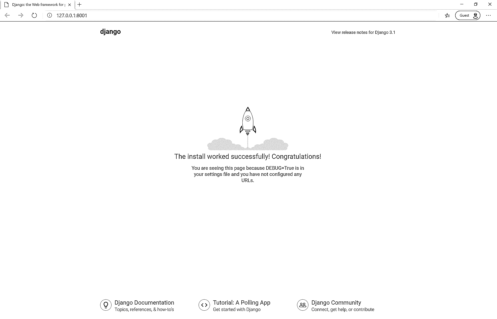
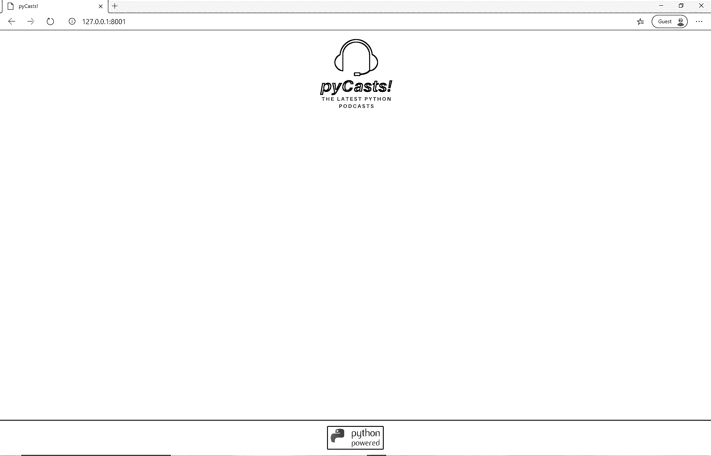
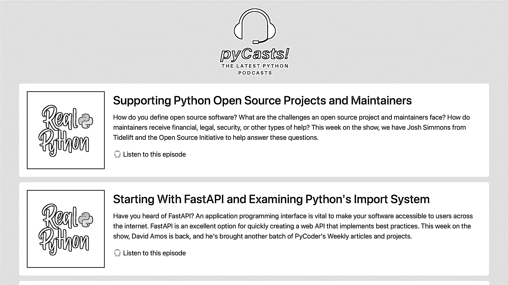
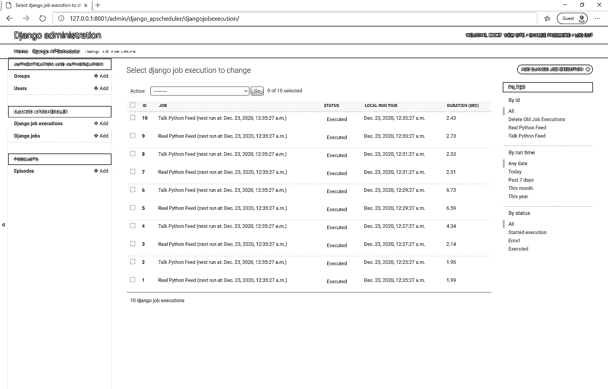

# 用 Python 构建内容聚合器

> 原文：<https://realpython.com/build-a-content-aggregator-python/>

在这个基于项目的教程中，您将使用 Python 和流行的框架 **Django** 从头开始构建一个**内容聚合器**。

每天都有如此多的内容出现在网上，去多个网站和来源获取关于你最喜欢的主题的信息是非常耗时的。这就是内容聚合器如此受欢迎和强大的原因，因为你可以使用它们在一个地方查看所有最新的新闻和内容。

无论你是在寻找一个**投资组合项目**还是寻找将未来项目扩展到简单的 [CRUD](https://en.wikipedia.org/wiki/Create,_read,_update_and_delete) 能力之外的方法，本教程都会有你想要的。

在本教程中，您将学习:

*   如何使用 **RSS 源**
*   如何创建 Django **自定义管理命令**
*   如何按照**计划**自动运行您的自定义命令
*   如何使用**单元测试**来测试你的 Django 应用的功能

单击下面的链接下载该项目的代码，并跟随您构建自己的内容聚合器:

**获取源代码:** [点击此处获取您将在本教程中使用](https://realpython.com/bonus/content-aggregator-project-code/)用 Django 和 Python 构建内容聚合器的源代码。

## 演示:您将构建什么

您将使用 Python 构建自己的播客内容聚合器，名为 **pyCasts！**从头到尾遵循本教程。

该应用程序将是一个单一的网页，显示从[真正的 Python 播客](https://realpython.com/podcasts/rpp/)和[跟我说 Python 播客](https://talkpython.fm/)的最新 Python 播客片段。完成本教程后，您可以通过向应用程序添加更多的播客来实践您所学到的内容。

这里有一个快速演示视频，展示了它的实际效果:

[https://player.vimeo.com/video/640030974](https://player.vimeo.com/video/640030974)

幕后有许多活动的部分，使这一工作以自动化的方式高效和有效地进行。在本教程中，您将了解所有这些内容。准备钻研吧。

[*Remove ads*](/account/join/)

## 项目概述

为了能够向最终用户显示内容，您需要遵循几个步骤:

1.  [设置项目](#step-1-setting-up-your-project)
2.  [建立播客模型](#step-2-building-your-podcast-model)
3.  [创建主页视图](#step-3-creating-your-homepage-view)
4.  [解析播客 RSS 提要](#step-4-parsing-podcast-rss-feeds)
5.  [创建 Django 自定义命令](#step-5-creating-a-django-custom-command)
6.  [添加额外的饲料](#step-6-adding-additional-feeds-to-your-python-content-aggregator)
7.  [用 django-APS scheduler 安排任务](#step-7-scheduling-tasks-with-django-apscheduler)

在本教程的课程中，您将逐步了解这些内容。现在，您将看到您将为上述步骤使用哪些技术和框架。

为了将播客 RSS 提要获取到您的应用程序中并解析它们，您将学习如何使用 [feedparser](https://feedparser.readthedocs.io/en/latest/) 库。您将使用这个库从提要中仅提取最新的剧集数据，您将[将这些数据](https://en.wikipedia.org/wiki/Marshalling_(computer_science))整理到一个`Episode`模型中，并用 Django ORM 保存到数据库中。

您可以将这段代码添加到脚本中，并定期手动运行它，但是这样会使使用聚合器来节省时间的目的落空。相反，您将学习如何使用一个名为[定制管理命令](https://docs.djangoproject.com/en/3.1/howto/custom-management-commands/)的内置 Django 工具。为了解析和保存数据，您将从 Django 内部运行代码。

在 [django-apscheduler](https://github.com/jcass77/django-apscheduler) 库的帮助下，你将**为你的函数调用设置一个调度**，这也被称为**作业**。然后，您可以使用 Django 管理面板来查看哪些作业在何时运行。这将确保自动获取和解析提要，而不需要管理员干预。

然后，您将使用 [Django 模板引擎](https://docs.djangoproject.com/en/3.1/topics/templates/#the-django-template-language)向用户显示查询的上下文——换句话说，最新的剧集。

## 先决条件

为了充分利用本教程，您应该熟悉以下概念和技术:

*   [Python 基础知识](https://realpython.com/learning-paths/python3-introduction/)
*   [虚拟环境](https://realpython.com/python-virtual-environments-a-primer/)设置和使用
*   HTML 和 CSS 的基本层次[和](https://realpython.com/html-css-python/)
*   Django 基础知识，比如它的[文件夹结构](https://realpython.com/python-application-layouts/#django)、 [URL 路由](https://docs.djangoproject.com/en/3.1/topics/http/urls/)、[迁移](https://realpython.com/django-migrations-a-primer/)，以及如何[创建项目和 app](https://realpython.com/django-setup/)

你可能还会发现有一些使用 [Bootstrap 4](https://getbootstrap.com/) 的经验会有所帮助。

如果在开始本教程之前，你还没有掌握所有的必备知识，那也没关系！事实上，你可以通过继续学习和开始学习来学到更多。如果遇到困难，你可以随时停下来复习上面链接的资源。

## 步骤 1:设置您的项目

到这一步结束时，您已经设置好了您的环境，安装了您的依赖项，并完成了 Django 的启动和运行。

首先创建项目目录，然后将目录切换到其中:

```py
$ mkdir pycasts
$ cd pycasts
```

现在您已经进入了项目目录，您应该创建您的虚拟环境并激活它。使用任何让你最开心的工具来做这件事。这个例子使用了`venv`:

```py
$ python3 -m venv .venv
$ source .venv/bin/activate
(.venv) $ python -m pip install --upgrade pip
```

现在您的环境已经激活并且`pip`已经升级，您需要安装所需的依赖项来完成项目。您可以在本教程的可下载源代码中找到一个`requirements.txt`文件:

**获取源代码:** [点击此处获取您将在本教程中使用](https://realpython.com/bonus/content-aggregator-project-code/)用 Django 和 Python 构建内容聚合器的源代码。

打开`source_code_setup/`文件夹并安装固定的依赖项。确保用下载文件的实际路径替换`<path_to_requirements.txt>`:

```py
(.venv) $ python -m pip install -r <path_to_requirements.txt>
```

现在您应该已经安装了 Django、 [feedparser](https://feedparser.readthedocs.io/en/latest/) 、 [django-apscheduler](https://github.com/jcass77/django-apscheduler) ，以及它们的子依赖项。

现在您已经拥有了启动和运行所需的所有工具，您可以设置 Django 并开始构建了。要完成这一步的构建，您需要做以下四件事:

1.  在当前工作目录下创建 Django 项目，`/pycasts`
2.  创建一个 Django 应用程序
3.  运行初始迁移
4.  创建超级用户

因为您已经熟悉了 Django，所以您不会详细探究这些步骤。您可以继续运行以下命令:

```py
(.venv) $ django-admin startproject content_aggregator .
(.venv) $ python manage.py startapp podcasts
(.venv) $ python manage.py makemigrations && python manage.py migrate
(.venv) $ python manage.py createsuperuser
```

如果您确实需要更深入地理解这些终端命令，您可以查看 Django 第 1 部分的[入门。](https://realpython.com/get-started-with-django-1/)

一旦你按照 Django 的提示完成创建你的超级用户帐号，在测试应用程序工作之前，你还有一个改动要做。尽管应用程序没有它也能运行，但不要忘记将新的`podcasts`应用程序添加到`settings.py`文件中:

```py
# content_aggregator/settings.py

# ...

INSTALLED_APPS = [
    "django.contrib.admin",
    "django.contrib.auth",
    "django.contrib.contenttypes",
    "django.contrib.sessions",
    "django.contrib.messages",
    "django.contrib.staticfiles",
 # My Apps "podcasts.apps.PodcastsConfig", ]
```

你在`INSTALLED_APPS`中将你的新应用列为`"podcasts.apps.PodcastsConfig"`。

**注意:**如果你对为什么使用冗长的`podcasts.apps.PodcastsConfig`而不是`podcasts`感到好奇，那么你可以在 Django 官方文档中阅读更多关于[配置应用程序](https://docs.djangoproject.com/en/3.1/ref/applications/#configuring-applications)的内容。

TLDR；版本是，虽然使用应用程序名称，`podcasts`，*对于这个小应用程序应该工作良好，但使用完整的 [AppConfig](https://docs.djangoproject.com/en/3.1/ref/applications/#django.apps.AppConfig) 名称被认为是最佳实践。

是时候带着你的 Django 新项目转一圈了。启动 Django 服务器:

```py
(.venv) $ python manage.py runserver
```

在浏览器中导航到`localhost:8000`，您应该会看到 Django 的默认成功页面:

[](https://files.realpython.com/media/pycasts-django-success.a10b31d17eee.png)

现在您已经设置了项目，并且让 Django 工作，继续下一步。

[*Remove ads*](/account/join/)

## 第二步:建立你的播客模型

此时，您应该已经设置好了您的环境，安装了您的依赖项，并且 Django 已经成功运行。到这一步结束时，您已经为播客剧集定义并测试了一个模型，并将该模型迁移到了数据库中。

你的`Episode`模型不应该仅仅反映你作为开发者想要获取的信息。它还应该反映用户希望看到的信息。跳入代码并立即开始编写模型很有诱惑力，但这可能是一个错误。如果你这样做，你可能很快就会忘记你的用户的观点。毕竟，应用程序是为用户服务的，甚至是像您或其他开发人员这样的用户。

在这一点上，拿出一支**笔和纸**可能是有用的，但是你应该做任何对你有用的事情。问问你自己，**“作为一个用户，我想做什么？”反复回答这个问题，直到你穷尽了所有的想法。然后你可以问问自己，作为一名开发人员**，你想要什么**。**

在编写数据库模型时，这可能是一个很好的策略，它可以让您不必在以后添加额外的字段和运行不必要的迁移。

**注意:**你可能有一个与下面不同的列表，这没关系。作为本教程的作者，我将分享我想到的东西，这也是你将在本项目的其余部分使用的东西。

但是如果您觉得缺少某个字段或属性，那么在本教程结束时，您可以随意扩展应用程序来添加它。毕竟这是你的项目。把它变成你自己的！

从用户和开发人员的角度列出项目的需求:

```py
As a user, I would like to:

  - Know the title of an episode
  - Read a description of the episode
  - Know when an episode was published
  - Have a clickable URL so I can listen to the episode
  - See an image of the podcast so I can scroll to look
    for my favorite podcasts
  - See the podcast name

As a developer, I would like to:

  - Have a uniquely identifiable attribute for each episode
    so I can avoid duplicating episodes in the database
```

你会在本教程的第 4 步中看到更多关于这最后一点的内容。

根据您列出的要求，您的`podcasts`应用程序中的`Episode`模型应该如下所示:

```py
# podcasts/models.py

from django.db import models

class Episode(models.Model):
    title = models.CharField(max_length=200)
    description = models.TextField()
    pub_date = models.DateTimeField()
    link = models.URLField()
    image = models.URLField()
    podcast_name = models.CharField(max_length=100)
    guid = models.CharField(max_length=50)

    def __str__(self) -> str:
        return f"{self.podcast_name}: {self.title}"
```

Django 最强大的部分之一是内置的管理区。将剧集存储在数据库中是一件事，但是您也希望能够在管理区与它们进行交互。您可以通过替换您的`podcasts/admin.py`文件中的代码来告诉 Django 管理员您想要显示您的剧集数据:

```py
# podcasts/admin.py

from django.contrib import admin

from .models import Episode

@admin.register(Episode)
class EpisodeAdmin(admin.ModelAdmin):
    list_display = ("podcast_name", "title", "pub_date")
```

在将模型迁移到数据库之前，您还需要做一件事情。在 Django 3.2 中，你现在可以定制自动创建的**主键**的类型。新的缺省值是`BigAutoField`，而不是 Django 以前版本中的缺省值`Integer`。如果您现在运行迁移，您会看到以下错误:

```py
(models.W042) Auto-created primary key used when not defining
a primary key type, by default 'django.db.models.AutoField'.
HINT: Configure the DEFAULT_AUTO_FIELD setting or the
PodcastsConfig.default_auto_field attribute to point to a subclass
of AutoField, e.g. 'django.db.models.BigAutoField'.
```

您可以通过在`app.py`文件中的`PodcastsConfig`类中添加额外的一行来确保您不会看到这个错误:

```py
# podcasts/app.py

from django.apps import AppConfig

class PodcastsConfig(AppConfig):
 default_auto_field = "django.db.models.AutoField"    name = "podcasts"
```

现在，您的应用程序已配置为自动向所有模型添加主键。你也有一张你的数据应该是什么样子的图片，并且你在一个模型中表现它。您现在可以运行 **Django 迁移**来将您的`Episode`表包含在数据库中:

```py
(.venv) $ python manage.py makemigrations
(.venv) $ python manage.py migrate
```

既然您已经迁移了更改，那么是时候测试它了！

本教程已经涵盖了很多内容，所以为了简单起见，您将使用 Django 的内置测试框架进行**单元测试**。完成本教程中的项目后，如果你愿意，可以随意用 [pytest](https://realpython.com/pytest-python-testing/) 或其他测试框架重写单元测试。

在您的`podcasts/tests.py`文件中，您可以添加:

```py
# podcasts/tests.py

from django.test import TestCase
from django.utils import timezone
from .models import Episode

class PodCastsTests(TestCase):
    def setUp(self):
        self.episode = Episode.objects.create(
            title="My Awesome Podcast Episode",
            description="Look mom, I made it!",
            pub_date=timezone.now(),
            link="https://myawesomeshow.com",
            image="https://image.myawesomeshow.com",
            podcast_name="My Python Podcast",
            guid="de194720-7b4c-49e2-a05f-432436d3fetr",
        )

    def test_episode_content(self):
        self.assertEqual(self.episode.description, "Look mom, I made it!")
        self.assertEqual(self.episode.link, "https://myawesomeshow.com")
        self.assertEqual(
            self.episode.guid, "de194720-7b4c-49e2-a05f-432436d3fetr"
        )

    def test_episode_str_representation(self):
        self.assertEqual(
            str(self.episode), "My Python Podcast: My Awesome Podcast Episode"
        )
```

在上面的代码中，您使用`.setUp()`来定义一个示例`Episode`对象。

现在，您可以测试一些`Episode`属性，以确认模型如预期的那样工作。从您的模型中测试字符串表示总是一个好主意，这是您在`Episode.__str__()`中定义的。字符串表示是您在调试代码时将看到的内容，如果它准确地显示了您期望看到的信息，将使调试变得更容易。

现在您可以运行您的测试了:

```py
(.venv) $ python manage.py test
```

如果您的测试成功运行，那么恭喜您！现在，您已经有了内容聚合器的良好基础，并且有了定义良好的数据模型。第三步的时间到了。

[*Remove ads*](/account/join/)

## 第三步:创建你的主页视图

到目前为止，您应该已经有了一个带有您的`Episode`模型的工作 Django 应用程序，并且通过了单元测试。在这一步中，您将为**主页**构建 HTML 模板，添加所需的 **CSS 和资产**，将主页添加到您的 **`views.py`文件**，并测试主页**是否正确呈现**。

**注意:**编写 HTML 和 CSS 超出了本教程的范围，所以你不会涉及这些的原因和方法。然而，如果你对 HTML 或 CSS 有任何不理解或有疑问，你可以在评论中寻求来自*真实 Python* 社区的见解。

在你之前下载的`source_code_setup/`文件夹中，你会发现一个名为`static`的文件夹和一个名为`templates`的文件夹。您应该将这些文件夹复制到您的项目根文件夹中，`pycasts/`。确保将`<source_code_setup_path>`替换为您保存在本地机器上的实际路径，并且不要忘记将点(`.`)复制到当前工作目录中:

```py
(.venv) $ cp -r <source_code_setup_path>/static .
(.venv) $ cp -r <source_code_setup_path>/templates .
```

既然在项目根中已经有了 HTML 模板和静态文件的文件夹，那么是时候把所有东西都连接起来了，以便 Django 知道它们的存在。

前往主`content_aggregator`应用程序中的`settings.py`文件。向下滚动直到到达`TEMPLATES`部分，并将之前创建的`templates/`目录添加到`DIRS`列表中。本教程使用 Django 3，它使用`pathlib`作为文件路径:

```py
# content_aggregator/settings.py

#  ...

TEMPLATES = [
    {
        "BACKEND": "django.template.backends.django.DjangoTemplates",
        "DIRS": [
 BASE_DIR / "templates",        ],
        "APP_DIRS": True,
        "OPTIONS": {
            "context_processors": [
                "django.template.context_processors.debug",
                "django.template.context_processors.request",
                "django.contrib.auth.context_processors.auth",
                "django.contrib.messages.context_processors.messages",
            ],
        },
    },
]
```

您还需要将`static/`文件夹添加到您的设置中。你可以通过向下滚动到你的`settings.py`文件的`STATIC`部分，并包含到你新创建的`static/`文件夹的路径:

```py
# content_aggregator/settings.py

#  ...

STATIC_URL = "/static/"
STATICFILES_DIRS = [
 BASE_DIR / "static", ]
```

Django 现在知道您的静态资产和模板存在，但是您还没有完成。为了把你目前已经完成的事情联系起来，你还有几项任务要完成:

*   创建主页**查看`views.py`中的**
*   创建 URL **路径**
*   添加更多的**单元测试**

创建 URL 路径和主页视图的顺序并不重要。这两项都需要完成，应用程序才能正常工作，但是您可以从列表的顶部开始，首先创建您的视图类。

在您的`podcasts`应用程序中，打开您的`views.py`文件，并用以下代码替换内容:

```py
 1# podcasts/views.py
 2
 3from django.views.generic import ListView
 4
 5from .models import Episode
 6
 7class HomePageView(ListView):
 8    template_name = "homepage.html"
 9    model = Episode
10
11    def get_context_data(self, **kwargs):
12        context = super().get_context_data(**kwargs)
13        context["episodes"] = Episode.objects.filter().order_by("-pub_date")[:10]
14        return context
```

你可能对 Django 中基于函数的视图很熟悉，但是 Django 也有内置的[基于类的视图](https://docs.djangoproject.com/en/3.2/topics/class-based-views/)。这非常方便，可以减少您需要编写的代码量。

在上面的代码片段中，您利用基于类的视图将播客剧集发送到主页:

1.  **第 7 行:**你继承了`ListView`类，这样你就可以迭代剧集。默认情况下，它将遍历第 9 行`model = Episode`定义的所有剧集。
2.  **第 11 行到第 14 行:**您覆盖了`context`的数据，并根据由发布日期`pub_date`确定的最近十集进行过滤。你想在这里过滤，因为，否则，可能有数百-如果不是数千-集传递到主页。

现在是时候给你的主页一个网址了。您首先需要在您的`podcasts`应用程序中创建一个`urls.py`文件:

```py
(.venv) $ touch podcasts/urls.py
```

现在您可以为`HomePageView`类添加一个路径:

```py
# podcasts/urls.py

from django.urls import path

from .views import HomePageView

urlpatterns = [
    path("", HomePageView.as_view(), name="homepage"),
]
```

在当前状态下，应用程序仍然不会显示你的主页，因为主`content_aggregator`应用程序不知道`podcasts/urls.py`中的 URL 路径。两行代码应该可以解决这个问题。在您的`content_aggregator/urls.py`文件中，添加突出显示的代码，将两者连接在一起:

```py
# podcasts/urls.py

from django.contrib import admin
from django.urls import path, include 
urlpatterns = [
    path("admin/", admin.site.urls),
 path("", include("podcasts.urls")), ]
```

走了这么远，干得好！你现在应该能够启动你的应用程序，并看到主页。就像之前一样，用`python manage.py runserver`启动你的应用，然后前往`localhost:8000`:

[](https://files.realpython.com/media/pycasts-homepage-no-content.ba825c980944.png)

可以看到首页作品，但是没有内容。即使没有它，您仍然可以通过使用单元测试来测试内容是否会正确显示。

在[步骤 2](#step-2-building-your-podcast-model) 中，您为模型创建了一个单元测试。您还创建了`.setUp()`，它创建了一个用于测试的`Episode`对象。您可以使用相同的测试集数据来测试您的主页模板是否按预期工作。

除了测试主页是否正确呈现剧集之外，测试是否使用了正确的模板以及导航到其 URL 是否返回了有效的 HTTP 状态代码也是一个很好的做法。

对于像这样的单页面应用程序，这可能看起来有点过分——事实也可能如此。但是，随着任何应用程序的增长，您都希望确保未来的变化不会破坏您的工作代码。此外，如果你把这个项目作为一个作品集，那么你应该表明你知道最佳实践。

下面突出显示的代码是添加到您的`podcasts/tests.py`文件中的新测试代码:

```py
# podcasts/tests.py

from django.test import TestCase
from django.utils import timezone
from django.urls.base import reverse 
from datetime import datetime

from .models import Episode

class PodCastsTests(TestCase):
    def setUp(self):
        self.episode = Episode.objects.create(
            title="My Awesome Podcast Episode",
            description="Look mom, I made it!",
            pub_date=timezone.now(),
            link="https://myawesomeshow.com",
            image="https://image.myawesomeshow.com",
            podcast_name="My Python Podcast",
            guid="de194720-7b4c-49e2-a05f-432436d3fetr",
        )

    def test_episode_content(self):
        self.assertEqual(self.episode.description, "Look mom, I made it!")
        self.assertEqual(self.episode.link, "https://myawesomeshow.com")
        self.assertEqual(
            self.episode.guid, "de194720-7b4c-49e2-a05f-432436d3fetr"
        )

    def test_episode_str_representation(self):
        self.assertEqual(
            str(self.episode), "My Python Podcast: My Awesome Podcast Episode"
        )
  def test_home_page_status_code(self): response = self.client.get("/") self.assertEqual(response.status_code, 200)   def test_home_page_uses_correct_template(self): response = self.client.get(reverse("homepage")) self.assertTemplateUsed(response, "homepage.html")   def test_homepage_list_contents(self): response = self.client.get(reverse("homepage")) self.assertContains(response, "My Awesome Podcast Episode")
```

和以前一样，您可以使用`python manage.py test`运行您的单元测试。如果您的所有测试都通过了，那么恭喜您！

在这一步中，您成功地创建了 HTML 模板和资产，构建了视图类，并连接了所有的 URL 路由。你也写了更多的通过单元测试。现在你已经准备好进入下一步了。

[*Remove ads*](/account/join/)

## 步骤 4:解析播客 RSS 提要

此时，您的应用程序应该看起来相当不错！您已经具备了开始添加内容所需的一切。到这一步结束时，您应该对使用 feedparser 库解析 RSS 提要并提取您需要的数据感到满意了。

在开始解析之前，什么是 RSS 提要？你为什么用它来获取播客数据？

首先，所有播客都有一个 **RSS 提要**。这是播客应用程序获取并向您显示播客数据和剧集的基本方式。您经常可以在 podcast 网站上找到提要 URL 链接。

此外，播客 RSS 源需要看起来都一样。这意味着，当一个播客创作者将他们的提要提交给一个平台，如苹果播客或 T2 谷歌播客时，提要必须符合 T4 RSS 2.0 规范。

这一要求对您有两方面的好处:

1.  所有的提要都有相同的属性，所以你可以**重用代码**为任何给定的播客提取相同的数据，这使得你的代码更容易维护并且更加[简洁](https://en.wikipedia.org/wiki/Don't_repeat_yourself)。
2.  每一集都必须分配一个`guid`，这使得提要**中的每一集都是唯一的**。

您要解析的第一个提要是真正的 Python 播客提要。在您的浏览器中导航到 https://realpython.com/podcasts/rpp/feed 的[查看提要的外观。如果你觉得难以阅读，你可以安装几个浏览器插件来美化它。Chrome 插件的一个例子是](https://realpython.com/podcasts/rpp/feed) [XML Tree](https://chrome.google.com/webstore/detail/xml-tree/gbammbheopgpmaagmckhpjbfgdfkpadb) ，但是还有很多其他的插件。

要用 feedparser 解析一个提要，可以使用`parse()`:

>>>

```py
>>> import feedparser
>>> feed = feedparser.parse("https://realpython.com/podcasts/rpp/feed")
```

获取提要并将其自动解析成可用的 Python 对象。然后，您可以使用标准点标记来访问提要标签，如 podcast 标题:

>>>

```py
>>> podcast_title = feed.channel.title
>>> podcast_title
'The Real Python Podcast'
```

您还可以使用括号符号来访问标记中的属性:

>>>

```py
>>> podcast_image = feed.channel.image["href"]
>>> podcast_image
'https://files.realpython.com/media/real-python-logo-square.28474fda9228.png'
```

在使用 feedparser 解析的提要中，您还可以访问一个名为`.entries`的特殊属性。这允许遍历提要中的每个`<item>`元素。在你用播客剧集填充了你的数据库之后，你将能够使用`.entries`来检查提要上每个播客剧集的`guid`，并查看它是否存在于你的数据库中。

**注意:**暂时不要实现下面的代码片段。读一遍就好了。下一步，当您[创建一个 Django 定制命令](#step-5-creating-a-django-custom-command)并将其用于您的项目时，您将编写类似的代码。现在，只需浏览一下这段代码，就可以了解如何使用 feedparser。

值得注意的是，您需要将来自 RSS 提要的发布日期转换成一个`datetime`对象，以便将其保存到数据库中。您将使用`dateutil`库来完成这项工作:

```py
# Example

import feedparser
from dateutil import parser
from podcasts.models import Episode

feed = feedparser.parse("https://realpython.com/podcasts/rpp/feed")
podcast_title = feed.channel.title
podcast_image = feed.channel.image["href"]

for item in feed.entries:
    if not Episode.objects.filter(guid=item.guid).exists():
        episode = Episode(
            title=item.title,
            description=item.description,
            pub_date=parser.parse(item.published),
            link=item.link,
            image=podcast_image,
            podcast_name=podcast_title,
            guid=item.guid,
        )
        episode.save()
```

您还没有将这段代码放到文件中的原因是，您没有一个好的方法在 Django 中运行它。既然您已经掌握了如何使用 feedparser，那么您将探索如何使用自定义命令来运行您的解析函数。

## 步骤 5:创建 Django 定制命令

在最后一步中，您学习了如何使用 feedparser，但是没有合理的方法来运行与 Django ORM 交互的代码。在这一步中，您将介绍如何使用一个定制命令在您的项目中执行脚本，以便您可以在 Django 服务器或生产服务器运行时与之交互。

定制命令利用`manage.py`文件来运行您的代码。当您运行`manage.py`时，Django 会将`management/commands/`目录中的任何模块注册为可用的命令。

**注意:**如果你想深入研究，请前往 Django 官方文档，获取更多关于[定制管理命令](https://docs.djangoproject.com/en/3.1/howto/custom-management-commands/)的信息。

首先创建适当的目录和文件来存储您的命令:

```py
(.venv) $ mkdir -p podcasts/management/commands
(.venv) $ touch podcasts/management/commands/startjobs.py
```

您几乎可以将这个文件命名为您喜欢的任何名称，但是请注意，如果它以下划线开头，`manage.py`将不会注册它。稍后在[步骤 7](#step-7-scheduling-tasks-with-django-apscheduler) 中，您将使用 django-apscheduler 向该文件添加**作业**，这就是您将该文件命名为`startjobs.py`的原因。

为了测试您的设置，您将创建一个将`"It works!"`打印到您的终端的基本命令。

每个命令都应该有一个`Command`类。那个类需要一个`.handle()`方法，你可以把它想象成你的类的主方法。`.handle()`方法保存您想要执行的代码:

```py
# podcasts/management/commands/startjobs.py

from django.core.management.base import BaseCommand

class Command(BaseCommand):
    def handle(self, *args, **options):
        print("It works!")
```

现在从您的终端运行您的新命令:

```py
(.venv) $ python manage.py startjobs
```

如果你看到了`It works!`打印到终端上，恭喜你！您创建了第一个自定义命令。

现在是时候加入上一步中的 RSS 解析代码了，看看是否可以向数据库中添加一些项目。继续更新您的`startjobs.py`代码:

```py
# podcasts/management/commands/startjobs.py

from django.core.management.base import BaseCommand

import feedparser from dateutil import parser   from podcasts.models import Episode 
class Command(BaseCommand):
    def handle(self, *args, **options):
 feed = feedparser.parse("https://realpython.com/podcasts/rpp/feed") podcast_title = feed.channel.title podcast_image = feed.channel.image["href"]   for item in feed.entries: if not Episode.objects.filter(guid=item.guid).exists(): episode = Episode( title=item.title, description=item.description, pub_date=parser.parse(item.published), link=item.link, image=podcast_image, podcast_name=podcast_title, guid=item.guid, ) episode.save()
```

这一次，当您运行自定义命令时，没有任何内容打印到屏幕上，但是您现在应该可以在主页上显示来自真实 Python 播客的播客片段。去试试吧。

你得到了什么？如果您还没有浏览过，现在请访问您的主页:

[](https://files.realpython.com/media/Screenshot_2021-08-19_at_10.28.37.30e5e9c6f760.png)

你有没有看到类似这张图片的东西？如果是的话，恭喜你。成功了。

既然您已经探索了如何使用定制命令，并且已经设置了第一个提要并使其工作，那么您将在下一步中学习如何添加额外的提要。

[*Remove ads*](/account/join/)

## 步骤 6:向 Python 内容聚合器添加额外的提要

至此，您应该有了一个可以解析真正的 Python 播客提要的定制命令。在这一步结束时，您将学会如何向自定义命令添加更多的提要。

现在您已经用自定义命令成功解析了一个 podcast 提要，您可能想为每个提要一遍又一遍地重复相同的代码。然而，这不是好的编码实践。你想要易于维护的干代码。

您可能认为可以遍历一个提要 URL 列表，并对每个条目使用解析代码，通常这是可行的。然而，由于 django-apscheduler 的工作方式，这并不是一个可行的解决方案。在下一步的[中会有更多的介绍。](#step-7-scheduling-tasks-with-django-apscheduler)

相反，您需要重构您的代码，为您需要解析的每个提要提供一个解析函数和一个单独的函数。现在，您将分别调用这些方法。

**注意:**正如本教程开始时提到的，目前您只关注两个提要。一旦你完成了教程，并且知道了如何添加更多，你就可以通过选择更多的 RSS 源来自己动手练习了。

与此同时，[与我谈论 Python](https://talkpython.fm/home)播客中的 [Michael Kennedy](https://twitter.com/mkennedy) 已经好心地允许在本教程中使用他的播客提要。谢谢你，迈克尔！

现在，您将开始探索这在您的代码中会是什么样子:

```py
 1# podcasts/management/commands/startjobs.py
 2
 3from django.core.management.base import BaseCommand
 4
 5import feedparser
 6from dateutil import parser
 7
 8from podcasts.models import Episode
 9
10def save_new_episodes(feed):
11    """Saves new episodes to the database.
12
13 Checks the episode GUID against the episodes currently stored in the
14 database. If not found, then a new `Episode` is added to the database.
15
16 Args:
17 feed: requires a feedparser object
18 """
19    podcast_title = feed.channel.title
20    podcast_image = feed.channel.image["href"]
21
22    for item in feed.entries:
23        if not Episode.objects.filter(guid=item.guid).exists():
24            episode = Episode(
25                title=item.title,
26                description=item.description,
27                pub_date=parser.parse(item.published),
28                link=item.link,
29                image=podcast_image,
30                podcast_name=podcast_title,
31                guid=item.guid,
32            )
33            episode.save()
34
35def fetch_realpython_episodes():
36    """Fetches new episodes from RSS for The Real Python Podcast."""
37    _feed = feedparser.parse("https://realpython.com/podcasts/rpp/feed")
38    save_new_episodes(_feed)
39
40def fetch_talkpython_episodes():
41    """Fetches new episodes from RSS for the Talk Python to Me Podcast."""
42    _feed = feedparser.parse("https://talkpython.fm/episodes/rss")
43    save_new_episodes(_feed)
44
45class Command(BaseCommand):
46    def handle(self, *args, **options):
47        fetch_realpython_episodes()
48        fetch_talkpython_episodes()
```

如前所述，您将解析代码从单独的提要中分离出来，使其可重用。对于您添加的每个额外的提要，您需要添加一个新的顶级函数。在这个例子中，您已经通过分别使用`fetch_realpython_episodes()`和`fetch_talkpython_episodes()`在真正的 Python 播客和 Talk Python to Me 播客中做到了这一点。

现在，您已经知道了如何向应用程序添加额外的提要，您可以继续下一步，看看如何自动运行定制命令并定义运行它的时间表。

## 第七步:用`django-apscheduler` 安排任务

此时，您应该有两个或更多的 RSS 提要，并准备好在每次运行新的定制命令时进行解析。

在最后一步中，您将:

*   设置[django-APS scheduler](https://github.com/jcass77/django-apscheduler)
*   为自定义命令添加一个**时间表**
*   将**任务日志**添加到您的应用程序中
*   有机会在 Django 管理中**查看您的预定工作**

django-apscheduler 包是 apscheduler 库的 django 实现。

**注意:**有关 APS scheduler 和所有可用设置的详细信息，请查看[官方 APS scheduler 文档](https://apscheduler.readthedocs.io/en/stable/)。你也可以在该项目的 [GitHub repo](https://github.com/jarekwg/django-apscheduler) 上了解更多关于 django-apscheduler 的信息。

您的虚拟环境中已经安装了 django-apscheduler。要将它安装到您的应用程序中，您还需要将它添加到您的`settings.py`文件中的`INSTALLED_APPS`:

```py
# content_aggregator/settings.py

# ...

INSTALLED_APPS = [
    "django.contrib.admin",
    "django.contrib.auth",
    "django.contrib.contenttypes",
    "django.contrib.sessions",
    "django.contrib.messages",
    "django.contrib.staticfiles",
    # My Apps
    "podcasts.apps.PodcastsConfig",
 # Third Party Apps "django_apscheduler", ]
```

要创建 django-apscheduler 模型，您需要运行数据库迁移命令:

```py
(.venv) $ python manage.py migrate
```

这个命令应用 django-apscheduler 正常工作所必需的数据库迁移。

**注意:**不需要先运行`makemigrations`，因为 django-apscheduler 包包含了自己的迁移文件。

现在 django-apscheduler 已经安装到您的应用程序中，您将简要地探索它是如何工作的。更详细的解释请见[正式文件](https://github.com/jarekwg/django-apscheduler)。

您想要在自定义命令中运行的每个任务被称为一个**任务**。您的应用程序中总共有三个作业:一个用于您希望解析的每个 podcast 提要，第三个用于从数据库中删除旧作业。

django-apscheduler 包将您的作业存储在数据库中，它还将存储所有成功和不成功的作业运行。作为开发人员或站点管理员，拥有这一历史记录对您来说非常有用，因为您可以监控是否有任何任务失败。但是如果这些没有定期从数据库中清除，您的数据库将很快填满，所以从数据库中清除旧的历史记录是一个好习惯。这也将按计划完成。

尽管作业历史将存储在数据库中，但是如果出现任何错误，最好将其记录下来以便调试。通过将以下代码添加到`settings.py`中，您可以将一些基本的日志设置添加到您的应用程序中:

```py
# content_aggregator/settings.py

# ...

LOGGING = {
    "version": 1,
    "disable_existing_loggers": False,
    "handlers": {
        "console": {
            "class": "logging.StreamHandler",
        },
    },
    "root": {
        "handlers": ["console"],
        "level": "INFO",
    },
}
```

现在您已经添加了日志记录的设置，您需要在`startjobs.py`文件中实例化它。现在您将在`startjobs.py`中包含一些导入，稍后您将详细介绍这些导入。添加日志记录和调度程序需要的一些其他导入语句:

```py
 1# podcasts/management/commands/startjobs.py
 2
 3# Standard Library
 4import logging
 5
 6# Django
 7from django.conf import settings
 8from django.core.management.base import BaseCommand
 9
10# Third Party
11import feedparser
12from dateutil import parser
13from apscheduler.schedulers.blocking import BlockingScheduler
14from apscheduler.triggers.cron import CronTrigger
15from django_apscheduler.jobstores import DjangoJobStore
16from django_apscheduler.models import DjangoJobExecution
17
18# Models
19from podcasts.models import Episode
20
21logger = logging.getLogger(__name__)
```

一次添加大量的 import 语句可能会太多，所以让我们挑选出需要一些解释的类:

*   **第 13 行:** `BlockingScheduler`是运行您的作业的调度程序。它是[阻塞](https://en.wikipedia.org/wiki/Blocking_(computing))，所以它将是进程中唯一运行的东西。
*   **第 14 行:** `CronTrigger`是您将用于计划的触发器类型。
*   **第 15 行:** `DjangoJobStore`将决定*如何存储*作业。在这种情况下，您希望它们在数据库中。
*   **第 16 行:**你将使用`DjangoJobExecution`运行刚才提到的清理功能。

接下来，您需要使用所有的导入语句并设置**调度器**、**触发器**和**作业存储**。

你已经写好了三个工作职能中的两个，现在是时候添加第三个了。在你的`Command`类之上，添加你的工作职能:

```py
# podcasts/management/commands/startjobs.py

# ...

def delete_old_job_executions(max_age=604_800):
    """Deletes all apscheduler job execution logs older than `max_age`."""
    DjangoJobExecution.objects.delete_old_job_executions(max_age)
```

`max_age`参数是以整数表示的秒数。注意 604800 秒等于 1 周。

下一步是在自定义命令的`.handle()`函数中创建作业存储和调度程序实例。你也可以在你的第一份工作中加入:

```py
 1# podcasts/management/commands/startjobs.py
 2
 3# ...
 4
 5def handle(self, *args, **options):
 6    scheduler = BlockingScheduler(timezone=settings.TIME_ZONE) 7    scheduler.add_jobstore(DjangoJobStore(), "default") 8 9    scheduler.add_job( 10        fetch_realpython_episodes, 11        trigger="interval", 12        minutes=2, 13        id="The Real Python Podcast", 14        max_instances=1, 15        replace_existing=True, 16    ) 17    logger.info("Added job: The Real Python Podcast.")
```

您将在上面看到，您已经成功地创建了您的`scheduler`实例并添加了作业存储。然后你创建了你的第一份工作——真正的 Python 播客。

`.add_job()`方法需要几个参数来成功创建一个作业:

*   **第 10 行:**第一个参数需要一个函数，所以您将之前创建的`fetch_realpython_episodes`函数对象传递给它。注意它在被传递时没有调用括号。
*   **第 11 行和第 12 行:**你必须设置一个触发器。对于本教程，您将设置执行间隔为两分钟。这只是为了让您可以测试并看到它为自己工作。然而，它应该*绝对*不会在生产环境中如此频繁地使用。您还可以将`seconds`和`hours`作为参数传递，这样，如果您在实际环境中托管这个应用程序，就可以设置一个更现实的更新间隔。
*   **第 13 行:**所有的工作*必须*有一个 ID。Django 管理员也将使用 ID，所以选择一个可读且有意义的名称。
*   **第 15 行:**`replace_existing`关键字参数替换现有的作业，并在重启应用程序时防止重复。

你可以查看[官方的 APScheduler 文档](https://apscheduler.readthedocs.io/en/stable/),获得`.add_job()`接受的所有参数的完整列表。

既然您已经安排了第一个作业，那么您可以继续将最后两个作业添加到`.handle()`中，并添加对`scheduler.start()`和`scheduler.shutdown()`的调用。哦，让我们也加入一些伐木。

您的自定义命令类现在应该如下所示:

```py
# podcasts/management/commands/startjobs.py

# ...

class Command(BaseCommand):
 help = "Runs apscheduler." 
    def handle(self, *args, **options):
        scheduler = BlockingScheduler(timezone=settings.TIME_ZONE)
        scheduler.add_jobstore(DjangoJobStore(), "default")

        scheduler.add_job(
            fetch_realpython_episodes,
            trigger="interval",
            minutes=2,
            id="The Real Python Podcast",
            max_instances=1,
            replace_existing=True,
        )
        logger.info("Added job: The Real Python Podcast.")

        scheduler.add_job(
            fetch_talkpython_episodes,
            trigger="interval",
 minutes=2, id="Talk Python Feed", max_instances=1, replace_existing=True, ) logger.info("Added job: Talk Python Feed.")   scheduler.add_job( delete_old_job_executions, trigger=CronTrigger( day_of_week="mon", hour="00", minute="00" ),  # Midnight on Monday, before start of the next work week. id="Delete Old Job Executions", max_instances=1, replace_existing=True, ) logger.info("Added weekly job: Delete Old Job Executions.")   try: logger.info("Starting scheduler...") scheduler.start() except KeyboardInterrupt: logger.info("Stopping scheduler...") scheduler.shutdown() logger.info("Scheduler shut down successfully!")
```

您可能还记得，这个调度程序使用`BlockingScheduler`在自己的进程中运行。在一个终端中，您可以像以前一样使用`python manage.py startjobs`运行自定义命令。在一个单独的终端进程中，启动 Django 服务器。当您查看您的管理控制面板时，您现在可以看到您的作业已经注册，并且您可以查看历史记录:

[](https://files.realpython.com/media/pycasts-admin-job-execution.958c7391d4a0.png)

在这最后一步中发生了很多事情，但是你已经用一个功能正常的应用程序完成了！您已经成功地导航了如何使用 django-apscheduler 按照定义的时间表自动运行您的定制命令。不小的成就。干得好！

从头开始构建一个像内容聚合器这样的项目从来都不是一个快速或简单的任务，你应该为自己能够坚持到底而感到自豪。做一些新的事情，推动你一点点，只会帮助你成长为一名开发人员，不管你有多高级。

[*Remove ads*](/account/join/)

## 结论

在这个基于项目的教程中，您已经介绍了很多内容。干得好！

**在本教程中，您已经学习了:**

*   如何使用 feed parser**处理 RSS 提要**
*   如何创建和使用**自定义管理命令**
*   如何使用 django-apscheduler 在个性化的**时间表**上**自动化**你的定制命令
*   如何将基本的**单元测试**添加到 Django 应用程序中

如果您还没有这样做，请单击下面的链接下载本教程的代码，这样您就可以使用 Python 构建自己的内容聚合器:

**获取源代码:** [点击此处获取您将在本教程中使用](https://realpython.com/bonus/content-aggregator-project-code/)用 Django 和 Python 构建内容聚合器的源代码。

## 接下来的步骤

作为一名开发人员，有许多方法可以定制和修改这个应用程序，尤其是当您计划将它作为一个作品集时。让这个项目更上一层楼，将有助于你在未来的求职申请中脱颖而出。

以下是一些让你的项目更上一层楼的想法:

*   **添加更多饲料！**对数据科学感兴趣？查看[数据科学播客的终极列表](https://realpython.com/data-science-podcasts/)。
*   **改变内容的类型。如果播客不是你的菜，也许足球新闻是？或者你可能喜欢听财经播客？无论你的兴趣是什么，用这个项目作为垫脚石，为你的*激情之一创建一个聚合器。***
*   **添加用户账户**以便用户可以订阅他们感兴趣的提要。然后在一天结束时，给他们发一封电子邮件，告诉他们订阅的新内容。查看关于 [Django 视图授权](https://realpython.com/django-view-authorization/)的教程以获得帮助。
*   给`Episode`模型添加一个`is_published`布尔标志，这样管理员可以手动**策划和确认主页上显示的剧集**。
*   给`Episode`模型添加一个`featured`字段，这样你就可以**在主页上高亮显示**选中的播客。
*   **重新设计应用程序**让它成为你自己的应用程序。定制 CSS 或者撕掉 Bootstrap 4 以利于[顺风 CSS](https://tailwindcss.com) 。世界是你的。
*   **将应用**部署到生产环境中——例如，通过[在 Heroku](https://realpython.com/django-hosting-on-heroku/) 上托管你的 Django 应用。
*   定制 Django 管理和**增强你的 Django 管理体验**。

无论你是使用以上其中一种思路，还是用自己的方式定制 app，请分享！在下面发表评论，告诉其他读者你是如何把它变成你自己的。如果你把它推向生产，删除一个链接！*******