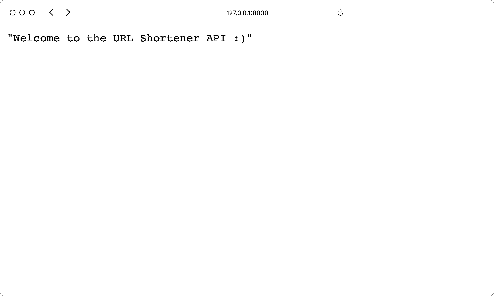
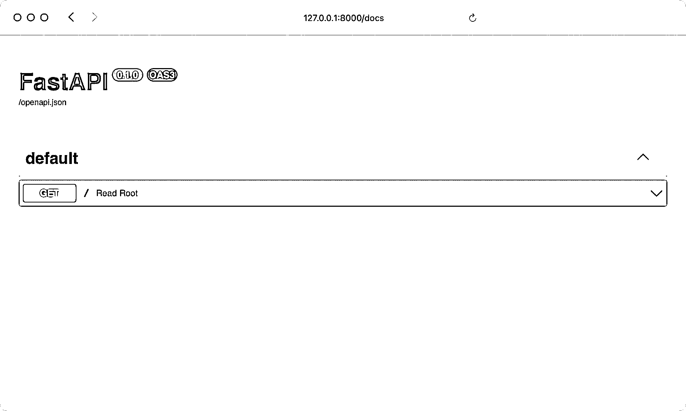
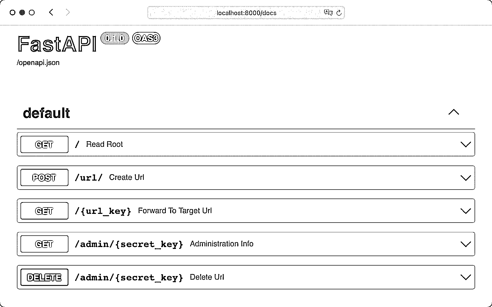

# 用 FastAPI 和 Python 构建一个 URL 缩短器

> 原文：<https://realpython.com/build-a-python-url-shortener-with-fastapi/>

*立即观看**本教程有真实 Python 团队创建的相关视频课程。和文字教程一起看，加深理解: [**用 FastAPI 和 Python 构建网址缩短器**](/courses/url-shortener-fastapi/)

在本教程中，您将使用 Python 和 FastAPI 构建一个 URL 缩短器。URL 可能会非常长，而且对用户不友好。这就是网址缩写可以派上用场的地方。URL 缩写减少了 URL 中的字符数，使其更容易阅读、记忆和共享。

通过这个循序渐进的项目，您将使用 Python 和 **FastAPI** 构建一个 URL 缩短器。在本教程结束时，你将拥有一个全功能的 **API 驱动的 web 应用**，它可以创建缩短的 URL 并转发给目标 URL。

**在本教程中，您将学习如何:**

*   用 FastAPI 创建一个 **REST API**
*   使用**uvicon**运行开发 web 服务器
*   建模一个 **SQLite** 数据库
*   调查自动生成的 **API 文档**
*   通过 **CRUD 动作**与数据库交互
*   通过重构代码来优化你的应用

这个 URL shortener 项目是为中级 Python 程序员设计的，他们想尝试一下 [FastAPI](https://fastapi.tiangolo.com) 并学习 API 设计、CRUD 和与数据库的交互。如果您熟悉处理 [HTTP 请求](https://realpython.com/urllib-request/)的基础知识，将会有所帮助。如果你需要重温 FastAPI，[使用 FastAPI 构建 Python Web API](https://realpython.com/fastapi-python-web-apis/)是一个很好的介绍。

**获取源代码:** [点击此处获取源代码](https://realpython.com/bonus/build-a-python-url-shortener-with-fastapi-project-code/)，您将使用 FastAPI 构建您的 Python URL shortener。

## 演示:你的 Python 网址缩写器

在这个循序渐进的项目中，您将构建一个 API 来创建和管理缩短的 URL。这个 API 的主要目的是接收一个完整的目标 URL 并返回一个缩短的 URL。为了测试您的 API 端点，您将利用 FastAPI 自动创建的文档:

[https://player.vimeo.com/video/709517464?background=1](https://player.vimeo.com/video/709517464?background=1)

当你向 URL shortener 应用程序发布一个目标 URL 时，你会得到一个缩短的 URL 和一个密钥。缩短的 URL 包含转发到目标 URL 的随机密钥。您可以使用密钥来查看缩短的 URL 的统计数据或删除转发。

[*Remove ads*](/account/join/)

## 项目概述

您的 URL shortener Python 项目将提供能够接收不同的 **HTTP 请求类型**的 **API 端点**。每个端点将执行您指定的操作。以下是您的 URL shortener 的 API 端点的摘要:

| 端点 | HTTP 动词 | 请求正文 | 行动 |
| --- | --- | --- | --- |
| `/` | `GET` |  | 返回一个`Hello, World!`字符串 |
| `/url` | `POST` | 您的目标 URL | 显示创建的`url_key`和附加信息，包括一个`secret_key` |
| `/{url_key}` | `GET` |  | 转发到您的目标 URL |
| `/admin/{secret_key}` | `GET` |  | 显示您的简短网址的管理信息 |
| `/admin/{secret_key}` | `DELETE` | 你的秘密钥匙 | 删除您缩短的 URL |

您将在本教程中编写的代码侧重于首先让应用程序工作。然而，拥有一个工作的应用程序并不总是意味着它背后的代码是完美的。这就是为什么你会在本教程中找到一个步骤来重构你的应用程序的一部分。

**注意:**本教程的主要目标是展示使用 FastAPI 快速设置 REST API 服务器的基础知识，而不涉及更高级的主题，如 Python 中的[异步 IO](https://realpython.com/async-io-python/)或考虑性能。

如果您想充分利用 FastAPI 的全部性能，您应该以异步方式使用 FastAPI。

如果你想了解更多关于[编写异步代码](https://realpython.com/python-async-features/)以及 FastAPI 如何处理并发，那么你可以查看 [FastAPI 文档](https://fastapi.tiangolo.com/async/)。

如果您想看看最终的源代码，请继续下载:

**获取源代码:** [点击此处获取源代码](https://realpython.com/bonus/build-a-python-url-shortener-with-fastapi-project-code/)，您将使用 FastAPI 构建您的 Python URL shortener。

这个项目是用更多功能扩展您的 API 的一个很好的起点。在本教程的结尾，你会发现下一步要构建什么的想法。

## 先决条件

为了充分利用本教程，您应该熟悉以下概念:

*   [Python 3 中的面向对象编程(OOP)](https://realpython.com/python3-object-oriented-programming/)
*   [使用 JSON 数据](https://realpython.com/python-json/)
*   [Python 类型检查](https://realpython.com/python-type-checking/)
*   [处理 HTTP 请求](https://realpython.com/urllib-request/)

链接的资源将帮助您更好地理解您在本教程中编写的代码。然而，在本教程中，您将逐步构建您的应用程序。所以即使你不熟悉上面的概念，你也能理解。

## 步骤 1:准备您的环境

在这一步中，您将为 FastAPI 应用程序准备开发环境。首先，您将为应用程序创建文件夹结构。然后，您将创建一个**虚拟环境**，并安装您的项目所需的所有**项目依赖项**。最后，您将学习如何在代码之外存储**环境变量**，以及如何将这些变量加载到您的应用程序中。

### 创建项目的文件夹结构

在本节中，您将创建您的项目结构。您可以随意命名项目的根文件夹。例如，您可以将其命名为`url_shortener_project/`。

根文件夹将是您的工作目录。您将从当前所在的根文件夹中运行应用程序的命令。您将创建的文件和文件夹将位于此文件夹或您稍后将创建的应用程序文件夹中。

虽然您可以单独选取项目文件夹的名称，但给应用程序文件夹命名`shortener_app/`很重要。当您在项目文件夹中时，创建一个名为`shortener_app/`的子文件夹:

```py
$ mkdir shortener_app
```

`shortener_app/`文件夹将是你的应用程序所在的位置。稍后，您将把应用程序的源代码添加到这个`shortener_app/`目录中的不同文件中。

你的 URL shortener Python 应用程序将是一个名为`shortener_app`的包，它将包含不同的模块。要使用`shortener_app`作为一个包，创建一个`__init__.py`文件:

*   [*视窗*](#windows-1)
**   [**Linux + macOS**](#linux-macos-1)*

```py
PS> ni shortener_app\__init__.py
```

```py
$ touch shortener_app/__init__.py
```

您可以通过在目录中添加一个`__init__.py`文件来创建一个包。在本教程中，`__init__.py`文件将保持为空。它唯一的工作就是告诉 Python 你的`shortener_app/`目录是一个包。

**注意:**如果没有`__init__.py`文件，您将创建一个[命名空间包](https://docs.python.org/3/reference/import.html#namespace-packages)，而不是一个常规包。当将包拆分到多个目录时，名称空间包会很方便，但是在这个项目中并没有拆分包。查看 [Python import:高级技术和技巧](https://realpython.com/python-import/)以了解更多关于包的信息。

包结构就绪后，继续下一部分，在这里您将创建一个虚拟环境并添加项目的依赖项。

[*Remove ads*](/account/join/)

### 添加项目依赖关系

依赖项是您的 FastAPI 项目需要工作的 [Python 包](https://realpython.com/python-modules-packages/)。在用 [`pip`](https://realpython.com/what-is-pip/) 安装它们之前，创建一个[虚拟环境](https://realpython.com/python-virtual-environments-a-primer/)是个不错的主意。这样，您不是在系统范围内安装依赖项，而是只在项目的虚拟环境中安装。

在下面选择您的**操作系统**，并使用您的平台特定命令来设置虚拟环境:

*   [*视窗*](#windows-2)
**   [**Linux + macOS**](#linux-macos-2)*

```py
PS> python -m venv venv
PS> .\venv\Scripts\activate
(venv) PS> python -m pip --version
pip 21.2.3 from ...\lib\site-packages\pip (python 3.10)
```

```py
$ python3 -m venv venv
$ source venv/bin/activate
(venv) $ python -m pip --version
pip 21.2.3 from .../python3.10/site-packages/pip (python 3.10)
```

使用上面显示的命令，您可以通过使用 Python 的内置`venv`模块创建一个名为`venv`的虚拟环境。然后你用`source`命令激活它。您的`venv`名字周围的括号(`()`)表示您成功激活了虚拟环境。

创建并激活虚拟环境后，就该安装 URL shortener Python 应用程序所需的依赖项了:

```py
(venv) $ python -m pip install fastapi==0.75.0 uvicorn==0.17.6
```

您将使用 FastAPI web 框架来构建 API。所以`fastapi`是你项目的第一个需求也就不足为奇了。

要运行 API，您需要一个 web 服务器。这就是 **`uvicorn`** 的作用。[uvicon](https://www.uvicorn.org)是 Python 的 web 服务器实现，它提供了**异步服务器网关接口(ASGI)** 。Web 服务器网关接口(WSGI)指定了 web 服务器如何与 web 应用程序通信。

像 [Gunicorn](https://realpython.com/django-nginx-gunicorn/) 这样的传统 WSGI 实现需要运行多个进程来并发处理网络流量。相反，ASGI 可以在单线程上处理异步事件循环，只要您可以避免调用任何阻塞函数。

FastAPI 利用了 ASGI 标准，并且您使用了能够处理异步功能的`uvicorn` web 服务器。但是正如你将在本教程中看到的，你不必[编写异步代码](https://realpython.com/python-async-features/)来使用 FastAPI。

**注意:**如果你想了解更多关于 Python 中的[异步 IO 以及 FastAPI 如何处理并行性，那么你可以查看 FastAPI 文档的](https://realpython.com/async-io-python/)[并发和异步/等待](https://fastapi.tiangolo.com/async/)页面。

安装好 web 框架和 web 服务器后，将 [`sqlalchemy`](https://realpython.com/python-sqlite-sqlalchemy/) 添加到组合中:

```py
(venv) $ python -m pip install sqlalchemy==1.4.32
```

[SQLAlchemy](https://www.sqlalchemy.org) 是一个 Python SQL 工具包，帮助您与数据库进行通信。您可以使用 SQLAlchemy 的**对象关系映射器(ORM)** ，而不是编写原始的 SQL 语句。ORM 为您提供了一种更加用户友好的方式来声明您的应用程序和您将使用的 [SQLite](https://www.sqlite.org/index.html) 数据库的交互。

您的应用程序也将依赖于环境变量。在本教程的后面，您将了解更多关于环境变量的内容。现在，确保安装 [`python-dotenv`](https://pypi.org/project/python-dotenv/) 来从外部文件加载它们:

```py
(venv) $ python -m pip install python-dotenv==0.19.2
```

`python-dotenv`包帮助您从外部文件读取键值对，并将它们设置为环境变量。

最后，您将使用一个包来验证 URL:

```py
(venv) $ python -m pip install validators==0.18.2
```

顾名思义， **`validators`** 库可以帮助你验证像电子邮件地址、IP 地址，甚至是[芬兰社会安全号码](https://validators.readthedocs.io/en/latest/#module-validators.i18n.fi)这样的值。您将使用`validators`来验证用户想要在您的项目中缩短的 URL。

**注意:**上面的`pip install`命令被挑选出来解释为什么需要它们。您可以通过链接软件包名称，在一个命令中安装所有依赖项。

现在，您已经安装了 FastAPI 项目需要使用的所有项目依赖项。安装需求在您的开发过程中至关重要，因为它为您的工作环境做准备。在下一节中，您将定义存储应用程序设置的环境变量。

[*Remove ads*](/account/join/)

### 定义环境变量

您目前正在本地计算机上开发 Python URL shortener。但是一旦你想让它对你的用户可用，你可能想把它部署到网络上。

对不同的环境使用不同的设置是有意义的。您的本地开发环境可能使用与在线生产环境不同名称的数据库。

为了灵活起见，您将这些信息存储在特殊的变量中，您可以针对每个环境对这些变量进行调整。虽然在本教程中，您不会采取步骤来在线托管您的应用程序，但是您将构建您的应用程序，以便将来能够将其部署到云中。

**注意:**如果你想了解更多关于部署的信息，请查看 [Python Web 应用程序:将你的脚本部署为 Flask 应用程序](https://realpython.com/python-web-applications/)或[使用 Heroku 部署 Python Flask 示例应用程序](https://realpython.com/flask-by-example-part-1-project-setup/)。

首先用默认设置创建一个`config.py`文件:

```py
 1# shortener_app/config.py
 2
 3from pydantic import BaseSettings
 4
 5class Settings(BaseSettings):
 6    env_name: str = "Local"
 7    base_url: str = "http://localhost:8000"
 8    db_url: str = "sqlite:///./shortener.db"
 9
10def get_settings() -> Settings:
11    settings = Settings()
12    print(f"Loading settings for: {settings.env_name}")
13    return settings
```

在第 3 行，您正在导入 [`pydantic`](https://pydantic-docs.helpmanual.io) 。当你用`pip`安装`fastapi`的时候，你就自动安装了 pydantic。pydantic 是一个使用类型注释来验证数据和管理设置的库。

您在第 5 行定义的`Settings`类是`BaseSettings`的**子类**。`BaseSettings`类在应用程序中定义环境变量非常方便。您只需要定义您想要使用的变量，pydantic 会处理剩下的事情。换句话说，如果 pydantic 没有找到相应的环境变量，它将自动采用这些默认值。

在这种情况下，您在第 6 到第 8 行定义了`env_name`、`base_url`和`db_url`的默认设置。稍后，您将使用外部环境变量替换它们的值:

| 设置变量 | 环境变量 | 价值 |
| --- | --- | --- |
| `env_name` | `ENV_NAME` | 您当前环境的名称 |
| `base_url` | `BASE_URL` | 您的应用程序的域 |
| `db_url` | `DB_URL` | 您的数据库的地址 |

让`env_name`、`base_url`和`db_url`使用默认值是一个好的开始。但是，由于您当前环境的值、应用程序的域和数据库的地址取决于您正在工作的环境，因此您稍后将从外部环境变量加载这些值。

要在加载设置后显示一条消息，可以在第 10 到 13 行创建`get_settings()`。`get_settings()`函数返回你的`Settings`类的一个实例，并为你提供**缓存**你的设置的选项。但是在研究为什么需要缓存之前，在[交互式 Python 解释器](https://realpython.com/interacting-with-python/)中运行`get_settings()`:

>>>

```py
>>> from shortener_app.config import get_settings
>>> get_settings().base_url
Loading settings for: Local
'http://localhost:8000'

>>> get_settings().db_url
Loading settings for: Local
'sqlite:///./shortener.db'
```

当您调用`get_settings()`时，您的设置被正确加载。但是，您可以进一步优化设置的检索。

**注意:**如果您在运行上面的命令时遇到错误，那么您应该确保您是从项目的根目录启动交互式 Python 解释器的:

*   [*视窗*](#windows-3)
**   [**Linux + macOS**](#linux-macos-3)*

```py
(venv) PS> ls
shortener_app/    venv/
```

```py
(venv) $ ls
shortener_app/    venv/
```

当在您的终端中运行`ls`命令时，您应该看到`shortener_app/`是一个子目录。如果列出了您的应用程序目录，那么您当前位于项目的根目录中。***  ***运行应用程序时，您不能更改应用程序的设置。尽管如此，每次调用`get_settings()`时，你都要一遍又一遍地加载你的设置。但是您可以利用`get_settings()`作为一个函数来实现一个**最近最少使用(LRU)** 策略。

当你启动应用程序时，加载你的设置，然后**缓存**数据是有意义的。缓存是一种优化技术，您可以在应用程序中使用它来将最近或经常使用的数据保存在内存中。您可以实现一个 [LRU 缓存策略](https://realpython.com/lru-cache-python/)来完成这一行为:

```py
# shortener_app/config.py

from functools import lru_cache 
from pydantic import BaseSettings

class Settings(BaseSettings):
    env_name: str = "Local"
    base_url: str = "http://localhost:8000"
    db_url: str = "sqlite:///./shortener.db"

@lru_cache def get_settings() -> Settings:
    settings = Settings()
    print(f"Loading settings for: {settings.env_name}")
    return settings
```

您在第 3 行从 Python 的`functools`模块导入`lru_cache`。`@lru_cache` [装饰器](https://realpython.com/primer-on-python-decorators/)允许你使用 LRU 策略缓存`get_settings()`的结果。运行以下命令，查看缓存是如何工作的:

>>>

```py
>>> from shortener_app.config import get_settings
>>> get_settings().base_url
Loading settings for: Local
'http://localhost:8000'

>>> get_settings().db_url
'sqlite:///./shortener.db'
```

现在，你只能看到你的信息一次。这意味着您的设置已成功缓存。通过添加`@lru_cache`装饰器，您可以在降低计算资源负载的同时提高应用程序的速度。

您将实现的另一个改进是加载外部环境变量。首先在项目的根目录下创建一个外部`.env`文件，然后添加以下内容:

```py
# .env

ENV_NAME="Development"
BASE_URL="http://127.0.0.1:8000"
DB_URL="sqlite:///./shortener.db"
```

通过将您的环境变量存储在外部，您正在遵循[十二因素应用程序方法](https://12factor.net)。**十二要素应用方法论**陈述了十二条原则，使开发者能够构建可移植和可伸缩的网络应用。一个原则是将应用程序的配置存储在环境中:

> 一个应用程序的配置是在不同的部署之间可能会发生变化的一切(登台、生产、开发者环境等。).这包括:
> 
> *   数据库、Memcached 和其他后台服务的资源句柄
> *   亚马逊 S3 或 Twitter 等外部服务的凭证
> *   每个部署的值，例如部署的规范主机名
> 
> 十二要素原则要求配置与代码严格分离。配置在不同的部署中有很大的不同，而代码则没有。([来源](https://12factor.net/config))

对于不同的环境，建议使用不同的`.env`文件。此外，你不应该将`.env`文件添加到你的[版本控制系统](https://realpython.com/python-git-github-intro/)中，因为你的环境变量可能会存储敏感信息。

**注意:**如果你与其他开发者共享你的代码，那么你可能想在你的库中展示他们的`.env`文件应该是什么样子。在这种情况下，您可以将`.env_sample`添加到版本控制系统中。在`.env_sample`中，您可以存储带有占位符值的键。为了帮助你自己和你的开发伙伴，不要忘记在你的`README.md`文件中写下关于如何重命名`.env_sample`和在文件中存储正确值的说明。

您在`Settings`类中使用的配置变量是外部环境变量的后备。在`.env`文件中，您为您的开发环境声明了相同的变量。当您将应用程序部署到 web 时，您为每个环境声明了环境变量。

要加载您的外部`.env`文件，请调整您的`config.py`文件中的`Settings`类:

```py
# shortener_app/config.py

# ...

class Settings(BaseSettings):
    env_name: str = "Local"
    base_url: str = "http://localhost:8000"
    db_url: str = "sqlite:///./shortener.db"

 class Config: env_file = ".env" 
# ...
```

当您将带有到您的`env_file`的路径的`Config`类添加到您的设置中时，pydantic 从`.env`文件中加载您的环境变量。通过运行以下命令测试外部环境变量:

>>>

```py
>>> from shortener_app.config import get_settings
>>> get_settings().base_url
Loading settings for: Development
'http://127.0.0.1:8000'

>>> get_settings().db_url
'sqlite:///./shortener.db'
```

太棒了，这些值就是您在`.env`文件中声明的值！现在你的应用程序可以处理外部变量了。

[*Remove ads*](/account/join/)

### 比较您的项目设置

如果您遵循了上面的说明，那么您的[目录树](https://realpython.com/directory-tree-generator-python/)应该如下所示:

```py
url_shortener_project/
│
├── shortener_app/
│   │
│   ├── __init__.py
│   └── config.py
│
├── venv/
│
└── .env
```

您的`url_shortener_project/`目录包含了`shortener_app/`文件夹。到目前为止，有一个空的`__init__.py`文件和一个`config.py`文件，其中保存了你的应用程序的设置。您可以从您在项目目录的根目录下创建的外部`.env`文件中加载您的设置。

除此之外，您可能有一个包含虚拟环境的`venv`文件夹。项目结构就绪后，您就可以实现 URL shortener 应用程序的主要功能了。

## 步骤 2:设置你的 Python 网址缩写器

现在你已经准备好了你的开发环境，是时候设置你的 URL shortener 应用程序了。只需几行代码，您就可以用第一个 **API 端点**创建一个 FastAPI 应用程序。

一旦应用程序运行，您将定义您的应用程序应该能够做什么。您将把**数据模式**建模到数据库中。在这一步结束时，您将能够缩短一个 URL，并查看您的应用程序如何将该 URL 转发到其目标。

### 创建您的 FastAPI 应用程序

从 FastAPI 的一个`Hello, World!`实现开始。这个实现是一个有一个端点的 FastAPI 应用程序。在`shortener_app/`文件夹中创建一个名为`main.py`的文件，并添加以下代码:

```py
 1# shortener_app/main.py
 2
 3from fastapi import FastAPI
 4
 5app = FastAPI()
 6
 7@app.get("/")
 8def read_root():
 9    return "Welcome to the URL shortener API :)"
```

在第 3 行，您导入了`FastAPI`。通过实例化`FastAPI`类，在第 5 行定义了`app`。`app`变量是创建 API 的主要交互点。在本教程中，您将多次引用它。

在第 7 行，您使用了一个**路径操作装饰器**，通过在 FastAPI 中注册它来将您的根路径与`read_root()`相关联。现在，FastAPI 监听根路径并将所有传入的 [**GET 请求**](https://realpython.com/python-requests/) 委托给你的`read_root()`函数。

最后，在第 9 行返回一个字符串。当您向 API 的根路径发送请求时，会显示此字符串。

您刚刚添加到`main.py`的代码是您的应用程序的开始。要运行你的应用，你需要一个**服务器**。如上所述，您已经安装了`uvicorn`作为您的服务器。

使用`uvicorn`运行实时服务器:

```py
(venv) $ uvicorn shortener_app.main:app --reload

INFO:     Uvicorn running on http://127.0.0.1:8000
INFO:     (Press CTRL+C to quit)
INFO:     Started reloader process [28720]
INFO:     Started server process [28722]
INFO:     Waiting for application startup.
INFO:     Application startup complete.
```

你用上面的命令告诉`uvicorn`运行你的`shortener_app`包的`main.py`文件的`app`。`--reload`标志确保当你保存应用程序代码时，你的服务器会自动重新加载。自动重新加载将非常方便，因为你不需要在编码时反复停止和重启你的服务器。相反，您可以在后台保持此终端窗口打开。

现在您的服务器正在运行，测试您的 API 端点的响应。在浏览器中打开`http://127.0.0.1:8000`:

[](https://files.realpython.com/media/url_shortener_02_hello_world.d7cd6da36f3c.png)

当您在浏览器中导航到`http://127.0.0.1:8000`时，您正在向 FastAPI 应用程序的根目录发送 GET 请求。响应是您定义的欢迎消息。恭喜你，你的应用成功了！

**注意:**您的浏览器可能会将响应显示为无格式文本。您可以为您的浏览器安装一个 JSON 格式化程序扩展来很好地呈现 API 响应。

FastAPI 的一个优点是，框架会自动为您创建 API 端点的文档。请点击`http://127.0.0.1:8000/docs`在您的浏览器中查看:

[](https://files.realpython.com/media/url_shortener_02_docs.81a802d953a9.png)

这是 FastAPI 为您创建的 [Swagger UI](https://swagger.io/tools/swagger-ui/) 文档。 **Swagger UI** 不仅给你一个 API 端点的概述，你还可以用它来测试你的 API。在本教程的剩余部分中，您将利用这一功能来监视 API 的行为。

您也可以在`http://127.0.0.1:8000/redoc`查看替代文档。但是在本教程中，您只会看到在`/docs`端点上可以找到的 Swagger UI 文档的截图。

[*Remove ads*](/account/join/)

### 决定你的应用能做什么

在向应用程序添加更多代码之前，请记住 URL 缩写程序的端点和操作:

| 端点 | HTTP 动词 | 请求正文 | 行动 |
| --- | --- | --- | --- |
| `/` | `GET` |  | 返回一个`Hello, World!`字符串 |
| `/url` | `POST` | 您的目标 URL | 显示创建的`url_key`和附加信息，包括一个`secret_key` |
| `/{url_key}` | `GET` |  | 转发到您的目标 URL |
| `/admin/{secret_key}` | `GET` |  | 显示您的简短网址的管理信息 |
| `/admin/{secret_key}` | `DELETE` | 你的秘密钥匙 | 删除您缩短的 URL |

当用户发布他们想要缩短的目标 URL 时，您的应用程序应该发送一条消息，确认该操作有效。为了让您的用户能够管理缩短的 URL，您将向客户端发送一个包含一些附加信息的响应。下面是一个响应正文的示例:

```py
{ "target_url":  "https://realpython.com", "is_active":  true, "clicks":  0, "url":  "JNPGB", "admin_url":  "MIZJZYVA" }
```

您的模式说明了 API 对请求体的期望，以及客户端对响应体的期望。您将实现[类型提示](https://realpython.com/python-type-checking/)来验证请求和响应是否匹配您定义的数据类型。

首先在一个`schemas.py`文件中为您的 API 请求和响应主体创建基本模型:

```py
 1# shortener_app/schemas.py
 2
 3from pydantic import BaseModel
 4
 5class URLBase(BaseModel):
 6    target_url: str
 7
 8class URL(URLBase):
 9    is_active: bool
10    clicks: int
11
12    class Config:
13        orm_mode = True
14
15class URLInfo(URL):
16    url: str
17    admin_url: str
```

在`schemas.py`文件中，您使用 pydantic 的`BaseModel`来定义您的`URLBase`类。第 5 行的`URLBase`类包含字段`target_url`，它需要一个字符串。您将使用`target_url`来存储您的简短 URL 转发到的 URL。

第 8 行的`URL`类从`URLBase`继承了`target_url`字段。在第 9 行和第 10 行，您将布尔字段`is_active`和整数字段`clicks`添加到该类中。`is_active`字段允许您禁用缩短的 URL。使用`clicks`，你将会计算一个被缩短的网址被访问了多少次。

就像在您的`config.py`文件中一样，您在第 12 行使用`Config`类向 pydantic 提供配置。在这种情况下，您告诉 pydantic 和`orm_mode = True`一起使用数据库模型。ORM 代表对象关系映射，它使用面向对象的方法提供了与数据库交互的便利。在下一节中，您将看到 ORM 如何工作，以及`URL`类如何与`urls`数据库表相关联。

在第 15 行，您定义了`URLInfo`。这通过需要两个额外的弦`url`和`admin_url`来增强`URL`。你也可以添加两根弦`url`和`admin_url`到`URL`。但是通过将`url`和`admin_url`添加到`URLInfo`子类中，您可以在 API 中使用数据，而无需将数据存储在数据库中。

返回到`main.py`以在 POST 端点中使用`URLBase`模式:

```py
 1# shortener_app/main.py
 2
 3import validators
 4from fastapi import FastAPI, HTTPException
 5
 6from . import schemas
 7
 8# ...
 9
10def raise_bad_request(message):
11    raise HTTPException(status_code=400, detail=message)
12
13# ...
14
15@app.post("/url")
16def create_url(url: schemas.URLBase):
17    if not validators.url(url.target_url):
18        raise_bad_request(message="Your provided URL is not valid")
19    return f"TODO: Create database entry for: {url.target_url}"
```

在第 3 到 6 行，您从`fastapi`导入`HTTPException`，以及`validators`和您刚刚创建的`schemas`模块。第 10 行中的`raise_bad_request()`函数将`message`作为参数，并使用**状态代码** 400 引发一个`HTTPException`。当提供的 URL 无效时，您将在第 18 行引发它。在本教程的后面，您将重用`raise_bad_request()`，这就是为什么您将`HTTPException`放入它自己的函数中。

在第 16 行，您定义了`create_url`端点，它期望一个 URL 字符串作为 **POST 请求主体**。您用第 15 行中的`@app.post`装饰器将这个端点定义为 POST 请求端点。`create_url`端点的 URL 是`/url`。

虽然 pydantic 确保 URL 是一个字符串，但它不会检查该字符串是否是一个有效的 URL。这就是你在本教程开始时安装的`validators`包的工作。在第 17 行，检查`url.target_url`是否是有效的 URL。如果提供的`target_url`无效，那么调用`raise_bad_request()`。目前，您只在第 19 行给自己返回了一条消息。稍后，如果`target_url`有效，您将创建一个数据库条目。

现在，`main.py`中已经有了与`schemas.py`中定义的模式一起工作的函数。您可以向 API 端点发送请求并获得响应，但是到目前为止还没有发生任何事情。在下一部分，您将通过[将您的应用程序与数据库](https://realpython.com/python-sql-libraries/)连接起来，为您的项目注入一些活力。

### 准备您的 SQLite 数据库

尽管您可以到达您的 API 端点来缩短 URL，但是在**后端**中还没有发生任何事情。在本节中，您将创建数据库并将其连接到代码库。

首先，将数据库连接所需的代码存储在一个名为`database.py`的文件中:

```py
 1# shortener_app/database.py
 2
 3from sqlalchemy import create_engine
 4from sqlalchemy.ext.declarative import declarative_base
 5from sqlalchemy.orm import sessionmaker
 6
 7from .config import get_settings
 8
 9engine = create_engine(
10    get_settings().db_url, connect_args={"check_same_thread": False}
11)
12SessionLocal = sessionmaker(
13    autocommit=False, autoflush=False, bind=engine
14)
15Base = declarative_base()
```

在前面的一节中，您学习了如何使用 SQLAlchemy 与数据库通信。特别是，您将使用在第 3 行导入的`create_engine()`，在第 9 行定义您的`engine`。您可以将`engine`视为数据库的入口点。第一个参数是数据库 URL，它是从第 7 行导入的设置的`db_url`中获得的。

您将`check_same_thread`设置为`False`,因为您正在使用 SQLite 数据库。通过这个连接参数，SQLite 允许一次有多个请求与数据库通信。

您使用在第 5 行导入的`sessionmaker`，在第 12 行创建`SessionLocal`类。稍后实例化`SessionLocal`时，您将创建一个工作数据库会话。

您在第 4 行中导入的`declarative_base`函数返回一个类，该类将**数据库引擎**连接到模型的 SQLAlchemy 功能。你把第 15 行的`declarative_base()`赋值给`Base`。`Base`将是数据库模型在`models.py`文件中继承的类。

当`database.py`包含关于数据库连接的信息时，`models.py`文件将描述数据库的内容。若要继续，请创建`models.py`:

```py
 1# shortener_app/models.py
 2
 3from sqlalchemy import Boolean, Column, Integer, String
 4
 5from .database import Base
 6
 7class URL(Base):
 8    __tablename__ = "urls"
 9
10    id = Column(Integer, primary_key=True)
11    key = Column(String, unique=True, index=True)
12    secret_key = Column(String, unique=True, index=True)
13    target_url = Column(String, index=True)
14    is_active = Column(Boolean, default=True)
15    clicks = Column(Integer, default=0)
```

您添加到`models.py`中的代码看起来类似于您在`schemas.py`中编写的代码。在`schemas.py`中，您定义了 API 期望从客户机和服务器获得什么数据。在`models.py`中，您声明您的数据应该如何存储在数据库中。

您正在第 7 行创建一个名为`URL`的**数据库模型**。`URL`模型是`Base`的子类，您在第 5 行导入它。

给你的模型取一个单一的名字，给你的数据库表取多个名字是很常见的。这就是为什么您在第 7 行将模型命名为`URL`，并在第 8 行提供特殊变量`__tablename__`。

在第 10 行，您将`id`定义为数据库的**主键**。通过将`primary_key`参数设置为`True`，您不需要提供`unique`参数，因为它默认为主键的`True`。

您在第 11 行和第 12 行中定义的`key`和`secret_key`列也将包含唯一的条目。`key`字段将包含随机字符串，这将是缩短的 URL 的一部分。使用`secret_key`，您可以向用户提供一个密钥来管理他们缩短的 URL 并查看统计数据。

在第 13 行，您定义了列`target_url`来存储 URL 字符串，您的应用程序为这些字符串提供了缩短的 URL。重要的是，不要将你的`target_url`列设置为`unique=True`。如果您只接受这个数据库字段的唯一值，那么您可以防止不同的用户转发到同一个 URL。

您的应用程序的预期行为是，任何用户都可以为任何目标 URL 创建一个缩短的 URL，而不知道这样的转发是否已经存在。因此，虽然您将提供一个独特的缩短网址，多个缩短网址可能会转发到同一个网站。

稍后您将会看到，当用户想要删除一个缩短的 URL 时，第 14 行的`is_active` [布尔型](https://realpython.com/python-boolean/)列将会派上用场。您将使条目处于非活动状态，而不是赋予用户直接删除数据库条目的权力。这样，您就有了一个关键操作的安全网，如果用户无意中触发了删除，您就可以撤销删除。

在第 15 行，您定义了从零开始的`clicks`列。后来，每当有人点击缩短的链接时，该字段将增加整数[和](https://realpython.com/python-numbers/)。

[*Remove ads*](/account/join/)

### 连接您的数据库

有了数据库模型，您现在可以将应用程序链接到数据库。现在，您将把与数据库通信的大部分代码添加到`main.py`:

```py
 1# shortener_app/main.py
 2
 3import secrets 4
 5import validators
 6from fastapi import Depends, FastAPI, HTTPException 7from sqlalchemy.orm import Session 8
 9from . import models, schemas 10from .database import SessionLocal, engine 11
12app = FastAPI()
13models.Base.metadata.create_all(bind=engine) 14
15def get_db(): 16    db = SessionLocal() 17    try: 18        yield db 19    finally: 20        db.close() 21
22# ...
23
24@app.post("/url", response_model=schemas.URLInfo) 25def create_url(url: schemas.URLBase, db: Session = Depends(get_db)):
26    if not validators.url(url.target_url):
27        raise_bad_request(message="Your provided URL is not valid")
28
29    chars = "ABCDEFGHIJKLMNOPQRSTUVWXYZ"
30    key = "".join(secrets.choice(chars) for _ in range(5))
31    secret_key = "".join(secrets.choice(chars) for _ in range(8))
32    db_url = models.URL(
33        target_url=url.target_url, key=key, secret_key=secret_key
34    )
35    db.add(db_url)
36    db.commit()
37    db.refresh(db_url)
38    db_url.url = key
39    db_url.admin_url = secret_key
40
41    return db_url
```

现在`main.py`发生了很多事情。这是一行一行发生的事情:

*   **第 3 行到第 7 行**从外部模块导入函数和类。
*   **线 9** 导入你的内部模块`models`和`schemas`。
*   **第 10 行**从你的`database`模块导入`SessionLocal`和`engine`。
*   **第 12 行**保持不变。在这里你定义你的 FastAPI 应用。
*   **第 13 行**将您的数据库引擎与`models.Base.metadata.create_all()`绑定。如果您在`engine`中定义的数据库还不存在，那么当您第一次运行您的应用程序时，将会创建一个包含所有建模表的数据库。
*   **第 15 到 20 行**定义了`get_db()`函数，该函数将为每个请求创建和`yield`新的数据库会话。请求完成后，您用`db.close()`关闭会话。您可以使用`try` … `finally`块在任何情况下关闭数据库连接，即使在请求过程中出现错误。
*   **第 24 行**是路径操作装饰器，确保下面的`create_url()`函数响应`/url`路径上的任何 POST 请求。
*   **第 25 行**定义了`create_url()`，它需要一个`URLBase`模式作为参数，并且依赖于数据库会话。通过将`get_db`传递给`Depends()`，您为请求建立了一个数据库会话，并在请求完成时关闭会话。
*   **第 26 行和第 27 行**确保提供的`target_url`数据是有效的 URL。如果 URL 无效，那么调用`raise_bad_request()`。
*   **第 29 到 31 行**为`key`和`secret_key`提供随机字符串。
*   **第 32 到 37 行**为你的`target_url`创建一个数据库条目。
*   **第 38 行和第 39 行**将`key`和`secret_key`添加到`db_url`中，以匹配需要在函数结束时返回的`URLInfo`模式。

您可能会觉得刚刚添加的代码覆盖了`create_url()`函数的范围。你的直觉是正确的。事实上，您可能会找到更好的地方来[创建随机字符串](https://realpython.com/python-random/)和执行数据库操作。但是不马上变得完美也没关系。首先，在解决缺点之前，检查你的应用程序是否如预期那样工作。

如果您的 live 服务器尚未重新启动，请重新启动它:

```py
(venv) $ uvicorn shortener_app.main:app --reload
```

当服务器重新启动时，`sqlalchemy`自动在您在`DB_URL`环境变量中定义的位置创建您的数据库。如果你用`sqlite:///./shortener.db`作为`DB_URL`的值，那么现在你的项目根目录下应该有一个名为`shortener.db`的文件。那是你的 SQLite 数据库！

到目前为止，数据库包含您在`models.py`中定义的表，但是它不包含任何数据。要查看一下，启动您的 Python 解释器并按照下面显示的命令操作:

>>>

```py
 1>>> from shortener_app.database import SessionLocal
 2Loading settings for: Development
 3>>> db = SessionLocal()
 4
 5>>> from shortener_app.models import URL
 6>>> db.query(URL).all()
 7[]
```

首先，在第 1 行导入`SessionLocal`，在第 3 行实例化一个数据库连接。在第 5 行，您导入了您的`URL`模型。您在第 6 行使用`URL`作为数据库查询的参数，请求`URL`的所有数据库条目。第 7 行返回的列表是空的，因为您的`urls`表还没有包含任何数据。

暂时保持这个会话打开，然后跳到您的浏览器。打开`http://127.0.0.1:8000/docs`并使用您的`POST`端点创建一些 URL:

[https://player.vimeo.com/video/709517390?background=1](https://player.vimeo.com/video/709517390?background=1)

这是可行的，因为您的 API 使用您在`schemas.py`中定义的数据进行响应:

```py
{ "target_url":  "https://realpython.com", "is_active":  true, "clicks":  0, "url":  "JNPGB", "admin_url":  "MIZJZYVA" }
```

一旦使用了应用程序的`POST`端点，验证请求是否相应地创建了数据库条目:

>>>

```py
>>> db.query(URL).all()
[<shortener_app.models.URL object at 0x104c65cc0>, ...]
```

使用`db.query(URL).all()`查询`URL`表中的所有条目。作为回报，您将获得一个由发送到 API 的 POST 请求创建的所有数据库条目的列表。

现在，您可以将数据存储在数据库中，并且它会在多个用户的会话中保持不变。这是你的网址缩写的一个重要的里程碑！

作为后端开发人员，这可能会让您感到高兴。但是为了让你的用户满意，你需要添加转发到目标 URL 的重要特性。在下一节中，您将增强您的应用程序，以将缩短的 URL 转发到其 URL 目标。

[*Remove ads*](/account/join/)

### 转发一个缩短的网址

您的 Python URL shortener 应用程序旨在提供转发到目标 URL 的缩短 URL。例如，如果你想分享一张图片，那么你就不必依赖一个笨拙的长链接。相反，你可以使用 URL shortener 应用程序来创建一个短链接。

这意味着你的应用需要有一个转发到目标 URL 的**路由**。用更专业的术语来说，转发行为意味着您需要将带有`URL.key`的 HTTP 请求重定向到`URL.target_url`地址。

更新`main.py`以实现一个`RedirectResponse`:

```py
 1# shortener_app/main.py
 2
 3# ...
 4
 5from fastapi import Depends, FastAPI, HTTPException, Request
 6from fastapi.responses import RedirectResponse
 7
 8# ...
 9
10def raise_not_found(request):
11    message = f"URL '{request.url}' doesn't exist"
12    raise HTTPException(status_code=404, detail=message)
13
14# ...
15
16@app.get("/{url_key}")
17def forward_to_target_url(
18        url_key: str,
19        request: Request,
20        db: Session = Depends(get_db)
21    ):
22    db_url = (
23        db.query(models.URL)
24        .filter(models.URL.key == url_key, models.URL.is_active)
25        .first()
26    )
27    if db_url:
28        return RedirectResponse(db_url.target_url)
29    else:
30        raise_not_found(request)
```

对于您的应用程序需要的重定向行为，您使用在第 5 行和第 6 行中导入的`Request`和`RedirectResponse`类。`RedirectResponse`返回一个转发客户端请求的 HTTP 重定向。

还记得你之前创建的`raise_bad_request()`函数吗？您在第 10 行添加了一个类似的名为`raise_not_found()`的函数。如果提供的`URL.key`与数据库中的任何 URL 都不匹配，您将在第 30 行使用`raise_not_found()`。不像在`raise_bad_request()`中传递消息，`raise_not_found()`总是返回你在第 11 行定义的相同消息。通常，您在`HTTPException`中发回 **404 HTTP 状态代码**。

在第 17 行，您用第 16 行的`@app.get()`装饰函数创建了`forward_to_target_url()`函数。当您使用`@app.get()`装饰器时，您允许对作为参数提供的 URL 进行 GET 请求。使用`"/{url_key}"`参数，每当客户端请求与主机和密钥模式匹配的 URL 时，就会调用`forward_to_target_url()`函数。

在第 22 到 26 行，您在数据库中寻找一个带有提供的`url_key`的活动 URL 条目。如果找到一个数据库条目，那么在第 28 行返回带有`target_url`的`RedirectResponse`。如果没有找到匹配的数据库条目，那么就引发`HTTPException`。

在您的浏览器中，尝试您刚刚实现的行为:

[https://player.vimeo.com/video/709517744?background=1](https://player.vimeo.com/video/709517744?background=1)

首先，转到您在`http://127.0.0.1:8000/docs`的文档，并为您的`create_url`端点创建一个 POST 请求。作为一个目标 URL，你使用`https://realpython.com`。复制您在响应中收到的`key`,并尝试转发。在上例中，`http://127.0.0.1:8000/JNPGB`成功转发到`https://realpython.com`。

那几乎是完美的！为什么只有*差点*？虽然代码有效，但是`create_url()`和`forward_to_target_url()`都有缺点。在下一节中，您将在为 Python URL shortener 应用程序创建更多功能和端点之前清理代码。

## 步骤 3:整理你的代码

在最后一步中，您将 URL shortener API 与数据库连接起来。您编写的代码可以工作，但是它有一些缺点。如果你现在花一些时间整理你的代码，那么从长远来看，你会使实现新特性变得更加方便。

在这一步结束时，您不仅会有一个可以正确构建的代码库。但是你也会有更干净的代码，甚至可能会带来一些快乐。

### 找出代码中的缺陷

重构你的代码包含着永无止境的风险。就像在一幅画中，你不断地擦除来完善你的线条，你可以花无限的时间在你的代码库中寻找改进。

限制重构过程的范围是个好主意。你可以通过浏览你的代码并列出你想消除的缺陷来做到这一点。

不要被吓倒！总的来说，你的代码是可行的，而且是有效的。然而，正如您在最后一步中发现的，您的`main.py`文件中的`create_url()`和`forward_to_target_url()`函数还不理想。

注意:随时回顾你的代码，写下你发现的任何缺点。然后，您可以将您的列表项目与您将在下面找到的项目进行比较。

首先来看看`create_url()`的当前状态:

```py
 1# shortener_app/main.py
 2
 3@app.post("/url", response_model=schemas.URLInfo)
 4def create_url(url: schemas.URLBase, db: Session = Depends(get_db)):
 5    if not validators.url(url.target_url):
 6        raise_bad_request(message="Your provided URL is not valid")
 7
 8    chars = "ABCDEFGHIJKLMNOPQRSTUVWXYZ"
 9    key = "".join(secrets.choice(chars) for _ in range(5))
10    secret_key = "".join(secrets.choice(chars) for _ in range(8))
11    db_url = models.URL(
12        target_url=url.target_url, key=key, secret_key=secret_key
13    )
14    db.add(db_url)
15    db.commit()
16    db.refresh(db_url)
17    db_url.url = key
18    db_url.admin_url = secret_key
19
20    return db_url
```

在第 8 行，您将字母表硬编码为值`chars`。如果您还想在字符串中添加数字，那么输入数字会很麻烦。

你可能听说过保持代码整洁的**不要重复自己(干)**原则。第 9 行和第 10 行看起来几乎相同。您构造`key`和`secret_key`变量的方式是非干代码的一个完美例子。

在第 11 到 16 行，您正在与数据库进行交互。这个动作不应该是`create_url()`的直接关注点。在`create_url()`中，您想要定义您的端点期望什么数据以及端点应该返回什么。理想情况下，您应该将任何数据计算外包给其他函数。

在第 17 行和第 18 行的函数末尾，您与数据库对象混合在一起创建了`schemas.URLInfo`响应。您没有试图将这一部分保存到数据库中，因此没有任何危害。但是在上面几行中，应该有更明显的数据库交互分离。

总之，`create_url()`函数加载了太多不同的动作。当你阅读代码时，很难理解函数的用途。

接下来看`forward_to_target_url()`。同样，先花点时间自己找出问题所在。然后继续阅读，了解问题所在:

```py
 1# shortener_app/main.py
 2
 3@app.get("/{url_key}")
 4def forward_to_target_url(
 5        url_key: str,
 6        request: Request,
 7        db: Session = Depends(get_db)
 8    ):
 9    db_url = (
10        db.query(models.URL)
11        .filter(models.URL.key == url_key, models.URL.is_active)
12        .first()
13    )
14    if db_url:
15        return RedirectResponse(db_url.target_url)
16    else:
17        raise_not_found(request)
```

在第 9 到 13 行，您执行了一个数据库操作。就像在`create_url()`中，你在定义一个 API 端点的函数中与数据库交互，感觉不太对。

接下来，你将找出你在`create_url()`和`forward_to_target_url()`中发现的缺陷，并逐一修复它们。

[*Remove ads*](/account/join/)

### 重构你的代码

在本节中，您将创建两个新文件来分离您的应用程序的关注点。在这个过程中，您将定义函数来挑选出职责。你最终会得到一个更清晰、可读性更强的文档。

首先创建一个名为`keygen.py`的新文件。这个文件将包含为您的项目生成密钥的所有帮助器函数。这是为您的`.url`和`.admin_url`属性创建随机字符串的最佳位置:

```py
# shortener_app/keygen.py

import secrets
import string

def create_random_key(length: int = 5) -> str:
    chars = string.ascii_uppercase + string.digits
    return "".join(secrets.choice(chars) for _ in range(length))
```

您不用对字母 A 到 Z 进行硬编码，而是使用`string`模块并将所有 [ASCII 大写字符](https://realpython.com/python-encodings-guide/)和数字组合成`chars`。然后您使用`secrets`模块从`chars`中随机选择五个字符并返回选择。

像前面一样，您可以通过使用`random`模块来完成类似的结果。然而，在创建用作密钥的随机字符串时，推荐使用`secrets`模块。 [PEP 506](https://peps.python.org/pep-0506/) 引入了`secrets`作为生成加密安全随机字节和字符串的标准 Python 模块。查看[用 Python 生成随机数据指南](https://realpython.com/python-random/)以了解更多关于生成随机数据的信息。

通过将随机字符串创建模块化到它自己的函数中，您可以在 Python 解释器中方便地测试它:

>>>

```py
>>> from shortener_app.keygen import create_random_key
>>> create_random_key()
'81I5B'
>>> create_random_key(length=8)
'WAT3K9VQ'
```

当你在没有任何参数[的情况下调用`create_random_key()`](https://realpython.com/python-optional-arguments/)时，你会得到一个包含五个字符的字符串。在您的情况下，该字符串可能与上面示例中的字符串不同。但是它应该包含大写字母和/或数字。

接下来，创建一个`crud.py`文件。您的`crud.py`文件将包含对数据库中的**创建、读取、更新和删除(CRUD)** 项目执行操作的函数。继续添加`create_db_url()`:

```py
# shortener_app/crud.py

from sqlalchemy.orm import Session

from . import keygen, models, schemas

def create_db_url(db: Session, url: schemas.URLBase) -> models.URL:
    key = keygen.create_random_key()
    secret_key = keygen.create_random_key(length=8)
    db_url = models.URL(
        target_url=url.target_url, key=key, secret_key=secret_key
    )
    db.add(db_url)
    db.commit()
    db.refresh(db_url)
    return db_url
```

在详细介绍这段代码之前，请注意这段代码实现中的一个问题。请记住，数据库条目的`key`值必须是唯一的。虽然几率很小，但是`keygen.create_random_key()`有可能返回一个已经存在的键。

所以您需要确保没有相同的`key`条目。首先，[定义一个函数](https://realpython.com/defining-your-own-python-function/),告诉您数据库中是否已经存在一个键:

```py
# shortener_app/crud.py

# ...

def get_db_url_by_key(db: Session, url_key: str) -> models.URL:
    return (
        db.query(models.URL)
        .filter(models.URL.key == url_key, models.URL.is_active)
        .first()
    )
```

该函数返回`None`或一个带有给定关键字的数据库条目。

现在，您可以创建一个函数来确保生成一个惟一的键。移回`keygen.py`并添加`create_unique_random_key()`:

```py
# shortener_app/keygen.py

# ...

from sqlalchemy.orm import Session

from . import crud

# ...

def create_unique_random_key(db: Session) -> str:
    key = create_random_key()
 while crud.get_db_url_by_key(db, key):        key = create_random_key()
    return key
```

`while`循环是`create_unique_random_key()`最关键的部分。如果`key`已经存在于您的数据库中，您将再次调用`create_random_key()`。使用这种逻辑可以确保每个缩短的 URL 只存在一次。

有了这个函数，在`crud.py`中更新您的`create_db_url()`函数:

```py
 1# shortener_app/crud.py
 2
 3# ...
 4
 5def create_db_url(db: Session, url: schemas.URLBase) -> models.URL:
 6    key = keygen.create_unique_random_key(db) 7    secret_key = f"{key}_{keygen.create_random_key(length=8)}" 8    db_url = models.URL(
 9        target_url=url.target_url, key=key, secret_key=secret_key
10    )
11    db.add(db_url)
12    db.commit()
13    db.refresh(db_url)
14    return db_url
```

在第 6 行，您调用`keygen.create_unique_random_key()`来为您的简短 URL 的`key`获取一个唯一的字符串。通过调用`keygen.create_unique_random_key()`，可以确保数据库中没有两个重复的键。

注意，您在第 7 行调用了`keygen.create_random_key()`来构造`secret_key`字符串。正如你之前所学的，`keygen.create_random_key()`只创建一个随机的字符串，但是你不检查它是否存在于数据库中。

尽管如此，您仍然可以确定`secret_key`是唯一的，因为您在字符串前面加上了值`key`。因此，即使`keygen.create_random_key()`返回一个已经在之前的某个时间点创建的字符串，那么将唯一键放在前面会使整个字符串唯一。

这样创建`secret_key`有两个好处:

1.  `key`前缀表示缩短的 URL `secret_key`属于哪一个。
2.  当创建另一个随机字符串时，您不会再次访问数据库。

返回`main.py`并更新`create_url()`以使用`crud.create_db_url()`:

```py
 1# shortener_app/main.py
 2
 3# ...
 4
 5from . import crud, models, schemas
 6
 7# ...
 8
 9@app.post("/url", response_model=schemas.URLInfo)
10def create_url(url: schemas.URLBase, db: Session = Depends(get_db)):
11    if not validators.url(url.target_url):
12        raise_bad_request(message="Your provided URL is not valid")
13
14    db_url = crud.create_db_url(db=db, url=url) 15    db_url.url = db_url.key
16    db_url.admin_url = db_url.secret_key
17
18    return db_url
```

首先，删除`secrets`模块的导入。因为在`main.py`中不直接使用`secrets`，所以不需要在`main.py`中导入模块。

在第 14 行，你调用`crud.create_db_url()`。您取回了数据库对象`db_url`，并且可以在第 15 行和第 16 行使用它的字段`db_url.key`和`db_url.secret_key`。

接下来，利用`get_db_url_by_key()`的创建并更新`forward_to_target_url()`:

```py
 1# shortener_app/main.py
 2
 3# ...
 4
 5@app.get("/{url_key}")
 6def forward_to_target_url(
 7        url_key: str,
 8        request: Request,
 9        db: Session = Depends(get_db)
10    ):
11    if db_url := crud.get_db_url_by_key(db=db, url_key=url_key): 12        return RedirectResponse(db_url.target_url)
13    else:
14        raise_not_found(request)
```

在第 11 行，您正在更新`forward_to_target_url()`以使用`crud.get_db_url_by_key()`。这是一个使用**赋值表达式** ( `:=`)和精简`if`语句的好机会。

操作符`:=`俗称[海象操作符](https://realpython.com/python-walrus-operator/)，它为在表达式中间分配变量提供了一种新的语法。

如果`db_url`是一个数据库条目，那么在第 12 行将`RedirectResponse`返回给`target_url`。否则你调用 14 线的`raise_not_found()`。

有了所有这些更新，是时候检查一下您的 Python URL shortener 是否仍然像预期的那样工作了。转到`http://127.0.0.1:8000/docs`并在浏览器中试用您的 API 端点:

[https://player.vimeo.com/video/709517672?background=1](https://player.vimeo.com/video/709517672?background=1)

您的 API 的功能与上一步结束时的功能相同。但是你的代码现在干净多了。

**注意:**如果你想看重构的另一个例子，那么看看真正的 Python 代码对话[重构:准备你的代码以获得帮助](https://realpython.com/courses/refactoring-code-to-get-help/)。

尽管如此，你并没有像属性`.url`和`.admin_url`所暗示的那样返回 URL。相反，你只需要归还钥匙。在下一节中，您将创建适当的 URL，您还将添加一些功能来让您的用户管理他们缩短的 URL。

[*Remove ads*](/account/join/)

## 第四步:管理你的网址

在上一节中，您通过创建新的文件和函数清理了代码。现在，你将建立在你的改进之上。在这一步结束时，您将能够通过访问 API 的安全端点来管理您的 URL。

### 获取有关您的 URL 的信息

创建缩短的 URL 时，您会在响应正文中收到如下所示的信息:

```py
{ "target_url":  "https://realpython.com", "is_active":  true, "clicks":  0, "url":  "81I5B", "admin_url":  "81I5B_WAT3K9VQ" }
```

在本节中，您将创建一个`admin`端点，这样您以后还可以看到关于您的 URL 的信息。只有知道`secret_key`的用户才能访问该端点。

首先在您的`crud.py`文件中创建`get_db_url_by_secret_key()`:

```py
# shortener_app/crud.py

# ...

def get_db_url_by_secret_key(db: Session, secret_key: str) -> models.URL:
    return (
        db.query(models.URL)
        .filter(models.URL.secret_key == secret_key, models.URL.is_active)
        .first()
    )
```

您的`get_db_url_by_secret_key()`函数使用提供的`secret_key`检查数据库中的活动数据库条目。如果找到一个数据库条目，则返回该条目。否则，你返回`None`。

您在`main.py`中处理`get_url_info()`中返回的数据:

```py
 1# shortener_app/main.py
 2
 3# ...
 4
 5@app.get(
 6    "/admin/{secret_key}",
 7    name="administration info",
 8    response_model=schemas.URLInfo,
 9)
10def get_url_info(
11    secret_key: str, request: Request, db: Session = Depends(get_db)
12):
13    if db_url := crud.get_db_url_by_secret_key(db, secret_key=secret_key):
14        db_url.url = db_url.key
15        db_url.admin_url = db_url.secret_key
16        return db_url
17    else:
18        raise_not_found(request)
```

在第 5 行，您在`/admin/{secret_key}` URL 定义了一个新的 API 端点。您还将这个端点命名为`"administration info"`，以便以后更容易引用它。作为`response_model`，您期望第 8 行有一个`URLInfo`模式。

在您获得第 13 行中的数据库条目`crud.get_db_url_by_secret_key()`后，您将它分配给`db_url`并立即检查它。这一行的`if`语句使用了赋值表达式。

但是等一下！是不是也有 14、15 号线看着眼熟的感觉？这些正是您在`create_url()`中编写的代码行，因此您有机会在同一个文件中进行重构会话:

```py
 1# shortener_app/main.py
 2
 3# ...
 4
 5from starlette.datastructures import URL
 6
 7# ...
 8
 9from .config import get_settings
10
11# ...
12
13def get_admin_info(db_url: models.URL) -> schemas.URLInfo:
14    base_url = URL(get_settings().base_url)
15    admin_endpoint = app.url_path_for(
16        "administration info", secret_key=db_url.secret_key
17    )
18    db_url.url = str(base_url.replace(path=db_url.key))
19    db_url.admin_url = str(base_url.replace(path=admin_endpoint))
20    return db_url
21
22# ...
```

在`get_admin_info()`中，你甚至比仅仅获得`.url`和`.admin_url`属性更进一步。您还可以利用 FastAPI 附带的 [`starlette`](https://www.starlette.io) 包中的`URL`类。为了在第 14 行创建`base_url`，您从设置中传递`base_url`来初始化`URL`类。之后，您可以使用`.replace()`方法构建一个完整的 URL。

之前你只自行返回了`key`和`secret_key`。如果你想访问其中一个端点，那么你必须自己把它添加到你的基本 URL 中。

你的应用程序现在更加用户友好，因为`URLInfo`返回转发`url`和`admin_url`的完整 URL。

有了这个函数，您可以更新`create_url()`和`get_url_info()`:

```py
 1# shortener_app/main.py
 2
 3# ...
 4
 5@app.post("/url", response_model=schemas.URLInfo)
 6def create_url(url: schemas.URLBase, db: Session = Depends(get_db)):
 7    if not validators.url(url.target_url):
 8        raise_bad_request(message="Your provided URL is not valid")
 9    db_url = crud.create_db_url(db=db, url=url)
10    return get_admin_info(db_url) 11
12
13# ...
14
15@app.get(
16    "/admin/{secret_key}",
17    name="administration info",
18    response_model=schemas.URLInfo,
19)
20def get_url_info(
21    secret_key: str, request: Request, db: Session = Depends(get_db)
22):
23    if db_url := crud.get_db_url_by_secret_key(db, secret_key=secret_key):
24        return get_admin_info(db_url) 25    else:
26        raise_not_found(request)
```

删除设置`.url`和`.admin_url`属性的行。在第 10 行和第 24 行，您现在从`get_admin_info()`返回`URLInfo`模式，而不是返回`db_url`。

你清理了`create_url()`并且有一个端点来查看你的 URL 信息。在浏览器中尝试一下。在响应中，您现在会收到转发 URL 和管理 URL 的完整 URL:

```py
{ "target_url":  "https://realpython.com", "is_active":  true, "clicks":  0, "url":  "http://127.0.0.1:8000/81I5B", "admin_url":  "http://127.0.0.1:8000/81I5B_WAT3K9VQ" }
```

目前看起来不错。您可能已经在网络中共享了缩短的 URL。但是虽然网址被点击了多次，但是`clicks`值仍然是`0`。在下一节中，您将实现查看 URL 被访问频率的功能。

[*Remove ads*](/account/join/)

### 更新您的访客数量

当您访问`"administration info"`端点时，响应主体包含关于您的缩短 URL 的数据。回复正文的一个数据点是你的简短 URL 被点击的频率。到目前为止，该计数仍然为零。

要计算访问您的简短 URL 时的点击次数，请向您的`crud.py`文件添加一个新函数:

```py
 1# shortener_app/crud.py
 2
 3# ...
 4
 5def update_db_clicks(db: Session, db_url: schemas.URL) -> models.URL:
 6    db_url.clicks += 1
 7    db.commit()
 8    db.refresh(db_url)
 9    return db_url
```

`update_db_clicks()`函数将`db_url`作为第 5 行的参数。这意味着您可以在函数中预期一个现有的数据库条目。在第 6 行，您将`clicks`值增加 1。使用第 7 行和第 8 行中的`.commit()`和`.refresh()`方法，您将更新保存在数据库中。

**注:**方法`.commit()`和`.refresh()`来自`db`，不是`db_url`。

当您转发到一个目标 URL 时，您调用刚刚创建的`update_db_clicks()`函数。因此，您需要调整`main.py`中的`forward_to_target_url()`功能:

```py
 1# shortener_app/main.py
 2
 3# ...
 4
 5@app.get("/{url_key}")
 6def forward_to_target_url(
 7        url_key: str,
 8        request: Request,
 9        db: Session = Depends(get_db)
10    ):
11    if db_url := crud.get_db_url_by_key(db=db, url_key=url_key):
12        crud.update_db_clicks(db=db, db_url=db_url) 13        return RedirectResponse(db_url.target_url)
14    else:
15        raise_not_found(request)
16
17# ...
```

在第 12 行插入`crud.update_db_clicks()`函数调用。每当一个朋友使用你的短网址，点击量就会增加。您可以使用点击次数来查看链接被访问的频率。

在某些时候，您可能会决定删除转发 URL。请继续阅读，在您的应用中实现停用端点。

### 删除一个网址

您的 Python URL shortener 应用程序非常适合与朋友共享链接。一旦您的朋友访问了该链接，您可能希望再次删除缩短的 URL。

就像使用`update_db_clicks()`函数一样，首先在`crud.py`中创建一个新函数:

```py
 1# shortener_app/crud.py
 2
 3# ...
 4
 5def deactivate_db_url_by_secret_key(db: Session, secret_key: str) -> models.URL:
 6    db_url = get_db_url_by_secret_key(db, secret_key)
 7    if db_url:
 8        db_url.is_active = False
 9        db.commit()
10        db.refresh(db_url)
11    return db_url
```

首先，注意你调用的是函数`deactivate_db_url_by_secret_key()`而不是`delete_db_url_by_secret_key()`。因此，您将第 8 行中的`.is_active`属性设置为`False`，而不是完全删除数据库条目。

请记住，您请求 URL 对象的数据库查询包含过滤器，即 URL 必须是活动的。这意味着任何停用的 URL 都不会在数据库调用中返回。对用户来说，这看起来像是 URL 被删除了，但是只有你作为超级管理员才能真正完成删除操作。这样做的主要好处是，如果用户改变主意禁用 URL，您可以恢复停用的 URL。

第 5 行的`deactivate_db_url_by_secret_key()`函数将`secret_key`作为参数。只有缩短网址的创建者知道这个`secret_key`。当只有创建者才能禁用 URL 时，这是一个很好的安全措施。

现在，唯一缺少的函数是调用`deactivate_db_url_by_secret_key()`的端点。最后一次打开`main.py`，增加一个`delete_url()`功能:

```py
 1# shortener_app/main.py
 2
 3# ...
 4
 5@app.delete("/admin/{secret_key}")
 6def delete_url(
 7    secret_key: str, request: Request, db: Session = Depends(get_db)
 8):
 9    if db_url := crud.deactivate_db_url_by_secret_key(db, secret_key=secret_key):
10        message = f"Successfully deleted shortened URL for '{db_url.target_url}'"
11        return {"detail": message}
12    else:
13        raise_not_found(request)
```

您在第 5 行使用了`@app.delete()`装饰器来表示`delete_url()`接受删除请求。然而，只有当请求体包含适当的`secret_key`时，才允许这个删除操作。这个`secret_key`必须是 URL 的一部分，如第 5 行所示，它是您在第 6 行定义的`delete_url()`函数的一个参数。

`delete_url()`的身体现在可能看起来很熟悉。您在第 9 行使用了一个赋值表达式(`:=`)来给第 10 行的`crud.deactivate_db_url_by_secret_key()`的返回结果`db_url`赋值。如果具有所提供的`secret_key`的数据库条目存在并且被停用，那么在第 11 行返回成功消息。否则，您触发第 13 行的`raise_not_found()`。

现在，您还可以停用不再需要的 URL。继续使用您的 URL 缩写程序创建一个简短的 URL:

[](https://files.realpython.com/media/url_shortener_04_all_endpoints.f8a639e5271e.png)

当一个短网址被激活时，它会把你转到目标网址。但是，一旦你停用你的网址缩短，转发到目标网址将不再工作。完美，这意味着你已经创建了一个全功能的网址缩写！

## 结论

您已经使用 **FastAPI** 构建了一个 web 应用程序来创建和管理缩短的 URL。有了 URL shortener，你现在可以将长 URL 转换成小的、可共享的链接。当有人点击你的短网址时，你的短网址应用程序会将他们转发到目标网址。

**在本教程中，您学习了如何:**

*   用 FastAPI 创建一个 **REST API**
*   使用**uvicon**运行开发 web 服务器
*   建模一个 **SQLite** 数据库
*   调查自动生成的 **API 文档**
*   通过 **CRUD 动作**与数据库交互

你写的代码主要是让应用程序先工作。但你并没有就此止步。你花时间检查你的代码库，发现机会**重构你的代码**。现在，您可以考虑扩展您的 Python URL shortener 了。

要查看您已经创建的内容，请查看完整的源代码:

**获取源代码:** [点击此处获取源代码](https://realpython.com/bonus/build-a-python-url-shortener-with-fastapi-project-code/)，您将使用 FastAPI 构建您的 Python URL shortener。

## 接下来的步骤

现在，您可以调用自己的全功能 Python URL shortener。通过遵循这个循序渐进的教程，您为您的应用程序添加了大量功能。虽然您已经完成了本教程，但仍有一些功能可以添加到您的应用程序中。

以下是一些关于附加功能的想法:

*   **自定义 URL 键:**让您的用户创建自定义 URL 键，而不是随机字符串。
*   **Peek URL:** 为您的用户创建一个端点来检查哪个目标 URL 在一个缩短的 URL 后面。
*   **优雅转发:**转发前检查网站是否存在。

当你觉得准备好了，那么在 Heroku 上托管你的项目是一个很好的下一步。如果你想让你的 URL shortener Python 项目更加用户友好，那么你可以考虑添加一个[前端](https://realpython.com/tutorials/front-end/)。有了前端，你可以为你的用户提供一个好看的界面，所以他们不需要知道任何 API 端点本身。

无论你朝哪个方向发展你的网址缩短器，一定要在下面的评论中推广它。加分，如果你张贴一个简短的链接，转发到你的托管项目！

*立即观看**本教程有真实 Python 团队创建的相关视频课程。和文字教程一起看，加深理解: [**用 FastAPI 和 Python 构建网址缩短器**](/courses/url-shortener-fastapi/)*********************