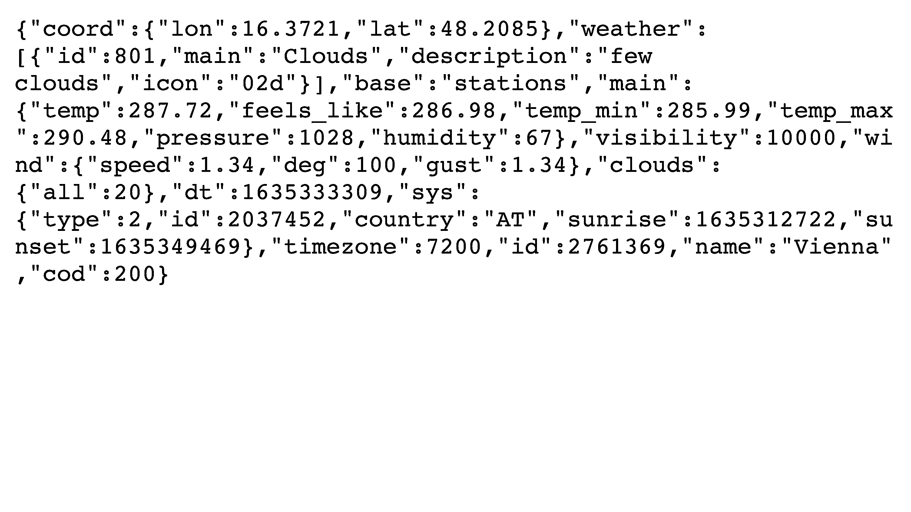

# 外面下雨了？使用 Python 构建天气 CLI 应用程序

> 原文：<https://realpython.com/build-a-python-weather-app-cli/>

你又因为暴雨被困在里面了！您想知道来自真正 Python 社区的朋友们居住的那个遥远城市的天气如何。您宁愿呆在命令行界面(CLI)中，也不愿在浏览器中查找。如果这听起来像是你想通过只使用 Python 标准库构建命令行天气应用程序来完成的任务，那么本教程就是为你准备的。

**在本教程中，您将学习如何:**

*   仅使用 **Python 标准库**模块构建功能性**天气查找工具**
*   构建一个 **Python CLI app** 使用 **`argparse`**
*   使用`configparser`到**处理 API 秘密**
*   从您的 Python 脚本中进行 **API 调用**
*   使用 ANSI 转义码、表情符号、 **f 字符串**和 Python 的字符串迷你语言，创建**视觉上吸引人的 CLI 输出**

向窗外望去证实了你的决定。下着雨，今天没法在草地上玩耍了。是时候编写一个 Python 天气应用程序，并从您的 CLI 梦想遥远的地方了！沿途你甚至会发现几个令人惊讶的城市名称。

**获取源代码:** [点击此处获取源代码，您将使用](https://realpython.com/bonus/build-a-python-weather-app-cli-project-code/)构建您的天气应用程序。

## 演示

当你等待窗外出现彩虹时，你可以将自己的颜色添加到天气应用程序中。为此，您将使用一些格式化技巧，使 CLI 输出比纯文本更有趣:

[https://player.vimeo.com/video/644506117?background=1](https://player.vimeo.com/video/644506117?background=1)

如果您喜欢这个命令行应用程序的外观，并且希望在使用标准库的同时训练您的 Python 编码技能，那么您来对地方了！

**注:**这个 app 是在 **macOS** 上为 [Zsh](https://www.zsh.org) 外壳开发的。根据您的设置，您使用某些颜色显示和表情符号的里程数可能会有所不同。在 **Windows** ， [PowerShell](https://docs.microsoft.com/en-us/powershell/) 显示格式相当不错，如果你使用的是更新版本的操作系统，你应该会看到使用 [Windows 终端](https://www.microsoft.com/en-us/p/windows-terminal/9n0dx20hk701)的默认设置的良好效果。

如果你喜欢另一种配色方案，或者想在你自己的应用程序中使用不同的表情符号，你可以在学习本教程的同时自定义它。

[*Remove ads*](/account/join/)

## 项目概述

在您开始编写任何代码之前，考虑一下您计划构建的程序的规范通常是一个好主意。首先，拿出纸和笔，写下你对完美天气应用的想法。一旦你记下了你的想法，你可以点击下面的标题来阅读你在学习本教程时要考虑的规范:


您将在本教程中构建的天气应用程序将:

*   将城市名称作为必填输入
*   如果需要，可以选择一个标志以华氏温度而不是摄氏温度来显示输出
*   调用在线天气 API 来获取天气数据
*   显示城市名称、当前天气状况和当前温度
*   使用颜色、间距和表情符号直观地格式化输出

有了这些快速笔记，你就有了一个关于你要构建什么的粗略计划，并且你已经定义了应用程序能够做什么的范围。

如果你有不同的或额外的功能，那么就把你的笔记放在身边，一旦你完成了这个初始版本，就在你的天气应用上实现它们。

**注意:**编写优秀的命令行界面可能具有挑战性。你希望你的应用程序是用户友好的，并且仍然提供你需要的所有功能。使用更高级别的库可能会使您更容易构建应用程序。

在本教程中，您将使用 Python 内置的 **`argparse`模块**，它可以帮助您创建用户友好的 CLI 应用程序，例如通过提供一个现成的有用的`--help`选项。

使用来自 **OpenWeather** 的[天气 API](https://openweathermap.org/api) ，你将获得来自世界各地的[城市名称](https://openweathermap.org/current#name)的当前天气数据。这个[应用编程接口(API)](https://en.wikipedia.org/wiki/API) 是免费使用的，有丰厚的 API 调用额度。然而，您将需要创建一个个人 API 密匙来发出请求，这将在一会儿完成。

在你开始钻研之前，再看一下预期的先决条件，这样你就知道你可以在哪里提高自己的技能，以防中途遇到困难。

## 先决条件

要完成本教程，您应该熟悉以下概念:

*   [使用`argparse`](https://realpython.com/command-line-interfaces-python-argparse/) 构建命令行界面
*   [使用 API 从互联网读取公共数据](https://realpython.com/python-api/)
*   [在 Python 代码中集成 APIs】](https://realpython.com/api-integration-in-python/)
*   [使用 JSON 数据](https://realpython.com/python-json/)
*   [导入模块和库](https://realpython.com/python-import/#basic-python-import)
*   [定义自己的功能](https://realpython.com/defining-your-own-python-function/)
*   [用 Python 异常处理错误](https://realpython.com/python-exceptions/)
*   [使用 f 字符串格式化您的文本](https://realpython.com/python-f-strings/)
*   [使用条件表达式](https://realpython.com/python-conditional-statements/#conditional-expressions-pythons-ternary-operator)

对于来自 OpenWeather 的天气 API，您还需要一个 [API 键](https://en.wikipedia.org/wiki/Application_programming_interface_key)，并且您将在下一节中学习如何访问它。

如果您在开始本教程之前没有掌握所有的必备知识，那也没关系！事实上，你可以通过前进和开始来学习更多。如果遇到困难，您可以随时停下来查看此处链接的资源。

## 步骤 1:获取合适的天气 API

在这一步中，您将为您的项目选择一个合适的天气 API，您将获得对您个人 API 密钥的访问权，并且您将学习如何从 API 请求信息。您还将理解作为对天气 API 调用的响应而获得的数据的形状和内容。

### 获取一个 OpenWeather API 密钥

OpenWeather 的团队希望免费分享他们的技术。为了提供这种服务，他们需要监控每个人打来的电话，为此他们要求你使用 API 密匙。你需要在他们的平台上注册来获得你的个人 API 密匙。

导航至 [OpenWeather 的注册页面](https://home.openweathermap.org/users/sign_up)并输入您的信息:

[](https://files.realpython.com/media/openweather-create-account.3456873c40d1.png)

成功注册后，您将收到一封包含 API 密钥的确认电子邮件。您现在还可以登录到 OpenWeather web 界面，通过导航到您的帐户页面的 [*API 密钥*选项卡来查看您的 API 密钥:](https://home.openweathermap.org/api_keys)

[](https://files.realpython.com/media/openweather-view-api-key.8e1d0285ea6e.png)

<figcaption class="figure-caption text-center">The API key isn't shown on this image. Never share your API keys with anyone!</figcaption>

在这个页面上，您可以查看您的 API 密钥。复制现有的，名称为*默认为*。在下一节中，您将使用它从浏览器中调用天气 API。

[*Remove ads*](/account/join/)

### 发出 API 请求并检查数据

您将为您的 Python 天气应用程序使用[当前天气数据端点](https://openweathermap.org/current)，并且您将允许您的用户通过向您的 CLI 传递一个城市名称来调用它。

**注意:**注册后，您的 API 密钥可能需要几个小时才能激活。

在您开始编写任何代码之前，请确保您可以调用 API 并查看它返回的数据是什么样子的。OpenWeather 网站上的 API 文档显示了您可以向其端点发出请求以接收天气数据的示例:

```py
api.openweathermap.org/data/2.5/weather?q={city name}&appid={API key}
```

您需要用您的输入替换花括号(`{}`)中显示的两个变量:

1.  将`{city name}`替换为`vienna`，或其他城市名称。
2.  用您之前复制的 API 密钥替换`{API key}`。

替换这两个值后，您可以将 URL 粘贴到浏览器中，并查看 API 响应:

[](https://files.realpython.com/media/openweather-api-response.7c0148f8571c.png)

在您的浏览器中，您将看到类似于上面截图中所示的文本。这个文本是 OpenWeather 对您的请求的 JSON API 响应。如果没有格式化，响应的内容很难阅读。展开下面的块，获得格式化的、可读性更强的 JSON 响应:


```py
 1{ 2  "coord":  { 3  "lon":  16.3721, 4  "lat":  48.2085 5  }, 6  "weather":  [ 7  { 8  "id":  801, 9  "main":  "Clouds", 10  "description":  "few clouds", 11  "icon":  "02d" 12  } 13  ], 14  "base":  "stations", 15  "main":  { 16  "temp":  287.72, 17  "feels_like":  286.98, 18  "temp_min":  285.99, 19  "temp_max":  290.48, 20  "pressure":  1028, 21  "humidity":  67 22  }, 23  "visibility":  10000, 24  "wind":  { 25  "speed":  1.34, 26  "deg":  100, 27  "gust":  1.34 28  }, 29  "clouds":  { 30  "all":  20 31  }, 32  "dt":  1635333309, 33  "sys":  { 34  "type":  2, 35  "id":  2037452, 36  "country":  "AT", 37  "sunrise":  1635312722, 38  "sunset":  1635349469 39  }, 40  "timezone":  7200, 41  "id":  2761369, 42  "name":  "Vienna", 43  "cod":  200 44}
```

检查您在 JSON 响应中收到的数据，并确定您希望从中选择哪些信息用于您的天气应用程序的初始版本。

您之前决定至少要显示三个项目:

1.  城市名称
2.  气象条件
3.  温度

如果您在提供的 JSON 响应中搜索这些信息，您会看到它们都在那里:

1.  **第 42 行**显示`"name"`键下的城市名称`"Vienna"`。
2.  **第 10 行**在关键字`"weather"`和子项`"description"`下保存详细的天气信息。
3.  **第 16 行**可让您访问键`"main"`和子项`"temp"`下的温度信息。

温度信息看起来是不是很热？如果你回头查看一下 [API 文档](https://openweathermap.org/current#data)，你会发现默认的温标是开尔文。然而，在你的天气应用程序中，你会希望你的温标默认为摄氏度。

**注意:**如果你来自美国，喜欢用[英制单位](https://en.wikipedia.org/wiki/Imperial_units)表示温度，你可能会选择华氏温度作为默认温度。但是沉住气，坚持使用教程！稍后，您将实现一个可选标志来显示华氏温度。如果您愿意，可以替换掉默认设置。

继续编辑 URL 中的查询参数以获得相同的结果，但是温度显示为摄氏度:

```py
api.openweathermap.org/data/2.5/weather?q=vienna&units=metric&appid={API key}
```

如果您将查询参数`&units=metric`添加到 URL，您将收到以摄氏度显示的温度结果:

```py
"main":  { "temp":  14.57, "feels_like":  13.83, "temp_min":  12.84, "temp_max":  17.33, "pressure":  1028, "humidity":  67 },
```

这看起来更冷，但也更现实。当您为 Python 天气应用程序构建代码时，默认情况下，您将把`units`查询参数指向`metric`，但是您还将为希望以华氏温度显示温度的用户添加一个可选标志。

在这一步中，您在 OpenWeather 注册了一个帐户，以获得一个免费的 API 密钥。然后，使用这个 API 键从浏览器中向 OpenWeather API 发出请求。您检查了 API 返回的 JSON 数据，并确定了您希望用于 Python weather CLI 应用程序的数据。

在下一步中，您将设置 Python 项目的基本结构，通过配置文件处理 API 键，并编写必要的代码以从 Python 脚本中访问该信息。

[*Remove ads*](/account/join/)

## 步骤 2:处理代码中的秘密

在这一步中，您将完成项目结构的设置，包括您将使用的大多数文件。您还将把 API 键添加到一个配置文件中，并编写代码将其导入到主脚本中。作为避免意外将 API 键推给[版本控制](https://realpython.com/python-git-github-intro/#version-control)的措施，您将创建一个`.gitignore`文件。

简而言之，到这一步结束时，您就可以开始编写 Python 天气应用程序的主要逻辑了。

### 创建您的项目文件夹结构

正如本教程开始时提到的，这个 CLI 项目不需要任何外部包。你所需要的只是 Python 的[安装。确认您拥有 Python 3.6 或更高版本，因为您将在本教程的后面使用](https://realpython.com/installing-python/) [Python f-strings](https://realpython.com/python-f-strings/) 进行字符串格式化。Python 从 3.6 版开始支持这种格式化技术。

一旦在系统上安装了现代 Python 版本，您就可以选择下面的操作系统并设置项目文件夹结构了:

*   [*视窗*](#windows-1)
**   [**Linux + macOS**](#linux-macos-1)*

```py
PS C:\> New-Item weather-app -ItemType Directory
PS C:\> Set-Location weather-app
PS C:\> New-Item .gitignore, secrets.ini, weather.py
```

```py
$ mkdir weather-app && cd weather-app
$ touch .gitignore secrets.ini weather.py
```

如果您在 shell 中运行这些命令，您将创建一个名为`weather-app/`的文件夹，其中包含三个文件:

1.  **`.gitignore`** 将防止您意外地将 API 密钥提交给版本控制。
2.  **`secrets.ini`** 会持有你的 API 密钥。
3.  **`weather.py`** 将包含 Python 天气应用程序的主要代码逻辑。

您可以在您最喜欢的[代码编辑器或 IDE](https://realpython.com/python-ides-code-editors-guide/) 中打开项目文件夹，它应该具有如下所示的结构:

```py
weather-app/
├── .gitignore
├── secrets.ini
└── weather.py
```

您将在`weather.py`中构建大部分 CLI 应用程序。然而，在开始编写代码逻辑之前，您需要确保您可以访问 Python 脚本中的 OpenWeather API 密钥，并且它是安全的，不会意外泄露到开源世界的广阔领域中。

### 保护您的 API 密钥

您将使用`secrets.ini`来存储这个项目所需的 API 密匙。为了确保你不会不小心把它提交给开源，首先打开你的`.gitignore`文件，把`secrets.ini`添加到被忽略的文件中:

```py
# .gitignore

secrets.ini
```

通过添加配置文件的名称`secrets.ini`，作为空的`.gitignore`文件中的新行，您已经抢先让 Git 知道您不希望它在版本控制下记录该配置文件。只有当您决定使用 Git 来跟踪您的项目时，这种保护才会有效。尽管如此，它还是有助于防止您意外地将 API 密钥注册到版本控制，并将其推送到 GitHub。

**注意:**一定要确保你的 API 密匙、密码和其他秘密远离公共存储库和版本控制。一旦你把一个 API 密匙推送到 GitHub，你就应该认为它被破坏了，删除它，然后创建一个新的。

即使你开始在本地开发你的项目，你可能以后会选择与全世界分享它。如果您将 API 键放在主脚本之外，并且不将配置文件注册到版本控制中，就不太可能意外泄漏 API 键。

### 在 Python 代码中访问 API 密钥

在您设置了安全屏障之后，您可以将您在第一步中创建的 API 密钥添加到您的`secrets.ini`文件中。打开文件并添加信息，遵循 [INI 文件格式](https://en.wikipedia.org/wiki/INI_file#Format):

```py
; secrets.ini [openweather] api_key=<YOUR-OPENWEATHER-API-KEY>
```

通过这个设置，您已经创建了一个名为`openweather`的**部分**，以及一个名为`api_key`的**属性**，其值就是您的 OpenWeather API 密钥。

接下来，您需要使用 Python 的`configparser`模块来访问您的`weather.py`文件中的 API 键:

```py
 1# weather.py
 2
 3from configparser import ConfigParser
 4
 5def _get_api_key():
 6    """Fetch the API key from your configuration file.
 7
 8 Expects a configuration file named "secrets.ini" with structure:
 9
10 [openweather]
11 api_key=<YOUR-OPENWEATHER-API-KEY>
12 """
13    config = ConfigParser()
14    config.read("secrets.ini")
15    return config["openweather"]["api_key"]
```

您已经创建了一个名为`_get_api_key()`的[模块非公共函数](https://www.python.org/dev/peps/pep-0008/#global-variable-names)，它封装了用于访问您的 OpenWeather API 密钥的代码逻辑:

*   **第 3 行**从 Python 的`configparser`模块导入`ConfigParser`。
*   **第 5 行**定义了`_get_api_key()`，以下划线(`_`)字符开始命名。这种命名约定表明该函数应该被认为是非公共的。
*   **第 6 行到第 12 行**组成了该函数的[文档串](https://realpython.com/documenting-python-code/#documenting-your-python-code-base-using-docstrings)。
*   **第 13 行**实例化了一个被你命名为`config`的`ConfigParser`对象。
*   **第 14 行**使用`.read()`将您在`secrets.ini`中保存的信息加载到您的 Python 脚本中。
*   **第 15 行**通过[使用方括号符号访问字典值](https://realpython.com/python-dicts/#accessing-dictionary-values)来返回 API 键的值。

您可能会注意到，`configparser`将`secrets.ini`文件的节名和属性名都变成了具有嵌套结构的字典键。

如果您调用`_get_api_key()`，它现在将返回您的 OpenWeather API 键的值，该值已准备好用于您的 API 请求。同时，API 键的值在您的主代码文件之外，这意味着您不太可能意外地破坏它。

在这一步中，您已经学习了如何使用 Python 的`configparser`模块从 INI 配置文件中读取信息。通过在您的`.gitignore`文件中注册您的`secrets.ini`配置文件，您已经抢先将其从版本控制中排除。

在本教程的下一步中，您将为 Python 天气应用程序创建启用 CLI 交互的代码。

[*Remove ads*](/account/join/)

## 步骤 3:为你的 Python 天气应用创建一个 CLI

在这一步中，您将编写一个命令行输入解析器，该解析器接受用户提供的城市信息和一个关于使用何种温度等级的可选参数。为了构建这个功能，你将使用 [Python 的`argparse`模块](https://realpython.com/command-line-interfaces-python-argparse/)。

### 设置一个参数解析器

首先要记住你决定从用户那里收集什么信息:

1.  **城市名称**
2.  **温标**，默认值为摄氏度

要通过命令行界面收集这两个值并在 Python 天气应用程序中使用它们，您将使用 Python 的内置`argparse`模块。您将添加的代码还不会显示用户输入，但它会收集用户输入:

```py
 1# weather.py
 2
 3import argparse 4from configparser import ConfigParser
 5
 6def read_user_cli_args(): 7    """Handles the CLI user interactions.
 8
 9 Returns:
10 argparse.Namespace: Populated namespace object
11 """
12    parser = argparse.ArgumentParser(
13        description="gets weather and temperature information for a city"
14    )
15    return parser.parse_args()
16
17# ...
18
19if __name__ == "__main__": 20    read_user_cli_args()
```

在第 3 行导入`argparse`之后，从第 6 行开始定义`read_user_cli_args()`:

*   **第 12 到 14 行**创建了一个`argparse.ArgumentParser`的实例，您可以在第 13 行向其传递解析器的可选描述。
*   **第 15 行**返回调用`.parse_args()`的结果，这些结果最终将是用户输入的值。
*   **第 19 行**在检查了 [Python 的`"__main__"`命名空间](https://realpython.com/python-main-function/)后打开一个条件块，它允许你定义当你作为脚本执行`weather.py`时应该运行的代码。
*   **第 20 行**调用`read_user_cli_args()`，有效地运行您编写的 CLI 解析代码逻辑。

如果你在这个阶段给你的脚本一个旋转，它会毫无怨言地执行。然而，也不会有任何输出:

```py
$ python weather.py
$
```

如果你试图将一个城市名传递给你的 CLI 应用程序，Python 会报错，你的脚本会退出，但你也会得到一个免费的帮助消息，其中包含你在`read_user_cli_args()`中编写的`ArgumentParser`的最小设置:

```py
$ python weather.py vienna
usage: weather.py [-h]
weather.py: error: unrecognized arguments: vienna
```

Python 首先将使用信息打印到您的控制台。该信息暗示了`ArgumentParser`提供的内置帮助`(-h)`。然后，它告诉您，您的解析器没有识别出您使用 CLI 传递给程序的参数。由于您还没有在`read_user_cli_args()`中设置任何参数，您不能因为 Python 的抱怨而生气。

### 解析输入参数

当然，如果你允许用户输入一个城市并选择他们选择的温度范围，你的应用会更有帮助。为此，您将向之前创建的解析器添加两个参数:

```py
 1# weather.py
 2
 3import argparse
 4from configparser import ConfigParser
 5
 6def read_user_cli_args():
 7    """Handles the CLI user interactions.
 8
 9 Returns:
10 argparse.Namespace: Populated namespace object
11 """
12    parser = argparse.ArgumentParser(
13        description="gets weather and temperature information for a city"
14    )
15    parser.add_argument( 16        "city", nargs="+", type=str, help="enter the city name" 17    ) 18    parser.add_argument( 19        "-i", 20        "--imperial", 21        action="store_true", 22        help="display the temperature in imperial units", 23    ) 24    return parser.parse_args()
25
26# ...
27
28if __name__ == "__main__":
29    read_user_cli_args()
```

通过向`.add_argument()`添加这两个调用，您已经设置了解析器来收集通过 CLI 提交的用户输入:

*   **第 15 到 17 行**定义了`"city"`参数，它将接受一个或多个由空格分隔的输入。通过将参数数量(`nargs`)设置为`"+"`，您允许用户传递由多个单词组成的城市名称，例如 *New York* 。

*   **第 18 到 23 行**定义了可选的布尔参数`imperial`。您将`action`关键字参数设置为`"store_true"`，这意味着如果用户添加了可选标志，则`imperial`的值将为`True`，如果用户没有添加，则为`False`。

两个添加的参数都有一个关键字参数`help`，您用它来定义帮助文本，然后`argparse`通过`-h`标志使其可用:

```py
 1$ python weather.py -h
 2usage: weather.py [-h] [-i] city [city ...]
 3
 4gets weather and temperature information for a city 5
 6positional arguments:
 7 city            enter the city name 8
 9optional arguments:
10 -h, --help      show this help message and exit
11 -i, --imperial  display the temperature in imperial units
```

在这个控制台输出中，您可以在第 4 行看到解析器的描述文本，而每个参数的帮助文本分别显示在第 7 行或第 11 行的描述旁边。

但是，如果您运行该脚本并将一个城市名作为输入传递给它，您仍然看不到显示回控制台的任何输出。回到`weather.py`，编辑文件底部条件代码块中的代码:

```py
# weather.py

# ...

if __name__ == "__main__":
 user_args = read_user_cli_args() print(user_args.city, user_args.imperial)
```

现在，您已经在`user_args`变量中捕获了`read_user_cli_args()`的返回值，并添加了对`print()`的调用，以便将用户输入的值显示回控制台:

```py
$ python weather.py vienna
['vienna'] False

$ python weather.py new york -i
['new', 'york'] True

$ python weather.py ho chi minh city --imperial
['ho', 'chi', 'minh', 'city'] True
```

现在，您可以将组成城市名称的多个单词传递给 CLI，它会正确地将它们作为字符串收集到一个列表中。此外，您可以选择传递`-i`或`--imperial`标志来保存`True`作为`user_args.imperial`的值。您的 Python weather CLI 应用程序已经设置好收集您需要的用户输入！

在本节中，您已经使用了`argparse`来接收和处理您的用户将通过他们的命令行界面传递的信息。您确保了城市名称可以由多个单词组成，并且有一种方法可以选择请求英制单位的温度。

虽然你的用户现在可以输入城市名称和温度等级偏好，但你目前没有对他们的输入做任何事情。在下一步中，您将使用它们提交的值来调用 OpenWeather API 并获取特定城市的天气信息。

[*Remove ads*](/account/join/)

## 第四步:获取天气信息

外面天气怎么样？还在下雨吗？如果你足够幸运，附近有个窗户，你可以看一看。但是你家里的任何真实窗口都比你的下一个*终端*窗口要远，所以是时候使用 Python 脚本从最近的窗口获取天气信息了。

在这一步，您将[将用户输入连接](https://realpython.com/python-string-split-concatenate-join/)到一个有效的 URL，您将使用该 URL 向 OpenWeather 的 API 发送 API 请求。您还将把所有必要的代码逻辑封装到公共和非公共函数中，以遵循最佳实践并添加异常处理，这样您的用户就不会遇到意外错误。

### 构建 URL

如果您回想一下[步骤一](#make-an-api-request-and-inspect-the-data)，您可能还记得您使用浏览器成功调用 API 时使用的 URL:

```py
api.openweathermap.org/data/2.5/weather?q={city name}&appid={API key}
```

您将在 Python 代码中执行的操作与此类似，因此您需要一个像这样的有效 URL。传递任何查询参数之前的基本 URL 对于对此端点的任何调用都是相同的。

**注意:**您可能会注意到，URL 包含一个数字`2.5`，它表示编写本文时 API 的版本。如果 API 获得了更新，这个数字将会不同。检查 API 的当前版本，并在您的 URL 中确认您正在使用您想要使用的版本。

因为 URL 的基数对于所有调用都保持不变，所以最好在代码的顶部将其定义为一个常量:

```py
# weather.py

import argparse
from configparser import ConfigParser

BASE_WEATHER_API_URL = "http://api.openweathermap.org/data/2.5/weather" 
# ...
```

通过这一行代码，您已经添加了所有 API 调用将共享的基本 URL 作为一个常量。

注意:记住 Python 常量在技术上不是常量，因为你可以随时改变它们的值。然而，你可以通过将一个值全部格式化成大写字母来表明你不希望*在你的程序中*改变它，正如[PEP 8-Python 代码风格指南](https://www.python.org/dev/peps/pep-0008/#constants)中所描述的。

但是`BASE_WEATHER_API_URL`中的 URL 并不完整，到目前为止，在一个由一个或多个字符串组成的列表中，只有一个城市名和一个布尔值。是时候根据您可以获得的输入创建一个完整的 URL 了:

```py
 1# weather.py
 2
 3import argparse
 4from configparser import ConfigParser
 5from urllib import parse 6
 7BASE_WEATHER_API_URL = "http://api.openweathermap.org/data/2.5/weather"
 8
 9def read_user_cli_args():
10    # ...
11
12def build_weather_query(city_input, imperial=False): 13    """Builds the URL for an API request to OpenWeather's weather API.
14
15 Args:
16 city_input (List[str]): Name of a city as collected by argparse
17 imperial (bool): Whether or not to use imperial units for temperature
18
19 Returns:
20 str: URL formatted for a call to OpenWeather's city name endpoint
21 """
22    api_key = _get_api_key()
23    city_name = " ".join(city_input)
24    url_encoded_city_name = parse.quote_plus(city_name)
25    units = "imperial" if imperial else "metric"
26    url = (
27        f"{BASE_WEATHER_API_URL}?q={url_encoded_city_name}"
28        f"&units={units}&appid={api_key}"
29    )
30    return url
31
32# ...
```

您首先在第 5 行添加了一个新的 import 语句。您将在第 24 行使用来自`urllib.parse`模块的函数来帮助净化用户输入，以便 API 可以安全地使用它。

在第 12 行，您已经定义了`build_weather_query()`，它接受两个输入，这两个输入对应于您通过 CLI 收集的用户输入:

1.  **`city_input`** 是您在`user_args.city`中收集的字符串列表。
2.  **`imperial`** 是一个布尔值，它决定是用摄氏度还是华氏温度来显示温度。该参数的默认值是`False`。

您编写的函数由几行代码组成，带有一个描述性的文档字符串:

*   **第 22 行**调用`_get_api_key()`从你的配置文件中获取 OpenWeather API 密匙并保存为`api_key`。

*   **第 23 行**使用`str.join()`将组成城市名称的单词与空白字符(`" "`)连接起来，如果一个城市名称由多个单词组成。

*   **第 24 行**将`city_name`传递给 [`parse.quote_plus()`](https://docs.python.org/3/library/urllib.parse.html#urllib.parse.quote_plus) ，它对字符串进行编码，以便您可以向 API 发出有效的 HTTP 请求。除了通过 UTF-8 编码转换某些字符之外，这个函数还将空白字符转换成加号(`+`)，这是正确调用这个 API 所必需的 [URL 编码](https://en.wikipedia.org/wiki/Percent-encoding#The_application/x-www-form-urlencoded_type)的一种形式。

*   **第 25 行**使用一个[条件表达式](https://realpython.com/python-conditional-statements/#conditional-expressions-pythons-ternary-operator)将`"imperial"`或`"metric"`分配给`units`，这取决于`imperial`参数是`True`还是`False`。

*   **第 26 到 29 行**构建了一个完整的 URL，您可以使用它来进行一次成功的 API 调用。您正在使用 f-string 从`BASE_WEATHER_API_URL`和您在前面几行中分配的变量组成 URL。

*   **第 30 行**最后返回完整格式的 URL。

调用`build_weather_query()`返回一个 URL，您可以使用它对 OpenWeather 提供的天气 API 的特定端点进行有效的 API 调用。如果您调用`weather.py`底部的函数，那么您可以生成并显示 URL:

```py
# weather.py

# ...

if __name__ == "__main__":
    user_args = read_user_cli_args()
 query_url = build_weather_query(user_args.city, user_args.imperial) print(query_url)
```

如果您在应用这些更改后执行`weather.py`并传递您的程序所期望的 CLI 参数，它将打印一个到您的控制台的 URL，您可以复制并粘贴到您的浏览器中，以进行 API 调用，就像您在第一步中所做的那样:

```py
$ python weather.py bee
http://api.openweathermap.org/data/2.5/weather?q=bee&units=metric&appid=<YOUR-OPENWEATHER-API-KEY>

$ python weather.py zap -i
http://api.openweathermap.org/data/2.5/weather?q=zap&units=imperial&appid=<YOUR-OPENWEATHER-API-KEY>
```

试一试，将脚本生成的 URL 粘贴到浏览器搜索栏中。请记住，`<YOUR-OPENWEATHER-API-KEY>`应该保存您的脚本从您的`secrets.ini`配置文件中获取的 API 键值。是的，*蜜蜂*和 *zap* 都是 OpenWeather 提供天气信息的真实城市名称:)

既然您已经知道可以生成有效的 URL，那么是时候让 Python 来发出请求，而不必再将 URL 复制粘贴到您的浏览器中了。

[*Remove ads*](/account/join/)

### 用 Python 发出 HTTP 请求

您将使用 Python 的`urllib`模块向 weather API 端点发出一个 HTTP GET 请求，该请求使用由`build_weather_query()`和您的用户的 CLI 输入生成的 URL。您将需要 Python 标准库中的一些额外的内置模块来构建这一步的代码逻辑:

```py
# weather.py

import argparse
import json from configparser import ConfigParser
from urllib import parse, request 
# ...
```

您将使用`urllib.request`发出请求，并使用`json`将 API 响应的数据转换成 Python 字典:

```py
 1# weather.py
 2
 3# ...
 4
 5def get_weather_data(query_url): 6    """Makes an API request to a URL and returns the data as a Python object.
 7
 8 Args:
 9 query_url (str): URL formatted for OpenWeather's city name endpoint
10
11 Returns:
12 dict: Weather information for a specific city
13 """
14    response = request.urlopen(query_url)
15    data = response.read()
16    return json.loads(data)
17
18
19if __name__ == "__main__":
20    user_args = read_user_cli_args()
21    query_url = build_weather_query(user_args.city, user_args.imperial)
22    weather_data = get_weather_data(query_url) 23    print(weather_data)
```

通过添加此代码，您已经将之前通过浏览器处理的所有功能都移到了 Python 脚本中:

*   **第 5 行**定义了`get_weather_data()`，这是您将用来向 weather API 端点发出请求的函数。

*   **第 6 行到第 13 行**组成了该函数的 docstring。

*   **第 14 行**使用`urllib.request.urlopen()`向`query_url`参数发出 HTTP GET 请求，并将结果保存为`response`。

*   **第 15 行**从响应中提取数据。

*   **第 16 行**以`data`为参数返回对`json.loads()`的调用。该函数返回一个保存从`query_url`获取的 JSON 信息的 Python 对象。

*   **第 22 行**调用`get_weather_data()`传递你用`build_weather_query()`生成的`query_url`，然后将字典保存到`weather_data`。

*   第 23 行最后将天气数据打印到你的控制台上。

如果您在添加此代码后运行您的 weather CLI 应用程序，您将看到类似于之前在浏览器中得到的输出:

```py
$ python weather.py antananarivo
{'coord': {'lon': 47.5361, 'lat': -18.9137}, 'weather': [{'id': 500, 'main':
 'Rain', 'description': 'light rain', 'icon': '10d'}], 'base': 'stations',
 'main': {'temp': 21.98, 'feels_like': 21.8, 'temp_min': 21.98, 'temp_max':
 21.98, 'pressure': 1016, 'humidity': 60}, 'visibility': 10000, 'wind':
 {'speed': 4.12, 'deg': 120}, 'rain': {'1h': 0.15}, 'clouds': {'all': 75},
 'dt': 1635501615, 'sys': {'type': 1, 'id': 2136, 'country': 'MG', 'sunrise':
 1635473461, 'sunset': 1635519356}, 'timezone': 10800, 'id': 1070940,
 'name': 'Antananarivo', 'cod': 200}
```

但是如果你太有创意，输入了一个 OpenWeather 没有任何天气数据的城市名称，会发生什么呢？尝试将以下一些城市名称传递到您的 CLI:

*   常态
*   One thousand seven hundred and seventy
*   为什么
*   真相还是后果
*   没有别的地方
*   奶酪地震

虽然列表中的所有城市都存在，但谁会想到呢？—最后一个是 [Cheesequake](https://en.wikipedia.org/wiki/Cheesequake,_New_Jersey) ，它没有可以通过这个 API 访问的天气数据:

```py
$ python weather.py cheesequake
Traceback (most recent call last):

 ...

urllib.error.HTTPError: HTTP Error 404: Not Found
```

如果你的 Python weather CLI 应用程序在每次你的用户变得太有创造力时都会带来大量的堆栈跟踪，那么它就不会非常用户友好。您可以通过在代码中添加一些[异常处理](https://realpython.com/python-exceptions/)来改进这一点。

### 处理代码中的异常

当您使用命令行应用程序时，您遇到了一个`HTTPError`。这不利于良好的用户体验。因为您已经知道要捕获哪个错误，所以可以在代码中添加一个特定的异常:

```py
 1# weather.py
 2
 3import argparse
 4import json
 5import sys 6from configparser import ConfigParser
 7from urllib import error, parse, request 8
 9# ...
10
11def get_weather_data(query_url):
12
13    # ...
14
15    try: 16        response = request.urlopen(query_url)
17    except error.HTTPError: 18        sys.exit("Can't find weather data for this city.") 19
20    data = response.read()
21    return json.loads(data)
22
23# ...
```

通过添加这些额外的代码行并创建一个`try` … `except`块，您现在可以成功地处理请求 API 中没有城市数据的城市所产生的错误:

*   **第 5 行**导入了内置的`sys`模块，该模块允许您优雅地退出程序而不进行回溯，您在第 18 行执行了这一操作。

*   **7 号线**从`urllib`进口增加`error`。

*   **第 15 行**启动了`try` … `except`块，您已经将执行 HTTP 请求的代码行移到了第 16 行的`try`块中。

*   **第 17 行**捕捉第 16 行 HTTP 请求期间发生的任何`error.HTTPError`。它打开了一个`except`块。

*   **第 18 行**调用`sys.exit()`来优雅地退出应用程序，如果 HTTP 错误发生的话。您还传递了一条描述性消息，当没有为用户输入找到天气数据时，您的 CLI 将显示这条消息。

这对您的 Python 天气应用程序的用户体验来说已经是一项重大改进:

```py
$ python weather.py why not
Can't find weather data for this city.
```

天气 API 没有一个叫做*的城市的数据，为什么没有*，有了这个描述性的消息，你的用户就会明白了。

虽然在这种情况下消息是正确的，但是您的应用程序目前还会捕捉属于`HTTPError`子类的其他异常。例如，如果您的 API 密钥过期或者您忘记提供一个，它会显示相同的消息。发生这种混淆是因为如果你发送一个没有有效 API 密钥的请求，weather API 将返回一个 HTTP 错误，状态码为 [401 Unauthorized](https://en.wikipedia.org/wiki/List_of_HTTP_status_codes#4xx_client_errors) 。

通过使您的消息更具体地针对不同的 HTTP 错误代码，您可以改进您的异常处理:

```py
 1# weather.py
 2
 3# ...
 4
 5def get_weather_data(query_url):
 6
 7    # ...
 8
 9    try:
10        response = request.urlopen(query_url)
11    except error.HTTPError as http_error: 12        if http_error.code == 401:  # 401 - Unauthorized 13            sys.exit("Access denied. Check your API key.") 14        elif http_error.code == 404:  # 404 - Not Found 15            sys.exit("Can't find weather data for this city.") 16        else: 17            sys.exit(f"Something went wrong... ({http_error.code})") 18
19    data = response.read()
20    return json.loads(data)
21
22# ...
```

通过添加这些内容，您可以更深入地研究在将 HTTP 错误响应作为`except`块中的`http_error`提供后从 API 收到的 HTTP 错误响应:

*   **第 12 行到第 13 行**捕捉 HTTP 401 未授权错误，这些错误表明您的 API 密钥已经过期或者您没有正确提供它。

*   **第 14 到 15 行**捕捉到 [HTTP 404 Not Found](https://en.wikipedia.org/wiki/HTTP_404) 错误，通知您天气 API 找不到您输入的城市名称的任何数据。

*   **第 16 到 17 行**捕获所有其他可能发生的 HTTP 错误，然后退出程序并打印一条包含 HTTP 错误代码的消息。

您对 HTTP 错误的错误处理现在比以前更加精细了。这将帮助您的用户更好地识别他们遇到的问题。

此外，您将添加另一个`try` … `except`块来处理 API 可能发送给您的可能格式错误的 JSON:

```py
# weather.py

# ...

def get_weather_data(query_url):

    # ...

    try:
        response = request.urlopen(query_url)
    except error.HTTPError as http_error:
        if http_error.code == 401:  # 401 - Unauthorized
            sys.exit("Access denied. Check your API key.")
        elif http_error.code == 404:  # 404 - Not Found
            sys.exit("Can't find weather data for this city.")
        else:
            sys.exit(f"Something went wrong... ({http_error.code})")

    data = response.read()

 try: return json.loads(data) except json.JSONDecodeError: sys.exit("Couldn't read the server response.") 
# ...
```

在这里，您已经将试图解码 JSON 响应的代码包装到另一个`try` … `except`块中，以处理可能在此阶段弹出的`JSONDecodeError`异常。如果 Python 无法将服务器的 JSON 响应转换成有效的 Python 对象，就会引发这个异常。如果发生这种情况，您现在可以优雅地退出程序，并向用户显示一条描述性消息。

**注意:**有了这些新功能，你已经使你的 Python 天气应用程序对开发者和非开发者来说都更加舒适！

在本节中，您编写了 Python 代码，使用`urllib`模块从脚本中发出 web 请求。为此，首先构建有效 API 请求所需的 URL，然后在`get_weather_data()`中使用它来发出请求并接收 JSON 响应。您将 JSON 响应转换为 Python 字典，并将其显示回您的控制台。

您还添加了异常处理以避免显示冗长的错误消息，而是给出描述性的反馈，并且您至少遇到了一个您以前从未听说过的新城市名称！

此时，您可能想知道如何找到重复城市名称的天气信息:


如果你住在加拿大安大略省的伦敦，你可能会担心你将永远看不到你家乡城市的天气，因为你的城市名同胞是英国伦敦的 T2。OpenWeather API 对此有一个解决方案！您可以将 [ISO 3166-1 国家代码标准](https://www.iso.org/obp/ui/#search/code/)的 [alpha-2 代码](https://en.wikipedia.org/wiki/ISO_3166-1_alpha-2)作为逗号分隔值传递给[城市名称 API 调用](https://openweathermap.org/current#name):

```py
$ python weather.py london, ca
```

在你的控制台上旋转一下吧！你将会看到，对于名为*伦敦*的城市，你会得到不同的结果，这取决于你是否通过了代表*加拿大*的 alpha-2 代码 *ca* 。

虽然您可以访问世界上许多城市的天气信息，包括几个不同的伦敦，但您的 CLI 应用程序的输出仍然难以阅读。一次有太多的信息，而且格式也不好。在下一步中，您将隔离要点，并学习如何以更漂亮的方式将它们显示到控制台。

[*Remove ads*](/account/join/)

## 步骤 5:显示你的 Python 天气应用的输出

在这一步中，您将对天气数据进行过滤，筛选出要在输出中使用的基本信息。您还将使用`pprint`、f-strings 和 Python 的字符串格式化迷你语言来使输出更具可读性。

### 识别相关数据

Python 天气应用程序的当前状态已经收集了用户输入并将现有城市的天气信息返回到终端:

```py
$ python weather.py boring
{'coord': {'lon': -76.8223, 'lat': 39.5316}, 'weather': [{'id': 501, 'main':
'Rain', 'description': 'moderate rain', 'icon': '10n'}], 'base': 'stations',
'main': {'temp': 11.78, 'feels_like': 11.36, 'temp_min': 10.69, 'temp_max':
13.25, 'pressure': 993, 'humidity': 90}, 'visibility': 10000, 'wind': {'speed':
1.34, 'deg': 136, 'gust': 3.58}, 'rain': {'1h': 1.83}, 'clouds': {'all': 90},
'dt': 1635497629, 'sys': {'type': 2, 'id': 2032439, 'country': 'US', 'sunrise':
1635507144, 'sunset': 1635545363}, 'timezone': -14400, 'id': 4347790,
'name': 'Boring', 'cod': 200}
```

但是这可能很难阅读，考虑到外面雷雨造成的昏暗光线——或者可能只是太*无聊*而无法通过？您可以使用 Python 的 [`pprint`](https://realpython.com/python-pretty-print/) 模块在您的终端中获得更清晰的表示:

```py
# weather.py

from pprint import pp

# ...

if __name__ == "__main__":

    # ...

    pp(weather_data)
```

通过添加 import 语句并调用`pp()`而不是`print()`，您已经告诉 Python 很好地为您格式化输出并使其更具可读性:

```py
$ python weather.py bat cave
{'coord': {'lon': -82.2871, 'lat': 35.4515},
 'weather': [{'id': 803,
 'main': 'Clouds',
 'description': 'broken clouds',
 'icon': '04n'}],
 'base': 'stations',
 'main': {'temp': 10.99,
 'feels_like': 10.7,
 'temp_min': 8.64,
 'temp_max': 12.96,
 'pressure': 997,
 'humidity': 98},
 'visibility': 10000,
 'wind': {'speed': 0.9, 'deg': 245, 'gust': 1.05},
 'clouds': {'all': 65},
 'dt': 1635498584,
 'sys': {'type': 2,
 'id': 2017496,
 'country': 'US',
 'sunrise': 1635508089,
 'sunset': 1635547041},
 'timezone': -14400,
 'id': 4456121,
 'name': 'Bat Cave',
 'cod': 200}
```

嗯，那就更刺激一点了！谁知道天气现象会在蝙蝠洞里发生？！

嵌套字典的这种可读性更强的显示方式使得识别您想要从 API 响应中收集的三条信息成为可能:

1.  **城市名称**至`weather_data['name']`
2.  **天气描述**到`weather_data['weather'][0]['description']`
3.  **温度**至`weather_data['main']['temp']`

回到你的主脚本文件，去掉`pprint`的使用。然后从`weather_data`字典中选择您感兴趣的数据，这样您就可以只打印相关信息:

```py
# weather.py

# Removed: from pprint import pp

# ...
if __name__ == "__main__":

    # ...

    print(
      f"{weather_data['name']}: "
      f"{weather_data['weather'][0]['description']} "
      f"({weather_data['main']['temp']})"
      )
```

您用对`print()`的标准调用替换了`pp()`,并添加了三个 f 字符串来过滤`weather_data`中您感兴趣的信息，并将其显示回您的控制台:

```py
$ python weather.py zig zag
Zig Zag: light rain (12.95)
```

这个输出看起来比以前可读性更好！然而，目前仍然很难知道温度信息是用摄氏度还是华氏温度。您可以在这里将适当的符号添加到您的`print()`调用中，但是因为您最终会将更多样式添加到您的 CLI 输出中，所以创建一个用于打印结果的专用函数是一个好主意。您将在下一部分解决这个问题。

### 建立显示功能

在`weather.py`中，滚动到文件的底部。上面的 [`if __name__ == "__main__":`](https://realpython.com/if-name-main-python/) 正是创建这个新功能的好地方:

```py
 1# weather.py
 2
 3# ...
 4
 5def display_weather_info(weather_data, imperial=False):
 6    """Prints formatted weather information about a city.
 7
 8 Args:
 9 weather_data (dict): API response from OpenWeather by city name
10 imperial (bool): Whether or not to use imperial units for temperature
11
12 More information at https://openweathermap.org/current#name
13 """
14    city = weather_data["name"]
15    weather_description = weather_data["weather"][0]["description"]
16    temperature = weather_data["main"]["temp"]
17
18    print(f"{city}", end="")
19    print(f"\t{weather_description.capitalize()}", end=" ")
20    print(f"({temperature}°{'F' if imperial else 'C'})")
21
22
23if __name__ == "__main__":
24
25    # ...
26
27    display_weather_info(weather_data, user_args.imperial)
```

在这个函数中，您首先为想要显示的数据创建了变量，然后将之前传递给`print()`的字符串参数分成三个单独的对`print()`的调用:

*   **第 5 行**用两个参数`weather_data`和`imperial`定义`display_weather_info()`。第二个参数默认为`False`。

*   **第 14 行到第 16 行**从`weather_data`字典中为`city`、`weather_description`和`temperature`选取相关数据，并将其赋给变量。

*   **第 18 行**打印 API 调用返回的城市名称。通过传递一个空字符串(`""`)而不是默认的换行符(`\n`)来防止换行。因此，下一次调用`print()`将继续在同一行显示文本。

*   **第 19 行**打印关于当前天气的信息，以制表符(`\t`)开始，将其与之前的输出分开。您还可以调用`.capitalize()`来将 weather API 返回的字符串信息大写，默认情况下，这些信息都是小写的。最后，使用`end=" "`将最后一个字符设置为空白字符，而不是默认的换行符。

*   **第 20 行**从打印温度信息开始，然后使用依赖于布尔值`imperial`的条件表达式来决定是打印华氏*度*的`F`还是摄氏*度*的`C`。

*   **第 27 行**用对`display_weather_info()`的调用替换了之前对`print()`的调用，并传递给它必要的参数。

您已经将对`print()`的调用分成三个不同的函数调用，分别位于不同的行上。您可以像这样将它们分开，以便为稍后添加的代码留出空间，这些代码将改变它们之间的显示颜色。

如果您通过从命令行运行 Python 天气应用程序来运行更新后的显示功能，您将看到信息仍然整齐地显示在一行输出中:

```py
$ python weather.py bitter end -i
Bitter End      Scattered clouds (27.93°F)
```

您还会注意到，您的应用程序现在可以根据您是否通过了`-i`标志来正确选择合适的温度范围。您在城市名称后使用的制表符将有助于保持信息显示的一致性，即使您查找的城市名称长度不同:

```py
$ python weather.py antananarivo
Antananarivo    Scattered clouds (29.98°C)

$ python weather.py double trouble -i
Double Trouble  Clear sky (37.11°F)
```

现在天气输出很好地对齐了！但是，这并不适用于所有城市名称，当城市名称的长度变成另一个制表符时，您的天气信息将显示在不同的位置:

```py
$ python weather.py gotham -i
Gotham  Broken clouds (49.8°F)

$ python weather.py national city -i
National City   Few clouds (46.65°F)
```

您可以通过使用 Python 的[格式规范小型语言](https://docs.python.org/3/library/string.html#formatspec)向输出字符串添加字符串填充来改进这一点，接下来您将会这样做。

[*Remove ads*](/account/join/)

### 将字符串填充添加到您的输出中

Python 提供了一种内置的迷你语言，允许您在一个[格式的字符串](https://realpython.com/python-string-formatting/)中应用规范。

为了使您的`city`和`weather_description`字符串在一致的字符长度内居中，您可以在变量名后添加一个冒号(`:`)，后跟一个对齐选项字符(`^`)和一个定义总长度的整数，例如`20`:

```py
print(f"{city:^20}", end="")
print(
    f"\t{weather_description.capitalize():^20}",
    end=" ",
)
print(f"({temperature}°{'F' if imperial else 'C'})")
```

通过这一添加，您告诉 Python 将字符串输出保持在 20 个字符的一致长度，并在任何较短的字符串的左右两边填充空格:

```py
$ python weather.py antananarivo
 Antananarivo          Scattered clouds   (23.98°C)

$ python weather.py eureka -i
 Eureka             Scattered clouds   (9.85°C)
```

找到了，成功了！长城市名 *Antananarivo* 和短城市名 *Eureka* 都在 20 个字符的填充范围内。现在，制表符将两个城市的天气描述对齐到 CLI 输出中的同一点。

然而，20 个字符似乎只是一些适合这些城市名称的数字。当您对天气应用程序进行最后润色时，您可能需要更改填充。因此，最好避免添加 20 作为一个[幻数](https://en.wikipedia.org/wiki/Magic_number_(programming)#Unnamed_numerical_constants)，而是在脚本的顶部将其定义为一个常数:

```py
# weather.py

import argparse
import json
import sys
from configparser import ConfigParser

from urllib import error, parse, request

BASE_WEATHER_API_URL = "http://api.openweathermap.org/data/2.5/weather"
PADDING = 20 
# ...

def display_weather_info(weather_data, imperial=False):

    # ...

 print(f"{city:^{PADDING}}", end="")    print(
 f"\t{weather_description.capitalize():^{PADDING}}",        end=" ",
    )
    print(f"({temperature}°{'F' if imperial else 'C'})")
```

通过将可视填充的值作为常量添加到代码中，您将能够快速地交换它，直到找到 Python 天气应用程序精美可视显示的最佳填充。

你在这个项目上走了很长的路，忍受了干旱和雷暴，建立了这个功能齐全的 Python 天气应用程序。如果您想将您编写的代码与项目当前状态的快照进行比较，您可以点击展开`weather.py`的完整代码:


```py
# weather.py

import argparse
import json
import sys
from configparser import ConfigParser
from urllib import error, parse, request

BASE_WEATHER_API_URL = "http://api.openweathermap.org/data/2.5/weather"
PADDING = 20

def read_user_cli_args():
    """Handles the CLI user interactions.

 Returns:
 argparse.Namespace: Populated namespace object
 """
    parser = argparse.ArgumentParser(
        description="gets weather and temperature information for a city"
    )
    parser.add_argument(
        "city", nargs="+", type=str, help="enter the city name"
    )
    parser.add_argument(
        "-i",
        "--imperial",
        action="store_true",
        help="display the temperature in imperial units",
    )
    return parser.parse_args()

def build_weather_query(city_input, imperial=False):
    """Builds the URL for an API request to OpenWeather's weather API.

 Args:
 city_input (List[str]): Name of a city as collected by argparse
 imperial (bool): Whether or not to use imperial units for temperature

 Returns:
 str: URL formatted for a call to OpenWeather's city name endpoint
 """
    api_key = _get_api_key()
    city_name = " ".join(city_input)
    url_encoded_city_name = parse.quote_plus(city_name)
    units = "imperial" if imperial else "metric"
    url = (
        f"{BASE_WEATHER_API_URL}?q={url_encoded_city_name}"
        f"&units={units}&appid={api_key}"
    )
    return url

def _get_api_key():
    """Fetch the API key from your configuration file.

 Expects a configuration file named "secrets.ini" with structure:

 [openweather]
 api_key=<YOUR-OPENWEATHER-API-KEY>
 """
    config = ConfigParser()
    config.read("secrets.ini")
    return config["openweather"]["api_key"]

def get_weather_data(query_url):
    """Makes an API request to a URL and returns the data as a Python object.

 Args:
 query_url (str): URL formatted for OpenWeather's city name endpoint

 Returns:
 dict: Weather information for a specific city
 """
    try:
        response = request.urlopen(query_url)
    except error.HTTPError as http_error:
        if http_error.code == 401:  # 401 - Unauthorized
            sys.exit("Access denied. Check your API key.")
        elif http_error.code == 404:  # 404 - Not Found
            sys.exit("Can't find weather data for this city.")
        else:
            sys.exit(f"Something went wrong... ({http_error.code})")

    data = response.read()

    try:
        return json.loads(data)
    except json.JSONDecodeError:
        sys.exit("Couldn't read the server response.")

def display_weather_info(weather_data, imperial=False):
    """Prints formatted weather information about a city.

 Args:
 weather_data (dict): API response from OpenWeather by city name
 imperial (bool): Whether or not to use imperial units for temperature

 More information at https://openweathermap.org/current#name
 """
    city = weather_data["name"]
    weather_description = weather_data["weather"][0]["description"]
    temperature = weather_data["main"]["temp"]

    print(f"{city:^{PADDING}}", end="")
    print(
        f"\t{weather_description.capitalize():^{PADDING}}",
        end=" ",
    )
    print(f"({temperature}°{'F' if imperial else 'C'})")

if __name__ == "__main__":
    user_args = read_user_cli_args()
    query_url = build_weather_query(user_args.city, user_args.imperial)
    weather_data = get_weather_data(query_url)
    display_weather_info(weather_data, user_args.imperial)
```

恭喜你！你的剧本看起来很棒，而且你花了很多时间来创作。也许是时候出去走走了？不，看起来外面还在下雨。

这让你有时间改进应用程序输出的外观和风格。添加一些天气表情符号来增加活力，用彩虹色取代单调的黑白文本怎么样？

## 步骤 6:对天气应用的输出进行样式化

此时，您的 Python weather CLI 应用程序以可读和可理解的方式显示所有相关信息。不过输出看起来还是有点*风化*。

在这一步中，你将为你的天气应用添加颜色和华丽的表情符号，使其流行起来。您的应用程序将以各种颜色显示不同的符号和文本，具体取决于您正在查询的地方的当前天气。

### 更改终端输出颜色

您可以更改打印到 CLI 的文本的颜色和其他显示方式。您将使用特殊字符序列通过反转颜色来突出显示城市名称:

```py
# weather.py

# ...

PADDING = 20
REVERSE = "\033[;7m" RESET = "\033[0m" 
# ...

def display_weather_info(weather_data, imperial=False):

    # ...

    city = weather_data["name"]
    weather_description = weather_data["weather"][0]["description"]
    temperature = weather_data["main"]["temp"]

 print(f"{REVERSE}{city:^{PADDING}}{RESET}", end="")    print(
        f"\t{weather_description.capitalize():^{PADDING}}",
        end=" ",
    )
    print(f"({temperature}°{'F' if imperial else 'C'})")

# ...
```

您在文件的顶部定义了两个新的常量，`REVERSE`和`RESET`。这些字符串以 [ASCII 转义字符](https://en.wikipedia.org/wiki/Escape_character#ASCII_escape_character) `\033`开头，后面是方括号(`[`)，最后是一些 [SGR 参数](https://en.wikipedia.org/wiki/ANSI_escape_code#SGR_(Select_Graphic_Rendition)_parameters)。

**注意:**如果你想进一步了解 [ANSI 转义码](https://en.wikipedia.org/wiki/ANSI_escape_code)是如何工作的，你也可以暂时接受这种语法，并在网上找到一个[颜色代码列表](https://en.wikipedia.org/wiki/ANSI_escape_code#Colors)来玩。

您在上述代码片段中定义的两个序列会反转终端颜色，并将它们分别重置为默认值:

1.  **`\033[;7m`** 反转终端背景和前景色。
2.  **`\033[0m`** 将一切重置为默认值。

然后，在传递给`print()`的字符串中使用这些字符序列。在第一个序列中，您在 CLI 应用程序打印城市名称之前反转颜色。对于第二个序列，在它打印出城市名称后，您可以重置它。

如果你旋转一下，你会看到城市名称被突出显示，比以前更加突出:

[https://player.vimeo.com/video/644463159?background=1](https://player.vimeo.com/video/644463159?background=1)

哇！这看起来不错，接下来您可能会急于给输出添加一些颜色。你可能想在你的 Python 天气应用程序中加入各种各样的风格和天赋，这可能会很快失控。因此，在开始之前，您会希望将所有与样式相关的设置和颜色定义保存在一个单独的 Python 文件中，您将称之为`style.py`。在下面选择您的操作系统以重构代码:

*   [*视窗*](#windows-2)
**   [**Linux + macOS**](#linux-macos-2)*

```py
PS C:\> Get-Location

Path
----
C:\path\to\weather-app

PS C:\> New-Item style.py

PS C:\> Get-ChildItem

Directory: C:\path\to\weather-app

Mode                LastWriteTime         Length Name
----                -------------         ------ ----
-a----        12/2/2021     08:55             11 .gitignore
-a----        12/2/2021     08:55             48 secrets.ini
-a----        12/2/2021     08:55           5131 weather.py
-a----        12/2/2021     14:31              0 style.py
```

```py
$ pwd
/Users/user/path/to/weather-app
$ touch style.py
$ ls -a
.           ..          .gitignore  secrets.ini style.py    weather.py
```

打开刚刚在`weather-app/`目录中创建的新的空 Python 文件，添加用于向 CLI 输出添加样式的代码，以及之前定义的`PADDING`:

```py
# style.py

PADDING = 20

REVERSE = "\033[;7m"
RESET = "\033[0m"

def change_color(color):
    print(color, end="")
```

您已经将样式相关的常量从`weather.py`移动到新文件`style.py`。您还预计到您可能想要对`print()`进行大量调用来改变您的输出颜色，所以您编写了`change_color()`来为您处理这些。

现在，您可以返回到`weather.py`并重构您的主应用程序代码，以反映您的新项目组织，其中您将样式相关的代码保存在一个单独的`style`模块中:

```py
 1# weather.py
 2
 3import argparse
 4import json
 5import sys
 6from configparser import ConfigParser
 7from urllib import error, request
 8
 9import style 10
11BASE_WEATHER_API_URL = "http://api.openweathermap.org/data/2.5/weather"
12# Remove: PADDING = 20 13# Remove: REVERSE = "\033[;7m" 14# Remove: RESET = "\033[0m" 15
16# ...
17
18def display_weather_info(weather_data, imperial=False):
19
20    # ...
21
22    city = weather_data["name"]
23    weather_description = weather_data["weather"][0]["description"]
24    temperature = weather_data["main"]["temp"]
25
26    style.change_color(style.REVERSE) 27    print(f"{city:^{style.PADDING}}", end="") 28    style.change_color(style.RESET) 29    print(
30        f"\t{weather_description.capitalize():^{style.PADDING}}", 31        end=" ",
32    )
33    print(f"({temperature}°{'F' if imperial else 'C'})")
34
35# ...
```

通过这个重构，您导入了新的`style`模块，并移除了之前在`weather.py`中定义的与样式相关的常量。然后您重构了对`print()`的调用，以使用您在新模块中定义的描述性的`style.change_color()`。

您在第 27 行和第 30 行用`style.PADDING`替换了提到的两个`PADDING`,这样它们就引用了该值的更新位置。

您还通过使用它们的描述性名称空间将移动到`style.py`的常量传递到`change_color()`。

现在，所有与风格相关的探索都有了一个指定的位置，您已经准备好在输出中加入一些颜色了。在`style.py`中，添加额外的颜色标识符:

```py
# style.py

PADDING = 20

RED = "\033[1;31m" BLUE = "\033[1;34m" CYAN = "\033[1;36m" GREEN = "\033[0;32m" YELLOW = "\033[33m" WHITE = "\033[37m" 
REVERSE = "\033[;7m"
RESET = "\033[0m"

def change_color(color):
    print(color, end="")
```

有了它，您可以用醒目的红色格式化天气描述，然后在显示温度之前将其重置为默认值:

```py
# weather.py

# ...

def display_weather_info(weather_data, imperial=False):

    # ...

    city = weather_data["name"]
    weather_description = weather_data["weather"][0]["description"]
    temperature = weather_data["main"]["temp"]

    style.change_color(style.REVERSE)
    print(f"{city:^{style.PADDING}}", end="")
    style.change_color(style.RESET)

 style.change_color(style.RED)    print(
        f"\t{weather_description.capitalize():^{style.PADDING}}",
        end=" ",
    )
 style.change_color(style.RESET) 
    print(f"({temperature}°{'F' if imperial else 'C'})")

# ...
```

使用与更改城市名称显示时相同的方法，您成功地将天气描述的字体颜色更改为红色:

[https://player.vimeo.com/video/644473762?background=1](https://player.vimeo.com/video/644473762?background=1)

在你的天气应用程序中加入一些颜色当然很好，但是如果这种颜色不仅仅是看起来漂亮，还能包含一些意义，那不是更好吗？接下来，您将使用天气 ID 以不同的颜色格式化不同的天气类型。

[*Remove ads*](/account/join/)

### 用不同的颜色格式化天气类型

与 HTTP 响应代码类似，weather API 为每个响应提供一个[天气条件代码](https://openweathermap.org/weather-conditions#Weather-Condition-Codes-2)。该代码将天气状况分成由一系列 ID 号定义的组。

您可以使用此信息，根据响应所属的天气条件组来选择显示颜色。例如，您可以用蓝色显示*下雨*的情况，用黄色显示*晴朗*的情况。

为此，首先需要在脚本中描述天气条件代码的范围:

```py
# weather.py

import argparse
import json
import sys
from configparser import ConfigParser
from urllib import error, parse, request

import style

BASE_WEATHER_API_URL = "http://api.openweathermap.org/data/2.5/weather"

# Weather Condition Codes
# https://openweathermap.org/weather-conditions#Weather-Condition-Codes-2
THUNDERSTORM = range(200, 300) DRIZZLE = range(300, 400) RAIN = range(500, 600) SNOW = range(600, 700) ATMOSPHERE = range(700, 800) CLEAR = range(800, 801) CLOUDY = range(801, 900) 
# ...
```

请注意，这些范围中的每一个都涵盖了多个单独的天气条件。您可以使用范围来描述较大的组。这似乎是一个很好的折衷办法，给每一个组一个合适的颜色，而不是分别处理每个 ID。

现在，您可以从响应字典中选择天气条件代码，并根据该值做出决策:

```py
 1# weather.py
 2
 3# ...
 4
 5def display_weather_info(weather_data, imperial=False):
 6
 7    # ...
 8
 9    city = weather_data["name"]
10    weather_id = weather_data["weather"][0]["id"] 11    weather_description = weather_data["weather"][0]["description"]
12    temperature = weather_data["main"]["temp"]
13
14    style.change_color(style.REVERSE)
15    print(f"{city:^{style.PADDING}}", end="")
16    style.change_color(style.RESET)
17
18    if weather_id in THUNDERSTORM: 19        style.change_color(style.RED) 20    elif weather_id in DRIZZLE: 21        style.change_color(style.CYAN) 22    elif weather_id in RAIN: 23        style.change_color(style.BLUE) 24    elif weather_id in SNOW: 25        style.change_color(style.WHITE) 26    elif weather_id in ATMOSPHERE: 27        style.change_color(style.BLUE) 28    elif weather_id in CLEAR: 29        style.change_color(style.YELLOW) 30    elif weather_id in CLOUDY: 31        style.change_color(style.WHITE) 32    else:  # In case the API adds new weather codes 33        style.change_color(style.RESET) 34    print(
35        f"\t{weather_description.capitalize():^{style.PADDING}}",
36        end=" ",
37    )
38    style.change_color(style.RESET)
39
40    print(f"({temperature}°{'F' if imperial else 'C'})")
41
42# ...
```

现在，您从响应字典中选择天气条件代码，并将其分配给第 10 行的`weather_id`。然后，在上面代码块中从第 18 行到第 33 行的大量条件语句中，根据`weather_id`所属的天气条件组来改变显示颜色。

**注意:**如果你使用的是 3.10 以上的 Python 版本，你可以尝试一个替代的实现，包括 [`match` … `case`语句](https://realpython.com/python310-new-features/#matching-literal-patterns)，而不是这个冗长的条件语句。

如果您在进行这些调整后再旋转一下您的天气应用程序，您会看到您的终端将以不同的颜色显示不同的天气状况:

[https://player.vimeo.com/video/644484744?background=1](https://player.vimeo.com/video/644484744?background=1)

这款吸引人的终端用户界面让您爱不释手！然而，将条件代码块添加到`display_weather_info()`中并不是那么美好。因此，您将进一步重构代码，并将条件语句移到一个单独的非公共函数中。

同时，你还将添加一些与天气相关的表情符号，以结束你一直在酝酿的视觉风暴！

### 重构你的代码并添加表情符号

首先，将用于为每个天气描述选择显示颜色的条件语句移到一个单独的非公共函数中:

```py
# weather.py

# ...

def display_weather_info(weather_data, imperial=False):

    # ...

    city = weather_data["name"]
    weather_id = weather_data["weather"][0]["id"]
    weather_description = weather_data["weather"][0]["description"]
    temperature = weather_data["main"]["temp"]

    style.change_color(style.REVERSE)
    print(f"{city:^{style.PADDING}}", end="")
    style.change_color(style.RESET)

 color = _select_weather_display_params(weather_id) 
 style.change_color(color)    print(
        f"\t{weather_description.capitalize():^{style.PADDING}}",
        end=" ",
    )
    style.change_color(style.RESET)

    print(f"({temperature}°{'F' if imperial else 'C'})")

def _select_weather_display_params(weather_id):
    if weather_id in THUNDERSTORM:
        color = style.RED
    elif weather_id in DRIZZLE:
        color = style.CYAN
    elif weather_id in RAIN:
        color = style.BLUE
    elif weather_id in SNOW:
        color = style.WHITE
    elif weather_id in ATMOSPHERE:
        color = style.BLUE
    elif weather_id in CLEAR:
        color = style.YELLOW
    elif weather_id in CLOUDY:
        color = style.WHITE
    else:  # In case the API adds new weather codes
        color = style.RESET
    return color

# ...
```

通过这一更改，您将条件语句移到了`_select_weather_display_params()`中，并添加了对该函数的调用作为对`display_weather_info()`的替换。通过这种方式，您可以保持信息更加集中和细化，并且这种变化也使您可以清楚地在哪里添加其他与样式相关的显示参数。

你将通过添加表情符号来练习以这种包含的方式改善你的输出风格:

```
 1# weather.py
 2
 3# ...
 4
 5def display_weather_info(weather_data, imperial=False):
 6
 7    # ...
 8
 9    city = weather_data["name"]
10    weather_id = weather_data["weather"][0]["id"]
11    weather_description = weather_data["weather"][0]["description"]
12    temperature = weather_data["main"]["temp"]
13
14    style.change_color(style.REVERSE)
15    print(f"{city:^{style.PADDING}}", end="")
16    style.change_color(style.RESET)
17
18    weather_symbol, color = _select_weather_display_params(weather_id) 19
20    style.change_color(color)
21    print(f"\t{weather_symbol}", end=" ") 22    print(
23        f"{weather_description.capitalize():^{style.PADDING}}", 24        end=" ",
25    )
26    style.change_color(style.RESET)
27
28    print(f"({temperature}°{'F' if imperial else 'C'})")
29
30def _select_weather_display_params(weather_id):
31    if weather_id in THUNDERSTORM:
32        display_params = ("💥", style.RED) 33    elif weather_id in DRIZZLE:
34        display_params = ("💧", style.CYAN) 35    elif weather_id in RAIN:
36        display_params = ("💦", style.BLUE) 37    elif weather_id in SNOW:
38        display_params = ("⛄️", style.WHITE) 39    elif weather_id in ATMOSPHERE:
40        display_params = ("🌀", style.BLUE) 41    elif weather_id in CLEAR:
42        display_params = ("🔆", style.YELLOW) 43    elif weather_id in CLOUDY:
44        display_params = ("💨", style.WHITE) 45    else:  # In case the API adds new weather codes
46        display_params = ("🌈", style.RESET) 47    return display_params 48
49# ...
```

在这次更新中，您为每个天气 ID 添加了一个表情符号，并在一个元组中总结了两个显示参数。在第 47 行，在`_select_weather_display_params()`的末尾，你返回了这个元组。

当您在第 18 行调用`_select_weather_display_params()`时，您使用[元组解包](https://realpython.com/python-lists-tuples/#tuple-assignment-packing-and-unpacking)来将它包含的两个值分别赋给`weather_symbol`和`color`。

最后，您在第 21 行添加了对显示`weather_symbol`的`print()`的新调用，并将制表符从第 23 行移动到第 21 行。这样，您通过在输出字符串中包含`weather_symbol`将表情符号添加到了 CLI 输出中。

**注意:**通过添加空白、不同的填充或额外的制表符，您可以随意更改格式。还有一系列有趣的与天气相关的表情符号可供选择，所以请随意选择不同的表情符号。你可以在下面的评论中分享你最喜欢的天气相关表情符号！

在 Python 天气应用程序中设置了最后一项更改后，您就完成了 CLI 工具的构建。你现在可以去你最喜欢的搜索引擎，寻找一些有趣的城市名称，并在这个雨天的剩余时间里找到一个你可以梦想度过下一个假期的地方。

[*Remove ads*](/account/join/)

## 结论

您已经取得了很大的进步，构建了一个巧妙的命令行应用程序，可以在您的终端上显示世界上数千个城市的重要天气信息。为此，您使用了来自 OpenWeather 的 weather API 和一系列 Python 标准库模块。额外的收获是，你可能已经开始头脑风暴一趟世界各地独特命名的城市之旅。

**在本教程中，您学习了如何:**

*   仅使用 **Python 标准库**模块构建功能性**天气查找工具**
*   构建一个 **Python CLI app** 使用 **`argparse`**
*   使用`configparser`到**处理 API 秘密**
*   从您的 Python 脚本中进行 **API 调用**
*   使用 ANSI 转义码、表情符号、 **f 字符串**和 Python 的字符串迷你语言，创建**视觉上吸引人的 CLI 输出**

如果您想查看源代码，可以点击下面的链接:

**获取源代码:** [点击此处获取源代码，您将使用](https://realpython.com/bonus/build-a-python-weather-app-cli-project-code/)构建您的天气应用程序。

与此同时，看起来太阳终于又出来了！当你开心的时候，时间过得多快啊。但是等等，在你出去之前——所有这些地方的天气是如何变化的？

## 接下来的步骤

如果你所在的地方雷暴不会平息，并且你想继续这个项目，你可以考虑以下想法，让你的天气应用程序更上一层楼:

*   定制风格，使之符合你的个人口味。
*   用来自 JSON 响应数据的更多信息丰富您的天气报告。
*   使用 [Typer](https://realpython.com/python-typer-cli/) 重构 CLI。
*   安装一个 3.10 以上的 [Python 版本，将`_select_weather_display_params()`中的代码替换为`match` … `case`语句。](https://realpython.com/python310-new-features/)
*   使用 [Python 的`zipapp`](https://realpython.com/python-zipapp/) 打包 CLI 进行分发，或者创建一个可以[发布到 PyPI](https://realpython.com/pypi-publish-python-package/) 的包。

你还能想出什么其他的主意来扩展这个项目？要有创意，要有乐趣！****************