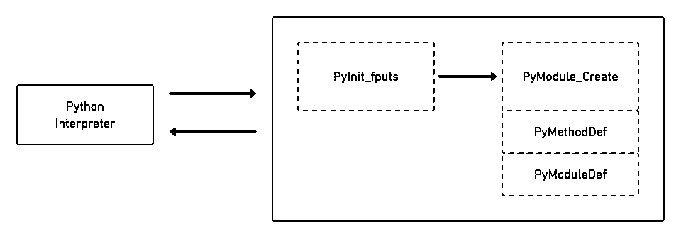
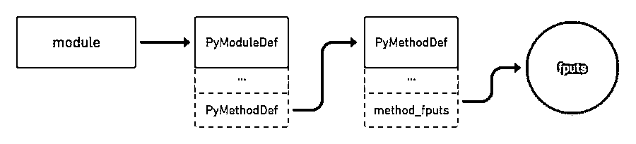

# 构建 Python C 扩展模块

> 原文：<https://realpython.com/build-python-c-extension-module/>

有几种方法可以扩展 Python 的功能。其中之一就是用 [C](https://realpython.com/c-for-python-programmers/) 或者 [C++](https://realpython.com/python-vs-cpp/) 写你的 [Python 模块](https://realpython.com/python-modules-packages/)。这个过程可以提高性能，更好地访问 C 库函数和系统调用。在本教程中，您将了解如何使用 Python API 编写 Python C 扩展模块。

**您将学习如何:**

*   从 Python 内部调用 C 函数
*   从 Python 向 C 传递参数，并相应地解析它们
*   从 C 代码中引发异常，并在 C 中创建自定义 Python 异常
*   在 C 中定义全局常量，并使它们在 Python 中可访问
*   测试、打包和分发您的 Python C 扩展模块

**免费下载:** [从 Python 技巧中获取一个示例章节:这本书](https://realpython.com/bonus/python-tricks-sample-pdf/)用简单的例子向您展示了 Python 的最佳实践，您可以立即应用它来编写更漂亮的+Python 代码。

## 扩展你的 Python 程序

Python 的一个鲜为人知但非常强大的特性是它能够调用用 C 或 C++等编译语言定义的函数和库。这允许您将程序的功能扩展到 Python 的内置特性之外。

有许多语言可供选择来扩展 Python 的功能。那么，为什么要用 C 呢？以下是您可能决定构建 Python C 扩展模块的几个原因:

1.  **实现新的内置对象类型**:可以用 C 编写一个 Python 类，然后实例化并扩展 Python 本身的类。这样做的原因可能有很多，但更多的时候，性能是驱动开发人员转向 c 的主要原因。这种情况很少见，但知道 Python 可以扩展到什么程度是很好的。

2.  **调用 C 库函数和系统调用**:很多编程语言都提供了最常用的系统调用的接口。尽管如此，可能还有其他较少使用的系统调用只能通过 c 来访问。Python 中的`os`模块就是一个例子。

这并不是一个详尽的列表，但是它给了您在使用 C 或任何其他语言扩展 Python 时可以做什么的要点。

要用 C 语言编写 Python 模块，你需要使用 [Python API](https://docs.python.org/3/c-api/index.html) ，它定义了允许 Python 解释器调用你的 C 代码的各种函数、宏和[变量](https://realpython.com/python-variables/)。所有这些工具和更多的工具都打包在 [`Python.h`头文件](https://docs.python.org/3/c-api/intro.html#include-files)中。

[*Remove ads*](/account/join/)

## 用 C 编写 Python 接口

在本教程中，您将为一个 **C 库函数**编写一个小包装器，然后您将从 Python 中调用它。自己实现一个包装器会让你更好地了解何时以及如何使用 C 来扩展你的 Python 模块。

### 理解`fputs()`

是您将要包装的 C 库函数:

```py
int  fputs(const  char  *,  FILE  *)
```

该函数有两个参数:

1.  **`const char *`** 是一个字符数组。
2.  **`FILE *`** 是一个文件流指针。

`fputs()`将字符数组写入文件流指定的文件，并返回一个非负值。如果操作成功，则该值将表示写入文件的字节数。如果有错误，那么它返回`EOF`。你可以在[手册页条目](http://man7.org/linux/man-pages/man3/puts.3.html)中阅读更多关于这个 C 库函数及其其他变体的信息。

### 编写 C 函数为`fputs()`

这是一个基本的 C 程序，使用`fputs()`将[字符串](https://realpython.com/python-strings/)写入文件流:

```py
#include  <stdio.h> #include  <stdlib.h> #include  <unistd.h> int  main()  { FILE  *fp  =  fopen("write.txt",  "w"); fputs("Real Python!",  fp); fclose(fp); return  1; }
```

这段代码可以总结如下:

1.  **打开**文件`write.txt`。
2.  **将字符串`"Real Python!"`写入**文件。

**注意:**本文中的 C 代码应该构建在大多数系统上。它已经在 GCC 上测试过，没有使用任何特殊的标志。

在下一节中，您将为这个 C 函数编写一个包装器。

### 包装`fputs()`

在解释其工作原理之前看到完整的代码可能有点奇怪。然而，花一点时间检查最终产品将补充您在以下部分的理解。下面的代码块显示了 C 代码的最终包装版本:

```py
 1#include  <Python.h> 2
 3static  PyObject  *method_fputs(PyObject  *self,  PyObject  *args)  { 4  char  *str,  *filename  =  NULL; 5  int  bytes_copied  =  -1; 6
 7  /* Parse arguments */ 8  if(!PyArg_ParseTuple(args,  "ss",  &str,  &filename))  { 9  return  NULL; 10  } 11
12  FILE  *fp  =  fopen(filename,  "w"); 13  bytes_copied  =  fputs(str,  fp); 14  fclose(fp); 15
16  return  PyLong_FromLong(bytes_copied); 17}
```

这段代码引用了三个在`Python.h`中定义的**对象结构**:

1.  `PyObject`
2.  `PyArg_ParseTuple()`
3.  `PyLong_FromLong()`

这些用于 Python 语言的[数据类型](https://realpython.com/python-data-types/)定义。现在，您将逐一了解它们。

#### `PyObject`

`PyObject`是一个对象结构，用于为 Python 定义对象类型。所有 Python 对象共享少量使用`PyObject`结构定义的字段。所有其他对象类型都是这种类型的扩展。

`PyObject`告诉 Python 解释器将指向一个对象的[指针](https://realpython.com/pointers-in-python/)视为一个对象。例如，将上述函数的返回类型设置为`PyObject`定义了 Python 解释器所需的公共字段，以便将其识别为有效的 Python 类型。

再看一下 C 代码的前几行:

```py
 1static  PyObject  *method_fputs(PyObject  *self,  PyObject  *args)  { 2  char  *str,  *filename  =  NULL;  3  int  bytes_copied  =  -1; 4
 5  /* Snip */
```

在第 2 行，声明希望从 Python 代码中接收的参数类型:

1.  **`char *str`** 是你要写入文件流的字符串。
2.  **`char *filename`** 是要写入的文件的名称。

#### PyArg_ParseTuple()

`PyArg_ParseTuple()`将从 Python 程序接收的参数解析成局部变量:

```py
 1static  PyObject  *method_fputs(PyObject  *self,  PyObject  *args)  { 2  char  *str,  *filename  =  NULL; 3  int  bytes_copied  =  -1; 4
 5  /* Parse arguments */  6  if(!PyArg_ParseTuple(args,  "ss",  &str,  &filename))  {  7  return  NULL;  8  }  9
10  /* Snip */
```

如果你看第 6 行，你会看到`PyArg_ParseTuple()`有以下参数:

*   **`args`** 属于`PyObject`类型。

*   **`"ss"`** 是指定要解析的参数的数据类型的格式说明符。(你可以查看[官方文档](https://docs.python.org/3/c-api/arg.html)以获得完整参考。)

*   **`&str`和`&filename`** 是指向局部变量的指针，解析后的值将被分配给这些变量。

失败时，`PyArg_ParseTuple()`评估为`false`。如果失败，那么函数将返回`NULL`并且不再继续。

#### `fputs()`

正如您之前看到的，`fputs()`有两个参数，其中一个是`FILE *`对象。因为您不能使用 C 中的 Python API 解析 Python `textIOwrapper`对象，所以您必须使用一种变通方法:

```py
 1static  PyObject  *method_fputs(PyObject  *self,  PyObject  *args)  { 2  char  *str,  *filename  =  NULL; 3  int  bytes_copied  =  -1; 4
 5  /* Parse arguments */ 6  if(!PyArg_ParseTuple(args,  "ss",  &str,  &filename))  { 7  return  NULL; 8  } 9
10  FILE  *fp  =  fopen(filename,  "w");  11  bytes_copied  =  fputs(str,  fp);  12  fclose(fp);  13
14  return  PyLong_FromLong(bytes_copied); 15}
```

下面是这段代码的详细内容:

*   **在第 10 行，**你正在传递你将用来创建一个`FILE *`对象的文件名，并把它传递给函数。
*   **在第 11 行，**你用下面的参数调用`fputs()`:
    *   **`str`** 是你要写入文件的字符串。
    *   **`fp`** 是您在第 10 行定义的`FILE *`对象。

然后将`fputs()`的返回值存储在`bytes_copied`中。这个整数变量将被返回给 Python 解释器中的`fputs()`调用。

#### `PyLong_FromLong(bytes_copied)`

`PyLong_FromLong()`返回一个`PyLongObject`，在 Python 中表示整数对象。您可以在 C 代码的最末尾找到它:

```py
 1static  PyObject  *method_fputs(PyObject  *self,  PyObject  *args)  { 2  char  *str,  *filename  =  NULL; 3  int  bytes_copied  =  -1; 4
 5  /* Parse arguments */ 6  if(!PyArg_ParseTuple(args,  "ss",  &str,  &filename))  { 7  return  NULL; 8  } 9
10  FILE  *fp  =  fopen(filename,  "w"); 11  bytes_copied  =  fputs(str,  fp); 12  fclose(fp); 13
14  return  PyLong_FromLong(bytes_copied);  15}
```

第 14 行为`bytes_copied`生成一个`PyLongObject`，这是在 Python 中调用函数时返回的变量。你必须从你的 Python C 扩展模块返回一个`PyObject*`给 Python 解释器。

[*Remove ads*](/account/join/)

### 编写初始化函数

您已经编写了构成 Python C 扩展模块核心功能的代码。但是，仍然有一些额外的函数是启动和运行您的模块所必需的。您需要编写模块及其包含的方法的定义，如下所示:

```py
static  PyMethodDef  FputsMethods[]  =  { {"fputs",  method_fputs,  METH_VARARGS,  "Python interface for fputs C library function"}, {NULL,  NULL,  0,  NULL} }; static  struct  PyModuleDef  fputsmodule  =  { PyModuleDef_HEAD_INIT, "fputs", "Python interface for the fputs C library function", -1, FputsMethods };
```

这些函数包括 Python 解释器将使用的模块的元信息。让我们浏览一下上面的每个结构，看看它们是如何工作的。

#### `PyMethodDef`

为了调用在你的模块中定义的方法，你需要首先告诉 Python 解释器它们。为此，可以使用`PyMethodDef`。这是一个有 4 个成员的结构，代表模块中的一个方法。

理想情况下，在您的 Python C 扩展模块中会有不止一个您希望可以从 Python 解释器中调用的方法。这就是为什么您需要定义一组`PyMethodDef`结构:

```py
static  PyMethodDef  FputsMethods[]  =  { {"fputs",  method_fputs,  METH_VARARGS,  "Python interface for fputs C library function"},   {NULL,  NULL,  0,  NULL} };
```

该结构的每个成员都包含以下信息:

*   **`"fputs"`** 是用户为了调用这个特定功能而写的名字。

*   **`method_fputs`** 是要调用的 C 函数的名称。

*   **`METH_VARARGS`** 是一个标志，告诉解释器该函数将接受两个`PyObject*`类型的参数:

    1.  **`self`** 是模块对象。
    2.  **`args`** 是一个包含函数实际参数的元组。如前所述，这些参数是使用`PyArg_ParseTuple()`解包的。

*   **最后一个字符串**是表示方法 [docstring](https://realpython.com/documenting-python-code/#documenting-your-python-code-base-using-docstrings) 的值。

#### `PyModuleDef`

正如`PyMethodDef`保存关于 Python C 扩展模块中方法的信息一样，`PyModuleDef`结构保存关于模块本身的信息。它不是结构的数组，而是用于模块定义的单个结构:

```py
static  struct  PyModuleDef  fputsmodule  =  { PyModuleDef_HEAD_INIT, "fputs", "Python interface for the fputs C library function", -1, FputsMethods };
```

此结构中共有 9 个成员，但并非所有成员都是必需的。在上面的代码块中，您初始化了以下五个:

1.  **`PyModuleDef_HEAD_INIT`** 是类型`PyModuleDef_Base`的成员，建议只有这一个值。

2.  **`"fputs"`** 是你的 Python C 扩展模块的名字。

3.  **字符串**是代表你的模块 docstring 的值。您可以使用`NULL`没有 docstring，或者您可以通过传递一个`const char *`来指定一个 docstring，如上面的代码片段所示。它属于`Py_ssize_t`类型。您还可以使用`PyDoc_STRVAR()`为您的模块定义一个 docstring。

4.  **`-1`** 是存储你的程序状态所需的内存量。当您的模块在多个子解释器中使用时，这很有帮助，它可以有以下值:

    *   负值表示这个模块不支持子解释器。
    *   **非负值**启用模块的重新初始化。它还指定了要在每个子解释器会话上分配的模块的内存需求。
        T3】
5.  **`FputsMethods`** 是指你的方法表。这是您之前定义的`PyMethodDef`结构的数组。

有关更多信息，请查看关于 [`PyModuleDef`](https://docs.python.org/3/c-api/module.html#c.PyModuleDef) 的官方 Python 文档。

#### `PyMODINIT_FUNC`

现在您已经定义了 Python C 扩展模块和方法结构，是时候使用它们了。当 Python 程序第一次导入你的模块时，它会调用`PyInit_fputs()`:

```py
PyMODINIT_FUNC  PyInit_fputs(void)  { return  PyModule_Create(&fputsmodule); }
```

`PyMODINIT_FUNC`当被声明为函数返回类型时，隐含地做 3 件事:

1.  它隐式设置函数的返回类型为`PyObject*`。
2.  它声明任何特殊的链接。
3.  它将函数声明为 extern“C”。如果您使用 C++，它会告诉 C++编译器不要对符号进行名称管理。

`PyModule_Create()`将返回一个类型为`PyObject *`的新模块对象。对于参数，您将传递您之前已经定义的方法结构的地址，`fputsmodule`。

**注意:**在 Python 3 中，你的 init 函数必须返回一个`PyObject *`类型。然而，如果您使用 Python 2，那么`PyMODINIT_FUNC`将函数返回类型声明为`void`。

[*Remove ads*](/account/join/)

### 将所有这些放在一起

现在，您已经编写了 Python C 扩展模块的必要部分，让我们后退一步，看看它们是如何组合在一起的。下图显示了模块的组件以及它们如何与 Python 解释器交互:

[](https://files.realpython.com/media/extending_python_img_1.e051c66d92df.png)

当您导入 Python C 扩展模块时，`PyInit_fputs()`是第一个被调用的方法。然而，在将引用返回给 Python 解释器之前，该函数会对`PyModule_Create()`进行后续调用。这将初始化结构`PyModuleDef`和`PyMethodDef`，它们保存了关于你的模块的元信息。准备好它们是有意义的，因为您将在 init 函数中使用它们。

一旦完成，对模块对象的引用最终返回给 Python 解释器。下图显示了模块的内部流程:

[](https://files.realpython.com/media/extending_python_module_flow.56b70f52214c.png)

由`PyModule_Create()`返回的模块对象有一个对模块结构`PyModuleDef`的引用，模块结构又有一个对方法表`PyMethodDef`的引用。当您调用 Python C 扩展模块中定义的方法时，Python 解释器使用模块对象及其携带的所有引用来执行特定的方法。(虽然这并不完全是 Python 解释器在幕后处理事情的方式，但它会让您了解它是如何工作的。)

同样，您可以访问模块的各种其他方法和属性，如模块 docstring 或方法 docstring。这些是在它们各自的结构中定义的。

现在您已经知道当您从 Python 解释器调用`fputs()`时会发生什么了。解释器使用你的模块对象以及模块和方法引用来调用方法。最后，让我们看看解释器如何处理 Python C 扩展模块的实际执行:

[](https://files.realpython.com/media/extending_python_high_level_flow.09d2f884e3ad.png)

一旦`method_fputs()`被调用，程序执行以下步骤:

1.  用`PyArg_ParseTuple()`解析您从 Python 解释器传递的参数
2.  将这些参数传递给构成模块核心的 C 库函数`fputs()`
3.  使用`PyLong_FromLong`返回来自`fputs()`的值

要查看代码中的这些相同步骤，再看一下`method_fputs()`:

```py
 1static  PyObject  *method_fputs(PyObject  *self,  PyObject  *args)  { 2  char  *str,  *filename  =  NULL; 3  int  bytes_copied  =  -1; 4
 5  /* Parse arguments */ 6  if(!PyArg_ParseTuple(args,  "ss",  &str,  &filename))  { 7  return  NULL; 8  } 9
10  FILE  *fp  =  fopen(filename,  "w"); 11  bytes_copied  =  fputs(str,  fp); 12  fclose(fp); 13
14  return  PyLong_FromLong(bytes_copied); 15}
```

概括地说，您的方法将解析传递给模块的参数，将它们发送给`fputs()`，并返回结果。

## 打包您的 Python C 扩展模块

在导入新模块之前，首先需要构建它。您可以通过使用 Python 包`distutils`来实现这一点。

你需要一个名为`setup.py`的文件来安装你的应用程序。对于本教程，您将关注 Python C 扩展模块特有的部分。对于完整的初级读本，请查看[如何向 PyPI](https://realpython.com/pypi-publish-python-package/) 发布开源 Python 包。

您的模块的最小`setup.py`文件应该如下所示:

```py
from distutils.core import setup, Extension

def main():
    setup(name="fputs",
          version="1.0.0",
          description="Python interface for the fputs C library function",
          author="<your name>",
          author_email="your_email@gmail.com",
          ext_modules=[Extension("fputs", ["fputsmodule.c"])])

if __name__ == "__main__":
    main()
```

上面的代码块显示了传递给`setup()`的标准参数。仔细看看最后一个位置参数，`ext_modules`。这需要一个`Extensions`类的对象列表。`Extensions`类的对象描述了安装脚本中的单个 C 或 C++扩展模块。这里，您将两个关键字参数传递给它的构造函数，即:

*   **`name`** 是模块的名称。
*   **`[filename]`** 是源代码文件的路径列表，相对于安装脚本。

[*Remove ads*](/account/join/)

### 构建您的模块

既然已经有了`setup.py`文件，就可以用它来构建 Python C 扩展模块了。强烈建议您使用[虚拟环境](https://realpython.com/python-virtual-environments-a-primer/)来避免与您的 Python 环境冲突。

导航到包含`setup.py`的目录并运行以下命令:

```py
$ python3 setup.py install
```

这个命令将在当前目录中编译并安装 Python C 扩展模块。如果有任何错误或警告，那么你的程序将抛出它们。确保在尝试导入模块之前修复这些问题。

默认情况下，Python 解释器使用`clang`来编译 C 代码。如果您想使用`gcc`或任何其他 C 编译器来完成这项工作，那么您需要相应地设置`CC`环境变量，要么在设置脚本中，要么直接在命令行中。例如，您可以告诉 Python 解释器使用`gcc`以这种方式编译和构建您的模块:

```py
$ CC=gcc python3 setup.py install
```

然而，如果`clang`不可用，Python 解释器将自动退回到`gcc`。

### 运行您的模块

现在一切都准备好了，是时候看看您的模块的运行情况了！一旦成功构建，启动解释器来测试运行 Python C 扩展模块:

>>>

```py
>>> import fputs
>>> fputs.__doc__
'Python interface for the fputs C library function'
>>> fputs.__name__
'fputs'
>>> # Write to an empty file named `write.txt`
>>> fputs.fputs("Real Python!", "write.txt")
13
>>> with open("write.txt", "r") as f:
>>>     print(f.read())
'Real Python!'
```

您的函数按预期执行！你传递一个字符串`"Real Python!"`和一个文件来写这个字符串，`write.txt`。对`fputs()`的调用返回写入文件的字节数。您可以通过打印文件内容来验证这一点。

还记得您是如何将某些参数传递给`PyModuleDef`和`PyMethodDef`结构的。从这个输出中可以看到，Python 使用这些结构来分配函数名和文档字符串等内容。

至此，您已经有了模块的基本版本，但是您还可以做更多的事情！您可以通过添加自定义异常和常量来改进您的模块。

## 引发异常

Python 异常与 C++异常非常不同。如果您想从 C 扩展模块中引发 Python 异常，那么您可以使用 Python API 来实现。Python API 为异常引发提供的一些函数如下:

| 功能 | 描述 |
| --- | --- |
| `PyErr_SetString(PyObject *type,`
T1】 | 接受两个参数:指定异常类型的类型参数和显示给用户的定制消息 |
| `PyErr_Format(PyObject *type,`
T1】 | 接受两个参数:一个指定异常类型的`PyObject *`类型参数，以及一个显示给用户的格式化定制消息 |
| `PyErr_SetObject(PyObject *type,`
T1】 | 接受两个类型都为`PyObject *`的参数:第一个指定异常的类型，第二个将任意 Python 对象设置为异常值 |

您可以使用其中任何一个来引发异常。但是，使用哪一种以及何时使用完全取决于您的需求。Python API 将所有的[标准异常](https://docs.python.org/3.7/c-api/exceptions.html#standard-exceptions)预定义为`PyObject`类型。

### 从 C 代码中引发异常

虽然您不能在 C 中引发异常，但是 Python API 将允许您从 Python C 扩展模块中引发异常。让我们通过在代码中添加`PyErr_SetString()`来测试这个功能。每当要写入的字符串长度小于 10 个字符时，这将引发异常:

```py
 1static  PyObject  *method_fputs(PyObject  *self,  PyObject  *args)  { 2  char  *str,  *filename  =  NULL; 3  int  bytes_copied  =  -1; 4
 5  /* Parse arguments */ 6  if(!PyArg_ParseTuple(args,  "ss",  &str,  &fd))  { 7  return  NULL; 8  } 9
10  if  (strlen(str)  <  10)  {  11  PyErr_SetString(PyExc_ValueError,  "String length must be greater than 10");  12  return  NULL;  13  }  14
15  fp  =  fopen(filename,  "w"); 16  bytes_copied  =  fputs(str,  fp); 17  fclose(fp); 18
19  return  PyLong_FromLong(bytes_copied); 20}
```

在这里，您在解析参数之后和调用`fputs()`之前立即检查输入字符串的长度。如果用户传递的字符串少于 10 个字符，那么您的程序将发出一个带有自定义消息的`ValueError`。一旦出现异常，程序执行就会停止。

注意`method_fputs()`在引发异常后如何返回`NULL`。这是因为每当您使用`PyErr_*()`引发异常时，它会自动在异常表中设置一个内部条目并返回它。不要求调用函数随后再次设置该条目。因此，调用函数返回一个指示失败的值，通常是`NULL`或`-1`。(这也应该解释了为什么在使用`PyArg_ParseTuple()`解析`method_fputs()`中的参数时需要返回`NULL`。)

[*Remove ads*](/account/join/)

### 引发自定义异常

您还可以在 Python C 扩展模块中引发自定义异常。然而，事情有点不同。以前，在`PyMODINIT_FUNC`中，你只是简单地返回由`PyModule_Create`返回的实例，然后就结束了。但是为了让模块的用户可以访问您的自定义异常，您需要在返回它之前将您的自定义异常添加到模块实例中:

```py
static  PyObject  *StringTooShortError  =  NULL; PyMODINIT_FUNC  PyInit_fputs(void)  { /* Assign module value */ PyObject  *module  =  PyModule_Create(&fputsmodule); /* Initialize new exception object */ StringTooShortError  =  PyErr_NewException("fputs.StringTooShortError",  NULL,  NULL); /* Add exception object to your module */ PyModule_AddObject(module,  "StringTooShortError",  StringTooShortError); return  module; }
```

和前面一样，首先创建一个模块对象。然后使用`PyErr_NewException`创建一个新的异常对象。这将采用一个形式为`module.classname`的字符串作为您希望创建的异常类的名称。选择一些描述性的东西，让用户更容易理解到底出了什么问题。

接下来，使用`PyModule_AddObject`将它添加到模块对象中。这将您的模块对象、正在添加的新对象的名称以及自定义异常对象本身作为参数。最后，您返回您的模块对象。

现在，您已经为您的模块定义了一个要引发的定制异常，您需要更新`method_fputs()`以便它引发适当的异常:

```py
 1static  PyObject  *method_fputs(PyObject  *self,  PyObject  *args)  { 2  char  *str,  *filename  =  NULL; 3  int  bytes_copied  =  -1; 4
 5  /* Parse arguments */ 6  if(!PyArg_ParseTuple(args,  "ss",  &str,  &fd))  { 7  return  NULL; 8  } 9
10  if  (strlen(str)  <  10)  { 11  /* Passing custom exception */  12  PyErr_SetString(StringTooShortError,  "String length must be greater than 10");  13  return  NULL; 14  } 15
16  fp  =  fopen(filename,  "w"); 17  bytes_copied  =  fputs(str,  fp); 18  fclose(fp); 19
20  return  PyLong_FromLong(bytes_copied); 21}
```

使用新的更改生成模块后，您可以通过尝试编写长度小于 10 个字符的字符串来测试自定义异常是否按预期工作:

>>>

```py
>>> import fputs
>>> # Custom exception
>>> fputs.fputs("RP!", fp.fileno())
Traceback (most recent call last):
  File "<stdin>", line 1, in <module>
fputs.StringTooShortError: String length must be greater than 10
```

当您尝试编写少于 10 个字符的字符串时，您的自定义异常会引发一条解释错误原因的消息。

## 定义常数

有些情况下，您会希望在 Python C 扩展模块中使用或定义常量。这与您在上一节中定义自定义异常的方式非常相似。您可以定义一个新的常量，并使用`PyModule_AddIntConstant()`将其添加到您的模块实例中:

```py
PyMODINIT_FUNC  PyInit_fputs(void)  { /* Assign module value */ PyObject  *module  =  PyModule_Create(&fputsmodule); /* Add int constant by name */  PyModule_AddIntConstant(module,  "FPUTS_FLAG",  64);  
  /* Define int macro */ #define FPUTS_MACRO 256

  /* Add macro to module */ PyModule_AddIntMacro(module,  FPUTS_MACRO); return  module; }
```

此 Python API 函数采用以下参数:

*   你的模块的**实例**
*   常量的**名**
*   常数的**值**

您可以使用`PyModule_AddIntMacro()`对宏进行同样的操作:

```py
PyMODINIT_FUNC  PyInit_fputs(void)  { /* Assign module value */ PyObject  *module  =  PyModule_Create(&fputsmodule); /* Add int constant by name */ PyModule_AddIntConstant(module,  "FPUTS_FLAG",  64); /* Define int macro */  #define FPUTS_MACRO 256 
 /* Add macro to module */  PyModule_AddIntMacro(module,  FPUTS_MACRO);  
  return  module; }
```

该函数采用以下参数:

*   你的模块的**实例**
*   已经定义的宏的**名**

**注意:**如果你想给你的模块添加字符串常量或者宏，那么你可以分别使用`PyModule_AddStringConstant()`和`PyModule_AddStringMacro()`。

打开 Python 解释器，查看您的常量和宏是否按预期工作:

>>>

```py
>>> import fputs
>>> # Constants
>>> fputs.FPUTS_FLAG
64
>>> fputs.FPUTS_MACRO
256
```

在这里，您可以看到这些常量可以从 Python 解释器中访问。

[*Remove ads*](/account/join/)

## 测试您的模块

您可以像测试任何其他 Python 模块一样测试您的 Python C 扩展模块。这可以通过为 [`pytest`](https://realpython.com/pytest-python-testing/) 编写一个小的测试函数来演示:

```py
import fputs

def test_copy_data():
    content_to_copy = "Real Python!"
    bytes_copied = fputs.fputs(content_to_copy, 'test_write.txt')

    with open('test_write.txt', 'r') as f:
        content_copied = f.read()

    assert content_copied == content_to_copy
```

在上面的测试脚本中，您使用`fputs.fputs()`将字符串`"Real Python!"`写入一个名为`test_write.txt`的空文件。然后，你读入这个文件的内容，并使用一个 [`assert`语句](https://realpython.com/python-assert-statement/)将其与你最初写的内容进行比较。

您可以运行这个测试套件来确保您的模块按预期工作:

```py
$ pytest -q
test_fputs.py                                                 [100%]
1 passed in 0.03 seconds
```

要获得更深入的介绍，请查看[Python 测试入门](https://realpython.com/python-testing/)。

## 考虑替代方案

在本教程中，您已经为 C 库函数构建了一个接口，以理解如何编写 Python C 扩展模块。然而，有时您需要做的只是调用一些系统调用或一些 C 库函数，并且您希望避免编写两种不同语言的开销。在这些情况下，可以使用 **`ctypes`** 或者 **`cffi`** 等 Python 库。

这些是 Python 的**外部函数库**，提供对 C 库函数和数据类型的访问。尽管社区本身在哪个图书馆最好的问题上存在分歧，但两者都有各自的优点和缺点。换句话说，对于任何给定的项目来说，这两种方法都是不错的选择，但是当您需要在两者之间做出选择时，需要记住一些事情:

*   Python 标准库中包含了 **`ctypes`** 库。如果你想避免外部依赖，这是非常重要的。它允许你用 Python 为其他语言编写包装器。

*   **`cffi`** 库尚未包含在标准库中。这可能会成为你特定项目的绊脚石。总的来说，它本质上更像[蟒蛇](https://realpython.com/learning-paths/writing-pythonic-code/)，但是它不为你处理预处理。

有关这些库的更多信息，请查看[用 C 库扩展 Python 和“ctypes”模块](https://dbader.org/blog/python-ctypes-tutorial)和[Python 和 C 的接口:CFFI 模块](https://dbader.org/blog/python-cffi)。

**注:**除了`ctypes`和`cffi`之外，还有其他各种工具可用。例如，你也可以使用`swig`和`boost::Py`。

## 结论

在本教程中，你已经学习了如何使用 Python API 用 **C 编程语言**编写一个 **Python 接口**。您为`fputs()` C 库函数编写了一个 Python 包装器。在构建和测试模块之前，您还向模块添加了自定义异常和常量。

**Python API** 为用 C 编程语言编写复杂的 Python 接口提供了许多特性。同时，像`cffi`或`ctypes`这样的库可以降低编写 Python C 扩展模块的开销。确保你在做决定之前权衡了所有的因素！******