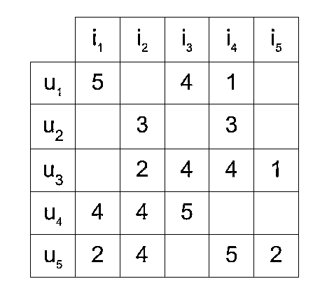
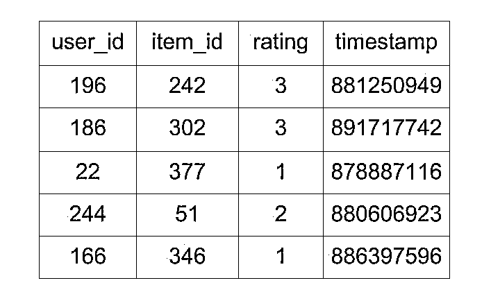
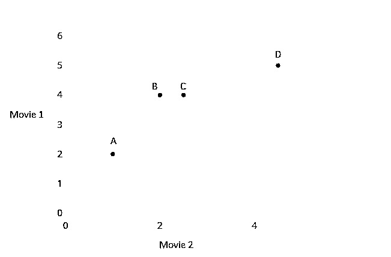
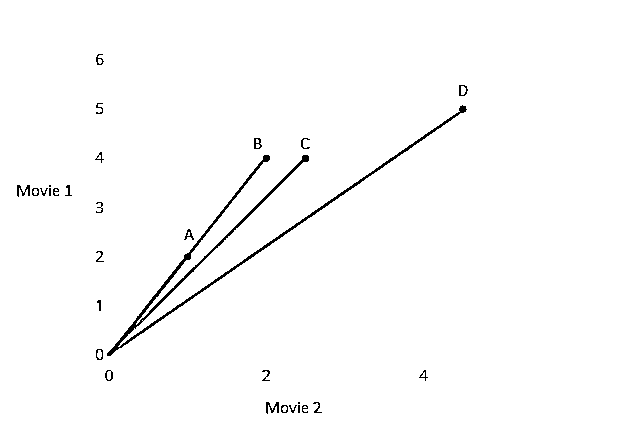
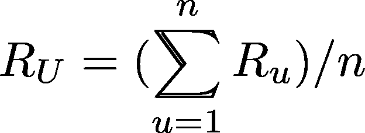
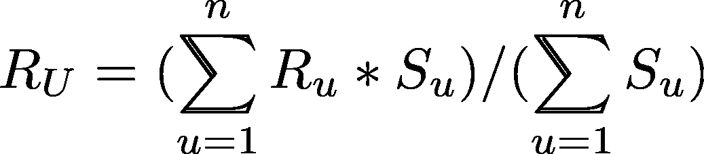
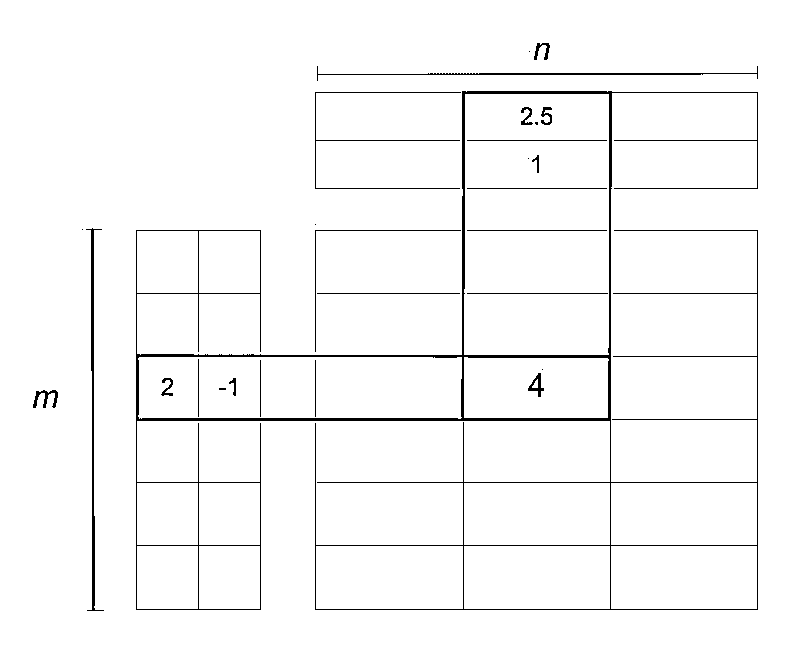

# 使用协同过滤构建推荐引擎

> 原文：<https://realpython.com/build-recommendation-engine-collaborative-filtering/>

协同过滤是构建智能推荐系统时最常用的技术，随着用户信息的收集，该系统可以学习给出更好的推荐。

像亚马逊、YouTube 和网飞这样的大多数网站都使用协同过滤作为他们复杂推荐系统的一部分。您可以使用这种技术来构建推荐器，根据相似用户的好恶向用户提供建议。

在这篇文章中，你将了解到:

*   协同过滤及其类型
*   构建推荐器所需的数据
*   Python 中可用于构建推荐器的库
*   协同过滤的使用案例和挑战

**免费下载:** [从 Python 技巧中获取一个示例章节:这本书](https://realpython.com/bonus/python-tricks-sample-pdf/)用简单的例子向您展示了 Python 的最佳实践，您可以立即应用它来编写更漂亮的+Python 代码。

## 什么是协同过滤？

协同过滤是一种可以根据相似用户的反应过滤出用户可能喜欢的项目的技术。

它的工作原理是搜索一大群人，找到与特定用户口味相似的一小群用户。它会查看他们喜欢的项目，并将它们组合在一起，创建一个经过排序的建议列表。

有许多方法可以确定哪些用户是相似的，并结合他们的选择来创建一个推荐列表。本文将向您展示如何使用 Python 来实现这一点。

[*Remove ads*](/account/join/)

## 数据集

为了试验推荐算法，你需要包含一组项目和一组用户的**数据，这些用户已经对一些项目做出了反应。**

反应可以是**显性**(从 1 到 5 的等级，喜欢或不喜欢)或**隐性**(查看一件商品，将其添加到愿望清单，花在一件商品上的时间)。

在处理这些数据时，您通常会看到一个由一组用户对一组项目中的一些项目的反应组成的**矩阵**。每一行包含用户给出的评级，每一列包含一个项目收到的评级。包含五个用户和五个项目的矩阵可能如下所示:

[](https://files.realpython.com/media/rating-matrix.04153775e4c1.jpg)

<figcaption class="figure-caption text-center">Rating Matrix</figcaption>

该矩阵显示了五个用户，他们用 1 到 5 的等级对一些项目进行了评级。例如，第一用户对第三个项目给出了评级 4。

在大多数情况下，矩阵中的单元格是空的，因为用户只对几个项目进行评分。让每个用户对每个可用的项目进行评价或做出反应是极不可能的。单元格大部分为空的矩阵称为**稀疏矩阵**，与之相反的矩阵(大部分为填充矩阵)称为**稠密矩阵**。

已经收集了许多数据集，并提供给公众用于研究和基准测试。这里有一个高质量数据源的[列表，你可以从中选择。](https://github.com/caserec/Datasets-for-Recommneder-Systems)

最好从 GroupLens Research 收集的 [MovieLens](https://grouplens.org/datasets/movielens/) 数据集开始。特别是， [MovieLens 100k 数据集](https://grouplens.org/datasets/movielens/100k/)是一个稳定的基准数据集，由 943 个用户对 1682 部电影给出了 100，000 个评级，每个用户至少对 20 部电影进行了评级。

这个数据集由许多文件组成，这些文件包含关于电影、用户以及用户对他们所观看的电影的评级的信息。感兴趣的有以下几个:

*   **`u.item` :** 电影列表
*   **`u.data` :** 用户给出的评分列表

包含评级的文件`u.data`是一个制表符分隔的列表，包含用户 ID、项目 ID、评级和时间戳。文件的前几行如下所示:

[](https://files.realpython.com/media/movielens-head.0542b4c067c7.jpg)

<figcaption class="figure-caption text-center">First 5 Rows of MovieLens 100k Data</figcaption>

如上所示，该文件告诉用户对特定电影的评价。该文件包含 100，000 个这样的评级，这些评级将用于预测用户未观看的电影的评级。

## 协同过滤涉及的步骤

要构建一个可以根据其他用户的喜好自动向用户推荐物品的系统，第一步就是找到相似的用户或物品。第二步是预测用户尚未评级的项目的评级。所以，你需要这些问题的答案:

*   如何确定哪些用户或项目彼此相似？
*   假设您知道哪些用户是相似的，那么您如何根据相似用户的评分来确定用户对某个项目的评分呢？
*   你如何衡量你计算的评分的准确性？

前两个问题没有单一答案。协同过滤是一系列算法，其中有多种方法来找到相似的用户或项目，并且有多种方法来基于相似用户的评级来计算评级。根据您所做的选择，您最终会得到一种协作过滤方法。在本文中，您将看到寻找相似性和预测评分的各种方法。

要记住的一件重要事情是，在纯粹基于协作过滤的方法中，相似性不是使用诸如用户年龄、电影类型或任何其他关于用户或项目的数据等因素来计算的。它只根据用户对某个项目的评分(显性或隐性)来计算。例如，尽管两个用户的年龄相差很大，但是如果他们对十部电影给出相同的评级，则可以认为他们是相似的。

第三个问题是如何衡量你的预测的准确性，这个问题也有多个答案，其中包括可以在许多地方使用的误差计算技术，而不仅仅是基于协同过滤的推荐器。

衡量结果准确性的一种方法是均方根误差(RMSE ),在这种方法中，您可以预测评分值已知的用户-项目对测试数据集的评分。已知值和预测值之间的差异就是误差。对测试集的所有误差值求平方，找到平均值，然后求该平均值的平方根，得到 RMSE。

另一个测量精度的指标是平均绝对误差(MAE ),通过找出误差的绝对值,然后取所有误差值的平均值，就可以得到误差的大小。

在这一点上，您不需要担心 RMSE 或梅的细节，因为它们是 Python 中各种包的一部分，您将在本文后面看到它们。

现在让我们看看协同过滤家族中不同类型的算法。

[*Remove ads*](/account/join/)

## 基于内存的

第一类包括基于记忆的算法，其中[统计技术](https://realpython.com/python-statistics/)应用于整个数据集来计算预测。

为了找到用户 **U** 将给予项目 **I** 的评级 **R** ，该方法包括:

*   找到与对项目 **I** 评分的 **U** 相似的用户
*   基于上一步中找到的用户评级计算评级 **R**

在接下来的部分中，您将会看到它们中的每一个。

### 如何在评分的基础上找到相似用户

为了理解相似性的概念，让我们首先创建一个简单的数据集。

数据包括四个用户 **A** 、 **B** 、 **C** 、 **D** ，他们对两部电影进行了评分。分级存储在[列表](https://realpython.com/python-lists-tuples/)中，每个列表包含两个数字来表示每部电影的分级:

*   **A** 的评分是`[1.0, 2.0]`。
*   **B** 的评分是`[2.0, 4.0]`。
*   **C** 的评分是`[2.5, 4.0]`。
*   由 **D** 给出的评分是`[4.5, 5.0]`。

从视觉线索开始，将用户给出的两部电影的评分标绘在图上，并寻找一种模式。图表看起来像这样:

[](https://files.realpython.com/media/euclidean-distance.74e8c9d0be22.jpg)

在上图中，每个点代表一个用户，并根据他们对两部电影的评分来绘制。

看点与点之间的距离似乎是估计相似度的好方法，对吗？您可以使用两点之间的欧几里德距离公式来计算距离。您可以使用 [`scipy`](https://realpython.com/python-scipy-cluster-optimize/) 中的功能，如下图所示:

>>>

```py
>>> from scipy import spatial

>>> a = [1, 2]
>>> b = [2, 4]
>>> c = [2.5, 4]
>>> d = [4.5, 5]

>>> spatial.distance.euclidean(c, a)
2.5
>>> spatial.distance.euclidean(c, b)
0.5
>>> spatial.distance.euclidean(c, d)
2.23606797749979
```

如上图，可以用`scipy.spatial.distance.euclidean`计算两点之间的距离。用它来计算 **A** 、 **B** 、 **D** 与 **C** 的评分之间的距离可以看出，就距离而言， **C** 的评分最接近 **B** 的评分。

你可以看到用户 **C** 与 **B** 最接近，即使是通过查看图表。但是在 **A** 和 **D** 之外，谁和 **C** 更接近呢？

就距离而言，你可以说 **C** 更接近 **D** 。但是看一下排名，似乎 **C** 的选择更倾向于 **A** 而不是 **D** 因为 **A** 和 **C** 喜欢第二部电影的程度几乎是他们喜欢第一部电影的两倍，但是 **D** 对两部电影的喜欢程度是一样的。

那么，你能用什么来识别欧几里德距离不能识别的模式呢？连接点到原点的线之间的角度可以用来做决定吗？您可以查看连接图形原点和相应点的直线之间的角度，如下所示:

[](https://files.realpython.com/media/cosine-similarity.76bcd5413eb8.jpg)

该图显示了将每个点连接到原点的四条线。 **A** 和 **B** 的直线重合，使它们之间的角度为零。

你可以考虑一下，如果线与线之间的角度增大，那么相似度降低，如果角度为零，那么用户非常相似。

要使用角度来计算相似性，您需要一个函数来返回较低角度的**较高相似性**或**较小距离**，以及较高角度的**较低相似性**或**较大距离**。角度的余弦是一个函数，随着角度从 0°增加到 180°，余弦值从 1 减小到-1。

你可以用角度的余弦来找出两个用户的相似度。角度越高，余弦越低，因此用户的相似度越低。您还可以求角度余弦值的倒数，从 1 中减去该值，得到用户之间的余弦距离。

`scipy`具有计算矢量的**余弦距离**的功能。对于更大的角度，它返回更大的值:

>>>

```py
>>> from scipy import spatial
>>> a = [1, 2]
>>> b = [2, 4]
>>> c = [2.5, 4]
>>> d = [4.5, 5]

>>> spatial.distance.cosine(c,a)
0.004504527406047898

>>> spatial.distance.cosine(c,b)
0.004504527406047898

>>> spatial.distance.cosine(c,d)
0.015137225946083022

>>> spatial.distance.cosine(a,b)
0.0
```

矢量 **C** 和 **A** 之间的较小角度给出了较小的余弦距离值。如果你想以这种方式排列用户相似度，使用余弦距离。

**注:**上例中只考虑了两部电影，这样更容易将评分向量二维可视化。这样做只是为了便于解释。

具有多个项目的真实用例在评定向量中会涉及更多的维度。你可能也想进入余弦相似度的数学领域。

注意，用户 **A** 和 **B** 在余弦相似性度量中被认为是绝对相似的，尽管具有不同的评级。这在现实世界中其实是很常见的，像用户 **A** 这样的用户就是你所谓的**强硬评分者**。一个例子是一个电影评论家，他给出的评分总是低于平均水平，但他们列表中的项目的排名与平均评分者的排名相似，如。

要考虑到这些个人用户的偏好，你需要通过消除他们的偏见，让所有的用户达到相同的水平。您可以通过从该用户对每个项目的评分中减去该用户对所有项目的平均评分来实现这一点。下面是它的样子:

*   对于用户 **A** ，评价向量`[1, 2]`具有平均值`1.5`。从每个评分中减去`1.5`会得到向量`[-0.5, 0.5]`。
*   对于用户 **B** ，评分向量`[2, 4]`具有平均值`3`。从每个评分中减去`3`会得到向量`[-1, 1]`。

通过这样做，您已经将每个用户给出的平均评分值更改为 0。试着对用户 **C** 和 **D** 做同样的事情，你会看到评级现在被调整为所有用户的平均值为 0，这使他们处于相同的水平，并消除了他们的偏见。

调整后的向量之间的夹角余弦称为**中心余弦**。这种方法通常用在向量中有很多缺失值的时候，你需要放置一个公共值来填充缺失值。

用[随机值](https://realpython.com/python-random/)填充评级矩阵中缺失的值可能会导致不准确。填充缺失值的一个很好的选择可以是每个用户的平均评级，但是用户 **A** 和 **B** 的原始平均值分别是`1.5`和`3`，用`1.5`填充 **A** 的所有空值以及用`3`填充 **B** 的所有空值将使他们成为不同的用户。

但是在调整值之后，两个用户的以**为中心的**平均值为`0`，这允许您更准确地捕捉项目高于或低于两个用户平均值的想法，其中两个用户向量中所有缺失的值都具有相同的值`0`。

欧几里德距离和余弦相似性是可以用来查找彼此相似的用户甚至是彼此相似的项目的一些方法。(上面使用的函数计算余弦距离。要计算余弦相似度，从 1 中减去距离。)

**注:**中心余弦的公式与皮尔逊相关系数的公式相同。你会发现推荐器上很多资源和库都把中心余弦的实现称为皮尔逊相关。

[*Remove ads*](/account/join/)

### 如何计算收视率

在你确定了一个类似于用户 **U** 的用户列表后，你需要计算 **U** 会给某个项目 **I** 的评分 **R** 。同样，就像相似性一样，你可以通过多种方式来实现。

你可以预测一个用户对一个物品 **I** 的评分 **R** 将会接近与 **U** 最相似的前 5 或前 10 名用户给予 **I** 的评分的平均值。由 *n* 用户给出的平均评分的数学公式如下:

[](https://files.realpython.com/media/average_rating.73cdfc1d58c4.png)

这个公式表明， *n* 个相似用户给出的平均评分等于他们给出的评分之和除以相似用户数，即为 *n* 。

会有这样的情况，你找到的 *n* 个相似用户与目标用户 **U** 不完全相似。他们中的前 3 名可能非常相似，其余的可能不像前 3 名那样与 **U** 相似。在这种情况下，您可以考虑一种方法，其中最相似用户的评级比第二相似用户更重要，依此类推。加权平均可以帮助我们实现这一目标。

在加权平均方法中，您将每个评级乘以一个相似性因子(它表明用户有多相似)。通过乘以相似性因子，您可以为评级增加权重。权重越大，评级就越重要。

充当权重的相似性因子应该是上面讨论的距离的倒数，因为距离越小意味着相似性越高。例如，您可以从 1 中减去余弦距离来获得余弦相似度。

利用与目标用户 **U** 相似的每个用户的相似性因子 **S** ，可以使用以下公式计算加权平均值:

[](https://files.realpython.com/media/weighted_rating.06ba3ea506b6.png)

在上面的公式中，每个评级都乘以给出该评级的用户的相似性因子。用户 **U** 的最终预测评级将等于加权评级的总和除以权重的总和。

**注意:**如果你想知道为什么加权评分的总和除以权重的总和，而不是除以 *n* ，考虑一下这个:在之前的平均值公式中，你除以 *n* ，权重的值是 1。

在求平均值时，分母总是权重之和，在正常平均值的情况下，权重为 1 意味着分母等于 *n* 。

使用加权平均，您可以按照相似性的顺序更多地考虑相似用户的评级。

现在，你知道如何找到相似的用户，以及如何根据他们的评分计算评分。还有一种协同过滤，通过找到彼此相似的项目而不是用户并计算评分来预测评分。您将在下一节中读到这种变化。

### 基于用户与基于项目的协同过滤

上面解释的例子中的技术被称为基于用户或用户-用户协同过滤，其中评级矩阵被用于基于用户给出的评级来寻找相似的用户。如果你使用评分矩阵根据用户给他们的评分来寻找相似的项目，那么这种方法就叫做基于项目或项目-项目协同过滤。

这两种方法在数学上非常相似，但在概念上有所不同。以下是两者的对比:

*   **基于用户:**对于一个用户 **U** ，基于给定的物品评分组成的评分向量确定一组相似用户，通过从相似度列表中挑出 N 个已经对物品 **I** 进行了评分的用户，并基于这 N 个评分计算出该物品 **I** 的评分。

*   **基于条目:**对于一个条目 **I** ，基于接收到的用户评分组成的评分向量确定一组相似条目，通过从相似列表中挑选出 N 个已经被 **U** 评分的条目，并基于这 N 个评分计算出评分，从而得到一个尚未对其进行评分的用户 **U** 的评分。

基于项目的协同过滤是由亚马逊开发的。在用户多于项目的系统中，基于项目的过滤比基于用户的过滤更快更稳定。这是有效的，因为通常情况下，一个项目收到的平均评分不会像用户对不同项目给出的平均评分那样快速变化。众所周知，当评分矩阵稀疏时，它比基于用户的方法执行得更好。

虽然，基于项目的方法对于具有浏览或娱乐相关项目(如电影镜头)的数据集表现不佳，其中它给出的推荐对于目标用户来说似乎非常明显。这种数据集使用矩阵分解技术会得到更好的结果，您将在下一节中看到，或者使用混合推荐器，它也通过使用[基于内容的过滤](https://en.wikipedia.org/wiki/Recommender_system#Content-based_filtering)来考虑数据的内容，如流派。

你可以使用库 [Surprise](https://github.com/NicolasHug/Surprise) 快速试验不同的推荐算法。(您将在本文的后面看到更多关于这方面的内容。)

[*Remove ads*](/account/join/)

## 基于模型

第二类包括基于模型的方法，包括减少或压缩大而稀疏的用户项目矩阵的步骤。对于理解这一步，对降维的基本理解会很有帮助。

### 维度缩减

在用户-项目矩阵中，有两个维度:

1.  用户数量
2.  项目的数量

如果矩阵大部分是空的，则降低维数可以在空间和时间方面提高算法的性能。您可以使用各种方法，如矩阵分解或自动编码器来做到这一点。

**矩阵分解**可以看作是将一个大矩阵分解成多个小矩阵的乘积。这类似于整数的因式分解，其中`12`可以写成`6 x 2`或`4 x 3`。在矩阵的情况下，一个维数为`m x n`的矩阵 **A** 可以简化为两个维数分别为`m x p`和`p x n`的矩阵 **X** 和 **Y** 的乘积。

**注:**在矩阵乘法中，一个矩阵 **X** 只有在 **X** 中的列数等于 **Y** 中的行数时，才能乘以 **Y** 。因此，两个简化的矩阵具有共同的维数 **p** 。

根据用于维数缩减的算法，缩减矩阵的数量也可以多于两个。

简化的矩阵实际上分别代表用户和项目。第一个矩阵中的 **m** 行代表 **m** 用户，而 **p** 列告诉您用户的特征或特性。具有 **n** 个项目和 **p** 个特性的项目矩阵也是如此。下面是矩阵分解的一个例子:

[](https://files.realpython.com/media/dimensionality-reduction.f8686dd52b9c.jpg)

<figcaption class="figure-caption text-center">Matrix Factorization</figcaption>

在上图中，矩阵被简化为两个矩阵。左边的是有 *m* 个用户的用户矩阵，上面的是有 *n* 个条目的条目矩阵。评级`4`被降低或分解为:

1.  用户向量`(2, -1)`
2.  一个项目向量`(2.5, 1)`

用户矩阵中的两列和项目矩阵中的两行被称为潜在因素，并且是关于用户或项目的隐藏特征的指示。因子分解的一种可能解释如下:

*   假设在一个用户向量`(u, v)`中，`u`代表用户有多喜欢恐怖片，而`v`代表他们有多喜欢言情片。

*   因此，用户向量`(2, -1)`表示喜欢恐怖电影并对其进行正面评价，不喜欢浪漫电影并对其进行负面评价的用户。

*   假设在一个项目向量`(i, j)`中，`i`表示一部电影属于恐怖片的程度，`j`表示该电影属于言情片的程度。

*   电影`(2.5, 1)`的恐怖等级为`2.5`，浪漫等级为`1`。使用矩阵乘法规则将其乘以用户向量得到`(2 * 2.5) + (-1 * 1) = 4`。

*   所以，这部电影属于恐怖片类型，用户本来可以给它评分`5`，但是稍微包含了浪漫的成分导致最终评分降到了`4`。

因素矩阵可以提供关于用户和项目的这种洞察力，但是实际上它们通常比上面给出的解释复杂得多。这些因素的数量可以是从一个到数百个甚至数千个。这个数字是模型训练过程中需要优化的东西之一。

在这个例子中，你有两个电影类型的潜在因素，但是在真实的场景中，这些潜在因素不需要太多的分析。这些是数据中的模式，无论你是否理解它们的潜在含义，它们都会自动发挥作用。

潜在因素的数量以这样的方式影响推荐，其中因素的数量越多，推荐变得越个性化。但是太多的因素会导致模型中的过度拟合。

**注意:** **过度拟合**发生在模型训练得太适合训练数据，以至于在新数据下表现不佳的时候。

### 矩阵分解算法

分解矩阵的流行算法之一是[奇异值分解](https://en.wikipedia.org/wiki/Singular_value_decomposition) (SVD)算法。当矩阵分解在网飞奖竞赛中表现出色时，奇异值分解成为人们关注的焦点。其他算法还有 [PCA](https://en.wikipedia.org/wiki/Principal_component_analysis) 及其变种、 [NMF](https://en.wikipedia.org/wiki/Non-negative_matrix_factorization) 等等。如果你想使用神经网络，自动编码器也可以用于降维。

您可以在 Python 的各种库中找到这些算法的实现，因此此时您不需要担心细节。但万一你想多读点，书中关于降维的章节 [*挖掘海量数据集*](http://www.mmds.org/) 值得一读。

[*Remove ads*](/account/join/)

## 使用 Python 构建推荐器

Python 中有相当多的库和工具包提供了各种算法的实现，您可以用它们来构建推荐器。但是在理解推荐系统的时候，你应该尝试的是[惊喜](https://github.com/NicolasHug/Surprise)。

令人惊讶的是一个 Python [SciKit](https://www.scipy.org/scikits.html) ，它带有各种推荐算法和相似性度量，使构建和分析推荐器变得容易。

下面是如何使用 pip 安装它:

```py
$ pip install numpy
$ pip install scikit-surprise
```

以下是如何使用 conda 安装它:

```py
$ conda install -c conda-forge scikit-surprise
```

**注意:**安装[熊猫](https://realpython.com/pandas-python-explore-dataset/)也是推荐的，如果你想跟随例子。

要使用惊奇，你应该首先知道一些基本的[模块](https://realpython.com/python-modules-packages/)和[类](https://realpython.com/lessons/classes-python/):

*   `Dataset`模块用于从文件中加载数据，[熊猫数据帧](https://realpython.com/courses/pandas-dataframes-101/)，甚至是可用于实验的内置数据集。(MovieLens 100k 是惊喜内置数据集之一。)要加载数据集，一些可用的方法有:

    *   `Dataset.load_builtin()`
    *   `Dataset.load_from_file()`
    *   `Dataset.load_from_df()`
*   `Reader`类用于解析包含评级的文件。它接受数据的默认格式是每个等级按照顺序`user item rating`存储在单独的行中。该顺序和分隔符可以使用参数进行配置:

    *   **`line_format`** 是一个[字符串](https://realpython.com/python-strings/)，它存储数据的顺序，字段名用空格隔开，就像在`"item user rating"`中一样。
    *   **`sep`** 用于指定字段之间的分隔符，如`','`。
    *   **`rating_scale`** 用于指定评级尺度。默认为`(1, 5)`。
    *   **`skip_lines`** 用来表示文件开头要跳过的行数。默认为`0`。

这里有一个程序，你可以用它从熊猫数据帧或内置的电影镜头 100k 数据集加载数据:

```py
# load_data.py

import pandas as pd
from surprise import Dataset
from surprise import Reader

# This is the same data that was plotted for similarity earlier
# with one new user "E" who has rated only movie 1
ratings_dict = {
    "item": [1, 2, 1, 2, 1, 2, 1, 2, 1],
    "user": ['A', 'A', 'B', 'B', 'C', 'C', 'D', 'D', 'E'],
    "rating": [1, 2, 2, 4, 2.5, 4, 4.5, 5, 3],
}

df = pd.DataFrame(ratings_dict)
reader = Reader(rating_scale=(1, 5))

# Loads Pandas dataframe
data = Dataset.load_from_df(df[["user", "item", "rating"]], reader)
# Loads the builtin Movielens-100k data
movielens = Dataset.load_builtin('ml-100k')
```

在上面的程序中，数据存储在一个字典中，该字典被加载到一个 Pandas 数据帧中，然后从 Surprise 加载到一个 Dataset 对象中。

### 基于 K 近邻的算法

推荐器功能的算法选择取决于您想要使用的技术。对于上面讨论的基于记忆的方法，符合要求的算法是[中心 k-NN](https://surprise.readthedocs.io/en/stable/knn_inspired.html#surprise.prediction_algorithms.knns.KNNWithMeans) ，因为该算法非常接近上面解释的中心余弦相似性公式。惊喜中有了`KNNWithMeans`。

要找到相似性，只需通过将字典作为参数传递给推荐器函数来配置该函数。字典应该具有所需的键，例如:

*   **`name`** 包含要使用的相似性度量。选项有`cosine`、`msd`、`pearson`或`pearson_baseline`。默认为 [`msd`](https://surprise.readthedocs.io/en/stable/similarities.html#surprise.similarities.msd) 。
*   **`user_based`** 是一个`boolean`，它告诉我们该方法是基于用户还是基于项目。默认值是`True`，这意味着将使用基于用户的方法。
*   **`min_support`** 是用户之间考虑相似性所需的最少共同项目数。对于基于项目的方法，这对应于两个项目的公共用户的最小数量。

以下程序配置`KNNWithMeans`功能:

```py
# recommender.py

from surprise import KNNWithMeans

# To use item-based cosine similarity
sim_options = {
    "name": "cosine",
    "user_based": False,  # Compute  similarities between items
}
algo = KNNWithMeans(sim_options=sim_options)
```

上述程序中的推荐器功能被配置为使用余弦相似性，并使用基于项目的方法来寻找相似的项目。

要试用这个推荐器，您需要从`data`创建一个`Trainset`。`Trainset`是使用相同的数据构建的，但包含更多关于数据的信息，例如算法使用的用户和项目(`n_users`、`n_items`)的数量。您可以使用全部数据或部分数据来创建它。您还可以将数据分成多个文件夹，其中一些数据将用于训练，一些用于测试。

**注:**仅使用一对训练和测试数据通常是不够的。当您[将原始数据集分割成训练和测试数据](https://realpython.com/train-test-split-python-data/)时，您应该创建不止一对，以允许在测试数据的训练中有变化的多个观察。

应该使用多重折叠对算法进行交叉验证。通过使用不同的配对，你会看到推荐者给出的不同结果。MovieLens 100k 提供了五种不同的训练和测试数据分割:u1.base、u1.test、u2.base、u2.test … u5.base、u5.test，用于 5 重交叉验证

这里有一个例子来了解用户 **E** 会如何评价电影 2:

>>>

```py
>>> from load_data import data
>>> from recommender import algo

>>> trainingSet = data.build_full_trainset()

>>> algo.fit(trainingSet)
Computing the cosine similarity matrix...
Done computing similarity matrix.
<surprise.prediction_algorithms.knns.KNNWithMeans object at 0x7f04fec56898>

>>> prediction = algo.predict('E', 2)
>>> prediction.est
4.15
```

该算法预测用户 **E** 会给电影评分 4.15，这可能高到足以作为推荐播放。

你应该尝试不同的[基于 k-NN 的算法](https://surprise.readthedocs.io/en/stable/knn_inspired.html)以及不同的相似性选项和[矩阵分解算法](https://surprise.readthedocs.io/en/stable/matrix_factorization.html)在惊喜库中可用。在 MovieLens 数据集上尝试它们，看看是否可以超越一些基准。下一节将介绍如何使用 Surprise 来检查哪些参数最适合您的数据。

[*Remove ads*](/account/join/)

### 调整算法参数

Surprise 提供了一个类似于来自`scikit-learn`的 [GridSearchCV](https://scikit-learn.org/stable/modules/generated/sklearn.model_selection.GridSearchCV.html) 的`GridSearchCV`类。

对于所有参数中的一个`dict`,`GridSearchCV`尝试所有参数组合，并报告任何精度测量的最佳参数

例如，您可以在基于内存的方法中检查哪种相似性度量最适合您的数据:

```py
from surprise import KNNWithMeans
from surprise import Dataset
from surprise.model_selection import GridSearchCV

data = Dataset.load_builtin("ml-100k")
sim_options = {
    "name": ["msd", "cosine"],
    "min_support": [3, 4, 5],
    "user_based": [False, True],
}

param_grid = {"sim_options": sim_options}

gs = GridSearchCV(KNNWithMeans, param_grid, measures=["rmse", "mae"], cv=3)
gs.fit(data)

print(gs.best_score["rmse"])
print(gs.best_params["rmse"])
```

上述程序的输出如下:

```py
0.9434791128171457
{'sim_options': {'name': 'msd', 'min_support': 3, 'user_based': False}}
```

因此，对于 MovieLens 100k 数据集，如果您采用基于项目的方法，并使用 msd 作为最小支持度为 3 的相似性度量，则中心 KNN 算法效果最佳。

类似地，对于基于模型的方法，我们可以使用`Surprise`来检查以下因素的哪些值效果最好:

*   **`n_epochs`** 是 SGD 的迭代次数，基本上是统计学中用来最小化一个函数的迭代方法。
*   **`lr_all`** 是所有参数的学习率，是决定每次迭代调整参数多少的参数。
*   **`reg_all`** 是所有参数的正则化项，是为防止过拟合而添加的惩罚项。

**注意:**请记住，在矩阵分解算法中不会有任何相似性度量，因为潜在因素负责用户或项目之间的相似性。

以下程序将检查 [SVD](https://surprise.readthedocs.io/en/stable/matrix_factorization.html#surprise.prediction_algorithms.matrix_factorization.SVDpp) 算法的最佳值，该算法是一种矩阵分解算法:

```py
from surprise import SVD
from surprise import Dataset
from surprise.model_selection import GridSearchCV

data = Dataset.load_builtin("ml-100k")

param_grid = {
    "n_epochs": [5, 10],
    "lr_all": [0.002, 0.005],
    "reg_all": [0.4, 0.6]
}
gs = GridSearchCV(SVD, param_grid, measures=["rmse", "mae"], cv=3)

gs.fit(data)

print(gs.best_score["rmse"])
print(gs.best_params["rmse"])
```

上述程序的输出如下:

```py
0.9642278631521038
{'n_epochs': 10, 'lr_all': 0.005, 'reg_all': 0.4}
```

因此，对于 MovieLens 100k 数据集，如果使用 10 个历元并使用 0.005 的学习率和 0.4 的正则化，`SVD`算法效果最佳。

在`Surprise`中可用的其他基于矩阵分解的算法有 [SVD++](https://surprise.readthedocs.io/en/stable/matrix_factorization.html#surprise.prediction_algorithms.matrix_factorization.SVDpp) 和 [NMF](https://surprise.readthedocs.io/en/stable/matrix_factorization.html#surprise.prediction_algorithms.matrix_factorization.SVDpp) 。

根据这些示例，您可以深入研究这些算法中可以使用的所有参数。你绝对应该看看它们背后的数学原理。因为你不必一开始就担心算法的实现，所以推荐器是进入机器学习领域并在此基础上构建应用程序的好方法。

## 协同过滤什么时候可以用？

协作过滤围绕用户与项目的交互进行。这些交互有助于发现商品或用户数据本身无法发现的模式。以下几点可以帮助你决定是否可以使用协同过滤:

*   协同过滤不需要知道关于项目或用户的特征。它适用于一组不同类型的项目，例如，超市的库存，其中可以添加各种类别的项目。但是，在一组类似的项目中，比如书店，像作者和流派这样的已知特征可能是有用的，并且可能受益于基于内容的或混合的方法。

*   协同过滤可以帮助推荐者在用户的简档中不过度专业化，推荐与他们之前所见完全不同的项目。如果你希望你的推荐者不会向刚刚买了另一双类似运动鞋的人推荐一双运动鞋，那么尝试在你的推荐者咒语中加入协同过滤。

尽管协同过滤在推荐器中非常常用，但在使用它时面临的一些挑战如下:

*   协同过滤会导致一些问题，比如添加到列表中的新项目冷启动。直到有人评价他们，他们才被推荐。

*   数据稀疏会影响基于用户的推荐器的质量，并且还会增加上述冷启动问题。

*   对于不断增长的数据集，扩展可能是一个挑战，因为复杂性可能会变得太大。当数据集很大时，基于项目的推荐器比基于用户的推荐器更快。

*   通过一个简单的实现，您可能会发现这些推荐已经很流行了，而来自[长尾](https://en.wikipedia.org/wiki/Long_tail)部分的项目可能会被忽略。

每种类型的推荐算法都有自己的优缺点，通常是混合推荐器来解决这个问题。多个算法协同工作或在一个管道中工作的好处可以帮助您设置更准确的推荐器。事实上，网飞奖得主的解决方案也是多种算法的复杂混合。

[*Remove ads*](/account/join/)

## 结论

您现在知道了协同过滤型推荐器需要进行哪些计算，以及如何在您的数据集上快速尝试各种类型的算法，以确定协同过滤是否可行。即使它看起来不太符合您的数据，但所讨论的一些用例可能会帮助您以一种混合的方式进行长期规划。

这里有一些关于协作过滤和其他推荐算法的更多实现和进一步阅读的资源。

图书馆:

*   **[light FM](https://github.com/lyst/lightfm):**Python 中的一种混合推荐算法
*   **[Python-recsys](https://github.com/ocelma/python-recsys) :** 用于实现推荐系统的 Python 库

研究论文:

*   **[基于项目的协同过滤推荐算法](http://files.grouplens.org/papers/www10_sarwar.pdf) :** 第一篇关于基于项目推荐器的论文发表
*   **[用协同过滤编织一幅信息织锦](https://scinapse.io/papers/1966553486) :** 首次使用术语协同过滤

书籍:

*   **[*挖掘海量数据集*](https://realpython.com/asins/1107077230/)** 作者 Jure Leskovec，Anand Rajaraman，Jeff Ullman
*   **[*编程集体智慧*](https://realpython.com/asins/0596529325/)** 托比·塞格兰著*******