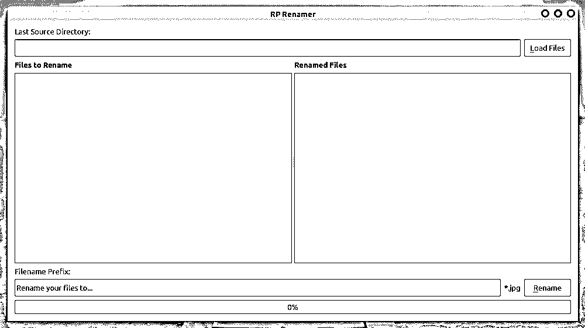

# 用 Python 和 PyQt 构建一个批量文件重命名工具

> 原文：<https://realpython.com/bulk-file-rename-tool-python/>

假设您需要使用特定的命名模式来重命名个人文件夹中的多个文件。手动操作既耗时又容易出错。因此，您正在考虑通过使用 Python 构建自己的**批量文件重命名工具**来自动化文件重命名过程。如果是这样，那么这篇教程就是为你准备的。

**在本教程中，您将学习如何:**

*   使用 **Qt Designer** 和 PyQt 为批量文件重命名工具创建 GUI
*   使用 **PyQt 线程**卸载文件重命名过程，防止 GUI 冻结
*   使用 **`pathlib`** 管理系统路径和重命名文件
*   根据重命名过程更新 **GUI 状态**

通过完成本教程中的项目，您将能够应用与 PyQt、Qt Designer、PyQt 线程以及使用 Python 的`pathlib`处理文件系统路径相关的大量技能。

您可以通过单击下面的链接下载您将在本教程中构建的批量文件重命名工具的最终源代码:

**获取源代码:** [点击此处获取您将在本教程中使用](https://realpython.com/bonus/bulk-file-rename-code/)用 Python 构建一个批量文件重命名工具的源代码。

## 演示:使用 Python 和 PyQt 的批量文件重命名工具

在本教程中，您将构建一个**批量文件重命名工具**来自动重命名您的[文件系统](https://en.wikipedia.org/wiki/File_system)中给定目录下的多个文件。要构建这个应用程序，您将使用 Python 的`pathlib`来管理文件重命名过程，并使用 PyQt 来构建应用程序的图形用户界面(GUI)。

这是你的批量文件重命名工具在本教程结束后的外观和工作方式:

[https://player.vimeo.com/video/521010353?background=1](https://player.vimeo.com/video/521010353?background=1)

完成应用程序的构建后，您将能够重命名文件系统中的多个文件，这是组织个人文件和文件夹时的一项常见任务。在本例中，应用程序主要关注图像和 Python 文件，但是您可以随时添加其他文件类型。

[*Remove ads*](/account/join/)

## 项目概述

您将在本教程中构建的项目由一个 GUI 应用程序组成，该应用程序从给定的目录中加载多个文件，并允许您使用预定义的文件名前缀和连续数字一次性重命名所有这些文件。在本节中，您将首先了解问题和可能的解决方案。您还将了解如何设计项目。

### 布置项目

为了构建您的批量文件重命名工具，您将创建几个[模块和包](https://realpython.com/python-modules-packages/)，并将它们组织成一个连贯的 Python [应用程序布局](https://realpython.com/python-application-layouts/)。项目的根目录将如下所示:

```py
./rprename_project/
│
├── rprename/
│   │
│   ├── ui/
│   │   ├── __init__.py
│   │   ├── window.py
│   │   └── window.ui
│   │
│   ├── __init__.py
│   ├── app.py
│   ├── rename.py
│   └── views.py
│
├── README.md
├── requirements.txt
└── rprenamer.py
```

这里，`rprename_project/`是项目的根目录，您将在这里创建以下文件:

*   **`README.md`** 提供了项目的一般描述以及安装和运行应用程序的说明。为您的项目准备一个 [`README.md`](https://dbader.org/blog/write-a-great-readme-for-your-github-project) 文件被认为是编程中的最佳实践，尤其是如果您计划将其作为开源解决方案发布的话。
*   **`requirements.txt`** 为项目提供了外部依赖列表。
*   **`rprenamer.py`** 提供了运行应用程序的入口点脚本。

然后是`rprename/`目录，该目录将包含一个包含以下模块的 Python 包:

*   **`__init__.py`** 启用`rprename/`作为 Python 包。
*   **`app.py`** 提供了 PyQt 的骨骼应用。
*   **`rename.py`** 提供了文件重命名功能。
*   **`views.py`** 提供了应用程序的 GUI 和相关功能。

`ui/`子目录将提供一个包来存储 GUI 相关的代码。它将包含以下文件和模块:

*   **`__init__.py`** 启用`ui/`作为 Python 包。
*   **`window.py`** 包含应用程序主窗口的 Python 代码。你将看到如何使用 [`pyuic5`](https://www.riverbankcomputing.com/static/Docs/PyQt5/designer.html#pyuic5) 生成这个文件。
*   **`window.ui`** 保存一个 Qt 设计器文件，该文件包含应用程序主窗口的代码，格式为`XML`。

继续用除了`window.ui`和`window.py`之外的所有文件和模块创建这个目录结构。在本教程的后面，你将看到如何用 [Qt Designer](https://realpython.com/qt-designer-python/) 和`pyuic5`创建这两个文件。

要下载项目的目录结构，请单击下面的链接:

**获取源代码:** [点击此处获取您将在本教程中使用](https://realpython.com/bonus/bulk-file-rename-code/)用 Python 构建一个批量文件重命名工具的源代码。

### 概述解决方案

您的批量文件重命名工具将是一个功能齐全的 GUI 应用程序。它将允许你从一个现有的目录中加载几个文件，并使用一个描述性的文件名前缀和连续的数字来重命名它们。要构建应用程序，您需要采取以下步骤:

1.  创建应用程序的 GUI。
2.  提供加载和重命名多个文件的功能。
3.  根据文件重命名过程的进度更新应用程序的 GUI。

要创建应用程序的 GUI，您将使用 Qt Designer。该工具提供了一个用户友好的界面，通过在空白表单上拖放图形组件(窗口小部件)来创建 GUI。有了这个工具，您的 GUI 创建过程将变得快速而高效。

谈到用 Python 管理文件和目录，在标准库中有几个选项。例如，您可以使用 [`os.path`](https://docs.python.org/3/library/os.path.html#module-os.path) 来处理文件系统路径，使用 [`os`](https://docs.python.org/3/library/os.html#module-os) 来使用操作系统功能，例如使用 [`os.rename()`](https://docs.python.org/3/library/os.html#os.rename) 来重命名文件。然而，在本教程中，您将使用 [`pathlib`](https://realpython.com/python-pathlib/) 来完成这两个任务。

**注:** [Python 3.4 在标准库中增加了`pathlib`](https://docs.python.org/3/whatsnew/3.4.html#pathlib) 。这个模块提供了表示文件系统路径的类，并允许对它们进行操作。

通常，您将使用 [`pathlib.Path`](https://docs.python.org/3/library/pathlib.html#pathlib.Path) 来管理应用程序中的文件和目录路径。一旦有了一个指向物理文件或目录的`Path`对象，就可以在该对象上调用 [`.rename()`](https://docs.python.org/3/library/pathlib.html#pathlib.Path.rename) 来重命名相关的文件或目录。

接下来，您需要编写功能代码，将多个文件加载到您的应用程序中，并一次性重命名它们。根据需要重命名的文件数量，该操作可能需要相当长的时间。这可能会导致应用程序的 GUI 冻结。为了防止 GUI 冻结问题，您将使用 [`QThread`](https://doc.qt.io/qt-5.15/qthread.html) 将重命名过程卸载给一个工作线程。

文件重命名过程需要与应用程序的 GUI 连接，以便用户知道在任何给定的时间发生了什么。在本例中，您将设置一个进度条来反映操作进度。

您还将编写一些代码来确保 GUI 根据文件重命名进度和状态进行更新。至少有两种管理 GUI 更新的通用策略:

1.  使用[条件语句](https://realpython.com/python-conditional-statements/)检查状态并相应地采取行动
2.  根据应用程序的状态启用和禁用小部件。

在这个项目中，您将使用第二种方法，这种方法可能更加直观和用户友好，提供更好的用户体验。

[*Remove ads*](/account/join/)

## 先决条件

要完成本教程并从中获得最大收益，您应该熟悉以下概念:

*   用 Python 和 PyQt 创建 GUI 应用程序
*   使用 Qt Designer 创建图形用户界面
*   使用 PyQt `QThread`卸载长时间运行的任务并防止 GUI 冻结
*   使用`pathlib`管理系统路径和重命名文件

如果你没有掌握所有需要的知识，那也没关系！您可以随时开始学习本教程，花些时间查看以下资源:

*   [Python 和 PyQt:构建 GUI 桌面计算器](https://realpython.com/python-pyqt-gui-calculator/)
*   [Qt Designer 和 Python:更快地构建您的 GUI 应用程序](https://realpython.com/qt-designer-python/)
*   使用 PyQt 的 QThread 来防止 GUI 冻结
*   [Python 3 的 pathlib 模块:驯服文件系统](https://realpython.com/python-pathlib/)

此外，您可以查看以下资源:

*   [Python 和 PyQt:创建菜单、工具栏和状态栏](https://realpython.com/python-menus-toolbars/)
*   PyQt 布局:创建专业外观的 GUI 应用程序
*   [Python 3 中的面向对象编程(OOP)](https://realpython.com/python3-object-oriented-programming/)
*   [模型-视图-控制器(MVC)解释-用乐高](https://realpython.com/the-model-view-controller-mvc-paradigm-summarized-with-legos/)
*   [PyQt 文档](https://www.riverbankcomputing.com/static/Docs/PyQt5/)

就外部软件依赖性而言，你的批量文件重命名工具依赖于 [PyQt v5.15.12](https://www.riverbankcomputing.com/static/Docs/PyQt5/) 。您可以照常使用 [`pip`](https://realpython.com/what-is-pip/) 从 [PyPI](https://realpython.com/pypi-publish-python-package/) 安装这个库:

```py
$ python -m pip install pyqt5
```

最后，您应该创建一个[虚拟环境](https://realpython.com/effective-python-environment/),按照 Python 最佳实践的建议隔离项目的依赖关系。之后，是时候开始开发你自己的批量文件重命名工具了！

## 步骤 1:构建批量文件重命名工具的 GUI

在本节中，您将使用 Qt Designer 快速创建批量文件重命名工具的 GUI。在这一步的最后，您将拥有一个 Qt Designer 的`.ui`文件，它提供了以下窗口所需的代码:

[](https://files.realpython.com/media/Bulk-File-Rename-Tool-Main-Window-GUI.e3974e26f81c.png)

您还将学习如何自动将您的`.ui`文件翻译成 Python 代码。您将使用该代码为应用程序的主窗口提供 GUI。

若要下载这些文件以及您将在本节中编写的所有代码，请单击下面的链接:

**获取源代码:** [点击此处获取您将在本教程中使用](https://realpython.com/bonus/bulk-file-rename-code/)用 Python 构建一个批量文件重命名工具的源代码。

### 用 Qt Designer 创建 GUI

要开始使用批量文件重命名工具的 GUI，请启动 Qt Designer。然后创建一个基于**小部件的**表单，并运行以下视频中显示的步骤:

[https://player.vimeo.com/video/518785883](https://player.vimeo.com/video/518785883)

以上视频中的步骤如下:

1.  使用*新表单*对话框中的*小部件*模板创建一个新表单，并将其标题设置为 *RP 重命名器*。
2.  添加一个标签，并将其文本设置为*最后一个源目录:*。
3.  添加一个行编辑来保存所选目录的路径，并将其`.readOnly`属性设置为`True`。
4.  添加一个按钮并将其文本设置为 *&加载文件*。
5.  添加两个文本为*的标签，分别重命名*和*重命名的文件*，并将它们的字体样式设置为*加粗*。
6.  添加两个列表小部件，分别显示要重命名的文件和已重命名的文件。
7.  为标签及其相应的列表小部件设置垂直布局。
8.  使用拆分器连接两种排列。
9.  添加一个标签并将其文本设置为*文件名前缀:*。
10.  添加一个行编辑来获取用户的文件名前缀，并将其占位符文本设置为*将文件重命名为…* 。
11.  添加一个标签并将其文本设置为*。jpg* 。
12.  添加一个按钮，并将其文本设置为 *&重命名*。
13.  添加一个进度条并将其值设置为`0`。
14.  调整标签、线条编辑和按钮的`minimumSize`和`maximumSize`属性，以便在用户调整窗口大小时提供一致的调整行为。
15.  将网格布局设置为表单的顶级布局。

完成后，将表单保存为`rprename/ui/`目录下的`window.ui`。不要关闭 Qt Designer。继续更改以下对象的`.objectName`属性:

| 目标 | 价值 |
| --- | --- |
| `Form` | `Window` |
| `lineEdit` | `dirEdit` |
| `pushButton` | `loadFilesButton` |
| `listWdget` | `srcFileList` |
| `listWidget_2` | `dstFileList` |
| `lineEdit_2` | `prefixEdit` |
| `label_5` | `extensionLabel` |
| `pushButton_2` | `renameFilesButton` |

为此，您可以在对象检查器中选择对象，并在属性编辑器中更改属性值:

[](https://files.realpython.com/media/Bulk-File-Rename-Change-Object-Names-Qt-Designer.24353d6a138d.gif)

您需要更改对象名称，因为您将在 Python 代码中使用这些名称，因此它们应该更具描述性和可读性。现在继续点击 Qt Designer 工具栏上的*保存*，让新的对象名持久保存在你的`window.ui`文件中。您也可以通过按键盘上的 `Ctrl` + `S` 来保存文件。

一旦你完成了批量文件重命名工具的 GUI 构建，你可以关闭 Qt Designer，因为你不再需要它了。接下来，您需要将刚刚创建的 [`.ui`文件](https://doc.qt.io/qt-5/designer-ui-file-format.html)的内容翻译成 Python 代码。这就是你在下一节要做的。

[*Remove ads*](/account/join/)

### 将 Qt Designer 的输出转换成 Python 代码

一旦您有了一个适合您的应用程序的 GUI 的`.ui`文件，您需要将这个文件的内容转换成 Python 代码，以便您可以在最终的应用程序中加载 GUI。PyQt 提供了一个名为 [`pyuic5`](https://www.riverbankcomputing.com/static/Docs/PyQt5/designer.html#pyuic5) 的命令行工具，允许您执行这种转换。

**注意:**您也可以使用 [`uic.loadUi()`](https://www.riverbankcomputing.com/static/Docs/PyQt5/api/uic/uic-module.html#loadUi) 将`.ui`文件的内容直接加载到您的应用程序中。然而，这种策略主要被推荐用于小对话。

如果你看一下你的`window.ui`文件的内容，那么你会看到它包含了`XML`代码。这些代码定义了应用程序 GUI 的所有图形组件。下面是文件内容的一个片段:

```py
<?xml version="1.0" encoding="UTF-8"?>
<ui version="4.0">
 <class>Window</class>
 <widget class="QWidget" name="Window">
  <property name="geometry">
   <rect>
    <x>0</x>
    <y>0</y>
    <width>720</width>
    <height>480</height>
   </rect>
  </property>
  <property name="windowTitle">
   <string>RP Renamer</string>
  </property>
  <!-- Snip... -->
```

在这个小片段中，`Window`的定义是顶级类。这个类代表你的主窗口。然后`XML`代码定义其他类并设置它们的属性。由于 PyQt 提供了`pyuic5`来自动将这个`XML`代码翻译成 Python 代码，所以您不需要担心您的`.ui`文件的内容。你只需要知道如何使用`pyuic5`。

现在，在您的`rprename/ui/`目录下打开一个终端并运行以下命令:

```py
$ pyuic5 -o window.py window.ui
```

这个命令从`window.ui`文件生成一个名为`window.py`的 Python 模块，并将其放在您的`rprename/ui/`目录中。该模块包含批量文件重命名工具 GUI 的 Python 代码。下面是代码的一个小样本:

```py
# -*- coding: utf-8 -*-

# Form implementation generated from reading ui file 'window.ui'
#
# Created by: PyQt5 UI code generator 5.14.1
#
# WARNING! All changes made in this file will be lost!

from PyQt5 import QtCore, QtGui, QtWidgets

class Ui_Window(object):
    def setupUi(self, Window):
        Window.setObjectName("Window")
        Window.resize(720, 480)
        # Snip...

    def retranslateUi(self, Window):
        _translate = QtCore.QCoreApplication.translate
        Window.setWindowTitle(_translate("Window", "RP Renamer"))
        # Snip...
```

`Ui_Window`提供了生成批量文件重命名工具 GUI 的所有代码。在这种情况下，`.setupUi()`包含创建所有需要的小部件并在 GUI 上展示它们的代码，而`.retranslateUi()`包含用于[国际化和本地化](https://en.wikipedia.org/wiki/Internationalization_and_localization)的代码，这超出了本教程的范围。

因为您正在使用`pyuic5`从现有的`.ui`文件中自动生成 Python 代码，所以您不需要担心`window.py`的内容。与文件状态顶部的`WARNING!`注释一样，如果使用 Qt Designer 更新 GUI 并重新生成 Python 代码，您对该文件所做的所有更改都将消失。

拥有一个包含 GUI 特定代码的模块强烈鼓励 GUI 逻辑与业务逻辑的分离，这是[模型-视图-控制器](https://realpython.com/the-model-view-controller-mvc-paradigm-summarized-with-legos/)模式中的一个基本原则。

至此，您的项目布局已经完成。您已经拥有了创建批量文件重命名工具所需的所有文件。现在是时候使用刚刚创建的贵由构建 PyQt 应用程序的框架了。

## 步骤 2:创建 PyQt 框架应用程序

到目前为止，您已经使用 Qt Designer 为批量文件重命名工具构建了一个 GUI。您还使用了`pyuic5`来自动将`.ui`文件内容翻译成 Python 代码，以便您可以在应用程序中使用它。最后，您将代码保存到`rprename/ui/`目录下的`window.py`中。

在本节中，您将创建一个 PyQt 框架应用程序，并将其主窗口设置为使用您在`window.py`中拥有的 GUI 代码。要下载您将在本节中编写的文件和所有代码，请单击下面的链接:

**获取源代码:** [点击此处获取您将在本教程中使用](https://realpython.com/bonus/bulk-file-rename-code/)用 Python 构建一个批量文件重命名工具的源代码。

### 设置批量文件重命名工具的窗口

要为批量文件重命名工具创建框架 PyQt 应用程序，首先需要创建应用程序的主窗口。首先，启动你最喜欢的[代码编辑器或 IDE](https://realpython.com/python-ides-code-editors-guide/) ，打开`rprename/__init__.py`文件。添加以下内容:

```py
# -*- coding: utf-8 -*-
# rprename/__init__.py

"""This module provides the rprename package."""

__version__ = "0.1.0"
```

除了一些注释和模块 [docstring](https://realpython.com/documenting-python-code/#documenting-your-python-code-base-using-docstrings) ，上面的文件定义了一个名为`__version__`的顶级常量来保存应用程序的版本号。

接下来，打开`rprename/views.py`，将以下内容写入其中:

```py
# -*- coding: utf-8 -*-
# rprename/views.py

"""This module provides the RP Renamer main window."""

from PyQt5.QtWidgets import QWidget

from .ui.window import Ui_Window

class Window(QWidget, Ui_Window):
    def __init__(self):
        super().__init__()
        self._setupUI()

    def _setupUI(self):
        self.setupUi(self)
```

在`views.py`中，你先从 [`PyQt5.QtWidgets`](https://www.riverbankcomputing.com/static/Docs/PyQt5/api/qtwidgets/qtwidgets-module.html) 中导入 [`QWidget`](https://www.riverbankcomputing.com/static/Docs/PyQt5/api/qtwidgets/qwidget.html) 。然后你从`ui.window`进口`Ui_Window`。正如您之前看到的，这个类为您的批量文件重命名工具提供了 GUI。

接下来，创建一个名为`Window`的新类。这个类使用[多重继承](https://realpython.com/python-super/#multiple-inheritance-overview)。它继承自`QWidget`，也继承自你的 GUI 类`Ui_Window`。`QWidget`启用基本 GUI 功能，`Ui_Window`为该应用程序提供您想要的特定 GUI 排列。

**注意:**你也可以使用[合成](https://realpython.com/inheritance-composition-python/)来为你的`Window`创建 GUI。

例如，您可以这样定义`Window`:

```py
# rprename/views.py
# Snip...

class Window(QWidget):
    def __init__(self):
        super().__init__()
 self.ui = Ui_Window()        self._setupUI()

    def _setupUI(self):
 self.ui.setupUi(self)
```

在这种情况下，您创建`.ui`作为`Ui_Window`的实例。从现在开始，您需要使用`.ui`来访问应用程序 GUI 上的小部件。

在本教程中，您使用多重继承方法，因为它使得所有用户界面组件都可以直接访问，而不需要使用`.ui`属性。要更深入地了解这个主题，请在您的应用程序中使用设计器 UI 文件来查看[。](https://doc.qt.io/archives/qt-4.8/designer-using-a-ui-file.html)

`Window`的初始化器使用 [`super()`](https://realpython.com/python-super/) 调用基类初始化器。它还调用了`._setupUI()`，这是一个非公共的方法，将收集生成和设置 GUI 所需的所有代码。至此，`._setupUI(self)`只调用了第二个父类`Ui_Window`提供的`.setupUi()`。

**注意:** Python 不区分私有和公共属性。上一段中的术语**非公共**指的是那些不打算在包含类之外使用的属性。这种属性的 Python [命名约定](https://www.python.org/dev/peps/pep-0008/#method-names-and-instance-variables)是在名称中使用前导下划线(`_`)。

准备好初始版本的`Window`后，您可以继续为您的批量文件重命名工具创建一个 PyQt 框架应用程序。

[*Remove ads*](/account/join/)

### 创建 PyQt 框架应用程序

既然您已经准备好了应用程序的主窗口，那么是时候编写创建 PyQt 应用程序所需的样板代码了。回到代码编辑器，打开`rprename/app.py`文件。然后添加以下代码:

```py
# -*- coding: utf-8 -*-
# rprename/app.py

"""This module provides the RP Renamer application."""

import sys

from PyQt5.QtWidgets import QApplication

from .views import Window

def main():
    # Create the application
    app = QApplication(sys.argv)
    # Create and show the main window
    win = Window()
    win.show()
    # Run the event loop
    sys.exit(app.exec())
```

在此模块中，您导入 [`sys`](https://docs.python.org/3/library/sys.html#module-sys) 来访问 [`exit()`](https://docs.python.org/3/library/sys.html#sys.exit) 。该函数允许您在用户关闭主窗口时干净地退出应用程序。然后你从`PyQt5.QtWidgets`导入 [`QApplication`](https://doc.qt.io/qt-5.15/qapplication.html) ，从`views`导入`Window`。最后一步是将 [`main()`](https://realpython.com/python-main-function/) 定义为应用程序的主函数。

在`main()`中，你实例化了`QApplication`和`Window`。然后你在`Window`上呼叫`.show()`。最后，使用 [`.exec()`](https://doc.qt.io/qt-5.15/qapplication.html#exec) 运行应用程序的**主循环**或**事件循环**。

### 编写应用程序的入口点脚本

有了 PyQt 框架应用程序，就可以创建合适的入口点脚本，以便快速运行应用程序。从根目录打开`rprenamer.py`文件，并在其中键入以下代码:

```py
#!/usr/bin/env python3
# -*- coding: utf-8 -*-
# rprenamer.py

"""This module provides the RP Renamer entry-point script."""

from rprename.app import main

if __name__ == "__main__":
    main()
```

这个脚本相当小。您首先从您的`app.py`模块导入`main()`。然后使用传统的 Python 条件语句，如果用户将模块作为 Python 脚本运行，该语句将调用`main()`。

现在你可以打开一个终端并运行脚本来启动应用程序。您将在屏幕上看到以下窗口:

[](https://files.realpython.com/media/Bulk-File-Rename-Tool-Main-Window-GUI.e3974e26f81c.png)

酷！您的批量文件重命名工具有一个漂亮的 GUI，它提供了一个按钮来加载您想要重命名的文件。第一行编辑将显示源目录的路径。左侧的列表小部件将显示要重命名的文件列表，右侧的列表小部件将显示重命名的文件。

要开始文件重命名过程，用户需要提供一个文件名前缀，然后单击*重命名*。底部的进度条将显示文件重命名进度。

在下一节中，您将编写所需的代码来提供应用程序的主要功能，一次性重命名多个文件。因此，请关闭应用程序窗口，继续添加功能。

## 第 3 步:用`pathlib`和 PyQt 线程重命名文件

为了实现批量文件重命名工具的文件重命名功能，您将使用 Python 的`pathlib`和 PyQt `QThread`。使用`pathlib`，你可以管理文件系统路径和重命名文件。另一方面，使用`QThread`，您将在单独的执行线程中重命名文件。为什么？

嗯，根据您要重命名的文件的数量，重命名过程可能需要相当长的时间。在应用程序的主线程中启动一个长时间运行的任务可能会冻结 GUI，从而导致糟糕的用户体验。

为了避免 GUI 冻结问题，您可以创建一个 worker `QThread`来卸载文件重命名过程，并使您的应用程序响应迅速。

同样，您可以通过单击下面的链接下载您将在本节中编写的所有代码:

**获取源代码:** [点击此处获取您将在本教程中使用](https://realpython.com/bonus/bulk-file-rename-code/)用 Python 构建一个批量文件重命名工具的源代码。

[*Remove ads*](/account/join/)

### 加载并显示目标文件

要开始重命名文件，您首先需要一种将这些文件加载到应用程序中的方法。PyQt 提供了一个名为 [`QFileDialog`](https://doc.qt.io/qt-5.15/qfiledialog.html) 的类，允许您使用预定义的对话框从文件系统中选择文件或目录。一旦选择了要重命名的文件，就需要将它们的路径存储在一个方便的数据结构中。

回到`rprename/views.py`并像这样更新代码:

```py
# -*- coding: utf-8 -*-
# rprename/views.py

"""This module provides the RP Renamer main window."""

from collections import deque from pathlib import Path 
from PyQt5.QtWidgets import QFileDialog, QWidget   from .ui.window_ui import Ui_Window

FILTERS = ";;".join(
    (
        "PNG Files (*.png)",
        "JPEG Files (*.jpeg)",
        "JPG Files (*.jpg)",
        "GIF Files (*.gif)",
        "Text Files (*.txt)",
        "Python Files (*.py)",
    )
)

class Window(QWidget, Ui_Window):
    # Snip...
```

这里，你先从 [`collections`](https://docs.python.org/3/library/collections.html?highlight=collections#module-collections) 导入 [`deque`](https://docs.python.org/3/library/collections.html#collections.deque) 。Deques 是对[栈](https://realpython.com/how-to-implement-python-stack/)和[队列](https://realpython.com/python-append/#implementing-a-queue)的概括。它们支持从队列的任意一端进行有效的追加和弹出操作。在这种情况下，您将使用一个 deque 来存储需要重命名的文件的路径。

你也从`pathlib`导入`Path`。这个类可以表示文件系统中具体的文件或目录路径。您将使用这个类对文件和目录执行不同的操作。在本教程中，您将使用`Path.rename()`来重命名硬盘中的物理文件。

然后你从`PyQt5.QtWidgets`导入`QFileDialog`。这个类提供了一个合适的对话框来从给定的目录中选择文件。`FILTER`常量以字符串形式指定不同的文件过滤器。这些过滤器允许您在将文件加载到应用程序时从不同的文件类型中进行选择。

保持`views.py`打开，像这样更新`Window`:

```py
 1# rprename/views.py
 2# Snip...
 3
 4class Window(QWidget, Ui_Window):
 5    def __init__(self):
 6        super().__init__()
 7        self._files = deque() 8        self._filesCount = len(self._files) 9        self._setupUI()
10        self._connectSignalsSlots() 11
12    def _setupUI(self):
13        self.setupUi(self)
14
15    def _connectSignalsSlots(self): 16        self.loadFilesButton.clicked.connect(self.loadFiles)
17
18    def loadFiles(self): 19        self.dstFileList.clear()
20        if self.dirEdit.text():
21            initDir = self.dirEdit.text()
22        else:
23            initDir = str(Path.home())
24        files, filter = QFileDialog.getOpenFileNames(
25            self, "Choose Files to Rename", initDir, filter=FILTERS
26        )
27        if len(files) > 0:
28            fileExtension = filter[filter.index("*") : -1]
29            self.extensionLabel.setText(fileExtension)
30            srcDirName = str(Path(files[0]).parent)
31            self.dirEdit.setText(srcDirName)
32            for file in files:
33                self._files.append(Path(file))
34                self.srcFileList.addItem(file)
35            self._filesCount = len(self._files)
```

下面是新添加的代码的作用:

*   **第 7 行**创建`._files`作为一个队列对象。该属性将存储您想要重命名的文件的路径。

*   **第 8 行**定义了`._filesCount`来存储要重命名的文件数量。

*   **10 号线**呼叫`._connectSignalsSlots()`。

*   **第 15 行**定义`._connectSignalsSlots()`。该方法将在一个地方收集几个[信号和插槽连接](https://realpython.com/python-pyqt-qthread/#using-signals-and-slots)。至此，该方法将*加载文件*按钮的`.clicked()`信号与`.loadFiles()`插槽连接。这使得每次用户点击按钮时触发`.loadFiles()`成为可能。

然后您定义`.loadFiles()`来加载您想要重命名的文件。它是这样做的:

*   **第 19 行**在用户每次点击*加载文件*时清除`.dstFileList`列表小部件。

*   **第 20 到 23 行**定义了一个条件语句，检查*最后一个源目录*行编辑当前是否显示任何目录路径。如果是，那么`if`代码块设置初始目录`initDir`来保存该路径。否则，初始目录被设置为`Path.home()`，返回当前用户主文件夹的路径。您将使用`initDir`为`QFileOpen`对象提供一个初始化目录。

*   **第 24 行到第 26 行**在`QFileDialog`上调用 [`.getOpenFileNames()`](https://doc.qt.io/qt-5.15/qfiledialog.html#getOpenFileNames) 。这个静态方法接受几个参数，创建一个对话框以允许用户选择一个或多个文件，并返回所选文件的基于字符串的路径列表。它还返回当前使用的文件过滤器。在这种情况下，可以使用以下参数:

    *   **`parent`** 持有拥有对话框的小部件，在本例中是`self`或当前的`Window`对象。

    *   **`caption`** 保存着对话框的标题或题注。在这个例子中使用了字符串`"Choose Files to Rename"`。

    *   **`dir`** 保存着初始化目录的路径。换句话说，就是打开对话框的目录的路径。在这个例子中，您使用`initDir`来初始化对话框。

    *   **`filter`** 拥有一个文件类型过滤器，只有符合过滤器的文件才会显示在对话框中。例如，如果您将过滤器设置为`"*.jpg"`，则对话框会显示与此格式匹配的文件。

*   **第 27 行**定义了一个条件语句，如果用户从`QFileDialog`中选择了至少一个文件，该语句将运行一系列语句。

*   **第 28 行**切片当前过滤字符串提取文件扩展名。

*   **第 29 行**将`.extensionLabel`对象的文本设置为第 28 行提取的文件扩展名。

*   **第 30 行**获取包含所选文件的目录路径。为此，使用所选文件列表中第一个文件的路径创建一个`Path`对象。`.parent`属性保存包含目录的路径。

*   **第 31 行**将`.dirEdit`行编辑的文本设置为您在第 30 行得到的目录路径。

*   **第 32 到 34 行**定义了一个`for`循环，该循环遍历所选文件的列表，为每个文件创建一个`Path`对象，并将其附加到`._files`。第 34 行将每个文件添加到`.srcFileList`列表小部件，以便用户可以在应用程序的 GUI 上看到当前选择的文件。

*   **第 35 行**用列表中文件的当前数量更新`._filesCount`。

如果您现在运行该应用程序，您将获得以下行为:

[https://player.vimeo.com/video/519724506?background=1](https://player.vimeo.com/video/519724506?background=1)

现在，您可以通过点击*加载文件*将多个文件加载到您的批量文件重命名工具中。请注意，您可以从*选择要重命名的文件*对话框中的几个文件过滤器中选择，指定您想要加载到应用程序中的文件类型。

**注意:**上述代码和本教程中其余代码示例中的行号是为了便于解释。它们与最终模块或脚本中的行顺序不匹配。

酷！您的项目已经支持加载不同类型的文件。继续并关闭应用程序以继续编码。在下一节中，您将实现文件重命名功能。

### 重命名一个工作器中的多个文件`QThread`

要执行文件重命名过程，您将使用一个`QThread`对象。创建和设置一个工作线程允许您从应用程序的主线程中卸载文件重命名过程。这样，当您选择大量文件进行重命名时，可以防止可能出现的 GUI 冻结问题。

工作线程将使用`pathlib.rename()`执行文件重命名。它还会发出自定义信号来与主线程通信，并更新应用程序的 GUI。继续在代码编辑器中打开`rprename/rename.py`文件。键入以下代码:

```py
 1# -*- coding: utf-8 -*-
 2# rprename/rename.py
 3
 4"""This module provides the Renamer class to rename multiple files."""
 5
 6import time
 7from pathlib import Path
 8
 9from PyQt5.QtCore import QObject, pyqtSignal
10
11class Renamer(QObject):
12    # Define custom signals
13    progressed = pyqtSignal(int)
14    renamedFile = pyqtSignal(Path)
15    finished = pyqtSignal()
16
17    def __init__(self, files, prefix):
18        super().__init__()
19        self._files = files
20        self._prefix = prefix
21
22    def renameFiles(self):
23        for fileNumber, file in enumerate(self._files, 1):
24            newFile = file.parent.joinpath(
25                f"{self._prefix}{str(fileNumber)}{file.suffix}"
26            )
27            file.rename(newFile)
28            time.sleep(0.1)  # Comment this line to rename files faster.
29            self.progressed.emit(fileNumber)
30            self.renamedFile.emit(newFile)
31        self.progressed.emit(0)  # Reset the progress
32        self.finished.emit()
```

下面是这段代码的作用:

*   **第 9 行**从 [`PyQt5.QtCore`](https://www.riverbankcomputing.com/static/Docs/PyQt5/api/qtcore/qtcore-module.html) 导入 [`QObject`](https://www.riverbankcomputing.com/static/Docs/PyQt5/api/qtcore/qobject.html) 和 [`pyqtSignal()`](https://www.riverbankcomputing.com/static/Docs/PyQt5/signals_slots.html#defining-new-signals-with-pyqtsignal) 。`QObject`允许您创建带有自定义信号和功能的子类。使用`pyqtSignal()`，您可以创建自定义信号，以便在给定事件发生时发出它们。

*   **第 11 行**定义了`QObject`的一个子类，称为`Renamer`。

*   **第 13 至 15 行**定义了三个自定义信号:

    1.  **`.progressed()`** 会在每次类重命名新文件时发出。它返回一个整数,代表当前重命名文件的编号。您将使用这个数字来更新应用程序 GUI 中的进度条。

    2.  **`.renamedFile()`** 会在类重命名文件时发出。在这种情况下，信号返回重命名文件的路径。您将使用这个路径来更新应用程序 GUI 中的重命名文件列表。

    3.  当文件重命名过程完成时，会发出 **`.finished()`** 。

第 17 行的类初始化器有两个必需的参数:

1.  **`files`** 保存着选中文件的列表。每个文件由其对应的`Path`表示。

2.  **`prefix`** 保存文件名前缀，您将使用它来重命名文件。

然后定义执行文件重命名过程的方法`.renameFiles()`。下面是其工作原理的总结:

*   **第 23 行**定义了一个`for`循环来遍历所选文件的列表。随着循环的进行，循环使用 [`enumerate()`](https://realpython.com/python-enumerate/) 生成一个文件号。

*   **第 24 行**使用文件名前缀`fileNumber`和文件扩展名`.suffix`构建新文件名。然后，它将新文件名与父目录路径连接起来，创建手边文件的路径，`newFile`。

*   **第 27 行**通过用`newFile`作为参数调用当前`file`上的`.rename()`来重命名当前文件。

*   **第 28 行**是对 [`time.sleep()`](https://realpython.com/python-sleep/) 的一个可选调用，它减缓了文件重命名的过程，以便你能看到它是如何进行的。您可以随意删除这一行，以正常速度运行应用程序。

*   **线 29 和 30** 发出`.progressed()`和`.renamedFile()`信号。在下一节中，您将使用这些信号来更新应用程序的 GUI。

*   **第 31 行**使用`0`作为参数发出`.progressed()`。完成文件重命名过程后，您将使用该值重置进度条。

*   **32 线**在文件重命名过程结束时发出`.finished()`信号。

一旦你编写了`Renamer`，你就可以开始重命名文件了。为此，您需要创建并设置一个工作线程。但是首先，回到`rprename/views.py`,像这样更新它的导入部分:

```py
# rprename/views.py
# Snip...

from PyQt5.QtCore import QThread from PyQt5.QtWidgets import QFileDialog, QWidget

from .rename import Renamer from .ui.window import Ui_Window
# Snip...
```

在第一个突出显示的行中，您从`PyQt5.QtCore`导入`QThread`。这个类允许您在 PyQt 应用程序中创建和管理工作线程。在第二个突出显示的行中，您从您的`rename`模块导入`Renamer`。

现在在你的`views.py`文件中向下滚动一点，像这样更新`Window`:

```py
 1# rprename/views.py
 2# Snip...
 3
 4class Window(QWidget, Ui_Window):
 5    # Snip...
 6    def _connectSignalsSlots(self):
 7        self.loadFilesButton.clicked.connect(self.loadFiles)
 8        self.renameFilesButton.clicked.connect(self.renameFiles) 9
10    def loadFiles(self):
11        # Snip..
12
13    def renameFiles(self): 14        self._runRenamerThread()
15
16    def _runRenamerThread(self): 17        prefix = self.prefixEdit.text()
18        self._thread = QThread()
19        self._renamer = Renamer(
20            files=tuple(self._files),
21            prefix=prefix,
22        )
23        self._renamer.moveToThread(self._thread)
24        # Rename
25        self._thread.started.connect(self._renamer.renameFiles)
26        # Update state
27        self._renamer.renamedFile.connect(self._updateStateWhenFileRenamed)
28        # Clean up
29        self._renamer.finished.connect(self._thread.quit)
30        self._renamer.finished.connect(self._renamer.deleteLater)
31        self._thread.finished.connect(self._thread.deleteLater)
32        # Run the thread
33        self._thread.start()
34
35    def _updateStateWhenFileRenamed(self, newFile): 36        self._files.popleft()
37        self.srcFileList.takeItem(0)
38        self.dstFileList.addItem(str(newFile))
```

这里，首先将*重命名*按钮的`.clicked()`连接到`.renameFiles()`。这个方法调用`._runRenamerThread()`来创建、设置和运行工作线程。它是这样工作的:

*   **第 17 行**检索*文件名前缀*行编辑中的文本。用户需要提供这个文件名前缀。

*   **第 18 行**创建一个新的`QThread`对象来卸载文件重命名过程。

*   **第 19 到 22 行**实例化`Renamer`，将文件列表和文件名前缀作为参数传递给类构造函数。在这种情况下，您将`._files`变成一个元组，以防止线程修改主线程上的底层队列。

*   **第 23 行**在`Renamer`实例上调用 [`.moveToThread()`](https://doc.qt.io/qt-5.15/qobject.html#moveToThread) 。顾名思义，这个方法将给定的对象移动到不同的执行线程。在这种情况下，它使用`._thread`作为目标线程。

*   **第 25 行**连接线程的`.started()`信号和`Renamer`实例上的`.renameFiles()`。这使得在线程启动时启动文件重命名过程成为可能。

*   **线 27** 连接`Renamer`实例的`.renamedFile()`信号和`._updateStateWhenFileRenamed()`。一会儿你会看到这个方法做了什么。

*   **第 29 行和第 30 行**将`Renamer`实例的`.finished()`信号连接到两个插槽:

    1.  线程的 [`.quit()`](https://doc.qt.io/qt-5.15/qthread.html#quit) 槽，一旦文件重命名过程完成就退出线程

    2.  `Renamer`实例的 [`.deleteLater()`](https://doc.qt.io/qt-5.15/qobject.html#deleteLater) 槽，用于调度对象以便以后删除

*   **线 31** 连接线程的`.finished()`信号与`.deleteLater()`。这使得删除线程成为可能，但只能在它完成任务之后。

*   第 33 行启动工作线程。

最后一段代码定义了`._updateStateWhenFileRenamed()`。重命名文件时，方法从要重命名的文件列表中移除该文件。然后，该方法在应用程序的 GUI 上更新重命名为的*文件列表以及重命名为*的*文件列表。*

下面是该应用程序现在的工作方式:

[https://player.vimeo.com/video/520025279?background=1](https://player.vimeo.com/video/520025279?background=1)

就是这样！您的批量文件重命名工具已经完成了它的工作。它允许您加载几个文件，提供一个新的文件名前缀，并重命名所有选定的文件。干得好！

现在，您可以关闭应用程序，继续开发过程。在下一节中，您将学习如何根据文件重命名进度更新应用程序的 GUI。

[*Remove ads*](/account/join/)

## 步骤 4:根据重命名进度更新 GUI 状态

到目前为止，您的批量文件重命名工具提供了它的主要功能。您已经可以使用该工具来重命名文件系统中的多个文件。但是，如果用户在重命名过程中点击了 *Rename* 会发生什么？此外，如果用户忘记提供适当的文件名前缀怎么办？

另一个更明显的问题是为什么应用程序的进度条不能反映文件重命名的进度。

所有这些问题都与在任何给定时间根据应用程序的状态更新 GUI 有关。在本节中，您将编写所需的代码来修复或防止上述问题。您将从进度条开始。

您可以通过单击下面的链接下载您将在本节中编写的代码:

**获取源代码:** [点击此处获取您将在本教程中使用](https://realpython.com/bonus/bulk-file-rename-code/)用 Python 构建一个批量文件重命名工具的源代码。

### 更新进度条

在 GUI 应用程序中，通常使用进度条来通知用户长时间运行任务的进度。如果用户没有得到应用程序当前正在做什么的反馈，那么他们可能会认为应用程序被冻结了，卡住了，或者有一些内部问题。

在本项目中，您将使用进度条来提供在任何给定时间文件重命名过程的反馈。为此，返回到代码编辑器中的`rprename/views.py`,像这样更新它:

```py
 1# rprename/views.py
 2# Snip...
 3
 4class Window(QWidget, Ui_Window):
 5    # Snip...
 6    def _runRenamerThread(self):
 7        # Update state
 8        self._renamer.renamedFile.connect(self._updateStateWhenFileRenamed)
 9        self._renamer.progressed.connect(self._updateProgressBar) 10        # Snip...
11
12    def _updateStateWhenFileRenamed(self, newFile):
13        # Snip...
14
15    def _updateProgressBar(self, fileNumber): 16        progressPercent = int(fileNumber / self._filesCount * 100)
17        self.progressBar.setValue(progressPercent)
```

下面是新添加的代码的作用:

*   **线 9** 连接`Renamer`实例的`.progressed()`信号和`._updateProgressBar()`。
*   **第 15 行**定义`._updateProgressBar()`。该方法将一个`fileNumber`作为参数。注意，每次文件被重命名时，`.progressed()`都会提供这个文件号。
*   **第 16 行**计算文件重命名进度占文件总数的百分比，可在`._filesCount`中获得。
*   **第 17 行**使用带有`progressPercent`的`.setValue()`作为参数来更新进度条上的`.value`属性。

就是这样！继续运行您的应用程序。它是这样工作的:

[https://player.vimeo.com/video/520061171?background=1](https://player.vimeo.com/video/520061171?background=1)

在对`Window`进行了这些添加之后，你的批量文件重命名工具的进度条反映了文件重命名操作的进度，这很好，改善了你的用户体验。

### 启用和禁用 GUI 组件

当您构建 GUI 应用程序时，您会意识到 GUI 上的某些操作仅在特定情况下可用。例如，在您的批量文件重命名工具中，如果没有文件已经加载到应用程序中，或者如果用户没有提供文件名前缀，则允许用户单击*重命名*是没有意义的。

处理这种情况至少有两种方法:

1.  让所有的小部件一直处于启用状态，并确保它们不会触发任何在上下文中没有意义的动作。
2.  根据应用程序的状态启用和禁用小部件。

要实现第一种方法，您可以使用条件语句来确保给定的操作在给定的时刻有意义。另一方面，要实现第二种方法，您需要找出应用程序可能遇到的所有状态，并提供相应的方法来更新 GUI。

**注意:**当您禁用一个 PyQt 小部件或图形组件时，这个库会将手边的小部件变灰，并使它对用户的事件(比如单击和按键)没有响应。

在本教程中，您将使用第二种方法，这可能更加直观和用户友好。为此，您需要找出应用程序可能会遇到的状态。这是解决这个问题的第一种方法:

| 状态 | 描述 | 方法 |
| --- | --- | --- |
| 没有加载文件 | 应用程序正在运行，要重命名的文件列表为空。 | `._updateStateWhenNoFiles()` |
| 加载的文件 | 要重命名的*文件列表包含一个或多个文件。* | `._updateStateWhenFilesLoaded()` |
| 准备重命名文件 | 要重命名的*文件列表包含一个或多个文件，并且用户已经提供了文件名前缀。* | `._updateStateWhenReady()` |
| 重命名文件 | 用户点击*重命名*，文件重命名过程开始。 | `._updateStateWhileRenaming()` |
| 重命名完成 | 文件重命名过程已经完成，没有剩余文件需要重命名。 | `._updateStateWhenNoFiles()` |

因为上表中的第一个和最后一个状态非常相似，所以您将使用相同的方法来更新 GUI。这意味着您只需要实现四个方法。

要开始编写这些方法，请返回到`views.py`并将以下代码添加到`Window`:

```py
 1# rprename/views.py
 2# Snip...
 3
 4class Window(QWidget, Ui_Window):
 5    # Snip...
 6    def _setupUI(self):
 7        self.setupUi(self)
 8        self._updateStateWhenNoFiles() 9
10    def _updateStateWhenNoFiles(self): 11        self._filesCount = len(self._files)
12        self.loadFilesButton.setEnabled(True)
13        self.loadFilesButton.setFocus(True)
14        self.renameFilesButton.setEnabled(False)
15        self.prefixEdit.clear()
16        self.prefixEdit.setEnabled(False)
17
18   # Snip...
19   def _runRenamerThread(self):
20        # Snip...
21        self._renamer.progressed.connect(self._updateProgressBar)
22        self._renamer.finished.connect(self._updateStateWhenNoFiles) 23        # Snip...
```

以下是此更新的工作方式:

*   **第 8 行**从`._setupUI()`内部调用`._updateStateWhenNoFiles()`。这将在您启动应用程序时更新 GUI。
*   **第 10 行**定义`._updateStateWhenNoFiles()`。
*   **第 11 行**更新文件总数。在这种状态下，`len(self._files)`返回`0`。
*   **第 12 行**启用*加载文件*按钮，以便接受用户的事件。
*   **第 13 行**将焦点移动到*加载文件*按钮。这样，用户可以按键盘上的 `Space` 将文件加载到应用程序中。
*   **第 14 行**禁用*重命名*按钮。该按钮呈灰色且无响应。
*   **第 15 行**清除*文件名前缀*行编辑。这将删除任何以前提供的文件名前缀。
*   **第 16 行**禁用*文件名前缀*行编辑。这样，如果应用程序中没有文件，用户将无法键入文件名前缀。
*   **线 22** 连接`Renamer`实例的`.finished()`信号和`._updateStateWhenNoFiles()`。这将在文件重命名过程完成后更新 GUI。

当您运行应用程序时，您可以按键盘上的 `Space` 来启动对话框并选择您想要重命名的文件。另外，*文件名前缀*行编辑和*重命名*按钮被禁用，因此您不能对它们执行操作。

现在，您可以编写方法，以便在将文件加载到应用程序中时更新 GUI。将以下代码添加到`Window`:

```py
# rprename/views.py
# Snip...

class Window(QWidget, Ui_Window):
    # Snip...
    def loadFiles(self):
        if len(files) > 0:
            # Snip...
 self._updateStateWhenFilesLoaded() 
 def _updateStateWhenFilesLoaded(self):        self.prefixEdit.setEnabled(True)
        self.prefixEdit.setFocus(True)
```

当您将一个或多个文件加载到应用程序中时，`.loadFiles()`调用`._updateStateWhenFilesLoaded()`。该方法启用*文件名前缀*行编辑，这样您可以输入一个前缀用于重命名文件。它还将焦点移到该小部件上，这样您就可以立即提供文件名前缀。

接下来，当应用程序准备重命名一堆文件时，您可以编写方法来处理 GUI 更新。将以下代码添加到`Window`:

```py
# rprename/views.py
# Snip...

class Window(QWidget, Ui_Window):
    # Snip...
    def _connectSignalsSlots(self):
        # Snip...
 self.prefixEdit.textChanged.connect(self._updateStateWhenReady) 
 def _updateStateWhenReady(self):        if self.prefixEdit.text():
            self.renameFilesButton.setEnabled(True)
        else:
            self.renameFilesButton.setEnabled(False)
```

这里，首先将*文件名前缀*行编辑的`.textChanged()`信号与`._updateStateWhenReady()`连接。该方法根据*文件名前缀*行编辑的内容启用或禁用*重命名*按钮。这样，当行编辑为空时，按钮被禁用，否则它被启用。

最后，当应用程序重命名文件时，您需要编写方法来处理 GUI 更新。继续将以下代码添加到`Window`:

```py
class Window(QWidget, Ui_Window):
    # Snip...
    def renameFiles(self):
        self._runRenamerThread()
 self._updateStateWhileRenaming() 
 def _updateStateWhileRenaming(self):        self.loadFilesButton.setEnabled(False)
        self.renameFilesButton.setEnabled(False)
```

当用户点击*重命名*时，应用程序启动文件重命名过程，并调用`._updateStateWhileRenaming()`相应地更新 GUI。该方法禁用*加载文件*和*重命名*按钮，因此在重命名过程运行时用户不能点击它们。

就是这样！如果您现在运行该应用程序，您将获得以下行为:

[https://player.vimeo.com/video/521071061?background=1](https://player.vimeo.com/video/521071061?background=1)

您的批量文件重命名工具的 GUI 现在可以随时反映应用程序的状态。这允许你为你的用户提供一个直观的，没有挫败感的体验。干得好！

[*Remove ads*](/account/join/)

## 结论

当您整理个人文件和文件夹时，自动重命名多个文件是一个常见问题。在本教程中，您构建了一个真实的 GUI 应用程序来快速有效地执行这项任务。通过构建这个工具，您应用了与使用 PyQt 和 Qt Designer 创建 GUI 应用程序相关的大量技能。您还使用 Python 的`pathlib`处理了文件。

**在本教程中，您学习了如何:**

*   使用 **Qt Designer** 构建批量文件重命名工具的 GUI
*   使用 **PyQt 线程**来卸载批量文件重命名过程
*   用 **`pathlib`** 管理系统路径和重命名文件
*   根据文件重命名过程更新 **GUI 状态**

您可以通过单击下面的链接下载批量文件重命名项目的最终源代码:

**获取源代码:** [点击此处获取您将在本教程中使用](https://realpython.com/bonus/bulk-file-rename-code/)用 Python 构建一个批量文件重命名工具的源代码。

## 接下来的步骤

到目前为止，您已经构建了一个真实的应用程序来自动化重命名多个文件的过程。尽管该应用程序提供了一组最少的功能，但它是您继续添加功能和学习的良好起点。这将帮助您将 Python 和 PyQt GUI 应用程序的技能提升到一个新的水平。

以下是一些你可以用来继续改进项目的想法:

*   **添加对其他文件类型的支持:**您可以添加对新文件类型的支持，例如`.bmp`、`.docx`、`.xlsx`，或者您需要处理的任何其他文件类型。为此，您可以扩展`FILTERS`常量。

*   **生成基于日期或随机的文件名后缀:**你也可以改变你生成文件名后缀的方式。不使用连续的整数，可以使用 [`datetime`](https://realpython.com/python-datetime/) 提供基于日期的后缀，也可以提供[随机的](https://realpython.com/python-random/)后缀。

*   **为应用程序生成可执行文件:**您可以使用 [PyInstaller](https://realpython.com/pyinstaller-python/) 或任何其他工具为您的批量文件重命名工具生成可执行文件。这样，您就可以与您的朋友和同事共享该应用程序。

这些只是如何继续向批量文件重命名工具添加功能的一些想法。接受挑战，创造令人惊叹的东西！*******