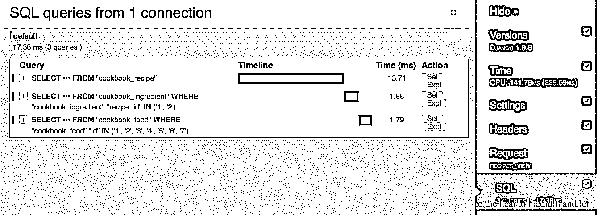

# 用 Redis 在 Django 缓存

> 原文:# t0]https://realython . com/cache-in-django-with-redis/

应用性能对产品的成功至关重要。在一个[用户期望网站响应时间少于一秒](https://www.nngroup.com/articles/response-times-3-important-limits/)的环境中，缓慢的应用程序的后果可以用金钱来衡量。即使你不卖任何东西，快速的页面加载也能改善访问你网站的体验。

从收到请求到返回响应，服务器上发生的所有事情都会增加加载页面的时间。根据一般经验，服务器上可以消除的处理越多，应用程序的执行速度就越快。处理完数据后缓存数据，然后在下次请求时从缓存中提供数据，这是减轻服务器压力的一种方式。在本教程中，我们将探索一些阻碍你应用的因素，我们将演示如何用 Redis 实现缓存来抵消它们的影响。

**免费奖励:** [点击此处获取免费的 Django 学习资源指南(PDF)](#) ，该指南向您展示了构建 Python + Django web 应用程序时要避免的技巧和窍门以及常见的陷阱。

## 什么是里兹？

[Redis](https://realpython.com/python-redis/) 是一个内存中的数据结构存储，可以用作缓存引擎。因为 Redis 将数据保存在 RAM 中，所以它可以非常快速地传递数据。Redis 不是我们可以用于缓存的唯一产品。 [Memcached](https://realpython.com/python-memcache-efficient-caching/) 是另一个流行的内存缓存系统，但是很多人都认为 [Redis 在大多数情况下优于 Memcached](http://stackoverflow.com/questions/10558465/memcached-vs-redis?answertab=votes#tab-top) 。就个人而言，我们喜欢为其他目的设置和使用 Redis 的简单性，例如 [Redis Queue](http://python-rq.org/) 。

[*Remove ads*](/account/join/)

## 开始使用

我们创建了一个示例应用程序，向您介绍缓存的概念。我们的应用程序使用:

*   姜戈(v [1.9.8](https://docs.djangoproject.com/en/1.9/)
*   Django 调试工具栏(v [1.4](http://django-debug-toolbar.readthedocs.io/en/1.4/)
*   django-redis (v [4.4.3](https://github.com/niwinz/django-redis/tree/4.3.0)
*   里氏(v [3.2.0](http://redis.io/download)

### 安装应用程序

在克隆存储库之前，安装 [virtualenvwrapper](https://virtualenvwrapper.readthedocs.org/en/latest/install.html) ，如果你还没有的话。这是一个允许您安装项目所需的特定 Python 依赖项的工具，允许您单独针对应用程序所需的版本和库。

接下来，将目录更改为保存项目的位置，并克隆示例应用程序存储库。完成后，将目录更改为克隆的存储库，然后使用`mkvirtualenv`命令为示例应用程序创建一个新的虚拟环境:

```py
$ mkvirtualenv django-redis
(django-redis)$
```

> **注意:**用`mkvirtualenv`创建一个虚拟环境也会激活它。

用 [`pip`](https://realpython.com/what-is-pip/) 安装所有需要的 Python 依赖项，然后签出下面的标签:

```py
(django-redis)$ git checkout tags/1
```

通过[构建数据库并用示例数据](https://realpython.com/django-migrations-a-primer/)填充它来完成示例应用程序的设置。确保创建一个超级用户，这样您就可以登录到管理站点。遵循下面的代码示例，然后尝试运行应用程序，以确保它正常工作。访问浏览器中的管理页面，确认数据已正确加载。

```py
(django-redis)$ python manage.py makemigrations cookbook
(django-redis)$ python manage.py migrate
(django-redis)$ python manage.py createsuperuser
(django-redis)$ python manage.py loaddata cookbook/fixtures/cookbook.json
(django-redis)$ python manage.py runserver
```

运行 Django 应用程序后，继续安装 Redis。

### 安装 Redis

使用文档中提供的说明下载并安装 [Redis](http://redis.io/download) 。或者，你可以根据你的操作系统使用包管理器安装 Redis，比如 *apt-get* 或者 *homebrew* 。

从新的终端窗口运行 Redis 服务器。

```py
$ redis-server
```

接下来，在不同的终端窗口中启动 Redis 命令行界面(CLI ),并测试它是否连接到 Redis 服务器。我们将使用 Redis CLI 来检查我们添加到缓存中的键。

```py
$ redis-cli ping
PONG
```

Redis 提供了一个带有各种命令的 [API](https://realpython.com/python-api/) ，开发者可以使用这些命令来操作数据存储。Django 使用 *django-redis* 在 redis 中执行命令。

在文本编辑器中查看我们的示例应用程序，我们可以在 *settings.py* 文件中看到 Redis 配置。我们使用内置的 *django-redis* 缓存作为我们的后端，用`CACHES`设置定义一个默认缓存。Redis 默认运行在端口 6379 上，我们在设置中指向这个位置。最后要提到的是 *django-redis* 在键名后面附加一个前缀和一个版本，以帮助区分相似的键。在这种情况下，我们将前缀定义为“example”。

```py
CACHES = {
    "default": {
        "BACKEND": "django_redis.cache.RedisCache",
        "LOCATION": "redis://127.0.0.1:6379/1",
        "OPTIONS": {
            "CLIENT_CLASS": "django_redis.client.DefaultClient"
        },
        "KEY_PREFIX": "example"
    }
}
```

> **注意**:虽然我们已经配置了缓存后端，但是没有一个视图函数实现了缓存。

[*Remove ads*](/account/join/)

## 应用性能

正如我们在本教程开始时提到的，服务器处理请求所做的一切都会减缓应用程序的加载时间。运行业务逻辑和呈现模板的处理开销可能很大。网络延迟会影响查询数据库所需的时间。每当客户端向服务器发送 HTTP 请求时，这些因素就会发挥作用。当用户每秒发起许多请求时，当服务器处理所有请求时，对性能的影响变得很明显。

当我们实现缓存时，我们让服务器处理一次请求，然后将它存储在我们的缓存中。当我们的应用程序收到对同一个 URL 的请求时，服务器从缓存中提取结果，而不是每次都重新处理它们。通常，我们为缓存的结果设置一个生存时间，以便可以定期刷新数据，这是实现的一个重要步骤，以避免提供过时的数据。

当下列情况为真时，您应该考虑缓存请求的结果:

*   呈现页面涉及大量数据库查询和/或业务逻辑，
*   您的用户经常访问该页面，
*   每个用户的数据都是一样的，
*   并且数据不会经常改变。

### 从测量绩效开始

首先测试应用程序中每个页面的速度，测试应用程序在收到请求后返回响应的速度。

为了实现这一点，我们将使用 HTTP 负载生成器 [loadtest](https://www.npmjs.com/package/loadtest) 向每个页面发送大量请求，然后密切关注请求率。访问上面的链接进行安装。安装后，根据`/cookbook/` URL 路径测试结果:

```py
$ loadtest -n 100 -k  http://localhost:8000/cookbook/
```

请注意，我们每秒处理大约 16 个请求:

```py
Requests per second: 16
```

当我们看到代码在做什么时，我们可以决定如何做出改变来提高性能。应用程序对数据库进行 3 次网络调用，每次请求到`/cookbook/`，每次调用都需要时间来打开连接和执行查询。在您的浏览器中访问`/cookbook/` URL，并展开 Django 调试工具栏选项卡来确认这一行为。找到标有“SQL”的菜单，并读取查询数:

[](https://files.realpython.com/media/django-debug-toolbar-sql-queries.be5abbb28596.png)

**cookbook/services.py**

```py
from cookbook.models import Recipe

def get_recipes():
    # Queries 3 tables: cookbook_recipe, cookbook_ingredient,
    # and cookbook_food.
    return list(Recipe.objects.prefetch_related('ingredient_set__food'))
```

**cookbook/views.py**

```py
from django.shortcuts import render
from cookbook.services import get_recipes

def recipes_view(request):
    return render(request, 'cookbook/recipes.html', {
        'recipes': get_recipes()
    })
```

该应用程序还使用一些潜在的昂贵逻辑来呈现模板。

```py
<html>
<head>
  <title>Recipes</title>
</head>
<body>

  <h1>{{ recipe.name }}</h1>
    <p>{{ recipe.desc }}</p>
  <h2>Ingredients</h2>
  <ul>
    
    <li>{{ ingredient.desc }}</li>
    
  </ul>
  <h2>Instructions</h2>
    <p>{{ recipe.instructions }}</p>

</body>
</html>
```

### 实现缓存

想象一下当用户开始访问我们的站点时，我们的应用程序将发出的网络调用的总数。如果 1000 个用户点击检索食谱的 API，那么我们的应用程序将查询数据库 3000 次，每次请求都会呈现一个新的模板。这个数字只会随着我们应用程序的扩展而增长。幸运的是，这个视图非常适合缓存。烹饪书中的食谱很少改变，如果有的话。此外，由于查看食谱是应用程序的中心主题，检索食谱的 API 肯定会被频繁调用。

在下面的例子中，我们修改了视图函数来使用缓存。当该函数运行时，它检查视图键是否在缓存中。如果键存在，那么应用程序从缓存中检索数据并返回它。如果没有，Django 查询数据库，然后将结果和视图键一起保存在缓存中。第一次运行这个函数时，Django 会查询数据库并呈现模板，然后还会对 Redis 进行网络调用，将数据存储在缓存中。对该函数的每个后续调用都将完全绕过数据库和业务逻辑，并查询 Redis 缓存。

**example/settings.py**

```py
# Cache time to live is 15 minutes.
CACHE_TTL = 60 * 15
```

**cookbook/views.py**

```py
from django.conf import settings
from django.core.cache.backends.base import DEFAULT_TIMEOUT
from django.shortcuts import render
from django.views.decorators.cache import cache_page
from cookbook.services import get_recipes

CACHE_TTL = getattr(settings, 'CACHE_TTL', DEFAULT_TIMEOUT)

@cache_page(CACHE_TTL)
def recipes_view(request):
    return render(request, 'cookbook/recipes.html', {
        'recipes': get_recipes()
    })
```

注意，我们已经向视图函数添加了`@cache_page()`装饰器，以及生存时间。再次访问`/cookbook/` URL 并检查 Django 调试工具栏。我们看到进行了 3 次数据库查询，并对缓存进行了 3 次调用，以检查密钥，然后保存它。Django 保存了两个键(一个键用于标题，一个键用于呈现的页面内容)。重新加载页面，观察页面活动如何变化。第二次，对数据库进行了 0 次调用，对缓存进行了 2 次调用。我们的页面现在从缓存中提供服务！

当我们重新运行我们的性能测试时，我们看到我们的应用程序加载得更快了。

```py
$ loadtest -n 100 -k  http://localhost:8000/cookbook/
```

缓存改善了总负载，我们现在每秒处理 21 个请求，比基线多 5 个:

```py
Requests per second: 21
```

[*Remove ads*](/account/join/)

### 使用命令行界面检查 Redis】

此时，我们可以使用 Redis CLI 来查看 Redis 服务器上存储了什么。在 Redis 命令行中，输入`keys *`命令，该命令返回匹配任何模式的所有键。应该会看到一个名为“example:1:views . decorators . cache . cache _ page”的键。记住，“example”是我们的键前缀，“1”是版本，“views . decorators . cache . cache _ page”是 Django 给键起的名字。复制密钥名并用`get`命令输入。您应该会看到呈现的 HTML 字符串。

```py
$ redis-cli -n 1
127.0.0.1:6379[1]> keys *
1) "example:1:views.decorators.cache.cache_header"
2) "example:1:views.decorators.cache.cache_page"
127.0.0.1:6379[1]> get "example:1:views.decorators.cache.cache_page"
```

> **注意:**在 Redis CLI 上运行`flushall`命令，清除数据存储中的所有密钥。然后，您可以再次运行本教程中的步骤，而不必等待缓存过期。

## 总结

处理 HTTP 请求的成本很高，而且随着应用程序越来越受欢迎，这种成本还会增加。在某些情况下，通过实现缓存，可以大大减少服务器的处理量。本教程介绍了 Django 中使用 Redis 进行缓存的基础知识，但它只是触及了一个复杂主题的表面。

在健壮的应用程序中实现缓存有许多陷阱和问题。控制缓存什么以及缓存多长时间是很困难的。缓存失效是计算机科学中的难题之一。确保私有数据只能由目标用户访问是一个安全问题，在缓存时必须小心处理。

**免费奖励:** [点击此处获取免费的 Django 学习资源指南(PDF)](#) ，该指南向您展示了构建 Python + Django web 应用程序时要避免的技巧和窍门以及常见的陷阱。

在[示例应用程序](https://github.com/realpython/django-redis-cache)中试验源代码，当您继续使用 Django 开发时，请记住始终将性能放在心上。***