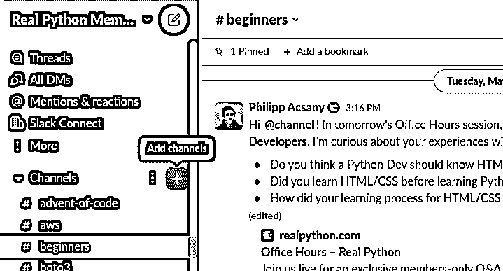
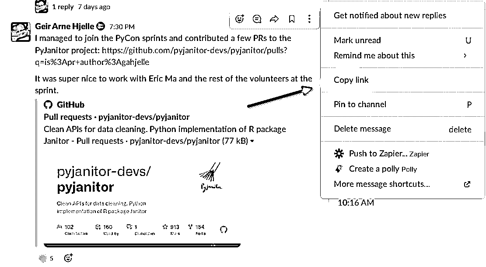
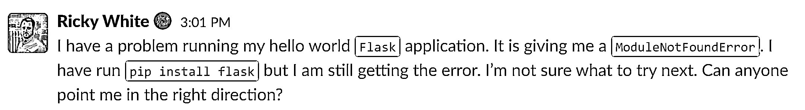
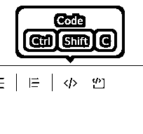
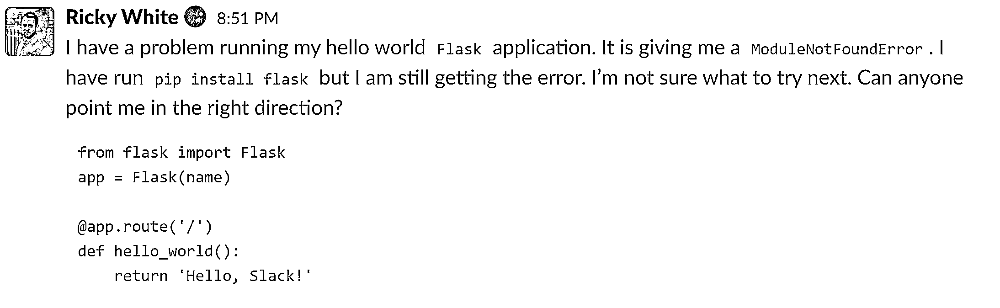
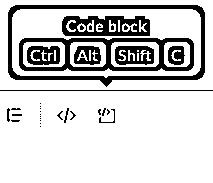
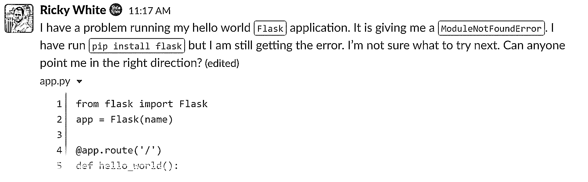

# 通过真正的 Python Slack 社区提升您的技能

> 原文：<https://realpython.com/community-slack-guide/>

真正的 Python 社区 Slack 是一个以英语为媒介的 Python 社区，成员遍布世界各地。这是一个受欢迎的小组，你可以自由地讨论你可能有的任何问题，庆祝你的进步，或者在虚拟饮水机旁与社区一起闲逛。

**如果你想:**

*   充分利用真正的 Python **Slack 社区**
*   浏览 Slack 最有价值的功能
*   让其他真正的 Python 成员回答您的**个问题**
*   学习**该做什么和不该做什么**以保持事情平稳发展

欢迎您提出任何建议或问题。你可以在 Slack 或者下面的评论里和管理员分享。在 Slack 上，你可以通过名字旁边真正的 Python 符号来判断某人是否是管理员。

**免费奖励:** [掌握 Python 的 5 个想法](https://realpython.com/bonus/python-mastery-course/)，这是一个面向 Python 开发者的免费课程，向您展示将 Python 技能提升到下一个水平所需的路线图和心态。

## 享受自己，保持好奇心，提出问题，尊重他人

真正的 Python Slack 社区中的人都是友好的人，他们喜欢回答问题和闲逛。对于初学者和希望扩展知识和建立友谊的更高级的 python 爱好者来说，这是一个极好的资源。

没有愚蠢的问题——没有这样的事情存在！有趣的是，初学者的问题往往会引发关于 Python 和编程的最激动人心、最深入的讨论。所以拜托，问吧！

真正的 Python Slack 社区不是一个敌对的论坛——每个人都在这里学习，人们也乐于提供帮助。所以听和[互相优秀](https://www.youtube.com/watch?v=rph_1DODXDU)。你会交到一些朋友的！

当然，网上交流面临着人们面对面交流时没有的挑战。如果您有任何问题，请随时联系我们的管理员:

*   [初学者巴塔哥尼亚](https://realpython.com/team/bzaczynski/)
*   [Geir Arne Hjelle](https://realpython.com/team/gahjelle/)
*   伊恩·库里
*   [莱奥达尼丝井树枝](https://realpython.com/team/lpozoramos/)
*   马丁·布鲁斯
*   菲利普·阿克萨尼

他们会很乐意尽可能地帮助你。

如果您想知道如何浏览社区、从中受益以及为社区做出贡献，那么您可以继续阅读一些有用的提示和指南。在本指南的其余部分，您将掌握一些该做和不该做的事情，以保持事情顺利进行。

[*Remove ads*](/account/join/)

## 找到提问的最佳渠道

有几个空闲的**频道**供你提问。大多数频道专注于一个特定的主题或专业。当你加入 Slack 时，你会自动被添加到一些常规频道。你也可以自由——并被鼓励——加入社区 Slack 中存在的任何其他渠道。

点击频道菜单旁边的 **+** 图标，即可找到可用频道列表。选择您希望加入的频道，点击*加入*按钮。例如，如果你对这些主题感兴趣，你可能想加入**#网络开发**、**#数据科学**和**#职业**频道:

[](https://files.realpython.com/media/Screenshot_from_2022-05-16_12-30-09.1bca6c974f72.png)

<figcaption class="figure-caption text-center">This may look slightly different depending on the platform where you're using Slack.</figcaption>

一旦你加入了几个频道，你就可以在与你的问题最相关的频道提出你的问题。如果你的问题不属于某一特定类别，那么**#编码问题**就是你的渠道。

## 花些时间构思你的问题

当你遇到一个问题并且很急的时候，很容易就会跳到 Slack 上，粘贴你所有的代码，并且写下*它不工作*。不幸的是，这是一个让人们忽略你的问题的万全之策。知道[如何提问](https://stackoverflow.com/help/how-to-ask)很难！

这些天，每个人都很忙，很匆忙。想象一下，你打断了一位同事的工作，请他们帮你解决一个问题。你不会带着你的笔记本电脑，把它放在他们面前，然后说它坏了。你*向他们*提出这个问题，这样可能会得到有益的回应:

*   [总结问题](#summarize-your-problem)
*   [为问题](#give-context-to-your-question)提供一些背景信息
*   [提供一个最小的可重复示例](#provide-a-minimal-reproducible-example)
*   [提及你迄今为止尝试过的事情](#try-to-solve-the-problem-yourself)
*   [检查拼写、语法和格式](#pay-attention-to-spelling-grammar-and-formatting)

你的问题越复杂，你就越有可能不知道答案，并且可能认为这个问题是他们不知道的。代码很难读懂——无论你的技能水平如何，都需要时间和努力。

花些时间收集你的想法，在**一篇文章**中提出具体的问题和代码。

### 总结你的问题

用一两句话概括问题可以帮助人们更好地帮助你——糟糕的总结会让人失去兴趣:

*   **不要**:这段代码不起作用。
*   **Do** :当我所有的输入都是整数时，为什么用`float`代替`int`会给我不同的结果？

每个人都很忙，所以如果你能在第一句话中总结你的问题，人们会更容易了解情况并迅速提供帮助。

有时候，你可能会得到一些似乎没有直接解决你所面临的问题的回复。不要对你的同事感到沮丧，考虑一下你的总结是否清楚准确地指出了问题所在。如果你需要的话，恭敬地感谢社区的回应，然后在你的原始帖子的帖子里发布一个更新的摘要。

### 给出你的问题的背景

给出背景和总体目标有助于防止 XY 问题。如果你有一个关于*解决方案*的想法，并询问如何实现它，而没有提供*原始问题*，这往往会发生。原来的问题可能有另一个你没有想到的解决方案。离开背景，不描述你最初的问题，会导致你和决定帮助你的人白费力气。

例如，您想用 Python 运行一个 shell 脚本，但是您不知道如何导航到正确的文件夹来运行它。有人花了很多时间教你如何运行文件，以及如何用 Python 运行 shell 脚本。然后，您发现 shell 脚本所做的只是删除文件，对此，提供帮助的人会问:为什么不放弃 shell 脚本，用 Python 来做这件事呢？

问题的背景——你面临的实际问题——往往比你尝试的解决方案更重要。所以当你问问题的时候，一定要提供一些背景。

[*Remove ads*](/account/join/)

### 提供一个最小的可重复示例

请尝试提供一个[最小可重现示例](https://stackoverflow.com/help/minimal-reproducible-example)。提供一个最小的可再现的例子意味着提供足够的代码和指令，以便有人可以再现您的环境并再现您正在经历的不想要的行为。

当代码不起作用的时候，尤其是代码超过十行的时候，光靠阅读就很难发现 bug 了。自己运行并调整代码来发现问题要高效得多。这种效率就是为什么一个最小的可重复的例子如此实用——这就像让一群专家围着你的计算机修补你的代码。

如果你的问题与你的环境密切相关，那么就要明确。清楚地说明这对于其他人来说是不可复制的。也就是说，你必须接受这个问题对其他人来说很难调试。

### 提供追溯

宣称某样东西不起作用并不能提供多少信息。另一方面，Python 生成的[回溯或错误消息](https://realpython.com/python-traceback/)提供了大量信息。

然而，追溯可能很难破译，阅读追溯是一项需要数年才能掌握的技能。同样，总是提供代码的错误消息或输出。输出给出了关于哪里出错的基本线索，更有经验的编码人员可能能够破译。

## 不要跨帖

一般来说，请不要**将您的问题交叉发布**到几个渠道。在一个地方发帖可以确保人们有一个明确的地方来回答你的问题。如果你交叉发布，那么你可能会让成员花时间回答你的问题，而其他人已经在其他地方回答了这个问题。

如果您因为不小心交叉发布而需要删除您的问题，请参见[删除和编辑您的帖子](#delete-and-edit-your-posts)。

## 尝试自己解决问题

真正的 Python 社区喜欢帮助和回答问题，但他们不会替你做你的工作。他们不会完成你的家庭作业！他们是来帮助你*学习*的，而最好的学习方式就是*做*。

Eric Lippert 有一篇关于[如何调试小程序](https://ericlippert.com/2014/03/05/how-to-debug-small-programs/)的经典文章，这是一篇关于调试时应采取的一般方法的优秀指南。

如果你是初学者，那么你也应该看看[了解 Python 回溯](https://realpython.com/python-traceback/)。该教程将帮助您更好地理解代码中发生的事情，这将帮助您在社区 Slack 中提出更好的问题。

不过，不要打破你的头——如果你被卡住了，也没什么丢人的。请提问！只要包括你到目前为止已经尝试过的。

## 处理未回答的问题

你的问题得不到回答会令人沮丧。如果你发现你的问题没有得到回答，那么也许有必要问自己几个问题:

*   多少时间过去了？
*   我是否包括了所有相关信息？
*   我是否发布到了最[合适的渠道](#find-the-best-channel-to-ask-your-question)？

当你问自己已经过了多少时间，如果答案只是几个小时，那就多给它一些时间。大多数成员都有全职工作，只有当他们有空闲时间来学习 Python 技能时，才会检查 Slack。

时区也是一个重要因素。最终会回答你问题的人，可能在你发帖的时候正在睡觉。所以，睡一觉吧——这不仅会让你的大脑有时间下意识地解决这个问题，而且你可能会醒来找到一个有用的答案。

你也应该回顾一下这个指南的注意事项，看看你是否遗漏了什么。你包括你的[回溯或者错误信息](#provide-tracebacks)了吗？所有的[相关代码包括](#provide-a-minimal-reproducible-example)和[格式正确](#pay-attention-to-spelling-grammar-and-formatting)吗？这些都可能影响成员的帮助能力，所以如果你能修改你的问题，让别人更容易理解，这是值得一看的。

当你是一个初学者时，很难知道哪些信息应该包含，哪些应该省略，这没关系。通过练习会变得更容易。遵循上面的指导方针，不要让怀疑阻止你发布你的问题。真正的 Python 社区充满了热情、慷慨的人，他们会尽一切努力帮助你。

如果你已经等了足够长的时间，并且确信你的问题是清晰的和描述性的，那么你可能还会考虑你是否在正确的地方问了你的问题。它是否更适合不同的渠道？如果是这样，您可以变通交叉发布指南，在另一个渠道与**分享您的问题**的链接:

[](https://files.realpython.com/media/ksnip_20220513-101808.da50b316d3b4.c7f1282c88b0.png)

提供原始问题的链接可以确保仍然只有一个地方可以提供答案。它还将人们链接到可能在原始问题中发生的任何先前的讨论。

如果你已经穷尽了所有这些选择，那么你可以考虑在会员专用的[办公时间](https://realpython.com/office-hours/)问你的问题。在#办公时间频道上发布一个与你的问题相关的*链接*，主持人就会收到。

最后，如果以上都没有结果，那么直接联系 Slack 的一个管理员。他们既可以帮你找到解决方案，也可以给你指明正确的方向。

[*Remove ads*](/account/join/)

## 不要放弃

一个好的程序员的一部分是坚韧。继续尝试，即使你的问题没有得到任何回应。也许这是非常具体或困难的事情，以至于没有人觉得他们能帮上忙。

当你最终解决了你的问题，社区会乐于听到你的胜利和解决方案。所以请分享，让社区加入你的学习之旅。

## 将您的回答按线索分组

如果您想回复其他成员的帖子，请使用*回复主题*按钮。使用**线程**将关于该主题的整个对话保持在一个地方，从而可以跟踪对话:

[https://player.vimeo.com/video/462868900?background=1](https://player.vimeo.com/video/462868900?background=1)

线程特性是确保对话不会混乱的一个很好的方法。它使交换对未来的用户来说是可读的，他们可能会从中学到一些东西。它还可以作为一个方便的指示器来查看是否有任何问题*没有任何响应，从而进一步增加所有问题得到答案的机会。*

记住，每个人都是来学习的，每个人都是从某个地方开始的。在你的回应中要尊重他人。

## 注意拼写、语法和格式

同样，每个人都很忙——阅读有结构的东西要容易得多，因为代码的格式是适当的。这适用于问题和回答。阅读[松弛时间格式指南](https://slack.com/help/articles/202288908-Format-your-messages)以获得更多关于如何格式化消息的松弛时间特定信息。

使用浏览器的集成拼写检查器，花些时间让你的书写清晰。如果语法跟不上你学校老师告诉你的，不要担心，尤其是如果英语不是你的第一语言。

然而，格式的重要性在于代码。如前所述，代码很难阅读。所以你能做的每一件让代码更容易阅读的小事都将大有帮助。有四种**方式**可以在 Slack 上共享格式化代码:

1.  [**内联代码**](#inline-code) :一至五个*字*的代码的微小片段
2.  [**代码块**](#code-blocks) :一至十**行**代码的小片段
3.  [**代码片段**](#code-snippets-the-best-way-to-share-code) (首选方法):用于长达三十行的代码片段
4.  [**GitHub**](#github) :适用于任何大于三十行的内容

每种方法都有其用例，但是最常用的方法应该是使用代码片段。

### 内嵌代码

内联代码用于格式化您想在问题或评论中提到的小代码。这主要是为了突出显示您问题中的特定**变量**和**对象**:

[](https://files.realpython.com/media/inline-code.8685a0979cf6.png)

单词`Flask`、`ModuleNotFoundError`和`pip install flask`被格式化为内联代码。

要将内联代码添加到您的问题中，请用反斜杠( ` )将您的变量或对象名称括起来，或者单击消息编辑器上的*代码*格式按钮:

[](https://files.realpython.com/media/Screenshot_20220513_114956.b9d7f82bcda7.png)

只需选择要格式化为代码的文本，然后按下按钮。

[*Remove ads*](/account/join/)

### 代码块

您可以将代码块用于**小代码示例**，如单个函数、和终端输出，以及简短的代码摘录。

下面是一个使用内联代码后跟代码块的示例问题:

[](https://files.realpython.com/media/code-block.174a115faf94.png)

问题本身使用对象和变量名的内联代码，后面是显示问题代码的代码块。要创建代码块，请用三个反斜杠( ```
 )将代码括起来，或者在 Slack 消息编辑器中单击*代码块*按钮:

[](https://files.realpython.com/media/Screenshot_20220513_115004.19d8f819ac7c.png)

代码块非常适合显示十行或更少的代码。代码块不适合较长的代码，原因如下:

*   没有**语法高亮**，这使得大段代码更难阅读。
*   它充满了屏幕，这意味着其他成员的问题可能会被埋没或错过。
*   对于任何浏览提要的人来说，这会带来不愉快的阅读体验。

如果您需要共享更大部分的代码，那么有一个更好的方法:代码片段！

### 代码片段——共享代码的最佳方式

**代码片段**让在 Slack 中分享和阅读大部分代码成为一种更加愉快的体验。**代码片段应该是你分享大部分代码的首选方法**。你所需要做的就是在你的邮件中附上一个`.py`文件！

**注**:根据你的系统，以及你是从 web 客户端、桌面应用还是移动应用与 Slack 交互，你可能只需将文件拖放到 Slack 窗口中。否则，您可以使用以下步骤附加文件。

您可以在代码片段消息中使用内联代码和代码块。这种灵活性意味着您可以在一条消息中共享您的代码和回溯。

下面是一个代码片段示例:

[](https://files.realpython.com/media/code-snippet.59171a757acd.png)

使用代码片段的一个重要好处是它们支持几乎所有编程语言的代码语法高亮显示。它们也是可折叠的，使得长代码样本更少干扰。感兴趣的成员可以展开并点击阅读整个片段。

另一个很大的优势是它们也是可以下载的，所以任何帮助你的人都可以下载这个文件。能够下载该文件可以更快地重现您的问题。

要创建代码片段，单击 Slack 消息区域中的`+`按钮，就像要添加附件一样。然后，您可以附加任何代码文件，该文件将显示为代码片段。

您也可以搜索名为*的快捷方式，创建一个文本片段*，这将打开一个覆盖图，您可以在其中键入您的问题并将您的代码复制到内容区域。您可以为代码片段指定一个标题(可以将其视为文件名)，并选择语法高亮显示的语言。

下面是如何创建代码片段的快速演示:

[https://player.vimeo.com/video/462868891?background=1](https://player.vimeo.com/video/462868891?background=1)

代码片段是在 Slack 上共享代码的最好方式！

如果你有任何关于在 Slack 中格式化代码的问题，请在下面的评论中写下你的想法，或者联系真正的 Python 社区 Slack 的管理员。

[*Remove ads*](/account/join/)

### GitHub

如果用不到 30 行代码制作一个可重复的例子很复杂，或者帮助你的人需要访问你的所有代码，那么请分享你项目的 T2 Git 库 T3 的链接。您可以创建一个新的存储库，并复制重现问题所需的最少代码:

[https://player.vimeo.com/video/711127424?background=1](https://player.vimeo.com/video/711127424?background=1)

如果有任何设置说明，则将它们记录在一个`README.md`文件中。这样，有人就能快速复制你的工作环境。

GitHub 允许你拥有无限的公共存储库，所以这是一个很好的地方来存放一次性存储库，你可以在找到解决方案后删除它们。

如果创建一个完整的存储库似乎太多了，那么一个中间的解决方案是使用 [GitHub Gists](https://gist.github.com/) :

[https://player.vimeo.com/video/711127464?background=1](https://player.vimeo.com/video/711127464?background=1)

Gists 允许您共享一个或多个文件，而不需要整个存储库的额外样板文件。

## 删除和编辑您的帖子

最初发布后，您可以在有限的时间内编辑您的帖子，但过一会儿，您将无法更改它们。你可以在帖子下面的帖子里发布更多的上下文、澄清或更正，没有任何限制。

如果你的帖子已经过时，或者你犯了一个错误，你真的必须从头开始，请联系管理员，他们可以帮你删除帖子。但是，他们将无法*编辑*您的问题。

这一限制主要是因为人们在得到答案后删除他们的问题是很常见的。虽然这是可以理解的，但即使你没有参与，也有问答主题阅读是有价值的。旧线是整个社区的宝贵资源。

## 总结

作为一名开发人员，加入像 Real Python Slack 这样充满活力的社区会给你的旅程带来巨大的好处。在本指南中，您了解了如何充分利用真正的 Python Slack。

学习如何交流你的技术问题是成为一名熟练开发人员的重要一步。本指南将帮助你实现这一点，这样你就可以开始利用真正的 Python 成员丰富的知识库。

真正的 Python 社区是多样化的，来自全球各地的成员有着不同的背景和经历。与真正的 Python 社区联系将增强你的技术技能，让你接触新的感兴趣的领域，并扩展你的社交网络。

与你的同龄人交往也不仅仅是一项在线活动。Real Python 在 PyCon 2022 上获得了一个展位，并会见了许多会员。有聚会和开放的空间，成员可以问问题和闲逛。

也许你还不是真正的 Python 成员，不能利用 Slack 社区的好处。[立即注册](https://realpython.com/community/)账户，与您的同行交流，开始提升您的 Python 知识和职业生涯！*****