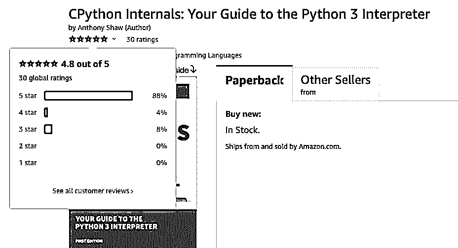

# CPython 内部:平装本现已上市！

> 原文：<https://realpython.com/cpython-internals-paperback/>

经过近两年的编写、审查和测试，我们很高兴地宣布 *CPython Internals:您的 Python 3 解释器指南*现在已经有了平装本！

Python 的某些部分看起来像魔术吗？一旦您看到 Python 在解释器级别是如何工作的，您将能够优化您的应用程序并充分利用 Python 的力量。

在 *CPython 内部*中，你将解开 Python 语言的**内部工作**，学习如何从**源代码**中编译**Python**解释器**，并涵盖你需要知道的内容，以便自信地开始**为 CPython** 做贡献！**

**在这篇文章中，你会看到:**

*   如何通过 *CPython 内部*将您的 Python 技能提升到**下一个级别**
*   其他的蟒蛇是如何做到的

要直接跳到精彩内容并得到这本书，请单击下面的链接:

## 可以得到平装版的 CPython Internals！

终于来了！读者一直在向我们展示他们的副本，让我们知道他们的想法:

这本书是 CPython 内部的“失踪手册”,我们期待 Python 社区从这个独特的资源中获得大量的知识和技能。我们对最终产品非常满意，因此作者安东尼·肖将带您了解这本书的平装本:

[https://player.vimeo.com/video/547764410](https://player.vimeo.com/video/547764410)

在发布后的最初几天，观看 *CPython Internals* 在亚马逊排行榜上攀升，并迅速成为 Python 编程的 **#1 畅销书**简直是一场疯狂之旅:

这本书迅速成为畅销书排行榜第一的事实本身就足以值得庆祝了！但看到它迄今为止收到的评论都是非常积极的，这也是令人难以置信的收获:

得知如此多的学习者正在使用这本书更深入地学习 Python，以便他们能够从仅仅使用 Python 到实际自己构建 Python，这确实是令人鼓舞的。我们希望在您亲自借阅这本书时收到您的来信。

[*Remove ads*](/account/join/)

## 谁应该阅读 CPython 内部？

如果你想解开 Python 语言的内部工作原理，从源代码编译 Python 解释器，或者参与 CPython 的开发，那么 *CPython Internals* 将会给你你需要的实用技能和知识。

Python 的创造者吉多·范·罗苏姆甚至亲自推荐了这本书:

> 我可以向任何想在 CPython 上开始学习黑客技术的人推荐 CPython 的内部知识。([来源](https://www.youtube.com/watch?v=aYbNh3NS7jA&t=2735s))
> 
> — *吉多·范·罗苏姆*，Python 的创造者

他在最近的一次采访中分享了自己的想法:

[https://player.vimeo.com/video/556300076](https://player.vimeo.com/video/556300076)

通过这篇 CPython 内部指南，深入理解 Python 变得前所未有的简单。

### 想了解 Python 3 解释器的源代码？

如果您想理解 CPython 3.x 解释器的源代码，那么您将深入了解列表、字典和生成器等概念的内部工作原理。在动手练习和平易近人的解释的帮助下，您将对 Python 的实际工作原理有一个深刻的理解:

> **幕后之旅……**
> 
> 本指南是一个非常简单的介绍，深入到 Python 的核心解释器是如何工作的。对我来说，它在介绍 Python 如何工作和思考方面做得非常好，并且打开了许多探索和学习 Python 如何工作以及为什么工作的地方。
> 
> 非常高兴我得到了这个，因为它为我打开了许多理解的大门。我仍然需要多读几遍才能真正理解它，但作为一个片段的游览，以及它们为什么在那里和如何一起工作，这是非常受欢迎的。(⭐⭐⭐⭐⭐)
> 
> — *艾伦·墨菲*(通过亚马逊)

### 想从头开始制作自己版本的 Python 吗？

如果您想修改 Python 的语法并从头编译您自己的版本，那么您将通过添加新功能来定制 Python 的核心数据类型，然后运行 CPython 的自动化测试套件。您将有能力塑造 Python 来满足您的需求:

> **详细翔实的阅读！**
> 
> 超赞的书！非常描述 CPython 的内部。无论你是希望**定制 Python 解释器**和**添加新的语言特性**，还是仅仅为了更好地理解语言的内部原理，这都是一本很棒的书！虽然是技术性的，但对于那些对 Python 感兴趣的人来说，这并不是一本枯燥的读物。(⭐⭐⭐⭐⭐)
> 
> ——*达斯汀·雷德蒙*(通过亚马逊)

### 想为 CPython 做贡献？

如果您想参与 CPython 的开发，那么您将学习如何为 Python 解释器和标准库的未来版本做出贡献。作为 Python 核心开发人员，您将有一种新的方式参与 Python 社区:

> **真详细**
> 
> 好书。如果你想更深入地了解 Python 知识的话，非常详细。还包括环境设置，这对于没有 C 语言背景的人来说可能很好。非常友好地深入 Python 的二元性。不要以为你需要擅长 C 才能拿起这本书。老实说，任何与真正的 Python 团队相关的东西都是笨蛋。(⭐⭐⭐⭐⭐)
> 
> — *Js* (通过亚马逊)

这本书写得很清楚，将为那些寻找这类信息的人打开一个新的世界！

## 你还需要知道什么？

在内容上，印刷版与*真蟒*网上商店上的[数字版](https://realpython.com/products/cpython-internals-book/)完全相同。亚马逊还为这本书提供了强大的 **30 天退款保证**，所以对你来说零风险。要获取打印副本，请单击下面的按钮:

[Buy on **Amazon** »](https://realpython.com/asins/1775093344/)

点击该按钮应该会自动将您重定向到您当地的亚马逊商店。或者您可以使用下面的直接链接:

*   [Amazon.com(美国&国际)](https://www.amazon.com/dp/1775093344/?tag=devdetailpage02-20)
*   [亚马逊网站(加拿大)](https://www.amazon.ca/dp/1775093344/?tag=devdetailpage-20)
*   [Amazon.co.uk(英国)](https://www.amazon.co.uk/dp/1775093344/?tag=devdetailpage-21)
*   [Amazon.de(德国&欧洲)](https://www.amazon.de/dp/1775093344/?tag=devdetailpa08-21)
*   [亚马逊印度站](https://www.amazon.in/dp/1775093344/)

如果您当地的亚马逊商店没有在这里列出，那么尝试在图书部分搜索“CPython Internals”或 ISBN `1775093344`，它应该会出现。

如果你得到了平装本，那么你仍然可以获得数字版本中包含的所有额外资料。因此，通过可下载的示例代码和范例，您将获得与数字版用户相同的出色体验。

如果亚马逊没有送货到你的地址，那么你应该可以通过给他们 ISBN 码`1775093344`从任何一家当地书店订购这本书。这本书可能需要一段时间才能上市，因为我们刚刚出版了它，但它不仅限于在亚马逊上销售。只是亚马逊是最大的分销渠道，所以这是我们现在推出的重点。

[*Remove ads*](/account/join/)

## 使用 CPython 内部组件将您的 Python 提升到一个新的水平！

听说读者已经从这本书中获益良多，这是很值得的，我们也很乐意**收到你的来信**！我们从 Python 社区得到的反馈是*无价的*——我们都对最终的书的结果非常满意。感谢您的支持！要获得这本书，请单击下面的链接:

[Buy on **Amazon** »](https://realpython.com/asins/1775093344/)

一旦你拿到了这本书，如果你能在亚马逊上添加你自己的评论和评级，那将是一个巨大的帮助。请随时直接联系我们，让我们知道您的 Python 之旅进展如何，以及您需要什么样的学习资源来迈出下一大步。**