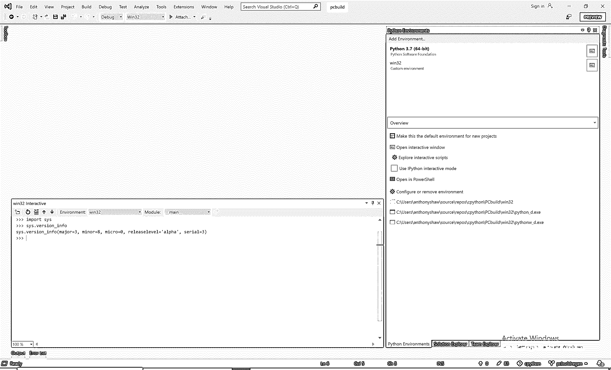
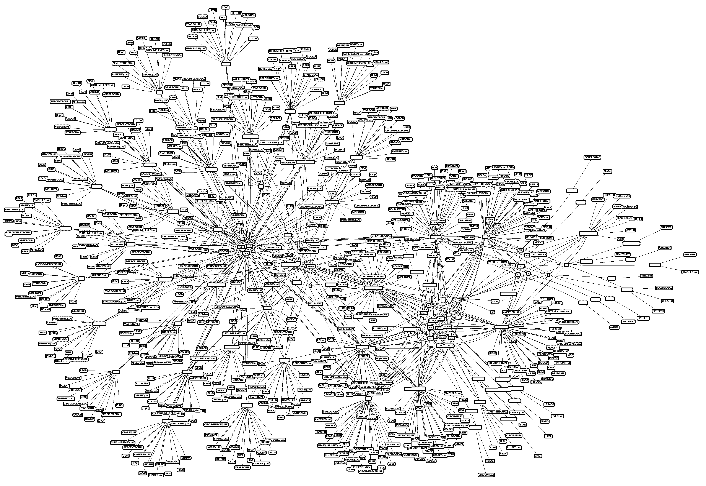
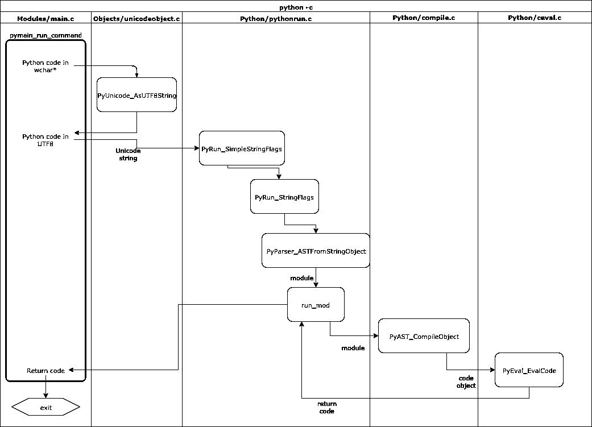
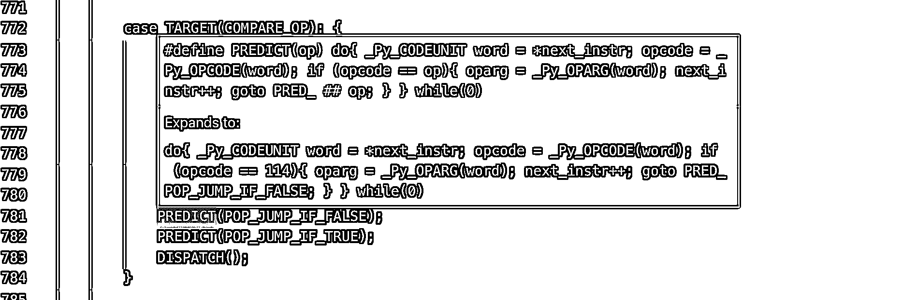
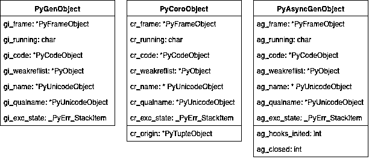

# CPython 源代码指南

> 原文：<https://realpython.com/cpython-source-code-guide/>

Python 的某些部分看起来很神奇吗？比如说，字典怎么会比遍历一个列表来查找一个条目快得多。每次生成一个值时，生成器是如何记住变量的状态的？为什么你从来不需要像其他语言一样分配内存？事实证明，最流行的 Python 运行时 CPython 是用人类可读的 [C](https://realpython.com/c-for-python-programmers/) 和 Python 代码编写的。本教程将带您浏览 CPython 源代码。

您将涉及到 CPython 内部背后的所有概念，它们是如何工作的，以及可视化的解释。

**您将学习如何:**

*   阅读并浏览源代码
*   从源代码编译 CPython
*   浏览并理解列表、字典和生成器等概念的内部工作原理
*   运行测试套件
*   修改或升级 CPython 库的组件，以便在将来的版本中使用它们

是的，这是一篇很长的文章。如果你刚为自己泡了一杯新鲜的茶、咖啡或你最喜欢的饮料，那么在第一部分结束时，它会变凉。

本教程分为五个部分。花点时间学习每一部分，并确保尝试演示和交互式组件。你可以感受到一种成就感，那就是你掌握了 Python 的核心概念，可以让你成为更好的 Python 程序员。

**免费下载:** [从 CPython Internals:您的 Python 3 解释器指南](https://realpython.com/bonus/cpython-internals-sample/)获得一个示例章节，向您展示如何解锁 Python 语言的内部工作机制，从源代码编译 Python 解释器，并参与 CPython 的开发。

## 第 1 部分:CPython 简介

当你在控制台键入`python`或者安装来自[python.org](https://www.python.org)的 Python 发行版时，你正在运行 **CPython** 。CPython 是众多 Python 运行时之一，由不同的开发团队维护和编写。您可能听说过的其他一些运行时是 [PyPy](https://pypy.org/) 、 [Cython](https://cython.org/) 和 [Jython](https://www.jython.org/) 。

CPython 的独特之处在于它包含了运行时和所有 Python 运行时都使用的共享语言规范。CPython 是 Python 的“官方”或参考实现。

Python 语言规范是描述 Python 语言的文档。例如，它说`assert`是一个[保留关键字](https://realpython.com/python-keywords/)，而`[]`用于索引、切片和创建空列表。

考虑一下您希望在您的计算机上的 Python 发行版中包含什么:

*   当你在没有文件或模块的情况下键入`python`时，它会给出一个交互式提示。
*   可以像`json`一样从标准库中导入内置模块。
*   您可以使用`pip`从互联网安装软件包。
*   您可以使用内置的`unittest`库测试您的应用程序。

这些都是 CPython 发行版的一部分。不仅仅是一个编译器。

**注:**本文是针对 CPython 源代码的 [3.8.0b4](https://github.com/python/cpython/tree/v3.8.0b4) 版本编写的。

[*Remove ads*](/account/join/)

### 源代码里有什么？

CPython 源代码发行版附带了一整套工具、库和组件。我们将在本文中探讨这些问题。首先，我们将关注编译器。

要下载 CPython 源代码的副本，您可以使用 [`git`](https://realpython.com/python-git-github-intro/) 将最新版本下载到本地的工作副本中:

```py
$ git clone https://github.com/python/cpython
$ cd cpython
$ git checkout v3.8.0b4
```

**注意:**如果你没有 Git 可用，你可以直接从 GitHub 网站下载一个 [ZIP](https://github.com/python/cpython/archive/v3.8.0b4.zip) 文件的源代码。

在新下载的`cpython`目录中，您会发现以下子目录:

```py
cpython/
│
├── Doc      ← Source for the documentation
├── Grammar  ← The computer-readable language definition
├── Include  ← The C header files
├── Lib      ← Standard library modules written in Python
├── Mac      ← macOS support files
├── Misc     ← Miscellaneous files
├── Modules  ← Standard Library Modules written in C
├── Objects  ← Core types and the object model
├── Parser   ← The Python parser source code
├── PC       ← Windows build support files
├── PCbuild  ← Windows build support files for older Windows versions
├── Programs ← Source code for the python executable and other binaries
├── Python   ← The CPython interpreter source code
└── Tools    ← Standalone tools useful for building or extending Python
```

接下来，我们将从源代码编译 CPython。这一步需要一个 C 编译器和一些构建工具，这取决于您使用的操作系统。

### 编译 CPython (macOS)

在 macOS 上编译 CPython 很简单。您首先需要基本的 C 编译器工具包。命令行开发工具是一款可以通过 App Store 在 macOS 中更新的应用。您需要在终端上执行初始安装。

要在 macOS 中打开一个终端，进入 Launchpad，然后选择*其他*然后选择*终端*应用。你会想把这个应用程序保存到你的 Dock，所以右击图标，选择*保留在 Dock* 。

现在，在终端中，通过运行以下命令安装 C 编译器和工具包:

```py
$ xcode-select --install
```

这个命令将弹出一个下载和安装一组工具的提示，包括 Git、Make 和 GNU C 编译器。

你还需要一个 OpenSSL 的工作副本，用于从 PyPi.org 网站获取包。如果您以后计划使用这个版本来安装额外的包，SSL 验证是必需的。

在 macOS 上安装 OpenSSL 最简单的方法是使用[自制软件](https://brew.sh)。如果已经安装了 HomeBrew，可以用`brew install`命令安装 CPython 的依赖项:

```py
$ brew install openssl xz zlib
```

既然有了依赖项，就可以运行`configure`脚本，通过发现 HomeBrew 安装的位置并启用调试挂钩`--with-pydebug`来启用 SSL 支持:

```py
$ CPPFLAGS="-I$(brew --prefix zlib)/include" \
 LDFLAGS="-L$(brew --prefix zlib)/lib" \
 ./configure --with-openssl=$(brew --prefix openssl) --with-pydebug
```

这将在存储库的根中生成一个`Makefile`,您可以使用它来自动化构建过程。`./configure`步骤只需要运行一次。您可以通过运行以下命令来构建 CPython 二进制文件:

```py
$ make -j2 -s
```

`-j2`标志允许`make`同时运行两个任务。如果你有 4 个核心，你可以把这个改成 4。`-s`标志阻止`Makefile`打印它运行到控制台的每个命令。您可以删除它，但是输出非常冗长。

在构建过程中，您可能会收到一些错误，在摘要中，它会通知您并非所有的包都可以构建。例如，`_dbm`、`_sqlite3`、`_uuid`、`nis`、`ossaudiodev`、`spwd`和`_tkinter`将无法使用这组指令进行构建。如果您不打算针对这些包进行开发，那也没关系。如果是，那么请访问[开发指南](https://devguide.python.org/)网站了解更多信息。

构建需要几分钟，并生成一个名为`python.exe`的二进制文件。每次修改源代码时，您都需要使用相同的标志重新运行`make`。`python.exe`二进制文件是 CPython 的调试二进制文件。执行`python.exe`查看工作中的 REPL:

```py
$ ./python.exe
Python 3.8.0b4 (tags/v3.8.0b4:d93605de72, Aug 30 2019, 10:00:03) 
[Clang 10.0.1 (clang-1001.0.46.4)] on darwin
Type "help", "copyright", "credits" or "license" for more information.
>>>
```

**注:**对，没错，macOS build 有一个文件扩展名为`.exe`。这是*而不是*，因为它是 Windows 二进制文件。因为 macOS 有一个不区分大小写的文件系统，当处理二进制文件时，开发人员不希望人们意外地引用目录`Python/`，所以添加了`.exe`以避免歧义。如果您稍后运行`make install`或`make altinstall`，它会将文件重新命名为`python`。

[*Remove ads*](/account/join/)

### 编译 CPython (Linux)

对于 Linux，第一步是下载并安装`make`、`gcc`、`configure`和`pkgconfig`。

对于 Fedora Core、RHEL、CentOS 或其他基于 yum 的系统:

```py
$ sudo yum install yum-utils
```

对于 Debian、Ubuntu 或其他基于`apt`的系统:

```py
$ sudo apt install build-essential
```

然后为 Fedora Core、RHEL、CentOS 或其他基于 yum 的系统安装所需的软件包:

```py
$ sudo yum-builddep python3
```

对于 Debian、Ubuntu 或其他基于`apt`的系统:

```py
$ sudo apt install libssl-dev zlib1g-dev libncurses5-dev \
  libncursesw5-dev libreadline-dev libsqlite3-dev libgdbm-dev \
  libdb5.3-dev libbz2-dev libexpat1-dev liblzma-dev libffi-dev
```

既然有了依赖关系，就可以运行`configure`脚本，启用调试钩子`--with-pydebug`:

```py
$ ./configure --with-pydebug
```

查看输出以确保 OpenSSL 支持被标记为`YES`。否则，请检查您的发行版以获得安装 OpenSSL 头文件的说明。

接下来，您可以通过运行生成的`Makefile`来构建 CPython 二进制文件:

```py
$ make -j2 -s
```

在构建过程中，您可能会收到一些错误，在摘要中，它会通知您并非所有的包都可以构建。如果您不打算针对这些包进行开发，那也没关系。如果是的话，请访问[开发指南](https://devguide.python.org/)网站了解更多信息。

构建需要几分钟，并生成一个名为`python`的二进制文件。这是 CPython 的调试二进制文件。执行`./python`查看工作中的 REPL:

```py
$ ./python
Python 3.8.0b4 (tags/v3.8.0b4:d93605de72, Aug 30 2019, 10:00:03) 
[Clang 10.0.1 (clang-1001.0.46.4)] on darwin
Type "help", "copyright", "credits" or "license" for more information.
>>>
```

### 编译 CPython (Windows)

PC 文件夹中有一个 Visual Studio 项目文件，用于构建和探索 CPython。若要使用此功能，您需要在 PC 上安装 Visual Studio。

Visual Studio 的最新版本 Visual Studio 2019 更容易使用 Python 和 CPython 源代码，因此建议在本教程中使用。如果你已经安装了 Visual Studio 2017，那也可以。

编译 CPython 或本教程不需要任何付费功能。可以使用 Visual Studio 的社区版，可以从[微软的 Visual Studio 网站](https://visualstudio.microsoft.com/vs/)免费获得。

下载安装程序后，会要求您选择要安装的组件。本教程的最低要求是:

*   **Python 开发**工作量
*   可选的 **Python 原生开发工具**
*   Python 3 64 位(3.7.2)(如果已经安装了 Python 3.7，可以取消选择)

如果您想更谨慎地使用磁盘空间，可以取消选择任何其他可选功能:

[](https://files.realpython.com/media/Screen_Shot_2019-08-22_at_2.47.23_pm.5e8682a89503.png)

安装程序将下载并安装所有需要的组件。安装可能需要一个小时，所以您可能想继续阅读并回到这一部分。

一旦安装程序完成，点击*启动*按钮启动 Visual Studio。系统将提示您登录。如果您有 Microsoft 帐户，您可以登录，或者跳过这一步。

Visual Studio 启动后，将提示您打开一个项目。开始 Git 配置和克隆 CPython 的一个快捷方式是选择*克隆或检出代码*选项:

[](https://files.realpython.com/media/Capture3.e19765d74ec4.PNG)

对于项目 URL，键入`https://github.com/python/cpython`进行克隆:

[](https://files.realpython.com/media/Capture4.ea01418a971c.PNG)

然后，Visual Studio 将使用 Visual Studio 捆绑的 Git 版本从 GitHub 下载一份 CPython。这一步也省去了在 Windows 上安装 Git 的麻烦。下载可能需要 10 分钟。

一旦项目下载完毕，您需要点击*解决方案和项目*并选择`pcbuild.sln`，将它指向 **`pcbuild`** 解决方案文件:

[](https://files.realpython.com/media/Capture6.3d06a62b8e87.PNG)

当加载解决方案时，它会提示您将解决方案中的项目重定向到已安装的 C/C++编译器版本。Visual Studio 还将针对您已安装的 Windows SDK 版本。

确保将 Windows SDK 版本更改为最新安装的版本，并将平台工具集更改为最新版本。如果您错过了这个窗口，您可以在*解决方案和项目*窗口中右键单击该解决方案，然后单击*重定向解决方案*。

一旦完成，您需要下载一些源文件来构建整个 CPython 包。在`PCBuild`文件夹中有一个`.bat`文件可以自动完成这个任务。[打开下载的`PCBuild`中的](https://www.youtube.com/watch?v=bgSSJQolR0E)命令行提示符，运行`get_externals.bat`:

```py
 > get_externals.bat
Using py -3.7 (found 3.7 with py.exe)
Fetching external libraries...
Fetching bzip2-1.0.6...
Fetching sqlite-3.21.0.0...
Fetching xz-5.2.2...
Fetching zlib-1.2.11...
Fetching external binaries...
Fetching openssl-bin-1.1.0j...
Fetching tcltk-8.6.9.0...
Finished.
```

接下来，回到 Visual Studio 中，通过按下`Ctrl`+`Shift`+`B`或者从顶部菜单中选择*构建解决方案*来构建 CPython。如果您收到任何关于 Windows SDK 丢失的错误，请确保您在*重定目标解决方案*窗口中设置了正确的目标设置。您还应该在开始菜单中看到 *Windows 工具包*，在该菜单中看到 *Windows 软件开发工具包*。

第一次构建阶段可能需要 10 分钟或更长时间。构建完成后，您可能会看到一些警告，您可以忽略这些警告并最终完成构建。

要启动 CPython 的调试版本，按下 `F5` ，CPython 将以调试模式直接进入 REPL:

[](https://files.realpython.com/media/Capture8.967a3606daf0.PNG)

一旦完成，您可以通过将构建配置从顶部菜单栏上的 *Debug* 更改为 *Release* 来运行发布构建，并再次运行构建解决方案。现在在`PCBuild\win32\`中已经有了 CPython 二进制文件的调试版本和发布版本。

通过从顶部菜单中选择*`Tools`->-`Python`->-`Python Environments`-*，可以将 Visual Studio 设置为能够使用发布版本或调试版本打开 REPL:

[](https://files.realpython.com/media/Environments.96a819ecf0b3.png)

然后点击*添加环境*，然后针对调试或发布二进制。调试二进制会以`_d.exe`结尾，比如`python_d.exe`和`pythonw_d.exe`。您很可能希望使用调试二进制文件，因为它附带了 Visual Studio 中的调试支持，对本教程很有用。

在添加环境窗口中，将`python_d.exe`文件作为`PCBuild/win32`中的解释器，将`pythonw_d.exe`作为窗口解释器:

[](https://files.realpython.com/media/environment3.d33858c1f6aa.PNG)

现在，您可以通过单击 Python 环境窗口中的*打开交互窗口*来启动 REPL 会话，您将看到 Python 编译版本的 REPL:

[](https://files.realpython.com/media/environment4.7c9eade3b74e.PNG)

在本教程中，将有示例命令的 REPL 会话。我鼓励您使用调试二进制文件来运行这些 REPL 会话，以防您想要在代码中放置任何断点。

最后，为了更容易地浏览代码，在解决方案视图中，单击 Home 图标旁边的切换按钮切换到文件夹视图:

[](https://files.realpython.com/media/environments5.6462694398e3.6fb872a5f57d.png)

现在您已经有了一个编译好的 CPython 版本，让我们看看 CPython 编译器是如何工作的。

[*Remove ads*](/account/join/)

### 编译器做什么？

编译器的目的是把一种语言转换成另一种语言。把编译器想象成翻译器。你会雇一个翻译听你说英语，然后说日语:

[](https://files.realpython.com/media/t.38be306a7e83.png)

一些编译器会编译成可以直接在系统上执行的低级机器码。其他编译器将编译成中间语言，由虚拟机执行。

选择编译器时要做的一个重要决定是系统可移植性要求。 [Java](https://en.wikipedia.org/wiki/Java_bytecode) 和[。NET CLR](https://en.wikipedia.org/wiki/Common_Language_Runtime) 将编译成一种中间语言，这样编译后的代码可以跨多个系统架构移植。C、Go、C++和 Pascal 将编译成一个低级可执行文件，该文件只能在与它被编译的系统相似的系统上运行。

因为 Python 应用程序通常以源代码的形式发布，所以 Python 运行时的作用是转换 Python 源代码并在一个步骤中执行它。在内部，CPython 运行时会编译您的代码。一个流行的误解是 Python 是一种解释型语言。它实际上是编译的。

Python 代码不会被编译成机器代码。它被编译成一种特殊的低级中介语言，叫做**字节码**，只有 CPython 理解。这段代码存储在隐藏目录中的`.pyc`文件中，并被缓存以供执行。如果在不改变源代码的情况下运行同一个 Python 应用程序两次，第二次总会快得多。这是因为它加载编译后的字节码并直接执行。

### 为什么 CPython 是用 C 写的而不是 Python？

CPython 中的 **C** 是对 C 编程语言的引用，暗示这个 Python 发行版是用 C 语言编写的。

这种说法在很大程度上是正确的:CPython 中的编译器是用纯 C 编写的。然而，许多标准库模块是用纯 Python 或 C 和 Python 的组合编写的。

**那么为什么 CPython 是用 C 而不是 Python 写的呢？**

答案就在编译器是如何工作的。有两种类型的编译器:

1.  **[自托管编译器](https://en.wikipedia.org/wiki/Self-hosting)** 是用自己编译的语言编写的编译器，比如 Go 编译器。
2.  **[源对源编译器](https://en.wikipedia.org/wiki/Source-to-source_compiler)** 是用另一种语言编写的已经有编译器的编译器。

如果你正在从头开始编写一门新的编程语言，你需要一个可执行的应用程序来编译你的编译器！你需要一个编译器来执行任何事情，所以当开发新的语言时，它们通常首先用一种更老、更成熟的语言来编写。

一个很好的例子就是 Go 编程语言。第一个 Go 编译器是用 C 写的，后来一旦 Go 可以编译了，编译器就用 Go 重写了。

CPython 保留了它的 C 遗产:许多标准库模块，如`ssl`模块或`sockets`模块，都是用 C 编写的，以访问低级操作系统 API。Windows 和 Linux 内核中用于[创建网络套接字](https://realpython.com/python-sockets/)、[处理文件系统](https://realpython.com/working-with-files-in-python/)或[与显示器](https://realpython.com/python-gui-with-wxpython/)交互的 API 都是用 C 语言编写的。Python 的可扩展性层专注于 C 语言是有意义的。在本文的后面，我们将介绍 Python 标准库和 C 模块。

有一个用 Python 写的 Python 编译器叫做 [PyPy](https://realpython.com/pypy-faster-python/) 。PyPy 的标志是一只[大毒蛇](https://en.wikipedia.org/wiki/Ouroboros)，代表编译器的自托管特性。

Python 交叉编译器的另一个例子是 Jython。Jython 用 Java 编写，从 Python 源代码编译成 Java 字节码。与 CPython 使从 Python 导入和使用 C 库变得容易一样，Jython 也使导入和引用 Java 模块和类变得容易。

### Python 语言规范

包含在 CPython 源代码中的是 Python 语言的定义。这是所有 Python 解释器使用的参考规范。

该规范有人类可读和机器可读两种格式。文档中详细解释了 Python 语言，什么是允许的，以及每个语句应该如何表现。

#### 文档

位于`Doc/reference`目录中的是对 Python 语言中每个特性的 [reStructuredText](http://docutils.sourceforge.net/rst.html) 解释。这就形成了 docs.python.org 的官方 Python 参考指南。

目录中有您理解整个语言、结构和关键字所需的文件:

```py
cpython/Doc/reference
|
├── compound_stmts.rst
├── datamodel.rst
├── executionmodel.rst
├── expressions.rst
├── grammar.rst
├── import.rst
├── index.rst
├── introduction.rst
├── lexical_analysis.rst
├── simple_stmts.rst
└── toplevel_components.rst
```

在复合语句的文档`compound_stmts.rst`中，您可以看到一个定义 [`with`语句](https://realpython.com/python-with-statement/)的简单示例。

在 Python 中可以以多种方式使用`with`语句，最简单的是上下文管理器和嵌套代码块的[实例化:](https://dbader.org/blog/python-context-managers-and-with-statement)

```py
with x():
   ...
```

您可以使用`as`关键字将结果赋给一个变量:

```py
with x() as y:
   ...
```

您还可以用逗号将上下文管理器链接在一起:

```py
with x() as y, z() as jk:
   ...
```

接下来，我们将探索 Python 语言的计算机可读文档。

#### 语法

文档包含人类可读的语言规范，机器可读的规范存放在一个文件中， [`Grammar/Grammar`](https://github.com/python/cpython/blob/master/Grammar/Grammar) 。

语法文件是用一种叫做[巴克斯-诺尔形式(BNF)](https://en.m.wikipedia.org/wiki/Backus%E2%80%93Naur_form) 的上下文符号编写的。BNF 不是 Python 特有的，它经常被用作许多其他语言的语法符号。

编程语言中语法结构的概念是受 20 世纪 50 年代[诺姆·乔姆斯基关于句法结构的工作](https://en.wikipedia.org/wiki/Syntactic_Structures)的启发！

Python 的语法文件使用带有正则表达式语法的扩展 BNF (EBNF)规范。所以，在语法文件中你可以使用:

*   **`*`** 为重复
*   **`+`** 为至少重复一次
*   **`[]`** 为可选零件
*   **`|`** 为替代品
*   **`()`** 进行分组

如果您在语法文件中搜索`with`语句，在第 80 行左右，您会看到`with`语句的定义:

```py
with_stmt: 'with' with_item (',' with_item)*  ':' suite
with_item: test ['as' expr]
```

引号中的任何内容都是字符串文字，这就是关键字的定义方式。因此`with_stmt`被指定为:

1.  从单词`with`开始
2.  后面跟着一个`with_item`，它是一个`test`和(可选)，单词`as`，以及一个表达式
3.  跟随一个或多个项目，每个项目用逗号分隔
4.  以`:`结尾
5.  后面跟着一个`suite`

这两行中引用了其他一些定义:

*   **`suite`** 指带有一条或多条语句的代码块
*   **`test`** 指被评价的简单陈述
*   **`expr`** 指简单的表情

如果您想详细研究这些内容，可以在这个文件中定义整个 Python 语法。

如果你想看看最近一个如何使用语法的例子，在 PEP 572 中，**冒号等于**操作符被添加到了[这个 Git 提交](https://github.com/python/cpython/commit/8f59ee01be3d83d5513a9a3f654a237d77d80d9a#diff-cb0b9d6312c0d67f6d4aa1966766cedd)的语法文件中。

#### 使用`pgen`

Python 编译器从不使用语法文件本身。取而代之的是使用一个名为`pgen`的工具创建的解析表。`pgen`读取语法文件并将其转换成一个解析器表。如果您对语法文件进行了更改，您必须重新生成解析器表并重新编译 Python。

**注:**`pgen`应用在 Python 3.8 中从 C 重写为[纯 Python](https://github.com/python/cpython/blob/master/Parser/pgen/pgen.py) 。

为了看到`pgen`的运行，让我们改变 Python 语法的一部分。在第 51 行你会看到一个 [`pass`语句](https://realpython.com/python-pass/)的定义:

```py
pass_stmt: 'pass'
```

更改该行以接受关键字`'pass'`或`'proceed'`作为关键字:

```py
pass_stmt: 'pass' | 'proceed'
```

现在您需要重建语法文件。在 macOS 和 Linux 上，运行`make regen-grammar`对修改后的语法文件运行`pgen`。对于 Windows，没有官方支持的运行方式`pgen`。然而，您可以从`PCBuild`目录中克隆 [my fork](https://github.com/tonybaloney/cpython/tree/pcbuildregen) 并运行`build.bat --regen`。

您应该会看到类似这样的输出，显示新的`Include/graminit.h`和`Python/graminit.c`文件已经生成:

```py
# Regenerate Doc/library/token-list.inc from Grammar/Tokens
# using Tools/scripts/generate_token.py
...
python3 ./Tools/scripts/update_file.py ./Include/graminit.h ./Include/graminit.h.new
python3 ./Tools/scripts/update_file.py ./Python/graminit.c ./Python/graminit.c.new
```

**注:** `pgen`的工作原理是将 EBNF 语句转换成[非确定性有限自动机(NFA)](https://en.wikipedia.org/wiki/Nondeterministic_finite_automaton) ，然后再转换成[确定性有限自动机(DFA)](https://en.wikipedia.org/wiki/Deterministic_finite_automaton) 。解析器使用 DFA 以 CPython 特有的特殊方式解析表。这项技术由斯坦福大学开发，开发于 20 世纪 80 年代，就在 Python 出现之前。

使用重新生成的解析器表，您需要重新编译 CPython 来查看新的语法。对您的操作系统使用与前面相同的编译步骤。

如果代码编译成功，您可以执行新的 CPython 二进制文件并启动 REPL。

在 REPL 中，您现在可以尝试定义一个函数，而不是使用`pass`语句，而是使用您编译到 Python 语法中的`proceed`关键字替代:

```py
Python 3.8.0b4 (tags/v3.8.0b4:d93605de72, Aug 30 2019, 10:00:03) 
[Clang 10.0.1 (clang-1001.0.46.4)] on darwin
Type "help", "copyright", "credits" or "license" for more information.
>>> def example():
...    proceed
... 
>>> example()
```

干得好！您已经更改了 CPython 语法并编译了您自己版本的 CPython。装运它！

接下来，我们将探索标记及其与语法的关系。

#### 代币

在`Grammar`文件夹中的语法文件旁边是一个 [`Tokens`](https://github.com/python/cpython/blob/master/Grammar/Tokens) 文件，它包含在解析树中作为叶节点发现的每个唯一类型。我们将在后面深入讨论解析器树。每个令牌还有一个名称和一个生成的唯一 ID。这些名称是用来简化在记号赋予器中的引用。

**注意:**`Tokens`文件是 Python 3.8 中的新特性。

比如左括号叫`LPAR`，分号叫`SEMI`。您将在本文后面看到这些令牌:

```py
LPAR                    '('
RPAR                    ')'
LSQB                    '['
RSQB                    ']'
COLON                   ':'
COMMA                   ','
SEMI                    ';'
```

和`Grammar`文件一样，如果你改变了`Tokens`文件，你需要再次运行`pgen`。

要查看令牌的运行情况，可以使用 CPython 中的`tokenize`模块。创建一个名为`test_tokens.py`的简单 Python 脚本:

```py
# Hello world!
def my_function():
   proceed
```

在本教程的其余部分，`./python.exe`将引用 CPython 的编译版本。但是，实际的命令将取决于您的系统。

对于 Windows:

```py
 > python.exe
```

对于 Linux:

```py
 > ./python
```

对于 macOS:

```py
 > ./python.exe
```

然后将这个文件传递给标准库中内置的一个名为`tokenize`的模块。您将看到按行和字符排列的标记列表。使用`-e`标志输出确切的令牌名称:

```py
$ ./python.exe -m tokenize -e test_tokens.py

0,0-0,0:            ENCODING       'utf-8' 
1,0-1,14:           COMMENT        '# Hello world!'
1,14-1,15:          NL             '\n' 
2,0-2,3:            NAME           'def' 
2,4-2,15:           NAME           'my_function' 
2,15-2,16:          LPAR           '(' 
2,16-2,17:          RPAR           ')' 
2,17-2,18:          COLON          ':' 
2,18-2,19:          NEWLINE        '\n' 
3,0-3,3:            INDENT         '   ' 
3,3-3,7:            NAME           'proceed' 
3,7-3,8:            NEWLINE        '\n' 
4,0-4,0:            DEDENT         '' 
4,0-4,0:            ENDMARKER      ''
```

在输出中，第一列是行/列坐标的范围，第二列是标记的名称，最后一列是标记的值。

在输出中，`tokenize`模块暗示了一些不在文件中的标记。用于`utf-8`的`ENCODING`标记，末尾有一个空行，给`DEDENT`关闭函数声明，给`ENDMARKER`结束文件。

最佳实践是在 Python 源文件的末尾有一个空行。如果您省略了它，CPython 会为您添加它，但性能会稍有下降。

`tokenize`模块是用纯 Python 编写的，位于 CPython 源代码内的 [`Lib/tokenize.py`](https://github.com/python/cpython/blob/master/Lib/tokenize.py) 。

**重要提示:**CPython 源代码中有两个标记器:一个用 Python 编写，这里演示一下，另一个用 C 编写，用 Python 编写的标记器是一个实用程序，用 C 编写的标记器是供 Python 编译器使用的。它们有相同的输出和行为。用 C 写的版本是为性能设计的，Python 中的模块是为调试设计的。

要查看 C tokenizer 的详细读数，可以使用`-d`标志运行 Python。使用您之前创建的`test_tokens.py`脚本，通过以下命令运行它:

```py
$ ./python.exe -d test_tokens.py

Token NAME/'def' ... It's a keyword
 DFA 'file_input', state 0: Push 'stmt'
 DFA 'stmt', state 0: Push 'compound_stmt'
 DFA 'compound_stmt', state 0: Push 'funcdef'
 DFA 'funcdef', state 0: Shift.
Token NAME/'my_function' ... It's a token we know
 DFA 'funcdef', state 1: Shift.
Token LPAR/'(' ... It's a token we know
 DFA 'funcdef', state 2: Push 'parameters'
 DFA 'parameters', state 0: Shift.
Token RPAR/')' ... It's a token we know
 DFA 'parameters', state 1: Shift.
 DFA 'parameters', state 2: Direct pop.
Token COLON/':' ... It's a token we know
 DFA 'funcdef', state 3: Shift.
Token NEWLINE/'' ... It's a token we know
 DFA 'funcdef', state 5: [switch func_body_suite to suite] Push 'suite'
 DFA 'suite', state 0: Shift.
Token INDENT/'' ... It's a token we know
 DFA 'suite', state 1: Shift.
Token NAME/'proceed' ... It's a keyword
 DFA 'suite', state 3: Push 'stmt'
...
 ACCEPT.
```

在输出中，可以看到它突出显示了`proceed`作为关键字。在下一章，我们将看到执行 Python 二进制代码是如何到达记号赋予器的，以及从那里执行代码会发生什么。

现在您已经对 Python 语法以及标记和语句之间的关系有了一个大致的了解，现在有一种方法可以将`pgen`输出转换成交互式图形。

下面是 Python 3.8a2 语法的截图:

[](https://files.realpython.com/media/Screen_Shot_2019-03-12_at_2.31.16_pm.f36c3e99b8b4.png)

用于生成此图的 Python 包`instaviz`，将在后面的章节中介绍。

[*Remove ads*](/account/join/)

### CPython 中的内存管理

在整篇文章中，你会看到对一个 [`PyArena`](https://github.com/python/cpython/blob/d93605de7232da5e6a182fd1d5c220639e900159/Python/pyarena.c#L128) 对象的引用。arena 是 CPython 的内存管理结构之一。代码在`Python/pyarena.c`中，包含一个包装 C 的内存分配和释放函数的包装器。

在传统编写的 C 程序中，开发人员*应该*在写入数据之前为数据结构分配内存。这种分配将内存标记为属于操作系统的进程。

当分配的内存不再被使用时，由开发人员解除分配或“释放”它，并将其返回到操作系统的空闲内存块表中。如果一个进程为一个变量分配内存，比如在一个函数或循环中，当该函数完成时，内存不会自动交还给 C 中的操作系统，因此，如果它没有在 C 代码中被显式释放，就会导致内存泄漏。每次该函数运行时，该进程将继续占用更多的内存，直到最终系统耗尽内存并崩溃！

Python 将这一职责从程序员手中夺走，并使用两种算法:[一个引用计数器和一个垃圾收集器](https://realpython.com/python-memory-management/)。

每当解释器被实例化时，一个 [`PyArena`](https://github.com/python/cpython/blob/d93605de7232da5e6a182fd1d5c220639e900159/Python/pyarena.c#L128) 被创建并附加到解释器中的一个字段。在 CPython 解释器的生命周期中，可以分配许多领域。它们由一个[链表](https://realpython.com/linked-lists-python/)连接。arena 将指向 Python 对象的指针列表存储为一个`PyListObject`。每当创建一个新的 Python 对象时，使用 [`PyArena_AddPyObject()`](https://github.com/python/cpython/blob/d93605de7232da5e6a182fd1d5c220639e900159/Python/pyarena.c#L203) 添加一个指向它的指针。这个函数调用在竞技场的列表中存储一个指针，`a_objects`。

即使 Python 没有指针，也有一些[有趣的技术](https://realpython.com/pointers-in-python/)来模拟指针的行为。

`PyArena`的第二个功能是分配和引用原始内存块列表。例如，如果您添加了数千个额外的值，一个`PyList`将需要额外的内存。`PyList`对象的 C 代码不直接分配内存。该对象通过从`PyObject`调用 [`PyArena_Malloc()`](https://github.com/python/cpython/blob/d93605de7232da5e6a182fd1d5c220639e900159/Python/pyarena.c#L180) 从`PyArena`获取所需内存大小的原始内存块。这个任务由`Objects/obmalloc.c`中的另一个抽象完成。在对象分配模块中，可以为 Python 对象分配、释放和重新分配内存。

arena 内部存储了一个已分配内存块的链表，这样当一个解释器停止时，可以使用 [`PyArena_Free()`](https://github.com/python/cpython/blob/d93605de7232da5e6a182fd1d5c220639e900159/Python/pyarena.c#L157) 一次性释放所有托管内存块。

以`PyListObject`为例。如果你把一个对象放在一个 Python 列表的末尾，你不需要事先重新分配现有列表中使用的内存。`.append()`方法调用 [`list_resize()`](https://github.com/python/cpython/blob/d93605de7232da5e6a182fd1d5c220639e900159/Objects/listobject.c#L36) 来处理列表的内存分配。每个 list 对象保存一个分配的内存量的列表。如果要追加的项可以容纳在现有的空闲内存中，就简单地添加它。如果列表需要更多的内存空间，它会被扩展。列表的长度扩展为 0、4、8、16、25、35、46、58、72、88。

[`PyMem_Realloc()`](https://github.com/python/cpython/blob/d93605de7232da5e6a182fd1d5c220639e900159/Objects/obmalloc.c#L618) 被调用来扩展链表中分配的内存。 [`PyMem_Realloc()`](https://github.com/python/cpython/blob/d93605de7232da5e6a182fd1d5c220639e900159/Objects/obmalloc.c#L618) 是 [`pymalloc_realloc()`](https://github.com/python/cpython/blob/d93605de7232da5e6a182fd1d5c220639e900159/Objects/obmalloc.c#L1913) 的 API 包装器。

Python 还为 C 调用`malloc()`提供了一个特殊的包装器，它设置内存分配的最大大小，以帮助防止缓冲区溢出错误(参见 [`PyMem_RawMalloc()`](https://github.com/python/cpython/blob/d93605de7232da5e6a182fd1d5c220639e900159/Modules/overlapped.c#L28) )。

总而言之:

*   原始存储块的分配通过`PyMem_RawAlloc()`完成。
*   指向 Python 对象的指针存储在`PyArena`中。
*   `PyArena`还存储分配内存块的链表。

关于 API 的更多信息详见 [CPython 文档](https://docs.python.org/3/c-api/memory.html)。

#### 参考计数

要在 Python 中创建一个变量，您必须给一个唯一的命名的变量赋予一个值:

```py
my_variable = 180392
```

在 Python 中，每当给变量赋值时，都会在局部变量和全局变量范围内检查变量名，看它是否已经存在。

因为`my_variable`已经不在`locals()`或`globals()`字典中，所以这个新对象被创建，并且其值被指定为数值常量`180392`。

现在有一个对`my_variable`的引用，因此`my_variable`的引用计数器增加 1。

你会在 CPython 的整个 C 源代码中看到函数调用 [`Py_INCREF()`](https://github.com/python/cpython/blob/d93605de7232da5e6a182fd1d5c220639e900159/Objects/object.c#L239) 和 [`Py_DECREF()`](https://github.com/python/cpython/blob/d93605de7232da5e6a182fd1d5c220639e900159/Objects/object.c#L245) 。这些函数递增和递减对该对象的引用计数。

当变量超出其声明范围时，对对象的引用将减少。Python 中的作用域可以指一个函数或方法，一个理解，或者一个[λ函数](https://realpython.com/python-lambda/)。这些是一些更字面的作用域，但是还有许多其他的隐式作用域，比如将变量传递给函数调用。

基于语言的递增和递减引用的处理内置在 CPython 编译器和核心执行循环`ceval.c`中，我们将在本文后面详细介绍。

每当`Py_DECREF()`被调用，并且计数器变为 0，则 [`PyObject_Free()`](https://github.com/python/cpython/blob/d93605de7232da5e6a182fd1d5c220639e900159/Objects/obmalloc.c#L707) 函数被调用。对于这个对象， [`PyArena_Free()`](https://github.com/python/cpython/blob/d93605de7232da5e6a182fd1d5c220639e900159/Python/pyarena.c#L157) 被调用用于所有被分配的内存。

#### 垃圾收集

你的垃圾多久被收集一次？每周一次，还是两周一次？

当你用完某样东西时，你把它扔掉，扔进垃圾桶。但是垃圾不会马上被收集。你需要等垃圾车来拿走它。

CPython 有相同的原理，使用垃圾收集算法。默认情况下，CPython 的垃圾收集器是启用的，它发生在后台，用于释放已被不再使用的对象使用的内存。

因为垃圾收集算法比引用计数器复杂得多，所以它不会一直发生，否则，它会消耗大量的 CPU 资源。在一定数量的操作之后，它周期性地发生。

CPython 的标准库附带了一个 Python 模块来与 arena 和垃圾收集器接口，即`gc`模块。以下是如何在调试模式下使用`gc`模块:

>>>

```py
>>> import gc
>>> gc.set_debug(gc.DEBUG_STATS)
```

这将在垃圾收集器运行时打印统计数据。

您可以通过调用`get_threshold()`获得垃圾收集器运行的阈值:

>>>

```py
>>> gc.get_threshold()
(700, 10, 10)
```

您还可以获得当前阈值计数:

>>>

```py
>>> gc.get_count()
(688, 1, 1)
```

最后，您可以手动运行收集算法:

>>>

```py
>>> gc.collect()
24
```

这将调用包含垃圾收集器算法实现的`Modules/gcmodule.c`文件中的 [`collect()`](https://github.com/python/cpython/blob/d93605de7232da5e6a182fd1d5c220639e900159/Modules/gcmodule.c#L987) 。

[*Remove ads*](/account/join/)

### 结论

在第 1 部分中，您介绍了源代码库的结构、如何从源代码编译以及 Python 语言规范。在第 2 部分中，当您更深入地研究 Python 解释器过程时，这些核心概念将是至关重要的。

## 第 2 部分:Python 解释器过程

既然您已经看到了 Python 语法和内存管理，那么您可以遵循从键入`python`到执行代码部分的过程。

有五种方法可以调用`python`二进制文件:

1.  用`-c`和一个 Python 命令运行一个命令
2.  用`-m`和模块名启动模块
3.  使用文件名运行文件
4.  使用外壳管道运行`stdin`输入
5.  启动 REPL 并一次执行一个命令

Python 有如此多的方法来执行脚本，这可能有点让人不知所措。如果你想了解更多，Darren Jones 整理了一个关于运行 Python 脚本的很棒的课程。

您需要检查的三个源文件是:

1.  **`Programs/python.c`** 是一个简单的切入点。
2.  **`Modules/main.c`** 包含了将整个过程集合在一起的代码，加载配置，执行代码，清理内存。
3.  **`Python/initconfig.c`** 从系统环境加载配置，并将其与任何命令行标志合并。

下图显示了这些函数的调用方式:

[](https://files.realpython.com/media/swim-lanes-chart-1.9fb3000aad85.png)

执行模式由配置决定。

**CPython 源代码风格:**

与 Python 代码的 [PEP8 风格指南类似，CPython C 代码也有一个](https://realpython.com/courses/writing-beautiful-python-code-pep-8/)[官方风格指南](https://www.python.org/dev/peps/pep-0007/)，最初设计于 2001 年，并为现代版本进行了更新。

导航源代码时，有一些命名标准会有所帮助:

*   对公共函数使用前缀`Py`，不要对静态函数使用前缀。前缀`Py_`是为像`Py_FatalError`这样的全局服务例程保留的。特定的例程组(比如特定的对象类型 API)使用更长的前缀，比如字符串函数的`PyString_`。

*   公共函数和变量使用带下划线的 MixedCase，像这样: [`PyObject_GetAttr`](https://github.com/python/cpython/blob/d93605de7232da5e6a182fd1d5c220639e900159/Objects/object.c#L924) ， [`Py_BuildValue`](https://github.com/python/cpython/blob/d93605de7232da5e6a182fd1d5c220639e900159/Include/modsupport.h#L20) ，`PyExc_TypeError`。

*   有时候，一个“内部”函数必须对加载程序可见。我们为此使用了`_Py`前缀，例如 [`_PyObject_Dump`](https://github.com/python/cpython/blob/d93605de7232da5e6a182fd1d5c220639e900159/Objects/object.c#L464) 。

*   宏应该有一个 MixedCase 前缀，然后使用大写字母，例如`PyString_AS_STRING`、`Py_PRINT_RAW`。

### 建立运行时配置

[](https://files.realpython.com/media/swim-lanes-chart-1.9fb3000aad85.png)

在泳道中，您可以看到在执行任何 Python 代码之前，运行时首先建立配置。运行时的配置是在`Include/cpython/initconfig.h`中定义的数据结构，命名为 [`PyConfig`](https://github.com/python/cpython/blob/d93605de7232da5e6a182fd1d5c220639e900159/Include/cpython/initconfig.h#L407) 。

配置数据结构包括以下内容:

*   调试和优化模式等各种模式的运行时标志
*   执行模式，如是否传递了文件名，`stdin`是否提供了或模块名称
*   扩展选项，由`-X <option>`指定
*   运行时设置的环境变量

CPython 运行时主要使用配置数据来启用和禁用各种功能。

Python 还附带了几个[命令行接口选项](https://docs.python.org/3/using/cmdline.html)。在 Python 中，可以使用`-v`标志启用详细模式。在详细模式下，Python 会在加载模块时将消息打印到屏幕上:

```py
$ ./python.exe -v -c "print('hello world')"

# installing zipimport hook
import zipimport # builtin
# installed zipimport hook
...
```

您将会看到一百行或者更多的用户站点包和系统环境中的任何东西的导入。

你可以在`Include/cpython/initconfig.h`内看到这个标志的定义`struct`为 [`PyConfig`](https://github.com/python/cpython/blob/d93605de7232da5e6a182fd1d5c220639e900159/Include/cpython/initconfig.h#L407) :

```py
/* --- PyConfig ---------------------------------------------- */ typedef  struct  { int  _config_version;  /* Internal configuration version,
 used for ABI compatibility */ int  _config_init;  /* _PyConfigInitEnum value */ ... /* If greater than 0, enable the verbose mode: print a message each time a
 module is initialized, showing the place (filename or built-in module)
 from which it is loaded.

 If greater or equal to 2, print a message for each file that is checked
 for when searching for a module. Also provides information on module
 cleanup at exit.

 Incremented by the -v option. Set by the PYTHONVERBOSE environment
 variable. If set to -1 (default), inherit Py_VerboseFlag value. */ int  verbose;
```

在`Python/initconfig.c`中，建立了从环境变量和运行时命令行标志中读取设置的逻辑。

在`config_read_env_vars`功能中，环境变量被读取并用于为配置设置赋值:

```py
static  PyStatus config_read_env_vars(PyConfig  *config) { PyStatus  status; int  use_env  =  config->use_environment; /* Get environment variables */ _Py_get_env_flag(use_env,  &config->parser_debug,  "PYTHONDEBUG");   _Py_get_env_flag(use_env,  &config->verbose,  "PYTHONVERBOSE"); _Py_get_env_flag(use_env,  &config->optimization_level,  "PYTHONOPTIMIZE"); _Py_get_env_flag(use_env,  &config->inspect,  "PYTHONINSPECT");
```

对于详细设置，如果找到了`PYTHONVERBOSE`，可以看到`PYTHONVERBOSE`的值被用来设置`&config->verbose`的值。如果环境变量不存在，那么将保留默认值`-1`。

然后在`initconfig.c`内的 [`config_parse_cmdline`](https://github.com/python/cpython/blob/d93605de7232da5e6a182fd1d5c220639e900159/Python/initconfig.c#L1828) 中，命令行标志用于设置该值，如果提供:

```py
static  PyStatus config_parse_cmdline(PyConfig  *config,  PyWideStringList  *warnoptions, Py_ssize_t  *opt_index) { ... switch  (c)  { ... case  'v': config->verbose++;   break; ... /* This space reserved for other options */ default: /* unknown argument: parsing failed */ config_usage(1,  program); return  _PyStatus_EXIT(2); } }  while  (1);
```

这个值稍后被 [`_Py_GetGlobalVariablesAsDict`](https://github.com/python/cpython/blob/d93605de7232da5e6a182fd1d5c220639e900159/Python/initconfig.c#L134) 函数复制到一个全局变量`Py_VerboseFlag`。

在 Python 会话中，您可以使用名为 tuple 的`sys.flags`来访问运行时标志，比如详细模式、安静模式。`-X`标志都可以在`sys._xoptions`字典中找到:

>>>

```py
$ ./python.exe -X dev -q 

>>> import sys
>>> sys.flags
sys.flags(debug=0, inspect=0, interactive=0, optimize=0, dont_write_bytecode=0, 
 no_user_site=0, no_site=0, ignore_environment=0, verbose=0, bytes_warning=0, 
 quiet=1, hash_randomization=1, isolated=0, dev_mode=True, utf8_mode=0)

>>> sys._xoptions
{'dev': True}
```

除了`initconfig.h`中的运行时配置，还有构建配置，它位于根文件夹中的`pyconfig.h`内。这个文件是在构建过程的`configure`步骤中动态创建的，或者是由 Visual Studio for Windows 系统创建的。

您可以通过运行以下命令来查看构建配置:

```py
$ ./python.exe -m sysconfig
```

[*Remove ads*](/account/join/)

### 读取文件/输入

一旦 CPython 有了运行时配置和命令行参数，它就可以确定需要执行什么。

这个任务由`Modules/main.c`中的 [`pymain_main`](https://github.com/python/cpython/blob/d93605de7232da5e6a182fd1d5c220639e900159/Modules/main.c#L665) 函数处理。根据新创建的`config`实例，CPython 现在将执行通过几个选项提供的代码。

#### 通过`-c` 输入

最简单的方法是为 CPython 提供一个带有`-c`选项的命令和一个用引号括起来的 Python 程序。

例如:

```py
$ ./python.exe -c "print('hi')"
hi
```

以下是这一过程的完整流程图:

[](https://files.realpython.com/media/pymain_run_command.f5da561ba7d5.png)

首先，`Modules/main.c`内部执行 [`pymain_run_command()`](https://github.com/python/cpython/blob/d93605de7232da5e6a182fd1d5c220639e900159/Modules/main.c#L240) 函数，将`-c`中传递的命令作为 C 类型`wchar_t*`中的参数。由于类型的大小可以存储 UTF8 字符，`wchar_t*`类型通常被用作整个 CPython 中 [Unicode](https://realpython.com/python-encodings-guide/) 数据的低级存储类型。

当将`wchar_t*`转换成 Python 字符串时，`Objects/unicodeobject.c`文件有一个助手函数 [`PyUnicode_FromWideChar()`](https://github.com/python/cpython/blob/d93605de7232da5e6a182fd1d5c220639e900159/Objects/unicodeobject.c#L2088) ，它返回一个`PyObject`，类型为`str`。然后由 Python `str`对象上的`PyUnicode_AsUTF8String()`完成 UTF8 编码，将其转换成 Python `bytes`对象。

一旦完成， [`pymain_run_command()`](https://github.com/python/cpython/blob/d93605de7232da5e6a182fd1d5c220639e900159/Modules/main.c#L240) 将把 Python 字节对象传递给 [`PyRun_SimpleStringFlags()`](https://github.com/python/cpython/blob/d93605de7232da5e6a182fd1d5c220639e900159/Python/pythonrun.c#L453) 来执行，但是首先把`bytes`再次转换成`str`类型:

```py
static  int pymain_run_command(wchar_t  *command,  PyCompilerFlags  *cf) { PyObject  *unicode,  *bytes; int  ret; unicode  =  PyUnicode_FromWideChar(command,  -1); if  (unicode  ==  NULL)  { goto  error; } if  (PySys_Audit("cpython.run_command",  "O",  unicode)  <  0)  { return  pymain_exit_err_print(); } bytes  =  PyUnicode_AsUTF8String(unicode); Py_DECREF(unicode); if  (bytes  ==  NULL)  { goto  error; } ret  =  PyRun_SimpleStringFlags(PyBytes_AsString(bytes),  cf); Py_DECREF(bytes); return  (ret  !=  0); error: PySys_WriteStderr("Unable to decode the command from the command line:\n"); return  pymain_exit_err_print(); }
```

将`wchar_t*`转换为 Unicode、字节，然后是字符串大致相当于以下内容:

```py
unicode = str(command)
bytes_ = bytes(unicode.encode('utf8'))
# call PyRun_SimpleStringFlags with bytes_
```

[`PyRun_SimpleStringFlags()`](https://github.com/python/cpython/blob/d93605de7232da5e6a182fd1d5c220639e900159/Python/pythonrun.c#L453) 功能是`Python/pythonrun.c`的一部分。它的目的是将这个简单的命令转换成 Python 模块，然后发送出去执行。因为 Python 模块需要有`__main__`作为独立模块执行，所以它会自动创建:

```py
int PyRun_SimpleStringFlags(const  char  *command,  PyCompilerFlags  *flags) { PyObject  *m,  *d,  *v; m  =  PyImport_AddModule("__main__");   if  (m  ==  NULL) return  -1; d  =  PyModule_GetDict(m);  v  =  PyRun_StringFlags(command,  Py_file_input,  d,  d,  flags);   if  (v  ==  NULL)  { PyErr_Print(); return  -1; } Py_DECREF(v); return  0; }
```

一旦 [`PyRun_SimpleStringFlags()`](https://github.com/python/cpython/blob/d93605de7232da5e6a182fd1d5c220639e900159/Python/pythonrun.c#L453) 创建了一个模块和一个字典，它就调用 [`PyRun_StringFlags()`](https://github.com/python/cpython/blob/d93605de7232da5e6a182fd1d5c220639e900159/Python/pythonrun.c#L1008) ，后者创建一个假文件名，然后调用 Python 解析器从字符串创建一个 AST 并返回一个模块，`mod`:

```py
PyObject  * PyRun_StringFlags(const  char  *str,  int  start,  PyObject  *globals, PyObject  *locals,  PyCompilerFlags  *flags) { ... mod  =  PyParser_ASTFromStringObject(str,  filename,  start,  flags,  arena); if  (mod  !=  NULL) ret  =  run_mod(mod,  filename,  globals,  locals,  flags,  arena); PyArena_Free(arena); return  ret;
```

在下一节中，您将深入研究 AST 和解析器代码。

#### 通过`-m` 输入

执行 Python 命令的另一种方式是使用带有模块名称的`-m`选项。一个典型的例子是`python -m unittest`运行标准库中的 unittest 模块。

能够像脚本一样执行模块最初是在 [PEP 338](https://www.python.org/dev/peps/pep-0338) 中提出的，然后在 [PEP366](https://www.python.org/dev/peps/pep-0366) 中定义了显式相对导入的标准。

使用`-m`标志意味着在模块包中，您想要执行 [`__main__`](https://realpython.com/python-main-function/) 中的任何内容。这也意味着您想要在`sys.path`中搜索指定的模块。

这种搜索机制就是为什么您不需要记住`unittest`模块存储在文件系统中的什么位置。

在`Modules/main.c`内部，有一个函数在命令行运行时使用`-m`标志调用。模块的名称作为`modname`参数传递。

CPython 将导入一个标准库模块`runpy`，并使用 [`PyObject_Call()`](https://github.com/python/cpython/blob/d93605de7232da5e6a182fd1d5c220639e900159/Objects/call.c#L214) 执行它。使用位于`Python/import.c`文件中的 C API 函数 [`PyImport_ImportModule()`](https://github.com/python/cpython/blob/d93605de7232da5e6a182fd1d5c220639e900159/Python/import.c#L1409) 完成导入:

```py
static  int pymain_run_module(const  wchar_t  *modname,  int  set_argv0) { PyObject  *module,  *runpy,  *runmodule,  *runargs,  *result; runpy  =  PyImport_ImportModule("runpy"); ... runmodule  =  PyObject_GetAttrString(runpy,  "_run_module_as_main"); ... module  =  PyUnicode_FromWideChar(modname,  wcslen(modname)); ... runargs  =  Py_BuildValue("(Oi)",  module,  set_argv0); ... result  =  PyObject_Call(runmodule,  runargs,  NULL); ... if  (result  ==  NULL)  { return  pymain_exit_err_print(); } Py_DECREF(result); return  0; }
```

在这个函数中，你还会看到另外两个 C API 函数: [`PyObject_Call()`](https://github.com/python/cpython/blob/d93605de7232da5e6a182fd1d5c220639e900159/Objects/call.c#L214) 和 [`PyObject_GetAttrString()`](https://github.com/python/cpython/blob/d93605de7232da5e6a182fd1d5c220639e900159/Objects/object.c#L831) 。因为 [`PyImport_ImportModule()`](https://github.com/python/cpython/blob/d93605de7232da5e6a182fd1d5c220639e900159/Python/import.c#L1409) 返回一个`PyObject*`，核心对象类型，需要调用特殊函数来获取属性并调用它。

在 Python 中，如果你有一个对象并想获得一个属性，那么你可以调用`getattr()`。在 C API 中，这个调用是 [`PyObject_GetAttrString()`](https://github.com/python/cpython/blob/d93605de7232da5e6a182fd1d5c220639e900159/Objects/object.c#L831) ，在`Objects/object.c`中可以找到。如果你想运行一个可调用函数，你可以给它加上括号，或者你可以在任何 Python 对象上运行`__call__()`属性。`__call__()`方法在`Objects/object.c`内部实现:

```py
hi = "hi!"
hi.upper() == hi.upper.__call__()  # this is the same
```

`runpy`模块是纯 Python 写的，位于`Lib/runpy.py`。

执行`python -m <module>`相当于运行`python -m runpy <module>`。创建`runpy`模块是为了抽象在操作系统上定位和执行模块的过程。

`runpy`运行目标模块需要做一些事情:

*   为您提供的模块名调用`__import__()`
*   将`__name__`(模块名)设置为名为`__main__`的名称空间
*   在`__main__`名称空间内执行模块

`runpy`模块还支持执行目录和 zip 文件。

#### 通过文件名输入

如果`python`的第一个参数是文件名，比如`python test.py`，那么 CPython 将打开一个文件句柄，类似于在 Python 中使用`open()`，并将句柄传递给`Python/pythonrun.c`内的 [`PyRun_SimpleFileExFlags()`](https://github.com/python/cpython/blob/d93605de7232da5e6a182fd1d5c220639e900159/Python/pythonrun.c#L372) 。

该函数有 3 条路径可供选择:

1.  如果文件路径是一个`.pyc`文件，它将调用 [`run_pyc_file()`](https://github.com/python/cpython/blob/d93605de7232da5e6a182fd1d5c220639e900159/Python/pythonrun.c#L1145) 。
2.  如果文件路径是一个脚本文件(`.py`)，它将运行 [`PyRun_FileExFlags()`](https://github.com/python/cpython/blob/d93605de7232da5e6a182fd1d5c220639e900159/Python/pythonrun.c#L1032) 。
3.  如果因为用户运行了`command | python`而导致文件路径为`stdin`，那么将`stdin`视为文件句柄并运行 [`PyRun_FileExFlags()`](https://github.com/python/cpython/blob/d93605de7232da5e6a182fd1d5c220639e900159/Python/pythonrun.c#L1032) 。

```py
int PyRun_SimpleFileExFlags(FILE  *fp,  const  char  *filename,  int  closeit, PyCompilerFlags  *flags) { ... m  =  PyImport_AddModule("__main__"); ... if  (maybe_pyc_file(fp,  filename,  ext,  closeit))  {   ... v  =  run_pyc_file(pyc_fp,  filename,  d,  d,  flags);   }  else  { /* When running from stdin, leave __main__.__loader__ alone */ if  (strcmp(filename,  "<stdin>")  !=  0  && set_main_loader(d,  filename,  "SourceFileLoader")  <  0)  { fprintf(stderr,  "python: failed to set __main__.__loader__\n"); ret  =  -1; goto  done; } v  =  PyRun_FileExFlags(fp,  filename,  Py_file_input,  d,  d,  closeit,  flags);   } ... return  ret; }
```

#### 用`PyRun_FileExFlags()`和通过文件输入

对于`stdin`和基本脚本文件，CPython 会将文件句柄传递给位于`pythonrun.c`文件中的 [`PyRun_FileExFlags()`](https://github.com/python/cpython/blob/d93605de7232da5e6a182fd1d5c220639e900159/Python/pythonrun.c#L1032) 。

[`PyRun_FileExFlags()`](https://github.com/python/cpython/blob/d93605de7232da5e6a182fd1d5c220639e900159/Python/pythonrun.c#L1032) 的用途类似于 [`PyRun_SimpleStringFlags()`](https://github.com/python/cpython/blob/d93605de7232da5e6a182fd1d5c220639e900159/Python/pythonrun.c#L453) 用于`-c`输入。CPython 会将文件句柄加载到 [`PyParser_ASTFromFileObject()`](https://github.com/python/cpython/blob/d93605de7232da5e6a182fd1d5c220639e900159/Python/pythonrun.c#L1369) 中。我们将在下一节讨论解析器和 AST 模块。因为这是一个完整的脚本，所以不需要`-c`使用的`PyImport_AddModule("__main__");`步骤:

```py
PyObject  * PyRun_FileExFlags(FILE  *fp,  const  char  *filename_str,  int  start,  PyObject  *globals, PyObject  *locals,  int  closeit,  PyCompilerFlags  *flags) { ... mod  =  PyParser_ASTFromFileObject(fp,  filename,  NULL,  start,  0,  0, flags,  NULL,  arena); ... ret  =  run_mod(mod,  filename,  globals,  locals,  flags,  arena); }
```

与 [`PyRun_SimpleStringFlags()`](https://github.com/python/cpython/blob/d93605de7232da5e6a182fd1d5c220639e900159/Python/pythonrun.c#L453) 相同，一旦 [`PyRun_FileExFlags()`](https://github.com/python/cpython/blob/d93605de7232da5e6a182fd1d5c220639e900159/Python/pythonrun.c#L1032) 从文件中创建了一个 Python 模块，就将其发送给 [`run_mod()`](https://github.com/python/cpython/blob/d93605de7232da5e6a182fd1d5c220639e900159/Python/pythonrun.c#L1125) 执行。

在`Python/pythonrun.c`内找到 [`run_mod()`](https://github.com/python/cpython/blob/d93605de7232da5e6a182fd1d5c220639e900159/Python/pythonrun.c#L1125) ，将模块发送给 AST 编译成代码对象。代码对象是一种用于存储字节码操作的格式，也是保存在`.pyc`文件中的格式；

```py
static  PyObject  * run_mod(mod_ty  mod,  PyObject  *filename,  PyObject  *globals,  PyObject  *locals, PyCompilerFlags  *flags,  PyArena  *arena) { PyCodeObject  *co; PyObject  *v; co  =  PyAST_CompileObject(mod,  filename,  flags,  -1,  arena); if  (co  ==  NULL) return  NULL; if  (PySys_Audit("exec",  "O",  co)  <  0)  { Py_DECREF(co); return  NULL; } v  =  run_eval_code_obj(co,  globals,  locals); Py_DECREF(co); return  v; }
```

我们将在下一节讨论 CPython 编译器和字节码。对 [`run_eval_code_obj()`](https://github.com/python/cpython/blob/d93605de7232da5e6a182fd1d5c220639e900159/Python/pythonrun.c#L1094) 的调用是一个简单的包装函数，它调用`Python/eval.c`文件中的 [`PyEval_EvalCode()`](https://github.com/python/cpython/blob/d93605de7232da5e6a182fd1d5c220639e900159/Python/ceval.c#L716) 。 [`PyEval_EvalCode()`](https://github.com/python/cpython/blob/d93605de7232da5e6a182fd1d5c220639e900159/Python/ceval.c#L716) 函数是 CPython 的主要评估循环，它遍历每个字节码语句并在本地机器上执行。

#### 通过用`run_pyc_file()` 编译的字节码输入

在 [`PyRun_SimpleFileExFlags()`](https://github.com/python/cpython/blob/d93605de7232da5e6a182fd1d5c220639e900159/Python/pythonrun.c#L372) 中有一个为用户提供一个`.pyc`文件的文件路径的子句。如果文件路径以`.pyc`结尾，那么它将假定`.pyc`文件包含一个写入磁盘的代码对象，而不是将文件作为纯文本文件加载并解析。

然后，`Python/pythonrun.c`中的 [`run_pyc_file()`](https://github.com/python/cpython/blob/d93605de7232da5e6a182fd1d5c220639e900159/Python/pythonrun.c#L1145) 函数使用文件句柄从`.pyc`文件中封送代码对象。**编组**是一个技术术语，用于将文件的内容复制到内存中，并将其转换为特定的数据结构。磁盘上的代码对象数据结构是 CPython 编译器缓存编译后的代码的方式，这样就不需要在每次调用脚本时都解析它:

```py
static  PyObject  * run_pyc_file(FILE  *fp,  const  char  *filename,  PyObject  *globals, PyObject  *locals,  PyCompilerFlags  *flags) { PyCodeObject  *co; PyObject  *v; ... v  =  PyMarshal_ReadLastObjectFromFile(fp);   ... if  (v  ==  NULL  ||  !PyCode_Check(v))  { Py_XDECREF(v); PyErr_SetString(PyExc_RuntimeError, "Bad code object in .pyc file"); goto  error; } fclose(fp); co  =  (PyCodeObject  *)v;  v  =  run_eval_code_obj(co,  globals,  locals);   if  (v  &&  flags) flags->cf_flags  |=  (co->co_flags  &  PyCF_MASK); Py_DECREF(co); return  v; }
```

一旦代码对象被整理到内存中，它就被发送到 [`run_eval_code_obj()`](https://github.com/python/cpython/blob/d93605de7232da5e6a182fd1d5c220639e900159/Python/pythonrun.c#L1094) ，后者调用`Python/ceval.c`来执行代码。

[*Remove ads*](/account/join/)

### 词法分析和语法分析

在读取和执行 Python 文件的探索中，我们深入到解析器和 AST 模块，函数调用 [`PyParser_ASTFromFileObject()`](https://github.com/python/cpython/blob/d93605de7232da5e6a182fd1d5c220639e900159/Python/pythonrun.c#L1369) 。

在`Python/pythonrun.c`中， [`PyParser_ASTFromFileObject()`](https://github.com/python/cpython/blob/d93605de7232da5e6a182fd1d5c220639e900159/Python/pythonrun.c#L1369) 函数将获取一个文件句柄、编译器标志和一个`PyArena`实例，并使用 [`PyParser_ParseFileObject()`](https://github.com/python/cpython/blob/d93605de7232da5e6a182fd1d5c220639e900159/Parser/parsetok.c#L163) 将文件对象转换为节点对象。

对于节点对象，它将使用 AST 函数 [`PyAST_FromNodeObject()`](https://github.com/python/cpython/blob/d93605de7232da5e6a182fd1d5c220639e900159/Python/ast.c#L772) 将其转换为模块:

```py
mod_ty PyParser_ASTFromFileObject(FILE  *fp,  PyObject  *filename,  const  char*  enc, int  start,  const  char  *ps1, const  char  *ps2,  PyCompilerFlags  *flags,  int  *errcode, PyArena  *arena) { ... node  *n  =  PyParser_ParseFileObject(fp,  filename,  enc,  &_PyParser_Grammar,  start,  ps1,  ps2,  &err,  &iflags);   ... if  (n)  { flags->cf_flags  |=  iflags  &  PyCF_MASK;   mod  =  PyAST_FromNodeObject(n,  flags,  filename,  arena); PyNode_Free(n); ... return  mod; }
```

对于 [`PyParser_ParseFileObject()`](https://github.com/python/cpython/blob/d93605de7232da5e6a182fd1d5c220639e900159/Parser/parsetok.c#L163) ，我们切换到`Parser/parsetok.c`和 CPython 解释器的解析器-标记器阶段。该功能有两个重要任务:

1.  使用`Parser/tokenizer.c`中的 [`PyTokenizer_FromFile()`](https://github.com/python/cpython/blob/d93605de7232da5e6a182fd1d5c220639e900159/Parser/tokenizer.h#L78) 实例化一个分词器状态 [`tok_state`](https://github.com/python/cpython/blob/d93605de7232da5e6a182fd1d5c220639e900159/Parser/tokenizer.h#L23)
2.  使用`Parser/parsetok.c`中的 [`parsetok()`](https://github.com/python/cpython/blob/d93605de7232da5e6a182fd1d5c220639e900159/Parser/parsetok.c#L232) 将令牌转换成具体的解析树(一个`node`列表)

```py
node  * PyParser_ParseFileObject(FILE  *fp,  PyObject  *filename, const  char  *enc,  grammar  *g,  int  start, const  char  *ps1,  const  char  *ps2, perrdetail  *err_ret,  int  *flags) { struct  tok_state  *tok;  ... if  ((tok  =  PyTokenizer_FromFile(fp,  enc,  ps1,  ps2))  ==  NULL)  {   err_ret->error  =  E_NOMEM; return  NULL; } ... return  parsetok(tok,  g,  start,  err_ret,  flags);  }
```

`tok_state`(在`Parser/tokenizer.h`中定义)是存储由分词器生成的所有临时数据的数据结构。当 [`parsetok()`](https://github.com/python/cpython/blob/d93605de7232da5e6a182fd1d5c220639e900159/Parser/parsetok.c#L232) 需要数据结构来开发具体的语法树时，它被返回给解析器-标记器。

在 [`parsetok()`](https://github.com/python/cpython/blob/d93605de7232da5e6a182fd1d5c220639e900159/Parser/parsetok.c#L232) 内部，它将使用`tok_state`结构，并循环调用 [`tok_get()`](https://github.com/python/cpython/blob/d93605de7232da5e6a182fd1d5c220639e900159/Parser/tokenizer.c#L1110) ，直到文件用尽，再也找不到令牌。

[`tok_get()`](https://github.com/python/cpython/blob/d93605de7232da5e6a182fd1d5c220639e900159/Parser/tokenizer.c#L1110) ，在`Parser/tokenizer.c`中定义的行为类似迭代器。它将不断返回解析树中的下一个标记。

[`tok_get()`](https://github.com/python/cpython/blob/d93605de7232da5e6a182fd1d5c220639e900159/Parser/tokenizer.c#L1110) 是整个 CPython 代码库中最复杂的函数之一。它有 640 多行，包括几十年的边缘案例，新的语言功能和语法的遗产。

一个更简单的例子是将换行符转换成换行符的部分:

```py
static  int tok_get(struct  tok_state  *tok,  char  **p_start,  char  **p_end) { ... /* Newline */ if  (c  ==  '\n')  { tok->atbol  =  1; if  (blankline  ||  tok->level  >  0)  { goto  nextline; } *p_start  =  tok->start; *p_end  =  tok->cur  -  1;  /* Leave '\n' out of the string */ tok->cont_line  =  0; if  (tok->async_def)  { /* We're somewhere inside an 'async def' function, and
 we've encountered a NEWLINE after its signature. */ tok->async_def_nl  =  1; } return  NEWLINE; } ... }
```

在这种情况下，`NEWLINE`是一个令牌，其值在`Include/token.h`中定义。所有的令牌都是常量`int`值，而`Include/token.h`文件是在我们运行`make regen-grammar`时生成的。

由 [`PyParser_ParseFileObject()`](https://github.com/python/cpython/blob/d93605de7232da5e6a182fd1d5c220639e900159/Parser/parsetok.c#L163) 返回的`node`类型将是下一阶段的关键，将解析树转换成抽象语法树(AST):

```py
typedef  struct  _node  { short  n_type; char  *n_str; int  n_lineno; int  n_col_offset; int  n_nchildren; struct  _node  *n_child; int  n_end_lineno; int  n_end_col_offset; }  node;
```

由于 CST 是一个由语法、标记 id 和符号组成的树，编译器很难基于 Python 语言做出快速决策。

这就是为什么下一步是将 CST 转变为 AST，一个更高级别的结构。这个任务由`Python/ast.c`模块执行，它既有 C 又有 Python API。

在进入 AST 之前，有一种方法可以访问解析器阶段的输出。CPython 有一个标准的库模块`parser`，它用 Python API 公开了 C 函数。

该模块被记录为 CPython 的一个实现细节，因此您不会在其他 Python 解释器中看到它。此外，函数的输出也不容易阅读。

输出将采用数字形式，使用由`make regen-grammar`级生成的令牌和符号数，存储在`Include/token.h`中:

>>>

```py
>>> from pprint import pprint
>>> import parser
>>> st = parser.expr('a + 1')
>>> pprint(parser.st2list(st))
[258,
 [332,
 [306,
 [310,
 [311,
 [312,
 [313,
 [316,
 [317,
 [318,
 [319,
 [320,
 [321, [322, [323, [324, [325, [1, 'a']]]]]],
 [14, '+'],
 [321, [322, [323, [324, [325, [2, '1']]]]]]]]]]]]]]]]],
 [4, ''],
 [0, '']]
```

为了更容易理解，您可以将`symbol`和`token`模块中的所有数字放入一个字典中，然后[递归地将`parser.st2list()`输出中的值替换为名称:](https://realpython.com/python-thinking-recursively/)

```py
import symbol
import token
import parser

def lex(expression):
    symbols = {v: k for k, v in symbol.__dict__.items() if isinstance(v, int)}
    tokens = {v: k for k, v in token.__dict__.items() if isinstance(v, int)}
    lexicon = {**symbols, **tokens}
    st = parser.expr(expression)
    st_list = parser.st2list(st)

    def replace(l: list):
        r = []
        for i in l:
            if isinstance(i, list):
                r.append(replace(i))
            else:
                if i in lexicon:
                    r.append(lexicon[i])
                else:
                    r.append(i)
        return r

    return replace(st_list)
```

您可以用一个简单的表达式运行`lex()`,比如`a + 1`,看看这是如何表示为一个解析树的:

>>>

```py
>>> from pprint import pprint
>>> pprint(lex('a + 1'))

['eval_input',
 ['testlist',
 ['test',
 ['or_test',
 ['and_test',
 ['not_test',
 ['comparison',
 ['expr',
 ['xor_expr',
 ['and_expr',
 ['shift_expr',
 ['arith_expr',
 ['term',
 ['factor', ['power', ['atom_expr', ['atom', ['NAME', 'a']]]]]],
 ['PLUS', '+'],
 ['term',
 ['factor',
 ['power', ['atom_expr', ['atom', ['NUMBER', '1']]]]]]]]]]]]]]]]],
 ['NEWLINE', ''],
 ['ENDMARKER', '']]
```

在输出中，可以看到小写的符号，比如`'test'`，大写的记号，比如`'NUMBER'`。

[*Remove ads*](/account/join/)

### 抽象语法树

CPython 解释器的下一步是将解析器生成的 CST 转换成更符合逻辑的可执行内容。该结构是代码的高级表示，称为抽象语法树(AST)。

ast 是通过 CPython 解释器过程内联生成的，但是您也可以使用标准库中的`ast`模块在 Python 中生成它们，也可以通过 C API 生成它们。

在深入 AST 的 C 实现之前，理解一段简单的 Python 代码中的 AST 是什么样子是很有用的。

要做到这一点，这里有一个简单的应用程序称为`instaviz`本教程。它在 Web UI 中显示 AST 和字节码指令(我们将在后面介绍)。

要安装`instaviz`:

```py
$ pip install instaviz
```

然后，通过在命令行不带参数地运行`python`来打开一个 REPL:

>>>

```py
>>> import instaviz
>>> def example():
 a = 1
 b = a + 1
 return b

>>> instaviz.show(example)
```

您将在命令行上看到一个通知，说明 web 服务器已经在端口`8080`上启动。如果您将该端口用于其他用途，您可以通过调用`instaviz.show(example, port=9090)`或其他端口号来更改它。

在网络浏览器中，您可以看到您的功能的详细分解:

[](https://files.realpython.com/media/screenshot.e148c89e3a9a.png)

左下图是您在 REPL 中声明的函数，表示为抽象语法树。树中的每个节点都是 AST 类型。它们位于`ast`模块中，并且都继承自`_ast.AST`。

一些节点具有将它们链接到子节点的属性，这与 CST 不同，CST 具有一般的子节点属性。

例如，如果您单击中间的 Assign 节点，这将链接到行`b = a + 1`:

[](https://files.realpython.com/media/Screen_Shot_2019-03-19_at_1.24.17_pm.a5df8d873988.png)

它有两个属性:

1.  **`targets`** 是要分配的名称列表。这是一个列表，因为您可以使用解包用一个表达式给多个变量赋值
2.  **`value`** 是要赋值的值，在本例中是一个`BinOp`语句，`a + 1`。

如果你点击`BinOp`语句，它显示相关性的属性:

*   **`left` :** 运算符左边的节点
*   **`op` :** 运算符，在本例中，一个`Add`节点(`+`)用于加法
*   **`right` :** 操作员右边的节点

[](https://files.realpython.com/media/Screen_Shot_2019-03-19_at_1.24.37_pm.21a11b49a820.png)

用 C 编译 AST 不是一项简单的任务，所以`Python/ast.c`模块有 5000 多行代码。

有几个入口点，构成了 AST 公共 API 的一部分。在关于词法分析器和解析器的上一节中，当您到达对 [`PyAST_FromNodeObject()`](https://github.com/python/cpython/blob/d93605de7232da5e6a182fd1d5c220639e900159/Python/ast.c#L772) 的调用时，您停止了操作。到这个阶段，Python 解释器进程已经以`node *`树的格式创建了一个 CST。

然后跳转到`Python/ast.c`里面的 [`PyAST_FromNodeObject()`](https://github.com/python/cpython/blob/d93605de7232da5e6a182fd1d5c220639e900159/Python/ast.c#L772) ，你可以看到它接收了`node *`树、文件名、编译器标志和`PyArena`。

该函数返回的类型为 [`mod_ty`](https://github.com/python/cpython/blob/d93605de7232da5e6a182fd1d5c220639e900159/Include/ast.h#L10) ，在`Include/Python-ast.h`中定义。`mod_ty`是 Python 中 5 种模块类型之一的容器结构:

1.  `Module`
2.  `Interactive`
3.  `Expression`
4.  `FunctionType`
5.  `Suite`

在`Include/Python-ast.h`中，您可以看到一个`Expression`类型需要一个字段`body`，这是一个`expr_ty`类型。`expr_ty`类型也在`Include/Python-ast.h`中定义:

```py
enum  _mod_kind  {Module_kind=1,  Interactive_kind=2,  Expression_kind=3, FunctionType_kind=4,  Suite_kind=5}; struct  _mod  { enum  _mod_kind  kind; union  { struct  { asdl_seq  *body; asdl_seq  *type_ignores; }  Module; struct  { asdl_seq  *body; }  Interactive; struct  { expr_ty  body; }  Expression; struct  { asdl_seq  *argtypes; expr_ty  returns; }  FunctionType; struct  { asdl_seq  *body; }  Suite; }  v; };
```

AST 类型都在`Parser/Python.asdl`中列出。您将看到模块类型、语句类型、表达式类型、操作符和理解都列出来了。本文档中的类型名称与 AST 生成的类以及在`ast`标准模块库中命名的相同类相关。

`Include/Python-ast.h`中的参数和名称与`Parser/Python.asdl`中指定的参数和名称直接相关:

```py
-- ASDL's 5 builtin types are:
-- identifier, int, string, object, constant

module Python
{
    mod = Module(stmt* body, type_ignore *type_ignores)
        | Interactive(stmt* body)
 | Expression(expr body)        | FunctionType(expr* argtypes, expr returns)
```

C 头文件和结构就在那里，这样`Python/ast.c`程序可以快速生成指向相关数据的结构。

查看 [`PyAST_FromNodeObject()`](https://github.com/python/cpython/blob/d93605de7232da5e6a182fd1d5c220639e900159/Python/ast.c#L772) 可以发现，它本质上是围绕来自`TYPE(n)`的结果的`switch`语句。`TYPE()`是 AST 用来确定具体语法树中节点类型的核心函数之一。在 [`PyAST_FromNodeObject()`](https://github.com/python/cpython/blob/d93605de7232da5e6a182fd1d5c220639e900159/Python/ast.c#L772) 的情况下只是看第一个节点，所以只能是定义为`Module`、`Interactive`、`Expression`、`FunctionType`的模块类型之一。

`TYPE()`的结果将是一个符号或记号类型，这是我们在这个阶段非常熟悉的。

对于`file_input`，结果应该是一个`Module`。模块是一系列语句，有几种类型。遍历`n`的子节点并创建语句节点的逻辑在 [`ast_for_stmt()`](https://github.com/python/cpython/blob/d93605de7232da5e6a182fd1d5c220639e900159/Python/ast.c#L4512) 内。如果模块中只有一条语句，则调用此函数一次；如果有多条语句，则在循环中调用。然后用`PyArena`返回结果`Module`。

对于`eval_input`，结果应该是一个`Expression`。来自`CHILD(n ,0)`的结果被传递给 [`ast_for_testlist()`](https://github.com/python/cpython/blob/d93605de7232da5e6a182fd1d5c220639e900159/Python/ast.c#L3246) ，后者返回一个`expr_ty`类型。这个`expr_ty`和 PyArena 一起被发送到`Expression()`以创建一个表达式节点，然后返回结果:

```py
mod_ty PyAST_FromNodeObject(const  node  *n,  PyCompilerFlags  *flags, PyObject  *filename,  PyArena  *arena) { ... switch  (TYPE(n))  { case  file_input: stmts  =  _Py_asdl_seq_new(num_stmts(n),  arena); if  (!stmts) goto  out; for  (i  =  0;  i  <  NCH(n)  -  1;  i++)  { ch  =  CHILD(n,  i); if  (TYPE(ch)  ==  NEWLINE) continue; REQ(ch,  stmt); num  =  num_stmts(ch); if  (num  ==  1)  { s  =  ast_for_stmt(&c,  ch);   if  (!s) goto  out; asdl_seq_SET(stmts,  k++,  s); } else  { ch  =  CHILD(ch,  0); REQ(ch,  simple_stmt); for  (j  =  0;  j  <  num;  j++)  { s  =  ast_for_stmt(&c,  CHILD(ch,  j  *  2));   if  (!s) goto  out; asdl_seq_SET(stmts,  k++,  s); } } } /* Type ignores are stored under the ENDMARKER in file_input. */ ... res  =  Module(stmts,  type_ignores,  arena);   break; case  eval_input:  { expr_ty  testlist_ast; /* XXX Why not comp_for here? */ testlist_ast  =  ast_for_testlist(&c,  CHILD(n,  0));   if  (!testlist_ast) goto  out; res  =  Expression(testlist_ast,  arena);   break; } case  single_input: ... break; case  func_type_input: ... ... return  res; }
```

在 [`ast_for_stmt()`](https://github.com/python/cpython/blob/d93605de7232da5e6a182fd1d5c220639e900159/Python/ast.c#L4512) 函数中，对于每种可能的语句类型(`simple_stmt`、`compound_stmt`等等)都有另一个`switch`语句，以及确定节点类参数的代码。

其中一个更简单的函数是幂表达式，即`2**4`是 2 的 4 次方。这个函数从获取 [`ast_for_atom_expr()`](https://github.com/python/cpython/blob/d93605de7232da5e6a182fd1d5c220639e900159/Python/ast.c#L2770) 开始，在我们的例子中是数字`2`，然后如果它有一个孩子，它返回原子表达式。如果它有多个子节点，它将得到右边(数字`4`)并返回一个`BinOp`(二元运算)，运算符为`Pow`(幂)，左边为`e` (2)，右边为`f` (4):

```py
static  expr_ty ast_for_power(struct  compiling  *c,  const  node  *n) { /* power: atom trailer* ('**' factor)*
 */ expr_ty  e; REQ(n,  power); e  =  ast_for_atom_expr(c,  CHILD(n,  0)); if  (!e) return  NULL; if  (NCH(n)  ==  1) return  e; if  (TYPE(CHILD(n,  NCH(n)  -  1))  ==  factor)  { expr_ty  f  =  ast_for_expr(c,  CHILD(n,  NCH(n)  -  1)); if  (!f) return  NULL; e  =  BinOp(e,  Pow,  f,  LINENO(n),  n->n_col_offset, n->n_end_lineno,  n->n_end_col_offset,  c->c_arena); } return  e; }
```

如果您向`instaviz`模块发送一个短函数，您可以看到这样的结果:

>>>

```py
>>> def foo():
 2**4
>>> import instaviz
>>> instaviz.show(foo)
```

[](https://files.realpython.com/media/Screen_Shot_2019-03-19_at_5.34.51_pm.c3a1e8d717f5.png)

在用户界面中，您还可以看到相应的属性:

[](https://files.realpython.com/media/Screen_Shot_2019-03-19_at_5.36.34_pm.0067235460de.png)

总之，每个语句类型和表达式都有一个相应的`ast_for_*()`函数来创建它。参数在`Parser/Python.asdl`中定义，并通过标准库中的`ast`模块公开。如果一个表达式或语句有孩子，那么它将在深度优先遍历中调用相应的`ast_for_*`子函数。

[*Remove ads*](/account/join/)

### 结论

CPython 的多功能性和低级执行 API 使其成为嵌入式脚本引擎的理想候选。你会看到 CPython 被用在很多 UI 应用中，比如游戏设计、3D 图形和系统自动化。

解释器过程灵活而高效，现在你已经了解了它是如何工作的，你已经准备好理解编译器了。

## 第 3 部分:CPython 编译器和执行循环

在第 2 部分中，您看到了 CPython 解释器如何接受输入，比如文件或字符串，并将其转换成逻辑抽象语法树。我们还没有到可以执行这段代码的阶段。接下来，我们必须更深入地将抽象的语法树转换为 CPU 可以理解的一组顺序命令。

### 编译

现在，解释器有了一个 AST，其中包含每个操作、函数、类和名称空间所需的属性。编译器的工作就是把 AST 转换成 CPU 能够理解的东西。

该编译任务分为两部分:

1.  遍历树并创建一个控制流图，它表示执行的逻辑顺序
2.  将 CFG 中的节点转换成更小的可执行语句，称为字节码

之前，我们看了文件是如何执行的，以及`Python/pythonrun.c`中的`PyRun_FileExFlags()`函数。在这个函数中，我们将`FILE`句柄转换为`mod`，类型为`mod_ty`。这个任务由 [`PyParser_ASTFromFileObject()`](https://github.com/python/cpython/blob/d93605de7232da5e6a182fd1d5c220639e900159/Python/pythonrun.c#L1369) 完成，它依次调用`tokenizer`、`parser-tokenizer`和 AST:

```py
PyObject  * PyRun_FileExFlags(FILE  *fp,  const  char  *filename_str,  int  start,  PyObject  *globals, PyObject  *locals,  int  closeit,  PyCompilerFlags  *flags) { ... mod  =  PyParser_ASTFromFileObject(fp,  filename,  NULL,  start,  0,  0,   ... ret  =  run_mod(mod,  filename,  globals,  locals,  flags,  arena);  }
```

调用的结果模块被发送到仍在`Python/pythonrun.c`中的 [`run_mod()`](https://github.com/python/cpython/blob/d93605de7232da5e6a182fd1d5c220639e900159/Python/pythonrun.c#L1125) 。这是一个小函数，它从 [`PyAST_CompileObject()`](https://github.com/python/cpython/blob/d93605de7232da5e6a182fd1d5c220639e900159/Python/compile.c#L312) 中获取一个 [`PyCodeObject`](https://github.com/python/cpython/blob/d93605de7232da5e6a182fd1d5c220639e900159/Include/code.h#L69) ，并将其发送到 [`run_eval_code_obj()`](https://github.com/python/cpython/blob/d93605de7232da5e6a182fd1d5c220639e900159/Python/pythonrun.c#L1094) 。您将在下一节处理 [`run_eval_code_obj()`](https://github.com/python/cpython/blob/d93605de7232da5e6a182fd1d5c220639e900159/Python/pythonrun.c#L1094) :

```py
static  PyObject  * run_mod(mod_ty  mod,  PyObject  *filename,  PyObject  *globals,  PyObject  *locals, PyCompilerFlags  *flags,  PyArena  *arena) { PyCodeObject  *co; PyObject  *v; co  =  PyAST_CompileObject(mod,  filename,  flags,  -1,  arena);   if  (co  ==  NULL) return  NULL; if  (PySys_Audit("exec",  "O",  co)  <  0)  { Py_DECREF(co); return  NULL; } v  =  run_eval_code_obj(co,  globals,  locals);   Py_DECREF(co); return  v; }
```

[`PyAST_CompileObject()`](https://github.com/python/cpython/blob/d93605de7232da5e6a182fd1d5c220639e900159/Python/compile.c#L312) 函数是 CPython 编译器的主要入口点。它将一个 Python 模块作为其主要参数，还有文件名、全局变量、局部变量和前面在解释器过程中创建的`PyArena`。

我们现在开始进入 CPython 编译器的内部，它背后有几十年的开发和计算机科学理论。不要被这种语言吓跑。一旦我们将编译器分解成逻辑步骤，就有意义了。

在编译器启动之前，会创建一个全局编译器状态。这个类型`compiler`在`Python/compile.c`中定义，包含编译器用来记住编译器标志、堆栈和`PyArena`的属性:

```py
struct  compiler  { PyObject  *c_filename; struct  symtable  *c_st; PyFutureFeatures  *c_future;  /* pointer to module's __future__ */ PyCompilerFlags  *c_flags; int  c_optimize;  /* optimization level */ int  c_interactive;  /* true if in interactive mode */ int  c_nestlevel; int  c_do_not_emit_bytecode;  /* The compiler won't emit any bytecode
 if this value is different from zero.
 This can be used to temporarily visit
 nodes without emitting bytecode to
 check only errors. */ PyObject  *c_const_cache;  /* Python dict holding all constants,
 including names tuple */ struct  compiler_unit  *u;  /* compiler state for current block */ PyObject  *c_stack;  /* Python list holding compiler_unit ptrs */ PyArena  *c_arena;  /* pointer to memory allocation arena */ };
```

在 [`PyAST_CompileObject()`](https://github.com/python/cpython/blob/d93605de7232da5e6a182fd1d5c220639e900159/Python/compile.c#L312) 中，有 11 个主要步骤发生:

1.  如果模块不存在，则创建一个空的`__doc__`属性。
2.  如果模块不存在，则创建一个空的`__annotations__`属性。
3.  将全局编译器状态的文件名设置为 filename 参数。
4.  将编译器的内存分配区域设置为解释器使用的区域。
5.  将模块中的任何`__future__`标志复制到编译器中的未来标志。
6.  合并命令行或环境变量提供的运行时标志。
7.  启用编译器中的任何`__future__`特性。
8.  将优化级别设置为提供的参数或默认值。
9.  从模块对象建立一个符号表。
10.  使用编译器状态运行编译器，并返回代码对象。
11.  由编译器释放所有分配的内存。

```py
PyCodeObject  * PyAST_CompileObject(mod_ty  mod,  PyObject  *filename,  PyCompilerFlags  *flags, int  optimize,  PyArena  *arena) { struct  compiler  c; PyCodeObject  *co  =  NULL; PyCompilerFlags  local_flags  =  _PyCompilerFlags_INIT; int  merged; PyConfig  *config  =  &_PyInterpreterState_GET_UNSAFE()->config; if  (!__doc__)  { __doc__  =  PyUnicode_InternFromString("__doc__"); if  (!__doc__) return  NULL; } if  (!__annotations__)  {   __annotations__  =  PyUnicode_InternFromString("__annotations__"); if  (!__annotations__) return  NULL; } if  (!compiler_init(&c)) return  NULL; Py_INCREF(filename);  c.c_filename  =  filename;  c.c_arena  =  arena;   c.c_future  =  PyFuture_FromASTObject(mod,  filename); if  (c.c_future  ==  NULL) goto  finally; if  (!flags)  { flags  =  &local_flags; }  merged  =  c.c_future->ff_features  |  flags->cf_flags;   c.c_future->ff_features  =  merged; flags->cf_flags  =  merged; c.c_flags  =  flags;   c.c_optimize  =  (optimize  ==  -1)  ?  config->optimization_level  :  optimize; c.c_nestlevel  =  0; c.c_do_not_emit_bytecode  =  0; if  (!_PyAST_Optimize(mod,  arena,  c.c_optimize))  { goto  finally; }  
  c.c_st  =  PySymtable_BuildObject(mod,  filename,  c.c_future); if  (c.c_st  ==  NULL)  { if  (!PyErr_Occurred()) PyErr_SetString(PyExc_SystemError,  "no symtable"); goto  finally; }  
  co  =  compiler_mod(&c,  mod); finally: compiler_free(&c); assert(co  ||  PyErr_Occurred()); return  co; }
```

#### 未来标志和编译器标志

在编译器运行之前，有两种类型的标志来切换编译器内部的特性。这些来自两个地方:

1.  解释器状态，可能是命令行选项，在`pyconfig.h`中设置或通过环境变量设置
2.  在模块的实际源代码中使用`__future__`语句

为了区分这两种类型的标志，考虑到特定模块中的语法或特性，需要使用`__future__`标志。例如，Python 3.7 通过`annotations` future 标志引入了类型提示的延迟求值:

```py
from __future__ import annotations
```

该语句后的代码可能使用未解析的类型提示，因此需要使用`__future__`语句。否则，模块不会导入。手动请求导入模块的人启用这个特定的编译器标志是不可维护的。

其他编译器标志是特定于环境的，因此它们可能会改变代码执行的方式或编译器运行的方式，但它们不应该像`__future__`语句那样链接到源代码。

编译器标志的一个例子是用于优化使用`assert`语句的 [`-O`标志。该标志禁用任何`assert`语句，这些语句可能已经被放入代码中用于](https://docs.python.org/3/using/cmdline.html#cmdoption-o)[调试目的](https://realpython.com/python-debugging-pdb/)。也可以通过`PYTHONOPTIMIZE=1`环境变量设置启用。

#### 符号表

在 [`PyAST_CompileObject()`](https://github.com/python/cpython/blob/d93605de7232da5e6a182fd1d5c220639e900159/Python/compile.c#L312) 中，引用了一个`symtable`并调用了要执行的模块的 [`PySymtable_BuildObject()`](https://github.com/python/cpython/blob/d93605de7232da5e6a182fd1d5c220639e900159/Python/symtable.c#L262) 。

符号表的目的是为编译器提供一个命名空间、全局变量和局部变量的列表，用于引用和解析范围。

`Include/symtable.h`中的`symtable`结构有很好的文档记录，所以每个字段的用途很清楚。编译器应该有一个 symtable 实例，所以命名空间变得很重要。

如果在一个模块中创建了一个名为`resolve_names()`的函数，并在另一个模块中声明了另一个同名的函数，那么您需要确定调用的是哪个函数。symtable 服务于这个目的，并确保在狭窄范围内声明的变量不会自动变成全局变量(毕竟，这不是 JavaScript):

```py
struct  symtable  { PyObject  *st_filename;  /* name of file being compiled,
 decoded from the filesystem encoding */ struct  _symtable_entry  *st_cur;  /* current symbol table entry */ struct  _symtable_entry  *st_top;  /* symbol table entry for module */ PyObject  *st_blocks;  /* dict: map AST node addresses
 *       to symbol table entries */ PyObject  *st_stack;  /* list: stack of namespace info */ PyObject  *st_global;  /* borrowed ref to st_top->ste_symbols */ int  st_nblocks;  /* number of blocks used. kept for
 consistency with the corresponding
 compiler structure */ PyObject  *st_private;  /* name of current class or NULL */ PyFutureFeatures  *st_future;  /* module's future features that affect
 the symbol table */ int  recursion_depth;  /* current recursion depth */ int  recursion_limit;  /* recursion limit */ };
```

一些符号表 API 通过标准库中的[模块`symtable`暴露出来。您可以提供一个表达式或模块来接收一个`symtable.SymbolTable`实例。](https://docs.python.org/3/library/symtable.html)

你可以提供一个带有 Python 表达式的字符串和`"eval"`的`compile_type`，或者一个模块、函数或类和`"exec"`的`compile_mode`来得到一个符号表。

循环浏览表中的元素，我们可以看到一些公共和私有字段及其类型:

>>>

```py
>>> import symtable
>>> s = symtable.symtable('b + 1', filename='test.py', compile_type='eval')
>>> [symbol.__dict__ for symbol in s.get_symbols()]
[{'_Symbol__name': 'b', '_Symbol__flags': 6160, '_Symbol__scope': 3, '_Symbol__namespaces': ()}]
```

这背后的 C 代码都在`Python/symtable.c`中，主要接口是 [`PySymtable_BuildObject()`](https://github.com/python/cpython/blob/d93605de7232da5e6a182fd1d5c220639e900159/Python/symtable.c#L262) 函数。

类似于我们之前介绍的顶级 AST 函数， [`PySymtable_BuildObject()`](https://github.com/python/cpython/blob/d93605de7232da5e6a182fd1d5c220639e900159/Python/symtable.c#L262) 函数在`mod_ty`可能的类型(模块、表达式、交互、套件、函数类型)之间切换，并访问其中的每个语句。

记住，`mod_ty`是一个 AST 实例，所以现在将[递归地](https://realpython.com/python-recursion/)浏览树的节点和分支，并将条目添加到符号表中:

```py
struct  symtable  * PySymtable_BuildObject(mod_ty  mod,  PyObject  *filename,  PyFutureFeatures  *future) { struct  symtable  *st  =  symtable_new();   asdl_seq  *seq; int  i; PyThreadState  *tstate; int  recursion_limit  =  Py_GetRecursionLimit(); ... st->st_top  =  st->st_cur; switch  (mod->kind)  { case  Module_kind: seq  =  mod->v.Module.body; for  (i  =  0;  i  <  asdl_seq_LEN(seq);  i++) if  (!symtable_visit_stmt(st,   (stmt_ty)asdl_seq_GET(seq,  i))) goto  error; break; case  Expression_kind: ... case  Interactive_kind: ... case  Suite_kind: ... case  FunctionType_kind: ... } ... }
```

所以对于一个模块， [`PySymtable_BuildObject()`](https://github.com/python/cpython/blob/d93605de7232da5e6a182fd1d5c220639e900159/Python/symtable.c#L262) 会循环遍历模块中的每一条语句，并调用 [`symtable_visit_stmt()`](https://github.com/python/cpython/blob/d93605de7232da5e6a182fd1d5c220639e900159/Python/symtable.c#L1176) 。 [`symtable_visit_stmt()`](https://github.com/python/cpython/blob/d93605de7232da5e6a182fd1d5c220639e900159/Python/symtable.c#L1176) 是一个巨大的`switch`语句，每个语句类型都有一个案例(在`Parser/Python.asdl`中定义)。

对于每种语句类型，都有特定的逻辑。例如，函数定义具有特定的逻辑，用于:

1.  如果递归深度超出限制，则引发递归深度错误
2.  要作为局部变量添加的函数的名称
3.  要解析的顺序参数的默认值
4.  要解析的关键字参数的默认值
5.  解析参数或返回类型的任何注释
6.  任何函数装饰器都被解析
7.  在 [`symtable_enter_block()`](https://github.com/python/cpython/blob/d93605de7232da5e6a182fd1d5c220639e900159/Python/symtable.c#L973) 中访问包含函数内容的代码块
8.  论据被访问
9.  函数体被访问

**注意:**如果你曾经想知道为什么 Python 的默认参数是可变的，原因就在这个函数里。你可以看到它们是指向符号表中变量的指针。不需要做额外的工作来将任何值复制到一个[不可变的](https://realpython.com/courses/immutability-python/)类型。

```py
static  int symtable_visit_stmt(struct  symtable  *st,  stmt_ty  s) { if  (++st->recursion_depth  >  st->recursion_limit)  {  // 1.  PyErr_SetString(PyExc_RecursionError, "maximum recursion depth exceeded during compilation"); VISIT_QUIT(st,  0); } switch  (s->kind)  { case  FunctionDef_kind: if  (!symtable_add_def(st,  s->v.FunctionDef.name,  DEF_LOCAL))  // 2.  VISIT_QUIT(st,  0); if  (s->v.FunctionDef.args->defaults)  // 3.  VISIT_SEQ(st,  expr,  s->v.FunctionDef.args->defaults); if  (s->v.FunctionDef.args->kw_defaults)  // 4.  VISIT_SEQ_WITH_NULL(st,  expr,  s->v.FunctionDef.args->kw_defaults); if  (!symtable_visit_annotations(st,  s,  s->v.FunctionDef.args,  // 5.  s->v.FunctionDef.returns)) VISIT_QUIT(st,  0); if  (s->v.FunctionDef.decorator_list)  // 6.  VISIT_SEQ(st,  expr,  s->v.FunctionDef.decorator_list); if  (!symtable_enter_block(st,  s->v.FunctionDef.name,  // 7.  FunctionBlock,  (void  *)s,  s->lineno, s->col_offset)) VISIT_QUIT(st,  0); VISIT(st,  arguments,  s->v.FunctionDef.args);  // 8. VISIT_SEQ(st,  stmt,  s->v.FunctionDef.body);  // 9.  if  (!symtable_exit_block(st,  s)) VISIT_QUIT(st,  0); break; case  ClassDef_kind:  { ... } case  Return_kind: ... case  Delete_kind: ... case  Assign_kind: ... case  AnnAssign_kind: ...
```

一旦生成的符号表被创建，它就被发送回去供编译器使用。

#### 核心编译过程

既然 [`PyAST_CompileObject()`](https://github.com/python/cpython/blob/d93605de7232da5e6a182fd1d5c220639e900159/Python/compile.c#L312) 有了编译器状态、符号表和 AST 形式的模块，实际的编译就可以开始了。

核心编译器的目的是:

*   将状态、符号表和 AST 转换成一个[控制流图(CFG)](https://en.wikipedia.org/wiki/Control-flow_graph)
*   通过捕捉任何逻辑和代码错误并在此引发它们，保护执行阶段免受运行时异常的影响

通过调用内置函数`compile()`，可以用 Python 代码调用 CPython 编译器。它返回一个`code object`实例:

>>>

```py
>>> compile('b+1', 'test.py', mode='eval')
<code object <module> at 0x10f222780, file "test.py", line 1>
```

与`symtable()`函数一样，一个简单的表达式应该有一个`'eval'`模式，一个模块、函数或类应该有一个`'exec'`模式。

编译后的代码可以在 code 对象的`co_code`属性中找到:

>>>

```py
>>> co.co_code
b'e\x00d\x00\x17\x00S\x00'
```

标准库中还有一个`dis`模块，它反汇编字节码指令，可以在屏幕上打印出来或者给你一个`Instruction`实例的列表。

如果你导入`dis`并给`dis()`函数代码对象的`co_code`属性，它会反汇编它并在 REPL 上打印指令:

>>>

```py
>>> import dis
>>> dis.dis(co.co_code)
 0 LOAD_NAME                0 (0)
 2 LOAD_CONST               0 (0)
 4 BINARY_ADD
 6 RETURN_VALUE
```

`LOAD_NAME`、`LOAD_CONST`、`BINARY_ADD`、`RETURN_VALUE`都是字节码指令。它们被称为字节码，因为在二进制形式中，它们是一个字节长。然而，自从 Python 3.6 之后，存储格式变成了`word`，所以现在它们在技术上是字代码，而不是字节码。

Python 的每个版本都有完整的字节码指令列表,并且不同版本之间会有所不同。例如，在 Python 3.7 中，引入了一些新的字节码指令来加速特定方法调用的执行。

在前面的部分中，我们探索了`instaviz`包。这包括通过运行编译器来可视化代码对象类型。它还显示了代码对象内部的字节码操作。

再次执行 instaviz，查看在 REPL 上定义的函数的代码对象和字节码:

>>>

```py
>>> import instaviz
>>> def example():
 a = 1
 b = a + 1
 return b
>>> instaviz.show(example)
```

如果我们现在跳转到 [`compiler_mod()`](https://github.com/python/cpython/blob/d93605de7232da5e6a182fd1d5c220639e900159/Python/compile.c#L1782) ，一个用来根据模块类型切换不同编译器功能的函数。我们假设`mod`是一个`Module`。该模块被编译成编译器状态，然后运行 [`assemble()`](https://github.com/python/cpython/blob/d93605de7232da5e6a182fd1d5c220639e900159/Python/compile.c#L5971) 创建一个 [`PyCodeObject`](https://github.com/python/cpython/blob/d93605de7232da5e6a182fd1d5c220639e900159/Include/code.h#L69) 。

新的代码对象返回到 [`PyAST_CompileObject()`](https://github.com/python/cpython/blob/d93605de7232da5e6a182fd1d5c220639e900159/Python/compile.c#L312) 并继续执行:

```py
static  PyCodeObject  * compiler_mod(struct  compiler  *c,  mod_ty  mod) { PyCodeObject  *co;   int  addNone  =  1; static  PyObject  *module; ... switch  (mod->kind)  { case  Module_kind: if  (!compiler_body(c,  mod->v.Module.body))  {   compiler_exit_scope(c); return  0; } break; case  Interactive_kind: ... case  Expression_kind: ... case  Suite_kind: ... ... co  =  assemble(c,  addNone);   compiler_exit_scope(c); return  co;  }
```

[`compiler_body()`](https://github.com/python/cpython/blob/d93605de7232da5e6a182fd1d5c220639e900159/Python/compile.c#L1743) 函数有一些优化标志，然后循环遍历模块中的每条语句并访问它，类似于`symtable`函数的工作方式:

```py
static  int compiler_body(struct  compiler  *c,  asdl_seq  *stmts) { int  i  =  0; stmt_ty  st; PyObject  *docstring; ... for  (;  i  <  asdl_seq_LEN(stmts);  i++)  VISIT(c,  stmt,  (stmt_ty)asdl_seq_GET(stmts,  i));   return  1; }
```

语句类型是通过调用 [`asdl_seq_GET()`](https://github.com/python/cpython/blob/d93605de7232da5e6a182fd1d5c220639e900159/Include/asdl.h#L32) 函数确定的，该函数查看 AST 节点的类型。

通过一些智能宏，`VISIT`为每种语句类型调用`Python/compile.c`中的函数:

```py
#define VISIT(C, TYPE, V) {\
 if (!compiler_visit_ ## TYPE((C), (V))) \
 return 0; \
}
```

对于一个`stmt`(语句的类别)，编译器将进入 [`compiler_visit_stmt()`](https://github.com/python/cpython/blob/d93605de7232da5e6a182fd1d5c220639e900159/Python/compile.c#L3310) 并在`Parser/Python.asdl`中找到的所有潜在语句类型之间切换:

```py
static  int compiler_visit_stmt(struct  compiler  *c,  stmt_ty  s) { Py_ssize_t  i,  n; /* Always assign a lineno to the next instruction for a stmt. */ c->u->u_lineno  =  s->lineno; c->u->u_col_offset  =  s->col_offset; c->u->u_lineno_set  =  0; switch  (s->kind)  { case  FunctionDef_kind: return  compiler_function(c,  s,  0); case  ClassDef_kind: return  compiler_class(c,  s); ... case  For_kind: return  compiler_for(c,  s); ... } return  1; }
```

举个例子，让我们关注一下`For`语句，在 Python 中是:

```py
for i in iterable:
    # block
else:  # optional if iterable is False
    # block
```

如果语句是`For`类型，则调用 [`compiler_for()`](https://github.com/python/cpython/blob/d93605de7232da5e6a182fd1d5c220639e900159/Python/compile.c#L2651) 。所有的语句和表达式类型都有一个等价的`compiler_*()`函数。更简单的类型内联创建字节码指令，一些更复杂的语句类型调用其他函数。

许多语句可以有子语句。一个 [`for`循环](https://realpython.com/python-for-loop/)有一个主体，但是在赋值和迭代器中也可以有复杂的表达式。

编译器的`compiler_`语句将块发送到编译器状态。这些块包含指令，`Python/compile.c`中的指令数据结构有操作码、任何参数和目标块(如果这是跳转指令)，它还包含行号。

对于跳转语句，它们可以是绝对跳转语句，也可以是相对跳转语句。跳转语句用于从一个操作“跳转”到另一个操作。绝对跳转语句指定编译的代码对象中的确切操作号，而相对跳转语句指定相对于另一个操作的跳转目标:

```py
struct  instr  { unsigned  i_jabs  :  1; unsigned  i_jrel  :  1; unsigned  char  i_opcode; int  i_oparg; struct  basicblock_  *i_target;  /* target block (if jump instruction) */ int  i_lineno; };
```

因此一个帧块(类型为`basicblock`)包含以下字段:

*   一个`b_list`指针，指向编译器状态块列表的链接
*   指令列表`b_instr`，包括分配的列表大小`b_ialloc`，以及使用的数量`b_iused`
*   这一块之后的下一块`b_next`
*   深度优先遍历时，汇编程序是否“看到”了该块
*   如果这个块有一个`RETURN_VALUE`操作码(`b_return`
*   进入该块时堆栈的深度(`b_startdepth`)
*   汇编程序的指令偏移量

```py
typedef  struct  basicblock_  { /* Each basicblock in a compilation unit is linked via b_list in the
 reverse order that the block are allocated.  b_list points to the next
 block, not to be confused with b_next, which is next by control flow. */ struct  basicblock_  *b_list; /* number of instructions used */ int  b_iused; /* length of instruction array (b_instr) */ int  b_ialloc; /* pointer to an array of instructions, initially NULL */ struct  instr  *b_instr; /* If b_next is non-NULL, it is a pointer to the next
 block reached by normal control flow. */ struct  basicblock_  *b_next; /* b_seen is used to perform a DFS of basicblocks. */ unsigned  b_seen  :  1; /* b_return is true if a RETURN_VALUE opcode is inserted. */ unsigned  b_return  :  1; /* depth of stack upon entry of block, computed by stackdepth() */ int  b_startdepth; /* instruction offset for block, computed by assemble_jump_offsets() */ int  b_offset; }  basicblock;
```

就复杂性而言,`For`语句处于中间位置。用`for <target> in <iterator>:`语法编译`For`语句有 15 个步骤:

1.  创建一个名为`start`的新代码块，它分配内存并创建一个`basicblock`指针
2.  创建一个名为`cleanup`的新代码块
3.  创建一个名为`end`的新代码块
4.  将类型为`FOR_LOOP`的帧块推入堆栈，其中`start`为入口块，`end`为出口块
5.  访问迭代器表达式，它为迭代器添加了任何操作
6.  将`GET_ITER`操作添加到编译器状态
7.  切换到`start`块
8.  调用`ADDOP_JREL`，它调用 [`compiler_addop_j()`](https://github.com/python/cpython/blob/d93605de7232da5e6a182fd1d5c220639e900159/Python/compile.c#L1413) 来添加带有`cleanup`块参数的`FOR_ITER`操作
9.  访问`target`并向`start`块添加任何特殊代码，比如元组解包
10.  访问 for 循环体中的每条语句
11.  调用`ADDOP_JABS`，它调用 [`compiler_addop_j()`](https://github.com/python/cpython/blob/d93605de7232da5e6a182fd1d5c220639e900159/Python/compile.c#L1413) 来添加`JUMP_ABSOLUTE`操作，这表示在执行完主体后，跳回到循环的开始
12.  移动到`cleanup`块
13.  将`FOR_LOOP`帧块弹出堆栈
14.  访问 for 循环的`else`部分中的语句
15.  使用`end`块

回头参考`basicblock`结构。您可以看到在 for 语句的编译中，各种块是如何被创建并推入编译器的框架块和堆栈中的:

```py
static  int compiler_for(struct  compiler  *c,  stmt_ty  s) { basicblock  *start,  *cleanup,  *end; start  =  compiler_new_block(c);  // 1. cleanup  =  compiler_new_block(c);  // 2. end  =  compiler_new_block(c);  // 3.  if  (start  ==  NULL  ||  end  ==  NULL  ||  cleanup  ==  NULL) return  0; if  (!compiler_push_fblock(c,  FOR_LOOP,  start,  end))  // 4.  return  0; VISIT(c,  expr,  s->v.For.iter);  // 5. ADDOP(c,  GET_ITER);  // 6. compiler_use_next_block(c,  start);  // 7. ADDOP_JREL(c,  FOR_ITER,  cleanup);  // 8. VISIT(c,  expr,  s->v.For.target);  // 9. VISIT_SEQ(c,  stmt,  s->v.For.body);  // 10. ADDOP_JABS(c,  JUMP_ABSOLUTE,  start);  // 11. compiler_use_next_block(c,  cleanup);  // 12. 
 compiler_pop_fblock(c,  FOR_LOOP,  start);  // 13. 
 VISIT_SEQ(c,  stmt,  s->v.For.orelse);  // 14. compiler_use_next_block(c,  end);  // 15.  return  1; }
```

根据操作的类型，需要不同的参数。比如我们这里用的`ADDOP_JABS`和`ADDOP_JREL`，分别是指“**加**O 操作带 **J** ump 到 **REL** 原点位置”和“**加**O 操作带 **J** ump 到 **ABS** 原点位置”。这是指调用`compiler_addop_j(struct compiler *c, int opcode, basicblock *b, int absolute)`并将`absolute`参数分别设置为 0 和 1 的`APPOP_JREL`和`ADDOP_JABS`宏。

还有一些其他的宏，比如`ADDOP_I`调用 [`compiler_addop_i()`](https://github.com/python/cpython/blob/d93605de7232da5e6a182fd1d5c220639e900159/Python/compile.c#L1383) 添加一个整数参数的操作，或者`ADDOP_O`调用 [`compiler_addop_o()`](https://github.com/python/cpython/blob/d93605de7232da5e6a182fd1d5c220639e900159/Python/compile.c#L1345) 添加一个`PyObject`参数的操作。

一旦这些阶段完成，编译器有一个框架块列表，每个包含一个指令列表和一个指向下一个块的指针。

#### 装配

在编译器状态下，汇编程序对程序块进行“深度优先搜索”,并将指令合并成一个字节码序列。汇编状态在`Python/compile.c`中声明:

```py
struct  assembler  { PyObject  *a_bytecode;  /* string containing bytecode */ int  a_offset;  /* offset into bytecode */ int  a_nblocks;  /* number of reachable blocks */ basicblock  **a_postorder;  /* list of blocks in dfs postorder */ PyObject  *a_lnotab;  /* string containing lnotab */ int  a_lnotab_off;  /* offset into lnotab */ int  a_lineno;  /* last lineno of emitted instruction */ int  a_lineno_off;  /* bytecode offset of last lineno */ };
```

`assemble()`功能有几个任务:

*   计算内存分配的块数
*   确保每个落在末尾的块都返回`None`，这就是为什么每个函数都返回`None`，不管 [`return`语句](https://realpython.com/python-return-statement/)是否存在
*   解决任何被标记为相对的跳转语句偏移量
*   调用`dfs()`执行块的深度优先搜索
*   向编译器发出所有指令
*   用编译器状态调用 [`makecode()`](https://github.com/python/cpython/blob/d93605de7232da5e6a182fd1d5c220639e900159/Python/compile.c#L5854) 来生成`PyCodeObject`

```py
static  PyCodeObject  * assemble(struct  compiler  *c,  int  addNone) { basicblock  *b,  *entryblock; struct  assembler  a; int  i,  j,  nblocks; PyCodeObject  *co  =  NULL; /* Make sure every block that falls off the end returns None.
 XXX NEXT_BLOCK() isn't quite right, because if the last
 block ends with a jump or return b_next shouldn't set.
 */ if  (!c->u->u_curblock->b_return)  { NEXT_BLOCK(c); if  (addNone)  ADDOP_LOAD_CONST(c,  Py_None);  ADDOP(c,  RETURN_VALUE);   } ... dfs(c,  entryblock,  &a,  nblocks);  
  /* Can't modify the bytecode after computing jump offsets. */ assemble_jump_offsets(&a,  c);  
  /* Emit code in reverse postorder from dfs. */ for  (i  =  a.a_nblocks  -  1;  i  >=  0;  i--)  {  b  =  a.a_postorder[i];  for  (j  =  0;  j  <  b->b_iused;  j++)  if  (!assemble_emit(&a,  &b->b_instr[j]))  goto  error;  }   ... co  =  makecode(c,  &a); error:   assemble_free(&a); return  co; }
```

深度优先搜索由`Python/compile.c`中的 [`dfs()`](https://github.com/python/cpython/blob/d93605de7232da5e6a182fd1d5c220639e900159/Python/compile.c#L5397) 函数执行，该函数跟随每个块中的`b_next`指针，通过切换`b_seen`将它们标记为可见，然后以相反的顺序将它们添加到汇编器`**a_postorder`列表中。

该函数循环遍历汇编程序的后序列表，对于每个块，如果有跳转操作，递归调用 [`dfs()`](https://github.com/python/cpython/blob/d93605de7232da5e6a182fd1d5c220639e900159/Python/compile.c#L5397) 进行跳转:

```py
static  void dfs(struct  compiler  *c,  basicblock  *b,  struct  assembler  *a,  int  end) { int  i,  j; /* Get rid of recursion for normal control flow.
 Since the number of blocks is limited, unused space in a_postorder
 (from a_nblocks to end) can be used as a stack for still not ordered
 blocks. */ for  (j  =  end;  b  &&  !b->b_seen;  b  =  b->b_next)  { b->b_seen  =  1; assert(a->a_nblocks  <  j); a->a_postorder[--j]  =  b; } while  (j  <  end)  { b  =  a->a_postorder[j++]; for  (i  =  0;  i  <  b->b_iused;  i++)  { struct  instr  *instr  =  &b->b_instr[i]; if  (instr->i_jrel  ||  instr->i_jabs) dfs(c,  instr->i_target,  a,  j); } assert(a->a_nblocks  <  j); a->a_postorder[a->a_nblocks++]  =  b; } }
```

#### 创建代码对象

[`makecode()`](https://github.com/python/cpython/blob/d93605de7232da5e6a182fd1d5c220639e900159/Python/compile.c#L5854) 的任务是通过调用 [`PyCode_New()`](https://github.com/python/cpython/blob/d93605de7232da5e6a182fd1d5c220639e900159/Objects/codeobject.c#L246) 来遍历编译器状态、汇编器的一些属性并把这些放入`PyCodeObject`:

[](https://files.realpython.com/media/codeobject.9c054576627c.png)

变量名、常量作为属性放入代码对象:

```py
static  PyCodeObject  * makecode(struct  compiler  *c,  struct  assembler  *a) { ... consts  =  consts_dict_keys_inorder(c->u->u_consts); names  =  dict_keys_inorder(c->u->u_names,  0); varnames  =  dict_keys_inorder(c->u->u_varnames,  0); ... cellvars  =  dict_keys_inorder(c->u->u_cellvars,  0); ... freevars  =  dict_keys_inorder(c->u->u_freevars,  PyTuple_GET_SIZE(cellvars)); ... flags  =  compute_code_flags(c); if  (flags  <  0) goto  error; bytecode  =  PyCode_Optimize(a->a_bytecode,  consts,  names,  a->a_lnotab); ... co  =  PyCode_NewWithPosOnlyArgs(posonlyargcount+posorkeywordargcount, posonlyargcount,  kwonlyargcount,  nlocals_int,  
  maxdepth,  flags,  bytecode,  consts,  names, varnames,  freevars,  cellvars,  c->c_filename, c->u->u_name,  c->u->u_firstlineno,  a->a_lnotab); ... return  co; }
```

您可能还注意到，字节码在被发送到 [`PyCode_NewWithPosOnlyArgs()`](https://github.com/python/cpython/blob/d93605de7232da5e6a182fd1d5c220639e900159/Objects/codeobject.c#L106) 之前被发送到 [`PyCode_Optimize()`](https://github.com/python/cpython/blob/d93605de7232da5e6a182fd1d5c220639e900159/Python/peephole.c#L230) 。这个函数是`Python/peephole.c`中字节码优化过程的一部分。

窥视孔优化器检查字节码指令，在某些情况下，用其他指令替换它们。例如，有一个名为“常量展开”的优化器，因此如果您将以下语句放入脚本中:

```py
a = 1 + 5
```

它优化了这一点，以:

```py
a = 6
```

因为 1 和 5 是常量值，所以结果应该总是相同的。

#### 结论

我们可以通过 instaviz 模块将所有这些阶段整合在一起:

```py
import instaviz

def foo():
    a = 2**4
    b = 1 + 5
    c = [1, 4, 6]
    for i in c:
        print(i)
    else:
        print(a)
    return c

instaviz.show(foo)
```

将生成 AST 图:

[](https://files.realpython.com/media/Screen_Shot_2019-03-20_at_3.18.32_pm.4d9a0ea827ff.png)

字节码指令按顺序排列:

[](https://files.realpython.com/media/Screen_Shot_2019-03-20_at_3.17.54_pm.6ea8ea532015.png)

同样，带有变量名、常量和二进制的代码对象`co_code`:

[](https://files.realpython.com/media/Screen_Shot_2019-03-20_at_3.17.41_pm.231a0678f142.png)[*Remove ads*](/account/join/)

### 执行

就在`Python/pythonrun.c`我们爆发之前，召唤来了 [`run_eval_code_obj()`](https://github.com/python/cpython/blob/d93605de7232da5e6a182fd1d5c220639e900159/Python/pythonrun.c#L1094) 。

这个调用接受一个代码对象，这个代码对象要么是从编组的`.pyc`文件中获取的，要么是通过 AST 和编译器阶段编译的。

[`run_eval_code_obj()`](https://github.com/python/cpython/blob/d93605de7232da5e6a182fd1d5c220639e900159/Python/pythonrun.c#L1094) 会通全局、局部、`PyArena`，并编译成`PyCodeObject`到 [`PyEval_EvalCode()`](https://github.com/python/cpython/blob/d93605de7232da5e6a182fd1d5c220639e900159/Python/ceval.c#L716) 中的`Python/ceval.c`。

这个阶段构成了 CPython 的执行组件。每个字节码操作都使用基于系统的[“堆栈框架”来获取和执行。](http://www.cs.uwm.edu/classes/cs315/Bacon/Lecture/HTML/ch10s07.html)

**什么是栈帧？**

堆栈帧是许多运行时使用的数据类型，不仅仅是 Python，它允许调用函数和在函数之间返回变量。堆栈帧还包含参数、局部变量和其他状态信息。

通常，每个函数调用都有一个堆栈框架，它们是按顺序堆叠的。任何时候异常未被处理并且堆栈被打印在屏幕上，你都可以看到 CPython 的帧堆栈。

[`PyEval_EvalCode()`](https://github.com/python/cpython/blob/d93605de7232da5e6a182fd1d5c220639e900159/Python/ceval.c#L716) 是评估一个代码对象的公共 API。评估逻辑分为 [`_PyEval_EvalCodeWithName()`](https://github.com/python/cpython/blob/d93605de7232da5e6a182fd1d5c220639e900159/Python/ceval.c#L4045) 和 [`_PyEval_EvalFrameDefault()`](https://github.com/python/cpython/blob/d93605de7232da5e6a182fd1d5c220639e900159/Python/ceval.c#L745) 两种，都在`ceval.c`中。

公共 API [`PyEval_EvalCode()`](https://github.com/python/cpython/blob/d93605de7232da5e6a182fd1d5c220639e900159/Python/ceval.c#L716) 会通过调用 [`_PyEval_EvalCodeWithName()`](https://github.com/python/cpython/blob/d93605de7232da5e6a182fd1d5c220639e900159/Python/ceval.c#L4045) 从栈顶构造一个执行帧。

第一个执行框架的构建有许多步骤:

1.  关键字和位置参数被解析。
2.  解决了函数定义中 [`*args`和`**kwargs`](https://realpython.com/python-kwargs-and-args/) 的使用问题。
3.  参数作为局部变量添加到范围中。
4.  创建协同例程和[生成器](https://realpython.com/introduction-to-python-generators/)，包括异步生成器。

框架对象如下所示:

[](https://files.realpython.com/media/PyFrameObject.8616eee0503e.png)

让我们浏览一下这些序列。

#### 1.构建线程状态

在执行帧之前，需要从线程中引用它。CPython 可以在一个解释器中同时运行多个线程。解释器状态包括作为链表的那些线程的列表。线程结构叫做 [`PyThreadState`](https://github.com/python/cpython/blob/d93605de7232da5e6a182fd1d5c220639e900159/Include/pystate.h#L23) ，贯穿`ceval.c`的引用很多。

下面是线程状态对象的结构:

[](https://files.realpython.com/media/PyThreadState.20467f3689b7.png)

#### 2.构建帧

输入到 [`PyEval_EvalCode()`](https://github.com/python/cpython/blob/d93605de7232da5e6a182fd1d5c220639e900159/Python/ceval.c#L716) ，因此 [`_PyEval_EvalCodeWithName()`](https://github.com/python/cpython/blob/d93605de7232da5e6a182fd1d5c220639e900159/Python/ceval.c#L4045) 有自变量为:

*   **`_co` :** 一`PyCodeObject`
*   **`globals` :** 一个`PyDict`以变量名为关键字及其值
*   **`locals` :** 一个`PyDict`以变量名为关键字及其值

其他参数是可选的，不用于基本 API:

*   **`args` :** a `PyTuple`按顺序排列位置参数值，`argcount`表示值的个数
*   **`kwnames` :** 关键字参数名称列表
*   **`kwargs` :** 关键字参数值的列表，`kwcount`表示它们的数量
*   **`defs` :** 位置参数的默认值列表，`defcount`表示长度
*   **`kwdefs` :** 以默认值为关键字参数的字典
*   **`closure` :** 一个带字符串的元组要合并到代码对象的`co_freevars`字段中
*   **`name` :** 该评估语句的名称为字符串
*   **`qualname` :** 字符串形式的该评估语句的限定名

```py
PyObject  * _PyEval_EvalCodeWithName(PyObject  *_co,  PyObject  *globals,  PyObject  *locals, PyObject  *const  *args,  Py_ssize_t  argcount, PyObject  *const  *kwnames,  PyObject  *const  *kwargs, Py_ssize_t  kwcount,  int  kwstep, PyObject  *const  *defs,  Py_ssize_t  defcount, PyObject  *kwdefs,  PyObject  *closure, PyObject  *name,  PyObject  *qualname) { ... PyThreadState  *tstate  =  _PyThreadState_GET(); assert(tstate  !=  NULL); if  (globals  ==  NULL)  { _PyErr_SetString(tstate,  PyExc_SystemError, "PyEval_EvalCodeEx: NULL globals"); return  NULL; } /* Create the frame */ f  =  _PyFrame_New_NoTrack(tstate,  co,  globals,  locals); if  (f  ==  NULL)  { return  NULL; } fastlocals  =  f->f_localsplus; freevars  =  f->f_localsplus  +  co->co_nlocals;
```

#### 3.将关键字参数转换成字典

如果函数定义包含关键字参数的`**kwargs`样式的总括，那么创建一个新的字典，并且值被复制。然后将`kwargs`名设置为变量，如下例所示:

```py
def example(arg, arg2=None, **kwargs):
    print(kwargs['extra'])  # this would resolve to a dictionary key
```

创建关键字参数字典的逻辑在[_ pye val _ EvalCodeWithName()](https://github.com/python/cpython/blob/d93605de7232da5e6a182fd1d5c220639e900159/Python/ceval.c#L4045)的下一部分:

```py
 /* Create a dictionary for keyword parameters (**kwargs) */ if  (co->co_flags  &  CO_VARKEYWORDS)  { kwdict  =  PyDict_New(); if  (kwdict  ==  NULL) goto  fail; i  =  total_args; if  (co->co_flags  &  CO_VARARGS)  { i++; } SETLOCAL(i,  kwdict); } else  { kwdict  =  NULL; }
```

如果找到任何关键字参数，`kwdict`变量将引用一个`PyDictObject`。

#### 4.将位置参数转换成变量

接下来，将每个位置参数(如果提供的话)设置为局部变量:

```py
 /* Copy all positional arguments into local variables */ if  (argcount  >  co->co_argcount)  { n  =  co->co_argcount; } else  { n  =  argcount; } for  (j  =  0;  j  <  n;  j++)  { x  =  args[j]; Py_INCREF(x); SETLOCAL(j,  x); }
```

在循环的最后，你会看到一个对 [`SETLOCAL()`](https://github.com/python/cpython/blob/d93605de7232da5e6a182fd1d5c220639e900159/Python/ceval.c#L1005) 的调用，带有一个值，所以如果一个位置参数是用一个值定义的，那么在这个范围内是可用的:

```py
def example(arg1, arg2):
    print(arg1, arg2)  # both args are already local variables.
```

此外，这些变量的引用计数器是递增的，所以垃圾收集器不会删除它们，直到帧已经求值。

#### 5.将位置参数打包到`*args`和

与`**kwargs`类似，可以设置一个带有`*`前缀的函数参数来捕捉所有剩余的位置参数。这个参数是一个元组，`*args`名被设置为一个局部变量:

```py
 /* Pack other positional arguments into the *args argument */ if  (co->co_flags  &  CO_VARARGS)  { u  =  _PyTuple_FromArray(args  +  n,  argcount  -  n); if  (u  ==  NULL)  { goto  fail; } SETLOCAL(total_args,  u); }
```

#### 6.加载关键字参数

如果该函数是用关键字参数和值调用的，那么在第 4 步中创建的`kwdict`字典现在将填充调用者传递的任何未解析为命名参数或位置参数的剩余关键字参数。

例如，`e`参数既不是位置参数也不是命名参数，所以它被添加到`**remaining`:

>>>

```py
>>> def my_function(a, b, c=None, d=None, **remaining):
 print(a, b, c, d, remaining)

>>> my_function(a=1, b=2, c=3, d=4, e=5)
(1, 2, 3, 4, {'e': 5})
```

**仅位置参数**是 Python 3.8 中的新特性。在 [PEP570](https://www.python.org/dev/peps/pep-0570/) 中引入，仅位置参数是一种阻止 API 用户使用带有关键字语法的位置参数的方法。

例如，这个简单的函数将 Farenheit 转换为 Celcius。注意，`/`作为一个特殊参数的使用将位置参数与其他参数分开。

```py
def to_celcius(farenheit, /, options=None):
    return (farenheit-31)*5/9
```

所有位于`/`左侧的参数只能作为位置参数调用，而位于右侧的参数可以作为位置参数或关键字参数调用:

>>>

```py
>>> to_celcius(110)
```

使用关键字参数调用仅位置参数的函数将引发一个`TypeError`:

>>>

```py
>>> to_celcius(farenheit=110)
Traceback (most recent call last):
  File "<stdin>", line 1, in <module>
TypeError: to_celcius() got some positional-only arguments passed as keyword arguments: 'farenheit'
```

关键字参数字典值的解析在所有其他参数解包之后进行。PEP570 仅位置参数通过在`co_posonlyargcount`开始关键字参数循环来显示。如果在第三个参数上使用了`/`符号，`co_posonlyargcount`的值将是`2`。为每个剩余的参数调用`PyDict_SetItem()`以将其添加到`locals`字典中，因此在执行时，每个关键字参数都是局部变量:

```py
 for  (i  =  0;  i  <  kwcount;  i  +=  kwstep)  { PyObject  **co_varnames; PyObject  *keyword  =  kwnames[i]; PyObject  *value  =  kwargs[i]; ... /* Speed hack: do raw pointer compares. As names are
 normally interned this should almost always hit. */ co_varnames  =  ((PyTupleObject  *)(co->co_varnames))->ob_item; for  (j  =  co->co_posonlyargcount;  j  <  total_args;  j++)  {   PyObject  *name  =  co_varnames[j]; if  (name  ==  keyword)  { goto  kw_found; } } if  (kwdict  ==  NULL)  { if  (co->co_posonlyargcount &&  positional_only_passed_as_keyword(tstate,  co, kwcount,  kwnames)) { goto  fail; } _PyErr_Format(tstate,  PyExc_TypeError, "%U() got an unexpected keyword argument '%S'", co->co_name,  keyword); goto  fail; } if  (PyDict_SetItem(kwdict,  keyword,  value)  ==  -1)  { goto  fail; } continue; kw_found: ... Py_INCREF(value); SETLOCAL(j,  value); } ...
```

在循环结束时，您将看到对 [`SETLOCAL()`](https://github.com/python/cpython/blob/d93605de7232da5e6a182fd1d5c220639e900159/Python/ceval.c#L1005) 的调用，其值为。如果关键字参数定义了一个值，则该值在此范围内可用:

```py
def example(arg1, arg2, example_kwarg=None):
    print(example_kwarg)  # example_kwarg is already a local variable.
```

#### 7.添加缺少的位置参数

提供给函数调用的不在位置参数列表中的任何位置参数都被添加到一个`*args`元组中。如果该元组不存在，则引发一个失败:

```py
 /* Add missing positional arguments (copy default values from defs) */ if  (argcount  <  co->co_argcount)  { Py_ssize_t  m  =  co->co_argcount  -  defcount; Py_ssize_t  missing  =  0; for  (i  =  argcount;  i  <  m;  i++)  { if  (GETLOCAL(i)  ==  NULL)  { missing++; } } if  (missing)  { missing_arguments(co,  missing,  defcount,  fastlocals); goto  fail; } if  (n  >  m) i  =  n  -  m; else i  =  0; for  (;  i  <  defcount;  i++)  { if  (GETLOCAL(m+i)  ==  NULL)  { PyObject  *def  =  defs[i]; Py_INCREF(def); SETLOCAL(m+i,  def); } } }
```

#### 8.添加缺少的关键字参数

提供给函数调用的任何不在命名关键字参数列表中的关键字参数都被添加到一个`**kwargs`字典中。如果该字典不存在，则会出现一个错误:

```py
 /* Add missing keyword arguments (copy default values from kwdefs) */ if  (co->co_kwonlyargcount  >  0)  { Py_ssize_t  missing  =  0; for  (i  =  co->co_argcount;  i  <  total_args;  i++)  { PyObject  *name; if  (GETLOCAL(i)  !=  NULL) continue; name  =  PyTuple_GET_ITEM(co->co_varnames,  i); if  (kwdefs  !=  NULL)  { PyObject  *def  =  PyDict_GetItemWithError(kwdefs,  name); ... } missing++; } ... }
```

#### 9.折叠闭包

任何闭包名都被添加到代码对象的自由变量名列表中:

```py
 /* Copy closure variables to free variables */ for  (i  =  0;  i  <  PyTuple_GET_SIZE(co->co_freevars);  ++i)  { PyObject  *o  =  PyTuple_GET_ITEM(closure,  i); Py_INCREF(o); freevars[PyTuple_GET_SIZE(co->co_cellvars)  +  i]  =  o; }
```

#### 10.创建生成器、协程和异步生成器

如果被评估的代码对象有一个标志，表明它是一个[生成器](https://realpython.com/courses/python-generators/)、协同程序或异步生成器，则使用生成器、协同程序或异步库中的一个唯一方法创建一个新的帧，并将当前帧作为一个属性添加。

然后返回新帧，不计算原始帧。仅当调用 generator/coroutine/async 方法来执行其目标时，才评估帧:

```py
 /* Handle generator/coroutine/asynchronous generator */ if  (co->co_flags  &  (CO_GENERATOR  |  CO_COROUTINE  |  CO_ASYNC_GENERATOR))  { ... /* Create a new generator that owns the ready to run frame
 * and return that as the value. */ if  (is_coro)  { gen  =  PyCoro_New(f,  name,  qualname); }  else  if  (co->co_flags  &  CO_ASYNC_GENERATOR)  { gen  =  PyAsyncGen_New(f,  name,  qualname); }  else  { gen  =  PyGen_NewWithQualName(f,  name,  qualname); } ... return  gen; }
```

最后， [`PyEval_EvalFrameEx()`](https://github.com/python/cpython/blob/d93605de7232da5e6a182fd1d5c220639e900159/Python/ceval.c#L738) 用新帧来称呼:

```py
 retval  =  PyEval_EvalFrameEx(f,0); ... }
```

#### 帧执行

如编译器和 AST 章节中所述，code 对象包含要执行的字节码的二进制编码。它还包含一个变量列表和一个符号表。

局部和全局变量是在运行时根据函数、模块或块的调用方式确定的。该信息通过 [`_PyEval_EvalCodeWithName()`](https://github.com/python/cpython/blob/d93605de7232da5e6a182fd1d5c220639e900159/Python/ceval.c#L4045) 功能添加到帧中。框架还有其他的用法，比如协程装饰器，它动态地生成一个以目标为变量的框架。

公共 API， [`PyEval_EvalFrameEx()`](https://github.com/python/cpython/blob/d93605de7232da5e6a182fd1d5c220639e900159/Python/ceval.c#L738) 调用解释器在`eval_frame`属性中配置的帧评估函数。框架评估在 Python 3.7 中用 PEP 523 做成可插的[。](https://www.python.org/dev/peps/pep-0523/)

[`_PyEval_EvalFrameDefault()`](https://github.com/python/cpython/blob/d93605de7232da5e6a182fd1d5c220639e900159/Python/ceval.c#L745) 是默认函数，除此之外很少使用其他函数。

帧在 [`_PyEval_EvalFrameDefault()`](https://github.com/python/cpython/blob/d93605de7232da5e6a182fd1d5c220639e900159/Python/ceval.c#L745) 内的主执行循环中执行。这个函数是中心函数，它将所有的东西集合在一起，让你的代码充满活力。它包含了几十年的优化，因为即使是一行代码也会对整个 CPython 的性能产生重大影响。

在 CPython 中执行的所有东西都要经过这个函数。

**注意:**阅读`ceval.c`时你可能会注意到，C 宏被使用了多少次。c 宏是一种没有函数调用开销的干膜兼容代码的方式。编译器将宏转换成 C 代码，然后编译生成的代码。

如果你想看到扩展的代码，你可以在 Linux 和 macOS 上运行`gcc -E`:

```py
$ gcc -E Python/ceval.c
```

或者，一旦安装了正式的 C/C++扩展， [Visual Studio 代码](https://realpython.com/python-development-visual-studio-code/)可以进行内联宏扩展:

[](https://files.realpython.com/media/Screen_Shot_2019-03-25_at_3.33.40_pm.c240b1a46e99.png)

在 Python 3.7 及更高版本中，我们可以通过在当前线程上启用 tracing 属性来逐步执行帧。

这个代码示例将全局跟踪函数设置为一个名为`trace()`的函数，该函数从当前帧获取堆栈，将反汇编的操作码打印到屏幕上，以及一些用于调试的额外信息:

```py
import sys
import dis
import traceback
import io

def trace(frame, event, args):
   frame.f_trace_opcodes = True
   stack = traceback.extract_stack(frame)
   pad = "   "*len(stack) + "|"
   if event == 'opcode':
      with io.StringIO() as out:
         dis.disco(frame.f_code, frame.f_lasti, file=out)
         lines = out.getvalue().split('\n')
         [print(f"{pad}{l}") for l in lines]
   elif event == 'call':
      print(f"{pad}Calling {frame.f_code}")
   elif event == 'return':
      print(f"{pad}Returning {args}")
   elif event == 'line':
      print(f"{pad}Changing line to {frame.f_lineno}")
   else:
      print(f"{pad}{frame} ({event} - {args})")
   print(f"{pad}----------------------------------")
   return trace
sys.settrace(trace)

# Run some code for a demo
eval('"-".join([letter for letter in "hello"])')
```

这将打印每个堆栈中的代码，并在执行前指向下一个操作。当框架返回值时，将打印 return 语句:

[](https://files.realpython.com/media/Screen_Shot_2019-03-25_at_1.21.07_pm.7b03e9032f62.png)

完整的指令列表可在 [`dis`模块](https://docs.python.org/3/library/dis.html#python-bytecode-instructions)文档中找到。

#### 值堆栈

在核心评估循环中，会创建一个值堆栈。这个堆栈是指向连续的`PyObject`实例的指针列表。

一种思考价值堆栈的方法是，把它想象成一个木桩，你可以在上面堆叠圆柱体。一次只能添加或删除一个项目。这是使用`PUSH(a)`宏完成的，其中`a`是一个指向`PyObject`的指针。

例如，如果您创建了一个值为 10 的`PyLong`,并将其推送到值堆栈上:

```py
PyObject  *a  =  PyLong_FromLong(10); PUSH(a);
```

此操作将产生以下效果:

[](https://files.realpython.com/media/stacks_push.0c755d83b347.png)

在下一个操作中，为了获取该值，您将使用`POP()`宏从堆栈中获取顶部的值:

```py
PyObject  *a  =  POP();  // a is PyLongObject with a value of 10
```

此操作将返回顶部值，并以空值堆栈结束:

[](https://files.realpython.com/media/stacks_pop.85872baaa8c3.png)

如果要向堆栈中添加 2 个值:

```py
PyObject  *a  =  PyLong_FromLong(10); PyObject  *b  =  PyLong_FromLong(20); PUSH(a); PUSH(b);
```

它们将按照添加的顺序结束，因此`a`将被推到堆栈中的第二个位置:

[](https://files.realpython.com/media/stacks_pushpush.e052996db029.png)

如果你要获取栈顶的值，你会得到一个指向`b`的指针，因为它在栈顶:

[](https://files.realpython.com/media/stacks_pop2.af5068718f92.png)

如果需要在不弹出的情况下获取指向栈顶值的指针，可以使用`PEEK(v)`操作，其中`v`是栈的位置:

```py
PyObject  *first  =  PEEK(0);
```

0 表示堆栈的顶部，1 是第二个位置:

[](https://files.realpython.com/media/stacks_peek.b00bde86bc7b.png)

要克隆堆栈顶部的值，可以使用`DUP_TWO()`宏，或者使用`DUP_TWO`操作码:

```py
DUP_TOP();
```

此操作将复制顶部的值，以形成指向同一对象的 2 个指针:

[](https://files.realpython.com/media/stacks_duptop.9b2eafe67375.png)

有一个旋转宏`ROT_TWO`交换第一个和第二个值:

[](https://files.realpython.com/media/stacks_rottwo.2990d9b3ecc7.png)

每个操作码都有一个预定义的“堆栈效果”，由`Python/compile.c`中的 [`stack_effect()`](https://github.com/python/cpython/blob/d93605de7232da5e6a182fd1d5c220639e900159/Python/compile.c#L878) 函数计算。这个函数返回每个操作码在堆栈中的值的数量的增量。

#### 示例:向列表添加项目

在 Python 中，当您创建一个列表时，list 对象上的`.append()`方法是可用的:

```py
my_list = []
my_list.append(obj)
```

其中`obj`是一个对象，你想追加到列表的末尾。

此操作涉及 2 个操作。`LOAD_FAST`，将对象`obj`从框架中的`locals`列表中加载到值堆栈的顶部，`LIST_APPEND`添加对象。

第一次探索`LOAD_FAST`，有 5 个步骤:

1.  指向`obj`的指针从`GETLOCAL()`加载，其中要加载的变量是操作参数。变量指针列表存储在`fastlocals`中，它是 PyFrame 属性`f_localsplus`的副本。操作参数是一个数字，指向`fastlocals`数组指针中的索引。这意味着局部变量的加载只是指针的一个副本，而不是必须查找变量名。

2.  如果变量不再存在，将引发未绑定局部变量错误。

3.  `value`(在我们的例子中为`obj`)的参考计数器增加 1。

4.  指向`obj`的指针被推到值堆栈的顶部。

5.  调用`FAST_DISPATCH`宏，如果启用了跟踪，循环再次遍历(所有跟踪)，如果没有启用跟踪，调用`goto`到`fast_next_opcode`，它跳回到循环的顶部进行下一条指令。

```py
 ...  
  case  TARGET(LOAD_FAST):  { PyObject  *value  =  GETLOCAL(oparg);  // 1.
  if  (value  ==  NULL)  { format_exc_check_arg( PyExc_UnboundLocalError, UNBOUNDLOCAL_ERROR_MSG, PyTuple_GetItem(co->co_varnames,  oparg)); goto  error;  // 2.
  } Py_INCREF(value);  // 3.
  PUSH(value);  // 4.
  FAST_DISPATCH();  // 5.
  } ...
```

现在指向`obj`的指针位于值堆栈的顶部。运行下一条指令`LIST_APPEND`。

许多字节码操作都引用了基本类型，比如 PyUnicode、PyNumber。例如，`LIST_APPEND`将一个对象追加到列表的末尾。为此，它从值堆栈中弹出指针，并将指针返回到堆栈中的最后一个对象。宏是以下操作的快捷方式:

```py
PyObject  *v  =  (*--stack_pointer);
```

现在指向`obj`的指针被存储为`v`。列表指针从`PEEK(oparg)`加载。

然后为`list`和`v`调用 Python 列表的 C API。这个的代码在`Objects/listobject.c`里面，我们将在下一章讨论。

对`PREDICT`进行调用，推测下一个操作将是`JUMP_ABSOLUTE`。`PREDICT`宏为每个潜在操作的`case`语句提供了编译器生成的`goto`语句。这意味着 CPU 可以跳转到该指令，而不必再次通过循环:

```py
 ... case  TARGET(LIST_APPEND):  { PyObject  *v  =  POP(); PyObject  *list  =  PEEK(oparg); int  err; err  =  PyList_Append(list,  v);   Py_DECREF(v); if  (err  !=  0) goto  error; PREDICT(JUMP_ABSOLUTE); DISPATCH(); } ...
```

**操作码预测:**一些操作码倾向于成对出现，这样就有可能在第一个代码运行时预测第二个代码。例如，`COMPARE_OP`后面经常跟着`POP_JUMP_IF_FALSE`或者`POP_JUMP_IF_TRUE`。

验证预测需要对寄存器变量和常量进行一次高速测试。如果配对是好的，那么处理器自己的内部分支预测就有很高的成功可能性，导致到下一个操作码的几乎零开销的转换。成功的预测节省了评估环路的行程，包括其不可预测的开关情况分支。结合处理器的内部分支预测，成功的预测可以使两个操作码运行起来，就好像它们是一个新的操作码，其主体组合在一起。”

如果收集操作码统计信息，您有两种选择:

1.  保持预测打开，并解释结果，就像一些操作码已经结合
2.  关闭预测，以便操作码频率计数器更新两个操作码

操作码预测被线程代码禁用，因为后者允许 CPU 为每个操作码记录单独的分支预测信息。

有些操作，如`CALL_FUNCTION`、`CALL_METHOD`，有一个引用另一个编译函数的操作参数。在这些情况下，将另一个帧推入线程中的帧堆栈，并为该函数运行求值循环，直到该函数完成。每当一个新的帧被创建并被推送到堆栈上时，在新的帧被创建之前，该帧的`f_back`的值被设置为当前帧。

当您看到堆栈跟踪时，这种帧嵌套很明显，以下面的脚本为例:

```py
def function2():
  raise RuntimeError

def function1():
  function2()

if __name__ == '__main__':
  function1()
```

在命令行上调用这个命令将会得到:

```py
$ ./python.exe example_stack.py

Traceback (most recent call last):
 File "example_stack.py", line 8, in <module>
 function1()
 File "example_stack.py", line 5, in function1
 function2()
 File "example_stack.py", line 2, in function2
 raise RuntimeError
RuntimeError
```

在`traceback.py`中，用于打印回溯的`walk_stack()`功能:

```py
def walk_stack(f):
    """Walk a stack yielding the frame and line number for each frame.

 This will follow f.f_back from the given frame. If no frame is given, the
 current stack is used. Usually used with StackSummary.extract.
 """
    if f is None:
        f = sys._getframe().f_back.f_back
    while f is not None:
        yield f, f.f_lineno
        f = f.f_back
```

这里你可以看到当前帧，通过调用`sys._getframe()`和父帧的父帧被设置为帧，因为你不想在回溯中看到对`walk_stack()`或`print_trace()`的调用，所以那些函数帧被跳过。

然后`f_back`指针跟随到顶部。

`sys._getframe()`是获取当前线程的`frame`属性的 Python API。

下面是框架堆栈的外观，其中有 3 个框架，每个框架都有其代码对象和一个指向当前框架的线程状态:

[](https://files.realpython.com/media/Frame_Stack_Example.20728854763c.png)

### 结论

在这一部分中，您探索了 CPython 中最复杂的元素:编译器。Python 的原作者吉多·范·罗苏姆认为，CPython 的编译器应该是“哑的”，这样人们才能理解它。

通过将编译过程分解成小的逻辑步骤，理解起来要容易得多。

在下一章中，我们将编译过程与所有 Python 代码的基础`object`联系起来。

## 第 4 部分:CPython 中的对象

CPython 附带了一组基本类型，如字符串、列表、元组、字典和对象。

所有这些类型都是内置的。您不需要导入任何库，甚至不需要从标准库中导入。此外，这些内置类型的实例化有一些方便的快捷方式。

例如，要创建新列表，您可以调用:

```py
lst = list()
```

或者，您可以使用方括号:

```py
lst = []
```

可以使用双引号或单引号从字符串文字实例化字符串。我们前面探讨了导致编译器将双引号解释为字符串文字的语法定义。

Python 中的所有类型都继承自`object`，一个内置的基本类型。偶数字符串、元组、列表继承自`object`。在浏览 C 代码的过程中，您已经阅读了许多对`PyObject*`的引用，这是一个`object`的 C-API 结构。

因为 C 不像 Python 那样面向对象，所以 C 中的对象不会相互继承。`PyObject`是 Python 对象内存开始的数据结构。

许多基础对象 API 都是在`Objects/object.c`中声明的，比如函数 [`PyObject_Repr`](https://github.com/python/cpython/blob/d93605de7232da5e6a182fd1d5c220639e900159/Objects/object.c#L505) ，其中内置了`repr()`函数。你还会发现 [`PyObject_Hash()`](https://github.com/python/cpython/blob/d93605de7232da5e6a182fd1d5c220639e900159/Objects/object.c#L810) 等 API。

通过在 Python 对象上实现“dunder”方法，可以在自定义对象中覆盖所有这些函数:

```py
class MyObject(object): 
    def __init__(self, id, name):
        self.id = id
        self.name = name

    def __repr__(self):
        return "<{0} id={1}>".format(self.name, self.id)
```

这段代码在`Objects/object.c`里面的 [`PyObject_Repr()`](https://github.com/python/cpython/blob/d93605de7232da5e6a182fd1d5c220639e900159/Objects/object.c#L505) 中实现。目标对象的类型，`v`将通过调用 [`Py_TYPE()`](https://github.com/python/cpython/blob/d93605de7232da5e6a182fd1d5c220639e900159/Include/object.h#L122) 来推断，如果设置了`tp_repr`字段，则调用函数指针。如果没有设置`tp_repr`字段，即对象没有声明自定义的`__repr__`方法，那么运行默认行为，即返回带有类型名和 ID 的`"<%s object at %p>"`:

```py
PyObject  * PyObject_Repr(PyObject  *v) { PyObject  *res; if  (PyErr_CheckSignals()) return  NULL; ... if  (v  ==  NULL) return  PyUnicode_FromString("<NULL>"); if  (Py_TYPE(v)->tp_repr  ==  NULL)   return  PyUnicode_FromFormat("<%s object at %p>", v->ob_type->tp_name,  v); ... }
```

给定`PyObject*`的 ob_type 字段将指向在`Include/cpython/object.h`中定义的数据结构`PyTypeObject`。这个数据结构列出了所有的内置函数，作为它们应该接收的字段和参数。

以`tp_repr`为例:

```py
typedef  struct  _typeobject  { PyObject_VAR_HEAD const  char  *tp_name;  /* For printing, in format "<module>.<name>" */ Py_ssize_t  tp_basicsize,  tp_itemsize;  /* For allocation */ /* Methods to implement standard operations */ ... reprfunc  tp_repr;
```

其中`reprfunc`是`PyObject *(*reprfunc)(PyObject *);`的一个`typedef`，这个函数取 1 个指针指向`PyObject` ( `self`)。

有些 dunder APIs 是可选的，因为它们只适用于某些类型，比如数字:

```py
 /* Method suites for standard classes */ PyNumberMethods  *tp_as_number; PySequenceMethods  *tp_as_sequence; PyMappingMethods  *tp_as_mapping;
```

类似于列表的序列将实现以下方法:

```py
typedef  struct  { lenfunc  sq_length;  // len(v)
  binaryfunc  sq_concat;  // v + x
  ssizeargfunc  sq_repeat;  // for x in v
  ssizeargfunc  sq_item;  // v[x]
  void  *was_sq_slice;  // v[x:y:z]
  ssizeobjargproc  sq_ass_item;  // v[x] = z
  void  *was_sq_ass_slice;  // v[x:y] = z
  objobjproc  sq_contains;  // x in v

  binaryfunc  sq_inplace_concat; ssizeargfunc  sq_inplace_repeat; }  PySequenceMethods;
```

所有这些内置函数被称为 [Python 数据模型](https://docs.python.org/3/reference/datamodel.html)。Python 数据模型的一个很好的资源是卢西亚诺·拉马尔霍的[“流畅的 Python”。](https://www.oreilly.com/library/view/fluent-python/9781491946237/)

### 基础对象类型

在`Objects/object.c`中，`object`类型的基础实现被写成纯 C 代码。有一些基本逻辑的具体实现，比如浅层比较。

并非 Python 对象中的所有方法都是数据模型的一部分，因此 Python 对象可以包含属性(类或实例属性)和方法。

思考 Python 对象的一个简单方法是由两件事组成:

1.  核心数据模型，带有指向编译函数的指针
2.  具有任何自定义属性和方法的字典

核心数据模型在`PyTypeObject`中定义，函数在:

*   `Objects/object.c`对于内置方法
*   `Objects/boolobject.c`为`bool`类型
*   `Objects/bytearrayobject.c`为`byte[]`类型
*   `Objects/bytesobjects.c`为`bytes`类型
*   `Objects/cellobject.c`为`cell`类型
*   `Objects/classobject.c`为抽象的`class`类型，用于元编程
*   `Objects/codeobject.c`用于内置的`code`对象类型
*   `Objects/complexobject.c`对于复杂的数值类型
*   `Objects/iterobject.c`对于迭代器
*   `Objects/listobject.c`为`list`类型
*   `Objects/longobject.c`为`long`数值型
*   `Objects/memoryobject.c`为基本记忆类型
*   `Objects/methodobject.c`为类方法类型
*   `Objects/moduleobject.c`对于模块类型
*   `Objects/namespaceobject.c`对于命名空间类型
*   `Objects/odictobject.c`对于有序字典类型
*   `Objects/rangeobject.c`对于量程发生器
*   `Objects/setobject.c`为`set`类型
*   `Objects/sliceobject.c`对于切片参考类型
*   `Objects/structseq.c`为一种 [`struct.Struct`](https://docs.python.org/3/library/struct.html#struct.Struct) 类型
*   `Objects/tupleobject.c`为`tuple`类型
*   `Objects/typeobject.c`为`type`类型
*   `Objects/unicodeobject.c`为`str`类型
*   `Objects/weakrefobject.c`为一个 [`weakref`对象](https://docs.python.org/3/library/weakref.html)

我们将深入探讨其中的三种类型:

1.  布尔运算
2.  整数
3.  发电机

布尔和整数有很多共同点，所以我们将首先讨论它们。

### Bool 和长整型

`bool`类型是内置类型最直接的实现。从`long`继承而来，有预定义的常量， [`Py_True`](https://github.com/python/cpython/blob/d93605de7232da5e6a182fd1d5c220639e900159/Include/boolobject.h#L22) 和 [`Py_False`](https://github.com/python/cpython/blob/d93605de7232da5e6a182fd1d5c220639e900159/Include/boolobject.h#L21) 。这些常量是不可变的实例，创建于 Python 解释器的实例化之上。

在`Objects/boolobject.c`中，您可以看到 helper 函数从一个数字创建一个`bool`实例:

```py
PyObject  *PyBool_FromLong(long  ok) { PyObject  *result; if  (ok) result  =  Py_True; else result  =  Py_False; Py_INCREF(result); return  result; }
```

该函数使用数值类型的 C 评估将`Py_True`或`Py_False`赋值给一个结果，并递增引用计数器。

实现了`and`、`xor`和`or`的数字函数，但是加法、减法和除法是从基本 long 类型中取消引用的，因为将两个布尔值相除没有意义。

对一个`bool`值的`and`的实现检查`a`和`b`是否为布尔值，然后检查它们对`Py_True`的引用，否则，被转换为数字，并且对这两个数字运行`and`操作:

```py
static  PyObject  * bool_and(PyObject  *a,  PyObject  *b) { if  (!PyBool_Check(a)  ||  !PyBool_Check(b)) return  PyLong_Type.tp_as_number->nb_and(a,  b); return  PyBool_FromLong((a  ==  Py_True)  &  (b  ==  Py_True)); }
```

`long`类型有点复杂，因为内存需求很大。在从 Python 2 到 3 的过渡中，CPython 放弃了对`int`类型的支持，转而使用`long`类型作为主要的整数类型。Python 的`long`类型非常特殊，因为它可以存储一个可变长度的数字。最大长度是在编译的二进制文件中设置的。

Python `long`的数据结构由`PyObject`头和一列数字组成。数字列表，`ob_digit`最初设置为一位数，但后来在初始化时扩展为更长的长度:

```py
struct  _longobject  { PyObject_VAR_HEAD digit  ob_digit[1]; };
```

内存通过 [`_PyLong_New()`](https://github.com/python/cpython/blob/d93605de7232da5e6a182fd1d5c220639e900159/Objects/longobject.c#L262) 分配给新的`long`。该函数采用固定长度，并确保其小于`MAX_LONG_DIGITS`。然后它为`ob_digit`重新分配内存以匹配长度。

要将 C `long`类型转换为 Python `long`类型，需要将`long`转换为一列数字，为 Python `long`分配内存，然后设置每个数字。因为`long`在`ob_digit`的长度已经为 1 的情况下被初始化，如果该数字小于 10，则在没有分配存储器的情况下设置该值:

```py
PyObject  * PyLong_FromLong(long  ival) { PyLongObject  *v; unsigned  long  abs_ival; unsigned  long  t;  /* unsigned so >> doesn't propagate sign bit */ int  ndigits  =  0; int  sign; CHECK_SMALL_INT(ival); ... /* Fast path for single-digit ints */ if  (!(abs_ival  >>  PyLong_SHIFT))  { v  =  _PyLong_New(1); if  (v)  { Py_SIZE(v)  =  sign; v->ob_digit[0]  =  Py_SAFE_DOWNCAST( abs_ival,  unsigned  long,  digit); } return  (PyObject*)v; } ... /* Larger numbers: loop to determine number of digits */ t  =  abs_ival; while  (t)  { ++ndigits; t  >>=  PyLong_SHIFT; } v  =  _PyLong_New(ndigits); if  (v  !=  NULL)  { digit  *p  =  v->ob_digit; Py_SIZE(v)  =  ndigits*sign; t  =  abs_ival; while  (t)  { *p++  =  Py_SAFE_DOWNCAST( t  &  PyLong_MASK,  unsigned  long,  digit); t  >>=  PyLong_SHIFT; } } return  (PyObject  *)v; }
```

要将一个[双点浮点](https://en.wikipedia.org/wiki/Double-precision_floating-point_format)转换成一个 Python `long`，`PyLong_FromDouble()`会为您计算:

```py
PyObject  * PyLong_FromDouble(double  dval) { PyLongObject  *v; double  frac; int  i,  ndig,  expo,  neg; neg  =  0; if  (Py_IS_INFINITY(dval))  { PyErr_SetString(PyExc_OverflowError, "cannot convert float infinity to integer"); return  NULL; } if  (Py_IS_NAN(dval))  { PyErr_SetString(PyExc_ValueError, "cannot convert float NaN to integer"); return  NULL; } if  (dval  <  0.0)  { neg  =  1; dval  =  -dval; } frac  =  frexp(dval,  &expo);  /* dval = frac*2**expo; 0.0 <= frac < 1.0 */ if  (expo  <=  0) return  PyLong_FromLong(0L); ndig  =  (expo-1)  /  PyLong_SHIFT  +  1;  /* Number of 'digits' in result */ v  =  _PyLong_New(ndig); if  (v  ==  NULL) return  NULL; frac  =  ldexp(frac,  (expo-1)  %  PyLong_SHIFT  +  1); for  (i  =  ndig;  --i  >=  0;  )  { digit  bits  =  (digit)frac; v->ob_digit[i]  =  bits; frac  =  frac  -  (double)bits; frac  =  ldexp(frac,  PyLong_SHIFT); } if  (neg) Py_SIZE(v)  =  -(Py_SIZE(v)); return  (PyObject  *)v; }
```

`longobject.c`中其余的实现函数都有实用程序，比如用 [`PyLong_FromUnicodeObject()`](https://github.com/python/cpython/blob/d93605de7232da5e6a182fd1d5c220639e900159/Objects/longobject.c#L2672) 将 Unicode 字符串转换成数字。

### 发电机类型综述

[Python 生成器](https://realpython.com/introduction-to-python-generators/)是返回一个`yield`语句的函数，可以被不断调用以生成更多的值。

通常，它们被用作在大型数据块(如文件、数据库或网络)中循环值的一种内存效率更高的方法。

当使用`yield`而不是`return`时，返回生成器对象来代替值。生成器对象由`yield`语句创建，并返回给调用者。

让我们用 4 个常量值创建一个简单的生成器:

>>>

```py
>>> def example():
...   lst = [1,2,3,4]
...   for i in lst:
...     yield i
... 
>>> gen = example()
>>> gen
<generator object example at 0x100bcc480>
```

如果您浏览生成器对象的内容，您可以看到一些以`gi_`开头的字段:

>>>

```py
>>> dir(gen)
[ ...
 'close', 
 'gi_code', 
 'gi_frame', 
 'gi_running', 
 'gi_yieldfrom', 
 'send', 
 'throw']
```

`PyGenObject`类型在`Include/genobject.h`中定义，有 3 种类型:

1.  生成器对象
2.  协同程序对象
3.  异步生成器对象

所有这 3 个都共享生成器中使用的相同字段子集，并且具有相似的行为:

[](https://files.realpython.com/media/generators.536b1404195a.png)

首先关注发生器，您可以看到字段:

*   `gi_frame`链接到生成器的`PyFrameObject`,在前面的执行章节中，我们探讨了在帧的值堆栈中使用局部变量和全局变量。这就是生成器记住局部变量的最后一个值的方式，因为帧在调用之间是持久的
*   `gi_running`如果发电机当前正在运行，设置为 0 或 1
*   `gi_code`用生成生成器的编译函数链接到一个`PyCodeObject`,这样它就可以被再次调用
*   `gi_weakreflist`链接到生成器函数中对象的弱引用列表
*   `gi_name`作为发电机的名称
*   `gi_qualname`作为发电机的限定名
*   如果生成器调用引发异常，则作为异常数据元组

协同程序和[异步发生器](https://realpython.com/async-io-python/#other-features-async-for-and-async-generators-comprehensions)具有相同的字段，但是分别带有`cr`和`ag`前缀。

如果在生成器对象上调用`__next__()`，将产生下一个值，直到最终引发一个`StopIteration`:

>>>

```py
>>> gen.__next__()
1
>>> gen.__next__()
2
>>> gen.__next__()
3
>>> gen.__next__()
4
>>> gen.__next__()
Traceback (most recent call last):
  File "<stdin>", line 1, in <module>
StopIteration
```

每次调用`__next__()`时，generators `gi_code`字段中的代码对象作为一个新的帧被执行，返回值被推送到值堆栈。

通过导入`dis`模块并反汇编其中的字节码，还可以看到`gi_code`是生成器函数的编译代码对象:

>>>

```py
>>> gen = example()
>>> import dis
>>> dis.disco(gen.gi_code)
 2           0 LOAD_CONST               1 (1)
 2 LOAD_CONST               2 (2)
 4 LOAD_CONST               3 (3)
 6 LOAD_CONST               4 (4)
 8 BUILD_LIST               4
 10 STORE_FAST               0 (l)

 3          12 SETUP_LOOP              18 (to 32)
 14 LOAD_FAST                0 (l)
 16 GET_ITER
 >>   18 FOR_ITER                10 (to 30)
 20 STORE_FAST               1 (i)

 4          22 LOAD_FAST                1 (i)
 24 YIELD_VALUE
 26 POP_TOP
 28 JUMP_ABSOLUTE           18
 >>   30 POP_BLOCK
 >>   32 LOAD_CONST               0 (None)
 34 RETURN_VALUE
```

每当在生成器对象上调用`__next__()`时，用生成器实例调用 [`gen_iternext()`](https://github.com/python/cpython/blob/d93605de7232da5e6a182fd1d5c220639e900159/Objects/genobject.c#L541) ，生成器实例立即调用`Objects/genobject.c`内的 [`gen_send_ex()`](https://github.com/python/cpython/blob/d93605de7232da5e6a182fd1d5c220639e900159/Objects/genobject.c#L153) 。

`gen_send_ex()`是将生成器对象转换成下一个生成结果的函数。你会发现在`Python/ceval.c`中从一个代码对象构造框架的方式有很多相似之处，因为这些函数有相似的任务。

`gen_send_ex()`函数由生成器、协程程序和异步生成器共享，具有以下步骤:

1.  获取当前线程状态

2.  从生成器对象中获取帧对象

3.  如果调用`__next__()`时发电机正在运行，则发出`ValueError`

4.  如果发电机内部的框架位于堆栈顶部:

    *   在协程的情况下，如果协程还没有被标记为关闭，则引发`RuntimeError`
    *   如果这是一台异步发电机，则发出`StopAsyncIteration`
    *   对于标准发生器，产生一个`StopIteration`。
5.  如果帧中的最后一条指令(`f->f_lasti`)仍然是-1，因为它刚刚被启动，并且这是一个协同程序或异步生成器，那么一个非 None 值不能作为参数传递，所以会引发一个异常

6.  否则，这是它第一次被调用，参数是允许的。参数的值被推送到框架的值堆栈中

7.  框架的`f_back`字段是返回值被发送到的调用者，所以它被设置为线程中的当前框架。这意味着返回值被发送给调用者，而不是生成器的创建者

8.  发电机被标记为正在运行

9.  生成器异常信息中的最后一个异常是从线程状态中的最后一个异常复制来的

10.  线程状态异常信息被设置为生成器异常信息的地址。这意味着，如果调用方在生成器的执行过程中输入一个断点，堆栈跟踪将遍历生成器，并清除有问题的代码

11.  发生器内部的帧在`Python/ceval.c`主执行循环中执行，并返回值

12.  线程状态最后一个异常被重置为调用帧之前的值

13.  发电机被标记为未运行

14.  接下来的情况将匹配返回值以及对生成器的调用所引发的任何异常。请记住，生成器应该在耗尽资源时引发一个`StopIteration`，要么手动引发，要么不产生值。协同程序和异步生成器不应该:

    *   如果没有从帧中返回结果，为发生器产生一个`StopIteration`,为异步发生器产生一个`StopAsyncIteration`
    *   如果一个`StopIteration`被显式引发，但这是一个协同程序或异步生成器，则引发一个`RuntimeError`,因为这是不允许的
    *   如果一个`StopAsyncIteration`被显式引发，并且这是一个异步生成器，则引发一个`RuntimeError`，因为这是不允许的
15.  最后，结果被返回给`__next__()`的调用者

```py
static  PyObject  * gen_send_ex(PyGenObject  *gen,  PyObject  *arg,  int  exc,  int  closing) { PyThreadState  *tstate  =  _PyThreadState_GET();  // 1. PyFrameObject  *f  =  gen->gi_frame;  // 2.  PyObject  *result; if  (gen->gi_running)  {  // 3.  const  char  *msg  =  "generator already executing"; if  (PyCoro_CheckExact(gen))  { msg  =  "coroutine already executing"; } else  if  (PyAsyncGen_CheckExact(gen))  { msg  =  "async generator already executing"; } PyErr_SetString(PyExc_ValueError,  msg); return  NULL; } if  (f  ==  NULL  ||  f->f_stacktop  ==  NULL)  {  // 4.  if  (PyCoro_CheckExact(gen)  &&  !closing)  { /* `gen` is an exhausted coroutine: raise an error,
 except when called from gen_close(), which should
 always be a silent method. */ PyErr_SetString(  PyExc_RuntimeError,  "cannot reuse already awaited coroutine");  // 4a.  } else  if  (arg  &&  !exc)  { /* `gen` is an exhausted generator:
 only set exception if called from send(). */ if  (PyAsyncGen_CheckExact(gen))  { PyErr_SetNone(PyExc_StopAsyncIteration);  // 4b.  } else  { PyErr_SetNone(PyExc_StopIteration);  // 4c.  } } return  NULL; } if  (f->f_lasti  ==  -1)  { if  (arg  &&  arg  !=  Py_None)  {  // 5.  const  char  *msg  =  "can't send non-None value to a " "just-started generator"; if  (PyCoro_CheckExact(gen))  { msg  =  NON_INIT_CORO_MSG; } else  if  (PyAsyncGen_CheckExact(gen))  { msg  =  "can't send non-None value to a " "just-started async generator"; } PyErr_SetString(PyExc_TypeError,  msg); return  NULL; } }  else  {  // 6.  /* Push arg onto the frame's value stack */ result  =  arg  ?  arg  :  Py_None; Py_INCREF(result); *(f->f_stacktop++)  =  result; } /* Generators always return to their most recent caller, not
 * necessarily their creator. */ Py_XINCREF(tstate->frame); assert(f->f_back  ==  NULL); f->f_back  =  tstate->frame;  // 7. 
 gen->gi_running  =  1;  // 8. gen->gi_exc_state.previous_item  =  tstate->exc_info;  // 9. tstate->exc_info  =  &gen->gi_exc_state;  // 10. result  =  PyEval_EvalFrameEx(f,  exc);  // 11. tstate->exc_info  =  gen->gi_exc_state.previous_item;  // 12.  gen->gi_exc_state.previous_item  =  NULL;  
 gen->gi_running  =  0;  // 13. 
  /* Don't keep the reference to f_back any longer than necessary.  It
 * may keep a chain of frames alive or it could create a reference
 * cycle. */ assert(f->f_back  ==  tstate->frame); Py_CLEAR(f->f_back); /* If the generator just returned (as opposed to yielding), signal
 * that the generator is exhausted. */ if  (result  &&  f->f_stacktop  ==  NULL)  {  // 14a.  if  (result  ==  Py_None)  { /* Delay exception instantiation if we can */ if  (PyAsyncGen_CheckExact(gen))  { PyErr_SetNone(PyExc_StopAsyncIteration); } else  { PyErr_SetNone(PyExc_StopIteration); } } else  { /* Async generators cannot return anything but None */ assert(!PyAsyncGen_CheckExact(gen)); _PyGen_SetStopIterationValue(result); } Py_CLEAR(result); } else  if  (!result  &&  PyErr_ExceptionMatches(PyExc_StopIteration))  {  // 14b.  const  char  *msg  =  "generator raised StopIteration"; if  (PyCoro_CheckExact(gen))  { msg  =  "coroutine raised StopIteration"; } else  if  PyAsyncGen_CheckExact(gen)  { msg  =  "async generator raised StopIteration"; } _PyErr_FormatFromCause(PyExc_RuntimeError,  "%s",  msg); } else  if  (!result  &&  PyAsyncGen_CheckExact(gen)  && PyErr_ExceptionMatches(PyExc_StopAsyncIteration))  // 14c.  { /* code in `gen` raised a StopAsyncIteration error:
 raise a RuntimeError.
 */ const  char  *msg  =  "async generator raised StopAsyncIteration"; _PyErr_FormatFromCause(PyExc_RuntimeError,  "%s",  msg); } ... return  result;  // 15. }
```

回到调用函数或模块时代码对象的评估，在 [`_PyEval_EvalCodeWithName()`](https://github.com/python/cpython/blob/d93605de7232da5e6a182fd1d5c220639e900159/Python/ceval.c#L4045) 中有一个生成器、协同程序和异步生成器的特例。该函数检查代码对象上的`CO_GENERATOR`、`CO_COROUTINE`和`CO_ASYNC_GENERATOR`标志。

当使用 [`PyCoro_New()`](https://github.com/python/cpython/blob/d93605de7232da5e6a182fd1d5c220639e900159/Objects/genobject.c#L1152) 创建一个新的协程时，使用 [`PyAsyncGen_New()`](https://github.com/python/cpython/blob/d93605de7232da5e6a182fd1d5c220639e900159/Objects/genobject.c#L1428) 创建一个新的异步生成器，或者使用 [`PyGen_NewWithQualName()`](https://github.com/python/cpython/blob/d93605de7232da5e6a182fd1d5c220639e900159/Objects/genobject.c#L811) 创建一个生成器。这些对象是提前返回的，而不是返回一个已求值的帧，这就是为什么在用 yield 语句调用函数后会得到一个 generator 对象:

```py
PyObject  * _PyEval_EvalCodeWithName(PyObject  *_co,  PyObject  *globals,  PyObject  *locals,  ... ... /* Handle generator/coroutine/asynchronous generator */ if  (co->co_flags  &  (CO_GENERATOR  |  CO_COROUTINE  |  CO_ASYNC_GENERATOR))  { PyObject  *gen; PyObject  *coro_wrapper  =  tstate->coroutine_wrapper; int  is_coro  =  co->co_flags  &  CO_COROUTINE; ... /* Create a new generator that owns the ready to run frame
 * and return that as the value. */ if  (is_coro)  { gen  =  PyCoro_New(f,  name,  qualname); }  else  if  (co->co_flags  &  CO_ASYNC_GENERATOR)  { gen  =  PyAsyncGen_New(f,  name,  qualname); }  else  { gen  =  PyGen_NewWithQualName(f,  name,  qualname); } ... return  gen; } ...
```

代码对象中的标志由编译器在遍历 AST 并看到`yield`或`yield from`语句或看到`coroutine`装饰器后注入。

`PyGen_NewWithQualName()`将用生成的帧调用 [`gen_new_with_qualname()`](https://github.com/python/cpython/blob/d93605de7232da5e6a182fd1d5c220639e900159/Objects/genobject.c#L778) ，然后用`NULL`值和编译后的代码对象创建`PyGenObject`:

```py
static  PyObject  * gen_new_with_qualname(PyTypeObject  *type,  PyFrameObject  *f, PyObject  *name,  PyObject  *qualname) { PyGenObject  *gen  =  PyObject_GC_New(PyGenObject,  type); if  (gen  ==  NULL)  { Py_DECREF(f); return  NULL; } gen->gi_frame  =  f; f->f_gen  =  (PyObject  *)  gen; Py_INCREF(f->f_code); gen->gi_code  =  (PyObject  *)(f->f_code); gen->gi_running  =  0; gen->gi_weakreflist  =  NULL; gen->gi_exc_state.exc_type  =  NULL; gen->gi_exc_state.exc_value  =  NULL; gen->gi_exc_state.exc_traceback  =  NULL; gen->gi_exc_state.previous_item  =  NULL; if  (name  !=  NULL) gen->gi_name  =  name; else gen->gi_name  =  ((PyCodeObject  *)gen->gi_code)->co_name; Py_INCREF(gen->gi_name); if  (qualname  !=  NULL) gen->gi_qualname  =  qualname; else gen->gi_qualname  =  gen->gi_name; Py_INCREF(gen->gi_qualname); _PyObject_GC_TRACK(gen); return  (PyObject  *)gen; }
```

综上所述，您可以看到生成器表达式是一个强大的语法，其中一个关键字`yield`触发整个流程来创建一个惟一的对象，复制一个编译的代码对象作为属性，设置一个框架，并在局部范围内存储一个变量列表。

对于生成器表达式的用户来说，这一切看起来像是魔术，但实际上并没有*那么复杂。*

### 结论

现在您已经了解了一些内置类型，您可以探索其他类型。

在探索 Python 类时，重要的是要记住有用 C 编写的内置类型和从这些类型继承的用 Python 或 C 编写的类。

有些库的类型是用 C 编写的，而不是从内置类型中继承。一个例子是`numpy`，一个用于数字数组的库。 [`nparray`](https://docs.scipy.org/doc/numpy/reference/generated/numpy.array.html) 类型是用 C 写的，高效且高性能。

在下一部分中，我们将探索标准库中定义的类和函数。

## 第 5 部分:CPython 标准库

Python 总是“包括电池”这个声明意味着，在一个标准的 CPython 发行版中，有用于处理文件、线程、网络、网站、音乐、键盘、屏幕、文本和各种实用程序的库。

CPython 附带的一些电池更像 AA 电池。它们对任何事情都有用，比如`collections`模块和`sys`模块。其中一些比较晦涩难懂，比如一块小小的手表电池，你永远不知道它什么时候会有用。

CPython 标准库中有两种类型的模块:

1.  那些用纯 Python 编写的代码提供了一个实用程序
2.  那些用 Python 包装器用 C 写的

我们将探索这两种类型。

### Python 模块

纯 Python 写的模块都位于源代码中的`Lib/`目录下。一些较大的模块在子文件夹中有子模块，比如`email`模块。

一个简单的模块是`colorsys`模块。只有几百行 Python 代码。你可能以前没遇到过。`colorsys`模块具有一些转换色标的实用功能。

当您从源代码安装 Python 发行版时，标准库模块会从`Lib`文件夹复制到发行版文件夹中。当你启动 Python 时，这个文件夹总是你的路径的一部分，所以你可以`import`模块而不用担心它们在哪里。

例如:

>>>

```py
>>> import colorsys
>>> colorsys
<module 'colorsys' from '/usr/shared/lib/python3.7/colorsys.py'>

>>> colorsys.rgb_to_hls(255,0,0)
(0.0, 127.5, -1.007905138339921)
```

我们可以在`Lib/colorsys.py`里面看到`rgb_to_hls()`的源代码:

```py
# HLS: Hue, Luminance, Saturation
# H: position in the spectrum
# L: color lightness
# S: color saturation

def rgb_to_hls(r, g, b):
    maxc = max(r, g, b)
    minc = min(r, g, b)
    # XXX Can optimize (maxc+minc) and (maxc-minc)
    l = (minc+maxc)/2.0
    if minc == maxc:
        return 0.0, l, 0.0
    if l <= 0.5:
        s = (maxc-minc) / (maxc+minc)
    else:
        s = (maxc-minc) / (2.0-maxc-minc)
    rc = (maxc-r) / (maxc-minc)
    gc = (maxc-g) / (maxc-minc)
    bc = (maxc-b) / (maxc-minc)
    if r == maxc:
        h = bc-gc
    elif g == maxc:
        h = 2.0+rc-bc
    else:
        h = 4.0+gc-rc
    h = (h/6.0) % 1.0
    return h, l, s
```

这个函数没什么特别的，就是标准的 Python。您会发现所有纯 Python 标准库模块都有类似的情况。它们只是用普通的 Python 编写的，布局合理，易于理解。您甚至可以发现改进或缺陷，因此您可以对它们进行更改，并将其贡献给 Python 发行版。我们将在这篇文章的结尾讨论这个问题。

### Python 和 C 模块

其余的模块用 C 或 Python 和 C 的组合编写。这些模块的源代码在 Python 组件的`Lib/`中，在 C 组件的`Modules/`中。这个规则有两个例外，在`Python/sysmodule.c`中的`sys`模块和在`Python/bltinmodule.c`中的`__builtins__`模块。

Python 将`import * from __builtins__`解释器实例化后，所有的函数如[`print()`](https://github.com/python/cpython/blob/d93605de7232da5e6a182fd1d5c220639e900159/Python/bltinmodule.c#L1821)[`chr()`](https://github.com/python/cpython/blob/d93605de7232da5e6a182fd1d5c220639e900159/Python/bltinmodule.c#L688)[`format()`](https://github.com/python/cpython/blob/d93605de7232da5e6a182fd1d5c220639e900159/Python/bltinmodule.c#L672)等都会被实例化。都是在`Python/bltinmodule.c`内找到的。

因为`sys`模块对于解释器和 CPython 的内部是如此的特殊，所以可以直接在`Python`中找到。它还被标记为 CPython 的“实现细节”，在其他发行版中找不到。

内置的`print()`函数可能是你在 Python 中学会做的第一件事。那么当你输入`print("hello world!")`时会发生什么？

1.  编译器将参数`"hello world"`从字符串常量转换为`PyUnicodeObject`
2.  `builtin_print()`用 1 个参数执行，NULL `kwnames`
3.  `file`变量被设置为系统的`stdout`句柄`PyId_stdout`
4.  每个参数被发送到`file`
5.  换行，`\n`被发送到`file`

```py
static  PyObject  * builtin_print(PyObject  *self,  PyObject  *const  *args,  Py_ssize_t  nargs,  PyObject  *kwnames) { ... if  (file  ==  NULL  ||  file  ==  Py_None)  { file  =  _PySys_GetObjectId(&PyId_stdout);   ... } ... for  (i  =  0;  i  <  nargs;  i++)  { if  (i  >  0)  { if  (sep  ==  NULL) err  =  PyFile_WriteString(" ",  file);   else err  =  PyFile_WriteObject(sep,  file, Py_PRINT_RAW); if  (err) return  NULL; } err  =  PyFile_WriteObject(args[i],  file,  Py_PRINT_RAW); if  (err) return  NULL; } if  (end  ==  NULL) err  =  PyFile_WriteString("\n",  file);   else err  =  PyFile_WriteObject(end,  file,  Py_PRINT_RAW); ... Py_RETURN_NONE; }
```

用 C 写的一些模块的内容暴露了操作系统功能。因为 CPython 源代码需要编译到 macOS、Windows、Linux 和其他基于*nix 的操作系统，所以有一些特殊情况。

[`time`模块](https://realpython.com/python-time-module/)就是一个很好的例子。Windows 在操作系统中保持和存储时间的方式与 Linux 和 macOS 有着本质的不同。这也是为什么不同操作系统的时钟功能精度[不同的原因之一。](https://docs.python.org/3/library/time.html#time.clock_gettime_ns)

在`Modules/timemodule.c`中，基于 Unix 系统的操作系统时间函数从`<sys/times.h>`导入:

```py
#ifdef HAVE_SYS_TIMES_H
#include  <sys/times.h> #endif
... #ifdef MS_WINDOWS
#define WIN32_LEAN_AND_MEAN
#include  <windows.h> #include  "pythread.h" #endif /* MS_WINDOWS */ ...
```

在文件的后面，`time_process_time_ns()`被定义为`_PyTime_GetProcessTimeWithInfo()`的包装器:

```py
static  PyObject  * time_process_time_ns(PyObject  *self,  PyObject  *unused) { _PyTime_t  t; if  (_PyTime_GetProcessTimeWithInfo(&t,  NULL)  <  0)  { return  NULL; } return  _PyTime_AsNanosecondsObject(t); }
```

[`_PyTime_GetProcessTimeWithInfo()`](https://github.com/python/cpython/blob/d93605de7232da5e6a182fd1d5c220639e900159/Modules/timemodule.c#L1120) 是在源代码中以多种不同的方式实现的，但只有某些部分被编译成二进制用于模块，这取决于操作系统。Windows 系统将调用`GetProcessTimes()`，Unix 系统将调用`clock_gettime()`。

对于同一个 API 有多个实现的其他模块是[线程模块](https://realpython.com/intro-to-python-threading/)，文件系统模块和网络模块。因为操作系统的行为不同，所以 CPython 源代码尽可能实现相同的行为，并使用一致的抽象 API 来公开它。

### CPython 回归测试套件

CPython 有一个强大而广泛的测试套件，涵盖了核心解释器、标准库、工具以及 Windows 和 Linux/macOS 的发行版。

测试套件位于`Lib/test`中，几乎完全用 Python 编写。

完整的测试套件是一个 Python 包，所以可以使用您编译的 Python 解释器来运行。将目录切换到`Lib`目录，运行`python -m test -j2`，其中`j2`表示使用 2 个 CPU。

在 Windows 上，使用 PCBuild 文件夹中的`rt.bat`脚本，确保您已经提前从 Visual Studio 构建了**版本**配置:

```py
$ cd PCbuild
$ rt.bat -q

C:\repos\cpython\PCbuild>"C:\repos\cpython\PCbuild\win32\python.exe"  -u -Wd -E -bb -m test
== CPython 3.8.0b4
== Windows-10-10.0.17134-SP0 little-endian
== cwd: C:\repos\cpython\build\test_python_2784
== CPU count: 2
== encodings: locale=cp1252, FS=utf-8
Run tests sequentially
0:00:00 [  1/420] test_grammar
0:00:00 [  2/420] test_opcodes
0:00:00 [  3/420] test_dict
0:00:00 [  4/420] test_builtin
...
```

在 Linux 上:

```py
$ cd Lib
$ ../python -m test -j2   
== CPython 3.8.0b4
== macOS-10.14.3-x86_64-i386-64bit little-endian
== cwd: /Users/anthonyshaw/cpython/build/test_python_23399
== CPU count: 4
== encodings: locale=UTF-8, FS=utf-8
Run tests in parallel using 2 child processes
0:00:00 load avg: 2.14 [  1/420] test_opcodes passed
0:00:00 load avg: 2.14 [  2/420] test_grammar passed
...
```

在 macOS 上:

```py
$ cd Lib
$ ../python.exe -m test -j2   
== CPython 3.8.0b4
== macOS-10.14.3-x86_64-i386-64bit little-endian
== cwd: /Users/anthonyshaw/cpython/build/test_python_23399
== CPU count: 4
== encodings: locale=UTF-8, FS=utf-8
Run tests in parallel using 2 child processes
0:00:00 load avg: 2.14 [  1/420] test_opcodes passed
0:00:00 load avg: 2.14 [  2/420] test_grammar passed
...
```

一些测试需要某些标志；否则它们将被跳过。例如，许多[空闲](https://realpython.com/python-idle/)测试需要一个 GUI。

要查看配置中的测试套件列表，使用`--list-tests`标志:

```py
$ ../python.exe -m test --list-tests

test_grammar
test_opcodes
test_dict
test_builtin
test_exceptions
...
```

您可以通过将测试套件作为第一个参数来运行特定的测试:

```py
$ ../python.exe -m test test_webbrowser

Run tests sequentially
0:00:00 load avg: 2.74 [1/1] test_webbrowser

== Tests result: SUCCESS ==

1 test OK.

Total duration: 117 ms
Tests result: SUCCESS
```

您还可以看到使用`-v`参数执行的测试结果的详细列表:

```py
$ ../python.exe -m test test_webbrowser -v

== CPython 3.8.0b4 
== macOS-10.14.3-x86_64-i386-64bit little-endian
== cwd: /Users/anthonyshaw/cpython/build/test_python_24562
== CPU count: 4
== encodings: locale=UTF-8, FS=utf-8
Run tests sequentially
0:00:00 load avg: 2.36 [1/1] test_webbrowser
test_open (test.test_webbrowser.BackgroundBrowserCommandTest) ... ok
test_register (test.test_webbrowser.BrowserRegistrationTest) ... ok
test_register_default (test.test_webbrowser.BrowserRegistrationTest) ... ok
test_register_preferred (test.test_webbrowser.BrowserRegistrationTest) ... ok
test_open (test.test_webbrowser.ChromeCommandTest) ... ok
test_open_new (test.test_webbrowser.ChromeCommandTest) ... ok
...
test_open_with_autoraise_false (test.test_webbrowser.OperaCommandTest) ... ok

----------------------------------------------------------------------

Ran 34 tests in 0.056s

OK (skipped=2)

== Tests result: SUCCESS ==

1 test OK.

Total duration: 134 ms
Tests result: SUCCESS
```

如果您希望对 CPython 进行更改，理解如何使用测试套件并检查您已经编译的版本的状态是非常重要的。在您开始进行更改之前，您应该运行整个测试套件，并确保一切都通过。

### 安装定制版本

从您的源代码库中，如果您对您的更改感到满意，并且希望在您的系统中使用它们，那么您可以将它安装为一个定制版本。

对于 macOS 和 Linux，您可以使用`altinstall`命令，它不会为`python3`创建符号链接并安装一个独立版本:

```py
$ make altinstall
```

对于 Windows，您必须将构建配置从`Debug`更改为`Release`，然后将打包的二进制文件复制到您计算机上的一个目录中，该目录是系统路径的一部分。

## CPython 源代码:结论

恭喜你，你成功了！你的茶凉了吗？给你自己再来一杯。你应得的。

现在，您已经看到了 CPython 源代码、模块、编译器和工具，您可能希望进行一些更改，并将它们反馈给 Python 生态系统。

官方开发指南包含大量的初学者资源。您已经迈出了第一步，了解了源代码，知道了如何更改、编译和测试 CPython 应用程序。

回想一下您在这篇文章中学到的关于 CPython 的所有东西。你所学到的所有魔法的秘密。旅程不止于此。

这可能是学习更多 Python 和 c 语言的好时机，谁知道呢:您可能会为 CPython 项目做出越来越多的贡献！另外，请务必在 Real Python 上查看新的 [CPython 内部书籍](https://realpython.com/products/cpython-internals-book/):

**免费下载:** [从 CPython Internals:您的 Python 3 解释器指南](https://realpython.com/bonus/cpython-internals-sample/)获得一个示例章节，向您展示如何解锁 Python 语言的内部工作机制，从源代码编译 Python 解释器，并参与 CPython 的开发。**********