# 用 Python 定制 Django 管理

> 原文：<https://realpython.com/customize-django-admin-python/>

*立即观看**本教程有真实 Python 团队创建的相关视频课程。配合文字教程一起看，加深理解: [**Django Admin 定制**](/courses/django-admin-customization/)

[**Django**](https://www.djangoproject.com/) 框架附带了一个强大的[管理工具](https://docs.djangoproject.com/en/3.0/ref/contrib/admin/)，名为 **admin** 。您可以使用它从 web 界面中快速添加、删除或编辑任何数据库模型。但是只需一点额外的代码，您就可以定制 Django admin，使您的管理能力更上一层楼。

**在本教程中，您将学习如何:**

*   在模型对象列表中添加**属性列**
*   模型对象之间的**链接**
*   将**过滤器**添加到模型对象列表
*   使模型对象列表**可搜索**
*   修改对象**编辑表单**
*   覆盖 Django **管理模板**

**免费奖励:** [点击此处获取免费的 Django 学习资源指南(PDF)](#) ，该指南向您展示了构建 Python + Django web 应用程序时要避免的技巧和窍门以及常见的陷阱。

## 先决条件

为了充分利用本教程，您需要熟悉 Django，尤其是模型对象。由于 Django 不是标准 Python 库的一部分，所以如果您也有一些关于`pip`和`pyenv`(或者一个等效的[虚拟环境](https://realpython.com/python-virtual-environments-a-primer/)工具)的知识，那就最好了。要了解有关这些主题的更多信息，请查看以下资源:

*   [Django 第 1 部分入门:构建投资组合应用](https://realpython.com/get-started-with-django-1/)
*   [Pip 是什么？新蟒蛇指南](https://realpython.com/what-is-pip/)
*   [使用 pyenv 管理多个 Python 版本](https://realpython.com/intro-to-pyenv/)
*   [哪些虚拟环境适合](https://realpython.com/lessons/what-virtual-environments-are-good-for/)

你也可能对众多可用的 Django 教程中的一个感兴趣。

本教程中的代码片段是针对 Django 3.0.7 测试的。所有的概念都出现在 Django 2.0 之前，所以它们应该可以在您使用的任何版本中工作，但是可能存在一些细微的差别。

[*Remove ads*](/account/join/)

## 设置 Django 管理员

Django admin 提供了一个基于 web 的界面来创建和管理数据库模型对象。要看到它的运行，你首先需要一个 [Django 项目](https://realpython.com/django-setup/)和一些对象模型。在干净的虚拟环境中安装 Django:

```py
$ python -m pip install django
$ django-admin startproject School
$ cd School
$ ./manage.py startapp core
$ ./manage.py migrate
$ ./manage.py createsuperuser
Username: admin
Email address: admin@example.com
Password:
Password (again):
```

首先创建一个名为`School`的新 Django 项目，并使用一个名为`core`的应用程序。然后迁移身份验证表并创建一个管理员。对 Django 管理屏幕的访问仅限于带有`staff`或`superuser`标志的用户，所以您使用`createsuperuser`管理命令来创建一个`superuser`。

您还需要修改`School/settings.py`以包含名为`core`的新应用程序:

```py
# School/settings.py
# ...

INSTALLED_APPS = [
    "django.contrib.admin",
    "django.contrib.auth",
    "django.contrib.contenttypes",
    "django.contrib.sessions",
    "django.contrib.messages",
    "django.contrib.staticfiles",
 "core",    # Add this line ]
```

`core` app 目录将从以下文件开始:

```py
core/
│
├── migrations/
│   └── __init__.py
│
├── __init__.py
├── admin.py
├── apps.py
├── models.py
├── tests.py
└── views.py
```

您对其中的两个文件感兴趣:

1.  **`models.py`** 定义了你的数据库型号。
2.  **`admin.py`** 向 Django 管理员注册你的模型。

为了演示定制 Django admin 时的结果，您需要一些模型。编辑`core/models.py`:

```py
from django.core.validators import MinValueValidator, MaxValueValidator
from django.db import models

class Person(models.Model):
    last_name = models.TextField()
    first_name = models.TextField()
    courses = models.ManyToManyField("Course", blank=True)

    class Meta:
        verbose_name_plural = "People"

class Course(models.Model):
    name = models.TextField()
    year = models.IntegerField()

    class Meta:
        unique_together = ("name", "year", )

class Grade(models.Model):
    person = models.ForeignKey(Person, on_delete=models.CASCADE)
    grade = models.PositiveSmallIntegerField(
        validators=[MinValueValidator(0), MaxValueValidator(100)])
    course = models.ForeignKey(Course, on_delete=models.CASCADE)
```

这些模型代表在学校上课的学生。一个`Course`有一个`name`和一个`year`在其中被提供。一个`Person`有一个名和一个姓，可以带零个或多个`courses`。A `Grade`包含 a `Person`在`Course`上获得的百分比分数。

这是一个模型图，显示了对象之间的关系:

[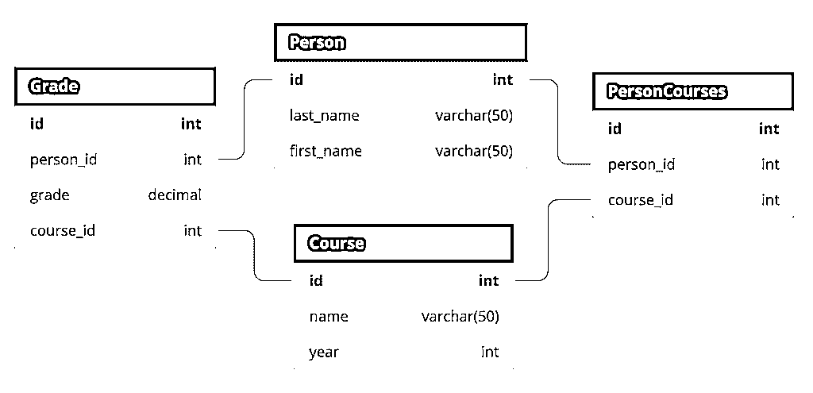](https://files.realpython.com/media/customize-django-admin-db.ba7ba1f27a98.png)

数据库中的底层表名与此略有不同，但它们与上面显示的模型相关。

您希望 Django 在管理界面中表示的每个模型都需要注册。您可以在`admin.py`文件中这样做。来自`core/models.py`的模型被登记在相应的`core/admin.py`文件中:

```py
from django.contrib import admin

from core.models import Person, Course, Grade

@admin.register(Person)
class PersonAdmin(admin.ModelAdmin):
    pass

@admin.register(Course)
class CourseAdmin(admin.ModelAdmin):
    pass

@admin.register(Grade)
class GradeAdmin(admin.ModelAdmin):
    pass
```

你差不多可以走了。一旦迁移了数据库模型，就可以运行 Django 开发服务器并查看结果:

```py
$ ./manage.py makemigrations
$ ./manage.py migrate
Operations to perform:
 Apply all migrations: admin, auth, contenttypes, core, sessions
Running migrations:
 Applying contenttypes.0001_initial... OK
 Applying auth.0001_initial... OK
 Applying admin.0001_initial... OK
 ...
 Applying core.0001_initial... OK
 Applying core.0002_auto_20200609_2120... OK
 Applying sessions.0001_initial... OK
$ ./manage.py runserver
Watching for file changes with StatReloader
Performing system checks...

System check identified no issues (0 silenced).
Django version 3.0.7, using settings 'School.settings'
Starting development server at http://127.0.0.1:8000/
Quit the server with CONTROL-C.
```

现在访问`http://127.0.0.1:8000/admin`查看您的管理界面。系统会提示您登录。使用您用`createsuperuser`管理命令创建的凭证。

管理主页屏幕列出了所有注册的数据库模型:

[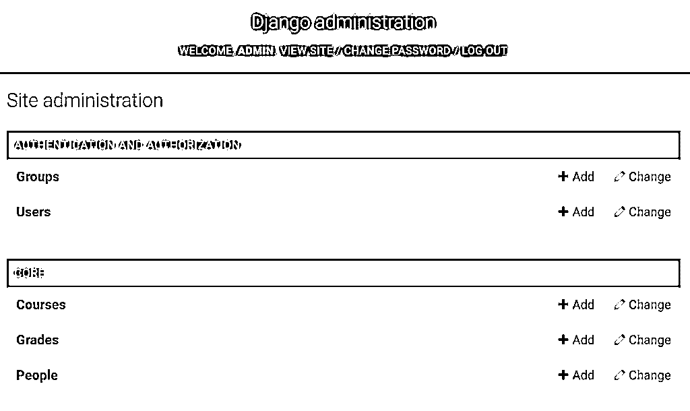](https://files.realpython.com/media/customize-django-admin-core.f29840db4348.png)

现在，您可以使用该接口在数据库中创建对象。单击一个模型名称将显示一个屏幕，列出该模型数据库中的所有对象。以下是`Person`列表:

[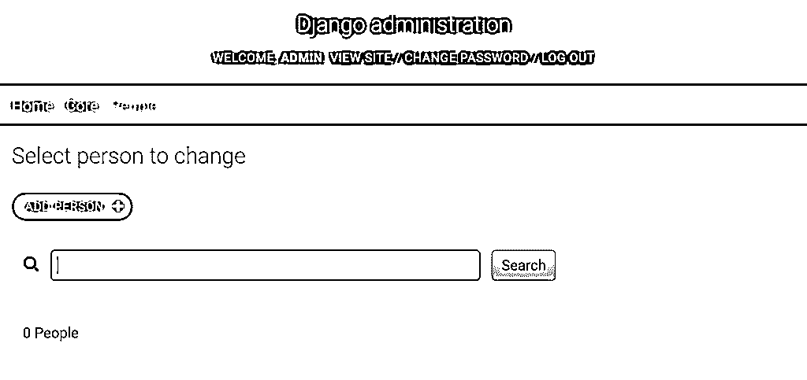](https://files.realpython.com/media/customize-django-admin-empty-person.132d2d3c6b75.png)

列表[开始是空的，就像你的数据库一样。点击*添加人员*可以在数据库中创建人员。保存后，您将返回到`Person`对象列表:](https://realpython.com/python-lists-tuples/)

[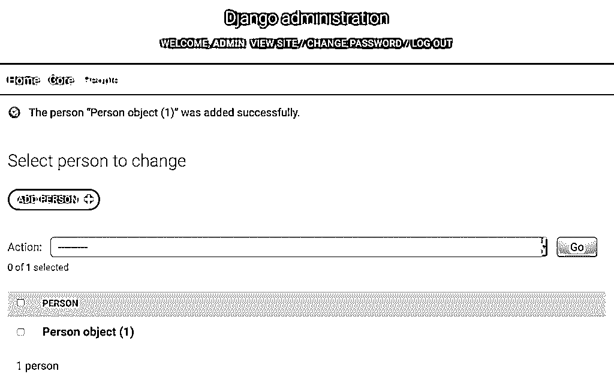](https://files.realpython.com/media/customize-django-admin-new-person.a6af5c041147.png)

好消息是你有对象了。坏消息是,`Person object (1)`只告诉你物体的`id`,没有告诉你别的。默认情况下，Django admin 通过调用`str()`来显示每个对象。您可以通过向`core/models.py`中的`Person`类添加一个`.__str__()`方法来使这个屏幕更有帮助:

```py
class Person(models.Model):
    last_name = models.TextField()
    first_name = models.TextField()
    courses = models.ManyToManyField("Course", blank=True)

    def __str__(self):
        return f"{self.last_name}, {self.first_name}"
```

添加`Person.__str__()`会改变显示，在界面中包含`Person`的名和姓。您可以刷新屏幕来查看更改:

[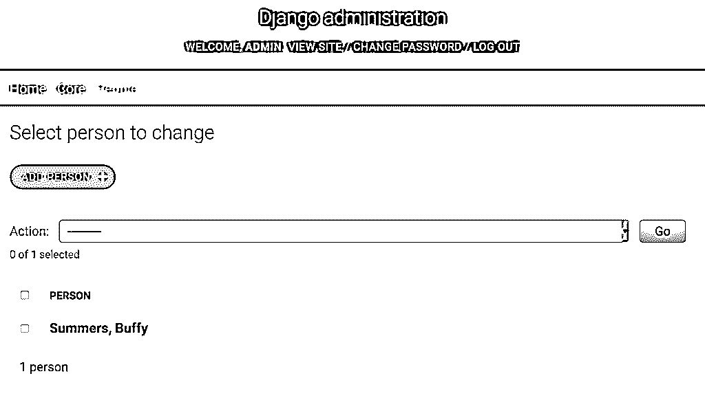](https://files.realpython.com/media/customize-django-admin-person-str.cb626cb94d38.png)

那好一点了！现在你可以看到一些关于`Person`对象的信息。向`Course`和`Grade`对象添加类似的方法是个好主意:

```py
class Course(models.Model):
    # ...

    def __str__(self):
        return f"{self.name}, {self.year}"

class Grade(models.Model):
    # ...

    def __str__(self):
        return f"{self.grade}, {self.person}, {self.course}"
```

您需要在数据库中保存一些数据，以查看定制的全部效果。你可以找点乐子，现在就创建你自己的数据，或者你可以跳过工作，使用一个**夹具**。展开下面的方框，了解如何使用夹具加载数据。


Django 允许您在名为 **fixtures** 的文件中向数据库加载数据，或者从数据库中加载数据。将以下内容复制到名为`core/fixtures/school.json`的文件中:

```py
[ { "model":  "core.person", "pk":  1, "fields":  { "last_name":  "Harris", "first_name":  "Xander", "courses":  [ 1, 3 ] } }, { "model":  "core.person", "pk":  3, "fields":  { "last_name":  "Rosenberg", "first_name":  "Willow", "courses":  [ 1, 2, 3 ] } }, { "model":  "core.person", "pk":  16, "fields":  { "last_name":  "Summers", "first_name":  "Buffy", "courses":  [ 1, 2, 3 ] } }, { "model":  "core.course", "pk":  1, "fields":  { "name":  "CompSci G11", "year":  1998 } }, { "model":  "core.course", "pk":  2, "fields":  { "name":  "Psych 101", "year":  1999 } }, { "model":  "core.course", "pk":  3, "fields":  { "name":  "Library Science G10", "year":  1997 } }, { "model":  "core.grade", "pk":  1, "fields":  { "person":  16, "grade":  68, "course":  1 } }, { "model":  "core.grade", "pk":  2, "fields":  { "person":  16, "grade":  87, "course":  2 } }, { "model":  "core.grade", "pk":  3, "fields":  { "person":  16, "grade":  76, "course":  3 } }, { "model":  "core.grade", "pk":  4, "fields":  { "person":  1, "grade":  58, "course":  1 } }, { "model":  "core.grade", "pk":  5, "fields":  { "person":  1, "grade":  58, "course":  3 } }, { "model":  "core.grade", "pk":  6, "fields":  { "person":  3, "grade":  98, "course":  3 } }, { "model":  "core.grade", "pk":  7, "fields":  { "person":  3, "grade":  97, "course":  2 } } ]
```

一旦创建了文件，就可以使用 Django 管理命令`loaddata`将其加载到数据库中:

```py
$ ./manage.py loaddata school
Installed 13 object(s) from 1 fixture(s)
```

您的数据库现在有了一些样本`Person`、`Course`和`Grade`对象。

现在您已经有了一些要处理的数据，可以开始定制 Django 的管理界面了。

[*Remove ads*](/account/join/)

## 定制 Django 管理

创建 Django 框架的聪明人不仅构建了 admin，而且他们以一种你可以为你的项目定制它的方式来实现它。当您之前注册了`PersonAdmin`对象时，它继承了`admin.ModelAdmin`。你可以用 Django admin 做的大部分定制都是通过修改`ModelAdmin`来完成的，你当然可以修改它！

拥有超过 30 个属性和将近 50 个方法。您可以使用其中的每一个来微调管理员的演示和控制您的对象的界面。这些选项中的每一个都在[文档](https://docs.djangoproject.com/en/3.0/ref/contrib/admin/)中有详细描述。

最重要的是，管理员是使用 Django 的模板接口构建的。Django 模板机制允许您覆盖现有的模板，因为 admin 只是另一组模板，这意味着您可以完全更改它的 HTML。

虽然这超出了本教程的范围，但是您甚至可以[创建多个管理站点](https://docs.djangoproject.com/en/3.0/ref/contrib/admin/#multiple-admin-sites-in-the-same-urlconf)。这看起来有点过分，但是它允许你用不同的权限为用户定义不同的网站，这些用户有不同的 T2 权限。

Django 管理分为三个主要部分:

1.  应用程序索引
2.  更改列表
3.  改变形式

**应用索引**列出了您注册的型号。为每个注册的模型自动创建一个**变更列表**，并列出该模型的对象。当您添加或编辑其中一个对象时，您可以通过**更改表单**来完成。

在前面的例子中，应用程序索引显示了`Person`、`Course`和`Grade`对象。点击*人物*显示`Person`对象的变更列表。在`Person`变更列表页面，点击`Buffy Summers`对象进入变更表单，编辑 Buffy 的详细信息。

## 使用`list_display` 修改变更列表

实现`.__str__()`是将`Person`对象的表示从无意义的[字符串](https://realpython.com/python-strings/)转变为可理解数据的快速方法。因为这种表示法也会出现在下拉菜单和多选菜单中，所以你肯定希望它尽可能容易理解。

除了修改对象的字符串表示之外，您还可以通过更多方式自定义更改列表页面。一个`admin.ModelAdmin`对象的`list_display`属性指定了哪些列显示在变更列表中。该值是正在建模的对象的一组属性。例如，在`core/admin.py`中，将`PersonAdmin`修改如下:

```py
@admin.register(Person)
class PersonAdmin(admin.ModelAdmin):
    list_display = ("last_name", "first_name")
```

上面的代码修改了您的`Person`变更列表，以显示每个`Person`对象的`last_name`和`first_name`属性。每个属性都显示在页面的一列中:

[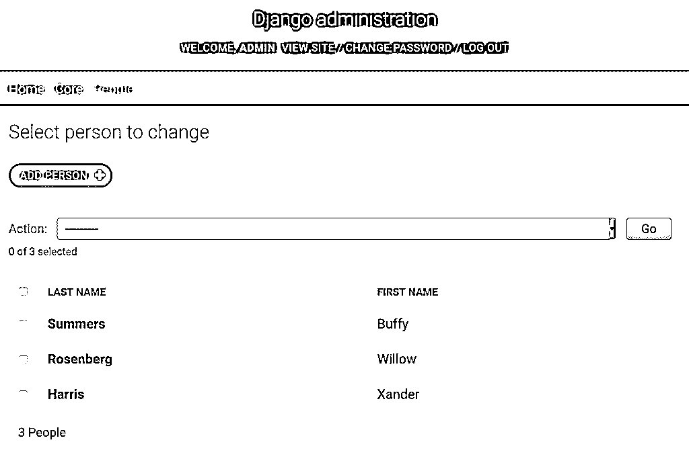](https://files.realpython.com/media/customize-django-admin-fname.d7ad0aafad94.png)

这两列是可点击的，允许您按列数据对页面进行排序。管理员也尊重`Meta`部分的`ordering`属性:

```py
class Person(models.Model):
    # ...

    class Meta:
        ordering = ("last_name", "first_name")

    # ...
```

添加`ordering`属性将默认`Person`上的所有查询由`last_name`排序，然后由`first_name`排序。Django 在管理和获取对象时都会遵守这个默认顺序。

`list_display`元组可以引用所列对象的任何属性。它也可以引用`admin.ModelAdmin`本身的一个方法。再次修改`PersonAdmin`:

```py
@admin.register(Person)
class PersonAdmin(admin.ModelAdmin):
    list_display = ("last_name", "first_name", "show_average")

    def show_average(self, obj):
        from django.db.models import Avg
 result = Grade.objects.filter(person=obj).aggregate(Avg("grade"))        return result["grade__avg"]
```

在上面的代码中，您向 admin 添加了一个显示每个学生平均成绩的列。对列表中显示的每个对象调用一次`show_average()`。

`obj`参数是正在显示的行的对象。在这种情况下，您使用它为学生查询相应的`Grade`对象，其响应在`Grade.grade`上取平均值。你可以在这里看到结果:

[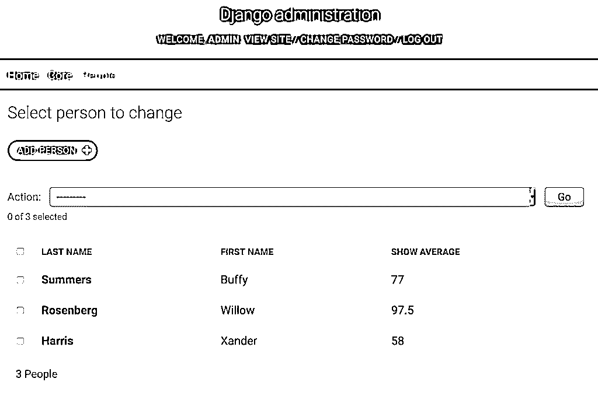](https://files.realpython.com/media/customize-django-admin-avg.3788bff8b9e3.png)

请记住，平均分数实际上应该在`Person`模型对象中计算。您可能希望数据在其他地方，而不仅仅是在 Django admin 中。如果您有这样的方法，您可以将它添加到`list_display`属性中。这里的例子展示了你可以在一个`ModelAdmin`对象中做什么，但是对于你的代码来说这可能不是最好的选择。

默认情况下，只有属于对象属性的列才是可排序的。`show_average()`不是。这是因为排序是由底层的`QuerySet`执行的，而不是在显示的结果上。在某些情况下，有一些[排序这些列](https://docs.djangoproject.com/en/3.0/ref/contrib/admin/#django.contrib.admin.ModelAdmin.sortable_by)的方法，但是这超出了本教程的范围。

该列的标题基于方法的名称。您可以通过向方法添加属性来改变标题:

```py
def show_average(self, obj):
    result = Grade.objects.filter(person=obj).aggregate(Avg("grade"))
    return result["grade__avg"]

show_average.short_description = "Average Grade"
```

默认情况下，Django 保护您免受字符串中 HTML 的影响，以防字符串来自用户输入。要使显示包含 HTML，您必须使用`format_html()`:

```py
def show_average(self, obj):
    from django.utils.html import format_html

    result = Grade.objects.filter(person=obj).aggregate(Avg("grade"))
    return format_html("<b><i>{}</i></b>", result["grade__avg"])

show_average.short_description = "Average"
```

`show_average()`现在有了一个自定义标题`"Average"`，并被格式化为斜体:

[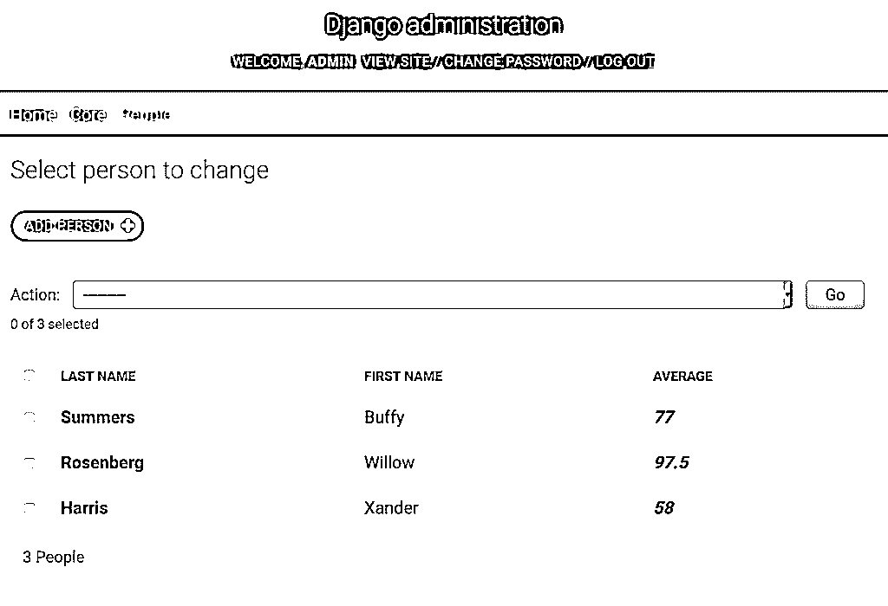](https://files.realpython.com/media/customize-django-admin-fancy.2e5f9cdf6707.png)

不幸的是，Django 还没有添加对`format_html()`的 [f-string](https://realpython.com/python-f-strings/) 支持，所以你只能使用`str.format()`语法。

[*Remove ads*](/account/join/)

## 提供到其他目标页面的链接

对象通过使用**外键**来引用其他对象是很常见的。你可以将`list_display`指向一个返回 HTML 链接的方法。在`core/admin.py`中，修改`CourseAdmin`类，如下所示:

```py
from django.urls import reverse
from django.utils.http import urlencode

@admin.register(Course)
class CourseAdmin(admin.ModelAdmin):
    list_display = ("name", "year", "view_students_link")

    def view_students_link(self, obj):
        count = obj.person_set.count()
        url = (
            reverse("admin:core_person_changelist")
            + "?"
            + urlencode({"courses__id": f"{obj.id}"})
        )
        return format_html('<a href="{}">{} Students</a>', url, count)

    view_students_link.short_description = "Students"
```

该代码导致`Course`变更列表有三列:

1.  课程名称
2.  开设课程的年份
3.  显示课程中学生人数的链接

您可以在下面的屏幕截图中看到最终的变化:

[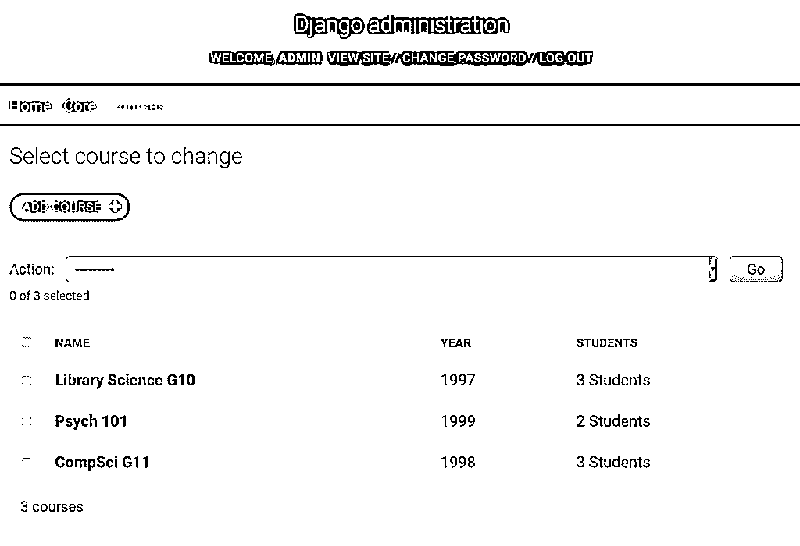](https://files.realpython.com/media/customize-django-admin-student-link.2ff3a05ec623.png)

当您点击 *2 学生*时，它会将您带到应用了过滤器的`Person`变更列表页面。过滤后的页面只显示那些在`Psych 101`、Buffy 和 Willow 的学生。[史云光没能上大学。](https://www.imdb.com/title/tt0533498/?ref_=ttep_ep1)

示例代码使用 [`reverse()`](https://docs.djangoproject.com/en/3.0/ref/urlresolvers/) 在 Django admin 中查找 URL。您可以使用以下命名约定查找任何管理页面:

```py
"admin:%(app)s_%(model)s_%(page)"
```

该名称结构细分如下:

*   **`admin:`** 是命名空间。
*   **`app`** 是 app 的名称。
*   **`model`** 是模型对象。
*   **`page`** 是 Django 管理页面类型。

对于上面的`view_students_link()`示例，您使用`admin:core_person_changelist`来获取对`core`应用程序中`Person`对象的变更列表页面的引用。

以下是可用的 URL 名称:

| 页 | URL 名称 | 目的 |
| --- | --- | --- |
| 更改列表 | `%(app)s\_%(model)s\_changelist` | 模型对象页面列表 |
| 增加 | `%(app)s\_%(model)s\_add` | 对象创建页面 |
| 历史 | `%(app)s\_%(model)s\_history` | 对象更改历史页面
将`object_id`作为参数 |
| 删除 | `%(app)s\_%(model)s\_delete` | 对象删除页面
将一个`object_id`作为参数 |
| 变化 | `%(app)s\_%(model)s\_change` | 对象编辑页面
将一个`object_id`作为参数 |

您可以通过向 URL 添加查询字符串来过滤更改列表页面。这个查询字符串修改用于填充页面的`QuerySet`。在上面的例子中，查询字符串`"?courses__id={obj.id}"`过滤`Person`列表，只过滤那些在`Person.course`中有匹配值的对象。

这些过滤器支持使用双下划线(`__`)的`QuerySet` [字段查找](https://docs.djangoproject.com/en/3.0/topics/db/queries/#field-lookups)。您可以访问相关对象的属性，也可以使用过滤修改器，如`__exact`和`__startswith`。

你可以在 Django admin [文档](https://docs.djangoproject.com/en/3.0/ref/contrib/admin/#django.contrib.admin.ModelAdmin.list_display)中找到关于使用`list_display`属性可以完成什么的全部细节。

## 向列表屏幕添加过滤器

除了通过调用 URL 过滤更改列表上的数据之外，还可以使用内置的小部件进行过滤。给`core/admin.py`中的`CourseAdmin`对象添加`list_filter`属性:

```py
@admin.register(Course)
class CourseAdmin(admin.ModelAdmin):
    list_display = ("name", "year", "view_students_link")
    list_filter = ("year", )
# ...
```

`list_filter`将在页面上显示一个带有链接列表的新部分。在这种情况下，链接按年份过滤页面。数据库中的`Course`对象使用的`year`值会自动填充到过滤器列表中:

[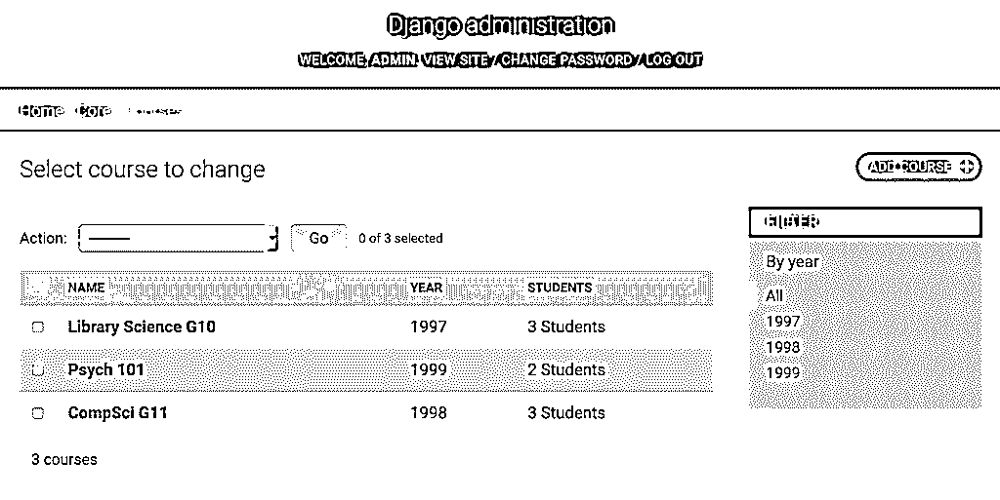](https://files.realpython.com/media/customize-django-admin-course-filter.8b2b5fa45ff7.png)

点击右边的年份将改变列表，只包含具有该`year`值的`Course`对象。您还可以使用`__`字段查找语法基于相关对象的属性进行过滤。例如，您可以通过`course__year`过滤`GradeAdmin`对象，只显示某一年课程的`Grade`对象。

如果您想对过滤进行更多的控制，那么您甚至可以创建 [**过滤对象**](https://docs.djangoproject.com/en/3.0/ref/contrib/admin/#django.contrib.admin.ModelAdmin.list_filter) ，指定查找属性和相应的`QuerySet`。

[*Remove ads*](/account/join/)

## 将搜索添加到列表屏幕

过滤器并不是减少屏幕上数据量的唯一方法。Django admin 还支持通过`search_fields`选项进行搜索，该选项在屏幕上添加了一个**搜索框**。您可以用一个元组来设置它，该元组包含用于在数据库中构建搜索查询的字段名称。

用户在搜索框中输入的任何内容都会在过滤`QuerySet`的字段的`OR`子句中使用。默认情况下，每个搜索参数都被`%`符号包围，这意味着如果您搜索`r`，那么任何带有`r`的单词都会出现在结果中。通过在搜索字段上指定一个`__`修饰符，可以更加精确。

如下编辑`core/admin.py`中的`PersonAdmin`:

```py
@admin.register(Person)
class PersonAdmin(admin.ModelAdmin):
    search_fields = ("last_name__startswith", )
```

在上面的代码中，搜索是基于姓氏的。`__startswith`修饰符将搜索限制在以 search 参数开头的姓氏。在`R`上搜索会得到以下结果:

[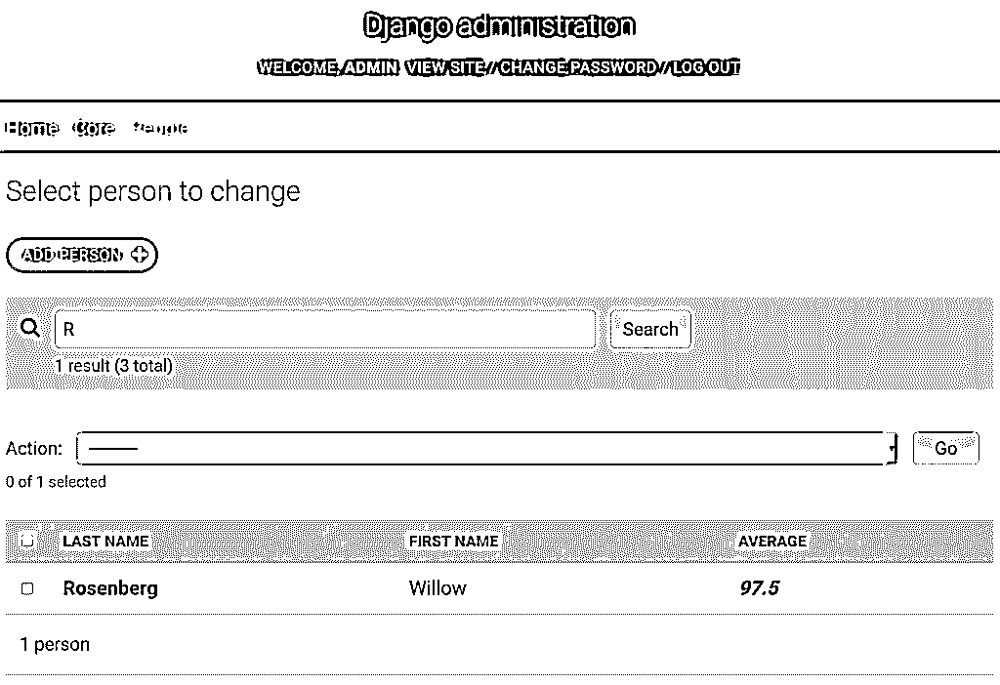](https://files.realpython.com/media/customize-django-admin-search.38ff1f1bb765.png)

每当在变更列表页面上执行搜索时，Django admin 都会调用您的`admin.ModelAdmin`对象的`get_search_results()`方法。它返回一个带有搜索结果的`QuerySet`。您可以通过重载该方法并更改`QuerySet`来微调搜索。更多细节可以在[文档](https://docs.djangoproject.com/en/3.0/ref/contrib/admin/#django.contrib.admin.ModelAdmin.get_search_results)中找到。

## 改变编辑模型的方式

您可以自定义的不仅仅是更改列表页面。用于添加或更改对象的屏幕基于 [`ModelForm`](https://docs.djangoproject.com/en/3.0/topics/forms/modelforms/) 。Django 根据正在编辑的模型自动生成表单。

通过编辑`fields`选项，您可以控制包含哪些字段及其顺序。修改您的`PersonAdmin`对象，添加一个`fields`属性:

```py
@admin.register(Person)
class PersonAdmin(admin.ModelAdmin):
    fields = ("first_name", "last_name", "courses")
# ...
```

`Person`的添加和更改页面现在将`first_name`属性放在`last_name`属性之前，即使模型本身指定了相反的方式:

[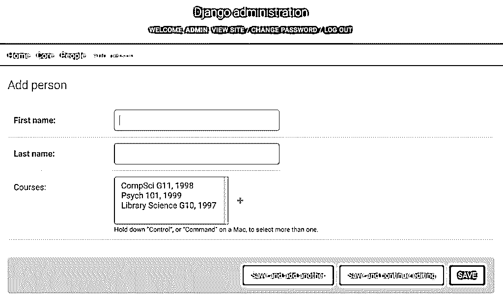](https://files.realpython.com/media/customize-django-admin-add-fields.b79a4e061ce0.png)

`ModelAdmin.get_form()`负责为你的对象创建`ModelForm`。您可以重写此方法来更改表单。在`PersonAdmin`中增加以下方法:

```py
def get_form(self, request, obj=None, **kwargs):
    form = super().get_form(request, obj, **kwargs)
    form.base_fields["first_name"].label = "First Name (Humans only!):"
    return form
```

现在，当显示添加或更改页面时，`first_name`字段的标签将被定制。

改变标签可能不足以阻止吸血鬼注册为学生。如果您不喜欢 Django 管理员为您创建的`ModelForm`，那么您可以使用`form`属性来注册一个定制表单。对`core/admin.py`做如下补充和修改:

```py
from django import forms

class PersonAdminForm(forms.ModelForm):
    class Meta:
        model = Person
        fields = "__all__"

    def clean_first_name(self):
        if self.cleaned_data["first_name"] == "Spike":
            raise forms.ValidationError("No Vampires")

        return self.cleaned_data["first_name"]

@admin.register(Person)
class PersonAdmin(admin.ModelAdmin):
    form = PersonAdminForm
# ...
```

上面的代码在`Person`添加和更改页面上执行额外的验证。`ModelForm`对象拥有[丰富的验证机制](https://docs.djangoproject.com/en/3.0/topics/forms/modelforms/)。在这种情况下，将根据名称`"Spike"`检查`first_name`字段。一个`ValidationError`阻止使用这个名字的学生注册:

[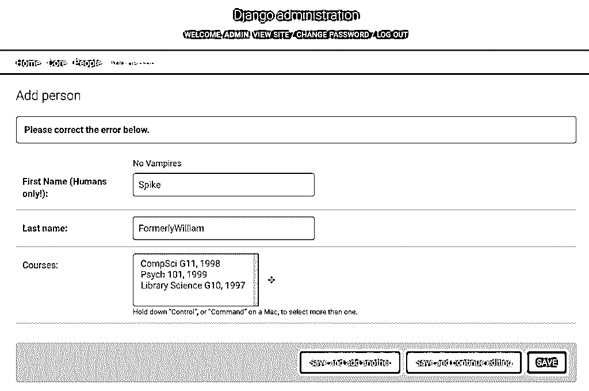](https://files.realpython.com/media/customize-django-admin-no-vampires.04edbbfe2d9a.png)

通过更改或替换`ModelForm`对象，您可以完全控制用于添加或更改对象页面的页面的外观和验证。

[*Remove ads*](/account/join/)

## 覆盖 Django 管理模板

Django 开发人员使用 Django [模板机制](https://docs.djangoproject.com/en/3.0/topics/templates/)实现了 admin。这让他们的工作变得简单了一点，但它也让你受益，因为你可以**覆盖**模板。您可以通过更改用于呈现页面的模板来完全自定义管理。

通过查看虚拟环境中的 Django 包，您可以看到管理中使用的所有模板:

```py
.../site-packages/django/contrib/admin/templates/
│
├── admin/
│   │
│   ├── auth/
│   │   └── user/
│   │       ├── add_form.html
│   │       └── change_password.html
│   │
│   ├── edit_inline/
│   │   ├── stacked.html
│   │   └── tabular.html
│   │
│   ├── includes/
│   │   ├── fieldset.html
│   │   └── object_delete_summary.html
│   │
│   ├── widgets/
│   │   ├── clearable_file_input.html
│   │   ├── foreign_key_raw_id.html
│   │   ├── many_to_many_raw_id.html
│   │   ├── radio.html
│   │   ├── related_widget_wrapper.html
│   │   ├── split_datetime.html
│   │   └── url.html
│   │
│   ├── 404.html
│   ├── 500.html
│   ├── actions.html
│   ├── app_index.html
│   ├── base.html
│   ├── base_site.html
│   ├── change_form.html
│   ├── change_form_object_tools.html
│   ├── change_list.html
│   ├── change_list_object_tools.html
│   ├── change_list_results.html
│   ├── date_hierarchy.html
│   ├── delete_confirmation.html
│   ├── delete_selected_confirmation.html
│   ├── filter.html
│   ├── index.html
│   ├── invalid_setup.html
│   ├── login.html
│   ├── object_history.html
│   ├── pagination.html
│   ├── popup_response.html
│   ├── prepopulated_fields_js.html
│   ├── search_form.html
│   └── submit_line.html
│
└── registration/
    ├── logged_out.html
    ├── password_change_done.html
    ├── password_change_form.html
    ├── password_reset_complete.html
    ├── password_reset_confirm.html
    ├── password_reset_done.html
    ├── password_reset_email.html
    └── password_reset_form.html
```

Django 模板引擎有一个定义好的加载模板的顺序。当它加载模板时，它使用第一个匹配名称的模板。您可以使用相同的目录结构和文件名来覆盖管理模板。

管理模板位于两个目录中:

1.  **`admin`** 是针对模型对象的页面。
2.  **`registration`** 是用于密码修改和登录退出。

要定制注销页面，您需要覆盖正确的文件。指向文件的相对路径必须与被覆盖的路径相同。你感兴趣的文件是`registration/logged_out.html`。首先在`School`项目中创建目录:

```py
$ mkdir -p templates/registration
```

现在告诉 Django 关于您的`School/settings.py`文件中的新模板目录。查找`TEMPLATES`指令，并将文件夹添加到`DIR`列表中:

```py
# School/settings.py
# ...

TEMPLATES = [
    {
        "BACKEND": "django.template.backends.django.DjangoTemplates",
  # Add the templates directory to the DIR option:        "DIRS": [os.path.join(BASE_DIR, "templates"), ],
        "APP_DIRS": True,
        "OPTIONS": {
            "context_processors": [
                "django.template.context_processors.debug",
                "django.template.context_processors.request",
                "django.contrib.auth.context_processors.auth",
                "django.contrib.messages.context_processors.messages",
            ],
        },
    },
]
```

模板引擎在应用程序目录之前搜索`DIR`选项中的目录，因此将加载与管理模板同名的任何内容。要看到这一点，将`logged_out.html`文件复制到您的`templates/registration`目录中，然后修改它:

```py



<div class="breadcrumbs"><a href=""></a></div>



<p>You are now leaving Sunnydale</p>

<p><a href=""></a></p>


```

现在您已经定制了注销页面。如果您点击*注销*，那么您将会看到定制的消息:

[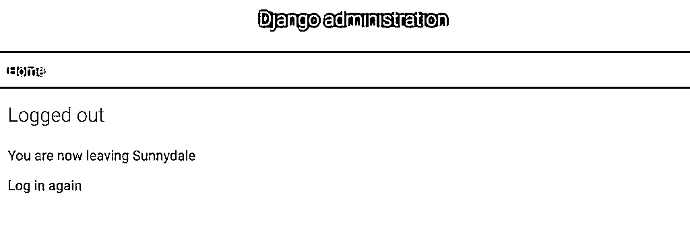](https://files.realpython.com/media/customize-django-admin-leaving-sunnydale.eb84fcca550e.png)

Django 管理模板嵌套很深，不太直观，但是如果需要的话，您可以完全控制它们的显示。一些软件包，包括 [Grappelli](https://grappelliproject.com/) 和 [Django 管理引导](https://github.com/douglasmiranda/django-admin-bootstrap)，已经完全取代了 Django 管理模板，改变了它们的外观。

Django Admin Bootstrap 与 Django 3 还不兼容，Grappelli 最近才添加了支持，所以它可能仍然有一些问题。也就是说，如果您想了解覆盖管理模板的强大功能，请查看这些项目！

## 结论

Django admin 是一个强大的内置工具，让您能够使用 web 界面创建、更新和删除数据库中的对象。您可以定制 Django admin 来做任何您想做的事情。

**在本教程中，您学习了如何:**

*   向 Django 管理员注册您的**对象模型**
*   将属性作为列添加到**变更列表**
*   用**计算内容**创建列值
*   **通过链接交叉引用**管理页面
*   通过**查询字符串**过滤变更列表页面
*   使您的更改列表**可搜索**
*   **自定义**自动`ModelForm`对象
*   更改 **Django 管理模板**中的 HTML

本教程只是触及了表面。定制 Django admin 的配置量是惊人的。您可以更深入地研究[文档](https://docs.djangoproject.com/en/3.0/ref/contrib/admin/)，探索诸如内嵌表单、多个`admin`站点、批量编辑、自动完成等主题。编码快乐！

*立即观看**本教程有真实 Python 团队创建的相关视频课程。配合文字教程一起看，加深理解: [**Django Admin 定制**](/courses/django-admin-customization/)*******