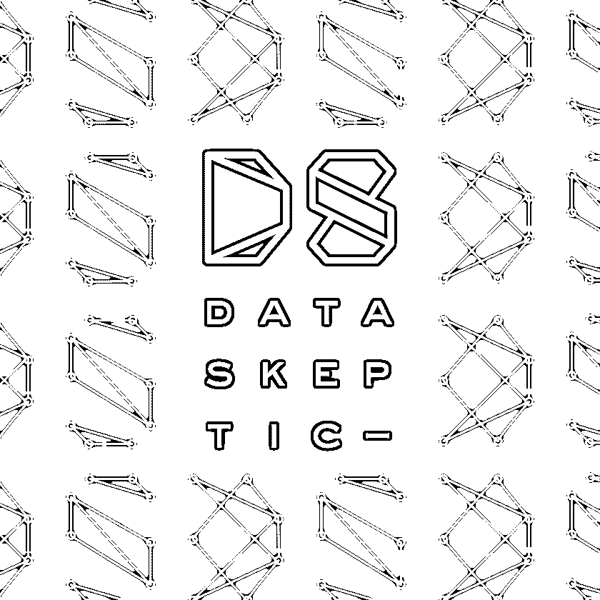
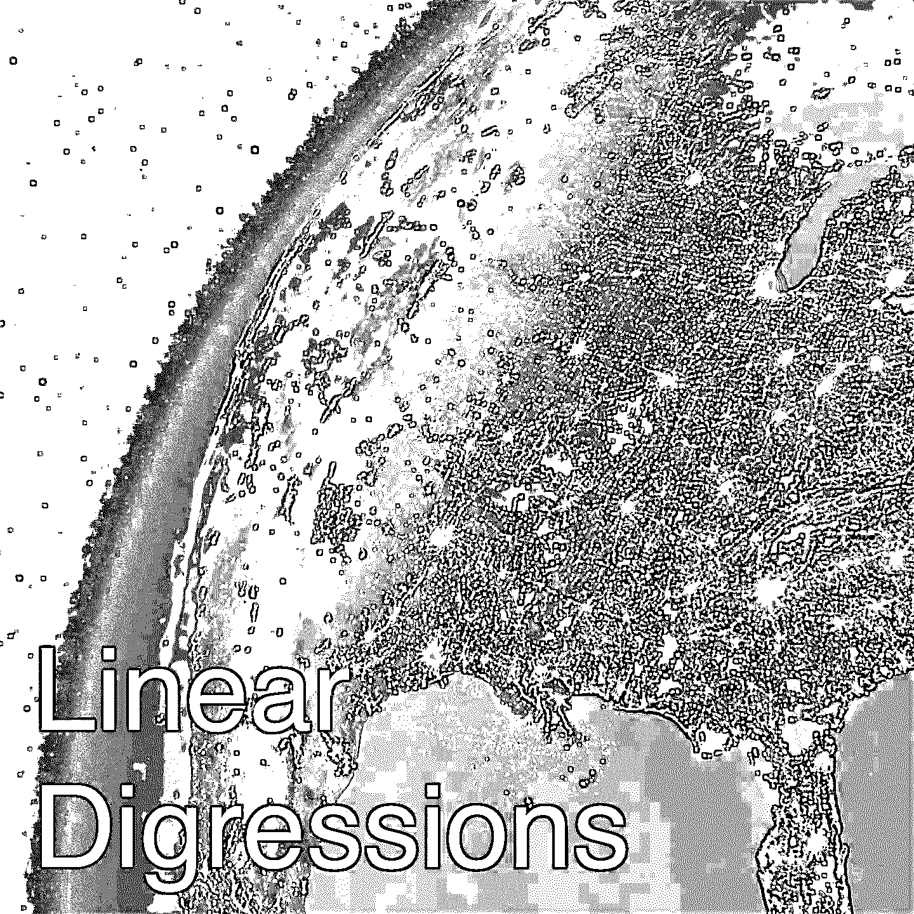
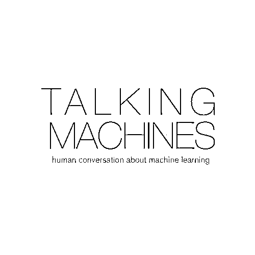
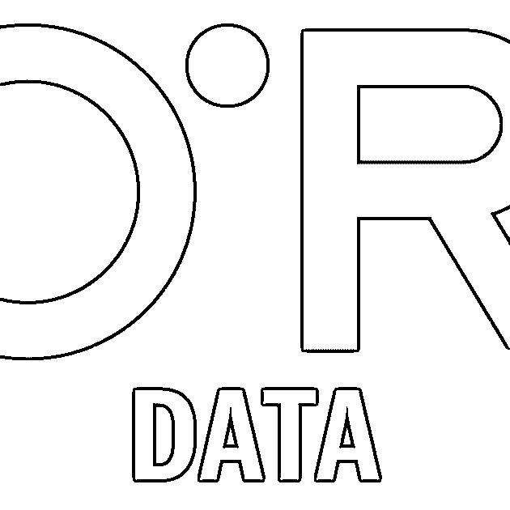
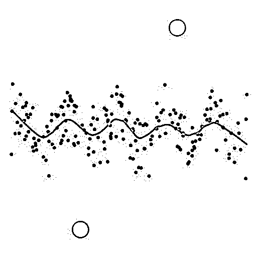
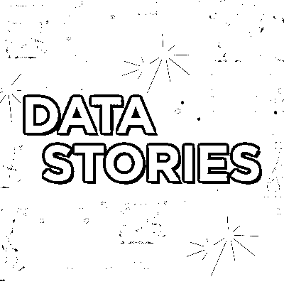
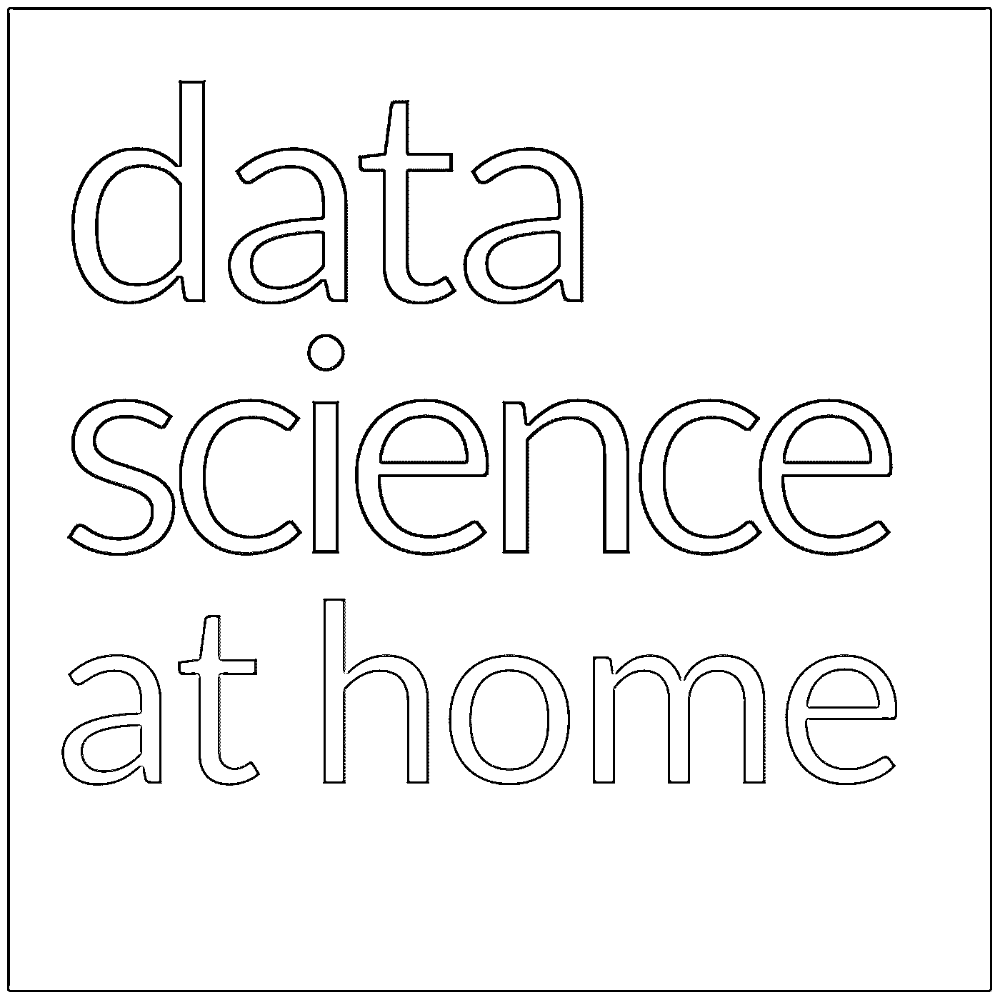
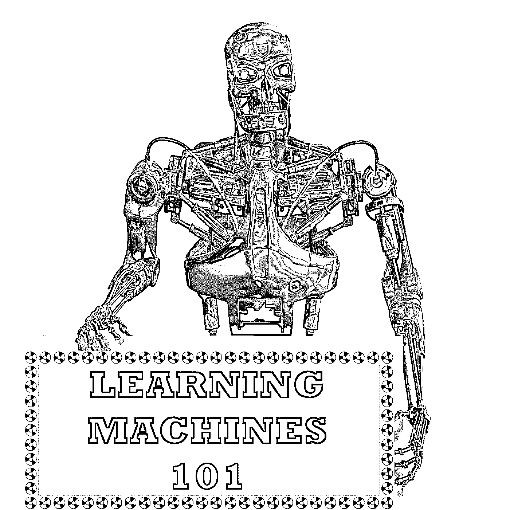
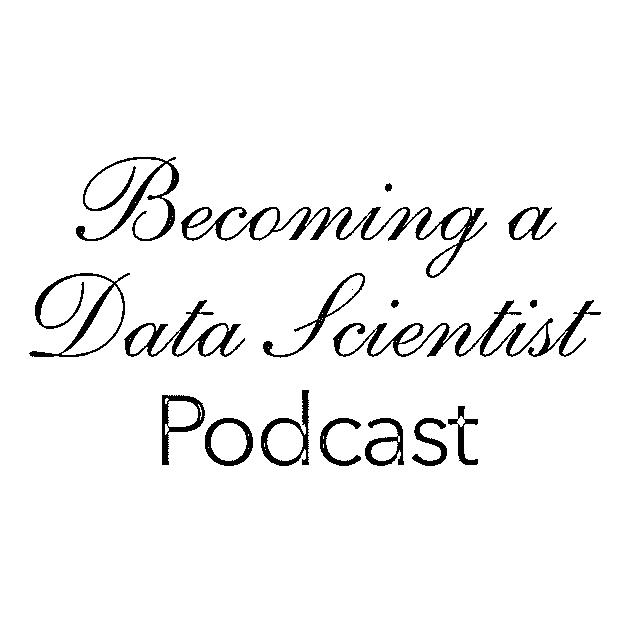

# 数据科学播客的终极列表

> 原文：<https://realpython.com/data-science-podcasts/>

播客是让你沉浸在一个行业中的好方法，尤其是在数据科学方面。这个领域发展极快，很难跟上每周发生的所有新发展！

利用一天中你身体忙碌但大脑自由的时间:当你通勤上班，在健身房锻炼，或打扫房间。这是让你的大脑学习新东西的最佳时机，确保你在你的领域保持领先。

有几十个数据科学播客，涵盖从[机器学习](https://realpython.com/python-windows-machine-learning-setup/)和[人工智能](https://realpython.com/python-ai-neural-network/)到大数据分析的所有内容。我们希望这将是一个伟大的资源，让你找到有用的，信息丰富的，引人入胜的节目。

准备好潜水吧！

**🎧🐍真正的 Python 播客:**在真正的 Python 上，我们还有一个由克里斯托弗·贝利主持的[每周 Python 播客](https://realpython.com/podcasts/rpp/)，内容包括采访、编码技巧以及与来自 Python 社区的嘉宾的对话。如果你正在用 Python 做数据科学的工作，可以看看在 realpython.com/podcast[的展览](https://realpython.com/podcasts/rpp/)

## 主动数据科学播客

在撰写本文时，这些数据科学播客仍然活跃，并且仍在制作中。从档案深处开始，一路向上，或者直接跳到最新一集！

[*Remove ads*](/account/join/)

### 数据怀疑论者

*   网址:[https://dataskeptic.com/](https://dataskeptic.com/)
*   推特: [@dataskeptic](https://twitter.com/dataskeptic)
*   听: [RSS](https://dataskeptic.libsyn.com/rss) ⋅ [iTunes](https://itunes.apple.com/us/podcast/data-skeptic/id890348705?mt=2) ⋅ [豆荚](https://www.podbean.com/podcast-detail/6r4mt-34d76/Data+Skeptic) ⋅ [播放器 FM](https://player.fm/series/data-skeptic)

数据怀疑论者是最著名的数据科学播客之一。这个每周一次的节目探索了数据科学、[统计学](https://realpython.com/python-statistics/)、机器学习和人工智能方面的主题。

由 Kyle Polich 主持，该节目有超过 200 集，听众可以深入了解。最近，该节目发布了一系列主题集，围绕数据科学世界中的一个更大的主题，如假新闻。

这几集在采访行业专业人士和解释高级数据科学概念的迷你代码之间交替播放。

迷你代码由 Linh Da Tran 共同主持，他与 Kyle 讨论数据科学话题，如[自然语言处理](https://realpython.com/nltk-nlp-python/)和 [k-means 聚类](https://realpython.com/k-means-clustering-python/)。随着主持人的讲述，听众对话题有了更好的理解。

### 线性递减

*   网址:[http://lineardigressions.com](http://lineardigressions.com)
*   推特: [@LinDigressions](https://twitter.com/lindigressions?lang=en)
*   听: [RSS](http://lineardigressions.com/episodes?format=RSS) ⋅ [iTunes](https://itunes.apple.com/us/podcast/linear-digressions/id941219323?mt=2) ⋅ [豆荚](https://www.podbean.com/podcast-detail/jeif2-34d14/Linear-Digressions-Podcast) ⋅ [播放器 FM](https://player.fm/series/linear-digressions-74115)

凯蒂·马龙(Katie Malone)和本·贾菲(Ben Jaffe)主持每周一次的播客《线性离题》，探索数据科学、机器学习和人工智能的最新发展。主持人是好朋友，他们的融洽使得每一集都非常容易理解。

写这篇文章的时候，有超过 100 集的内容可供听众深入了解。每一集大约半小时，很容易就能快速理解手头的话题。

凯蒂和本在将复杂的技术主题提炼到其基本原理方面做得很好。在短短的几分钟内，他们揭开了神经网络、自动编码器、[傅立叶变换](https://realpython.com/python-scipy-fft/)等等的神秘面纱。

### 会说话的机器

*   网址:[https://www.thetalkingmachines.com/](https://www.thetalkingmachines.com/)
*   Twitter: [@TlkngMchns](https://twitter.com/tlkngmchns?lang=en)
*   听: [RSS](http://rss.art19.com/talking-machines) ⋅ [iTunes](https://itunes.apple.com/us/podcast/talking-machines/id955198749?mt=2) ⋅ [播放器 FM](https://player.fm/series/talking-machines-1457195)

前公共电台制片人凯瑟琳·戈尔曼认为，继续关于数据科学、人工智能和机器学习的公共对话对于防止另一个人工智能冬天是绝对必要的。

她认为数据科学播客是一个很好的讨论场所。为此，她和尼尔·劳伦斯教授一起主持了会说话的机器。

该播客旨在向广大观众介绍机器学习，并帮助行业专业人士、商业领袖和感兴趣的外行人更好地理解这些工具和技术。

这些节目通常遵循一种简单的模式:主持人谈论行业新闻，采访一位嘉宾，最后可能会回答听众的问题。剧集按季节发布，长度较长，大约 40 分钟。

这就是凯瑟琳作为电台主持人的历史派上用场的地方:她保持节目的吸引力和知识性，并努力确保它呈现了机器学习行业的准确画面。

[*Remove ads*](/account/join/)

### 奥莱利数据显示

*   网址:[https://www.oreilly.com/topics/oreilly-data-show-podcast](https://www.oreilly.com/topics/oreilly-data-show-podcast)
*   推特: [@OReillyMedia](https://twitter.com/oreillymedia?lang=en)
*   听: [RSS](http://feeds.podtrac.com/IOJSwQcdEBcg) ⋅ [iTunes](https://itunes.apple.com/us/podcast/oreilly-data-show-oreilly-media-podcast/id944929220?mt=2) ⋅ [豆荚](https://www.podbean.com/podcast-detail/is26f-4d5a0/The-O'Reilly-Data-Show-Podcast) ⋅ [播放器 FM](https://player.fm/series/oreilly-data-show-oreilly-media-podcast)

本·洛里卡是奥莱利媒体公司的首席数据科学家。在每一期节目中，他都会与一位行业专家一起讨论大数据和数据科学方面的话题。剧集时长从 30 分钟到 40 分钟不等，非常容易收听。

在每集开始时，主持人会推出一系列活动，听众可以参加这些活动，以了解播客中涵盖的更多主题。简介中提到的是 Strata Data 会议和人工智能会议，但你可以在他们的活动页面上找到更多的 O'Reilly 会议。

### 不那么标准偏差

*   网址:[http://nssdeviations.com/](http://nssdeviations.com/)
*   推特:[@ NSS 偏差](https://twitter.com/nssdeviations?lang=en)
*   听: [RSS](http://nssdeviations.libsyn.com/rss) ⋅ [iTunes](https://itunes.apple.com/us/podcast/not-so-standard-deviations/id1040614570?mt=2) ⋅ [豆荚](https://www.podbean.com/podcast-detail/cjmtq-387c6/Not-So-Standard-Deviations-Podcast) ⋅ [播放器 FM](https://player.fm/series/1504035)

约翰霍普金斯彭博公共卫生学院的罗杰·彭和 Stitch Fix 的希拉里·帕克共同主持本期播客。他们讨论行业新闻以及他们处理数据的个人经验。

剧集一个月播出两到三次，可以持续更长时间。大多数剧集至少有 60 分钟，有些甚至长达一个半小时。当你需要长途通勤或者花一个晚上在家做家务的时候，这些都是很好的选择，这样你就可以真正地参与讨论了！

### 数据故事

*   网址:[http://datastori.es/](http://datastori.es/)
*   推特:[@数据表](https://twitter.com/datastories?lang=en)
*   听: [RSS](http://datastori.es/feed/mp3/) ⋅ [iTunes](https://itunes.apple.com/us/podcast/data-stories/id502854960?mt=2) ⋅ [播放器 FM](https://player.fm/series/data-stories/ep-133-year-review-2018)

关于[数据可视化](https://realpython.com/python-data-visualization-bokeh/)的播客关注数据分析管道的一个非常具体的子集——这是数据科学播客中罕见的瑰宝。数据专家 Enrico Bertini 和 Moritz Stefaner 每隔一周与一位客人坐下来讨论数据分析和可视化。

这个节目很有对话的味道。主持人互相交换意见，向客人提出很好的问题，通常会保持对话流畅。大约 40 分钟的运行时间，听众可以真正了解我们如何更好地可视化我们的数据，以及数据在我们日常生活中扮演的角色。

### 超级数据科学

*   网址:[https://www.superdatascience.com/podcast/](https://www.superdatascience.com/podcast/)
*   推特: [@superdatasci](https://twitter.com/superdatasci?lang=en)
*   听: [RSS](https://feeds.soundcloud.com/users/soundcloud:users:253585900/sounds.rss) ⋅ [iTunes](https://itunes.apple.com/us/podcast/superdatascience/id1163599059?mt=2) ⋅ [豆荚](https://www.podbean.com/podcast-detail/if3pi-46ad1/SuperDataScience-Podcast) ⋅ [播放器 FM](https://player.fm/series/superdatascience)

基里尔·叶列缅科是一名数据科学教练和生活方式企业家，他将自己作为影响者的经验带到了 SuperDataScience 播客中。在他的访谈节目中，他与数据科学家和数据分析师交谈，了解他们的职业道路以及他们如何在数据行业取得成功。

除了采访行业专家，主持人播出的都是纯粹励志的 minisodes！名为*五分钟星期五*的这些迷你代码旨在激励听众提高自己作为数据科学家的能力，并就如何在数据科学职业生涯中前进提供建议。这绝对是最激励人心的数据科学播客之一！

[*Remove ads*](/account/join/)

### 家庭数据科学

*   网址:[https://datascienceathome.com/](https://datascienceathome.com/)
*   推特: [@ThisIsFrag](https://twitter.com/thisisfrag?lang=en)
*   听: [RSS](https://podcast.datascienceathome.com/feed.xml) ⋅ [iTunes](https://itunes.apple.com/us/podcast/data-science-at-home/id1069871378?mt=2) ⋅ [豆荚](https://www.podbean.com/podcast-detail/5hra9-70b54/Data-Science-at-Home-Podcast) ⋅ [播放器 FM](https://player.fm/series/data-science-at-home-2362678)

Francesco Gadaleta 希望让机器学习对每个人来说都很容易。在这期播客中，他在采访行业专家和独自讨论一个话题的节目中交替出现。

这部剧似乎没有固定的时间表，每集的长度也各不相同，但总的来说，采访集接近一个小时，而他的个人剧集大约在二十分钟左右。

主持人非常固执己见，所以听听他对 AI winter、优化以及成为数据科学家所需的最低要求等话题的看法可能会很有趣。

### 本周在机器学习与人工智能(TWiML&AI)

*   网址:[https://twimlai.com/](https://twimlai.com/)
*   推特: [@twimlai](https://twitter.com/twimlai?lang=en)
*   听: [RSS](http://feeds.feedburner.com/twimlai) ⋅ [iTunes](https://itunes.apple.com/us/podcast/this-week-in-machine-learning/id1116303051?mt=2) ⋅ [豆荚](https://www.podbean.com/podcast-detail/5jknv-4146f/This-Week-in-Machine-Learning--Artificial-Intelligence-(AI)-Podcast) ⋅ [播放器 FM](https://player.fm/series/2355587)

TWiML&AI 是一个每周播客，讨论数据科学、机器学习和人工智能的最新发展。主持人 Sam Charrington 采访了领先的研究人员和行业专家，以告知越来越多的学者、工程师、商业领袖和其他机器学习和人工智能爱好者。

该节目迎合了目标观众的需求，有时技术性很强。非行业专业人士的听众可能需要温习背景知识，以便从每集节目中获得最大收益。

有超过 200 小时的剧集可以听。因为播客讨论了这个技术领域的最新发展，所以你可以直接跳到最新一集，或者回到档案馆，查看机器学习和人工智能的一些历史发展。

### 数据帧

*   网址:[https://www.datacamp.com/community/podcast](https://www.datacamp.com/community/podcast)
*   推特: [@DataCamp](https://twitter.com/DataCamp?lang=en)
*   听: [iTunes](https://itunes.apple.com/us/podcast/dataframed/id1336150688?mt=2) ⋅ [豆荚](https://www.podbean.com/podcast-detail/djrvq-63d37/DataFramed-Podcast) ⋅ [播放器 FM](https://player.fm/series/series-2285898)

数据科学家、作家和教育家 Hugo Bowne-Anderson 主持了这个由 DataCamp 赞助的播客。

每周，主持人都会与行业专业人士和学术专家坐下来讨论数据科学行业如何影响世界。主持人会提出很棒的问题，并邀请嘉宾讨论该领域有趣的发展以及他们自己的个人项目。

DataFramed 在每集中也有简短的片段，为听众提供关于某些主题的更多信息。例如，在*自由数据科学*中，雨果和孙卉谈论如何作为一名独立承包商在数据科学领域导航。Justin Boyce 在*数据科学最佳实践*中给出了改进工作流的实用建议。

因为它是由 DataCamp 赞助的，他们的产品被推销了很多，所以有时会感觉有点销售。尽管如此，这个节目很有趣，也很有启发性，雨果在吸引听众方面做得很好。

### 学习机 101

*   网址:[https://www.learningmachines101.com/](https://www.learningmachines101.com/)
*   推特: [@lm101talk](https://twitter.com/lm101talk)
*   听: [RSS](http://learningmachines101.libsyn.com/rss) ⋅ [iTunes](https://itunes.apple.com/us/podcast/learning-machines-101/id892779679?mt=2) ⋅ [豆荚](https://www.podbean.com/podcast-detail/8hbz5-34db0/Learning-Machines-101-Podcast) ⋅ [播放器 FM](https://player.fm/series/learning-machines-101)

认知科学和电子工程教授 Richard Golden 博士主持学习机器 101 课程。该播客旨在向广大观众解释机器学习和人工智能的先进概念。

尽管如此，这几集可能会变得相当专业，涵盖知识表示、期望最大化和谱聚类等主题。

听众可能需要听不止一遍才能真正理解手头的话题。这应该不会太难，因为剧集不会超过半小时，也不会经常发布。(2014 年 4 月至今只上映了 74 集。)

听众可以使用这个播客作为更高级的机器学习主题的起点。

[*Remove ads*](/account/join/)

### 工业中的人工智能

*   网址:[http://techemergence.libsyn.com/](http://techemergence.libsyn.com/)
*   推特: [@Emerj](https://twitter.com/emerj)
*   订阅: [RSS](http://techemergence.libsyn.com/rss) ⋅ [iTunes](https://itunes.apple.com/us/podcast/artificial-intelligence-in-industry-with-dan-faggella/id670771965?mt=2) ⋅ [豆荚](https://www.podbean.com/podcast-detail/ix3i9-41718/Artificial-Intelligence-in-Industry-with-Dan-Faggella-Podcast) ⋅ [播放器 FM](https://player.fm/series/artificial-intelligence-in-industry-with-dan-faggella)

这个每周播客关注人工智能在商业环境中的实际应用。剧集很短，很有见地，也很容易理解。在半个小时内，主持人丹·法杰拉采访了人工智能专业人士，了解这项技术如何用于从金融和政府到零售和教育的各个行业。

丹和他的客人一起回答了诸如“你如何使用人工智能来雇佣员工？”以及“你应该什么时候升级你的人工智能硬件？”他们触及每个话题的时间足够长，足以激起听众的兴趣，并鼓励他们稍后自己深入探讨。

## 存档的数据科学播客

在撰写本文时，这些数据科学播客已经完成了它们的使命。这些档案仍然可供您深入研究，并且充满了有用的信息，所以不要犹豫，直接进入吧！

### 偏导数

*   网址:[http://partiallyderivative.com/](http://partiallyderivative.com/)
*   推特: [@partiallyd](https://twitter.com/partiallyd?lang=en)
*   听: [iTunes](https://itunes.apple.com/us/podcast/partially-derivative/id942048597?mt=2) ⋅ [豆荚](https://www.podbean.com/podcast-detail/a3zq8-34db2/Partially-Derivative-Podcast) ⋅ [播放器 FM](https://player.fm/series/partially-derivative)

如果你喜欢去酒吧和你的数据科学家同事聊行业新闻，那么这是最适合你的数据科学播客之一！Jonathan Morgan、Vidya Spandana 和 Chris Albon 聚在一起喝了几杯，讨论了数据科学的最新进展。

剧集时长从 20 分钟到一小时不等，但通常在 30 到 40 分钟左右。虽然该剧已经停播，但在档案中仍有超过 100 集。

听众可以深入研究积压的工作，了解数据搜集、偏见模型和 Python 中的结对编程，还可以回顾过去几年的一些热门新闻故事。

### 机器学习指南/机器学习应用

*   网址:[http://ocdevel.com/mlg](http://ocdevel.com/mlg)
*   推特: [@lefnire](https://twitter.com/lefnire)
*   听: [RSS](http://machinelearningguide.libsyn.com/rss) ⋅ [iTunes](https://itunes.apple.com/us/podcast/machine-learning-guide/id1204521130) ⋅ [豆荚](https://www.podbean.com/podcast-detail/se4er-4c31d/Machine-Learning-Guide-Podcast) ⋅ [播放器 FM](https://player.fm/series/machine-learning-guide-1457335)

这些数据科学播客都是由 Tyler Renelli 运营的，每一个都有稍微不同的机器学习和人工智能方法。

机器学习指南(MLG)旨在通过从头开始解释主题，从经典算法(线性和[逻辑](https://realpython.com/logistic-regression-python/)回归)到强化学习和超参数，温和地向听众介绍机器学习的世界。

剧集时长从 45 分钟到一小时不等，但很容易被泰勒的解释吸引。这是补充其他活动的完美播客，如通勤、锻炼或打扫房间。

本播客最精彩的部分之一是主持人在每集结束时提供的精选学习资源。在听完高层次的概述后，你可以通过参加推荐的课程或阅读推荐的教材来更深入地了解主题。

他关于语言和框架的那一集包含了 Python 深度学习框架初级读本的链接。如果你从头到尾按照剧集顺序，完成补充资源，你在机器学习方面会有相当细致的基础。

截至本文撰写之时，《MLG》已经播出了 29 集。

第二个名为“机器学习应用”的播客目前正在播出，泰勒将重点放在机器学习更实用的方面。他回答了一些问题，比如一个人可以期望什么样的薪水，存储数据的最佳方式，以及如何充分利用 Jupyter 笔记本电脑。听众可以通过成为 Patroen 的支持者来获得机器学习的应用。

[*Remove ads*](/account/join/)

### 成为数据科学家

*   网址:[https://www.becomingadatascientist.com/category/podcast/](https://www.becomingadatascientist.com/category/podcast/)
*   推特:[@成为数据科学](https://twitter.com/becomingdatasci)
*   听: [RSS](https://www.becomingadatascientist.com/feed/podcast) ⋅ [iTunes](https://itunes.apple.com/us/podcast/becoming-a-data-scientist-podcast/id1076448558?mt=2) ⋅ [豆荚](https://www.podbean.com/podcast-detail/bxadb-3e2bc/Becoming-A-Data-Scientist-Podcast) ⋅ [播放器 FM](https://player.fm/series/becoming-a-data-scientist-podcast)

这个播客确实如其标题所说。主持人 Renee Teate 每周都会和一个正在“成为数据科学家”的人坐在一起。

她采访了其他数据科学专业人士，以了解他们是如何为自己开辟一条进入该行业的道路的。在第一集中，Renee 讲述了她从之前的数据分析师角色转变为数据科学家的过程。

在撰写本文时，该播客目前不活跃。最后几集是 2017 年初出的。尽管如此，已经播出的长达 20 小时的剧集中包含了丰富的信息。

如果您刚刚开始涉足数据科学领域，花一个周末的时间浏览一下档案，看看可能性在哪里！

## 结论

这个列表并不详尽！一直都有新的播客在播出，我们只能期待数据科学播客的数量会随着该领域的不断普及而增长。

在这个列表中没有看到你最喜欢的节目？请在下面留下您的评论，让我们知道您最喜欢的数据科学播客！*****