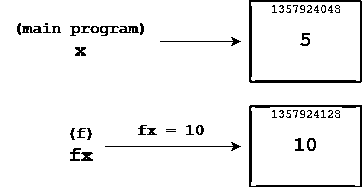

# 定义您自己的 Python 函数

> 原文：<https://realpython.com/defining-your-own-python-function/>

*立即观看**本教程有真实 Python 团队创建的相关视频课程。和书面教程一起看，加深理解: [**定义和调用 Python 函数**](/courses/defining-and-calling-functions/)

在本系列之前的教程中，您已经看到了许多演示使用内置 Python 函数的例子。在本教程中，你将学习如何**定义你自己的 Python 函数**。您将学习何时将您的程序划分为独立的用户定义的函数，以及完成这些需要什么工具。

**以下是你将在本教程中学到的内容:**

*   Python 中的**函数**是如何工作的，为什么它们是有益的
*   如何**定义并调用**自己的 Python 函数
*   向函数传递参数的机制
*   如何**将数据**从函数返回到调用环境

**免费 PDF 下载:** [Python 3 备忘单](https://realpython.com/bonus/python-cheat-sheet-short/)

## Python 中的函数

你可能熟悉函数的数学概念。函数是一个或多个输入和一组输出之间的关系或映射。在数学中，函数通常是这样表示的:

[](https://files.realpython.com/media/t.74ec5430f457.png)

这里，`f`是对输入`x`和`y`进行操作的函数。函数的输出是`z`。然而，编程函数比这一数学定义更加通用和通用。事实上，正确的函数定义和使用对于正确的软件开发是如此重要，以至于几乎所有现代编程语言都支持内置函数和用户定义函数。

在编程中，**函数**是一个自包含的代码块，它封装了一个特定的任务或一组相关的任务。在本系列之前的教程中，已经向您介绍了 Python 提供的一些内置函数。例如， [`id()`](https://realpython.com/python-variables/#object-identity) 接受一个参数并返回该对象的唯一整数标识符:

>>>

```py
>>> s = 'foobar'
>>> id(s)
56313440
```

`len()`返回传递给它的参数的长度:

>>>

```py
>>> a = ['foo', 'bar', 'baz', 'qux']
>>> len(a)
4
```

[`any()`](https://realpython.com/any-python/) 将一个 iterable 作为其参数，如果 iterable 中的任一项为[真值](https://realpython.com/python-data-types/#boolean-type-boolean-context-and-truthiness)和`False`，则返回`True`，否则:

>>>

```py
>>> any([False, False, False])
False
>>> any([False, True, False])
True

>>> any(['bar' == 'baz', len('foo') == 4, 'qux' in {'foo', 'bar', 'baz'}])
False
>>> any(['bar' == 'baz', len('foo') == 3, 'qux' in {'foo', 'bar', 'baz'}])
True
```

这些内置函数中的每一个都执行特定的任务。完成任务的代码是在某个地方定义的，但是您不需要知道代码在哪里工作，甚至不需要知道代码是如何工作的。你需要知道的只是函数的[接口](https://realpython.com/python-interface/):

1.  需要哪些**参数**(如果有的话)
2.  它返回什么**值**(如果有的话)

然后调用函数并传递适当的参数。程序执行到指定的代码体，做它有用的事情。当函数完成时，执行返回到代码停止的地方。该函数可能会也可能不会返回数据供您的代码使用，就像上面的例子一样。

当您定义自己的 Python 函数时，它的工作方式是一样的。从代码中的某个地方，您将调用 Python 函数，程序执行将转移到组成该函数的代码体。

**注意:**在这种情况下，你会知道代码在哪里，确切地知道它是如何工作的，因为是你写的！

当函数完成时，执行返回到调用函数的位置。根据您设计函数接口的方式，调用函数时可能会传入数据，函数完成时可能会传回返回值。

[*Remove ads*](/account/join/)

## Python 函数的重要性

几乎今天使用的所有编程语言都支持某种形式的用户定义函数，尽管它们并不总是被称为函数。在其他语言中，您可能会看到它们被称为下列之一:

*   **子程序**
*   **程序**
*   **方法**
*   **子程序**

那么，为什么要定义函数呢？有几个非常好的理由。我们现在来看几个。

### 抽象和可重用性

假设你写了一些有用的代码。随着您继续开发，您会发现该代码执行的任务是您经常需要的，在应用程序的许多不同位置。你该怎么办？你可以使用编辑器的复制粘贴功能一遍又一遍地复制代码。

稍后，您可能会决定有问题的代码需要修改。你要么会发现它有什么问题需要解决，要么会想以某种方式增强它。如果代码的副本分散在整个应用程序中，那么您需要在每个位置进行必要的更改。

**注:**乍一看，这似乎是一个合理的解决方案，但从长远来看，这很可能是一个维护噩梦！虽然您的代码编辑器可以通过提供搜索和替换功能来提供帮助，但这种方法很容易出错，并且您很容易在代码中引入难以发现的错误。

更好的解决方案是**定义一个执行任务**的 Python 函数。在应用程序中需要完成任务的任何地方，只需调用函数。接下来，如果您决定改变它的工作方式，那么您只需要在一个地方更改代码，这就是定义函数的地方。在调用该函数的任何地方，更改都会自动生效。

将功能抽象成功能定义的**是软件开发的[不要重复自己(DRY)原则](https://en.wikipedia.org/wiki/Don%27t_repeat_yourself)的一个例子。这可以说是使用函数的最强动机。**

### 模块化

函数允许**复杂的过程**被分解成更小的步骤。例如，假设您有一个程序，它读入一个文件，处理文件内容，然后写入一个输出文件。您的代码可能如下所示:

```py
# Main program

# Code to read file in
<statement>
<statement>
<statement>
<statement>

# Code to process file
<statement>
<statement>
<statement>
<statement>

# Code to write file out
<statement>
<statement>
<statement>
<statement>
```

在这个例子中，主程序是一长串代码，用空格和注释来帮助组织它。然而，如果代码变得更长、更复杂，那么你将越来越难以理解。

或者，您可以像下面这样构建代码:

```py
def read_file():
    # Code to read file in
    <statement>
    <statement>
    <statement>
    <statement>

def process_file():
    # Code to process file
    <statement>
    <statement>
    <statement>
    <statement>

def write_file():
    # Code to write file out
    <statement>
    <statement>
    <statement>
    <statement>

# Main program
read_file()
process_file()
write_file()
```

这个例子是**模块化**。它不是将所有代码串在一起，而是分解成独立的功能，每个功能专注于一个特定的任务。那些任务是*读*、*处理*，以及*写*。主程序现在只需要依次调用这些函数。

**注意:**`def`关键字引入了一个新的 Python 函数定义。你很快就会了解这一切。

在生活中，你一直在做这种事情，即使你没有明确地这样想。如果你想把装满东西的架子从车库的一边移到另一边，你最好不要只是站在那里漫无目的地想，“哦，天哪。我需要把那些东西都搬到那边去！我该怎么做？？?"你应该把工作分成几个易于管理的步骤:

1.  把所有的东西从货架上拿下来。
2.  **将**货架拆开。
3.  **搬运**货架零件穿过车库到达新位置。
4.  **重新组装**货架。
5.  把东西扛过车库。
6.  把东西放回货架上。

将一个大任务分解成更小、更小的子任务有助于让大任务更容易思考和管理。随着程序变得越来越复杂，以这种方式将它们模块化变得越来越有益。

[*Remove ads*](/account/join/)

### 名称空间分隔

**名称空间**是程序的一个区域，其中**标识符**具有意义。正如您将在下面看到的，当调用 Python 函数时，会为该函数创建一个新的名称空间，该名称空间不同于所有其他已存在的名称空间。

这样做的实际结果是,[变量](https://realpython.com/python-variables/)可以在 Python 函数中定义和使用，即使它们与其他函数或主程序中定义的变量同名。在这些情况下，不会有混淆或干扰，因为它们保存在单独的名称空间中。

这意味着当您在函数中编写代码时，您可以使用变量名和标识符，而不必担心它们是否已经在函数外的其他地方使用。这有助于大大减少代码中的错误。

**注意:**在本系列的后面中，您将学到更多关于名称空间[的知识。](https://realpython.com/python-namespaces-scope/)

希望您对函数的优点有足够的信心，并渴望创建一些函数！让我们看看怎么做。

## 函数调用和定义

定义 Python 函数的常用语法如下:

```py
def <function_name>([<parameters>]):
    <statement(s)>
```

下表解释了该定义的组成部分:

| 成分 | 意义 |
| --- | --- |
| `def` | 通知 Python 正在定义函数的关键字 |
| `<function_name>` | 命名函数的有效 Python 标识符 |
| `<parameters>` | 一个可选的逗号分隔的参数列表，可以传递给函数 |
| `:` | 表示 Python 函数头(名称和参数列表)结尾的标点符号 |
| `<statement(s)>` | 一组有效的 Python 语句 |

最后一项`<statement(s)>`，称为函数的**体**。主体是调用函数时将执行的语句块。Python 函数的主体根据[偏离规则](https://realpython.com/python-conditional-statements/#python-its-all-about-the-indentation)通过缩进来定义。这与和控制结构相关的代码块是一样的，比如一个 [`if`](https://realpython.com/python-conditional-statements/) 或者 [`while`](https://realpython.com/courses/mastering-while-loops/) 语句。

调用 Python 函数的语法如下:

```py
<function_name>([<arguments>])
```

`<arguments>`是传递给函数的值。它们对应于 Python 函数定义中的`<parameters>`。您可以定义一个不带任何参数的函数，但是括号仍然是必需的。函数定义和函数调用都必须包含括号，即使它们是空的。

像往常一样，您将从一个小例子开始，并从那里增加复杂性。牢记历史悠久的数学传统，您将调用您的第一个 Python 函数`f()`。这里有一个脚本文件`foo.py`，它定义并调用`f()`:

```py
 1def f():
 2    s = '-- Inside f()'
 3    print(s)
 4
 5print('Before calling f()')
 6f()
 7print('After calling f()')
```

下面是这段代码的工作原理:

1.  **第 1 行**使用`def`关键字来表示一个函数正在被定义。执行`def`语句仅仅创建了`f()`的定义。所有后面缩进的行(第 2 行到第 3 行)都成为了`f()`主体的一部分，并被存储为它的定义，但是它们还没有被执行。

2.  第 4 行是函数定义和主程序第一行之间的一点空白。虽然这在语法上不是必需的，但拥有它是很好的。要了解更多关于顶级 Python 函数定义周围的空白，请查看[用 PEP 8](https://realpython.com/courses/writing-beautiful-python-code-pep-8/) 编写漂亮的 Python 代码。

3.  **第 5 行**是第一个没有缩进的语句，因为它不是`f()`定义的一部分。这是主程序的开始。当主程序执行时，首先执行这条语句。

4.  **6 号线**是去`f()`的一个电话。请注意，空括号在函数定义和函数调用中都是必需的，即使没有参数也是如此。执行进行到`f()`并且执行`f()`主体中的语句。

5.  **第 7 行**是在`f()`的主体完成后执行的下一行。执行返回到这个[语句](https://realpython.com/python-print/)。

`foo.py`的执行顺序(或**控制流**)如下图所示:

[](https://files.realpython.com/media/t.f3e2000ecb56.png)

当从 Windows 命令提示符运行`foo.py`时，结果如下:

```py
C:\Users\john\Documents\Python\doc>python foo.py
Before calling f()
-- Inside f()
After calling f()
```

有时，您可能希望定义一个空函数，它什么也不做。这被称为**存根**，它通常是一个 Python 函数的临时占位符，该函数将在以后完全实现。正如控制结构中的块不能为空一样，函数体也不能为空。要定义一个存根函数，使用 [`pass`语句](https://realpython.com/python-pass/):

>>>

```py
>>> def f():
...     pass
...
>>> f()
```

正如您在上面看到的，对存根函数的调用在语法上是有效的，但并不做任何事情。

[*Remove ads*](/account/join/)

## 参数传递

到目前为止，在本教程中，您定义的函数没有任何参数。这有时会很有用，你偶尔会写这样的函数。不过，更常见的情况是，您会希望**将数据传递到函数**中，以便它的行为可以随着调用的不同而变化。让我们看看如何做到这一点。

### 位置参数

向 Python 函数传递参数最直接的方式是使用**位置参数**(也称为**必需参数**)。在函数定义中，您可以在括号内指定逗号分隔的参数列表:

>>>

```py
>>> def f(qty, item, price):
...     print(f'{qty}  {item} cost ${price:.2f}')
...
```

调用该函数时，指定相应的参数列表:

>>>

```py
>>> f(6, 'bananas', 1.74)
6 bananas cost $1.74
```

参数(`qty`、`item`和`price`)的行为类似于函数本地定义的**变量**。当调用函数时，传递的参数(`6`、`'bananas'`和`1.74`)按顺序**绑定**到参数，就像通过变量赋值一样:

| 参数 |  | 争吵 |
| --- | --- | --- |
| `qty` | ← | `6` |
| `item` | ← | `bananas` |
| `price` | ← | `1.74` |

在一些编程文本中，函数定义中给出的参数称为**形参**，函数调用中的实参称为**实参:**

[](https://files.realpython.com/media/t.4eefe0ad45c8.png)

尽管位置参数是将数据传递给函数的最直接的方式，但它们也提供了最少的灵活性。首先，调用中参数的顺序必须与定义中参数的顺序相匹配。当然，没有什么可以阻止您无序地指定位置参数:

>>>

```py
>>> f('bananas', 1.74, 6)
bananas 1.74 cost $6.00
```

该函数甚至可能仍在运行，就像上面的例子一样，但它不太可能产生正确的结果。定义函数的程序员有责任[记录](https://realpython.com/documenting-python-code/)适当的**参数**应该是什么，函数的用户有责任了解并遵守这些信息。

对于位置参数，调用中的参数和定义中的参数不仅在顺序上必须一致，而且在**号**上也必须一致。这就是位置参数也被称为必需参数的原因。调用函数时不能遗漏任何内容:

>>>

```py
>>> # Too few arguments
>>> f(6, 'bananas')
Traceback (most recent call last):
  File "<pyshell#6>", line 1, in <module>
    f(6, 'bananas')
TypeError: f() missing 1 required positional argument: 'price'
```

也不能指定额外的:

>>>

```py
>>> # Too many arguments
>>> f(6, 'bananas', 1.74, 'kumquats')
Traceback (most recent call last):
  File "<pyshell#5>", line 1, in <module>
    f(6, 'bananas', 1.74, 'kumquats')
TypeError: f() takes 3 positional arguments but 4 were given
```

位置参数在概念上很容易使用，但是它们不是很宽容。您必须在函数调用中指定与定义中的参数数量相同的参数，并且顺序完全相同。在接下来的小节中，您将看到一些放宽这些限制的参数传递技术。

### 关键字参数

当你调用一个函数时，你可以用`<keyword>=<value>`的形式指定参数。在这种情况下，每个`<keyword>`必须匹配 Python 函数定义中的一个参数。例如，之前定义的函数`f()`可以用**关键字参数**调用，如下所示:

>>>

```py
>>> f(qty=6, item='bananas', price=1.74)
6 bananas cost $1.74
```

引用与任何声明的参数都不匹配的关键字会生成异常:

>>>

```py
>>> f(qty=6, item='bananas', cost=1.74)
Traceback (most recent call last):
  File "<stdin>", line 1, in <module>
TypeError: f() got an unexpected keyword argument 'cost'
```

使用关键字参数取消了对参数顺序的限制。每个关键字参数通过名称明确指定一个特定的参数，因此您可以按任何顺序指定它们，Python 仍然知道哪个参数与哪个参数对应:

>>>

```py
>>> f(item='bananas', price=1.74, qty=6)
6 bananas cost $1.74
```

但是，与位置实参一样，实参和形参的数量仍然必须匹配:

>>>

```py
>>> # Still too few arguments
>>> f(qty=6, item='bananas')
Traceback (most recent call last):
  File "<pyshell#16>", line 1, in <module>
    f(qty=6, item='bananas')
TypeError: f() missing 1 required positional argument: 'price'
```

因此，关键字参数允许函数参数指定顺序的灵活性，但是参数的数量仍然是固定的。

可以使用位置参数和关键字参数来调用函数:

>>>

```py
>>> f(6, price=1.74, item='bananas')
6 bananas cost $1.74

>>> f(6, 'bananas', price=1.74)
6 bananas cost $1.74
```

当位置参数和关键字参数都存在时，所有位置参数必须放在前面:

>>>

```py
>>> f(6, item='bananas', 1.74)
SyntaxError: positional argument follows keyword argument
```

一旦指定了关键字参数，它的右边就不能有任何位置参数。

要了解关于位置和关键字参数的更多信息，请查看真正的 Python 课程[探索特殊函数参数](https://realpython.com/courses/special-function-parameters/)。

[*Remove ads*](/account/join/)

### 默认参数

如果 Python 函数定义中指定的参数具有形式`<name>=<value>`，则`<value>`成为该参数的默认值。这样定义的参数被称为**默认或可选参数**。带有默认参数的函数定义示例如下所示:

>>>

```py
>>> def f(qty=6, item='bananas', price=1.74):
...     print(f'{qty}  {item} cost ${price:.2f}')
...
```

当调用这个版本的`f()`时，任何被省略的参数都采用其默认值:

>>>

```py
>>> f(4, 'apples', 2.24)
4 apples cost $2.24
>>> f(4, 'apples')
4 apples cost $1.74

>>> f(4)
4 bananas cost $1.74
>>> f()
6 bananas cost $1.74

>>> f(item='kumquats', qty=9)
9 kumquats cost $1.74
>>> f(price=2.29)
6 bananas cost $2.29
```

**总之:**

*   **位置参数**必须在顺序和数量上与函数定义中声明的参数一致。
*   **关键字参数**在数量上必须与声明的参数一致，但可以按任意顺序指定。
*   **默认参数**允许在调用函数时省略一些参数。

### 可变默认参数值

如果您指定一个默认参数值是一个**可变对象**，事情会变得很奇怪。考虑以下 Python 函数定义:

>>>

```py
>>> def f(my_list=[]):
...     my_list.append('###')
...     return my_list
...
```

`f()`接受单个列表参数，将[字符串](https://realpython.com/python-strings/) `'###'`追加到列表的末尾，并返回结果:

>>>

```py
>>> f(['foo', 'bar', 'baz'])
['foo', 'bar', 'baz', '###']

>>> f([1, 2, 3, 4, 5])
[1, 2, 3, 4, 5, '###']
```

参数`my_list`的缺省值是空列表，所以如果不带任何参数调用`f()`，那么返回值是一个只有单个元素`'###'`的列表:

>>>

```py
>>> f()
['###']
```

到目前为止一切都说得通。现在，如果第二次、第三次不带任何参数地调用`f()`,您认为会发生什么？让我们看看:

>>>

```py
>>> f()
['###', '###']
>>> f()
['###', '###', '###']
```

哎呀！您可能希望每个后续调用也像第一个调用一样返回单例列表`['###']`。相反，返回值不断增长。发生了什么事？

在 Python 中，默认的参数值是在定义函数时(即执行`def`语句时)只定义一次的**。每次调用该函数时，不会重新定义默认值。因此，每次在没有参数的情况下调用`f()`，都是在同一个列表中执行 [`.append()`](https://realpython.com/python-append/) 。**

你可以用`id()`来证明这一点:

>>>

```py
>>> def f(my_list=[]):
...     print(id(my_list))
...     my_list.append('###')
...     return my_list
...
>>> f()
140095566958408
['###'] 
>>> f()
140095566958408
['###', '###']
>>> f()
140095566958408
['###', '###', '###']
```

显示的**对象标识符**确认，当`my_list`被允许默认时，该值是每次调用的相同对象。由于列表是可变的，每个后续的`.append()`调用都会导致列表变长。当您使用一个可变对象作为参数的默认值时，这是一个常见的、有大量文献记载的缺陷。这可能会导致混乱的代码行为，最好避免。

作为一种变通方法，可以考虑使用默认的参数值来通知**没有指定参数**。大多数任何值都可以，但 [`None`](https://realpython.com/null-in-python/) 是常见的选择。当 sentinel 值表示没有给定参数时，在函数内创建一个新的空列表:

>>>

```py
>>> def f(my_list=None):
...     if my_list is None: ...         my_list = [] ...     my_list.append('###')
...     return my_list
...

>>> f() ['###']
>>> f() ['###']
>>> f() ['###']

>>> f(['foo', 'bar', 'baz'])
['foo', 'bar', 'baz', '###']

>>> f([1, 2, 3, 4, 5])
[1, 2, 3, 4, 5, '###']
```

请注意这是如何确保无论何时在没有参数的情况下调用`f()`时,`my_list`现在都真正默认为空列表。

[*Remove ads*](/account/join/)

### Pascal 中的按值传递与按引用传递

在编程语言设计中，有两种常见的将参数传递给函数的范例:

1.  **传值:**将参数的副本传递给函数。
2.  **按引用传递:**对参数的引用被传递给函数。

还存在其他机制，但它们本质上是这两种机制的变体。在这一节中，您将绕过 Python，简要地看一下 [Pascal](https://en.wikipedia.org/wiki/Pascal_%28programming_language%29) ，这是一种在这两者之间做了特别明确区分的编程语言。

**注:**不熟悉 Pascal 也不用担心！这些概念类似于 Python 的概念，并且所展示的例子附有足够详细的解释，您应该有一个大致的概念。一旦你看到了 Pascal 中参数传递的工作原理，我们将回到 Python，你将看到它是如何比较的。

以下是您需要了解的 Pascal 语法:

*   **过程:**Pascal 中的过程类似于 Python 函数。
*   **冒号-等号:**这个运算符(`:=`)在 Pascal 中用于赋值。这类似于 Python 中的等号(`=`)。
*   **`writeln()` :** 该函数向控制台显示数据，类似于 Python 的`print()`。

有了这些基础，下面是第一个 Pascal 示例:

```py
 1// Pascal Example #1
 2
 3procedure f(fx : integer); 4begin
 5    writeln('Start  f():  fx = ', fx);
 6    fx := 10;
 7    writeln('End    f():  fx = ', fx);
 8end;
 9
10// Main program
11var
12    x : integer;
13
14begin
15    x := 5;
16    writeln('Before f():  x = ', x);
17    f(x);
18    writeln('After  f():  x = ', x);
19end.
```

事情是这样的:

*   **第 12 行:**主程序定义了一个整数变量`x`。
*   **第 15 行:**它最初给`x`赋值`5`。
*   **第 17 行:**然后调用过程`f()`，传递`x`作为参数。
*   **第 5 行:`f()`内的**，`writeln()`语句显示对应的参数`fx`最初是`5`，传入的值。
*   **第 6 行:** `fx`然后被赋值`10`。
*   **第 7 行:**该值由在`f()`退出前执行的`writeln()`语句验证。
*   **第 18 行:**回到主程序的调用环境，这个`writeln()`语句显示在`f()`返回后，`x`仍然是`5`，和过程调用前一样。

运行此代码会生成以下输出:

```py
Before f():  x = 5
Start  f():  fx = 5
End    f():  fx = 10
After  f():  x = 5
```

在这个例子中，`x`是由值传递的**，所以`f()`只接收一个副本。当相应的参数`fx`被修改时，`x`不受影响。**

**注意:**如果你想看实际操作，你可以使用在线 Pascal 编译器自己运行代码。

只需遵循以下步骤:

1.  从上面的代码框中复制代码。
2.  访问[在线 Pascal 编译器](https://www.tutorialspoint.com/compile_pascal_online.php)。
3.  在左侧的“代码”框中，用您在步骤 1 中复制的代码替换任何现有内容。
4.  点击*执行*。

您应该会看到与上面相同的输出。

现在，将它与下一个例子进行比较:

```py
 1// Pascal Example #2
 2
 3procedure f(var fx : integer); 4begin
 5    writeln('Start  f():  fx = ', fx);
 6    fx := 10;
 7    writeln('End    f():  fx = ', fx);
 8end;
 9
10// Main program
11var
12    x : integer;
13
14begin
15    x := 5;
16    writeln('Before f():  x = ', x);
17    f(x);
18    writeln('After  f():  x = ', x);
19end.
```

这段代码与第一个示例相同，只有一处不同。就是第 3 行过程`f()`定义中`fx`前面有`var`这个词。这表明`f()`的参数是通过引用传递的**。对相应参数`fx`的更改也会修改调用环境中的参数。**

除了最后一行之外，这段代码的输出与前面的一样:

```py
Before f():  x = 5
Start  f():  fx = 5
End    f():  fx = 10
After  f():  x = 10
```

再次，像以前一样，`fx`在`f()`内被赋予值`10`。但这一次，当`f()`返回时，主程序中的`x`也被修改了。

在许多编程语言中，这就是按值传递和按引用传递的本质区别:

*   **如果一个变量是通过值传递的，**那么这个函数就有一个副本可以使用，但是它不能在调用环境中修改原始值。
*   **如果一个变量是通过引用传递的，**那么函数对相应参数的任何更改都会影响调用环境中的值。

原因来自于这些语言中**引用**的含义。变量值存储在内存中。在 Pascal 和类似的语言中，引用本质上是那个内存位置的地址，如下所示:

[](https://files.realpython.com/media/t.0d34e58b9e92.png)

在左边的图中，`x`在主程序的名称空间中分配了内存。当`f()`被调用时，`x`是由值传递的**，因此对应参数`fx`的内存被分配在`f()`的名称空间中，并且`x`的值被复制到那里。当`f()`修改`fx`时，改变的是这个本地副本。调用环境中`x`的值保持不变。**

右图中，`x`是通过引用传递的**。相应的参数`fx`指向主程序名称空间中的实际地址，其中存储了`x`的值。当`f()`修改`fx`时，它在修改那个位置的值，就像主程序在修改`x`本身一样。**

[*Remove ads*](/account/join/)

### Python 中的按值传递与按引用传递

Python 中的参数是按值传递还是按引用传递？确切地说，答案是两者都不是。这是因为引用在 Python 和 Pascal 中的含义不同。

回想一下，在 Python 中，每一段数据都是一个**对象**。引用指向一个对象，而不是特定的内存位置。这意味着在 Python 中赋值的解释方式和在 Pascal 中不同。考虑下面的 Pascal 语句对:

```py
x := 5
x := 10
```

这些是这样解释的:

*   **变量`x`** 引用一个特定的内存位置。
*   **第一条语句**将值`5`放在那个位置。
*   **下一条语句**覆盖了`5`并将`10`放在那里。

相比之下，在 Python 中，类似的赋值语句如下:

```py
x = 5
x = 10
```

这些赋值语句具有以下含义:

*   **第一条语句**导致`x`指向一个值为`5`的对象。
*   **下一条语句**将`x`重新赋值为一个不同对象的新引用，该对象的值为`10`。换句话说，第二个赋值将`x`重新绑定到值为`10`的不同对象。

在 Python 中，当您向函数传递参数时，会发生类似的**重新绑定**。考虑这个例子:

>>>

```py
 1>>> def f(fx):
 2...     fx = 10
 3...
 4>>> x = 5
 5>>> f(x)
 6>>> x
 75
```

在主程序中，第 4 行的语句`x = 5`创建了一个名为`x`的引用，该引用绑定到一个值为`5`的对象。然后在第 5 行调用`f()`，用`x`作为参数。当`f()`第一次启动时，一个名为`fx`的新引用被创建，它最初指向与`x`相同的`5`对象:

[](https://files.realpython.com/media/t.feb95658ffcd.png)

然而，当执行第 2 行的语句`fx = 10`时，`f()` **将** `fx`重新绑定到一个值为`10`的新对象。两个引用`x`和`fx`彼此**解耦**。`f()`所做的其他事情都不会影响`x`，当`f()`终止时，`x`仍将指向对象`5`，就像它在函数调用之前所做的那样:

[](https://files.realpython.com/media/t.c246f52a6217.png)

你可以用`id()`来确认这一切。下面是上面示例的一个稍微扩充的版本，显示了相关对象的数字标识符:

>>>

```py
 1>>> def f(fx):
 2...     print('fx =', fx, '/ id(fx) = ', id(fx))
 3...     fx = 10
 4...     print('fx =', fx, '/ id(fx) = ', id(fx))
 5...
 6
 7>>> x = 5
 8>>> print('x =', x, '/ id(x) = ', id(x))
 9x = 5 / id(x) =  1357924048
10
11>>> f(x)
12fx = 5 / id(fx) =  1357924048
13fx = 10 / id(fx) =  1357924128
14
15>>> print('x =', x, '/ id(x) = ', id(x))
16x = 5 / id(x) =  1357924048
```

当`f()`第一次启动时，`fx`和`x`都指向同一个对象，其`id()`为`1357924048`。在`f()`执行第 3 行的语句`fx = 10`后，`fx`指向一个不同的对象，其`id()`为`1357924128`。与调用环境中的原始对象的连接丢失。

Python 中的参数传递有点像按值传递和按引用传递的混合体。传递给函数的是对对象的引用，但引用是通过值传递的。

**注意:** Python 的参数传递机制已经被称为**。这是因为在 Python 中，参数名被绑定到函数入口的对象上，赋值也是将名称绑定到对象上的过程。您可能还会看到按对象传递、按对象引用传递或按共享传递等术语。*

*这里的关键是 Python 函数不能通过将相应的参数重新赋值给其他东西来改变参数的值。以下示例说明了这一点:

>>>

```py
>>> def f(x):
...     x = 'foo'
...
>>> for i in (
...         40,
...         dict(foo=1, bar=2),
...         {1, 2, 3},
...         'bar',
...         ['foo', 'bar', 'baz']):
...     f(i)
...     print(i)
...
40
{'foo': 1, 'bar': 2}
{1, 2, 3}
bar
['foo', 'bar', 'baz']
```

这里， [`int`](https://realpython.com/lessons/integers/) ， [`dict`](https://realpython.com/courses/python-dictionary-iteration/) ， [`set`](https://realpython.com/python-sets/) ， [`str`](https://realpython.com/courses/python-strings/) ， [`list`](https://realpython.com/courses/lists-tuples-python/) 类型的对象作为参数传递给`f()`。`f()`试图将它们分配给 string 对象`'foo'`，但是正如您所看到的，一旦回到调用环境中，它们都不会改变。`f()`一执行赋值`x = 'foo'`，引用**反弹**，与原对象的连接丢失。

这是否意味着 Python 函数永远不能修改它的参数？其实，不，事实并非如此！看看这里发生了什么:

>>>

```py
>>> def f(x):
...     x[0] = '---' ...

>>> my_list = ['foo', 'bar', 'baz', 'qux'] 
>>> f(my_list)
>>> my_list
['---', 'bar', 'baz', 'qux']
```

在这种情况下，`f()`的参数是一个[列表](https://realpython.com/python-lists-tuples/#python-lists)。当调用`f()`时，传递一个对`my_list`的引用。你已经看到`f()`不能重新分配`my_list`批发。如果`x`被分配给其他对象，那么它将被绑定到一个不同的对象，到`my_list`的连接将会丢失。

但是，`f()`可以使用引用在`my_list`内部进行修改。在这里，`f()`已经修饰了第一个元素。您可以看到，一旦函数返回，`my_list`实际上已经在调用环境中被更改了。同样的概念也适用于[词典](https://realpython.com/python-dicts):

>>>

```py
>>> def f(x):
...     x['bar'] = 22 ...

>>> my_dict = {'foo': 1, 'bar': 2, 'baz': 3} 
>>> f(my_dict)
>>> my_dict
{'foo': 1, 'bar': 22, 'baz': 3}
```

这里，`f()`以`x`为参照，在`my_dict`内部做了改动。在`f()`返回后，这种变化反映在调用环境中。

[*Remove ads*](/account/join/)

### 参数传递摘要

Python 中的参数传递可以总结如下。**传递一个不可变的对象**，比如一个 [`int`](https://realpython.com/lessons/integers/) ， [`str`](https://realpython.com/lessons/built-in-string-functions/) ， [`tuple`](https://realpython.com/python-lists-tuples/) ，或者 [`frozenset`](https://realpython.com/python-sets/#frozen-sets) ，对一个 Python 函数来说就像传值一样。该函数不能在调用环境中修改对象。

**传递一个可变对象**，比如 [`list`](https://realpython.com/python-lists-tuples/#python-lists) 、 [`dict`](https://realpython.com/python-dicts) 或 [`set`](https://realpython.com/python-sets) 的行为有点类似于按引用传递。该函数不能大规模地重新分配对象，但它可以在对象内就地更改项目，这些更改将反映在调用环境中。

### 副作用

因此，在 Python 中，您可以从函数内部修改参数，以便将更改反映到调用环境中。但是你应该这样做吗？这是一个在编程行话中被称为**副作用**的例子。

更一般地说，如果 Python 函数以任何方式修改了它的调用环境，就会产生副作用。更改函数参数的值只是可能性之一。

**注意:**你可能熟悉人类健康领域的副作用，该术语通常指药物治疗的**意外后果**。通常，后果是不可取的，如呕吐或镇静。另一方面，副作用*可以*故意使用。例如，一些药物会引起食欲刺激，这可以被用来作为一种优势，即使这不是药物的主要目的。

编程中的概念是类似的。如果副作用是函数规范的一部分，并且函数的用户清楚地知道何时以及如何修改调用环境，那么它是可以的。但是程序员可能并不总是正确地记录副作用，或者他们甚至可能没有意识到副作用正在发生。

当它们被隐藏或出乎意料时，副作用会导致很难追踪的程序错误。一般来说，最好避开它们。

## `return`语句

那么 Python 函数能做什么呢？毕竟，在很多情况下，如果一个函数没有引起调用环境的一些变化，那么调用它根本就没有多大意义。一个函数应该如何影响它的调用者？

嗯，一种可能是使用**函数返回值**。Python 函数中的 [`return`语句](https://realpython.com/python-return-statement/)有两个用途:

1.  它立即终止该函数，并将执行控制传递回调用者。
2.  它提供了一种机制，通过这种机制，函数可以将数据传递回调用者。

### 退出功能

在一个函数中，`return`语句导致从 Python 函数中立即退出，并将执行转移回调用者:

>>>

```py
>>> def f():
...     print('foo')
...     print('bar')
...     return
...

>>> f()
foo
bar
```

在这个例子中，`return`语句实际上是多余的。当**从结尾**落下时，函数将返回给调用者——也就是说，在函数体的最后一条语句执行完之后。因此，如果没有`return`语句，这个函数的行为是一样的。

然而，`return`语句不需要在函数的末尾。它们可以出现在函数体的任何地方，甚至多次出现。考虑这个例子:

>>>

```py
 1>>> def f(x):
 2...     if x < 0:
 3...         return
 4...     if x > 100:
 5...         return
 6...     print(x)
 7...
 8
 9>>> f(-3)
10>>> f(105)
11>>> f(64)
1264
```

对`f()`的前两次调用不会导致任何输出，因为在到达第 6 行的 [`print()`语句](https://realpython.com/courses/python-print/)之前，执行了一条`return`语句并且函数提前退出。

这种范式对于函数中的**错误检查**非常有用。您可以在函数开始时检查几个错误条件，如果有问题，使用`return`语句退出:

```py
def f():
    if error_cond1:
        return
    if error_cond2:
        return
    if error_cond3:
        return

    <normal processing>
```

如果没有遇到任何错误条件，则该函数可以继续其正常处理。

[*Remove ads*](/account/join/)

### 向调用者返回数据

除了退出一个函数之外，`return`语句还用于**将数据传递回调用者**。如果 Python 函数中的`return`语句后跟一个表达式，那么在调用环境中，函数调用将计算该表达式的值:

>>>

```py
 1>>> def f():
 2...     return 'foo'
 3...
 4
 5>>> s = f()
 6>>> s
 7'foo'
```

这里，第 5 行的表达式`f()`的值是`'foo'`，它随后被赋给变量`s`。

函数可以返回任何类型的**对象**。在 Python 中，这意味着几乎任何东西。在调用环境中，函数调用可以以对函数返回的对象类型有意义的任何方式在语法上使用。

例如，在这段代码中，`f()`返回一个字典。在调用环境中，表达式`f()`代表一个字典，而`f()['baz']`是该字典的有效键引用:

>>>

```py
>>> def f():
...     return dict(foo=1, bar=2, baz=3)
...

>>> f()
{'foo': 1, 'bar': 2, 'baz': 3}
>>> f()['baz']
3
```

在下一个示例中，`f()`返回一个字符串，您可以像对任何其他字符串一样对其进行切片:

>>>

```py
>>> def f():
...     return 'foobar'
...

>>> f()[2:4]
'ob'
```

这里，`f()`返回一个可以索引或切片的列表:

>>>

```py
>>> def f():
...     return ['foo', 'bar', 'baz', 'qux']
...  

>>> f()
['foo', 'bar', 'baz', 'qux']
>>> f()[2]
'baz'
>>> f()[::-1]
['qux', 'baz', 'bar', 'foo']
```

如果在一个`return`语句中指定了多个逗号分隔的表达式，那么它们被打包并作为一个[元组](https://realpython.com/python-lists-tuples/#python-tuples)返回:

>>>

```py
>>> def f():
...     return 'foo', 'bar', 'baz', 'qux'
...

>>> type(f())
<class 'tuple'>
>>> t = f()
>>> t
('foo', 'bar', 'baz', 'qux')

>>> a, b, c, d = f()
>>> print(f'a = {a}, b = {b}, c = {c}, d = {d}')
a = foo, b = bar, c = baz, d = qux
```

当没有返回值时，Python 函数返回特殊的 Python 值`None`:

>>>

```py
>>> def f():
...     return
...

>>> print(f())
None
```

如果函数体根本不包含`return`语句，并且函数从末尾脱落，也会发生同样的情况:

>>>

```py
>>> def g():
...     pass
...

>>> print(g())
None
```

回想一下 [`None`](https://realpython.com/python-operators-expressions/#evaluation-of-non-boolean-values-in-boolean-context) 在[布尔上下文](https://realpython.com/python-boolean/)中求值时为 falsy。

由于通过一个裸露的`return`语句退出的函数或者从末尾返回的函数会返回`None`，所以对这样一个函数的调用可以在布尔上下文中使用:

>>>

```py
>>> def f():
...     return
...
>>> def g():
...     pass
...

>>> if f() or g():
...     print('yes')
... else:
...     print('no')
...
no
```

在这里，对`f()`和`g()`的调用都是假的，所以`f() or g()`也是假的，并且`else`子句执行。

[*Remove ads*](/account/join/)

### 重温副作用

假设您想编写一个函数，它接受一个整数参数并对其进行双精度处理。也就是说，您希望将一个整数变量传递给函数，当函数返回时，该变量在调用环境中的值应该是原来的两倍。在 Pascal 中，您可以使用按引用传递来实现这一点:

```py
 1procedure double(var x : integer); 2begin
 3    x := x * 2;
 4end;
 5
 6var
 7    x : integer;
 8
 9begin
10    x := 5;
11    writeln('Before procedure call: ', x);
12    double(x);
13    writeln('After procedure call:  ', x);
14end.
```

执行这段代码会产生以下输出，这验证了`double()`确实在调用环境中修改了`x`:

```py
Before procedure call: 5
After procedure call:  10
```

在 Python 中，这是行不通的。如您所知，Python 整数是不可变的，所以 Python 函数不能通过副作用改变整数参数:

>>>

```py
>>> def double(x):
...     x *= 2
...  

>>> x = 5 >>> double(x) >>> x
5
```

但是，您可以使用返回值来获得类似的效果。只需编写`double()`,让它接受一个整数参数，将它加倍，然后返回加倍后的值。然后，调用者负责修改原始值的赋值:

>>>

```py
>>> def double(x):
...     return x * 2
...  

>>> x = 5 >>> x = double(x) >>> x
10
```

这比通过副作用进行修改更可取。很明显,`x`在调用环境中被修改了，因为调用者自己也在这么做。反正是唯一的选择，因为这种情况下靠副作用修改是行不通的。

尽管如此，即使在有可能通过副作用修改参数的情况下，使用返回值可能仍然更清楚。假设您想将列表中的每一项都加倍。因为列表是可变的，所以您可以定义一个 Python 函数来就地修改列表:

>>>

```py
>>> def double_list(x):
...     i = 0
...     while i < len(x):
...             x[i] *= 2
...             i += 1
...  

>>> a = [1, 2, 3, 4, 5] >>> double_list(a) >>> a
[2, 4, 6, 8, 10]
```

与上一个例子中的`double()`不同，`double_list()`实际上按预期工作。如果函数的文档清楚地说明列表参数的内容被更改，那么这可能是一个合理的实现。

然而，您也可以编写`double_list()`来通过返回值传递所需的列表，并允许调用者进行赋值，类似于在前面的示例中如何重写`double()`:

>>>

```py
>>> def double_list(x):
...     r = []
...     for i in x:
...             r.append(i * 2)
...     return r
...

>>> a = [1, 2, 3, 4, 5] >>> a = double_list(a) >>> a
[2, 4, 6, 8, 10]
```

这两种方法都同样有效。通常情况下，这是一个风格问题，个人喜好各不相同。副作用不一定是完完全全的邪恶，它们有它们的位置，但是因为几乎任何东西都可以从函数中返回，所以同样的事情通常也可以通过返回值来完成。

## 可变长度参数列表

在某些情况下，当你定义一个函数时，你可能事先不知道你想要它接受多少个参数。例如，假设您想要编写一个 Python 函数来计算几个值的平均值。你可以这样开始:

>>>

```py
>>> def avg(a, b, c):
...     return (a + b + c) / 3
...
```

如果你想平均三个值，一切都很好:

>>>

```py
>>> avg(1, 2, 3)
2.0
```

但是，正如您已经看到的，当使用位置参数时，传递的参数数量必须与声明的参数数量一致。很明显，对于除了三个以外的任何数量的值来说，`avg()`的实现都不太好:

>>>

```py
>>> avg(1, 2, 3, 4)
Traceback (most recent call last):
  File "<pyshell#34>", line 1, in <module>
    avg(1, 2, 3, 4)
TypeError: avg() takes 3 positional arguments but 4 were given
```

您可以尝试用可选参数定义`avg()`:

>>>

```py
>>> def avg(a, b=0, c=0, d=0, e=0):
...     .
...     .
...     .
...
```

这允许指定可变数量的参数。以下调用至少在语法上是正确的:

```py
avg(1)
avg(1, 2)
avg(1, 2, 3)
avg(1, 2, 3, 4)
avg(1, 2, 3, 4, 5)
```

但是这种方法仍然存在一些问题。首先，它仍然只允许最多五个参数，而不是任意数量。更糟糕的是，没有办法区分指定的参数和允许默认的参数。该函数无法知道实际传递了多少个参数，因此它不知道要除以什么:

>>>

```py
>>> def avg(a, b=0, c=0, d=0, e=0):
...     return (a + b + c + d + e) / # Divided by what???
...
```

显然，这也不行。

您可以编写`avg()`来获取一个列表参数:

>>>

```py
>>> def avg(a):
...     total = 0
...     for v in a:
...             total += v
...     return total / len(a)
...  

>>> avg([1, 2, 3])
2.0 
>>> avg([1, 2, 3, 4, 5])
3.0
```

至少这个管用。它允许任意数量的值并产生正确的结果。额外的好处是，当参数是一个元组时，它也可以工作:

>>>

```py
>>> t = (1, 2, 3, 4, 5)
>>> avg(t)
3.0
```

缺点是必须将值分组到一个列表或元组中的额外步骤可能不是该函数的用户所期望的，并且它不是非常优雅。每当你发现 Python 代码看起来[不雅](https://realpython.com/python-pep8/)的时候，可能会有更好的选择。

在这种情况下，的确有！Python 提供了一种方法，通过使用星号(`*`)操作符打包和解包参数元组，向函数传递可变数量的参数。

[*Remove ads*](/account/join/)

### 参数元组打包

当 Python 函数定义中的参数名前面有星号(`*`)时，表示**参数元组打包**。函数调用中任何相应的参数都被打包到一个[元组](https://realpython.com/python-lists-tuples/#python-tuples)中，函数可以通过给定的参数名引用该元组。这里有一个例子:

>>>

```py
>>> def f(*args):
...     print(args)
...     print(type(args), len(args))
...     for x in args:
...             print(x)
...

>>> f(1, 2, 3)
(1, 2, 3) 
<class 'tuple'> 3
1
2
3

>>> f('foo', 'bar', 'baz', 'qux', 'quux')
('foo', 'bar', 'baz', 'qux', 'quux')
<class 'tuple'> 5
foo
bar
baz
qux
quux
```

在`f()`的定义中，参数说明`*args`表示元组打包。在对`f()`的每次调用中，参数被打包到一个元组中，函数可以通过名称`args`来引用它。任何名字都可以使用，但是`args`是如此普遍的选择，以至于它实际上是一个标准。

使用元组打包，您可以像这样清理`avg()`:

>>>

```py
>>> def avg(*args):
...     total = 0
...     for i in args:
...         total += i
...     return total / len(args)
...

>>> avg(1, 2, 3)
2.0
>>> avg(1, 2, 3, 4, 5)
3.0
```

更好的是，您可以通过用内置的 Python 函数`sum()`替换`for`循环来进一步整理它，该函数对任何 iterable 中的数值求和:

>>>

```py
>>> def avg(*args):
...     return sum(args) / len(args) ...

>>> avg(1, 2, 3)
2.0
>>> avg(1, 2, 3, 4, 5)
3.0
```

现在，`avg()`写得很简洁，也按预期工作。

尽管如此，根据如何使用这些代码，可能仍有工作要做。如前所述，如果有任何非数字参数，`avg()`将产生一个`TypeError`异常:

>>>

```py
>>> avg(1, 'foo', 3)
Traceback (most recent call last):
  File "<stdin>", line 1, in <module>
  File "<stdin>", line 2, in avg
TypeError: unsupported operand type(s) for +: 'int' and 'str'
```

为了尽可能的健壮，你应该添加代码到[来检查](https://realpython.com/python-type-checking/)参数的类型是否正确。在本系列教程的后面，您将学习如何捕捉像`TypeError`这样的异常并适当地处理它们。你也可以看看 [Python 异常:介绍](https://realpython.com/python-exceptions)。

### 参数元组解包

在 Python 函数调用中，等式的另一端有一个类似的操作。当函数调用中的参数前面有星号(`*`)时，表示该参数是一个元组，应该**解包**并作为单独的值传递给函数:

>>>

```py
>>> def f(x, y, z):
...     print(f'x = {x}')
...     print(f'y = {y}')
...     print(f'z = {z}')
...

>>> f(1, 2, 3)
x = 1
y = 2
z = 3

>>> t = ('foo', 'bar', 'baz')
>>> f(*t) x = foo
y = bar
z = baz
```

在这个例子中，函数调用中的`*t`表示`t`是一个应该解包的元组。解包后的值`'foo'`、`'bar'`和`'baz'`分别分配给参数`x`、`y`和`z`。

虽然这种类型的解包被称为**元组**解包，但它并不仅仅适用于元组。星号(`*`)操作符可以应用于 Python 函数调用中的任何 iterable。例如，一个[列表](https://realpython.com/python-lists-tuples/#python-lists)或[集合](https://realpython.com/python-sets)也可以被解包:

>>>

```py
>>> a = ['foo', 'bar', 'baz']
>>> type(a)
<class 'list'>
>>> f(*a)
x = foo
y = bar
z = baz

>>> s = {1, 2, 3}
>>> type(s)
<class 'set'>
>>> f(*s)
x = 1
y = 2
z = 3
```

您甚至可以同时使用元组打包和解包:

>>>

```py
>>> def f(*args):
...     print(type(args), args)
...

>>> a = ['foo', 'bar', 'baz', 'qux']
>>> f(*a)
<class 'tuple'> ('foo', 'bar', 'baz', 'qux')
```

这里，`f(*a)`表示列表`a`应该被解包，并且项目作为单个值被传递给`f()`。参数说明`*args`导致值被打包回元组`args`。

### 参数字典打包

Python 有一个类似的操作符，双星号(`**`)，可以和 Python 函数参数和实参一起使用，指定**字典打包和解包**。在 Python 函数定义中的参数前加一个双星号(`**`)表示对应的参数应该是`key=value`对，应该打包到[字典](https://realpython.com/python-dicts)中:

>>>

```py
>>> def f(**kwargs):
...     print(kwargs)
...     print(type(kwargs))
...     for key, val in kwargs.items():
...             print(key, '->', val)
...

>>> f(foo=1, bar=2, baz=3)
{'foo': 1, 'bar': 2, 'baz': 3}
<class 'dict'>
foo -> 1
bar -> 2
baz -> 3
```

在这种情况下，参数`foo=1`、`bar=2`和`baz=3`被打包到一个字典中，函数可以通过名称 [`kwargs`](https://realpython.com/python-kwargs-and-args/) 来引用该字典。同样，任何名字都可以使用，但是特有的`kwargs`(是**关键字 args** 的缩写)几乎是标准的。您不必坚持它，但是如果您这样做了，那么任何熟悉 Python 编码约定的人都会明白您的意思。

### 参数字典解包

**参数字典解包**类似于参数元组解包。当双星号(`**`)位于 Python 函数调用中的参数之前时，它指定该参数是一个应该解包的字典，结果项作为关键字参数传递给函数:

>>>

```py
>>> def f(a, b, c):
...     print(F'a = {a}')
...     print(F'b = {b}')
...     print(F'c = {c}')
...

>>> d = {'a': 'foo', 'b': 25, 'c': 'qux'}
>>> f(**d)
a = foo
b = 25
c = qux
```

字典`d`中的条目被解包并作为关键字参数传递给`f()`。所以，`f(**d)`相当于`f(a='foo', b=25, c='qux')`:

>>>

```py
>>> f(a='foo', b=25, c='qux')
a = foo
b = 25
c = qux
```

事实上，看看这个:

>>>

```py
>>> f(**dict(a='foo', b=25, c='qux'))
a = foo
b = 25
c = qux
```

这里，`dict(a='foo', b=25, c='qux')`从指定的键/值对创建一个字典。然后，双星号操作符(`**`)将其解包，并将关键字传递给`f()`。

### 将所有这些放在一起

把`*args`想象成一个变长的位置参数列表，`**kwargs`想象成一个变长的关键字参数列表。

**注:**再看`*args`和`**kwargs`，见 [Python args 和 kwargs:去神秘化](https://realpython.com/python-kwargs-and-args)。

所有三个标准位置参数`*args`和`**kwargs`都可以在一个 Python 函数定义中使用。如果是，则应按以下顺序指定:

>>>

```py
>>> def f(a, b, *args, **kwargs):
...     print(F'a = {a}')
...     print(F'b = {b}')
...     print(F'args = {args}')
...     print(F'kwargs = {kwargs}')
...

>>> f(1, 2, 'foo', 'bar', 'baz', 'qux', x=100, y=200, z=300)
a = 1
b = 2
args = ('foo', 'bar', 'baz', 'qux')
kwargs = {'x': 100, 'y': 200, 'z': 300}
```

这提供了您在函数接口中可能需要的灵活性！

### Python 函数调用中的多次解包

Python 版本引入了对额外解包一般化的支持，如 [PEP 448](https://www.python.org/dev/peps/pep-0448) 中所述。这些增强允许在单个 Python 函数调用中进行**多重解包**:

>>>

```py
>>> def f(*args):
...     for i in args:
...             print(i)
...

>>> a = [1, 2, 3]
>>> t = (4, 5, 6)
>>> s = {7, 8, 9}

>>> f(*a, *t, *s) 1
2
3
4
5
6
8
9
7
```

您也可以在 Python 函数调用中指定多个字典解包:

>>>

```py
>>> def f(**kwargs):
...     for k, v in kwargs.items():
...             print(k, '->', v)
...

>>> d1 = {'a': 1, 'b': 2}
>>> d2 = {'x': 3, 'y': 4}

>>> f(**d1, **d2) a -> 1
b -> 2
x -> 3
y -> 4
```

**注意:**该增强仅在 Python 版本 3.5 或更高版本中可用。如果你在早期版本中尝试这样做，那么你会得到一个 [`SyntaxError`](https://realpython.com/invalid-syntax-python) 异常。

顺便说一下，解包操作符`*`和`**`不仅仅适用于变量，就像上面的例子一样。您也可以将它们与可迭代的文字一起使用:

>>>

```py
>>> def f(*args):
...     for i in args:
...             print(i)
...

>>> f(*[1, 2, 3], *[4, 5, 6]) 1
2
3
4
5
6

>>> def f(**kwargs):
...     for k, v in kwargs.items():
...             print(k, '->', v)
...

>>> f(**{'a': 1, 'b': 2}, **{'x': 3, 'y': 4}) a -> 1
b -> 2
x -> 3
y -> 4
```

这里，字面量列表`[1, 2, 3]`和`[4, 5, 6]`被指定用于元组解包，字面量字典`{'a': 1, 'b': 2}`和`{'x': 3, 'y': 4}`被指定用于字典解包。

## 仅关键字参数

版本 3.x 中的 Python 函数可以定义为只接受关键字参数。这些是必须由关键字指定的函数参数。让我们探索一下这可能是有益的情况。

假设您想要编写一个 Python 函数，它接受可变数量的字符串参数，用点(`"."`)将它们连接在一起，并将它们打印到控制台。类似这样的事情可以作为开始:

>>>

```py
>>> def concat(*args):
...     print(f'-> {".".join(args)}')
...

>>> concat('a', 'b', 'c')
-> a.b.c
>>> concat('foo', 'bar', 'baz', 'qux')
-> foo.bar.baz.qux
```

目前，输出前缀被硬编码为字符串`'-> '`。如果您想修改函数，让它也接受这个参数，这样用户就可以指定其他内容，该怎么办呢？这是一种可能性:

>>>

```py
>>> def concat(prefix, *args):
...     print(f'{prefix}{".".join(args)}')
...

>>> concat('//', 'a', 'b', 'c')
//a.b.c
>>> concat('... ', 'foo', 'bar', 'baz', 'qux')
... foo.bar.baz.qux
```

这和宣传的一样有效，但是这个解决方案有一些不尽人意的地方:

1.  `prefix`字符串与要连接的字符串放在一起。仅从函数调用来看，不清楚第一个参数是否与其他参数有所不同。要知道这一点，你必须回头看看函数的定义。

2.  不是可有可无的。它总是必须被包含在内，而且没有办法假设一个默认值。

您可能认为可以通过指定一个带有默认值的参数来解决第二个问题，比如:

>>>

```py
>>> def concat(prefix='-> ', *args):
...     print(f'{prefix}{".".join(args)}')
...
```

不幸的是，这并不完全正确。`prefix`是一个**位置参数**，所以解释器假设函数调用中指定的第一个参数是预期的输出前缀。这意味着没有任何方法可以忽略它并获得默认值:

>>>

```py
>>> concat('a', 'b', 'c')
ab.c
```

如果试图将`prefix`指定为关键字参数会怎样？嗯，你不能先指定它:

>>>

```py
>>> concat(prefix='//', 'a', 'b', 'c')
  File "<stdin>", line 1
SyntaxError: positional argument follows keyword argument
```

正如你之前看到的，当两种类型的参数都给定时，所有的位置参数必须在任何关键字参数之前。

但是，您也不能最后指定它:

>>>

```py
>>> concat('a', 'b', 'c', prefix='... ')
Traceback (most recent call last):
  File "<stdin>", line 1, in <module>
TypeError: concat() got multiple values for argument 'prefix'
```

同样，`prefix`是一个位置参数，所以它被赋予调用中指定的第一个参数(在本例中是`'a'`)。然后，当它在最后被再次指定为关键字参数时，Python 认为它被赋值了两次。

**只有关键字的参数**有助于解决这个难题。在函数定义中，指定`*args`来表示可变数量的位置参数，然后在其后指定`prefix`:

>>>

```py
>>> def concat(*args, prefix='-> '): ...     print(f'{prefix}{".".join(args)}')
...
```

在这种情况下，`prefix`变成了一个只有关键字的参数。它的值永远不会被位置参数填充。它只能由命名的关键字参数指定:

>>>

```py
>>> concat('a', 'b', 'c', prefix='... ')
... a.b.c
```

请注意，这仅在 Python 3 中是可能的。在 Python 的 2.x 版本中，在`*args`变量 arguments 参数之后指定附加参数会引发错误。

仅关键字参数允许 Python 函数接受可变数量的参数，后跟一个或多个额外的**选项**作为关键字参数。如果您想修改`concat()`,以便也可以选择性地指定分隔符，那么您可以添加一个附加的仅关键字参数:

>>>

```py
>>> def concat(*args, prefix='-> ', sep='.'):
...     print(f'{prefix}{sep.join(args)}')
...

>>> concat('a', 'b', 'c')
-> a.b.c
>>> concat('a', 'b', 'c', prefix='//')
//a.b.c
>>> concat('a', 'b', 'c', prefix='//', sep='-')
//a-b-c
```

如果在函数定义中为一个只有关键字的参数指定了默认值(如上例所示)，并且在调用函数时省略了关键字，则提供默认值:

>>>

```py
>>> concat('a', 'b', 'c')
-> a.b.c
```

另一方面，如果该参数没有给定默认值，那么它就变成必需的，如果不指定它，就会导致错误:

>>>

```py
>>> def concat(*args, prefix): ...     print(f'{prefix}{".".join(args)}')
...

>>> concat('a', 'b', 'c', prefix='... ')
... a.b.c

>>> concat('a', 'b', 'c')
Traceback (most recent call last):
  File "<stdin>", line 1, in <module>
TypeError: concat() missing 1 required keyword-only argument: 'prefix'
```

如果您想定义一个只接受关键字参数而不接受可变数量的位置参数的 Python 函数，该怎么办？例如，以下函数对两个数字参数执行指定的运算:

>>>

```py
>>> def oper(x, y, op='+'):
...     if op == '+':
...             return x + y
...     elif op == '-':
...             return x - y
...     elif op == '/':
...             return x / y
...     else:
...             return None
...

>>> oper(3, 4)
7
>>> oper(3, 4, '+')
7
>>> oper(3, 4, '/')
0.75
```

如果您想让`op`成为一个只有关键字的参数，那么您可以添加一个无关的伪变量参数并忽略它:

>>>

```py
>>> def oper(x, y, *ignore, op='+'): ...     if op == '+':
...             return x + y
...     elif op == '-':
...             return x - y
...     elif op == '/':
...             return x / y
...     else:
...             return None
...

>>> oper(3, 4, op='+')
7
>>> oper(3, 4, op='/')
0.75
```

这种解决方案的问题是,`*ignore`吸收了可能碰巧包含的任何无关的位置参数:

>>>

```py
>>> oper(3, 4, "I don't belong here")
7
>>> oper(3, 4, "I don't belong here", op='/')
0.75
```

在这个例子中，额外的参数不应该在那里(正如参数本身所宣布的)。它应该真正导致一个错误，而不是悄无声息地成功。事实上，它并不整洁。在最坏的情况下，它可能会导致一个看似误导的结果:

>>>

```py
>>> oper(3, 4, '/')
7
```

为了解决这个问题，版本 3 允许 Python 函数定义中的**变量参数**只是一个星号(`*`)，名称省略:

>>>

```py
>>> def oper(x, y, *, op='+'): ...     if op == '+':
...             return x + y
...     elif op == '-':
...             return x - y
...     elif op == '/':
...             return x / y
...     else:
...             return None
...

>>> oper(3, 4, op='+')
7
>>> oper(3, 4, op='/')
0.75

>>> oper(3, 4, "I don't belong here")
Traceback (most recent call last):
  File "<stdin>", line 1, in <module>
TypeError: oper() takes 2 positional arguments but 3 were given

>>> oper(3, 4, '+')
Traceback (most recent call last):
  File "<stdin>", line 1, in <module>
TypeError: oper() takes 2 positional arguments but 3 were given
```

**裸变量实参参数`*`** 表示不再有位置形参。如果指定了额外的错误消息，此行为会生成适当的错误消息。它允许只跟关键字参数。

## 仅位置参数

从 [Python 3.8](https://realpython.com/python38-new-features/) 开始，函数参数也可以声明为**仅限位置**，这意味着相应的实参必须按位置提供，不能由关键字指定。

要将一些参数指定为仅位置参数，您可以在函数定义的参数列表中指定一个空斜杠(`/`)。斜线(`/`)左边的任何参数都必须指定位置。例如，在下面的函数定义中，`x`和`y`是仅位置参数，但是`z`可以由关键字指定:

>>>

```py
>>> # This is Python 3.8
>>> def f(x, y, /, z):
...     print(f'x: {x}')
...     print(f'y: {y}')
...     print(f'z: {z}')
...
```

这意味着以下调用是有效的:

>>>

```py
>>> f(1, 2, 3)
x: 1
y: 2
z: 3

>>> f(1, 2, z=3)
x: 1
y: 2
z: 3
```

然而，下面对`f()`的调用是无效的:

>>>

```py
>>> f(x=1, y=2, z=3)
Traceback (most recent call last):
  File "<stdin>", line 1, in <module>
TypeError: f() got some positional-only arguments passed as keyword arguments:
'x, y'
```

仅位置指示器和仅关键字指示器可以在同一个函数定义中使用:

>>>

```py
>>> # This is Python 3.8
>>> def f(x, y, /, z, w, *, a, b):
...     print(x, y, z, w, a, b)
...

>>> f(1, 2, z=3, w=4, a=5, b=6)
1 2 3 4 5 6

>>> f(1, 2, 3, w=4, a=5, b=6)
1 2 3 4 5 6
```

在本例中:

*   **`x`和`y`** 是位置唯一的。
*   **`a`和`b`** 为关键字专用。
*   **`z``w`**可以按位置指定，也可以按关键字指定。

有关仅位置参数的更多信息，请参见 [Python 3.8 版本亮点](https://docs.python.org/3.9/whatsnew/3.8.html#positional-only-parameters)。

## 文档字符串

当 Python 函数体中的第一条语句是字符串文字时，它被称为函数的 **docstring** 。docstring 用于为函数提供文档。它可以包含函数的用途、它采用的参数、关于返回值的信息，或者您认为有用的任何其他信息。

以下是使用 docstring 的函数定义的示例:

>>>

```py
>>> def avg(*args):
...     """Returns the average of a list of numeric values."""
...     return sum(args) / len(args)
...
```

从技术上讲，docstrings 可以使用 Python 的任何引用机制，但是推荐的约定是使用双引号字符(`"""`)对进行三重引用，如上所示。如果 docstring 适合一行，那么结束引号应该和开始引号在同一行。

**多行文档字符串**用于较长的文档。多行 docstring 应该包含一个摘要行，后面跟一个空行，后面跟一个更详细的描述。结束引号应该单独在一行上:

>>>

```py
>>> def foo(bar=0, baz=1):
...     """Perform a foo transformation.
... ...     Keyword arguments:
...     bar -- magnitude along the bar axis (default=0)
...     baz -- magnitude along the baz axis (default=1)
...     """
...     <function_body>
...
```

文档字符串格式和语义约定在 [PEP 257](https://www.python.org/dev/peps/pep-0257) 中有详细说明。

当定义一个 docstring 时，Python 解释器将它分配给一个名为`__doc__`的函数的特殊属性。这个属性是 Python 中一组专用标识符之一，这些标识符有时被称为**神奇属性**或**神奇方法**，因为它们提供了特殊的语言功能。

**注意:**这些属性也被丰富多彩的昵称 dunder 属性和 dunder 方法所引用。 **dunder** 一词由*双*的 **d** 和下的**由*下划线*字符(`_`)组合而成。在本系列的后续教程中，您将会遇到更多的 dunder 属性和方法。**

可以用表达式`<function_name>.__doc__`访问函数的 docstring。上述示例的文档字符串可以显示如下:

>>>

```py
>>> print(avg.__doc__)
Returns the average of a list of numeric values.

>>> print(foo.__doc__)
Perform a foo transformation.

 Keyword arguments:
 bar -- magnitude along the bar axis (default=0)
 baz -- magnitude along the baz axis (default=1)
```

在交互式 Python 解释器中，您可以键入`help(<function_name>)`来显示`<function_name>`的文档字符串:

>>>

```py
>>> help(avg)
Help on function avg in module __main__:

avg(*args)
 Returns the average of a list of numeric values.

>>> help(foo)
Help on function foo in module __main__:

foo(bar=0, baz=1)
 Perform a foo transformation.

 Keyword arguments:
 bar -- magnitude along the bar axis (default=0)
 baz -- magnitude along the baz axis (default=1)
```

为您定义的每个 Python 函数指定一个 docstring 被认为是良好的编码实践。关于 docstrings 的更多信息，请查看[记录 Python 代码:完整指南](https://realpython.com/documenting-python-code/#documenting-your-python-code-base-using-docstrings)。

## Python 函数注释

从 3.0 版本开始，Python 提供了一个额外的特性来记录一个叫做**函数注释**的函数。注释提供了一种将[元数据](https://en.wikipedia.org/wiki/Metadata)附加到函数的参数和返回值的方法。

要向 Python 函数参数添加注释，请在函数定义中的参数名称后插入冒号(`:`)，后跟任意表达式。要向返回值添加注释，请在参数列表的右括号和终止函数头的冒号之间添加字符`->`和任何表达式。这里有一个例子:

>>>

```py
>>> def f(a: '<a>', b: '<b>') -> '<ret_value>':
...     pass
...
```

参数`a`的注释是字符串`'<a>'`，对于`b`是字符串`'<b>'`，对于函数返回值是字符串`'<ret_value>'`。

Python 解释器从注释中创建一个字典，并将它们分配给函数的另一个特殊的 dunder 属性`__annotations__`。上面显示的 Python 函数`f()`的注释可以显示如下:

>>>

```py
>>> f.__annotations__
{'a': '<a>', 'b': '<b>', 'return': '<ret_value>'}
```

参数的关键字是参数名称。返回值的关键字是字符串`'return'`:

>>>

```py
>>> f.__annotations__['a']
'<a>'
>>> f.__annotations__['b']
'<b>'
>>> f.__annotations__['return']
'<ret_value>'
```

请注意，注释不限于字符串值。它们可以是任何表达式或对象。例如，您可以用类型对象进行注释:

>>>

```py
>>> def f(a: int, b: str) -> float:
...     print(a, b)
...     return(3.5)
...

>>> f(1, 'foo')
1 foo
3.5

>>> f.__annotations__
{'a': <class 'int'>, 'b': <class 'str'>, 'return': <class 'float'>}
```

一个注释甚至可以是一个复合对象，比如一个[列表](https://realpython.com/python-lists-tuples/#python-lists)或者一个[字典](https://realpython.com/python-dicts)，因此可以将多项元数据附加到参数和返回值上:

>>>

```py
>>> def area(
...     r: {
...            'desc': 'radius of circle',
...            'type': float
...        }) -> \
...        {
...            'desc': 'area of circle',
...            'type': float
...        }:
...     return 3.14159 * (r ** 2)
...

>>> area(2.5)
19.6349375

>>> area.__annotations__
{'r': {'desc': 'radius of circle', 'type': <class 'float'>},
'return': {'desc': 'area of circle', 'type': <class 'float'>}}

>>> area.__annotations__['r']['desc']
'radius of circle'
>>> area.__annotations__['return']['type']
<class 'float'>
```

在上面的例子中，一个注释被附加到参数`r`和返回值上。每个注释都是一个字典，包含一个字符串描述和一个类型对象。

如果要为带有注释的参数指定默认值，则默认值位于注释之后:

>>>

```py
>>> def f(a: int = 12, b: str = 'baz') -> float:
...     print(a, b)
...     return(3.5)
...

>>> f.__annotations__
{'a': <class 'int'>, 'b': <class 'str'>, 'return': <class 'float'>}

>>> f()
12 baz
3.5
```

注释是做什么的？坦白地说，他们什么都不做。它们就在那里。让我们再来看看上面的一个例子，但是做了一些小的修改:

>>>

```py
>>> def f(a: int, b: str) -> float:
...     print(a, b)
...     return 1, 2, 3
...

>>> f('foo', 2.5)
foo 2.5
(1, 2, 3)
```

这是怎么回事？对`f()`的注释表明第一个参数是`int`，第二个参数是`str`，返回值是`float`。但是随后对`f()`的调用打破了所有的规则！参数分别是`str`和`float`，返回值是一个元组。然而，口译员对这一切都听之任之，毫无怨言。

注释不会对代码强加任何语义限制。它们只是附加在 Python 函数参数和返回值上的一些元数据。Python 尽职尽责地将它们保存在一个字典中，将字典分配给函数的`__annotations__` dunder 属性，就这样。注释是完全可选的，对 Python 函数的执行没有任何影响。

引用《阿玛尔与夜访者》中阿玛尔的话，“那拥有它有什么用？”

首先，注释是很好的文档。当然，您可以在 docstring 中指定相同的信息，但是将它直接放在函数定义中会增加清晰度。对于这样的函数头，参数和返回值的类型显而易见:

```py
def f(a: int, b: str) -> float:
```

当然，解释器不会强制遵守指定的类型，但至少对于阅读函数定义的人来说是清楚的。

> 深入研究:强制类型检查
> 
> 如果您愿意，可以添加代码来强制执行函数注释中指定的类型。这里有一个函数，它根据相应参数的注释中指定的内容来检查每个参数的实际类型。如果匹配则显示`True`,如果不匹配则显示`False`:
> 
> >>>
> 
> ```py
> `>>> def f(a: int, b: str, c: float):
> ...     import inspect
> ...     args = inspect.getfullargspec(f).args
> ...     annotations = inspect.getfullargspec(f).annotations
> ...     for x in args:
> ...         print(x, '->',
> ...               'arg is', type(locals()[x]), ',',
> ...               'annotation is', annotations[x],
> ...               '/', (type(locals()[x])) is annotations[x])
> ...
> 
> >>> f(1, 'foo', 3.3)
> a -> arg is <class 'int'> , annotation is <class 'int'> / True
> b -> arg is <class 'str'> , annotation is <class 'str'> / True
> c -> arg is <class 'float'> , annotation is <class 'float'> / True
> 
> >>> f('foo', 4.3, 9)
> a -> arg is <class 'str'> , annotation is <class 'int'> / False
> b -> arg is <class 'float'> , annotation is <class 'str'> / False
> c -> arg is <class 'int'> , annotation is <class 'float'> / False
> 
> >>> f(1, 'foo', 'bar')
> a -> arg is <class 'int'> , annotation is <class 'int'> / True
> b -> arg is <class 'str'> , annotation is <class 'str'> / True
> c -> arg is <class 'str'> , annotation is <class 'float'> / False` 
> ```
> 
> (`inspect`模块包含获取关于活动对象的有用信息的函数——在本例中是函数`f()`。)
> 
> 如果需要，如上定义的函数可以在检测到传递的参数不符合注释中指定的类型时采取某种纠正措施。
> 
> 事实上，在 Python 中使用注释执行静态[类型检查](https://realpython.com/courses/python-type-checking/)的方案在 [PEP 484](https://www.python.org/dev/peps/pep-0484) 中有描述。一个名为 [mypy](http://mypy-lang.org) 的免费 Python 静态类型检查器是可用的，它是基于 PEP 484 规范构建的。

使用注释还有另一个好处。注释信息存储在`__annotations__`属性中的标准化格式有助于自动化工具解析函数签名。

归根结底，注释并不是什么特别神奇的东西。您甚至可以定义自己的语法，而不需要 Python 提供的特殊语法。下面是一个 Python 函数定义，其参数和返回值附有类型对象注释:

>>>

```py
>>> def f(a: int, b: str) -> float:
...     return
...

>>> f.__annotations__ {'a': <class 'int'>, 'b': <class 'str'>, 'return': <class 'float'>}
```

下面是基本相同的功能，手动构建`__annotations__`字典:

>>>

```py
>>> def f(a, b):
...     return
...

>>> f.__annotations__ = {'a': int, 'b': str, 'return': float}

>>> f.__annotations__ {'a': <class 'int'>, 'b': <class 'str'>, 'return': <class 'float'>}
```

这两种情况下的效果是一样的，但第一种情况更具视觉吸引力，第一眼看上去更易读。

事实上，`__annotations__`属性与函数的大多数其他属性没有明显的不同。例如，它可以动态修改。您可以选择使用返回值属性来计算函数执行的次数:

>>>

```py
>>> def f() -> 0:
...     f.__annotations__['return'] += 1
...     print(f"f() has been executed {f.__annotations__['return']} time(s)")
...

>>> f()
f() has been executed 1 time(s)
>>> f()
f() has been executed 2 time(s)
>>> f()
f() has been executed 3 time(s)
```

Python 函数注释只不过是元数据的字典。碰巧你可以用解释器支持的方便的语法来创建它们。它们是你选择的任何东西。

## 结论

随着应用程序变得越来越大，通过将代码分解成易于管理的更小的功能来模块化代码变得越来越重要。现在，您有希望拥有完成这项工作所需的所有工具。

**你已经学会:**

*   如何在 Python 中创建一个**用户自定义函数**
*   有几种不同的方法可以将参数传递给函数
*   如何从函数中向调用者返回数据
*   如何给带有**文档字符串**和**注释**的函数添加文档

本系列接下来的两个教程涵盖了搜索和 T2 模式匹配。您将深入了解一个名为 **re** 的 Python 模块，它包含使用一个名为**正则表达式**的通用模式语法进行搜索和匹配的功能。

[« Python String Formatting Techniques](https://realpython.com/python-formatted-output/)[Defining Your Own Python Function](#)[Regular Expressions: Regexes in Python (Part 1) »](https://realpython.com/regex-python/)

*立即观看**本教程有真实 Python 团队创建的相关视频课程。和书面教程一起看，加深理解: [**定义和调用 Python 函数**](/courses/defining-and-calling-functions/)**************