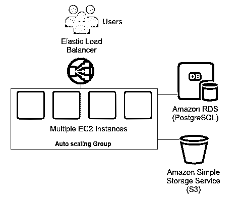
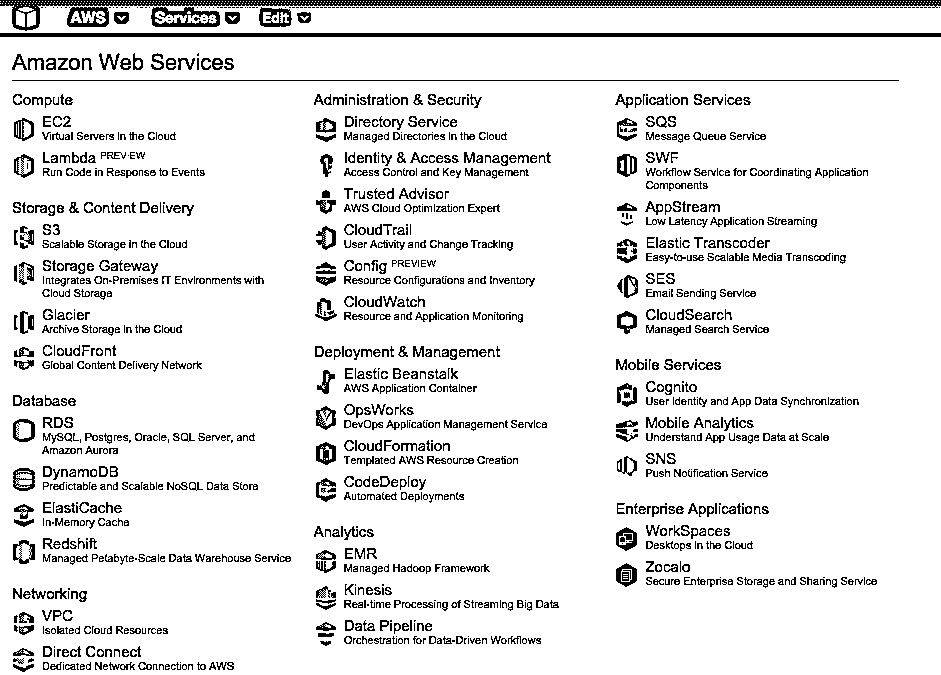
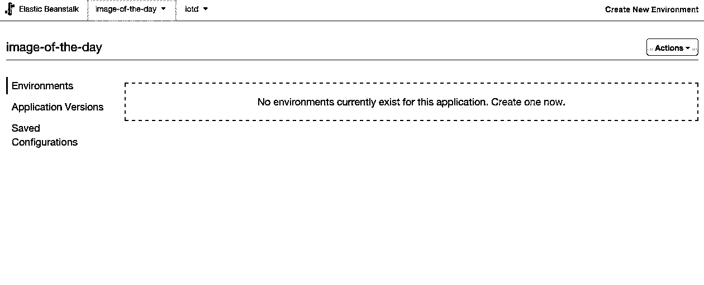
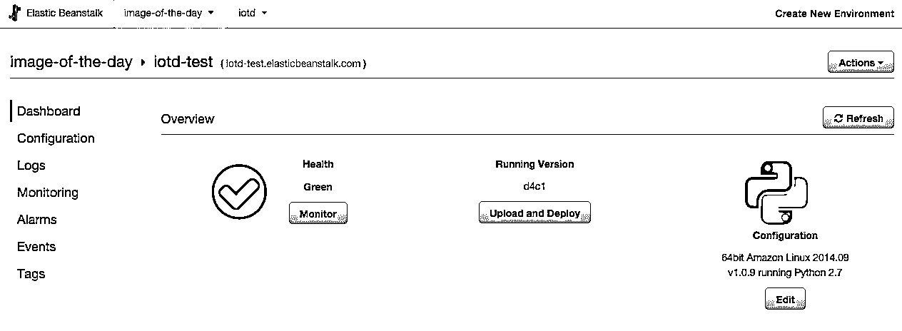
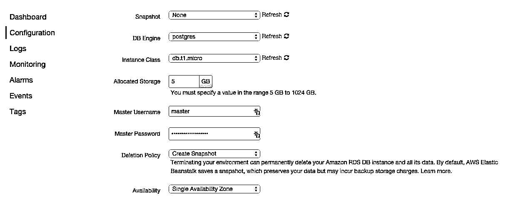

# 将 Django 应用部署到 AWS Elastic Beanstalk

> 原文：<https://realpython.com/deploying-a-django-app-to-aws-elastic-beanstalk/>

下面是一个简单的演练，演示了如何在保持正常的情况下，建立一个 Django 应用程序并将其部署到 [Amazon Web Services](http://aws.amazon.com) (AWS)。

使用的工具/技术:

1.  [Python v2.7.8](https://www.python.org/download/releases/2.7.8/)
2.  Django v1.7 版
3.  [亚马逊弹性豆茎](http://aws.amazon.com/elasticbeanstalk/)、 [EC2](http://aws.amazon.com/ec2/) 、 [S3](http://aws.amazon.com/s3/) 、 [RDS](http://aws.amazon.com/rds/)
4.  [EB CLI 3.x](http://docs.aws.amazon.com/elasticbeanstalk/latest/dg/eb3-cmd-commands.html)
5.  [PostgreSQL](http://www.postgresql.org)

> **现在有了 Python 3！**点击这里查看本文[的更新版本。](/deploying-a-django-app-and-postgresql-to-aws-elastic-beanstalk/)

这篇文章已经更新，涵盖了使用 Python 3 进行部署，因为 AWS 现在非常喜欢 Python 3。

## 弹性豆茎 vs EC2

Elastic Beanstalk 是一个平台即服务(PaaS ),它简化了亚马逊 AWS 上的[应用](https://realpython.com/installable-django-app/)的设置、部署和维护。这是一个托管服务，耦合了服务器(EC2)、数据库(RDS)和静态文件(S3)。您可以快速部署和管理您的应用程序，该应用程序会随着您的站点的增长而自动扩展。查看[官方文档](http://docs.aws.amazon.com/elasticbeanstalk/latest/dg/Welcome.html)了解更多信息。

[](https://files.realpython.com/media/aeb-architecture_crossaws.f83443afb26c.png)[*Remove ads*](/account/join/)

## 开始使用

我们将使用一个简单的“每日图片”应用程序，您可以从这个[库](https://github.com/realpython/image-of-the-day/)中获取:

```py
$ git clone https://github.com/realpython/image-of-the-day.git
$ cd image-of-the-day/
$ git checkout tags/start_here
```

下载代码后，创建一个 virtualenv 并通过 [pip](https://realpython.com/what-is-pip/) 安装需求:

```py
$ pip install -r requirements.txt
```

接下来，在本地运行 PostgreSQL 的情况下，设置一个名为`iotd`的新数据库。同样，根据您的本地 Postgres 配置，您可能需要更新 *settings.py* 中的`DATABASES`配置。

例如，我将配置更新为:

```py
DATABASES = {
    'default': {
        'ENGINE': 'django.db.backends.postgresql_psycopg2',
        'NAME': 'iotd',
        'USER': '',
        'PASSWORD': '',
        'HOST': 'localhost',
        'PORT': '5432',
    }
}
```

现在，您可以设置数据库模式、创建超级用户并运行应用程序:

```py
$ python manage.py migrate
$ python manage.py createsuperuser
$ python manage.py runserver
```

在浏览器中导航到位于[http://localhost:8000/admin](http://localhost:8000/admin)的管理页面，并添加一个新图像，该图像将显示在主页上。

该应用程序并不意味着非常令人兴奋；我们只是用它来做演示。它所做的就是让你通过管理界面上传图片，并在主页上全屏显示图片。也就是说，虽然这是一个相对基础的应用程序，但它仍然允许我们探索部署到 Amazon Beanstalk 和 RDS 时存在的一些“问题”。

现在我们已经在本地机器上建立并运行了站点，让我们开始 Amazon 部署过程。

## AWS 弹性豆茎 CLI

为了使用 Amazon Elastic Beanstalk，我们可以使用一个名为 [awsebcli](https://pypi.python.org/pypi/awsebcli/3.0.10) 的包。撰写本文时，的最新版本是 3.0.10，推荐的安装方式是使用 pip:

```py
$ pip install awsebcli
```

> 不要使用 brew 安装此软件包。在撰写本文时，它安装了 v2.6.3，该版本以微妙的方式被破坏，这将导致严重的挫折。

现在测试安装以确保它工作正常:

```py
$ eb --version
```

这应该会给您一个不错的 3.x 版本号:

```py
EB CLI 3.0.10 (Python 2.7.8)
```

要真正开始使用 Elastic Beanstalk，你需要一个 AWS 的[账户](https://portal.aws.amazon.com/gp/aws/developer/registration/index.html)(惊喜！).注册(或登录)。

[](https://files.realpython.com/media/login_screen_for_aws.716e8590a453.png)[*Remove ads*](/account/join/)

## 配置 EB–初始化您的应用程序

随着 AWS Elastic Beanstalk CLI 的运行，我们要做的第一件事是创建一个 Beanstalk 环境来托管应用程序。从项目目录(“每日映像”)中运行:

```py
$ eb init
```

这将提示您一些问题，以帮助您配置环境。

**默认区域**

选择离最终用户最近的地区通常会提供最佳性能。如果你不确定选择哪一个，看看这张地图。

**凭证**

接下来，它将要求您提供 AWS 凭据。

在这里，您很可能想要设置一个 IAM 用户。关于如何设置，请参见本指南。如果您确实设置了一个新用户，您需要确保该用户具有适当的权限。最简单的方法是给用户添加“管理员访问”权限。(尽管出于安全原因，这可能不是一个好的选择。)有关用户创建/管理弹性 Beanstalk 应用程序所需的特定策略/角色，请参见此处的链接。

**应用名称**

这将默认为目录名。就这样吧。

**Python 版本**

接下来，CLI 应该自动检测到您正在使用 Python，并要求确认。答应吧。然后你需要选择一个平台版本。选择`Python 2.7`。

**宋承宪**

同意为您的实例设置 SSH。

**RSA 密钥对**

接下来，您需要生成一个 RSA 密钥对，它将被添加到您的 *~/中。ssh* 文件夹。这个密钥对还将被上传到您在第一步中指定的区域的 EC2 公钥。这将允许您在本教程的后面使用 SSH 访问 EC2 实例。

### 我们完成了什么？

一旦`eb init`完成，你会看到一个名为*的新的隐藏文件夹。您的项目目录中的 elastic bean stall*:

```py
├── .elasticbeanstalk
│   └── config.yml
├── .gitignore
├── README.md
├── iotd
│   ├── images
│   │   ├── __init__.py
│   │   ├── admin.py
│   │   ├── migrations
│   │   │   ├── 0001_initial.py
│   │   │   └── __init__.py
│   │   ├── models.py
│   │   ├── tests.py
│   │   └── views.py
│   ├── iotd
│   │   ├── __init__.py
│   │   ├── settings.py
│   │   ├── urls.py
│   │   └── wsgi.py
│   ├── manage.py
│   ├── static
│   │   ├── css
│   │   │   └── bootstrap.min.css
│   │   └── js
│   │       ├── bootstrap.min.js
│   │       └── jquery-1.11.0.min.js
│   └── templates
│       ├── base.html
│       └── images
│           └── home.html
├── requirements.txt
└── www
    └── media
        └── sitelogo.png
```

该目录中有一个`config.yml`文件，这是一个配置文件，用于为新创建的 Beanstalk 应用程序定义某些参数。

此时，如果您键入`eb console`，它将打开您的默认浏览器并导航到 Elastic Beanstalk 控制台。在这个页面上，您应该看到一个应用程序(如果您完全理解的话，称为`image-of-the-day`),但是没有环境。

[](https://files.realpython.com/media/elastic_beanstalk_console.c33e58156f09.png)

应用程序代表您的代码应用程序，是`eb init`为我们创造的。使用 Elastic Beanstalk，一个应用程序可以有多个环境(例如，开发、测试、试运行、生产)。如何配置/管理这些环境完全取决于您。对于简单的 Django 应用程序，我喜欢在我的笔记本电脑上安装[开发环境](https://realpython.com/effective-python-environment/)，然后在 Beanstalk 上创建一个测试和生产环境。

让我们建立一个测试环境…

[*Remove ads*](/account/join/)

## 配置 EB–创建环境

回到终端，在项目目录中键入:

```py
$ eb create
```

就像`eb init`一样，这个命令会提示你一系列问题。

**环境名称**

您应该使用类似于 Amazon 建议的命名约定——例如，application _ name-env _ name——特别是当您开始用 AWS 托管多个应用程序时。我用过- `iod-test`。

**DNS CNAME 前缀**

当你在 Elastic Beanstalk 上部署一个应用程序时，你会自动获得一个像 xxx.elasticbeanstalk.com 这样的域名。`DNS CNAME prefix`是你想用来代替`xxx`的。就用默认的吧。

### 现在发生了什么？

此时`eb`实际上会为你创造你的环境。请耐心等待，因为这可能需要一些时间。

> 如果您在创建环境时遇到错误，比如- `aws.auth.client.error.ARCInstanceIdentityProfileNotFoundException` -检查您使用的凭证是否有创建 Beanstalk 环境的适当权限，如本文前面所讨论的。

在创建环境之后，`eb`将立即尝试部署您的应用程序，方法是将项目目录中的所有代码复制到新的 EC2 实例中，并在该过程中运行`pip install -r requirements.txt`。

您应该会在屏幕上看到一堆关于正在设置的环境的信息，以及关于`eb`尝试部署的信息。您还会看到一些错误。特别是，您应该会看到这些行隐藏在输出中的某个地方:

```py
ERROR: Your requirements.txt is invalid. Snapshot your logs for details.
```

别担心，这并不是真的无效。有关详细信息，请查看日志:

```py
$ eb logs
```

这将从 EC2 实例中获取所有最近的日志文件，并将它们输出到您的终端。这是大量的信息，所以您可能希望将输出重定向到一个文件(`eb logs -z`)。浏览日志，您会看到一个名为 *eb-activity.log* 的日志文件:

```py
Error: pg_config executable not found.
```

问题是我们试图安装`psycopy2`(Postgres Python 绑定)，但是我们也需要安装 Postgres 客户端驱动程序。因为它们不是默认安装的，所以我们需要先安装它们。让我们来解决这个问题…

## 定制部署流程

`eb`将从名为"的文件夹中读取自定义的`.config`文件。“ebextensions”，位于项目的根级别(“当天的图像”目录)。这些`.config`文件允许你安装软件包，运行任意命令和/或设置环境变量。”中的文件。ebextensions”目录应该符合`JSON`或`YAML`语法，并按字母顺序执行。

[*Remove ads*](/account/join/)

### 安装软件包

我们需要做的第一件事是安装一些包，以便我们的`pip install`命令能够成功完成。为此，我们首先创建一个名为*的文件。EB extensions/01 _ packages . config*:

```py
packages: yum: git:  [] postgresql93-devel:  []
```

EC2 实例运行 Amazon Linux，这是一种 Redhat 风格，所以我们可以使用 [yum](http://en.wikipedia.org/wiki/Yellowdog_Updater,_Modified) 来安装我们需要的包。现在，我们只是要安装两个包- [git](https://realpython.com/python-git-github-intro/) 和 Postgres 客户端。

创建该文件以重新部署应用程序后，我们需要执行以下操作:

```py
$ git add .ebextensions/
$ git commit -m "added eb package configuration"
```

我们必须提交更改，因为部署命令`eb deploy`处理最近一次提交，因此只有在我们将文件更改提交给 git 之后，我们才会意识到这些更改。(请注意，我们不必用力；我们从本地副本开始工作……)

正如您可能猜到的，下一个命令是:

```py
$ eb deploy
```

您现在应该只看到一个错误:

```py
INFO: Environment update is starting.
INFO: Deploying new version to instance(s).
ERROR: Your WSGIPath refers to a file that does not exist.
INFO: New application version was deployed to running EC2 instances.
INFO: Environment update completed successfully.
```

让我们看看发生了什么…

### 配置我们的 Python 环境

Beanstalk 中的 EC2 实例运行 Apache，Apache 将根据我们设置的 WSGIPATH 找到我们的 Python 应用程序。默认情况下，`eb`假设我们的 wsgi 文件叫做 *application.py* 。有两种方法可以解决这个问题-

**选项 1:使用特定于环境的配置设置**

```py
$ eb config
```

这个命令将打开你的[默认编辑器](http://docs.aws.amazon.com/elasticbeanstalk/latest/dg/eb3-config.html)，编辑一个名为*的配置文件。elastic beanstalk/iod-test . env . yml*。该文件实际上不存在于本地；`eb`从 AWS 服务器上下载并呈现给您，以便您可以更改其中的设置。如果您对此伪文件进行任何更改，然后保存并退出，`eb`将会更新您的 Beanstalk 环境中的相应设置。

如果您在文件中搜索术语“WSGI ”,您应该会发现一个如下所示的配置部分:

```py
aws:elasticbeanstalk:container:python: NumProcesses:  '1' NumThreads:  '15' StaticFiles:  /static/=static/ WSGIPath:  application.py
```

更新 WSGIPath:

```py
 aws:elasticbeanstalk:container:python: NumProcesses:  '1' NumThreads:  '15' StaticFiles:  /static/=static/ WSGIPath:  iotd/iotd/wsgi.py
```

然后就可以正确设置 WSGIPath 了。如果保存文件并退出，`eb`将自动更新环境配置:

```py
Printing Status:
INFO: Environment update is starting.
INFO: Updating environment iod-test's configuration settings.
INFO: Successfully deployed new configuration to environment.
INFO: Environment update completed successfully.
```

使用`eb config`方法来改变设置的好处是你可以为每个环境指定不同的设置。但是您也可以使用我们之前使用的相同的`.config`文件来更新设置。这将对每个环境使用相同的设置，因为`.config`文件将在部署时应用(在`eb config`的设置被应用之后)。

**选项 2:使用全局配置设置**

要使用`.config`文件选项，让我们创建一个名为 */的新文件。EB extensions/02 _ python . config*:

```py
option_settings: "aws:elasticbeanstalk:application:environment": DJANGO_SETTINGS_MODULE:  "iotd.settings" "PYTHONPATH":  "/opt/python/current/app/iotd:$PYTHONPATH" "aws:elasticbeanstalk:container:python": WSGIPath:  iotd/iotd/wsgi.py NumProcesses:  3 NumThreads:  20 "aws:elasticbeanstalk:container:python:staticfiles": "/static/":  "www/static/"
```

发生了什么事？

*   `DJANGO_SETTINGS_MODULE: "iotd.settings"` -添加设置模块的路径。
*   `"PYTHONPATH": "/opt/python/current/app/iotd:$PYTHONPATH"` -更新我们的`PYTHONPATH`，这样 Python 可以在我们的应用程序中找到模块。(注意，使用完整路径是必要的。)
*   设置我们的 WSGI 路径。
*   `NumProcesses: 3`和`NumThreads: 20`——更新用于运行我们的 WSGI 应用程序的进程和线程的数量。
*   `"/static/": "www/static/"`设置我们的静态文件路径。

同样，我们可以执行`git commit`然后执行`eb deploy`来更新这些设置。

接下来让我们添加一个数据库。

[*Remove ads*](/account/join/)

## 配置数据库

尝试查看已部署的网站:

```py
$ eb open
```

该命令将在默认浏览器中显示部署的应用程序。您应该会看到连接被拒绝错误:

```py
OperationalError at /
could not connect to server: Connection refused
 Is the server running on host "localhost" (127.0.0.1) and accepting
 TCP/IP connections on port 5432?
```

这是因为我们还没有建立数据库。此时`eb`将设置您的 Beanstalk 环境，但是它不会设置 RDS(数据库层)。我们必须手动设置。

### 数据库设置

再次使用`eb console`打开 Beanstalk 配置页面。

[](https://files.realpython.com/media/elastic_beanstalk_config_page.d5d1b1caf58e.png)

在那里，执行以下操作:

1.  单击“配置”链接。
2.  一直滚动到页面底部，然后在“数据层”部分下，单击链接“创建新的 RDS 数据库”。
3.  在 RDS 设置页面上，将“数据库引擎”更改为“postgres”。
4.  添加“主用户名”和“主密码”。
5.  保存更改。

[](https://files.realpython.com/media/create_new_rds_database.e4704f9de882.png)

Beanstalk 将为您创建 RDS。现在我们需要让 Django 应用程序连接到 RDS。Beanstalk 将帮助我们在 EC2 实例上公开一些环境变量，详细说明如何连接到 Postgres 服务器。所以我们需要做的就是更新我们的 *settings.py* 文件来利用这些环境变量。确认`DATABASES`配置参数反映了 *settings.py* 中的以下内容:

```py
if 'RDS_DB_NAME' in os.environ:
    DATABASES = {
        'default': {
            'ENGINE': 'django.db.backends.postgresql_psycopg2',
            'NAME': os.environ['RDS_DB_NAME'],
            'USER': os.environ['RDS_USERNAME'],
            'PASSWORD': os.environ['RDS_PASSWORD'],
            'HOST': os.environ['RDS_HOSTNAME'],
            'PORT': os.environ['RDS_PORT'],
        }
    }
else:
    DATABASES = {
        'default': {
            'ENGINE': 'django.db.backends.postgresql_psycopg2',
            'NAME': 'iotd',
            'USER': 'iotd',
            'PASSWORD': 'iotd',
            'HOST': 'localhost',
            'PORT': '5432',
        }
    }
```

这只是说，“如果存在，使用环境变量设置，否则使用我们的默认开发设置”。简单。

### 处理数据库迁移

对于我们的数据库设置，我们仍然需要[确保迁移运行](https://realpython.com/django-migrations-a-primer/)以便数据库表结构是正确的。我们可以通过修改*来实现。EB extensions/02 _ python . config*并在文件顶部添加以下行:

```py
container_commands: 01_migrate: command:  "source  /opt/python/run/venv/bin/activate  &&  python  iotd/manage.py  migrate  --noinput" leader_only:  true
```

`container_commands`允许您在 EC2 实例上部署应用程序后运行任意命令。因为 EC2 实例是使用虚拟环境设置的，所以在运行 migrate 命令之前，我们必须首先激活该虚拟环境。此外，`leader_only: true`设置意味着，“当部署到多个实例时，只在第一个实例上运行这个命令”。

不要忘记我们的应用程序使用 Django 的 admin，所以我们需要一个超级用户…

[*Remove ads*](/account/join/)

### 创建管理员用户

不幸的是，`createsuperuser`不允许您在使用`--noinput`选项时指定密码，所以我们将不得不编写自己的命令。幸运的是，Django 使得创建[定制命令](https://docs.djangoproject.com/en/1.7/howto/custom-management-commands/)变得非常容易。

创建文件*ioimg/management/commands/createsu . py*:

```py
from django.core.management.base import BaseCommand
from django.contrib.auth.models import User

class Command(BaseCommand):

    def handle(self, *args, **options):
        if not User.objects.filter(username="admin").exists():
            User.objects.create_superuser("admin", "admin@admin.com", "admin")
```

确保您也添加了适当的`__init__.py`文件:

```py
└─ management
    ├── __init__.py
    └── commands
        ├── __init__.py
        └── createsu.py
```

这个文件将允许你运行`python manage.py createsu`，它将创建一个超级用户而不提示输入密码。您可以随意扩展该命令，使用环境变量或其他方式来允许您更改密码。

一旦创建了命令，我们就可以向*中的`container_commands`部分添加另一个命令。EB extensions/02 _ python . config*:

```py
02_createsu: command:  "source  /opt/python/run/venv/bin/activate  &&  python  iotd/manage.py  createsu" leader_only:  true
```

在您测试之前，让我们确保我们的静态文件都放在正确的位置…

## 静态文件

在`container_commands`下增加一条命令:

```py
03_collectstatic: command:  "source  /opt/python/run/venv/bin/activate  &&  python  iotd/manage.py  collectstatic  --noinput"
```

所以整个文件看起来像这样:

```py
container_commands: 01_migrate: command:  "source  /opt/python/run/venv/bin/activate  &&  python  iotd/manage.py  migrate  --noinput" leader_only:  true 02_createsu: command:  "source  /opt/python/run/venv/bin/activate  &&  python  iotd/manage.py  createsu" leader_only:  true 03_collectstatic: command:  "source  /opt/python/run/venv/bin/activate  &&  python  iotd/manage.py  collectstatic  --noinput" option_settings: "aws:elasticbeanstalk:application:environment": DJANGO_SETTINGS_MODULE:  "iotd.settings" "PYTHONPATH":  "/opt/python/current/app/iotd:$PYTHONPATH" "ALLOWED_HOSTS":  ".elasticbeanstalk.com" "aws:elasticbeanstalk:container:python": WSGIPath:  iotd/iotd/wsgi.py NumProcesses:  3 NumThreads:  20 "aws:elasticbeanstalk:container:python:staticfiles": "/static/":  "www/static/"
```

我们现在需要确保 *settings.py* 文件中的`STATIC_ROOT`设置正确:

```py
STATIC_ROOT = os.path.join(BASE_DIR, "..", "www", "static")
STATIC_URL = '/static/'
```

确保将`www`目录提交给 git，这样就可以创建静态目录。然后再次运行`eb deploy`，现在您应该可以开始工作了:

```py
INFO: Environment update is starting.
INFO: Deploying new version to instance(s).
INFO: New application version was deployed to running EC2 instances.
INFO: Environment update completed successfully.
```

此时，您应该能够转到[http://your _ app _ URL/admin](http://your_app_url/admin)，登录，添加一个图像，然后看到该图像显示在您的应用程序的主页上。

成功！

[*Remove ads*](/account/join/)

## 使用 S3 进行媒体存储

使用这种设置，每次我们再次部署时，我们都会丢失所有上传的映像。为什么？好吧，当你运行`eb deploy`时，一个新的实例就会出现。这不是我们想要的，因为我们将在数据库中有图像的条目，但没有相关的图像。解决方案是将媒体文件存储在亚马逊简单存储服务(亚马逊 S3)中，而不是存储在 EC2 实例本身上。

您需要:

1.  [创建一个桶](http://docs.aws.amazon.com/AmazonS3/latest/UG/CreatingaBucket.html)
2.  [抓取你用户的 ARN(亚马逊资源名称)](http://docs.aws.amazon.com/general/latest/gr/aws-arns-and-namespaces.html)
3.  [添加桶权限](http://docs.aws.amazon.com/AmazonS3/latest/UG/EditingBucketPermissions.html)
4.  [配置你的 Django 应用程序，使用 S3 服务你的静态文件](https://docs.djangoproject.com/en/1.7/howto/static-files/)

因为已经有关于这方面的好文章，我就给你指出我最喜欢的:[使用亚马逊 S3 来存储你的 Django 静态和媒体文件](http://www.caktusgroup.com/blog/2014/11/10/Using-Amazon-S3-to-store-your-Django-sites-static-and-media-files/)

## 阿帕奇配置

因为我们将 Apache 与 Beanstalk 一起使用，所以我们可能希望设置 Apache 来启用 gzip 压缩，以便客户端可以更快地下载文件。这可以用`container_commands`来完成。创建一个新文件*。EB extensions/03 _ Apache . config*并添加以下内容:

```py
container_commands: 01_setup_apache: command:  "cp  .ebextensions/enable_mod_deflate.conf  /etc/httpd/conf.d/enable_mod_deflate.conf"
```

然后您需要创建文件`.ebextensions/enable_mod_deflate.conf`:

```py
# mod_deflate configuration
<IfModule mod_deflate.c>
  # Restrict compression to these MIME types
  AddOutputFilterByType DEFLATE text/plain
  AddOutputFilterByType DEFLATE text/html
  AddOutputFilterByType DEFLATE application/xhtml+xml
  AddOutputFilterByType DEFLATE text/xml
  AddOutputFilterByType DEFLATE application/xml
  AddOutputFilterByType DEFLATE application/xml+rss
  AddOutputFilterByType DEFLATE application/x-javascript
  AddOutputFilterByType DEFLATE text/javascript
  AddOutputFilterByType DEFLATE text/css
  # Level of compression (Highest 9 - Lowest 1)
  DeflateCompressionLevel 9
  # Netscape 4.x has some problems.
  BrowserMatch ^Mozilla/4 gzip-only-text/html
  # Netscape 4.06-4.08 have some more problems
  BrowserMatch ^Mozilla/4\.0[678] no-gzip
  # MSIE masquerades as Netscape, but it is fine
  BrowserMatch \bMSI[E] !no-gzip !gzip-only-text/html
<IfModule mod_headers.c>
  # Make sure proxies don't deliver the wrong content
  Header append Vary User-Agent env=!dont-vary
</IfModule>
</IfModule>
```

这样做将启用 gzip 压缩，这将有助于您下载的文件的大小。您也可以使用相同的策略自动缩小和合并您的 CSS/JS，并做任何其他您需要做的预处理。

## 故障排除

不要忘记非常有用的`eb ssh`命令，它将让您进入 EC2 实例，这样您就可以四处看看发生了什么。进行故障排除时，您应该了解几个目录:

*   `/opt/python` -您的应用程序将结束的根目录。
*   `/opt/python/current/app` -环境中托管的当前应用程序。
*   `/opt/python/on-deck/app` -应用程序最初放在甲板上，然后，在所有部署完成后，它将被移动到`current`。如果你在你的`container_commands`中遇到故障，检查一下`on-deck`文件夹而不是`current`文件夹。
*   `/opt/python/current/env`-`eb`将为您设置的所有环境变量。如果你试图重现一个错误，你可能首先需要`source /opt/python/current/env`把事情设置成 eb deploy 运行时的样子。
*   `opt/python/run/venv` -应用程序使用的虚拟 env 如果您试图重现一个错误，您还需要运行`source /opt/python/run/venv/bin/activate`

## 结论

部署到 Elastic Beanstalk 一开始可能有点令人畏惧，但是一旦您理解了所有的部分在哪里以及事情是如何工作的，它实际上是非常容易和非常灵活的。它还为您提供了一个可以随着使用量的增长而自动扩展的环境。希望现在你已经足够危险了！祝你下次部署 Beanstalk 时好运。

我们错过了什么吗？有没有其他的小技巧或者小窍门？请在下面评论。*******