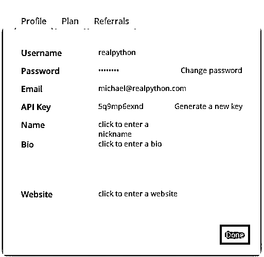
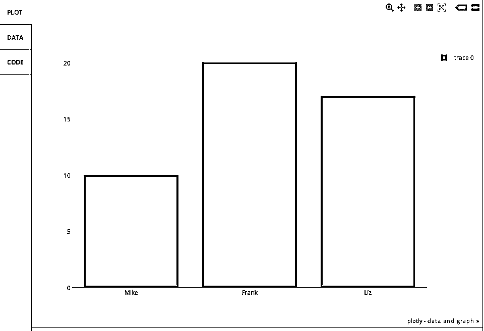
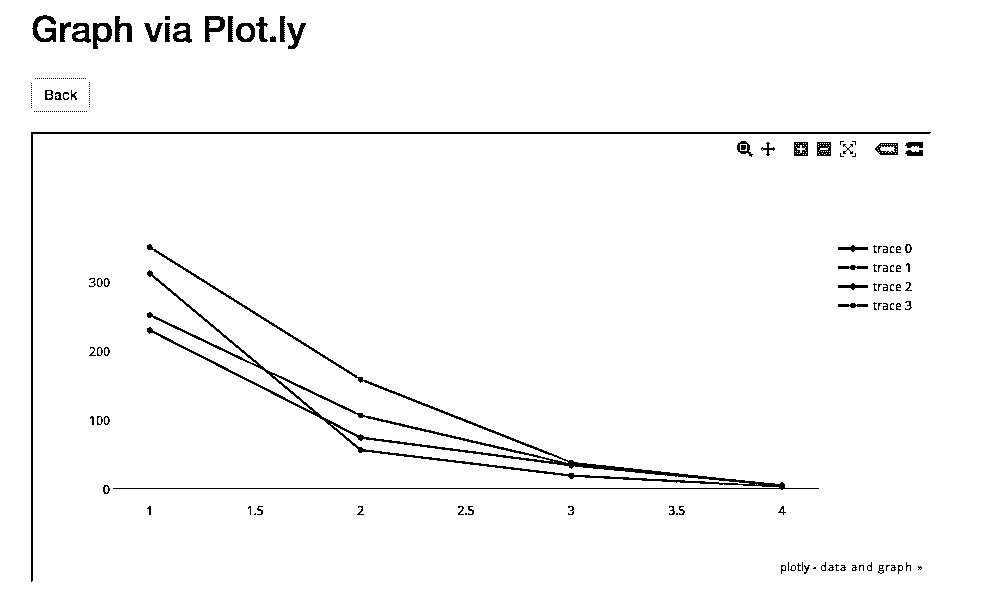

# 用瓶子开发–第 2 部分(plot.ly API)

> 原文：<https://realpython.com/developing-with-bottle-part-2-plot-ly-api/>

**2014 年 2 月 27 日更新，2014 年 8 月 1 日再次更新(针对最新的 Plotly API)！**

在用瓶子开发系列的下一篇文章中，我们将会看到 GET 和 post 请求以及 HTML 表单。我还将向您展示如何使用来自 [plot.ly](https://plot.ly/api) API 的数据。您还将看到如何创建一个显示群组分析研究结果的很酷的图表。

如果你不熟悉群组分析，请点击查看这篇文章。

> 你错过瓶子系列的第一部分了吗？看看这里[这里](https://realpython.com/developing-with-bottle-part-1/)。同样，本教程使用的是 Bottle 版本 0.12.3 和 Plotly 版本 1.2.6。

## 基本设置

首先从第 1 部分下载这个[要点](https://gist.github.com/mjhea0/5784132)，然后使用下面的命令运行它:

```py
$ bash bottle.sh
```

这将创建一个基本的项目结构:

```py
├── app.py
├── requirements.txt
└── testenv
```

激活 virtualenv:

```py
$ cd bottle
$ source testenv/bin/activate
```

安装要求:

```py
$ pip install -r requirements.txt
```

导航到[https://www.plot.ly/api](https://www.plot.ly/api)，注册一个新账户，登录，然后创建一个新的 API 密钥:

[](https://files.realpython.com/media/plotly-api-credentials.03a477bfd4d1.png)

复制钥匙。

安装 plot.ly:

```py
$ pip install plotly==1.2.6
```

接下来更新 *app.py* 中的代码:

```py
import os
from bottle import run, template, get, post, request

import plotly.plotly as py
from plotly.graph_objs import *

# add your username and api key
py.sign_in("realpython", "lijlflx93")

@get('/plot')
def form():
    return '''<h2>Graph via Plot.ly</h2>
 <form method="POST" action="/plot">
 Name: <input name="name1" type="text" />
 Age: <input name="age1" type="text" /><br/>
 Name: <input name="name2" type="text" />
 Age: <input name="age2" type="text" /><br/>
 Name: <input name="name3" type="text" />
 Age: <input name="age3" type="text" /><br/>
 <input type="submit" />
 </form>'''

@post('/plot')
def submit():
    # grab data from form
    name1 = request.forms.get('name1')
    age1 = request.forms.get('age1')
    name2 = request.forms.get('name2')
    age2 = request.forms.get('age2')
    name3 = request.forms.get('name3')
    age3 = request.forms.get('age3')

    data = Data([
        Bar(
            x=[name1, name2, name3],
            y=[age1, age2, age3]
        )
    ])

    # make api call
    response = py.plot(data, filename='basic-bar')

    if response:
        return template('''
 <h1>Congrats!</h1>
 <div>
 View your graph here: <a href="{{response}}"</a>{{response}}
 </div>
 ''',
            response=response
        )

if __name__ == '__main__':
    port = int(os.environ.get('PORT', 8080))
    run(host='0.0.0.0', port=port, debug=True)
```

[*Remove ads*](/account/join/)

### 这是怎么回事？

1.  第一个函数`form()`，创建一个 HTML 表单来获取我们需要的数据，以制作一个简单的条形图。
2.  同时，第二个函数`submit()`获取表单输入，将它们分配给变量，然后调用 plot.ly API，传递我们的凭证和数据，生成一个新的图表。*确保用您自己的凭证替换我的用户名和 API 密钥。不要用我的。这是行不通的。*

### 测试

在本地运行你的应用，`python app.py`，将你的浏览器指向[http://localhost:8080/plot](http://localhost:8080/plot)。

输入三个人的名字和他们各自的年龄。按 submit，然后如果一切正常，您应该会看到一条祝贺消息和一个 URL。单击 URL 查看您的图表:

[](https://files.realpython.com/media/plotly-ages-barplot.c0b4b77d41cf.png)

如果你得到一个 500 错误消息- `Aw, snap! Looks like you supplied the wrong API key. Want to try again? You can always view your key at https://plot.ly/api/key. When you display your key at https://plot.ly/api/key, make sure that you're logged in as realpython.` -你需要更新你的 API 密匙。

> 此外，如果这是一个真实的、面向客户端的应用程序，您会希望比这更优雅地处理错误。仅供参考。

## 群组分析

接下来，让我们看一个更复杂的示例，为以下群组分析统计创建一个图表:

| 支持者 | Two thousand and eleven | Two thousand and twelve | Two thousand and thirteen | Two thousand and fourteen |
| --- | --- | --- | --- | --- |
| Zero | Three hundred and ten | Three hundred and forty-eight | Two hundred and twenty-eight | Two hundred and fifty |
| one | Fifty-five | One hundred and fifty-seven | Seventy-three | Thirty-four |
| Two | Eighteen | Thirty-seven | Thirty-three | Thirty-four |
| three | Two | four | four | three |

我们将构建同一个 app - *app.py* ，但是创建一个新文件:打开 *app.py* ，然后“另存为” *cohort.py* 。

从升级到简单模板引擎开始，这样我们就可以向模板添加样式和 Javascript 文件。添加一个名为“views”的新文件夹，然后在该目录下创建一个名为 *template.tpl* 的新文件。将以下代码添加到该文件中:

```py
<!DOCTYPE html>
<html>
  <head>
    <meta charset="utf-8">
    <title>{{ title }}</title>
    <meta name="viewport" content="width=device-width, initial-scale=1.0">
    <link href="http://netdna.bootstrapcdn.com/bootstrap/3.0.0/css/bootstrap.min.css" rel="stylesheet" media="screen">
    <style> body  { padding:  60px  0px; } </style>
  </head>
  <body>
    <div class="container">
      <h1>Graph via Plot.ly</h1>
      <form role="form" method="post" action="/plot">
        <table>
            <td>
              <h3>2011</h3>
              <div class="form-group" "col-md-2">
                <input type="number" name="Y01" class="form-control" placeholder="Cohort 0">
                <input type="number" name="Y02" class="form-control" placeholder="Cohort 1">
                <input type="number" name="Y03" class="form-control" placeholder="Cohort 2">
                <input type="number" name="Y04" class="form-control" placeholder="Cohort 3">
              </div>
            </td>
            <td>
              <h3>2012</h3>
              <div class="form-group" "col-md-2">
                <input type="number" name="Y11" class="form-control" placeholder="Cohort 0">
                <input type="number" name="Y12" class="form-control" placeholder="Cohort 1">
                <input type="number" name="Y13" class="form-control" placeholder="Cohort 2">
                <input type="number" name="Y44" class="form-control" placeholder="Cohort 3">
              </div>
            </td>
            <td>
              <h3>2013</h3>
              <div class="form-group" "col-md-2">
                <input type="number" name="Y21" class="form-control" placeholder="Cohort 0">
                <input type="number" name="Y22" class="form-control" placeholder="Cohort 1">
                <input type="number" name="Y23" class="form-control" placeholder="Cohort 2">
                <input type="number" name="Y24" class="form-control" placeholder="Cohort 3">
              </div>
            </td>
            <td>
              <h3>2014</h3>
              <div class="form-group" "col-md-2">
                <input type="number" name="Y31" class="form-control" placeholder="Cohort 0">
                <input type="number" name="Y32" class="form-control" placeholder="Cohort 1">
                <input type="number" name="Y33" class="form-control" placeholder="Cohort 2">
                <input type="number" name="Y34" class="form-control" placeholder="Cohort 3">
              </div>
            </td>
          </tr>
        </table>
        
      </form>
    </div>
    <script src="http://code.jquery.com/jquery-1.10.2.min.js"></script>
    <script src="http://netdna.bootstrapcdn.com/bootstrap/3.0.0/js/bootstrap.min.js"></script>
  </body>
</html>
```

正如你可能知道的，这看起来就像一个 HTML 文件。不同之处在于，我们可以使用语法- `{{ python_variable }}`将 Python 变量传递给文件。

创建一个 *data.json* 文件，并添加您的 Plot.ly 用户名和 API 密钥。你可以在这里查看样本文件[。](https://github.com/mjhea0/bottle-plotly-python/blob/master/bottle/data_sample.json)

将以下代码添加到 *cohort.py* 中，以便在我们进行 API 调用时访问 *data.json* 来使用凭证:

```py
import os
from bottle import run, template, get, post, request

import plotly.plotly as py
from plotly.graph_objs import *

import json

# grab username and key from config/data file
with open('data.json') as config_file:
    config_data = json.load(config_file)
username = config_data["user"]
key = config_data["key"]

py.sign_in(username, key)
```

现在我们不必把我们的钥匙暴露给整个宇宙。只要确保它不受[版本控制](https://realpython.com/python-git-github-intro/)就行了。

接下来更新功能:

```py
import os
from bottle import run, template, get, post, request

import plotly.plotly as py
from plotly.graph_objs import *

import json

# grab username and key from config/data file
with open('data.json') as config_file:
    config_data = json.load(config_file)
username = config_data["user"]
key = config_data["key"]

py.sign_in(username, key)

@get('/plot')
def form():
    return template('template', title='Plot.ly Graph')

@post('/plot')
def submit():
    # grab data from form
    Y01 = request.forms.get('Y01')
    Y02 = request.forms.get('Y02')
    Y03 = request.forms.get('Y03')
    Y04 = request.forms.get('Y04')
    Y11 = request.forms.get('Y11')
    Y12 = request.forms.get('Y12')
    Y13 = request.forms.get('Y13')
    Y14 = request.forms.get('Y14')
    Y21 = request.forms.get('Y21')
    Y22 = request.forms.get('Y22')
    Y23 = request.forms.get('Y23')
    Y24 = request.forms.get('Y24')
    Y31 = request.forms.get('Y31')
    Y32 = request.forms.get('Y32')
    Y33 = request.forms.get('Y33')
    Y34 = request.forms.get('Y34')

    trace1 = Scatter(
        x=[1, 2, 3, 4],
        y=[Y01, Y02, Y03, Y04]
    )
    trace2 = Scatter(
        x=[1, 2, 3, 4],
        y=[Y11, Y12, Y13, Y14]
    )
    trace3 = Scatter(
        x=[1, 2, 3, 4],
        y=[Y21, Y22, Y23, Y24]
    )
    trace4 = Scatter(
        x=[1, 2, 3, 4],
        y=[Y31, Y32, Y33, Y34]
    )

    data = Data([trace1, trace2, trace3, trace4])

    # api call
    plot_url = py.plot(data, filename='basic-line')

    return template('template2', title='Plot.ly Graph', plot_url=str(plot_url))

if __name__ == '__main__':
    port = int(os.environ.get('PORT', 8080))
    run(host='0.0.0.0', port=port, debug=True)
```

注意 [`return`语句](https://realpython.com/python-return-statement/)。我们会传入模板的名称，以及任何变量。让我们创建一个名为 *template2.tpl* 的新模板:

```py
<!DOCTYPE html>
<html>
  <head>
    <meta charset="utf-8">
    <title>{{ title }}</title>
    <meta name="viewport" content="width=device-width, initial-scale=1.0">
    <link href="http://netdna.bootstrapcdn.com/bootstrap/3.0.0/css/bootstrap.min.css" rel="stylesheet" media="screen">
    <style> body  { padding:  60px  0px; } </style>
  </head>
  <body>
    <div class="container">
      <h1>Graph via Plot.ly</h1>
      <br>
      <a href="/plot"></a>
      <br><br>
      <iframe id="igraph" src={{plot_url}} width="900" height="450" seamless="seamless" scrolling="no"></iframe>
    </div>
    <script src="http://code.jquery.com/jquery-1.10.2.min.js"></script>
    <script src="http://netdna.bootstrapcdn.com/bootstrap/3.0.0/js/bootstrap.min.js"></script>
  </body>
</html>
```

因此，iframe 允许我们更新表单，然后显示实际的内容/图表，以及更新后的更改。换句话说，我们不必离开站点来查看图表。

运行它。向表单添加值。然后提交。您的图表现在应该看起来像这样:

[](https://files.realpython.com/media/plotly-final-graph.4c43b1ac0563.png)[*Remove ads*](/account/join/)

## 结论

你可以从这个 [repo](https://github.com/mjhea0/bottle-plotly-python) 中抓取所有文件。

下次见！**