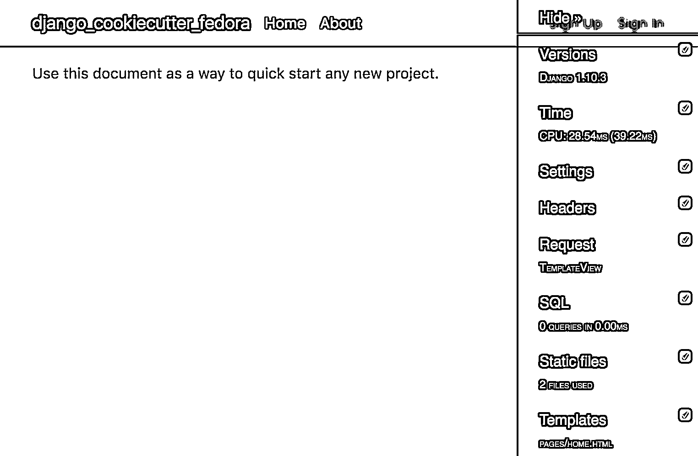

# 在 Fedora 上开发和部署 Django

> 原文：<https://realpython.com/development-and-deployment-of-cookiecutter-django-on-fedora/>

上次[时间](https://realpython.com/development-and-deployment-of-cookiecutter-django-via-docker/)我们用 Cookiecutter 搭建了一个 Django 项目，通过 Docker 管理应用环境，然后将 app 部署到数字海洋。**在本教程中，我们将离开 Docker，详细介绍一个基于 Fedora 24 的 Cookiecutter-Django 项目的开发部署工作流程。**

**更新**:

*   *11/15/2016* :重构 Nginx [配置](#nginx-config)，更新到 Django 最新版本(v [1.10.3](https://docs.djangoproject.com/en/1.10/releases/1.10.3/) )。
*   *10/06/2016* :更新至 Fedora (v [24](https://fedoraproject.org/wiki/Fedora_24_Final_Release_Criteria) )、cookiecutter (v [1.4.0](https://github.com/audreyr/cookiecutter/releases/tag/1.4.0) )、cookiecutter-django、Django (v [1.10.1](https://docs.djangoproject.com/en/1.10/releases/1.10.1/) )的最新版本。

## 发展

全局安装 [cookiecutter](https://github.com/audreyr/cookiecutter) ，然后生成一个自举的 Django 项目:

```py
$ pip install cookiecutter==1.4.0
$ cookiecutter https://github.com/pydanny/cookiecutter-django.git
```

该命令使用 [cookiecutter-django](https://github.com/pydanny/cookiecutter-django) repo 运行 cookiecutter，允许我们输入特定于项目的详细信息。(我们将该项目和报告命名为*django _ cookiecutter _ fedora*。)

> **注意**:查看前一篇文章中的[本地设置](https://realpython.com/development-and-deployment-of-cookiecutter-django-via-docker/#local-setup)部分，了解关于该命令以及生成的项目结构的更多信息。

在我们开始 Django 项目之前，我们还有几个步骤…

[*Remove ads*](/account/join/)

### 数据库设置

首先，我们需要设置 Postgres，因为 cookiecutter-django 使用它作为默认数据库(更多信息见*[django _ cookiecutter _ fedora/config/settings/common . py](https://github.com/realpython/django_cookiecutter_fedora/blob/master/config/settings/common.py)*)。按照步骤设置 Postgres 数据库服务器，从互联网上的任何[好资源](https://wiki.postgresql.org/wiki/Detailed_installation_guides)或者向下滚动到[部署部分](#deployment)在 [Fedora](https://getfedora.org/) 上设置它。

> **注意**:如果你在苹果电脑上，请查看 [Postgres.app](http://postgresapp.com/) 。

Postgres 服务器运行后，从 [psql](http://www.postgresql.org/docs/9.4/static/app-psql.html) 创建一个新的数据库，该数据库与您的项目同名:

```py
$ create database django_cookiecutter_fedora;
CREATE DATABASE
```

> **注意**:根据您的 Postgres 版本，上述创建数据库的命令可能会有一些变化。你可以在 Postgres 的最新文档中找到正确的命令[这里](http://www.postgresql.org/docs/9.5/interactive/manage-ag-createdb.html)。

### 依赖性设置

接下来，为了让您的 Django 项目处于准备开发的状态，导航到根目录，创建/激活一个[虚拟环境](https://realpython.com/python-virtual-environments-a-primer/)，然后安装依赖项:

```py
$ cd django_cookiecutter_fedora
$ pyvenv-3.5 .venv
$ source .venv/bin/activate
$ ./utility/install_python_dependencies.sh
```

## 健全性检查

[应用迁移](https://realpython.com/django-migrations-a-primer/)，然后运行本地开发服务器:

```py
$ python manage.py makemigrations
$ python manage.py migrate
$ python manage.py runserver
```

在浏览器中导航至 [http://localhost:8000/](http://localhost:8000/) 查看项目快速启动页面，确保一切正常:

[](https://files.realpython.com/media/cookiecutter-django-fedora-start-page.f20c38b3e333.png)

一旦完成，终止开发服务器，初始化一个新的 Git repo，提交并`git push`到 Github。

## 部署

项目设置完毕并在本地运行后，我们现在可以继续进行部署，我们将利用以下工具:

*   [Fedora 24](https://fedoraproject.org/wiki/Fedora_24_Final_Release_Criteria)
*   Postgres
*   [Nginx](http://nginx.org/)
*   gunicorn

### Fedora 24 设置

建立一个快速的[数字海洋](https://www.digitalocean.com/?refcode=d8f211a4b4c2)水滴，确保使用 Fedora 24 图像。如需帮助，请跟随[这篇](https://www.digitalocean.com/community/tutorials/how-to-create-your-first-digitalocean-droplet-virtual-server)教程。确保你[设置了 SSH 密钥](https://www.digitalocean.com/community/tutorials/how-to-use-ssh-keys-with-digitalocean-droplets)用于安全登录。

现在让我们[更新](https://fedoraproject.org/wiki/DNF_system_upgrade)我们的服务器。以 root 用户身份通过 SSH 登录到服务器，然后启动更新过程:

```py
$ ssh root@SERVER_IP_ADDRESS
# dnf upgrade
```

[*Remove ads*](/account/join/)

### 非根用户

接下来，让我们设置一个非 root 用户，这样应用程序就不会在管理权限下运行，这使得系统更加安全。

作为根用户，按照以下命令设置非根用户:

```py
# adduser <name-of-user>
# passwd <name-of-user>
Changing password for user <name-of-user>.
New password:
Retype new password:
passwd: all authentication tokens updated successfully.
```

在上面的代码片段中，我们创建了新的非 root 用户 user，然后为该用户指定了一个密码。我们现在需要[将该用户添加到管理组](http://fedoraproject.org/wiki/Configuring_Sudo)中，这样他们就可以使用`sudo`运行需要管理员权限的命令:

```py
# usermod <name-of-user> -a -G wheel
```

退出服务器，并以非 root 用户身份再次登录。您是否注意到 shell 提示符从`#`(英镑符号)变成了`$`(美元符号)？这表示我们以非 root 用户身份登录。

### 必需的包

以非 root 用户身份登录时，下载并安装以下软件包:

> **注意**:下面我们给我们的非 root 用户 root 权限(推荐！).如果您不希望明确授予非 root 用户 root 权限，那么您必须在终端中执行的每个命令前面加上`sudo`关键字。

```py
$ sudo su
# dnf install postgresql-server postgresql-contrib postgresql-devel
# dnf install python3-devel python-devel gcc nginx git
```

### Postgres 设置

下载并安装完依赖项后，我们只需要设置我们的 Postgres 服务器并创建一个数据库。

初始化 Postgres，然后手动启动服务器:

```py
# sudo postgresql-setup initdb
# sudo systemctl start postgresql
```

然后通过将`su`切换到`postgres`用户来登录 Postgres 服务器:

```py
# sudo su - postgres
$ psql
postgres=#
```

现在创建我们项目所需的 Postgres 用户和数据库，确保用户名与非 root 用户的名称匹配:

```py
postgres=#  CREATE  USER  <user-name>  WITH  PASSWORD  '<password-for-user>'; CREATE  ROLE postgres=#  CREATE  DATABASE  django_cookiecutter_fedora; CREATE  DATABASE postgres=#  GRANT  ALL  ON  DATABASE  django_cookiecutter_fedora  TO  <user-name>; GRANT
```

> **注意**:如果您需要帮助，请按照[官方指南](https://fedoraproject.org/wiki/PostgreSQL)在 Fedora 上设置 Postgres。

退出 psql 并返回到您的非根用户的 shell 会话:

```py
postgres=# \q
$ exit
```

当您退出 postgres 会话时，您将返回到非 root 用户提示符。`[username@django-cookiecutter-deploy ~]#`。

> **注意**:你注意到提示处的`#`标志了吗？现在出现这种情况是因为我们在开始设置服务器之前给了非 root 用户 root 权限。如果你看不到这个，你需要再次运行`sudo su`或者在每个命令前加上`sudo`。

配置 Postgres，使其在服务器引导/重新引导时启动:

```py
# sudo systemctl enable postgresql
# sudo systemctl restart postgresql
```

[*Remove ads*](/account/join/)

### 项目设置

将项目结构从 GitHub repo 克隆到 */opt* 目录:

```py
# sudo git clone <github-repo-url> /opt/<name of the repo>
```

> **注**:想用本教程关联的回购？只需运行:
> 
> ```py
> `$ sudo git clone https://github.com/realpython/django_cookiecutter_fedora /opt/django_cookiecutter_fedora` 
> ```

### 依赖性设置

接下来，为了让 Django 项目处于可以部署的状态，在项目的根目录下创建并激活一个 virtualenv:

```py
# cd /opt/django_cookiecutter_fedora/
# sudo pip3 install virtualenv
# sudo pyvenv-3.5 .venv
```

激活 virtualenv 之前，授予当前非根用户管理员权限(如果未授予):

```py
$ sudo su
# source .venv/bin/activate
```

与上面的开发环境设置不同，在安装依赖项之前，我们需要安装所有的 [Pillow](https://pillow.readthedocs.org/en/3.0.x/index.html) 的外部库。查看这个[资源](https://pillow.readthedocs.org/en/3.0.x/installation.html#basic-installation)获取更多信息。

```py
# dnf install libtiff-devel libjpeg-devel libzip-devel freetype-devel
# dnf install lcms2-devel libwebp-devel tcl-devel tk-devel
```

接下来，我们需要再安装一个包，以确保在 virtualenv 中安装依赖项时不会发生冲突。

```py
# dnf install redhat-rpm-config
```

然后运行:

```py
# ./utility/install_python_dependencies.sh
```

同样，这将安装所有基础、本地和生产需求。这只是一个快速的检查，以确保一切正常。由于这在技术上是生产环境，我们将很快改变环境。

> **注意**:禁用 virtualenv。现在，如果您发出一个退出命令——例如`exit`——非 root 用户将不再拥有 root 权限。注意提示的变化(从`#`到`$`)。也就是说，用户仍然可以激活 virtualenv。试试看！

## 健全性检查(取 2)

应用所有迁移:

```py
$ python manage.py makemigrations
$ python manage.py migrate
```

现在运行服务器:

```py
$ python manage.py runserver 0.0.0.0:8000
```

为了确保一切正常，只需在浏览器中访问服务器的 IP 地址即可——例如， <ip-address or="" hostname="">:8000。完成后杀死服务器。</ip-address>

[*Remove ads*](/account/join/)

## Gunicorn 设置

在设置 Gunicorn 之前，我们需要在*/config/settings/production . py*模块中对生产设置进行一些更改。看一下生产设置[这里的](https://github.com/realpython/django_cookiecutter_fedora/blob/master/config/settings/production.py)，这是将我们的 Django 项目部署到生产服务器所需的最低设置。

要更新这些文件，请在 VI:

```py
$ sudo vi config/settings/production.py
```

首先，选择全部并删除:

```py
:%d
```

然后复制新设置，并通过进入插入模式然后粘贴，将它们粘贴到现在为空的文件中。一定要更新`ALLOWED_HOSTS`变量(非常非常重要！)与您的服务器的 IP 地址或主机名。退出插入模式，然后保存并退出:

```py
:wq
```

一旦完成，我们需要向*添加一些环境变量。bashrc* 文件，因为大多数配置设置来自于 *production.py* 文件中的环境变量。

再次使用 VI 编辑该文件:

```py
$ vi ~/.bashrc
```

进入插入模式并添加以下内容:

```py
# Environment Variables
export DJANGO_SETTINGS_MODULE='config.settings.production'
export DJANGO_SECRET_KEY='CHANGEME!!!m_-0ujru4yw4@!u7048_(#1a*y_g2v3r'
export DATABASE_URL='postgres:///django_cookiecutter_fedora'
```

需要注意两件事:

1.  注意我们是如何更新`DJANGO_SETTINGS_MODULE`变量来使用生产设置的。
2.  把你的`DJANGO_SECRET_KEY`换成[更复杂的](http://stackoverflow.com/questions/15170637/effects-of-changing-djangos-secret-key)弦是一个很好的[练习](https://www.quora.com/What-is-the-SECRET_KEY-in-Django-actually-used-for)。如果你愿意，现在就做。

再次退出插入模式，然后保存并退出 VI。

现在只需重新加载*。bashrc* 文件:

```py
$ source ~/.bashrc
```

准备测试了吗？！在根目录中，激活 virtualenv，执行 gunicorn 服务器:

```py
$ gunicorn --bind <ip-address or hostname>:8000 config.wsgi:application
```

这将使我们的 web 应用程序再次服务于 <ip-address or="" hostname="">:8000。</ip-address>

请记住，一旦我们从服务器注销，该命令将停止，因此我们将不再能够提供我们的 web 应用程序。因此，我们必须将 gunicorn 服务器作为一项服务来执行，以便可以启动、停止和监控它。

[*Remove ads*](/account/join/)

## Nginx 配置

按照以下步骤添加配置文件，使我们的 Django 项目通过 Nginx 提供服务:

```py
$ cd /etc/nginx/conf.d
$ sudo vi django_cookiecutter_fedora.conf
```

添加以下内容，确保更新`server`、`server_name`和`location`:

```py
upstream app_server {
    server 127.0.0.1:8001 fail_timeout=0;
}

server {
    listen 80;
    server_name <remote-server-ip>;
    access_log /var/log/nginx/django_project-access.log;
    error_log /var/log/nginx/django_project-error.log info;

    keepalive_timeout 5;

    # path for staticfiles
    location /static {
            autoindex on;
            alias /opt/django_cookiecutter_fedora/staticfiles/;
    }

    location / {
        proxy_set_header X-Forwarded-For $proxy_add_x_forwarded_for;
        proxy_set_header Host $http_host;
        proxy_redirect off;

        if (!-f $request_filename) {
            proxy_pass http://app_server;
            break;
        }
    }
}
```

保存并退出 VI，然后重启 Nginx 服务器:

```py
$ sudo systemctl restart nginx.service
```

就是这样！

## Gunicorn 开始脚本

现在让我们创建一个 Gunicorn [启动脚本](https://realpython.com/run-python-scripts/)，它将作为可执行文件运行，使我们的自举 Django web 应用程序通过 Gunicorn 服务器运行，通过 Nginx 路由。

**注意:**如果你想更深入地使用 Gunicorn 和 Nginx 部署 Django 应用程序，请查看真实 Python 的[教程](https://realpython.com/django-nginx-gunicorn/)或关于该主题的[视频课程](https://realpython.com/courses/django-app-with-gunicorn-nginx/)。

在项目根目录中，运行:

```py
$ sudo mkdir deploy log
$ cd deploy
$ sudo vi gunicorn_start
```

*gunicorn_start* 脚本的内容可以在[这里](https://github.com/realpython/django_cookiecutter_fedora/blob/master/deploy/gunicorn_start)找到。它分为三个重要部分，其中大部分是不言自明的。如有任何问题，请在下方评论。

> **注意**:确保`USER`和`GROUP`变量匹配非 root 用户的同一个用户和组。

将内容粘贴到 VI 中，然后保存并退出。

最后，让我们使它可执行:

```py
$ sudo chmod +x gunicorn_start
```

启动服务器:

```py
$ sudo ./gunicorn_start
```

再次在浏览器中访问您的服务器的 IP 地址，您将看到您的 Django web 应用程序正在运行！

你得到一个 502 坏网关错误吗？只要遵循这些步骤，就可能足以让您的应用程序正常工作…

[*Remove ads*](/account/join/)

### 修改 SELinux 策略规则*

```py
$ sudo dnf install policycoreutils-devel
$ sudo cat /var/log/audit/audit.log | grep nginx | grep denied | audit2allow -M mynginx
$ sudo semodule -i mynginx.pp
```

完成后，请确保通过数字海洋的仪表板实用程序重新启动您的服务器。

## 系统 d

为了让我们的 *gunicorn_start* 脚本作为系统服务运行，以便即使我们不再登录服务器，它仍然服务于我们的 Django web 应用程序，我们需要创建一个 [systemd](https://fedoraproject.org/wiki/Systemd) 服务。

只需将工作目录改为 */etc/systemd/system* ，然后创建一个服务文件:

```py
$ cd /etc/systemd/system
$ sudo vi django-bootstrap.service
```

添加以下内容:

```py
#!/bin/sh

[Unit]
Description=Django Web App
After=network.target

[Service]
PIDFile=/var/run/cric.pid
ExecStart=/bin/sh /opt/django_cookiecutter_fedora/deploy/gunicorn_start
Restart=on-abort

[Install]
WantedBy=multi-user.target
```

保存并退出，然后启动并启用该服务:

```py
$ sudo systemctl start django-bootstrap.service
```

> **注意**:如果遇到错误，运行`journalctl -xe`查看更多细节。

最后，启用该服务，使其永远运行，并在任意关闭时重新启动:

```py
$ sudo systemctl enable django-bootstrap.service
```

## 健全性检查(最终！)

检查服务的状态:

```py
$ sudo systemctl status django-bootstrap.service
```

现在只需访问您的服务器的 IP 地址(或主机名)，您将看到一个 Django 错误页面。要解决这个问题，请在项目的根目录下运行以下命令(激活 virtualenv):

```py
$ python manage.py collectstatic
```

现在您可以开始了，您将看到 Django web 应用程序在 web 浏览器上运行，所有静态文件(HTML/CSS/JS)都工作正常。

* * *

为了进一步参考，从[库](https://github.com/realpython/django_cookiecutter_fedora/)中获取代码。在下面添加您的问题、评论和顾虑。干杯！******