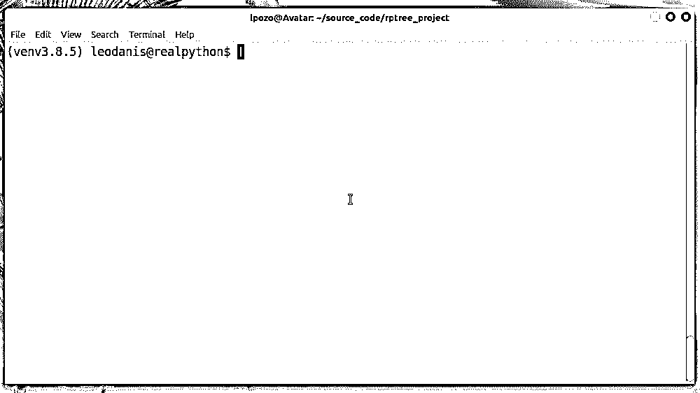
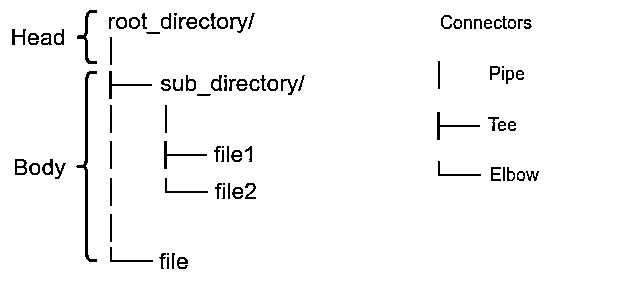

# 为命令行构建一个 Python 目录树生成器

> 原文：<https://realpython.com/directory-tree-generator-python/>

对于 Python 开发人员来说，创建具有用户友好的命令行界面(CLI)的应用程序是一项有用的技能。有了这项技能，您可以创建工具来自动化和加速您的工作环境中的任务。在本教程中，您将为命令行构建一个 Python 目录树生成器工具。

应用程序将把目录路径作为命令行的参数，并在屏幕上显示一个目录树形图。它还提供了调整输出的其他选项。

**在本教程中，您将学习如何:**

*   用 Python 的`argparse`创建一个 **CLI 应用**
*   使用`pathlib`递归**遍历目录结构**
*   生成、格式化并显示一个**目录树形图**
*   将目录树形图保存到一个**输出文件**

您可以通过单击下面的链接下载构建这个目录树生成器项目所需的代码和其他资源:

**获取示例代码:** [单击此处获取示例代码，您将在本教程中使用](https://realpython.com/bonus/directory-tree-generator-python/)用 Python 构建一个目录树生成器。

## 演示:Python 中的目录树生成器工具

在本教程中，您将构建一个命令行工具来[在一个](https://realpython.com/get-all-files-in-directory-python/)[树状图](https://en.wikipedia.org/wiki/Tree_structure)中列出一个目录或文件夹的内容。已经有几种成熟的解决方案可以完成这项任务。你会发现像大多数操作系统上都有的 [`tree`](https://en.wikipedia.org/wiki/Tree_(command)) 命令这样的工具，以及其他工具，比如 [treelib](https://treelib.readthedocs.io/) 、 [dirtriex](https://github.com/mauriziodimatteo/dirtreex) 等等。然而，找出你自己解决这个问题的方法将是一个很好的学习练习。

本教程将上述工具称为**目录树生成器**。您将在这里构建的工具将允许您生成并显示一个树形图，列出您的[文件系统](https://en.wikipedia.org/wiki/File_system)中给定目录的内部[结构](https://en.wikipedia.org/wiki/Directory_structure)。你还会发现这个图在整个教程中被称为**目录树图**。

您的目录树生成器将有一个用户友好的 CLI。它还将提供一些有趣的特性，比如在终端窗口显示一个目录内容的树形图，并将该图保存到一个外部文件中。

下面是本教程结束时应用程序的外观和工作方式:

[](https://files.realpython.com/media/directory-tree-generator-demo.338645b87928.gif)

您的目录树生成器将提供一个功能齐全但非常简单的 CLI，它带有几个选项，允许您生成并显示一个树形图，列出给定根目录中的所有文件和目录。

[*Remove ads*](/account/join/)

## 项目概述

您将在本教程中构建的项目由一个命令行应用程序组成，该应用程序将一个目录路径作为参数，遍历其内部结构，并生成一个列出当前目录内容的树形图。在本节中，您将首先了解问题和可能的解决方案。您还将决定如何布置项目。

### 布置项目

为了构建您的目录树生成器，您将创建几个[模块和一个包](https://realpython.com/python-modules-packages/)。然后你会给这个项目一个连贯的 Python [应用布局](https://realpython.com/python-application-layouts/)。在本教程结束时，项目的根目录将具有以下目录结构:

```py
./rptree_project/
│
├── rptree/
│   ├── rptree.py
│   ├── __init__.py
│   └── cli.py
│
├── README.md
└── tree.py
```

`rptree_project/`目录是项目的根目录。在那里，您将放置以下文件:

*   **`README.md`** 提供了项目描述以及安装和运行应用程序的说明。在你的项目中添加一个描述性的和详细的 [README](https://dbader.org/blog/write-a-great-readme-for-your-github-project) 文件被认为是编程中的最佳实践，尤其是如果你计划将项目作为开源解决方案发布的话。

*   **`tree.py`** 为你运行应用程序提供了一个入口点脚本。

然后是保存 Python 包的`rptree/`目录，该包包含三个模块:

1.  **`rptree.py`** 提供了应用程序的主要功能。
2.  **`__init__.py`** 启用`rptree/`作为 Python 包。
3.  **`cli.py`** 为应用程序提供了命令行界面。

您的目录树生成器工具将在命令行上运行。它将接受参数，处理它们，并在终端窗口上显示一个目录树图。它还可以将输出图保存到一个 [markdown](https://daringfireball.net/projects/markdown/) 格式的文件中。

### 概述解决方案

乍一看，遍历文件系统中的一个目录并生成反映其内容的用户友好的树形图似乎不是一项困难的任务。然而，当你开始思考它时，你会发现它隐藏了许多复杂性。

首先，这是一个涉及到[递归](https://realpython.com/python-recursion/)的问题。假设您在主目录下打开了文件管理器，您正在查找一个特定的文件。然后双击`Documents/`子目录，让它的内容显示在屏幕上。如果文件在那里，你就打开它。否则，你打开另一个子目录，继续寻找。您可以通过以下步骤来描述此过程:

1.  打开一个目录。
2.  检查目录内容。
3.  如果找到文件，请打开它。否则，回到第一步。

结论是，处理目录及其内容是一个问题，您通常会使用[递归](https://realpython.com/python-thinking-recursively/)来解决这个问题。这是您在本教程中将遵循的路径。通常，您将运行以下步骤:

1.  获取文件系统上某个目录的路径。
2.  打开目录。
3.  获取其所有条目(目录和文件)的列表。
4.  如果目录包含子目录，则从第二步开始重复该过程。

要运行第一步，您需要在命令行为您的应用程序提供一种获取目录路径的方法。为此，您将使用来自[标准库](https://docs.python.org/3/library/index.html)的 Python 的 [`argparse`](https://docs.python.org/3/library/argparse.html) 模块。

要完成第二步和第三步，你要使用 [`pathlib`](https://docs.python.org/3/library/pathlib.html) 。这个模块提供了几个工具来管理和表示文件系统路径。最后，您将使用一个常规的 Python [list](https://realpython.com/python-lists-tuples/) 来存储目录结构中的条目列表。

第二个要考虑的问题是如何制作一个好看的树形图，以准确和用户友好的方式反映目录结构。在本教程中，您将使用一种模仿`tree`命令的策略来塑造您的树形图，这样您的图将看起来像您在上一节中看到的那样。

### 组织代码

在[设计](https://en.wikipedia.org/wiki/Software_design)方面，如果你想到手头的问题，应用[单责任原则](https://en.wikipedia.org/wiki/Single-responsibility_principle)，那么你可以按照三个主要责任来组织你的目录树生成器 app 的代码:

1.  提供 CLI
2.  遍历根目录并构建树形图
3.  显示树形图

CLI 相关代码将存在于`cli.py`中。在`rptree.py`中，您将放置与第二个和第三个职责相关的代码。

在这个例子中，您将编写一个高级的`DirectoryTree`类来生成和显示树形图。您将在您的客户端代码中使用这个类，或[主函数](https://realpython.com/python-main-function/)。该类将提供一个名为`.generate()`的方法来生成和显示目录树图。

接下来，您将编写一个底层的`_TreeGenerator`类来遍历目录结构，并创建包含构成树形图的条目的列表。这个类将提供一个名为`.build_tree()`的方法来执行这个操作。

树形图有两个主要部分:

1.  **Head** 将提供根目录表示。
2.  **Body** 将提供目录内容表示。

树头表示将由根目录的名称和一个额外的管道(`│`)字符组成，以连接树头和主体。

树体表示将由包含以下组件的[字符串](https://realpython.com/python-strings/)组成:

*   前缀字符串，提供所需的间距以反映目录结构中条目的位置
*   连接当前子目录或文件与其父目录的字符
*   当前子目录或文件的名称

以下是您将如何组合这些元素来构建目录树图:

[](https://files.realpython.com/media/tree-diagram.b6bfbead26a6.png)

您的树生成器的`.build_tree()`方法将返回一个列表，其中包含构成目录树图的所有条目。为了显示图表，您需要在您的目录树对象上调用`.generate()`。

[*Remove ads*](/account/join/)

## 先决条件

要完成本教程并从中获得最大收益，您应该熟悉以下概念:

*   **用 Python 的`argparse`模块创建命令行界面(CLI)**
*   **用`pathlib`遍历文件系统**
*   **使用递归**并在 Python 中创建递归函数
*   **使用文件**使用 [`open()`](https://docs.python.org/3/library/functions.html#open) 和 [`with`语句](https://realpython.com/working-with-files-in-python/#pythons-with-open-as-pattern)
*   **使用`print()`** 将文本打印到屏幕上，并写入文件系统中的物理文件
*   **使用 Python 中的面向对象编程**

如果您在开始本教程之前没有掌握所有必需的知识，那也没关系！您可以随时停下来查看以下资源:

*   [如何用 argparse 在 Python 中构建命令行界面](https://realpython.com/command-line-interfaces-python-argparse/)
*   [Python 3 的 pathlib 模块:驯服文件系统](https://realpython.com/python-pathlib/)
*   [用 Python 递归思考](https://realpython.com/python-thinking-recursively/)
*   [在 Python 中处理文件](https://realpython.com/working-with-files-in-python/)
*   [Python print()函数指南](https://realpython.com/python-print/)
*   [Python 3 中的面向对象编程(OOP)](https://realpython.com/python3-object-oriented-programming/)

就软件依赖性而言，您的目录树生成器项目不需要任何外部库。它的所有依赖项都作为 Python 内置函数或标准库中的模块提供。

也就是说，是时候用真正的代码来构建自己的目录树生成器工具了！

## 步骤 1:建立项目结构

首先，需要为目录树生成器项目创建一致的应用程序布局。继续在您的文件系统上创建一个名为`rptree_project/`的新目录。在这个目录中，您需要两个空文件:

1.  `README.md`
2.  `tree.py`

接下来，您需要创建一个名为`rptree/`的子目录，其中包含以下空文件:`rptree.py`、`__init__.py`和- `cli.py`。添加后，项目的根目录应该如下所示:

```py
./rptree_project/
│
├── rptree/
│   ├── rptree.py
│   ├── __init__.py
│   └── cli.py
│
├── README.md
└── tree.py
```

若要下载这些文件以及您将在本节中添加到这些文件中的代码，请单击下面的链接:

**获取示例代码:** [单击此处获取示例代码，您将在本教程中使用](https://realpython.com/bonus/directory-tree-generator-python/)用 Python 构建一个目录树生成器。

此时，您需要一个额外的设置步骤。在你的项目目录中启动你最喜欢的[代码编辑器或者 IDE](https://realpython.com/python-ides-code-editors-guide/) ，打开`__init__.py`，添加以下内容:

```py
# __init__.py

"""Top-level package for RP Tree."""

__version__ = "0.1.0"
```

Python 使用`__init__.py`文件将一个普通目录变成一个包。包中包含模块，比如本项目中的`rptree.py`和`cli.py`。包和模块是允许您组织和构建 Python 代码的机制。

在这种情况下，`__init__.py`包含模块的[文档](https://realpython.com/documenting-python-code/)字符串，通常称为**文档字符串**。它还定义了一个名为`__version__`的[全局](https://realpython.com/python-namespaces-scope/#the-global-namespace)常量，用于保存应用程序的版本号。

最后，您需要一个示例目录来测试应用程序并确保它正常工作。离开项目的根目录，在文件系统中创建以下目录结构，与项目文件夹并排:

```py
../hello/
│
├── hello/
│   ├── __init__.py
│   └── hello.py
│
├── tests/
│   └── test_hello.py
│
├── requirements.txt
├── setup.py
├── README.md
└── LICENSE
```

这个目录结构模仿了 Python 项目的一般布局。在本教程的所有步骤中，您将使用这个样本目录结构来测试目录树生成器工具。这样，您可以在教程的任何给定步骤将您的结果与预期结果进行比较。

[*Remove ads*](/account/join/)

## 步骤 2:用 Python 生成目录树图

既然您已经知道了项目的需求，并且已经设置了项目布局和示例目录，那么您就可以开始处理真正的代码了。所以让你的编辑器准备好开始编码吧。

在本节中，您将编写项目的主要功能。换句话说，您将编写代码来从输入目录路径生成完整的目录树图。要下载该代码，请单击下面的链接:

**获取示例代码:** [单击此处获取示例代码，您将在本教程中使用](https://realpython.com/bonus/directory-tree-generator-python/)用 Python 构建一个目录树生成器。

现在回到你的代码编辑器，打开`rptree.py`。然后将以下代码添加到文件中:

```py
# rptree.py

"""This module provides RP Tree main module."""

import os
import pathlib

PIPE = "│"
ELBOW = "└──"
TEE = "├──"
PIPE_PREFIX = "│   "
SPACE_PREFIX = "    "
```

在这段代码中，您首先从 Python 标准库中[导入](https://realpython.com/python-import/) `os`和`pathlib`。接下来，定义几个模块级常量来保存连接器字符和前缀字符串，您将使用它们在终端窗口上绘制树形图。您将用来绘制树形图的符号与您在本教程前面的图中看到的符号相同。命令行工具`tree`使用这些相同的符号来绘制树形图。

### 编码高级`DirectoryTree`类

接下来，您将定义一个高级类来创建目录树图并将其显示在屏幕上。将该类命名为`DirectoryTree`，并向其中添加以下代码:

```py
# rptree.py
# Snip...

class DirectoryTree:
    def __init__(self, root_dir):
        self._generator = _TreeGenerator(root_dir)

    def generate(self):
        tree = self._generator.build_tree()
        for entry in tree:
            print(entry)
```

在类初始化器中，您将一个根目录作为参数，并创建一个名为`._generator`的[实例属性](https://realpython.com/python3-object-oriented-programming/#class-and-instance-attributes)。为了创建这个属性，您使用一种叫做 [composition](https://realpython.com/inheritance-composition-python/#whats-composition) 的 OOP 技术，它定义了一个**“has”关系**。这意味着每个`DirectoryTree`对象**都有一个** `_TreeGenerator`对象与之相连。

**注意:**名称`_TreeGenerator`中的前导下划线字符(`_`)是一个常用的 Python 约定。这意味着这个类是**非公共的**，这意味着你不希望这个类在它的包含模块`rptree.py`之外被使用。

同样的约定也适用于非公共方法和属性，您不希望在包含类之外使用它们。通常，您开始将属性定义为非公共的，并在需要时将它们设为公共的。参见 [PEP 8](https://www.python.org/dev/peps/pep-0008/#id49) 了解关于此会议的更多详情。

稍后您将看到如何创建这个`_TreeGenerator`类。现在，来看看`.generate()`。这个方法创建了一个名为`tree`的局部变量，它保存了对树生成器对象调用`.build_tree()`的结果。然后你用一个 [`for`循环](https://realpython.com/python-while-loop/)将树中的每个`entry`打印到你的屏幕上。

### 对低级`_TreeGenerator`类进行编码

既然您已经完成了对`DirectoryTree`的编码，那么是时候对遍历文件系统并生成目录树图的类进行编码了:

```py
 1# rptree.py
 2# Snip...
 3
 4class _TreeGenerator:
 5    def __init__(self, root_dir):
 6        self._root_dir = pathlib.Path(root_dir)
 7        self._tree = []
 8
 9    def build_tree(self):
10        self._tree_head()
11        self._tree_body(self._root_dir)
12        return self._tree
13
14    def _tree_head(self):
15        self._tree.append(f"{self._root_dir}{os.sep}")
16        self._tree.append(PIPE)
```

下面是这段代码的工作原理:

*   第 4 行定义了一个新的类`_TreeGenerator`。

*   第 5 行定义了类初始化器。在这种情况下，`.__init__()`将`root_dir`作为参数。它保存了树的根目录路径。请注意，您将`root_dir`转换为一个 [`pathlib.Path`](https://docs.python.org/3/library/pathlib.html#pathlib.Path) 对象，并将其分配给非公共实例属性`._root_dir`。

*   **第 7 行**定义了一个空列表来存储构成目录树形图的条目。

*   **第 9 行到第 12 行**定义`.build_tree()`。这个公共方法生成并返回目录树图。在`.build_tree()`里面，你首先调用`._tree_head()`来建立树头。然后您调用`._tree_body()`并将`._root_dir`作为参数来生成图的其余部分。

*   **第 14 到 16 行**定义`._tree_head()`。该方法将根目录的名称添加到`._tree`中。然后添加一个`PIPE`将根目录连接到树的其余部分。

到目前为止，您只编写了类的第一部分。接下来就是写`._tree_body()`，这需要几行代码。

**注意:**上述代码和本教程中其余代码示例中的行号是为了便于解释。它们与最终模块或脚本中的行顺序不匹配。

`._tree_body()`中的代码提供了类的底层功能。它以一个目录路径作为参数，遍历该目录下的文件系统，并生成相应的目录树图。下面是它的实现:

```py
 1# rptree.py
 2# Snip...
 3
 4class _TreeGenerator:
 5    # Snip...
 6
 7    def _tree_body(self, directory, prefix=""):
 8        entries = directory.iterdir()
 9        entries = sorted(entries, key=lambda entry: entry.is_file())
10        entries_count = len(entries)
11        for index, entry in enumerate(entries):
12            connector = ELBOW if index == entries_count - 1 else TEE
13            if entry.is_dir():
14                self._add_directory(
15                    entry, index, entries_count, prefix, connector
16                )
17            else:
18                self._add_file(entry, prefix, connector)
```

这段代码中发生了很多事情。下面是它一行一行地做的事情:

*   **第 7 行**定义`._tree_body()`。这个方法有两个参数:

    1.  **`directory`** 保存着你要走过的目录的路径。注意`directory`应该是一个`pathlib.Path`对象。

    2.  **`prefix`** 保存一个前缀字符串，用于在终端窗口上绘制树形图。这个字符串有助于显示目录或文件在文件系统中的位置。

*   **第 8 行**调用`directory`上的`.iterdir()`，并将结果赋给`entries`。对`.iterdir()`的调用返回一个迭代器，遍历包含在`directory`中的文件和子目录。

*   **第 9 行**使用 [`sorted()`](https://realpython.com/python-sort/) 对`directory`中的条目进行排序。为此，您创建一个 [`lambda`函数](https://realpython.com/python-lambda/)，它检查`entry`是否是一个文件，并相应地返回`True`或`False`。在 Python 中，`True`和`False`在内部[分别表示为整数](https://realpython.com/python-boolean/#python-booleans-as-numbers)、`1`和`0`。实际效果是，`sorted()`将目录放在第一位，因为`entry.is_file() == False == 0`将文件放在第二位，因为`entry.is_file() == True == 1`。

*   **第 10 行**调用 [`len()`](https://realpython.com/len-python-function/) 获取手头`directory`中的条目数。

*   **第 11 行**开始一个`for`循环，遍历`directory`中的条目。该循环使用 [`enumerate()`](https://realpython.com/python-enumerate/) 将一个索引关联到每个条目。

*   **第 12 行**定义了你将用来在终端窗口上绘制树形图的连接器符号。例如，如果当前条目是目录中的最后一个(`index == entries_count - 1`)，那么您使用一个肘(`└──`)作为一个`connector`。否则，你用一个球座(`├──`)。

*   **第 13 到 18 行**定义了一个[条件语句](https://realpython.com/python-conditional-statements/)，它检查当前条目是否是一个目录。如果是，那么`if`代码块调用`._add_directory()`来添加一个新的目录条目。否则，`else`子句调用`._add_file()`来添加一个新的文件条目。

要完成对`_TreeGenerator`的编码，需要编写`._add_directory()`和`._add_file()`。下面是这些非公共方法的代码:

```py
 1# rptree.py
 2# Snip...
 3
 4class _TreeGenerator:
 5    # Snip...
 6
 7    def _add_directory(
 8        self, directory, index, entries_count, prefix, connector
 9    ):
10        self._tree.append(f"{prefix}{connector}  {directory.name}{os.sep}")
11        if index != entries_count - 1:
12            prefix += PIPE_PREFIX
13        else:
14            prefix += SPACE_PREFIX
15        self._tree_body(
16            directory=directory,
17            prefix=prefix,
18        )
19        self._tree.append(prefix.rstrip())
20
21    def _add_file(self, file, prefix, connector):
22        self._tree.append(f"{prefix}{connector}  {file.name}")
```

下面是这段代码的作用，一行接一行:

*   **第 7 行**定义`._add_directory()`。它是一个带五个参数的 helper 方法，不算`self`。您已经知道这些参数分别代表什么，所以没有必要再讨论它们。

*   **第 10 行**向`._tree`追加一个新目录。`._tree`中的每个目录由一个字符串表示，该字符串包含一个`prefix`、一个`connector`、目录名(`entry.name`)和一个最后的分隔符(`os.sep`)。请注意，分隔符是平台相关的，这意味着您的树生成器使用与您的当前操作系统相对应的分隔符。

*   **第 11 到 14 行**运行一个条件语句，根据当前条目的`index`更新`prefix`。

*   **第 15 到 18 行**用一组新的参数调用`._tree_body()`。

*   **第 19 行**追加一个新的`prefix`来分隔当前目录的内容和下一个目录的内容。

在第 15 行对`._tree_body()`的调用中有一个重要的细节讨论。这是一个**间接递归调用**。换句话说，`._tree_body()`通过`._add_directory()`调用自己，直到遍历整个目录结构。

最后，在第 21 和 22 行，您定义了`._add_file()`。该方法向目录树列表追加一个文件条目。

[*Remove ads*](/account/join/)

### 运行目录树生成器代码

哇！那是很大的工作量！您的目录树生成器现在提供了它的主要功能。是时候尝试一下了。在项目的根目录下打开一个 [Python 交互式会话](https://realpython.com/interacting-with-python/),并键入以下代码:

>>>

```py
>>> from rptree.rptree import DirectoryTree
>>> tree = DirectoryTree("../hello")
>>> tree.generate()
../hello/
│
├── hello/
│   ├── __init__.py
│   └── hello.py
│
├── tests/
│   └── test_hello.py
│
├── requirements.txt
├── setup.py
├── README.md
└── LICENSE
```

这里首先从`rptree.py`导入`DirectoryTree`。接下来，创建一个目录树对象，将路径传递给之前创建的`hello/`示例目录。当您在目录树对象上调用`.generate()`时，您会在屏幕上看到完整的目录树图。

酷！您已经编写了目录树生成器的主要功能。在下一节中，您将为您的项目提供一个漂亮且用户友好的命令行界面和一个可执行脚本。

## 步骤 3:构建目录树生成器的 CLI

有几种工具可以创建 CLI 应用程序。比较流行的有 [Click](https://click.palletsprojects.com/) 、 [`docopt`](http://docopt.org/) 、 [Typer](https://realpython.com/python-packages/#typer-for-command-line-interface-parsing) ，还有 [`argparse`](https://realpython.com/command-line-interfaces-python-argparse/) ，标准库中都有。在您的目录树生成器项目中，您将使用`argparse`来提供命令行界面。这样，你将避免有一个外部依赖。

Python 的`argparse`允许你定义你的应用程序将在命令行接受的参数，并验证用户的输入。该模块还为您的脚本生成帮助和使用消息。

若要下载您将在本节中添加或修改的文件和代码，请单击下面的链接:

**获取示例代码:** [单击此处获取示例代码，您将在本教程中使用](https://realpython.com/bonus/directory-tree-generator-python/)用 Python 构建一个目录树生成器。

要实现目录树生成器的 CLI，请返回到项目目录并从`rptree`包中打开`cli.py`文件。然后键入以下代码:

```py
"""This module provides the RP Tree CLI."""
# cli.py

import argparse
import pathlib
import sys

from . import __version__
from .rptree import DirectoryTree

def main():
    args = parse_cmd_line_arguments()
    root_dir = pathlib.Path(args.root_dir)
    if not root_dir.is_dir():
        print("The specified root directory doesn't exist")
        sys.exit()
    tree = DirectoryTree(root_dir)
    tree.generate()
```

在这段代码中，首先从标准库中导入所需的模块。然后从包含包`rptree`中导入`__version__`和`DirectoryTree`。

在`main()`中，首先调用`parse_cmd_line_arguments()`并将命令行参数打包在`args`中。您马上就会看到这个函数的作用。接下来，将根目录转换成一个`pathlib.Path`对象。条件语句进行快速验证，以确保用户提供有效的目录路径，否则退出应用程序。

最后，使用`root_dir`作为参数创建一个`DirectoryTree`对象，并对其调用`.generate()`,以在终端窗口上生成并显示相应的目录树图。

现在你可以开始钻研`parse_cmd_line_arguments()`的代码了。此函数提供了所有与 CLI 相关的功能:

```py
 1# cli.py
 2# Snip...
 3
 4def parse_cmd_line_arguments():
 5    parser = argparse.ArgumentParser(
 6        prog="tree",
 7        description="RP Tree, a directory tree generator",
 8        epilog="Thanks for using RP Tree!",
 9    )
10    parser.version = f"RP Tree v{__version__}"
11    parser.add_argument("-v", "--version", action="version")
12    parser.add_argument(
13        "root_dir",
14        metavar="ROOT_DIR",
15        nargs="?",
16        default=".",
17        help="Generate a full directory tree starting at ROOT_DIR",
18    )
19    return parser.parse_args()
```

这个函数的作用如下:

*   **第 5 行**实例化 [`argparse.ArgumentParser`](https://docs.python.org/3/library/argparse.html#argparse.ArgumentParser) ，提供应用程序的命令名(`prog`)、程序的简短`description`，以及用户运行应用程序的帮助选项后显示的`epilog`短语。这个类为用户在命令行输入的所有参数提供了一个解析器。

*   **第 10 行**将解析器的`version`属性设置为一个字符串，该字符串包含应用程序的名称及其当前版本`__version__`。

*   **第 11 行**将第一个**可选参数**添加到应用程序的 CLI 中。需要`-v`或`--version`标志来提供这个参数，它的默认动作是在终端窗口上显示应用程序的版本字符串。

*   **第 12 行到第 18 行**向 CLI 添加第二个参数。这里，`root_dir`是一个**位置参数**，它保存了您将用来作为生成目录树图的起点的目录路径。在这种情况下，`.add_argument()`有四个参数:

    1.  [`metavar`](https://docs.python.org/3/library/argparse.html#metavar) 在用法消息中保存参数的名称。

    2.  [`nargs`](https://docs.python.org/3/library/argparse.html#nargs) 定义了你的程序在当前参数下可以接受的值的数量。例如，您的目录树生成器在命令行中只能采用一个目录路径，因此`nargs`的合适值是`"?"`。

    3.  [`default`](https://docs.python.org/3/library/argparse.html#default) 为手头的参数提供了一个默认值。在这种情况下，您使用一个点(`"."`)将当前目录设置为默认根目录。

    4.  [`help`](https://docs.python.org/3/library/argparse.html#help) 提供了一个简短的帮助消息，描述了参数的作用。

*   **第 19 行**使用 [`.parse_args()`](https://docs.python.org/3/library/argparse.html#the-parse-args-method) 解析提供的参数。这个方法返回一个带有所有参数的 [`Namespace`](https://docs.python.org/3/library/argparse.html#argparse.Namespace) 对象。您可以使用[名称空间](https://realpython.com/python-namespaces-scope/)对象上的点符号来访问这些参数。注意，当您编写`main()`时，您将这个名称空间存储在了`args`中。

完成这一步的最后一步是提供一个入口点脚本。回到代码编辑器，打开`tree.py`，然后添加以下代码:

```py
#!/usr/bin/env python3
# tree.py

"""This module provides RP Tree entry point script."""

from rptree.cli import main

if __name__ == "__main__":
    main()
```

这个文件简单明了。首先从`cli.py`导入`main()`,然后将其调用封装在传统的`if __name__ == "__main__":`条件中，这样只有当您将文件作为程序运行而不是作为模块导入时，Python 才会调用`main()`。

有了这个脚本，您就可以开始使用全新的命令行目录树生成器了。打开命令行窗口，移动到项目目录，并运行以下命令:

```py
$ python tree.py ../hello
../hello/
│
├── hello/
│   ├── __init__.py
│   └── hello.py
│
├── tests/
│   └── test_hello.py
│
├── requirements.txt
├── setup.py
├── README.md
└── LICENSE

$ python tree.py -v
RP Tree v0.1.0

$ python tree.py --help
usage: tree [-h] [-v] [ROOT_DIR]

RP Tree, a directory tree generator

positional arguments:
 ROOT_DIR       Generate a full directory tree starting at ROOT_DIR

optional arguments:
 -h, --help     show this help message and exit
 -v, --version  show program's version number and exit

Thanks for using RP Tree!
```

就是这样！您的目录树生成器工具可以工作。它生成并在屏幕上显示一个用户友好的树形图。它还提供版本和使用信息。对于大约一百行代码来说，这相当酷！在接下来的小节中，您将向应用程序添加更多的特性。

[*Remove ads*](/account/join/)

## 步骤 4:实现仅目录选项

添加到目录树生成器中的一个有趣的特性是能够生成和显示仅包含目录的树形图。换句话说，一个只显示目录的图。在这个项目中，您将添加`-d`和`--dir-only`标志来完成这项工作，但在此之前，您需要更新`_TreeGenerator`，以便它可以支持这个新功能。

您可以通过单击下面的链接下载您将在本节中添加或修改的文件和代码:

**获取示例代码:** [单击此处获取示例代码，您将在本教程中使用](https://realpython.com/bonus/directory-tree-generator-python/)用 Python 构建一个目录树生成器。

现在打开`rptree.py`模块，像这样更新它的代码:

```py
# rptree.py
# Snip...

class _TreeGenerator:
 def __init__(self, root_dir, dir_only=False):        self._root_dir = pathlib.Path(root_dir)
 self._dir_only = dir_only        self._tree = []

    # Snip...

    def _tree_body(self, directory, prefix=""):
 entries = self._prepare_entries(directory)        entries_count = len(entries)
        for index, entry in enumerate(entries):
            connector = ELBOW if index == entries_count - 1 else TEE
            if entry.is_dir():
                self._add_directory(
                    entry, index, entries_count, prefix, connector
                )
            else:
                self._add_file(entry, prefix, connector)

 def _prepare_entries(self, directory):        entries = directory.iterdir()
        if self._dir_only:
            entries = [entry for entry in entries if entry.is_dir()]
            return entries
        entries = sorted(entries, key=lambda entry: entry.is_file())
        return entries

    # Snip...
```

首先，将`dir_only`作为参数添加到类初始化器中。这是一个[布尔](https://realpython.com/python-boolean/)参数，允许您根据用户在命令行的输入生成一个完整的树或一个仅包含目录的树。这个参数默认为`False`，因为生成一棵完整的树是最常见的用例。

在第二个突出显示的行中，您创建了一个名为`._dir_only`的实例属性来保存新添加的参数。

在突出显示的第三行中，您用对`._prepare_entries()`的调用替换了两行原始代码。顾名思义，这个函数准备目录条目来生成完整的树或仅包含目录的树。

在`._prepare_entries()`中，你首先得到`entries` [发生器](https://realpython.com/introduction-to-python-generators/)。`if`语句检查`._dir_only`是否为`True`。如果是这样，那么您用一个[列表理解](https://realpython.com/list-comprehension-python/)过滤掉文件并返回一个`list`目录。如果`._dir_only`是`False`，那么您将对条目进行排序，重用之前看到的相同代码。最后，在`directory`中返回完整的条目列表。

现在，您需要确保将这个新参数传递给`DirectoryTree`中的`_TreeGenerator`实例:

```py
# rptree.py
# Snip...

class DirectoryTree:
 def __init__(self, root_dir, dir_only=False): self._generator = _TreeGenerator(root_dir, dir_only) 
    # Snip...
```

在第一个突出显示的行中，您向类初始化器添加了一个名为`dir_only`的新参数。在第二个突出显示的行中，确保将新参数传递给`_TreeGenerator`的构造函数。

有了这些更改，您就可以更新`cli.py`文件，这样应用程序就可以在命令行上获取并处理`-d`和`--dir-only`标志。首先，您需要更新`main()`:

```py
# cli.py
# Snip...

def main():
    # Snip...
 tree = DirectoryTree(root_dir, dir_only=args.dir_only)    tree.generate()
```

在突出显示的行中，您将`args.dir_only`传递给`DirectoryTree`的`dir_only`参数。名称空间`args`的这个属性包含一个依赖于用户输入的布尔值。如果用户在命令行提供了`-d`或`--dir-only`选项，那么`args.dir_only`就是`True`。不然就是`False`。

接下来，将这些`-d`和`--dir-only`标志添加到命令行界面。为此，您需要像这样更新`parse_cmd_line_arguments()`:

```py
# cli.py
# Snip...

def parse_cmd_line_arguments():
    # Snip...
    parser.add_argument(
        "-d",
        "--dir-only",
        action="store_true",
        help="Generate a directory-only tree",
    )
    return parser.parse_args()
```

对`.add_argument()`的调用中的`action`参数保存了值`"store_true"`，这意味着该参数根据用户的输入自动存储`True`或`False`。在这种情况下，如果用户在命令行提供了`-d`或`--dir-only`标志，那么参数将存储`True`。否则，它存储`False`。

有了这个更新，就可以运行和测试应用程序了。回到您的终端窗口，执行以下命令:

```py
$ python tree.py ../hello -d
../hello/
│
├── hello/
│
└── tests/
```

从现在开始，如果您在命令行提供了`-d`或`-dir-only`标志，那么树形图只显示您的示例`hello/`目录中的子目录。

[*Remove ads*](/account/join/)

## 步骤 5:将目录树图保存到文件

在本节中，您将向目录树生成器工具添加最后一个特性。您将为应用程序提供将生成的目录树图保存到外部文件的能力。为此，您将使用标志`-o`和`--output-file`向 CLI 添加一个新参数。

通常，要下载您将在本节中添加或修改的代码，请单击下面的链接:

**获取示例代码:** [单击此处获取示例代码，您将在本教程中使用](https://realpython.com/bonus/directory-tree-generator-python/)用 Python 构建一个目录树生成器。

现在回到`rptree.py`，像这样更新`DirectoryTree`:

```py
# rptree.py
# Snip...
import sys 
# Snip...

class DirectoryTree:
 def __init__(self, root_dir, dir_only=False, output_file=sys.stdout): self._output_file = output_file        self._generator = _TreeGenerator(root_dir, dir_only)

    def generate(self):
        tree = self._generator.build_tree()
 if self._output_file != sys.stdout:            # Wrap the tree in a markdown code block
 tree.insert(0, "\x60\x60\x60") 
 tree.append("\x60\x60\x60") 
 self._output_file = open(                self._output_file, mode="w", encoding="UTF-8"
            )
 with self._output_file as stream:            for entry in tree:
 print(entry, file=stream)
```

这次更新几乎是对`DirectoryTree`的完全重新实现。首先，向名为`output_file`的类初始化器添加一个新参数。这个参数默认为 [`sys.stdout`](https://docs.python.org/3/library/sys.html#sys.stdout) ，这是标准输出(你的屏幕)。然后，将新添加的参数存储在名为`._output_file`的实例属性中。

在`.generate()`中，你首先建立目录树形图，并存储在`tree`中。条件语句检查用户是否提供了不同于`sys.stdout`的输出文件。如果是，那么`if`代码块使用反斜杠(`"\x60\x60\x60"`)将树形图包装在一个 markdown 代码块中。

接下来，使用`open()`打开提供的输出文件，这样就可以使用 [`with`语句](https://realpython.com/python-with-statement/)处理它。

**注意:**就执行时间而言，在列表对象上调用`.insert(0, x)`可能是一个开销很大的操作。这是因为 Python 需要将所有项目向右移动一个位置，然后在第一个位置插入新项目。

对`.insert()`的一个有效替代是使用 [`collections.deque`](https://docs.python.org/3/library/collections.html#collections.deque) ，并使用`.appendleft()`在数据结构的第一个位置添加条目。这种数据结构针对这种操作进行了优化。

在`with`块中，您启动一个`for`循环，将目录树图打印到提供的输出文件中。注意`print()`也可以写入你的文件系统中的常规文件。为此，您只需要提供一个定制的`file`参数。要深入了解`print()`的特性，请查看[Python print()函数](https://realpython.com/python-print/)指南。

一旦完成了`DirectoryTree`，就可以更新命令行界面来启用输出文件选项。回到`cli.py`,修改如下:

```py
# cli.py
# Snip...

def main():
    # Snip...
    tree = DirectoryTree(
        root_dir, dir_only=args.dir_only, output_file=args.output_file
    )
    tree.generate()

def parse_cmd_line_arguments():
    # Snip...
    parser.add_argument(
        "-o",
        "--output-file",
        metavar="OUTPUT_FILE",
        nargs="?",
        default=sys.stdout,
        help="Generate a full directory tree and save it to a file",
    )
    return parser.parse_args()
```

第一步是将输出文件作为`DirectoryTree`构造函数中的一个参数。输出文件(如果有)将存储在`args.output_file`中。

接下来，向`parser`添加一个新参数。这个论点有两面旗帜:`-o`和`--output-file`。为了提供另一个输出文件，用户必须使用这些标志中的一个，并在命令行提供文件的路径。注意，输出文件默认为`sys.stdout`。这样，如果用户没有提供输出文件，应用程序会自动使用标准输出，即屏幕。

您可以通过在终端上运行以下命令来测试新添加的选项:

```py
$ python tree.py ../hello -o output_file.md
```

该命令生成一个完整的目录树形图，并将其保存到当前目录下的`output_file.md`文件中。如果你打开这个文件，你会看到目录树图以 markdown 格式保存在那里。

就是这样！您的目录树生成器项目已经完成。除了生成和显示完整目录树图的默认选项之外，该应用程序还提供了以下选项:

*   `-v`、`--version`显示当前版本信息并退出应用程序。
*   `-h`、`--help`显示帮助和使用信息。
*   `-d`、`--dir-only`生成一个目录树，并打印到屏幕上。
*   `-o`、`--output-to-markdown`生成一棵树，并以 markdown 格式保存到文件中。

现在，您拥有了一个全功能的命令行工具，可以生成用户友好的目录树图。干得好！

[*Remove ads*](/account/join/)

## 结论

通过创建 [CLI](https://en.wikipedia.org/wiki/Command-line_interface) 工具和应用程序，您可以自动化并加速工作环境中的多个流程和任务。在 Python 中，可以使用`argparse`或其他第三方库快速创建这类工具。在本教程中，您编写了一个完整的项目来为您的命令行构建一个 Python **目录树生成器**工具。

该应用程序在命令行中获取一个目录路径，生成一个目录树图，并在您的终端窗口中显示它，或者将它保存到您的文件系统中的一个外部文件中。它还提供了一些选项来调整生成的树形图。

**在本教程中，您学习了如何:**

*   用 Python 的`argparse`创建一个 **CLI 应用**
*   使用`pathlib`递归**遍历目录结构**
*   生成、格式化并打印一个**目录树形图**
*   将目录树形图保存到一个**输出文件**

目录树生成器项目的最终源代码可供您下载。要获取它，请单击下面的链接:

**获取示例代码:** [单击此处获取示例代码，您将在本教程中使用](https://realpython.com/bonus/directory-tree-generator-python/)用 Python 构建一个目录树生成器。

## 接下来的步骤

至此，您已经构建了一个功能完整的目录树生成器工具。尽管该应用程序提供了一组最少的功能，但这是您继续添加功能并在此过程中学习的良好起点。这将帮助您将 Python 和 CLI 应用程序的技能提升到一个新的水平。

以下是一些您可以实施的想法，以继续改进您的目录树生成器工具:

*   **添加对文件和目录排序的支持:**能够对文件和目录进行排序是一个很棒的特性。例如，您可以添加`-s`和`--sort-tree`布尔标志，以允许用户调整最终树形图中文件和目录的顺序。

*   **给树形图添加图标和颜色:**添加图标、字体颜色或者两者都添加也是一个很好的实现特性。例如，您可以对目录使用自定义文件夹图标，对文件使用基于文件类型的图标。

*   **设置应用程序以将其作为开源项目发布:**准备应用程序以开源项目的形式发布到 PyPI 可能是一个有趣的挑战。这样做可以让你与你的朋友和同事分享你的工作。要开始向 PyPI 发布包，请查看[如何向 PyPI 发布开源 Python 包](https://realpython.com/pypi-publish-python-package/)。

这些只是如何继续向目录树生成器添加特性的一些想法。接受挑战，在此基础上创造出令人惊叹的东西！*******