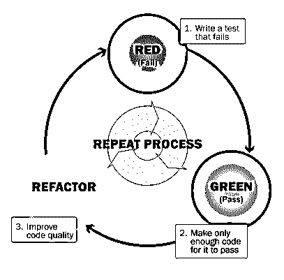
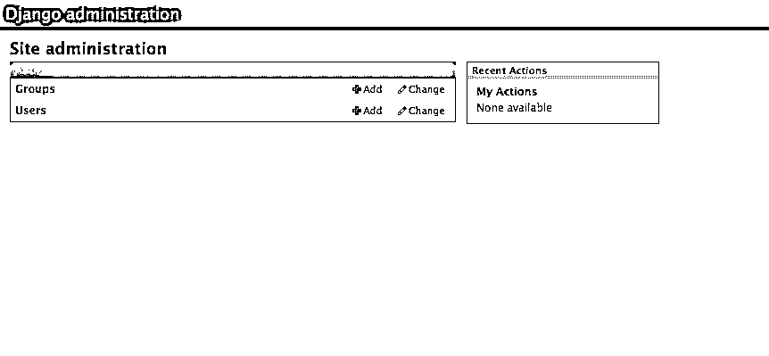
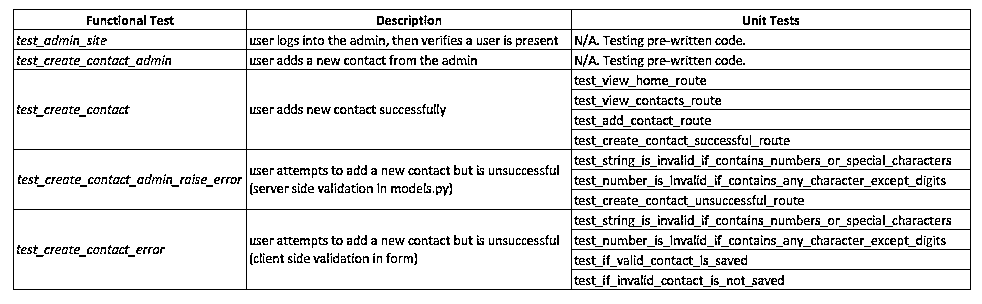

# Django 1.6 测试驱动开发

> 原文：<https://realpython.com/django-1-6-test-driven-development/>

上次更新时间:

*   01/29/2014 -更新了表单代码(感谢 vic！)
*   2013 年 12 月 29 日-重新构建了整篇博文

* * *

测试驱动开发(TDD)是一个迭代开发周期，它强调在编写实际代码之前[编写自动化测试](https://realpython.com/python-testing/)。

过程很简单:

1.  首先编写您的测试。
2.  看着他们失败。
3.  编写足够的代码来通过这些测试。
4.  再次测试。
5.  重构。
6.  重复一遍。

[](https://files.realpython.com/media/tdd.0904607f8ec9.png)

## 为什么是 TDD？

使用 TDD，您将学会将代码分解成逻辑的、容易理解的部分，帮助确保代码的正确性。

这很重要，因为很难-

1.  在我们的头脑中一次性解决复杂的问题；
2.  知道何时何地开始解决问题；
3.  在不引入错误和缺陷的情况下增加代码库的复杂性；和
4.  识别何时出现代码中断。

TDD 有助于解决这些问题。它不能保证您的代码没有错误；但是，您将编写更好的代码，从而更好地理解代码。这本身将有助于消除错误，至少，您将能够更容易地解决错误。

TDD 实际上也是一种行业标准。

说够了。让我们来看看代码。

在本教程中，我们将创建一个应用程序来存储用户联系人。

> 请注意:本教程假设您正在运行一个基于 Unix 的环境——例如，Mac OSX、直接 Linux 或通过 Windows 的 Linux VM。我也将使用 Sublime 2 作为我的文本编辑器。另外，确保你已经完成了 Django 的官方教程，并且对 Python 语言有了基本的了解。**同样，在这第一篇文章中，我们将不会涉及 Django 1.6 中的一些新工具。这篇文章为后续处理不同形式测试的文章奠定了基础。**

[*Remove ads*](/account/join/)

## 首次测试

在我们做任何事情之前，我们需要先设置一个测试。对于这个测试，我们只想确保 Django 设置正确。我们将对此进行功能测试——我们将在下面进一步解释。

创建一个新目录来存放您的项目:

```py
$ mkdir django-tdd
$ cd django-tdd
```

现在设置一个新的目录来保存您的功能测试:

```py
$ mkdir ft
$ cd ft
```

创建一个名为“tests.py”的新文件，并添加以下代码:

```py
from selenium import webdriver

browser = webdriver.Firefox()
browser.get('http://localhost:8000/')

body = browser.find_element_by_tag_name('body')
assert 'Django' in body.text

browser.quit()
```

现在运行测试:

```py
$ python tests.py
```

> 确保你已经安装了 selenium-`pip install selenium`

您应该看到 FireFox 弹出并试图导航到 http://localhost:8000/。在您的终端中，您应该看到:

```py
Traceback (most recent call last):
File "tests.py", line 7, in <module>
 assert 'Django' in body.text
AssertionError
```

恭喜你。你写了你的第一个失败测试。

现在让我们编写足够的代码来使它通过，这相当于建立一个 Django 开发环境。

## 设置 Django

激活虚拟设备:

```py
$ cd ..
$ virtualenv --no-site-packages env
$ source env/bin/activate
```

[安装 Django](https://realpython.com/what-is-pip/) 并设置项目:

```py
$ pip install django==1.6.1
$ django-admin.py startproject contacts
```

您当前的项目结构应该如下所示:

```py
├── contacts
│   ├── contacts
│   │   ├── __init__.py
│   │   ├── settings.py
│   │   ├── urls.py
│   │   └── wsgi.py
│   └── manage.py
└── ft
    └── tests.py
```

安装 Selenium:

```py
$ pip install selenium==2.39.0
```

运行服务器:

```py
$ cd contacts
$ python manage.py runserver
```

接下来，在您的终端中打开一个新窗口，导航到“ft”目录，然后再次运行测试:

```py
$ python tests.py
```

您应该看到 FireFox 窗口再次导航到 http://localhost:8000/这一次不应该有错误。很好。你刚刚通过了第一次测试！

现在，让我们完成开发环境的设置。

[*Remove ads*](/account/join/)

## 版本控制

第一，增加一个”。gitignore ",并在文件中包含以下代码:

```py
.Python
env
bin
lib
include
.DS_Store
.pyc
```

现在创建一个 Git 存储库并提交:

```py
$ git init
$ git add .
$ git commit -am "initial"
```

有了项目设置，让我们后退一步，讨论功能测试。

## 功能测试

我们通过 Selenium 经由功能测试进行了第一次测试。这样的测试让我们像最终用户一样驱动网络浏览器，看看应用程序实际上如何运行。由于这些测试遵循最终用户的行为——也称为用户故事——它涉及许多特性的测试，而不仅仅是一个单一的功能——这更适合单元测试。**需要注意的是，当测试你没有编写的代码时，你应该从功能测试开始。**因为我们本质上是在测试 Django 代码，所以功能测试是正确的方法。

> 另一种思考功能测试与单元测试的方式是，功能测试侧重于从外部，从用户的角度测试应用程序，而单元测试侧重于从内部，从开发人员的角度测试应用程序。

这在实践中更有意义。

在继续之前，让我们重组我们的测试环境，使测试更容易。

首先，让我们重写“tests.py”文件中的第一个测试:

```py
from selenium import webdriver
from selenium.webdriver.common.keys import Keys

from django.test import LiveServerTestCase

class AdminTest(LiveServerTestCase):

    def setUp(self):
        self.browser = webdriver.Firefox()

    def tearDown(self):
        self.browser.quit()

    def test_admin_site(self):
        # user opens web browser, navigates to admin page
        self.browser.get(self.live_server_url + '/admin/')
        body = self.browser.find_element_by_tag_name('body')
        self.assertIn('Django administration', body.text)
```

然后运行它:

```py
$ python manage.py test ft
```

它应该会通过:

```py
----------------------------------------------------------------------
Ran 1 test in 3.304s

OK
```

恭喜你。

在继续之前，让我们看看这里发生了什么。如果一切顺利，应该会过去。您还应该看到 FireFox 打开，并使用`setUp()`和`tearDown()`函数完成我们在测试中指出的过程。测试本身只是测试是否可以找到“/admin”(`self.browser.get(self.live_server_url + '/admin/'`)页面，以及“Django administration”这几个字是否出现在主体标签中。

我们来确认一下。

运行服务器:

```py
$ python manage.py runserver
```

然后在浏览器中导航到[http://localhost:8000/admin/](http://localhost:8000/admin/)，您应该会看到:

[](https://files.realpython.com/media/django-tdd-admin.20f4656c76f9.png)

我们可以通过简单地测试错误的东西来确认测试是否正常工作。将测试中的最后一行更新为:

```py
self.assertIn('administration Django', body.text)
```

再运行一次。您应该会看到以下错误(当然，这是意料之中的):

>>>

```py
AssertionError: 'administration Django' not found in u'Django administration\nUsername:\nPassword:\n '
```

更正测试。再测试一次。提交代码。

最后，您注意到了吗，实际测试的函数名是以`test_`开始的。这是为了让 Django 测试运行程序能够找到测试。换句话说，任何以`test_`开头的函数都会被测试运行者视为一个测试。

[*Remove ads*](/account/join/)

### 管理员登录

接下来，让我们测试以确保用户可以登录到管理站点。

更新`test_admin_site`tests . py 中的函数:

```py
def test_admin_site(self):
    # user opens web browser, navigates to admin page
    self.browser.get(self.live_server_url + '/admin/')
    body = self.browser.find_element_by_tag_name('body')
    self.assertIn('Django administration', body.text)
    # users types in username and passwords and presses enter
    username_field = self.browser.find_element_by_name('username')
    username_field.send_keys('admin')
    password_field = self.browser.find_element_by_name('password')
    password_field.send_keys('admin')
    password_field.send_keys(Keys.RETURN)
    # login credentials are correct, and the user is redirected to the main admin page
    body = self.browser.find_element_by_tag_name('body')
    self.assertIn('Site administration', body.text)
```

所以

*   `find_element_by_name` -用于定位输入字段
*   `send_keys` -发送击键

运行测试。您应该会看到以下错误:

>>>

```py
AssertionError: 'Site administration' not found in u'Django administration\nPlease enter the correct username and password for a staff account. Note that both fields may be case-sensitive.\nUsername:\nPassword:\n '
```

此操作失败，因为我们没有管理员用户设置。这是一个预期的失败，这很好。换句话说，我们知道它会失败——这使得它更容易修复。

同步数据库:

```py
$ python manage.py syncdb
```

设置管理员用户。

再次测试。它应该会再次失败。为什么？Django 会在测试运行时创建一个数据库副本，这样测试就不会影响生产数据库。

我们需要设置一个 Fixture，它是一个包含我们想要加载到测试数据库中的数据的文件:登录凭证。为此，运行以下命令将管理员用户信息从数据库转储到 Fixture:

```py
$ mkdir ft/fixtures
$ python manage.py dumpdata auth.User --indent=2 > ft/fixtures/admin.json
```

现在更新`AdminTest`类:

```py
class AdminTest(LiveServerTestCase):

    # load fixtures
    fixtures = ['admin.json']

    def setUp(self):
        self.browser = webdriver.Firefox()

    def tearDown(self):
        self.browser.quit()

    def test_admin_site(self):
        # user opens web browser, navigates to admin page
        self.browser.get(self.live_server_url + '/admin/')
        body = self.browser.find_element_by_tag_name('body')
        self.assertIn('Django administration', body.text)
        # users types in username and passwords and presses enter
        username_field = self.browser.find_element_by_name('username')
        username_field.send_keys('admin')
        password_field = self.browser.find_element_by_name('password')
        password_field.send_keys('admin')
        password_field.send_keys(Keys.RETURN)
        # login credentials are correct, and the user is redirected to the main admin page
        body = self.browser.find_element_by_tag_name('body')
        self.assertIn('Site administration', body.text)
```

运行测试。应该会过去的。

> 每次运行测试时，Django 都会转储测试数据库。然后，在“test.py”文件中指定的所有装置都被加载到数据库中。

让我们再添加一个断言。再次更新测试:

```py
def test_admin_site(self):
    # user opens web browser, navigates to admin page
    self.browser.get(self.live_server_url + '/admin/')
    body = self.browser.find_element_by_tag_name('body')
    self.assertIn('Django administration', body.text)
    # users types in username and passwords and presses enter
    username_field = self.browser.find_element_by_name('username')
    username_field.send_keys('admin')
    password_field = self.browser.find_element_by_name('password')
    password_field.send_keys('admin')
    password_field.send_keys(Keys.RETURN)
    # login credentials are correct, and the user is redirected to the main admin page
    body = self.browser.find_element_by_tag_name('body')
    self.assertIn('Site administration', body.text)
    # user clicks on the Users link
    user_link = self.browser.find_elements_by_link_text('Users')
    user_link[0].click()
    # user verifies that user live@forever.com is present
    body = self.browser.find_element_by_tag_name('body')
    self.assertIn('live@forever.com', body.text)
```

运行它。它应该失败，因为我们需要和另一个用户对夹具文件:

```py
[ { "pk":  1, "model":  "auth.user", "fields":  { "username":  "admin", "first_name":  "", "last_name":  "", "is_active":  true, "is_superuser":  true, "is_staff":  true, "last_login":  "2013-12-29T03:49:13.545Z", "groups":  [], "user_permissions":  [], "password":  "pbkdf2_sha256$12000$VtsgwjQ1BZ6u$zwnG+5E5cl8zOnghahArLHiMC6wGk06HXrlAijFFpSA=", "email":  "ad@min.com", "date_joined":  "2013-12-29T03:49:13.545Z" } }, { "pk":  2, "model":  "auth.user", "fields":  { "username":  "live", "first_name":  "", "last_name":  "", "is_active":  true, "is_superuser":  false, "is_staff":  false, "last_login":  "2013-12-29T03:49:13.545Z", "groups":  [], "user_permissions":  [], "password":  "pbkdf2_sha256$12000$VtsgwjQ1BZ6u$zwnG+5E5cl8zOnghahArLHiMC6wGk06HXrlAijFFpSA=", "email":  "live@forever.com", "date_joined":  "2013-12-29T03:49:13.545Z" } } ]
```

再运行一次。确保它通过。[如果需要，重构](https://realpython.com/python-refactoring/)测试。现在想想你还能测试什么。也许您可以测试一下，确保管理员用户可以在管理面板中添加用户。或者可能是一个测试，以确保没有管理员权限的人不能访问管理面板。多写几个测试。更新您的代码。再次测试。如有必要，重构。

接下来，我们将添加用于添加联系人的应用程序。别忘了承诺！

[*Remove ads*](/account/join/)

### 设置联系人应用程序

先做个测试。添加以下功能:

```py
def test_create_contact_admin(self):
    self.browser.get(self.live_server_url + '/admin/')
    username_field = self.browser.find_element_by_name('username')
    username_field.send_keys('admin')
    password_field = self.browser.find_element_by_name('password')
    password_field.send_keys('admin')
    password_field.send_keys(Keys.RETURN)
    # user verifies that user_contacts is present
    body = self.browser.find_element_by_tag_name('body')
    self.assertIn('User_Contacts', body.text)
```

再次运行测试套件。您应该会看到以下错误-

>>>

```py
AssertionError: 'User_Contacts' not found in u'Django administration\nWelcome, admin. Change password / Log out\nSite administration\nAuth\nGroups\nAdd\nChange\nUsers\nAdd\nChange\nRecent Actions\nMy Actions\nNone available'
```

*   这是意料之中的。

现在，编写足够的代码让它通过。

创建应用程序:

```py
$ python manage.py startapp user_contacts
```

将其添加到“settings.py”文件中:

```py
INSTALLED_APPS = (
    'django.contrib.admin',
    'django.contrib.auth',
    'django.contrib.contenttypes',
    'django.contrib.sessions',
    'django.contrib.messages',
    'django.contrib.staticfiles',
    'ft',
    'user_contacts',
)
```

在`user_contacts`目录下的“admin.py”文件中添加以下代码:

```py
from user_contacts.models import Person, Phone
from django.contrib import admin

admin.site.register(Person)
admin.site.register(Phone)
```

您的项目结构现在应该如下所示:

```py
├── user_contacts
│   ├── __init__.py
│   ├── admin.py
│   ├── models.py
│   ├── tests.py
│   └── views.py
├── contacts
│   ├── __init__.py
│   ├── settings.py
│   ├── urls.py
│   └── wsgi.py
├── ft
│   ├── __init__.py
│   ├── fixtures
│   │   └── admin.json
│   └── tests.py
└── manage.py
```

更新“models.py”:

```py
from django.db import models

class Person(models.Model):
    first_name = models.CharField(max_length = 30)
    last_name = models.CharField(max_length = 30)
    email = models.EmailField(null = True, blank = True)
    address = models.TextField(null = True, blank = True)
    city = models.CharField(max_length = 15, null = True,blank = True)
    state = models.CharField(max_length = 15, null = True, blank = True)
    country = models.CharField(max_length = 15, null = True, blank = True)

    def __unicode__(self):
        return self.last_name +", "+ self.first_name

class Phone(models.Model):
    person = models.ForeignKey('Person')
    number = models.CharField(max_length=10)

    def __unicode__(self):
        return self.number
```

现在再次运行测试。您现在应该看到:

```py
Ran 2 tests in 11.730s

OK
```

让我们继续添加到测试中，以确保管理员可以添加数据:

```py
# user clicks on the Persons link
persons_links = self.browser.find_elements_by_link_text('Persons')
persons_links[0].click()
# user clicks on the Add person link
add_person_link = self.browser.find_element_by_link_text('Add person')
add_person_link.click()
# user fills out the form
self.browser.find_element_by_name('first_name').send_keys("Michael")
self.browser.find_element_by_name('last_name').send_keys("Herman")
self.browser.find_element_by_name('email').send_keys("michael@realpython.com")
self.browser.find_element_by_name('address').send_keys("2227 Lexington Ave")
self.browser.find_element_by_name('city').send_keys("San Francisco")
self.browser.find_element_by_name('state').send_keys("CA")
self.browser.find_element_by_name('country').send_keys("United States")
# user clicks the save button
self.browser.find_element_by_css_selector("input[value='Save']").click()
# the Person has been added
body = self.browser.find_element_by_tag_name('body')
self.assertIn('Herman, Michael', body.text)
# user returns to the main admin screen
home_link = self.browser.find_element_by_link_text('Home')
home_link.click()
# user clicks on the Phones link
persons_links = self.browser.find_elements_by_link_text('Phones')
persons_links[0].click()
# user clicks on the Add phone link
add_person_link = self.browser.find_element_by_link_text('Add phone')
add_person_link.click()
# user finds the person in the dropdown
el = self.browser.find_element_by_name("person")
for option in el.find_elements_by_tag_name('option'):
    if option.text == 'Herman, Michael':
        option.click()
# user adds the phone numbers
self.browser.find_element_by_name('number').send_keys("4158888888")
# user clicks the save button
self.browser.find_element_by_css_selector("input[value='Save']").click()
# the Phone has been added
body = self.browser.find_element_by_tag_name('body')
self.assertIn('4158888888', body.text)
# user logs out
self.browser.find_element_by_link_text('Log out').click()
body = self.browser.find_element_by_tag_name('body')
self.assertIn('Thanks for spending some quality time with the Web site today.', body.text)
```

这就是管理功能。让我们换个话题，把注意力放在应用程序本身上。你忘记承诺了吗？如果有，现在就做。

[*Remove ads*](/account/join/)

## 单元测试

想想我们到目前为止所写的特性。我们刚刚定义了我们的模型，并允许管理员改变模型。基于此，以及我们项目的总体目标，关注剩余的用户功能。

用户应该能够-

1.  查看所有联系人。
2.  添加新联系人。

尝试根据那些需求来制定剩余的功能测试。然而，在我们编写功能测试之前，我们应该通过[单元测试](http://docs.python.org/2/library/unittest.html)来定义代码的行为——这将帮助您编写良好、干净的代码，使编写功能测试更加容易。

> 记住:功能测试是你的项目是否成功的最终指示器，而单元测试是帮助你达到目的的手段。这一切很快就会有意义。

让我们暂停一分钟，谈谈一些惯例。

尽管 TDD(或 ends)的基础——测试、编码、重构——是通用的，但许多开发人员采用不同的方法。例如，我喜欢先编写我的单元测试，以确保我的代码在粒度级别上工作，然后编写功能测试。还有的先写功能测试，看着他们失败，再写单元测试，看着他们失败，然后写代码先满足单元测试，最终应该满足功能测试。这里没有正确或错误的答案。做你感觉最舒服的事情——但是先继续测试，然后写代码，最后重构。

### 视图

首先，检查以确保所有视图都设置正确。

### 主视图

像往常一样，从一个测试开始:

```py
from django.template.loader import render_to_string
from django.test import TestCase, Client
from user_contacts.models import Person, Phone
from user_contacts.views import *

class ViewTest(TestCase):

    def setUp(self):
        self.client_stub = Client()

    def test_view_home_route(self):
        response = self.client_stub.get('/')
        self.assertEquals(response.status_code, 200)
```

将该测试命名为`test_views.py`，并将其保存在`user_contacts/tests`目录中。还要在目录中添加一个`__init__.py`文件，并删除主`user_contacts`目录中的“tests.py”文件。

运行它:

```py
$ python manage.py test user_contacts
```

它应该失败- `AssertionError: 404 != 200` -因为 URL、视图和模板不存在。如果你不熟悉 Django 如何处理 MVC 架构，请在这里阅读短文。

测试很简单。我们首先使用客户端获得 URL“/”，这是 Django 的`TestCase`的一部分。响应被存储，然后我们检查以确保返回的状态代码等于 200。

将以下路由添加到“contacts/urls.py”中:

```py
url(r'^', include('user_contacts.urls')),
```

更新“user_contacts/urls.py”:

```py
from django.conf.urls import patterns, url

from user_contacts.views import *

urlpatterns = patterns('',
      url(r'^$', home),
)
```

更新“views.py”:

```py
from django.http import HttpResponse, HttpResponseRedirect
from django.shortcuts import render_to_response, render
from django.template import RequestContext
from user_contacts.models import Phone, Person
# from user_contacts.new_contact_form import ContactForm

def home(request):
    return render_to_response('index.html')
```

将“index.html”模板添加到模板目录中:

```py
<!DOCTYPE html>
  <head>
    <title>Welcome.</title>
    <meta name="viewport" content="width=device-width, initial-scale=1.0">
    <link href="http://netdna.bootstrapcdn.com/bootstrap/3.0.0/css/bootstrap.min.css" rel="stylesheet" media="screen">
    <style> .container  { padding:  50px; } </style>
  </head>
  <body>
    <div class="container">
        <h1>What would you like to do?</h1>
        <ul>
            <li><a href="/all">View Contacts</a></li>
            <li><a href="/add">Add Contact</a></li>
        </ul>
    <div>
    <script src="http://code.jquery.com/jquery-1.10.2.min.js"></script>
    <script src="http://netdna.bootstrapcdn.com/bootstrap/3.0.0/js/bootstrap.min.js"></script>
  </body>
</html>
```

再次运行测试。应该会没事的。

[*Remove ads*](/account/join/)

### 所有联系人视图

这个视图的测试与我们上一次的测试几乎相同。在看我的回答之前先自己试一下。

首先通过向`ViewTest`类添加以下函数来编写测试:

```py
def test_view_contacts_route(self):
    response = self.client_stub.get('/all/')
    self.assertEquals(response.status_code, 200)
```

运行时，您应该会看到相同的错误:`AssertionError: 404 != 200`。

使用以下路径更新“user_contacts/urls.py ”:

```py
url(r'^all/$', all_contacts),
```

更新“views.py”:

```py
def all_contacts(request):
    contacts = Phone.objects.all()
    return render_to_response('all.html', {'contacts':contacts})
```

将“all.html”模板添加到模板目录中:

```py
<!DOCTYPE html>
<html>
<head>
  <title>All Contacts.</title>
  <meta name="viewport" content="width=device-width, initial-scale=1.0">
  <link href="http://netdna.bootstrapcdn.com/bootstrap/3.0.0/css/bootstrap.min.css" rel="stylesheet" media="screen">
  <style> .container  { padding:  50px; } </style>
</head>
<body>
  <div class="container">
    <h1>All Contacts</h1>
    <table border="1" cellpadding="5">
      <tr>
        <th>First Name</th>
        <th>Last Name</th>
        <th>Address</th>
        <th>City</th>
        <th>State</th>
        <th>Country</th>
        <th>Phone Number</th>
        <th>Email</th>
      </tr>
      
        <tr>
          <td>{{contact.person.first\_name}}</td>
          <td>{{contact.person.last\_name}}</td>
          <td>{{contact.person.address}}</td>
          <td>{{contact.person.city}}</td>
          <td>{{contact.person.state}}</td>
          <td>{{contact.person.country}}</td>
          <td>{{contact.number}}</td>
          <td>{{contact.person.email}}</td>
        </tr>
      
    </table>
    <br>
    <a href="/">Return Home</a>
  </div>
  <script src="http://code.jquery.com/jquery-1.10.2.min.js"></script>
  <script src="http://netdna.bootstrapcdn.com/bootstrap/3.0.0/js/bootstrap.min.js"></script>
</body>
</html>
```

这个应该也会过去。

### 添加联系人视图

这次测试与前两次略有不同，所以请密切关注。

将测试添加到测试套件中:

```py
def test_add_contact_route(self):
    response = self.client_stub.get('/add/')
    self.assertEqual(response.status_code, 200)
```

运行时您应该会看到以下错误:`AssertionError: 404 != 200`

Update “urls.py”:

```py
url(r'^add/$', add),
```

更新“views.py”:

```py
def add(request):
    person_form = ContactForm()
    return render(request, 'add.html', {'person_form' : person_form}, context_instance = RequestContext(request))
```

确保添加以下导入:

```py
from user_contacts.new_contact_form import ContactForm
```

创建一个名为`new_contact_form.py`的新文件，并添加以下代码:

```py
import re
from django import forms
from django.core.exceptions import ValidationError
from user_contacts.models import Person, Phone

class ContactForm(forms.Form):
    first_name = forms.CharField(max_length=30)
    last_name = forms.CharField(max_length=30)
    email = forms.EmailField(required=False)
    address = forms.CharField(widget=forms.Textarea, required=False)
    city = forms.CharField(required=False)
    state = forms.CharField(required=False)
    country = forms.CharField(required=False)
    number = forms.CharField(max_length=10)

    def save(self):
        if self.is_valid():
            data = self.cleaned_data
            person = Person.objects.create(first_name=data.get('first_name'), last_name=data.get('last_name'),
                email=data.get('email'), address=data.get('address'), city=data.get('city'), state=data.get('state'),
                country=data.get('country'))
            phone = Phone.objects.create(person=person, number=data.get('number'))
            return phone
```

将“add.html”添加到模板目录:

```py
<!DOCTYPE html>
<html>
<head>
  <title>Welcome.</title>
  <meta name="viewport" content="width=device-width, initial-scale=1.0">
  <link href="http://netdna.bootstrapcdn.com/bootstrap/3.0.0/css/bootstrap.min.css" rel="stylesheet" media="screen">
  <style> .container  { padding:  50px; } </style>
</head>
  <body>
    <div class="container">
    <h1>Add Contact</h1>
    <br>
    <form action="/create" method ="POST" role="form">
        
        {{ person_\_form.as\_p }}
        {{ phone\_form.as\_p }}
        <input type ="submit" name ="Submit" class="btn btn-default" value ="Add">
    </form>
      <br>
      <a href="/">Return Home</a>
    </div>
  <script src="http://code.jquery.com/jquery-1.10.2.min.js"></script>
  <script src="http://netdna.bootstrapcdn.com/bootstrap/3.0.0/js/bootstrap.min.js"></script>
  </body>
</html>
```

通过了吗？应该的。如果没有，重构。

[*Remove ads*](/account/join/)

### 验证

现在我们已经完成了对视图的测试，让我们向表单添加验证。但是首先我们需要写一个测试。惊喜！

在“tests”目录下创建一个名为“test_validator.py”的新文件，并添加以下代码:

```py
from django.core.exceptions import ValidationError
      from django.test import TestCase
      from user_contacts.validators import validate_number, validate_string

      class ValidatorTest(TestCase):
          def test_string_is_invalid_if_contains_numbers_or_special_characters(self):
              with self.assertRaises(ValidationError):
                  validate_string('@test')
                  validate_string('tester#')
          def test_number_is_invalid_if_contains_any_character_except_digits(self):
              with self.assertRaises(ValidationError):
                  validate_number('123ABC')
                  validate_number('75431#')
```

在运行测试套件之前，您能猜到会发生什么吗？*提示:密切注意上面代码中的导入。*您应该会得到以下错误，因为我们没有“validators.py”文件:

>>>

```py
ImportError: cannot import name validate_string
```

换句话说，我们正在测试一个尚不存在的验证文件中的逻辑。

将名为“validators.py”的新文件添加到`user_contacts`目录中:

```py
import re
from django.core.exceptions import ValidationError

def validate_string(string):
    if re.search('^[A-Za-z]+$', string) is None:
        raise ValidationError('Invalid')

def validate_number(value):
    if re.search('^[0-9]+$', value) is None:
        raise ValidationError('Invalid')
```

再次运行测试套件。现在应该有五个通过了:

```py
Ran 5 tests in 0.019s

OK
```

### 创建联系人

由于我们添加了验证，我们想要测试以确保验证器在管理区域中工作，所以更新“test_views.py”:

```py
from django.template.loader import render_to_string
from django.test import TestCase, Client
from user_contacts.models import Person, Phone
from user_contacts.views import *

class ViewTest(TestCase):

    def setUp(self):
        self.client_stub = Client()
        self.person = Person(first_name = 'TestFirst',last_name = 'TestLast')
        self.person.save()
        self.phone = Phone(person = self.person,number = '7778889999')
        self.phone.save()

    def test_view_home_route(self):
        response = self.client_stub.get('/')
        self.assertEquals(response.status_code, 200)

    def test_view_contacts_route(self):
        response = self.client_stub.get('/all/')
        self.assertEquals(response.status_code, 200)

    def test_add_contact_route(self):
        response = self.client_stub.get('/add/')
        self.assertEqual(response.status_code, 200)

    def test_create_contact_successful_route(self):
        response = self.client_stub.post('/create',data = {'first_name' : 'testFirst', 'last_name':'tester', 'email':'test@tester.com', 'address':'1234 nowhere', 'city':'far away', 'state':'CO', 'country':'USA', 'number':'987654321'})
        self.assertEqual(response.status_code, 302)

    def test_create_contact_unsuccessful_route(self):
        response = self.client_stub.post('/create',data = {'first_name' : 'tester_first_n@me', 'last_name':'test', 'email':'tester@test.com', 'address':'5678 everywhere', 'city':'far from here', 'state':'CA', 'country':'USA', 'number':'987654321'})
        self.assertEqual(response.status_code, 200)

    def tearDown(self):
        self.phone.delete()
        self.person.delete()
```

两次测试应该会失败。

为了通过这个测试，需要做些什么？嗯，我们首先需要向视图添加一个函数，用于向数据库添加数据。

添加路线:

```py
url(r'^create$', create),
```

更新“views.py”:

```py
def create(request):
    form = ContactForm(request.POST)
    if form.is_valid():
        form.save()
        return HttpResponseRedirect('all/')
    return render(
        request, 'add.html', {'person_form' : form}, 
        context_instance=RequestContext(request))
```

再次测试:

```py
$ python manage.py test user_contacts
```

这一次应该只有一个测试失败了——`AssertionError: 302 != 200`——因为我们试图添加那些本不应该通过验证器却通过了的数据。换句话说，我们需要更新“models.py”文件和表单，以考虑这些验证器。

更新“models.py”:

```py
from django.db import models
from user_contacts.validators import validate_string, validate_number

class Person(models.Model):
    first_name = models.CharField(max_length = 30, validators = [validate_string])
    last_name = models.CharField(max_length = 30, validators = [validate_string])
    email = models.EmailField(null = True, blank = True)
    address = models.TextField(null = True, blank = True)
    city = models.CharField(max_length = 15, null = True,blank = True)
    state = models.CharField(max_length = 15, null = True, blank = True, validators = [validate_string])
    country = models.CharField(max_length = 15, null = True, blank = True)

    def __unicode__(self):
        return self.last_name +", "+ self.first_name

class Phone(models.Model):
    person = models.ForeignKey('Person')
    number = models.CharField(max_length=10, validators = [validate_number])

    def __unicode__(self):
        return self.number
```

删除当前数据库“db.sqlite3”，并重新同步该数据库:

```py
$ python manage.py syncdb
```

再次设置管理员用户。

通过添加验证来更新`new_contact_form.py`:

```py
import re
from django import forms
from django.core.exceptions import ValidationError
from user_contacts.models import Person, Phone
from user_contacts.validators import validate_string, validate_number

class ContactForm(forms.Form):
    first_name = forms.CharField(max_length=30, validators = [validate_string])
    last_name = forms.CharField(max_length=30, validators = [validate_string])
    email = forms.EmailField(required=False)
    address = forms.CharField(widget=forms.Textarea, required=False)
    city = forms.CharField(required=False)
    state = forms.CharField(required=False, validators = [validate_string])
    country = forms.CharField(required=False)
    number = forms.CharField(max_length=10, validators = [validate_number])

    def save(self):
        if self.is_valid():
            data = self.cleaned_data
            person = Person.objects.create(first_name=data.get('first_name'), last_name=data.get('last_name'),
            email=data.get('email'), address=data.get('address'), city=data.get('city'), state=data.get('state'),
            country=data.get('country'))
            phone = Phone.objects.create(person=person, number=data.get('number'))
            return phone
```

再次运行测试。7 应该通过。

现在，暂时偏离 TDD，我想添加一个额外的测试来测试客户端的验证。所以加上`test_contact_form.py`:

```py
from django.test import TestCase
from user_contacts.models import Person
from user_contacts.new_contact_form import ContactForm

class TestContactForm(TestCase):
    def test_if_valid_contact_is_saved(self):
        form = ContactForm({'first_name':'test', 'last_name':'test','number':'9999900000'})
        contact = form.save()
        self.assertEqual(contact.person.first_name, 'test')
    def test_if_invalid_contact_is_not_saved(self):
        form = ContactForm({'first_name':'tes&t', 'last_name':'test','number':'9999900000'})
        contact = form.save()
        self.assertEqual(contact, None)
```

运行测试套件。所有 9 项测试现在都应该通过了。耶！现在提交。

[*Remove ads*](/account/join/)

## 功能测试冗余

单元测试完成后，我们现在可以添加功能测试来确保应用程序正确运行。希望随着单元测试的通过，我们在功能测试方面应该没有问题。

向“tests.py”文件添加一个新类:

```py
class UserContactTest(LiveServerTestCase):

    def setUp(self):
        self.browser = webdriver.Firefox()
        self.browser.implicitly_wait(3)

    def tearDown(self):
        self.browser.quit()

    def test_create_contact(self):
        # user opens web browser, navigates to home page
        self.browser.get(self.live_server_url + '/')
        # user clicks on the Persons link
        add_link = self.browser.find_elements_by_link_text('Add Contact')
        add_link[0].click()
        # user fills out the form
        self.browser.find_element_by_name('first_name').send_keys("Michael")
        self.browser.find_element_by_name('last_name').send_keys("Herman")
        self.browser.find_element_by_name('email').send_keys("michael@realpython.com")
        self.browser.find_element_by_name('address').send_keys("2227 Lexington Ave")
        self.browser.find_element_by_name('city').send_keys("San Francisco")
        self.browser.find_element_by_name('state').send_keys("CA")
        self.browser.find_element_by_name('country').send_keys("United States")
        self.browser.find_element_by_name('number').send_keys("4158888888")
        # user clicks the save button
        self.browser.find_element_by_css_selector("input[value='Add']").click()
        # the Person has been added
        body = self.browser.find_element_by_tag_name('body')
        self.assertIn('michael@realpython.com', body.text)

    def test_create_contact_error(self):
        # user opens web browser, navigates to home page
        self.browser.get(self.live_server_url + '/')
        # user clicks on the Persons link
        add_link = self.browser.find_elements_by_link_text('Add Contact')
        add_link[0].click()
        # user fills out the form
        self.browser.find_element_by_name('first_name').send_keys("test@")
        self.browser.find_element_by_name('last_name').send_keys("tester")
        self.browser.find_element_by_name('email').send_keys("test@tester.com")
        self.browser.find_element_by_name('address').send_keys("2227 Tester Ave")
        self.browser.find_element_by_name('city').send_keys("Tester City")
        self.browser.find_element_by_name('state').send_keys("TC")
        self.browser.find_element_by_name('country').send_keys("TCA")
        self.browser.find_element_by_name('number').send_keys("4158888888")
        # user clicks the save button
        self.browser.find_element_by_css_selector("input[value='Add']").click()
        body = self.browser.find_element_by_tag_name('body')
        self.assertIn('Invalid', body.text)
```

运行功能测试:

```py
$ python manage.py test ft
```

在这里，我们只是测试我们写的代码，并且已经从最终用户的角度用单元测试测试过了。所有四项测试都应该通过。

最后，让我们通过向`AdminTest`类添加以下函数来确保我们实施的验证适用于管理面板:

```py
def test_create_contact_admin_raise_error(self):
    # # user opens web browser, navigates to admin page, and logs in
    self.browser.get(self.live_server_url + '/admin/')
    username_field = self.browser.find_element_by_name('username')
    username_field.send_keys('admin')
    password_field = self.browser.find_element_by_name('password')
    password_field.send_keys('admin')
    password_field.send_keys(Keys.RETURN)
    # user clicks on the Persons link
    persons_links = self.browser.find_elements_by_link_text('Persons')
    persons_links[0].click()
    # user clicks on the Add person link
    add_person_link = self.browser.find_element_by_link_text('Add person')
    add_person_link.click()
    # user fills out the form
    self.browser.find_element_by_name('first_name').send_keys("test@")
    self.browser.find_element_by_name('last_name').send_keys("tester")
    self.browser.find_element_by_name('email').send_keys("test@tester.com")
    self.browser.find_element_by_name('address').send_keys("2227 Tester Ave")
    self.browser.find_element_by_name('city').send_keys("Tester City")
    self.browser.find_element_by_name('state').send_keys("TC")
    self.browser.find_element_by_name('country').send_keys("TCA")
    # user clicks the save button
    self.browser.find_element_by_css_selector("input[value='Save']").click()
    body = self.browser.find_element_by_tag_name('body')
    self.assertIn('Invalid', body.text)
```

运行它。五项测试应该通过。承诺，让我们今天到此为止。

## 测试结构

TDD 是一个强大的工具，也是开发周期中不可或缺的一部分，它帮助开发人员将程序分成小的、可读的部分。这样的部分现在更容易写，以后更容易修改。此外，拥有一个全面的测试套件，覆盖代码库的每个功能，有助于确保新功能的实现不会破坏现有的代码。

在这个过程中，**功能测试**是高级测试，集中在终端用户与之交互的*特性*上。

同时，**单元测试**支持功能测试，因为它们测试代码的每个特性。请记住，单元测试更容易编写，通常提供更好的覆盖率，并且更容易调试，因为它们一次只测试一个特性。它们的运行速度也更快，所以一定要比功能测试更频繁地测试单元测试。

让我们看看我们的测试结构，看看我们的单元测试是如何支持功能测试的:

[](https://files.realpython.com/media/django-tdd-test-structure.6d04849a84ea.png)

## 结论

恭喜你。你成功了。下一步是什么？

首先，你可能已经注意到我没有 100%遵循 TDD 过程。没关系。大多数从事 TDD 的开发人员并不总是在每一种情况下都坚持它。有时候，为了把事情做好，你必须背离它——这完全没问题。如果你想重构一些代码/过程来完全遵守 TDD 过程，你可以。事实上，这可能是一个很好的做法。

第二，想想我错过的考试。决定测试什么和什么时候测试是困难的。一般来说，擅长测试需要时间和大量的练习。我留下了许多空白，我打算在下一篇文章中尽情享受。看看你能否找到这些并添加测试。

最后，还记得 TDD 过程的最后一步吗？重构。这一步是至关重要的，因为它有助于创建可读的、可维护的代码，您不仅现在可以理解，将来也可以理解。当你回顾你的代码时，想想你可以组合的测试。此外，您应该添加哪些测试来确保所有编写的代码都经过测试？例如，您可以测试空值和/或服务器端身份验证。在继续编写任何新代码之前，您应该重构您的代码——由于时间的原因，我没有这样做。或许是另一篇博文？想想糟糕的代码会如何污染整个过程？

感谢阅读。在这里抓取回购[中的最终代码。如有任何问题，请在下方评论。](https://github.com/mjhea0/django-tdd)********