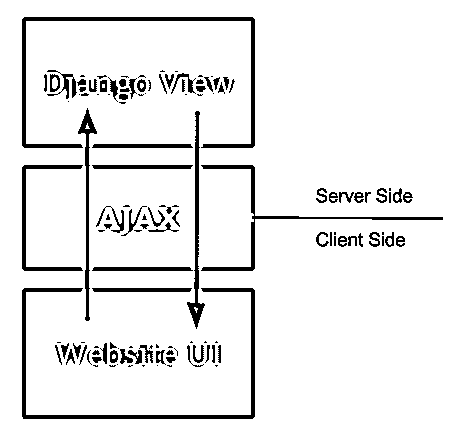
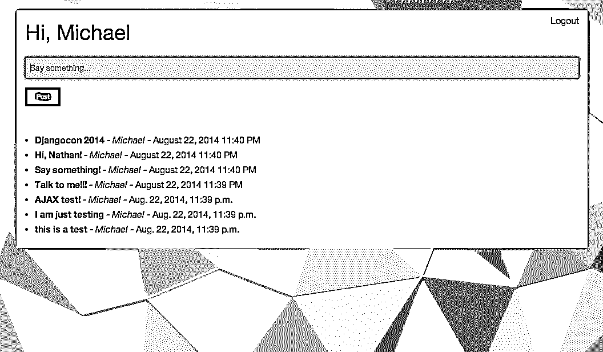

# Django 和 AJAX 表单提交——告别页面刷新

> 原文：<https://realpython.com/django-and-ajax-form-submissions/>

让我们言归正传:

1.  从 [repo](https://github.com/realpython/django-form-fun/tree/master/part1) 下载压缩的 pre-ajax Django 项目
2.  激活虚拟
3.  安装需求
4.  同步数据库
5.  启动服务器

登录后，测试表单。我们这里有一个*简单的*通信应用程序，只有创建权限。它看起来不错，但有一个恼人的问题:页面刷新。

我们如何摆脱它？或者，我们如何只更新网页的*部分*，而不必刷新整个*页面*？

输入 AJAX。AJAX 是一种客户端技术，用于向服务器端发出异步请求——即请求或提交数据——后续响应不会导致整个页面刷新。

[](https://files.realpython.com/media/django-forms-overview.62ed671f5ee5.png)

本教程假设您已经掌握了 Django 的工作知识以及一些 JavaScript/jQuery 的经验。您还应该熟悉基本的 HTTP 方法，尤其是 GET 和 POST。需要加快速度吗？得到[真正的巨蟒](https://realpython.com)。

**免费奖励:** [点击此处获取免费的 Django 学习资源指南(PDF)](#) ，该指南向您展示了构建 Python + Django web 应用程序时要避免的技巧和窍门以及常见的陷阱。

这是 Real Python 和强大的 Nathan Nichols 之间的合作作品，使用了一种我们称之为“敏捷博客”的合作方法。在推特上对内森说“嗨”: [@natsamnic](http://twitter.com/natsamnic) 。

## 使用保护

无论您是否使用 AJAX，表单都面临跨站点请求伪造(CSRF)攻击的风险。

> 在[编码恐怖](http://blog.codinghorror.com/preventing-csrf-and-xsrf-attacks/)博客上阅读更多关于 CSRF 攻击的内容。他们有一篇很棒的文章。

为了防止这种攻击，您必须将``模板标记添加到表单中，这将添加一个隐藏的输入字段，其中包含一个随每个 POST 请求一起发送的令牌。

如果你看一下 *talk/index.html* 模板，你可以看到我们已经包含了这个令牌。然而，当涉及到 AJAX 请求时，我们需要添加更多的代码，因为脚本是静态的，我们不能使用 [JavaScript](https://realpython.com/python-vs-javascript/) 对象传递令牌。

为了解决这个问题，我们需要创建一个自定义的头，其中包含监视我们的令牌。只需在这里抓取代码[并将其添加到 *main.js* 文件的末尾。是的，代码很多。我们可以一行一行地浏览，但这不是这篇文章的重点。请相信我们这是可行的。](https://github.com/realpython/django-form-fun/blob/master/part1/main.js)

继续前进…

[*Remove ads*](/account/join/)

## 处理事件

在接触 AJAX 代码之前，我们需要使用 jQuery 向 JavaScript 文件添加一个[事件处理程序](http://learn.jquery.com/events/handling-events/)。

> 请记住，jQuery 是 JavaScript。它只是一个 JavaScript 库，用于减少您需要编写的代码量。这是一个常见的困惑领域，所以在你阅读本教程的剩余部分时要注意这一点。

我们需要“处理”哪些事件？因为我们现在只是在创建一个帖子，所以我们只需要向 *main.js* 添加一个处理程序:

```py
// Submit post on submit $('#post-form').on('submit',  function(event){ event.preventDefault(); console.log("form submitted!")  // sanity check create_post(); });
```

这里，当用户提交表单时，这个函数触发，这-

1.  防止表单提交的[默认浏览器行为](http://www.w3schools.com/jquery/event_preventdefault.asp)，
2.  日志“表单已提交！”到控制台，然后
3.  调用一个名为`create_post()`的函数，AJAX 代码将驻留在这个函数中。

确保在*index.html*文件的表单上添加一个 id`post-form`:

```py
<form action="/create_post/" method="POST" id="post-form">
```

并在模板底部添加 JavaScript 文件的链接:

```py
<script src="static/scripts/main.js"></script>
```

测试一下。启动服务器，然后打开 JavaScript 控制台。提交表单时，您应该会看到以下内容:

```py
form submitted!
Uncaught ReferenceError: create_post is not defined
```

这正是我们应该看到的:表单提交得到了正确的处理，因为“表单已提交！”显示并调用`create_post`功能。现在我们只需要添加那个函数。

## 添加 AJAX

在添加实际的 AJAX 代码之前，让我们进行最后一次迭代。

### 更新 *main.js* :

添加`create_post`功能:

```py
// AJAX for posting function  create_post()  { console.log("create post is working!")  // sanity check console.log($('#post-text').val()) };
```

同样，我们运行了健全性检查以确保函数被正确调用，然后我们获取表单的输入值。为了正确工作，我们需要向表单字段添加一个 id:

[*Remove ads*](/account/join/)

### 更新 *forms.py* :*

```py
class PostForm(forms.ModelForm):
    class Meta:
        model = Post
        # exclude = ['author', 'updated', 'created', ]
        fields = ['text']
        widgets = {
            'text': forms.TextInput(attrs={
                'id': 'post-text', 
                'required': True, 
                'placeholder': 'Say something...'
            }),
        }
```

请注意，我们还向该字段添加了一个占位符，并使其与 id 一起成为必填项。我们可以向表单模板添加一些错误处理程序，或者简单地让 HTML5 来处理它。我们用后者吧。

再次测试。提交带有“测试”字样的表格。您应该会在控制台中看到以下内容:

```py
form submitted!
create post is working!
test
```

太好了。因此，我们已经确认我们正确地调用了`create_post()`函数，并获取了表单输入的值。现在让我们连接一些 AJAX 来提交 POST 请求。

### 更新 *main.js* :

```py
// AJAX for posting function  create_post()  { console.log("create post is working!")  // sanity check $.ajax({ url  :  "create_post/",  // the endpoint type  :  "POST",  // http method data  :  {  the_post  :  $('#post-text').val()  },  // data sent with the post request // handle a successful response success  :  function(json)  { $('#post-text').val('');  // remove the value from the input console.log(json);  // log the returned json to the console console.log("success");  // another sanity check }, // handle a non-successful response error  :  function(xhr,errmsg,err)  { $('#results').html("<div class='alert-box alert radius' data-alert>Oops! We have encountered an error: "+errmsg+ " <a href='#' class='close'>&times;</a></div>");  // add the error to the dom console.log(xhr.status  +  ": "  +  xhr.responseText);  // provide a bit more info about the error to the console } }); };
```

发生什么事了？嗯，我们将表单数据提交给`create_post/`端点，然后等待两个响应中的一个——要么成功，要么失败....遵循代码注释可以获得更详细的解释。

### 更新视图

现在，让我们更新视图以正确处理 POST 请求:

```py
def create_post(request):
    if request.method == 'POST':
        post_text = request.POST.get('the_post')
        response_data = {}

        post = Post(text=post_text, author=request.user)
        post.save()

        response_data['result'] = 'Create post successful!'
        response_data['postpk'] = post.pk
        response_data['text'] = post.text
        response_data['created'] = post.created.strftime('%B %d, %Y %I:%M %p')
        response_data['author'] = post.author.username

        return HttpResponse(
            json.dumps(response_data),
            content_type="application/json"
        )
    else:
        return HttpResponse(
            json.dumps({"nothing to see": "this isn't happening"}),
            content_type="application/json"
        )
```

在这里，我们获取文章文本和作者，并更新数据库。然后我们创建一个 response dict，将其序列化为 JSON，然后作为响应发送——它被记录到控制台的成功处理程序:`console.log(json)`中，正如您在上面的 JavaScript 文件中的`create_post()`函数中看到的。

[再次测试这个](https://realpython.com/python-testing/)。

您应该会在控制台中看到该对象:

```py
form submitted!
create post is working!
Object {text: "hey!", author: "michael", postpk: 15, result: "Create post successful!", created: "August 22, 2014 10:55 PM"}
success
```

我们[把 JSON](https://realpython.com/python-json/) 添加到 [DOM](http://en.wikipedia.org/wiki/Document_Object_Model) 怎么样！

## 更新 DOM

### 更新模板

只需在`<ul>`中添加一个“talk”id:

```py
<ul id="talk">
```

然后更新表单，以便添加错误:

```py
<form method="POST" id="post-form">
    
    <div class="fieldWrapper" id="the_post">
        {{ form.text }}
    </div>
    <div id="results"></div> <!-- errors go here -->
    <input type="submit" value="Post" class="tiny button">
</form>
```

[*Remove ads*](/account/join/)

### 更新*main . js*T2】

现在我们可以将 JSON 添加到新的“talk”id 所在的 DOM 中:

```py
success  :  function(json)  { $('#post-text').val('');  // remove the value from the input console.log(json);  // log the returned json to the console $("#talk").prepend("<li><strong>"+json.text+"</strong> - <em> "+json.author+"</em> - <span> "+json.created+"</span></li>"); console.log("success");  // another sanity check },
```

准备好看这个了吗？测试一下！

[](https://files.realpython.com/media/django-ajax-convo-screenshot.af5b4acdb742.png)

如果您想看看错误是什么样子，那么注释掉 *main.js* 中的所有 CSRF Javascript，然后尝试提交表单。

## 冲洗，重复

轮到你了。我们需要处理更多的事件。有了新发现的 jQuery 和 AJAX 知识，您就可以将它们放在适当的位置。我给最终的应用程序添加了代码——你可以在这里下载——其中包括一个删除链接。您只需要添加一个事件来处理点击，然后该事件调用一个函数，该函数使用 AJAX 向后端发送 POST 请求，以从数据库中删除帖子。按照我在本教程中的工作流程。我们下次会公布这个问题的答案。

如果你卡住了，不能调试错误，遵循这个工作流程-

1.  使用“谷歌优先”算法
2.  奋斗。旋转你的轮子。把代码放在一边。绕着街区跑。然后再回来。
3.  还是卡住了？请在下面评论，首先陈述问题，然后详细说明到目前为止你已经采取的解决问题的步骤

在寻求帮助之前，请务必自行*尝试*故障诊断。从长远来看，转动你的轮子，努力找到一个解决方案会让你受益。重要的是过程，而不是解决方案。这是将糟糕的开发人员与伟大的开发人员区分开来的一部分。祝你好运。

**点击查看解决方案[。](https://realpython.com/django-and-ajax-form-submissions-more-practice/)**

## 结论

你的应用看起来怎么样？准备好了吗？

**免费奖励:** [点击此处获取免费的 Django 学习资源指南(PDF)](#) ，该指南向您展示了构建 Python + Django web 应用程序时要避免的技巧和窍门以及常见的陷阱。

1.  AJAX 是昨天*所以*。使用 AngularJS，我们可以用更少的代码做更多的事情。
2.  在大多数情况下，将客户端 JavaScript(无论是 AJAX、Angular 还是其他框架)与服务器端 RESTful API 结合起来是一种标准。
3.  测试在哪里？

接下来你想看什么？下面评论。干杯！

编码快乐！

[链接到回购](https://github.com/realpython/django-form-fun)。***