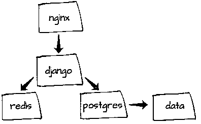
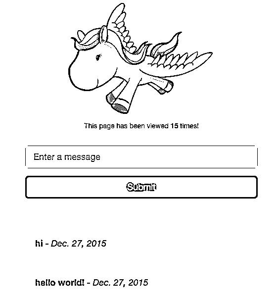

# 用 Docker Compose 和 Machine 开发 Django

> 原文：<https://realpython.com/django-development-with-docker-compose-and-machine/>

Docker 是一个容器化工具，用于构建隔离的、可复制的应用环境。**这篇文章详细介绍了如何将 Django 项目、Postgres 和 Redis 封装起来用于本地开发，以及如何通过 [Docker Compose](https://docs.docker.com/compose/) 和 [Docker Machine](http://docs.docker.com/machine/) 将栈交付到云。**

**免费奖励:** ，您可以使用它作为自己 Python 应用程序的基础。

最后，堆栈将为每个服务包含一个单独的容器:

*   1 个 web/Django 容器
*   1 个 nginx 容器
*   1 个 Postgres 容器
*   1 个集装箱
*   1 个数据容器

[](https://files.realpython.com/media/container-stack.7f10bfae1be8.png)

**更新:**

*   *04/01/2019* :更新至 Docker 最新版本——Docker client(v 18 . 09 . 2)、Docker compose (v1.23.2)、Docker Machine(v 0 . 16 . 1)——以及 Python (v3.7.3)。感谢[弗洛里安·戴利茨](https://github.com/DahlitzFlorian)！
*   *04/18/2016* :向 Postgres 和 Redis 容器添加了命名数据卷。
*   *04/13/2016* :增加了 Docker 工具箱，也更新到了 Docker - Docker client (v1.10.3)、Docker compose (v1.6.2)、Docker Machine (v0.6.0)的最新版本
*   *12/27/2015* :更新到 Docker 的最新版本——Docker client(v 1 . 9 . 1)、Docker compose (v1.5.2)、Docker Machine(v 0 . 5 . 4)——以及 Python (v3.5)

> 有兴趣为 Flask 创建一个类似的环境吗？查看[这篇](https://realpython.com/dockerizing-flask-with-compose-and-machine-from-localhost-to-the-cloud/)博客文章。

## 本地设置

与 Docker (v18.09.2)一起，我们将使用-

*   *[Docker Compose](https://docs.docker.com/compose/)*(v 1 . 23 . 2)用于将多容器应用编排到单个应用中，以及
*   *[Docker Machine](https://docs.docker.com/machine/)*(v 0 . 16 . 1)用于在本地和云中创建 Docker 主机。

如果你运行的是旧的 Mac OS X 或 Windows 版本，那么下载并安装 [Docker 工具箱](https://www.docker.com/docker-toolbox)来获得所有必要的工具。否则，请按照这里的[和这里的](https://docs.docker.com/compose/install/)[分别安装 Docker Compose 和 Machine。](https://docs.docker.com/machine/install-machine/)

完成后，测试安装:

```py
$ docker-machine version
docker-machine version 0.16.1, build cce350d7
$ docker-compose version
docker-compose version 1.23.2, build 1110ad01
CPython version: 3.7.3
```

接下来，从[存储库](https://github.com/realpython/dockerizing-django)克隆项目，或者基于 repo 上的项目结构创建您自己的项目:

```py
├── docker-compose.yml
├── nginx
│   ├── Dockerfile
│   └── sites-enabled
│       └── django_project
├── production.yml
└── web
    ├── Dockerfile
    ├── docker_django
    │   ├── __init__.py
    │   ├── apps
    │   │   ├── __init__.py
    │   │   └── todo
    │   │       ├── __init__.py
    │   │       ├── admin.py
    │   │       ├── models.py
    │   │       ├── templates
    │   │       │   ├── _base.html
    │   │       │   └── home.html
    │   │       ├── tests.py
    │   │       ├── urls.py
    │   │       └── views.py
    │   ├── settings.py
    │   ├── urls.py
    │   └── wsgi.py
    ├── manage.py
    ├── requirements.txt
    └── static
        └── main.css
```

我们现在准备好让容器启动并运行…

[*Remove ads*](/account/join/)

## 对接机

要启动 Docker Machine，只需导航到项目根目录，然后运行:

```py
$ docker-machine create -d virtualbox dev;
Running pre-create checks...
Creating machine...
(dev) Creating VirtualBox VM...
(dev) Creating SSH key...
(dev) Starting the VM...
(dev) Check network to re-create if needed...
(dev) Waiting for an IP...
Waiting for machine to be running, this may take a few minutes...
Detecting operating system of created instance...
Waiting for SSH to be available...
Detecting the provisioner...
Provisioning with boot2docker...
Copying certs to the local machine directory...
Copying certs to the remote machine...
Setting Docker configuration on the remote daemon...
Checking connection to Docker...
Docker is up and running!
To see how to connect your Docker Client to the Docker Engine
running on this virtual machine, run: docker-machine env dev
```

`create`命令为 Docker 开发建立了一个新的“机器”(名为 *dev* )。本质上，它启动了一个运行 Docker 客户端的虚拟机。现在只要将 Docker 指向 *dev* 机器:

```py
$ eval $(docker-machine env dev)
```

运行以下命令查看当前正在运行的计算机:

```py
$ docker-machine ls
NAME   ACTIVE   DRIVER       STATE     URL                         SWARM   DOCKER     ERRORS
dev    -        virtualbox   Running   tcp://192.168.99.100:2376           v18.09.3
```

接下来，让我们用 Docker Compose 启动容器，启动并运行 Django、Postgres 和 Redis。

## 坞站组成〔t0〕

我们来看看 *docker-compose.yml* 文件:

```py
version:  '3' services: web: restart:  always build:  ./web expose: -  "8000" links: -  postgres:postgres -  redis:redis volumes: -  web-django:/usr/src/app -  web-static:/usr/src/app/static env_file:  .env environment: DEBUG:  'true' command:  /usr/local/bin/gunicorn docker_django.wsgi:application -w 2 -b :8000 nginx: restart:  always build:  ./nginx/ ports: -  "80:80" volumes: -  web-static:/www/static links: -  web:web postgres: restart:  always image:  postgres:latest ports: -  "5432:5432" volumes: -  pgdata:/var/lib/postgresql/data/ redis: restart:  always image:  redis:latest ports: -  "6379:6379" volumes: -  redisdata:/data volumes: web-django: web-static: pgdata: redisdata:
```

这里，我们定义了四个服务- *web* 、 *nginx* 、 *postgres* 和 *redis* 。

1.  首先， *web* 服务是通过“web”目录下的 *Dockerfile* 中的指令构建的——在这里设置 Python 环境，安装需求，并在端口 8000 上启动 Django 应用程序。该端口然后被转发到主机环境(例如对接机)上的端口 80。该服务还将在*中定义的环境变量添加到容器中。env* 文件。
2.  nginx 服务用于反向代理，将请求转发到 Django 或静态文件目录。
3.  接下来，从来自 [Docker Hub](https://hub.docker.com/) 的官方 [PostgreSQL 映像](https://registry.hub.docker.com/_/postgres/)构建 *postgres* 服务，Docker Hub 安装 postgres 并在默认端口 5432 上运行服务器。注意到[数据量](https://docs.docker.com/storage/volumes/)了吗？这有助于确保即使 Postgres 容器被删除，数据仍然存在。
4.  同样， *redis* 服务使用官方的 [redis 镜像](https://registry.hub.docker.com/u/library/redis/)来安装 Redis，然后在端口 6379 上运行服务。

现在，要让容器运行，构建映像，然后启动服务:

```py
$ docker-compose build
$ docker-compose up -d
```

**提示:**您甚至可以在一个单独的命令中运行以上命令:

```py
$ docker-compose up --build -d
```

拿杯咖啡。或者去做一次*长*的散步。第一次运行时，这需要一段时间。由于 Docker [缓存了第一次构建的结果](https://docs.docker.com/develop/develop-images/dockerfile_best-practices/#leverage-build-cache)，后续的构建会运行得更快。

一旦服务开始运行，我们需要[创建数据库迁移](https://realpython.com/django-migrations-a-primer/):

```py
$ docker-compose run web /usr/local/bin/python manage.py migrate
```

获取与 Docker Machine - `docker-machine ip dev` -相关联的 IP，然后在浏览器中导航到该 IP:

[](https://files.realpython.com/media/django-on-docker.dac50546c256.png)

不错！

试试提神。您应该会看到计数器更新。本质上，我们使用 [Redis INCR](http://redis.io/commands/incr) 在每个处理的请求后递增。查看*网站/docker _ django/apps/todo/views . py*中的代码了解更多信息。

这又创建了四个服务，它们都运行在不同的容器中:

```py
$ docker-compose ps
 Name                           Command               State           Ports 
-----------------------------------------------------------------------------------------------
dockerizing-django_nginx_1      /usr/sbin/nginx                  Up      0.0.0.0:80->80/tcp 
dockerizing-django_postgres_1   docker-entrypoint.sh postgres    Up      0.0.0.0:5432->5432/tcp
dockerizing-django_redis_1      docker-entrypoint.sh redis ...   Up      0.0.0.0:6379->6379/tcp
dockerizing-django_web_1        /usr/local/bin/gunicorn do ...   Up      8000/tcp
```

要查看哪些环境变量可用于 *web* 服务，请运行:

```py
$ docker-compose run web env
```

要查看日志:

```py
$ docker-compose logs
```

您还可以进入 Postgres Shell——因为我们在 *docker-compose.yml* 文件中将端口转发到主机环境——通过以下方式添加用户/角色以及数据库:

```py
$ docker-compose run postgres psql -h 192.168.99.100 -p 5432 -U postgres --password
```

准备部署了吗？通过`docker-compose down`停止进程，让我们把应用程序放到云中！

[*Remove ads*](/account/join/)

## 部署

因此，随着我们的应用程序在本地运行，我们现在可以将这个完全相同的环境推送给一个拥有 Docker Machine 的云托管提供商。让我们部署到一个[数字海洋](https://www.digitalocean.com/?refcode=d8f211a4b4c2)盒子。

**注意:**如果你想采用不同的方法来部署你的 Django 应用程序，可以查看一下关于使用 Gunicorn 和 Nginx 的真实 Python 的[教程](https://realpython.com/django-nginx-gunicorn/)或[视频课程](https://realpython.com/courses/django-app-with-gunicorn-nginx/)。

在您[注册了数字海洋的](https://www.digitalocean.com/?refcode=d8f211a4b4c2)之后，生成一个[个人访问令牌](https://www.digitalocean.com/community/tutorials/how-to-use-the-digitalocean-api-v2)，然后运行以下命令:

```py
$ docker-machine create \
-d digitalocean \
--digitalocean-access-token ADD_YOUR_TOKEN_HERE \
production
```

这将需要几分钟的时间来供应 droplet 并设置一个名为 *production* 的新 Docker 机器:

```py
Running pre-create checks...
Creating machine...
(production) Creating SSH key...
(production) Creating Digital Ocean droplet...
(production) Waiting for IP address to be assigned to the Droplet...
Waiting for machine to be running, this may take a few minutes...
Machine is running, waiting for SSH to be available...
Detecting operating system of created instance...
Detecting the provisioner...
Provisioning with ubuntu(systemd)...
Installing Docker...
Copying certs to the local machine directory...
Copying certs to the remote machine...
Setting Docker configuration on the remote daemon...
Checking connection to Docker...
Docker is up and running!
To see how to connect Docker to this machine, run: docker-machine env production
```

现在我们有两台机器在运行，一台在本地，一台在数字海洋上:

```py
$ docker-machine ls
NAME         ACTIVE   DRIVER         STATE     URL                         SWARM   DOCKER    ERRORS
dev          -        virtualbox     Running   tcp://192.168.99.100:2376           v18.09.3
production   -        digitalocean   Running   tcp://45.55.35.188:2376             v18.09.3
```

将 *production* 设置为活动机器，并将 Docker 环境加载到 shell 中:

```py
$ eval "$(docker-machine env production)"
```

最后，让我们在云端再次构建 Django 应用程序。这一次我们需要使用一个稍微不同的 Docker 合成文件，它不在容器中挂载一个[卷](https://docs.docker.com/userguide/dockervolumes/#mount-a-host-directory-as-a-data-volume)。为什么？这个卷非常适合本地开发，因为我们可以在“web”目录中更新我们的本地代码，并且更改会立即在容器中生效。在生产中，显然不需要这样。

```py
$ docker-compose build
$ docker-compose -f production.yml up -d
$ docker-compose run web /usr/local/bin/python manage.py migrate
```

> 您是否注意到我们是如何为生产指定不同的配置文件的？如果您还想运行 [collectstatic](https://docs.djangoproject.com/en/2.1/ref/contrib/staticfiles/#collectstatic) 呢？见本[刊](https://github.com/realpython/dockerizing-django/issues/13)。

获取与该数字海洋帐户相关的 IP 地址，并在浏览器中查看。如果一切顺利，您应该看到您的应用程序正在运行，这是应该的。

## 结论

*   从[回购](https://github.com/realpython/dockerizing-django)里抢代码(也星它……我的自尊就靠它了！).
*   带着问题在下面评论。
*   需要挑战吗？尝试使用[扩展](https://docs.docker.com/compose/extends/)来清理两个 Docker Compose 配置文件中的重复代码。保持干燥！
*   祝您愉快！

**免费奖励:** [点击此处获取免费的 Django 学习资源指南(PDF)](#) ，该指南向您展示了构建 Python + Django web 应用程序时要避免的技巧和窍门以及常见的陷阱。**