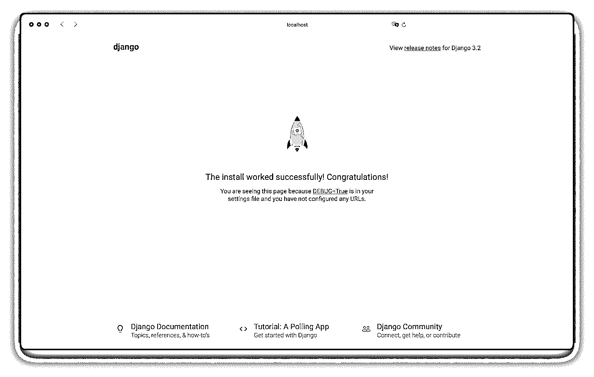
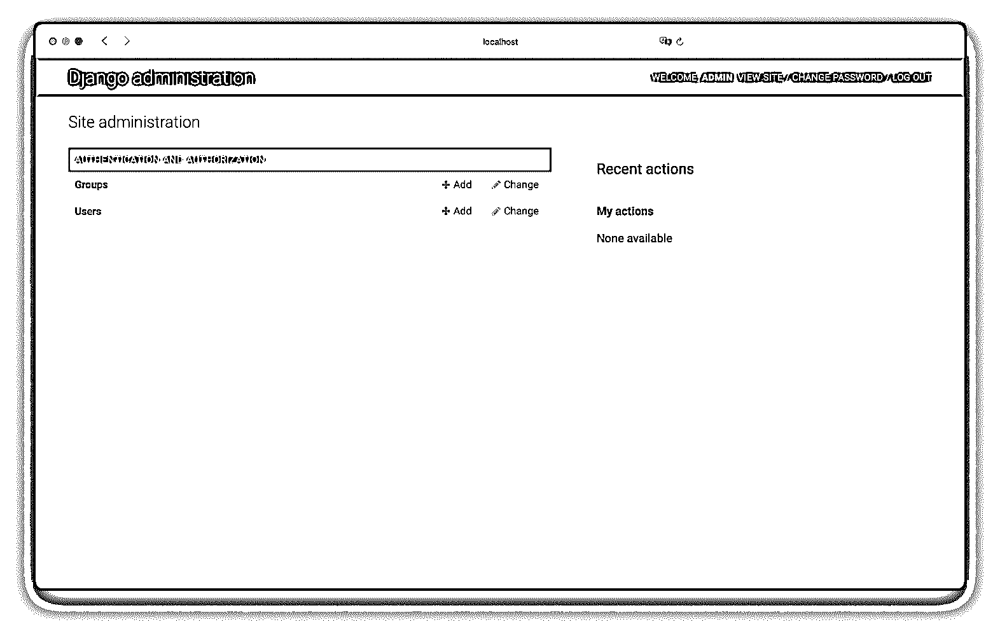
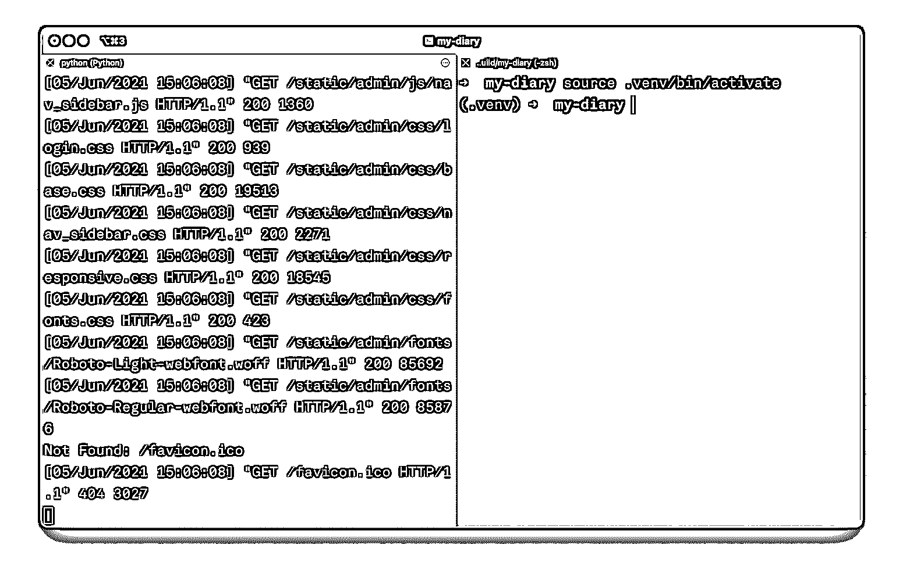
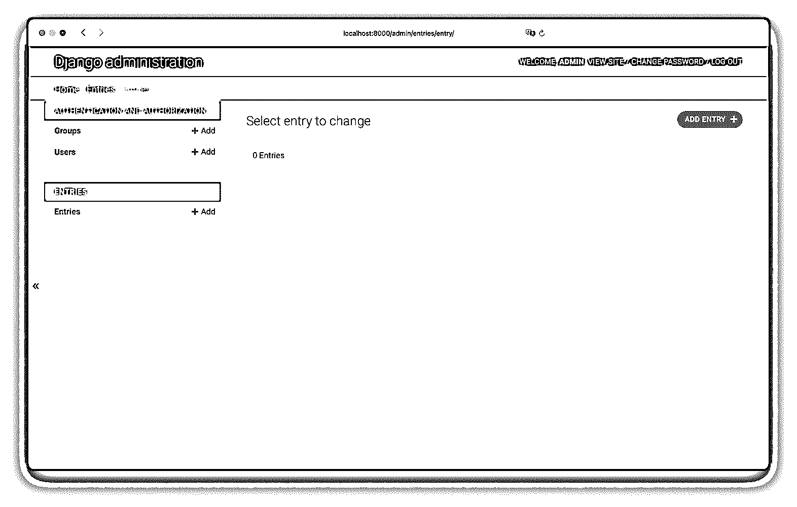
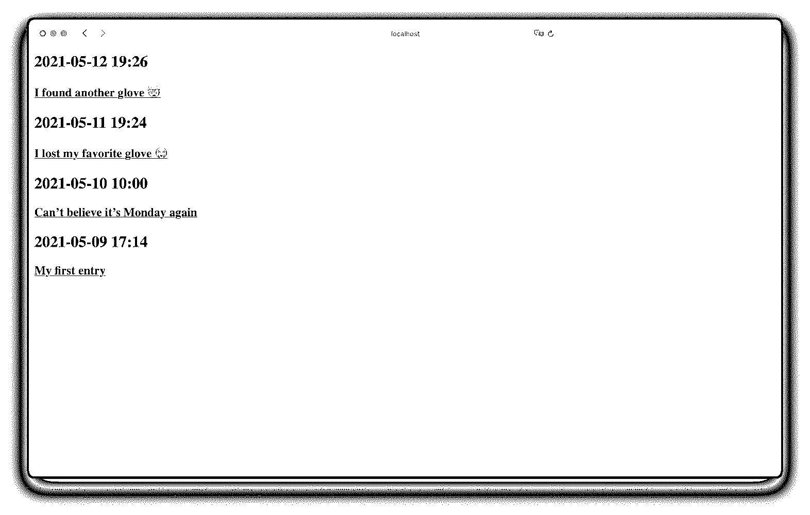
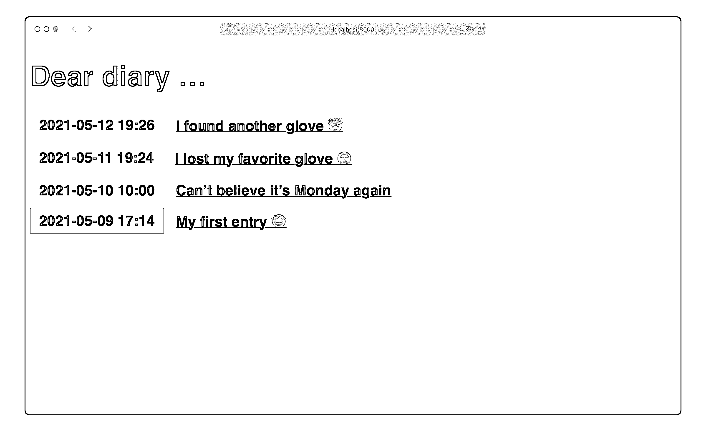
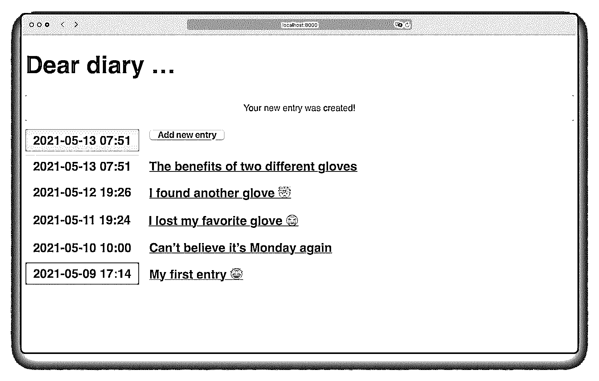
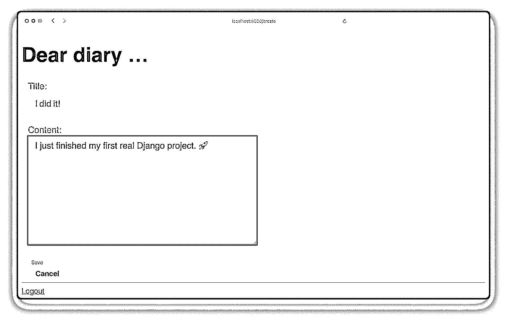

# 用 Django 和 Python 创建个人日记

> 原文：<https://realpython.com/django-diary-project-python/>

一个**日记**是个人的安全空间。在 Django 的帮助下，你可以在自己的电脑上创建日记，而无需将数据存储在别人的云中。通过跟随下面的项目，你将会看到在 Django 中没有任何外部依赖的情况下，你可以多快地构建一个有效的 **web 应用**。

**在本教程中，您将学习如何:**

*   建立一个 Django 项目
*   使用标准的 **SQLite** 数据库
*   利用 Django **管理站点**
*   创建**模型**和**基于类的视图**
*   嵌套和样式**模板**
*   通过**认证**保护您的日记

本教程将引导你**一步一步**地完成你的最终日记。如果你刚刚开始使用 Django，并且想要完成你的第一个真正的项目，那么这个教程就是为你准备的！

要获得 Django 项目及其步骤的完整源代码，请单击下面的链接:

**获取源代码:** [点击此处获取源代码，您将在本教程中使用](https://realpython.com/bonus/django-diary-project-code/)用 Django 和 Python 构建一个个人日记 web 应用程序。

## 演示视频

在你日记的主页上，你会有一个条目列表。你可以滚动浏览它们，并点击一个按钮来创建新的。本教程提供了样式，因此您可以专注于代码的 Django 部分。这里有一个快速演示视频，展示了它的实际效果:

[https://player.vimeo.com/video/561429980?background=1](https://player.vimeo.com/video/561429980?background=1)

本教程结束时，你将能够完美地浏览你的日记，按需创建、阅读、更新和删除条目。

[*Remove ads*](/account/join/)

## 项目概述

本教程分为多个步骤。这样，你可以休息一下，然后按照自己的节奏继续。在每一步中，你将处理日记项目的一个特定领域:

1.  建立你的 Django 日记项目
2.  在后端创建条目
3.  在前端显示条目
4.  添加样式
5.  管理前端的条目
6.  改善您的用户体验
7.  实施身份验证

通过跟随，您将探索 web 应用程序的基础，以及如何添加 Django 项目的通用特性。完成教程后，你将创建自己的个人日记应用程序，并拥有一个 **Django 项目蓝图**作为基础。

## 先决条件

你不需要任何 Django 的知识来完成这个项目。如果您想进一步了解本教程中遇到的主题，可以找到相关资源的链接。

然而，你应该能熟练使用命令行，并具备 Python 的[基础知识](https://realpython.com/products/python-basics-book/)和[类](https://realpython.com/python3-object-oriented-programming/)。尽管了解[虚拟环境](https://realpython.com/python-virtual-environments-a-primer/)和 [`pip`](https://realpython.com/what-is-pip/) 会有所帮助，但你将在学习教程的过程中学习如何设置一切。

## 步骤 1:建立你的 Django 日记

通过创建您的项目目录并设置一个**虚拟环境**来启动项目。此设置将使您的代码与计算机上的任何其他项目隔离开来。您可以随意命名项目文件夹和虚拟环境。在本教程中，项目文件夹名为`my-diary`，虚拟环境名为`.venv`:

```py
$ mkdir my-diary
$ cd my-diary
$ python3 -m venv .venv
$ source .venv/bin/activate
```

现在，您的提示以括号中的虚拟环境名称开始。这是虚拟环境被激活的指示符。对于本教程的其余部分，您的虚拟环境必须被激活。以下所有步骤都将发生在该目录或其子目录中。

**注意:**要在 **Windows** 上激活您的虚拟环境，您可能需要运行以下命令:

```py
c:\> python -m venv .venv
c:\> .venv\Scripts\activate.bat
```

对于其他平台和 shells，您可能需要使用不同的命令。

你的日记的另一个要求是 Django 本身。用`pip`安装本教程的具体版本:

```py
(.venv) $ python -m pip install Django==3.2.1
```

这个命令安装 Django 和 Django 需要的一些依赖项。这就是你需要的一切。

### 初始化 Django

所有的需求都已就绪，是时候开始 Django 项目本身了。使用 Django 的**命令行实用程序**来创建基础项目结构:

```py
(.venv) $ django-admin startproject diary .
```

不要忘记在上面的命令末尾添加点(`.`)。圆点防止 Django 为您的日记项目创建另一个目录。

Django 刚刚创建了一个`manage.py`文件和一个包含五个文件的名为`diary`的文件夹。你不必明白他们具体做什么。如果你好奇，你可以看一下这些文件。它们都在开头包含一个解释，描述它们为什么存在。在本教程中，您只需要编辑其中的两个:

| 文件 | 教程时编辑的？ |
| --- | --- |
| `manage.py` | -好的 |
| `diary/__init__.py` | -好的 |
| `diary/asgi.py` | -好的 |
| `diary/settings.py` | 981 号房 |
| `diary/urls.py` | 981 号房 |
| `diary/wsgi.py` | -好的 |

从现在开始，`manage.py`文件将在命令行中接管[的管理任务](https://docs.djangoproject.com/en/3.2/ref/django-admin/#available-commands)。在本教程中，您将会遇到其中的一些人。

[*Remove ads*](/account/join/)

### 创建数据库

现在你的 Django 日记项目的基础已经准备好了，你需要一个地方来存储你日记的未来内容。为此，必须创建一个**数据库**。

Django 附带了对多数据库的支持，如果没有提供其他数据库配置，默认情况下，它使用一个 T2 SQLite 数据库。一个 [SQLite](https://sqlite.org/index.html) 数据库是您所需要的，因为您是唯一连接到它的用户，并且您的 Django 日记项目将只在本地运行。

最棒的是，您可以用一个命令创建一个 SQLite 数据库。通过运行[迁移](https://realpython.com/django-migrations-a-primer/)，您将**数据库模式**的更改应用到数据库中:

```py
(.venv) $ python manage.py migrate
```

当您查看项目目录时，应该会看到一个`db.sqlite3`文件。拍拍自己的肩膀:你刚刚创建了一个数据库！

要将项目的当前状态与本教程的可下载文件进行比较，请单击下面的链接:

**获取源代码:** [点击此处获取源代码，您将在本教程中使用](https://realpython.com/bonus/django-diary-project-code/)用 Django 和 Python 构建一个个人日记 web 应用程序。

与本节相关的文件在`source_code_step_1/`目录下。

### 成为超级用户

作为你个人日记的主人，你已经为自己赢得了`superuser`的角色。使用以下命令声明它:

```py
(.venv) $ python manage.py createsuperuser
Username (leave blank to use 'root'): admin
Email address: admin@example.com
Password: RealPyth0n
Password (again): RealPyth0n
Superuser created successfully.
```

系统会提示您选择用户名，提供电子邮件地址，并设置密码。这是你日记的关键，所以一定要记住。

### 运行开发网络服务器

您将经常使用的另一个命令是`runserver`。这个命令运行一个轻量级的**开发 web 服务器**:

```py
(.venv) $ python manage.py runserver
```

您可以指定 [IP 地址](https://realpython.com/python-ipaddress-module/)和 [`runserver`](https://docs.djangoproject.com/en/3.2/ref/django-admin/#runserver) 端口。默认情况下，服务器运行在`127.0.0.1`的端口`8000`上，并且只能在你的电脑上访问。随着服务器的运行，您可以使用`http://127.0.0.1:8000`或`http://localhost:8000`在浏览器中访问您的 Django 项目:

[](https://files.realpython.com/media/django-diary-01-rocket.dd40ae36b369.png)

这是你日记的主页。到目前为止，只有一个火箭可以看到。这意味着安装成功。

**重要提示:**每次在浏览器中访问您的日记项目时，如果您的本地开发 web 服务器尚未运行，您必须首先启动它。

通过访问`http://localhost:8000/admin`并使用您的凭证登录，完成本教程的第一步:

[](https://files.realpython.com/media/django-diary-01-admin-start.155a8f6be9f6.png)

这是你自己的 Django 管理网站！这是姜戈[最强大的特色](https://docs.djangoproject.com/en/3.1/ref/contrib/admin/)之一。只需进行一些调整，它就能让您立即管理内容和用户。目前，在 Django 管理站点上没有太多东西可看。是时候改变了！

[*Remove ads*](/account/join/)

## 第二步:将你的日记添加到后端

Django 项目包含一个或多个应用程序。一个 app 的范围应该是有限的。一开始，区分一个[项目和应用](https://docs.djangoproject.com/en/3.2/ref/applications/)可能会令人困惑。但是在大的 Django 项目中，这种关注点的分离保持了代码库的干净。这种结构的另一个好处是你可以[重用其他项目的应用](https://realpython.com/installable-django-app/)。

### 连接参赛作品 App

在您的终端中，Django 开发 web 服务器可能仍在运行。在终端按下 `Ctrl` + `C` 停止。

**提示:**打开第二个终端窗口，[在一个窗口控制服务器](https://docs.djangoproject.com/en/3.2/ref/django-admin/#runserver)，在另一个窗口运行命令:

[](https://files.realpython.com/media/django-diary-02-terminal.23c1119d2a92.png)

导航到项目并激活虚拟环境后，您可以在第二个终端窗口中运行该项目的后续命令。

在本教程中，您只需要一个额外的应用程序。那个应用的主要目的是处理你的日记条目，所以让我们称这个应用为`entries`。运行命令创建`entries`应用程序:

```py
(.venv) $ python manage.py startapp entries
```

该命令在您的项目中创建一个包含一些预定义文件的`entries`文件夹。在本教程的后面部分，您只需要编辑其中的三个:

| 文件 | 教程时编辑的？ |
| --- | --- |
| `entries/__init__.py` | -好的 |
| `entries/admin.py` | 981 号房 |
| `entries/apps.py` | -好的 |
| `entries/models.py` | 981 号房 |
| `entries/tests.py` | -好的 |
| `entries/views.py` | 981 号房 |

如您所见，其中一些与`diary/`目录中的文件同名。通过点击下面的链接，您可以将您的文件夹结构与`source_code_step_2/`目录中的文件夹结构进行比较:

**获取源代码:** [点击此处获取源代码，您将在本教程中使用](https://realpython.com/bonus/django-diary-project-code/)用 Django 和 Python 构建一个个人日记 web 应用程序。

到目前为止，Django 还不知道你刚刚创建的应用程序。要将`entries`应用程序连接到 Django diary 项目，请在`diary/settings.py`的`INSTALLED_APPS`列表的开头添加**配置类**的路径:

```py
# diary/settings.py

INSTALLED_APPS = [
 "entries.apps.EntriesConfig",  "django.contrib.admin",
  "django.contrib.auth",
  "django.contrib.contenttypes",
  "django.contrib.sessions",
  "django.contrib.messages",
  "django.contrib.staticfiles",
]
```

现在,`entries`应用程序被插入到了`diary`项目中，Django 找到了它的配置。其中一个配置是**模型**，它描述了你的日记条目在数据库中的样子。

### 创建参赛作品模型

您已经创建了数据库。现在是时候定义**数据库表**了，你的日记条目将被存储在那里。在 Django，你可以用一个[模型班](https://docs.djangoproject.com/en/3.2/topics/db/models/)来做这件事。就像 Python 中的常规类一样，模型名应该是单数和大写。你的应用叫做`entries`，你的模型叫做`Entry`。

`Entry`模型的字段是日记条目将拥有的元素。在前面，这些字段将显示为一个表单。在后面，它们将是您的`Entry`数据库表的列。本教程中的日记条目包含三个字段:

1.  **`title`** 是标题。
2.  **`content`** 是正文的主体。
3.  **`date_created`** 是创作日期和时间。

在`entries/models.py`中，首先[从`django.utils`进口](https://realpython.com/python-import/)和`timezone`。然后在同一个文件中创建`Entry`类，如下所示:

```py
 1# entries/models.py
 2
 3from django.db import models
 4from django.utils import timezone
 5
 6class Entry(models.Model):
 7    title = models.CharField(max_length=200)
 8    content = models.TextField()
 9    date_created = models.DateTimeField(default=timezone.now)
10
11    def __str__(self):
12        return self.title
13
14    class Meta:
15        verbose_name_plural = "Entries"
```

通过导入`timezone`模块，您可以使用`timezone.now`作为第 9 行中`date_created`的`default`参数。这样，如果在创建条目时没有为当前日期和时间定义特定的值，则默认情况下将使用当前日期和时间。稍后在为日记条目创建表单时，您将利用这一行为。

除了`title`、`content`、`date_created`之外，Django 还会自动添加`id`作为**唯一主键**。默认情况下，主键为`1`的条目的[字符串表示](https://realpython.com/operator-function-overloading/#printing-your-objects-prettily-using-str)为`Entry object (1)`。当您添加`.__str__()`时，您可以自定义显示的内容。对于日记条目，标题是更好的字符串表示。

你要调整的另一个变量是`verbose_name_plural`。否则，Django 会把你的`Entry`的复数拼写成`Entrys`，而不是`Entries`。

[*Remove ads*](/account/join/)

### 注册进入模型

要在 Django 管理站点中查看`Entry`模型，您需要在`entries/admin.py`中注册它:

```py
# entries/admin.py

from django.contrib import admin
from .models import Entry

admin.site.register(Entry)
```

当你忘记在管理站点注册一个模型时，Django 不会抛出错误。毕竟，不是每个模型都需要在用户界面中管理。但是对于您的日记的最小可行产品，您将利用内置的 Django 管理站点。

### 迁移入口模型

添加新类并在管理站点上注册后，您需要为 Django 创建[迁移文件](https://realpython.com/django-migrations-a-primer/)并运行它们。使用`makemigrations`，您可以创建迁移文件，其中包含 Django 构建数据库的指令。使用`migrate`，您可以实现它们:

```py
(.venv) $ python manage.py makemigrations
(.venv) $ python manage.py migrate
```

迁移完成后，运行开发 web 服务器，转到浏览器，访问 Django 管理站点`http://localhost:8000/admin`:

[](https://files.realpython.com/media/django-diary-02-admin-without-entries.39eb2adf6286.png)

目前，没有列出任何条目。点击*添加条目*，为您的日记创建至少一个条目，完成此步骤。不确定写什么？也许可以反思一下，你的 Django 日记项目有一个**全功能后端**是多么的棒！

## 第三步:在前端显示你的日记条目

现在，您可以在 Django 管理站点中添加新条目了。但是当你在浏览器中访问你的日记的主页时，它仍然显示着抖动的火箭。在这一步，你将学习如何在前端显示你的日记条目。

如果您想看看代码在这一步结束时的样子，请单击下面的链接:

**获取源代码:** [点击此处获取源代码，您将在本教程中使用](https://realpython.com/bonus/django-diary-project-code/)用 Django 和 Python 构建一个个人日记 web 应用程序。

与此步骤相关的文件在`source_code_step_3/`目录中。

### 创建列表和详细视图

Django 中有两种视图:**基于函数的视图**和**基于类的视图**。两者都接受 web 请求并返回 web 响应。一般来说，基于函数的视图给你更多的控制，但也有更多的工作。基于类的视图给你更少的控制，但也更少的工作。

工作少听起来不错。但这并不是你在日记中使用基于类的视图的唯一原因。您的 Django 日记将使用 web 应用程序的典型视图，比如显示数据库项目列表或它们的详细信息。这就是为什么基于类的视图是你的日记视图的好选择。

Django 提供了许多开箱即用的[通用视图](https://docs.djangoproject.com/en/3.2/ref/class-based-views/)。在这种情况下，您将创建 [`DetailView`](https://docs.djangoproject.com/en/3.2/ref/class-based-views/generic-display/#detailview) 和 [`ListView`](https://docs.djangoproject.com/en/3.2/ref/class-based-views/generic-display/#listview) 的**子类，并将它们连接到`entries/views.py`中的`Entry`模型:**

```py
 1# entries/views.py
 2
 3from django.views.generic import (
 4    ListView,
 5    DetailView,
 6)
 7
 8from .models import Entry
 9
10class EntryListView(ListView):
11    model = Entry
12    queryset = Entry.objects.all().order_by("-date_created")
13
14class EntryDetailView(DetailView):
15    model = Entry
```

正如所承诺的，现在没有太多的代码需要您编写。第 12 行的查询`Entry.objects.all()`将返回按主键排序的所有条目。用`.order_by("-date_created")`增强它将按升序返回你的条目，最新的条目在列表的顶部。

当你编写这样的视图时，Django 会在后台做出假设，比如视图要渲染的**模板**的名称和位置。

[*Remove ads*](/account/join/)

### 创建您的模板

有了[模板](https://docs.djangoproject.com/en/3.2/topics/templates/)，就可以动态生成 [HTML](https://realpython.com/html-css-python/#create-your-first-html-file) 。Django 希望您刚刚创建的基于类的视图的模板以特定的名称位于特定的位置。为模板创建子文件夹:

```py
(.venv) $ mkdir -p entries/templates/entries
```

当然，模板的路径看起来有点奇怪。但是这种方式可以确保 Django 找到完全正确的模板，即使其他应用程序共享相同的模型名称。在`entries/templates/entries/`中，您将存储`Entry`模型的所有模板文件。首先创建`entry_list.html`并添加以下内容:

```py
 1<!-- entries/templates/entries/entry_list.html -->
 2
 3
 4    <article>
 5        <h2 class="{{ entry.date_created|date:'l' }}">
 6            {{ entry.date_created|date:'Y-m-d H:i' }}
 7        </h2>
 8        <h3>
 9            <a href="">
10                {{ entry.title }}
11            </a>
12        </h3>
13    </article>
14
```

在 Django 模板中，你甚至可以动态引用 [CSS](https://realpython.com/html-css-python/#style-your-content-with-css) 类。当你看一看第 5 行的`<h2>`时，你可以看到`class="{{ entry.date_created|date:'l' }}"`被添加到其中。这显示了带有特殊格式的[时间戳。这样，`<h2>`元素将星期几作为一个类，您可以稍后在 CSS 中给每个星期几一个独特的颜色。](https://docs.djangoproject.com/en/dev/ref/templates/builtins/#date)

在`entry_list`循环中，您可以访问`Entry`模型的字段。为了避免过多的信息使列表混乱，您只需在访问条目的详细信息页面时显示内容。在`entries/templates/entries/`中以`entry_detail.html`为文件名创建此详细页面，并添加以下内容:

```py
<!-- entries/templates/entries/entry_detail.html -->

<article>
    <h2>{{ entry.date_created|date:'Y-m-d H:i' }}</h2>
    <h3>{{ entry.title }}</h3>
    <p>{{ entry.content }}</p>
</article>
```

一个`detail`模板只需要一个条目对象。这就是为什么你可以在这里直接访问它而不用循环。

### 将路线添加到您的视图中

要查看模板的运行情况，您需要将您的视图连接到**URL**。Django 使用一个`urls.py`文件在浏览器中发送来自用户的请求。类似这样的文件已经存在于`diary`项目文件夹中。对于 entries 应用程序，您必须首先在`entries/urls.py`创建它，并添加到`EntryListView`和`EntryDetailView`的路径:

```py
 1# entries/urls.py
 2
 3from django.urls import path
 4
 5from . import views
 6
 7urlpatterns = [
 8    path(
 9        "",
10        views.EntryListView.as_view(),
11        name="entry-list"
12    ),
13    path(
14        "entry/<int:pk>",
15        views.EntryDetailView.as_view(),
16        name="entry-detail"
17    ),
18]
```

第 8 行和第 13 行的 [`path()`函数](https://docs.djangoproject.com/en/3.2/ref/urls/#path)必须至少有两个参数:

1.  一个**路由**字符串模式，其中包含一个 URL 模式
2.  对一个**视图**的引用，它是基于类的视图的一个 [`as_view()`函数](https://docs.djangoproject.com/en/3.2/ref/class-based-views/base/#django.views.generic.base.View.as_view)

此外，您可以将参数作为 **kwargs** 传递，并提供一个**名称**。有了名称，您就可以在 Django 项目中轻松地引用视图。所以即使你决定改变 URL 模式，你也不需要更新你的模板。

既然`entries`应用程序的 URL 已经准备好了，您需要将它们连接到`diary`的`urlpatterns`列表。当你打开`diary/urls.py`，你会看到你的 Django 日记项目使用的`urlpatterns`。到目前为止，只有到`"admin/"`的路由，这是默认添加的，因此您可以到达 Django 管理站点。要在访问`http://localhost:8000`时显示您的日记条目，您首先需要将根 URL 发送到`entries`应用程序:

```py
# diary/urls.py

from django.contrib import admin
from django.urls import path, include 
urlpatterns = [
    path("admin/", admin.site.urls),
 path("", include("entries.urls")), ]
```

创建新模板后，手动重启 Django 开发 web 服务器。然后访问`http://localhost:8000`并欣赏您的观点:

[](https://files.realpython.com/media/django-diary-03-entries-unstyled.33d7378f372b.png)

您可以通过点击列表中条目的链接或访问`http://localhost:8000/entries/1`来查看条目的详细信息，其中`1`是现有条目的`ID`。

现在一切就绪，可以在前端看到您的条目。不过，你的日记看起来还是有点不规范。让我们在下一步中改变它！

[*Remove ads*](/account/join/)

## 第四步:让你的 Django 日记看起来更漂亮

在这一步，你将为你的日记增加一些风格。如果你想看看这一步完成的代码，点击下面的链接，查看`source_code_step_4/`目录:

**获取源代码:** [点击此处获取源代码，您将在本教程中使用](https://realpython.com/bonus/django-diary-project-code/)用 Django 和 Python 构建一个个人日记 web 应用程序。

虽然你的写作很有创意，但日记的设计目前有点基础。您可以通过在`entries/templates/entries/base.html`创建一个**基础模板**来增加内容:

```py
<!-- entries/templates/entries/base.html -->


<!DOCTYPE html>
<html lang="en">

<head>
    <meta charset="UTF-8">
    <title>My Diary</title>
    <link rel="stylesheet" href="">
</head>

<body>
    <h1><a href="/">Dear diary …</a></h1>

    

</body>

</html>
```

有了[模板继承](https://docs.djangoproject.com/en/3.2/ref/templates/language/#template-inheritance)，你不必在你的模板中重复标记。相反，您可以扩展您的子模板。然后，Django 在视图中提供服务时会自动将它们合并在一起。

### 添加样式表

通过在模板文件的开头插入``，你可以引用带有``模板标签和 CSS 文件相对路径的**静态文件**。在`entries/static/css/`中创建`diary.css`并展开下面的框来查看你将添加到文件中的 CSS 代码。


将下面的 CSS 代码复制并粘贴到`diary.css`中:

```py
/* entries/static/css/diary.css */ *  { box-sizing:  border-box; } body  { font-family:  sans-serif; font-size:  18px; } a  { color:  inherit; } a:hover  { opacity:  0.7; } h1  { font-size:  2.8em; } h1  a  { text-decoration:  none; } h2,  h3  { font-size:  1.4em; margin:  0; display:  inline-block; padding:  0.5rem  1rem; vertical-align:  top; } h2  { background-color:  aquamarine; } .mark  { background-color:  gainsboro; } .mark  a  { text-decoration:  none; } article  { margin-bottom:  0.5rem; } p  { font-size:  1.2em; padding-left:  1rem; line-height:  1.3em; max-width:  36rem; color:  dimgray; } em  { font-style:  normal; font-weight:  bold; } /* Form */ label  { display:  block; } button, textarea, input  { font-size:  inherit; min-height:  2.5em; padding:  0  1rem; } input[type="text"], textarea  { width:  100%; } textarea  { padding:  0.5rem  1rem; font-family:  sans-serif; } button, input[type="submit"]  { margin:  0  1rem  2px  1rem; cursor:  pointer; font-weight:  bold; min-width:  8rem; } /* Day coloring */ .Saturday, .Sunday  { background-color:  lightsalmon; }
```

请随意增强和优化上面的代码，根据您的喜好调整任何元素。如果你不知道 CSS，如果你对 web 开发感兴趣，学习基础知识是值得的。

如前所述，条目列表中的每个`<h2>`元素都有自己的工作日作为一个类。通过对`.Saturday`和`.Sunday`进行不同的设计，你可以很容易地在列表中找到周末。

### 扩展子模板

现在是时候将子模板和`base.html`父模板连接起来了。更新`entries/templates/entries/entry_list.html`使其看起来像这样:

```py
 1<!-- entries/templates/entries/entry_list.html -->
 2
 3 4
 5 6    
 7        <article>
 8            <h2 class="{{ entry.date_created|date:'l' }}">
 9                {{ entry.date_created|date:'Y-m-d H:i' }}
10            </h2>
11            <h3>
12                <a href="">
13                    {{ entry.title }}
14                </a>
15            </h3>
16        </article>
17    
18
```

``模板标签定义了子模板可以覆盖的文档的一部分。要实现这一点，您必须声明您的子模板扩展了父模板，并定义了一个同名的块元素。通过第 3 行的``模板标签，您将`entries/base.html`定义为父模板。第 5 行和第 18 行的``和``将放置在父块的`content`块中的标记换行。

对`entries/templates/entries/entries_detail.html`进行同样的操作:

```py
<!-- entries/templates/entries/entries_detail.html -->

 

    <article>
        <h2>{{ entry.date_created|date:'Y-m-d H:i' }}</h2>
        <h3>{{ entry.title }}</h3>
        <p>{{ entry.content }}</p>
    </article>

```

两个模板都从它们的父模板继承 HTML 结构和样式。它们共享相同的标题和`<h1>`标题，加上`diary.css`提供的样式。要了解这一点，请启动您的 Django 开发服务器并访问`http://localhost:8000`:

[](https://files.realpython.com/media/django-diary-04-diary-entries-styled.254dc10ce310.png)

现在，您可以有型地阅读您的条目了。然而，当您想要创建、更新或删除一个条目时，您必须转到 Django 管理站点。当你想快速记下一些想法时，点击次数太多了。在下一步中，您将通过向前端添加此功能来改进您的工作流。

## 第五步:在前端管理你的日记条目

当您构建和使用 web 应用程序时，有四个基本操作您一直在执行。这些操作如此常见，以至于它们经常被简称为 **CRUD** :

*   创造
*   ead
*   更新日期
*   删除

在 Django 管理站点中，您已经可以执行所有这些操作。在前端，你只能看到你的条目。为了模拟 Django 管理站点的功能，您将重复已经为`EntryDetail`和`EntryList`所做的工作，添加一个视图、一个模板和一个 URL。

[*Remove ads*](/account/join/)

### 添加视图

在`entries/views.py`中，到目前为止你已经导入了`ListView`和`DetailView`。更新您的导入语句，如下所示:

```py
# entries/views.py

from django.urls import reverse_lazy
from django.views.generic import (
    ListView,
    DetailView,
    CreateView,
    UpdateView,
    DeleteView,
)
```

在`entries/views.py`的底部添加您的三个子类:

```py
 1# entries/views.py
 2
 3class EntryCreateView(CreateView):
 4    model = Entry
 5    fields = ["title", "content"]
 6    success_url = reverse_lazy("entry-list")
 7
 8class EntryUpdateView(UpdateView):
 9    model = Entry
10    fields = ["title", "content"]
11
12    def get_success_url(self):
13        return reverse_lazy(
14            "entry-detail",
15            kwargs={"pk": self.entry.id}
16        )
17
18class EntryDeleteView(DeleteView):
19    model = Entry
20    success_url = reverse_lazy("entry-list")
```

这一次，仅仅将类连接到您的`Entry`模型是不够的。对于`EntryCreateView`和`EntryUpdateView`，您还需要定义应该在表单中显示哪些模型字段，正如您在第 5 行和第 10 行中看到的。您在第 18 行的`EntryDeleteView`只执行删除一个条目的动作，所以您不需要在其中定义任何字段。

此外，您需要定义用户在提交视图表单后应该被重定向到哪里。默认情况下， [`.get_success_url()`](https://docs.djangoproject.com/en/3.2/ref/class-based-views/mixins-editing/#django.views.generic.edit.FormMixin.get_success_url) 只是返回`success_url`的值。在`EntryUpdateView`中，你需要重写这个方法。

通过在第 15 行将`entry.id`作为[关键字参数](https://realpython.com/python-kwargs-and-args/)提供，您可以在编辑后停留在条目详细信息页面上。不使用 URL，而是使用 [reverse_lazy](https://docs.djangoproject.com/en/3.2/ref/urlresolvers/#reverse-lazy) 按名称引用它们，就像在模板中一样。

### 创建模板

像以前一样，Django 寻找具有特定名称的模板:

*   对于 **`EntryDeleteView`** ，是`entry_confirm_delete.html`。
*   对于 **`EntryCreateView`** ，是`entry_form.html`。
*   对于 **`EntryUpdateView`** 来说*就会是* `entry_update_form.html`。

当 Django 没有找到`entry_update_form.html`时，它尝试将`entry_form.html`作为后备。您可以利用这一点，在`entries/templates/entries/`中创建一个处理这两种视图的模板，并添加一个基本的提交表单:

```py
 1<!-- entries/templates/entries/entry_form.html -->
 2
 3
 4
 5    <form method="post">
 6        
 7        {{ form.as_p }}
 8        <input type="submit" value="Save">
 9    </form>
10    
11        <a href="">
12            
13        </a>
14    
15        <a href="">
16            
17        </a>
18    
19
```

当这个模板被`CreateView`加载时，表单将是空的，取消它将再次把你带到条目列表。当被`CreateUpdateView`加载时，它会被预填充当前条目的标题和内容。取消会将您带到条目详细信息页面。

在一个模板中有多种方式[呈现一个表单](https://docs.djangoproject.com/en/3.1/topics/forms/#working-with-form-templates)。使用第 7 行的`{{ form.as_p }}`, Django 将显示您在视图中定义的字段，这些字段用段落包装。无论何时在 Django 表单中发布内容，都必须在第 6 行包含 [``模板标签](https://docs.djangoproject.com/en/3.2/ref/csrf/)。这是防止[跨站请求伪造](https://docs.djangoproject.com/en/3.1/ref/csrf/)的**安全措施**。

与其他模板一样，在第 3 行添加``来扩展基本模板。然后定义在第 4 行和第 18 行之间的`block content`标记中包含什么。在`entries/templates/entries/`中，你对`entry_confirm_delete.html`使用相同的模式:

```py
<!-- entries/templates/entries/entry_confirm_delete.html -->



    <form method="post">
        <p>
            Are you sure you want to delete
            <em>"{{ entry.title }}"</em>
            created on {{ entry.date_created|date:'Y-m-d' }}?
        </p>
        <input type="submit" value="Confirm">
    </form>
    <a href="">
        
    </a>

```

当您要删除条目时，此模板将会出现。在表格中提到`"{{ entry.title }}"`和`{{ entry.created_date|date:'Y-m-d' }}`会提醒你通过按*确认*来删除哪个条目。

### 创建网址

创建视图及其模板后，创建它们的**路线**，以便在前端访问它们。在`entries/urls.py`中添加三条到`urlpatterns`的附加路径:

```py
# entries/urls.py

urlpatterns = [
    path(
        "",
        views.EntryListView.as_view(),
        name="entry-list"
    ),
    path(
        "entry/<int:pk>",
        views.EntryDetailView.as_view(),
        name="entry-detail"
    ),
 path( "create", views.EntryCreateView.as_view(), name="entry-create" ), path( "entry/<int:pk>/update", views.EntryUpdateView.as_view(), name="entry-update", ), path( "entry/<int:pk>/delete", views.EntryDeleteView.as_view(), name="entry-delete", ), ]
```

对于`entry-create`，你只需要一个基本的`create`路径。与前面创建的`entry-detail`一样，`entry-update`和`entry-delete`需要一个主键来标识哪个条目应该被更新或删除。

现在你可以直接在前端为你的日记创建、更新和删除条目。启动开发 web 服务器并访问`http://localhost:8000/create`进行测试。如果您想将您的代码与本教程中的代码进行比较，请单击下面的链接:

**获取源代码:** [点击此处获取源代码，您将在本教程中使用](https://realpython.com/bonus/django-diary-project-code/)用 Django 和 Python 构建一个个人日记 web 应用程序。

你可以在`source_code_step_5/`目录中找到与此步骤相关的文件。

[*Remove ads*](/account/join/)

## 第六步:改善用户体验

利用你的日记，你可能会无意中发现一些怪癖，这些怪癖让你在周围浏览时有点讨厌。在这一步中，您将逐一解决它们。你会发现界面上的小变化会对你的日记用户体验产生大的影响。

### 掌控你的成功

得到一些反馈总是好的，尤其是积极的反馈。使用[消息框架](https://docs.djangoproject.com/en/3.2/ref/contrib/messages/)，您可以快速定义提交表单后显示的一次性**快速消息**。要使用该功能，将`messages`和`SuccessMessageMixin`导入到`entries/views.py`:

```py
# entries/views.py

from django.contrib import messages
from django.contrib.messages.views import SuccessMessageMixin
```

`EntryListView`和`EntryDetailView`是读取视图，不处理表单。他们可能会在模板中显示消息，但不会发送消息。这意味着你不需要为它们子类化`SuccessMessageMixin`。另一方面，`EntryCreateView`、`EntryUpdateView`和`EntryDeleteView`向消息存储器添加了通知，因此您需要调整它们的功能:

```py
 1# entries/views.py
 2
 3class EntryCreateView(SuccessMessageMixin, CreateView): 4    model = Entry
 5    fields = ["title", "content"]
 6    success_url = reverse_lazy("entry-list")
 7    success_message = "Your new entry was created!" 8
 9class EntryUpdateView(SuccessMessageMixin, UpdateView): 10    model = Entry
11    fields = ["title", "content"]
12    success_message = "Your entry was updated!" 13
14    def get_success_url(self):
15        return reverse_lazy(
16            "entry-detail",
17            kwargs={"pk": self.object.pk}
18        )
```

在继承了第 3 行的`EntryCreateView`中的`SuccessMessageMixin`和第 9 行的`EntryUpdateView`之后，你在第 7 行和第 12 行为它们定义了一个`success_message`。尤其是当你执行一个破坏性的操作时，比如删除一个条目，给出反馈说一切正常是很重要的。要在`DeleteView`中显示消息，您必须添加一个定制的`.delete()`方法，并手动将您的定制`success_message`添加到消息框架中:

```py
 1# entries/views.py
 2
 3class EntryDeleteView(DeleteView):
 4    model = Entry
 5    success_url = reverse_lazy("entry-list")
 6    success_message = "Your entry was deleted!" 7
 8    def delete(self, request, *args, **kwargs): 9        messages.success(self.request, self.success_message) 10        return super().delete(request, *args, **kwargs)
```

第 8 行需要这个额外的方法，因为`DeleteView`类不是`FormView`的祖先。这就是为什么你可以跳过在第 3 行的`EntryDeleteView`中添加`SuccessMessageMixin`的原因。

点击下面的链接可以看到`entries/views.py`的全部内容。您可以在`source_code_step_6/`目录中找到它:

**获取源代码:** [点击此处获取源代码，您将在本教程中使用](https://realpython.com/bonus/django-diary-project-code/)用 Django 和 Python 构建一个个人日记 web 应用程序。

既然视图发送消息，您需要增强模板来显示它们。

### 得到消息

消息存储在**消息存储器**中。通过循环，您可以显示当前在消息存储器中的所有消息。在 Django 模板中，您可以通过使用[消息](https://docs.djangoproject.com/en/3.2/ref/contrib/messages/#displaying-messages)模板标签来实现这一点。按照您创建日记和构建模板的方式，您只需将其添加到`entries/base.html`:

```py
 1<!-- entries/base.html -->
 2
 3<h1><a href="/">Dear diary …</a></h1>
 4
 5 6    <ul class="messages"> 7     8        <li class="message"> 9            {{ message }} 10        </li> 11     12    </ul> 13 14
15
```

通过将第 4 行和第 12 行的``中的消息列表打包，您可以确保只有在存储器中有任何消息的情况下[才会显示](https://docs.djangoproject.com/en/3.1/ref/templates/builtins/#if)。

### 改善您的导航

要创建、编辑或删除条目，您需要记住相应的 URL，然后在地址栏中键入它们。多么乏味！幸运的是，您可以通过向视图添加链接来解决这个问题。从链接到`entries/templates/entries/entry_list.html`模板中的`entry-create`视图开始:

```py
 1<!-- entries/templates/entries/entry_list.html -->
 2
 3
 4<article> 5    <h2 class="mark"></em></h2> 6    <a href=""></a> 7</article> 8 9
```

这个标记将类似于其他日记条目列表项。在`</article>`之后向`entries/templates/entries/entry_detail.html`模板添加新段落，以快速编辑或删除条目:

```py
<!-- entries/templates/entries/entry_detail.html -->

</article>
<p>
 <a href="">✍️ Edit</a> <a href="">⛔ Delete</a> </p> 
```

这段代码在条目细节下添加了两个链接，分别链接到`entry-update`和`entry-delete`。

[*Remove ads*](/account/join/)

### 为您的信息设计风格

最后，通过在`entries/static/css/diary.css`的末尾添加`.messages`和`.message`来设计简讯的样式:

```py
/* entries/static/css/diary.css */ /* Messages */ .messages  { padding:  0; list-style:  none; } .message  { width:  100%; background:  lightblue; padding:  1rem; text-align:  center; margin:  1rem  0; }
```

在终端中按 `Ctrl` + `C` 停止开发 web 服务器，然后重启。然后访问`http://localhost:8000`，看看你的行动变化。如果消息看起来没有样式，您可能必须清除浏览器的**缓存**，以便它重新加载样式表更改:

[](https://files.realpython.com/media/django-diary-06-diary-list-with-message.9005107a9fdd.png)

你现在拥有了一个完全可用的完全在 Django 中构建的日记网络应用。虽然你的日记只存储在本地，但确保只有你能访问它是个好主意。在你开始写日志之前，让我们添加这个限制。

## 第七步:给你的 Django 日记上锁

一把小小的金锁对于一本实体日记来说是多么的重要，一张**登录表**对于你的电子日记本来说是多么的重要。这把锁的钥匙是您已经用来登录 Django 管理站点的用户名和密码组合。

### 重复使用您的 Django 管理员登录名

Django 提供的**认证系统**相当基础。对于其他有固定用户的项目，可以考虑[定制](https://docs.djangoproject.com/en/3.2/topics/auth/customizing/)它。但是对于你的 Django 日记，重用 Django 管理站点的登录就足够了。过一会儿你会发现它工作得很好。首先，让我们来解决注销问题。

### 添加注销链接

您可以通过访问一个特殊的 URL 退出。Django 已经提供了一个名为`admin:logout`的 URL 来让您退出 Django 管理站点。当您从项目中的任何地方登录并访问这个 URL 时，Django 会自动将您注销。要快速访问该 URL，请在`entries/templates/entries/base.html`底部添加一个链接:

```py
<!-- entries/templates/entries/base.html -->


<!DOCTYPE html>
<html lang="en">

<head>
    <meta charset="UTF-8">
    <title>My Diary</title>
    <link rel="stylesheet" href="">
</head>

<body>
<h1><a href="/">Dear diary …</a></h1>


    <ul class="messages">
    
        <li class="message">
            {{ message }}
        </li>
    
    </ul>




<hr> <a href="">Logout</a> </body>

</html>
```

启动你的开发 web 服务器，在`http://localhost:8000`进入你的主页，点击*注销*链接。现在，当您访问`http://localhost:8000/admin`时，您会看到登录表单。这意味着您已注销。当你再次访问`http://localhost:8000`时，你的日记仍然可以访问。是时候改变了！

### 限制对您的视图的访问

在 Django 中，你可以[定义谁可以查看哪些视图](https://realpython.com/django-view-authorization/)。默认情况下，它们对所有访问您网站的人开放。为了确保视图需要经过身份验证的用户才能访问，在`entries/views.py`的顶部导入`LoginRequiredMixin`:

```py
# entries/views.py

from django.contrib.auth.mixins import LoginRequiredMixin from django.contrib import messages
from django.contrib.messages.views import SuccessMessageMixin
from django.urls import reverse_lazy
from django.views.generic import (
    ListView,
    DetailView,
    CreateView,
    UpdateView,
    DeleteView,
)

from .models import Entry
```

一旦一个视图类使用了 [`LoginRequiredMixin`](https://docs.djangoproject.com/en/3.2/topics/auth/default/#the-loginrequired-mixin) ，就要求先成功登录。此外，您必须定义一个`login_url`,以便 Django 知道当您没有登录时将您重定向到哪里。您可以创建一个继承了`LoginRequiredMixin`的**基类**，并在`entries/views.py`中定义`login_url`，而不是单独为所有的类做这件事:

```py
# entries/views.py

class LockedView(LoginRequiredMixin):
    login_url = "admin:login"
```

现在您可以在所有其他视图中继承`LockedView`,这些视图应该只对经过认证的用户开放。编辑`entries/views.py`使你的类看起来像这样:

```py
# entries/views.py

class EntryListView(LockedView, ListView):
    model = Entry
    queryset = Entry.objects.all().order_by("-created_date")

class EntryDetailView(LockedView, DetailView):
    model = Entry

class EntryCreateView(LockedView, SuccessMessageMixin, CreateView):
    model = Entry
    fields = ["title", "content"]
    success_url = reverse_lazy("entry-list")
    success_message = "Your new entry was created!"

class EntryUpdateView(LockedView, SuccessMessageMixin, UpdateView):
    model = Entry
    fields = ["title", "content"]
    success_message = "Your entry was updated!"

    def get_success_url(self):
        return reverse_lazy("entry-detail", kwargs={"pk": self.object.pk})

class EntryDeleteView(LockedView, SuccessMessageMixin, DeleteView):
    model = Entry
    success_url = reverse_lazy("entry-list")
    success_message = "Your entry was deleted!"

    def delete(self, request, *args, **kwargs):
        messages.success(self.request, self.success_message)
        return super().delete(request, *args, **kwargs)
```

现在，当您访问`http://localhost:8000`时，您将被重定向到 Django 登录表单。登录后，您将被重定向到条目列表，并看到仅供您查看的所有内容:

[](https://files.realpython.com/media/django-diary-07-final.20d3ed883ec5.png)

就是这样！你已经成功地在姜戈建立了你自己的私人日记。如果您想将您的代码与项目的最终代码进行比较，请单击下面的链接:

**获取源代码:** [点击此处获取源代码，您将在本教程中使用](https://realpython.com/bonus/django-diary-project-code/)用 Django 和 Python 构建一个个人日记 web 应用程序。

该项目的完整代码在`source_code_step_final/`目录中。

[*Remove ads*](/account/join/)

## 接下来的步骤

你建立的日记本功能齐全，随时可用。但是，这也是一个很好的基础。也许你已经有了一些关于如何进一步改善你的日记的想法。或者你可以试试下面的方法:

*   为您最近的条目添加页面。
*   给每个工作日一种颜色。
*   在 HTML `<title>`标签中显示创建日期。
*   为条目创建当日选择表情符号。
*   对条目列表进行分页。

在本教程中，向您介绍了 Django 提供的一些基本概念和模式。希望它能激发人们对深入研究这个 Python web 框架的兴趣。如果你想继续你的旅程并了解更多，你可以看看这些教程:

*   [你与 Django 的第一步:建立一个 Django 项目](https://realpython.com/django-setup/)
*   [Django 第 1 部分入门:构建投资组合应用](https://realpython.com/get-started-with-django-1/)
*   [在 Django Admin 中管理用户需要知道的事情](https://realpython.com/manage-users-in-django-admin/)
*   [用 Python 定制 Django 管理](https://realpython.com/customize-django-admin-python/)
*   [使用 Django、Vue 和 GraphQL 创建博客](https://realpython.com/python-django-blog/)

您可以将通过完成日记项目获得的知识应用到其他 Django 教程中，并将您的 web 应用技能提升到一个新的水平！

## 结论

在本教程中，您使用 Django 从头开始创建了一个个人日记。您了解了如何构建一个可以日常使用的全功能 web 应用程序。它利用了 Django 的许多优势，包括管理站点、基于类的视图、消息框架和模板系统。

这个 Django 项目也是您未来 Django 项目的完美基础。你在这个日记项目中完成的步骤对于其他项目来说基本上是一样的，比如一个博客或者一个[待办事项应用](https://realpython.com/django-todo-lists/)。

**在本教程中，您学习了如何:**

*   建立一个 Django 项目
*   使用标准的 **SQLite** 数据库
*   利用 Django **管理站点**
*   创建**模型**和**基于类的视图**
*   嵌套和样式**模板**
*   通过**认证**保护您的日记

你可以点击下面的链接下载 Django 日记的完整源代码:

**获取源代码:** [点击此处获取源代码，您将在本教程中使用](https://realpython.com/bonus/django-diary-project-code/)用 Django 和 Python 构建一个个人日记 web 应用程序。**********