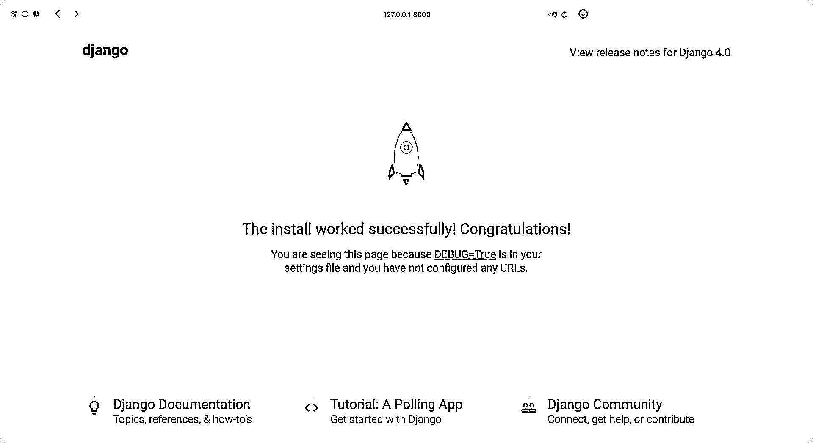
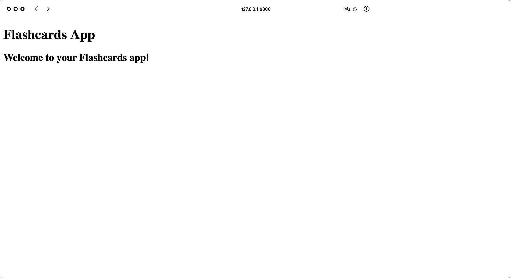
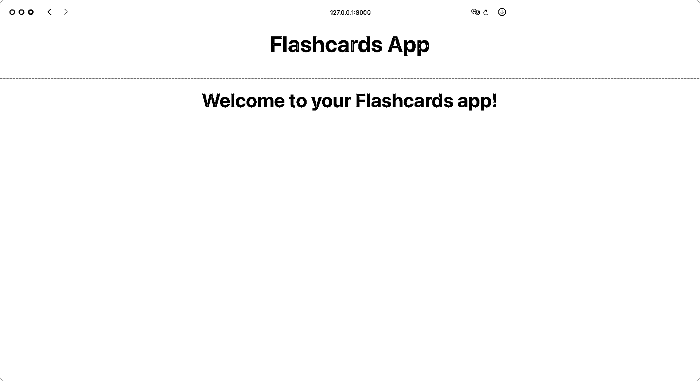
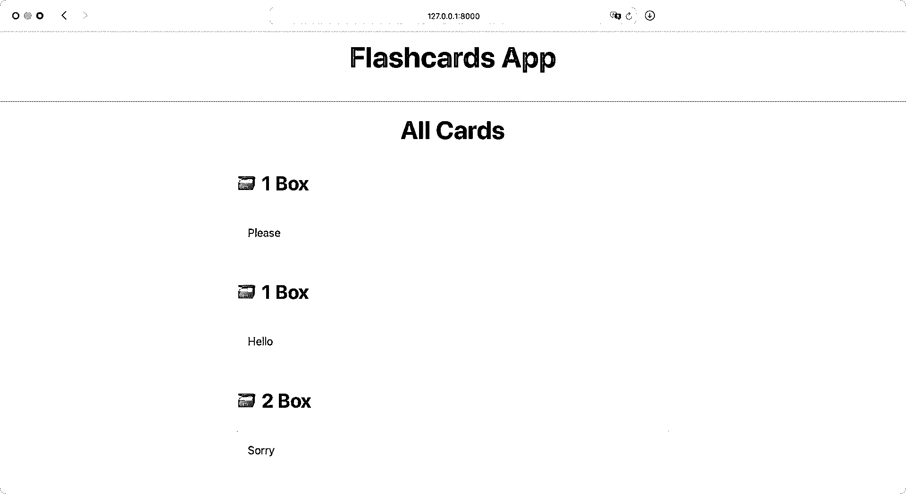
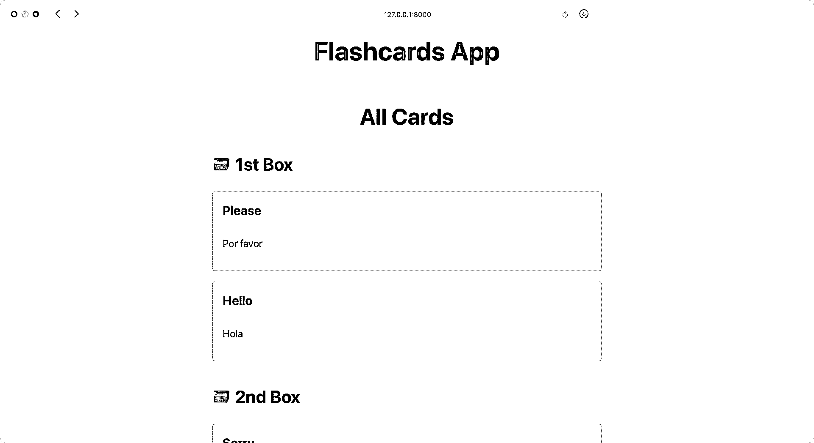
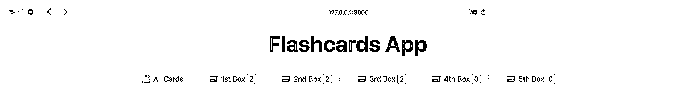

# 用 Django 构建一个抽认卡应用程序

> 原文：<https://realpython.com/django-flashcards-app/>

当你想记住一个新话题或学习一门新语言时，抽认卡是一个很好的工具。你在卡片的正面写一个问题，在卡片的背面写答案。然后你可以通过阅读抽认卡来测试你的记忆力。你给自己看卡片的次数越多，记住卡片内容的机会就越大。有了 Django，你可以构建自己的抽认卡应用程序。

通过遵循本教程，你将构建一个 Django 抽认卡应用程序，它复制了一个[间隔重复系统](https://en.wikipedia.org/wiki/Spaced_repetition)，这可以提高你的学习潜力。

**在这个循序渐进的项目中，你将学习如何:**

*   建立一个 Django 项目
*   使用 **SQLite 数据库**和 **Django shell**
*   创建**模型**和**基于类的视图**
*   结构和**嵌套模板**
*   创建**自定义模板标签**

在此过程中，您将获得一步一步的指导，以创建您的最终抽认卡应用程序。这意味着您将在单独的、小块的代码中获得您需要的所有代码。您也可以通过点击下面的链接找到该应用程序的完整源代码:

**源代码:** [点击此处下载源代码](https://realpython.com/bonus/django-flashcards-app-code/)，您将使用它来构建您的 Django 抽认卡应用程序。

如果您想在提高 Django 和 Python 技能的同时学习新的主题，那么这个项目非常适合您！

## 演示:你的 Django 抽认卡应用程序

在本教程中，您将构建一个抽认卡应用程序。在你的 web 应用程序的首页，你可以看到你现有的所有卡片，并可以创建新的卡片。在每张抽认卡上，你可以添加一个问题和一个答案，以后你可以编辑它们。当您想要测试您的知识时，您可以导航到一个盒子来查看盒子中包含的卡片:

[https://player.vimeo.com/video/728439716?background=1](https://player.vimeo.com/video/728439716?background=1)

一旦你知道了卡片问题的答案，卡片就会移动到下一个盒子。如果抽认卡移动到下一个盒子，并不意味着你已经完成了。你仍然会定期回顾它来刷新你的记忆，它会继续在盒子里前进。基本上，方框数越高，你就越有可能掌握这些概念。如果你不知道卡片问题的答案，那么卡片会回到第一个盒子里。

[*Remove ads*](/account/join/)

## 项目概述

本教程中的工作分为多个步骤。这样，你可以休息一下，然后按照自己的节奏继续。您将构建一个带有数据库连接的全栈 web 应用程序，它复制了 **Leitner 系统**:

> 在[莱特纳系统]中，抽认卡根据学习者对莱特纳学习盒中每个抽认卡的熟悉程度进行分组。学习者试图回忆写在抽认卡上的答案。如果他们成功了，他们就把卡片发给下一组。如果他们失败了，他们会把它送回第一组。([来源](https://en.wikipedia.org/wiki/Leitner_system))

通过使用**间隔重复**，你将更频繁地在第一个盒子中测试你对新的或具有挑战性的主题的知识，同时你将以更大的时间间隔检查其他盒子中的卡片:

*   你有五个可以装抽认卡的盒子。
*   当你制作抽认卡时，你把它放进第一个盒子里。
*   为了测试你的知识，你选择一个盒子，随机抽取一张抽认卡，然后检查你是否知道卡上问题的答案。
*   如果你知道答案，那么你把卡片移到下一个更高的盒子里。
*   如果你不知道答案，那么你把卡片移回到第一个盒子里。

盒子的数字越大，你检查盒子里的抽认卡来测试你的知识的频率就越低。

注:抽认卡是学习一门新语言的绝佳工具。在整个教程的例子中，你会发现英语和西班牙语单词的翻译。但是这些例子是故意保持最小的。这样，您可以方便地自定义卡片上的问题和答案。

这个项目是一个很好的起点，然后您可以用更多的特性来增强您的 Django 项目。在本教程的结尾，你会发现下一步要构建什么的想法。

## 先决条件

你不需要任何关于 Django 或 T2 数据库的知识来完成这个项目。如果您想进一步了解本教程中遇到的主题，可以找到相关资源的链接。

然而，你应该能熟练使用**命令行**，并具备 Python 的[基础知识](https://realpython.com/products/python-basics-book/)和[类](https://realpython.com/python3-object-oriented-programming/)。尽管了解[虚拟环境](https://realpython.com/python-virtual-environments-a-primer/)和 [`pip`](https://realpython.com/what-is-pip/) 会有所帮助，但您将通过本教程学习如何设置一切。

## 步骤 1:准备你的 Django 项目

在这一步中，您将为 Django 抽认卡项目准备开发环境。首先，您将创建一个**虚拟环境**并安装项目所需的所有**依赖项**。在这一步的最后，您将创建 Django 项目，并验证您的项目在浏览器中设置正确。

### 创建虚拟环境

在本节中，您将创建您的项目结构。您可以随意命名项目的根文件夹。例如，您可以将其命名为`flashcards_app/`并导航到该文件夹:

```py
$ mkdir flashcards_app
$ cd flashcards_app
```

在这种情况下，您将项目的根文件夹命名为`flashcards_app/`。您创建的文件和文件夹将位于该文件夹或其子文件夹中。

导航到项目文件夹后，创建并激活一个[虚拟环境](https://realpython.com/python-virtual-environments-a-primer/)是个好主意。这样，您安装的任何项目依赖项都不是系统范围的，而只是在项目的虚拟环境中。

在下面选择您的**操作系统**，并使用您的平台特定命令来设置虚拟环境:

*   [*视窗*](#windows-1)
**   [**Linux + macOS**](#linux-macos-1)*

```py
PS> python -m venv venv
PS> .\venv\Scripts\activate
(venv) PS>
```

```py
$ python3 -m venv venv
$ source venv/bin/activate
(venv) $
```

使用上面显示的命令，您可以通过使用 Python 的内置`venv`模块创建并激活一个名为`venv`的虚拟环境。提示前面`venv`周围的括号(`()`)表示您已经成功激活了虚拟环境。

[*Remove ads*](/account/join/)

### 添加依赖关系

在你创建并激活你的虚拟环境后，是时候安装带有 [`pip`](https://realpython.com/what-is-pip/) 的`django`:

```py
(venv) $ python -m pip install django==4.0.4
```

Django **web 框架**是你的项目需要的唯一直接依赖。当您运行`pip install`命令时，Django 需要工作的任何其他 [Python 包](https://realpython.com/python-modules-packages/)会自动安装。

### 启动你的 Django 项目

一旦创建了虚拟环境并安装了 Django，就该初始化 Django 项目了。使用 Django 的**命令行实用程序**在您的项目根目录中创建 Django `flashcards`项目:

```py
(venv) $ django-admin startproject flashcards .
```

不要忘记在上面的命令末尾添加点(`.`)。圆点防止 Django 为你的抽认卡项目创建一个嵌套的项目目录。否则你会得到一个包含`flashcards/`子目录的`flashcards/`文件夹。

通过运行如上所示的`startproject`命令，您已经告诉 Django 在项目的根目录下创建一个包含一堆文件的`flashcards/`文件夹，包括`manage.py`。在命令行中，`manage.py`文件将接管[的管理任务](https://docs.djangoproject.com/en/4.0/ref/django-admin/#available-commands)。例如，它将运行您的**开发 web 服务器**:

```py
(venv) $ python manage.py runserver
```

您可以指定开发服务器的 [IP 地址](https://realpython.com/python-ipaddress-module/)和端口。默认情况下，服务器在`127.0.0.1`的端口`8000`上运行，并且只能在您的计算机上访问。随着服务器的运行，您可以使用`http://127.0.0.1:8000`或`http://localhost:8000`在浏览器中访问您的 Django 项目:

[](https://files.realpython.com/media/django-flashcards-app-01-hello-world.e81ef68f6ac8.png)

这是你的 Django 项目的主页。到目前为止，只能看到一个晃动的火箭。这意味着安装成功，您可以继续创建您的抽认卡应用程序。

## 第二步:设置你的抽认卡应用程序

在上一步中，您准备了开发环境。现在是时候设置你的抽认卡应用程序了，你将把它命名为`cards`。`cards`应用程序将包含创建你的学习卡的所有代码。

### 创建你的 Django 抽认卡应用程序

Django 项目包含一个或多个应用程序。一个 app 的范围应该是有限的。一开始，区分一个[项目和应用](https://docs.djangoproject.com/en/4.0/ref/applications/)可能会令人困惑。但是在大的 Django 项目中，这种关注点的分离保持了代码库的干净。这种结构的另一个好处是你可以[重用其他项目的应用](https://realpython.com/installable-django-app/)。

在本教程中，除了您的项目，您只需要一个应用程序。该应用程序的主要目的是处理您的应用程序的卡，因此您可以调用该应用程序`cards`。运行命令创建`cards`应用程序:

```py
(venv) $ python manage.py startapp cards
```

该命令在您的项目中创建一个`cards/`文件夹，其中包含一些预定义的文件。要将`cards`应用程序连接到抽认卡项目，将其添加到`flashcards/settings.py`中的`INSTALLED_APPS`:

```py
# flashcards/settings.py

# ...

INSTALLED_APPS = [
    "django.contrib.admin",
    "django.contrib.auth",
    "django.contrib.contenttypes",
    "django.contrib.sessions",
    "django.contrib.messages",
    "django.contrib.staticfiles",
 "cards.apps.CardsConfig", ]

# ...
```

现在，您的`cards`应用程序的配置类被插入到`flashcard` Django 项目中。接下来，你要确保能在浏览器中导航到你的`cards`应用。

[*Remove ads*](/account/join/)

### 启动您的登录页面

到目前为止，Django 仍然在你的抽认卡项目的登陆页面上显示晃动的火箭。在本节中，您将通过使用一个**基础模板**来实现您的定制登录页面。

首先，你需要告诉 Django，你的`cards`应用程序现在负责你的项目的根 URL。打开您的`flashcards/`文件夹中的`urls.py`，并包含您的`cards`网址:

```py
 1# flashcards/urls.py
 2
 3from django.contrib import admin
 4from django.urls import path, include 5
 6urlpatterns = [
 7    path("admin/", admin.site.urls),
 8    path("", include("cards.urls")), 9]
```

在第 8 行，您将带有空 **route** 字符串模式的`path()`添加到`urlpatterns`列表中，作为第一个**位置参数**。作为第二个参数，您传入`include()`，它通知抽认卡项目`cards`应用程序将处理所有匹配字符串模式的路由。空字符串模式(`""`)确实是空的，所以`cards`从现在开始监听你所有的根 URL。

有了这个 URL 模式，Django 会将项目的任何 URL 传递到您的`cards`应用程序，除了`admin/`。为了处理这个问题，你的`cards`应用需要自己的`urls.py`文件，它接管分配 URL 的责任:

```py
# cards/urls.py

from django.urls import path
from django.views.generic import TemplateView

urlpatterns = [
    path(
        "",
        TemplateView.as_view(template_name="cards/base.html"),
        name="home"
    ),
]
```

在您的新`urls.py`文件中，您正在使用一个`urlpatterns`列表，就像以前一样。同样，您传入一个空的路由字符串模式。这次你服务一个`TemplateView`到根 URL。

你也可以将`name="home"`作为可选参数传入[。有了名称，您就可以在 Django 项目中方便地引用视图。因此，即使您决定在某个时候更改 URL 模式，也不必更新任何模板。](https://realpython.com/python-optional-arguments/)

为了提供您所引用的模板，在`cards/templates/cards/`中创建`base.html`:

```py
 1<!-- cards/templates/cards/base.html -->
 2
 3<!DOCTYPE html>
 4<html lang="en">
 5
 6<head>
 7    <title>Flashcards</title>
 8</head>
 9
10<body>
11    <header>
12        <h1>Flashcards App</h1>
13    </header>
14    <main>
15        
16            <h2>Welcome to your Flashcards app!</h2>
17        
18    </main>
19</body>
20
21</html>
```

你的**基础模板**包含了你网站的基本结构。在第 15 行，您定义了一个子模板可以覆盖的**模板块**。如果没有子模板覆盖内容块，则将显示块中的内容。

**注意:**通常，您的 Django 开发 web 服务器会自己重启。如果您想手动停止服务器，那么您可以在终端中按 `Ctrl` + `C` 。

要再次启动服务器，请运行以下命令:

```py
(venv) $ python manage.py runserver
```

请记住，您需要在激活的虚拟环境中运行这个命令。

跳到您的浏览器并访问`http://127.0.0.1:8000`:

[](https://files.realpython.com/media/django-flashcards-app-02-no-styling.4f0fce6d85fb.png)

太棒了，你的项目现在显示了`cards`的主页！您可以使用刚刚创建的带有欢迎信息的基础模板。然而，你的登陆页面看起来有点乏味。继续阅读，学习如何给你的网站添加一些风格。

### 撒上某种风格

对许多人来说，令人愉悦的设计是积极学习体验的重要组成部分。你可以通过使用 [CSS](https://realpython.com/html-css-python/#style-your-content-with-css) 给你的 [HTML 页面](https://realpython.com/html-css-python/#create-your-first-html-file)添加设计。您可以导入外部 CSS 文件，而不是自己编写所有 CSS 代码:

```py
 1<!-- cards/templates/cards/base.html -->
 2
 3<!DOCTYPE html>
 4<html lang="en">
 5
 6<head>
 7    <title>Flashcards</title>
 8    <link rel="stylesheet" href="https://cdn.simplecss.org/simple.min.css"> 9</head>
10
11<!-- ... -->
```

类似于 [Python 导入技术](https://realpython.com/python-import/)，你可以导入一个外部 CSS 库到你的网站。在第 8 行，您正在加载 [Simple.css 框架](https://simplecss.org)。这个外部 CSS 文件提供了样式，而不需要您向 HTML 元素添加任何类。

您可以通过添加一些额外的 CSS 样式来自定义您的 CSS 代码。从下面的可折叠列表中复制并粘贴标记的 CSS 代码:


```py
<!-- cards/templates/cards/base.html -->

<!DOCTYPE html>
<html lang="en">

<head>
    <title>Flashcards</title>
    <link rel="stylesheet" href="https://cdn.simplecss.org/simple.min.css">
</head>

<style>  /* Custom CSS */    :root  {  --accent:  #6e48ad;  --accent-bg:  white;  --bg:  #fff;  --text:  #212121;  --text-light:  #585858;  --border:  #d8dae1;  --code:  #d81b60;  --preformatted:  #444;  }    article  {  background-color:  var(--marked);  border:  1px  solid  var(--border);  border-radius:  5px;  padding:  1em;  margin:  1em  0;  }    h2  {  text-align:  center;  }    h2,  h4  {  margin-top:  0;  }    hr  {  background:  var(--accent);  border-color:  var(--accent);  }    button,  a[role="button"]  {  color:  white;  text-decoration:  none;  }    input,  select,  textarea  {  width:  100%;  }  </style> 
<!-- ... -->
```

继续并重新启动您的开发 web 服务器。然后，在`http://127.0.0.1:8000`访问您的抽认卡应用程序:

[](https://files.realpython.com/media/django-flashcards-app-03-designed.b26e6b90deb5.png)

太棒了，你的抽认卡应用程序现在用花哨的字体和居中的文本来戏弄一个适当的设计。如果你知道一些 CSS，那么你可以慢慢来，调整你的抽认卡应用程序的设计。一旦你对你的**前端**的外观感到满意，继续阅读来处理一些**后端**的事情。

[*Remove ads*](/account/join/)

## 第三步:亮出你的牌

现在你的应用已经启动并运行了，你可以定义你的 **SQLite 数据库**的表应该是什么样子。您可以通过添加一个`Card`模型来做到这一点。

您还将在 Django shell 中创建您的第一个抽认卡，并在浏览器中列出您的卡。

### 连接 SQLite 数据库

在抽认卡上，前面通常是你陈述问题的地方。卡片的背面有答案。您可以在`cards`应用的模型中复制卡片的属性:

```py
 1# cards/models.py
 2
 3from django.db import models
 4
 5NUM_BOXES = 5
 6BOXES = range(1, NUM_BOXES + 1)
 7
 8class Card(models.Model):
 9    question = models.CharField(max_length=100)
10    answer = models.CharField(max_length=100)
11    box = models.IntegerField(
12        choices=zip(BOXES, BOXES),
13        default=BOXES[0],
14    )
15    date_created = models.DateTimeField(auto_now_add=True)
16
17    def __str__(self):
18        return self.question
```

在仔细查看`Card`类的内容之前，请注意第 5 行中的`NUM_BOXES`变量。`NUM_BOXES`的值定义了你的应用程序中需要多少个盒子。有了这五个方框，你就有了在语言学习中实施间隔重复的坚实基础。

在第 6 行，您正在创建`BOXES`变量，它包含一个从`1`开始到`NUM_BOXES + 1`结束的[可迭代范围](https://realpython.com/python-range/)——换句话说就是`6`。这样，您可以使用从 1 到 5 的用户友好的编号来遍历您的框，而不是使用该范围默认的从零开始的编号。

第 8 到 18 行定义了您的`Card`类。您将在您的抽认卡应用程序中使用单词到单词的翻译，因此在第 9 行的`question`字段和第 10 行的`answer`字段中使用`models.CharField`就足够了。此外，如果你也想记忆短句，一百个字符的最大长度应该足够了。

**注意:**还可以设置更大的最大长度。但是请记住，如果你保持抽认卡简洁明了，它通常是最有用的。

通过第 11 行到第 14 行的`box`字段，您将跟踪您的卡所在的盒子编号。默认情况下，您在第一个框中创建抽认卡。使用`choices`，您确保`models.IntegerField`必须包含一个在您的`BOXES`范围内的数字。

在第 15 行，您添加了一个`models.DateTimeField`，它将自动包含您的卡的创建日期和时间的时间戳。使用`date_created`字段，您可以在您的卡片概览中首先显示最新的卡片。

为了控制您的`Card`对象的字符串表示，您在第 17 行和第 18 行定义了`.__str__()`。当你返回你的卡实例的`question`字符串时，你就可以方便地发现你正在使用哪张卡。

您的`Card`模型定义您的数据库应该包含一个表，该表存储您的卡。您的`Card`模型的字段将是您的数据库中的字段。要更新您的数据库，您必须创建[迁移](https://realpython.com/django-migrations-a-primer/)并迁移更改以应用它们:

```py
(venv) $ python manage.py makemigrations
Migrations for 'cards':
 cards/migrations/0001_initial.py
 - Create model Card

(venv) $ python manage.py migrate
Operations to perform:
 Apply all migrations: admin, auth, cards, contenttypes, sessions
Running migrations:
 Applying cards.0001_initial... OK
 ...
```

将更改应用到数据库后，需要将数据添加到数据库中。为此，您将使用 **Django shell** 将一些卡放入您的数据库。前往您的终端并启动 Django shell:

```py
(venv) $ python manage.py shell
```

Django shell 类似于您的[交互式 Python 解释器](https://realpython.com/interacting-with-python/)。但是 Django shell 允许您直接从 Django 项目的根文件夹中工作，因为它已经导入了您的 Django 设置。

在 shell 中，您现在可以直接与您的抽认卡项目进行交互。继续创建三张卡:

>>>

```py
>>> from cards.models import Card
>>> c1 = Card(question="Hello", answer="Hola")
>>> c1.save()
>>> c2 = Card(question="Please", answer="Por favor")
>>> c2.save()
>>> c3 = Card(question="Sorry", answer="Lo siento", box=2)
>>> c3.save()
>>> Card.objects.all()
<QuerySet [<Card: Hello>, <Card: Please>, <Card: Sorry>]>
```

导入`Card`模型后，您创建了三张卡。用一个`question`和一个`answer`参数初始化`Card`类。记住你的卡的`box`和`date_created`属性有默认值。所以不需要提供。一旦调用了`.save()`，就将卡提交给数据库。

**注:**您可以随意创建任意多的卡片。但是，在继续本教程之前，请确保您至少创建了三张卡。

使用`box`参数将一些卡片放入不同的盒子中。这将模拟一个正在进行的学习会话，并帮助您开发您的前端，以反映一个现实的场景。

使用`Cards.objects.all()`，您可以检索当前数据库中包含的所有卡片。`QuerySet`表示表明您已经成功地向数据库添加了一些卡。在下一部分中，您将在前端展示您的牌。

[*Remove ads*](/account/join/)

### 列出你的第一张抽认卡

在上一节中，您向数据库添加了一些抽认卡。现在是时候在前端列出你的卡片了。

首先编写一个基于类的视图，列出所有的卡片:

```py
 1# cards/views.py
 2
 3from django.views.generic import (
 4    ListView,
 5)
 6
 7from .models import Card
 8
 9class CardListView(ListView):
10    model = Card
11    queryset = Card.objects.all().order_by("box", "-date_created")
```

Django 提供了许多现成的通用视图。您在第 9 行创建的基于类的视图是 Django 的 [ListView](https://docs.djangoproject.com/en/4.0/ref/class-based-views/generic-display/#listview) 的**子类**。

您必须在`ListView`中设置的唯一属性是您的视图引用的模型。您在第 10 行这样做。

通过在第 11 行定义`queryset`,您获得了对数据库返回的项目的更多控制。不仅要拿到所有的卡，还要按`box`和`date_created`排序。这意味着你会收到一个 Django `QuerySet`，里面的卡片首先按照盒子升序排列，然后按照创建日期降序排列。创建日期的降序得益于`"-date_created"`中的破折号(`-`)前缀。

在浏览器中查看卡片之前，必须定义一个模板。Django 希望基于类的视图的模板在一个特定的位置，有一个特定的名字。对于您的`CardListView`，您需要一个在`cards/templates/cards/`中名为`card_list.html`的模板:

```
 1<!-- cards/templates/cards/card_list.html -->
 2
 3
 4
 5
 6    <h2>
 7        All Cards
 8    </h2>
 9    
10        <h3>🗃 {{ card.box }} Box</h3>
11        <article>
12            {{ card }}
13        </article>
14    
15
```py

在你的`card_list.html`模板中，你用内置的`extends` **模板标签**扩展了你的`base.html`模板。记住你的`base.html`模板也有一个`` [模板标签](https://realpython.com/django-templates-tags-filters/)。您用第 6 到 14 行的``代码覆盖了这个代码块的主体。你现在列出了所有的抽认卡，而不是显示欢迎信息。

在第 9 行，你循环了所有的卡片。在`card_list`循环中，您可以为每个单独的`Card`实例访问`Card`模型的字段。

一个抽认卡应用程序在你的主页上列出所有的抽认卡是有意义的。用新的`CardListView`的 URL 替换之前的登录页面，并将其重命名为`card-list`:

```
 1# cards/urls.py
 2
 3from django.urls import path
 4# Removed: from django.views.generic import TemplateView
 5
 6from . import views 7
 8urlpatterns = [
 9    path(
10        "",
11        views.CardListView.as_view(), 12        name="card-list" 13    ),
14]
```py

您不再需要第 4 行中的前一个`TemplateView`,所以您删除了这一行，并在第 6 行中导入了`views`。

不是在第 11 行提供一个`TemplateView`,而是作为一个视图提供您的`CardListView`。因此，您将路线的名称重命名为`card-list`。

重启您的开发 web 服务器并访问`http://127.0.0.1:8000`:

[](https://files.realpython.com/media/django-flashcards-app-05-repeating-headlines.158d96a69fa3.png)

你现在可以在你的抽认卡应用程序的主页上列出你所有的卡片，按照盒子和创建日期整齐地排序。您还从基本模板继承了标题和样式。但是盒子的编号看起来有点重复，最好使用序数——比如第一、第二和第三——来列出盒子。

### 调整您的模板

目前，您将您的箱子列为 *1 箱子*、 *2 箱子*，以此类推。这看起来有点技术性。相反，把你的盒子按顺序列成*第一个盒子*、*第二个盒子*等等会友好得多。

你可以用 Django 的`humanize` **模板过滤器**来实现这个序数。这组过滤器有助于提高模板中数据的可读性。要使用它，您必须将`django.contrib.humanize`添加到您的`INSTALLED_APPS`中:

```
# flashcards/settings.py

# ...

INSTALLED_APPS = [
    "django.contrib.admin",
    "django.contrib.auth",
    "django.contrib.contenttypes",
    "django.contrib.sessions",
    "django.contrib.messages",
    "django.contrib.staticfiles",
 "django.contrib.humanize",    "cards.apps.CardsConfig",
]

# ...
```py

在您调整了 Django 设置之后，您可以在您的`card_list.html`模板中加载`humanize`模板过滤器:

```
<!-- cards/templates/cards/card_list.html -->


 
<!-- ... -->
```py

在稍后的代码中，您将使用`humanize`过滤器集在显示框标题时应用`ordinal`过滤器。

停留在`card_list.html`中，将您的`<h3>`标题包装在`ifchanged`模板标签中，以便只显示一次您的新框标题:

```
 1<!-- cards/templates/cards/card_list.html -->
 2
 3<!-- ... -->
 4
 5
 6     7        <h3>🗃 {{ card.box | ordinal }} Box</h3> 8     9    <article>
10        {{ card }}
11    </article>
12
13
14<!-- ... -->
```py

第 6 行是``,第 8 行是``,如果标题值改变，你只在第 7 行显示框标题。这样，你只显示一次盒子号码，然后显示盒子里所有的牌。只有当你到达下一个框并且标题改变时，你才显示新的标题。

在第 7 行，您使用管道符号(`|`)来应用`humanize`过滤器集的`ordinal`过滤器。过滤器就像是在 Django 呈现数据之前就地修改数据的小函数。在这种情况下，您可以使用`ordinal`过滤器将整数转换成它们对应的序数字符串。

还有另一个机会来优化您的`card_list.html`模板。目前，您正在用`{{ card }}`变量显示您的卡的表示。稍后，你也可以在应用程序的其他地方显示你的抽认卡。因此，为你的抽认卡创建一个单独的模板是有意义的。

您将立即创建您的新模板。首先，调整`card_list.html`以包含即将到来的`card.html`模板:

```
<!-- cards/templates/cards/card_list.html -->

<!-- ... -->


    
        <h3>🗃 {{ card.box | ordinal }} Box</h3>
    
  

<!-- ... -->
```py

现在您的`card_list.html`模板将加载一个名为`card.html`的子模板。此模板尚不存在。继续创造`card.html`:

```
 1<!-- cards/templates/cards/card.html -->
 2
 3<article>
 4   <h4>{{ card.question }}</h4>
 5   <p>{{ card.answer }}</p>
 6</article>
```py

在本教程的后面，您将向`card.html`添加更多数据。现在，您在第 4 行显示卡片的问题，在第 5 行显示答案。

重启您的开发 web 服务器并访问`http://127.0.0.1:8000`:

[](https://files.realpython.com/media/django-flashcards-app-06-nice-headlines.97a0d9046eb8.png)

对于每个框，按顺序编号的标题只出现一次。下面的卡片也显示了你的单词的翻译。

在下一步中，您将增强 Django 抽认卡应用程序，以便在应用程序前端轻松地创建和编辑抽认卡。

[*Remove ads*](/account/join/)

## 第四步:进入卡片详情

在上一步中，您将抽认卡应用程序与数据库连接，并列出您的卡。你利用 Django 外壳创建了你的第一张卡。

在这一步中，您将使用[表单](https://docs.djangoproject.com/en/4.0/topics/forms/)在您舒适的浏览器中创建和更新您的卡片。

### 创建新卡

目前，当你想创建更多的抽认卡时，你需要进入 Django shell。在使用这个应用程序时，这是一个有点破坏性的过程，特别是当你在学习过程中获得新卡的想法时。你可以改进创建新卡的过程！

实现在前端创建新卡的功能类似于列出您的卡的过程。首先，创建一个视图，添加一条路线，最后，创建一个模板。

您再次使用 Django 的一个通用视图作为视图。这次您导入一个`CreateView`来继承您的`CardCreateView`:

```
 1# cards/views.py
 2
 3from django.urls import reverse_lazy 4from django.views.generic import (
 5    ListView,
 6    CreateView, 7)
 8
 9from .models import Card
10
11class CardListView(ListView):
12    model = Card
13    queryset = Card.objects.all()
14
15class CardCreateView(CreateView): 16    model = Card 17    fields = ["question", "answer", "box"] 18    success_url = reverse_lazy("card-create")
```py

您创建新卡的网页将包含一个表单，其中包含您必须填写的字段。因此，除了连接您的`CardCreateView`中的模型，您还需要定义您的表单应该在第 17 行显示的字段。

当您发送表单时，Django 将检查表单并将您的请求返回到您在第 18 行为`success_url`设置的 URL。在这种情况下，又是同样的观点。这样，您可以一张一张地创建卡片，而无需来回导航。

您使用在第 3 行中导入的 Django 的`reverse_lazy()`，通过它的名称来引用您的`card-create`路线。但是到你的`CardCreateView`的路线还不存在。继续创建它:

```
# cards/urls.py

# ...

urlpatterns = [
    # ...
    path(
        "new",
        views.CardCreateView.as_view(),
        name="card-create"
    ),
]
```py

有了这个新的`path`，你的抽认卡应用程序就有了一个连接到`CardCreateView`的新路径。

当你现在访问`http://127.0.0.1:8000/new`，Django 为你服务`CardCreateView`却找不到对应的模板。姜戈寻找一个名为`card_form.html`的模板。该模板尚不存在，因此您需要创建它:

```
 1<!-- cards/templates/cards/card_form.html -->
 2
 3
 4
 5
 6    <h2>✨ Create New Card</h2>
 7    <form method="post">
 8        
 9        {{ form.as_p }}
10        <input type="submit" value="Save Card">
11    </form>
12    <a href="">
13        Cancel
14    </a>
15
```py

第 9 行有了`{{ form.as_p }}`, Django 将显示用段落包装的表单字段。

无论何时在 Django 表单中发布内容，都必须提供一个 [``模板标签](https://docs.djangoproject.com/en/4.0/ref/csrf/)。这是**安全措施**防止[跨站请求伪造](https://docs.djangoproject.com/en/4.0/ref/csrf/)。

在第 12 到 14 行，您添加了取消创建新卡的选项。当您决定不保存卡片时，您可以单击*取消*链接，这将带您到您的`card-list` URL，丢弃表单数据。

要在 flashcards 应用程序的前端试用您的新表单来创建新卡片，请重启您的开发 web 服务器并访问`http://127.0.0.1:8000/new`:

[https://player.vimeo.com/video/717252349?background=1](https://player.vimeo.com/video/717252349?background=1)

创建新卡时，您会停留在同一页面上，因此可以方便地创建另一张卡。当你点击*取消*时，你回到你的卡片列表。

[*Remove ads*](/account/join/)

### 更新现有卡

整洁，创造新的卡片作品！但是如果你想更新现有的卡呢？花点时间想想抽认卡的编辑页面应该是什么样子。

很有可能，您想到了一个类似于您的创建页面的布局，只是表单中填写了您的卡片的可编辑内容。创建`CardUpdateView`，它利用了这种相似性:

```
 1# cards/views.py
 2
 3from django.urls import reverse_lazy
 4from django.views.generic import (
 5    ListView,
 6    CreateView,
 7    UpdateView, 8)
 9
10from .models import Card
11
12# ...
13
14class CardUpdateView(CardCreateView, UpdateView): 15    success_url = reverse_lazy("card-list")
```py

第 14 行的`CardUpdateView`是另一个通用的基于类的视图。这一次，您从 Django 的`UpdateView`中派生出您的视图的子类，它是在第 7 行导入的。

但是`UpdateView`并不是你的`CardUpdateView`所基于的唯一观点。你利用 [Python 的多类继承](https://realpython.com/inheritance-composition-python/#inheriting-multiple-classes)来创建`CardCreateView`和`UpdateView`的子类。通过这样做，您可以从两个父类中继承类属性，并修改您希望不同的属性。

编辑完一张卡片后，你将返回到`card-list`页面，而不是像在`card-create`中那样返回到同一个页面。

创建新路线以访问卡的编辑页面:

```
# cards/urls.py

# ...

urlpatterns = [
    # ...
    path(
        "edit/<int:pk>",
        views.CardUpdateView.as_view(),
        name="card-update"
    ),
]
```py

注意路线中指向您的`CardUpdateView`的`<int:pk>`图案。因为您正在编辑一个现有的卡，所以您需要一个**主键(`pk` )** 来标识您想要更新的卡。

**注意:**主键是数据库条目的惟一标识符，Django 在创建条目时自动添加。您不需要记住卡片的任何主键，但是以后当您链接到卡片的编辑页面时，您将使用这个标识符。

URL 的`<int:pk>`部分允许主键为整数，`CardUpdateView`将返回相应卡的数据。当你访问`http://127.0.0.1:8000/edit/2`时，Django 知道你想用主键`2`编辑卡片，它会为你提供这张卡片的视图。

现在您需要调整`card_form.html`来迎合这两种情况，创建一个新卡和编辑一个现有的卡:

```
 1<!-- templates/cards/card_form.html -->
 2
 3
 4
 5
 6     7        <h2>✏️ Edit Card</h2> 8     9        <h2>✨ Create New Card</h2> 10     11    <form method="post">
12        
13        {{ form.as_p }}
14        <input type="submit" value="Save Card">
15    </form>
16    <a href="">
17        Cancel
18    </a>
19
```py

您使用 Django 的``将您的[条件语句](https://realpython.com/python-conditional-statements/)包装在第 6 到 10 行。如果你的`card_form.html`模板接收到`card`数据，那么你显示*编辑卡*标题。否则，显示*创建新卡*。

当卡数据存在时，Django 将使用您的卡数据填写表单，而不需要对模板进行任何调整。

### 连接您的页面

新路线准备就绪后，是时候连接页面了。首先添加一个链接，从您的`card_list.html`模板指向您的`card-create`页面:

```
 1<!-- templates/cards/card_list.html -->
 2
 3
 4
 5
 6
 7    <h2>
 8        All Cards
 9    </h2>
10    <a href="" role="button"> 11        ✨ Create New Card 12    </a> 13    
14        
15            <h3>🗃 {{ card.box | ordinal }} Box</h3>
16        
17        
18    
19
```py

有了你在第 10 到 12 行添加的链接，当你想给你的应用程序添加一个新的抽认卡时，你现在可以方便地跳转到`card-create` URL。

接下来，为每张卡显示一个*编辑*按钮。打开您的`card.html`模板，在底部添加一个链接:

```
 1<!-- templates/cards/card.html -->
 2
 3<article>
 4    <h4>{{ card.question }}</h4>
 5    <p>{{ card.answer }}</p>
 6    <hr>
 7    <a href="" role="button"> 8        ✏️ Edit Card 9    </a> 10</article>
```py

记得您在`cards/urls.py`中将路线中的`<int:pk>`模式添加到您的`card-update` URL 中。这就是为什么你需要在第 7 行的``标签中把`card.id`作为一个参数传入。

随着项目的增长，在页面间导航变得越来越重要。所以，你的抽认卡应用程序的另一个改进是导航菜单。

首先创建`navigation.html`模板，并链接到您的`card-list`页面:

```
<!-- cards/templates/cards/navigation.html -->

<nav>
    <a href="">🗂 All Cards</a>
</nav>
```

你的导航菜单现在只链接到你的卡片列表。稍后，您还将创建指向您的抽认卡所在的盒子的链接。

同样，你使用表情符号来想象这个链接。在这里，你用[卡片索引分隔符表情符号](https://emojipedia.org/card-index-dividers/) (🗂).)作为*所有卡片*链接的前缀当然，你可以在应用的链接和标题中使用任何其他表情符号，也可以不使用表情符号。

将`navigation.html`包含在您的基本模板中，以在您的所有页面上显示它:

```py
<!-- cards/templates/cards/base.html -->

<!--  ... -->

<header>
    <h1>Flashcards App</h1>
  </header>

<!--  ... -->
```

导航就绪后，是时候点击 Django 抽认卡应用程序了。打开您的浏览器并访问`http://127.0.0.1:8000`:

[https://player.vimeo.com/video/717253334?background=1](https://player.vimeo.com/video/717253334?background=1)

您现在可以创建和编辑在您的抽认卡应用程序中实现的卡。在下一步中，您将增强您的应用程序，以检查您是否知道您的卡所含问题的答案。

[*Remove ads*](/account/join/)

## 第五步:检查你的牌

在这一步中，您将实现检查您是否知道卡片问题答案的功能。当你正确地记住它时，你可以把卡片移到下一个盒子里。如果你不知道答案，那么你把卡片移到第一个盒子里。

实现这个重要特性后，您将使用 Django shell 来查看它的运行情况。这样，在编写前端代码之前，您可以验证一切都按预期运行。

### 让你的牌动起来

在你继续写代码之前，花点时间想想你的抽认卡应用程序的间隔重复系统应该如何工作。如果你需要复习，你可以回到[项目概述](#project-overview)。

简而言之，如果你记起了一张卡片的答案，你就把它移到下一个盒子里。如果你不知道答案，你把卡片放回第一个盒子里。

要复制在盒子之间移动卡片的行为，向您的`Card`模型添加一个`.move()`方法:

```py
 1# cards/models.py
 2
 3# ...
 4
 5class Card(models.Model):
 6
 7    # ...
 8
 9    def move(self, solved):
10        new_box = self.box + 1 if solved else BOXES[0]
11
12        if new_box in BOXES:
13            self.box = new_box
14            self.save()
15
16        return self
```

您的`.move()`方法将`solved`作为附加参数。当你知道答案时，`solved`的值将是`True`，当你不知道答案时，将是`False`。

在第 10 行，你在评估你是想把卡片向前移动到下一个盒子里还是把卡片移回到第一个盒子里。如果你知道你的卡片的答案，你的`new_box`变量将是你当前的盒子号码加 1。如果`solved`是`False`，那么`new_box`将是`1`，这就是`BOXES[0]`的值。

请注意，如果你知道第五个盒子里的卡片的答案，那么`new_box`甚至可以是`6`。这就是为什么当`new_box`是一个从`1`到`5`的数字时，你只需要继续保存第 14 行的新的`self.box`值。如果你知道第五个盒子里的一张卡片的答案，那么这张卡片就留在第五个盒子里不动。在下一节中，您将测试这种行为。

### 模拟卡检查会话

现在您已经将`.move()`添加到了您的`Card`模型中，您可以检查移动卡片是否按预期工作。正如您在本教程前面所做的那样，使用 Django shell:

```py
(venv) $ python manage.py shell
```

现在，您可以直接与抽认卡项目进行交互，并在 shell 中模拟检查会话。首先，导入您的`Card`模型:

>>>

```py
>>> from cards.models import Card
```

随着`Card`模型的导入，您可以查询您的数据库以获得第一个和第二个盒子中的所有卡片:

>>>

```py
>>> box1_cards = Card.objects.filter(box=1)
>>> box1_cards
<QuerySet [<Card: Hello>, <Card: Please>]>

>>> box2_cards = Card.objects.filter(box=2)
>>> box2_cards
<QuerySet [<Card: Sorry>]>
```

此刻，`box1_cards`包含两张卡，`box2_cards`包含一张卡。选择`box1_cards`的第一张卡片，并将其移动到下一个盒子:

>>>

```py
>>> check_card = box1_cards.first()
>>> check_card.move(solved=True)
<Card: Hello>

>>> box2_cards
<QuerySet [<Card: Hello>, <Card: Sorry>]>
```

当您在`solved`设置为`True`的情况下调用`check_card.move()`时，您的卡将移动到下一个盒子。`box2_cards`的`QuerySet`现在也包含了你的`check_card`。

出于测试目的，进一步移动卡:

>>>

```py
>>> check_card.move(solved=True)
<Card: Hello>

>>> box2_cards
<QuerySet [<Card: Sorry>]>

>>> check_card.box
3
```

和以前一样，当你解决它时，你的`check_card`继续前进。你的`box2_cards`还剩下一张卡。

现在，测试当你不知道卡片问题的答案时会发生什么:

>>>

```py
>>> check_card.move(solved=False)
<Card: Hello>

>>> check_card.box
1
```

当您在`solved`设置为`False`的情况下调用`.move()`时，卡片会移回第一个盒子。完美，你的卡的往返工作！

在下一步中，您将在前端显示您的盒子。然后，您将实现检查您是否知道某个问题的答案的功能，并相应地在前端的方框之间移动您的卡片。

[*Remove ads*](/account/join/)

## 第六步:把你的卡片放进盒子里

在上一步结束时，您验证了卡片如预期的那样在盒子之间移动。在本教程的最后一步，您将实现抽认卡应用程序的所有缺失功能。你将从列出你所有的盒子开始。

### 显示一个框

到目前为止，您已经有了一个列出所有抽认卡的页面，还有创建或更新抽认卡的页面。为了测试你的知识，你需要能够选择一个学习单元。这意味着您需要一个单个盒子的视图、一条导航路线和一个显示盒子的模板。

首先为单个框创建视图:

```py
 1# cards/views.py
 2
 3# ...
 4
 5class BoxView(CardListView):
 6    template_name = "cards/box.html"
 7
 8    def get_queryset(self):
 9        return Card.objects.filter(box=self.kwargs["box_num"])
10
11    def get_context_data(self, **kwargs):
12        context = super().get_context_data(**kwargs)
13        context["box_number"] = self.kwargs["box_num"]
14        return context
```

您正在创建作为`CardListView`的子类的`BoxView`。Django 将默认为`CardListView`提供`card_list.html`模板。因此，您需要覆盖第 6 行中的`template_name`,并指向`box.html`模板，稍后您将创建这个模板。

`BoxView`和`CardListView`的另一个区别是，你不想列出你所有的卡片。您可以使用`.get_queryset()`来调整`BoxView`返回的查询集，而不是列出您所有的卡片。在第 9 行，您只返回盒子号与`box_num`值匹配的卡片。

您在 GET 请求中将`box_num`的值作为关键字参数传递。要在模板中使用框号，可以使用`.get_context_data()`并将`box_num`作为`box_number`添加到第 13 行的视图上下文中。

**注意:**您使用变量名`box_number`来区别于`box_num`关键字参数。

将新路由添加到您的`urls.py`文件中，以接受 URL 模式中的`box_num`:

```py
# cards/urls.py

# ...

urlpatterns = [
    # ...
    path(
        "box/<int:box_num>",
        views.BoxView.as_view(),
        name="box"
    ),
]
```

通过将`<int:box_num>`添加到 URL 模式中，Django 将这个`box_num`作为关键字参数传递给视图。这正是你想要的。

接下来，创建视图期望的`box.html`模板:

```
 1<!-- templates/cards/box.html -->
 2
 3
 4
 5
 6
 7    <h2>🗃 {{ box_number | ordinal }} Box</h2>
 8    <mark>{{ object_list | length }}</mark> Card{{ object_list | pluralize }} left in box.
 9    <hr>
10    
11        
12    
13
```py

在您的`box.html`模板中，您再次使用`humanize`将第 7 行中的框号显示为序号。

`object_list`变量包含你的卡片作为对象。在第 8 行，您在`object_list`上使用了另外两个过滤器:

1.  使用`length`过滤器，您可以显示当前盒子中的卡片数量。
2.  使用`pluralize`过滤器，你可以确保你的信息的语法正确性。如果只剩下一张牌，那么单词*牌*保持单数。但是当有更多或零张牌时，Django 通过在末尾添加一个 *s* 来使*牌*成为复数。

在第 10 行到第 12 行，您遍历盒子中的卡片，并通过包含`card.html`模板来显示它们。

您可以通过在浏览器的地址栏中输入它们的 URL 来直接访问您的邮箱。但是在你的抽认卡应用程序的导航菜单中有你的盒子的链接会更方便。

[*Remove ads*](/account/join/)

### 列出你的盒子

要列出你的盒子，你首先要克服应用程序逻辑中的一个障碍。你的导航模板不知道你的抽认卡应用程序包含多少个盒子。您可以在每个视图的上下文中添加框的数量，但是这将为这些数据带来不必要的开销。

幸运的是，Django 已经准备好了一个系统，用于在模板中注入代码数据。为了在导航中列出你的框，你可以[实现一个定制的模板标签](https://realpython.com/django-template-custom-tags-filters/)。更准确地说，您将创建一个**包含标签**。

使用自定义包含标记，您可以返回包含函数提供的上下文数据的模板。在这种情况下，您将返回一个包含盒子数量的字典。

一旦创建并注册了 inclusion 标记，就可以像使用 Django 中任何其他加载的标记一样使用它。

首先，创建要加载的模板:

```
 1<!-- cards/templates/box_links.html -->
 2
 3
 4
 5
 6    <a href="">
 7        🗃 {{ box.number | ordinal }} Box <mark>{{ box.card_count }}</mark>
 8    </a>
 9
```py

这个`box_links.html`模板看起来和你创建的其他模板没有太大的不同。模板使用提供的数据。模板本身并不关心数据来自哪里。

为了让您的`box_links.html`满意，您需要用一个字典来填充它，该字典包含您在第 5 行迭代的`boxes`键。您可以忽略带有与`box_links.html`兼容的包含标签的字典。

为此，在您的`templates/`文件夹旁边创建一个名为`templatetags/`的文件夹。然后，在`templatetags/`文件夹中创建`cards_tags.py`:

```
 1# cards/templatetags/cards_tags.py
 2
 3from django import template
 4
 5from cards.models import BOXES, Card
 6
 7register = template.Library()
 8
 9@register.inclusion_tag("cards/box_links.html")
10def boxes_as_links():
11    boxes = []
12    for box_num in BOXES:
13        card_count = Card.objects.filter(box=box_num).count()
14        boxes.append({
15            "number": box_num,
16            "card_count": card_count,
17        })
18
19    return {"boxes": boxes}
```py

这是您的自定义模板标签的工作方式:

*   **3 号线**导入 Django 的`template`模块。
*   **第 5 行**导入您的`Card`模型和`BOXES`变量。
*   **第 7 行**创建了一个用于注册模板标签的`Library`实例。
*   **第 9 行**使用`Library`实例的`.inclusion_tag()`作为[装饰器](https://realpython.com/primer-on-python-decorators/)。这告诉 Django`boxes_as_links`是一个包含标签。
*   **12 号线**在你的`BOXES`上方盘旋。
*   **第 13 行**定义`card_count`来记录当前盒子中的卡片数量。
*   **第 14 行到第 17 行**将一个字典附加到`boxes`列表中，该字典以盒子编号作为关键字，以盒子中卡片的数量作为值。
*   **第 19 行**返回包含您的`boxes`数据的字典。

跳到`navigation.html`，然后加载您的新模板标签并包含它:

```
 1<!-- cards/templates/navigation.html -->
 2
 3 4
 5<nav>
 6    <a href="">🗂 All Cards</a>
 7     8</nav>
```py

首先，您需要在第 3 行加载您的`card_tags`模板标签。加载自定义标签后，您可以将您的标签作为任何其他 Django 标签来引用。在第 7 行，您包含了刚刚创建的`boxes_as_links`标记。

**注意:**当您向 Django 项目添加定制模板标签时，您必须手动重启您的服务器。否则你会得到一个错误，因为你的自定义标签还没有注册。

手动重启您的开发 web 服务器，并访问`http://127.0.0.1:8000`:

[](https://files.realpython.com/media/django-flashcards-app-07-navigation_cut.8c4920770b5d.png)

无论你正在加载哪个视图，你的导航都可以访问你的盒子，并且可以显示盒子中当前的卡片数量。

现在你的框已经在导航菜单中列出，你可以专注于改进框页面本身。

### 随机选择一张牌

当您访问箱子的页面时，您想要启动新的卡片检查会话。因此，你的抽认卡应用程序应该马上给你一张随机的卡片，这样你就可以测试你的知识了。

目前，您正在盒子页面上的列表中显示您的所有卡片。增强您的`BoxView`以选择一张随机卡片并将其添加到您的`context`:

```
 1# cards/views.py
 2
 3import random 4
 5# ...
 6
 7class BoxView(CardListView):
 8    template_name = "cards/box.html"
 9
10    def get_queryset(self):
11        return Card.objects.filter(box=self.kwargs["box_num"])
12
13    def get_context_data(self, **kwargs):
14        context = super().get_context_data(**kwargs)
15        context["box_number"] = self.kwargs["box_num"]
16        if self.object_list: 17            context["check_card"] = random.choice(self.object_list) 18        return context
```py

在第 3 行中，您将`random`模块导入到[来生成随机数据](https://realpython.com/python-random/)。请注意，盒子里可能没有牌。这就是为什么你需要检查`self.object_list`不是空的。如果你的物品列表中至少有一张卡片，那么你可以使用`random.choice()`来挑选一张卡片。这张随机选择的卡片将是您在`box.html`模板的学习课程中展示的卡片。

将`check_card`添加到`BoxView`的上下文中，可以调整`box.html`:

```
 1<!-- templates/cards/box.html -->
 2
 3
 4
 5
 6
 7    <h2>🗃 {{ box_number | ordinal }} Box</h2>
 8    <mark>{{ object_list | length }}</mark> Card{{ object_list | pluralize }} left in box.
 9    <hr>
10     11         12     13
```py

现在可以直接引用`check_card`，而不是循环遍历`object_list`中的所有卡片。类似于你的`BoxView`中的条件语句，你只有在有牌的时候才包括`card.html`。您可以在`include`标签中使用`with`将附加的上下文传递给包含的模板。由于`card.html`不知道您的`check_card`变量，您需要将`card=check_card`传递到子模板中。

为了正确地测试您是否知道问题的答案，您需要首先隐藏答案。此外，您希望专注于学习体验，而不是在学习过程中显示*编辑*按钮。

记住在你的卡片列表中使用`card.html`。在您的卡片列表概览中，您还可以一眼看到问题的答案，这很有意义。因此，你需要考虑如何将答案隐藏在页面上，但仍然显示在你的概览中。

当您包含一个模板时，该模板可以访问[上下文字典](https://docs.djangoproject.com/en/4.0/ref/templates/api/#playing-with-context)中所有可用的变量。因此，您可以利用仅在您的`BoxView`上下文中才有的`check_card`。

调整`card.html`以考虑`check_card`:

```
 1<!-- templates/cards/card.html -->
 2
 3<article>
 4    <h4>{{ card.question }}</h4>
 5     6        <p>{{ card.answer }}</p>
 7        <hr>
 8        <a href="" role="button">
 9            ✏️ Edit Card
10        </a>
11     12        <details> 13            <summary>Reveal Answer</summary> 14            <p>{{ card.answer }}</p> 15        </details> 16     17</article>
```py

当`check_card`出现时，你不显示*编辑*按钮，你隐藏答案。否则，卡片模板显示答案和*编辑*按钮，就像之前一样。

重启您的开发 web 服务器，并访问`http://127.0.0.1:8000`以验证您的`card.html`模板的行为是否符合预期:

[https://player.vimeo.com/video/717254551?background=1](https://player.vimeo.com/video/717254551?background=1)

完美！卡片列表概览显示您的答案，并显示*编辑*按钮。当你点击一个盒子时，随机选择的卡片将答案隐藏在下拉菜单后面。

在接下来的部分中，您将使用`forms`通过点击按钮来移动您的牌。如果你知道答案，然后你想移动卡片到下一个盒子。您已经在后端构建了功能。接下来，您还将实现前端的功能。

### 检查一张卡

在检查过程中，你想告诉你的抽认卡程序你是否知道答案。您将通过向后端发送一个包含表单的 POST 请求来实现这一点。

创建一个名为`forms.py`的新文件来定义你的 **Django 表单**:

```
 1# cards/forms.py
 2
 3from django import forms
 4
 5class CardCheckForm(forms.Form):
 6    card_id = forms.IntegerField(required=True)
 7    solved = forms.BooleanField(required=False)
```py

Django 表单的结构类似于 Django 模型。在第 5 行到第 7 行，您正在创建名为`CardCheckForm`的`forms.Form`类。您的表单架构包含两个字段:

1.  **`card_id`** ，您正在检查的卡的主键
2.  **`solved`** ，如果知道答案则布尔值设为`True`，如果不知道则设为`False`

一个表单域可以有一个`required`参数来定义该域是否需要包含数据以使表单有效。乍一看，将两个字段都设置为`required=True`是有意义的。但是在这种情况下，如果你不知道答案，你可以不勾选`forms.BooleanField`。因此，您需要将第 7 行中的`required`参数设置为`False`。

**注意:**在注册期间同意条款和条件是一个典型的布尔字段，用户必须检查该字段以使表单有效。在这种情况下，您应该将`required`设置为`True`。

在前端创建表单之前，向`card.html`添加一些代码:

```
 1<!-- templates/cards/card.html -->
 2
 3<article>
 4    <h4>{{ card.question }}</h4>
 5    
 6        <p>{{ card.answer }}</p>
 7        <hr>
 8        <a href="" role="button">
 9            ✏️ Edit Card
10        </a>
11    
12        <details>
13            <summary>Reveal Answer</summary>
14            <p>{{ card.answer }}</p>
15        </details>
16        <hr>
17         18         19    
20</article>
```py

你包括两次`card_check_form.html`。在第 17 行，您包含了带有`solved=True`参数的表单。在第 18 行，你用`solved=False`做同样的事情。

同样，在`include`标签中使用`with`将附加的上下文传递给包含的模板。在这种情况下，您忽略了`solved`布尔值。

要继续，请创建包含您的表单的`card_check_form.html`模板。该表单包含基于所提供的`solved`变量值的条件格式:

```
 1<!-- cards/templates/card_check_form.html -->
 2
 3<form method="post">
 4    
 5    <input type="hidden" name="card_id" value="{{ card.id }}">
 6    <input type="hidden" name="solved" value="{{ solved }}">
 7    
 8        <input type="submit" value="✅ I know"/>
 9    
10        <input type="submit" value="❌ I don't know"/>
11    
12</form>
```py

您的表单模板只包含 HTML 表单。就像您在表单中创建新卡一样，您在第 4 行提交一个`csrf_token`。

第 5 行和第 6 行引用带有`name`属性的`CardCheckForm`字段。`card_id`字段包含您的卡的主键。根据您提供的`solved`变量的布尔值，该复选框要么被选中，要么不被选中。`card_id`字段和`solved`字段是隐藏的，因为您不需要手动填写它们。您编写的代码逻辑会为您处理这些问题。但是，它们必须存在才能提交到后端并使表单有效。

在第 7 到 11 行中，您显示了带有我认识的*或我不认识的*标签的*提交*按钮。这两个按钮是表单中实际显示的唯一字段。*

*最后，您需要调整`BoxView`类来处理 POST 请求:

```
 1# cards/views.py
 2
 3# ...
 4
 5from django.shortcuts import get_object_or_404, redirect 6
 7# ...
 8
 9from .forms import CardCheckForm 10
11# ...
12
13class BoxView(CardListView):
14    template_name = "cards/box.html"
15    form_class = CardCheckForm 16
17    def get_queryset(self):
18        return Card.objects.filter(box=self.kwargs["box_num"])
19
20    def get_context_data(self, **kwargs):
21        context = super().get_context_data(**kwargs)
22        context["box_number"] = self.kwargs["box_num"]
23        if self.object_list:
24            context["card"] = random.choice(self.object_list)
25        return context
26
27    def post(self, request, *args, **kwargs): 28        form = self.form_class(request.POST) 29        if form.is_valid(): 30            card = get_object_or_404(Card, id=form.cleaned_data["card_id"]) 31            card.move(form.cleaned_data["solved"]) 32 33        return redirect(request.META.get("HTTP_REFERER"))
```

你将`CardCheckForm`和`form_class`连接到第 15 行的`BoxView`。

在第 27 到 33 行，您定义了`.post()`方法。顾名思义，这个方法处理传入的 POST 请求。理想情况下，您发布到`BoxView`的帖子在帖子请求中包含一个有效的表单。通常，您的浏览器会检查表单的所有必填字段是否都已填写。但是在任何情况下，在后端检查您的表单都是一个很好的实践。你在第 29 行用`.is_valid()`做这件事。

如果您的表单是有效的，那么您试图通过它的`card_id`值从数据库中获取`Card`对象。您在第 5 行中导入了`get_object_or_404()`，并在第 30 行中使用它来获取一张卡或引发一个 [HTTP 404 错误](https://docs.djangoproject.com/en/4.0/topics/http/views/#django.http.Http404)。

有了卡，你就可以用`solved`调用`.move()`，T1 可以是`True`也可以是`False`。如前所述，如果你知道答案，`.move()`会将卡片提升到下一个盒子。如果你不知道答案，那么`solved`就是`False`。在这种情况下，你把卡片放回你的第一个盒子里。

最后，您将请求重定向到发布请求的页面。关于发送请求的 URL 的信息作为`HTTP_REFERER`存储在您的`request`的`.META`对象中。在您的情况下，`HTTP_REFERER`是您当前检查会话的框的 URL。

要检查这个过程是如何工作的，重启您的开发 web 服务器并访问`http://127.0.0.1:8000`。找到一个装有卡片的盒子，测试你的知识:

[https://player.vimeo.com/video/717254913?background=1](https://player.vimeo.com/video/717254913?background=1)

当你访问一个有卡片的盒子时，你的抽认卡应用程序会从当前盒子中随机显示一张卡片。看完问题，你可以给自己揭晓答案。然后你相应地点击它下面的按钮。如果你知道答案，那么卡片会移到下一个盒子。在你不知道答案的情况下，你的卡片移动到第一个盒子。

干得好！您已经完成了创建自己的 Django 抽认卡应用程序。现在，您可以测试您对盒子中所有卡片的了解，直到盒子变空:

[https://player.vimeo.com/video/728359763?background=1](https://player.vimeo.com/video/728359763?background=1)

抽认卡应用程序不会限制你如何设计你的学习课程。所以，当盒子空了，你可以继续下一个盒子。或者你可以尊重间隔重复法中的*间隔*，给自己应得的休息。

## 结论

你做到了！你不仅通过检查抽认卡开始学习一个新的主题，还通过用 Django 构建一个全栈 web 应用程序提升了自己作为 Python 开发人员的水平。

在本教程中，您已经构建了自己的 Django 抽认卡应用程序来复制间隔重复系统。现在，您可以创建带有问题和答案的卡片，并可以测试您对所选主题的了解程度。

**在本教程中，您已经学会了如何:**

*   建立一个 Django 项目
*   使用 **SQLite 数据库**和 **Django shell**
*   创建**模型**和**基于类的视图**
*   结构和**嵌套模板**
*   创建**自定义模板标签**

传统上，抽认卡用于词汇的语言学习。但是你可以使用你的抽认卡应用来学习任何你想学的话题，例如 [Python 关键字](https://realpython.com/python-keywords/)或者[Python 中的基本数据类型](https://realpython.com/python-data-types/)。

如果您想使用本教程的源代码作为进一步扩展的起点，那么您可以通过单击下面的链接来访问源代码:

**源代码:** [点击此处下载源代码](https://realpython.com/bonus/django-flashcards-app-code/)，您将使用它来构建您的 Django 抽认卡应用程序。

你会在目录`source_code_final`中找到 Django 抽认卡项目的最终版本。

你将从你的新抽认卡应用程序中学到什么？在下面的评论中分享你的想法吧！

## 接下来的步骤

在本教程中，您已经构建了一个带有数据库连接的全栈 web 应用程序。这是用更多特性增强 Django 项目的一个很好的起点。

以下是一些关于附加功能的想法:

*   **存档**:添加将不想再查看的卡片存档的选项。
*   **成功消息**:当你创建一张新卡或者当一张卡移动到一个新的盒子时，显示成功[消息](https://docs.djangoproject.com/en/4.0/ref/contrib/messages/)。
*   **间隔重复**:增强你的`Card`模型，以跟踪卡片最后一次被检查的时间，或者为你的盒子创建提醒，以安排你的下一次学习。
*   **抽认卡组**:扩展你的应用程序，处理不同组的抽认卡。例如，你可以为西班牙语课准备一套，为生物课准备一套，等等。

你能想到其他应该成为抽认卡应用一部分的特性吗？欢迎在评论区分享你的改进。***************