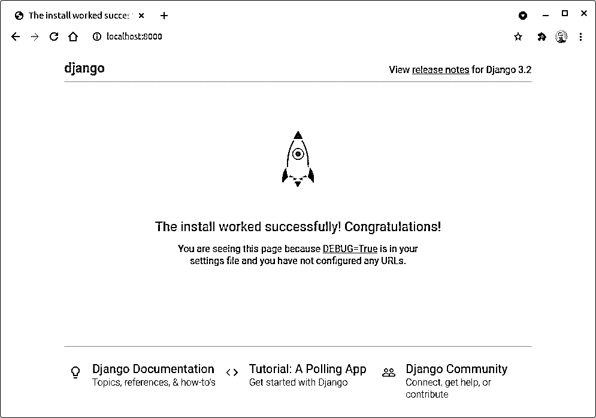
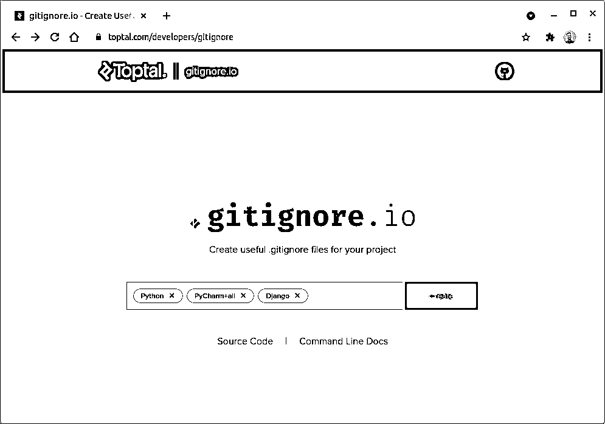
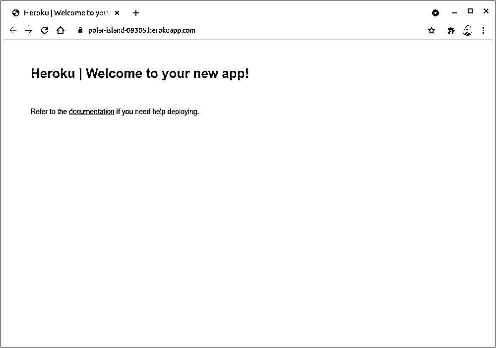
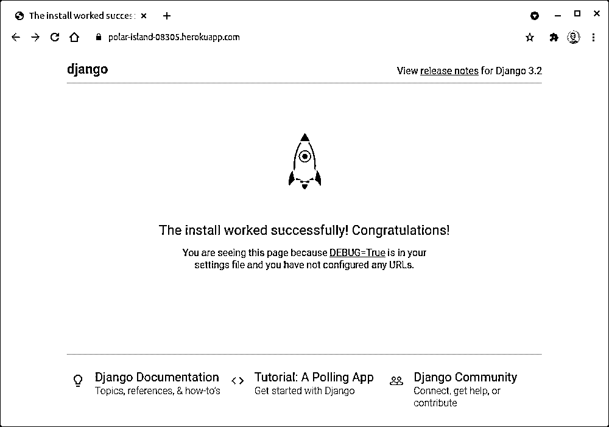
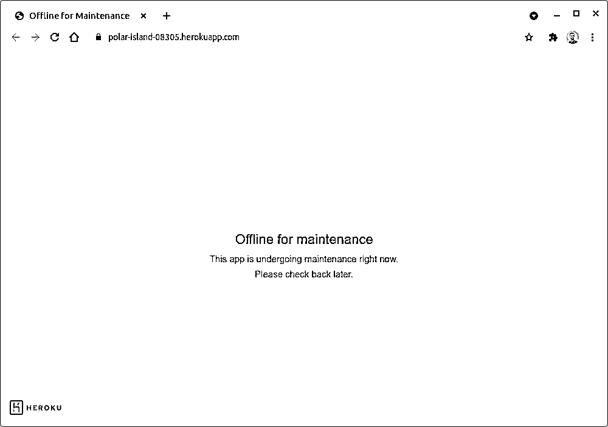
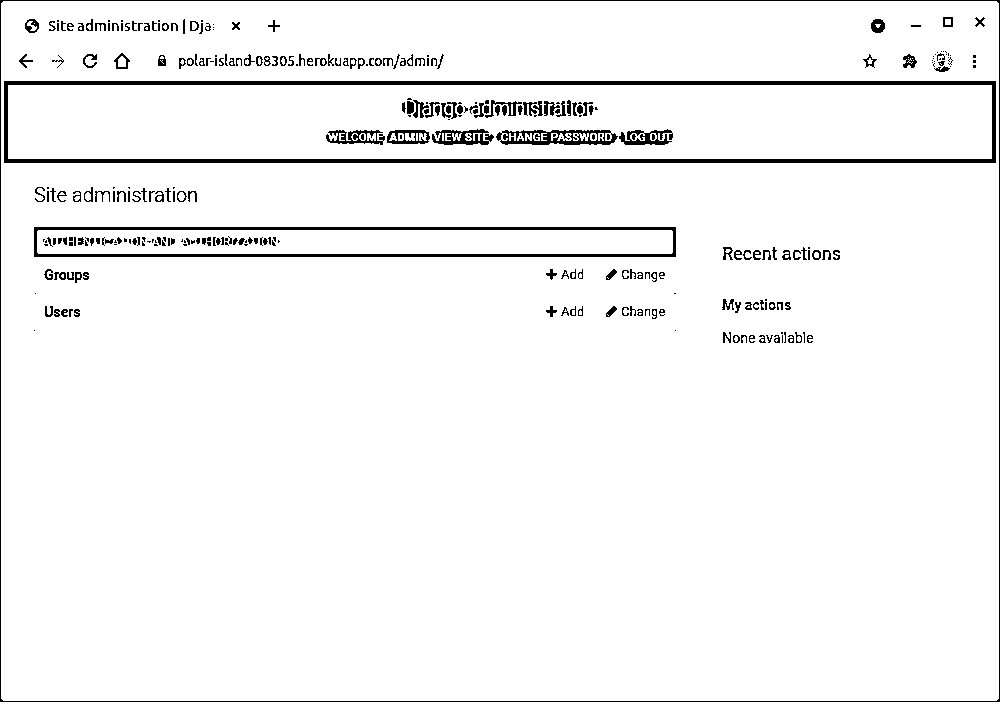

# 主持一个关于 Heroku 的 Django 项目

> 原文：<https://realpython.com/django-hosting-on-heroku/>

*立即观看**本教程有真实 Python 团队创建的相关视频课程。与书面教程一起观看，以加深您的理解: [**在 Heroku**](/courses/host-your-django-project-on-heroku/) 上主持您的 Django 项目

作为一名网络开发新手，你已经建立了你的[文件夹应用](https://realpython.com/get-started-with-django-1/)，并在 [GitHub](https://realpython.com/python-git-github-intro/) 上分享了你的代码。也许，你希望吸引技术招聘人员来获得你的第一份[编程工作](https://realpython.com/learning-paths/python-interview/)。许多编码训练营的毕业生可能也在做同样的事情。为了让自己与众不同，增加被关注的机会，你可以开始在网上主持你的 Django 项目。

对于一个业余爱好 Django 项目，你会想要一个免费的托管服务，快速的设置，友好的用户界面，与你现有的技术很好的整合。虽然 [GitHub Pages](https://pages.github.com/) 非常适合托管静态网站和使用 [JavaScript](https://realpython.com/python-vs-javascript/) 的网站，但是您需要一个 **web 服务器**来运行您的 [Flask](https://realpython.com/learning-paths/flask-by-example/) 或 [Django](https://realpython.com/learning-paths/django-web-development/) 项目。

有几个主要的**云平台**提供商以不同的模式运营，但是在本教程中你将探索 [Heroku](https://www.heroku.com/) 。它符合所有条件——免费、设置快速、用户友好，并且与 Django 很好地集成在一起——并且是许多初创公司最喜欢的云平台提供商。

**在本教程中，您将学习如何:**

*   在几分钟内让你的 **Django** 项目**上线**
*   使用 **Git** 将您的项目部署到 Heroku
*   使用 Django-Heroku 集成库
*   将你的 Django 项目挂接到一个独立的关系数据库上
*   管理**配置**以及**敏感数据**

要继续学习，您可以通过单击下面的链接下载代码和其他资源:

**获取源代码:** [点击这里获取 Django 项目以及本教程中各个步骤的快照。](https://realpython.com/bonus/django-hosting-heroku-project-code/)

## 演示:您将构建什么

您将创建一个基本的 Django 项目，并直接从终端将它部署到云中。最后，你将拥有一个公共的、可共享的链接，链接到你的第一个 Heroku 应用。

这里有一个一分钟的视频演示了必要的步骤，从初始化一个空的 Git 存储库到在浏览器中查看您完成的项目。坚持看完，快速预览一下你将在本教程中发现的内容:

[https://player.vimeo.com/video/552465720?background=1](https://player.vimeo.com/video/552465720?background=1)

除了上面截屏中显示的步骤之外，稍后你会发现更多的步骤，但是这应该足以让你对如何在本教程中使用 Heroku 有一个大致的了解。

[*Remove ads*](/account/join/)

## 项目概述

本教程并不是关于构建任何特定的项目，而是使用 **Heroku** 在云中托管一个项目。虽然 Heroku 支持[各种语言](https://www.heroku.com/languages)和 web 框架，但你会坚持使用 Python 和 Django。如果您手头没有任何 Django 项目，也不用担心。第一步将带您搭建一个新的 Django 项目，让您快速入门。或者，您可以使用一个现成的示例项目，稍后您会发现。

一旦你准备好你的 Django 项目，你将注册一个免费的 Heroku 账户。接下来，您将下载一个方便的命令行工具，帮助您在线管理应用程序。正如上面的截图所示，命令行是使用 Heroku 的一种快捷方式。最后，您将在新配置的 Heroku 实例上完成一个已部署的 Django 项目。你可以把你的最终结果想象成你未来[项目想法](https://realpython.com/intermediate-python-project-ideas/)的占位符。

## 先决条件

在开始之前，请确保您已经熟悉了 Django web 框架的基础知识，并且已经习惯使用它来建立一个基本项目。

**注意:**如果你在 Flask 方面比 Django 更有经验，那么你可以看看类似的关于[使用 Heroku](https://realpython.com/flask-by-example-part-1-project-setup/) 部署 Python Flask 示例应用程序的教程。

您还应该安装和配置一个 [Git](https://realpython.com/python-git-github-intro/) 客户端，以便您可以从命令行方便地与 Heroku 平台交互。最后，你应该认真考虑为你的项目使用一个[虚拟环境](https://realpython.com/python-virtual-environments-a-primer/)。如果你还没有一个特定的虚拟环境工具，你很快就会在本教程中找到一些选项。

## 步骤 1:搭建 Django 项目来托管

要在云中托管 Django web 应用程序，您需要一个有效的 Django 项目。就本教程的目的而言，不必详细说明。如果你时间不够，可以随意使用你的一个爱好项目或者[构建一个样本投资组合应用](https://realpython.com/get-started-with-django-1/)，然后跳到[创建你的本地 Git 库](#step-2-create-a-local-git-repository)。否则，留下来从头开始做一个全新的项目。

### 创建虚拟环境

通过创建一个不会与其他项目共享的隔离虚拟环境来开始每个项目是一个好习惯。这可以使您的依赖项保持有序，并有助于避免包版本冲突。一些依赖管理器和打包工具，如 [Pipenv](https://realpython.com/pipenv-guide/) 或[poems](https://python-poetry.org/)自动创建和管理虚拟环境，让你遵循最佳实践。当你开始一个新项目时，许多[ide](https://realpython.com/python-ides-code-editors-guide/)比如 [PyCharm](https://realpython.com/pycharm-guide/) 也会默认这样做。

然而，创建 Python 虚拟环境的最可靠和可移植的方式是从命令行手动完成。您可以使用外部工具如 [virtualenvwrapper](https://virtualenvwrapper.readthedocs.io/en/latest/) 或直接调用内置[模块](https://docs.python.org/3/library/venv.html)。虽然 virtualenvwrapper 将所有环境保存在预定义的父文件夹中，但是`venv`希望您为每个环境分别指定一个文件夹。

在本教程中，您将使用标准的`venv`模块。习惯上将虚拟环境放在**项目的根文件夹**中，所以让我们先创建一个，并将工作目录改为:

```py
$ mkdir portfolio-project
$ cd portfolio-project/
```

你现在在`portfolio-project`文件夹中，这将是你的项目的家。要在这里创建一个虚拟环境，只需运行`venv`模块并为您的新环境提供一个路径。默认情况下，文件夹名称将成为环境的名称。如果你愿意，你可以用可选的`--prompt`参数给它一个自定义名称:

```py
$ python3 -m venv ./venv --prompt portfolio
```

以前导点(`.`)开始的路径表示它相对于当前工作目录。虽然不是强制性的，但这个点清楚地表明了你的意图。不管怎样，这个命令应该会在您的`portfolio-project`根目录下创建一个`venv`子目录:

```py
portfolio-project/
│
└── venv/
```

这个新的子目录包含 Python 解释器的副本以及一些管理脚本。现在，您已经准备好将项目依赖项安装到其中了。

### 安装项目依赖关系

大多数实际项目都依赖于外部库。Django 是一个第三方 web 框架，并不是 Python 自带的。您必须在项目的虚拟环境中安装它以及它自己的依赖项。

如果您还没有激活虚拟环境，请不要忘记激活它。为此，您需要执行虚拟环境的`bin/`子文件夹中的一个 shell 脚本中的命令。例如，如果您使用的是 [Bash](https://en.wikipedia.org/wiki/Bash_(Unix_shell)) ，那么就可以获得`activate`脚本:

```py
$ source venv/bin/activate
```

现在, **shell 提示符**应该显示一个带有虚拟环境名称的前缀，以表明它已被激活。您可以仔细检查特定命令指向的可执行文件:

```py
(portfolio) $ which python
/home/jdoe/portfolio-project/venv/bin/python
```

上面的输出确认了运行`python`将执行位于您的虚拟环境中的相应文件。现在，让我们为您的 Django 项目安装**依赖项**。

你需要一个相当新版本的 Django。根据您阅读本文的时间，可能会有更新的版本。为了避免潜在的兼容性问题，您可能希望指定与编写本教程时使用的版本相同的版本:

```py
(portfolio) $ python -m pip install django==3.2.5
```

这将安装 Django 的 3.2.5 版本。包名是不区分大小写的，所以无论您键入`django`还是`Django`都没有关系。

**注意:**有时候，你会看到一个关于 [`pip`](https://realpython.com/what-is-pip/) 新版本可用的警告。忽略此警告通常是无害的，但是如果您在生产环境中，出于安全原因，您需要考虑升级:

```py
(portfolio) $ python -m pip install --upgrade pip
```

或者，如果版本检查困扰您并且您知道可能的后果，您可以在[配置文件](https://pip.pypa.io/en/stable/user_guide/#configuration)中禁用版本检查。

安装 Django 带来了一些额外的[传递依赖关系](https://en.wikipedia.org/wiki/Transitive_dependency)，您可以通过列出它们来揭示:

```py
(portfolio) $ python -m pip list
Package    Version
---------- -------
asgiref    3.4.1
Django     3.2.5
pip        21.1.3
pytz       2021.1
setuptools 56.0.0
sqlparse   0.4.1
```

因为您希望其他人能够毫无问题地下载和运行您的代码，所以您需要确保可重复的构建。这就是**冻结**的目的。它以一种特殊的格式输出大致相同的依赖集及其子依赖集:

```py
(portfolio) $ python -m pip freeze
asgiref==3.4.1
Django==3.2.5
pytz==2021.1
sqlparse==0.4.1
```

这些基本上是`pip install`命令的参数。然而，它们通常被封装在一个或多个[需求文件](https://pip.pypa.io/en/stable/user_guide/#requirements-files)中，这些文件`pip`可以一次性使用。要创建这样一个文件，您可以重定向`freeze`命令的输出:

```py
(portfolio) $ python -m pip freeze > requirements.txt
```

这个文件应该提交到您的 Git 存储库中，这样其他人就可以通过以下方式使用`pip`安装它的内容:

```py
(portfolio) $ python -m pip install -r requirements.txt
```

目前，您唯一的依赖项是 Django 及其子依赖项。但是，您必须记住，每次添加或删除任何依赖项时，都要重新生成并提交需求文件。这就是前面提到的包管理器可能派上用场的地方。

解决了这个问题，让我们开始一个新的 Django 项目！

[*Remove ads*](/account/join/)

### Django 项目

每个 Django 项目都由遵循特定命名约定的相似文件和文件夹组成。您可以手动创建这些文件和文件夹，但是自动创建通常更快更方便。

当你安装 Django 时，它为管理任务[提供了一个命令行工具](https://docs.djangoproject.com/en/3.2/ref/django-admin/)，比如引导新项目。该工具位于虚拟环境的`bin/`子文件夹中:

```py
(portfolio) $ which django-admin
/home/jdoe/portfolio-project/venv/bin/django-admin
```

您可以在 shell 中运行它，并传递新项目的名称以及创建默认文件和文件夹的目标目录:

```py
(portfolio) $ django-admin startproject portfolio .
```

或者，您可以通过调用`django`模块来获得相同的结果:

```py
(portfolio) $ python -m django startproject portfolio .
```

注意这两个命令末尾的点，它指示您当前的工作目录`portfolio-project`作为目标。如果没有它，该命令将创建另一个与您的项目同名的父文件夹。

如果你得到一个`command not found`错误或者`ModuleNotFound` [异常](https://realpython.com/python-exceptions/)，那么确保你已经激活了安装 Django 的同一个虚拟环境。其他一些常见的错误是将项目命名为与一个内置对象相同，或者没有使用有效的 Python 标识符。

**注意:**使用管理工具从头开始一个新的 Django 项目既快速又灵活，但是需要大量的手工劳动。如果您计划托管生产级 web 应用程序，那么您需要配置安全性、数据源等等。选择一个遵循最佳实践的[项目模板](https://docs.djangoproject.com/en/3.2/ref/django-admin/#cmdoption-startapp-template)可能会为您省去一些麻烦。

之后，您应该有这样的目录布局:

```py
portfolio-project/
│
├── portfolio/
│   ├── __init__.py
│   ├── asgi.py
│   ├── settings.py
│   ├── urls.py
│   └── wsgi.py
│
├── venv/
│
├── manage.py
└── requirements.txt
```

您创建了一个名为`portfolio`的**管理应用程序**，它包含项目级设置和带有 URL 模式的主文件，以及其他一些东西。您还创建了`manage.py`脚本，它方便地包装了`django-admin`并与您的项目挂钩。

现在，您已经有了一个基本的、可运行的 Django 项目。此时，您通常会启动一个或多个 **Django 应用程序**并定义它们的视图和模型，但是对于本教程来说它们不是必需的。

### 更新本地数据库模式(可选)

这一步是可选的，但是如果您想要使用 [Django admin](https://realpython.com/customize-django-admin-python/) 视图或者定义定制应用和模型，那么您最终需要更新您的**数据库模式**。默认情况下，Django 带来了一个基于文件的 [SQLite 数据库](https://realpython.com/python-sql-libraries/)，方便测试和运行本地开发服务器。这样，你就不需要安装和设置一个像 [MySQL](https://realpython.com/python-mysql/) 或 [PostgreSQL](https://www.postgresql.org/) 这样的成熟数据库。

要更新数据库模式，运行`migrate`子命令:

```py
(portfolio) $ python manage.py migrate
```

在成功应用所有未决的**迁移**之后，您将在项目根文件夹中找到一个名为`db.sqlite3`的新文件:

```py
portfolio-project/
│
├── portfolio/
│   ├── __init__.py
│   ├── asgi.py
│   ├── settings.py
│   ├── urls.py
│   └── wsgi.py
│
├── venv/
│
├── db.sqlite3 ├── manage.py
└── requirements.txt
```

您可以使用 [`sqlite3`命令行实用程序](https://sqlite.org/cli.html)、Python 内置的 [`sqlite3`模块](https://docs.python.org/3/library/sqlite3.html)或者您喜欢的数据库管理工具来检查它的内容。到目前为止，这个文件应该包含一些负责身份验证、会话管理等的内部应用程序的表，以及一个跟踪应用的迁移的元表。

[*Remove ads*](/account/join/)

### 运行本地开发服务器

在将 Heroku 放在项目之上增加复杂性之前，在本地计算机上测试所有东西是有意义的。这可以让你省去很多不必要的调试。幸运的是，Django 附带了一个用于开发目的的轻量级 web 服务器，几乎不需要配置。

**注意:**从技术上讲，您可以利用 Heroku 上 Django 内置的相同开发服务器。然而，它不是为处理现实生活中的交通而设计的，也不安全。你最好使用像 [Gunicorn](https://devcenter.heroku.com/articles/python-gunicorn) 这样的 [WSGI](https://www.python.org/dev/peps/pep-0333/) 服务器。

要运行开发服务器，请在您之前激活虚拟环境的终端窗口中键入以下命令:

```py
(portfolio) $ python manage.py runserver
```

默认情况下，它将在[本地主机](https://en.wikipedia.org/wiki/Localhost)端口 8000 上启动服务器。如果另一个应用程序已经在使用 8000，您可以调整端口号。服务器将继续监视项目源文件中的变化，并在必要时自动重新加载它们。当服务器仍在运行时，在 web 浏览器中导航到该 URL:

```py
http://127.0.0.1:8000/
```

主机`127.0.0.1`代表虚拟本地网络接口上的 [IP 地址](https://en.wikipedia.org/wiki/IP_address)之一。如果一切顺利，并且您没有更改默认的项目设置，那么您应该进入 Django 欢迎页面:

[](https://files.realpython.com/media/django-screenshot.4ca613ca8c96.png)

<figcaption class="figure-caption text-center">Django Welcome Page on Localhost</figcaption>

万岁！火箭已经起飞，您的 Django 项目已经准备好部署到云中。

## 步骤 2:创建一个本地 Git 存储库

现在，您已经有了一个可以工作的 Django 项目，是时候采取下一步措施在云中托管它了。在本节中，您将探索在 Heroku 平台上构建和部署应用程序的可用选项。如果您还没有为您的项目创建一个本地 Git 存储库，那么您还需要创建一个本地 Git 存储库。在这一步结束时，您将准备好深入 Heroku 工具链。

Heroku 提供了至少五种不同的方式来部署您的项目:

1.  **Git:** 将提交推送到 Heroku 上的远程 Git 存储库
2.  **GitHub:** 合并拉取请求时自动触发部署
3.  **Docker:** 将 [Docker](https://realpython.com/python-versions-docker/) 图像推送到 Heroku 容器注册表
4.  **API:** 以编程方式自动化您的部署
5.  **Web:** 从 Heroku 仪表板手动部署

最直接和以开发人员为中心的方法是第一种。许多软件开发人员已经在日常生活中使用 Git，所以 Heroku 的入门门槛相当低。`git`命令让您在 Heroku 中完成很多工作，这就是为什么您将在本教程中使用 Git。

### 初始化一个空的 Git 存储库

使用组合键 `Ctrl` + `C` 或 `Cmd` + `C` 停止您的开发服务器，或者打开另一个终端窗口，然后在您的项目根文件夹中初始化一个本地 Git 存储库:

```py
$ git init
```

您的虚拟环境是否活跃并不重要。它应该创建一个新的`.git`子文件夹，其中包含 Git 跟踪的文件的历史。名称以点开头的文件夹在 macOS 和 Linux 上是隐藏的。如果您想检查您是否成功地创建了它，那么使用`ls -a`命令来查看这个文件夹。

### 指定未跟踪的文件

告诉 Git 忽略哪些文件很有用，这样 Git 就不会再跟踪它们了。有些文件不应该是存储库的一部分。您通常应该忽略 [IDE 和代码编辑器](https://realpython.com/python-ides-code-editors-guide/)设置、包含密码等敏感数据的配置文件、Python 虚拟环境之类的二进制文件、缓存文件以及 SQLite 数据库之类的数据。

当您检查新 Git 存储库的当前状态时，它会列出工作目录中的所有文件，并建议将它们添加到存储库中:

```py
$ git status
On branch master

No commits yet

Untracked files:
 (use "git add <file>..." to include in what will be committed)
 .idea/
 __pycache__/
 db.sqlite3
 manage.py
 portfolio/
 requirements.txt
 venv/

nothing added to commit but untracked files present (use "git add" to track)
```

不是添加所有这些文件和文件夹，而是让 Git 忽略其中的一些，例如:

*   `.idea/`
*   `__pycache__/`
*   `db.sqlite3`
*   `venv/`

`.idea/`文件夹是 PyCharm 特有的。如果你使用的是 [Visual Studio Code](https://realpython.com/python-development-visual-studio-code/) 或其他编辑器，那么你需要将它们对应的文件和文件夹添加到这个列表中。在前面包含更多的文件名模式将让其他贡献者安全地使用他们选择的编辑器和 ide，而不必过于频繁地更新列表。

Git 寻找一个名为`.gitignore`的特殊文件，它通常放在您的存储库的根文件夹中。每行包含一个具体的文件名或一个要排除的通用文件名模式。你可以手动编辑这个文件，但是使用 [gitignore.io](http://gitignore.io/) 网站从一组预定义的组件中创建一个要快得多:

[](https://files.realpython.com/media/gitignoreio.50d4b3ccc037.png)

你会注意到，在地址栏中键入 *gitignore.io* 会将浏览器重定向到 Toptal 拥有的一个更详细的域。

在这里，您可以选择正在使用的编程语言、库和工具。当你对你的选择满意时，点击*创建*按钮。然后，将结果复制并粘贴到文本编辑器中，并将其作为`.gitignore`保存在您的项目根文件夹中，或者记下 URL 并在命令行中使用 [cURL](https://en.wikipedia.org/wiki/CURL) 来下载文件:

```py
$ curl https://www.toptal.com/developers/gitignore/api/python,pycharm+all,django > .gitignore
```

如果您发现自己在重复输入这个 URL，那么您可以考虑在您的 shell 中定义一个[别名命令](https://docs.gitignore.io/install/command-line)，这应该是最容易记住的:

```py
$ git ignore python,pycharm+all,django > .gitignore
```

实现同一个目标通常有多种方式，了解不同的选择可以教会你很多。不管怎样，在创建了`.gitignore`文件之后，您的存储库状态应该如下所示:

```py
$ git status
On branch master

No commits yet

Untracked files:
 (use "git add <file>..." to include in what will be committed)
 .gitignore
 manage.py
 portfolio/
 requirements.txt

nothing added to commit but untracked files present (use "git add" to track)
```

创建本地 Git 存储库的剩余步骤是暂存您的更改，并在第一次提交时保存它们。

[*Remove ads*](/account/join/)

### 进行第一次提交

请记住，要通过 Git 使用 Heroku，您必须将代码推送到远程 Git 存储库。为此，您需要在本地存储库中至少有一个提交。首先，将新文件添加到**暂存区**，这是工作树和本地存储库之间的缓冲区。然后，重新检查状态以确认您没有遗漏任何内容:

```py
$ git add .
$ git status
On branch master

No commits yet

Changes to be committed:
 (use "git rm --cached <file>..." to unstage)
 new file:   .gitignore
 new file:   manage.py
 new file:   portfolio/__init__.py
 new file:   portfolio/asgi.py
 new file:   portfolio/settings.py
 new file:   portfolio/urls.py
 new file:   portfolio/wsgi.py
 new file:   requirements.txt
```

这些文件已经准备好提交，所以让我们获取它们的快照，并将其保存在本地存储库中:

```py
$ git commit -m "Initial commit"
```

提供一个描述性的提交消息来帮助您浏览变更历史总是一个好主意。根据经验，你的信息应该解释*为什么*你做出了改变。毕竟，任何人都可以查看 Git 日志来找出*到底对*做了什么更改。

好吧，到目前为止你学到了什么？您知道在 Heroku 平台上部署新版本通常需要将本地提交推送到 Git 远程。您已经创建了一个本地 Git 存储库，并进行了第一次提交。接下来，你需要创建你的免费 Heroku 账户。

## 第三步:创建一个免费的 Heroku 账户

现在，你已经准备好注册一个免费的 Heroku 账户，并根据你的喜好进行配置。

Django 标榜自己是有期限的完美主义者的网络框架。Heroku 采取了类似的自以为是的方法在云中托管 web 应用程序，旨在减少开发时间。它是一种高级安全的[平台即服务(PaaS)](https://en.wikipedia.org/wiki/Platform_as_a_service) ，可以减轻您的基础设施管理负担，让您专注于对您最重要的事情——编写代码。

**有趣的事实:** Heroku 基于[亚马逊网络服务(AWS)](https://aws.amazon.com/) ，另一个流行的云平台，主要以[基础设施即服务(IaaS)](https://en.wikipedia.org/wiki/Infrastructure_as_a_service) 模式运行。它比 Heroku 灵活得多，价格也更实惠，但需要一定的专业知识。

许多初创公司和较小的公司在早期发展阶段没有一支熟练的 DevOps 工程师团队。就投资回报而言，Heroku 可能是这些公司的一个方便的解决方案。

### 报名

要开始使用 Heroku，请访问 Heroku 注册页面，填写注册表格，然后等待带有链接的电子邮件来确认您的帐户。它会将您带到密码设置页面。配置完成后，您将能够进入新的 Heroku 仪表板。您需要做的第一件事是阅读并接受服务条款。

### 启用多因素身份验证(可选)

这一步完全是可选的，但 Heroku 可能会让你注册[多因素认证(MFA)](https://devcenter.heroku.com/articles/multi-factor-authentication) 以增加对你的帐户的保护，确保其安全。这项功能也被称为**双因素认证** (2FA)，因为它通常只包含两个阶段来验证您的身份。

有趣的事实:我的网飞个人账户曾一度遭到黑客攻击，有人可以使用我的信用卡，甚至在我取消订阅很久之后。从那以后，我在所有的在线服务中启用了双因素认证。

当登录到你的 Heroku 仪表盘时，点击右上角的忍者头像，选择*账户设置*，然后向下滚动，直到你可以看到*多重身份验证*部分。点击标有*设置多重身份验证*的按钮，选择您的验证方法:

*   *Salesforce 认证器*
*   *一次性密码生成器*
*   *安全密钥*
*   *内置认证器*
*   *恢复代码*

您应该选择哪种验证方法？

[Salesforce](https://www.salesforce.com/) 是 2010 年收购 Heroku 的母公司，这就是为什么他们宣传他们的专有移动应用程序是你的首选。然而，如果你已经在其他地方使用了另一个验证器应用程序，那么选择*一次性密码生成器*选项，用你的应用程序扫描二维码。

*安全密钥*需要一个外部硬件 USB 令牌，而*内置认证器*方法可以利用你的设备的指纹读取器，例如，如果它带有一个的话。

最后，*恢复码*可以作为额外的密码。即使你只打算在手机上使用验证程序，你也应该下载恢复代码作为备份。如果没有其他方法来验证您的身份，如果您的手机丢失、损坏或升级，您将无法再次登录您的 Heroku 帐户。相信我，我也经历过！

Heroku 曾经提供另一种验证方法，通过发送短信到你的手机，但是他们停止了这种方法，因为安全问题。

[*Remove ads*](/account/join/)

### 添加付款方式(可选)

如果你不愿意和 Heroku 分享你的信用卡号码，那也没关系。在合理的限制下，这项服务将继续免费运行。然而，即使你不打算花一分钱在云端托管你的 Django 项目，你仍然可以考虑连接你的支付细节。原因如下。

在写这篇教程的时候，你每月只能获得 550 个小时的免费帐号。这相当于每天 24 小时使用单个计算机实例的 22 天。当你用信用卡验证你的账户时，这个数字会上升到每月 1000 小时。

**注意:**无论您是否验证您的帐户，在 30 分钟窗口内没有接收到任何 HTTP 流量的免费层上的 web 应用程序都会自动进入睡眠状态。这可以节省你的空闲时间，但如果你的应用程序没有正常的流量，会让用户体验变得更糟。当有人想在待机模式下使用你的网络应用程序时，需要几秒钟才能再次启动。

验证你的账户的其他好处包括可以使用免费的[插件](https://devcenter.heroku.com/articles/managing-add-ons)如关系数据库，建立一个[自定义域](https://devcenter.heroku.com/articles/custom-domains)等等。请记住，如果您决定与 Heroku 共享您的账单信息，那么启用多因素身份认证是一项值得做的工作。

到目前为止，你一直通过 Heroku 的网络界面与他们互动。虽然这无疑是方便和直观的，但是在线托管 Django 项目的最快方式是使用命令行。

## 步骤 4:安装 Heroku CLI

在终端中工作是任何开发人员的基本技能。起初，输入命令可能看起来令人生畏，但是在看到它的威力后，它变成了第二天性。为了获得无缝的开发体验，您需要安装 **Heroku 命令行界面(CLI)** 。

Heroku CLI 将允许您直接从终端创建和管理 web 应用程序。在这一步中，您将学习一些基本命令以及如何显示它们的文档。首先，按照针对您的操作系统的[安装说明](https://devcenter.heroku.com/articles/heroku-cli)进行操作。完成后，使用以下命令确认安装成功:

```py
$ heroku --version
```

如果找到了`heroku`命令，并且您使用了最新版本的 Heroku CLI，那么您可以[在您的 shell 中启用自动完成](https://devcenter.heroku.com/articles/heroku-cli-autocomplete)。当您按下 `Tab` 键时，它会自动完成命令及其参数，节省时间并防止输入错误。

**注意:**该工具需要一个 [Node.js](https://nodejs.org/en/) 服务器，大多数安装方法都捆绑了这个服务器。它也是一个开源项目，这意味着你可以在 GitHub 上看看它的[源代码](https://github.com/heroku/cli)。

Heroku CLI 有一个模块化的**插件架构**，这意味着它的特性是独立的，并且遵循相同的模式。要获得所有可用命令的列表，请在终端中键入`heroku help`或简单地键入`heroku`:

```py
$ heroku
CLI to interact with Heroku

VERSION
 heroku/7.56.0 linux-x64 node-v12.21.0

USAGE
 $ heroku [COMMAND]

COMMANDS
 access          manage user access to apps
 addons          tools and services for developing, extending, (...)
 apps            manage apps on Heroku
 auth            check 2fa status
(...)
```

有时，一个命令的名字可能不会泄露它的用途。如果您想找到关于某个特定命令的更多细节并查看用法的快速示例，那么使用`--help`标志:

```py
$ heroku auth --help
check 2fa status

USAGE
 $ heroku auth:COMMAND

COMMANDS
 auth:2fa     check 2fa status
 auth:login   login with your Heroku credentials
 auth:logout  clears local login credentials and invalidates API session
 auth:token   outputs current CLI authentication token.
 auth:whoami  display the current logged in user
```

这里，您通过使用`--help`标志来请求关于`auth`命令的更多信息。您可以看到，`auth`后面应该跟一个冒号(`:`和另一个命令。通过键入`heroku auth:2fa`，您要求 Heroku CLI 检查您的双因素身份验证设置的状态:

```py
$ heroku auth:2fa --help
check 2fa status

USAGE
 $ heroku auth:2fa

ALIASES
 $ heroku 2fa
 $ heroku twofactor

COMMANDS
 auth:2fa:disable  disables 2fa on account
```

Heroku CLI 命令是分层的。它们通常有一个或多个子命令，您可以在冒号后指定，就像上面的例子一样。此外，这些子命令中的一些可能在命令层级的顶层有一个可用的**别名**。例如，键入`heroku auth:2fa`与`heroku 2fa`或`heroku twofactor`具有相同的效果:

```py
$ heroku auth:2fa
Two-factor authentication is enabled

$ heroku 2fa
Two-factor authentication is enabled

$ heroku twofactor
Two-factor authentication is enabled
```

所有三个命令都给出相同的结果，这让您可以选择更容易记住的命令。

在这一小段中，您在计算机上安装了 Heroku CLI，并熟悉了它的语法。您已经看到了一些方便的命令。现在，为了充分利用这个命令行工具，您需要登录您的 Heroku 帐户。

[*Remove ads*](/account/join/)

## 第五步:使用 Heroku CLI 登录

即使不创建 Heroku 帐户，也可以安装 Heroku CLI。但是，你必须验证你的身份，证明你有一个相应的 Heroku 账号，才能用它做一些有意义的事情。在某些情况下，您甚至可能有多个帐户，因此登录允许您指定在给定时刻使用哪个帐户。

稍后您将了解到，您不会永久保持登录状态。这是一个好习惯，登录以确保您有访问权限，并确保您使用正确的帐户。最直接的登录方式是通过`heroku login`命令:

```py
$ heroku login
heroku: Press any key to open up the browser to login or q to exit:
```

这将打开您的默认网络浏览器，如果您以前登录过 Heroku 仪表板，就可以很容易地获得您的**会话 cookie**。否则，您需要提供您的用户名、密码，如果您启用了双因素身份验证，还可能需要另一个身份证明。成功登录后，您可以关闭选项卡或浏览器窗口并返回到终端。

**注意:**您也可以使用无头模式登录，方法是在命令后面附加`--interactive`标志，它会提示您输入用户名和密码，而不是启动 web 浏览器。但是，这在启用多因素身份认证的情况下不起作用。

当您使用 CLI 登录时，您的会话 cookies 的暴露是暂时的，因为 Heroku 会生成一个新的**授权令牌**，它将在有限的时间内有效。它将令牌存储在您的[主目录](https://en.wikipedia.org/wiki/Home_directory)中的标准`.netrc`文件中，但是您也可以使用 Heroku 仪表板或`heroku auth`和`heroku authorizations`插件来检查它:

```py
$ heroku auth:whoami
jdoe@company.com

$ heroku auth:token
 ›   Warning: token will expire today at 11:29 PM
 ›   Use heroku authorizations:create to generate a long-term token
f904774c-ffc8-45ae-8683-8bee0c91aa57

$ heroku authorizations
Heroku CLI login from 54.239.28.85  059ed27c-d04a-4349-9dba-83a0169277ae  global

$ heroku authorizations:info 059ed27c-d04a-4349-9dba-83a0169277ae
Client:      <none>
ID:          059ed27c-d04a-4349-9dba-83a0169277ae
Description: Heroku CLI login from 54.239.28.85
Scope:       global
Token:       f904774c-ffc8-45ae-8683-8bee0c91aa57
Expires at:  Fri Jul 02 2021 23:29:01 GMT+0200 (Central European Summer Time) (in about 8 hours)
Updated at:  Fri Jul 02 2021 15:29:01 GMT+0200 (Central European Summer Time) (1 minute ago)
```

在撰写本教程时，**到期策略**似乎有点小故障。官方文档规定，默认情况下，它应该保持一年的有效性，而 Heroku CLI 显示大约一个月，这也对应于会话 cookie 到期。使用 Heroku web 界面手动重新生成令牌可以将时间减少到大约八个小时。但是如果你测试实际的失效日期，你会发现它完全不同。如果您在学习本教程时对到期策略感到好奇，请自行探索。

无论如何，`heroku login`命令只用于开发。在生产环境中，您通常会使用`authorizations`插件生成一个永远不会过期的**长期用户授权**。通过 [Heroku API](https://devcenter.heroku.com/articles/platform-api-reference) ，它可以方便地用于脚本和自动化目的。

## 第六步:创建一个 Heroku 应用程序

在这一步，您将创建您的第一个 Heroku 应用程序，并了解它如何与 Git 集成。最后，你将为你的项目拥有一个公开可用的**域名地址**。

在 Django 项目中，应用程序是封装可重用功能的独立代码单元。另一方面， **Heroku apps** 工作起来就像可扩展的虚拟计算机，能够托管你的整个 Django 项目。每个应用程序都由源代码、必须安装的依赖项列表和运行项目的命令组成。

最起码，每个项目都有一个 Heroku 应用程序，但拥有更多应用程序并不罕见。例如，您可能希望同时运行项目的**开发**、**试运行**和**生产**版本。每个都可以连接到不同的数据源，并具有不同的特性集。

**注意:** [Heroku pipelines](https://devcenter.heroku.com/articles/pipelines) 让你按需创建、提升和销毁应用，以促进[连续交付](https://en.wikipedia.org/wiki/Continuous_delivery)工作流。你甚至可以连接 GitHub，这样每个[特性分支](https://www.atlassian.com/git/tutorials/comparing-workflows/feature-branch-workflow)都会收到一个临时的测试应用。

要使用 Heroku CLI 创建您的第一个应用程序，请确保您已经登录 Heroku，并运行`heroku apps:create`命令或其别名:

```py
$ heroku create
Creating app... done, ⬢ polar-island-08305
https://polar-island-08305.herokuapp.com/ | https://git.heroku.com/polar-island-08305.git
```

默认情况下，它会随机选择一个保证唯一的应用名称，比如`polar-island-08305`。你也可以选择自己的域名，但是它必须在整个 Heroku 平台上是唯一的，因为它是你免费获得的域名的一部分。您会很快发现它是否已被占用:

```py
$ heroku create portfolio-project
Creating ⬢ portfolio-project... !
 ▸    Name portfolio-project is already taken
```

如果你想想有多少人使用 Heroku，那么有人已经创建了一个名为`portfolio-project`的应用程序就不足为奇了。当您在 Git 存储库中运行`heroku create`命令时，Heroku 会自动添加一个新的**远程服务器**到您的`.git/config`文件中:

```py
$ tail -n3 .git/config
[remote "heroku"]
 url = https://git.heroku.com/polar-island-08305.git
 fetch = +refs/heads/*:refs/remotes/heroku/*
```

Git 配置文件中的最后三行定义了一个名为`heroku`的远程服务器，它指向您唯一的 Heroku 应用程序。

通常，在克隆存储库之后，您的 Git 配置中会有一个远程服务器——例如 GitHub 或 Bitbucket。然而，在一个本地存储库中可以有多个 [Git remotes](https://git-scm.com/book/en/v2/Git-Basics-Working-with-Remotes) 。稍后您将使用该功能发布新的应用程序并部署到 Heroku。

**注意:**有时候，使用 Git 会变得很混乱。如果您注意到您意外地在本地 Git 存储库之外或通过 web 界面创建了一个 Heroku 应用程序，那么您仍然可以手动添加相应的 Git remote。首先，将您的目录更改为项目根文件夹。接下来，列出您的应用程序以找到所需的名称:

```py
$ heroku apps
=== jdoe@company.com Apps
fathomless-savannah-61591
polar-island-08305 sleepy-thicket-59477
```

在您确定了您的应用程序的名称(在本例中为`polar-island-08305`)之后，您可以使用`git remote add`命令或 Heroku CLI 中相应的`git`插件来添加一个名为`heroku`的遥控器:

```py
$ heroku git:remote --app polar-island-08305
set git remote heroku to https://git.heroku.com/polar-island-08305.git
```

这将添加一个名为`heroku`的远程服务器，除非另有说明。

当你创建一个新的应用程序时，它会告诉你它在`.herokuapp.com`域中的公共网址。在本教程中，公共网址是`https://polar-island-08305.herokuapp.com`，但是您的将会不同。尝试将您的 web 浏览器导航到您的独特域，看看接下来会发生什么。如果你不记得确切的网址，只需在项目根文件夹中，在终端中键入`heroku open`命令。它将打开一个新的浏览器窗口并获取正确的资源:

[](https://files.realpython.com/media/heroku-empty-app.40e21de9aa7b.png)

<figcaption class="figure-caption text-center">Empty Heroku App</figcaption>

干得好！你的 Heroku 应用已经响应 HTTP 请求。然而，它目前是空的，这就是为什么 Heroku 显示一个通用的占位符视图，而不是你的内容。让我们将您的 Django 项目部署到这个空白应用程序中。

[*Remove ads*](/account/join/)

## 步骤 7:将 Django 项目部署到 Heroku

至此，您已经具备了在 Heroku 上开始托管 Django 项目所需的一切。然而，如果您现在尝试将您的项目部署到 Heroku，它会失败，因为 Heroku 不知道如何构建、打包和运行您的项目。它也不知道如何安装需求文件中列出的特定 Python 依赖项。你现在会解决的。

### 选择一个构建包

Heroku 自动化了许多部署步骤，但它需要了解您的项目设置和技术堆栈。构建和部署项目的方法被称为**构建包**。已经有一些官方的构建包可以用于许多后端技术，包括 Node.js、Ruby、Java、PHP、Python、Go、Scala 和 Clojure。除此之外，你可以为不太流行的语言如 c 找到第三方的[构建包](https://elements.heroku.com/buildpacks)

您可以在创建新应用程序时手动设置一个，或者让 Heroku 根据存储库中的文件检测它。Heroku 识别 Python 项目的一种方法是在项目根目录中查找`requirements.txt`文件。确保您已经创建了一个，这可能是在[设置您的虚拟环境](#create-a-virtual-environment)时用`pip freeze`完成的，并且您已经将它提交到本地存储库。

其他一些有助于 Heroku 识别 Python 项目的文件是`Pipfile`和`setup.py`。Heroku 也将认可 Django web 框架并为其提供特殊支持。所以如果你的项目包括`requirements.txt`、`Pipfile`或`setup.py`，那么通常不需要设置构建包，除非你在处理一些边缘情况。

### 选择 Python 版本(可选)

默认情况下，Heroku 将选择一个最新的 Python 版本来运行您的项目。但是，您可以通过在项目根目录中放置一个`runtime.txt`文件来指定不同版本的 Python 解释器，记住要提交它:

```py
$ echo python-3.9.6 > runtime.txt
$ git add runtime.txt
$ git commit -m "Request a specific Python version"
```

请注意，您的 Python 版本必须包含[语义版本](https://semver.org/)的所有`major.minor.patch`组件。虽然 Python 只有少数几个[支持的运行时](https://devcenter.heroku.com/articles/python-support#supported-runtimes)，但你通常可以调整补丁版本。还有对 [PyPy](https://realpython.com/pypy-faster-python/) 的测试版支持。

### 指定要运行的流程

既然 Heroku 知道了如何构建您的 Django 项目，它需要知道如何运行它。一个项目可以由多个组件组成，比如 web 组件、后台工作人员、关系数据库、 [NoSQL 数据库、](https://realpython.com/introduction-to-mongodb-and-python/)、[计划作业](https://realpython.com/asynchronous-tasks-with-django-and-celery/)等等。每个组件都在单独的进程中运行。

有四种主要的流程类型:

1.  `web`:接收 HTTP 流量
2.  `worker`:在后台执行工作
3.  `clock`:执行预定的工作
4.  `release`:部署前运行任务

在本教程中，您将只查看 web 过程，因为每个 Django 项目至少需要一个。您可以在名为`Procfile`的文件中定义它，该文件必须放在您的项目根目录中:

```py
portfolio-project/
│
├── .git/
│
├── portfolio/
│   ├── __init__.py
│   ├── asgi.py
│   ├── settings.py
│   ├── urls.py
│   └── wsgi.py
│
├── venv/
│
├── .gitignore
├── db.sqlite3
├── manage.py
├── Procfile ├── requirements.txt
└── runtime.txt
```

`Procfile`是一种单一的、与语言无关的格式，用于定义组成项目的过程。它将指导 Heroku 如何运行你的网络服务器。虽然在生产环境中运行 Django 项目不推荐使用内置的开发服务器，但是您可以在本练习中使用它:

```py
$ echo "web: python manage.py runserver 0.0.0.0:\$PORT" > Procfile
$ git add Procfile
$ git commit -m "Specify the command to run your project"
```

为了让 Heroku cloud 之外的世界可以访问服务器，您将地址指定为`0.0.0.0`而不是默认的`localhost`。它会将服务器绑定在一个**公共网络接口**上。Heroku 通过`PORT`环境变量提供端口号。

现在，您可以通过使用 Heroku CLI 在本地运行 Django 项目来测试这个配置:

```py
$ heroku local
```

默认情况下，如果没有明确指定流程类型，它将运行`web`流程。`heroku local`命令与`heroku local web`相同。同样，如果你没有用`--port`标志设置端口号，那么它将使用默认端口`5000`。

现在，您已经指定了希望 Heroku 运行的进程。当您在 web 浏览器中打开 URL `http://localhost:5000/`时，您应该会在 Django 欢迎页面上再次看到熟悉的火箭。然而，要在`http://0.0.0.0:5000/`通过公共接口访问相同的资源，您需要调整 Django 配置，否则您将收到一个*错误请求*错误。

[*Remove ads*](/account/join/)

### 配置 Django

您之前构建了一个基本的 Django 项目，现在是时候配置它了，这样它就可以在您的 Heroku 实例上运行了。配置一个 Django 项目可以让您微调各种[设置](https://docs.djangoproject.com/en/3.2/topics/settings/)，从数据库凭证到[模板引擎](https://docs.djangoproject.com/en/3.2/topics/templates/)。

要通过非本地网络地址访问 Django 项目，您需要在项目设置中指定`ALLOWED_HOSTS`。除此之外，Django buildpack for Python 会为您运行`collectstatic`命令，这需要定义`STATIC_ROOT`选项。不管您是否使用 Heroku，在部署 Django 项目时，还有一些配置选项需要更改，但在这个阶段它们不是强制性的。

不用手动配置 Django，您可以走捷径，安装一个方便的 [`django-heroku`](https://pypi.org/project/django-heroku/) 包来完成所有的工作。

**注:**不再维护`django-heroku`包，对应的 GitHub 库已存档。如果您只想尝试将 Django 项目部署到 Heroku，这可能不是问题。然而，对于生产级应用程序，您可以尝试一个名为 [`django-on-heroku`](https://pypi.org/project/django-on-heroku/) 的分支，这是 Adam 在下面的评论部分建议的。或者，你可以使用 Eric Matthes 在他的博客上描述的实验性构建包。

在继续之前，请确保您处于正确的虚拟环境中，并记住在完成后刷新您的需求文件:

```py
(portfolio) $ python -m pip install django-heroku
(portfolio) $ python -m pip freeze > requirements.txt
```

这将用项目的最新依赖项替换您的需求文件的内容。接下来，将这两行 Python 代码添加到您的`portfolio/settings.py`文件中，并且不要忘记之后返回到项目根文件夹:

```py
(portfolio) $ pushd portfolio/
(portfolio) $ echo "import django_heroku" >> settings.py
(portfolio) $ echo "django_heroku.settings(locals())" >> settings.py
(portfolio) $ popd
```

或者，如果命令`cd portfolio/`和`cd ..`在您的 shell 中不起作用，请使用它们来代替 [`pushd`和`popd`](https://en.wikipedia.org/wiki/Pushd_and_popd) 命令。

因为您在上面用追加重定向操作符(`>>`)追加了`echo`命令的输出，所以现在在 Django 设置文件的最底部有两行代码:

```py
# portfolio/settings.py

# ...

import django_heroku
django_heroku.settings(locals())
```

这将使用基于项目布局和环境变量的值来更新本地[名称空间](https://realpython.com/python-namespaces-scope/)中的变量。最后，不要忘记将您的更改提交到本地 Git 存储库:

```py
(portfolio) $ git commit -am "Automatic configuration with django-heroku"
```

现在，您应该能够使用`0.0.0.0`主机名访问您的 Django web 服务器了。没有它，你将无法通过公共 Heroku 域访问你的应用程序。

### 配置 Heroku App

您为项目选择了一个构建包和一个 Python 版本。您还指定了 web 进程来接收 HTTP 流量，并配置了您的 Django 项目。将 Django 项目部署到 Heroku 之前的最后一个配置步骤需要在远程 Heroku 应用程序上设置环境变量。

不管你的云提供商是谁，关注**配置管理**是很重要的。特别是，敏感信息，如数据库密码或用于加密签名 Django 会话的密钥，不能存储在代码中。你还应该记得禁用**调试模式**，因为这会让你的网站容易受到黑客攻击。但是，在本教程中保持原样，因为您不会有任何自定义内容要显示。

传递这种数据的一种常见方式是**环境变量**。Heroku 让你通过`heroku config`命令管理应用程序的环境变量。例如，您可能想从环境变量中读取 Django 密钥，而不是将其硬编码到`settings.py`文件中。

既然安装了`django-heroku`，就可以让它处理细节。它检测`SECRET_KEY`环境变量，并使用它来设置用于加密签名的 Django 秘密密钥。确保密钥的安全至关重要。在`portfolio/settings.py`中，找到 Django 定义`SECRET_KEY`变量的自动生成行，并将其注释掉:

```py
# SECURITY WARNING: keep the secret key used in production secret!
# SECRET_KEY = 'django-insecure-#+^6_jx%8rmq9oa(frs7ro4pvr6qn7...
```

除了注释掉`SECRET_KEY`变量，您还可以将它一起移除。但是现在不要着急，因为你可能马上就要用到它。

当你现在尝试运行`heroku local`时，它会抱怨 Django 秘密密钥不再被定义，并且服务器不会启动。要解决这个问题，您可以在当前的终端会话中设置变量，但是更方便的是创建一个名为 [`.env`](https://platform.sh/blog/2021/we-need-to-talk-about-the-env/) 的特殊文件，其中包含所有用于本地测试的变量。Heroku CLI 将识别该文件并加载其中定义的环境变量。

**注意:** Git 不应该跟踪你刚刚创建的`.env`文件。只要您遵循前面的步骤并使用 gitignore.io 网站，它应该已经列在您的`.gitignore`文件中了。

生成随机密钥的一种快速方法是使用 OpenSSL 命令行工具:

```py
$ echo "SECRET_KEY=$(openssl rand -base64 32)" > .env
```

如果您的计算机上没有安装 OpenSSL，而您使用的是 Linux 机器或 macOS，那么您也可以使用 [Unix 伪随机数生成器](https://en.wikipedia.org/wiki//dev/random)来生成密钥:

```py
$ echo "SECRET_KEY=$(head -c 32 /dev/urandom | base64)" > .env
```

这两种方法中的任何一种都将确保一个真正随机的密钥。您可能会尝试使用一个不太安全的工具，比如`md5sum`，并用当前日期作为种子，但是这并不真正安全，因为攻击者可能会枚举可能的输出。

如果上面的命令在您的操作系统上都不起作用，那么暂时取消对`portfolio/settings.py`中的`SECRET_KEY`变量的注释，并在您的活动虚拟环境中启动 Django shell:

```py
(portfolio) $ python manage.py shell
```

在那里，您将能够使用 Django 的内置管理工具生成一个新的随机密钥:

>>>

```py
>>> from django.core.management.utils import get_random_secret_key
>>> print(get_random_secret_key())
6aj9il2xu2vqwvnitsg@!+4-8t3%zwr@$agm7x%o%yb2t9ivt%
```

抓住那个键，用它来设置您的`.env`文件中的`SECRET_KEY`变量:

```py
$ echo 'SECRET_KEY=6aj9il2xu2vqwvnitsg@!+4-8t3%zwr@$agm7x%o%yb2t9ivt%' > .env
```

`heroku local`命令自动选择在`.env`文件中定义的环境变量，所以它现在应该像预期的那样工作。如果取消注释，记得再次注释掉`SECRET_KEY`变量！

最后一步是为远程 Heroku 应用程序指定 Django 密钥:

```py
$ heroku config:set SECRET_KEY='6aj9il2xu2vqwvnitsg@!+4-8t3%zwr@$agm7x%o%yb2t9ivt%'
Setting SECRET_KEY and restarting ⬢ polar-island-08305... done, v3
SECRET_KEY: 6aj9il2xu2vqwvnitsg@!+4-8t3%zwr@$agm7x%o%yb2t9ivt%
```

这将在远程 Heroku 基础设施上永久设置一个新的环境变量，该变量将立即可供您的 Heroku 应用程序使用。您可以在 Heroku 仪表板中或使用 Heroku CLI 显示这些环境变量:

```py
$ heroku config
=== polar-island-08305 Config Vars
SECRET_KEY: 6aj9il2xu2vqwvnitsg@!+4-8t3%zwr@$agm7x%o%yb2t9ivt%

$ heroku config:get SECRET_KEY
6aj9il2xu2vqwvnitsg@!+4-8t3%zwr@$agm7x%o%yb2t9ivt%
```

稍后，您可以用另一个值覆盖它或将其完全删除。轮换机密通常是减轻安全威胁的好主意。一旦秘密泄露，你应该迅速改变它，以防止未经授权的访问和限制损害。

[*Remove ads*](/account/join/)

### 发布一个应用程序

您可能已经注意到，用`heroku config:set`命令配置环境变量会在输出中产生一个特殊的`"v3"`字符串，类似于版本号。这不是巧合。每次你通过部署新代码或改变配置来修改你的应用，你都在创建一个新的**版本**，它增加了你之前看到的那个 v 编号。

要按时间顺序列出您的应用发布历史，请再次使用 Heroku CLI:

```py
$ heroku releases
=== polar-island-08305 Releases - Current: v3
v3  Set SECRET_KEY config vars  jdoe@company.com  2021/07/02 14:24:29 +0200 (~ 1h ago)
v2  Enable Logplex              jdoe@company.com  2021/07/02 14:19:56 +0200 (~ 1h ago)
v1  Initial release             jdoe@company.com  2021/07/02 14:19:48 +0200 (~ 1h ago)
```

列表中的项目从最新到最早排序。版本号总是递增的。即使你**将你的应用程序回滚**到以前的版本，它也会创建一个新的版本来保存完整的历史。

使用 Heroku 发布新的应用程序可以归结为将代码提交到您的本地 Git 存储库，然后将您的分支推送到远程 Heroku 服务器。但是，在这样做之前，一定要仔细检查`git status`中是否有任何未提交的更改，并在必要时将它们添加到本地存储库中，例如:

```py
$ git status
On branch master
Changes not staged for commit:
 (use "git add <file>..." to update what will be committed)
 (use "git restore <file>..." to discard changes in working directory)
 modified:   portfolio/settings.py

no changes added to commit (use "git add" and/or "git commit -a")

$ git add .
$ git commit -m "Remove a hardcoded Django secret key"
```

虽然您可以推送任何本地分支，但是必须将它推送到特定的**远程分支**才能让部署工作。Heroku 仅从远程 [`main`或`master`](https://devcenter.heroku.com/articles/git-branches) 分支部署。如果您已经使用`git init`命令创建了您的存储库，那么您的默认分支应该被命名为`master`。或者，如果你在 GitHub 上创建了它，那么它将被命名为`main`。

因为`main`和`master`分支都存在于远程 Heroku 服务器上，所以您可以使用一种简单的语法来触发构建和部署:

```py
$ git push heroku master
```

这里，`master`指的是您的本地和远程分支机构。如果您想推送一个不同的本地分支，那么指定它的名称，比如`bugfix/stack-overflow`，后跟一个冒号(`:`)和远程目标分支:

```py
$ git push heroku bugfix/stack-overflow:master
```

现在让我们将默认分支推到 Heroku，看看接下来会发生什么:

```py
$ git push heroku master
(...)
remote: Compressing source files... done.
remote: Building source:
remote:
remote: -----> Building on the Heroku-20 stack
remote: -----> Determining which buildpack to use for this app
remote: -----> Python app detected
remote: -----> Using Python version specified in runtime.txt
remote: -----> Installing python-3.9.6
remote: -----> Installing pip 20.2.4, setuptools 47.1.1 and wheel 0.36.2
remote: -----> Installing SQLite3
remote: -----> Installing requirements with pip
(...)
remote: -----> Compressing...
remote:        Done: 60.6M
remote: -----> Launching...
remote:        Released v6
remote:        https://polar-island-08305.herokuapp.com/ deployed to Heroku
remote:
remote: Verifying deploy... done.
To https://git.heroku.com/polar-island-08305.git
 * [new branch]      master -> master
```

将代码推送到 Heroku 就像推送到 GitHub、Bitbucket 或其他远程 Git 服务器一样。然而，除此之外，它还开始了构建过程。Heroku 将根据您的项目文件确定正确的构建包。它将使用您的`runtime.txt`文件中指定的 Python 解释器，并从`requirements.txt`安装依赖项。

在实践中，更方便的做法是将您的代码只推送到您选择的 Git 服务器，比如 GitHub，并让它通过一个 [webhook](https://docs.github.com/en/developers/webhooks-and-events/webhooks/about-webhooks) 触发 Heroku 上的构建。如果你想进一步探索，你可以在 Heroku 的官方文档中阅读关于 [GitHub 集成](https://devcenter.heroku.com/articles/github-integration)的内容。

**注意:**第一次向 Heroku 推送代码时，可能需要一段时间，因为平台需要启动一个新的 Python 环境，安装依赖项，并为其容器构建一个映像。但是，后续部署会更快，因为安装的依赖项已经被缓存。

您可以在浏览器中导航至 Heroku 应用程序的公共 URL。或者，在您的终端中键入`heroku open`命令将为您完成这项工作:

[](https://files.realpython.com/media/heroku-public.57248503221d.png)

<figcaption class="figure-caption text-center">Django Project Hosted on a Public Domain</figcaption>

恭喜你！您刚刚公开了您的项目。

[*Remove ads*](/account/join/)

## 步骤 8:建立一个关系数据库

干得好！你几乎已经完成了在 Heroku 上为你的 Django 项目设置主机的工作。这是等式的最后一部分，所以坚持一两分钟。

到目前为止，您一直使用 Django 预先配置的基于文件的 SQLite 数据库。它适合在你的本地计算机上测试，但不能在云中运行。Heroku 有一个**临时文件系统**，它会忘记自上次部署或服务器重启以来的所有更改。您需要一个独立的数据库引擎来将您的数据保存在云中。

在本教程中，您将使用 Heroku 提供的免费 PostgreSQL 实例作为完全托管的数据库服务。如果需要，可以使用不同的数据库引擎，但是 PostgreSQL 通常不需要额外的配置。

### 调配 PostgreSQL 服务器

当 Heroku 在你的项目中检测到 Django 框架时，它会自动旋转出一个免费但有限的 [PostgreSQL](https://devcenter.heroku.com/articles/heroku-postgresql) 实例。它用应用程序数据库的公共 URL 设置了`DATABASE_URL`环境变量。首次部署应用时会进行配置，这可以通过检查启用的附加组件和配置变量来确认:

```py
$ heroku addons

Add-on                                            Plan       Price  State
────────────────────────────────────────────────  ─────────  ─────  ───────
heroku-postgresql (postgresql-trapezoidal-06380)  hobby-dev  free   created
 └─ as DATABASE

The table above shows add-ons and the attachments to the current app (...)

$ heroku config
=== polar-island-08305 Config Vars
DATABASE_URL: postgres://ytfeiommjakmxb...amazonaws.com:5432/dcf99cdrgdaqba
SECRET_KEY:   6aj9il2xu2vqwvnitsg@!+4-8t3%zwr@$agm7x%o%yb2t9ivt%
```

通常，您需要在`portfolio/settings.py`中显式地使用该变量，但是因为您安装了`django-heroku`模块，所以不需要指定数据库 URL 或者用户名和密码。它会自动从环境变量中获取数据库 URL 并为您配置设置。

此外，您不必安装一个[数据库驱动程序](https://www.python.org/dev/peps/pep-0249/)来连接到 Heroku 提供的 PostgreSQL 实例。另一方面，最好针对生产环境中使用的同一类型的数据库进行本地开发。它促进了您的环境之间的[对等性](https://www.12factor.net/dev-prod-parity)，并让您利用给定数据库引擎提供的高级特性。

当您安装`django-heroku`时，它已经获取了`psycopg2`作为一个可传递的依赖项:

```py
(portfolio) $ pip list
Package         Version
--------------- -------
asgiref         3.4.1
dj-database-url 0.5.0
Django          3.2.5
django-heroku   0.3.1
pip             21.1.3
psycopg2        2.9.1 pytz            2021.1
setuptools      56.0.0
sqlparse        0.4.1
whitenoise      5.2.0
```

`psycopg2`是 PostgreSQL 数据库的 Python 驱动。由于驱动程序已经存在于您的环境中，您可以立即开始在您的应用程序中使用 PostgreSQL。

在免费的爱好发展计划上，Heroku 设置了一些限制。您最多可以有 10，000 行，必须适合 1 GB 的存储空间。到数据库的连接不能超过 20 个。没有缓存，性能受到限制，还有许多其他限制。

您可以随时使用`heroku pg`命令查看 Heroku 提供的 PostgreSQL 数据库的详细信息:

```py
$ heroku pg
=== DATABASE_URL
Plan:                  Hobby-dev
Status:                Available
Connections:           1/20
PG Version:            13.3
Created:               2021-07-02 08:55 UTC
Data Size:             7.9 MB
Tables:                0
Rows:                  0/10000 (In compliance) - refreshing
Fork/Follow:           Unsupported
Rollback:              Unsupported
Continuous Protection: Off
Add-on:                postgresql-trapezoidal-06380
```

这个简短的摘要包含有关当前连接数、数据库大小、表和行数等信息。

在接下来的小节中，您将了解如何在 Heroku 上使用 PostgreSQL 数据库做一些有用的事情。

### 更新远程数据库模式

当您在 Django 应用程序中定义新模型时，您通常会创建新的迁移文件，并将它们应用于数据库。要更新远程 PostgreSQL 实例的模式，只需在 Heroku 环境中运行与之前相同的迁移命令。稍后您将看到推荐的方法，但是现在，您可以手动运行适当的命令:

```py
$ heroku run python manage.py migrate
Running python manage.py migrate on ⬢ polar-island-08305... up, run.1434 (Free)
Operations to perform:
 Apply all migrations: admin, auth, contenttypes, sessions
Running migrations:
 Applying contenttypes.0001_initial... OK
 Applying auth.0001_initial... OK
(...)
```

`run`插件启动一个名为**一次性 dyno** 的临时容器，它类似于一个 [Docker](https://realpython.com/tutorials/docker/) 容器，可以访问你的应用程序的源代码及其配置。因为 dynos 运行的是 Linux 容器，所以您可以在其中一个容器中执行任何命令，包括交互式终端会话:

```py
$ heroku run bash
Running bash on ⬢ polar-island-08305... up, run.9405 (Free)
(~) $ python manage.py migrate
Operations to perform:
 Apply all migrations: admin, auth, contenttypes, sessions
Running migrations:
 No migrations to apply.
```

在临时 dyno 中运行 [Bash shell](https://en.wikipedia.org/wiki/Bash_(Unix_shell)) 是检查或操作 Heroku 应用程序状态的常见做法。您可以将其视为登录到远程服务器。唯一的区别是，您启动的是一个一次性虚拟机，它包含项目文件的副本，并接收与您的动态 web dyno 相同的环境变量。

然而，这种运行数据库迁移的方式并不是最可靠的，因为您可能会忘记它或者在以后的道路上犯错误。您最好在`Procfile`中通过添加突出显示的行来自动完成这一步:

```py
web: python manage.py runserver 0.0.0.0:$PORT
release: python manage.py migrate
```

现在，每次您发布新版本时，Heroku 都会负责应用任何未完成的迁移:

```py
$ git commit -am "Automate remote migrations"
$ git push heroku master
(...)
remote: Verifying deploy... done.
remote: Running release command...
remote:
remote: Operations to perform:
remote:   Apply all migrations: admin, auth, contenttypes, sessions
remote: Running migrations:
remote:   No migrations to apply.
To https://git.heroku.com/polar-island-08305.git
 d9f4c04..ebe7bc5  master -> master
```

它仍然让您选择是否真正[进行任何新的迁移](https://docs.djangoproject.com/en/3.2/ref/django-admin/#django-admin-makemigrations)。当您正在进行可能需要一段时间才能完成的大型迁移时，请考虑启用[维护模式](https://devcenter.heroku.com/articles/maintenance-mode)，以避免在用户使用您的应用时损坏或丢失数据:

```py
$ heroku maintenance:on
Enabling maintenance mode for ⬢ polar-island-08305... done
```

Heroku 将在维护模式下显示此友好页面:

[](https://files.realpython.com/media/heroku-maintenance.353814c466bd.png)

<figcaption class="figure-caption text-center">Heroku App in the Maintenance Mode</figcaption>

完成迁移后，别忘了用`heroku maintenance:off`禁用它。

### 填充数据库

通过应用迁移，您已经为 Django 模型创建了数据库表，但是这些表大部分时间都是空的。你迟早会想得到一些数据。与数据库交互的最佳方式是通过 [Django admin](https://docs.djangoproject.com/en/3.2/ref/contrib/admin/) 接口。要开始使用它，您必须首先远程创建一个超级用户:

```py
$ heroku run python manage.py createsuperuser
Running python manage.py createsuperuser on ⬢ polar-island-08305... up, run.2976 (Free)
Username (leave blank to use 'u23948'): admin
Email address: jdoe@company.com
Password:
Password (again):
Superuser created successfully.
```

记得在相应的命令前加上`heroku run`，在连接到你的远程 Heroku 应用程序的数据库中创建超级用户。在为超级用户提供了唯一的名称和安全密码之后，您将能够登录到 Django admin 视图，并开始向您的数据库添加记录。

您可以通过访问位于您唯一的 Heroku 应用程序域名后的`/admin`路径来访问 Django 管理视图，例如:

```py
https://polar-island-08305.herokuapp.com/admin/
```

登录后应该是这样的:

[](https://files.realpython.com/media/heroku-admin.f52cb0461e9d.png)

<figcaption class="figure-caption text-center">Django Admin Site on Heroku</figcaption>

直接操纵远程数据库的一个选择是从 Heroku 获取`DATABASE_URL`变量，并解密它的各个组件，通过您最喜欢的 SQL 客户机进行连接。或者，Heroku CLI 提供了一个方便的`psql`插件，它像标准 PostgreSQL 交互终端一样工作，但不需要安装任何软件:

```py
$ heroku psql
--> Connecting to postgresql-round-16446
psql (10.17 (Ubuntu 10.17-0ubuntu0.18.04.1), server 13.3 (Ubuntu 13.3-1.pgdg20.04+1))
WARNING: psql major version 10, server major version 13.
 Some psql features might not work.
SSL connection (protocol: TLSv1.3, cipher: TLS_AES_256_GCM_SHA384, bits: 256, compression: off)
Type "help" for help.

polar-island-08305::DATABASE=> SELECT username, email FROM auth_user;
 username |      email
----------+------------------
 admin    | jdoe@company.com
(1 row)
```

请注意,`heroku psql`命令如何将您连接到 Heroku 基础设施上的正确数据库，而不需要任何细节，如主机名、用户名或密码。此外，您不必安装 PostgreSQL 客户端来使用 SQL 查询其中一个表。

作为 Django 开发人员，您可能习惯于依赖它的**对象关系映射器(ORM)** ，而不是手动输入 SQL 查询。您可以通过在远程 Heroku 应用程序中启动交互式 [Django shell](https://docs.djangoproject.com/en/3.2/ref/django-admin/#shell) 来再次使用 Heroku CLI:

```py
$ heroku run python manage.py shell
Running python manage.py shell on ⬢ polar-island-08305... up, run.9914 (Free)
Python 3.9.6 (default, Jul 02 2021, 15:33:41)
[GCC 9.3.0] on linux
Type "help", "copyright", "credits" or "license" for more information.
(InteractiveConsole)
```

接下来，导入内置的`User`模型，并使用其管理器从数据库中检索相应的用户对象:

>>>

```py
>>> from django.contrib.auth.models import User
>>> User.objects.all()
<QuerySet [<User: admin>]>
```

您应该会看到您之前创建的超级用户。使用 Django shell 可以让您用面向对象的 API 查询连接的数据库。如果你不喜欢默认 shell，那么你可以安装一个**替代 Python REPL** 比如 [IPython](https://ipython.org/) 或者 [bpython](https://bpython-interpreter.org/) ，Django 会识别它。

好吧，就这样！您在 Heroku 上托管了一个成熟的 Django 项目，并连接了一个关系数据库。例如，你现在可以在 GitHub 上的 [README](https://en.wikipedia.org/wiki/README) 文件中分享它的公共链接，让全世界欣赏你的作品。

## 结论

现在，您知道如何将您的想法转化为您的朋友和家人会喜欢的实时 web 应用程序。也许，人力资源部门的人会偶然发现你的一个项目并给你一份工作。注册一个免费的 Heroku 账户来托管你的 Django 代码是进入云计算世界的最好方式之一。

**在本教程中，您已经学会了如何:**

*   在几分钟内让你的 **Django** 项目**上线**
*   使用 **Git** 将您的项目部署到 Heroku
*   使用 Django-Heroku 集成库
*   将你的 Django 项目挂接到一个独立的关系数据库上
*   管理**配置**以及**敏感数据**

您可以通过下面的链接下载最终的源代码以及各个步骤的快照:

**获取源代码:** [点击这里获取 Django 项目以及本教程中各个步骤的快照。](https://realpython.com/bonus/django-hosting-heroku-project-code/)

## 接下来的步骤

本教程仅仅触及了 Heroku 的皮毛。它有意掩盖了许多细节，但 Heroku 提供了更多，即使是有限的免费帐户。如果你想让你的项目更上一层楼，这里有一些想法可以考虑:

*   **配置一个 WSGI 服务器:**在公开您的项目之前，首先要做的是用更安全、更高效的东西替换内置的 Django 开发服务器，比如 Gunicorn。Django 提供了一个方便的[部署清单](https://docs.djangoproject.com/en/3.2/howto/deployment/checklist)，里面有你可以浏览的最佳实践。

*   **启用日志记录:**在云中运行的应用程序不在您的直接控制之下，这使得调试和故障排除比在本地机器上运行更困难。因此，您应该使用 Heroku 的一个附加组件来启用日志记录。

*   **提供静态文件:**使用外部服务，如亚马逊 S3 或内容交付网络(CDN)来托管静态资源，如 CSS、JavaScript 或图片。这可能会大大减轻您的 web 服务器的负载，并利用缓存加快下载速度。

*   **提供动态内容:**由于 Heroku 的临时文件系统，用户提供给你的应用程序的数据不能作为本地文件保存。使用关系数据库甚至 NoSQL 数据库并不总是最有效或最方便的选择。在这种情况下，你可能想使用外部服务，如亚马逊 S3。

*   **添加自定义域:**默认情况下，你的 Heroku 应用托管在`.herokuapp.com`域上。虽然它对于业余爱好项目来说既快速又有用，但您可能希望在更专业的环境中使用自定义域。

*   **添加 SSL 证书:**当您定义自定义域时，您必须提供相应的 SSL 证书，以通过 HTTPS 公开您的应用。这是当今世界的必备工具，因为一些网络浏览器供应商已经宣布，他们未来不会显示不安全的网站。

*   **与 GitHub 挂钩:**当一个 pull 请求被合并到主分支时，您可以通过允许 GitHub 触发一个新的构建和发布来自动化您的部署。这减少了手动步骤的数量，并保证了源代码的安全。

*   **使用 Heroku 管道:** Heroku 鼓励您以最小的努力遵循最佳实践。它通过可选地自动化测试环境的创建，提供了一个连续的交付工作流。

*   **启用自动扩展:**随着应用的增长，它将需要面对不断增长的资源需求。大多数电子商务平台每年圣诞节前后都会经历一次流量高峰。这个问题的当代解决方案是水平扩展，它将你的应用程序复制成多个副本来满足需求。自动缩放可以在任何需要的时候响应这样的峰值。

*   **拆分成微服务:**当你的项目由多个独立的[微服务](https://en.wikipedia.org/wiki/Microservices)组成时，水平伸缩效果最好，可以单独伸缩。这种架构可以加快开发速度，但也带来了一些挑战。

*   **从 Heroku 迁移:**一旦你接触了 Heroku，你可能会考虑迁移到另一个云平台，如[谷歌应用引擎](https://realpython.com/python-web-applications/)甚至底层亚马逊基础设施，以降低你的成本。

继续探索 Heroku 网站上的[官方文档](https://devcenter.heroku.com/)和 [Python 教程](https://devcenter.heroku.com/categories/python-support)，以找到关于这些主题的更多细节。

*立即观看**本教程有真实 Python 团队创建的相关视频课程。与书面教程一起观看，以加深您的理解: [**在 Heroku**](/courses/host-your-django-project-on-heroku/) 上主持您的 Django 项目************