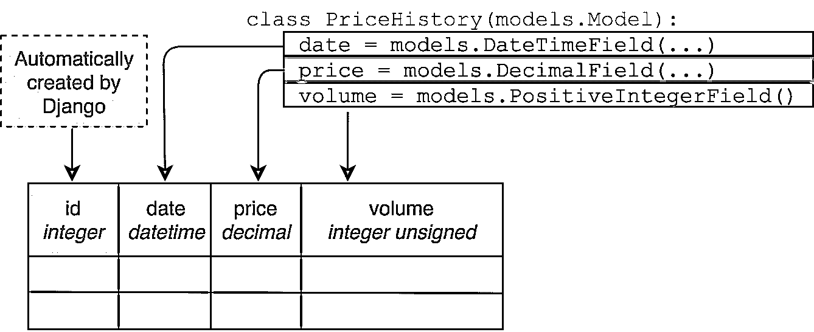

# Django 迁移:入门

> 原文：<https://realpython.com/django-migrations-a-primer/>

*立即观看**本教程有真实 Python 团队创建的相关视频课程。和书面教程一起看，加深理解: [**姜戈大迁徙 101**](/courses/django-migrations-101/)

从版本 1.7 开始，Django 就内置了对数据库迁移的支持。在 [Django](https://realpython.com/get-started-with-django-1/) 中，数据库迁移通常与模型密切相关:每当您编写一个新模型时，您还会生成一个迁移以在数据库中创建必要的表。然而，迁移可以做得更多。

通过四篇文章和一个视频，您将了解 Django 迁移是如何工作的，以及如何充分利用它们:

*   第 1 部分:Django 迁移:入门(当前文章)
*   第 2 部分:[深入探讨迁移](https://realpython.com/digging-deeper-into-migrations/)
*   第 3 部分:[数据迁移](https://realpython.com/data-migrations/)
*   视频: [Django 1.7 迁移-初级教程](https://realpython.com/django-migrations-a-primer/#video)

在本文中，您将熟悉 Django 迁移，并了解以下内容:

*   如何在不编写任何 SQL 的情况下创建数据库表
*   如何在更改模型后自动修改数据库
*   如何恢复对数据库所做的更改

**免费奖励:** [点击此处获取免费的 Django 学习资源指南(PDF)](#) ，该指南向您展示了构建 Python + Django web 应用程序时要避免的技巧和窍门以及常见的陷阱。

## 迁移解决的问题

如果您是 Django 或 web 开发的新手，您可能不熟悉数据库迁移的概念，也不清楚为什么这是个好主意。

首先，让我们快速定义几个术语，以确保每个人都在同一页上。Django 被设计为使用关系数据库 T1，存储在关系数据库管理系统中，如 T2 的 PostgreSQL T3、T4 的 MySQL T5 或 T6 的 SQLite T7。

在关系数据库中，数据组织在表中。数据库表有一定数量的列，但它可以有任意数量的行。每一列都有一个特定的数据类型，比如某个最大长度的字符串或正整数。对所有表及其列和各自数据类型的描述称为数据库模式。

Django 支持的所有数据库系统都使用 SQL 语言来创建、读取、更新和删除关系数据库中的数据。SQL 还用于创建、更改和删除数据库表本身。

直接使用 SQL 可能很麻烦，所以为了让您的生活更轻松，Django 附带了一个对象关系映射器，简称 ORM。ORM 将关系数据库映射到面向对象编程的世界。你不用 SQL 定义数据库表，而是用 Python 编写 [Django 模型](https://docs.djangoproject.com/en/2.1/topics/db/models/)。您的模型定义了数据库字段，这些字段对应于它们的数据库表中的列。

下面是一个 Django 模型类如何映射到数据库表的例子:

[](https://files.realpython.com/media/model_to_schema.4e4b8506dc26.png)

但是仅仅在 Python 文件中定义一个模型类并不能让一个数据库表神奇地凭空出现。创建数据库表来存储 Django 模型是数据库迁移的工作。此外，每当您对模型进行更改时，比如添加一个字段，数据库也必须进行更改。迁移也能解决这个问题。

以下是 Django 迁移让您的生活更轻松的几种方式。

[*Remove ads*](/account/join/)

### 在没有 SQL 的情况下更改数据库

如果没有迁移，您将不得不连接到您的数据库，键入一堆 SQL 命令，或者使用类似于 [PHPMyAdmin](https://www.phpmyadmin.net/) 的图形工具，在每次您想要更改您的模型定义时修改数据库模式。

在 Django 中，迁移主要是用 Python 编写的，所以除非你有非常高级的用例，否则你不需要了解任何 SQL。

### 避免重复

创建一个模型，然后编写 SQL 来为它创建数据库表，这将是重复的。

迁移从您的模型中生成，确保您[不会重复自己](https://en.wikipedia.org/wiki/Don%27t_repeat_yourself)。

### 确保模型定义和数据库模式同步

通常，您有多个数据库实例，例如，团队中的每个开发人员有一个数据库，一个用于测试的数据库和一个包含实时数据的数据库。

如果没有迁移，您将不得不在每个数据库上执行任何模式更改，而且您将不得不跟踪对哪个数据库已经进行了哪些更改。

使用 Django 迁移，您可以轻松地将多个数据库与您的模型保持同步。

### 在版本控制中跟踪数据库模式变更

像 Git 这样的版本控制系统对于代码来说非常优秀，但是对于数据库模式来说就不那么好了。

因为在 Django 中，迁移是普通的 Python，所以您可以将它们放在版本控制系统中，就像任何其他代码一样。

到目前为止，您有望相信迁移是一个有用且强大的工具。让我们开始学习如何释放这种力量。

## 建立 Django 项目

在本教程中，您将使用一个简单的比特币追踪器应用程序作为示例项目。

第一步是安装 Django。下面是如何在 Linux 或 macOS X 上使用[虚拟环境](https://realpython.com/python-virtual-environments-a-primer/)实现这一点:

```py
$ python3 -m venv env
$ source env/bin/activate
(env) $ pip install "Django==2.1.*"
...
Successfully installed Django-2.1.3
```

现在，您已经创建了一个新的虚拟环境并激活了它，还在该虚拟环境中安装了 Django。

请注意，在 Windows 上，您将运行`env/bin/activate.bat`而不是`source env/bin/activate`来激活您的虚拟环境。

为了更容易阅读，从现在开始，控制台示例将不包括提示的`(env)`部分。

安装 Django 后，您可以使用以下命令创建项目:

```py
$ django-admin.py startproject bitcoin_tracker
$ cd bitcoin_tracker
$ python manage.py startapp historical_data
```

这给了你一个简单的项目和一个名为`historical_data`的应用。您现在应该有这样的目录结构:

```py
bitcoin_tracker/
|
├── bitcoin_tracker/
│   ├── __init__.py
│   ├── settings.py
│   ├── urls.py
│   └── wsgi.py
|
├── historical_data/
│   ├── __init__.py
│   ├── admin.py
│   ├── apps.py
│   ├── migrations/
│   │   └── __init__.py
|   |
│   ├── models.py
│   ├── tests.py
│   └── views.py
|
└── manage.py
```

在`bitcoin_tracker`目录中，有两个子目录:`bitcoin_tracker`用于项目范围的文件，而`historical_data`包含您创建的应用程序的文件。

现在，为了创建一个模型，在`historical_data/models.py`中添加这个类:

```py
class PriceHistory(models.Model):
    date = models.DateTimeField(auto_now_add=True)
    price = models.DecimalField(max_digits=7, decimal_places=2)
    volume = models.PositiveIntegerField()
```

这是跟踪比特币价格的基本模型。

另外，不要忘记将新创建的应用程序添加到`settings.INSTALLED_APPS`。打开`bitcoin_tracker/settings.py`并将`historical_data`追加到列表`INSTALLED_APPS`中，就像这样:

```py
INSTALLED_APPS = [
    'django.contrib.admin',
    'django.contrib.auth',
    'django.contrib.contenttypes',
    'django.contrib.sessions',
    'django.contrib.messages',
    'django.contrib.staticfiles',
    'historical_data',
]
```

这个项目的其他设置都很好。本教程假设您的项目被配置为使用默认的 [SQLite 数据库](https://realpython.com/python-sqlite-sqlalchemy/)。

[*Remove ads*](/account/join/)

## 创建迁移

创建了模型之后，您需要做的第一件事就是为它创建一个迁移。您可以使用以下命令来完成此操作:

```py
$ python manage.py makemigrations historical_data
Migrations for 'historical_data':
 historical_data/migrations/0001_initial.py
 - Create model PriceHistory
```

**注意:**指定应用程序的名称`historical_data`，是可选的。关闭它会为所有应用程序创建迁移。

这将创建迁移文件，指导 Django 如何为应用程序中定义的模型创建数据库表。让我们再看一下目录树:

```py
bitcoin_tracker/
|
├── bitcoin_tracker/
│   ├── __init__.py
│   ├── settings.py
│   ├── urls.py
│   └── wsgi.py
|
├── historical_data/
│   ├── migrations/
│   │   ├── 0001_initial.py │   │   └── __init__.py
|   |
│   ├── __init__.py
│   ├── admin.py
│   ├── apps.py
│   ├── models.py
│   ├── tests.py
│   └── views.py
|
├── db.sqlite3
└── manage.py
```

如您所见，`migrations`目录现在包含了一个新文件:`0001_initial.py`。

**注意:**您可能会注意到，运行`makemigrations`命令还会创建文件`db.sqlite3`，其中包含您的 SQLite 数据库。

当您试图访问一个不存在的 SQLite3 数据库文件时，它将被自动创建。

这种行为是 SQLite3 特有的。如果你使用任何其他数据库后端，如 PostgreSQL 或 [MySQL](https://realpython.com/python-mysql/) ，你必须在运行`makemigrations`之前*自己创建数据库。*

您可以使用 [`dbshell`管理命令](https://docs.djangoproject.com/en/2.1/ref/django-admin/#dbshell)来查看数据库。在 SQLite 中，列出所有表的命令很简单`.tables`:

```py
$ python manage.py dbshell
SQLite version 3.19.3 2017-06-27 16:48:08
Enter ".help" for usage hints.
sqlite> .tables
sqlite>
```

数据库仍然是空的。当您应用迁移时，这种情况将会改变。键入`.quit`退出 SQLite shell。

## 应用迁移

您现在已经创建了迁移，但是要在数据库中进行任何实际的更改，您必须使用管理命令`migrate`来应用它:

```py
$ python manage.py migrate
Operations to perform:
 Apply all migrations: admin, auth, contenttypes, historical_data, sessions
Running migrations:
 Applying contenttypes.0001_initial... OK
 Applying auth.0001_initial... OK
 Applying admin.0001_initial... OK
 Applying admin.0002_logentry_remove_auto_add... OK
 Applying admin.0003_logentry_add_action_flag_choices... OK
 Applying contenttypes.0002_remove_content_type_name... OK
 Applying auth.0002_alter_permission_name_max_length... OK
 Applying auth.0003_alter_user_email_max_length... OK
 Applying auth.0004_alter_user_username_opts... OK
 Applying auth.0005_alter_user_last_login_null... OK
 Applying auth.0006_require_contenttypes_0002... OK
 Applying auth.0007_alter_validators_add_error_messages... OK
 Applying auth.0008_alter_user_username_max_length... OK
 Applying auth.0009_alter_user_last_name_max_length... OK
 Applying historical_data.0001_initial... OK
 Applying sessions.0001_initial... OK
```

这里发生了很多事情！根据输出，您的迁移已经成功应用。但是所有其他的迁移来自哪里呢？

还记得`INSTALLED_APPS`的设定吗？这里列出的一些其他应用程序也带有迁移功能，默认情况下,`migrate`管理命令会为所有已安装的应用程序应用迁移功能。

再看一下数据库:

```py
$ python manage.py dbshell
SQLite version 3.19.3 2017-06-27 16:48:08
Enter ".help" for usage hints.
sqlite> .tables
auth_group                    django_admin_log
auth_group_permissions        django_content_type
auth_permission               django_migrations
auth_user                     django_session
auth_user_groups              historical_data_pricehistory
auth_user_user_permissions
sqlite>
```

现在有多个表。他们的名字让你知道他们的目的。您在上一步中生成的迁移已经创建了`historical_data_pricehistory`表。让我们使用`.schema`命令对其进行检查:

```py
sqlite> .schema --indent historical_data_pricehistory
CREATE TABLE IF NOT EXISTS "historical_data_pricehistory"(
 "id" integer NOT NULL PRIMARY KEY AUTOINCREMENT,
 "date" datetime NOT NULL,
 "price" decimal NOT NULL,
 "volume" integer unsigned NOT NULL
);
```

`.schema`命令打印出您将执行来创建表的`CREATE`语句。参数`--indent`很好地格式化了它。即使您不熟悉 SQL 语法，也可以看出`historical_data_pricehistory`表的模式反映了`PriceHistory`模型的字段。

每个字段都有一列，主键有一个额外的列`id`，Django 会自动创建这个列，除非您在模型中明确指定主键。

如果再次运行`migrate`命令，会发生以下情况:

```py
$ python manage.py migrate
Operations to perform:
 Apply all migrations: admin, auth, contenttypes, historical_data, sessions
Running migrations:
 No migrations to apply.
```

没什么！Django 会记住哪些迁移已经被应用，并且不会尝试重新运行它们。

值得注意的是，您还可以将`migrate`管理命令限制到单个应用程序:

```py
$ python manage.py migrate historical_data
Operations to perform:
 Apply all migrations: historical_data
Running migrations:
 No migrations to apply.
```

如您所见，Django 现在只为`historical_data`应用程序应用迁移。

当您第一次运行迁移时，最好应用所有迁移，以确保您的数据库包含您可能认为理所当然的功能(如[用户验证](https://realpython.com/django-user-management/)和会话)所需的表。

[*Remove ads*](/account/join/)

## 更换型号

你的模型不是一成不变的。随着 Django 项目获得更多特性，您的模型将会改变。您可以添加或删除字段，或者更改它们的类型和选项。

当您更改模型的定义时，用于存储这些模型的数据库表也必须更改。如果您的模型定义与您当前的数据库模式不匹配，您很可能会遇到`django.db.utils.OperationalError`。

那么，如何改变数据库表呢？通过创建和应用迁移。

在测试你的比特币追踪器时，你意识到你犯了一个错误。人们正在出售比特币的一部分，所以字段`volume`应该是类型`DecimalField`而不是`PositiveIntegerField`。

让我们将模型更改为如下所示:

```py
class PriceHistory(models.Model):
    date = models.DateTimeField(auto_now_add=True)
    price = models.DecimalField(max_digits=7, decimal_places=2)
 volume = models.DecimalField(max_digits=7, decimal_places=3)
```

如果没有迁移，您将不得不找出将`PositiveIntegerField`转换成`DecimalField`的 SQL 语法。幸运的是，姜戈会帮你处理的。只需告诉它进行迁移:

```py
$ python manage.py makemigrations
Migrations for 'historical_data':
 historical_data/migrations/0002_auto_20181112_1950.py
 - Alter field volume on pricehistory
```

**注意:**迁移文件的名称(`0002_auto_20181112_1950.py`)是基于当前时间的，如果您在您的系统上执行，名称会有所不同。

现在，您将此迁移应用到您的数据库:

```py
$ python manage.py migrate
Operations to perform:
 Apply all migrations: admin, auth, contenttypes, historical_data, sessions
Running migrations:
 Applying historical_data.0002_auto_20181112_1950... OK
```

迁移已成功应用，因此您可以使用`dbshell`来验证更改是否有效:

```py
$ python manage.py dbshell
SQLite version 3.19.3 2017-06-27 16:48:08
Enter ".help" for usage hints.
sqlite> .schema --indent historical_data_pricehistory
CREATE TABLE IF NOT EXISTS "historical_data_pricehistory" (
 "id" integer NOT NULL PRIMARY KEY AUTOINCREMENT,
 "date" datetime NOT NULL,
 "price" decimal NOT NULL,
 "volume" decimal NOT NULL );
```

如果您将新的模式与您之前看到的模式进行比较，您会注意到`volume`列的类型已经从`integer`更改为`decimal`，以反映模型中的`volume`字段从`PositiveIntegerField`更改为`DecimalField`。

## 列出迁移

如果您想知道 Django 项目中存在哪些迁移，您不必深究您安装的应用程序的`migrations`目录。您可以使用`showmigrations`命令:

```py
$ ./manage.py showmigrations
admin
 [X] 0001_initial
 [X] 0002_logentry_remove_auto_add
 [X] 0003_logentry_add_action_flag_choices
auth
 [X] 0001_initial
 [X] 0002_alter_permission_name_max_length
 [X] 0003_alter_user_email_max_length
 [X] 0004_alter_user_username_opts
 [X] 0005_alter_user_last_login_null
 [X] 0006_require_contenttypes_0002
 [X] 0007_alter_validators_add_error_messages
 [X] 0008_alter_user_username_max_length
 [X] 0009_alter_user_last_name_max_length
contenttypes
 [X] 0001_initial
 [X] 0002_remove_content_type_name
historical_data
 [X] 0001_initial
 [X] 0002_auto_20181112_1950
sessions
 [X] 0001_initial
```

这将列出项目中的所有应用程序以及与每个应用程序相关联的迁移。此外，它会在已经应用的迁移旁边加上一个大的`X`。

对于我们的小例子来说，`showmigrations`命令并不特别令人兴奋，但是当您开始在现有的代码基础上工作或者在一个团队中工作，而您并不是唯一一个添加迁移的人时，它就很方便了。

[*Remove ads*](/account/join/)

## 不应用迁移

现在，您知道了如何通过创建和应用迁移来更改数据库模式。有时，您可能希望撤消更改并切换回以前的数据库模式，因为您:

*   想测试一个同事写的迁移吗
*   意识到你所做的改变是个坏主意
*   并行处理具有不同数据库更改的多个特征
*   想要恢复数据库仍有旧模式时创建的备份

幸运的是，迁移不一定是单行道。在许多情况下，可以通过取消应用迁移来撤消迁移的效果。要取消应用迁移，您必须在您想要取消应用的迁移的之前，使用应用程序的名称和迁移的名称*调用`migrate`。*

如果您想在您的`historical_data`应用程序中恢复迁移`0002_auto_20181112_1950`，您必须将`0001_initial`作为参数传递给`migrate`命令:

```py
$ python manage.py migrate historical_data 0001_initial
Operations to perform:
 Target specific migration: 0001_initial, from historical_data
Running migrations:
 Rendering model states... DONE
 Unapplying historical_data.0002_auto_20181112_1950... OK
```

迁移尚未应用，这意味着对数据库的更改已被撤销。

取消应用迁移不会删除其迁移文件。下次运行`migrate`命令时，将再次应用迁移。

**注意:**不要将未应用的迁移与您习惯使用的文本编辑器中的撤销操作相混淆。

并非所有数据库操作都可以完全还原。如果您从模型中删除一个字段，创建一个迁移，并应用它，Django 将从数据库中删除相应的列。

不应用该迁移将重新创建该列，但不会恢复存储在该列中的数据！

当您处理迁移名称时，Django 不会强迫您拼出迁移的全名，从而为您节省了一些击键时间。它只需要足够的名称来唯一地标识它。

在前面的例子中，运行`python manage.py migrate historical_data 0001`就足够了。

## 命名迁移

在上面的例子中，Django 根据时间戳为迁移起了一个名字，类似于`*0002_auto_20181112_1950`。如果您对此不满意，那么您可以使用`--name`参数来提供一个自定义名称(不带`.py`扩展名)。

要尝试这一点，您首先必须删除旧的迁移。您已经取消应用了它，因此您可以安全地删除该文件:

```py
$ rm historical_data/migrations/0002_auto_20181112_1950.py
```

现在，您可以用一个更具描述性的名称重新创建它:

```py
$ ./manage.py makemigrations historical_data --name switch_to_decimals
```

这将创建与之前相同的迁移，只是使用了新名称`0002_switch_to_decimals`。

## 结论

您在本教程中涉及了相当多的内容，并且学习了 Django 迁移的基础知识。

概括一下，使用 Django 迁移的基本步骤如下:

1.  创建或更新模型
2.  运行`./manage.py makemigrations <app_name>`
3.  运行`./manage.py migrate`迁移所有应用程序，或运行`./manage.py migrate <app_name>`迁移单个应用程序
4.  必要时重复

就是这样！这个工作流程在大多数情况下是可行的，但是如果事情没有按预期进行，您也知道如何列出和取消应用迁移。

如果您以前使用手写的 SQL 创建和修改数据库表，那么现在通过将这项工作委托给 Django 迁移，您会变得更加高效。

在本系列的下一篇教程中，您将深入探讨这个主题，并了解 Django 迁移如何在幕后工作。

**免费奖励:** [点击此处获取免费的 Django 学习资源指南(PDF)](#) ，该指南向您展示了构建 Python + Django web 应用程序时要避免的技巧和窍门以及常见的陷阱。

干杯！

[*Remove ads*](/account/join/)

## 视频

[https://www.youtube.com/embed/7PiyO-N6Pho?autoplay=1&modestbranding=1&rel=0&showinfo=0&origin=https://realpython.com](https://www.youtube.com/embed/7PiyO-N6Pho?autoplay=1&modestbranding=1&rel=0&showinfo=0&origin=https://realpython.com)

*立即观看**本教程有真实 Python 团队创建的相关视频课程。和书面教程一起看，加深理解: [**姜戈大迁徙 101**](/courses/django-migrations-101/)*******