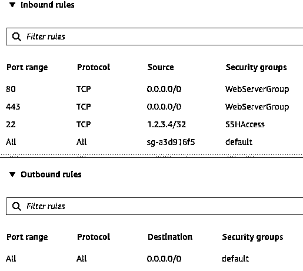

# 使用 Gunicorn、Nginx 和 HTTPS 安全部署 Django 应用程序

> 原文：<https://realpython.com/django-nginx-gunicorn/>

*立即观看**本教程有真实 Python 团队创建的相关视频课程。配合文字教程一起看，加深理解: [**用 Gunicorn 和 Nginx**](/courses/django-app-with-gunicorn-nginx/) 部署一个 Django App

将一个 Django 应用从开发到生产是一个要求很高但很值得的过程。本教程将带您一步一步地完成这一过程，提供一个深入的指南，从一个简单的 Django 应用程序开始，并添加了 **Gunicorn** 、 **Nginx** 、**域注册**和关注安全性的 **HTTP 头**。阅读完本教程后，您将更好地准备将您的 Django 应用程序投入生产并向全世界提供服务。

在本教程中，您将学习:

*   如何将 Django 应用**从开发带入生产**
*   你如何在现实世界的公共领域托管你的应用程序
*   如何将 **Gunicorn** 和 **Nginx** 引入请求和响应链
*   HTTP headers 如何加强你网站的 HTTPS 安全

为了充分利用本教程，您应该对 Python 、[、Django](https://realpython.com/tutorials/django/) 以及 HTTP 请求的高级机制有一个初级的[理解。](https://realpython.com/learning-paths/python3-introduction/)

您可以通过下面的链接下载本教程中使用的 Django 项目:

**获取源代码:** [点击此处获取本教程中使用的配套 Django 项目](https://realpython.com/bonus/django-nginx-gunicorn-project-code/)。

## 从 Django 和 WSGIServer 开始

您将使用 [Django](https://realpython.com/tutorials/django/) 作为 web 应用程序的核心框架，使用它进行 URL 路由、HTML 呈现、认证、管理和后端逻辑。在本教程中，您将使用另外两个层来补充 Django 组件， [Gunicorn](https://gunicorn.org/) 和 [Nginx](https://nginx.org/) ，以便可伸缩地服务于应用程序。但是在这之前，您需要设置您的环境，并让 Django 应用程序自己启动并运行。

[*Remove ads*](/account/join/)

### 设置云虚拟机

首先，您需要启动并设置一个[虚拟机(VM)](https://en.wikipedia.org/wiki/Virtual_machine) ，web 应用程序将在其上运行。您应该熟悉至少一家[基础设施即服务(IaaS)](https://www.redhat.com/en/topics/cloud-computing/what-is-iaas) 云服务提供商来供应虚拟机。这一部分将在较高层次上引导您完成这一过程，但不会详细介绍每一步。

使用虚拟机为 web 应用提供服务是 IaaS 的一个例子，在这种情况下，您可以完全控制服务器软件。除了 IaaS 之外，还存在其他选择:

*   一个[无服务器](https://realpython.com/aws-chalice-serverless-python/)架构允许你只编写 Django 应用程序，让一个独立的框架或云提供商处理基础设施方面。
*   一种[容器化的](https://www.ibm.com/cloud/learn/containerization)方法允许多个应用程序在同一个主机操作系统上独立运行。

不过，对于本教程，您将使用直接在 IaaS 上服务 Nginx 和 Django 的可靠方法。

虚拟机的两个流行选项是 [Azure VMs](https://azure.microsoft.com/en-us/services/virtual-machines/) 和 [Amazon EC2](https://aws.amazon.com/ec2/) 。要获得启动实例的更多帮助，您应该参考云提供商的文档:

*   **对于 Azure 虚拟机**，遵循他们的[快速入门指南，在 Azure 门户](https://docs.microsoft.com/en-us/azure/virtual-machines/linux/quick-create-portal)中创建 Linux 虚拟机。
*   **对于亚马逊 EC2** ，学习如何[进行设置](https://docs.aws.amazon.com/AWSEC2/latest/UserGuide/get-set-up-for-amazon-ec2.html)。

Django 项目和本教程中涉及的所有东西都位于运行 Ubuntu Server 20.04 的一个 *t2.micro* Amazon EC2 实例上。

虚拟机设置的一个重要组成部分是**入站安全规则**。这些是控制实例入站流量的细粒度规则。为初始开发创建以下入站安全规则，您将在生产中修改这些规则:

| 参考 | 类型 | 草案 | 端口范围 | 来源 |
| --- | --- | --- | --- | --- |
| one | 习俗 | 传输控制协议（Transmission Control Protocol） | Eight thousand | `my-laptop-ip-address/32` |
| Two | 习俗 | 全部 | 全部 | `security-group-id` |
| three | 嘘 | 传输控制协议（Transmission Control Protocol） | Twenty-two | `my-laptop-ip-address/32` |

现在，您将一次浏览一个:

1.  **规则 1** 允许 TCP 从你的个人电脑的 IPv4 地址通过端口 8000，允许你在通过端口 8000 开发 Django 应用程序时向它发送请求。
2.  **规则 2** 使用安全组 ID 作为来源，允许来自分配给同一安全组的网络接口和实例的入站流量。这是默认 AWS 安全组中包含的一个规则，您应该将它绑定到您的实例。
3.  **规则 3** 允许你从个人电脑通过 SSH 访问你的虚拟机。

您还需要添加一个**出站规则**来允许出站流量做一些事情，比如安装包:

| 类型 | 草案 | 端口范围 | 来源 |
| --- | --- | --- | --- |
| 习俗 | 全部 | 全部 | `0.0.0.0/0` |

综上所述，您的初始 AWS 安全规则集可以由三个入站规则和一个出站规则组成。这些权限依次来自三个独立的安全组——默认组、HTTP 访问组和 SSH 访问组:

[](https://files.realpython.com/media/django-sg-initial.ceedc13b07ae.jpg)

<figcaption class="figure-caption text-center">Initial security group rule set</figcaption>

然后，您可以从本地计算机 [SSH](https://www.ssh.com/ssh/) 进入实例:

```py
$ ssh -i ~/.ssh/<privkey>.pem ubuntu@<instance-public-ip-address>
```

这个命令让您以用户`ubuntu`的身份登录到您的虚拟机。这里，`~/.ssh/<privkey>.pem`是到[私有密钥](https://docs.aws.amazon.com/AWSEC2/latest/UserGuide/ec2-key-pairs.html)的路径，私有密钥是您绑定到虚拟机的一组安全凭证的一部分。VM 是 Django 应用程序代码所在的地方。

至此，您应该已经准备好继续构建您的应用程序了。

[*Remove ads*](/account/join/)

### 创建一个千篇一律的 Django 应用程序

在本教程中，您并不关心用复杂的 URL 路由或高级数据库特性来制作一个花哨的 Django 项目。相反，您需要简单、小巧、易懂的东西，让您能够快速测试您的基础设施是否正常工作。

为此，您可以采取以下步骤来设置您的应用程序。

首先，SSH 到您的虚拟机，并确保您安装了 Python 3.8 和 SQLite3 的最新补丁版本:

```py
$ sudo apt-get update -y
$ sudo apt-get install -y python3.8 python3.8-venv sqlite3
$ python3 -V
Python 3.8.10
```

在这里，Python 3.8 就是**系统 Python** ，或者 Ubuntu 20.04 (Focal)自带的`python3`版本。升级发行版可确保您从最新的 Python 3.8.x 版本中获得错误和安全修复。可选地，您可以安装另一个完整的 Python 版本——比如`python3.9`—以及系统范围的解释器，您需要以`python3.9`的身份显式调用它。

接下来，创建并激活一个虚拟环境:

```py
$ cd  # Change directory to home directory
$ python3 -m venv env
$ source env/bin/activate
```

现在，安装 Django 3.2:

```py
$ python -m pip install -U pip 'django==3.2.*'
```

现在，您可以使用 Django 的管理命令来引导 Django 项目和应用程序:

```py
$ mkdir django-gunicorn-nginx/
$ django-admin startproject project django-gunicorn-nginx/
$ cd django-gunicorn-nginx/
$ django-admin startapp myapp
$ python manage.py migrate
$ mkdir -pv myapp/templates/myapp/
```

这将创建 Django 应用程序`myapp`以及名为`project`的项目:

```py
/home/ubuntu/
│
├── django-gunicorn-nginx/
│    │
│    ├── myapp/
│    │   ├── admin.py
│    │   ├── apps.py
│    │   ├── __init__.py
│    │   ├── migrations/
│    │   │   └── __init__.py
│    │   ├── models.py
│    │   ├── templates/
│    │   │   └── myapp/
│    │   ├── tests.py
│    │   └── views.py
│    │
│    ├── project/
│    │   ├── asgi.py
│    │   ├── __init__.py
│    │   ├── settings.py
│    │   ├── urls.py
│    │   └── wsgi.py
|    |
│    ├── db.sqlite3
│    └── manage.py
│
└── env/  ← Virtual environment
```

使用终端编辑器，如 [Vim](https://realpython.com/vim-and-python-a-match-made-in-heaven/) 或 [GNU nano](https://www.nano-editor.org/) ，打开`project/settings.py`并将您的应用程序添加到`INSTALLED_APPS`:

```py
# project/settings.py
INSTALLED_APPS = [
    "django.contrib.admin",
    "django.contrib.auth",
    "django.contrib.contenttypes",
    "django.contrib.sessions",
    "django.contrib.messages",
    "django.contrib.staticfiles",
 "myapp", ]
```

接下来，打开`myapp/templates/myapp/home.html`并创建一个简短的 HTML 页面:

```py
<!DOCTYPE html>
<html lang="en-US">
  <head>
    <meta charset="utf-8">
    <title>My secure app</title>
  </head>
  <body>
    <p>Now this is some sweet HTML!</p>
  </body>
</html>
```

之后，编辑`myapp/views.py`来呈现 HTML 页面:

```py
from django.shortcuts import render

def index(request):
    return render(request, "myapp/home.html")
```

现在创建并打开`myapp/urls.py`，将您的视图与 URL 模式关联起来:

```py
from django.urls import path
from . import views

urlpatterns = [
    path("", views.index, name="index"),
]
```

之后，相应地编辑`project/urls.py`:

```py
from django.urls import include, path

urlpatterns = [
    path("myapp/", include("myapp.urls")),
    path("", include("myapp.urls")),
]
```

你还可以做另外一件事，那就是确保用于加密签名的 Django [秘密密钥](https://docs.djangoproject.com/en/3.2/ref/settings/#std:setting-SECRET_KEY)没有被硬编码到`settings.py`中，Git 很可能会跟踪它。从`project/settings.py`中删除以下行:

```py
SECRET_KEY = "django-insecure-o6w@a46mx..."  # Remove this line
```

将其替换为以下内容:

```py
import os

# ...

try:
    SECRET_KEY = os.environ["SECRET_KEY"]
except KeyError as e:
    raise RuntimeError("Could not find a SECRET_KEY in environment") from e
```

这告诉 Django 在您的环境中寻找`SECRET_KEY`,而不是将它包含在您的应用程序源代码中。

**注意**:对于较大的项目，请查看 [`django-environ`](https://django-environ.readthedocs.io/en/latest/) 来配置 Django 应用程序的环境变量。

最后，在您的环境中设置密钥。下面是如何在 Ubuntu Linux 上使用 [OpenSSL](https://www.openssl.org/) 将密钥设置为 80 个字符的字符串:

```py
$ echo "export SECRET_KEY='$(openssl rand -hex 40)'" > .DJANGO_SECRET_KEY
$ source .DJANGO_SECRET_KEY
```

您可以从`.DJANGO_SECRET_KEY`的内容`cat`中看到 [`openssl`](https://www.openssl.org/docs/manmaster/man1/openssl-rand.html) 已经生成了一个密码安全的十六进制字符串密钥:

```py
$ cat .DJANGO_SECRET_KEY
export SECRET_KEY='26a2d2ccaf9ef850...'
```

好的，你都准备好了。这就是拥有一个最低功能的 Django 应用程序所需要的一切。

[*Remove ads*](/account/join/)

### 在开发中使用 Django 的 wsgi server

在本节中，您将使用 [`httpie`](https://httpie.org/) 测试 Django 的开发 web 服务器，这是一个非常棒的命令行 HTTP 客户端，用于测试从控制台到您的 web 应用程序的请求:

```py
$ pwd
/home/ubuntu
$ source env/bin/activate
$ python -m pip install httpie
```

您可以创建一个[别名](https://ss64.com/bash/alias.html)，它将允许您使用`httpie`向您的应用程序发送一个`GET`请求:

```py
$ # Send GET request and follow 30x Location redirects
$ alias GET='http --follow --timeout 6'
```

这用一些默认标志将`GET`别名为`http`调用。现在，您可以使用`GET docs.python.org`在 Python 文档的主页上查看响应头和主体。

在启动 Django 开发服务器之前，您可以检查您的 Django 项目是否存在潜在的问题:

```py
$ cd django-gunicorn-nginx/
$ python manage.py check
System check identified no issues (0 silenced).
```

如果您的检查没有发现任何问题，那么告诉 Django 的内置应用服务器开始监听本地主机，使用默认端口 8000:

```py
$ # Listen on 127.0.0.1:8000 in the background
$ nohup python manage.py runserver &
$ jobs -l
[1]+ 43689 Running                 nohup python manage.py runserver &
```

使用`nohup <command> &`在后台执行`command`，这样您就可以继续使用您的 shell。您可以使用`jobs -l`来查看[进程标识符(PID)](https://en.wikipedia.org/wiki/Process_identifier) ，这将让您将进程带到前台或终止它。`nohup`将[标准输出(stdout)](https://en.wikipedia.org/wiki/Standard_streams#Standard_output_(stdout)) 和[标准错误(stderr)](https://en.wikipedia.org/wiki/Standard_streams#Standard_error_(stderr)) 重定向到文件`nohup.out`。

**注意**:如果出现`nohup`挂起，让你没有光标，按 `Enter` 可以找回你的终端光标和 shell 提示符。

Django 的 [`runserver`](https://docs.djangoproject.com/en/3.2/ref/django-admin/#runserver) 命令依次使用以下语法:

```py
$ python manage.py runserver [address:port]
```

如果像上面那样不指定参数`address:port`，Django 将默认监听`localhost:8000`。您还可以使用`lsof`命令更直接地验证是否调用了`python`命令来监听端口 8000:

```py
$ sudo lsof -n -P -i TCP:8000 -s TCP:LISTEN
COMMAND   PID   USER   FD   TYPE DEVICE SIZE/OFF NODE NAME
python  43689 ubuntu    4u  IPv4  45944      0t0  TCP 127.0.0.1:8000 (LISTEN)
```

在教程的这一点上，你的应用程序只监听[本地主机](https://en.wikipedia.org/wiki/Localhost)，也就是地址`127.0.0.1`。它还不能从浏览器中访问，但是您仍然可以通过从 VM 本身的命令行向它发送一个`GET`请求来给它第一个访问者:

```py
$ GET :8000/myapp/
HTTP/1.1 200 OK
Content-Length: 182
Content-Type: text/html; charset=utf-8
Date: Sat, 25 Sep 2021 00:11:38 GMT
Referrer-Policy: same-origin
Server: WSGIServer/0.2 CPython/3.8.10 X-Content-Type-Options: nosniff
X-Frame-Options: DENY

<!DOCTYPE html>
<html lang="en-US">
  <head>
    <meta charset="utf-8">
    <title>My secure app</title>
  </head>
  <body>
    <p>Now this is some sweet HTML!</p>
  </body>
</html>
```

标题`Server: WSGIServer/0.2 CPython/3.8.10`描述了生成响应的软件。在这种情况下，是 0.2 版本的`WSGIServer`和[的 CPython 3.8.10](https://realpython.com/cpython-source-code-guide/) 。

`WSGIServer`只不过是由 Django 定义的实现 Python WSGI 协议的 Python 类[。这意味着它遵循了 **Web 服务器网关接口(WSGI)** ，这是一个定义了 **web 服务器软件**和 **web 应用**交互方式的标准。](https://github.com/django/django/blob/18759b2209ff556aed7f20d83cbf23e3d234e41c/django/core/servers/basehttp.py#L58)

在我们到目前为止的例子中，`django-gunicorn-nginx/`项目是 web 应用程序。因为你正在开发应用程序，所以实际上没有单独的网络服务器。Django 使用了 [`simple_server`](https://docs.python.org/3/library/wsgiref.html#module-wsgiref.simple_server) 模块，该模块实现了一个轻量级的 HTTP 服务器，并将 web 服务器和应用服务器的概念融合到一个命令`runserver`中。

接下来，您将看到如何通过将您的应用程序与现实世界的域相关联，开始向大时代介绍您的应用程序。

[*Remove ads*](/account/join/)

## 用 Django、Gunicorn 和 Nginx 把你的网站放到网上

此时，您的站点可以在虚拟机上进行本地访问。如果你想让你的网站在一个真实的网址上被访问，你需要申请一个域名，并把它绑定到网络服务器上。这对于启用 HTTPS 也是必要的，因为一些证书颁发机构不会为您不拥有的空白 IP 地址或子域颁发证书。在本节中，您将看到如何注册和配置域。

### 设置静态公共 IP 地址

如果您可以将您的域配置指向一个保证不会改变的公共 IP 地址，那就太理想了。云虚拟机的一个次优属性是，如果实例处于停止状态，它们的公共 IP 地址可能会改变。或者，如果出于某种原因，您需要用新的实例替换现有的虚拟机，那么 IP 地址的变化将会带来问题。

这种困境的解决方案是将静态 IP 地址绑定到实例:

*   **AWS** 称之为[弹性 IP 地址](https://docs.aws.amazon.com/AWSEC2/latest/UserGuide/elastic-ip-addresses-eip.html)。
*   **Azure** 称此为[保留 IP](https://azure.microsoft.com/en-us/blog/reserved-ip-addresses/) 。

遵循云提供商的文档将静态 IP 地址与您的云虚拟机相关联。在本教程示例所用的 AWS 环境中，弹性 IP 地址**50.19.125.152**与 EC2 实例相关联。

**注意**:记住，这意味着您需要更改`ssh`的目标 IP，以便通过 SSH 进入您的虚拟机:

```py
$ ssh [args] my-new-static-public-ip
```

更新目标 IP 后，您将能够连接到您的云虚拟机。

有了一个更稳定的公共 IP，您就可以链接到一个域了。

### 链接到一个域

在本节中，您将了解如何购买、设置域名，以及如何将域名链接到您现有的应用程序。

这些例子使用了 [Namecheap](https://www.namecheap.com/) ，但是请不要认为这是明确的认可。还有很多其他的选择，比如 domain.com 的[、](https://www.domain.com/)[的【GoDaddy】、](https://www.godaddy.com/)[的谷歌域名](https://domains.google/)。就偏好而言，Namecheap 为成为本教程中的首选域名注册商支付了 0 美元。

**警告**:如果你想在`DEBUG`设置为`True`的公共域上为你的开发站点提供服务，你需要创建自定义的入站安全规则，只允许你的个人电脑和虚拟机的 IP 地址。你应该*而不是*向`0.0.0.0`开放任何 HTTP 或 HTTPS 的入站规则，直到你至少关闭了 [`DEBUG`](https://docs.djangoproject.com/en/3.2/ref/settings/#std:setting-DEBUG) 。

以下是您可以开始的方式:

1.  **在 [Namecheap](https://www.namecheap.com/) 上创建一个账户**，确保设置双因素认证(2FA)。
2.  从主页开始**搜索适合你预算的域名**。你会发现顶级域名(TLD)和主机名的价格差别很大。
3.  **当你对选择满意时，购买域名**。

本教程使用了域`supersecure.codes`，但是你也有自己的域。

**注意**:当你阅读本教程时，请记住`supersecure.codes`只是一个示例域，并没有被主动维护。

当挑选自己的域名时，请记住，选择一个更深奥的网站名称和顶级域名(TLD)通常会导致更便宜的标价购买该域名。这对于测试尤其有用。

一旦你有了自己的域名，你会想要开启[的私有域名](https://www.namecheap.com/security/what-is-domain-privacy-definition/)保护，正式名称为 **WhoisGuard** 。当有人在您的域名上运行 [`whois`](https://linux.die.net/man/1/whois) 搜索时，这会屏蔽您的个人信息。下面是如何做到这一点:

1.  选择*账户→域名列表*。
2.  选择您的域旁边的*管理*。
3.  启用*保护隐私*。

接下来，是时候为您的站点设置 DNS 记录表了。每个 DNS 记录都将成为数据库中的一行，告诉浏览器一个完全合格的域名(FQDN) 指向的底层 IP 地址。在这种情况下，我们希望`supersecure.codes`路由到 50.19.125.152，即可以访问虚拟机的公共 IPv4 地址:

1.  选择*账户→域名列表*。
2.  选择您的域旁边的*管理*。
3.  选择*高级 DNS* 。
4.  在*主机记录*下，为您的域添加两条 [A 记录](https://www.namecheap.com/support/knowledgebase/article.aspx/579/2237/which-record-type-option-should-i-choose-for-the-information-im-about-to-enter/)。

如下添加 A 记录，用实例的公共 IPv4 地址替换`50.19.125.152`:

| 类型 | 主持 | 价值 | 晶体管-晶体管逻辑。 |
| --- | --- | --- | --- |
| 一项记录 | `@` | 50.19.125.152 | 自动的 |
| 一项记录 | `www` | 50.19.125.152 | 自动的 |

一个 **A 记录**允许您将一个域名或子域与您为应用程序提供服务的 web 服务器的 IPv4 地址相关联。上面的*值*字段应该使用 VM 实例的公共 IPv4 地址。

您可以看到*主机*字段有两种变体:

1.  利用 **`@`** 指向**的根域**，本例中为`supersecure.codes`。
2.  使用 **`www`** 意味着`www.supersecure.codes`将指向与刚才`supersecure.codes`相同的地方。从技术上讲，`www`是[的一个子域](https://superuser.com/q/60006/992125)，它可以将用户发送到与更短的`supersecure.codes`相同的地方。

一旦您设置了 DNS 主机记录表，您需要等待 30 分钟路由才能生效。您现在可以终止现有的`runserver`进程:

```py
$ jobs -l
[1]+ 43689 Running                 nohup python manage.py runserver &
$ kill 43689
[1]+  Done                    nohup python manage.py runserver
```

您可以通过`pgrep`或再次检查活动工单来确认流程已结束:

```py
$ pgrep runserver  # Empty
$ jobs -l  # Empty or 'Done'
$ sudo lsof -n -P -i TCP:8000 -s TCP:LISTEN  # Empty
$ rm nohup.out
```

有了这些东西，你还需要调整 Django 设置， [`ALLOWED_HOSTS`](https://docs.djangoproject.com/en/3.2/ref/settings/#allowed-hosts) ，这是你让你的 Django 应用服务的域名集合:

```py
# project/settings.py
# Replace 'supersecure.codes' with your domain
ALLOWED_HOSTS = [".supersecure.codes"]
```

前导点(`.`)是一个**子域通配符**，允许`www.supersecure.codes`和`supersecure.codes`。保持这个列表以防止 HTTP [主机头攻击](https://dzone.com/articles/what-is-a-host-header-attack)。

现在，只需做一点小小的改动，就可以重新启动 WSGIServer 了:

```py
$ nohup python manage.py runserver '0.0.0.0:8000' &
```

注意 **`address:port`** 参数现在是`0.0.0.0:8000`，而之前没有指定:

*   指定 no `address:port`意味着在`localhost:8000`提供应用。这意味着应用程序只能从虚拟机内部访问。你可以从同一个 IP 地址通过调用`httpie`与它对话，但是你不能从外部世界访问你的应用程序。

*   指定`'0.0.0.0:8000'`的`address:port`使您的服务器对外界可见，尽管默认情况下仍然在端口 8000 上。 [`0.0.0.0`是“绑定到这台计算机支持的所有 IP 地址”的简写](https://stackoverflow.com/a/1621487/7954504)在带有一个名为`eth0`的**网络接口控制器(NIC)** 的现成云虚拟机的情况下，使用`0.0.0.0`充当机器的公共 IPv4 地址的替身。

接下来，打开来自`nohup.out`的输出，查看来自 Django 的 WSGIServer 的任何输入日志:

```py
$ tail -f nohup.out
```

现在是关键时刻了。是时候让你的网站迎来第一个访问者了。从您的个人计算机，在 web 浏览器中输入以下 URL:

```py
http://www.supersecure.codes:8000/myapp/
```

用您自己的域名替换上面的域名。您应该会看到该页面的快速响应:

[](https://files.realpython.com/media/Screen_Shot_2020-09-06_at_6.43.35_PM.d4d8e9f606ba.jpg)

由于您之前创建的入站安全规则，您可以访问此 URL，但其他人不可以。


如果您无法访问您的网站，可能有几个常见的原因:

*   如果连接**挂断**，检查您是否已经打开了一个入站安全规则来允许`my-laptop-ip-address/32`使用`TCP:8000`。
*   如果连接显示为**拒绝**或**无法连接**，请检查您是否调用了`manage.py runserver 0.0.0.0:8000`而不是`127.0.0.1:8000`。

现在回到你的虚拟机的外壳。在`tail -f nohup.out`的连续输出中，你应该看到类似这样的线:

```py
[<date>] "GET /myapp/ HTTP/1.1" 200 182
```

恭喜你，你已经朝着拥有自己的网站迈出了重要的第一步！然而，在这里暂停一下，注意 URL `http://www.supersecure.codes:8000/myapp/`中嵌入的几个大问题:

*   该网站仅通过 HTTP 提供服务。如果不启用 HTTPS，如果你想在客户端和服务器之间传输任何敏感数据，你的网站[就根本不安全](https://realpython.com/python-https/#seeing-that-your-data-is-not-safe)。使用 HTTP 意味着请求和响应以纯文本形式发送。你很快就会解决的。

*   **URL 使用非标准端口 8000** ，而不是标准的默认 HTTP 端口号 80。很不落俗套，有点碍眼，但是你还不能用 80。这是因为端口 80 是有特权的，非根用户不能也不应该绑定到它。稍后，您将引入一个工具，允许您的应用程序在端口 80 上可用。

如果你检查你的浏览器，你会看到你的浏览器地址栏暗示这一点。如果您使用的是 Firefox，将会出现一个红色锁图标，表示连接是通过 HTTP 而不是 HTTPS 进行的:

[](https://files.realpython.com/media/Untitled_Diagram.d7c0e8640db8.jpg)

展望未来，你想让行动合法化。您可以开始通过 HTTP 的标准端口 80 提供服务。更好的是，开始服务 HTTPS (443)并将 HTTP 请求重定向到那里。您将很快看到如何完成这些步骤。

[*Remove ads*](/account/join/)

### 用 Gunicorn 替换 WSGIServer】

您是否希望开始将您的应用迁移到一个为外部世界做好准备的状态？如果是这样，那么你应该把 Django 内置的 WSGIServer，也就是`manage.py runserver`使用的应用服务器，换成一个单独的专用应用服务器。但是等一下:WSGIServer 似乎工作得很好。为什么要更换？

要回答这个问题，您可以阅读 Django 文档:

> 不要在生产环境中使用此服务器。它没有通过安全审计或性能测试。(这就是它将如何停留。我们从事的是制作 Web 框架的业务，而不是 Web 服务器，所以改进这个服务器以便能够处理生产环境超出了 Django 的范围。)([来源](https://docs.djangoproject.com/en/3.2/ref/django-admin/#runserver))

Django 是一个**网络框架**，而不是一个网络服务器，它的维护者想要清楚地区分这两者。在本节中，您将把 Django 的`runserver`命令替换为 [Gunicorn](https://gunicorn.org/) 。Gunicorn 首先是一个 Python WSGI 应用服务器，而且是一个久经考验的服务器:

*   它速度快，经过优化，专为生产而设计。
*   它为您提供了对应用服务器本身更细粒度的控制。
*   它有更完整和可配置的日志记录。
*   它已经过测试，特别是作为应用服务器的功能。

您可以通过 [`pip`](https://realpython.com/what-is-pip/) 将 Gunicorn 安装到您的虚拟环境中:

```py
$ pwd
/home/ubuntu
$ source env/bin/activate
$ python -m pip install 'gunicorn==20.1.*'
```

接下来，您需要做一些配置。一个 [Gunicorn 配置文件](https://docs.gunicorn.org/en/latest/configure.html)的酷之处在于它只需要是有效的 Python 代码，变量名对应于参数。您可以在一个项目子目录中存储多个 Gunicorn 配置文件:

```py
$ cd ~/django-gunicorn-nginx
$ mkdir -pv config/gunicorn/
mkdir: created directory 'config'
mkdir: created directory 'config/gunicorn/'
```

接下来，打开一个开发配置文件`config/gunicorn/dev.py`，并添加以下内容:

```py
"""Gunicorn *development* config file"""

# Django WSGI application path in pattern MODULE_NAME:VARIABLE_NAME
wsgi_app = "project.wsgi:application"
# The granularity of Error log outputs
loglevel = "debug"
# The number of worker processes for handling requests
workers = 2
# The socket to bind
bind = "0.0.0.0:8000"
# Restart workers when code changes (development only!)
reload = True
# Write access and error info to /var/log
accesslog = errorlog = "/var/log/gunicorn/dev.log"
# Redirect stdout/stderr to log file
capture_output = True
# PID file so you can easily fetch process ID
pidfile = "/var/run/gunicorn/dev.pid"
# Daemonize the Gunicorn process (detach & enter background)
daemon = True
```

在启动 Gunicorn 之前，您应该暂停`runserver`进程。使用`jobs`找到它，使用`kill`停止它:

```py
$ jobs -l
[1]+ 26374 Running                 nohup python manage.py runserver &
$ kill 26374
[1]+  Done                    nohup python manage.py runserver
```

接下来，确保上面 Gunicorn 配置文件中设置的值的日志和 PID 目录存在:

```py
$ sudo mkdir -pv /var/{log,run}/gunicorn/
mkdir: created directory '/var/log/gunicorn/'
mkdir: created directory '/var/run/gunicorn/'
$ sudo chown -cR ubuntu:ubuntu /var/{log,run}/gunicorn/
changed ownership of '/var/log/gunicorn/' from root:root to ubuntu:ubuntu
changed ownership of '/var/run/gunicorn/' from root:root to ubuntu:ubuntu
```

使用这些命令，您已经确保了 Gunicorn 所需的 PID 和日志目录存在，并且它们可由`ubuntu`用户写入。

这样一来，您就可以使用`-c`标志启动 Gunicorn，从您的项目根目录指向一个配置文件:

```py
$ pwd
/home/ubuntu/django-gunicorn-nginx
$ source .DJANGO_SECRET_KEY
$ gunicorn -c config/gunicorn/dev.py
```

这在后台运行`gunicorn`，带有您在上面指定的开发配置文件`dev.py`。和以前一样，现在可以监视输出文件，查看 Gunicorn 记录的输出:

```py
$ tail -f /var/log/gunicorn/dev.log
[2021-09-27 01:29:50 +0000] [49457] [INFO] Starting gunicorn 20.1.0
[2021-09-27 01:29:50 +0000] [49457] [DEBUG] Arbiter booted
[2021-09-27 01:29:50 +0000] [49457] [INFO] Listening at: http://0.0.0.0:8000 (49457)
[2021-09-27 01:29:50 +0000] [49457] [INFO] Using worker: sync
[2021-09-27 01:29:50 +0000] [49459] [INFO] Booting worker with pid: 49459
[2021-09-27 01:29:50 +0000] [49460] [INFO] Booting worker with pid: 49460
[2021-09-27 01:29:50 +0000] [49457] [DEBUG] 2 workers
```

现在在浏览器中再次访问你的站点的 URL。您仍然需要 8000 端口:

```py
http://www.supersecure.codes:8000/myapp/
```

再次检查您的虚拟机终端。您应该会在 Gunicorn 的日志文件中看到一行或多行，如下所示:

```py
67.xx.xx.xx - - [27/Sep/2021:01:30:46 +0000] "GET /myapp/ HTTP/1.1" 200 182
```

这几行是**访问日志**，告诉您关于传入请求的信息:

| 成分 | 意义 |
| --- | --- |
| `67.xx.xx.xx` | 用户 IP 地址 |
| `27/Sep/2021:01:30:46 +0000` | 请求的时间戳 |
| `GET` | 请求方法 |
| `/myapp/` | path |
| `HTTP/1.1` | 草案 |
| `200` | 响应状态代码 |
| `182` | 响应内容长度 |

为了简洁起见，上面排除了[用户代理](https://developer.mozilla.org/en-US/docs/Web/HTTP/Headers/User-Agent)，它也可能出现在您的日志中。下面是 macOS 上的 Firefox 浏览器的一个例子:

```py
Mozilla/5.0 (Macintosh; Intel Mac OS X ...) Gecko/20100101 Firefox/92.0
```

随着 Gunicorn 的出现和收听，是时候将合法的 web 服务器也引入等式中了。

[*Remove ads*](/account/join/)

### 并入 Nginx

此时，您已经将 Django 的`runserver`命令换成了作为应用服务器的`gunicorn`。请求链中又多了一个玩家:像 T4 Nginx T5 这样的 T2 网络服务器 T3。

等等，你已经添加了 Gunicorn！为什么需要在画面中加入新的东西？之所以会这样，是因为 Nginx 和 Gunicorn 是两回事，它们是共存的，是作为一个团队工作的。

Nginx [将自己](https://www.nginx.com/resources/wiki/)定义为高性能 web 服务器和反向代理服务器。这是值得的，因为这有助于解释 Nginx 与 Gunicorn 和 Django 的关系。

首先，Nginx 是一个 **web 服务器**,因为它可以向 web 用户或客户端提供文件。文件是文字文档:HTML、CSS、PNG、PDF——应有尽有。在过去，在 Django 等框架出现之前，网站基本上是作为文件系统的直接视图来运行的，这是很常见的。在 URL 路径中，斜线表示服务器文件系统中您可以请求查看的有限部分的目录。

请注意术语上的细微差别:

*   Django 是一个 web 框架。它允许您构建支持站点实际内容的核心 web 应用程序。它处理 HTML 呈现、认证、管理和后端逻辑。

*   **Gunicorn 是一个应用服务器**。它将 HTTP 请求翻译成 Python 可以理解的东西。Gunicorn 实现了 [web 服务器网关接口(WSGI)](https://docs.python.org/3/library/wsgiref.html) ，这是 Web 服务器软件和 Web 应用程序之间的标准接口。

*   **Nginx 是一个网络服务器**。它是公共处理器，更正式的名称是**反向代理**，用于接收请求并扩展到数千个并发连接。

Nginx 作为网络服务器的一部分作用是它可以更有效地服务静态文件。这意味着，对于像图片这样的静态内容的请求，你可以省去 Django 这个中间人，让 Nginx 直接呈现文件。我们将在教程的后面到达这个重要的步骤。

Nginx 也是一个反向代理服务器，它位于外部世界和 Gunicorn/Django 应用程序之间。就像您可能[使用代理发出出站请求](https://requests.readthedocs.io/en/master/user/advanced#proxies)一样，您可以使用 Nginx 这样的代理来接收它们:

[](https://files.realpython.com/media/nginx-gunicorn-final-config.f31311dc4fed.png)

<figcaption class="figure-caption text-center">Image: Real Python</figcaption>

要开始使用 Nginx，请安装它并验证其版本:

```py
$ sudo apt-get install -y 'nginx=1.18.*'
$ nginx -v  # Display version info
nginx version: nginx/1.18.0 (Ubuntu)
```

然后，您应该将您为端口 8000 设置的入站允许规则更改为端口 80。用以下内容替换`TCP:8000`的入站规则:

| 类型 | 草案 | 端口范围 | 来源 |
| --- | --- | --- | --- |
| 超文本传送协议 | 传输控制协议（Transmission Control Protocol） | Eighty | `my-laptop-ip-address/32` |

其他规则，比如 SSH 访问规则，应该保持不变。

现在，启动`nginx`服务并确认其状态为`running`:

```py
$ sudo systemctl start nginx
$ sudo systemctl status nginx
● nginx.service - A high performance web server and a reverse proxy server
 Loaded: loaded (/lib/systemd/system/nginx.service; enabled; ...
 Active: active (running) since Mon 2021-09-27 01:37:04 UTC; 2min 49s ago
...
```

现在，您可以向一个熟悉的 URL 发出请求:

```py
http://supersecure.codes/
```

这与你以前的情况相比有很大的不同。您不再需要 URL 中的端口 8000。相反，端口默认为端口 80，这看起来正常得多:

[](https://files.realpython.com/media/Screen_Shot_2020-06-14_at_9.25.31_AM.bb48ad72cdb6.jpg)

这是 Nginx 的一个友好特性。如果您在零配置的情况下启动 Nginx，它会向您显示一个页面，表明它正在监听。现在试试下面网址的`/myapp`页面:

```py
http://supersecure.codes/myapp/
```

记得把`supersecure.codes`换成自己的域名。

您应该会看到 404 响应，这没关系:

[](https://files.realpython.com/media/Screen_Shot_2020-06-14_at_9.26.13_AM.a2fc4349728c.jpg)

这是因为您正在请求端口 80 上的`/myapp`路径，Nginx 而不是 Gunicorn 正在侦听端口 80。此时，您有了以下设置:

*   Nginx 正在监听端口 80。
*   Gunicorn 单独监听端口 8000。

在您指定之前，这两者之间没有任何联系。Nginx 不知道 Gunicorn 和 Django 有一些想让全世界看到的甜蜜 HTML。这就是它返回一个`404 Not Found`响应的原因。您还没有设置对 Gunicorn 和 Django 的**代理**请求:

[](https://files.realpython.com/media/nginx-disconnect.a38de3a5a7d7.png)

<figcaption class="figure-caption text-center">Image: Real Python</figcaption>

您需要给 Nginx 一些基本的配置，告诉它将请求路由到 Gunicorn，然后 guni corn 将请求提供给 Django。打开`/etc/nginx/sites-available/supersecure`，添加以下内容:

```py
server_tokens  off; access_log  /var/log/nginx/supersecure.access.log; error_log  /var/log/nginx/supersecure.error.log; # This configuration will be changed to redirect to HTTPS later
server  { server_name  .supersecure.codes;   listen  80; location  /  { proxy_pass  http://localhost:8000; proxy_set_header  Host  $host; } }
```

请记住，您需要将文件名中的`supersecure`替换为您站点的主机名，并确保将`.supersecure.codes`的`server_name`值替换为您自己的域名，前缀为一个点。

**注意**:你可能需要`sudo`来打开`/etc`下的文件。

这个文件是 [Nginx 反向代理配置](https://docs.nginx.com/nginx/admin-guide/web-server/reverse-proxy/)的“Hello World”。它告诉 Nginx 如何操作:

*   **在端口 80** 上监听使用主机的请求`supersecure.codes`及其子域。
*   **将这些请求**传递给`http://localhost:8000`，Gunicorn 正在那里监听。

[`proxy_set_header`](https://nginx.org/en/docs/http/ngx_http_proxy_module.html#proxy_set_header) 字段很重要。它确保 Nginx 通过终端用户发送的`Host` HTTP 请求头到达 Gunicorn 和 Django。Nginx 默认使用`Host: localhost`，忽略终端用户浏览器发送的`Host`头字段。

您可以使用`nginx configtest`验证您的配置文件:

```py
$ sudo service nginx configtest /etc/nginx/sites-available/supersecure
 * Testing nginx configuration                                  [ OK ]
```

`[ OK ]`输出表明配置文件是有效的，可以被解析。

现在你需要[符号链接](https://linux.die.net/man/1/ln)这个文件到`sites-enabled`目录，用你的站点域替换`supersecure`:

```py
$ cd /etc/nginx/sites-enabled
$ # Note: replace 'supersecure' with your domain
$ sudo ln -s ../sites-available/supersecure .
$ sudo systemctl restart nginx
```

在使用`httpie`向您的站点发出请求之前，您需要再添加一个入站安全规则。添加以下入站规则:

| 类型 | 草案 | 端口范围 | 来源 |
| --- | --- | --- | --- |
| 超文本传送协议 | 传输控制协议（Transmission Control Protocol） | Eighty | `vm-static-ip-address/32` |

此安全规则允许来自虚拟机本身的公共(弹性)IP 地址的入站 HTTP 流量。乍一看，这似乎有些矫枉过正，但是您需要这样做，因为请求现在将通过公共互联网路由，这意味着使用安全组 ID 的自引用规则将不再足够。

现在它使用 Nginx 作为 web 服务器前端，重新向站点发送一个请求:

```py
$ GET http://supersecure.codes/myapp/
HTTP/1.1 200 OK
Connection: keep-alive Content-Encoding: gzip
Content-Type: text/html; charset=utf-8
Date: Mon, 27 Sep 2021 19:54:19 GMT
Referrer-Policy: same-origin
Server: nginx Transfer-Encoding: chunked X-Content-Type-Options: nosniff
X-Frame-Options: DENY

<!DOCTYPE html>
<html lang="en-US">
  <head>
    <meta charset="utf-8">
    <title>My secure app</title>
  </head>
  <body>
    <p>Now this is some sweet HTML!</p>
  </body>
</html>
```

现在 Nginx 位于 Django 和 Gunicorn 之前，这里有一些有趣的输出:

*   Nginx 现在将`Server`头返回为 **`Server: nginx`** ，表示 Nginx 是新的前端 web 服务器。将`server_tokens`设置为值`off`告诉 Nginx 不要发出它的精确版本，比如`nginx/x.y.z (Ubuntu)`。从安全角度来看，这将会泄露不必要的信息。
*   Nginx 使用`chunked`作为 [`Transfer-Encoding`](https://developer.mozilla.org/en-US/docs/Web/HTTP/Headers/Transfer-Encoding) 报头，而不是广告`Content-Length`。
*   Nginx 还要求保持与`Connection: keep-alive`的网络连接打开。

接下来，您将利用 Nginx 的一个核心特性:快速有效地提供静态文件的能力。

[*Remove ads*](/account/join/)

### 用 Nginx 直接提供静态文件

现在，您的 Django 应用程序上有了 Nginx 代理请求。重要的是，你还可以使用 Nginx 来[直接服务静态文件](https://docs.djangoproject.com/en/3.2/howto/static-files/deployment/)。如果你在`project/settings.py`中有`DEBUG = True`，那么 Django 会渲染文件，但是这[效率非常低，而且可能不安全](https://docs.djangoproject.com/en/3.2/howto/static-files/#configuring-static-files)。相反，您可以让您的 web 服务器直接呈现它们。

静态文件的常见例子包括本地 JavaScript、图像和 CSS——任何不需要 Django 来动态呈现响应内容的东西。

首先，在您的项目目录中，创建一个位置来保存和跟踪开发中的 JavaScript 静态文件:

```py
$ pwd
/home/ubuntu/django-gunicorn-nginx
$ mkdir -p static/js
```

现在打开一个新文件`static/js/greenlight.js`并添加以下 JavaScript:

```py
// Enlarge the #changeme element in green when hovered over (function  ()  { "use strict"; function  enlarge()  { document.getElementById("changeme").style.color  =  "green"; document.getElementById("changeme").style.fontSize  =  "xx-large"; return  false; } document.getElementById("changeme").addEventListener("mouseover",  enlarge); }());
```

如果鼠标悬停在上面，这段 JavaScript 将放大一块绿色大字体的文本。没错，就是一些前沿的前端工作！

接下来，将以下配置添加到`project/settings.py`，用您的域名更新`STATIC_ROOT`:

```py
STATIC_URL = "/static/"
# Note: Replace 'supersecure.codes' with your domain STATIC_ROOT = "/var/www/supersecure.codes/static" STATICFILES_DIRS = [BASE_DIR / "static"]
```

你告诉 Django 的 [`collectstatic`命令](https://docs.djangoproject.com/en/3.2/ref/contrib/staticfiles/#django-admin-collectstatic)在哪里搜索和放置从多个 Django 应用程序聚合的静态文件，包括 Django 自己的内置应用程序，如`admin`。

最后但同样重要的是，修改`myapp/templates/myapp/home.html`中的 HTML 以包含您刚刚创建的 JavaScript:

```py
<!DOCTYPE html>
<html lang="en-US">
  <head>
    <meta charset="utf-8">
    <title>My secure app</title>
  </head>
  <body>
 <p><span id="changeme">Now this is some sweet HTML!</span></p> <script src="/static/js/greenlight.js"></script>  </body>
</html>
```

通过包含`/static/js/greenlight.js`脚本，`<span id="changeme">`元素将有一个附加的事件监听器。

**注意**:为了让这个例子简单明了，你将 URL 路径硬编码到`greenlight.js`，而不是使用 Django 的 [`static`模板标签](https://docs.djangoproject.com/en/3.2/howto/static-files/#configuring-static-files)。您可能希望在更大的项目中利用这一特性。

下一步是创建一个目录路径，其中包含 Nginx 服务的项目静态内容:

```py
$ sudo mkdir -pv /var/www/supersecure.codes/static/
mkdir: created directory '/var/www/supersecure.codes'
mkdir: created directory '/var/www/supersecure.codes/static/'
$ sudo chown -cR ubuntu:ubuntu /var/www/supersecure.codes/
changed ownership of '/var/www/supersecure.codes/static' ... to ubuntu:ubuntu
changed ownership of '/var/www/supersecure.codes/' ... to ubuntu:ubuntu
```

现在在项目目录中以非 root 用户的身份运行`collectstatic`:

```py
$ pwd
/home/ubuntu/django-gunicorn-nginx
$ python manage.py collectstatic
129 static files copied to '/var/www/supersecure.codes/static'.
```

最后，在 Nginx 的站点配置文件`/etc/nginx/sites-available/supersecure`中为`/static`添加一个`location`变量:

```py
server  { location  /  { proxy_pass  http://localhost:8000; proxy_set_header  Host  $host; proxy_set_header  X-Forwarded-Proto  $scheme; } location  /static  {  autoindex  on;  alias  /var/www/supersecure.codes/static/;  }  }
```

记住你的领域可能不是`supersecure.codes`，所以你需要定制这些步骤来为你自己的项目工作。

现在，您应该在`project/settings.py`中关闭项目中的`DEBUG`模式:

```py
# project/settings.py
DEBUG = False
```

因为您在`config/gunicorn/dev.py`中指定了`reload = True`，所以 Gunicorn 将获得这一变化。

然后重启 Nginx:

```py
$ sudo systemctl restart nginx
```

现在，再次刷新您的站点页面，并将鼠标悬停在页面文本上:

[](https://files.realpython.com/media/Screen_Shot_2020-06-15_at_12.54.02_PM.b5b8dc180ae1.jpg)

这是 JavaScript 函数`enlarge()`发挥作用的明显证据。为了得到这个结果，浏览器必须请求`/static/js/greenlight.js`。这里的关键是浏览器直接从 Nginx 获取文件，而不需要 Nginx 向 Django 请求。

注意上面过程的不同之处:没有添加新的 Django URL 路由或视图来交付 JavaScript 文件。这是因为，在运行了`collectstatic`之后，Django 不再负责决定如何将 URL 映射到一个复杂的视图并呈现该视图。Nginx 可以直接把文件交给浏览器。

事实上，如果您导航到您的域的等同物`https://supersecure.codes/static/js/`，您将看到 Nginx 创建的传统文件系统树视图`/static`。这意味着更快、更有效地交付静态文件。

至此，您已经有了使用 Django、Gunicorn 和 Nginx 构建可伸缩站点的良好基础。另一个巨大的飞跃是为您的站点启用 HTTPS，这是您接下来要做的。

[*Remove ads*](/account/join/)

## 使用 HTTPS 软件让您的网站做好生产准备

再多走几步，你就可以让你的网站的安全性从好变得更好，包括启用 HTTPS 和添加一组帮助浏览器以更安全的方式使用你的网站的标题。启用 **HTTPS** 可以增加你站点的可信度，如果你的站点使用认证或者与用户交换敏感数据，这是必要的。

### 打开 HTTPS

为了允许访问者通过 HTTPS 访问你的网站，你需要一个位于你的网络服务器上的 SSL/TLS 证书。证书由证书颁发机构(CA)颁发。在本教程中，您将使用一个名为[的免费 CA，让我们加密](https://letsencrypt.org/getting-started/)。要实际安装证书，您可以使用 [Certbot](https://certbot.eff.org/) 客户端，它会给出一系列完全无痛的逐步提示。

在开始使用 Certbot 之前，您可以预先告诉 Nginx 禁用 TLS 版本 1.0 和 1.1，支持版本 1.2 和 1.3。TLS 1.0 已停产(EOL)，而 TLS 1.1 包含多个漏洞，TLS 1.2 已修复了这些漏洞。为此，打开文件`/etc/nginx/nginx.conf`。找到下面一行:

```py
# File: /etc/nginx/nginx.conf
ssl_protocols  TLSv1  TLSv1.1  TLSv1.2;
```

用更新的实现替换它:

```py
# File: /etc/nginx/nginx.conf
ssl_protocols  TLSv1.2  TLSv1.3;
```

你可以使用`nginx -t`来确认你的 Nginx 支持 1.3 版本:

```py
$ sudo nginx -t
nginx: the configuration file /etc/nginx/nginx.conf syntax is ok
nginx: configuration file /etc/nginx/nginx.conf test is successful
```

现在您已经准备好安装和使用 Certbot 了。在 Ubuntu Focal (20.04)上，可以使用`snap`来安装 Certbot:

```py
$ sudo snap install --classic certbot
$ sudo ln -s /snap/bin/certbot /usr/bin/certbot
```

参考 Certbot 的[说明指南](https://certbot.eff.org/instructions)来查看不同操作系统和网络服务器的安装步骤。

在您可以使用`certbot`获得并安装 HTTPS 证书之前，您需要对 VM 的安全组规则进行另一项更改。因为 Let's Encrypt 需要一个互联网连接来进行验证，所以你需要迈出重要的一步，向公共互联网开放你的站点。

修改您的入站安全规则以符合以下要求:

| 参考 | 类型 | 草案 | 端口范围 | 来源 |
| --- | --- | --- | --- | --- |
| one | 超文本传送协议 | 传输控制协议（Transmission Control Protocol） | Eighty | `0.0.0.0/0` |
| Two | 习俗 | 全部 | 全部 | `security-group-id` |
| three | 嘘 | 传输控制协议（Transmission Control Protocol） | Twenty-two | `my-laptop-ip-address/32` |

这里的关键变化是第一条规则，它允许来自所有来源的 HTTP 流量通过端口 80。您可以删除将虚拟机的公共 IP 地址列入白名单的`TCP:80`的入站规则，因为这是多余的。其他两条规则保持不变。

然后，您可以再发出一个命令`certbot`来安装证书:

```py
$ sudo certbot --nginx --rsa-key-size 4096 --no-redirect
Saving debug log to /var/log/letsencrypt/letsencrypt.log
...
```

这将创建一个 RSA 密钥大小为 4096 字节的证书。`--no-redirect`选项告诉`certbot`不要自动应用与自动 HTTP 到 HTTPS 重定向相关的配置。为了便于说明，您将很快看到如何自己添加它。

您将经历一系列的设置步骤，其中大部分是不言自明的，例如输入您的电子邮件地址。当提示输入您的域名时，输入域名和用逗号分隔的`www`子域:

```py
www.supersecure.codes,supersecure.codes
```

完成这些步骤后，您应该会看到如下所示的成功消息:

```py
Successfully received certificate.
Certificate is saved at: /etc/letsencrypt/live/supersecure.codes/fullchain.pem
Key is saved at:         /etc/letsencrypt/live/supersecure.codes/privkey.pem
This certificate expires on 2021-12-26.
These files will be updated when the certificate renews.
Certbot has set up a scheduled task to automatically renew this
  certificate in the background.

Deploying certificate
Successfully deployed certificate for supersecure.codes
  to /etc/nginx/sites-enabled/supersecure
Successfully deployed certificate for www.supersecure.codes
  to /etc/nginx/sites-enabled/supersecure
Congratulations! You have successfully enabled HTTPS
  on https://supersecure.codes and https://www.supersecure.codes
```

如果您在相当于`/etc/nginx/sites-available/supersecure`的位置`cat`打开配置文件，您会看到`certbot`已经自动添加了一组与 SSL 相关的行:

```py
# Nginx configuration: /etc/nginx/sites-available/supersecure
server  { server_name  .supersecure.codes; listen  80; location  /  { proxy_pass  http://localhost:8000; proxy_set_header  Host  $host; } location  /static  { autoindex  on; alias  /var/www/supersecure.codes/static/; } listen  443  ssl;  ssl_certificate  /etc/letsencrypt/live/www.supersecure.codes/fullchain.pem;  ssl_certificate_key  /etc/letsencrypt/live/www.supersecure.codes/privkey.pem;  include  /etc/letsencrypt/options-ssl-nginx.conf;  ssl_dhparam  /etc/letsencrypt/ssl-dhparams.pem;  }
```

确保 Nginx 接受这些更改:

```py
$ sudo systemctl reload nginx
```

要通过 HTTPS 访问您的网站，您需要添加最后一项安全规则。您需要允许通过`TCP:443`的流量，这里 443 是 HTTPS 的默认端口。修改您的入站安全规则以符合以下要求:

| 参考 | 类型 | 草案 | 端口范围 | 来源 |
| --- | --- | --- | --- | --- |
| one | HTTPS | 传输控制协议（Transmission Control Protocol） | Four hundred and forty-three | `0.0.0.0/0` |
| Two | 超文本传送协议 | 传输控制协议（Transmission Control Protocol） | Eighty | `0.0.0.0/0` |
| Two | 习俗 | 全部 | 全部 | `security-group-id` |
| three | 嘘 | 传输控制协议（Transmission Control Protocol） | Twenty-two | `my-laptop-ip-address/32` |

这些规则中的每一条都有特定的用途:

1.  **规则 1** 允许来自所有来源的 HTTPS 流量通过端口 443。
2.  规则 2 允许来自所有来源的 HTTP 流量通过端口 80。
3.  **规则 3** 使用安全组 ID 作为来源，允许来自分配给同一安全组的网络接口和实例的入站流量。这是一个包含在[默认 AWS 安全组](https://docs.aws.amazon.com/AWSEC2/latest/UserGuide/default-custom-security-groups.html#default-security-group)中的规则，您应该将它绑定到您的实例。
4.  **规则 4** 允许你从个人电脑通过 SSH 访问你的虚拟机。

现在，在浏览器中重新导航到你的站点，但是有一个关键的不同。将`https`指定为协议，而不是`http`:

```py
https://www.supersecure.codes/myapp/
```

如果一切顺利，您应该会看到生命中最美丽的宝藏之一，那就是您的站点正在 HTTPS 上空交付:

[](https://files.realpython.com/media/Untitled_Diagra-2.11542168f866.jpg)

如果您使用 Firefox 并点击锁图标，您可以查看有关保护连接所涉及的证书的更多详细信息:

[](https://files.realpython.com/media/Screen_Shot_2020-09-06_at_10.35.54_PM.5e4a9180855a.jpg)

你离安全网站又近了一步。此时，仍然可以通过 HTTP 和 HTTPS 访问该站点。那比以前好多了，但还是不理想。

[*Remove ads*](/account/join/)

### 将 HTTP 重定向到 HTTPS

您的网站现在可以通过 HTTP 和 HTTPS 访问。有了 HTTPS，你几乎可以关闭 HTTP——或者至少在实践中接近它。您可以添加几个功能来自动将任何试图通过 HTTP 访问您的站点的访问者路由到 HTTPS 版本。编辑您的`/etc/nginx/sites-available/supersecure`:

```py
# Nginx configuration: /etc/nginx/sites-available/supersecure
server  { server_name  .supersecure.codes; listen  80; return  307  https://$host$request_uri;  } server  { location  /  { proxy_pass  http://localhost:8000; proxy_set_header  Host  $host; } location  /static  { autoindex  on; alias  /var/www/supersecure.codes/static/; } listen  443  ssl; ssl_certificate  /etc/letsencrypt/live/www.supersecure.codes/fullchain.pem; ssl_certificate_key  /etc/letsencrypt/live/www.supersecure.codes/privkey.pem; include  /etc/letsencrypt/options-ssl-nginx.conf; ssl_dhparam  /etc/letsencrypt/ssl-dhparams.pem; }
```

添加的块告诉服务器将浏览器或客户端重定向到任何 HTTP URL 的 HTTPS 版本。您可以验证此配置是否有效:

```py
$ sudo service nginx configtest /etc/nginx/sites-available/supersecure
 * Testing nginx configuration                                  [ OK ]
```

然后，告诉`nginx`重新加载配置:

```py
$ sudo systemctl reload nginx
```

然后向应用程序的 HTTP URL 发送一个带有`--all`标志的`GET`请求，以显示任何重定向链:

```py
$ GET --all http://supersecure.codes/myapp/
HTTP/1.1 307 Temporary Redirect Connection: keep-alive
Content-Length: 164
Content-Type: text/html
Date: Tue, 28 Sep 2021 02:16:30 GMT
Location: https://supersecure.codes/myapp/ Server: nginx

<html>
<head><title>307 Temporary Redirect</title></head>
<body bgcolor="white">
<center><h1>307 Temporary Redirect</h1></center> <hr><center>nginx</center>
</body>
</html>

HTTP/1.1 200 OK
Connection: keep-alive
Content-Encoding: gzip
Content-Type: text/html; charset=utf-8
Date: Tue, 28 Sep 2021 02:16:30 GMT
Referrer-Policy: same-origin
Server: nginx
Transfer-Encoding: chunked
X-Content-Type-Options: nosniff
X-Frame-Options: DENY

<!DOCTYPE html>
<html lang="en-US">
  <head>
    <meta charset="utf-8">
    <title>My secure app</title>
  </head>
  <body>
    <p><span id="changeme">Now this is some sweet HTML!</span></p>
    <script src="/static/js/greenlight.js"></script>
  </body>
</html>
```

你可以看到这里实际上有两种反应:

1.  **初始请求**接收到重定向到 HTTPS 版本的 [307 状态码](https://developer.mozilla.org/en-US/docs/Web/HTTP/Status/307)响应。
2.  第二个请求是向同一个 URI 发出的，但是使用的是 HTTPS 方案而不是 HTTP。这一次，它用一个`200 OK`响应接收到它正在寻找的页面内容。

接下来，您将看到如何通过帮助浏览器记住该选择来超越重定向配置。

### 与 HSTS 更进一步

单独使用时，这种重定向设置存在一个小漏洞:

> 当用户手动输入 web 域(提供不带 http://或 https://前缀的域名)或访问普通 http://链接时，对网站的第一个请求将使用普通 http 以不加密的方式发送。
> 
> 大多数安全的网站会立即发回重定向，将用户升级到 HTTPS 连接，但是精心策划的攻击者可以发起中间人(MITM)攻击来拦截初始 HTTP 请求，并从那时起控制用户的会话。([来源](https://www.nginx.com/blog/http-strict-transport-security-hsts-and-nginx/#What-is-HSTS))

为了缓解这种情况，您可以添加一个 [HSTS 策略](https://en.wikipedia.org/wiki/HTTP_Strict_Transport_Security)来告诉浏览器优先选择 HTTPS，即使用户试图使用 HTTP。下面是仅使用重定向与在旁边添加 HSTS 标头之间的细微差别:

*   通过从 HTTP 到 HTTPS 的普通重定向，服务器回答浏览器说，“再试一次，但是用 HTTPS。”如果浏览器发出 1000 次 HTTP 请求，它将被告知 1000 次重试 HTTPS。

*   有了 **HSTS 报头**，浏览器做了有效的前期工作，在第一次请求后用 HTTPS 替换了 HTTP 的*。没有重定向。在第二个场景中，你可以把浏览器想象成*升级*连接。当用户要求他们的浏览器访问你网站的 HTTP 版本时，他们的浏览器会简短地回应，“不，我要带你去 HTTPS 版本。”*

要解决这个问题，您可以告诉 Django 设置 [`Strict-Transport-Security`](https://developer.mozilla.org/en-US/docs/Web/HTTP/Headers/Strict-Transport-Security) 头。将这些行添加到项目的`settings.py`:

```py
# Add to project/settings.py
SECURE_HSTS_SECONDS = 30  # Unit is seconds; *USE A SMALL VALUE FOR TESTING!*
SECURE_HSTS_PRELOAD = True
SECURE_HSTS_INCLUDE_SUBDOMAINS = True
SECURE_PROXY_SSL_HEADER = ("HTTP_X_FORWARDED_PROTO", "https")
```

请注意，`SECURE_HSTS_SECONDS`值是短暂的，只有 30 秒。在这个例子中，这是故意的。当您进入实际生产时，您应该增加这个值。 [Security Headers 网站](https://securityheaders.com/)推荐的最小值为 2，592，000，相当于 30 天。

**警告**:在你增加`SECURE_HSTS_SECONDS`的值之前，先看看 Django 的[对 HTTP 严格传输安全](https://docs.djangoproject.com/en/3.2/ref/middleware/#http-strict-transport-security)的解释。在将 HSTS 时间窗口设置为较大值之前，您应该首先确保 HTTPS 正在为您的站点工作。在看到标题后，浏览器不会轻易让你改变决定，而是坚持通过 HTTP 进行 HTTPS。

一些浏览器比如 Chrome 可能会让你忽略这种行为并编辑 HSTS 政策列表，但是你不应该依赖这种技巧。对于用户来说，这不会是一个非常流畅的体验。相反，为`SECURE_HSTS_SECONDS`保留一个小值，直到你确信你的站点没有在 HTTPS 上出现任何回归。

当您准备冒险尝试时，您需要再添加一行 Nginx 配置。编辑您的等效项`/etc/nginx/sites-available/supersecure`以添加一个`proxy_set_header`指令:

```py
 location  /  { proxy_pass  http://localhost:8000; proxy_set_header  Host  $host; proxy_set_header  X-Forwarded-Proto  $scheme;   }
```

然后告诉 Nginx 重新加载更新的配置:

```py
$ sudo systemctl reload nginx
```

这个添加的`proxy_set_header`的效果是 Nginx 向 Django 发送以下报头，这些报头包含在最初通过端口 443 上的 HTTPS 发送到 web 服务器的中间请求中:

```py
X-Forwarded-Proto: https
```

这直接与您在上面的`project/settings.py`中添加的`SECURE_PROXY_SSL_HEADER`值挂钩。这是必要的，因为 Nginx 实际上向 Gunicorn/Django 发送普通的 HTTP 请求，所以 Django 没有其他方法知道原始请求是否是 HTTPS 的。由于上述 Nginx 配置文件中的`location`块是用于端口 443 (HTTPS)的，所有通过这个端口的请求应该让 Django 知道它们确实是 HTTPS 的。

Django 文档对此做了很好的解释:

> 但是，如果您的 Django 应用程序在代理后面，那么无论原始请求是否使用 HTTPS，代理都可能会“吞掉”。如果在代理和 Django 之间有一个非 HTTPS 连接，那么`is_secure()`将总是返回`False`——即使是最终用户通过 HTTPS 发出的请求。相反，如果代理和 Django 之间有 HTTPS 连接，那么`is_secure()`将总是返回`True`——即使请求最初是通过 HTTP 发出的。([来源](https://docs.djangoproject.com/en/3.2/ref/settings/#secure-proxy-ssl-header))

如何测试该接头是否正常工作？这里有一个优雅的方式，让你留在你的浏览器:

1.  在浏览器中，打开开发者工具。导航到显示网络活动的选项卡。在 Firefox 中，这是*右键→检查元素→网络*。

2.  刷新页面。首先，您应该将`307 Temporary Redirect`响应视为响应链的一部分。这是你的浏览器第一次看到`Strict-Transport-Security`标题。

3.  将浏览器中的 URL 改回 HTTP 版本，并再次请求该页面。如果你使用的是 Chrome，你应该会看到一个`307 Internal Redirect`。在 Firefox 中，您应该会看到一个`200 OK`响应，因为您的浏览器会自动直接进入 HTTPS 请求，即使您试图告诉它使用 HTTP。虽然浏览器显示它们的方式不同，但这两种响应都表明浏览器执行了自动重定向。

如果您使用 Firefox，您应该会看到如下内容:

[](https://files.realpython.com/media/Screen_Shot_2020-06-14_at_9.30.34_PM.a43e7b6bcf5b.jpg)

最后，您还可以通过来自控制台的请求来验证标头是否存在:

```py
$ GET -ph https://supersecure.codes/myapp/
...
Strict-Transport-Security: max-age=30; includeSubDomains; preload
```

这证明您已经使用`project/settings.py`中的相应值有效地设置了`Strict-Transport-Security`头。一旦你准备好了，你可以增加`max-age`的值，但是记住这将不可逆转地告诉浏览器在这段时间内升级 HTTP。

[*Remove ads*](/account/join/)

### 设置`Referrer-Policy`标题

Django 3.x 还增加了控制 [`Referrer-Policy`](https://developer.mozilla.org/en-US/docs/Web/HTTP/Headers/Referrer-Policy) 标头的能力。您可以在`project/settings.py`中指定`SECURE_REFERRER_POLICY`:

```py
# Add to project/settings.py
SECURE_REFERRER_POLICY = "strict-origin-when-cross-origin"
```

这个设置是如何工作的？当你跟随一个从页面 *A* 到页面 *B* 的链接时，你对页面 *B* 的请求在标题`Referer`下包含了页面 *A* 的 URL。一个设置`Referrer-Policy`头的服务器，你可以通过`SECURE_REFERRER_POLICY`在 Django 中设置这个头，控制什么时候以及有多少信息被转发到目标站点。`SECURE_REFERRER_POLICY`可以接受许多可识别的值，您可以在 [Mozilla 文档](https://developer.mozilla.org/en-US/docs/Web/HTTP/Headers/Referrer-Policy)中详细了解这些值。

举个例子，如果你使用了`"strict-origin-when-cross-origin"`并且用户的当前页面是`https://example.com/page`，那么`Referer`的页面头会受到以下方式的约束:

| 目标站点 | `Referer`表头 |
| --- | --- |
| https://example.com/otherpage | `https://example.com/page` |
| https://mozilla.org | `https://example.com/` |
| http://example.org(HTTP 目标) | [无] |

假设当前用户的页面是`https://example.com/page`，下面是具体情况:

*   如果用户跟随一个链接到`https://example.com/otherpage`，`Referer`将包括当前页面的完整路径。
*   如果用户跟随链接到单独的域`https://mozilla.org`，`Referer`将排除当前页面的路径。
*   如果用户使用`http://`协议点击`http://example.org`的链接，`Referer`将为空白。

如果你将这一行添加到`project/settings.py`并重新请求你的应用主页，那么你会看到一个新成员:

```py
$ GET -ph https://supersecure.codes/myapp/  # -ph: Show response headers only
HTTP/1.1 200 OK
Connection: keep-alive
Content-Encoding: gzip
Content-Type: text/html; charset=utf-8
Date: Tue, 28 Sep 2021 02:31:36 GMT
Referrer-Policy: strict-origin-when-cross-origin Server: nginx
Strict-Transport-Security: max-age=30; includeSubDomains; preload
Transfer-Encoding: chunked
X-Content-Type-Options: nosniff
X-Frame-Options: DENY
```

在这一部分，您已经朝着保护用户隐私的方向迈出了又一步。接下来，您将看到如何锁定站点对跨站点脚本(XSS)和数据注入攻击的漏洞。

### 添加一个`Content-Security-Policy` (CSP)报头

一个更重要的 HTTP 响应头是 [`Content-Security-Policy` (CSP)](https://scotthelme.co.uk/content-security-policy-an-introduction/) 头，它有助于防止[跨站脚本(XSS)](https://en.wikipedia.org/wiki/Cross-site_scripting) 和数据注入攻击。Django 本身不支持这个，但是你可以安装 [`django-csp`](https://github.com/mozilla/django-csp) ，Mozilla 开发的一个小型中间件扩展:

```py
$ python -m pip install django-csp
```

要使用默认值打开标题，将这一行添加到现有`MIDDLEWARE`定义下的`project/settings.py`:

```py
# project/settings.py
MIDDLEWARE += ["csp.middleware.CSPMiddleware"]
```

你如何测试这个？嗯，你可以在你的 HTML 页面中包含一个链接，看看浏览器是否允许它和页面的其他部分一起加载。

编辑`myapp/templates/myapp/home.html`处的模板，以包含一个到 [Normalize.css](https://necolas.github.io/normalize.css/) 文件的链接，这是一个 css 文件，帮助浏览器更加一致地呈现所有元素，并符合现代标准:

```py
<!DOCTYPE html>
<html lang="en-US">
  <head>
    <meta charset="utf-8">
    <title>My secure app</title>
 <link rel="stylesheet" href="https://cdn.jsdelivr.net/npm/normalize.css@8.0.1/normalize.css" >  </head>
  <body>
    <p><span id="changeme">Now this is some sweet HTML!</span></p>
    <script src="/static/js/greenlight.js"></script>
  </body>
</html>
```

现在，在启用了开发人员工具的浏览器中请求页面。您将在控制台中看到如下错误:

[](https://files.realpython.com/media/Screen_Shot_2020-06-14_at_7.42.43_PM.116d7e4b2f81.jpg)

啊哦。你错过了规范化的力量，因为你的浏览器无法加载`normalize.css`。以下是它无法加载的原因:

*   你的`project/settings.py`包括姜戈的`MIDDLEWARE`中的`CSPMiddleware`。包含`CSPMiddleware`将头设置为默认的`Content-Security-Policy`值，即`default-src 'self'`，其中`'self'`表示你站点自己的域。在本教程中，那就是`supersecure.codes`。
*   你的浏览器遵守这个规则，禁止`cdn.jsdelivr.net`加载。CSP 是一个默认的拒绝 T2 策略。

您必须选择并明确允许客户端的浏览器加载您站点响应中嵌入的某些链接。要解决这个问题，将以下设置添加到`project/settings.py`:

```py
# project/settings.py
# Allow browsers to load normalize.css from cdn.jsdelivr.net
CSP_STYLE_SRC = ["'self'", "cdn.jsdelivr.net"]
```

接下来，再次尝试请求您站点的页面:

```py
$ GET -ph https://supersecure.codes/myapp/
HTTP/1.1 200 OK
Connection: keep-alive
Content-Encoding: gzip
Content-Security-Policy: default-src 'self'; style-src 'self' cdn.jsdelivr.net Content-Type: text/html; charset=utf-8
Date: Tue, 28 Sep 2021 02:37:19 GMT
Referrer-Policy: strict-origin-when-cross-origin
Server: nginx
Strict-Transport-Security: max-age=30; includeSubDomains; preload
Transfer-Encoding: chunked
X-Content-Type-Options: nosniff
X-Frame-Options: DENY
```

注意，`style-src`将`'self' cdn.jsdelivr.net`指定为`Content-Security-Policy`标题值的一部分。这意味着浏览器[应该只允许来自两个域的样式表](https://developer.mozilla.org/en-US/docs/Web/HTTP/Headers/Content-Security-Policy/style-src):

1.  `supersecure.codes` ( `'self'`)
2.  `cdn.jsdelivr.net`

`style-src`指令是可以成为`Content-Security-Policy`一部分的许多指令之一。还有[很多其他的](https://developer.mozilla.org/en-US/docs/Web/HTTP/Headers/Content-Security-Policy)，比如`img-src`，指定图片和收藏夹图标的有效来源，还有`script-src`，定义 [JavaScript](https://realpython.com/python-vs-javascript/) 的有效来源。

这些中的每一个都有对应的`django-csp`设置。例如，`img-src`和`script-src`分别由`CSP_IMG_SRC`和`CSP_SCRIPT_SRC`设置。您可以查看 [`django-csp`文档](https://django-csp.readthedocs.io/en/latest/configuration.html)获取完整列表。

这里有一个关于 CSP 头文件的最后提示:尽早设置！当后来出现问题时，更容易查明原因，因为您可以更容易地隔离您添加的没有加载的特性或链接，因为您没有最新的相应 CSP 指令。

### 生产部署的最后步骤

现在，在准备部署应用程序时，您将经历最后几个步骤。

首先，确保您已经在项目的`settings.py`中设置了`DEBUG = False`，如果您还没有这样做的话。这确保了在 5xx 服务器端错误的情况下，服务器端调试信息不会泄露。

其次，编辑项目的`settings.py`中的`SECURE_HSTS_SECONDS`,将`Strict-Transport-Security`头的到期时间从 30 秒增加到建议的 30 天，相当于 2，592，000 秒:

```py
# Add to project/settings.py
SECURE_HSTS_SECONDS = 2_592_000  # 30 days
```

接下来，使用生产配置文件重新启动 Gunicorn。在`config/gunicorn/prod.py`中增加以下内容:

```py
"""Gunicorn *production* config file"""

import multiprocessing

# Django WSGI application path in pattern MODULE_NAME:VARIABLE_NAME
wsgi_app = "project.wsgi:application"
# The number of worker processes for handling requests
workers = multiprocessing.cpu_count() * 2 + 1
# The socket to bind
bind = "0.0.0.0:8000"
# Write access and error info to /var/log
accesslog = "/var/log/gunicorn/access.log"
errorlog = "/var/log/gunicorn/error.log"
# Redirect stdout/stderr to log file
capture_output = True
# PID file so you can easily fetch process ID
pidfile = "/var/run/gunicorn/prod.pid"
# Daemonize the Gunicorn process (detach & enter background)
daemon = True
```

在这里，您做了一些更改:

*   你关闭了开发中使用的`reload`特性。
*   您让工作线程的数量成为虚拟机 CPU 数量的函数，而不是硬编码它。
*   你允许`loglevel`默认为`"info"`，而不是更冗长的`"debug"`。

现在您可以停止当前的 Gunicorn 进程并启动一个新的进程，用它的生产副本替换开发配置文件:

```py
$ # Stop existing Gunicorn dev server if it is running
$ sudo killall gunicorn

$ # Restart Gunicorn with production config file
$ gunicorn -c config/gunicorn/prod.py
```

在做了这个更改之后，您不需要重启 Nginx，因为它只是将请求传递给同一个`address:host`，不应该有任何可见的更改。然而，从长远来看，随着应用规模的扩大，以面向生产的设置运行 Gunicorn 更健康。

最后，确保您已经完整地构建了 Nginx 文件。下面是完整的文件，包括到目前为止您添加的所有组件，以及一些额外的值:

```py
# File: /etc/nginx/sites-available/supersecure
# This file inherits from the http directive of /etc/nginx/nginx.conf

# Disable emitting nginx version in the "Server" response header field
server_tokens  off; # Use site-specific access and error logs
access_log  /var/log/nginx/supersecure.access.log; error_log  /var/log/nginx/supersecure.error.log; # Return 444 status code & close connection if no Host header present
server  { listen  80  default_server; return  444; } # Redirect HTTP to HTTPS
server  { server_name  .supersecure.codes; listen  80; return  307  https://$host$request_uri; } server  { # Pass on requests to Gunicorn listening at http://localhost:8000
  location  /  { proxy_pass  http://localhost:8000; proxy_set_header  Host  $host; proxy_set_header  X-Forwarded-Proto  $scheme; proxy_set_header  X-Forwarded-For  $proxy_add_x_forwarded_for; proxy_redirect  off; } # Serve static files directly
  location  /static  { autoindex  on; alias  /var/www/supersecure.codes/static/; } listen  443  ssl; ssl_certificate  /etc/letsencrypt/live/www.supersecure.codes/fullchain.pem; ssl_certificate_key  /etc/letsencrypt/live/www.supersecure.codes/privkey.pem; include  /etc/letsencrypt/options-ssl-nginx.conf; ssl_dhparam  /etc/letsencrypt/ssl-dhparams.pem; }
```

作为复习，与您的虚拟机相关的入站安全规则应该有一定的设置:

| 类型 | 草案 | 端口范围 | 来源 |
| --- | --- | --- | --- |
| HTTPS | 传输控制协议（Transmission Control Protocol） | Four hundred and forty-three | `0.0.0.0/0` |
| 超文本传送协议 | 传输控制协议（Transmission Control Protocol） | Eighty | `0.0.0.0/0` |
| 习俗 | 全部 | 全部 | `security-group-id` |
| 嘘 | 传输控制协议（Transmission Control Protocol） | Twenty-two | `my-laptop-ip-address/32` |

综上所述，最终的 AWS 安全规则集由四个入站规则和一个出站规则组成:

[](https://files.realpython.com/media/django-sg-final.3f80ce70b7c7.jpg)

<figcaption class="figure-caption text-center">Final security group rule set</figcaption>

将上述内容与您的初始安全规则集进行比较。请注意，您已经放弃了对提供 Django 应用程序开发版本的`TCP:8000`的访问，并分别在端口 80 和 443 上通过 HTTP 和 HTTPS 开放了对互联网的访问。

您的网站现在可以开始展示了:

[](https://files.realpython.com/media/nginx-gunicorn-final-config.f31311dc4fed.png)

<figcaption class="figure-caption text-center">Image: Real Python</figcaption>

现在您已经将所有组件放在一起，您的应用程序可以通过 Nginx over HTTPS 在端口 443 上访问。端口 80 上的 HTTP 请求被重定向到 HTTPS。Django 和 Gunicorn 组件本身并不向公共互联网公开，而是位于 Nginx 反向代理之后。

### 测试你网站的 HTTPS 安全性

您的站点现在比您开始学习本教程时安全多了，但是不要相信我的话。有几个工具可以给你一个网站安全相关特性的客观评级，重点是回复标题和 HTTPS。

第一个是[安全头](https://securityheaders.com/)应用，它给从你的网站返回的 **HTTP 响应头**的质量打分。如果你一直在跟进，你的网站应该可以获得 A 级或更高的评分。

第二个是 [SSL 实验室](https://www.ssllabs.com/ssltest/)，它将对您的 web 服务器的配置进行深度分析，因为它与 **SSL/TLS** 相关。输入您站点的域名，SSL 实验室将根据与 SSL/TLS 相关的各种因素的强度返回一个等级。如果您使用`--rsa-key-size 4096`调用了`certbot`，并关闭了 TLS 1.0 和 1.1，转而使用 1.2 和 1.3，那么您应该可以很好地从 SSL 实验室获得 A+评级。

作为检查，您也可以从命令行请求您站点的 HTTPS URL，以查看您在整个教程中添加的更改的完整概述:

```py
$ GET https://supersecure.codes/myapp/
HTTP/1.1 200 OK
Connection: keep-alive
Content-Encoding: gzip
Content-Security-Policy: style-src 'self' cdn.jsdelivr.net; default-src 'self'
Content-Type: text/html; charset=utf-8
Date: Tue, 28 Sep 2021 02:37:19 GMT
Referrer-Policy: no-referrer-when-downgrade
Server: nginx
Strict-Transport-Security: max-age=2592000; includeSubDomains; preload
Transfer-Encoding: chunked
X-Content-Type-Options: nosniff
X-Frame-Options: DENY

<!DOCTYPE html>
<html lang="en-US">
  <head>
    <meta charset="utf-8">
    <title>My secure app</title>
    <link rel="stylesheet"
      href="https://cdn.jsdelivr.net/npm/normalize.css@8.0.1/normalize.css"
    >
  </head>
  <body>
    <p><span id="changeme">Now this is some sweet HTML!</span></p>
    <script src="/static/js/greenlight.js"></script>
  </body>
</html>
```

那确实是一些可爱的 HTML。

## 结论

如果您已经阅读了本教程，那么您的站点作为一个羽翼未丰的独立开发 Django 应用程序，已经取得了长足的进步。您已经看到了 Django、Gunicorn 和 Nginx 如何联合起来帮助您安全地服务于您的站点。

**在本教程中，您已经学会了如何:**

*   将你的 Django 应用从**开发到生产**
*   在真实世界的公共领域托管你的应用程序
*   将 **Gunicorn** 和 **Nginx** 引入请求和响应链
*   使用 **HTTP 头**来增加你的站点的 HTTPS 安全性

现在，您有了一组可重复的步骤来部署您的生产就绪的 Django web 应用程序。

您可以通过下面的链接下载本教程中使用的 Django 项目:

**获取源代码:** [点击此处获取本教程中使用的配套 Django 项目](https://realpython.com/bonus/django-nginx-gunicorn-project-code/)。

## 延伸阅读

有了网站安全，你不可能 100%到达那里。您可以添加更多的功能来进一步保护您的站点，并生成更好的日志信息。

查看以下链接，了解您可以自己采取的其他步骤:

*   **姜戈** : [部署清单](https://docs.djangoproject.com/en/3.2/howto/deployment/checklist/)
*   **Mozilla** : [网络安全](https://infosec.mozilla.org/guidelines/web_security)
*   **古尼康** : [展开古尼康](https://docs.gunicorn.org/en/stable/deploy.html)
*   **Nginx** : [使用`Forwarded`报头](https://www.nginx.com/resources/wiki/start/topics/examples/forwarded/)
*   **亚当·约翰逊** : [如何在 Django 网站的安全标题上获得 A+的分数](https://adamj.eu/tech/2019/04/10/how-to-score-a+-for-security-headers-on-your-django-website/)

*立即观看**本教程有真实 Python 团队创建的相关视频课程。配合文字教程一起看，加深理解: [**用 Gunicorn 和 Nginx**](/courses/django-app-with-gunicorn-nginx/) 部署一个 Django App************