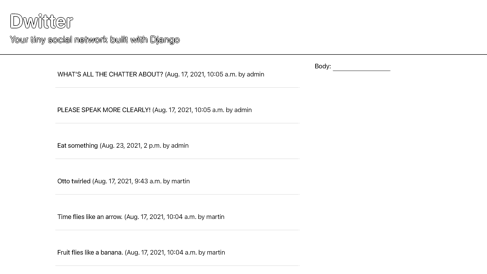
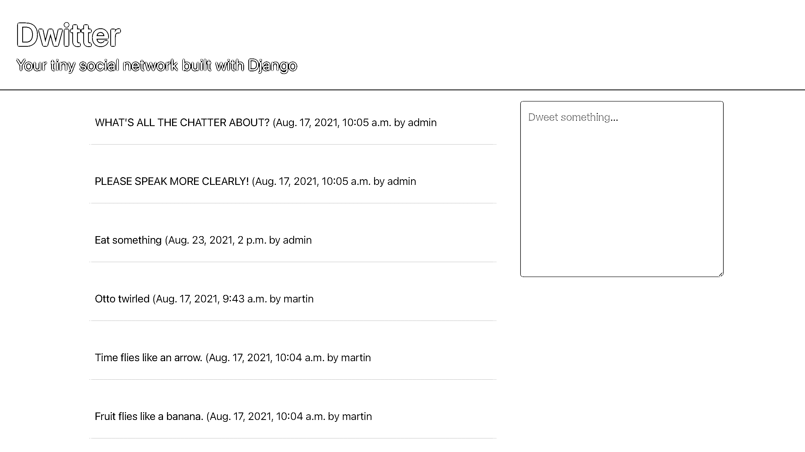
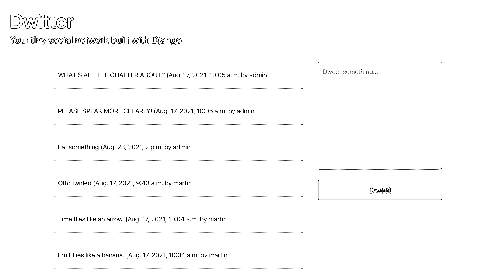
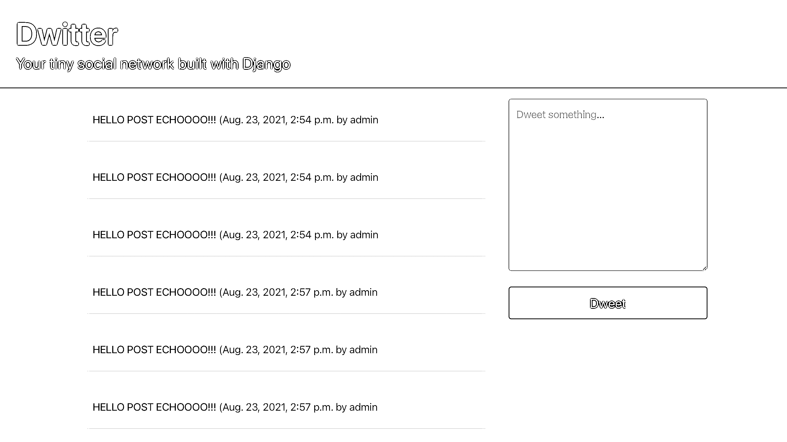
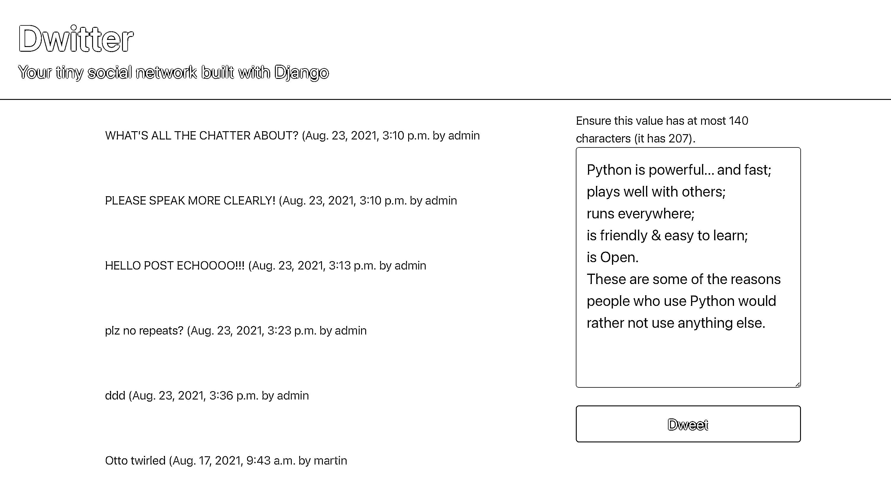
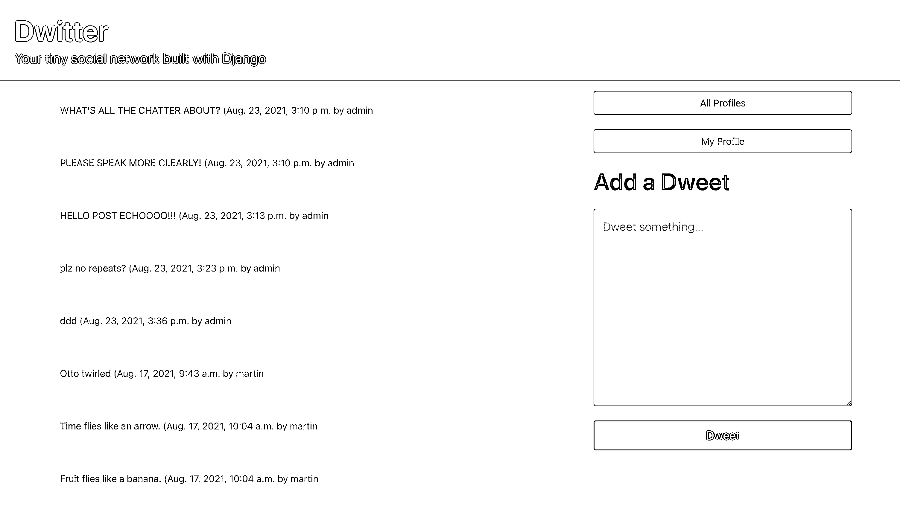
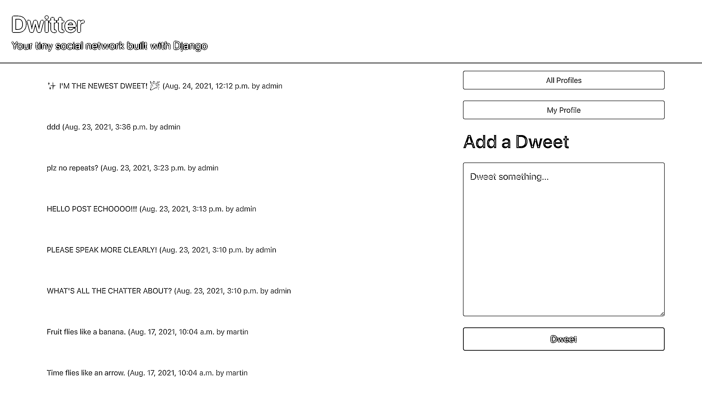

# 用 Django 构建和提交 HTML 表单——第 4 部分

> 原文：<https://realpython.com/django-social-forms-4/>

在这个由四部分组成的教程系列中，您将与 Django 一起构建一个社交网络，您可以在文件夹中展示这个网络。这个项目加强了你对 Django 模型之间关系的理解，并向你展示了如何使用表单，以便用户可以与你的应用程序和其他人进行交互。通过使用布尔玛 CSS 框架，你也可以让你的网站看起来更好。

在本系列的[前一部分](https://realpython.com/django-social-post-3/)中，您添加了一些功能，以便用户可以在后端创建 dweets，并在前端显示它们。此时，您的用户可以发现和关注其他用户，并阅读他们所关注的个人资料的内容。如果他们想停止阅读他们的内容，他们可以点击一个按钮，发送一个由 Django 处理的 HTTP POST 请求来取消关注一个配置文件。

在本系列教程的第四部分，您将学习如何:

*   从你的`Dweet`模型中创建并渲染 **Django 表单**
*   **防止重复提交**和**显示有用的错误信息**
*   **使用**动态网址**链接应用程序的**个页面
*   **重构**一个视图函数
*   使用 **`QuerySet`字段查找**来**过滤**你后端的数据

一旦你完成了教程的最后一部分，你将拥有一个用 Django 构建的功能齐全的基本社交网络。它将允许您的用户创建简短的基于文本的消息，发现和关注其他用户，并阅读他们关注的个人资料的内容。如果他们想停止阅读他们的内容，他们也可以取消关注个人资料。

此外，您将展示您可以使用 CSS 框架来使您的 web 应用程序看起来很棒，而不需要太多额外的工作。

你可以点击下面的链接，进入`source_code_start/`文件夹，下载启动这个项目最后部分所需的代码:

**获取源代码:** [单击此处获取源代码，您将使用](https://realpython.com/bonus/django-social-forms-4-project-code/)用 Django 构建和提交 HTML 表单。

## 演示

在这个由四部分组成的系列中，您将构建一个小型社交网络，允许用户发布基于文本的简短消息。您的应用程序用户还可以关注其他用户简档以查看这些用户的帖子，或者取消关注他们以停止查看他们基于文本的帖子:

[https://player.vimeo.com/video/643455270?background=1](https://player.vimeo.com/video/643455270?background=1)

您还将学习如何使用 CSS 框架布尔玛为您的应用程序提供用户友好的外观，并使其成为您可以自豪地炫耀的投资组合项目。

在本系列教程的第四部分，也是最后一部分，您将学习如何在现有模型的基础上构建 Django 表单。您还将设置和处理更多的 HTTP POST 请求提交，以便您的用户可以发布基于文本的消息。

本教程结束时，你将完成用 Django 构建的基本社交网络。到那时，您的用户将能够导航到配置文件列表和个人配置文件页面，关注和取消关注其他用户，并在他们的仪表板上看到他们所关注的配置文件的电子表格。他们还可以通过仪表板上的表格提交电子表格。

[*Remove ads*](/account/join/)

## 项目概述

在本节中，您将大致了解本系列教程的最后一部分将涵盖哪些主题。您还将有机会重温完整的项目实现步骤，以防您需要跳回到您在本系列的前一部分中完成的前一个步骤。

至此，你应该已经完成了本教程系列的第[部分第一](https://realpython.com/django-social-network-1/)、[第二](https://realpython.com/django-social-front-end-2/)和[第三](https://realpython.com/django-social-post-3/)。恭喜你！您已经完成了最后一部分，这一部分主要是构建表单和处理表单提交:

|   |   |
| --- | --- |
| **第十步** | [通过 Django 表单提交 Dweets](#step-10-submit-dweets-using-django-forms) |
| **第 11 步** | [防止重复提交并处理错误](#step-11-prevent-double-submissions-and-handle-errors) |
| **第 12 步** | [改善前端用户体验](#step-12-improve-the-front-end-user-experience) |

一旦你完成了本系列最后一部分的步骤，你就完成了 Django 社交网络的基本版本。你将准备好自己采取任何[后续步骤](#next-steps)，让这个项目在你的 web 开发者组合中脱颖而出。

为了更好地理解构建 Django 社交网络系列的最后一部分如何融入整个项目的背景，您可以展开下面的可折叠部分:


在本系列的多个独立教程中，您将分多个步骤实现该项目。有很多内容需要介绍，您将一路深入到细节中:

[**《✅》第一部分:模型与关系**](https://realpython.com/django-social-network-1/)

*   **步骤 1:** 设置基础项目
*   步骤 2: 扩展 Django 用户模型
*   **步骤 3:** 实现一个保存后挂钩

[**【✅第二部分:模板和前端造型**](https://realpython.com/django-social-front-end-2/)

*   第四步:用布尔玛创建一个基础模板
*   **第 5 步:**列出所有用户资料
*   **第 6 步:**访问个人资料页面

[**《✅》第三部:跟随者和 Dweets**](https://realpython.com/django-social-post-3/)

*   **第 7 步:**关注和取消关注其他个人资料
*   **步骤 8:** 为 Dweets 创建后端逻辑
*   **第九步:**在前端显示 Dweets

[**📍第四部分:表格和提交材料**](https://realpython.com/django-social-forms-4/)

*   **步骤 10:** 通过 Django 表单提交 Dweets
*   **步骤 11:** 防止重复提交并处理错误
*   **第十二步:**改善前端用户体验

这些步骤中的每一步都将提供任何必要资源的链接。通过一次完成一个步骤，你将有机会停下来，在你想休息一下的时候再回来。

考虑到本系列教程的高级结构，如果您还没有完成这些步骤，那么您已经很好地了解了您现在所处的位置以及您可能必须赶上的实现步骤。

在开始下一步之前，快速浏览一下先决条件，浏览一下可能有帮助的其他资源的链接。

## 先决条件

为了成功完成项目的最后一部分，你需要完成关于模型和关系的第一部分、关于模板和样式的第二部分，以及关于跟随和 dweets 的第三部分。请确认您的项目如那里描述的那样工作。您还应该熟悉以下概念:

*   在 Python 中使用[面向对象编程](https://realpython.com/python3-object-oriented-programming/)
*   [建立 Django 基础项目](https://realpython.com/django-setup/)
*   管理[路由和重定向](https://realpython.com/django-redirects/)，[查看功能](https://realpython.com/django-view-authorization/)，模板，模型，以及 Django 中的[迁移](https://realpython.com/django-migrations-a-primer/)
*   使用和[定制 Django 管理界面](https://realpython.com/customize-django-admin-python/)

确保您已经完成了本系列的前三部分。这最后一部分将从你在第三部分结束时停下的地方继续。

**注意:**如果您没有准备好前几部分的工作项目，您将无法继续学习本系列教程的这一部分。

您也可以通过点击下面的链接并转到`source_code_start/`文件夹来下载启动项目最后部分所需的代码:

**获取源代码:** [单击此处获取源代码，您将使用](https://realpython.com/bonus/django-social-forms-4-project-code/)用 Django 构建和提交 HTML 表单。

关于额外的要求和进一步的链接，请查看本系列教程第一部分中提到的关于在 Django 构建基本社交网络的[先决条件](https://realpython.com/django-social-network-1/#prerequisites)。

## 步骤 10:使用 Django 表单提交 Dweets

为了这个系列教程，你[在](https://realpython.com/django-social-network-1/#customize-the-django-admin-interface)早期决定让[在你的 Django admin](https://realpython.com/django-social-network-1/#create-users-for-your-app) 中处理用户创建。你的小型社交网络只接受邀请，而你是决定创建用户账户的人。

**注意:**请随意使用 [Django 的用户管理系统](https://realpython.com/django-user-management/)对此进行扩展，并按照链接教程构建必要的模板。

然而，一旦你的用户进入你的社交网络应用，你会想给他们创造内容的机会。他们将无法访问 Django 管理界面，你的 Dwitter 也将变得贫瘠，用户没有任何机会创建内容。您将需要另一个**表单**作为用户提交 dweets 的接口。

[*Remove ads*](/account/join/)

### 创建一个文本输入表单

如果您熟悉 HTML 表单，那么您可能知道可以通过创建另一个包含特定`<input>`元素的 HTML `<form>`元素来处理文本提交。但是，它必须看起来与您为按钮构建的表单有点不同。

在本教程中，你将学习如何使用一个 **Django 表单**创建 HTML 表单。您将编写一个 Django 表单，Django 将在呈现页面时将其转换为 HTML `<form>`元素。

从教程的这一部分开始，在 Django `dwitter`应用程序中创建一个新文件，并将其命名为`forms.py`。该文件可以保存您的项目可能需要的所有表单。您只需要一个表单，这样您的用户就可以提交他们的电子表格:

```py
 1# dwitter/forms.py
 2
 3from django import forms
 4from .models import Dweet
 5
 6class DweetForm(forms.ModelForm):
 7    body = forms.CharField(required=True)
 8
 9    class Meta:
10        model = Dweet
11        exclude = ("user", )
```

在这段代码中，您创建了`DweetForm`并且[从 Django 的`ModelForm`中继承了](https://realpython.com/inheritance-composition-python/)。以这种方式创建表单在很大程度上依赖于 Django 建立的抽象，这意味着在本教程中，您只需要自己定义很少的内容就可以获得一个工作表单:

*   **第 3 到 4 行:**您导入 Django 的内置`forms`模块和您在本系列教程的前一部分中创建的`Dweet`模型。

*   **第 6 行:**您创建了一个新类`DweetForm`，它继承了`forms.ModelForm`。

*   **第 7 行:**传递希望表单呈现的字段，并定义其类型。在这种情况下，您需要一个允许文本输入的字符字段。`body`是唯一的字段，您将它设为必填字段，这样就不会有任何空的数据工作表。

*   **第 9 行:**你在`DweetForm`中创建一个 [`Meta`选项](https://docs.djangoproject.com/en/3.2/topics/db/models/#meta-options)类。这个 options 类允许您将任何不是字段的信息传递给 form 类。

*   **第 10 行:**你需要定义`ModelForm`应该从哪个模型获取信息。因为您想要制作一个允许用户创建 dweets 的表单，所以这里的`Dweet`是正确的选择。

*   **第 11 行:**通过将您想要排除的模型字段的名称添加到`exclude`元组中，您可以确保 Django 在创建表单时会省略它。记得在`"user"`后面加一个逗号(`,`)，这样 Python 就会为你创建一个 tuple！

你想让 dweet 提交尽可能的用户友好。用户登录后只能在你的社交网络上创建电子表格，并且只能为自己创建电子表格。因此，您不需要显式地传递哪个用户正在表单内发送 dweet。

**注意:**将一个 dweet 关联到一个用户是必要的，但是您将在后端处理它。

本教程中描述的设置保存了 Django 创建 HTML 表单所需的所有信息，这些表单捕捉了您在前端需要的所有信息。是时候看看那头了。

### 在您的模板中呈现表单

在`forms.py`中创建`DweetForm`之后，您可以在代码逻辑中导入它，并将信息发送到您的仪表板模板:

```py
# dwitter/views.py

from django.shortcuts import render
from .forms import DweetForm from .models import Profile

def dashboard(request):
 form = DweetForm() return render(request, "dwitter/dashboard.html", {"form": form})
```

通过对`views.py`的这些修改，您首先从`forms.py`导入了`DweetForm`。然后，您创建了一个新的`DweetForm`实例，将其分配给`form`，并将其传递到您的上下文字典中的仪表板模板，位于键`"form"`下。此设置允许您在模板中访问和呈现表单:

```py
<!-- dwitter/templates/dwitter/dashboard.html -->





<div class="column">
    
        
            <div class="box">
                {{dweet.body}}
                <span class="is-small has-text-grey-light">
                    ({{ dweet.created_at }} by {{ dweet.user.username }}
                </span>
            </div>
        
    
</div>

<div class="column is-one-third">
 {{ form.as_p }} </div> 

```

您分配给`<div>`元素的 HTML 类使用布尔玛的 [CSS](https://realpython.com/html-css-python/) 规则在您的仪表板页面上创建一个新列。这个额外的列使页面不那么拥挤，并将提要内容与表单分开。然后用`{{ form.as_p }}`呈现 Django 表单。事实上，会出现一个输入框:

[](https://files.realpython.com/media/Screenshot_2021-08-23_at_16.52.50.4ef4c23a27b4.png)

这个设置显示了 Django 表单的最小显示。它只有一个字段，就像您在`DweetForm`中定义的一样。然而，它看起来不太好，文本字段似乎太小，并且在输入字段旁边有一个标签，上面写着 *Body* 。这不是你要求的！

您可以通过`forms.py`中的**小部件**到`forms.CharField`添加定制来改进 Django 表单的显示:

```py
 1# dwitter/forms.py
 2
 3from django import forms
 4from .models import Dweet
 5
 6class DweetForm(forms.ModelForm):
 7    body = forms.CharField(
 8        required=True,
 9        widget=forms.widgets.Textarea( 10            attrs={ 11                "placeholder": "Dweet something...", 12                "class": "textarea is-success is-medium", 13            } 14        ), 15        label="", 16    )
17
18    class Meta:
19        model = Dweet
20        exclude = ("user", )
```

通过将一个 [Django 小部件](https://docs.djangoproject.com/en/3.2/ref/forms/widgets/)添加到`CharField`中，您可以控制 HTML 输入元素如何表示的几个方面:

*   **第 9 行:**在这一行中，你选择 Django 应该使用的输入元素的类型，并将其设置为 [`Textarea`](https://docs.djangoproject.com/en/3.2/ref/forms/widgets/#django.forms.Textarea) 。这个`Textarea`小部件将呈现为一个 [HTML `<textarea>`元素](https://developer.mozilla.org/en-US/docs/Web/HTML/Element/textarea)，为用户输入他们的 dweets 提供更多空间。

*   **第 10 行到第 13 行:**您可以使用`attrs`中定义的设置进一步定制`Textarea`。这些设置在你的`<textarea>`元素上呈现为 HTML 属性。

*   **第 11 行:**您添加了[占位符文本](https://developer.mozilla.org/en-US/docs/Web/HTML/Element/textarea#attr-placeholder)，它将显示在输入框中，并在用户单击表单字段输入他们的 dweet 时消失。

*   **第 12 行:**你添加了 HTML 类`"textarea"`，它与由布尔玛定义的 [textarea CSS 样式规则相关，将使你的输入框更有吸引力，并与页面的其余部分更好地匹配。您还添加了两个额外的类，`is-success`和`is-medium`，它们分别以绿色显示输入字段并增加文本大小。](http://bulma.io/documentation/form/textarea/)

*   **第 15 行:**您将`label`设置为一个空字符串(`""`)，这将删除之前显示的*正文*文本，因为 Django 默认设置将表单字段的名称作为其标签。

只需在`Textarea`中做一些定制，你就可以让你的输入框更好地适应页面的现有风格:

[](https://files.realpython.com/media/Screenshot_2021-08-23_at_16.51.39.758d1258736f.png)

输入框看起来不错，但还不是功能性表单。有人要一个*提交*按钮吗？

[*Remove ads*](/account/join/)

### 使表单提交成为可能

Django 表单可以省去创建和设计表单字段的麻烦。但是，您仍然需要将 Django 表单包装到 HTML `<form>`元素中，并添加一个按钮。要创建允许 POST 请求的函数表单，还需要相应地定义 HTTP 方法:

```py
 1<!-- dwitter/templates/dwitter/dashboard.html -->
 2
 3
 4
 5
 6
 7<div class="column">
 8    
 9        
10            <div class="box">
11                {{dweet.body}}
12                <span class="is-small has-text-grey-light">
13                    ({{ dweet.created_at }} by {{ dweet.user.username }}
14                </span>
15            </div>
16        
17    
18</div>
19
20<div class="column is-one-third">
21    <form method="post"> 22         23        {{ form.as_p }}
24         27    </form> 28</div>
29
30
```

通过对 HTML 代码的另一次增量更新，您完成了 dweet 提交表单的前端设置:

*   **第 21 行和第 27 行:**您将表单代码包装到一个 HTML `<form>`元素中，并将`method`设置为`"post"`，因为您希望通过 POST 请求发送用户提交的消息。
*   **第 22 行:**您添加了一个 CSRF 令牌，使用的模板标签与您在创建[表单时使用的相同，用于关注和取消关注配置文件](https://realpython.com/django-social-post-3/#handle-post-requests-in-django-code-logic)。
*   **第 24 到 26 行:**您通过`class`属性添加了一个带有一些布尔玛风格的按钮来完成表单，这允许您的用户提交他们输入的文本。

该表单看起来不错，似乎可以接收您的输入了:

[](https://files.realpython.com/media/Screenshot_2021-08-23_at_16.50.36.7e6758da483f.png)

当你点击 *Dweet* 按钮时会发生什么？不多，因为你还没有设置任何代码逻辑来补充你的前端代码。下一步是在`views.py`中实现提交功能:

```py
 1# dwitter/views.py
 2
 3def dashboard(request):
 4    if request.method == "POST":
 5        form = DweetForm(request.POST)
 6        if form.is_valid():
 7            dweet = form.save(commit=False)
 8            dweet.user = request.user
 9            dweet.save()
10    form = DweetForm()
11    return render(request, "dwitter/dashboard.html", {"form": form})
```

通过对`dashboard()`的一些补充，您可以让视图处理提交的数据并在数据库中创建新的 dweets:

*   **第 4 行:**如果用户通过 HTTP POST 请求提交表单，那么您需要处理表单数据。如果视图函数是由于 HTTP GET 请求而被调用的，那么您将直接跳过整个代码块进入第 10 行，并在第 11 行呈现一个空表单。

*   **第 5 行:**用通过 POST 请求传入的数据填充`DweetForm`。根据您在`forms.py`中的设置，Django 会将数据传递给`body`。`created_at`将被自动填充，并且您明确排除了`user`，因此它现在将保持为空。

*   **第 6 行:** Django 表单对象有一个名为`.is_valid()`的方法，它将提交的数据与表单中定义的预期数据以及相关的模型限制进行比较。如果一切正常，该方法返回`True`。只有当提交的表单有效时，才允许代码继续运行。

*   **第 7 行:**如果您的表单已经包含了创建一个新数据库条目所需的所有信息，那么您可以使用`.save()`而不用任何参数。但是，您仍然缺少与 dweet 相关联的必需的`user`条目。通过添加`commit=False`，您还可以防止向数据库提交条目。

*   **第 8 行:**您从 Django 的`request`对象中选择当前登录的用户对象，并将其保存到您在前一行中创建的`dweet`中。这样，通过与当前用户建立关联，您已经添加了缺少的信息。

*   **第 9 行:**最后，您的`dweet`拥有了它需要的所有信息，因此您可以成功地在关联表中创建新条目。现在可以用`.save()`将信息写入数据库。

*   **第 10 行到第 11 行:**无论您是否已经处理了 POST 提交，您总是会向`render()`传递一个新的空`DweetForm`实例。这个函数调用用一个新的空白表单重新显示页面，为您的更多想法做好准备。

至此，您已经成功地创建了文本输入表单，并将其与您的代码逻辑连接起来，因此提交将被正确处理。在本系列教程的这一部分中，您还了解了 Django 表单。您在模板中呈现了一个表单，然后通过在一个`Textarea`小部件中定制属性来应用布尔玛样式。

在你准备向现实生活中的用户开放你的 Django 社交网络之前，有一个问题你需要解决。如果你写了一个 dweet 并且现在提交，它会被添加，但是如果你在提交后*重新加载*页面，同样的 dweet 会再次被添加！

## 步骤 11:防止重复提交并处理错误

此时，您可以通过应用程序的前端创建新的 dweet，并在仪表板上查看您自己的 dweet 以及您关注的个人资料的 dweet。在这一步结束时，您将已经避免了两次 dweet 提交，并学习了 Django 如何显示文本输入的错误。

但是首先，你应该知道问题是什么。转到您的仪表盘，写一份鼓舞人心的 dweet，点击 *Dweet* 提交。您将看到它出现在时间线中显示的 dweet 列表中，并且 dweet 表单将再次显示为空。

无需执行任何其他操作，使用键盘快捷键重新加载页面:

*   macOS 上的 `Cmd` + `R`
*   Windows 和 Linux 上的 `Ctrl` + `R`

您的浏览器可能会弹出一个窗口，询问您是否要再次发送表单。如果该信息出现，按下*发送*确认。现在您会注意到，您之前发送的同一条 dweet 再次出现在您的仪表板上。您可以想做多少次就做多少次:

[](https://files.realpython.com/media/Screenshot_2021-08-23_at_16.58.14.f95ebad0d305.png)

在提交一个 dweet 之后，Django 会发送另一个包含相同数据的 POST 请求，如果您重新加载页面，就会在数据库中创建另一个条目。您将看到 dweet 第二次弹出。还有第三次。第四次。Django 会在你重新加载的时候不断复制 dweets。你不想那样的！

[*Remove ads*](/account/join/)

### 防止重复提交

为了避免双重 dweet 提交，你必须防止你的应用程序保留请求数据，这样重载就没有机会重新提交数据。您可以通过使用一个 [Django 重定向](https://realpython.com/django-redirects/)来做到这一点:

```py
# dwitter/views.py

from django.shortcuts import render, redirect 
# ...

def dashboard(request):
    if request.method == "POST":
        form = DweetForm(request.POST)
        if form.is_valid():
            dweet = form.save(commit=False)
            dweet.user = request.user
            dweet.save()
 return redirect("dwitter:dashboard")    form = DweetForm()
    return render(request, "dwitter/dashboard.html", {"form": form})
```

通过导入`redirect()`并在成功地将一个新提交的 dweet 添加到您的数据库后返回对它的调用，您将用户送回同一个页面。但是，这一次您在重定向时发送了一个 GET 请求，这意味着任何数量的页面重新加载都只会显示已经存在的 dweets，而不会创建大量克隆的 dweets。

您可以通过引用在 URL 配置中定义的`path()`的`app_name`变量和`name`关键字参数进行设置:

*   **`"dwitter"`** 是描述你的 app 命名空间的`app_name`变量。您可以在传递给`redirect()`的字符串参数中的冒号(`:`)之前找到它。
*   **`"dashboard"`** 是指向`dashboard()`的`path()`条目的`name`关键字参数的值。您需要将它添加到传递给`redirect()`的字符串参数中的冒号(`:`)之后。

要使用如上所示的`redirect()`，您需要在`dwitter/urls.py`中相应地设置名称间距，这是您在教程系列的[的前一部分中所做的:](https://realpython.com/django-social-front-end-2/#view-your-base-template)

```py
# dwitter/urls.py

# ...

app_name = "dwitter" 
urlpatterns = [
 path("", dashboard, name="dashboard"), 
    # ...
```

通过如上所示设置的`urls.py`,在成功处理表单提交的 POST 请求后，您可以使用`redirect()`通过 GET 请求将用户指向他们的仪表板页面。

在条件语句的末尾返回`redirect()`后，任何重新加载都只加载页面而不重新提交表单。您的用户现在可以安全地提交简短的电子表格，而不会出现意外的结果。然而，当 dweet 超过 140 个字符的限制时会发生什么呢？

尝试键入超过 140 个字符限制的长 dweet 并提交。会发生什么？没什么！但是也没有错误消息，所以你的用户可能甚至不知道他们做错了什么。

此外，您输入的文本不见了，这是设计不良的用户表单的一大烦恼。因此，您可能希望通过通知用户他们做错了什么并保留他们输入的文本来为用户提供更好的体验！

### 处理提交错误

您在模型中定义了基于文本的消息的最大长度为 140 个字符，并且在用户提交文本时强制执行这一点。然而，当他们超过字符限制时，你不能告诉他们。当他们提交太长的 dweet 时，他们的输入会丢失。

好消息是，您可以使用用`{{ form.as_p }}`呈现的 Django 表单来显示错误消息，这些消息与表单对象一起发送，而不需要添加任何代码。这些错误消息可以显著改善用户体验。

但是目前，您看不到任何错误消息，这是为什么呢？再看看`dashboard()`:

```py
 1# dwitter/views.py
 2
 3# ...
 4
 5def dashboard(request):
 6    if request.method == "POST":
 7        form = DweetForm(request.POST) 8        if form.is_valid():
 9            dweet = form.save(commit=False)
10            dweet.user = request.user
11            dweet.save()
12            return redirect("dwitter:dashboard")
13    form = DweetForm() 14    return render(request, "dwitter/dashboard.html", {"form": form})
```

在突出显示的行中，您可以看到您正在创建两个不同的`DweetForm`对象中的一个，或者是绑定的[或者是未绑定的窗体](https://docs.djangoproject.com/en/3.2/ref/forms/api/#ref-forms-api-bound-unbound):

1.  **第 7 行:**如果你的函数被 POST 请求调用，你用请求中的数据实例化`DweetForm`。Django 创建了一个可以访问数据并得到验证的绑定表单。
2.  **第 13 行:**如果您的页面被 GET 请求调用，那么您正在实例化一个没有任何相关数据的**未绑定表单**。

到目前为止，这个设置工作得很好，很有意义。如果用户通过导航访问页面，您希望显示一个空表单；如果用户编写一个 dweet 并将其发送到数据库，您希望验证并处理表单中提交的数据。

然而，症结就在这里的细节上。您可以——也应该——验证绑定的表单，您可以在第 8 行中这样做。如果验证通过，dweet 将被写入数据库。但是，如果用户添加了太多的字符，那么您的表单验证就会失败，并且您的条件语句中的代码不会被执行。

Python 跳转到第 13 行，在那里用一个空的未绑定的`DweetForm`对象覆盖`form`。这个表单将被发送到您的模板并呈现出来。因为您用一个未绑定表单覆盖了包含验证错误信息的绑定表单，所以 Django 不会显示任何发生的验证错误。

如果发生验证错误，要将绑定表单发送到模板，您需要稍微更改一下代码:

```py
# dwitter/views.py

# ...

def dashboard(request):
 form = DweetForm(request.POST or None)    if request.method == "POST":
        if form.is_valid():
            dweet = form.save(commit=False)
            dweet.user = request.user
            dweet.save()
            return redirect("dwitter:dashboard")
    return render(request, "dwitter/dashboard.html", {"form": form})
```

通过这一更改，您删除了重复的`DweetForm`实例化，因此无论用户是否提交了有效的表单，只有一个`form`会被传递到您的模板。

**注:** Python 的[布尔`or`运算符](https://docs.python.org/3/library/stdtypes.html#boolean-operations-and-or-not)是一个**短路**运算符。这意味着如果第一个参数是`False`或 [falsy](https://realpython.com/python-operators-expressions/#evaluation-of-non-boolean-values-in-boolean-context) ，那么它只计算第二个参数。

您用于此更改的语法可能看起来不熟悉。事情是这样的:

*   **POST 请求:**如果您用包含任何数据的 POST 请求调用`dashboard()`，那么`request.POST` [`QueryDict`](https://docs.djangoproject.com/en/3.2/ref/request-response/#django.http.QueryDict) 将包含您的表单提交数据。`request.POST`对象现在有了一个**真值**，Python 将短路`or`操作符以返回`request.POST`的值。这样，在实例化`DweetForm`时，您将把表单内容作为参数传递，就像之前使用`form = DweetForm(request.POST)`一样。

*   **GET 请求:**如果用 GET 请求调用`dashboard()`，那么`request.POST`将为*空*，这是一个 **falsy** 值。Python 将继续计算`or`表达式，并返回第二个值`None`。因此，Django 将把`DweetForm`实例化为一个未绑定的表单对象，就像您之前对`form = DweetForm()`所做的那样。

这种设置的优点是，即使表单验证失败，您现在也可以将绑定的表单传递给模板，这允许 Django 的`{{ form.as_p }}`为您的用户提供一个现成的描述性错误消息:

[](https://files.realpython.com/media/ds-error-submit.c2c3173879f3.png)

在提交超过您在`Dweet`中定义的字符限制的文本后，您的用户将会看到一个描述性的错误消息弹出在表单输入字段的正上方。这条消息给他们反馈，他们的 dweet 还没有提交，提供关于*为什么*会发生这种情况的信息，甚至给出关于他们当前文本有多少字符的信息。

**注意:**你不需要在你的模板中添加任何 HTML 来进行修改。Django 知道当表单提交错误在{{ form.is_p }}标记内的绑定表单对象中发送时如何呈现。

这一变化最大的好处是传递了绑定的表单对象，该对象保留了用户在表单中输入的文本数据。没有数据丢失，他们可以使用有用的建议来编辑他们的 dweet 并成功地提交给数据库。

[*Remove ads*](/account/join/)

## 第 12 步:改善前端用户体验

至此，您已经有了一个使用 Django web 框架构建的功能性社交媒体应用程序。您的用户可以发布基于文本的消息，关注和取消关注其他用户配置文件，并在其仪表板视图上查看 dweets。在这一步结束时，您将通过添加额外的导航链接和排序 dweets 以首先显示最新的 dweets 来改善您的应用程序的用户体验。

### 改进导航

您的社交网络有三个不同的页面，您的用户可能希望在不同的时间访问:

1.  空 URL 路径(`/`)指向仪表板页面。
2.  `/profile_list` URL 路径指向配置文件列表。
3.  `/profile/<int>` URL 路径指向特定用户的个人资料页面。

您的用户已经可以通过他们各自的 URL slugs 访问所有这些页面。但是，虽然您的用户可以通过点击所有简档列表中的用户名卡来访问简档页面，但目前没有直接导航来访问简档列表或仪表板页面。是时候添加更多的链接了，这样用户就可以方便地在你的 web 应用程序的不同页面之间移动。

回到你的模板文件夹，打开`dashboard.html`。在 dweet 表单上方添加两个按钮，允许用户导航到应用程序中的不同页面:

1.  简档列表页面
2.  他们的个人资料页面

您可以在 Django 的标签中使用之前使用过的动态 URL 模式:

```py
<!-- dwitter/templates/dwitter/dashboard.html -->

<!-- ... -->

<div class="block">
    <a href=" ">
        <button class="button is-dark is-outlined is-fullwidth">
            All Profiles
        </button>
    </a>
</div>
<div class="block">
    <a href=" ">
        <button class="button is-success is-light is-outlined is-fullwidth">
            My Profile
        </button>
    </a>
</div>

<!-- ... -->
```

您可以将这段代码作为前两个元素添加到`<div class="column is-one-third">`中。您还可以在 dweet 表单上方添加一个标题，以便更清楚地解释该表单的用途:

```py
<!-- dwitter/templates/dwitter/dashboard.html -->

<!-- ... -->

<div class="block">
 <div class="block"> <h2 class="title is-2">Add a Dweet</p> </div> <div class="block">        <form method="post">
            
            {{ form.as_p }}
            <button class="button is-success is-fullwidth is-medium mt-5"
                    type="submit">Dweet
            </button>
        </form>
 </div> </div> 
<!-- ... -->
```

通过添加这两个元素，您使用了`"block"`类将三个`<div>`元素排列在彼此之上，并且添加了可感知的导航按钮来增强您的仪表板页面上的用户体验:

[](https://files.realpython.com/media/ds-dashboard-complete.840596f8f47e.png)

添加所有这些更改后，您的仪表板模板就完成了。您可以将您编写的代码与下面的模板进行比较:


```py
<!-- dwitter/templates/dwitter/dashboard.html -->





<div class="column">
    
        
            <div class="box">
                {{dweet.body}}
                <span class="is-small has-text-grey-light">
                    ({{ dweet.created_at }} by {{ dweet.user.username }}
                </span>
            </div>
        
    
</div>

<div class="column is-one-third">

    <div class="block">
        <a href=" ">
            <button class="button is-dark is-outlined is-fullwidth">
                All Profiles
            </button>
        </a>
    </div>

    <div class="block">
        <a href=" ">
            <button class="button is-success is-light is-outlined is-fullwidth">
                My Profile
            </button>
        </a>
    </div>

    <div class="block">
        <div class="block">
            <h2 class="title is-2">Add a Dweet</p>
        </div>
        <div class="block">
            <form method="post">
                
                {{ form.as_p }}
                <button class="button is-success is-fullwidth is-medium mt-5"
                        type="submit">Dweet
                </button>
            </form>
        </div>
    </div>

</div>


```

您的仪表板页面功能齐全，外观精美！这很重要，因为当你的用户与你的社交网络互动时，它很可能是你的用户花费大部分时间的页面。因此，你也应该给你的用户足够的机会在导航后返回到仪表板页面，例如，导航到他们的个人资料页面。

为了实现这一点，您可以在所有页面的*顶部添加一个指向仪表板页面的链接，方法是将其添加到您在`base.html`中编写的应用程序标题:*

```py
<!-- templates/base.html -->

<!-- ... -->

<a href=" "> <section class="hero is-small is-success mb-4">
    <div class="hero-body">
        <h1 class="title is-1">Dwitter</h1>
        <p class="subtitle is-4">
            Your tiny social network built with Django
        </p>
    </div>
</section>
</a> 
<!-- ... -->
```

通过将 HTML `<section>`元素包装在一个 link 元素中，你使得整个英雄是可点击的，并且给你的用户一个从应用程序的任何地方返回到他们的仪表板页面的快速方法。

通过这些更新的链接，您已经显著改善了应用程序的用户体验。最后，如果您的用户想要了解他们网络中的最新 dweet，您需要更改 dweet 显示，首先显示最新的 dweet，而不管是谁写的文本。

[*Remove ads*](/account/join/)

### 对数据表进行排序

有几种方法可以对数据工作表进行排序，在一些地方*可以进行排序，即:*

1.  在你的模型中
2.  在您的查看功能中
3.  在您的模板中

到目前为止，您已经在仪表板模板中构建了相当多的代码逻辑。但是关注点的分离是有原因的。正如您将在下面学到的，您应该在视图中处理应用程序的大部分代码逻辑。

如果您想对 dweet 进行排序，以首先显示最新的 dweet，而不管是谁编写了该 dweet，那么您可能会绞尽脑汁地想如何使用您当前在仪表板模板中使用的嵌套的`for`循环语法来做到这一点。


你知道为什么这会变得困难吗？前往`dashboard.html`并检查当前设置:

```py

    
        <div class="box">
            {{dweet.body}}
            <span class="is-small has-text-grey-light">
                ({{ dweet.created_at }} by {{ dweet.user.username }})
            </span>
        </div>
    

```

在这种情况下，你会如何尝试排序？你认为你会在哪里遇到困难，为什么？花点时间拿出你的铅笔和笔记本。充分利用你喜欢的搜索引擎，看看你是否能想出一个解决方案，或者解释一下为什么这个问题很难解决。

与其在模板中处理这么多代码逻辑，不如直接在`dashboard()`中处理，并将排序后的结果传递给模板进行显示。

到目前为止，您使用的视图函数只处理表单提交，并定义要呈现的模板。您没有编写任何额外的逻辑来确定从数据库中获取哪些数据。

在您的视图函数中，您可以使用带有修饰符的 Django ORM 调用来精确地获得您正在寻找的 dweets。

您将从一个用户在您的视图函数中关注的所有概要文件中获取所有的 dweets。然后，您将按照日期和时间对它们进行排序，并将一个名为`dweet`的新排序的 iterable 传递给模板。您将使用此 iterable 在时间线中显示所有这些 dweets，从最新到最早排序:

```py
 1# dwitter/views.py
 2
 3from django.shortcuts import render, redirect
 4from .forms import DweetForm
 5from .models import Dweet, Profile 6
 7def dashboard(request):
 8    form = DweetForm(request.POST or None)
 9    if request.method == "POST":
10        if form.is_valid():
11            dweet = form.save(commit=False)
12            dweet.user = request.user
13            dweet.save()
14            return redirect("dwitter:dashboard")
15
16    followed_dweets = Dweet.objects.filter( 17        user__profile__in=request.user.profile.follows.all() 18    ).order_by("-created_at") 19
20    return render(
21        request,
22        "dwitter/dashboard.html",
23        {"form": form, "dweets": followed_dweets}, 24    )
```

在这次对`dashboard()`的更新中，您做了一些值得进一步关注的更改:

*   **第 5 行:**您为`Dweet`模型添加了一个导入。到目前为止，您不需要在视图中处理任何 dweet 对象，因为您是在模板中处理它们的。因为您现在想要过滤它们，所以您需要访问您的模型。

*   **第 16 行:**在这一行中，您在`Dweet.objects`上使用 [`.filter()`](https://docs.djangoproject.com/en/3.2/ref/models/querysets/#filter) ，这允许您根据字段查找从表中选择特定的 dweet 对象。您将这个调用的输出保存到`followed_dweets`。

*   **第 17 行(关键字):**首先，定义 [queryset 字段查找](https://docs.djangoproject.com/en/3.2/ref/models/querysets/#id4)，这是一个 SQL `WHERE`子句主要部分的 Django ORM 语法。您可以使用特定于 Django ORM 的双下划线语法(`__`)来跟踪数据库关系。您编写`user__profile__in`来访问用户的配置文件，并查看该配置文件是否在集合中，您将把该集合作为值传递给字段查找关键字参数。

*   **第 17 行(值):**在这一行的第二部分，您提供了字段查找的第二部分。该零件需要是一个包含轮廓对象的`QuerySet`对象。您可以通过访问当前登录用户配置文件(`request.user.profile`)的`.follows`中的所有配置文件对象，从您的数据库中获取相关的配置文件。

*   **第 18 行:**在这一行中，您将另一个方法调用链接到数据库查询的结果，并声明 Django 应该按照`created_at`的降序对 dweets 进行排序。

*   **第 23 行:**最后，你向你的上下文字典添加一个新条目，在这里你传递`followed_dweets`。`followed_dweets`变量包含当前用户关注的所有配置文件的所有 dweet 的`QuerySet`对象，按最新的 dweet 排序。您将它传递到您的模板中，键名为`dweets`。

您现在可以更新`dashboard.html`中的模板来反映这些变化，并减少您需要在模板中编写的代码逻辑的数量，有效地摆脱您的嵌套`for`循环:

```py
<!-- dwitter/templates/dwitter/dashboard.html -->

<!-- ... -->


    <div class="box">
        {{dweet.body}}
        <span class="is-small has-text-grey-light">
            ({{ dweet.created_at }} by {{ dweet.user.username }}
        </span>
    </div>


<!-- ... -->
```

您已经使预先选择和预先排序的 dweets 在名称`dweets`下可用于您的模板。现在，您可以用一个`for`循环迭代那个`QuerySet`对象，并访问 dweet 属性，而不需要遍历模板中的任何模型关系。

在做出这一更改后，继续重新加载页面。现在，您可以看到您关注的所有用户的所有电子表格，最新的电子表格排列在最上面。如果您在关注自己的帐户时添加了新的 dweet，它将出现在列表的最上方:

[](https://files.realpython.com/media/ds-dweets-sorted.9948e338a9eb.png)

此更改完成了您需要进行的最后更新，以便您的 Django 社交媒体应用程序提供用户友好的体验。现在你可以宣布你的 Django 社交媒体应用功能完成，并开始邀请用户。

## 结论

在本教程中，您使用 Django 构建了一个小型社交网络。您的应用程序用户可以关注和取消关注其他用户档案，发布简短的文本消息，并查看他们关注的其他档案的消息。

**在构建这个项目的过程中，您已经学会了如何:**

*   从头到尾构建一个 **Django 项目**
*   实现 Django **车型**之间`OneToOne`和`ForeignKey` **的关系**
*   用定制的`Profile`模型扩展 Django **用户模型**
*   定制 **Django 管理**界面
*   整合**布尔玛 CSS** 到**风格**你的应用

您已经在本教程中涉及了很多内容，并构建了一个可以与朋友和家人分享的应用程序。你也可以把它作为[作品集项目](https://realpython.com/get-started-with-django-1/)展示给潜在雇主。

您可以通过点击下面的链接并转到`source_code_final/`文件夹来下载该项目的最终代码:

**获取源代码:** [单击此处获取源代码，您将使用](https://realpython.com/bonus/django-social-forms-4-project-code/)用 Django 构建和提交 HTML 表单。

[*Remove ads*](/account/join/)

## 接下来的步骤

如果你已经创建了一个作品集网站，在那里添加你的项目到[展示你的作品](https://realpython.com/get-started-with-django-1/#showcase-your-projects)。你可以不断改进你的 Django 社交网络，增加功能，让它更加令人印象深刻。

以下是一些让你的项目更上一层楼的想法:

*   **实现用户认证:**允许新用户按照[Django 入门第二部分:Django 用户管理](https://realpython.com/django-user-management/)中概述的步骤通过您的 web 应用前端注册。
*   **部署您的 Dwitter 项目:**通过[在 Heroku](https://realpython.com/django-hosting-on-heroku/) 上托管您的 Django 项目，将您的 web 应用程序放在网上供全世界查看。
*   **社交:**邀请你的朋友加入你的 Django 社交网络，开始互相交流你的想法。

你还能想出什么其他的主意来扩展这个项目？在下面的评论中分享你的项目链接和进一步发展的想法！

[« Part 3](https://realpython.com/django-social-post-3/)[Part 4](#)*******