# 用 Django 建立一个社交网络——第 1 部分

> 原文：<https://realpython.com/django-social-network-1/>

在这个由四部分组成的教程系列中，您将与 Django 一起构建一个可以在文件夹中展示的社交网络。这个项目将加强你对 Django 模型之间关系的理解，并向你展示如何使用表单，以便用户可以与你的应用程序以及彼此之间进行交互。你还将学习如何通过使用布尔玛 CSS 框架让你的网站看起来更好。

在本系列教程的第一部分，您将学习如何:

*   Django **模型**之间实现**一对一**和**多对多关系**
*   用定制的`Profile`模型扩展 Django **用户模型**
*   定制 **Django 管理界面**

在完成这个系列的第一部分后，你将继续第二部分，在那里你将学习整合**布尔玛**来设计你的应用程序并实现前端界面和逻辑，这样你的用户就可以互相跟随和不跟随。

您可以通过点击下面的链接并转到`source_code_final/`文件夹来下载该项目的第一部分代码:

**获取源代码:** [点击此处获取源代码，您将使用](https://realpython.com/bonus/django-social-network-1-project-code/)开始与 Django 建立社交网络。

## 演示

在这个由四部分组成的教程系列中，您将构建一个小型社交网络，允许用户发布基于文本的简短消息。您的应用程序的用户可以关注其他用户以查看他们的帖子，或者取消关注以停止查看他们的帖子:

[https://player.vimeo.com/video/643455270?background=1](https://player.vimeo.com/video/643455270?background=1)

在本系列教程结束时，您还将学会使用 CSS 框架布尔玛来赋予您的应用程序一个用户友好的外观，并使它成为您的 web 开发组合中令人印象深刻的一部分，您可以自豪地炫耀它。

在本系列的第一部分中，您将规划项目，创建一个基本的 Django web 应用程序，并使用 post-save 钩子扩展内置的用户模型。在本部分结束时，您将能够通过 Django 管理界面创建新用户，您的应用程序将自动为每个新用户生成一个配置文件，并建立必要的连接:

[https://player.vimeo.com/video/643455088?background=1](https://player.vimeo.com/video/643455088?background=1)

后端用户实现为接下来的部分奠定了基础。

[*Remove ads*](/account/join/)

## 项目概述

在这一节中，您将对要构建什么以及为什么要以这种方式构建它有一个明确的想法。您还将深入研究您将实现的数据库关系，并且您将提出一个完整的项目大纲。简而言之，你将留出一些时间来集思广益你的项目想法。

一旦您制定了计划，您将开始本系列的第一部分的实际实现步骤，该部分主要关注 Django 模型及其关系:

|   |   |
| --- | --- |
| **第一步** | [设置基础项目](#step-1-set-up-the-base-project) |
| **第二步** | [扩展 Django 用户模型](#step-2-extend-the-django-user-model) |
| **第三步** | [实现保存后挂钩](#step-3-implement-a-post-save-hook) |

为了更好地了解如何构建你的 Django 社交网络，你可以展开下面的可折叠部分:


您将通过分布在四个部分的一系列步骤来实现该项目。有很多内容需要介绍，您将会一路详细介绍:

[**📍第一部分:模型和关系**](https://realpython.com/django-social-network-1/)

*   **步骤 1:** 设置基础项目
*   步骤 2: 扩展 Django 用户模型
*   **步骤 3:** 实现一个保存后挂钩

[**⏭第二部分:模板和前端造型**T3](https://realpython.com/django-social-front-end-2/)

*   第四步:用布尔玛创建一个基础模板
*   **第 5 步:**列出所有用户资料
*   **第 6 步:**访问个人资料页面

[**⏭第三部分:跟踪和简报**T3】](https://realpython.com/django-social-post-3/)

*   **第 7 步:**关注和取消关注其他个人资料
*   **步骤 8:** 为 Dweets 创建后端逻辑
*   **第九步:**在前端显示 Dweets

[**⏭第四部分:表格和提交材料**](https://realpython.com/django-social-forms-4/)

*   **步骤 10:** 通过 Django 表单提交 Dweets
*   **步骤 11:** 防止重复提交并处理错误
*   **第十二步:**改善前端用户体验

这些步骤中的每一步都将提供到任何必要资源的链接，并给你一个暂停的机会，如果你想休息一下的话，你可以稍后再回来。

你可能渴望开始编程，但是在开始任何编码项目之前，考虑一下你想要构建的结构是有帮助的。

你可以使用伪代码，书面规范，数据库图表，笔记本涂鸦，或任何感觉容易接近，并帮助你思考的东西。不要跳过这一部分！这是构建任何项目的基本步骤。您在规划上投入的时间将大大减少您的实施时间。

那么，你需要什么样的社交网络呢？在最基本的形式中，你需要两样东西:

1.  用户对用户的连接允许人们互相联系
2.  **内容创建和显示功能**以便您的用户可以创建输出供其连接的用户查看

你可以认为这两个主题是相互独立的，但是你需要它们两者来让你的社交网络正常运行。

### 用户对用户连接的配置文件

对于本系列教程的第一部分，您需要规划如何允许用户连接，以及这如何转化为数据库模式。这部分重点介绍**连接**。

如何在 Django 模型中实现连接？首先，您将记下这些连接的基本版本可能是什么样子:

1.  你的社交网络中会有多个用户。
2.  他们需要互相了解，这样他们才能决定他们想追随谁。

在这个项目中，你将实现你的社交网络用户之间的联系，遵循两个假设，这两个假设是在上面提到的两个基石上展开的:

*   您的用户可以关注或不关注其他用户。
*   如果他们关注某人，他们会看到该用户的内容。如果他们没有，他们就不会。
*   你的用户可以跟踪一个人而不会被跟踪回来。你的社交网络中的关系可能是不对称的，这意味着用户可以关注某人并看到他们的内容，而不是相反。
*   你的用户需要知道**谁存在**，这样他们才知道他们可以关注谁。
*   用户还应该知道**谁在关注他们**。
*   在你的应用程序的最基本的形式中，用户不会有很多额外的功能。您不会实现一种方法来阻止人们，也不会有一种方法来直接响应其他人发布的内容。

本质上，你可以把你的社交网络想象成一个简短博客或 RSS 源的仓库，用户可以订阅也可以不订阅。这是您将在这个由四部分组成的系列文章中构建的实现。稍后，你可以在这个基础上构建，使你的社交网络更加具体和复杂。

通过将 Django 的内置`User`模型与扩展默认`User`模型的自定义`Profile`模型相结合，您将获得所需的功能:

[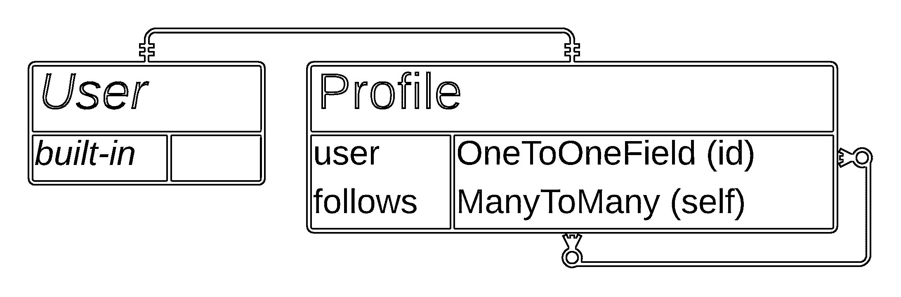](https://files.realpython.com/media/social-user-profile-relationship.f2d4b538d7a6.png)

在上图中，您可以看到一个[实体-关系(ER)图](https://en.wikipedia.org/wiki/Entity–relationship_model)的草图，显示每个用户都有一个简档，并且简档可以不对称地跟随另一个简档。

这个图表并不旨在完美或完整。对于你自己的过程，也许你会想在一张纸上画出一些稍微不同的东西。你在头脑风暴，所以用最适合你的方式。

[*Remove ads*](/account/join/)

### 基于文本的内容

除了在用户之间建立关系，你的平台还需要一种让用户创建和分享内容的方式。内容可以是任何东西。它可以包括图像、文本、视频、网络漫画等等。

在这个项目中，您将构建一个处理有限字符文本消息的社交网络，类似于 [Twitter](https://www.twitter.com) 。因为您将使用 Django web 框架来制作它，所以它将带有一个时髦的名字 **Dwitter** 。

您的 Dwitter 网络将需要一个模型来存储用户可以创建的基于文本的消息，您将称之为 **dweets** 。您将只记录每个 dweet 的三条信息:

1.  谁写的
2.  这条信息说了什么
3.  **当**用户写的时候

您只需要为您的`Dweet`模型定义一个关系，即它与内置`User`模型的连接:

[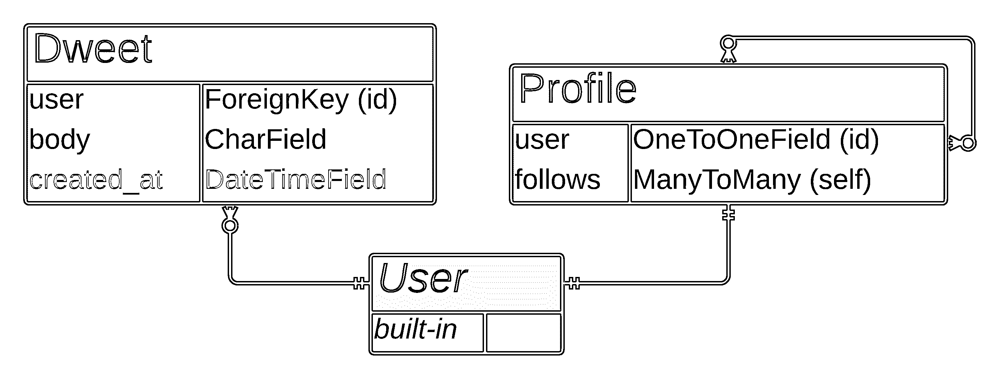](https://files.realpython.com/media/social-full-relationships.a316c1b2dbf6.png)

ER 图显示了内置的*用户*表如何通过一对多关系连接到 *Dweet* 表。这种关系意味着一个用户可以有许多 dweet，而每个 dweet 只属于一个用户。

您还可以在表中看到不同的字段，这些字段对应于您要收集的关于每个 dweet 的信息:

1.  **`user`** :保存消息作者的信息
2.  **`body`** :保存消息的文本内容
3.  **`created_at`** :保存用户发布消息的日期和时间

在 ER 图中,`created_at`字段是灰色的，因为您不允许您的用户自己编辑它。相反，每当用户提交新消息时，Django 会自动填充该字段。

**注意:**你起草的两个模型都没有很多字段，这是好事！你想创建一个*基本*社交网络实现，满足你之前头脑风暴的标准。以后你总是可以把它变得更复杂。

您还需要一种方式让您的用户创建内容并查看他们和他们网络中的其他人创建的内容。为了方便用户，您必须执行以下一些任务来设置前端:

*   提供提交内容的表单
*   创建视图来处理这些提交
*   构建模板以显示现有内容
*   让它看起来体面

本系列中涉及的大多数主题都是适用于许多 Django web 应用程序的一般主题。您可能已经知道如何做其中的一些，但是在这里您将在一个全新的项目环境中探索它们。即使你还没有遇到任何相关的任务，你也将学会如何一个接一个地应对每个挑战。

既然您已经花了一些时间来集思广益您的项目想法，您可以准备建立它！

## 先决条件

要完成本系列教程，您应该熟悉以下概念:

*   在 Python 中使用[面向对象编程](https://realpython.com/python3-object-oriented-programming/)
*   [建立 Django 基础项目](https://realpython.com/django-setup/)
*   在 Django 中管理[路由和重定向](https://realpython.com/django-redirects/)、[视图功能](https://realpython.com/django-view-authorization/)、模板、模型和[迁移](https://realpython.com/django-migrations-a-primer/)
*   使用和[定制 Django 管理界面](https://realpython.com/customize-django-admin-python/)
*   用类属性读写 HTML

如果您在开始本教程之前没有掌握所有这些知识，那也没关系！你可以通过直接开始来学习更多。如果遇到困难，你可以随时停下来复习上面链接的资源。

因为您将使用 Django 构建您的社交网络的后端，所以您将希望熟悉 Django 框架，以便从本系列中获得最大收益。如果您以前没有怎么使用过 Django，您可能想尝试构建一个侧重于基础的 Django 项目。对于一个好的介绍，你可以[通过构建一个投资组合应用](https://realpython.com/get-started-with-django-1/)来了解 Django。

[*Remove ads*](/account/join/)

## 步骤 1:建立基础项目

此时，您已经知道要构建什么，并且理解了要实现的数据库关系。在这一步的最后，您将已经建立了一个 Django 项目，并编辑了 Django 管理界面，以允许集中和最小化的用户创建。

你将一个接一个地解决几个步骤:

1.  创建一个**虚拟环境**和**安装** Django
2.  创建一个 Django **项目**和**应用**
3.  定制 Django **管理界面**
4.  为您的应用程序创建**个用户**

在做任何事情之前，您将首先创建一个虚拟环境并安装 Django。

### 创建一个虚拟环境并安装 Django

首先创建一个新的项目根文件夹，您将在此文件夹中放置在此项目中制作的所有文件，然后导航到该文件夹:

```py
$ mkdir django-social
$ cd django-social
```

导航到您将开发项目的父文件夹后，您可以创建并激活一个[虚拟环境](https://realpython.com/python-virtual-environments-a-primer/)，并从 [Python 打包索引(PyPI)](https://pypi.org/) 安装 Django:

```py
$ python3 -m venv venv --prompt=social
$ source ./venv/bin/activate
(social) $ python -m pip install django==3.2.5
```

这些命令创建一个名为`social`的新虚拟环境，激活这个环境，并安装 Django。

### 创建 Django 项目和应用程序

一旦安装完成，您就可以开始一个名为`social`的新 Django 项目。您的项目名称不必与您的虚拟环境名称一致，但这样，它将更容易记忆。

创建 Django 项目后，创建一个名为`dwitter`的新 Django 应用程序来配合它:

```py
(social) $ django-admin startproject social .
(social) $ python manage.py startapp dwitter
```

您还需要在`social/settings.py`的`INSTALLED_APPS`中注册新的`dwitter`应用程序:

```py
# social/settings.py

# ...

INSTALLED_APPS = [
    "django.contrib.admin",
    "django.contrib.auth",
    "django.contrib.contenttypes",
    "django.contrib.sessions",
    "django.contrib.messages",
    "django.contrib.staticfiles",
 "dwitter", ]
```

将您的应用程序的名称添加到此列表将使 Django 意识到您想要将该应用程序包含在您的 Django 项目中。这一步是必要的，这样您在`dwitter`中所做的编辑将会影响您的项目。

**注意:**如果你想要更详细的说明来帮助你设置，你可以了解一下[如何设置 Django](https://realpython.com/django-setup/) 。

在继续学习本教程之前，请确保您已经:

1.  激活的虚拟环境
2.  一个新的 Django 项目叫做 **`social`**
3.  一个叫 **`dwitter`** 的 Django app
4.  您的项目的带有注册为应用程序的`dwitter`的`settings.py`文件

如果您在这些步骤中遇到了困难，那么您会在上面链接的关于如何设置 Django 的专门教程中找到所有必要的设置步骤。

[*Remove ads*](/account/join/)

### 定制 Django 管理界面

Django 的内置管理接口是管理应用程序的强大工具，在本教程中，您将使用它来处理用户创建和管理。

**注意:**在本教程中，您不会实现任何面向用户的注册功能。然而，你可以通过跟随关于 [Django 用户管理](https://realpython.com/django-user-management/)的教程来添加这个功能。

为了让您对管理界面的体验集中在本质上，您将应用一些定制。在此之前，您将查看一下默认状态。您需要设置 Django 的默认 SQLite 数据库并创建一个超级用户，这样您就可以登录到 Django 管理门户:

```py
(social) $ python manage.py migrate
(social) $ python manage.py createsuperuser
Username: admin
Email address: admin@example.com
Password:
Password (again):
```

运行这两个命令并输入超级用户帐户的信息后，您可以启动 Django 的开发服务器:

```py
(social) $ python manage.py runserver
```

导航到本地主机端口 8000 上的`/admin` URL，并登录到管理门户:

[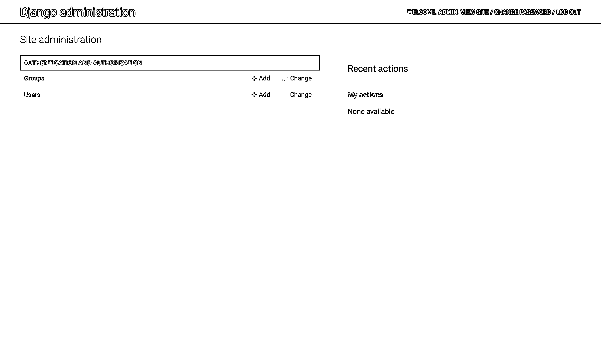](https://files.realpython.com/media/ds-admin-initial.f19db6cb447a.png)

您可以看到*组*和*用户*的默认模型条目。这些来自 Django 内置的认证和用户管理应用。如果你还不熟悉他们，请随意四处看看。

里面有很多！然而，你想让这个项目尽可能地贴近基本原理，把重点放在模型关系和社交网络的内容上。

为了简化您的管理，您可以减少一些事情:

1.  您不会使用 Django 的*组*，因此您可以将其从您的管理视图中完全删除。
2.  在 Django 中创建用户最基本的方法是只传递一个用户名。您也可以从*用户*模型显示中删除所有其他字段。

首先取消注册`Group`模型，这将从您的管理界面中删除该模型:

```py
# dwitter/admin.py

from django.contrib import admin
from django.contrib.auth.models import Group 
admin.site.unregister(Group)
```

要取消注册`Group`，首先从`django.contrib.auth.models`导入。然后，使用`.unregister()`将其从你的管理显示中移除。


检查您的管理界面，注意这样做之后，*组*的条目是如何消失的。

接下来，您将更改 Django 内置`User`模型的管理部分中显示的字段。为此，您需要首先取消注册它，因为默认情况下模型是注册的。然后，您可以重新注册默认的`User`模型来限制 Django admin 应该显示哪些字段。为此，您将使用一个定制的`UserAdmin`类:

```py
 1# dwitter/admin.py
 2
 3from django.contrib import admin
 4from django.contrib.auth.models import User, Group 5
 6class UserAdmin(admin.ModelAdmin): 7    model = User 8    # Only display the "username" field
 9    fields = ["username"] 10
11admin.site.unregister(User) 12admin.site.register(User, UserAdmin) 13admin.site.unregister(Group)
```

将这段代码添加到您的`admin.py`文件中可以简化`User`的管理站点中显示的内容，以及您在创建新用户时需要输入的信息。概括一下，下面是您在不同代码行中所做的事情:

*   **第 4 行**:您添加了另一个导入，从`django.contrib.auth.models`中获取内置的`User`模型。

*   **第 6 到 9 行:**您创建了`UserAdmin`，一个基于导入的`User`模型的定制类。

*   **第 9 行:**您将管理界面显示的字段限制为只有`username`，这足以创建一个测试用户。

*   **第 11 行:**您在管理界面中取消注册默认注册的`User`模型。

*   **第 12 行:**您再次注册了`User`模型，另外还传递了您创建的自定义`UserAdmin`类，它应用了您想要的更改。

如果您现在导航到*主页→认证和授权→用户*中的*用户*概览页面，那么您会注意到您的管理门户显示的信息比以前少得多:

[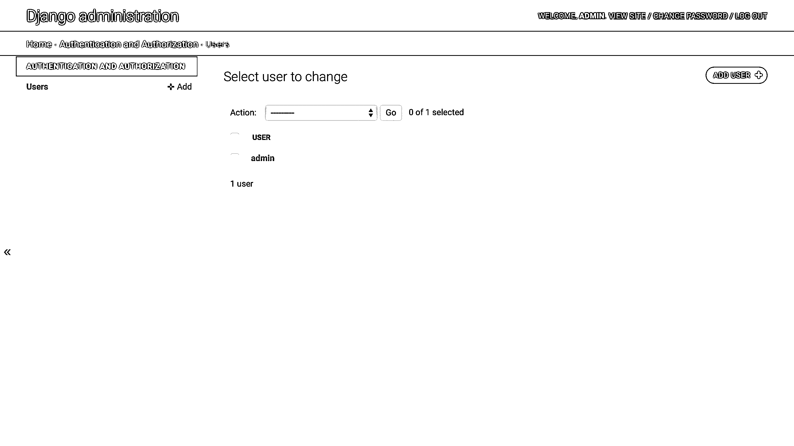](https://files.realpython.com/media/ds-admin-overview-reduced.57ae5dc2fbbb.png)

设置好 Django 管理界面的这些定制后，现在只需提供用户名就可以快速为应用程序创建测试用户。

[*Remove ads*](/account/join/)

### 为您的应用程序创建用户

点击界面右上角的*添加用户*按钮，导航至*首页→认证授权→用户→添加用户*。点击这个按钮将会把你带到默认的 Django 用户模型的用户创建表单:

[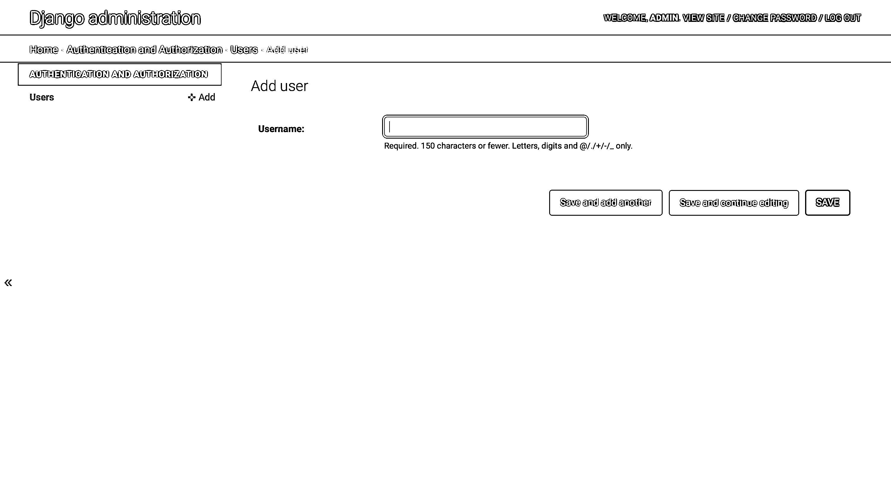](https://files.realpython.com/media/ds-admin-user-reduced.d9a88225fa9c.png)

这个简化的管理门户允许您在任何需要的时候为 Django 社交网络快速创建额外的测试用户，并且您只需要为他们提供一个用户名。

**注意:**仅将这些用户帐户用于开发目的。设置用户而不定义其密码或任何附加信息是不安全的。

继续通过这个界面创建另外两个用户。你可以给它们起任何你喜欢的名字，比如*爱丽丝*和*鲍勃*。一旦您设置了额外的用户，那么您就完成了项目的初始设置。

此时，您已经完成了几件重要的事情:

*   你创建了一个 Django **项目**叫做`social`。
*   你创建了一个名为`dwitter`的 Django **应用**。
*   您清理了您的**管理**门户，将重点放在您需要的基本功能上。
*   你为你的社交网络创建了一些用户。

现在是时候考虑你想要在社交网络中实现的功能了。如果您研究刚刚创建的 Django 用户，您可能会注意到内置的`User`模型没有任何允许用户连接的功能。为了建模用户之间的连接，您需要扩展默认的 Django `User`模型。

## 步骤 2:扩展 Django 用户模型

至此，您已经有了一个有几个注册用户的功能性 Django 项目。在这一步的最后，您将拥有一个链接到内置 Django `User`模型的每个用户的概要文件，允许用户进行连接。

你需要一种方法来保存你的应用程序的用户信息。如果你从零开始，你必须为此建立一个全新的用户模型。相反，您将使用内置的 Django `User`模型来依赖 Django 经过良好测试的实现，这样您就可以避免重新发明身份验证机制。

然而，您还需要默认`User`模型没有包含的额外功能:一个用户如何跟随另一个用户？你需要一种方法来连接用户和其他用户。

虽然 Django 中内置的`User`模型很有帮助，但在构建定制应用程序时，它通常是不够的，因为它专注于认证所需的最小设置。继续利用 Django 内置的用户管理能力，同时添加您的特定定制的一个好方法是[扩展`User`模型](https://docs.djangoproject.com/en/3.2/topics/auth/customizing/#extending-the-existing-user-model)。

**注意:**在一般编程术语中，你会看到在谈论[继承](https://realpython.com/inheritance-composition-python/#whats-inheritance)时使用的术语**扩展**。但是，在 Django 社区中扩展`User`模型也可以参考其他不涉及继承的定制内置`User`模型的方式。

在本教程中，您将使用一对一关系链接两个独立的模型，这是官方建议的解决这一挑战的方法之一。

### 创建一个`Profile`模型

您将扩展 Django 的内置`User`模型，通过使用一个小的和集中的新模型`Profile`的一对一关系。你将从零开始建造这个`Profile`。这个`Profile`模型将跟踪您想要收集的关于每个用户的附加信息。

除了 Django `User`模型已经包含的用户信息，你还需要什么？在寻找可能的解决方案之前，拿出你的笔记本，集体讨论你的基本社交网络需要的其他用户属性:


关于每个用户，您至少需要收集三条信息:

1.  他们追随谁
2.  谁跟踪他们
3.  他们写了哪些数据

您将在`Profile`模型中实现其中的前两个，而您将为本系列教程的后面部分保存 dweets。

您可以添加关于每个用户的更多信息，比如传记信息。在你完成这个系列教程之后，给`Profile`模型添加更多的细节将是一个很好的练习。

`Profile`模型只包含您的用户在之后创建的*信息，他们已经有了一个用户帐户，这允许您让 Django 处理注册和认证过程。这是[扩展现有`User`型号](https://docs.djangoproject.com/en/3.2/topics/auth/customizing/#extending-the-existing-user-model)的建议方式之一，所以你会坚持下去。*

您的`Profile`模型应该记录用户与其他用户档案的联系。在你成功地建立用户对用户的连接模型之前，这是最基本的信息。这意味着您使用`Profile`模型的主要焦点将是设置它来记录谁关注了一个简档，以及从另一个方向，简档关注了谁。

您只需要创建一个字段来模拟这两种连接。这是因为 Django 可以将执行以下操作的概要文件视为与被跟踪的概要文件有相反的关系:

[](https://files.realpython.com/media/social-user-profile-relationship.f2d4b538d7a6.png)

ER 图显示了*概要文件*模型通过*遵循*多对多关系连接到自身。

在你的`dwitter`应用中打开`models.py`，为你的新`Profile`模型编写代码:

```py
 1# dwitter/models.py
 2
 3from django.db import models
 4from django.contrib.auth.models import User
 5
 6class Profile(models.Model):
 7    user = models.OneToOneField(User, on_delete=models.CASCADE)
 8    follows = models.ManyToManyField(
 9        "self",
10        related_name="followed_by",
11        symmetrical=False,
12        blank=True
13    )
```

通过以这种方式设置`Profile`,您可以将每个概要文件精确地耦合到一个用户:

*   **第 4 行:**您导入想要扩展的内置`User`模型。

*   **第 7 行:**您定义了一个名为`user`的`OneToOneField`对象，表示概要文件与用户的连接，该连接是用 Django 内置的用户管理应用程序创建的。您还可以定义，如果相关用户被删除，任何配置文件也将被删除。

*   **第 8 行到第 13 行:**您用字段名`follows`定义了一个`ManyToManyField`对象，它可以保存到其他用户配置文件的连接。

*   **第 10 行:**在这一行中，您在`follows`字段中为`related_name`关键字传递一个值，这允许您通过描述性名称`"followed_by"`从该关系的另一端访问数据条目。

*   **第 11 行:**你还设置了 [`symmetrical`](https://docs.djangoproject.com/en/dev/ref/models/fields/#django.db.models.ManyToManyField.symmetrical) 到`False`，这样你的用户就可以跟踪某人而不会被跟踪回来。

*   **第 12 行:**最后，你设置`blank=True`，这意味着你的用户不需要*跟随任何人。`follows`字段可以保持为空。*

设置好`Profile`之后，您可以运行 Django 的数据库命令来将模型更新传播到您的数据库:

```py
(social) $ python manage.py makemigrations
(social) $ python manage.py migrate
```

运行`makemigrations`会创建一个迁移文件，将更改注册到您的数据库中，`migrate`会将更改应用到数据库中。

您现在可以将`Profile`模型注册到您的管理界面，这样除了内置的`User`模型之外，管理员还会显示它:

```py
# dwitter/admin.py

# ...
from .models import Profile

# ...
admin.site.register(Profile)
```

从当前应用程序导入`Profile`并注册到管理界面后，您可以重启开发服务器:

```py
(social) $ python manage.py runserver
```

一旦它开始运行，就进入你的管理界面。*资料*显示在*资料*面板中的`User`模型下方:

[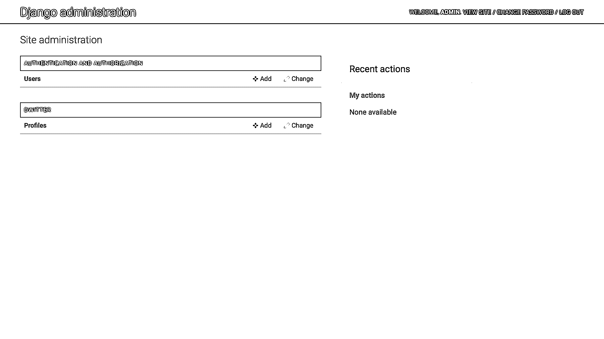](https://files.realpython.com/media/ds-admin-profile.3cd9a21fb50b.png)

如果你点击*档案*旁边的 *+添加*，Django 会呈现给你一个`profile create`视图:

[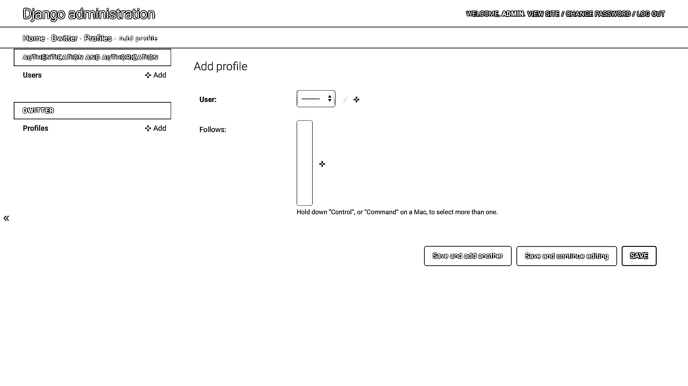](https://files.realpython.com/media/ds-admin-profile-create.e8883beb1edf.png)

您需要选择一个*用户*来与该档案相关联。一旦你从下拉列表中选择了一个用户，你可以点击*保存*来创建你的第一个用户档案。之后，轮廓将在之后的*中显示为可选对象:*

[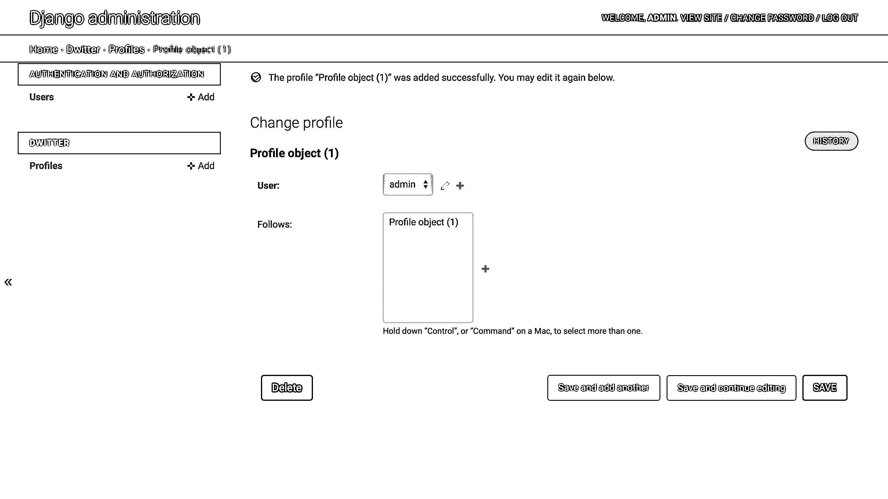](https://files.realpython.com/media/ds-admin-created-profile.a8bd4a013f08.png)

您可以选择新的配置文件对象*配置文件对象(1)* 并再次点击*保存*以关注您自己的用户配置文件。如果此时您已经创建了其他用户，那么请确保也为他们创建一个配置文件。

**注意:**在继续阅读之前，请确保您为所有现有用户创建了个人资料。否则，您可能会在本教程的后面遇到错误。

至此，您已经拥有了创建概要文件和关注其他概要文件所需的所有功能。然而，让`User`和`Profile`显示在两个不同的地方，当它们联系如此紧密并且信息最少时，可能会显得不方便。通过对您的管理界面进行更多的定制，您可以改进这个设置。

[*Remove ads*](/account/join/)

### 在用户管理页面中显示个人资料信息

在本系列教程中，您将通过管理员来处理用户创建。您的每个用户都需要一个用户帐户和一个配置文件，这两者需要连接起来。

不是在两个不同的地方创建用户和他们的配置文件，而是通过添加一个 [admin inline](https://docs.djangoproject.com/en/3.0/ref/contrib/admin/#inlinemodeladmin-objects) 来定制您的管理界面，这允许您在一个区域编辑两者。

返回到`dwitter/admin.py`将您的新`Profile`模型注册为堆叠内联模型，而不是注册模型的标准方式。您可以使用您之前创建的`UserAdmin`类，并通过添加相关的模型作为内联来定制它:

```py
# dwitter/admin.py

# ...

class ProfileInline(admin.StackedInline):
 model = Profile 
class UserAdmin(admin.ModelAdmin):
    model = User
    fields = ["username"]
 inlines = [ProfileInline] 
admin.site.unregister(User)
admin.site.register(User, UserAdmin)
admin.site.unregister(Group)
# Remove: admin.site.register(Profile)
```

在这个代码片段中，您通过创建`ProfileInline`并从`admin.StackedInline`继承来为`Profile`创建一个堆栈内联。然后，您可以将`ProfileInline`作为`inlines`的成员添加到您的`UserAdmin`中。

**注意:** `inlines`是一个可以取多个条目的列表，但是在这种情况下，你只想添加一个。

最后，您还删除了最后一行，这是您之前单独注册的`Profile`型号。

当你进入你的管理界面时，你会看到*个人资料*的条目已经从主页上消失了。但是，当您通过*用户*页面导航到一个用户条目时，您会在您的用户信息旁边看到个人资料信息:

[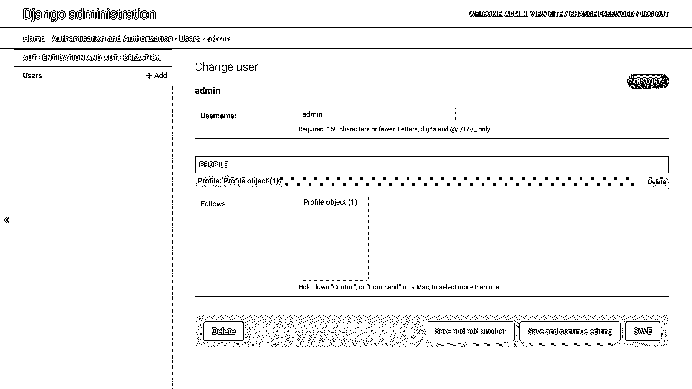](https://files.realpython.com/media/ds-admin-profile-inline.c186517ffab5.png)

来自`Profile`的信息现在与来自 Django 内置`User`模型的信息一起*显示，而 Django 内置`User`模型只显示用户名字段。*

这是一个显著的改进，使得通过管理界面处理用户变得更加方便！

但是，您的档案名称目前很难解释。你怎么知道*配置文件对象(1)* 是*管理员*的用户配置文件？如果没有与您的`Profile`型号相关的描述信息，这很难猜测。要改变这一点，返回到`dwitter/models.py`并为`Profile`添加一个`.__str__()`方法:

```py
# dwitter/models.py

class Profile(models.Model):
    user = models.OneToOneField(User, on_delete=models.CASCADE)
    follows = models.ManyToManyField(
        "self", related_name="followed_by", symmetrical=False, blank=True
    )

 def __str__(self): return self.user.username
```

通过这一添加，您[重载了默认的`.__str__()`方法](https://realpython.com/operator-function-overloading/#printing-your-objects-prettily-using-str)，以便它从`User`模型的相关实例中返回`username`的值。通过重新加载页面，在管理界面中检查结果:

[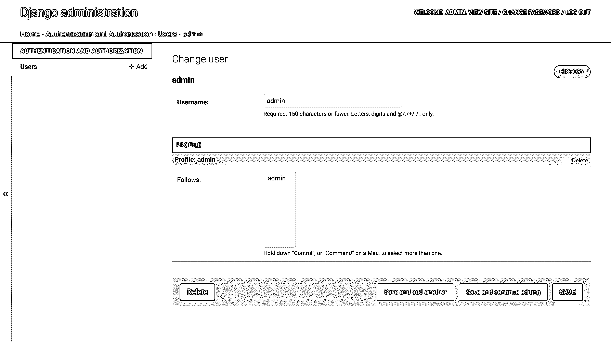](https://files.realpython.com/media/ds-admin-profile-named.e9e225945225.png)

更改之后，连接到*管理员*用户的配置文件对象在*关注*列表中显示该用户的名称。

但是，到目前为止，您创建的其他用户都没有个人资料。最终，您会希望每个用户都有一个包含与该用户相关的附加信息的配置文件。


您可以通过在您的管理界面中创建一个新的配置文件，并通过您的管理内联将它与一个用户帐户相关联，来尝试您的模型设置。

在您创建了更多具有相关简档的用户后，您会看到他们填充了 *Follows* 列表。您可以选择列表中显示的一个或多个配置文件。一旦你点击*保存*，那么个人资料就会开始跟随他们。

你能想出一个如何改进这个过程的主意吗？

因为您希望每个用户总是有一个关联的概要文件，所以您可以设置 Django 来为您完成这项任务。每次创建新用户时，Django 也应该自动创建 fitting 用户概要文件。此外，它应该立即与该用户相关联。你可以在`models.py`中通过使用**信号**来实现这一点。

[*Remove ads*](/account/join/)

## 步骤 3:实现一个保存后挂钩

现在，您已经有了用户和配置文件，并且可以通过您的管理界面创建用户和配置文件并将它们相互关联。在这一步的最后，您已经将它们连接起来，这样创建一个新的用户将会自动创建一个新的概要文件并将它们关联起来。在这一步，您还将练习解释 Django 的错误消息，并通过**错误驱动开发**找到调查和解决挑战的方法。

### 用信号协调用户和配置文件

您已经扩展了内置的`User`模型，但是您还没有创建用户和概要文件之间的自动连接。到目前为止，您只能通过管理界面手动创建用户和简档，并将简档与用户相关联。


如果您还没有尝试过手动操作，现在就试试吧。在 Django admin 中创建一个新的配置文件，然后将它与一个现有的用户帐户相关联。

当用户被创建时，自动地关联一个新的概要文件和一个用户是非常好的，不是吗？你可以用 [Django signals](https://docs.djangoproject.com/en/3.2/topics/signals/) 做到这一点。回到你的`dwitter/models.py`文件。

**注意:**Django 文档提到，放置信号的最佳位置是在你的应用程序的一个新的`signals.py`子模块中。但是，这需要您在应用程序配置中进行额外的更改。因为在本教程中您只需要构建一个信号，所以您将它保存在`models.py`中。

您已经规划了想要实现的目标:当您在数据库中创建一个新用户时，您还想要创建一个新的概要文件并将其链接到该用户。

您可以在`post_save`的帮助下实现这个功能，每次您的代码执行用户模型的`.save()`时，它都会调用`create_profile`函数对象。请注意，`create_profile()`是一个顶层函数，您在`Profile`的之外定义了*:*

```py
 1# dwitter/models.py
 2
 3from django.db.models.signals import post_save
 4
 5# ...
 6
 7def create_profile(sender, instance, created, **kwargs):
 8    if created:
 9        user_profile = Profile(user=instance)
10        user_profile.save()
11
12# Create a Profile for each new user.
13post_save.connect(create_profile, sender=User)
```

您已经向您的`models.py`文件添加了额外的代码行:

*   **第 3 行:**你从导入`post_save`开始。

*   **第 7 行到第 10 行:**您编写了一个名为`create_profile`的新函数，它使用`post_save`提供的`created`来决定是否创建一个新的`Profile`实例。只有当 post-save 信号表明 Django 成功创建了用户对象时，您的代码才会继续。

*   **第 9 行:**因为您在`User`和`Profile`之间建立了一对一的连接，所以您需要将一个`User`对象传递给`Profile`构造函数。你可以通过将`instance`作为参数传递给`Profile`来实现。

*   **第 10 行:**在这里，您用`.save()`将新的概要文件提交到您的数据库。

*   **第 13 行:**每次`User`模型执行`.save()`时，你设置 post-save 信号执行`create_profile()`。您可以通过将`User`作为关键字参数传递给`sender`来实现这一点。

这种后保存信号的实现为每个新用户创建了新的简档。通过将新创建的用户传递给`Profile`构造函数，可以自动将两者关联起来。

**注意:**当一个 post-save 信号被触发时，它返回多个变量，所以你正在用`create_profile()`的函数定义中的`**kwargs`捕捉你现在不需要的变量。

你可以在这里为每一个新用户留下一个闪亮干净的空档案。但是，您会自动将用户自己的简档添加到他们关注的简档列表中，因此每个用户也会看到他们自己编写的 dweets。

当你冒险去学习新的东西时，你很可能会遇到各种各样的错误。在下一节中，您将练习在面对错误信息时保持冷静，并学习当您不可避免地发现自己与 Django 的沟通出现问题时，如何保持正确的方向。

### 通过错误驱动的开发增加功能

如果您使用的 post-save 信号与前一节中构建的完全相同，那么当您实际位于稍后将设置的仪表板上时，您将看不到任何*您的* dweets。但是因为回忆自己的个人想法和帖子可能很有趣，所以您将更改代码，以便默认用户在创建个人资料时自动关注自己。

当你尝试按照一步一步的指南去做你自己的事情时，通常很难第一次就把代码做好。与此同时，学习如何坚持下去并找到解决方案是必不可少的！因此，您将练习在开发这个特性时遇到错误，并学习如何解决这些挑战。

**注意:**如果你已经习惯了按照错误消息开发代码，或者如果你以前已经使用过 Django 信号，那么可以跳过这一节，继续[使用装饰器重构代码](#refactor-your-code-using-a-decorator)。

因为您希望在自己的概要文件创建后立即跟踪它，所以回想一下`Profile`中可选的`follows`字段。也许你可以在创建`Profile`实例时，通过`follows`关键字在保存后钩子函数中添加`instance`:

```py
def create_profile(sender, instance, created, **kwargs):
    if created:
 user_profile = Profile(user=instance, follows=[instance])        user_profile.save()
```

似乎很快！启动您的开发服务器并创建一个新用户来检查它是否按预期工作。

不完全是。您最终会遇到一条错误消息:

```py
Direct assignment to the forward side of a many-to-many set is prohibited.
Use follows.set() instead.
```

Django 不知道如何处理你的指令，但它试图猜测，然后给你一个建议。从`Profile`中移除`follows=[instance]`，并尝试使用`follows.set()`代替，如错误信息所示:

```py
def create_profile(sender, instance, created, **kwargs):
    if created:
 user_profile = Profile(user=instance) user_profile.follows.set(instance)        user_profile.save()
```

通过在 Django admin 中创建另一个新用户，清洗并重复您的手动测试。Django 仍然对您的代码不完全满意，但是它理解得更多了，这意味着它会给您一个不同的错误消息:

```py
ValueError at /admin/auth/user/add/
"<Profile: name>" needs to have a value for field "id" before this
many-to-many relationship can be used.
```

您可能记得，在数据库中有条目之前，您需要用`.save()`提交您的对象。当 Django 创建数据库条目时，它也会自动在条目中创建`id`字段。

在这个错误消息中，Django 告诉您数据库中首先需要有一个`User`实例，这样您就可以使用`.set()`向`follows`添加一个实例。这是一个可行的建议！也许您可以先将新的个人资料保存到您的数据库，然后将其添加到`follows`并再次保存:

```py
def create_profile(sender, instance, created, **kwargs):
    if created:
        user_profile = Profile(user=instance)
 user_profile.save()        user_profile.follows.set(instance)
        user_profile.save()
```

这一次，当您创建一个新用户时，您的期望很高！然而，姜戈再次感到困惑:

```py
TypeError at /admin/auth/user/add/
'User' object is not iterable
```

错误消息读起来好像 Django 试图迭代`instance`，它引用新创建的`User`对象。这就是`.set()`所做的吗？是时候看看 Django 关于多对多关系的文档了:

> 可以设置关系集:
> 
> >>>
> 
> ```py
> `>>> a4.publications.all()
> <QuerySet [<Publication: Science News>]>
> >>> a4.publications.set([p3]) >>> a4.publications.all()
> <QuerySet [<Publication: Science Weekly>]>` 
> ```
> 
> [(来源)](https://docs.djangoproject.com/en/dev/topics/db/examples/many_to_many/)

看起来`.set()`确实需要一个可迭代的输入，Django 试图在错误消息中告诉您这一点。因此，您可能能够将带有`instance`的列表作为单个项目传递，就像 Django 文档告诉您的那样:

```py
def create_profile(sender, instance, created, **kwargs):
    if created:
        user_profile = Profile(user=instance)
        user_profile.save()
 user_profile.follows.set([instance])        user_profile.save()
```

这一更改应该允许`.set()`遍历您传递的列表，并将与您的新用户帐户相关联的配置文件添加到用户关注的帐户列表中。交叉手指，再次尝试创建一个新用户，但是又出现了另一个错误:

```py
TypeError at /admin/auth/user/add/
TypeError: Field 'id' expected a number but got <User: name>.
```

太好了！您的错误消息不断变化，这为您提供了额外的信息。你在正确的道路上。

现在 Django 告诉你，它得到了一个`User`对象，但期望得到一个`id`字段。您设置了配置文件来跟随其他配置文件，然而 Django 只寻找`Profile`对象的`.id`。在扩展了`User`模型之后，您可以使用`.profile`通过用户实例访问用户的概要文件，然后更深入地进入对象以获得`.id`:

```py
def create_profile(sender, instance, created, **kwargs):
    if created:
        user_profile = Profile(user=instance)
        user_profile.save()
 user_profile.follows.set([instance.profile.id])        user_profile.save()
```

又是转圈的时候了。您使用管理界面创建一个新用户，例如， *martin* ，现在它可以工作了:

[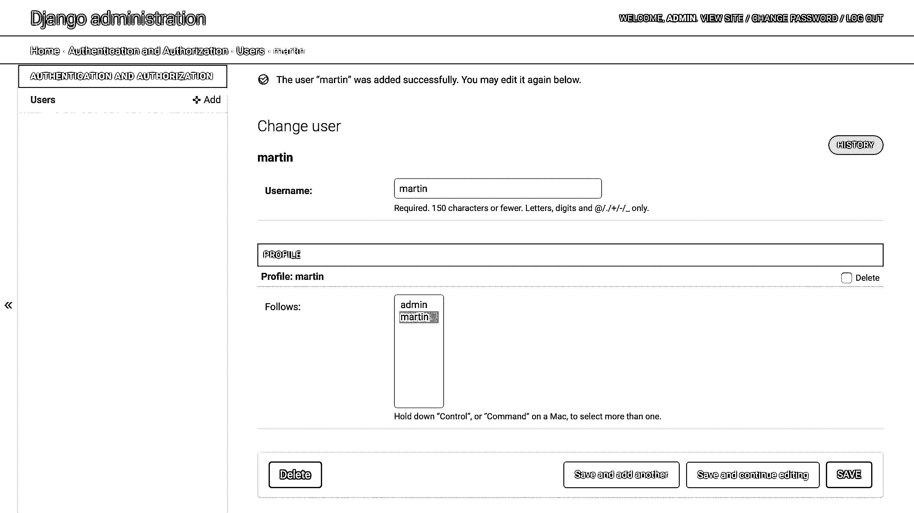](https://files.realpython.com/media/ds-admin-successful-profile-association.27a1a94dab86.png)

恭喜你！您设置了 post-save 挂钩，以便新创建的用户自动关注他们自己的配置文件。同一个 post-save 钩子也自动创建了这个概要文件。

在开发这个功能的同时，您还练习了在面对重复的错误信息时保持冷静。你加深了对发生误解时 Django 如何与你沟通的理解。


您可以用不同的方式解决这个挑战，按照建议的方式，使用`.add()`而不是`.set()`将单个对象添加到多对多关系中。搜索[多对多关系文档](https://docs.djangoproject.com/en/dev/topics/db/examples/many_to_many/)并使用`.add()`重构你的代码，使其工作。


您可以重构代码，使用`.add()`而不是`.set()`，这是添加单个实例的推荐方式:

```py
def create_profile(sender, instance, created, **kwargs):
    if created:
        user_profile = Profile(user=instance)
        user_profile.save()
 user_profile.follows.add(instance.profile)        user_profile.save()
```

您可能还注意到，您不需要传递链接的`Profile`对象的`.id`，但是您可以传递整个对象。这也适用于前一个解决方案，但是对于那个解决方案，您遵循了 Django 的错误消息，该消息将您引向使用`.id`。

所有这些解决方案都有效！请记住，在编程中，解决一个任务的方法总是不止一种。让它正常工作是最重要的，但是重新审视和重构你的代码也是一个很好的实践。

在这种情况下，因为总是只向集合中添加一个实例，所以不需要迭代。这意味着使用`.add()`比使用`.set()`更有效。还有，既然效果一样，而且更有描述性，你可以直接通过`instance.profile`而不用`.id`。

通过这一更改，您解决了用户在仪表板上看不到自己的 dweets 的问题。现在，他们的电子表格将与他们关注的其他人的电子表格一起显示。

此时，您可以让这段代码保持原样，但是 Django 还提供了一种更优雅的方法，通过使用装饰器来注册信号。在下一节中，您将使用`receiver`来[重构](https://realpython.com/courses/refactoring-code-to-get-help/)您的 post-save 钩子。

[*Remove ads*](/account/join/)

### 使用装饰器重构代码

Django 附带了一个`receiver` [装饰器](https://realpython.com/primer-on-python-decorators/)，它允许你使你写的代码更加简洁，而不改变它的功能:

```py
 1# dwitter/models.py
 2
 3from django.db.models.signals import post_save
 4from django.dispatch import receiver 5
 6# ...
 7
 8@receiver(post_save, sender=User) 9def create_profile(sender, instance, created, **kwargs):
10    if created:
11        user_profile = Profile(user=instance)
12        user_profile.save()
13        user_profile.follows.add(instance.profile)
14        user_profile.save()
15
16# Remove: post_save.connect(create_profile, sender=User)
```

通过这种重构，您已经对代码库进行了三项更改:

1.  **第 4 行:**您从`django.dispatch`为`receiver`添加一个导入。

2.  **第 8 行:**将装饰器应用于`create_profile`，传递给`post_save`，并将`User`模型传递给`sender`。通过传递模型，您将`post_save`与和`User`模型相关的事件关联起来，就像您之前与`.connect()`关联一样。

3.  **第 16 行:**您删除了之前将`post_save`与作为发送者的`User`连接起来的代码行，因为您已经通过第 8 行提供给装饰者的参数建立了关联。

请记住，您需要先保存新创建的`Profile`对象，以使其存在。只有这样，您才能将新创建的用户的`.profile`添加到您的新`user_profile`中。最后，您需要再次保存更改，以便将更新的关联传播到您的数据库。

**注意:**如果您对上面代码片段中`.add()`的使用感到惊讶，那么再看一下上一节中名为*的可折叠部分的替代实现*。

恭喜你，你已经成功设置了 Django 社交网络的大部分后端。您实现了用户和 Django 社交网络档案之间的模型关系！每次你创建一个新用户，他们也会收到一个用户资料，并立即关注他们自己的资料。此外，用户配置文件可以相互跟随。但是这有用吗？

### 在您的管理员中确认自动关联

回到您的管理界面，通过提供的表单创建一个新用户。你所要做的就是提供一个用户名，然后点击保存。例如，您可以添加另一个名为 *rainn* 的用户:

[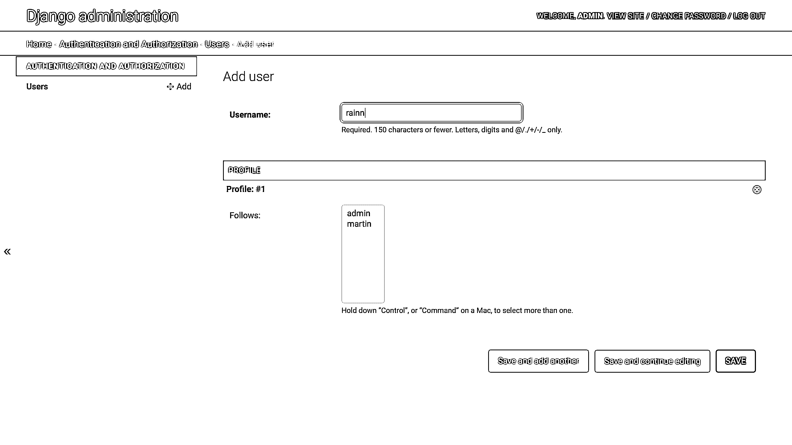](https://files.realpython.com/media/user-admin-new-user.77315caf4e0e.png)

当您检查用户的 *Change* 页面时，您会看到 Django 自动为新用户创建了一个配置文件，并将该配置文件添加到他们关注的配置文件列表中:

[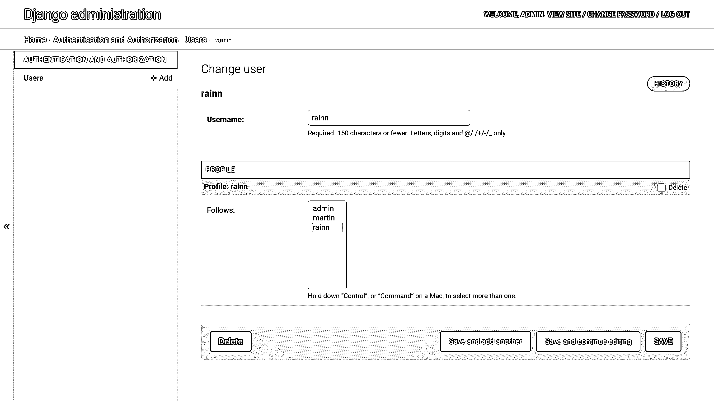](https://files.realpython.com/media/user-admin-new-follow.3c7e1467780c.png)

您可以看到用户关注他们自己的个人资料，因为他们在*关注*列表中的个人资料名称具有灰色背景。

现在，您可以通过 Django 管理界面创建新用户，他们也会自动收到一个相关的配置文件。Django 还将设置他们的个人资料来跟随自己，这将使得在他们的仪表板上显示他们自己的 dweet 和其他人的 dweet 成为可能。

您可以通过选择或取消选择【T2 关注】列表中的简档名称并点击*保存*来更改用户关注的简档。要选择多个配置文件或取消选择特定配置文件，您需要在 Windows 和 Linux 上按住 `Ctrl` ，或在 macOS 上按住 `Cmd` ，同时单击配置文件名称。

**注意:**您可以稍后通过 Django 内置的用户管理系统设置前端身份验证，并且您不需要在后端进行任何更改来保持功能按预期工作。

当有人创建了一个新的用户帐户，他们将收到一个个人资料，此外，他们将免费获得他们的第一个自我关注！

但是这里还没什么可看的。到目前为止，你只是潜伏在 Django admin 里。也许你开始厌倦 Django 提供的预建页面，并渴望编写一些 [Django 模板](https://realpython.com/django-templates-tags-filters/)来看看如何在你的应用程序的面向用户的界面中显示这些模型关系。

这就是你在本系列教程的第二部分要做的事情！你将开始构建你的 web 应用的前端，你将学习如何使用 CSS 框架[布尔玛](https://bulma.io)让它看起来更好。

## 结论

恭喜你！至此，您已经完成了关于用 Django 构建基本社交网络的系列教程的第一部分。

在本系列教程的第一部分中，您学习了如何:

*   Django **模型**之间实现**一对一**和**多对多关系**
*   用定制的`Profile`模型扩展 Django **用户模型**
*   定制 **Django 管理**界面

您还获得了设置 Django 项目以及与此相关的任务的额外实践。您已经练习了阅读 Django 错误消息，并根据它们提供的信息找到解决方案。

您可以通过点击下面的链接并转到`source_code_final/`文件夹来下载该项目的第一部分代码:

**获取源代码:** [点击此处获取源代码，您将使用](https://realpython.com/bonus/django-social-network-1-project-code/)开始与 Django 建立社交网络。

[*Remove ads*](/account/join/)

## Django 基础社交网络的后续步骤

现在你已经完成了这个系列的第一部分，你可以继续第二部分，在那里你将[构建一个布尔玛风格的 Django 前端。在本系列教程的第二部分中，您将为您的用户资料构建前端页面，并使它们看起来更好。](https://realpython.com/django-social-front-end-2/)

当你继续做这个项目时，你可以回头参考本系列教程的这一部分，参考你在[项目概述](#project-overview)中起草的计划，并在这个过程中更新你的计划。

[Part 1](#)[Part 2 »](https://realpython.com/django-social-front-end-2/)*********