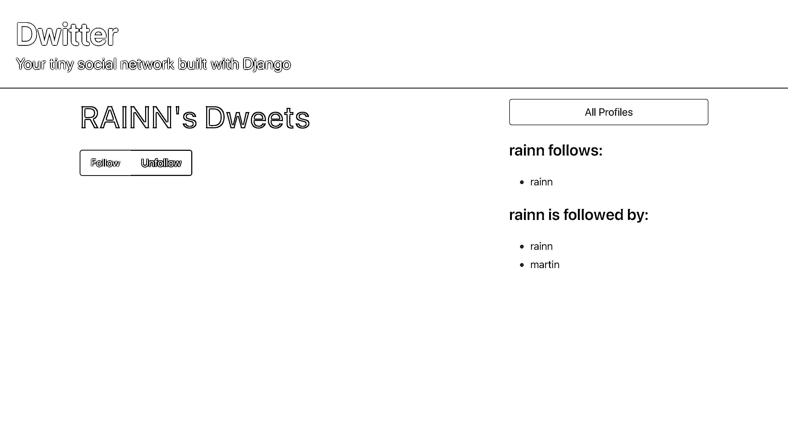
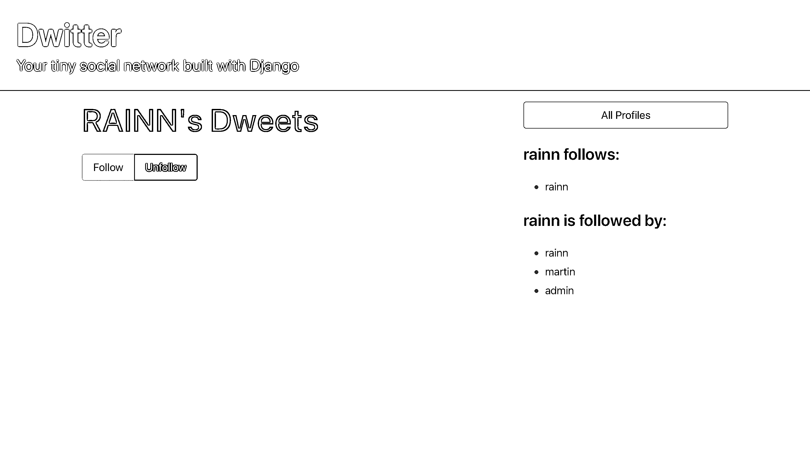
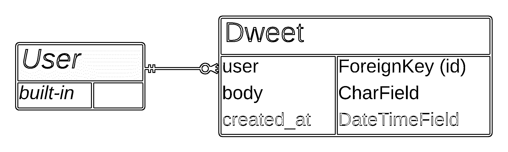
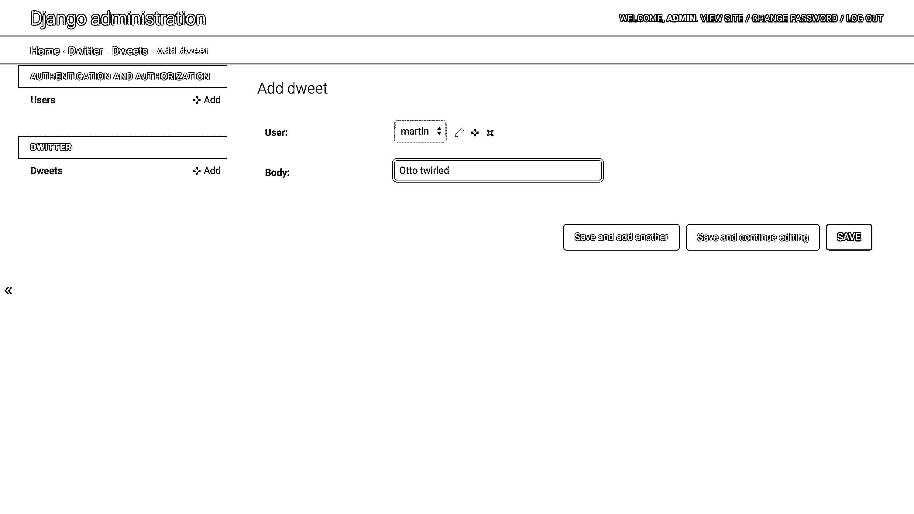
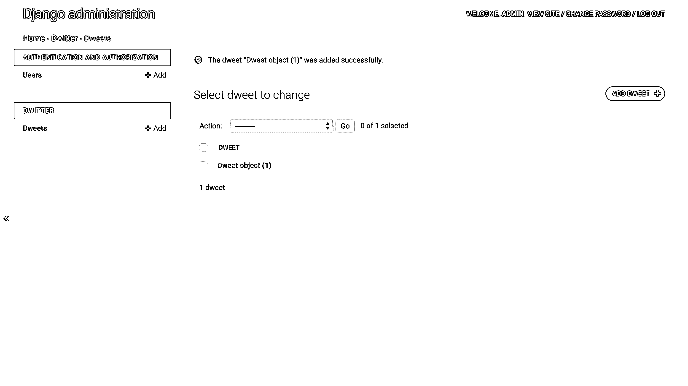
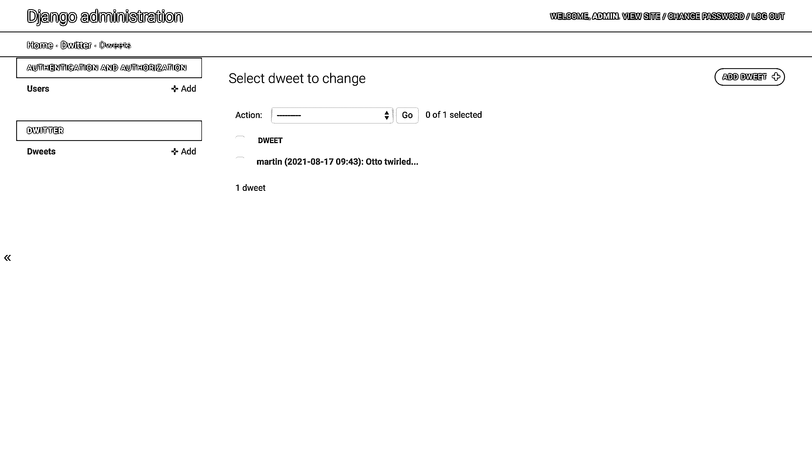
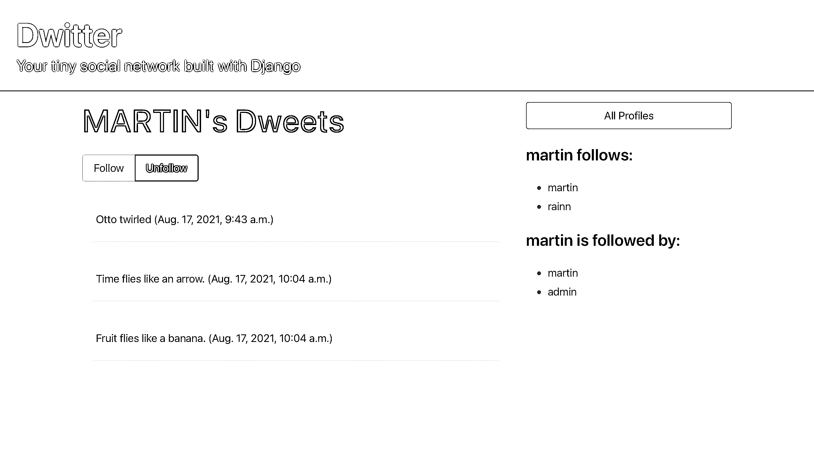
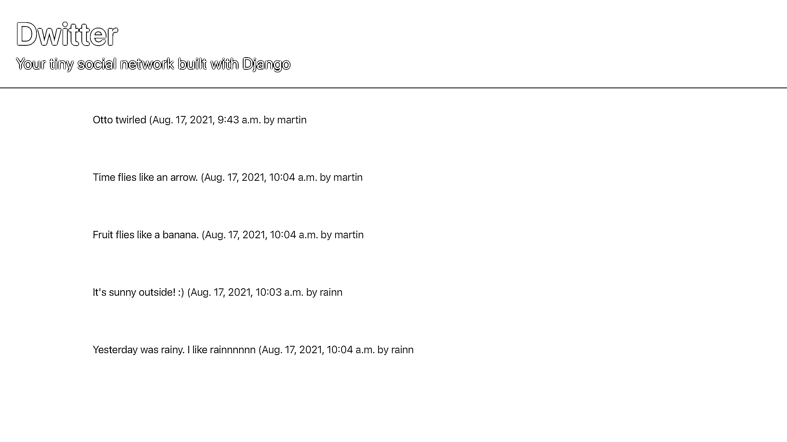

# 在 Django 中构建和处理 POST 请求——第 3 部分

> 原文：<https://realpython.com/django-social-post-3/>

在这个由四部分组成的教程系列中，您将与 Django 一起构建一个社交网络，您可以在文件夹中展示这个网络。这个项目加强并展示了你对 Django 模型之间关系的理解，并向你展示了如何使用表单，以便用户可以与你的应用程序以及彼此之间进行交互。你也可以通过使用 CSS 框架布尔玛让你的网站看起来更好。

在本系列教程的[前一部分](https://realpython.com/django-social-front-end-2/)中，您构建了用于显示所有概要文件列表以及单个概要文件页面的模板和视图。您还了解了如何应用 CSS 框架布尔玛定义的样式规则来使页面看起来更好。

在本系列教程的第三部分，您将学习如何:

*   创建**前端界面**让用户**关注**和**不关注**配置文件
*   使用按钮在 Django 中提交和处理 POST 请求
*   为您的**基于文本的内容**设置**模型**
*   **构建风格化模板**以在前端显示内容
*   在模板代码中使用复杂的**模型关系**

在这一部分结束时，你的社交网络将拥有你所期望的所有页面，你将能够在后端创建 dweets 并在前端显示它们。您的用户将能够发现和关注其他用户，并阅读他们所关注的个人资料的内容。如果他们想停止阅读某个用户的内容，他们还可以点击一个按钮，发送一个由 Django 处理的 HTTP POST 请求，取消对某个档案的关注。

你可以点击下面的链接，进入`source_code_start/`文件夹，下载启动项目第三部分所需的代码:

**获取源代码:** [单击此处获取源代码，您将使用](https://realpython.com/bonus/django-social-post-3-project-code/)来构建和处理 Django 的 POST 请求。

## 演示

在这个由四部分组成的教程系列中，您将构建一个小型社交网络，允许用户发布基于文本的简短消息。您的应用程序用户还可以关注其他用户简档以查看这些用户的帖子，或者取消关注他们以停止查看他们基于文本的帖子:

[https://player.vimeo.com/video/643455270?background=1](https://player.vimeo.com/video/643455270?background=1)

您还将学习如何使用 CSS 框架布尔玛来为您的应用程序提供用户友好的外观，并使其成为您可以自豪地炫耀的投资组合项目！

在本系列教程的第三部分中，您将继续使用布尔玛风格的模板，并为基于文本的消息内容创建模型。您还将在 Django 应用的前端设置和处理 HTTP POST 请求提交，这将允许用户通过点击一个按钮来关注或取消关注彼此:

[https://player.vimeo.com/video/643455207?background=1](https://player.vimeo.com/video/643455207?background=1)

在本教程结束时，每个用户都将能够转到一个新的仪表板页面，访问基于他们所关注的简档的 dweets 个人摘要。他们还可以关注和取消关注其他用户。这对你的 Django 社交网络来说是一个巨大的飞跃！

[*Remove ads*](/account/join/)

## 项目概述

在本节中，您将大致了解本系列教程的第三部分将涵盖哪些主题。您还将有机会重温完整的项目实现步骤，以防您需要跳回到本系列前面的某个步骤，或者如果您想看看前面还有什么。

至此，你应该已经完成了本教程系列的第[部分第一](https://realpython.com/django-social-network-1/)和第[部分第二](https://realpython.com/django-social-front-end-2/)部分。如果是的话，那么您现在已经准备好继续本系列教程的下一步了。这些步骤集中在跟随和取消跟随配置文件的代码逻辑，以及如何设置 dweets:

|   |   |
| --- | --- |
| **第七步** | [关注和取消关注其他档案](#step-7-follow-and-unfollow-other-profiles) |
| **第 8 步** | [为数据工作表](#step-8-create-the-back-end-logic-for-dweets)创建后端逻辑 |
| **第 9 步** | [在前端显示数据表](#step-9-display-dweets-on-the-front-end) |

完成教程系列第三部分的所有步骤后，可以继续[第四部分](https://realpython.com/django-social-forms-4/)。

为了更好地了解如何构建你的 Django 社交网络，你可以展开下面的可折叠部分:


在本系列的多个独立教程中，您将分多个步骤实现该项目。有很多内容需要讨论，您将一路深入细节:

[**《✅》第一部分:模型与关系**](https://realpython.com/django-social-network-1/)

*   **步骤 1:** 设置基础项目
*   步骤 2: 扩展 Django 用户模型
*   **步骤 3:** 实现一个保存后挂钩

[**【✅第二部分:模板和前端造型**](https://realpython.com/django-social-front-end-2/)

*   第四步:用布尔玛创建一个基础模板
*   **第 5 步:**列出所有用户资料
*   **第 6 步:**访问个人资料页面

[**📍第三部分:跟踪和简报**T3】](https://realpython.com/django-social-post-3/)

*   **第 7 步:**关注和取消关注其他个人资料
*   **步骤 8:** 为 Dweets 创建后端逻辑
*   **第九步:**在前端显示 Dweets

[**⏭第四部分:表格和提交材料**](https://realpython.com/django-social-forms-4/)

*   **步骤 10:** 通过 Django 表单提交 Dweets
*   **步骤 11:** 防止重复提交并处理错误
*   **第十二步:**改善前端用户体验

这些步骤中的每一步都将提供任何必要资源的链接。通过一次完成一个步骤，你将有机会停下来，在你想休息一下的时候再回来。

记住了本系列教程的高级结构，您就可以很好地了解自己所处的位置，以及在最后一部分中将处理哪些实现步骤。

在开始下一步之前，快速浏览一下先决条件，浏览一下可能有帮助的其他资源的链接。

## 先决条件

为了成功地完成项目的这一部分，你需要完成关于模型和关系的第一部分和关于模板和样式的第二部分，并且你应该确认你的项目正在如那里描述的那样工作。最好你也能熟悉以下概念:

*   在 Python 中使用[面向对象编程](https://realpython.com/python3-object-oriented-programming/)
*   [建立 Django 基础项目](https://realpython.com/django-setup/)
*   管理[路由和重定向](https://realpython.com/django-redirects/)，[查看功能](https://realpython.com/django-view-authorization/)，模板，模型，以及 Django 中的[迁移](https://realpython.com/django-migrations-a-primer/)
*   使用和[定制 Django 管理界面](https://realpython.com/customize-django-admin-python/)
*   用类属性读写 HTML

记得确保你已经完成了本系列教程的前两部分。第三部分将从你在第二部分结束时停下的地方继续。

**注意:**如果您没有准备好前几部分的工作项目，您将无法继续学习本系列教程的这一部分。

您也可以通过点击下面的链接并转到`source_code_start/`文件夹来下载启动该项目第三部分所需的代码:

**获取源代码:** [单击此处获取源代码，您将使用](https://realpython.com/bonus/django-social-post-3-project-code/)来构建和处理 Django 的 POST 请求。

关于额外的要求和进一步的链接，请查看本系列教程第一部分中提到的关于在 Django 构建基本社交网络的[先决条件](https://realpython.com/django-social-network-1/#prerequisites)。

## 步骤 7:关注和取消关注其他个人资料

此时，您可以访问简档列表页面上的所有简档，还可以访问用户的简档页面。此外，您可以使用动态链接在前端的这些视图之间导航。在这一步结束时，您将能够通过个人资料页面上的按钮关注和取消关注个人资料。

一旦您添加了关注和取消关注概要文件的可能性，您就已经重新创建了 Django 管理界面在本系列教程的第一部分中为您提供的后端功能。

[*Remove ads*](/account/join/)

### 向您的个人资料添加按钮

添加带有布尔玛按钮样式的 HTML 代码，以创建两个用于与配置文件交互的按钮:

```py
<div class="buttons has-addons">
    
    
</div>
```

关注和不关注用户的按钮可以放在用户档案名称的正下方。弄清楚它在你自己的模板代码中的位置，然后添加上面显示的 HTML。

如果您正在使用来自`profile.html`模板的 HTML，那么您可以添加它，如下面的可折叠部分所示:


```py
<!-- dwitter/templates/dwitter/profile.html -->





<div class="column">

    <div class="block">
    <h1 class="title is-1">
        {{profile.user.username|upper}}'s Dweets
    </h1>
    </div>
 <div class="buttons has-addons">   </div> </div>

<div class="column is-one-third">

    <div class="block">
        <a href="">
            <button class="button is-dark is-outlined is-fullwidth">
                All Profiles
            </button>
        </a>
    </div>

    <div class="block">
        <h3 class="title is-4">
            {{profile.user.username}} follows:
        </h3>
        <div class="content">
            <ul>
            
                <li>
                    <a href="">
                        {{ following }}
                    </a>
                </li>
            
            </ul>
        </div>
    </div>

    <div class="block">
        <h3 class="title is-4">
            {{profile.user.username}} is followed by:
        </h3>
        <div class="content">
            <ul>
            
                <li>
                    <a href="">
                        {{ follower }}
                    </a>
                </li>
            
            </ul>
        </div>
    </div>

</div>


```

在将这个 HTML 代码片段添加到`profile.html`之后，您将看到两个按钮呈现在用户的档案名称下。

例如，如果您转到`http://127.0.0.1:8000/profile/1`，您可以确保 Django 的开发服务器正在运行，并且您可以访问本地主机上的配置文件页面。此 URL 向您显示 ID 为`1`的用户配置文件的配置文件页面，并包括新按钮:

[](https://files.realpython.com/media/ds-both-buttons.5c77bdeb4b2c.png)

按钮看起来不错！然而，似乎你可以点击关注一个个人资料，即使你已经在关注它。

为了在这里创造一些区别，你可以把不相关的按钮变灰，这样相关的动作对你的用户来说就更明显了。如果你添加一个名为`is-static`的 HTML 类，布尔玛应该将你的按钮变灰。您可以根据登录用户是否已经关注他们正在查看的简档来应用此类:

```py
 1<div class="buttons has-addons">
 2    
 3        
 4        
 5    
 6        
 7        
 8    
 9</div>
```

您一直在处理 Django 在每个 GET 和 POST 请求中发送的`user`变量。注意，您甚至不需要在`views.py`中将这个变量显式地传递给上下文字典。`user`变量保存当前登录用户的信息:

*   **第 2 行:**在这个条件语句中，您将检查您当前查看的配置文件是否在登录用户跟踪的所有配置文件的查询集中。

*   **第 3 行到第 4 行:**如果用户已经关注了他们正在查看的个人资料，那么*关注*按钮将通过添加`is-static`类而变灰。*取消跟随*按钮将被着色并显示为可点击。

*   **第 6 行到第 7 行:**如果用户没有关注他们正在查看的个人资料，那么*关注*按钮将显示为可点击，而*取消关注*按钮将显示为灰色。

*   第 8 行:在这一行，你要结束条件语句。

通过 [Django 的模板标签](https://realpython.com/django-templates-tags-filters/)和样式添加一点代码逻辑，你已经让用户更清楚地知道他们只能关注他们当前没有关注的简档，他们只能取消关注他们已经关注的简档。

导航到个人资料页面 URL，如`http://127.0.0.1:8000/profile/1`，或者，如果您还在那里，那么只需重新加载页面以查看更改:

[](https://files.realpython.com/media/Screenshot_2021-08-17_at_10.46.40.2e7b685892a6.png)

然而，即使信息现在以更加用户友好的方式显示，点击可点击的按钮实际上并不做任何事情。为此，您需要创建一个 HTML 表单，并在代码逻辑中处理表单提交。

### 在 Django 代码逻辑中处理 POST 请求

下一步是实现当有人点击这些按钮时应该发生什么的逻辑。为此，您需要一个 HTML 表单，以便可以提交数据并在视图中处理它:

```py
 1<form method="post"> 2     3    <div class="buttons has-addons">
 4    
 5        
 6        <button class="button is-danger" name="follow" value="unfollow"> 7            Unfollow
 8        </button>
 9    
10        <button class="button is-success" name="follow" value="follow"> 11            Follow
12        </button>
13        
14    
15    </div>
16</form>
```

通过更新以下代码，您对模板进行了一些必要的更改:

*   **第 1 行和第 16 行:**您将两个按钮包装在一个 HTML `<form>`元素中，并添加了值为`"post"`的 HTML 属性`method`，以表明您将使用该表单发送数据。

*   **第 2 行:**您通过 Django 提供的一个方便的模板标签添加了一个 [CSRF 令牌](https://docs.djangoproject.com/en/3.2/ref/csrf/)。如果您希望允许您的用户在您的 Django 应用程序中提交表单，出于安全原因，您需要添加这个。

*   **第 6 行和第 10 行:**您向两个`<button>`元素添加了两个 HTML 属性:

    1.  [`name`](https://developer.mozilla.org/en-US/docs/Web/HTML/Element/button#attr-name) 定义您将使用什么键来访问视图函数中的值。您将两个按钮的键都设置为`"follow"`。

    2.  [`value`](https://developer.mozilla.org/en-US/docs/Web/HTML/Element/button#attr-value) 定义当您按下其中一个按钮时，表单将向您在`name`中定义的键名下的视图函数发送什么值。将*跟随*按钮的值设置为`"follow"`，将*不跟随*按钮的值设置为`"unfollow"`。

添加这段代码后，您不会在 web 应用程序的前端看到任何变化，但是这些变化是必要的，以便 Django 可以将用户提交的数据转发到您的视图逻辑。您还需要第 6 行和第 10 行中定义的属性值来区分用户在后端按下了哪个按钮。

在`profile.html`中设置好所有前端逻辑后，您可以切换到`views.py`，在这里您可以获取用户提交的数据并对其进行处理:

```py
 1# dwitter/views.py
 2
 3# ...
 4
 5def profile(request, pk):       
 6    profile = Profile.objects.get(pk=pk)
 7    if request.method == "POST": 8        current_user_profile = request.user.profile 9        data = request.POST 10        action = data.get("follow") 11        if action == "follow": 12            current_user_profile.follows.add(profile) 13        elif action == "unfollow": 14            current_user_profile.follows.remove(profile) 15        current_user_profile.save() 16    return render(request, "dwitter/profile.html", {"profile": profile})
```

由于您在`profile.html`中设置表单的方式，表单将重定向回同一个页面，这意味着 Django 将通过`profile()`获取请求。它这样工作是因为你如何设置你的网址配置。然而，这一次 Django 发送了一个包含用户提交数据的 HTTP POST 请求，您可以在代码更新中解决这个问题:

*   **第 7 行:**您引入了一个条件检查来查看传入 Django 视图函数的请求是否是 HTTP POST 请求。只有当某人通过点击*跟随*或*取消跟随*按钮在`profile.html`提交表格时，才会出现这种情况。

*   **第 8 行:**您使用 Django 的`request`对象中的`user`属性(指当前登录的用户)来访问该用户的`.profile`对象并将其分配给`current_user_profile`。您稍后将需要访问此用户的个人资料来更改他们关注的人。

*   **第 9 行:**从`request.POST`字典中获取用户提交的数据，并存储在`data`中。当用户提交带有属性`method="post"`的表单时，Django 将数据放入`request.POST`。

*   **第 10 行:**通过访问键`"follow"`处的数据来检索提交的值，这个键是在模板中用`<button>`元素上的`name` HTML 属性定义的。

*   **第 11 到 14 行:**您设置了一个条件语句，根据用户按下的按钮，在当前登录用户的`.follows`中添加或删除用户概要文件。这两个按钮为`"follow"`数据键提交不同的值，您可以用它来区分这两个按钮。

*   **第 15 行:**您使用`current_user_profile`上的`.save()`将对`.follows`的更改传播回数据库。

最后，在所有这些条件动作之后 Django 只在表单提交的 POST 请求调用页面时执行这些动作——再次呈现同一个模板。点击按钮后，将重新加载页面并正确显示更改后的关注者列表。

**注意:**如果您还没有为您和您的现有用户创建简档，您可能会在执行发布请求时遇到`RelatedObjectDoesNotExist`错误。为防止此错误，您可以验证您的用户在您的`profile`视图中是否有个人资料:

```py
# dwitter/views.py

# ...

def profile(request, pk):
 if not hasattr(request.user, 'profile'): missing_profile = Profile(user=request.user) missing_profile.save() 
    profile = Profile.objects.get(pk=pk)
    if request.method == "POST":
        current_user_profile = request.user.profile
        data = request.POST
        action = data.get("follow")
        if action == "follow":
            current_user_profile.follows.add(profile)
        elif action == "unfollow":
            current_user_profile.follows.remove(profile)
        current_user_profile.save()
    return render(request, "dwitter/profile.html", {"profile": profile})
```

当调用`profile`视图时，首先检查`request.user`是否包含带有 [`hasattr()`](https://docs.python.org/3/library/functions.html#hasattr) 的`profile`。如果缺少配置文件，那么在继续之前，您需要为您的用户创建一个配置文件。

您现在可以关注和取消关注您社交网络上其他用户的个人资料。通过浏览您的配置文件列表中的配置文件，并有选择地跟踪和取消跟踪它们，确认这按预期工作。您应该会在侧边栏中看到相应的更新列表。

这样，您就将跟随和取消跟随后端逻辑与前端完全连接起来了。您在`profile.html`中添加了一个 HTML `<form>`元素和两个按钮。您还在`profile()`中实现了代码逻辑，它将按钮的按下转化为影响数据库的变化。

[*Remove ads*](/account/join/)

## 步骤 8:为 Dweets 创建后端逻辑

此时，您可以通过应用程序的前端选择关注和取消关注用户资料。然而，即使你*跟随*另一个个人资料，也没什么可看的！此时，你的社交网络的用户不能创建任何内容。改变这一点将是你的下一个挑战。

在这一步结束时，您已经为您的社交网络内容创建了后端——基于短文本的消息，称为*dweets*——用户可以发布到您的应用程序。您还可以通过 Django admin 为用户创建 dweets。

正如你在第一部分的[项目概述中头脑风暴一样，你的社交网络将专注于简短的文本信息。为了纪念老派的 Twitter，您将把字符限制设置为 140 个字符。](https://realpython.com/django-social-network-1//#project-overview)

**注意:**到目前为止，用户发布的内容类型可以是任何类型。你只关注应用程序用户之间的联系。

现在你越来越具体了。如果你想在你的社交网络中允许不同形式的内容，你需要在这一点上转向另一个方向。

您计划创建一个模型，关注用户将在您的社交网络上分享哪些内容的基本原则。您还决定将 dweets 绑定到一个用户帐户，除了文本正文之外，dweets 唯一需要记录的是提交时间:

[](https://files.realpython.com/media/Database_ER_diagram_crows_foot.68598b0982d4.png)

[实体关系(ER)图](https://en.wikipedia.org/wiki/Entity–relationship_model)显示您的`Dweet`模型将与 Django 的内置`User`模型有一个外键关系。您的社交网络的每个用户将能够创建许多与其帐户相关联的 dweets。

### 制作模型

您需要一种方法在数据库中存储用户创建的基于文本的消息。为此，您需要在`dwitter/models.py`中创建一个新模型:

```py
# dwitter/models.py

# ...

class Dweet(models.Model):
    user = models.ForeignKey(
        User, related_name="dweets", on_delete=models.DO_NOTHING
    )
    body = models.CharField(max_length=140)
    created_at = models.DateTimeField(auto_now_add=True)
```

您的`Dweet`模型只需要三个字段:

1.  **`user` :** 该字段建立与 Django 内置`User`模型的模型关系。您定义它将是一个外键关系，这意味着每个 dweet 将与一个用户相关联。您还将`"dweets"`传递给`related_name`，这允许您通过`.dweets`从关系的用户端访问 dweet 对象。最后，通过将`on_delete`设置为`models.DO_NOTHING`来指定孤立的 dweets 应该保留。

2.  **`body` :** 此字段定义您的内容类型。您将其设置为最大长度为 140 个字符的字符字段。

3.  **`created_at` :** 新模型的最后一个字段记录了提交文本消息的日期和时间。在一个`DateTimeField`对象上将`auto_now_add`设置为`True`可以确保当用户提交一个 dweet 时这个值被自动添加。

设置好这三个字段后，您就完成了`Dweet`模型的创建！接下来，您需要通过运行`makemigrations`和`migrate`管理命令将更改应用到您的数据库:

```py
(social) $ python manage.py makemigrations
(social) $ python manage.py migrate
```

运行这两个命令后，您在`models.py`中的更改已经应用到您的数据库中。您的后端已经设置好记录 dweets，但是到目前为止，您还没有办法通过 web 应用程序提交它们。

### 通过管理界面添加 Dweets

最终，您希望您的社交网络用户通过 web 应用程序的前端提交 dweets。然而，首先，您要确保到目前为止您构建的所有东西都按预期工作。首先，您将通过管理界面添加创建 dweets 的功能。

要在管理界面中访问您的新`Dweet`模型，您需要注册它:

```py
# dwitter/admin.py

from django.contrib import admin
from django.contrib.auth.models import Group, User
from .models import Dweet, Profile 
# ...

admin.site.register(Dweet)
```

如果你在这样做之后进入你的管理界面，你会看到 *Dwitter → Dweets* 选项现在出现了。点击旁边的 *+添加*按钮，创建一个新的 dweet:

[](https://files.realpython.com/media/ds-admin-add-dweet.07a1e2a177ed.png)

请注意，您需要将现有用户对象分配给要创建的 dweet。您可以从下拉列表中选择一个。您还需要为 dweet 的主体添加文本。你*不需要*在创建时添加日期，因为 Django 会在你点击*保存*后自动处理。

通过提供用户和文本主体，您可以通过管理界面创建新的 dweet:

[](https://files.realpython.com/media/ds-admin-added-dweet-object.2101777114ad.png)

然而， *Dweet object (1)* 对于提交的 Dweet 来说并不是一个非常具有描述性的名称。如果你能看到是谁写的，什么时候写的，至少能看到正文的开头，那就更好用了。您可以通过在`Dweet`的类定义中覆盖`.__str__()`来改变 Django 显示`Dweet`对象的方式:

```py
# dwitter/models.py

class Dweet(models.Model):
    user = models.ForeignKey(User,
                             related_name="dweets",
                             on_delete=models.DO_NOTHING)
    body = models.CharField(max_length=140)
    created_at = models.DateTimeField(auto_now_add=True)

    def __str__(self):
        return (
            f"{self.user} "
            f"({self.created_at:%Y-%m-%d %H:%M}): "
            f"{self.body[:30]}..."
        )
```

通过添加一个定制的`.__str__()`方法，返回一个由用户名、创建日期和消息体的前三十个字符组成的 [Python f 字符串](https://realpython.com/python-f-strings/#multiline-f-strings)，您已经改进了 Django 在管理界面上呈现 dweets 的方式:

[](https://files.realpython.com/media/ds-admin-descriptive-dweet.b00c3d1d48a5.png)

应用这一更改后，Django 管理界面中的 dweet 概述页面将保持有用和可读，即使您的用户已经添加了许多额外的 dweet。

**注意:**在准备接下来的步骤时，您应该创建几个 dweets，并将它们分配给应用程序的不同用户。确保您至少有三个用户，并且他们都有一些示例 dweet，以便您可以在关注或取消关注简档时看到哪些 dweet 出现。

在这一步中，您为 Django 社交网络的文本内容创建了一个新模型，在您的管理界面中注册了它，并改进了 Django 显示对象的方式。在下一节中，您将添加代码来告诉 Django 在 web 应用程序的前端显示这些 dweets。

[*Remove ads*](/account/join/)

## 第九步:在前端显示 Dweets

至此，您已经建立了概要文件，并且可以通过 Django 管理界面创建 dweets。在此步骤结束时，您将能够通过前端查看 dweets，并且能够在仪表板页面上显示您关注的概要文件的 dweets。

如果您还没有通过管理界面创建任何 dweet，那么回到那里，创建几个 dweet，并将它们分配给不同的用户。一旦您设置了仪表板页面来显示您所关注的简档的 dweet，那么拥有一些要检查的 dweet 将会很有帮助。

### 在每个个人资料页面上显示个人资料

首先，您将返回到`profile.html`，在这里您将添加代码来显示与这个概要文件相关联的用户的所有 dweets。稍后，您将创建另一个网站，显示您关注的所有人的 dweets。

在个人资料页面上，您可以访问`profile`。如何像处理简档的关注者一样迭代用户的 dweets？

如果你回想一下写`Dweet`的时候，你可能记得你将`related_name`设置为`"dweets"`。您在那里定义的名称让您可以通过`User`模型反向访问关联的`Dweet`对象。此外，您可以通过在上下文字典中传递的`Profile`对象来访问链接的`User`实例:

```py
profile.user.dweets
```

不错！有了这段代码，您就可以完整地浏览您在这个项目中建立的所有模型关系。继续在`profile.html`中使用它，这样您就可以在每个用户的个人资料页面上看到他们的 dweets:

```py
<!-- dwitter/templates/dwitter/profile.html -->

<!-- ... -->

<div class="content">
    
        <div class="box">
            {{ dweet.body }}
            <span class="is-small has-text-grey-light">
                ({{ dweet.created_at }})
            </span>
        </div>
    
</div>
```

在关闭`<div class="block">`之后添加这个包含布尔玛样式的 HTML 片段:


```py
<!-- dwitter/templates/dwitter/profile.html -->





<div class="column">

    <div class="block">
    <h1 class="title is-1">
        {{profile.user.username|upper}}'s Dweets
    </h1>

    <form method="post">
        
        <div class="buttons has-addons">
        
            <button class="button is-success is-static">
                Follow
            </button>
            <button class="button is-danger"
                    name="follow"
                    value="unfollow">
                Unfollow
            </button>
        
            <button class="button is-success"
                    name="follow"
                    value="follow">
                Follow
            </button>
            <button class="button is-danger is-static">
                Unfollow
            </button>
        
        </div>
    </form>
    </div>

 <div class="content">  <div class="box"> {{ dweet.body }} <span class="is-small has-text-grey-light"> ({{ dweet.created_at }}) </span> </div>  </div> 
</div>

<div class="column is-one-third">

    <div class="block">
        <a href="">
            <button class="button is-dark is-outlined is-fullwidth">
                All Profiles
            </button>
        </a>
    </div>

    <div class="block">
        <h3 class="title is-4">
            {{profile.user.username}} follows:
        </h3>
        <div class="content">
            <ul>
            
                <li>
                    <a href=" ">
                        {{ following }}
                    </a>
                </li>
            
            </ul>
        </div>
    </div>

    <div class="block">
        <h3 class="title is-4">
            {{profile.user.username}} is followed by:
        </h3>
        <div class="content">
            <ul>
            
                <li>
                    <a href=" ">
                        {{ follower }}
                    </a>
                </li>
            
            </ul>
        </div>
    </div>

</div>


```

这很管用！迭代在遍历完模型关系后开始，由于布尔玛的样式表，您可以以一种愉快的方式查看当前用户的 dweets:

[](https://files.realpython.com/media/Screenshot_2021-08-17_at_12.39.14.a08758ab142f.png)

通过单击您之前设置的链接之一，查看另一个用户配置文件。你所有的个人资料页面都在按预期工作，它们看起来很可爱！您现在可以浏览每个人的关注者、他们关注的人以及他们的电子表格。您还可以点击一个按钮来关注或取消关注每个个人资料。这正是大多数用户希望在他们的个人资料页面上看到的。

您仍然缺少一种方法来显示您关注的所有配置文件的所有 dweets 的提要。您将通过更新您的仪表板视图来实现此功能。

### 创建仪表板视图

在本系列第二部分的[中，您已经设置了一个占位符仪表板视图，这意味着已经定义了适当的路由，当您导航到基本 URL 时，Django 将调用`dashboard()`。到目前为止，没有什么可看的，因为它只呈现了你的基本模板。现在，您将更新这个端点，使它更有用，并显示您的仪表板页面。在您的仪表板上，您希望能够做两件事:](https://realpython.com/django-social-front-end-2/#view-your-base-template)

1.  阅读您关注的个人资料中的所有电子表格
2.  提交 dweet

在本系列的下一部分中，您将处理第二个任务。现在，您将专注于显示您关注的所有概要文件的 dweets。更新`views.py`中的`dashboard()`,将其指向不同的模板:

```py
# dwitter/views.py

from django.shortcuts import render
from .models import Profile

def dashboard(request):
 return render(request, "dwitter/dashboard.html")
```

当然，那个模板还不存在。为了不让 Django 抱怨，您去了`dwitter/templates/dwitter/`并创建了一个名为`dashboard.html`的新模板，并添加了一些代码逻辑草案以确保它按预期工作:

```py
 1<!-- dwitter/templates/dwitter/dashboard.html -->
 2
 3
 4    
 5        <li>{{dweet.user.username}} ({{ dweet.created_at }}): {{ dweet.body }}</li>
 6    
 7
```

在将这个代码片段添加到`dashboard.html`并导航到位于`localhost:8000/`的基本 URL 之后，您应该会看到一个未格式化的列表，其中包含了您所关注的所有概要文件的所有 dweets。

**注意:**如果没有新的消息出现，请确保您的管理员用户关注它自己和至少两个其他配置文件。您还可以检查这些用户在您的数据库中是否有一些现有的 dweets。

在用布尔玛的风格让这个列表看起来更好之前，首先回顾一下你在 Django 模板中链接在一起的模型关系是值得的:

*   **第 3 行:**深入 Django 在每个 POST 或 GET 请求中发送的`user`对象。它指的是登录的用户，当前是您的管理员用户。使用`.profile`，您可以访问您的管理员用户的配置文件，这是您在[扩展 Django `User`模型](https://realpython.com/django-social-network-1/#step-2-extend-the-django-user-model)时设置的。这个概要文件有一个名为`.follows`的属性，它保存了这个概要文件所遵循的所有用户概要文件的集合。最后，使用`.all`，您可以访问集合的一个 iterable。

*   **第 4 行:**将另一个`for`循环嵌套到前一个循环中。在这里，您访问`followed`以获得当前登录用户关注的每个用户配置文件。然后遍历`.user`对象及其`related_name`、`.dweets`，以访问该用户编写的所有 dweets。使用`.all`，您再次访问该集合的一个 iterable。

*   **第 5 行:**你现在可以访问`dweet`中的每个 dweet。您可以使用它从每个基于文本的消息中挑选出您想要的信息，并将这些信息组合到一个 HTML 列表项中。

您可以使用 Django 的模型关系来精确地找到您正在寻找的信息，这是非常强大的，即使这需要您钻过一系列不同的步骤！请记住，其工作方式取决于您在前面步骤中设置模型的方式:

[](https://files.realpython.com/media/social-full-relationships.a316c1b2dbf6.png)

你可以拿起铅笔，取出你在第一部分中[创建的数据库草稿。试着思考你的模型是如何连接的，并确保在继续之前，你理解了如何以及为什么你能以上述方式访问 dweets。](https://realpython.com/django-social-network-1/#short-texts-as-your-content)

现在你可以调整一下`dashboard.html`,使其符合你社交网络的其他设计:

```py
<!-- dwitter/templates/dwitter/dashboard.html -->





<div class="column">
    
        
            <div class="box">
                {{ dweet.body }}
                <span class="is-small has-text-grey-light">
                    ({{ dweet.created_at }} by {{ dweet.user.username }}
                </span>
            </div>
        
    
</div>


```

通过扩展您的基本模板并通过布尔玛的 CSS 类添加一些样式，您已经创建了一个有吸引力的仪表板页面，该页面显示您关注的所有个人资料的所有 dweets:

[](https://files.realpython.com/media/ds-dashboard.977fcbb2bbe7.png)

每个用户将根据他们关注的个人资料看到他们自己的 dweets。这对你的 Django 社交网络来说是一个巨大的飞跃！

在这一步中，您添加了一个新的指示板模板来显示 dweets 的个人提要，并且您还向`profile.html`添加了代码来显示每个用户在其个人资料页面上的 dweets。在下一步中，您将添加一个 Django 表单，允许用户从他们的仪表板页面提交 dweets。

[*Remove ads*](/account/join/)

## 结论

在本系列教程的这一部分中，您继续使用 Django 构建小型社交网络的前端和后端。您的应用程序用户现在可以关注和取消关注其他用户简档，并查看他们关注的简档的文本消息。

**在构建这个项目的过程中，您已经学会了如何:**

*   创建**前端接口**到**跟随和解除跟随**剖面
*   使用**按钮**在 Django 提交并处理 **POST 请求**
*   为基于文本的内容设置**模型**
*   构建**样式的模板**以在前端显示内容
*   在模板代码中使用复杂的**模型关系**

在本系列教程的下一部分，也是最后一部分，您将创建一个 Django 表单，允许您的用户通过前端提交新的 dweets。您还将确保内容提交是有效的。最后，您将通过添加导航和排序 dweets 以首先显示最新消息来改善用户体验。

您可以点击下面的链接，进入`source_code_final/`文件夹，下载您在项目的这一部分结束时应该拥有的代码:

**获取源代码:** [单击此处获取源代码，您将使用](https://realpython.com/bonus/django-social-post-3-project-code/)来构建和处理 Django 的 POST 请求。

## Django 基础社交网络的后续步骤

现在您已经完成了本教程系列的第三部分，您可以继续最后一部分，在这里您将使用 Django 构建并提交 HTML 表单。

在本教程系列的下一部分中，您将添加代码逻辑，允许您的用户通过使用表单在您的 web 应用程序上创建内容。您将在`forms.py`中制作一个 **Django 表单**，将其连接到`views.py`中的代码逻辑，并将其呈现在一个模板中，以便您的用户可以从前端提交 dweets。

您将把**仪表板页面**构建成您社交网络的主页。然后，用户可以提交他们的内容，这样这些内容就会与他们关注的个人资料的 dweets 一起显示在平台上。

请记住，在进行这个项目时，您可以继续参考前面的步骤。例如，参考您在本系列教程第一部分的[项目概述](https://realpython.com/django-social-network-1/#project-overview)中起草的计划，并在您完成其余步骤的过程中更新您的计划可能会有所帮助。

[« Part 2](https://realpython.com/django-social-front-end-2/)[Part 3](#)[Part 4 »](https://realpython.com/django-social-forms-4/)*****