# Django 模板:实现定制标签和过滤器

> 原文：<https://realpython.com/django-template-custom-tags-filters/>

Django 模板帮助你管理你的网络应用的 HTML。模板使用带有变量、标签和过滤器的小型语言。在显示变量之前，您可以有条件地包含块、创建循环和修改变量。Django 自带了许多内置标签和过滤器，但是如果这些还不够呢？既然如此，那就自己写吧！本教程涵盖了编写你自己的 Django 模板定制标签和过滤器的细节。

**在本教程中，您将学习如何:**

*   **写**和**寄存器**一个函数作为**自定义过滤器**
*   理解**自动转义**如何在自定义标签和过滤器中工作
*   使用`@simple_tag`编写一个**自定义模板标签**
*   使用`@inclusion_tag`来呈现基于**子模板**的标签
*   用解析器和渲染器编写一个复杂的模板标签

本教程结束时，您将能够编写自定义过滤器来修改模板和自定义标记中的数据，从而在模板中获得 Python 的全部功能。

**免费奖励:** [点击此处获取免费的 Django 学习资源指南(PDF)](#) ，该指南向您展示了构建 Python + Django web 应用程序时要避免的技巧和窍门以及常见的陷阱。

## 开始使用

要使用您自己的 Django 模板定制标签和过滤器，您需要一个 Django 项目。你将建立一个 **dinosoar** ，一个拥有各种恐龙信息的小网站。虽然名字暗示你将只包括飞行恐龙，这只是为了营销自旋。所有你喜欢的重量级人物也会到场。

如果你以前从未建立过 Django 项目，或者如果你需要复习，你可能想先阅读[Django 入门第 1 部分:构建投资组合应用](https://realpython.com/get-started-with-django-1/)。

Django 是第三方库，所以应该安装在虚拟环境中。如果你是虚拟环境的新手，看看 [Python 虚拟环境:初级读本](https://realpython.com/python-virtual-environments-a-primer/)。为您自己创建并激活一个新的虚拟环境，然后运行以下命令:

```py
 1$ python -m pip install django==3.2.5
 2$ django-admin startproject dinosoar
 3$ cd dinosoar
 4$ python manage.py startapp dinofacts
 5$ python manage.py migrate
```

这些命令执行以下操作:

*   **行 1** 运行 [`pip`](https://realpython.com/what-is-pip/) 命令安装 Django。
*   **第 2 行**创建你的新 Django **项目**。
*   **第 3 行**将当前工作目录更改为`dinosoar`项目。
*   **第 4 行**使用`manage.py`命令创建一个名为`dinofacts`的 Django **应用**，你的主视图将驻留在其中。
*   **第 5 行**迁移任何数据库更改。即使您没有创建模型，这一行也是必需的，因为 Django admin 在默认情况下是活动的。

随着项目的创建，是时候进行一些配置更改并编写一个快速视图来帮助您测试您的定制标签和过滤器了。

[*Remove ads*](/account/join/)

### 建立 Django 项目

您需要对项目的设置进行一些更改，让 Django 知道您新创建的应用程序，并配置您的模板。编辑`dinosoar/dinosoar/settings.py`并将`dinofacts`添加到`INSTALLED_APPS`列表中:

```py
34# dinosoar/dinosoar/settings.py
35
36INSTALLED_APPS = [
37    "django.contrib.admin",
38    "django.contrib.auth",
39    "django.contrib.contenttypes",
40    "django.contrib.sessions",
41    "django.contrib.messages",
42    "django.contrib.staticfiles", 43    "dinofacts",
44]
```

在同一个文件中，您需要更新`TEMPLATES`属性中的`DIR`值。这告诉 Django 在哪里寻找你的模板文件:

```py
57# dinosoar/dinosoar/settings.py
58
59TEMPLATES = [
60    {
61        "BACKEND": "django.template.backends.django.DjangoTemplates",
62        "DIRS": [ 63            BASE_DIR / "templates",
64        ],
65        "APP_DIRS": True,
66        "OPTIONS": {
67            "context_processors": [
68                "django.template.context_processors.debug",
69                "django.template.context_processors.request",
70                "django.contrib.auth.context_processors.auth",
71                "django.contrib.messages.context_processors.messages",
72            ],
73        },
```

从 Django 3.1 开始，指定项目所在位置的`BASE_DIR`值是一个`pathlib`对象。上面对`DIRS`值的更改告诉 Django 在项目目录的`templates/`子目录中查找。

**注意:**如果您使用 Django 3.0 或更早版本，您将使用`os.path`模块设置`BASE_DIR`。在这种情况下，使用`os.path.join()`来指定路径。

更改设置后，不要忘记在项目中创建`templates/`目录:

```py
$ pwd
/home/realpython/dinosoar
$ mkdir templates
```

是时候开始写一些代码了。要测试您的定制模板标签和过滤器，您需要一个视图。编辑`dinosoar/dinofacts/views.py`如下:

```py
 1# dinosoar/dinofacts/views.py
 2
 3from datetime import datetime
 4from django.shortcuts import render
 5
 6def show_dino(request, name):
 7    data = {
 8        "dinosaurs": [
 9            "Tyrannosaurus",
10            "Stegosaurus",
11            "Raptor",
12            "Triceratops",
13        ],
14        "now": datetime.now(),
15    }
16
17    return render(request, name + ".html", data)
```

第 7 行到第 15 行用一些样本数据创建了一个字典。您将在模板中使用它来测试您的标签和过滤器。这个视图的其余部分做了一些有点不寻常的事情:它接受一个指定模板名称的参数。

`render()`函数加载并呈现一个模板。这里，`name`值以`".html"`为后缀，将其转换为要加载的模板的名称。这不是您通常会做的事情，但是本文的其余部分将向您展示许多模板。不需要为每个实验编写一个新的视图，这个视图就可以完成任务。

编写模板前的最后一步是将视图注册为 URL。编辑`dinosoar/dinosoar/urls.py`,使其看起来像这样:

```py
 1# dinosoar/dinosoar/urls.py
 2
 3from django.urls import path
 4
 5from dinofacts.views import show_dino
 6
 7urlpatterns = [
 8    path("show_dino/<str:name>/", show_dino),
 9]
```

第 8 行向`show_dino`视图注册了`/show_dino/` URL。这个 URL 需要一个名为`name`的参数，这个参数将被转换成要加载到视图中的模板的名称。

### 使用 Django 模板

视图就绪后，就可以呈现一些 HTML 了。下一步是创建一个模板。大多数 HTML 页面是相当重复的，包含样板标题信息、关于页面的元信息和导航工具。Django 模板使用继承的力量来最小化重复。要查看这一过程，请创建`dinosoar/templates/base.html`:

```py
 1<!-- dinosoar/templates/base.html -->
 2
 3<html>
 4<body>
 5  
 6    <h1>Dino Soar</h1>
 7  
 8</body>
 9</html>
```

通过定义块和扩展父模板，您可以避免在整个站点的 HTML 文件中经常发生的大量千篇一律的重复。上面的模板是本教程中所有未来模板的基础。

本教程中的许多例子都在它们自己的模板文件中。您将创建每一个，并且每一个都将从上面的基本文件继承。您需要创建的第一个示例子文件是`dinosoar/templates/eoraptor.html`:

```py
 1<!-- dinosoar/templates/eoraptor.html -->
 2
 3
 4
 5
 6
 7<h1>Eoraptor</h1>
 8
 9<p>
10  Eoraptor was one of the earliest dinosaurs and its name 
11  is based on the Greek word for "dawn".
12
13   Add something about height here 
14
15</p>
16
17<p>
18  Some other popular dinosaurs were:
19
20  <ul>
21    
22      <li> {{dino|lower}} </li>
23    
24  </ul>
25</p>
26
27
```

该模板使用一些常见的内置模板标签和过滤器:

*   **第 3 行**通过使用``标签声明该模板继承自`"base.html"`。
*   **第 5 行和第 27 行**声明了一个叫做`content`的块。在`eoraptor.html`的渲染过程中，模板引擎会在其父块中寻找一个同名的块。发动机替换`base.html`中相应的挡位。
*   **第 13 行**使用``标签来写评论。呈现的输出将不包括该标签的内容。
*   **第 21 行和第 23 行**定义了一个``块标签。这类似于 Python 中的一个`for`循环。它对值`dinosaurs`进行迭代，并在块中为每个成员呈现该行。
*   **第 22 行**为`dinosaurs`列表中的每一项渲染一次。每个值都放在 HTML `<li>`标签中。注意与值一起使用的`lower`过滤器。过滤器通过管道符号(`|`)应用于一个值。过滤器使用一个值，然后修改渲染结果。`lower`过滤器类似于 Python 中的`.lower()`方法，将值呈现为小写。

现在一切就绪。运行 Django 开发服务器来查看结果:

```py
$ python manage.py runserver
```

要查看视图，请访问`http://127.0.0.1:8000/show_dino/eoraptor/`。您的结果应该如下所示:

[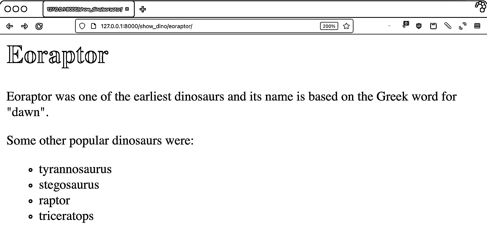](https://files.realpython.com/media/eoraptor_update.2ca87da0547d.png)

评论不见了，恐龙列表是小写的。

你可以通过查看 Django 文档中关于[内置模板标签和过滤器](https://docs.djangoproject.com/en/3.2/ref/templates/builtins/)的内容或者查看 [Django 模板:内置标签和过滤器](https://realpython.com/django-templates-tags-filters/)来找到更多信息。

[*Remove ads*](/account/join/)

### 加载模块和第三方标签库

Django 内置了超过 75 个标签和过滤器，除此之外还有几个模块，但这对于您的用例来说可能还不够。但是在编写您自己的定制标签和过滤器之前，您应该首先做一些研究，看看另一个包是否满足您的需要。

要使用 Django 附带的但不在标准集中的标签或过滤器，您需要:

1.  **注册**包的 Django 应用
2.  **将**模板库加载到您的模板中

许多第三方软件包也是可用的。使用第三方包没有什么不同，除了您需要首先使用`pip`安装这个包。

Django 附带的一个流行的包是 [`humanize`](https://docs.djangoproject.com/en/dev/ref/contrib/humanize/) ，但不是内置库的一部分。该库具有将数字数据转换成更可读形式的过滤器。因为它是作为 Django 中的`contrib`模块的一部分发布的，所以没有额外的安装步骤。

要注册应用程序，请在`dinosoar/dinosoar/settings.py`中更新您的`INSTALLED_APPS`列表:

```py
32# dinosoar/dinosoar/settings.py
33
34INSTALLED_APPS = [
35    "django.contrib.admin",
36    "django.contrib.auth",
37    "django.contrib.contenttypes",
38    "django.contrib.sessions",
39    "django.contrib.messages",
40    "django.contrib.staticfiles",
41    "dinofacts", 42    "django.contrib.humanize",
43]
```

创建一个名为`dinosoar/templates/iggy.html`的新模板:

```py
 1<!-- dinosoar/templates/iggy.html -->
 2
 3
 4
 5
 6
 7
 8<h1>Iguanodon</h1>
 9
10<p>
11  Iguanodon (iguana-tooth) were large herbivores. They weighed 
12  {{3080|intcomma}}kg ({{6800|intcomma}}lbs).
13  Wow, {{3080000|intword}} grams is a lot!
14
15</p>
16
17
```

使用非内置标签或过滤器的关键是您在第 4 行使用的``标签。这相当于 Python 代码中的一个`import`语句。

`iggy.html`模板使用了来自`humanize`的两个过滤器:

1.  **`intcomma`** 将一个数字转换成每三位数加一个逗号的字符串。
2.  **`intword`** 将大数转换成它们的英语等值。

访问`http://127.0.0.1:8000/show_dino/iggy/`查看结果:

[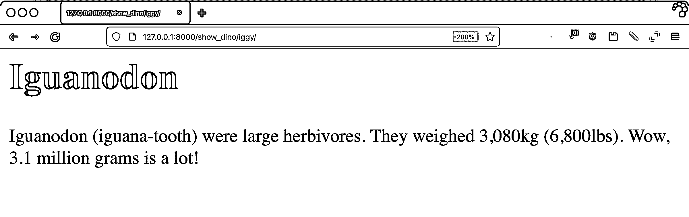](https://files.realpython.com/media/iggy.bf8d61f4fb8f.png)

Django 中有很多标签，有内置的，也有包含在`contrib`模块中的。甚至还有更多第三方库。但是如果你找不到解决你问题的东西呢？是时候自己动手写一些 Django 定制标签和过滤器了。

### 建筑标签和过滤器

自定义标签和过滤器位于 Django 应用程序的`templatetags/`目录中。您可以使用``标签将该目录中的任何文件导入到模板中。您创建的模块的名称将是您用来加载标记库的名称。

对于这个项目，结构将如下所示:

```py
dinosoar/dinofacts/templatetags/
├── __init__.py
└── dinotags.py
```

这个目录像任何其他 Python 代码一样是一个模块，所以它需要`__init__.py`文件。`dinotags.py`文件将包含定制标签和过滤器的所有代码。

正如您将很快了解到的，过滤器是函数。标签可以是函数，也可以是类，这取决于它们的复杂性。仅仅编写函数和类是不够的——您还需要向 Django 注册代码。

注册需要一个`Library`类的实例，然后您可以用它作为装饰器来包装您的标签和过滤器。以下代码是内置过滤器`lower`的简化版本:

```py
 1from django import template
 2
 3register = template.Library()
 4
 5@register.filter
 6def lower(value):
 7    return value.lower()
```

想想这个例子是如何工作的:

*   **1 号线**导入 Django 的`template`模块。
*   **第 3 行**创建一个用于注册的`Library`实例。
*   **第 5 行**使用`Library`实例的`filter`方法作为装饰器。这告诉 Django`lower()`函数是一个过滤器。
*   **第 6 行到第 7 行**定义了实现过滤器的函数。筛选后的值是函数的第一个参数。该实现假设该值是一个字符串。调用字符串的`.lower()`方法并返回结果。从过滤函数返回的内容会在模板中呈现。

`Library`对象提供了注册标签和过滤器的方法。您可以直接调用这些方法，但是更好的方法是将它们用作装饰器。修饰函数可以让其他程序员清楚地知道它是作为标签或过滤器注册的。

[*Remove ads*](/account/join/)

## 编写 Django 模板自定义过滤器

您设置了您的项目并编写了一个用于测试的视图。然后，您使用了内置标签和过滤器以及从库中加载的标签。在上一节中，您学习了如何注册标签和过滤器。在本节中，您已经准备好编写您的第一个 Django 自定义过滤器了！

### 作为函数的过滤器

如前所述，过滤器是 Python 函数。最基本的过滤器只有一个参数:要过滤的值。模板引擎呈现过滤函数的结果。

首先，您将编写一个过滤器来呈现由列表中每一项的首字母组成的字符串。如果您还没有，您需要设置您的模板标记文件:

```py
$ pwd
/home/realpython/dinosoar
$ mkdir dinofacts/templatetags
$ touch dinofacts/templatetags/__init__.py
```

有了这个结构，创建或编辑名为`dinosoar/dinofacts/templatetags/dinotags.py`的模板标记文件:

```py
 1# dinosoar/dinofacts/templatetags/dinotags.py
 2
 3from django import template
 4
 5register = template.Library()
 6
 7@register.filter
 8def first_letters(iterable):
 9    result = ""
10    for item in iterable:
11        result += item[0]
12
13    return result
```

上面的代码注册了一个名为`first_letters`的过滤器。该函数需要一个 iterable，如 list。它遍历列表并构建`result`字符串。如果要过滤的值是一个字符串列表，那么`result`就是每个字符串的第一个字母。

要使用这个过滤器，创建`dinosoar/templates/raptor.html`:

```py
 1<!-- dinosoar/templates/raptor.html -->
 2
 3
 4
 5
 6
 7
 8<h1>Velociraptor</h1>
 9
10<p>
11  The Velociraptor (swift seizer) was made famous by their appearance
12  in the movie <i>Jurassic Park</i>. Unlike in the movie, these
13  dinosaurs were smaller, about the size of a turkey. They shared
14  something else with turkeys: they likely had feathers.
15
16</p>
17<p>
18  The first letters of our dinosaur variable are {{dinosaurs|first_letters}}.
19
20</p>
21
22
```

模板准备就绪后，请访问`http://127.0.0.1:8000/show_dino/raptor/`查看结果:

[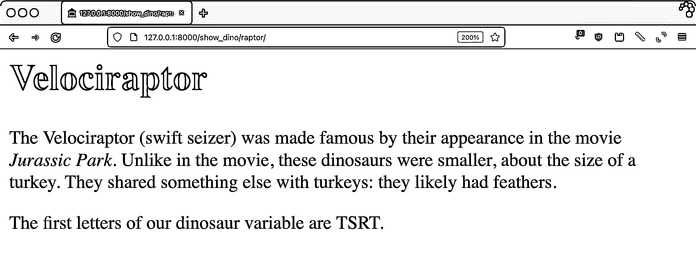](https://files.realpython.com/media/raptor.559745801275.png)

回想一下`dinofacts/views.py`中的`dinosaurs`值是一个包含`"Tyrannosaurus"`、`"Stegosaurus"`、`"Raptor"`和`"Triceratops"`的列表。上面的结果是这些强大的爬行动物的第一个字母:`"TSRT"`。

过滤器也可以接受参数。现在，您将通过编写一个返回 iterable 中每一项的第 *n* 个字母的过滤器来增强`first_letters`的能力。将此功能添加到`dinotags.py`:

```py
23# dinosoar/dinofacts/templatetags/dinotags.py
24
25@register.filter(name="nth_letters", is_safe=True)
26def other_letters(iterable, num):
27    result = ""
28    for item in iterable:
29        if len(item) <= num or not item[num - 1].isalpha():
30            result += " "
31        else:
32            result += item[num - 1]
33
34    return result
```

这里发生了一些新的事情:

*   第 25 行将`name`参数添加到`@register.filter()`装饰器中。这使得模板中的过滤器名称不同于实现函数。这里，过滤器被命名为`nth_letters`，尽管实现它的函数是`other_letters()`。请注意，`is_safe=True`向 Django 表明这个过滤器的输出不包含会破坏 HTML 的字符。您将在下面对此进行更多的探索。
*   **第 26 行**定义了函数。要筛选的值是第一个参数，筛选器的参数是第二个。
*   **第 28 到 32 行**遍历该值并构建结果字符串。
*   **29 线**是安全检查。如果您在八个字母的字符串中查找第十个索引，它将使用一个空格(`" "`)来代替。另外，如果第 *n* 个字符不是一个字母，你可以使用一个空格来避免意外返回破坏 HTML 的字符。
*   **第 34 行**返回要渲染的`result`字符串。

在 HTML 中安全地使用字符串是一个很深的话题。HTML 由带有某些字符的字符串组成，这些字符改变了浏览器显示页面的方式。您必须小心传递给呈现引擎的字符串数据，如果数据是用户输入的，就更要小心了。

Django 用一个名为`SafeString`的类扩展了原始 Python 字符串。一个`SafeString`对象有额外的信息在里面，指示模板引擎是否应该在渲染之前对它进行转义。

当 Django 渲染一个模板时，部分模板可能处于**自动退出模式**。这些区域自动对里面的值进行转义，所以 Django 会把任何麻烦的字符变成相应的 HTML 实体进行显示。有时你渲染的值应该包含 HTML，所以它们需要被**标记为安全的**。

在上面的例子中，registration decorator 的`is_safe=True`参数告诉 Django，这个过滤器保证不输出任何麻烦的字符。传递给过滤器的安全字符串不会被 Django 转义。`is_safe`的默认值是`False`。

请注意，`is_safe=True`是*而不是*将您的过滤结果标记为安全。那是你要负责的一个单独的步骤。对上面的`.isalpha()`的调用确保了这个函数的所有输出都是安全的，所以不需要额外的步骤。

确定过滤器是否安全时要小心，尤其是删除字符时。移除所有分号的过滤器会破坏依赖分号的 HTML 实体，如 [`&amp;`](https://en.wikipedia.org/wiki/Ampersand#Text_markup) 。

要使用`nth_letters`滤镜，请创建`dinosoar/templates/alberto.html`:

```py
 1<!-- dinosoar/templates/alberto.html -->
 2
 3
 4
 5
 6
 7
 8<h1>Albertosaurus</h1>
 9
10<p>
11  Albertosaurus ('Alberta lizard') is a smaller cousin of
12  the T-Rex. These dinosaurs were named after the location
13  of their first discovery, Alberta, Canada.
14
15</p>
16
17<p>
18  The nth letters of our dinosaur variable are:
19  <ul>
20    <li> 3rd: "{{dinosaurs|nth_letters:3}}"</li>
21    <li> 5th: "{{dinosaurs|nth_letters:5}}"</li>
22    <li> 10th: "{{dinosaurs|nth_letters:10}}"</li>
23  </ul>
24</p>
25
26
```

访问`http://127.0.0.1:8000/show_dino/alberto/`以获得结果 HTML:

[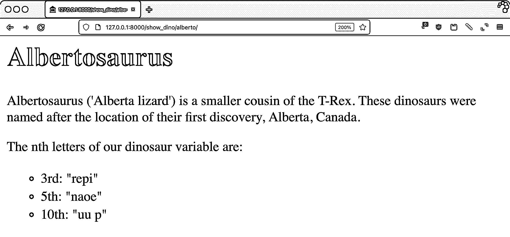](https://files.realpython.com/media/alberto.96c95bf9b2b7.png)

浏览文本并检查您的`nth_letters`过滤器是否如您所愿地工作。

加拿大蜥蜴可能不是国王，但你可能仍然不想在黑暗的小巷里遇见它。

[*Remove ads*](/account/join/)

### 字符串过滤器

筛选器参数的数据类型是模板中使用的值的数据类型。HTML 文档中最常见的数据类型是字符串。Django 提供了一种将过滤器的输入强制转换成字符串的方法，因此您不必手动完成这项工作。现在，您将编写一个新的过滤器，输出一个总结字符串中某个字母出现次数的句子。

将以下内容添加到您的`dinotags.py`文件中:

```py
35# dinosoar/dinofacts/templatetags/dinotags.py
36
37from django.template.defaultfilters import stringfilter
38from django.utils.html import conditional_escape, mark_safe
39
40@register.filter(needs_autoescape=True)
41@stringfilter
42def letter_count(value, letter, autoescape=True):
43    if autoescape:
44        value = conditional_escape(value)
45
46    result = (
47        f"<i>{value}</i> has <b>{value.count(letter)}</b> "
48        f"instance(s) of the letter <b>{letter}</b>"
49    )
50
51    return mark_safe(result)
```

第 41 行的`@stringfilter`装饰符表示这个过滤器只接受字符串。Django 在将过滤器的值传递给过滤器之前，将其转换为一个字符串。这个函数中还有其他一些有趣的事情:

*   **第 40 行**使用注册装饰器中的`needs_autoescape`参数。这告诉 Django 向过滤函数添加另一个参数:`autoescape`。此参数的值将指示对于此筛选器的范围，自动转义是打开还是关闭。
*   **第 42 行**声明了过滤函数，并包含了上面提到的`autoescape`参数。这个参数应该默认为`True`，这样如果你的代码直接调用这个函数，你就处于自动转义模式。
*   **第 43 至 44 行**如果`autoescape`为`True`，用`conditional_escape()`的结果替换`value`。`conditional_escape()`函数对字符串进行转义，但它足够聪明，不会对已经转义的内容进行转义。
*   **第 46 到 49 行**构建返回字符串。因为`letter_count`过滤器输出带有粗体和斜体标签的 HTML，所以它必须能够自动转义。第 47 行上的 f 字符串使用了`value`的内容，根据需要，它在第 43 到 44 行中被适当地转义。`result`字符串包含斜体的`value`，粗体的字母 count。
*   **行 51** 在`result`变量上调用`mark_safe()`。因为过滤器正在输出应该显示的 HTML，所以该函数必须将字符串标记为安全。这告诉 Django 不要对内容进行进一步的转义，这样粗体和斜体标签就可以在浏览器中呈现出来。

为了测试这个过滤器，在`dinosoar/templates/mosa.html`中创建以下内容:

```py
 1<!-- dinosoar/templates/mosa.html -->
 2
 3
 4
 5
 6
 7
 8<h1>Mosasaurus</h1>
 9
10<p>
11  Mosasaurus ('Meuse River lizard') was an aquatic reptile that lived in
12  the Late Cretaceous. Estimated lengths reach up to 17 meters
13  (56 feet)! {{"Mosasaurus"|letter_count:"s"}}
14
15</p>
16
17
```

启动您的开发服务器并转到`http://127.0.0.1:8000/show_dino/mosa/`查看以下结果:

[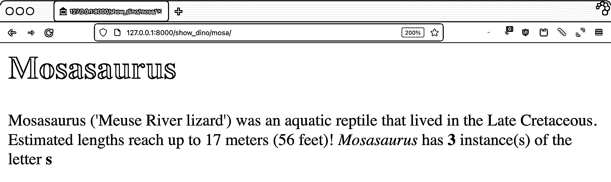](https://files.realpython.com/media/mosa.e88d8092482d.png)

装饰器是一个快捷的方式，确保你的过滤器只需要处理字符串。`needs_autoescape`参数及其对应的`autoescape`参数让您可以细粒度地控制过滤器做什么和不做什么自动转义。

### 日期过滤器

日期和时区可能是很难处理的事情。在网站上处理这些问题还有一个额外的难题:谁的时区？服务器的？用户的？还有别的吗？

Django 有[内置工具](https://docs.djangoproject.com/en/3.2/topics/i18n/timezones/)来帮助处理这个问题。Django 解决方案的一部分是两个关键设置:

1.  `USE_TZ`
2.  `TIME_ZONE`

当`USE_TZ`为`True`时，Django 根据您在`TIME_ZONE`中设置的时区进行所有日期工作。默认设置为 **UTC** 。

很容易忘记模板渲染发生在服务器端。每个访问者都有自己的页面，所以很自然地认为浏览器是负责任的。然而，由于渲染确实发生在服务器上，所以服务器的时区就是所使用的时区——除非 Django 的设置另有规定。服务器的时区和 Django 的设置都不必与用户的时区相对应。

这使得过滤器和日期变得复杂。为此，过滤器注册支持一个名为`expects_localtime`的参数。当`expects_localtime`为`True`时，Django 将`datetime`对象转换为配置的时区。要了解这是如何工作的，将下面的代码添加到`dinotags.py`中:

```py
57# dinosoar/dinofacts/templatetags/dinotags.py
58
59@register.filter(expects_localtime=True)
60def bold_time(when):
61    return mark_safe(f"<b>{when}</b>")
```

此筛选器返回 datetime 对象中传递的粗体版本。没有过滤器也有更好的方法，但那不会显示时区效果。在上面的代码中将`expects_localtime`设置为`True`后，Django 将呈现一个日期时间对象，该对象被移动到由`TIME_ZONE`设置指定的时区中。为了玩这个游戏，创建`dinosoar/templates/ptero.html`:

```py
 1<!-- dinosoar/templates/ptero.html -->
 2
 3
 4
 5
 6
 7
 8<h1>Pterodactyl</h1>
 9
10<p>
11  Pterodactyl ('winged finger') is the common name for Pterodactylus,
12  the first of the genus pterosaur to be identified as a flying
13  reptile. This species is thought to have gone extinct 150 million
14  years ago, which is a long time before now ({{now|bold_time}}).
15
16</p>
17
18
```

访问页面`http://127.0.0.1:8000/show_dino/ptero/`查看过滤器的运行情况:

[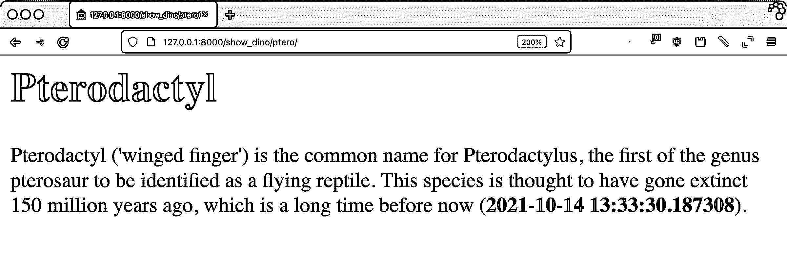](https://files.realpython.com/media/ptero.0e566652a509.png)

要查看差异，编辑`dinosoar/dinosoar/settings.py`并更改`USE_TZ`或`TIME_ZONE`的值，然后重新加载页面。根据您的选择，时间甚至可能是日期都会改变。

自定义过滤器可以让您更好地控制 HTML 输出。它们使您能够通过可重用的组件来更改数据的外观。然而，由于过滤器是以数据为中心的，它们是有限的。要完全控制一个块，您需要自定义标记。

[*Remove ads*](/account/join/)

## 编写 Django 模板定制标签

滤镜对单个值进行操作，修改它们的渲染方式。标签比这灵活得多，允许您插入或修改内容块以及操纵数据上下文。

与过滤器一样，您可以通过以下方式使用标签:

*   **在应用程序的`templatetags/`目录中的模块中声明**它们
*   **使用一个`Library`实例注册**它们
*   **将**实现为函数

此外，对于更复杂的标签，可以使用呈现类来代替函数。这是实现呈现块的标签所必需的。

### 使用简单标签

为了让标记编写更加简单，Django 使用了`@simple_tag`装饰器。在结构上，这类似于一个过滤器:你注册一个函数作为标签，Django 呈现它的返回值。与过滤器不同，标签不与值相关联。他们只能靠自己了。通过编辑`dinosoar/dinofacts/templatetags/dinotags.py`文件，您将从最简单的简单标记开始:

```py
57# dinosoar/dinofacts/templatetags/dinotags.py
58
59@register.simple_tag
60def mute(*args):
61    return ""
```

Django 的``标签是一个块，需要大量的输入。上面的标签是同一想法的一个更基本的版本:任何作为参数传入标签的内容都会被忽略，Django 将标签呈现为一个空字符串。创建`dinosoar/templates/rex.html`来测试您的`mute`标签:

```py
 1<!-- dinosoar/templates/rex.html -->
 2
 3
 4
 5
 6
 7
 8<h1>Tyrannosaurus  Rex</h1>
 9
10<p>
11  Tyrannosaurus rex ('lizard-tyrant king'), or T-Rex for short, is the
12  largest of a genus of theropods.
13
14  It had very  big teeth.
15</p>
16
17
```

访问页面`http://127.0.0.1:8000/show_dino/rex/`查看过滤器的运行情况:

[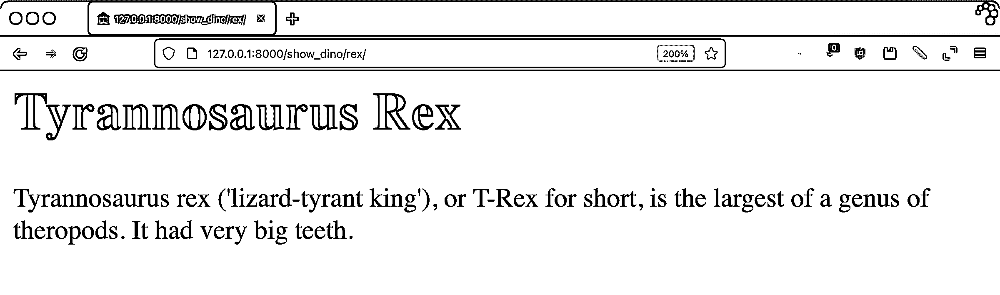](https://files.realpython.com/media/rex.eb80d0e6e91f.png)

结果没什么看头，这才是重点。标签内的所有内容都被删除了。

### 逸出内容

标签和过滤器一样，必须考虑它们生成的内容对 HTML 是否安全。用`@simple_tag`创建的标签会自动转义，但是如果包含 HTML，仍然需要将它们的内容标记为安全。

考虑下面的标记，它接受一个列表并呈现一个 HTML 项目符号列表。打开`dinotags.py`并添加以下功能:

```py
71# dinosoar/dinofacts/templatetags/dinotags.py
72
73from django.utils.html import escape, mark_safe
74
75@register.simple_tag
76def make_ul(iterable):
77    content = ["<ul>"]
78    for item in iterable:
79        content.append(f"<li>{escape(item)}</li>")
80
81    content.append("</ul>")
82    content = "".join(content)
83    return mark_safe(content)
```

这个函数接受一个 iterable——比如一个 list——并将它的每一项包装在一个 HTML `<li>`块中。注意第 79 行中`escape()`的使用。你不想相信传入标签的内容。`content`变量是一个列表，以`<ul>`标签开始，附加每一项，然后以相应的结束`</ul>`标签结束。所有的东西都被连接成一个字符串，这个字符串被标记为安全。

通过创建`dinosoar/templates/bronto.html`在模板中使用`make_ul`:

```py
 1<!-- dinosoar/templates/bronto.html -->
 2
 3
 4
 5
 6
 7
 8<h1>Brontosaurus</h1>
 9
10<p>
11  Brontosaurus (thunder lizard) is a long necked quadruped whose existence
12  was debated for a long time, with original finds being found to be
13  composed of different animals. In 2015 the name was resurrected after
14  an extensive study showed that there was a distinction between it and
15  its cousin the Apatosaurus.
16
17</p>
18
19<h2>Other Dinosaurs</h2>
20
21
22
23
```

访问`http://127.0.0.1:8000/show_dino/bronto/`获取结果:

[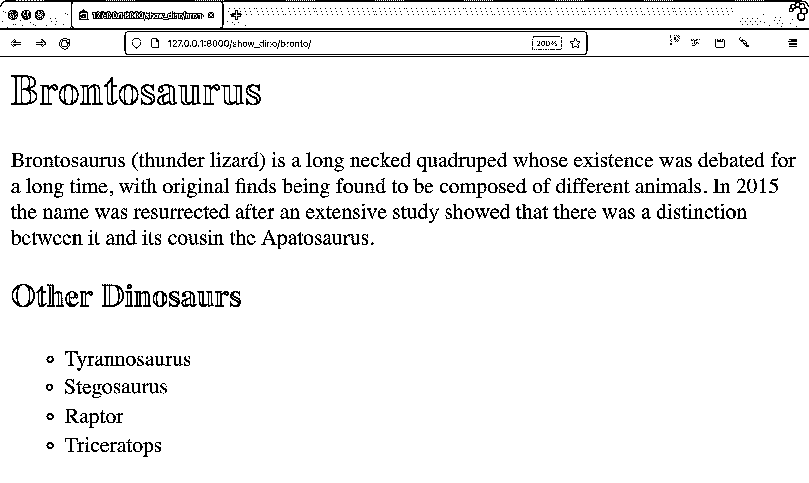](https://files.realpython.com/media/bronto_update.7889f6ebe010.png)

在`dinosoar/dinofacts/views.py`中摆弄`show_dino()`视图中的`dinosaurs`值，看看转义是如何工作的。例如，给`"Tyrannosaurus"`添加粗体标签，使其成为`"<b>Tyrannosaurus</b>"`，您将看到显示的标签，而不是真正的粗体。

[*Remove ads*](/account/join/)

### 使用上下文

当您的视图呈现模板时，您可以通过一个名为 **`Context`** 的字典将数据传递给模板引擎。页面中呈现的所有值都来自于`Context`对象，您可以从标签中获取和设置它们。在`dinotags.py`中创建一个新标签:

```py
87# dinosoar/dinofacts/templatetags/dinotags.py
88
89@register.simple_tag(takes_context=True)
90def dino_list(context, title):
91    output = [f"<h2>{title}</h2><ul>"]
92    for dino in context["dinosaurs"]:
93        output.append(f"<li>{escape(dino)}</li>")
94
95    output.append("</ul>")
96    output = "".join(output)
97
98    context["weight"] = "20 tons"
99    return mark_safe(output)
```

这段代码与`make_ul`相似，但有一些关键的变化:

*   **第 89 行**将`takes_context`参数添加到标签注册调用中。将这个设置为`True`告诉 Django 向包含`Context`对象的标签函数调用添加一个参数。
*   **第 90 行**声明了标签的功能。请注意，`context`参数在最前面。标签可以接受可变数量的参数，所以`context`必须排在前面。
*   **第 92 行**像字典一样访问`context`参数，获得`dinosaurs`的值，这与许多其他示例中使用的恐龙列表相同。
*   **第 98 行**使用键`"weight"`将字符串`"20 tons"`写入上下文。

创建一个名为`dinosoar/templates/apato.html`的新文件来测试这个标签:

```py
 1<!-- dinosoar/templates/apato.html -->
 2
 3
 4
 5
 6
 7
 8<h1>Apatosaurus</h1>
 9
10<p>
11  Apatosaurus (deceptive lizard) is a long necked quadruped that when
12  originally discovered was confused with parts of what is now called
13  a Brontosaurus.  Apatosaurus weighed on average {{weight}}.
14
15</p>
16
17
18
19<p>
20  Let's try this again: Apatosaurus weighed on average {{weight}}.
21</p>
22
23
```

注意第 13 行和第 20 行中使用的值`weight`。第一次使用在``标签之前，第二次使用在之后。由于`weight`的值是作为标签的副作用添加的，所以第一个实例应该是未定义的，因此是空白的。

上下文改变的范围严格地在渲染引擎内。修改上下文字典不会影响视图中的任何原始值。请前往`http://127.0.0.1:8000/show_dino/apato/`试用该模板:

[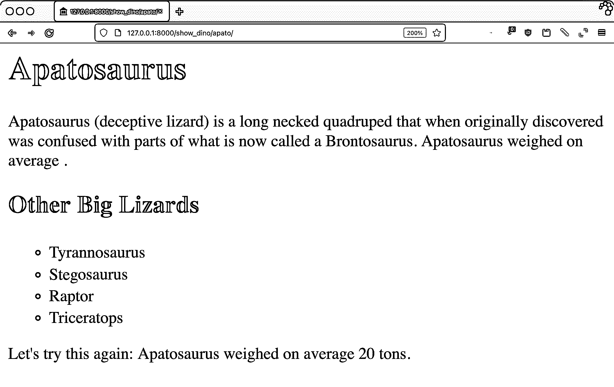](https://files.realpython.com/media/apat_update.38d68f5a446a.png)

正如承诺的那样，这句话*虚龙平均体重*相当突然地结束了。在模板引擎渲染标签之前，`weight`的值不会被赋值。在标签中使用上下文是一个强大的工具，可以在标签之间进行通信，或者保存多次运行的标签的状态。

### 编写包含标签

模板引擎呈现标签函数返回的任何内容。正如您在前面的示例中所探索的，您经常在标记中编写 HTML 代码片段。在字符串中编写 HTML 可能很麻烦，因此包含标记为您提供了另一种实现方式:您的标记本身可以使用模板。要了解这是如何实现的，首先创建子模板`dinosoar/templates/sublist.html`:

```py
 1<!-- dinosoar/templates/sublist.html -->
 2
 3<ul>
 4  
 5    <li>{{item}}</li>
 6  
 7</ul>
```

您的标签将使用此模板。现在您可以将下面的标签函数添加到`dinotags.py`:

```py
103# dinosoar/dinofacts/templatetags/dinotags.py
104
105@register.inclusion_tag("sublist.html")
106def include_list(iterator):
107    return {"iterator": iterator}
```

`sublist.html`模板和这个新标签的组合实现了和`make_ul`相同的功能，但是代码更少。`@inclusion_tag`装饰器指定用这个标签呈现哪个模板，标签函数返回一个字典作为模板中的上下文。

要查看结果，创建一个名为`dinosoar/templates/brachio.html`的测试页面:

```py
 1<!-- dinosoar/templates/brachio.html -->
 2
 3
 4
 5
 6
 7
 8<h1>Brachiosaurus</h1>
 9
10<p>
11  Brachiosaurus (arm lizard) is yet another long-necked quadruped.
12
13</p>
14
15<h2> Using include_list </h2>
16
17
18
```

转到常用视图查看页面`http://127.0.0.1:8000/show_dino/brachio/`:

[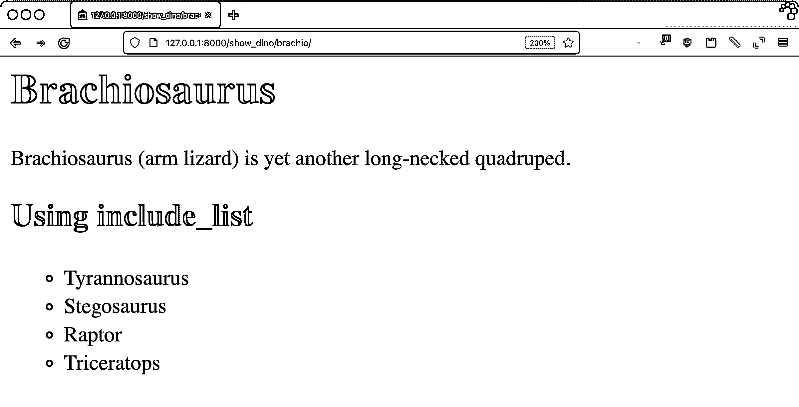](https://files.realpython.com/media/brach_update.4570c5e595d9.png)

如果你正在编写一个使用大量 HTML 的标签，使用`@inclusion_tag`是一个更好的方法来保持 HTML 与代码的分离。

[*Remove ads*](/account/join/)

## 创建高级定制标签

简单标签是为渲染引擎编写标签以替换内联标签的一种快捷方式。你不能用一个简单的标签做的事情是建立封闭的区域。考虑一下``和``是如何配对在一起的，去掉它们之间的所有东西。在本节中，您将探索如何构建高级 Django 定制标记。

### 解析内容

要构建成对的 block 标签，您需要实现一个扩展`django.template.Node`的类。这个类负责呈现标签。Django 提供了一个实用程序来解析成对的 block 标签之间的内容，然后传递给你的`Node`类进行渲染。

为了演示成对的块标签，您将实现一个 [Markdown](https://en.wikipedia.org/wiki/Markdown) 呈现标签。一个名为`mistune`的库已经为此做了大量工作。使用`pip`安装`mistune`:

```py
 1$ python -m pip install mistune==0.8.4
```

在写这篇教程的时候，`mistune`正在经历一次大修。2.0 版本处于测试阶段，与这里展示的例子有很大的不同。确保安装版本 0.8.4，或者准备调整对库的调用。

将以下代码添加到`dinosoar/dinofacts/templatetags/dinotags.py`:

```py
109# dinosoar/dinofacts/templatetags/dinotags.py
110
111import mistune
112
113@register.tag(name="markdown")
114def do_markdown(parser, token):
115    nodelist = parser.parse(("endmarkdown",))
116    parser.delete_first_token()
117    return MarkdownNode(nodelist)
118
119class MarkdownNode(template.Node):
120    def __init__(self, nodelist):
121        self.nodelist = nodelist
122
123    def render(self, context):
124        content = self.nodelist.render(context)
125        result = mistune.markdown(str(content))
126        return result
```

要构建块标记，您需要一个函数和一个类。它们是这样工作的:

*   **第 113 行**将`do_markdown()`功能注册为标签。注意，它使用了`name`参数来命名标签，并且使用了`.tag()`装饰器，*而不是* `.simple_tag()`。
*   第 114 行声明了标签。参数不同于简单的标记，它带有一个解析器和一个令牌。解析器是对模板引擎解析模板的解析器的引用。在这种情况下，您不需要使用`token`参数，稍后您将探索它。
*   **第 115 行**使用`parser`对象继续解析模板，直到它看到结束标签，在本例中为``。
*   **第 116 行**调用`.delete_first_token()`删除开始标签。传递给`Node`类的只是开始和结束标记之间的内容。
*   **第 117 行**实例化呈现模板的`Node`类，模板引擎从解析后的标记块传入标记。
*   **第 119 到 121 行**声明并初始化`Node`类。
*   **第 123 到 126 行**呈现内容。对于这个标签，需要使用`mistune`将标签块从 Markdown 转换成 HTML。
*   **行 124** 调用`.render()`块的内容。这确保了任何嵌入的模板内容得到处理，并允许您在嵌入的 Markdown 中使用值和过滤器。
*   **第 125 行**将呈现的内容转换成字符串，然后使用`mistune`将其转换成 HTML。
*   **第 126 行**返回要插入到渲染页面中的结果。请注意，结果是*而不是*自动转义。Django 希望你知道如何保护你的用户免受 HTML 攻击，如果你正在写一个高级标签的话。

现在，您将使用一些降价内容来测试这个新标签。创建`dinosoar/templates/steg.html`:

```py
 1<!-- dinosoar/templates/steg.html -->
 2
 3
 4
 5
 6
 7
 8<h1>Stegosaurus</h1>
 9
10<p>
11
12**Stegosaurus** ('roof-lizard') is a four-legged plant eater from the
13*Late Jurassic*. It had:
14
15* Bony back plates
16* Large hindquarters
17* A tail tipped with spikes
18
19</p>
20
21
```

将`http://127.0.0.1:8000/show_dino/steg/`加载到您的浏览器中查看成品:

[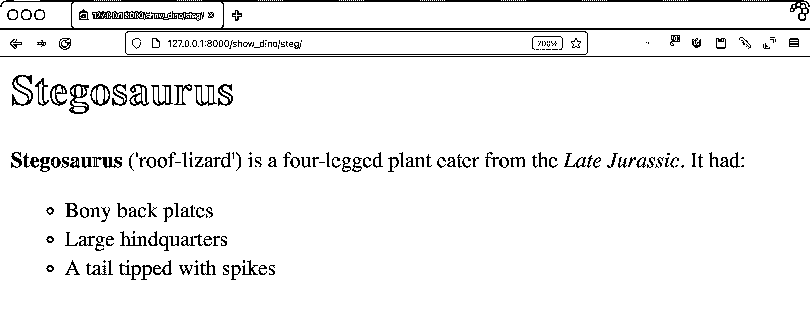](https://files.realpython.com/media/steg_update.6fba18cd46a9.png)

模板引擎将块标签对中的降价呈现为 HTML。使用 Markdown 时要记住的一点是缩进是有意义的。如果标签及其内容没有左对齐，`mistune`库就不能正确地转换它。这类似于在 HTML 中使用一个`<pre>`标签。突然间，间距变得很重要。

### 渲染内容

是时候深入研究块标签了。要查看解析器如何处理标签的内容，将以下内容添加到`dinotags.py`:

```py
130# dinosoar/dinofacts/templatetags/dinotags.py
131
132@register.tag()
133def shownodes(parser, token):
134    nodelist = parser.parse(("endshownodes",))
135    parser.delete_first_token()
136    return ShowNodesNode(token, nodelist)
137
138class ShowNodesNode(template.Node):
139    def __init__(self, token, nodelist):
140        self.token = token
141        self.nodelist = nodelist
142
143    def render(self, context):
144        result = [
145            "<ul><li>Token info:</li><ul>",
146        ]
147
148        for part in self.token.split_contents():
149            content = escape(str(part))
150            result.append(f"<li>{content}</li>")
151
152        result.append("</ul><li>Block contents:</li><ul>")
153        for node in self.nodelist:
154            content = escape(str(node))
155            result.append(f"<li>{content}</li>")
156
157        result.append("</ul>")
158        return "".join(result)
```

`shownodes()`的内容与`do_markdown()`颇为相似。唯一的不同是，这一次，`Node`类将把`token`和解析的内容作为参数。`ShowNodesNode`的`.render()`方法执行以下操作:

*   第 144 到 146 行创建一个包含结果的列表。列表以一个 HTML 项目符号列表标签和一个标题开始。
*   **第 148 到 150 行**通过调用`token.split_contents()`遍历令牌的内容。这个标记包含来自开始标记的信息，包括它的参数。令牌的各个部分作为项目符号子列表添加到结果中。
*   第 153 行到第 155 行做了一些类似的事情，但是它们不是对令牌进行操作，而是对块标签的内容进行操作。这个带项目符号的子列表中的每一项都将是从标记块中解析出来的一个标记。

要查看标签解析是如何工作的，创建`dinosoar/templates/tri.html`并如下使用``:

```py
 1<!-- dinosoar/templates/tri.html -->
 2
 3
 4
 5
 6
 7
 8<h1>Triceratops</h1>
 9
10<p>
11  Triceratops (three-horned face) is a plant eating quadruped from the
12  Late Cretaceous period.
13
14</p>
15
16
17It has a large bony frill around its neck. A fully grown adult weighed 
18{{ weight }}.  put more info here 
19
20
21
```

您的``标签包含一些文本、一个`Context`值和一个``标签。通过访问`http://127.0.0.1:8000/show_dino/tri/`来看看您的调试标签做了什么:

[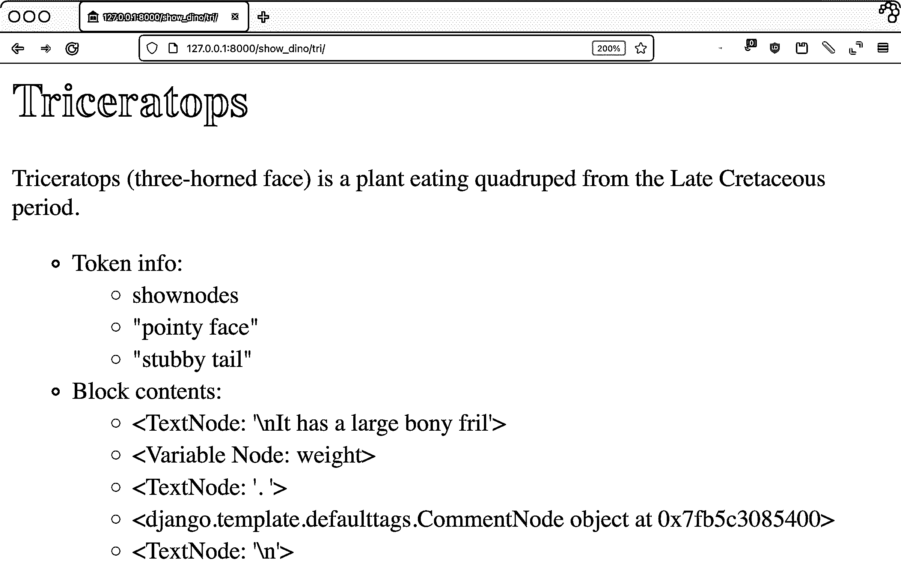](https://files.realpython.com/media/tri.8e5c01e80c30.png)

这个页面向您展示了当您编写块级 Django 自定义标记时会发生什么。开始标签有两个参数，`"pointy face"`和`"stubby tail"`，可以通过`token.split_contents()`访问。解析器将块内容分成五部分:

1.  句子开头部分的宾语
2.  一个`VariableNode`对象，表示通常会呈现的值`weight`
3.  另一个`TextNode`对象，结束第一句话
4.  `CommentNode`一个孩子
5.  包含最后一个空行的`TextNode`对象

通常在 block 标签中，你可以对任何子内容调用`.render()`,这将解析`weight`,并在这种情况下删除注释，但是你不必这样做。你的标签块内的任何东西都在你的控制之下。

[*Remove ads*](/account/join/)

## 结论

Django 的结构通过使用视图和模板将业务逻辑与表示代码分离开来。模板语言是有意限制的，以帮助加强这种分离。

Django 的最初开发者试图将 HTML 设计人员的工作从 Python 程序员中分离出来。然而，这并不意味着你被内置的机制所束缚。Django 定制的模板标签和过滤器给了你工具箱中一件有价值的武器。

**在本教程中，您学习了:**

*   自定义模板标签和**过滤器**住在哪里
*   如何**编写**一个自定义过滤器
*   当**自动转义**会修改你的结果，如何处理
*   如何用**`@simple_tag`****`@inclusion_tag`**装饰器编写简单的标签
*   关于**高级定制标签**和解析**块标签**的内容

有关 Django 的更多信息，请访问 Django 项目的主页。有关标签和过滤器的更多信息，请查阅 Django 文档，尤其是关于[内置模板标签和过滤器](https://docs.djangoproject.com/en/3.2/ref/templates/builtins/)以及[定制模板标签和过滤器](https://docs.djangoproject.com/en/3.2/howto/custom-template-tags)的章节。

在 [Django for Web Development 学习路径](https://realpython.com/learning-paths/django-web-development/)上还有很多关于 Django 的内容可以学习。挖进去，吃下去，咬一大口，然后变成一只姜龙。********