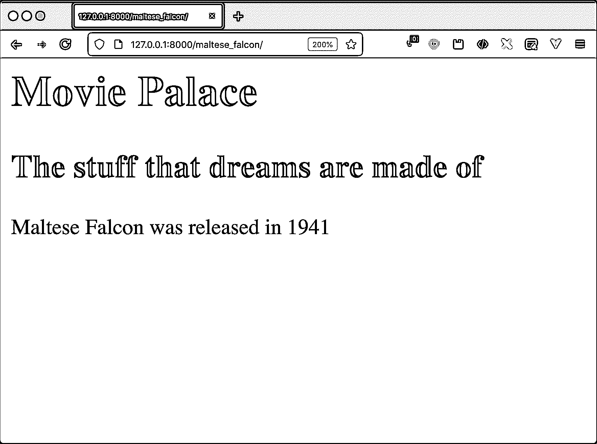
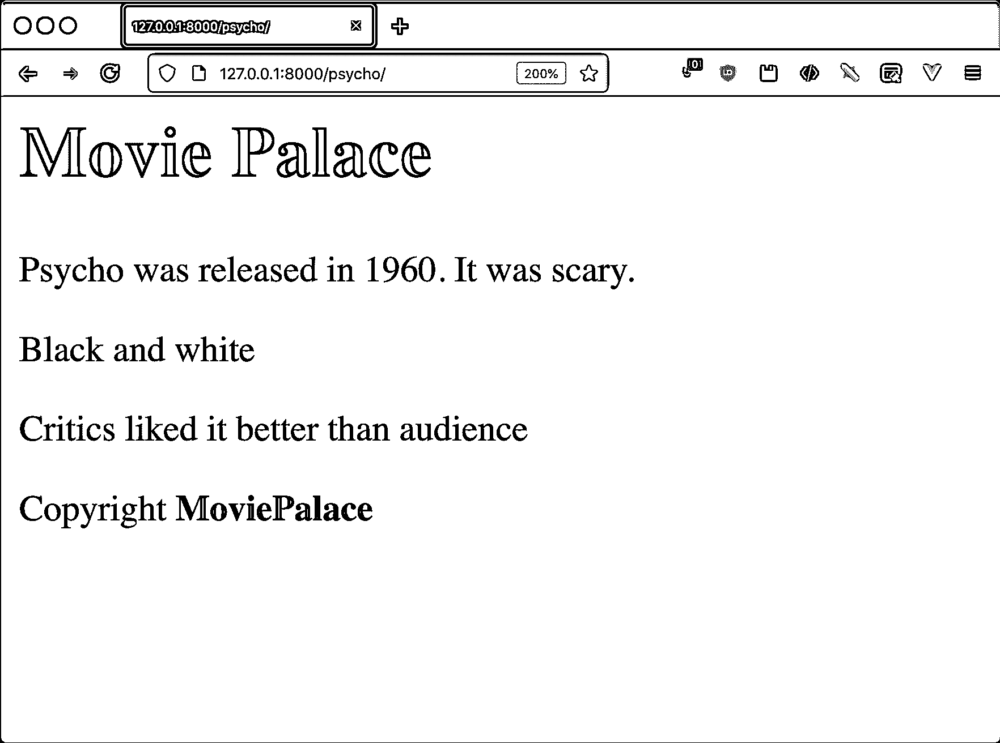
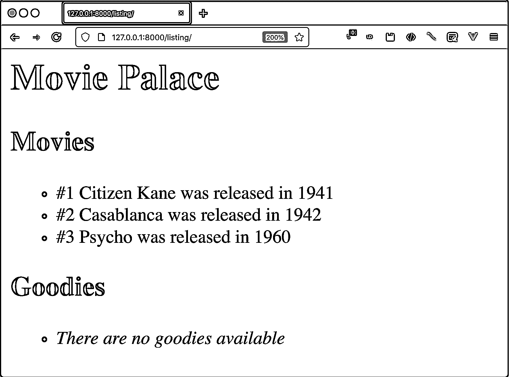
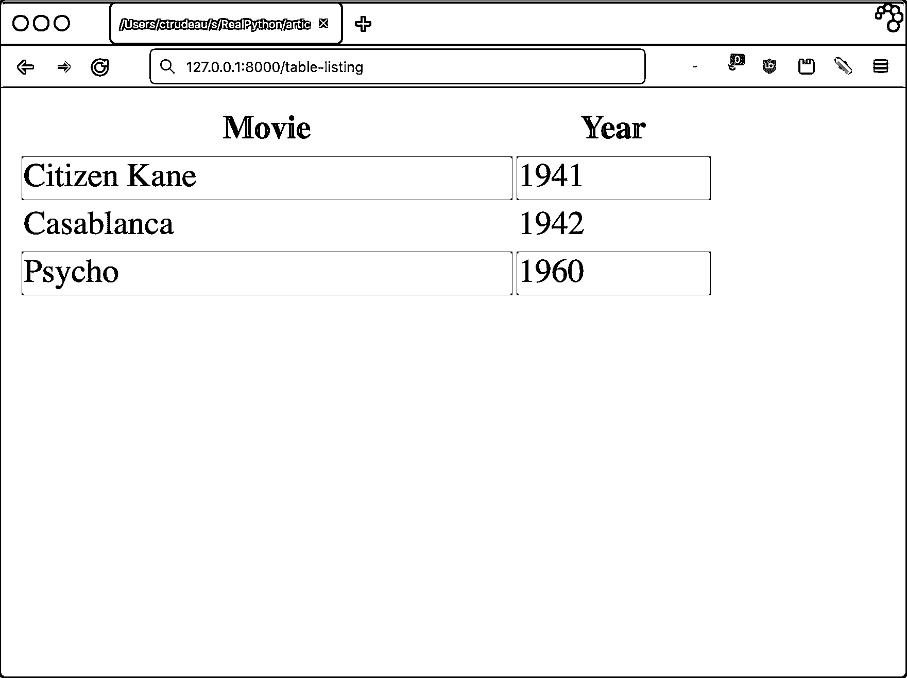
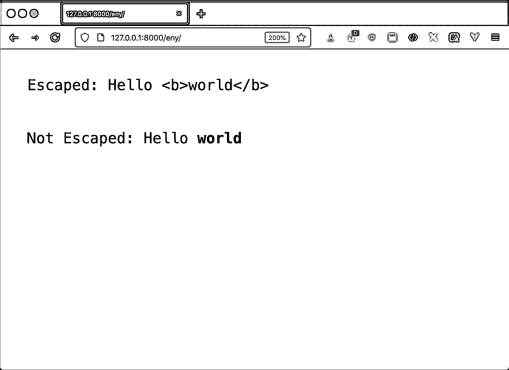

# Django 模板:内置标签和过滤器

> 原文：<https://realpython.com/django-templates-tags-filters/>

Django 是用 Python 创建 web 应用程序的强大框架。它的特性包括[数据库模型](https://docs.djangoproject.com/en/3.2/topics/db/models/)、[路由 URL](https://docs.djangoproject.com/en/3.2/topics/http/urls/)、[认证](https://realpython.com/django-view-authorization/)、[用户管理](https://realpython.com/django-user-management/)、[管理工具](https://realpython.com/customize-django-admin-python/)，以及一个模板语言。您可以根据传递给模板语言的数据编写可重用的 HTML。Django 模板使用标签和过滤器来定义一种类似于 Python 的迷你语言——但不是 Python。

您将通过用于构建可重用 HTML 的标签和过滤器来了解 Django 模板。

**在本教程中，您将学习如何:**

*   编写、编译和呈现一个 **Django 模板**
*   使用视图中的 **`render()`快捷键**快速使用模板
*   对模板中的条件和循环使用**模板标签**
*   通过继承和包含创建**可重用模板**
*   通过**模板过滤器**修改数据的显示

**免费奖励:** [点击此处获取免费的 Django 学习资源指南(PDF)](#) ，该指南向您展示了构建 Python + Django web 应用程序时要避免的技巧和窍门以及常见的陷阱。

## 创建 Django 项目

为了试验 Django 模板，您需要一个项目，这样您就可以摆弄代码了。你将建立**movie place**:世界上最小、最简单的电影网站。关于开始一个新项目的更详细的例子，你可以阅读[Django 入门第一部分:建立一个投资组合应用](https://realpython.com/get-started-with-django-1/)。

Django 不是标准 Python 库的一部分，所以您首先需要安装它。在处理第三方库时，应该使用虚拟环境。对于虚拟环境的复习，你可以阅读 [Python 虚拟环境:初级读本](https://realpython.com/python-virtual-environments-a-primer/)。

有了虚拟环境后，运行以下命令开始运行:

```py
 1$ python -m pip install django==3.2.5
 2$ django-admin startproject moviepalace
 3$ cd moviepalace
 4$ python manage.py startapp moviefacts
```

第 1 行使用 [`pip`](https://realpython.com/what-is-pip/) 将 Django 安装到您的虚拟环境中。在第 2 行，`django-admin`命令创建了一个名为`moviepalace`的新 Django 项目。Django 项目由应用程序组成，你的代码就在其中。第四个命令创建一个名为`moviefacts`的应用程序。

你差不多可以走了。最后一步是告诉 Django 你新创建的`moviefacts`应用。您可以通过编辑`moviepalace/settings.py`文件并将`"moviefacts"`添加到`INSTALLED_APPS`列表中来实现这一点:

```py
33INSTALLED_APPS = [
34    "django.contrib.admin",
35    "django.contrib.auth",
36    "django.contrib.contenttypes",
37    "django.contrib.sessions",
38    "django.contrib.messages",
39    "django.contrib.staticfiles",
40    "moviefacts", 41]
```

随着`moviefacts`注册为一个应用程序，你现在可以编写一个包含模板的视图。

[*Remove ads*](/account/join/)

## 准备使用 Django 模板

Django 是由一家报纸创建的，旨在帮助快速构建网络应用程序。该框架的目标之一是将业务逻辑的关注点从表示逻辑中分离出来。

网页设计师，而不是 Python 程序员，经常在报社做 HTML 开发。正因为如此，开发人员决定不允许在模板语言中执行 Python。这个决定简化了设计者需要知道的东西，并出于安全原因将他们的代码沙箱化。最终的结果是一种独立的迷你语言。这种方法与 [PHP 方法](https://en.wikipedia.org/wiki/PHP#Syntax)形成对比，后者的代码直接嵌入在 HTML 中。

### 编译和呈现 Django 模板

Django 模板允许您在呈现上下文中动态地改变输出内容。你可以把模板想象成一个[格式的信件](https://en.wikipedia.org/wiki/Form_letter)，信件的内容包括可以插入信息的地方。您可以使用不同的数据多次运行渲染过程，每次都会得到不同的结果。

Django 提供了 **`Template`** 和 **`Context`** 类来表示正在呈现的字符串模板和生成过程中使用的数据。`Context`类是 [`dict`](https://realpython.com/python-dicts/) 的包装器，提供键值对来填充生成的内容。呈现模板的结果可以是任何文本，但通常是 HTML。Django *毕竟是一个 web 框架。*

是时候构建你的第一个模板了。要看到一个实际的例子，你首先需要一个视图。将以下代码添加到`moviefacts/views.py`:

```py
 1# moviefacts/views.py
 2from django.http import HttpResponse
 3from django.template import Context, Template
 4
 5def citizen_kane(request):
 6    content = """{{movie}} was released in {{year}}"""
 7    template = Template(content)
 8    context = Context({"movie": "Citizen Kane", "year": 1941})
 9
10    result = template.render(context)
11    return HttpResponse(result)
```

在这个视图中，您可以看到组成 Django 模板语言的一些主要概念:

*   **第 6 行**包含对`movie`和`year`的引用。这类似于蟒蛇[的 f 弦](https://realpython.com/python-f-strings/)。双括号，或**小胡子括号**，表示 Django 在呈现模板时替换的项目。
*   第 7 行通过传入指定模板的字符串来实例化一个`Template`对象。
*   **第 8 行**通过用字典填充来创建一个`Context`对象。当 Django 呈现模板时,`Context`对象包含模板可用的所有数据。该模板包含两个要替换的项目:用`"Citizen Kane"`替换`{{movie}}`，用`1941`替换`{{year}}`。
*   **第 10 行**调用生成结果的`.render()`方法。
*   **第 11 行**返回包装在`HttpResponse`对象中的渲染内容。

为了测试这一点，您需要使这个视图在浏览器中可用，因此您需要添加一条路线。修改`moviepalace/urls.py`如下:

```py
# moviepalace/urls.py
from django.urls import path
from moviefacts import views

urlpatterns = [
    path("citizen_kane/", views.citizen_kane),
]
```

确保您使用的是安装 Django 的虚拟环境，然后运行 Django 开发服务器来查看结果:

```py
$ python manage.py runserver
```

通过访问`http://127.0.0.1:8000/citizen_kane/`运行您的视图。

`HttpResponse`对象将这些内容作为 HTML 返回，但是由于字符串不包含任何标签，您的浏览器将把它视为`<body>`标签内的文本。它返回格式不正确的 HTML，但是现在已经足够好了。如果一切顺利，您应该看到您的模板呈现了来自您的上下文的数据:

```py
Citizen Kane was released in 1941
```

你的模板已经编译好了，Django 用`Citizen Kane`和`1941`替换了`movie`和`year`变量。

### 配置 Django 加载文件模板

在 web 应用程序中，您最有可能使用模板来输出 HTML——大量的 HTML。Django 模板语言就是为了简化这个过程而构建的。与前面的例子不同，您通常不会在视图中使用模板字符串。相反，您可以从其他文件中加载模板。

要从磁盘加载模板，首先需要告诉 Django 在哪里可以找到它。在`moviepalace/settings.py`内，修改`TEMPLATES`中的`"DIRS"`值:

```py
 1TEMPLATES = [
 2    {
 3        "BACKEND": "django.template.backends.django.DjangoTemplates",
 4        "DIRS": [
 5            BASE_DIR / "templates", 6        ],
 7        "APP_DIRS": True,
 8        "OPTIONS": {
 9            "context_processors": [
10                "django.template.context_processors.debug",
11                "django.template.context_processors.request",
12                "django.contrib.auth.context_processors.auth",
13                "django.contrib.messages.context_processors.messages",
14            ],
15        },
```

在`django-admin`命令创建的默认`settings.py`文件中，`DIRS`列表为空。Django 现在将在名为`moviepalace/templates`的目录中寻找模板。注意，Django 为自己的配置使用了双文件夹结构。比如`moviepalace/moviepalace`里有`settings.py`。模板的目录应该在项目根目录中，而不是在配置目录中。

当第 7 行的`APP_DIRS`为`True`时，Django 也会在 app 子目录中寻找模板。Django 希望应用程序模板位于应用程序文件夹下名为`templates`的目录中。


在 Django 3.1 中，`settings.py`文件中的`BASE_DIR`参数从使用`os.path`更改为`pathlib`:

```py
TEMPLATES = [
    {
        "BACKEND": "django.template.backends.django.DjangoTemplates",
 "DIRS": [os.path.join(BASE_DIR, "templates"), ],        "APP_DIRS": True,
        "OPTIONS": {
            "context_processors": [
                "django.template.context_processors.debug",
                "django.template.context_processors.request",
                "django.contrib.auth.context_processors.auth",
                "django.contrib.messages.context_processors.messages",
            ],
        },
    },
]
```

如果您使用的是 Django 3.0 或更早版本，`DIRS`值将需要使用`os.path`来代替。

你如何决定在哪里存储你的模板？如果你的应用程序可以在其他项目中重用，并且有特定的模板，那么就把模板和应用程序放在一起。否则，请将模板一起保存在项目模板目录中。有关如何构建 Django 项目的更多信息，请参见课程[Django 入门](https://realpython.com/courses/django-portfolio-project/)中关于 Django 双文件夹结构的课程。

对`moviepalace/settings.py`文件进行更改后，不要忘记创建`templates`目录:

```py
$ pwd
/home/realpython/moviepalace
$ mkdir templates
```

配置完成并创建了目录后，现在就可以从文件中加载模板了。

[*Remove ads*](/account/join/)

### 从文件中加载 Django 模板

让我们使用一个文件来重建公民凯恩体验。创建`templates/simple.txt`并添加在`citizen_kane()`视图中使用的模板字符串:

```py
{{movie}} was released in {{year}}
```

您可以编写代码以字符串的形式加载文件，构建一个`Template`对象，并做与在`citizen_kane()`视图中相同的事情，或者您可以使用`render()`快捷方式，它会为您完成所有这些工作。将以下内容添加到您的`moviefacts/views.py`文件中:

```py
# moviefacts/views.py
⋮
from django.shortcuts import render

def casablanca(request):
    return render(
        request, "simple.txt", {"movie": "Casablanca", "year": 1942}
    )
```

新视图就绪后，不要忘记添加到`moviepalace/urls.py`的路线:

```py
# moviepalace/urls.py
from django.urls import path
from moviefacts import views

urlpatterns = [
    path("citizen_kane/", views.citizen_kane),
 path("casablanca/", views.casablanca), ]
```

访问`http://127.0.0.1:8000/casablanca/`应该会产生与《公民凯恩》相似的结果:

```py
Casablanca was released in 1942
```

`render()`快捷方式是渲染模板的常用方式。只在极少数情况下才直接使用`Template`对象，比如当你想给用户提供模板的能力时。

直接使用`Template`的一个例子是允许用户输入套用信函。套用信函可能包含变量，如信函的收件人。通过允许用户使用 Django 模板，您可以利用内置的变量替换机制来替换接收者的姓名。

### 选择模板语言

Django 支持多种模板引擎。它配有两个:

*   Django 模板语言:最初的 Django 模板语言，也是您在本教程中学习的语言
*   Jinja2 :以前是一个第三方专用的库，现在包含在 Django 中，但不在本教程的讨论范围之内

您可以通过编辑`moviepalace/settings.py`中的`TEMPLATES`值来更改使用的模板引擎:

```py
 1TEMPLATES = [
 2    {
 3        "BACKEND": "django.template.backends.django.DjangoTemplates", 4        "DIRS": [
 5            BASE_DIR / "templates",
 6        ],
 7        "APP_DIRS": True,
 8        "OPTIONS": {
 9            "context_processors": [
10                "django.template.context_processors.debug",
11                "django.template.context_processors.request",
12                "django.contrib.auth.context_processors.auth",
13                "django.contrib.messages.context_processors.messages",
14            ],
15        },
```

第 3 行的`BACKEND`设置是指定渲染引擎的地方。通过将`BACKEND`改为引擎的点路径模块名，您可以选择 Django 模板引擎或 Jinja2 引擎:

*   `django.template.backends.django.DjangoTemplates`
*   `django.template.backends.jinja2.Jinja2`

也可以使用第三方模板引擎。使用它们需要通过`pip`安装库，并将`BACKEND`值改为引擎的点路径名。

本教程的其余部分将只关注原始的 Django 模板后端，为您在 Django 项目中创建 HTML 打下坚实的基础。

[*Remove ads*](/account/join/)

## 了解 Django 模板、标签和过滤器

到目前为止，您已经看到了包含简单变量替换的模板。Django 模板语言比这更深入。您可以访问 Python 中的许多结构和控件，除了在它自己的迷你语言中。

### Django 模板标签和过滤器

Django 模板语言有三种方式来控制呈现的内容:**值**、**标签**和**过滤器**。你放入模板中的所有东西，如果不是这三者之一，就会像你写的那样呈现出来。在本教程中，您将了解模板语言的三个主要部分:

1.  **被解释的数据**，你用双括号注意， **`{{ value }}`**
2.  **标签**，用大括号和百分号标注， **``**
3.  **过滤器**，它修改被解释的数据，你用管道操作符(`|`)来应用，就像在 **`{{ value | filter }}`** 中一样

正如您在上一节中看到的，当 Django 将模板呈现为文本时，它会使用一个名为`Context`的特殊字典。上下文是呈现模板的状态。除了包含要用双括号呈现的解释数据之外，`Context`对象的内容还可以用于做出逻辑决策。

标签就像模板语言的关键字和函数。在 Python 中，关键字和函数提供了控制流和构建代码的工具。同样，Django 的内置标签提供了继承、条件操作、循环、注释和文本管理。例如，``标签在呈现时被替换为样本 [lorem ipsum](https://en.wikipedia.org/wiki/Lorem_ipsum) 文本。

Django 过滤器在双括号内运行，允许您改变显示数据的表示方式。例如，`date`过滤器格式化日期-时间对象，类似于 Python 中的 [`strftime()`](https://docs.python.org/3/library/datetime.html#strftime-and-strptime-behavior) 的工作方式。如果`Context`字典包含一个名为`today`的`datetime`对象，`{{ today | date:"Y"}}`将`date`过滤器应用于`today`，返回年份。

本教程的其余部分将引导您了解常见的标签和过滤器，并举例说明如何使用它们。

### 模板继承和包含

HTML 中有很多样板文件。大多数网站的每个页面都有一个共同的外观。呈现的每个页面经常重复相同的页眉和页脚，包括相同的样式表，并且经常包括相同的用于度量和测量的 JavaScript 文件。手动在每个页面上重复这一过程意味着需要做大量的工作。模板继承和包容的拯救！

有两种方法可以将 Django 模板的各个部分组合在一起。继承的工作方式类似于 Python 中的类继承，模板覆盖了其父类的值。包含将内容从另一个模板注入到该模板中。这类似于 C 编程语言中的`#include`指令。

要查看这些操作，请创建`templates/base.html`:

```py
 1<!-- templates/base.html -->
 2<html>
 3<body>
 4  
 5    <h1>Movie Palace</h1>
 6  
 7
 8  
 9  
10</body>
11</html>
```

这个声明就像是面向对象编程中的一个基类。您可以单独使用它，也可以设置其他模板来继承它。如果这个模板按原样呈现，``标签的内容将按原样显示。在子进程没有覆盖该块的情况下，这提供了一个有用的缺省值。

在`base.html`里，有一个标题写着`<h1>Movie Palace</h1>`，没有内容。当另一个模板继承了这个模板时，奇迹就发生了。在子模板中，可以选择替代任何已定义的块。一种常见的做法是用页面内容填充`content`块，同时将样板 HTML 留在这个基本文件中。创建一个继承自`base.html`的模板，名为`templates/falcon.html`:

```py
 1<!-- templates/falcon.html -->
 2
 3
 4
 5  {{block.super}}
 6  <h2>The stuff that dreams are made of</h2>
 7
 8
 9
10  <p>
11    
12  </p>
13
```

`falcon.html`文件显示了两件事:**继承**和**包含**。您通过使用``标签继承了一个父文件。在这里，`falcon.html`继承了`base.html`。Django 完整地呈现了`base.html`文件，除非子文件`falcon.html`覆盖了一个块。例如，`falcon.html`中的`content`部分覆盖了`base.html`中同名的块。

在`block`部分中，定义了一个特殊变量:`{{block.super}}`。该变量包含父块中的任何内容。在第 5 行，父块引入了`<h1>Movie Palace</h1>`标题，而`falcon.html`将`<h2>`添加到第 6 行的块中。

除了继承，还可以做包容。在第 11 行，``标签插入了`simple.txt`的内容。这允许您重用 HTML 的片段。这里，它重用了最初为`casablanca()`视图定义的模板。

要查看所有这些，您需要一个新的视图来渲染它们。在`moviefacts/views.py`中创建以下内容:

```py
# moviefacts/views.py
⋮
def maltese_falcon(request):
    return render(
        request,
        "falcon.html",
        {"movie": "Maltese Falcon", "year": 1941},
    )
```

这个视图与`casablanca()`几乎相同，除了它渲染`falcon.html`并传入适当的电影数据。用`maltese_falcon`视图的路线更新您的`moviepalace/urls.py`文件，然后访问页面:

[](https://files.realpython.com/media/falcon.fea9eb4df0e1.png)

您覆盖了标题，包含了`simple.txt`，Django 用马耳他之鹰电影数据渲染了它。

在`falcon.html`内部，``标签硬编码了父模板的名称。这是最常见的情况，但是父模板可以在上下文变量中命名。这个技巧允许您在登录状态和公共状态下使用同一个子页面，并根据情况更改父模板。

模板只使用一个层次的继承，但是你并不仅限于此。孙辈可以继承子女，子女又可以继承父母。您可以根据需要使用任意多的图层来组织输出。

[*Remove ads*](/account/join/)

## 探索通用模板标签

您可以利用 Django 3.2.5 包含的超过 25 个内置标签。这些标签就像模板语言的关键字和函数。它们允许你做条件逻辑、循环、继承、文本操作等等。

### 条件代码

在 Python 中，使用`if`、`elif`和`else`关键字有条件地执行代码。在 Django 模板中，您使用标签来完成同样的事情。

要查看这些标签的运行情况，您需要一个包含更多数据的视图。编辑您的`moviefacts/views.py`文件并添加以下函数:

```py
# moviefacts/views.py
⋮
def psycho(request):
    data = {
        "movie": "Psycho",
        "year": 1960,
        "is_scary": True,
        "color": False,
        "tomato_meter": 96,
        "tomato_audience": 95,
    }
    return render(request, "psycho.html", data)
```

为`psycho`到`moviepalace/urls.py`增加一条对应的路线，然后创建`templates/psycho.html`:

```py
 1<!-- templates/psycho.html -->
 2
 3
 4
 5  <p>
 6    {{movie}} was released in {{year}}.  It was not
 7    scary.
 8  </p>
 9
10  <p>
11    
12      Color
13    
14      Black and white 
15    
16  </p>
17
18  <p>
19    
20      Sound was awesome
21    
22  </p>
23
24  <p>
25    
26      Critics liked it better than audience
27    
28      Critics liked it the same as audience
29    
30      The audience liked it better than the critics
31    
32  </p>
33
34  <p>Copyright <b>MoviePalace</b></p>
35
```

``标签的工作方式类似于 Python 的`if`关键字。如果测试的条件是`True`，那么块被渲染。

*   **第 6 行到第 7 行**显示了内联 if-conditional 的用法，用`not`关键字对`is_scary`值求反。
*   **第 11 到 15 行**展示了多行 if-condition 的使用。这个条件块还包含一个``子句。然而，与用 Python 编写`if`语句不同，不要忘记结束的``标记。
*   **第 19 行**检查`THX`变量，Django 找不到。不在上下文中的变量被认为是`False`，所以这个关于声音质量的块不会被渲染。
*   **第 25 行到第 31 行**显示了使用布尔比较运算符的条件。您可以在标记内使用与 Python 中相同的操作符。

如果您运行开发服务器并访问视图，您会注意到条件标签已经起作用了:

[](https://files.realpython.com/media/psycho.4a33e20c1f41.png)

条件标记允许您控制 HTML 块的显示，其功能与 Python 代码中的条件部分相同。摆弄一下`psycho()`视图中的数据，看看它如何改变条件块的输出。

### 循环

有一个用于循环的 Django 模板标签:``。它使用了与 Python 的 [`for`](https://realpython.com/python-for-loop/) 语句相似的语法，并提供了一些内置变量，这些变量给出了关于您在迭代中所处位置的信息。

到目前为止，电影视图中只有非常少的数据，没有任何东西可以循环。要播放循环，您需要给`moviefacts/views.py`添加另一个视图:

```py
# moviefacts/views.py
⋮
def listing(request):
    data = {
        "movies": [
            (
                "Citizen Kane",   # Movie
                1941,             # Year
            ),
            (
                "Casablanca",
                1942,
            ),
            (
                "Psycho",
                1960,
            ),
        ]
    }
    return render(request, "listing.html", data)
```

这个视图有一个名为`movies`的上下文变量，它是一个列表。您将要构建的模板将使用循环标签来遍历这个列表。如下创建`templates/listing.html`:

```py
 1<!-- templates/listing.html -->
 2
 3
 4
 5  <h2> Movies</h2>
 6  <ul>
 7    
 8      <li>
 9        #{{forloop.counter}} {{movie.0}} was released in {{movie.1}}
10      </li>
11    
12  </ul>
13
14  <h2> Goodies </h2>
15  <ul>
16    
17      <li> {{goodie.0}} &mdash; ${{goodie.1}}</li>
18    
19      <li> <i>There are no goodies available</i> </li>
20    
21  </ul>
22
```

第 7 到 11 行包含一个``块，类似于 Python 中的`for`关键字。该块在`movies`上迭代，并在每次循环中分配一个名为`movie`的局部变量。在代码块内部，您编写了利用双括号对来显示`<li>`标签内部内容的 HTML。

第 8 到 10 行在每次迭代中重复一次。该循环使用一个名为`forloop`的特殊对象。这是 Django 在模板上下文中插入的一个局部变量。该对象有几个成员，每个成员都包含有关循环当前迭代的信息:

| 可变的 | 描述 |
| --- | --- |
| `forloop.counter` | 迭代的从 1 开始的索引号 |
| `forloop.counter0` | 迭代的从 0 开始的索引号 |
| `forloop.revcounter` | 循环中剩余的迭代次数(1 索引) |
| `forloop.revcounter0` | 循环中剩余的迭代次数(0 索引) |
| `forloop.first` | 如果这是第一次迭代 |
| `forloop.last` | 如果这是最后一次迭代 |
| `forloop.parentloop` | 包含嵌套循环中父循环的上下文 |

让我们进一步检查循环块内部的代码行:

```py
 7<!-- From inside of templates/listing.html -->
 8<li>
 9  #{{forloop.counter}} {{movie.0}} was released in {{movie.1}}
10</li>
```

`movies`的内容是元组列表。每个元组包含电影的名称和年份。Django 模板标签不允许使用下标。不像在 Python 中那样使用方括号来访问元组或列表中的值，而是使用数字作为对象的属性。`{{movie.0}}`和`{{movie.1}}`的值是`movie`元组的第一个和第二个值。

Django 循环还支持一个名为``的特殊标签。再次打开`listing.html`看这个标签的例子:

```py
13<!-- From inside of templates/listing.html -->
14
15  <li> {{goodie.0}} &mdash; ${{goodie.1}}</li>
16
17  <li> <i>There are no goodies available</i> </li>
18
```

这个标签就像一个`else`子句。如果在``标签中没有需要迭代的内容，Django 就会运行``块。

为了达到同样的效果，``标签比将``块包装在``块中更方便。在这种情况下，上下文中没有定义`confectionaries`。Django 模板语言将缺少的值视为空，因此它呈现块的``部分。

在`moviepalace/urls.py`中添加一条路线，启动 Django 开发服务器，然后访问`http://127.0.0.1:8000/listing/`查看结果:

[](https://files.realpython.com/media/listing.026b001a8d67.png)

还支持一个类似循环的标签:``。该标记接受一系列参数，并在每次调用时依次返回每个参数:

```py

    <tr class="">
    ...
    </tr>

```

当``用完所有参数时，它会循环回到起点。这种方法最常见的用途是向表格中添加条纹，交替每一行的样式值:

[](https://files.realpython.com/media/cycle.27e801092ac1.png)

您可以用一个``标签获得同样的结果，但是这种方法需要更多的代码。

[*Remove ads*](/account/join/)

### 评论

虽然您可以使用`<!-- -->`在 HTML 中编写注释，但是下载到用户浏览器的响应包含这些注释。Django 包含一个``标签，它的内容被完全去掉:

```py
 Nothing to see here!

```

您还可以在``标签中包含一个字符串参数，作为注释。这可能看起来有点奇怪，但是如果您正在注释掉代码，这是很有用的。您使用块来注释掉代码，然后使用注释来提醒自己为什么注释掉代码。

### 特殊字符

默认情况下，Django 模板渲染器会自动转义它所渲染的任何变量。如果一个字符串包含 HTML 特有的字符，比如 HTML 标签中使用的尖括号(`<`、`>`)，这样可以防止 HTML 被破坏。``标签允许你控制这种行为:

```py

    {{ content }}

```

``标签接受一个参数`on`或`off`，分别打开或关闭转义机制。考虑以下模板:

```py
<pre>

    Escaped: {{ my_text }}


    Not Escaped: {{ my_text }}

</pre>
```

如果`my_text`包含`"Hello <b>world</b>"`，呈现的内容将有两个版本的字符串:

[](https://files.realpython.com/media/escape.6d07bc885ed1.png)

`autoescape on`更改 HTML 特殊字符，使其呈现为字符串中的样子。相比之下，使用`autoescape off`，粗体标签被传递给浏览器。

所有使用特殊字符的语言都需要一种直接使用这些特殊字符的方法。如果您想要使用表示标签的字符，您可以将它们放在``标签中:

```py

    Django uses mustaches braces to render variables: {{ is_scary }}.

```

许多 [JavaScript](https://realpython.com/python-vs-javascript/) 框架都有自己的模板语言。变量或标签的双括号格式很常见。如果您需要在 Django 模板中包含 JavaScript 模板，那么将它们包装在``标签中会导致 Django 的模板呈现器忽略它们，让 JavaScript 保留它们。

### 日期和时间

你经常需要在网站上显示日期和时间信息。Django 模板语言中的``标签给出了当前的日期和时间。它采用一个字符串参数来指定要显示的日期时间的格式。出于历史原因，格式字符串基于 PHP 的`date()`函数，而不是 Python 的`strftime`。在[文档](https://docs.djangoproject.com/en/3.2/ref/templates/builtins/#std:templatefilter-date)中提供了可能的格式字符列表。

标签``的一个常见用途是显示当前年份作为版权声明的一部分:

```py
<p>Copyright 2012-</p>
```

上面的例子将呈现从 2012 年到当前年份的版权声明。

[*Remove ads*](/account/join/)

### URLs

Django 的视图和路由机制有一种内置的方式来命名你的 URL。硬编码 URL 是不好的做法。如果有些东西改变了，那么你必须找出你在代码中使用它的所有时间。您可以使用``标签，而不是在视图中解析 URL 并将其作为上下文传递:

```py
<a href="">Home</a>
```

``的参数是任何 [URL 模式名称](https://docs.djangoproject.com/en/3.2/topics/http/urls/#naming-url-patterns)，与 Django 的 [`reverse()`](https://docs.djangoproject.com/en/3.2/ref/urlresolvers/#reverse) 的工作方式相同。它可以选择接受被引用的基础视图的位置或命名参数。

## 探索关键模板过滤器

正如您之前所学的，Django 模板标签是模板语言的关键字和函数。过滤器就像是在 Django 呈现数据之前就地修改数据的小函数。

通过在变量后添加管道(`|`)和过滤器名称，可以将过滤器放在双括号内。这是受到了在 Unix shells 中如何通过管道相互发送命令的启发。

现在，您将看到一些用于字符串、列表、日期和时间的常见过滤器，以及展示如何使用它们的示例。

### 字符串过滤器

过滤器可以对各种数据进行操作。它们中的许多直接对应于具有相同目的的 Python 函数。`upper`过滤器与 Python 中的`str.upper()`方法相同。使用它将变量的内容改为大写。通过修改`templates/listing.html`，将`upper`过滤器添加到`movie.0`变量中来尝试一下:

```py
<!-- templates/listing.html -->



  <h2> Movies</h2>
  <ul>
    <li>
 #{{forloop.counter}} {{movie.0|upper}} was released in {{movie.1}}    </li>
⋮
```

随着上面的变化，列表中的每个电影名称都将出现在 shour-case 中。毫不奇怪，也有一个相应的`lower`过滤器。

`center`滤镜将填充添加到字符串的两边。填充是一个空格字符，因此根据您的字体和包装它的标签，此过滤器的效果可能有限:

```py
<pre>{{value}} becomes *{{ value|center:"16" }}*</pre>
```

如果`value`包含`"Elephant"`，此示例会在每边产生四个空格:

```py
<pre>Elephant becomes *    Elephant    *</pre>
```

如果需要从字符串中删除字符，可以使用`cut`过滤器。`cut`的参数是要删除的子字符串:

```py
<pre>*{{value}}* becomes *{{ value|cut:" " }}*</pre>
```

看看当你使用带有`"Bates Motel"`的`value`的`cut`滤镜时会发生什么:

```py
<pre>*Bates Motel* becomes *BatesMotel*</pre>
```

请注意，`cut`的参数不是您想要剪切的字符列表，而是您想要剪切的序列。如果您尝试用`"ae"`来削减这个值，什么都不会发生。`"Bates Motel"`中没有`"ae"`子串。

[*Remove ads*](/account/join/)

### 列表过滤器

过滤器可以对类似列表的值进行操作。`first`和`last`过滤器分别返回 iterable 中的第一项和最后一项:

```py
{{ goodies|first }}
```

如果`goodies`包含`["popcorn", "peanuts", "cola"]`，那么这个例子产生`"popcorn"`。使用`last`过滤器会导致`"cola"`。

除了使用筛选器来访问列表的各个部分之外，还可以使用筛选器从列表中获取数据。`join`过滤器类似于 Python `str.join()`方法。它返回由列表的各个部分组成的字符串:

```py
{{ goodies|join:", " }}
```

使用冒号(`:`)将参数传递给过滤器。用逗号作为参数连接`goodies`列表将返回包含逗号分隔列表的单个字符串:`"popcorn, peanuts, cola"`。

要查找列表的长度，可以使用`length`过滤器。这在与其他过滤器结合使用时尤其有用。在处理多个项目时,`pluralize`过滤器会在单词末尾添加一个`"s"`。尝试在`<h2>Movies</h2>`标题下的`templates/listing.html`中添加以下一行:

```py
<!-- templates/listing.html -->



  <h2> Movies</h2>
  <p>{{movies|length}} movie{{movies|length|pluralize}} found.</p>
  ⋮
```

Django 用`movies`列表的长度替换第一组双括号。第二组做了一些聪明的事情:**链接过滤器**。`pluralize`过滤器接受一个数字。如果数字是`2`或更大，它返回一个`"s"`。通过使用`length`和`pluralize`，你将把`movies`的长度传递给`pluralize`。

如果加一个`"s"`不是单词的复数形式，你会怎么做？筛选器支持指定结尾后缀的参数:

```py
You have {{num_boxes}} box{{num_boxes|pluralize:"es"}}.
```

在这个例子中，`pluralize`没有追加`"s"`，而是追加`"es"`，返回`"boxes"`。对于具有不同结尾的单词，您可以指定单个和多个结尾:

```py
You have {{num_cherries}} cherr{{num_cherries|pluralize:"y,ies"}}.
```

在上面的示例中，`pluralize`如果结果是单数，则在逗号前添加指定的字符串，如果结果是复数，则在逗号后添加指定的字符串。这样，你就正确地得到了`"cherry"`或`"cherries"`。

### 日期和时间过滤器

日期或时间的表示应该特定于用户的语言环境。在你的代码中，建议你只使用一个 Python [`datetime`](https://realpython.com/python-datetime/) 对象。您应该将此对象的格式设置留给呈现时间。有过滤器可以帮你做到这一点。

`date`过滤器的参数类似于您在本教程前面看到的``标签。像那个标签一样，`date`过滤器的参数指定了日期的表示格式:

```py
<p> {{release_date|date:"Y-m-d"}}</p>
```

这个例子将以年-月-日 [ISO 8601](https://en.wikipedia.org/wiki/ISO_8601) 的格式显示`release_date`的内容。对于《公民凯恩》来说，它的大范围上映时间是 1941 年 9 月 5 日。虽然它被称为`date`过滤器，但它也支持时间，假设它与一个`datetime`对象而不仅仅是一个`date`对象一起工作。

如果你只对时间感兴趣，也有一个过滤器。`time`过滤器使用`date`配置参数的子集，只是那些与时间有关的参数。用法是相似的:

```py
<p> {{showing_at|time:"H:i"}}</p>
```

本示例以 24 小时制显示放映时间。对于一部晚上 9:30 的电影，Django 将其渲染为`"21:30"`。

一种使时间更具可读性的流行格式是显示事件发生后经过的时间。你可以在许多网络邮件客户端看到类似于*你在“3 天前”收到了一封电子邮件*的信息。Django `timesince`滤镜赋予你这种力量:

```py
<p> {{release_date|timesince}}</p>
```

本示例显示了电影上映后经过的时间。默认情况下，该过滤器会计算从现在起经过的时间。或者，您可以向`timesince`添加一个参数来指定比较日期。

有一个与`timesince`相伴的过滤器叫做`timeuntil`。它不是回顾过去，而是展望未来。您可以用它来显示会议或类似事件的倒计时。

`timesince`和`timeuntil`都是根据 Django 渲染模板时的服务器计算时间差。使用`settings.py`中的时区信息进行计算。如果您的服务器不使用 UTC，而您的 Django 配置使用 UTC 默认值，这会产生奇怪的结果。请确保这两个配置匹配，否则您的时差计算将会不正确。

[*Remove ads*](/account/join/)

## 第三方标签和过滤器库

除了内置的 Django 模板标签和过滤器，你还可以[编写自己的](https://docs.djangoproject.com/en/3.2/howto/custom-template-tags/)。您可以找到包含自定义标签和过滤器的有用的第三方库。一个这样的库是 [`django-simple-tags`](https://pypi.org/project/django-simple-tags/) 。不要把这个与 Django 中类似命名的函数 [`simple_tag()`](https://docs.djangoproject.com/en/3.2/howto/custom-template-tags/#simple-tags) 混淆。

要在模板中使用第三方库，您需要遵循三个步骤:

1.  **安装**应用程序库
2.  **在`settings.py`中注册**带有`INSTALLED_APPS`的 app
3.  **加载**模板中的标签

安装 Django 应用程序库和其他任何包没有什么不同。您可以使用`pip`来安装它:

```py
$ python -m pip install django-simple-tags
```

安装好软件包后，更新`settings.py`文件的`INSTALLED_APPS`部分，让 Django 知道这个应用程序:

```py
33INSTALLED_APPS = [
34    "django.contrib.admin",
35    "django.contrib.auth",
36    "django.contrib.contenttypes",
37    "django.contrib.sessions",
38    "django.contrib.messages",
39    "django.contrib.staticfiles",
40    "moviefacts",
41    "django_simple_tags", 42]
```

现在 Django 知道了这个应用，但是你还不能使用标签。在使用它们之前，首先需要将它们加载到模板中。您可以用``标签来完成:

```py
 1
 2
 3Current value of DEBUG is 
```

在第 1 行，``标签将来自`django-simple-tags`的所有标签添加到模板上下文中。请注意，`django_simple_tags`周围没有引号。这将与`import`声明保持一致。 [`django-simple-tags`](https://pypi.org/project/django-simple-tags/) 库有二十多个标签和过滤器。这个例子显示了``从 Django 设置中返回`DEBUG`的值。

有许多第三方库和大量的标签可以简化你的 HTML。使用它们只需要一个`pip install`和一个``标签。

## 结论

Django 模板标签和过滤器为您提供了一种以可重用方式构建 HTML 输出的强大方法。模板是用它们自己的语言定义的，以便将业务逻辑与显示逻辑分开。标签就像语言的关键字和功能，而过滤器允许您在显示数据之前修改现有数据。

**在本教程中，您学习了如何:**

*   使用 Django **`Template`** 和 **`Context`** 对象编译一个模板
*   **从文件中加载模板**,并使用`render()`快捷键将其返回
*   用**条件块**和**循环块**编写模板
*   使用 **`extends`** 和 **`include`** 编写可复用的模板组件
*   使用**模板过滤器**修改数据
*   从第三方库加载并使用自定义模板标签和过滤器

 **你可以在优秀的[文档](https://www.djangoproject.com/)中找到更多关于 Django 的一般信息。在同一文档中，您还可以找到关于[模板标签和过滤器](https://docs.djangoproject.com/en/3.2/ref/templates/builtins/)的更多具体信息。

如果你想了解一些 Django 关于真正 Python 的教程，你可以查看[Django 入门第一部分:构建一个文件夹应用](https://realpython.com/get-started-with-django-1/)、[Django Web 开发学习路径](https://realpython.com/learning-paths/django-web-development/)，以及可用 Django 教程列表。

电影广场教程中最后一个合适的词应该是:[玫瑰花蕾](https://en.wikipedia.org/wiki/Citizen_Kane#Plot)。**********