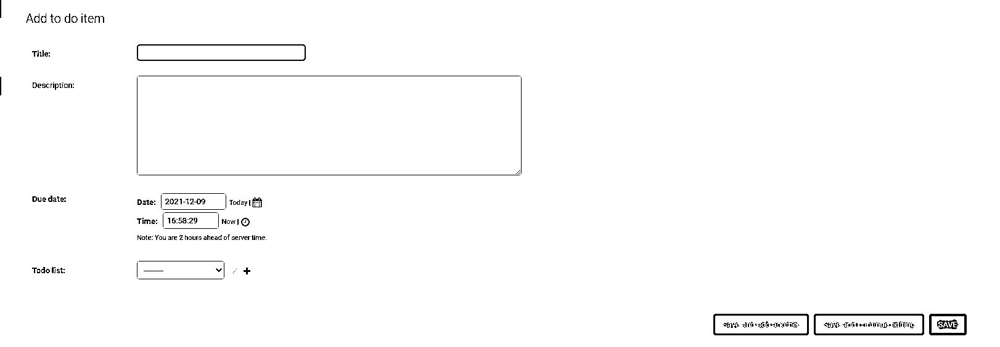

# 使用 Python 和 Django 管理你的待办事项列表

> 原文：<https://realpython.com/django-todo-lists/>

你有没有努力去跟踪你需要做的事情？也许你习惯于用手写的待办事项清单来提醒你需要做什么，什么时候做。但是手写笔记很容易丢失或被遗忘。因为您是 Python 程序员，所以构建 Django 待办事项列表管理器是有意义的！

在这个分步教程中，您将使用 Django 创建一个 web 应用程序。您将了解 Django 如何与数据库集成，该数据库将您所有的待办事项存储在您可以定义的列表中。每一项都有标题、描述和截止日期。有了这个应用程序，您可以管理自己的截止日期，并帮助您的整个团队保持正轨！

**在本教程中，您将学习如何:**

*   使用 Django 创建一个 web 应用程序
*   用**一对多关系**构建**数据模型**
*   使用 **Django admin** 接口来探索您的数据模型并添加测试数据
*   设计用于显示列表的[模板](https://docs.djangoproject.com/en/4.0/topics/templates/)
*   利用**基于类的视图**来处理标准数据库操作
*   通过创建 **URL 配置**来控制 Django **URL 分配器**

在这个过程中，您将了解 Django 的[基于类的视图](https://docs.djangoproject.com/en/4.0/topics/class-based-views/)如何利用[面向对象编程](https://en.wikipedia.org/wiki/Object-oriented_programming)的力量。这将为您节省大量的开发工作！

**获取源代码:** [点击此处获取源代码，您将使用](https://realpython.com/bonus/django-todo-lists-project-code/)来构建您的待办事项应用程序。

## 演示

在本教程中，您将构建一个 Django 待办事项列表管理器。你的主页会显示你所有的待办事项。通过点击*添加新列表*按钮，您将显示一个页面，您可以在其中命名和创建新列表:

[https://player.vimeo.com/video/662503907?background=1](https://player.vimeo.com/video/662503907?background=1)

您可以通过点击*添加新项目*将待办事项添加到您的列表中。在那里，你可以给你的物品起一个标题，并且你可以在*描述*框中添加更多的细节。你甚至可以设定一个截止日期。

[*Remove ads*](/account/join/)

## 项目概述

要构建这个应用程序，首先要创建一个虚拟环境，并设置一个 Django 项目。接下来，您将设计一个[数据模型](https://en.wikipedia.org/wiki/Data_model)，它表示待办事项和列表之间的关系。您将使用 Django 内置的[对象关系映射](https://en.wikipedia.org/wiki/Object%E2%80%93relational_mapping)工具来自动生成支持该模型的数据库和表。

当你开发 Django 待办事项应用程序时，只要你需要验证事情是否按预期运行，你就可以使用 Django 的便捷的 [`runserver`](https://docs.djangoproject.com/en/4.0/ref/django-admin/#runserver) 命令。多亏了 Django 现成的[管理](https://docs.djangoproject.com/en/4.0/ref/contrib/admin/)界面，这甚至在你的网页准备好之前就能帮上忙。

接下来，您将开发自己的网页来显示您的应用程序。在 Django 中，这些采用了[模板](https://docs.djangoproject.com/en/4.0/topics/templates/)的形式。模板是框架 [HTML 页面](https://realpython.com/html-css-python/#the-html-document)，可以填充真实的应用程序数据。

模板并不意味着提供太多的逻辑，比如决定显示哪个模板和发送什么数据。为了执行这个逻辑，你需要[视图](https://docs.djangoproject.com/en/4.0/topics/http/views/)。Django 的视图是应用程序逻辑的自然归宿。

您将为列表创建和更新以及这些列表将包含的项目编写视图和模板代码。您将学习如何使用 Django 的 [URL dispatcher](https://docs.djangoproject.com/en/4.0/topics/http/urls/) 来连接您的页面并传递它们需要的数据。接下来，您将添加更多视图和模板，使您的用户能够删除列表和项目。

最后，您将通过添加、编辑和删除待办事项列表和待办事项来测试您的新用户界面。

通过完成这个项目，你将学习如何构建这个应用程序，并了解各种组件如何配合在一起。然后，你就可以自己开始下一个 Django 项目了。

## 先决条件

要完成本教程，您应该熟悉以下技能:

*   [从命令行运行 Python 脚本](https://realpython.com/interacting-with-python/#running-a-python-script-from-the-command-line)
*   [用 Python IDLE](https://realpython.com/python-idle/) 编码，或者你喜欢的代码编辑器
*   [使用 Python 模块和包](https://realpython.com/python-modules-packages/)
*   [了解 Python 中的面向对象编程](https://realpython.com/python3-object-oriented-programming/)，包括[对象继承](https://realpython.com/inheritance-composition-python/)

如果您在开始本教程之前没有掌握所有的必备知识，那也没关系。事实上，你可以通过前进和开始学习更多！如果遇到困难，您可以随时停下来查看此处链接的资源。

您不需要以前使用过 Django，因为您将在下面获得安装和使用它的分步说明。然而，如果你对这个强大的 web 框架的更详细的介绍感兴趣，你可以参考一系列的 Django 教程。

## 步骤 1:设置你的虚拟环境和 Django

在这一步中，您将执行一些标准的内务处理任务，这些任务在每个 Django 项目中只需要执行一次。具体来说，您将创建并激活一个虚拟环境，安装 Django，并测试 Django 是否安装正确。

完成这些小杂务后，您就可以开始构建您的 Django 待办事项列表应用程序了！要下载该项目的初始代码，请单击以下链接并导航到`source_code_step_1/`文件夹:

**获取源代码:** [点击此处获取源代码，您将使用](https://realpython.com/bonus/django-todo-lists-project-code/)来构建您的待办事项应用程序。

### 创建虚拟环境和项目目录

无论何时使用 Python 开发东西，尤其是如果您将使用外部库，创建一个[虚拟环境](https://realpython.com/python-virtual-environments-a-primer/)非常重要。这样，您就为您的代码创建了一个隔离的世界，这样您选择的 Python 和库版本就不会意外地破坏您为其他版本编写的任何其他应用程序。

然后，如果您以后为另一个项目使用不同版本的 Python 或更新的库，您不会破坏这个项目的任何东西，因为它将继续使用自己的 Python 和库版本。

创建虚拟环境只需要几个步骤。首先，创建一个目录作为新应用程序的根目录，并使用适合您的操作系统的语法进入该目录:

*   [*视窗*](#windows-1)
**   [**Linux + macOS**](#linux-macos-1)*

```py
C:\> mkdir projects\todo_list
C:\> cd projects\todo_list
```

```py
$ mkdir projects/todo_list
$ cd projects/todo_list
```

至此，您已经创建了您的**项目根**。您在本教程中所做的一切都将发生在该文件夹中。您将它命名为`todo_list`，为了保持整洁，您将它放在主目录中名为`projects/`的现有文件夹中。

确保您安装了 Python 3.6 或更新版本，然后您可以使用 Python 的内置模块`venv`来创建和激活您的虚拟环境:

*   [*视窗*](#windows-2)
**   [**Linux + macOS**](#linux-macos-2)*

```py
C:\> python -m venv venv
C:\> venv\Scripts\activate.bat
```

```py
$ python -m venv venv
$ source venv/bin/activate
```

第一行在子目录`venv/`中创建您的虚拟环境。它还将`pip`和`setuptools`复制到其中。第二行**激活**虚拟环境，你的控制台提示可能会改变来提醒你这个事实。

激活后，你正在使用一个完全独立的 Python 解释器和生态系统。从现在开始安装的任何库，包括 Django，都将被隔离到这个环境中。

稍后，当你在虚拟环境中完成工作后，你只需输入`deactivate`，之后一切都会恢复原样。系统的默认 Python 解释器将被恢复，同时恢复的还有全局安装的 Python 库。

**注意:**不要立即停用，因为您想在激活的环境中继续！

需要时，您可以通过重复上面的`activate`步骤来重新激活环境。

[*Remove ads*](/account/join/)

### 安装并测试 Django

下一步是安装 Django 库及其依赖项。您将在这里指定一个特定的版本，尽管也可以不指定版本，在这种情况下`pip`将只安装最新的版本。

*   [*视窗*](#windows-3)
**   [**Linux + macOS**](#linux-macos-3)*

```py
(venv) C:\> python -m pip install django=="3.2.9"
```

```py
(venv) $ python -m pip install django=="3.2.9"
```

从滚动过去的包列表中，您会注意到,`pip`机器也负责安装所有的 Django 依赖项。点击和旋转完成后，您应该会看到一条成功消息:

```py
Successfully installed asgiref-3.4.1 django-3.2.9 pytz-2021.3 sqlparse-0.4.2
```

Django 库现在已经安装在您的虚拟环境中了。只要这个环境是活动的，Django、它的命令行工具和它的库都将保持可用。

您可以使用 [Python 解释器](https://realpython.com/interacting-with-python/#starting-the-interpreter)来检查 Django 是否安装正确。从命令行调用`python`之后，您可以导入 Django 并交互地检查它的版本:

>>>

```py
>>> import django
>>> django.get_version()
'3.2.9'
>>> exit()
```

如果您得到了一个版本号，如上所述，而不是一个`ImportError`，那么您就可以确信您的 Django 安装已经准备好了。

现在把你的依赖关系固定下来是个好主意。这记录了当前安装在虚拟环境中的所有 Python 库的版本:

*   [*视窗*](#windows-4)
**   [**Linux + macOS**](#linux-macos-4)*

```py
(venv) C:\> python -m pip freeze > requirements.txt
```

```py
(venv) $ python -m pip freeze > requirements.txt
```

文本文件`requirements.txt`现在列出了您正在使用的所有软件包的确切版本，因此您或其他开发人员可以在以后准确地复制您的虚拟环境。

至此，您已经建立了代码环境并安装了必要的库。是时候开始生成一些 Django 代码了！

## 第二步:创建你的 Django 待办应用程序

现在您的环境已经激活，Django 也准备好了，您几乎可以开始自己的编码了。不过，首先，您需要使用 Django 的工具来执行一些特定于项目的步骤。其中包括:

*   生成父项目框架
*   创建 web 应用程序的框架
*   将 web 应用程序集成到项目中

所有的 Django 项目都有相似的结构，所以理解这种布局也将有利于您未来的项目。一旦你熟悉了这个过程，你应该能在几分钟内完成。

要下载项目此阶段的代码，请单击以下链接并导航至`source_code_step_2/`文件夹:

**获取源代码:** [点击此处获取源代码，您将使用](https://realpython.com/bonus/django-todo-lists-project-code/)来构建您的待办事项应用程序。

[*Remove ads*](/account/join/)

### 脚手架父项目

Django 区分了项目和应用程序。一个项目可以管理一个或多个应用程序。对于本教程，您只是创建了一个应用程序，但是它仍然必须由一个项目来管理，您可以将其称为`todo_project`。立即开始您的新项目:

*   [*视窗*](#windows-5)
**   [**Linux + macOS**](#linux-macos-5)*

```py
(venv) C:\> django-admin startproject todo_project .
```

```py
(venv) $ django-admin startproject todo_project .
```

注意这里的最后一个点(`.`)。它阻止`django-admin`创建额外的文件夹。这个命令已经自动创建了一个名为`manage.py`的文件，以及一个名为`todo_project/`的包含几个 Python 文件的子文件夹:

```py
todo_list/
│
├── todo_project/
│   ├── __init__.py
│   ├── asgi.py
│   ├── settings.py
│   ├── urls.py
│   └── wsgi.py
│
├── venv/
│
├── manage.py
└── requirements.txt
```

`todo_list/venv/`文件夹的内容太大，无法在此显示。您将了解下面的一些其他文件。

名为`__init__.py`的文件为空。它的存在只是为了告诉 Python 它的包含文件夹应该被当作一个[包](https://realpython.com/python-modules-packages/)。从概念上讲，Python **模块**是一个单独的源文件，而**包**是一堆模块的容器。通过在包内组织模块，您可以减少名称污染并改善代码隔离。

`todo_list/todo_project/`中的两个文件对你的应用很重要:

*   `settings.py`保存项目范围的配置。这包括项目知道的所有应用程序的列表，以及描述它将使用哪个数据库的设置。
*   `urls.py`列出了服务器必须监听的所有 URL。

在设置时，您将很快需要编辑这两个文件。您需要将应用程序的名称添加到`settings.py`中，并提供一个 URL 作为想要访问该应用程序的浏览器的入口点。

### 开始使用 Django 待办事项应用程序

现在是时候使用`django-admin`命令行工具创建您的应用程序了。你只需要提供一个名字。你不妨称之为`todo_app`:

*   [*视窗*](#windows-6)
**   [**Linux + macOS**](#linux-macos-6)*

```py
(venv) C:\> django-admin startapp todo_app
```

```py
(venv) $ django-admin startapp todo_app
```

这个命令设置了一个新的 Django 应用程序，带有一些启动文件和文件夹。如果您检查您的文件夹，那么您会发现您的项目根目录中现在有三个子文件夹:

```py
todo_list/
│
├── todo_app/
│
├── todo_project/
│
└── venv/
```

记住`todo_project/`是您的**项目文件夹**并且包含*项目范围的*信息是有帮助的。这意味着常规项目设置，以及 web 服务器查找项目中包含的应用程序所需的信息。

另一方面，您的最后一个命令只是创建了`todo_app/`文件夹及其内容。`todo_app/`是你的**应用文件夹**，包含你的应用特有的文件*。看看这个文件夹里的文件:*

```py
todo_app/
│
├── migrations/
│   └── __init__.py
│
├── __init__.py
├── admin.py
├── apps.py
├── models.py
├── tests.py
└── views.py
```

`django-admin`工具为您创建了所有这些文件，但是您现在不需要关心所有这些文件。然而，有几个绝对值得注意:

*   像往常一样，这两个`__init__.py`文件只是将它们包含的文件夹定义为包。
*   `migrations/`子文件夹将保存未来数据库的变更信息。
*   `models.py`文件将为您的应用程序定义数据模型。
*   `views.py`文件将处理控制应用程序显示的逻辑。

在这个过程中，您还将创建一些自己的文件。这些将包括一个**数据模型**，新的**视图**，以及新的**模板**。

不过，首先，您需要配置您的项目，以便它了解您的应用程序。项目级配置位于项目目录的文件`todo_list/todo_project/settings.py`中。现在打开这个文件，浏览一下代码，了解一下有什么可用的。

[*Remove ads*](/account/join/)

### 配置您的项目

您会注意到一个名为`INSTALLED_APPS`的数组，其中有一个简短的应用程序名称列表，以`django.contrib`开头。Django 提供了这些应用程序，并在默认情况下安装它们以满足常见需求。但是列表中缺少了一个非常重要的应用名称:你的！所以你需要添加`todo_app`作为数组`INSTALLED_APPS`中的一项:

```py
# todo_list/todo_project/settings.py
INSTALLED_APPS = [
    "django.contrib.admin",
    "django.contrib.auth",
    "django.contrib.contenttypes",
    "django.contrib.sessions",
    "django.contrib.messages",
    "django.contrib.staticfiles",
 "todo_app", ]
```

当您打开`settings.py`时，请注意它包含了一些其他有趣的变量。这种变量的一个例子是`DATABASES`:

```py
# Database
# https://docs.djangoproject.com/en/3.2/ref/settings/#databases

DATABASES = {
    "default": {
        "ENGINE": "django.db.backends.sqlite3",
        "NAME": BASE_DIR / "db.sqlite3",
    }
}
```

[`DATABASES`](https://docs.djangoproject.com/en/3.2/ref/settings/#databases) 默认设置为使用 [sqlite3 数据库](https://realpython.com/python-sql-libraries/#sqlite)。这是最容易使用的选项，但是如果您感兴趣的话，以后可以尝试使用其他数据库。

影响应用安全性的两个变量是`SECRET_KEY`和`DEBUG`:

```py
- # SECURITY WARNING: keep the secret key used in production secret

SECRET_KEY = (
    "django-insecure-!r4sgi-w($+vmxpe12rg%bvyf$7kz$co3tzw6klpu#f)yfmy#3"
)

# SECURITY WARNING: don't run with debug turned on in production

DEBUG = True
```

在开发过程中，这两个键可以不考虑，但是对于任何计划发布到 Web 上的应用程序，你都应该知道它们。

*   如果你打算把你的应用放在公共服务器上，这一点很重要。Django 为每个新项目生成一个新的随机密钥。你可以暂时忽略它。
*   在你开发应用程序时，`DEBUG`是一个非常有用的设置，但是你应该确保在你的应用程序在大坏网上发布之前将它设置为`False`,因为它揭示了太多关于你的代码的工作方式！

现在保存文件`settings.py`并关闭它。

您需要在项目文件夹中修改的第二个文件是`urls.py`，它在项目级别控制 URL 查找。Django 的 **URL dispatcher** 使用这个文件中的`urlpatterns`数组中的元素来决定如何分派传入的请求。您将向此数组添加一个新的`urlpattern`元素，这将导致 URL dispatcher 将传入的 URL 流量重定向到您的新待办事项应用程序:

```py
 1# todo_list/todo_project/urls.py
 2from django.contrib import admin
 3from django.urls import include, path 4
 5urlpatterns = [
 6    path("admin/", admin.site.urls),
 7    path("", include("todo_app.urls")) 8]
```

上面突出显示了需要更改或添加的行。看看这段代码中发生了什么:

**第 6 行**包含原始的`urlpatterns`元素，它告诉 Django 以`"admin/"`开头的传入 URL 应该由管理应用程序处理。

**第 7 行**添加了一个可以处理空字符串的元素，比如没有前导应用名称的 URL *。这样的 URL 将被传递给`todo_app` URL 配置。如果项目中有其他应用程序，那么您可以通过使用不同的 URL 模式来区分它们，但在这里没有必要。反过来，`todo_app`的 URL 配置保存在一个名为`todo_list/todo_app/urls.py`的文件中的`urlpatterns`数组中。*

现在，您将创建应用程序级 URL 配置文件。在编辑器中打开一个新文件，并以名称`urls.py`保存在`todo_list/todo_app`目录中:

```py
 1# todo_list/todo_app/urls.py
 2
 3urlpatterns = [
 4]
```

暂时将应用程序的`urlpatterns`数组留空。你很快就会添加一些真正的路线。

你现在已经有了一个完整的、可运行的项目和应用程序设置，尽管它还没做多少。整个基础设施已经就绪，但是您需要添加一些内容。您可以通过启动 Django 开发服务器来测试您到目前为止的工作:

*   [*视窗*](#windows-7)
**   [**Linux + macOS**](#linux-macos-7)*

```py
(venv) C:\> python manage.py runserver
```

```py
(venv) $ python manage.py runserver
```

忽略关于迁移的警告消息。你很快就会处理这些。控制台上显示的最后一条消息应该是您的服务器正在运行，这就足够了！

**注意:**上面显示的`runserver`命令值得记住，因为您可以在开发的每一步使用它来测试您的代码是否按预期工作。

在浏览器中导航至`http://localhost:8000/`。在这个阶段，Django 没有要显示的应用程序页面，所以您应该会看到框架的通用成功页面:

[](https://files.realpython.com/media/django_success.40ae2eb35ef2.png)

Django 的默认页面提供了大量有用文档的链接。您可以稍后探索这些链接。

**注意:**当你完成测试后，你可以在控制台窗口输入 `Ctrl` + `C` 或 `Cmd` + `C` 来停止服务器。

您已经完成了新 Django 应用程序的所有标准设置任务。是时候开始编写应用程序的独特特性了。

[*Remove ads*](/account/join/)

## 第三步:设计你的待办数据

任何应用程序的核心都是它的数据结构。在这一步中，您将设计和编码应用程序**数据模型**以及应用程序对象之间的关系。然后，您将使用 Django 的对象关系建模工具将数据模型映射到数据库表中。

要下载项目此阶段的代码，请单击以下链接并导航至`source_code_step_3/`文件夹:

**获取源代码:** [点击此处获取源代码，您将使用](https://realpython.com/bonus/django-todo-lists-project-code/)来构建您的待办事项应用程序。

每种类型的用户数据都需要自己的**数据模型**。你的待办事项应用程序将只包含两种基本类型的数据:

1.  一个带标题的`ToDoList`:你想要多少就有多少。
2.  **链接到特定列表的`ToDoItem`:**同样，`ToDoItem`对象的数量没有限制。每个`ToDoItem`都有自己的标题、更长的描述、创建日期和截止日期。

你的数据模型将构成你的应用程序的主干。接下来，您将通过编辑文件`models.py`来定义它们。

### 定义您的数据模型

在编辑器中打开文件`models.py`。目前这种可能性很小:

```py
# todo_list/todo_app/models.py
from django.db import models

# Create your models here.
```

这只是占位符文本，帮助您记住在哪里定义数据模型。用您的数据模型的代码替换此文本:

```py
 1# todo_list/todo_app/models.py
 2from django.utils import timezone
 3
 4from django.db import models
 5from django.urls import reverse
 6
 7def one_week_hence():
 8    return timezone.now() + timezone.timedelta(days=7)
 9
10class ToDoList(models.Model):
11    title = models.CharField(max_length=100, unique=True)
12
13    def get_absolute_url(self):
14        return reverse("list", args=[self.id])
15
16    def __str__(self):
17        return self.title
18
19class ToDoItem(models.Model):
20    title = models.CharField(max_length=100)
21    description = models.TextField(null=True, blank=True)
22    created_date = models.DateTimeField(auto_now_add=True)
23    due_date = models.DateTimeField(default=one_week_hence)
24    todo_list = models.ForeignKey(ToDoList, on_delete=models.CASCADE)
25
26    def get_absolute_url(self):
27        return reverse(
28            "item-update", args=[str(self.todo_list.id), str(self.id)]
29        )
30
31    def __str__(self):
32        return f"{self.title}: due {self.due_date}"
33
34    class Meta:
35        ordering = ["due_date"]
```

文件`models.py`定义了你的整个数据模型。在其中，您定义了一个函数和两个数据模型类:

*   **第 7 行到第 8 行**定义了一个独立的实用函数`one_week_hence()`，该函数对于设置`ToDoItem`默认到期日很有用。

*   **第 10 到 35 行**定义了两个扩展 Django 的`django.db.models.Model`超类的类。那个班为你做了大部分繁重的工作。您在子类中需要做的就是定义每个模型中的数据字段，如下所述。

`Model`超类还定义了一个`id`字段，它对于每个对象来说是自动唯一的，并作为其标识符。

对于您可能想要定义的所有字段类型，`django.db.models`子模块也有方便的类。这些允许您设置有用的默认行为:

*   **第 11 行和第 20 行**声明了`title`字段，每个字段限制在 100 个字符以内。另外，`ToDoList.title`必须唯一。你不能拥有两个标题相同的`ToDoList`对象。

*   **第 21 行**声明了一个可能为空的`ToDoItem.description`字段。

*   **第 22 行和第 23 行**分别为它们的日期字段提供了有用的默认值。Django 会在第一次保存`ToDoItem`对象时自动将`.created_date`设置为当前日期，而`.due_date`使用`one_week_hence()`设置一个默认的未来一周的到期日。当然，如果这个默认值不适合用户，应用程序将允许用户更改到期日。

*   第 24 行声明了可能是最有趣的字段`ToDoItem.todo_list`。该字段被声明为[外键](https://docs.djangoproject.com/en/4.0/ref/models/fields/#django.db.models.ForeignKey)。它将`ToDoItem`链接回它的`ToDoList`，因此每个`ToDoItem`必须恰好有一个它所属的`ToDoList`。在数据库行话中，这是一个一对多的关系。同一行中的`on_delete`关键字确保如果删除一个待办事项列表，那么所有关联的待办事项也会被删除。

*   **第 16 到 17 行和第 31 到 32 行**为每个模型类声明 [`.__str__()`方法](https://realpython.com/courses/pythonic-oop-string-conversion-repr-vs-str/)。这是创建对象的可读表示的标准 Python 方式。编写这个函数并不是绝对必要的，但是它有助于调试。

*   **第 13 到 14 行和第 26 到 29 行**实现了`.get_absolute_url()`方法，这是 Django 对数据模型的约定。这个函数返回特定数据项的 URL。这允许您在代码中方便、可靠地引用 URL。`.get_absolute_url()`的两个实现的 return 语句都使用了`reverse()`来避免对 URL 及其参数进行硬编码。

*   **第 34 行**定义了嵌套的`Meta`类，它允许你设置一些有用的选项。这里，您将使用它来设置`ToDoItem`记录的默认排序。

现在保存带有两个模型类的`models.py`文件。有了这个文件，您就为整个应用程序声明了数据模型。很快，您将使用 Django 工具将模型映射到您的数据库。

### 创建数据库

到目前为止，您已经在 Python 代码中定义了两个模型类。现在奇迹发生了！使用命令行创建并激活[迁移](https://realpython.com/django-migrations-a-primer/):

*   [*视窗*](#windows-8)
**   [**Linux + macOS**](#linux-macos-8)*

```py
(venv) C:\> python manage.py makemigrations todo_app
(venv) C:\> python manage.py migrate
```

```py
(venv) $ python manage.py makemigrations todo_app
(venv) $ python manage.py migrate
```

这两个子命令，`makemigrations`和`migrate`，由`manage.py`提供，有助于使您的物理数据库结构与代码中的数据模型保持一致的过程自动化。

使用`makemigrations`，您告诉 Django 您已经更改了应用程序的数据模型，并且您想要记录这些更改。在这个特例中，您定义了两个全新的表，每个表对应一个数据模型。此外，Django 已经为管理界面和自己的内部使用自动创建了自己的数据模型。

每当您对数据模型进行更改并调用`makemigrations`时，Django 都会向文件夹`todo_app/migrations/`中添加一个文件。该文件夹中的文件存储了您对数据库结构所做的更改的历史记录。这允许您在需要时恢复并重新应用这些更改。

使用`migrate`命令，通过对数据库运行命令来使这些更改生效。就这样，您创建了新表，以及一些有用的管理表。

您的数据模型现在被镜像到数据库中，并且您还创建了一个[审计跟踪](https://en.wikipedia.org/wiki/Audit_trail)，为您以后可能应用的任何结构更改做准备。

[*Remove ads*](/account/join/)

## 第四步:添加你的样本待办事项数据

所以现在你有了一个数据模型和一个数据库，但是你还没有任何实际的*数据*以待办事项列表或条目的形式。很快，您将构建网页来创建和操作这些，但是现在，您可以用最简单的方式创建一些测试数据，通过使用 Django 现成的[管理](https://realpython.com/customize-django-admin-python/#setting-up-the-django-admin)接口。该工具不仅使您能够管理模型数据，还能够验证用户、显示和处理表单以及验证输入。

要下载项目此阶段的代码，请单击以下链接并导航至`source_code_step_4/`文件夹:

**获取源代码:** [点击此处获取源代码，您将使用](https://realpython.com/bonus/django-todo-lists-project-code/)来构建您的待办事项应用程序。

### 了解 Django 管理界面

要使用管理界面，你应该有一个超级用户。这将是一个拥有非凡力量的人，可以信任他拥有整个 Django 服务器的密钥。这听起来像你吗？立即创建您的新**超级用户**:

*   [*视窗*](#windows-9)
**   [**Linux + macOS**](#linux-macos-9)*

```py
(venv) C:\> python manage.py createsuperuser
```

```py
(venv) $ python manage.py createsuperuser
```

只需按照提示将自己注册为超级用户。你的超能力已经安装好了！

虽然您现在可以访问管理界面，但是在它可以使用您的新数据模型之前，还需要完成一个步骤。您需要*在管理应用程序中注册*模型，这可以通过编辑文件`admin.py`来完成:

```py
# todo_list/todo_app/admin.py

from django.contrib import admin
from todo_app.models import ToDoItem, ToDoList

admin.site.register(ToDoItem) admin.site.register(ToDoList)
```

现在您已经准备好使用 Django 管理应用程序了。启动开发服务器并开始探索。首先，确保开发服务器正在运行:

*   [*视窗*](#windows-10)
**   [**Linux + macOS**](#linux-macos-10)*

```py
(venv) C:\> python manage.py runserver
```

```py
(venv) $ python manage.py runserver
```

现在打开网络浏览器，转到地址`http://127.0.0.1:8000/admin/`。您应该会看到管理应用程序的登录屏幕。输入您新创建的凭据，将出现管理登录页面:

[](https://files.realpython.com/media/DjangoAdminLandingPage.5438319f846f.png)

注意，它已经显示了*待办事项列表*和*待办事项*的链接。您已经准备好查看和更改数据。

### 开始一个待办事项列表

在 Django 管理主页的左侧，点击*待办事项列表*。在下一个屏幕上，点击右上角的按钮*添加到任务列表*。

你已经准备好创建你的第一个待办事项列表了。给它一个标题，例如“今天要做的事情”，然后点击屏幕最右边的*保存*按钮。新列表现在出现在标题为*选择要更改的待办事项列表*的页面上。你可以忽略这一点，而是点击屏幕左侧出现在*旁边的 *+添加*按钮来做事情*。出现一个新表单:

[](https://files.realpython.com/media/Django_Admin_Add_todo_item_form.be27b53ccd16.png)

用一些示例数据填充该项。将您的项目命名为“开始我的待办事项列表”，并将描述命名为“首先要做的事情”让到期日保持原样，从今天算起正好一周。对于*待办事项列表*，从下拉菜单中选择您新创建的待办事项列表标题。然后打*救*。

就是这样。您已经使用管理界面创建了一个列表和一个项目。请随意留下来浏览这些页面，感受一下它们是如何工作的。作为开发人员，管理界面对您来说是很好的，可以用来对数据进行快速和肮脏的攻击，但它不适合普通用户使用。重要的事情在等着我们。您需要创建公共用户界面！

[*Remove ads*](/account/join/)

## 步骤 5:创建 Django 视图

在这一步中，您将了解如何为您的应用程序创建公共接口。在 Django 中，这涉及到使用视图和模板。一个**视图**是编排网页的代码，是你的 web 应用程序的*表现逻辑*。正如您将看到的，**模板**是一个更像 HTML 页面的组件。

要下载项目此阶段的代码，请单击以下链接并导航至`source_code_step_5/`文件夹:

**获取源代码:** [点击此处获取源代码，您将使用](https://realpython.com/bonus/django-todo-lists-project-code/)来构建您的待办事项应用程序。

### 编写您的第一个视图

一个**视图**是 Python 代码，它告诉 Django 如何在页面之间导航，以及要显示哪些数据。web 应用程序的工作方式是接收来自浏览器的 HTTP 请求，决定如何处理它，然后发回一个响应。然后，应用程序停止工作，等待下一个请求。

在 Django 中，这个[请求-响应循环](https://en.wikipedia.org/wiki/Request%E2%80%93response)由视图控制，其最基本的形式是一个位于文件`views.py`中的 Python 函数。视图函数的主要输入数据是一个`HttpRequest` Python 对象，它的工作是返回一个`HttpResponse` Python 对象。

对视图进行编码有两种基本方法。你可以创建一个函数，如上所述，或者你可以使用一个 Python 类，它的*方法*将处理请求。无论哪种情况，您都需要通知 Django 您的视图是为了处理特定类型的请求。

使用类有一些明确的优点:

*   **一致性:**每个 [HTTP 请求](https://developer.mozilla.org/en-US/docs/Web/HTTP/Methods)都与一个给服务器的命令相关联，称为它的方法或动词。根据所需的响应，这可能是 GET、POST、HEAD 或其他。每个**动词**在你的类中都有自己匹配的方法名。例如，处理 HTTP **GET** 请求的方法被命名为`.get()`。

*   **继承:**您可以通过扩展现有的类来使用继承的力量，这些类已经完成了您需要视图完成的大部分工作。

在本教程中，您将使用基于**类的**方法，并利用 Django 预先构建的[通用视图](https://docs.djangoproject.com/en/4.0/ref/class-based-views/generic-display/)来实现最大程度的代码重用。在这里，你可以从 Django 设计师的智慧中获益。有很多很多不同的数据库和数据模型，但从根本上来说，它们都基于被称为**记录**的信息单元，以及你可以对它们进行的四种基本操作:

1.  **创建**条记录
2.  **读取**记录
3.  **更新**记录
4.  **删除**记录

这些活动通常被称为 [CRUD](https://en.wikipedia.org/wiki/Create,_read,_update_and_delete) ，它们或多或少是许多应用程序的标准。

例如，用户希望能够选择一个记录，编辑其字段，并保存它，而不管该记录是代表待办事项、库存项目还是其他任何内容。所以 Django 为开发人员提供了**基于类的视图**，这是预构建的视图，作为类实现，已经包含了完成这些事情的大部分代码。

作为开发人员，您所要做的就是为您的数据模型和应用程序定制它们，也许在您这样做的时候，在这里或那里调整它们的行为。

在编辑器中，打开文件`todo_app/views.py`。目前，它不包含有用的代码。清除文件并创建您的第一个视图:

```py
# todo_list/todo_app/views.py
from django.views.generic import ListView
from .models import ToDoList

class ListListView(ListView):
    model = ToDoList
    template_name = "todo_app/index.html"
```

`ListListView`类将显示待办事项列表标题的列表。如您所见，这里不需要太多代码。您正在使用泛型类`django.views.generic.ListView`。它已经知道如何从数据库中检索对象列表，所以您只需要告诉它两件事:

1.  您想要获取的数据模型**类**
2.  将列表格式化为可显示形式的模板的名称

在本例中，数据模型类是您在[步骤 3](#step-3-design-your-to-do-data) 中创建的`ToDoList`。现在是时候了解一下**模板**了。

[*Remove ads*](/account/join/)

### 了解模板

一个**模板**只是一个包含 HTML 标记的文件，带有一些额外的占位符来容纳动态数据。因为您希望能够重用您的代码，所以您将从创建一个**基础模板**开始，该模板包含您希望出现在每个页面上的所有样本 HTML 代码。实际的应用程序页面将**继承**所有这些样板文件，就像你的视图将如何从基类继承它们的大部分功能。

**注意:**你可以从[模板](https://docs.djangoproject.com/en/3.2/topics/templates/)的官方文档中了解更多信息。

### 创建一个基础模板

在`todo_app/`目录下创建一个名为`templates/`的新文件夹。现在向该文件夹添加一个新文件。你可以称它为`base.html`。创建您的基础模板:

```py
 1<!-- todo_list/todo_app/templates/base.html -->
 2<!-- Base template -->
 3<!doctype html>
 4<html lang="en">
 5
 6<head>
 7    <!-- Required meta tags -->
 8    <meta charset="utf-8">
 9    <meta name="viewport" content="width=device-width, initial-scale=1">
10    <!--Simple.css-->
11    <link rel="stylesheet" href="https://cdn.simplecss.org/simple.min.css">
12    <title>Django To-do Lists</title>
13</head>
14
15<body>
16    <div>
17        <h1 onclick="location.href=''">
18            Django To-do Lists
19        </h1>
20    </div>
21    <div>
22        
23        This content will be replaced by different html code for each page.
24        
25    </div>
26</body>
27
28</html>
```

在很大程度上，这只是一个具有标准结构的框架 HTML 页面。**然而，第 22 到 24 行**声明了特殊的`` … ``标签。这些占位符保留了一个空间，可以从**从这个页面继承**的页面接收更多的 HTML 标记。

**11 号线**导入开源的 [`Simple.css`库](http://simplecss.org)。没有 [CSS](https://realpython.com/html-css-python/#style-your-content-with-css) 的原始 HTML 以一种大多数人都觉得很难看的方式呈现。仅仅通过像这样导入`Simple.css`,你就自动让你的网站看起来更好，不需要更多的努力。现在您可以开发和测试您的站点逻辑，而不会伤害您的眼睛。当然，您仍然可以选择在以后添加自己的创意！

第 17 行引入模板语法``作为`onclick`事件处理程序的目标。Django 模板引擎将在 **URLConf** 文件`todo_app/urls.py`中找到名为`"index"`的`urlpatterns`条目，并用正确的路径替换这个模板。这样做的效果是，点击 *Django To-do Lists* 标题将使浏览器重定向到名为`"index"`的 URL，这将是您的主页。

**注意:**这意味着你可以在应用的任何地方点击 *Django 待办事项列表*标题返回应用的主页。

所以`base.html`是一个完整的网页，但并不令人兴奋。为了让它更有趣，你需要一些标记在``和``标签之间。每个继承模板都将提供自己的标记来填充这个块。

### 添加主页模板

Django 对于属于应用程序的模板的约定是，它们位于应用程序文件夹内名为`templates/<appname>`的文件夹中。因此，尽管基础模板`base.html`放在了`todo_app/templates/`文件夹中，但其他模板都将放在名为`todo_app/templates/todo_app/`的文件夹中:

*   [*视窗*](#windows-11)
**   [**Linux + macOS**](#linux-macos-11)*

```py
(venv) C:\> mkdir todo_app\templates\todo_app
```

```py
(venv) $ mkdir todo_app/templates/todo_app
```

你的第一个目标是为你的网站的主页编写模板，通常命名为`index.html`。在编辑器中创建一个新文件，并将其保存在刚刚创建的文件夹中:

```py
 1<!-- todo_list/todo_app/templates/todo_app/index.html -->
 2
 3
 4
 5<!--index.html-->
 6
 7<h3>All my lists</h3>
 8
 9<ul>
10    
11    <li>
12        <div
13            role="button"
14            onclick="location.href=''">
15            {{ todolist.title }}
16        </div>
17    </li>
18    
19    <h4>You have no lists!</h4>
20    
21</ul>
22
23
```

第 3 行**设置场景:你正在**扩展**基础模板。这意味着来自基础模板的所有内容都将出现在`index.html`、*的渲染版本中，除了*介于``和``标签之间的所有内容。取而代之的是，`base.html`的那一段将被`index.html`中相应的一对``和``标签内的代码所取代。**

在`index.html`中可以发现更多的模板魔法，更多的模板标签允许一些类似 Python 的逻辑:

*   **第 6 行到第 8 行**定义了一个由``和``标签分隔的代码块。这些确保了如果`object_list`为空，标题`All my lists`不会出现。`ListView`自动提供[上下文变量](https://realpython.com/python37-new-features/#context-variables) `object_list`给模板，`object_list`包含待办事项列表。

*   **第 10 到 20 行**定义了一个由``和``标签括起来的循环。这个构造为列表中的每个对象呈现一次包含的 HTML。另外，如果列表为空，第 18 行**的``标签可以让你定义应该呈现什么。**

*   **第 15 行**演示了[小胡子语法](https://en.wikipedia.org/wiki/Mustache_(template_system))。双花括号(`{{` … `}}`)使模板引擎发出 HTML，显示包含的变量的值。在本例中，您正在呈现循环变量`todolist`的`title`属性。

现在您已经创建了应用程序的**主页**，它将显示您所有待办事项的列表(如果有)，如果没有，则显示一条信息性消息。你的用户会被**的 URL 分配器**引导到其他页面，或者回到这个页面。在下一节中，您将看到调度程序是如何工作的。

[*Remove ads*](/account/join/)

### 构建一个请求处理器

web 应用程序的大部分时间都在等待来自浏览器的 HTTP 请求。两个最常见的 HTTP 请求动词是 **GET** 和 **POST** 。由 [GET](https://developer.mozilla.org/en-US/docs/Web/HTTP/Methods/GET) 请求执行的动作主要由其 URL 定义，URL 不仅将请求路由回正确的服务器，还包含**参数**，这些参数告诉服务器浏览器正在请求什么信息。典型的 HTTP URL 可能类似于`http://example.com/list/3/item/4`。

这个与 GET 请求一起发送的假想 URL 可能在`example.com`被服务器解释为请求使用默认应用程序来显示列表三中的第四项。

一个 [POST](https://developer.mozilla.org/en-US/docs/Web/HTTP/Methods/POST) 请求也可能有 URL 参数，但是它的行为稍有不同。除了 URL 参数之外，POST 还向服务器发送一些进一步的信息。例如，这些信息不会显示在浏览器的搜索栏中，但可以用来更新 web 表单中的记录。

**注意:**关于 HTTP 请求还有很多需要学习的地方。[用 Python](https://realpython.com/python-https/) 探索 HTTPS 的第一部分提供了更多关于 HTTP 如何工作的细节。然后，它继续探索 HTTPS，协议的安全形式。

Django 的 [URL dispatcher](https://docs.djangoproject.com/en/4.0/topics/http/urls/#url-dispatcher) 负责解析 URL 并将请求转发给适当的**视图**。URL 可以从浏览器接收，或者有时在内部从服务器本身接收。

**URL 分配器**通过参考被称为 [URLconf](https://www.google.com/url?q=https://docs.djangoproject.com/en/4.0/topics/http/urls/) 的一组映射到视图的 URL 模式来完成它的工作。这些映射通常存储在名为`urls.py`的文件中。一旦 URL dispatcher 找到匹配项，它就会调用带有 URL 参数的匹配视图。

回到[步骤 2](#step-2-create-your-django-to-do-app) ，您在*项目级* URLconf 文件`todo_project/urls.py`中创建了一个`urlpatterns`项。那个`urlpattern`确保任何以`http://example.com[:port]/...`开头的 HTTP 请求都将被传递到你的应用程序。 *app 级* `urls.py`从那里接手。

您已经创建了应用程序级别的 URL 文件。现在是时候将第一条**路线**添加到该文件中了。编辑文件`todo_app/urls.py`以添加路线:

```py
 1# todo_list/todo_app/urls.py
 2from django.urls import path
 3from . import views
 4
 5urlpatterns = [
 6    path("", views.ListListView.as_view(), name="index"),
 7]
```

**第 6 行**告诉 Django，如果 URL 的其余部分为空，应该调用您的`ListListView`类来处理请求。请注意，`name="index"`参数与您在 [`base.html`模板](#create-a-base-template)的**行 18** 中看到的``宏的目标相匹配。

所以现在你有了制作你的第一个家庭自制视图的所有材料。[请求-响应周期](https://en.wikipedia.org/wiki/Request%E2%80%93response)如下进行:

1.  当服务器从浏览器接收到一个带有这个 URL 的 **GET** 请求时，它创建一个`HTTPRequest`对象并将其发送到您之前在`views.py`中定义的`ListListView`。
2.  这个特定的视图是一个基于`ToDoList`模型的`ListView`，所以它从数据库中获取所有的`ToDoList`记录，将它们转换成`ToDoList` Python 对象，并将它们附加到一个默认名为`object_list`的列表中。
3.  然后，视图使用指定的模板`index.html`将列表传递给模板引擎进行显示。
4.  模板引擎从`index.html`构建 HTML 代码，自动将其与`base.html`结合，并使用传入的数据和模板的嵌入逻辑来填充 HTML 元素。
5.  视图构建一个包含完整构建的 HTML 的`HttpResponse`对象，并将其返回给 Django。
6.  Django 将`HttpResponse`转换成 HTTP 消息，并将其发送回浏览器。
7.  浏览器看到一个完整的 HTTP 页面，将其显示给用户。

您已经创建了第一个端到端 Django 请求处理程序！但是，您可能已经注意到，您的 [`index.html`](#add-a-home-page-template) 文件引用了一个尚不存在的 URL 名称:`"list"`。这意味着，如果你现在尝试运行你的应用程序，它将无法工作。您需要定义该 URL 并创建相应的视图，以使应用程序正常工作。

这个新视图，像本教程中的`ListListView`和所有其他视图一样，将是基于**类的**。在深入研究更多代码之前，理解这意味着什么是很重要的。

### 重用基于类的通用视图

在本教程中，您将使用**基于类的通用视图**。打算作为视图工作的类应该扩展类`django.views.View`并覆盖该类的方法，比如处理相应的`HttpRequest`类型的`.get()`和`.post()`。这些方法都接受一个`HttpRequest`，并返回一个`HttpResponse`。

**基于类的通用视图**将可重用性提升到一个新的水平。大多数预期的功能已经编码在基类中。例如，基于通用视图类`ListView`的视图类只需要知道两件事:

1.  它列出的是什么数据类型
2.  它将使用什么样的模板来呈现 HTML

有了这些信息，它可以呈现一个对象列表。当然，`ListView`和其他通用视图一样，并不局限于这种非常基本的模式。您可以根据自己的需要调整基类并创建子类。但是基本的功能已经存在，而且不需要花费你一分钱。

[*Remove ads*](/account/join/)

### 子类`ListView`显示待办事项列表

您已经创建了第一个视图，将泛型类`django.views.generic.list.ListView`扩展为一个新的子类`ListListView`，其工作是显示待办事项列表。

现在你可以做一些非常类似的事情来显示待办事项列表*条目*。您将从创建另一个视图类开始，这次称为`ItemListView`。像类`ListListView`，`ItemListView`将扩展通用的 Django 类`ListView`。打开`views.py`，添加你的新类:

```py
 1# todo_list/todo_app/views.py
 2from django.views.generic import ListView
 3from .models import ToDoList, ToDoItem 4
 5class ListListView(ListView):
 6    model = ToDoList
 7    template_name = "todo_app/index.html"
 8 9class ItemListView(ListView): 10    model = ToDoItem 11    template_name = "todo_app/todo_list.html" 12 13    def get_queryset(self): 14        return ToDoItem.objects.filter(todo_list_id=self.kwargs["list_id"]) 15 16    def get_context_data(self): 17        context = super().get_context_data() 18        context["todo_list"] = ToDoList.objects.get(id=self.kwargs["list_id"]) 19        return context
```

在您的`ItemListView`实现中，您稍微专门化了一下`ListView`。当你显示一个`ToDoItem`对象的列表时，你不想显示数据库中每一个 `ToDoItem`的*，只显示那些属于当前列表的。为此，**第 13 到 14 行**通过使用模型的`objects.filter()`方法来限制返回的数据，从而覆盖了`ListView.get_queryset()`方法。*

每个`View`类的后代也有一个`.get_context_data()`方法。由此返回的值是模板的`context`，这是一个 Python 字典，它决定了哪些数据可用于呈现。`.get_queryset()`的结果自动包含在键`object_list`下的`context`中，但是您希望模板能够访问`todo_list`对象本身，而不仅仅是查询返回的其中的项目。

**第 16 行到第 19 行**覆盖`.get_context_data()`将这个引用添加到`context`字典中。重要的是**行 17** 首先调用[超类的](https://realpython.com/python-super/) `.get_context_data()`，这样新数据可以与现有的上下文合并，而不是破坏它。

注意，这两个被覆盖的方法都使用了`self.kwargs["list_id"]`。这意味着在构造类时，必须有一个名为`list_id`的关键字参数传递给该类。你很快就会知道这个论点从何而来。

### 显示待办事项列表中的项目

您的下一个任务是创建一个在给定列表中显示`TodoItems`的模板。同样，`` … ``构造也是不可或缺的。创建新模板，`todo_list.html`:

```py
 1<!-- todo_list/todo_app/templates/todo_app/todo_list.html -->
 2
 3
 4
 5<div>
 6    <div>
 7        <div>
 8            <h3>Edit list:</h3>
 9            <h5>{{ todo_list.title | upper }}</h5>
10        </div>
11        <ul>
12            
13            <li>
14                <div>
15                    <div
16                        role="button"
17                        onclick="location.href='#'">
18                        {{ todo.title }}
19                        (Due {{ todo.due_date | date:"l, F j" }})
20                    </div>
21                </div>
22            </li>
23            
24            <p>There are no to-do items in this list.</p>
25            
26        </ul>
27        <p>
28            <input
29                value="Add a new item"
30                type="button"
31                onclick="location.href='#'" />
32        </p>
33    </div>
34</div>
35
```

这个显示单个列表及其待办事项的模板与`index.html`类似，只是多了几处:

*   第 9 行和第 19 行展示了一个奇怪的语法。这些带有竖线符号(`|`)的表达式被称为[模板过滤器](https://docs.djangoproject.com/en/3.2/ref/templates/builtins/)，它们提供了一种使用竖线右边的模式分别格式化标题和截止日期的便捷方式。

*   **第 15 到 17 行和第 28 到 31 行**定义了几个按钮状的元素。现在，他们的 [`onclick`事件处理程序](https://developer.mozilla.org/en-US/docs/Web/API/GlobalEventHandlers/onclick)没有做任何有用的事情，但是你很快就会解决这个问题。

所以你已经编写了一个`ItemListView`类，但是到目前为止，你的用户还没有办法调用它。您需要在`urls.py`中添加一条新路线，以便使用`ItemListView`:

```py
 1# todo_list/todo_app/urls.py
 2from todo_app import views
 3
 4urlpatterns = [
 5    path("",
 6        views.ListListView.as_view(), name="index"),
 7    path("list/<int:list_id>/", 8        views.ItemListView.as_view(), name="list"), 9]
```

**第 7 行**声明一个占位符作为新路径的第一个参数。该占位符将匹配浏览器返回的 URL 路径中的位置参数。语法`list/<int:list_id>/`意味着这个条目将匹配一个类似于`list/3/`的 URL，并将命名参数`list_id = 3`传递给`ItemListView`实例。如果您重新查看`views.py`中的 [`ItemListView`](#subclass-listview-to-display-a-list-of-to-do-items) 代码，您会注意到它以`self.kwargs["list_id"]`的形式引用了这个参数。

现在，由于您创建了路线、视图和模板，您可以查看您的所有列表。您还创建了一个路线、视图和模板，用于列出各个待办事项。

是时候测试一下你到目前为止做了什么了。现在尝试以通常的方式运行您的开发服务器:

*   [*视窗*](#windows-12)
**   [**Linux + macOS**](#linux-macos-12)*

```py
(venv) C:\> python manage.py runserver
```

```py
(venv) $ python manage.py runserver
```

根据您从管理界面添加的内容，您应该会看到一个或多个列表名称。您可以单击每一项来显示特定列表包含的项目。你可以点击主 *Django 待办事项列表*标题，导航回应用的主页面。

你的应用现在可以显示列表和项目。您已经实现了 **CRUD** 操作的 **Read** 部分。立即运行您的开发服务器。您应该能够在待办事项列表和单个列表中的项目之间来回导航，但是您还不能添加或删除列表，或者添加、编辑和移除项目。

## 步骤 6:在 Django 中创建和更新模型对象

在这一步，您将通过启用列表和项目的**创建**和**更新**来增强您的应用程序。您将通过扩展 Django 的一些通用视图类来实现这一点。通过这个过程，你会注意到已经嵌入到这些类中的逻辑是如何解释许多典型的 **CRUD** 用例的。但是请记住，你并不局限于预先烘焙的逻辑。您几乎可以覆盖请求-响应周期的任何部分。

要下载项目此阶段的代码，请单击以下链接并导航至`source_code_step_6/`文件夹:

**获取源代码:** [点击此处获取源代码，您将使用](https://realpython.com/bonus/django-todo-lists-project-code/)来构建您的待办事项应用程序。

议程上的第一项是添加支持创建和更新操作的新视图。接下来，您将添加引用这些视图的 URL，最后，您将更新`todo_items.html`模板以提供允许用户导航到新 URL 的链接。

将新的导入和视图类添加到`views.py`:

```py
 1# todo_list/todo_app/views.py
 2from django.urls import reverse
 3
 4from django.views.generic import (
 5    ListView,
 6    CreateView, 7    UpdateView, 8)
 9from .models import ToDoItem, ToDoList
10
11class ListListView(ListView):
12    model = ToDoList
13    template_name = "todo_app/index.html"
14
15class ItemListView(ListView):
16    model = ToDoItem
17    template_name = "todo_app/todo_list.html"
18
19    def get_queryset(self):
20        return ToDoItem.objects.filter(todo_list_id=self.kwargs["list_id"])
21
22    def get_context_data(self):
23        context = super().get_context_data()
24        context["todo_list"] = ToDoList.objects.get(id=self.kwargs["list_id"])
25        return context
26
27class ListCreate(CreateView): 28    model = ToDoList
29    fields = ["title"]
30
31    def get_context_data(self):
32        context = super(ListCreate, self).get_context_data()
33        context["title"] = "Add a new list"
34        return context
35
36class ItemCreate(CreateView): 37    model = ToDoItem
38    fields = [
39        "todo_list",
40        "title",
41        "description",
42        "due_date",
43    ]
44
45    def get_initial(self):
46        initial_data = super(ItemCreate, self).get_initial()
47        todo_list = ToDoList.objects.get(id=self.kwargs["list_id"])
48        initial_data["todo_list"] = todo_list
49        return initial_data
50
51    def get_context_data(self):
52        context = super(ItemCreate, self).get_context_data()
53        todo_list = ToDoList.objects.get(id=self.kwargs["list_id"])
54        context["todo_list"] = todo_list
55        context["title"] = "Create a new item"
56        return context
57
58    def get_success_url(self):
59        return reverse("list", args=[self.object.todo_list_id])
60
61class ItemUpdate(UpdateView): 62    model = ToDoItem
63    fields = [
64        "todo_list",
65        "title",
66        "description",
67        "due_date",
68    ]
69
70    def get_context_data(self):
71        context = super(ItemUpdate, self).get_context_data()
72        context["todo_list"] = self.object.todo_list
73        context["title"] = "Edit item"
74        return context
75
76    def get_success_url(self):
77        return reverse("list", args=[self.object.todo_list_id])
```

这里有三个新的视图类，都来自 Django 的通用视图类。两个新类扩展了`django.view.generic.CreateView`，而第三个扩展了`django.view.generic.UpdateView`:

*   **第 27 到 34 行**定义`ListCreate`。这个类定义了一个表单，包含唯一的公共属性`ToDoList`，它的`title`。表单本身也有一个标题，在上下文数据中传递。
*   **第 36 到 59 行**定义了`ItemCreate`类。这将生成一个包含四个字段的表单。覆盖`.get_initial()`和`.get_context_data()`方法，为模板提供有用的信息。`.get_success_url()`方法为视图提供了一个在新项目创建后显示的页面。在这种情况下，它在表单提交成功后调用`list`视图来显示包含新项目的完整待办事项列表。
*   **第 61 到 77 行**定义了`ItemUpdate`，它与`ItemCreate`非常相似，但是提供了一个更合适的标题。

现在，您已经定义了三个新的视图类，用于创建和更新待办事项列表及其项目。您的代码和模板将按需实例化这些类，并用相关的列表或项目数据完成。

### 列表和项目

`ListCreate`和`ItemCreate`都扩展了 [`CreateView`](https://docs.djangoproject.com/en/3.2/ref/class-based-views/generic-editing/#createview) 类。这是一个通用视图，可用于任何`Model`子类。Django 文件对`CreateView`描述如下:

> 一种视图，显示用于创建对象、重新显示表单并突出显示所有验证错误，以及最终保存对象的表单。[(来源)](https://docs.djangoproject.com/en/3.2/ref/class-based-views/generic-editing/#createview)

所以`CreateView`可以是任何用于创建对象的视图的基类。

`ItemUpdate`将扩展通用视图类 [`UpdateView`](https://docs.djangoproject.com/en/3.2/ref/class-based-views/generic-editing/#updateview) 。这与`CreateView`非常相似，你可以为两者使用相同的模板。主要的区别在于，`ItemUpdate`视图将使用来自现有`ToDoItem`的数据预先填充模板表单。

通用视图知道如何处理表单在一个成功的`submit`动作上生成的 **POST** 请求。

像往常一样，子类需要被告知它们基于哪个`Model`。这些型号将分别是`ToDoList`和`ToDoItem`。视图还有一个`fields`属性，可以用来限制向用户显示哪些`Model`数据字段。例如，`ToDoItem.created_date`字段是在[数据模型](#define-your-data-models)中自动完成的，你可能不希望用户更改它，所以可以从`fields`数组中省略它。

现在您需要定义路线，以便用户可以使用适当的数据值集到达每个新视图。将路线作为新项目添加到`urlpatterns`数组中，命名为`"list-add"`、`"item-add"`和`"item-update"`:

```py
 1# todo_list/todo_app/urls.py
 2from django.urls import path
 3from todo_app import views
 4
 5urlpatterns = [
 6    path("", views.ListListView.as_view(), name="index"),
 7    path("list/<int:list_id>/", views.ItemListView.as_view(), name="list"),
 8    # CRUD patterns for ToDoLists 9    path("list/add/", views.ListCreate.as_view(), name="list-add"), 10    # CRUD patterns for ToDoItems 11    path( 12        "list/<int:list_id>/item/add/", 13        views.ItemCreate.as_view(), 14        name="item-add", 15    ), 16    path( 17        "list/<int:list_id>/item/<int:pk>/", 18        views.ItemUpdate.as_view(), 19        name="item-update", 20    ), 21]
```

现在，您已经将名称、URL 模式和视图与三个新的路由相关联，其中的每一个都对应于数据上的一个操作。

注意，`"item-add"`和`"item-update"` URL 模式包含参数，就像`"list"`路径一样。要创建一个新项目，您的视图代码需要知道它的父列表的`list_id`。要更新一个条目，视图必须知道它的`list_id`和条目自己的 ID，这里称为`pk`。

### 新视图

接下来，您需要在模板中提供一些链接来激活新视图。就在`index.html`中的``标签之前，添加一个按钮:

```py
<p>
    <input
        value="Add a new list"
        type="button"
        onclick="location.href=''"/>
</p>
```

点击这个按钮将会生成一个带有`"list-add"`模式的请求。如果您回头看一下`todo_app/urls.py`中相应的`urlpattern`项，那么您会看到关联的 URL 看起来像`"list/add/"`，并且它导致 **URL dispatcher** 实例化一个`ListCreate`视图。

现在您将更新`todo_list.html`中的两个虚拟`onclick`事件:

```py
 1<!-- todo_list/todo_app/templates/todo_app/todo_list.html -->
 2
 3
 4
 5<div>
 6    <div>
 7        <div>
 8            <h3>Edit list:</h3>
 9            <h5>{{ todo_list.title | upper }}</h5>
10        </div>
11        <ul>
12            
13            <li>
14                <div>
15                    <div
16                        role="button"
17                        onclick="location.href=
18 ''"> 19                        {{ todo.title }}
20                        (Due {{ todo.due_date | date:"l, F j"}})
21                    </div>
22                </div>
23            </li>
24            
25            <p>There are no to-do items in this list.</p>
26            
27        </ul>
28        <p>
29            <input
30                value="Add a new item"
31                type="button"
32                onclick="location.href=''" 33            />
34        </p>
35    </div>
36</div>
37
```

`onclick`事件处理程序现在调用名为`"item-update"`和`"item-add"`的新 URL。再次注意第 18 行**和第 32 行**中的语法``，其中`urlpattern`名称与来自`context`的数据相结合以构建超链接。

例如，在**的第 15 行到第 21 行**中，您设置了一个带有`onclick`事件处理程序的类似按钮的`div`元素。

请注意，`"item-update"` URL 需要列表和要更新的项目的 id，而`"item-add"`只需要`todo_list.id`。

您将需要模板来呈现新的`ListCreate`、`ItemCreate`和`ItemUpdate`视图。您要处理的第一个问题是创建新列表的表单。创建一个名为`todolist_form.html`的新模板文件:

```py
 1<!-- todo_list/todo_app/templates/todo_app/todolist_form.html -->
 2
 3
 4
 5
 6<h3>{{ title }}</h3>
 7<div>
 8    <div>
 9        <form method="post">
10            
11            {{ form.as_p }}
12            <input
13                value="Save"
14                type="submit">
15            <input
16                value="Cancel"
17                type="button"
18                onclick="location.href='';">
19        </form>
20    </div>
21</div>
22
23
```

该页面在**的第 9 行到第 19 行**包含一个`<form>`元素，当用户提交请求时，它将生成一个 **POST** 请求，用户更新的表单内容作为其有效负载的一部分。在这种情况下，表单只包含列表`title`。

*   **第 10 行**使用了``宏，该宏生成了一个[跨站点请求伪造](https://en.wikipedia.org/wiki/Cross-site_request_forgery)令牌，这是现代 web 表单的必要预防措施。

*   **第 11 行**使用`{{ form.as_p }}`标签来调用视图类的`.as_p()`方法。这将从`fields`属性和模型结构中自动生成表单内容。该表单将在一个`<p>`标签中呈现为 HTML。

接下来，您将创建另一个表单，允许用户创建新的`ToDoItem`，或者编辑现有表单的详细信息。添加新模板`todoitem_form.html`:

```py
 1<!-- todo_list/todo_app/templates/todo_app/todoitem_form.html -->
 2
 3
 4
 5
 6<h3>{{ title }}</h3>
 7<form method="post">
 8    
 9    <table>
10        {{ form.as_table }}
11    </table>
12    <input
13        value="Submit"
14        type="submit">
15    <input
16        value="Cancel"
17        type="button"
18        onclick="location.href=''">
19</form>
20
21
```

这一次，您将表单呈现为一个表格(**第 9 行到第 11 行**)，因为每个条目有几个字段。`CreateView`和`UpdateView`都包含一个`.form`成员，通过`form.as_p()`和`form.as_table()`等方便的方法进行自动布局。*提交*按钮将使用表单内容生成一个 **POST** 请求。*取消*按钮会将用户重定向到`"list"` URL，并将当前列表`id`作为参数传递。

再次运行开发服务器，验证您现在可以创建新列表并向这些列表中添加项。

## 第七步:删除待办事项和项目

您已经编写了代码来创建和更新待办事项列表和待办事项。但是没有**删除**功能，没有 **CRUD** 应用是完整的。在这一步中，您将向表单添加链接，以允许用户一次删除一个项目，甚至删除整个列表。Django 也提供了处理这些情况的通用视图。

要下载项目此阶段的代码，请单击以下链接并导航至`source_code_step_7/`文件夹:

**获取源代码:** [点击此处获取源代码，您将使用](https://realpython.com/bonus/django-todo-lists-project-code/)来构建您的待办事项应用程序。

### 创建删除视图子类

您将从添加扩展`django.views.generic.DeleteView`的视图类开始。打开`views.py`并确保您有所有必要的导入:

```py
# todo_list/todo_app/views.py
from django.urls import reverse, reverse_lazy 
from django.views.generic import (
    ListView,
    CreateView,
    UpdateView,
 DeleteView, )
```

另外，添加两个支持删除对象的新视图类。您需要一个用于列表，一个用于项目:

```py
# todo_list/todo_app/views.py
class ListDelete(DeleteView):
    model = ToDoList
    # You have to use reverse_lazy() instead of reverse(),
    # as the urls are not loaded when the file is imported.
    success_url = reverse_lazy("index")

class ItemDelete(DeleteView):
    model = ToDoItem

    def get_success_url(self):
        return reverse_lazy("list", args=[self.kwargs["list_id"]])

    def get_context_data(self, **kwargs):
        context = super().get_context_data(**kwargs)
        context["todo_list"] = self.object.todo_list
        return context
```

你的两个新类都扩展了`django.views.generic.edit.DeleteView`。Django 的官方文档是这样描述`DeleteView`的:

> 显示确认页面并删除现有对象的视图。仅当请求方法为 POST 时，才会删除给定的对象。如果这个视图是通过 GET 获取的，它将显示一个确认页面，该页面应该包含一个发送到相同 URL 的表单。[(来源)](https://docs.djangoproject.com/en/3.2/ref/class-based-views/generic-editing/#deleteview)

### 定义删除确认和 URL

因为您将在编辑页面中为用户提供*删除*选项，所以您只需要为相应的确认页面创建新的模板。这些确认模板甚至有一个默认名称:`<modelname>_confirm_delete.html`。如果存在这样的模板，那么当提交相关表单时，从`DeleteView`派生的类将自动呈现它。

在文件`todolist_confirm_delete.html`中创建一个新模板:

```py
<!-- todo_list/todo_app/templates/todo_app/todolist_confirm_delete.html -->



<!--todolist_confirm_delete.html-->

<h3>Delete List</h3>

<p>Are you sure you want to delete the list <i>{{ object.title }}</i>?</p>

<form method="POST">
    
    <input
        value="Yes, delete."
        type="submit">
</form>
<input
    value="Cancel"
    type="button"
    onclick="location.href='';">


```

当这个模板被渲染时,`DeleteView`子类将仍然被控制。通过点击*是，删除。*按钮，您提交表单，然后这个类继续从数据库中删除列表。如果你点击*取消*，它什么也不做。无论哪种情况，Django 都会将您重定向到主页。

删除`ToDoList`对象到此为止。现在您可以为删除`ToDoItem`对象做同样的事情。创建另一个新模板，命名为`todoitem_confirm_delete.html`:

```py
<!-- todo_list/todo_app/templates/todo_app/todoitem_confirm_delete.html -->




<h3>Delete To-do Item</h3>

<p>Are you sure you want to delete the item: <b>{{ object.title }}</b>
   from the list <i>{{ todo_list.title }}</i>?</p>

<form method="POST">
    
    <input
        value="Yes, delete."
        type="submit">
    <input
        value="Cancel"
        type="button"
        onclick="location.href='';">
</form>


```

完全相同的逻辑适用，尽管这一次如果按下*取消*按钮，用户将被重定向到`"list"` URL 以显示父列表，而不是应用程序的索引页面。

现在您需要为删除 URL 定义路由。您可以通过将突出显示的行添加到应用程序的`urls.py`中来实现:

```py
 1# todo_list/todo_app/urls.py
 2from django.urls import path
 3from todo_app import views
 4
 5urlpatterns = [
 6    path("", views.ListListView.as_view(), name="index"),
 7    path("list/<int:list_id>/", views.ItemListView.as_view(), name="list"),
 8    # CRUD patterns for ToDoLists
 9    path("list/add/", views.ListCreate.as_view(), name="list-add"),
10    path( 11        "list/<int:pk>/delete/", views.ListDelete.as_view(), name="list-delete" 12    ), 13    # CRUD patterns for ToDoItems
14    path(
15        "list/<int:list_id>/item/add/",
16        views.ItemCreate.as_view(),
17        name="item-add",
18    ),
19    path(
20        "list/<int:list_id>/item/<int:pk>/",
21        views.ItemUpdate.as_view(),
22        name="item-update",
23    ),
24    path( 25        "list/<int:list_id>/item/<int:pk>/delete/", 26        views.ItemDelete.as_view(), 27        name="item-delete", 28    ), 29]
```

这些新的 URL 将加载`DeleteView`子类作为视图。不需要为删除确认定义特殊的 URL，因为 Django 在默认情况下会处理这个需求，用您刚刚添加的`<modelname>_confirm_delete`模板呈现确认页面。

### 启用删除

到目前为止，您已经创建了视图和 URL 来删除内容，但是还没有让您的用户调用该功能的机制。接下来你会解决的。

首先向`todoitem_form.html`添加一个按钮，允许用户删除当前项目。打开`todoitem_form.html`并添加高亮显示的行:

```py
<!-- todo_list/todo_app/templates/todo_app/todoitem_form.html -->




<h3>{{ title }}</h3>
<form method="post">
    
    <table>
        {{ form.as_table }}
    </table>
    <input
        value="Submit"
        type="submit">
    <input
        value="Cancel"
        type="button"
        onclick="location.href=''">
  <input value="Delete this item" type="button" onclick="location.href= ''">  </form>


```

回想一下，这个视图既用于创建项目，也用于更新项目。在创建的情况下，表单中不会加载任何项目实例。因此，为了避免混淆用户，您需要将新的输入元素包装在条件模板块`` … ``中，以便仅当该项已经存在时，*删除此项*选项才会出现。

现在您需要添加用户界面元素来删除整个列表。将高亮显示的行添加到`todolist.html`:

```py
<!-- todo_list/todo_app/templates/todo_app/todo_list.html -->



<div>
    <div>
        <div>
            <h3>Edit list:</h3>
            <h5>{{ todo_list.title | upper }}</h5>
        </div>
        <ul>
            
            <li>
                <div>
                    <div
                        role="button"
                        onclick="location.href=
 ''">
                        {{ todo.title }}
                        (Due {{ todo.due_date | date:"l, F j" }})
                    </div>
                </div>
            </li>
            
            <p>There are no to-do items in this list.</p>
            
        </ul>
        <p>
            <input
                value="Add a new item"
                type="button"
                onclick="location.href=
 ''" />
 <input value="Delete this list" type="button" onclick="location.href= ''" />        </p>
    </div>
</div>

```

在这种情况下，总有一个`ToDoList`实例与模板相关联，所以提供*删除这个列表*选项总是有意义的。

## 第八步:使用你的 Django 待办事项应用程序

您的项目代码现在已经完成。您可以通过点击以下链接并导航到`source_code_step_final`文件夹来下载该项目的完整代码:

**获取源代码:** [点击此处获取源代码，您将使用](https://realpython.com/bonus/django-todo-lists-project-code/)来构建您的待办事项应用程序。

您已经构建了整个待办事项列表应用程序。这意味着您已经准备好测试整个应用程序了！

再次启动您的开发服务器。如果控制台显示错误，那么您必须在继续之前解决它们。否则，使用浏览器导航至`http://localhost:8000/`。如果一切正常，您应该会看到应用程序的主页:

[](https://files.realpython.com/media/Screenshot_from_2022-01-13_15-20-37.5920adaeadfb.png)

app heading *Django 待办事项列表*会出现在每一页。它作为返回主页的链接，允许用户从应用程序的任何地方返回。

应用程序中可能已经有一些数据，这取决于您之前的测试。现在你可以开始练习应用程序逻辑了。

*   点击*添加新列表*。出现一个新屏幕，为新列表的标题提供一个空白文本框。
*   为您的新列表命名，然后按*保存*。你被带到*编辑列表*页面，显示消息*该列表中没有待办事项。*
*   点击*添加新项目*。出现*创建新项目*表单。填写标题和描述，注意默认的截止日期正好是一周前。如果你喜欢，你可以改变它。

该表单允许您填写和编辑待办事项的所有相关字段。这可能是这样的:

[](https://files.realpython.com/media/Screenshot_from_2022-01-13_15-24-55.68904e678850.png)

再次点击 *Django 待办事项列表*返回主页。现在，您可以通过添加更多列表、向列表添加更多项目、修改项目详细信息以及删除项目和列表来继续测试应用程序的导航和功能。

以下是添加了几个列表后主页的外观示例:

[](https://files.realpython.com/media/Screenshot_from_2022-01-13_15-29-12.c39a475e22fd.png)

这是其中一个列表在你点击它的链接后的样子:

[](https://files.realpython.com/media/Screenshot_from_2022-01-13_15-31-37.5b8ce5271bc5.png)

如果有些东西不工作，尝试使用上面的解释，以及一步一步的代码下载，找出可能是什么地方出了问题。或者你还是解决不了，可以下载完整的项目代码，看看你的哪里不一样。点击下面的链接并导航至`source_code_final/`文件夹:

**获取源代码:** [点击此处获取源代码，您将使用](https://realpython.com/bonus/django-todo-lists-project-code/)来构建您的待办事项应用程序。

如果您能够像这里描述的那样与您的应用程序进行交互，那么您可以确信您已经构建了一个功能正常的应用程序。恭喜你！

## 结论

所以现在您已经从头开始编写了一个成熟的、数据库支持的 Django web 应用程序。

一路上，您已经了解了 web 应用程序，以及 Django 及其架构。您已经应用了现代的**面向对象**原则和**继承**来实现代码重用和提高可维护性。

**在本教程中，您已经学会了如何:**

*   使用 Django 创建一个 **web 应用**
*   用**一对多关系**构造一个**数据模型**
*   探索您的数据模型，并通过 **Django admin** 接口添加测试数据
*   通过编码**模板**显示您的列表
*   通过**基于类的视图**处理标准数据库操作
*   创建 **URL 配置**来控制 Django **URL 分配器**并将请求路由到适当的**视图**

Django 基于类的视图旨在帮助你在最短的时间内启动一个应用程序。它们以未修改的形式覆盖了大多数用例。但是因为它们是基于类的，所以没有限制。您几乎可以更改任何您想要更改的视图行为。

基于类的视图不是唯一的方法。对于一个基本的应用程序，您可能会发现旧的基于[函数的视图](https://docs.djangoproject.com/en/4.0/topics/http/views/)方法更简单，也更容易理解。即使你认为类是最好的，你也不一定要使用 Django 的通用视图。您可以将任何满足请求-响应契约的函数或方法插入到您的应用程序中，并且您将继续受益于 Django 丰富的基础设施和生态系统。

根据您在本教程中获得的经验，您知道如何处理构建 web 应用程序的具体细节。这取决于你将这些技巧应用到你的下一个创意中！

## 接下来的步骤

既然您已经完成了本教程，是时候考虑一下您可以从这里走向何方了。通过进一步开发此应用程序，您可以积累知识和巩固技能，同时为您的编程组合增加一个有吸引力的内容。以下是对您下一步可能要做的事情的一些建议:

*   **应用程序风格:**待办事项应用程序的用户界面(UI)平淡无奇，毫无修饰。帮助你创建了一个可接受的用户界面，但仅此而已。您可能想研究一些方法来改进它:

    *   [`Simple.css`网站](https://simplecss.org/)有几个网站的链接，这些网站建立在`Simple.css`的基础 CSS 之上，以产生更有吸引力的东西。

    *   还有许多其他免费的 CSS 库！例如，你可以调查 [Bootstrap](https://getbootstrap.com/) 、[语义 UI](https://semantic-ui.com/) ，或者[字体牛逼](http://fontawesome.io/)。

    *   也可以使用 [raw CSS](https://www.w3schools.com/Css/css_intro.asp) 。CSS 是一个非常强大的样式工具，如果你愿意花时间学习它的来龙去脉，你可以让它做任何事情。

*   **增强应用程序:**你可以给这个应用程序添加许多有用的特性。一个明显的改进是处理任务完成和截止日期。您可以在待办事项中添加一个`completed`字段，这样您的用户就可以区分已经完成的任务和那些仍然需要行动的任务。你甚至可以添加逻辑到[发送电子邮件](https://realpython.com/python-send-email/)提醒，如果他们错过了截止日期。

*   多用户化:如果你发现待办事项列表管理器很有用，那么合理的做法可能是将它扩展到多个用户，比如你的团队成员。每个用户都可以有自己的空间，有自己的待办事项列表，你可以考虑实现*共享*列表来实现合作计划。在这种情况下，您应该探索一下 [Django 的一些安全选项](https://realpython.com/django-nginx-gunicorn/)，并了解一下多用户数据库，如 [MySQL](https://www.mysql.com/) 或 [Postgres](https://www.postgresql.org/) 。

*   **探索更多基于类的视图:**在这个项目中，您已经使用了 Django 的几个通用的基于类的视图。但是 Django 有一个丰富的基于类的视图和 mixins 体系结构，可以最大限度地重用代码，在这里您几乎还没有触及到它的表面。你可以在关于[基于类的视图](https://docs.djangoproject.com/en/3.2/ref/class-based-views/)的 Django 官方文档中读到更多关于你的选项。

*   **通过更多的 Django 项目建立您的专业知识:** Real Python 有许多不同级别的 Django 项目教程。既然您已经完成了这一项，您可能需要研究其中的一些内容:

    *   [Django 第 1 部分入门:构建投资组合应用](https://realpython.com/get-started-with-django-1/)
    *   [用 Django 和 GeoDjango 制作基于位置的网络应用](https://realpython.com/location-based-app-with-geodjango-tutorial/)
    *   [用 Python 定制 Django 管理](https://realpython.com/customize-django-admin-python/)
    *   [与 Django 建立社交网络](https://realpython.com/django-social-network-1/)**********************************************