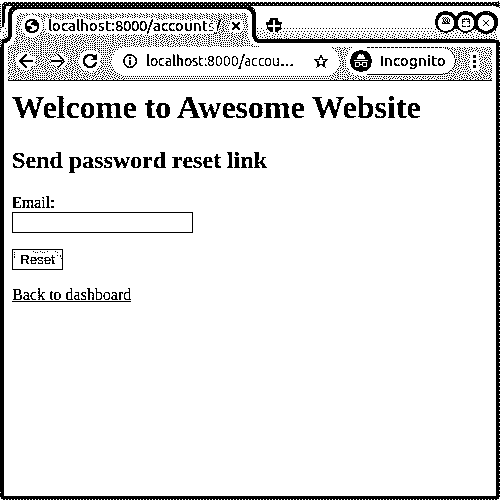

# Django 入门第 2 部分:Django 用户管理

> 原文：<https://realpython.com/django-user-management/>

*立即观看**本教程有真实 Python 团队创建的相关视频课程。和书面教程一起看，加深理解: [**搭建 Django 用户管理系统**](/courses/building-a-django-user-management-system/)

如果您已经完成了本系列的第一部分，那么您可能已经对自己的 Django 应用程序有了很多想法。在某些时候，您可能会决定用用户帐户来扩展它们。在这个循序渐进的教程中，您将学习如何使用 Django 用户管理并将其添加到您的程序中。

**本教程结束时，你将能够:**

*   创建一个用户可以**注册**、**登录**、**重置**和**自行更改密码**的应用程序
*   编辑默认 **Django 模板**负责**用户管理**
*   **向实际电子邮件地址发送密码重置电子邮件**
*   **使用**外部服务**认证**

我们开始吧！

**免费奖励:** [点击此处获取免费的 Django 学习资源指南(PDF)](#) ，该指南向您展示了构建 Python + Django web 应用程序时要避免的技巧和窍门以及常见的陷阱。

## 建立 Django 项目

本教程使用 Django 3.0 和 Python 3.6。它侧重于用户管理，所以您不会使用任何高级或响应性样式。它也不处理[组和权限](https://realpython.com/manage-users-in-django-admin/)，只处理创建和管理用户帐户。

在使用 Python 项目时，使用虚拟环境是一个好主意。这样，您可以始终确保`python`命令指向正确的 Python 版本，并且项目所需的模块具有正确的版本。要了解更多，请查看 [Python 虚拟环境:初级读本](https://realpython.com/python-virtual-environments-a-primer/)。

要在 Linux 和 macOS 上设置虚拟环境，请运行以下命令:

```py
$ python3 -m venv venv
$ source venv/bin/activate
(venv) $ python -m pip install --upgrade pip
(venv) $ python -m pip install django
```

要在 Windows 上激活虚拟环境，请运行以下命令:

```py
C:\> venv\Scripts\activate
```

现在环境已经准备好了，您可以创建一个新项目和一个应用程序来存储您的所有用户管理代码:

```py
(venv) $ django-admin startproject awesome_website
(venv) $ cd awesome_website
(venv) $ python manage.py startapp users
```

在本例中，您的应用程序名为`users`。请记住，您需要通过将它添加到`INSTALLED_APPS`来安装它:

```py
# awesome_website/settings.py

INSTALLED_APPS = [
 "users",    "django.contrib.admin",
    "django.contrib.auth",
    "django.contrib.contenttypes",
    "django.contrib.sessions",
    "django.contrib.messages",
    "django.contrib.staticfiles",
]
```

接下来，应用[迁移](https://realpython.com/django-migrations-a-primer/)并运行服务器:

```py
(venv) $ python manage.py migrate
(venv) $ python manage.py runserver
```

这将在数据库中创建所有与用户相关的模型，并在`http://localhost:8000/`启动您的应用程序。

**注意:**在本教程中，您将使用 Django 的内置用户模型。实际上，您更有可能创建一个定制的用户模型，扩展 Django 提供的功能。你可以在 [Django 的文档](https://docs.djangoproject.com/en/3.0/topics/auth/customizing/#using-a-custom-user-model-when-starting-a-project)中了解更多关于定制默认用户模型的信息。

对于这个设置，您还需要做一件事情。默认情况下，Django 强制使用强密码，使用户帐户不容易受到攻击。但是在本教程的学习过程中，您会经常更改密码，每次都要计算一个强密码会非常不方便。

您可以通过在“设置”中禁用密码验证器来解决此问题。只需将它们注释掉，留下一个空列表:

```py
# awesome_website/settings.py

AUTH_PASSWORD_VALIDATORS = [
    # {
    #     "NAME": "django.contrib.auth.password_validation.UserAttributeSimilarityValidator",
    # },
    # {
    #     "NAME": "django.contrib.auth.password_validation.MinimumLengthValidator",
    # },
    # {
    #     "NAME": "django.contrib.auth.password_validation.CommonPasswordValidator",
    # },
    # {
    #     "NAME": "django.contrib.auth.password_validation.NumericPasswordValidator",
    # },
]
```

现在 Django 将允许你设置类似于`password`甚至`pass`的密码，这使得你使用用户管理系统更加容易。*只要记住在你的实际应用中启用验证器就行了！*

对于本教程，访问管理面板也很有用，这样您就可以跟踪新创建的用户及其密码。继续创建一个管理员用户:

```py
(venv) $ python manage.py createsuperuser
Username (leave blank to use 'pawel'): admin
Email address: admin@example.com
Password:
Password (again):
Superuser created successfully.
```

禁用密码验证器后，您可以使用任何您喜欢的密码。

[*Remove ads*](/account/join/)

## 创建仪表板视图

大多数用户管理系统都有某种主页，通常被称为**仪表板**。在本节中，您将创建一个仪表板，但是因为它不是应用程序中的唯一页面，所以您还将创建一个基本模板来保持网站的外观一致。

您不会使用 Django 的任何高级模板特性，但是如果您需要复习模板语法，那么您可能想要查看 Django 的[模板文档](https://docs.djangoproject.com/en/3.0/topics/templates/)。

**注意:**本教程使用的所有模板都要放在`users/templates`目录下。如果教程提到一个模板文件`users/dashboard.html`，那么实际的文件路径是`users/templates/users/dashboard.html`。对于`base.html`，实际路径是`users/templates/base.html`，以此类推。

默认情况下,`users/templates`目录不存在，所以您必须先创建它。您的项目的[结构将如下所示:](https://realpython.com/python-application-layouts/#web-application-layouts)

```py
awesome_website/
│
├── awesome_website/
│   ├── __init__.py
│   ├── asgi.py
│   ├── settings.py
│   ├── urls.py
│   └── wsgi.py
│
├── users/
│   │
│   ├── migrations/
│   │   └── __init__.py
│   │
│   ├── templates/
│   │   │
│   │   ├── registration/  ← Templates used by Django user management
│   │   │
│   │   ├── users/  ← Other templates of your application
│   │   │
│   │   └── base.html  ← The base template of your application
│   │
│   ├── __init__.py
│   ├── admin.py
│   ├── apps.py
│   ├── models.py
│   ├── tests.py
│   └── views.py
│
├── db.sqlite3
└── manage.py
```

创建一个名为`base.html`的基础模板，内容如下:

```py
<!--users/templates/base.html-->

<h1>Welcome to Awesome Website</h1>



```

基本模板没有做太多事情。它显示消息`Welcome to Awesome Website`并定义一个名为`content`的块。这个块现在是空的，其他模板将使用它来包含自己的内容。

现在，您可以为仪表板创建一个模板。它应该被称为`users/dashboard.html`，看起来应该是这样的:

```py
<!--users/templates/users/dashboard.html-->




Hello, {{ user.username|default:'Guest' }}!

```

这并没有给基础模板增加很多东西。它只显示带有当前用户用户名的欢迎消息。如果用户没有登录，那么 Django 仍然会使用一个 [`AnonymousUser`](https://docs.djangoproject.com/en/3.0/ref/contrib/auth/#anonymoususer-object) 对象来设置`user` [变量](https://realpython.com/python-variables/)。匿名用户总是有一个空的用户名，所以仪表板会显示`Hello, Guest!`

为了让模板工作，您需要创建一个呈现它的视图和一个使用该视图的 URL:

```py
# users/views.py

from django.shortcuts import render

def dashboard(request):
    return render(request, "users/dashboard.html")
```

现在创建一个`users/urls.py`文件，并为`dashboard`视图添加一个路径:

```py
# users/urls.py

from django.conf.urls import url
from users.views import dashboard

urlpatterns = [
    url(r"^dashboard/", dashboard, name="dashboard"),
]
```

不要忘记将应用程序的 URL 添加到项目的 URL 中:

```py
# awesome_website/urls.py

from django.conf.urls import include, url
from django.contrib import admin

urlpatterns = [
 url(r"^", include("users.urls")),    url(r"^admin/", admin.site.urls),
]
```

您现在可以测试仪表板视图了。在浏览器中打开`http://localhost:8000/dashboard/`。您应该会看到与此类似的屏幕:

[](https://files.realpython.com/media/django-user-management-dashboard-guest.dac102d03416.png)

现在在`http://localhost:8000/admin/`打开管理面板，以管理员用户身份登录。您的仪表板现在看起来应该有点不同:

[](https://files.realpython.com/media/django-user-management-dashboard-admin.6a3fd3dc5d80.png)

正如您所看到的，您的新模板正确地显示了当前登录用户的名称。

[*Remove ads*](/account/join/)

## 与 Django 用户管理合作

一个完整的网站需要的不仅仅是一个仪表板。幸运的是，Django 有很多与用户管理相关的资源，可以处理几乎所有的事情，包括登录、注销、密码更改和密码重置。不过，模板不是这些资源的一部分。你必须自己创造它们。

首先将 Django 身份验证系统提供的 URL 添加到您的应用程序中:

```py
# users/urls.py

from django.conf.urls import include, url
from users.views import dashboard

urlpatterns = [
 url(r"^accounts/", include("django.contrib.auth.urls")),    url(r"^dashboard/", dashboard, name="dashboard"),
]
```

这将使您能够访问以下所有 URL:

*   **`accounts/login/`** 用于登录用户进入你的应用程序。用名字`"login"`来称呼它。

*   **`accounts/logout/`** 用于注销用户的应用程序。用名字`"logout"`来称呼它。

*   **`accounts/password_change/`** 用于修改密码。用名字`"password_change"`来称呼它。

*   **`accounts/password_change/done/`** 用于显示密码被更改的确认。用名字`"password_change_done"`来称呼它。

*   **`accounts/password_reset/`** 用于请求带有密码重置链接的邮件。用名字`"password_reset"`来称呼它。

*   **`accounts/password_reset/done/`** 用于显示确认密码重置邮件已发送。用名字`"password_reset_done"`来称呼它。

*   **`accounts/reset/<uidb64>/<token>/`** 用于使用密码重置链接设置新密码。用名字`"password_reset_confirm"`来称呼它。

*   **`accounts/reset/done/`** 用于显示密码被重置的确认。用名字`"password_reset_complete"`来称呼它。

这可能看起来有点让人不知所措，但是不要担心。在接下来的部分中，您将了解这些 URL 的作用以及如何将它们添加到您的应用程序中。

### 创建登录页面

对于登录页面，Django 将尝试使用一个名为`registration/login.html`的模板。继续创建它:

```py
<!--users/templates/registration/login.html-->




<h2>Login</h2>

<form method="post">
    
    {{ form.as_p }}
    <input type="submit" value="Login">
</form>

<a href="">Back to dashboard</a>

```

这将显示一个`Login`标题，后面是一个登录表单。Django 使用一个字典，也称为**上下文**，在呈现数据时将数据传递给模板。在这种情况下，名为`form`的变量已经包含在上下文中——您需要做的就是显示它。使用`{{ form.as_p }}`会将表单呈现为一系列 HTML 段落，使其看起来比仅仅使用`{{ form }}`更好。

``行插入一个[跨站请求伪造](https://www.squarefree.com/securitytips/web-developers.html#CSRF) (CSRF)令牌，这是每个 Django 表单都需要的。还有一个提交表单的按钮，在模板的末尾，有一个链接会把你的用户带回到仪表板。

您可以通过向基本模板添加一个小的 [CSS](https://realpython.com/html-css-python/#style-your-content-with-css) 脚本来进一步改善表单的外观:

```py
<!--users/templates/base.html-->

<style>  label,  input  {  display:  block;  }  span.helptext  {  display:  none;  }  </style> 
<h1>Welcome to Awesome Website</h1>



```

通过将上述代码添加到基本模板中，您将改进所有表单的外观，而不仅仅是仪表板中的表单。

您现在可以在浏览器中打开`http://localhost:8000/accounts/login/`，您应该会看到类似这样的内容:

[](https://files.realpython.com/media/django-user-management-login-page.730eff85758a.png)

使用您的管理员用户的凭证并按下*登录*。如果您看到错误屏幕，请不要惊慌:

[](https://files.realpython.com/media/django-user-management-missing-profile.2e9a858c4780.png)

根据错误消息，Django 找不到`accounts/profile/`的路径，这是您的用户成功登录后的默认目的地。与其创建一个新视图，不如在这里重用仪表板视图更有意义。

幸运的是，Django 使得更改默认重定向变得很容易。您需要做的只是在设置文件的末尾添加一行:

```py
# awesome_website/settings.py

LOGIN_REDIRECT_URL = "dashboard"
```

尝试再次登录。这一次，您应该被重定向到仪表板，没有任何错误。

[*Remove ads*](/account/join/)

### 创建注销页面

现在，您的用户可以登录，但他们也应该能够注销。这个过程更简单，因为没有表格，他们只需要点击一个链接。之后，Django 会将你的用户重定向到`accounts/logout`，并尝试使用一个名为`registration/logged_out.html`的模板。

然而，就像以前一样，您可以更改重定向。例如，将用户重定向回仪表板是有意义的。为此，您需要在设置文件的末尾添加一行:

```py
# awesome_website/settings.py

LOGOUT_REDIRECT_URL = "dashboard"
```

现在登录和注销都可以工作了，向您的仪表板添加适当的链接是一个好主意:

```py
<!--users/templates/users/dashboard.html-->




Hello, {{ user.username|default:'Guest' }}!

<div>
  <a href="">Logout</a>  <a href="">Login</a>  </div> 
```

如果用户已经登录，那么`user.is_authenticated`将返回`True`，仪表板将显示`Logout`链接。如果用户没有登录，那么`user`变量将被设置为`AnonymousUser`，并且`user.is_authenticated`将返回`False`。在这种情况下，将显示`Login`链接。

对于未经身份验证的用户，更新后的仪表板应该如下所示:

[](https://files.realpython.com/media/django-user-management-dashboard-login.a93995d72f55.png)

如果您登录，您应该会看到以下屏幕:

[](https://files.realpython.com/media/django-user-management-dashboard-logout.27b06b3e14df.png)

恭喜你！您刚刚完成了用户管理系统最重要的部分:让用户登录和退出应用程序。但是你前面还有几步路。

### 更改密码

在某些时候，您的用户可能想要更改他们的密码。您可以在您的应用程序中添加一个密码更改表单，而不是让他们要求管理员为他们做这件事。Django 需要两个模板来完成这项工作:

1.  **`registration/password_change_form.html`** 显示密码修改表单

2.  **`registration/password_change_done.html`** 显示确认密码修改成功

从`registration/password_change_form.html`开始:

```py
<!--users/templates/registration/password_change_form.html-->




<h2>Change password</h2>

<form method="post">
    
    {{ form.as_p }}
    <input type="submit" value="Change">
</form>

<a href="">Back to dashboard</a>

```

该模板看起来与您之前创建的登录模板几乎相同。但是这次 Django 会在这里放一个密码更改表单，而不是登录表单，所以浏览器会有不同的显示。

您需要创建的另一个模板是`registration/password_change_done.html`:

```py
<!--users/templates/registration/password_change_done.html-->




<h2>Password changed</h2>

<a href="">Back to dashboard</a>

```

这将向您的用户保证密码更改成功，并让他们返回到仪表板。

仪表板是一个完美的地方，可以包含一个到您新创建的密码更改表单的链接。您只需要确保它只显示给登录的用户:

```py
<!--users/templates/users/dashboard.html-->




Hello, {{ user.username|default:'Guest' }}!

<div>
    
        <a href="">Logout</a>
 <a href="">Change password</a>    
        <a href="">Login</a>
    
</div>

```

如果您在浏览器中点击该链接，您应该会看到以下表单:

[](https://files.realpython.com/media/django-user-management-change-password-form.42bb36b761f7.png)

继续测试它。更改密码，注销，然后再次登录。您也可以尝试通过直接在浏览器中访问 URL `http://localhost:8000/accounts/password_change/`来访问密码更改页面，而无需登录。Django 足够聪明，可以检测到你应该先登录，并且会自动将你重定向到登录页面。

[*Remove ads*](/account/join/)

### 发送密码重置链接

我们每个人都会犯错误，时不时会有人忘记密码。您的 Django 用户管理系统也应该处理这种情况。这个功能有点复杂，因为为了提供密码重置链接，您的应用程序必须发送电子邮件。

别担心，你不必配置自己的电子邮件服务器。对于本教程，您只需要一个本地测试服务器来确认电子邮件已发送。打开您的终端并运行以下命令:

```py
(venv) $ python -m smtpd -n -c DebuggingServer localhost:1025
```

这将在`http://localhost:1025`启动一个简单的 SMTP 服务器。它不会发送任何电子邮件到实际的电子邮件地址。相反，它会在命令行中显示消息的内容。

你现在需要做的就是让姜戈知道你要用它。在设置文件的末尾添加这两行:

```py
# awesome_website/settings.py

EMAIL_HOST = "localhost"
EMAIL_PORT = 1025
```

Django 需要两个模板来发送密码重置链接:

1.  **`registration/password_reset_form.html`** 显示用于请求重设密码邮件的表单

2.  **`registration/password_reset_done.html`** 显示确认密码重置邮件已发送

它们与您之前创建的密码更改模板非常相似。从表格开始:

```py
<!--users/templates/registration/password_reset_form.html-->




<h2>Send password reset link</h2>

<form method="post">
    
    {{ form.as_p }}
    <input type="submit" value="Reset">
</form>

<a href="">Back to dashboard</a>

```

现在添加一个确认模板:

```py
<!--users/templates/registration/password_reset_done.html-->




<h2>Password reset done</h2>

<a href="">Back to login</a>

```

在登录页面上包含密码重置表单的链接也是一个好主意:

```py
<!--users/templates/registration/login.html-->




<h2>Login</h2>

<form method="post">
    
    {{ form.as_p }}
    <input type="submit" value="Login">
</form>

<a href="">Back to dashboard</a>
<a href="">Reset password</a> 
```

新创建的密码重置表单应该如下所示:

[](https://files.realpython.com/media/django-user-management-password-reset-form.bef6877e698e.png)

键入管理员的电子邮件地址(`admin@example.com`)，然后按*重置*。您应该会在运行电子邮件服务器的终端中看到以下消息:

```py
---------- MESSAGE FOLLOWS ----------
b'Content-Type: text/plain; charset="utf-8"'
b'MIME-Version: 1.0'
b'Content-Transfer-Encoding: 7bit'
b'Subject: Password reset on localhost:8000'
b'From: webmaster@localhost'
b'To: admin@example.com'
b'Date: Wed, 22 Apr 2020 20:32:39 -0000'
b'Message-ID: <20200422203239.28625.15187@pawel-laptop>'
b'X-Peer: 127.0.0.1'
b''
b''
b"You're receiving this email because you requested a password reset for your
user account at localhost:8000."
b''
b'Please go to the following page and choose a new password:'
b''
b'http://localhost:8000/accounts/reset/MQ/5fv-f18a25af38f3550a8ca5/'
b''
b"Your username, in case you've forgotten: admin"
b''
b'Thanks for using our site!'
b''
b'The localhost:8000 team'
b''
------------ END MESSAGE ------------
```

这是将发送给您的管理员的电子邮件的内容。它包含发送它的应用程序的信息以及一个密码重置链接。

[*Remove ads*](/account/join/)

### 重置密码

Django 发送的每封密码重置邮件都包含一个可用于重置密码的链接。为了正确处理这个链接，Django 还需要两个模板:

1.  **`registration/password_reset_confirm.html`** 显示实际密码重置表单

2.  **`registration/password_reset_complete.html`** 显示确认密码被重置

这些看起来与密码更改模板非常相似。从表格开始:

```py
<!--users/templates/registration/password_reset_confirm.html-->




<h2>Confirm password reset</h2>

<form method="post">
    
    {{ form.as_p }}
    <input type="submit" value="Confirm">
</form>

```

和以前一样，Django 会自动提供一个表单，但这次是一个密码重置表单。您还需要添加一个确认模板:

```py
<!--users/templates/registration/password_reset_complete.html-->




<h2>Password reset complete</h2>

<a href="">Back to login</a>

```

现在，如果您点击其中一封电子邮件中的密码重置链接，您应该会在浏览器中看到如下表单:

[](https://files.realpython.com/media/django-user-management-password-reset-confirm.66570b2a4247.png)

你现在可以检查它是否工作。在表单中插入一个新密码，点击*确认*，退出，并使用新密码登录。

### 更改电子邮件模板

您可以像更改任何其他用户管理相关模板一样更改 Django 电子邮件的默认模板:

*   **`registration/password_reset_email.html`** 决定了邮件的正文
*   **`registration/password_reset_subject.txt`** 决定了邮件的主题

Django 在电子邮件模板上下文中为[提供了许多变量](https://docs.djangoproject.com/en/3.0/topics/auth/default/#django.contrib.auth.views.PasswordResetView)，您可以使用它们来编写自己的消息:

```py
<!--users/templates/registration/password_reset_email.html-->

Someone asked for password reset for email {{ email }}.
Follow the link below:
{{ protocol}}://{{ domain }}
```

你也可以把话题换成更简短的，比如`Reset password`。如果您实施这些更改并再次发送密码重置电子邮件，您应该会看到以下消息:

```py
---------- MESSAGE FOLLOWS ----------
b'Content-Type: text/plain; charset="utf-8"'
b'MIME-Version: 1.0'
b'Content-Transfer-Encoding: 7bit'
b'Subject: Reset password'
b'From: webmaster@localhost'
b'To: admin@example.com'
b'Date: Wed, 22 Apr 2020 20:36:36 -0000'
b'Message-ID: <20200422203636.28625.36970@pawel-laptop>'
b'X-Peer: 127.0.0.1'
b''
b'Someone asked for password reset for email admin@example.com.'
b'Follow the link below:'
b'http://localhost:8000/accounts/reset/MQ/5fv-f18a25af38f3550a8ca5/'
------------ END MESSAGE ------------
```

如你所见，邮件的主题和内容都变了。

## 注册新用户

您的应用程序现在可以处理所有与 Django 用户管理相关的 URL。但是有一个功能还没有发挥作用。

您可能已经注意到，没有创建新用户的选项。不幸的是，Django 不提供开箱即用的用户注册。但是，您可以自己添加它。

Django 提供了许多可以在项目中使用的表单。其中一个是 [`UserCreationForm`](https://docs.djangoproject.com/en/3.0/topics/auth/default/#django.contrib.auth.forms.UserCreationForm) 。它包含创建新用户所需的所有字段。但是，它不包括电子邮件字段。

在许多应用程序中，这可能不是问题，但是您已经实现了密码重置功能。您的用户需要配置电子邮件地址，否则他们将无法接收密码重置电子邮件。

要解决这个问题，您需要添加自己的用户创建表单。不要担心——您几乎可以重用整个`UserCreationForm`。你只需要添加`email`字段。

创建一个名为`users/forms.py`的新 Python 文件，并在其中添加一个定制表单:

```py
# users/forms.py

from django.contrib.auth.forms import UserCreationForm

class CustomUserCreationForm(UserCreationForm):
    class Meta(UserCreationForm.Meta):
        fields = UserCreationForm.Meta.fields + ("email",)
```

如你所见，你的`CustomUserCreationForm`扩展了 Django 的`UserCreationForm`。内部类`Meta`保存了关于表单的附加信息，并且在本例中扩展了`UserCreationForm.Meta`，因此 Django 表单中的几乎所有内容都将被重用。

主要的区别是`fields`属性，它决定了表单中包含的字段。您的定制表单将使用来自`UserCreationForm`的所有字段，并将添加`email`字段。

现在表单已经准备好了，创建一个名为`register`的新视图:

```py
 1# users/views.py
 2
 3from django.contrib.auth import login
 4from django.shortcuts import redirect, render
 5from django.urls import reverse
 6from users.forms import CustomUserCreationForm
 7
 8def dashboard(request):
 9    return render(request, "users/dashboard.html")
10
11def register(request):
12    if request.method == "GET":
13        return render(
14            request, "users/register.html",
15            {"form": CustomUserCreationForm}
16        )
17    elif request.method == "POST":
18        form = CustomUserCreationForm(request.POST)
19        if form.is_valid():
20            user = form.save()
21            login(request, user)
22            return redirect(reverse("dashboard"))
```

下面是对`register()`视图的细分:

*   **第 12 到 16 行:**如果视图是由浏览器显示的，那么它将被一个`GET`方法访问。在这种情况下，将呈现一个名为`users/register.html`的模板。`.render()`的最后一个参数是一个上下文，在这种情况下，它包含您的定制用户创建表单。

*   **第 17 到 18 行:**如果表单被提交，那么视图将被一个`POST`方法访问。在这种情况下，Django 将尝试创建一个用户。使用提交给表单的值创建一个新的`CustomUserCreationForm`，它包含在`request.POST`对象中。

*   **第 19 到 22 行:**如果表单有效，那么在**第 20 行**使用`form.save()`创建一个新用户。然后用户使用`login()`登录到**行 21** 上。最后， **line 22** 将用户重定向到仪表板。

模板本身应该是这样的:

```py
<!--users/templates/users/register.html-->




<h2>Register</h2>

<form method="post">
    
    {{form}}
    <input type="submit" value="Register">
</form>

<a href="">Back to login</a>

```

这与前面的模板非常相似。就像以前一样，它从上下文中获取表单并进行渲染。唯一的区别是，这次您必须自己将表单添加到上下文中，而不是让 Django 来做。

记得为注册视图添加一个 URL:

```py
# users/urls.py

from django.conf.urls import include, url
from users.views import dashboard, register 
urlpatterns = [
    url(r"^accounts/", include("django.contrib.auth.urls")),
    url(r"^dashboard/", dashboard, name="dashboard"),
 url(r"^register/", register, name="register"), ]
```

在登录页面上添加注册表单的链接也是一个好主意:

```py
<!--users/templates/registration/login.html-->




<h2>Login</h2>

<form method="post">
    
    {{ form.as_p }}
    <input type="submit" value="Login">
</form>

<a href="">Back to dashboard</a>
<a href="">Reset password</a>
<a href="">Register</a> 
```

新创建的表单应该如下所示:

[](https://files.realpython.com/media/django-user-management-register-form.c8995946c109.png)

请记住，这只是注册表的一个例子。在现实世界中，您可能会在有人创建用户帐户后发送带有确认链接的电子邮件，如果有人试图注册一个已经存在的帐户，您也会显示适当的错误消息。

[*Remove ads*](/account/join/)

## 向外界发送电子邮件

目前，您的应用程序可以向本地 SMTP 服务器发送电子邮件，因此您可以在命令行中阅读它们。将电子邮件发送到实际的电子邮件地址会有用得多。一种方法是使用**射枪**。

对于这一步，你需要一个 [Mailgun 账户](https://www.mailgun.com/)。基本版是免费的，可以让你从一个不太知名的领域发送电子邮件，但是它可以满足本教程的目的。

创建帐户后，转到仪表板页面并向下滚动，直到到达“发送域”在那里你会找到你的沙盒域:

[](https://files.realpython.com/media/django-user-management-mailgun-dashboard.e28973f0b9c2.png)

单击该域。您将被重定向到一个页面，在那里您可以选择发送电子邮件的方式。选择 *SMTP* :

[](https://files.realpython.com/media/django-user-management-mailgun-smtp.441db53485af.png)

向下滚动，直到找到您帐户的凭据:

[](https://files.realpython.com/media/django-user-management-mailgun-credentials.9deacf368590.png)

您应该找到以下值:

*   SMTP 主机名
*   港口
*   用户名
*   默认密码

您需要做的就是将这些值添加到设置文件中。请记住，永远不要在代码中直接包含任何凭据。相反，将它们作为环境变量添加，并在 Python 中读取它们的值。

在 Linux 和 macOS 上，您可以像这样在终端中添加一个环境变量:

```py
(venv) $ export EMAIL_HOST_USER=your_email_host_user
```

在 Windows 上，您可以在命令提示符下运行此命令:

```py
C:\> set EMAIL_HOST_USER=your_email_host_user
```

对`EMAIL_HOST_PASSWORD`重复相同的过程，记住在运行 Django 服务器的同一个终端窗口中导出变量。添加两个变量后，更新设置:

```py
# awesome_website/settings.py

EMAIL_HOST = "smtp.mailgun.org"
EMAIL_PORT = 587
EMAIL_HOST_USER = os.environ.get("EMAIL_HOST_USER")
EMAIL_HOST_PASSWORD = os.environ.get("EMAIL_HOST_PASSWORD")
EMAIL_USE_TLS = True
```

对于所有沙盒域，`EMAIL_HOST`和`EMAIL_PORT`的值应该是相同的，但是你必须使用自己的用户名和密码。还有一个额外的值叫做`EMAIL_USE_TLS`，需要设置为`True`。

要检查这是否有效，你必须创建一个新用户，并使用你自己的电子邮件地址。转到`http://localhost:8000/admin/`并以管理员用户身份登录。转到用户并点击*添加用户*。选择任意用户名和密码，点击*保存并继续编辑*。然后在电子邮件地址字段中插入您用作邮箱帐户的电子邮件地址，并保存该用户。

创建用户后，导航至`http://localhost:8000/accounts/password_reset/`。输入你的电子邮件地址并按下*发送*。发送电子邮件的过程将比使用本地服务器花费更多的时间。几分钟后，密码重置电子邮件应该会到达您的收件箱。它也可能在你的垃圾邮件文件夹里，所以别忘了也去那里看看。

沙盒域将只与您用来创建 Mailgun 帐户的电子邮件地址一起工作。若要向其他收件人发送电子邮件，您必须添加一个自定义域。

[*Remove ads*](/account/join/)

## 用 GitHub 登录

许多现代网站提供了使用社交媒体帐户进行身份验证的选项。一个这样的例子是[谷歌登录](https://realpython.com/flask-google-login/)，但是在本教程中你将学习如何与 [GitHub](https://realpython.com/python-git-github-intro/) 集成。

幸运的是，有一个非常有用的 Python 模块来完成这项任务。叫`social-auth-app-django`。本教程只展示了模块的基本配置，但是你可以从[的文档](https://github.com/python-social-auth/social-app-django)中了解更多，尤其是关于 [Django 配置](https://python-social-auth.readthedocs.io/en/latest/configuration/django.html)的部分。

### 设置社交认证

从安装模块开始:

```py
(venv) $ python -m pip install social-auth-app-django
```

像任何其他 Django 应用程序一样，您必须将它添加到`INSTALLED_APPS`中。注意，在这种情况下，Django 应用程序的名称不同于 Python 模块的名称:

```py
# awesome_website/settings.py

INSTALLED_APPS = [
    "users",
 "social_django",    "django.contrib.admin",
    "django.contrib.auth",
    "django.contrib.contenttypes",
    "django.contrib.sessions",
    "django.contrib.messages",
    "django.contrib.staticfiles",
]
```

接下来，向`awesome_website/settings.py`添加两个上下文处理器:

```py
# awesome_website/settings.py

TEMPLATES = [
    {
        "BACKEND": "django.template.backends.django.DjangoTemplates",
        "DIRS": [],
        "APP_DIRS": True,
        "OPTIONS": {
            "context_processors": [
                "django.template.context_processors.debug",
                "django.template.context_processors.request",
                "django.contrib.auth.context_processors.auth",
                "django.contrib.messages.context_processors.messages",
 "social_django.context_processors.backends", "social_django.context_processors.login_redirect",            ],
        },
    },
]
```

完成后，应用迁移:

```py
(venv) $ python manage.py migrate
```

您还需要在应用程序中包含社交认证 URL，就像您对 Django 提供的 URL 所做的那样:

```py
# users/urls.py

from django.conf.urls import include, url
from users.views import dashboard, register

urlpatterns = [
    url(r"^accounts/", include("django.contrib.auth.urls")),
    url(r"^dashboard/", dashboard, name="dashboard"),
 url(r"^oauth/", include("social_django.urls")),    url(r"^register/", register, name="register"),
]
```

所有这些都是 Django 的一般配置。要在 GitHub 中使用社交认证，必须添加一个专用的认证后端。

默认情况下，Django 设置不指定认证后端，Django 使用的默认后端是`django.contrib.auth.backends.ModelBackend`。因此，要使用社交认证，您必须在设置中创建新值:

```py
# awesome_website/settings.py

AUTHENTICATION_BACKENDS = [
    "django.contrib.auth.backends.ModelBackend",
    "social_core.backends.github.GithubOAuth2",
]
```

列表中的第一个后端是 Django 使用的默认后端。如果这里不包含它，那么 Django 将无法登录标准用户。第二个后端用于 GitHub 登录。

最后要做的是在您的登录页面上添加一个 GitHub 登录链接:

```py
<!--users/templates/registration/login.html-->




<h2>Login</h2>

<form method="post">
    
    {{ form.as_p }}
    <input type="submit" value="Login">
</form>

<a href="">Back to dashboard</a>
<a href="">Login with GitHub</a> <a href="">Reset password</a>
<a href="">Register</a>

```

您可能会注意到新的 URL 使用了名称空间`social`。名称空间是 Django 在更复杂的项目中组织 URL 的方式。

使用唯一的名称空间可以确保您的应用程序的 URL 和其他应用程序的 URL 之间没有冲突。社交认证应用程序使用名称空间`social`，因此您想要使用的每个 URL 都必须以`social:`开头。

[*Remove ads*](/account/join/)

### 创建 GitHub 应用程序

要在 Django 用户管理中使用 GitHub 认证，首先必须创建一个应用程序。登录您的 GitHub 帐户，进入 [GitHub 的页面注册一个新的 OAuth 应用程序](https://github.com/settings/applications/new)，并填写表格:

[](https://files.realpython.com/media/django-user-management-new-github-app.9d36eb700680.png)

最重要的部分是**授权回调 URL** 。它必须指向你的应用程序。

注册应用程序后，您将被重定向到一个包含凭据的页面:

[](https://files.realpython.com/media/django-user-management-github-app-credentials.f3dfd258c90c.png)

将**客户端 ID** 和**客户端密码**的值添加到设置中，方法与添加 Mailgun 电子邮件凭证相同:

```py
# awesome_website/settings.py

SOCIAL_AUTH_GITHUB_KEY = os.environ.get("SOCIAL_AUTH_GITHUB_KEY")
SOCIAL_AUTH_GITHUB_SECRET = os.environ.get("SOCIAL_AUTH_GITHUB_SECRET")
```

您现在可以检查这是否有效。转到您的应用程序的登录页面，选择使用 GitHub 登录的选项。假设您在上一步创建应用程序后已经注销，您应该会被重定向到 GitHub 的登录页面:

[](https://files.realpython.com/media/django-user-management-github-signin.a45e3df109b7.png)

下一步将要求您授权 GitHub 应用程序:

[](https://files.realpython.com/media/django-user-management-github-auth.17d8589a20f4.png)

如果您确认，那么您将被重定向回您的应用程序。现在，您可以在管理面板中找到一个新用户:

[](https://files.realpython.com/media/django-user-management-github-user.515d3ff7bbb5.png)

新创建的用户与您的 GitHub handle 拥有相同的用户名，并且没有密码。

### 选择认证后端

上面的例子有一个问题:通过启用 GitHub 登录，您意外地破坏了正常的用户创建过程。

这是因为 Django 以前只有一个认证后端可供选择，现在有两个了。Django 不知道在创建新用户时使用哪一个，所以您必须帮助它决定。为此，请在您的注册视图中替换行`user = form.save()`:

```py
# users/views.py

from django.contrib.auth import login
from django.shortcuts import redirect, render
from django.urls import reverse
from users.forms import CustomUserCreationForm

def dashboard(request):
    return render(request, "users/dashboard.html")

def register(request):
    if request.method == "GET":
        return render(
            request, "users/register.html", {"form": CustomUserCreationForm}
        )
    elif request.method == "POST":
        form = CustomUserCreationForm(request.POST)
        if form.is_valid():
 user = form.save(commit=False) user.backend = "django.contrib.auth.backends.ModelBackend" user.save()            login(request, user)
            return redirect(reverse("dashboard"))
```

像以前一样，从表单中创建了一个用户，但是由于`commit=False`，这次没有立即保存。在下一行中，一个后端与用户相关联，然后用户才被保存到数据库中。这样，您可以在同一个 Django 用户管理系统中使用普通用户创建和社交媒体认证。

[*Remove ads*](/account/join/)

## 结论

Django 是一个通用的框架，它尽最大努力帮助您完成每一项可能的任务，包括用户管理。它提供了许多现成的资源，但有时您需要对它们进行一点扩展。

**在本教程中，您已经学会了如何:**

*   用全套的**用户管理**特性扩展您的 Django 应用程序
*   调整默认的 **Django 模板**以更好地满足您的需求
*   使用邮件枪**发送密码重置邮件**
*   添加一个选项**用 GitHub** 登录

这应该为你自己的惊人想法提供了一个很好的起点。如果你觉得少了什么，或者有任何问题，请不要犹豫，告诉我！

[« Get Started With Django Part 1: Build a Portfolio App](https://realpython.com/get-started-with-django-1/)[Get Started With Django Part 2: Django User Management](#)[Get Started With Django Part 3: Django View Authorization »](https://realpython.com/django-view-authorization/)

*立即观看**本教程有真实 Python 团队创建的相关视频课程。和书面教程一起看，加深理解: [**搭建 Django 用户管理系统**](/courses/building-a-django-user-management-system/)***********