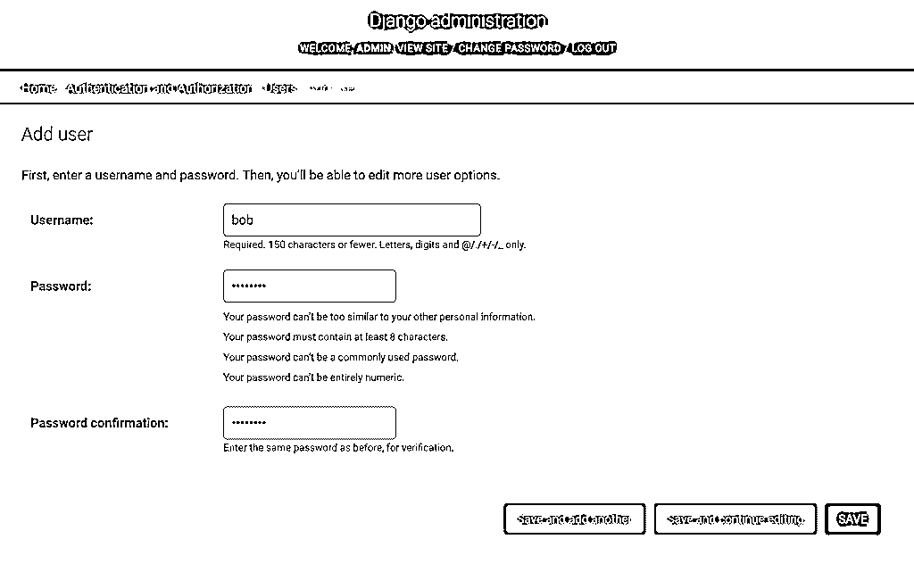

# Django 入门第 3 部分:Django 视图授权

> 原文：<https://realpython.com/django-view-authorization/>

*立即观看**本教程有真实 Python 团队创建的相关视频课程。配合文字教程一起看，加深理解: [**Django 查看授权:限制访问**](/courses/django-view-authorization/)

在本系列的第 1 部分中，您学习了 Django 模型和视图的基础知识。在[第二部分](https://realpython.com/django-user-management/)中，你学习了用户管理。在本教程中，您将看到如何结合这些概念来实现 Django **视图授权**，并基于用户的角色限制用户在您的视图中可以看到什么和做什么。

允许用户登录你的网站解决了两个问题:**认证**和**授权**。认证是验证用户身份的行为，确认他们是他们所说的那个人。授权是决定是否允许用户执行某个操作。这两个概念是相辅相成的:如果你的网站上的某个页面只允许登录的用户访问，那么用户在被授权查看该页面之前必须进行身份验证。

Django 提供了认证和授权工具。Django 视图授权通常是由**装饰者**完成的。本教程将向您展示如何使用这些视图装饰器来强制对 Django 站点中的页面进行授权查看。

**本教程结束时，你将知道如何:**

*   使用 **`HttpRequest`** 和 **`HttpRequest.user`** 对象
*   **认证**和**授权**用户
*   区分**普通**、**员工**和**管理员**用户
*   用 **`@login_required`** 装饰器保护一个视图
*   使用 **`@user_passes_test`** 装饰器将一个视图限制为不同的角色
*   使用 Django **消息框架**通知您的用户

## 开始使用

为了更好地理解授权，您需要一个项目来进行实验。本教程中的代码与[第 1 部分](https://realpython.com/get-started-with-django-1/)和[第 2 部分](https://realpython.com/django-user-management/)中显示的非常相似。您可以通过从下面的链接下载示例代码来继续学习:

**获取源代码:** [单击此处获取源代码，您将在本教程中使用](https://realpython.com/bonus/django-view-authorization/)了解 Django 视图授权。

所有演示代码都是用 Python 3.8 和 Django 3.0.7 测试的。它应该与其他版本一起工作，但可能会有细微的差异。

[*Remove ads*](/account/join/)

### 创建项目

首先，您需要[创建一个新的 Django 项目](https://realpython.com/django-setup/)。因为 Django 不是标准库的一部分，所以使用[虚拟环境](https://realpython.com/python-virtual-environments-a-primer/)被认为是最佳实践。一旦有了虚拟环境，您需要采取以下步骤:

1.  安装 Django。
2.  创建新项目。
3.  在项目中创建一个应用程序。
4.  将模板目录添加到项目中。
5.  创建站点超级用户。

要完成所有这些，请使用以下命令:

```py
$ python -m pip install django==3.0.7
$ django-admin startproject Blog
$ cd Blog
$ python manage.py startapp core
$ mkdir templates
$ python manage.py migrate
$ python manage.py createsuperuser
Username: superuser
Email address: superuser@example.com
Password:
Password (again):
```

您现在有了一个`Blog`项目，但是您仍然需要告诉 Django 您创建的应用程序和您为模板添加的新目录。你可以通过修改`Blog/settings.py`文件来做到这一点，首先通过改变`INSTALLED_APPS`:

```py
INSTALLED_APPS = [
    "django.contrib.admin",
    "django.contrib.auth",
    "django.contrib.contenttypes",
    "django.contrib.sessions",
    "django.contrib.messages",
    "django.contrib.staticfiles",
 "core", ]
```

突出显示的行表示将`core`应用程序添加到已安装应用程序列表中。一旦添加了应用程序，您需要修改`TEMPLATES`声明:

```py
TEMPLATES = [
    {
        "BACKEND": "django.template.backends.django.DjangoTemplates",
 "DIRS": [os.path.join(BASE_DIR, "templates")],        "APP_DIRS": True,
        "OPTIONS": {
            "context_processors": [
                "django.template.context_processors.debug",
                "django.template.context_processors.request",
                "django.contrib.auth.context_processors.auth",
                "django.contrib.messages.context_processors.messages",
            ],
        },
    },
]
```

突出显示的行表示您需要进行的更改。它会修改`DIRS`列表以包含您的`templates`文件夹。这告诉 Django 在哪里寻找你的模板。

**注意:** Django 3.1 已经从使用`os`库转移到了 [`pathlib`](https://realpython.com/python-pathlib/) ，默认不再导入`os`。如果您使用的是 Django 3.1，那么您需要在`TEMPLATES`声明上面添加`import os`，或者将`"DIRS"`条目转换为使用`pathlib`。

您将使用的示例站点是一个基本的博客应用程序。`core`应用程序需要一个`models.py`文件来包含在数据库中存储博客内容的模型。编辑`core/models.py`并添加以下内容:

```py
from django.db import models

class Blog(models.Model):
    title = models.CharField(max_length=50)
    content = models.TextField()
```

现在来看一些网页。创建两个视图，一个用于列出所有博客，另一个用于查看博客。您的视图代码放在`core/views.py`中:

```py
from django.http import HttpResponse
from django.shortcuts import render, get_object_or_404
from core.models import Blog

def listing(request):
    data = {
        "blogs": Blog.objects.all(),
    }

    return render(request, "listing.html", data)

def view_blog(request, blog_id):
    blog = get_object_or_404(Blog, id=blog_id)
    data = {
        "blog": blog,
    }

    return render(request, "view_blog.html", data)
```

`listing()`视图执行一个查询，寻找所有的`Blog`对象，并将其传递给 [`render()`](https://docs.djangoproject.com/en/3.1/topics/http/shortcuts/#render) 快捷函数。`render()`接受为视图提供上下文的`request`对象、要呈现的模板名称(`listing.html`)和包含`Blog`对象查询集的`data`对象。

`view_blog()`视图将一个`blog_id`作为参数，并使用它来查找相应的`Blog`对象。这个对象通过`render()`快捷方式作为上下文传递给`view_blog.html`模板。

这两个视图有三个模板文件。第一个是包含通用 HTML 元素的基本模板。另外两个[扩展了](https://docs.djangoproject.com/en/3.1/ref/templates/builtins/#extends)这个基础，并且对应于视图本身。如下创建`templates/base.html`:

```py
<html>
<body>




</body>
</html>
```

然后这个文件被视图使用的模板扩展。`listing()`视图使用了一个名为`templates/listing.html`的文件，如下所示:

```py



<h1>Blog Listing</h1>
<ul>

  <li> <a href="">{{blog.title}}</a> </li>

</ul>

```

注意它是如何使用视图发送的`blogs`查询集的。查询集是循环的，打印出找到的每个`Blog`对象的`title`属性。最后，要查看一个真实的博客，创建`templates/view_blog.html`:

```py



<h1>{{blog.title}}</h1>

{{blog.content|safe}}

<hr/>

<a href="">All Blogs</a>

```

`templates/listing.html`和`templates/view_blog.html`文件使用``标签来查找与`listing()`和`view_blog()`视图相关的 URL。这些 URL 需要在`Blog/urls.py`中注册。按如下方式修改该文件:

```py
from django.contrib import admin
from django.urls import path, include from core import views as core_views 
urlpatterns = [
    path("admin/", admin.site.urls),
 path("", core_views.listing, name="listing"), path("view_blog/<int:blog_id>/", core_views.view_blog, name="view_blog"), ]
```

默认的`urls.py`文件没有导入`include()`，所以请注意第二行的变化。其余突出显示的行导入`core/views.py`，并为`listing()`和`view_blog()`视图函数创建 URL 模式。

到目前为止，你还没有办法创造内容。Django admin 提供了一种快速修改模型对象的方法。修改`core/admin.py`来注册`Blog`对象:

```py
from django.contrib import admin
from core.models import Blog

@admin.register(Blog)
class BlogAdmin(admin.ModelAdmin):
    pass
```

一切都已就绪。使用以下 Django 管理命令来创建和迁移数据库模型，并运行服务器:

```py
$ python manage.py makemigrations core
$ python manage.py migrate
$ python manage.py runserver
```

最后一个命令运行 Django 开发服务器。当它运行时，您可以使用浏览器访问`http://127.0.0.1:8000/`。您应该看到您的`listing`页面，但是没有任何数据。

[*Remove ads*](/account/join/)

### 添加一些数据

因为您还没有创建任何东西，所以页面将只显示标题。在`http://127.0.0.1:8000/admin/`访问 Django 管理员，使用您创建的超级用户证书登录。

一旦进入，您可以点击`Blogs`对象旁边的*添加*链接来创建一些测试数据。或者，示例代码有一个包含示例数据的 fixture。您可以使用`loaddata`管理命令加载示例数据:

```py
$ python manage.py loaddata core.json
```

fixture 文件包含两个示例博客条目。如果你访问该网站的主页，那么它现在应该显示一些内容。

## 在视图中检测登录用户及其角色

每个 Django 视图至少有一个参数，一个 [`HttpRequest`](https://docs.djangoproject.com/en/3.0/ref/request-response/#httprequest-objects) 。该请求包含有关用户及其正在访问的页面的状态信息。以下是请求中的一些关键信息:

| 属性 | 描述 | 例子 |
| --- | --- | --- |
| `scheme` | URL 方案 | `"http"`或`"https"` |
| `path` | URL 的路径部分 | `"/music/bands/"` |
| `method` | 使用的 HTTP 方法 | `"GET"`或`"POST"` |
| `GET` | 查询字符串参数 | `<QueryDict: {'band_id':['123']}>` |
| `POST` | HTTP 帖子中的字段 | `<QueryDict: {'name':['Bob']}>` |
| `user` | 描述用户的对象 |  |

Django 有能力通过一个叫做**中间件**的插件机制运行每个请求的代码。 [`AuthenticationMiddleware`](https://docs.djangoproject.com/en/3.0/ref/middleware/#django.contrib.auth.middleware.AuthenticationMiddleware) 插件将`user`属性添加到`HttpRequest`对象中。当您创建一个新项目时，这个中间件是默认启用的，因此您不需要做任何特殊的事情来利用它。如果您对中间件感兴趣，那么文章[构建 Django 中间件](https://www.valentinog.com/blog/django-middleware/)将介绍相关概念。

要查看一些正在运行的`HttpRequest`属性，向`core/views.py`添加以下视图:

```py
def see_request(request):
    text = f"""
 Some attributes of the HttpRequest object:

 scheme: {request.scheme} path: {request.path} method: {request.method} GET: {request.GET} user: {request.user} """

    return HttpResponse(text, content_type="text/plain")
```

现在将新视图添加到`Blog/urls.py`:

```py
from django.contrib import admin
from django.urls import path, include
from core import views as core_views

urlpatterns = [
    path("admin/", admin.site.urls),
    path("", core_views.listing, name="listing"),
    path("view_blog/<int:blog_id>/", core_views.view_blog, name="view_blog"),
 path("see_request/", core_views.see_request), ]
```

准备就绪后，您可以访问`http://127.0.0.1:8000/see_request/`并查看一些请求参数。如果您在 URL 的末尾添加一个查询字符串，那么您也可以看到`GET`是如何工作的。例如，`http://127.0.0.1:8000/see_request/?breakfast=spam&lunch=spam`会产生以下结果:

```py
Some attributes of the HttpRequest object:

scheme: http
path:   /see_request/
method: GET
GET:    <QueryDict: {"breakfast": ["spam"], "lunch": ["spam"]}>
user:   AnonymousUser
```

你问 **`AnonymousUser`** 是谁？`HttpRequest.user`对象总是填充一些东西。如果你网站的访问者没有通过认证，那么`HttpRequest.user`将包含一个 [`AnonymousUser`](https://docs.djangoproject.com/en/3.0/ref/contrib/auth/#anonymoususer-object) 对象。如果您之前登录创建了一些数据，那么您可能会看到`superuser`。如果您已登录，请访问`http://127.0.0.1/admin/logout/`，然后重新访问该页面以查看不同之处。

包括`AnonymousUser`在内的所有用户对象都有一些属性，为您提供关于用户的更多信息。要查看这些是如何工作的，将下面的代码添加到`core/views.py`:

```py
def user_info(request):
    text = f"""
 Selected HttpRequest.user attributes:

 username: {request.user.username} is_anonymous: {request.user.is_anonymous} is_staff: {request.user.is_staff} is_superuser: {request.user.is_superuser} is_active: {request.user.is_active} """

    return HttpResponse(text, content_type="text/plain")
```

将此视图添加到`Blog/urls.py`:

```py
from django.contrib import admin
from django.urls import path, include
from core import views as core_views

urlpatterns = [
    path("admin/", admin.site.urls),
    path("", core_views.listing, name="listing"),
    path("view_blog/<int:blog_id>/", core_views.view_blog, name="view_blog"),
    path("see_request/", core_views.see_request),
 path("user_info/", core_views.user_info), ]
```

添加 URL 后，您可以访问`http://127.0.0.1/user_info/`来查看`HttpRequest.user`包含的内容。如果您没有登录，您将看到以下结果:

```py
Selected HttpRequest.user attributes:

username:
is_anonymous: True
is_staff:     False
is_superuser: False
is_active:    False
```

使用您通过访问`http://127.0.0.1/admin/`创建的`superuser`凭证登录管理区域。登录后，返回`/user_info/`并注意不同之处:

```py
Selected HttpRequest.user attributes:

username:     superuser
is_anonymous: False
is_staff:     True
is_superuser: True
is_active:    True
```

用户登录后，`is_anonymous`从`True`变为`False`。`username`属性告诉您用户是谁。在这种情况下，您使用使用`manage.py createsuperuser`命令创建的超级用户帐户登录。`is_staff`、`is_superuser`和`is_active`属性现在都是`True`。

Django 使用**会话**来管理用户的状态。会话通过中间件进行管理。你可以在关于[会话](https://docs.djangoproject.com/en/3.1/topics/http/sessions/)和[中间件](https://docs.djangoproject.com/en/3.1/topics/http/middleware/)的 Django 文档中读到更多关于这些概念的内容。

[*Remove ads*](/account/join/)

## 实现 Django 视图授权

创建带授权的 Django 视图就是检查`HttpRequest.user`对象，看看用户是否被允许访问您的页面。如果用户没有登录或没有访问权限，您会怎么做？

如果用户没有登录，那么最好将他们发送到登录页面，当他们完成登录后，将他们带回到原来的位置。这样做需要相当多的逻辑，但幸运的是 Django 附带了一些工具来帮助您快速完成。

### 将视图限制为登录用户

Django 支持不同的方式来控制用户可以看到什么和做什么。它包括一个针对[组和权限](https://docs.djangoproject.com/en/3.0/topics/auth/default/#permissions-and-authorization)的完整机制，以及一个基于用户账户的轻量级系统。本教程将重点讨论后者。

Python 有一个特性叫做**装饰者**。装饰器是用一个函数包装另一个函数的一种方式。Django 使用这些装饰器来帮助实施认证。关于装饰者如何工作的更多信息，请查看 Python 装饰者的[初级读本。](https://realpython.com/primer-on-python-decorators/)

在 Django 中，你使用装饰者来包装你的视图。然后装饰器在视图之前被调用，如果需要的话，它可以阻止视图被调用。这对于身份验证很有用，因为它检查是否允许用户实际访问视图。下面是语法:

```py
from django.contrib.auth.decorators import login_required

@login_required
def private_place(request):
    return HttpResponse("Shhh, members only!", content_type="text/plain")
```

上面的代码展示了 [`@login_required`](https://docs.djangoproject.com/en/3.1/topics/auth/default/#the-login-required-decorator) 装饰器的使用。当调用`private_place()`视图函数时，首先调用 Django `login_required()`包装函数。装饰器检查用户是否通过了身份验证，如果没有，那么它将用户发送到登录页面。登录页面 URL 用当前 URL 参数化，这样它可以将访问者返回到初始页面。

要查看`@login_required`的运行情况，将上面的代码添加到`core/views.py`中，并在`Blog/urls.py`中注册相关的 URL:

```py
from django.contrib import admin
from django.urls import path, include
from core import views as core_views

urlpatterns = [
    path("admin/", admin.site.urls),
    path("", core_views.listing, name="listing"),
    path("view_blog/<int:blog_id>/", core_views.view_blog, name="view_blog"),
    path("see_request/", core_views.see_request),
    path("user_info/", core_views.user_info),
 path("private_place/", core_views.private_place), ]
```

以上示例显示了如何限制基于函数的视图。如果您使用基于类的视图，那么 Django 提供了一个 [LoginRequired mixin](https://docs.djangoproject.com/en/3.1/topics/auth/default/#the-loginrequired-mixin) 来实现相同的结果。

到目前为止，您一直使用管理站点的身份验证机制。这只有在你进入管理网站时才有效。如果你去那里登录，然后你就可以访问`http://127.0.0.1:8000/private_place/`。然而，如果您没有登录就直接进入`private_place()`，那么您将得到一个错误。

Django 附带了认证工具，但是它不知道你的网站是什么样子，所以它不附带常规的登录页面。在本系列的第 2 部分中，您学习了如何创建登录模板。对于博客项目，您也必须这样做。

首先，将认证 URL 添加到`Blog/urls.py`:

```py
from django.contrib import admin
from django.urls import path, include
from core import views as core_views

urlpatterns = [
    path("admin/", admin.site.urls),
    path("", core_views.listing, name="listing"),
    path("view_blog/<int:blog_id>/", core_views.view_blog, name="view_blog"),
    path("see_request/", core_views.see_request),
    path("user_info/", core_views.user_info),
    path("private_place/", core_views.private_place),
 path("accounts/", include("django.contrib.auth.urls")), ]
```

这允许您利用 Django 的所有内置认证视图。您还需要一个相应的登录模板。在`templates/`中创建一个`registration/`子文件夹，然后在里面创建`login.html`:

```py



<h1>Login</h1>

<form method="post">
    
    {{ form.as_p }}
    <input type="submit" value="Login">
</form>

<a href="">All Blogs</a>

```

当您访问`http://127.0.0.1:8000/private_place/`时，登录重定向现在将正确工作。此外，通过添加`django.contrib.auth.urls`，您现在也可以使用`/accounts/logout/`。

### 限制管理员和员工查看

现在，您已经编写了一个经过授权的 Django 视图。但是授权可能比简单地检查用户是否经过身份验证更复杂。Django 有三个现成的角色:

1.  用户
2.  员工
3.  超级用户

上面的`private_place()`视图使用`@login_required`装饰器来查看用户是否通过了身份验证，以及他们的帐户是否处于活动状态。也可以基于三个角色进行授权。

要玩这个功能，你需要更多的用户帐户。通过访问`http://127.0.0.1:8000/admin/`进入管理区。点击`Users`对象链接旁边的*添加*按钮。使用此屏幕添加用户名为`bob`的新用户:

[](https://files.realpython.com/media/django-view-auth-add-user.adb6afe2e8f1.png)

开箱即用的 Django 现在强制执行密码要求。您需要在创建的任何密码中使用字母和数字。例如，您可以使用`tops3cret`作为您的密码。

创建用户后，您将被自动转到编辑用户页面，在这里您可以指定更多的详细信息。默认设置对`bob`来说已经足够好了。滚动到底部，点击*保存并添加另一个*。再次提示您创建一个用户。这一次，创造`silvia`。当系统提示输入 Silvia 的更多详细信息时，向下滚动到权限部分并选中*员工状态*复选框:

[](https://files.realpython.com/media/django-view-auth-staff.a51a829ada68.png)

设置了 staff 属性后，您可以向下滚动并保存该帐户。您应该能够使用`superuser`或`silvia`帐户登录管理区域。作为员工，你可以进入管理区，但默认情况下你看不到任何东西。你没有权限。

现在，您有了一个普通用户、一名职员和一名超级用户。使用这三个帐号，尝试访问`/admin/`、`/private_place/`和`/user_info/`，看看有什么不同。

装饰者要么全有，要么全无:你要么登录，要么不登录。Django 也有 [`@user_passes_test`](https://docs.djangoproject.com/en/3.1/topics/auth/default/#django.contrib.auth.decorators.user_passes_test) 的装饰工。这个装饰器允许您指定一个检查，如果通过，就允许用户进入。

尝试将此视图添加到`core/views.py`:

```py
from django.contrib.auth.decorators import user_passes_test

@user_passes_test(lambda user: user.is_staff)
def staff_place(request):
    return HttpResponse("Employees must wash hands", content_type="text/plain")
```

`@user_passes_test`装饰器接受至少一个参数，即要通过的测试。这个测试或者是一个函数，或者更常见的是一个`lambda`。如果你以前没见过`lambda`，那就把它想象成一个微型的匿名函数。在`lambda`关键字之后是`lambda`的命名参数，在本例中是`user`。冒号(`:`)的右边是测试。

这个测试着眼于`HttpRequest.user.is_staff`属性。如果是`True`，那么测试通过。有关`lambda`函数及其工作原理的更多信息，请查看[如何使用 Python Lambda 函数](https://realpython.com/courses/python-lambda-functions/)。

新视图就绪后，更新您的`Blog/urls.py`文件以注册它:

```py
from django.contrib import admin
from django.urls import path, include
from core import views as core_views

urlpatterns = [
    path("admin/", admin.site.urls),
    path("", core_views.listing, name="listing"),
    path("view_blog/<int:blog_id>/", core_views.view_blog, name="view_blog"),
    path("see_request/", core_views.see_request),
    path("user_info/", core_views.user_info),
    path("private_place/", core_views.private_place),
    path("accounts/", include("django.contrib.auth.urls")),
 path("staff_place/", core_views.staff_place), ]
```

尝试访问使用不同帐户登录的`http://127.0.0.1:8000/staff_place/`,看看会发生什么。别忘了，你可以随时去`/accounts/logout/`从你当前的用户账户注销。结果如下:

*   **`bob`** 不是职员，所以他被送回了登录页面。
*   **`silvia`** 是工作人员，所以她可以看到视图。
*   **`superuser`** 既是职员又是超级用户，也可以进入。

您用来创建超级用户的`manage.py createsuperuser`命令会自动将超级用户帐户设置为 staff。

在幕后，`@login_required`装饰器实际上调用了`@user_passes_test`装饰器并使用了下面的测试:

```py
lambda user: user.is_authenticated
```

所有的`@login_required`装饰器所做的就是检查用户的`is_authenticated`值是否为`True`，对于任何认证的账户都是如此。

试着自己尝试一下。添加其他视图，或者改变给`@user_passes_test`装饰器的测试，看看它如何影响代码。

[*Remove ads*](/account/join/)

## 给登录用户发消息

Django 包括一个通知用户的机制。这与他们的认证相关联，可以在任何授权的 Django 视图中使用。[消息框架](https://docs.djangoproject.com/en/3.0/ref/contrib/messages/)使用[中间件](https://docs.djangoproject.com/en/3.0/ref/middleware/)使用户的任何未完成通知在任何视图中都可用。默认情况下，消息支持五个级别:

1.  `DEBUG`
2.  `INFO`
3.  `SUCCESS`
4.  `WARNING`
5.  `ERROR`

消息框架主要用于与用户的异步通信。例如，如果一个后台作业出错，那么您可以通过发送一个带有`ERROR`级别的消息来通知用户。

不幸的是，在管理中没有创建消息的区域——它们必须在代码中创建。为了演示这一点，将以下代码添加到您的`core/views.py`中:

```py
from django.contrib import messages

@login_required
def add_messages(request):
    username = request.user.username
    messages.add_message(request, messages.INFO, f"Hello {username}")
    messages.add_message(request, messages.WARNING, "DANGER WILL ROBINSON")

    return HttpResponse("Messages added", content_type="text/plain")
```

这个视图向登录用户的会话添加了两条消息，一条是具有`INFO`级别的问候，另一条是具有`WARNING`级别的警告。`messages.add_message()`需要三个参数:

1.  `HttpRequest`对象
2.  信息电平
3.  消息

要使用`messages.add_message()`，您需要将视图注册为 URL:

```py
from django.contrib import admin
from django.urls import path, include
from core import views as core_views

urlpatterns = [
    path("admin/", admin.site.urls),
    path("", core_views.listing, name="listing"),
    path("view_blog/<int:blog_id>/", core_views.view_blog, name="view_blog"),
    path("see_request/", core_views.see_request),
    path("user_info/", core_views.user_info),
    path("private_place/", core_views.private_place),
    path("accounts/", include("django.contrib.auth.urls")),
    path("staff_place/", core_views.staff_place),
 path("add_messages/", core_views.add_messages), ]
```

您可以使用 [`get_messages()`](https://docs.djangoproject.com/en/3.1/ref/contrib/messages/#using-messages-in-views-and-templates) 在代码中访问消息，或者使用模板上下文中的`messages`值直接在模板中访问消息。将以下代码添加到`templates/listing.html`中，以便在博客列表页面上向用户显示任何消息:

```py



<h1>Blog Listing</h1>

 <ul class="messages" style="background-color:#ccc">
  <li  class="{{ message.tags }}" > {{ message }} </li>  </ul>  
<ul>

  <li> <a href="">{{blog.title}}</a> </li>

</ul>

```

上面突出显示的代码使用了中间件放在模板上下文中的列表`messages`。如果有消息，那么就会创建一个 HTML 无序列表来显示每条消息。

访问`http://127.0.0.1:8000/add_messages/`创建一些消息，然后到`http://127.0.0.1:8000/`的博客列表页面查看它们。刷新页面，您会注意到消息都不见了。Django 自动识别通知已经被查看过的事实，并将它们从会话中删除。

## 结论

大多数复杂的网站都需要用户帐户。一旦你有了用户账号，你需要限制他们能去哪里，不能去哪里。Django 提供了基于角色的认证来帮助您解决这些限制。

**在本教程中，您学习了如何:**

*   使用 **`HttpRequest`** 和 **`HttpRequest.user`** 对象
*   **认证**和**授权**用户
*   区分**普通**、**员工**和**管理员**用户
*   用 **`@login_required`** 装饰器保护一个视图
*   使用 **`@user_passes_test`** 装饰器将一个视图限制为不同的角色
*   使用 Django **消息框架**通知您的用户

要重新创建上面看到的示例，您可以从下面的链接下载示例代码:

**获取源代码:** [单击此处获取源代码，您将在本教程中使用](https://realpython.com/bonus/django-view-authorization/)了解 Django 视图授权。

如果三个用户角色不足以满足您的需求，那么 Django 还附带了[组和权限](https://docs.djangoproject.com/en/3.0/topics/auth/default/#permissions-and-authorization)。使用这些特性，您可以进一步细化您的授权。编码快乐！

[« Get Started With Django Part 2: Django User Management](https://realpython.com/django-user-management/)[Get Started With Django Part 3: Restricting Access With Django View Authorization](#)

*立即观看**本教程有真实 Python 团队创建的相关视频课程。配合文字教程一起看，加深理解: [**Django 查看授权:限制访问**](/courses/django-view-authorization/)******