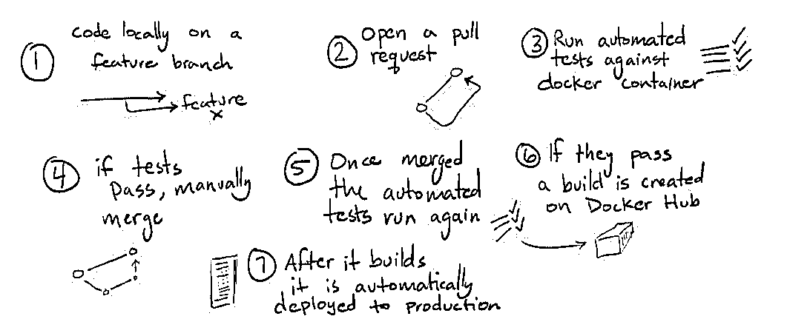
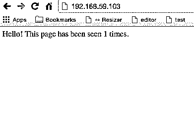

# Docker 行动——更健康、更快乐、更高效

> 原文：<https://realpython.com/docker-in-action-fitter-happier-more-productive/>

有了 Docker，你可以轻松地部署一个 [web 应用程序](https://realpython.com/python-web-applications/)及其[依赖关系](https://realpython.com/courses/managing-python-dependencies/)，环境变量和配置设置——快速高效地重建[环境](https://realpython.com/effective-python-environment/)所需的一切。

本教程正是着眼于这一点。

我们将从创建一个 Docker 容器来运行 Python Flask 应用程序开始。从那里，我们将看到一个很好的开发工作流程来管理应用程序的本地开发以及持续集成和交付，一步一步……

> 我( [Michael Herman](https://twitter.com/mikeherman) )最初于 2015 年 2 月 8 日在 [PyTennessee](https://www.pytennessee.org/) 展示了这个工作流程。如果有兴趣，你可以在这里观看幻灯片。

**2019 年 4 月 4 日更新**:升级了 Docker (v18.09.2)、Docker Compose (v1.23.2)、Docker Machine (v0.16.1)、Python (v3.7.3)、CircleCI (v2)。感谢[弗洛里安·戴利茨](https://github.com/DahlitzFlorian)！

**更新于 2015 年 2 月 28 日**:新增 [Docker 作曲](https://docs.docker.com/compose/)，升级 Docker 和 boot2docker 至最新版本。

## 工作流程

1.  在特征分支上本地编码
2.  针对主分支在 [Github](https://realpython.com/python-git-github-intro/) 上打开一个拉取请求
3.  [对 Docker 容器运行自动化测试](https://realpython.com/python-testing/)
4.  如果测试通过，手动将拉请求合并到主服务器中
5.  一旦合并，自动化测试再次运行
6.  如果第二轮测试通过，就会在 Docker Hub 上创建一个构建
7.  一旦构建被创建，它就被自动地(呃，自动地)部署到生产中

[](https://files.realpython.com/media/steps.91fb3b3eef5a.jpg)

> 本教程面向 Mac OS X 用户，我们将使用以下工具/技术——Python v 3 . 7 . 3、Flask v1.0.2、Docker v18.09.2、Docker Compose v1.23.2、Docker Machine 0.16.1、Redis v5.0.4

让我们开始吧…

首先，一些码头专用术语:

*   一个 *Dockerfile* 是一个包含一组用于创建*图像*的指令的文件。
*   一个*映像*用于构建和保存环境的快照(状态)。
*   一个*容器*是一个实例化的、活动的*映像*，它运行一组进程。

> 请务必查看 Docker [文档](https://docs.docker.com/)以获取关于[Docker 文件](https://docs.docker.com/engine/reference/builder/)、[图像](https://docs.docker.com/glossary/?term=image)和[容器](https://docs.docker.com/glossary/?term=container)的更多信息。

[*Remove ads*](/account/join/)

## 为什么是 Docker？

您可以在本地机器上真实地模拟您的生产环境。再也不用调试特定环境的错误，也不用担心应用程序在生产中的表现会有所不同。

1.  基础设施的版本控制
2.  轻松分发/重新创建您的整个开发环境
3.  构建一次，运行在任何地方-又名圣杯！

## 对接设置

为了能够在我们的 Mac OS X 系统上运行 Docker 容器，我们需要安装 Mac 版 Docker 桌面。如果你使用的是 Windows 系统，一定要检查 [Docker 桌面 Windows](https://hub.docker.com/editions/community/docker-ce-desktop-windows) 。如果你使用的是旧版本的 Mac OS X 或 Windows，你应该试试 [Docker 工具箱](https://docs.docker.com/toolbox/overview/)来代替。无论您基于您的操作系统选择哪种安装，您最终都会安装三个主要的 Docker 工具:Docker (CLI)、Docker Compose 和 Docker Machine。

现在让我们检查您的 Docker 安装:

```py
$ docker --version
Docker version 18.09.2, build 6247962
$ docker-compose --version
docker-compose version 1.23.2, build 1110ad01
$ docker-machine --version
docker-machine version 0.16.1, build cce350d7
```

## 创建新机器

在我们开始开发之前，我们需要创建一个新的 Docker 机器。因为我们想开发某样东西，所以我们把这台新机器叫做`dev`:

```py
$ docker-machine create -d virtualbox dev;
Creating CA: /Users/realpython/.docker/machine/certs/ca.pem
Creating client certificate: /Users/realpython/.docker/machine/certs/cert.pem
Running pre-create checks...
(dev) Image cache directory does not exist, creating it at /Users/realpython/.docker/machine/cache...
(dev) No default Boot2Docker ISO found locally, downloading the latest release...
(dev) Latest release for github.com/boot2docker/boot2docker is v18.09.3
(dev) Downloading /Users/realpython/.docker/machine/cache/boot2docker.iso from https://github.com/boot2docker/boot2docker/releases/download/v18.09.3/boot2docker.iso...
(dev) 0%....10%....20%....30%....40%....50%....60%....70%....80%....90%....100%
Creating machine...
(dev) Copying /Users/realpython/.docker/machine/cache/boot2docker.iso to /Users/realpython/.docker/machine/machines/dev/boot2docker.iso...
(dev) Creating VirtualBox VM...
(dev) Creating SSH key...
(dev) Starting the VM...
(dev) Check network to re-create if needed...
(dev) Found a new host-only adapter: "vboxnet0"
(dev) Waiting for an IP...
Waiting for machine to be running, this may take a few minutes...
Detecting operating system of created instance...
Waiting for SSH to be available...
Detecting the provisioner...
Provisioning with boot2docker...
Copying certs to the local machine directory...
Copying certs to the remote machine...
Setting Docker configuration on the remote daemon...
Checking connection to Docker...
Docker is up and running!
To see how to connect your Docker Client to the Docker Engine running on this virtual machine, run: docker-machine env dev
```

让 Docker 客户机通过以下方式指向新机器:

```py
$ eval $(docker-machine env dev)
```

运行以下命令查看当前正在运行的计算机:

```py
$ docker-machine ls
NAME   ACTIVE   DRIVER       STATE     URL                         SWARM   DOCKER     ERRORS
dev    *        virtualbox   Running   tcp://192.168.99.100:2376           v18.09.3
```

## 振作起来！

Docker Compose 是一个编排框架，它使用一个简单的*来处理多个服务(通过独立的容器)的构建和运行。yml* 文件。它使得将运行在不同容器中的服务链接在一起变得非常容易。

首先使用 git 从 GitHub 克隆[库](https://github.com/realpython/fitter-happier-docker):

```py
$ git clone https://github.com/realpython/fitter-happier-docker
$ cd fitter-happier-docker
$ tree .
.
├── article.md
├── circle.yml
├── docker-compose.yml
├── presentation
│   ├── images
│   │   ├── circleci.png
│   │   ├── docker-logo.jpg
│   │   ├── fig.png
│   │   ├── figup.png
│   │   ├── heart.jpg
│   │   ├── holy-grail.jpg
│   │   ├── oh-my.jpg
│   │   ├── rp_logo_color_small.png
│   │   └── steps.jpg
│   └── presentation.md
├── readme.md
└── web
 ├── Dockerfile
 ├── app.py
 ├── requirements.txt
 └── tests.py

3 directories, 18 files
```

现在让我们启动 Flask 应用程序，并与 [Redis](https://realpython.com/python-redis/) 一起运行。

我们来看看根目录下的 *docker-compose.yml* :

```py
version:  '3' services: web: build:  ./web volumes: -  ./web:/code ports: -  "80:5000" links: -  redis:redis command:  python app.py redis: image:  redis:5.0.4 ports: -  "6379:6379" volumes: -  db-data:/data volumes: db-data:
```

在这里，我们添加了组成堆栈的服务:

1.  **web** :首先，我们从“web”目录构建映像，然后将该目录挂载到 Docker 容器中的“code”目录。Flask 应用程序通过`python app.py`命令运行。这暴露了容器上的端口 5000，该端口被转发到主机环境上的端口 80。
2.  **redis** :接下来，redis 服务从 Docker Hub“Redis”[镜像](https://registry.hub.docker.com/_/redis/)构建。端口 6379 被暴露并被转发。此外，我们通过`db-data` [卷](https://docs.docker.com/storage/volumes/)将数据保存到我们的主机系统中。

你注意到“web”目录中的 Dockerfile 文件了吗？该文件用于构建我们的映像，从一个正式的 Python 基础映像开始，安装所需的依赖项并构建应用程序。

[*Remove ads*](/account/join/)

## 构建并运行

通过一个简单的命令，我们可以构建映像并运行容器:

```py
$ docker-compose up --build
```

[](https://files.realpython.com/media/figup.866b11a23b11.png)

这个命令为我们的 Flask 应用程序构建一个映像，提取 Redis 映像，然后启动一切。

拿杯咖啡。或者两个。第一次构建容器时，这需要一些时间。也就是说，由于 Docker 从 Docker 文件中缓存构建过程的每个步骤(或 *[层](https://docs.docker.com/glossary/?term=layer)* ),所以重建会发生*更快*，因为只有自上次构建以来*已更改*的步骤才会被重建。

> 如果你改变了 docker 文件中的某一行/步骤/层，它将重新创建/重建该行的所有内容——所以在构建 docker 文件时要注意这一点。

Docker Compose 并行地一次打开每个容器。每个容器都有一个唯一的名称，并且堆栈跟踪/日志中的每个进程都用颜色编码，以便于阅读。

准备测试了吗？

打开 web 浏览器，导航到与`DOCKER_HOST`变量相关联的 IP 地址——在本例中为 http://192.168.99.100/。(运行`docker-machine ip dev`获取地址。)

你应该会看到这样的文字，“你好！此页面已被浏览 1 次。在您的浏览器中:

[](https://files.realpython.com/media/test.6e35b0692889.png)

刷新。页面计数器应该已经增加。

杀死进程( `Ctrl` + `C` )，然后运行下面的命令在后台运行进程。

```py
$ docker-compose up -d
```

> 我们不需要附加`--build`标志，因为图像已经构建好了。

想要查看当前正在运行的进程吗？

```py
$ docker-compose ps
 Name                           Command               State           Ports 
-----------------------------------------------------------------------------------------------
fitter-happier-docker_redis_1   docker-entrypoint.sh redis ...   Up      0.0.0.0:6379->6379/tcp
fitter-happier-docker_web_1     python app.py                    Up      0.0.0.0:80->5000/tcp
```

> 这两个进程运行在不同的容器中，通过 Docker Compose 连接！

## 接下来的步骤

一旦完成，通过`docker-compose down`终止进程。在本地提交您的更改，然后推送到 Github。

那么，我们完成了什么？

我们设置了本地环境，详细描述了从一个 *Dockerfile* 构建一个*图像*，然后创建一个被称为*容器*的*图像*的实例的基本过程。我们用 Docker Compose 将所有东西捆绑在一起，为 Flask 应用程序和 Redis 流程构建和连接不同的容器。

现在，让我们来看一个由[circle ci](https://circleci.com/)T3】支持的持续集成工作流。

[*Remove ads*](/account/join/)

## 坞站枢纽〔t0〕

到目前为止，我们已经使用了 Docker 文件、图像和容器(当然是由 Docker Compose 抽象的)。

你熟悉 Git 的工作流程吗？图像类似于 Git 存储库，而容器类似于克隆的存储库。坚持这个比喻， [Docker Hub](https://hub.docker.com/) 是 Docker 图片的仓库，类似于 Github。

1.  使用您的 Github 凭证在此注册[。](https://hub.docker.com/signup)
2.  然后添加一个新的自动化构建。这可以通过点击“创建存储库”，向下滚动并点击 GitHub 符号来完成。这让您可以指定一个组织(您的 GitHub 名称)和您想要为其创建自动化构建的存储库。只需接受所有默认选项，除了“构建上下文”——将其更改为“/web”。

一旦添加，这将触发初始构建。确保构建成功。

### CI 码头枢纽〔t0〕

Docker Hub 本身充当了一个[持续集成](https://realpython.com/python-continuous-integration/)服务器，因为你可以配置它在每次向 Github 提交新的提交时创建一个[自动构建](https://docs.docker.com/docker-hub/builds/)。换句话说，它确保您不会在代码库更新时导致完全中断构建过程的回归。

> 这种方法有一些缺点——也就是说，你不能(通过`docker push`)直接将更新的图像推送到 Docker Hub。Docker Hub 必须从您的 repo 中提取更改，并自己创建图像，以确保它们没有错误。在执行此工作流程时，请记住这一点。关于此事，Docker 文档不清楚。

让我们来测试一下。向测试套件添加一个断言:

```py
self.assertNotEqual(four, 102)
```

提交并推送到 Github，在 Docker Hub 上生成新的构建。成功？

**底线:**如果一个提交确实导致了一个回归，Docker Hub 将会发现它，这是一件好事，但是由于这是部署之前的最后一道防线(无论是准备阶段还是生产阶段),您最好在 Docker Hub 上生成新的构建之前发现任何中断。另外，您还想从一个*真正的*持续集成服务器上运行您的单元和集成测试——这正是 CircleCI 发挥作用的地方。

## 循环〔t0〕

[](https://files.realpython.com/media/circleci.ace090952c24.png)

CircleCI 是一个持续集成和交付平台，支持 Docker 容器内的测试。给定一个 Dockerfile，CircleCI 构建一个映像，启动一个新容器，然后在该容器中运行测试。

还记得我们想要的工作流程吗？[链接](https://realpython.com/docker-in-action-fitter-happier-more-productive/#workflow)。

让我们来看看如何实现这一点…

### 设置

最好从优秀的[circle ci](https://circleci.com/docs/2.0/getting-started/#section=getting-started)入门指南开始…

注册你的 Github 帐户，然后添加 Github repo 来创建一个新项目。这将自动向 repo 添加一个 webhook，这样每当你推 Github 时，就会触发一个新的构建。添加挂钩后，您应该会收到一封电子邮件。

CircleCI 配置文件位于*中。circleci* 目录。我们来看看 *config.yml* :

```py
version:  2 jobs: build: docker: -  image:  circleci/python:3.7.3 working_directory:  ~/repo steps: -  checkout -  setup_remote_docker: docker_layer_caching:  true version:  18.06.0-ce -  run: name:  Install Docker client command:  | set -x VER="17.03.0-ce" curl -L -o /tmp/docker-$VER.tgz https://download.docker.com/linux/static/stable/x86_64/docker-$VER.tgz tar -xz -C /tmp -f /tmp/docker-$VER.tgz sudo mv /tmp/docker/* /usr/bin -  run: name:  run tests command:  | docker image build -t fitter-happier-docker web docker container run -d fitter-happier-docker python -m unittest discover web -  store_artifacts: path:  test-reports destination:  test-reports publish-image: machine:  true steps: -  checkout -  deploy: name:  Publish application to Docker Hub command:  | docker login -u $DOCKER_HUB_USER_ID -p $DOCKER_HUB_PWD docker image build -t fitter-happier-docker web docker tag fitter-happier-docker $DOCKER_HUB_USER_ID/fitter-happier-docker:$CIRCLE_SHA1 docker tag fitter-happier-docker $DOCKER_HUB_USER_ID/fitter-happier-docker:latest docker push $DOCKER_HUB_USER_ID/fitter-happier-docker:$CIRCLE_SHA1 docker push $DOCKER_HUB_USER_ID/fitter-happier-docker:latest workflows: version:  2 build-master: jobs: -  build -  publish-image: requires: -  build filters: branches: only:  master
```

基本上，我们定义了两种工作。首先，我们设置 Docker 环境，构建映像并运行测试。其次，我们将映像部署到 Docker Hub。

此外，我们定义了一个*工作流*。为什么我们需要工作流？如您所见，*构建*作业总是被执行，而*发布图像*作业只在主服务器上运行，因为我们不想在打开新的拉取请求时发布新的图像。

> 可以在 CircleCI 的项目设置中设置环境变量`DOCKER_HUB_USER_ID`和`DOCKER_HUB_PWD`。

创建了 *config.yml* 文件后，将更改推送到 Github 以触发新的构建。*记住:这也将触发 Docker Hub 的一个新版本。*

成功？

在继续之前，我们需要改变我们的工作流程，因为我们将不再直接推进到主分支。

[*Remove ads*](/account/join/)

### 特征分支工作流程

> 对于这些不熟悉特性分支工作流的人，请查看[这篇](https://www.atlassian.com/git/tutorials/comparing-workflows/feature-branch-workflow)精彩的介绍。

让我们快速看一个例子…

### 创建特征分支

```py
$ git checkout -b circle-test master
Switched to a new branch 'circle-test'
```

### 更新应用程序

在 *tests.py* 中添加一个新断言:

```py
self.assertNotEqual(four, 60)
```

### 发出拉取请求

```py
$ git add web/tests.py
$ git commit -m "circle-test"
$ git push origin circle-test
```

甚至在您创建实际的 pull 请求之前，CircleCI 就已经开始创建构建了。继续创建 pull 请求，然后一旦测试在 CircleCI 上通过，就按下 Merge 按钮。一旦合并，构建就在 Docker Hub 上触发。

## 结论

因此，我们回顾了一个很好的开发工作流程，包括通过 [CircleCI](https://circleci.com/) (步骤 1 到 6)建立一个与持续集成相结合的本地环境:

1.  在特征分支上本地编码
2.  针对主分支机构在 Github 上打开一个拉请求
3.  对 Docker 容器运行自动化测试
4.  如果测试通过，手动将拉请求合并到主服务器中
5.  一旦合并，自动化测试再次运行
6.  如果第二轮测试通过，就会在 Docker Hub 上创建一个构建
7.  一旦构建被创建，它就被自动地(呃，自动地)部署到生产中

那么最后一步——将这个应用程序交付到生产环境中(步骤 7)呢？实际上，你可以关注我的 Docker 博客[中的另一篇文章](https://blog.rainforestqa.com/2015-01-15-docker-in-action-from-deployment-to-delivery-part-3-continuous-delivery)来扩展这个工作流程，使之包括送货。

如有疑问，请在下方评论。在这里抓取最终代码[。干杯！](https://github.com/realpython/fitter-happier-docker/)

* * *

如果您有自己的工作流程，请告诉我们。我目前正在尝试使用 [Salt](https://github.com/saltstack/salt) 和 [Tutum](https://www.tutum.co/) 来更好地处理数字海洋和 Linode 上的编排和交付。****