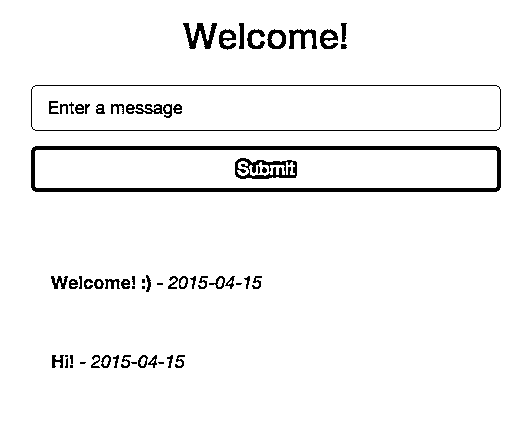

# Dockerizing Flask 与 Compose 和 Machine——从本地主机到云

> 原文：<https://realpython.com/dockerizing-flask-with-compose-and-machine-from-localhost-to-the-cloud/>

Docker 是一个强大的工具，用于构建隔离的、可复制的应用环境*容器*。**这篇文章关注的正是这一点——如何为本地开发封装 Flask 应用程序，并通过 Docker Compose 和 Docker Machine 将应用程序交付给云托管提供商。**

*更新:*

*   03/31/2019:更新至 Docker - Docker client (v18.09.2)、Docker compose (v1.23.2)、Docker Machine (v0.16.1)最新版本感谢 [Florian Dahlitz](https://github.com/DahlitzFlorian) ！
*   2015 年 11 月 16 日:更新至 Docker - Docker client (v1.9.0)、Docker compose (v1.5.0)和 Docker Machine (v0.5.0)的最新版本
*   04/25/2015:修复了小错别字，更新了 *docker-compose.yml* 文件，可以正确复制静态文件。
*   04/19/2015:添加了用于复制静态文件的 shell 脚本。

> 有兴趣为 Django 创造一个类似的环境吗？查看[这篇](https://realpython.com/django-development-with-docker-compose-and-machine/)博客文章。

## 本地设置

与 Docker (v18.09.2)一起，我们将使用-

*   *[Docker Compose](https://docs.docker.com/compose/)*(v 1 . 23 . 2)——之前称为 fig——用于将多容器应用编排到单个应用中，以及
*   *[Docker Machine](https://docs.docker.com/machine/)*(v 0 . 16 . 1)用于在本地和云中创建 Docker 主机。

按照此处和此处[的指示](https://docs.docker.com/machine/install-machine/)分别安装 Docker Compose 和 Machine。

运行旧的 Mac OS X 或 Windows 版本，那么你最好的选择是安装 [Docker 工具箱](https://www.docker.com/docker-toolbox)。

测试安装:

```py
$ docker-machine --version
docker-machine version 0.16.1, build cce350d7
$ docker-compose --version
docker-compose version 1.23.2, build 1110ad01
```

接下来，从[存储库](https://github.com/realpython/orchestrating-docker)克隆项目，或者基于 repo 上的项目结构创建您自己的项目:

```py
├── docker-compose.yml
├── nginx
│   ├── Dockerfile
│   └── sites-enabled
│       └── flask_project
└── web
    ├── Dockerfile
    ├── app.py
    ├── config.py
    ├── create_db.py
    ├── models.py
    ├── requirements.txt
    ├── static
    │   ├── css
    │   │   ├── bootstrap.min.css
    │   │   └── main.css
    │   ├── img
    │   └── js
    │       ├── bootstrap.min.js
    │       └── main.js
    └── templates
        ├── _base.html
        └── index.html
```

我们现在准备让容器启动并运行。输入对接机。

[*Remove ads*](/account/join/)

## 对接机

要启动 Docker Machine，首先确保您在项目根目录中，然后简单地运行:

```py
$ docker-machine create -d virtualbox dev;
Creating CA: /Users/realpython/.docker/machine/certs/ca.pem
Creating client certificate: /Users/realpython/.docker/machine/certs/cert.pem
Running pre-create checks...
(dev) Image cache directory does not exist, creating it at /Users/realpython/.docker/machine/cache...
(dev) No default Boot2Docker ISO found locally, downloading the latest release...
(dev) Latest release for github.com/boot2docker/boot2docker is v18.09.3
(dev) Downloading /Users/realpython/.docker/machine/cache/boot2docker.iso from https://github.com/boot2docker/boot2docker/releases/download/v18.09.3/boot2docker.iso...
(dev) 0%....10%....20%....30%....40%....50%....60%....70%....80%....90%....100%
Creating machine...
(dev) Copying /Users/realpython/.docker/machine/cache/boot2docker.iso to /Users/realpython/.docker/machine/machines/dev/boot2docker.iso...
(dev) Creating VirtualBox VM...
(dev) Creating SSH key...
(dev) Starting the VM...
(dev) Check network to re-create if needed...
(dev) Found a new host-only adapter: "vboxnet0"
(dev) Waiting for an IP...
Waiting for machine to be running, this may take a few minutes...
Detecting operating system of created instance...
Waiting for SSH to be available...
Detecting the provisioner...
Provisioning with boot2docker...
Copying certs to the local machine directory...
Copying certs to the remote machine...
Setting Docker configuration on the remote daemon...
Checking connection to Docker...
Docker is up and running!
To see how to connect your Docker Client to the Docker Engine running on this virtual machine, run: docker-machine env dev
```

`create`命令为 Docker 开发设置了一个“机器”(称为 *dev* )。本质上，它下载了 boot2docker 并启动了一个运行 docker 的 VM。现在只需将 Docker 客户端指向 *dev* 机器，方法是:

```py
$ eval "$(docker-machine env dev)"
```

运行以下命令查看当前正在运行的计算机:

```py
$ docker-machine ls
NAME   ACTIVE   DRIVER       STATE     URL                         SWARM   DOCKER     ERRORS
dev    *        virtualbox   Running   tcp://192.168.99.100:2376           v18.09.3
```

接下来，让我们用 Docker Compose 启动容器，让 Flask 应用程序和 Postgres 数据库启动并运行。

## 坞站组成〔t0〕

看一下 *docker-compose.yml* 文件:

```py
version:  '3' services: web: restart:  always build:  ./web expose: -  "8000" links: -  postgres:postgres volumes: -  web-data:/usr/src/app/static env_file:  
  -  .env command:  /usr/local/bin/gunicorn -w 2 -b :8000 app:app nginx: restart:  always build:  ./nginx ports: -  "80:80" volumes: -  .:/www/static -  web-data:/usr/src/app/static links: -  web:web data: image:  postgres:latest volumes: -  db-data:/var/lib/postgresql/data command:  "true" postgres: restart:  always image:  postgres:latest volumes: -  db-data:/var/lib/postgresql/data ports: -  "5432:5432" volumes: db-data: web-data:
```

这里，我们定义了四个服务- *web* 、 *nginx* 、 *postgres* 和*数据*。

1.  首先， *web* 服务是通过“web”目录下的 *Dockerfile* 中的指令构建的——在这里设置 Python 环境，安装需求，并在端口 8000 上启动 Flask 应用程序。该端口然后被转发到主机环境(例如对接机)上的端口 80。该服务还将在*中定义的环境变量添加到容器中。env* 文件。
2.  nginx 服务用于反向代理，将请求转发给 Flask 应用程序或静态文件。
3.  接下来，从来自 [Docker Hub](https://hub.docker.com/) 的官方 [PostgreSQL 镜像](https://registry.hub.docker.com/_/postgres/)构建 *postgres* 服务，Docker Hub 安装 postgres 并在默认端口 5432 上运行服务器。
4.  最后，注意有一个单独的[卷](https://docs.docker.com/userguide/dockervolumes/)容器用于存储数据库数据 *db-data* 。这有助于确保即使 Postgres 容器被完全破坏，数据仍然存在。

现在，要让容器运行，构建映像，然后启动服务:

```py
$ docker-compose build
$ docker-compose up -d
```

**提示:**您甚至可以在一个单独的命令中运行以上命令:

```py
$ docker-compose up --build -d
```

拿杯咖啡。或者两个。查看[真正的 Python 课程](https://realpython.com/courses/)。第一次运行时，这需要一段时间。

我们还需要创建数据库表:

```py
$ docker-compose run web /usr/local/bin/python create_db.py
```

打开浏览器，导航到与 Docker Machine ( `docker-machine ip`)关联的 [IP 地址](https://realpython.com/python-ipaddress-module/):

[](https://files.realpython.com/media/flask_app_docker.77aba550c513.png)

不错！

要查看哪些环境变量可用于 *web* 服务，请运行:

```py
$ docker-compose run web env
```

要查看日志:

```py
$ docker-compose logs
```

您还可以进入 Postgres Shell——因为我们在 *docker-compose.yml* 文件中将端口转发到主机环境——通过以下方式添加用户/角色以及数据库:

```py
$ docker-compose run postgres psql -h 192.168.99.100 -p 5432 -U postgres --password
```

一旦完成，通过`docker-compose down`停止过程。

[*Remove ads*](/account/join/)

## 部署

因此，随着我们的应用程序在本地运行，我们现在可以将这个完全相同的环境推送给一个拥有 Docker Machine 的云托管提供商。让我们部署到一个[数字海洋](https://www.digitalocean.com/?refcode=d8f211a4b4c2)液滴。

在您[注册了数字海洋的](https://www.digitalocean.com/?refcode=d8f211a4b4c2)之后，生成一个[个人访问令牌](https://www.digitalocean.com/community/tutorials/how-to-use-the-digitalocean-api-v2)，然后运行以下命令:

```py
$ docker-machine create \
-d digitalocean \
--digitalocean-access-token ADD_YOUR_TOKEN_HERE \
production
```

这将需要几分钟的时间来供应 droplet 并设置一个名为 *production* 的新 Docker 机器:

```py
Running pre-create checks...
Creating machine...
Waiting for machine to be running, this may take a few minutes...
Machine is running, waiting for SSH to be available...
Detecting operating system of created instance...
Provisioning created instance...
Copying certs to the local machine directory...
Copying certs to the remote machine...
Setting Docker configuration on the remote daemon...
To see how to connect Docker to this machine, run: docker-machine env production
```

现在我们有两台机器在运行，一台在本地，一台在数字海洋上:

```py
$ docker-machine ls
NAME         ACTIVE   DRIVER         STATE     URL                         SWARM   DOCKER     ERRORS
dev          *        virtualbox     Running   tcp://192.168.99.100:2376           v18.09.3
production   -        digitalocean   Running   tcp://104.131.93.156:2376           v18.09.3
```

然后将 *production* 设置为活动机器，并将 Docker 环境加载到 shell 中:

```py
$ eval "$(docker-machine env production)"
```

最后，让我们在云中再次构建 Flask 应用程序:

```py
$ docker-compose build
$ docker-compose up -d
$ docker-compose run web /usr/local/bin/python create_db.py
```

从[控制面板](https://cloud.digitalocean.com/droplets)获取与该数字海洋账户相关的 IP 地址，并在浏览器中查看。如果一切顺利，您应该看到您的应用程序正在运行。

## 结论

干杯！

*   从 [Github repo](https://github.com/realpython/orchestrating-docker) 中抓取代码(也开始！).
*   带着问题在下面评论。
*   下一次，我们将扩展这个工作流，以包括两个以上运行 Flask 应用程序的 Docker 容器，并将负载平衡纳入其中。敬请期待！**