# Emacs:最好的 Python 编辑器？

> 原文：<https://realpython.com/emacs-the-best-python-editor/>

为 Python 开发找到合适的[代码编辑器](https://realpython.com/python-ides-code-editors-guide/)可能很棘手。许多开发人员在成长和学习的过程中探索了大量的编辑器。要选择正确的代码编辑器，您必须从了解哪些特性对您来说很重要开始。然后，您可以尝试找到具有这些功能的编辑器。功能最丰富的编辑器之一是 [Emacs](https://www.gnu.org/software/emacs/) 。

Emacs 开始于 20 世纪 70 年代中期，是一组用于不同代码编辑器的宏扩展。它在 20 世纪 80 年代初被理查德·斯托尔曼采用到了 GNU 项目中，此后 GNU Emacs 得到了持续的维护和发展。直到今天，GNU Emacs 和 XEmacs 变种在每一个主流平台上都可以使用，GNU Emacs 仍然是[编辑器战争](https://en.wikipedia.org/wiki/Editor_war)中的一员。

**在本教程中，您将学习如何使用 Emacs 进行 Python 开发，包括如何:**

*   在您选择的平台上安装 Emacs
*   设置 Emacs 初始化文件来配置 Emacs
*   为 Emacs 构建基本的 Python 配置
*   编写 Python 代码来探索 Emacs 的功能
*   在 Emacs 环境中运行和测试 Python 代码
*   使用集成的 Emacs 工具调试 Python 代码
*   使用 Git 添加源代码控制功能

对于本教程，您将使用 GNU Emacs 25 或更高版本，尽管这里展示的大多数技术也适用于旧版本(和 XEmacs)。你应该有一些用 Python 开发的经验，你的机器应该已经安装了 Python 发行版并且准备好了。

**更新:**

*   *10/09/2019:* 主要更新增加了新的代码示例、更新的包可用性和信息、基础教程、Jupyter 走查、调试走查、测试走查和更新的视觉效果。
*   *2015 年 11 月 3 日:*初始教程发布。

您可以从下面的链接下载本教程中引用的所有文件:

**下载代码:** [单击此处下载代码，您将在本教程中使用](https://realpython.com/bonus/emacs/)来了解用于 Python 的 Emacs。

## 安装和基础知识

在探索 Emacs 及其为 Python 开发人员提供的一切之前，您需要安装它并学习一些基础知识。

[*Remove ads*](/account/join/)

### 安装

当你安装 Emacs 时，你必须考虑你的平台。由 [ErgoEmacs](http://ergoemacs.org/) 提供的这个[指南](http://ergoemacs.org/emacs/which_emacs.html)，提供了在 Linux、Mac 或 Windows 上启动和运行基本 Emacs 安装所需的一切。

安装完成后，您可以启动 Emacs:

[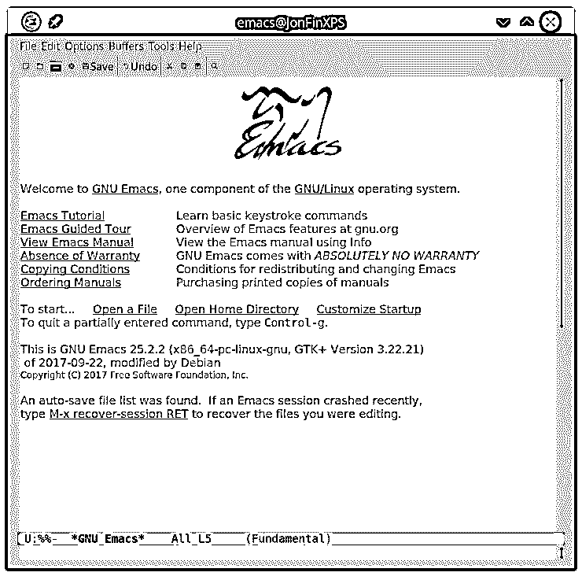](https://files.realpython.com/media/emacsv2-fresh-launch.2fb60d356a34.png)

您应该会看到默认的启动屏幕。

### 基本 Emacs

首先，让我们通过一个简单的例子来介绍 Python 开发的一些基本 Emacs。您将看到如何使用普通的 Emacs 编辑程序，以及程序内置了多少 Python 支持。在 Emacs 打开的情况下，使用以下步骤创建一个快速 Python 程序:

1.  点击`Ctrl`+`X``Ctrl`+`F`打开一个新文件。
2.  键入`sieve.py`来命名文件。
3.  点击 `Enter` 。
4.  Emacs 可能会要求您确认您的选择。如果是，那么再点击 `Enter` 。

现在键入以下代码:

```py
 1MAX_PRIME = 100
 2
 3sieve = [True] * MAX_PRIME
 4for i in range(2, MAX_PRIME):
 5  if sieve[i]:
 6    print(i)
 7      for j in range(i * i, MAX_PRIME, i):
 8        sieve[j] = False
```

你可能认识到这个代码是厄拉多塞的[筛子，它寻找低于给定最大值的所有素数。当您键入代码时，您会注意到:](https://en.wikipedia.org/wiki/Sieve_of_Eratosthenes)

*   Emacs 突出变量和常量的方式不同于 Python 关键字。
*   Emacs 自动缩进 [`for`](https://realpython.com/courses/python-for-loop/) 和 [`if`](https://realpython.com/courses/python-conditional-statements/) 语句后面的行。
*   当您在缩进行上点击 `Tab` 时，Emacs 会将缩进修改到适当的位置。
*   每当您键入右括号或圆括号时，Emacs 都会突出显示左括号或圆括号。
*   Emacs 对箭头键以及 `Enter` 、 `Backspace` 、 `Del` 、 `Home` 、 `End` 和 `Tab` 键的响应与预期一致。

然而，在 Emacs 中有一些奇怪的键映射。例如，如果你试图将代码粘贴到 Emacs 中，那么你可能会发现标准的 `Ctrl` + `V` 击键不起作用。

了解 Emacs 中哪些键做什么的最简单的方法是遵循内置教程。您可以通过将光标定位在 Emacs 开始屏幕上的 *Emacs 教程*上并按下 `Enter` 来访问它，或者在此后的任何时间通过键入`Ctrl`+`H``T`来访问它。你会看到下面这段话:

```py
Emacs commands generally involve the CONTROL key (sometimes labeled
CTRL or CTL) or the META key (sometimes labeled EDIT or ALT).  Rather than
write that in full each time, we'll use the following abbreviations:

 C-<chr>  means hold the CONTROL key while typing the character <chr>
          Thus, C-f would be: hold the CONTROL key and type f.
 M-<chr>  means hold the META or EDIT or ALT key down while typing <chr>.
          If there is no META, EDIT or ALT key, instead press and release the
          ESC key and then type <chr>.  We write <ESC> for the ESC key.

Important Note: to end the Emacs session, type C-x C-c.  (Two characters.)
To quit a partially entered command, type C-g.
```

当您浏览文章中的文本时，您会看到 Emacs 文档中使用符号`C-x C-s`显示了 Emacs 击键。这是保存当前缓冲区内容的命令。这个符号表示 `Ctrl` 和 `X` 键被同时按下，接着是 `Ctrl` 和 `S` 键。

**注:**在本教程中，Emacs 击键显示为`Ctrl`+`X``Ctrl`+`S`。

Emacs 使用的一些术语可以追溯到其基于文本的 UNIX 根源。因为这些术语现在有不同的含义，所以最好复习一下，因为随着教程的进行，你会读到它们:

*   启动 Emacs 时看到的窗口被称为 [**帧**](https://www.gnu.org/software/emacs/manual/html_node/elisp/Frames.html#Frames) 。您可以在任意数量的显示器上打开任意数量的 Emacs 框架，Emacs 会对它们进行跟踪。

*   每个 Emacs 框架内的窗格被称为 [**窗口**](https://www.gnu.org/software/emacs/manual/html_node/elisp/Windows.html#Windows) 。Emacs 框架最初包含一个窗口，但是您可以在每个框架中打开多个窗口，可以手动打开，也可以通过运行特殊命令打开。

*   在每个窗口内，显示的内容被称为一个[](http://www.gnu.org/software/emacs/manual/html_node/elisp/Buffers.html)**。缓冲区可以包含文件内容、命令输出、菜单选项列表或其他项目。缓冲区是您与 Emacs 交互的地方。**

***   当 Emacs 需要你的输入时，它会在当前活动帧底部的一个特殊的单行区域请求，这个区域叫做 [**迷你缓冲区**](https://www.gnu.org/software/emacs/manual/html_node/elisp/Minibuffers.html#Minibuffers) 。如果你意外地发现自己在那里，那么你可以用 `Ctrl` + `G` 取消任何让你在那里的东西。** 

 **现在您已经了解了基础知识，是时候开始为 Python 开发定制和配置 Emacs 了！

[*Remove ads*](/account/join/)

### 初始化文件

Emacs 的一大优势是它强大的配置选项。Emacs 配置的核心是[初始化文件](http://www.gnu.org/software/emacs/manual/html_node/emacs/Init-File.html)，Emacs 每次启动都会处理这个文件。

该文件包含用 [Emacs Lisp](https://www.gnu.org/software/emacs/manual/html_node/eintr/index.html) 编写的命令，每次启动 Emacs 时都会执行这些命令。不过，别担心！使用或定制 Emacs 不需要了解 Lisp。在本教程中，您将找到入门所需的一切。(毕竟这是*真正的 Python* ，不是*真正的 Lisp* ！)

启动时，Emacs 在三个地方寻找初始化文件[:](https://www.gnu.org/software/emacs/manual/html_node/emacs/Find-Init.html#Find-Init)

1.  首先，它在您的家庭用户文件夹中查找文件`.emacs`。
2.  如果不存在，那么 Emacs 会在您的主用户文件夹中查找文件`emacs.el`。
3.  最后，如果都没有找到，那么它会在您的主文件夹中查找`.emacs.d/init.el`。

最后一个选项`.emacs.d/init.el`，是当前推荐的初始化文件。但是，如果您以前使用并配置过 Emacs，那么您可能已经有了其他初始化文件之一。如果是这样，那么在阅读本教程时继续使用该文件。

当您第一次安装 Emacs 时，没有`.emacs.d/init.el`，但是您可以相当快地创建这个文件。在 Emacs 窗口打开的情况下，按照下列步骤操作:

1.  击`Ctrl`+`X``Ctrl`+`F`。
2.  在迷你缓冲区中键入`~/.emacs.d/init.el`。
3.  点击 `Enter` 。
4.  Emacs 可能会要求您确认您的选择。如果是，那么再点击 `Enter` 。

让我们仔细看看这里发生了什么:

*   你告诉 Emacs 你想通过按键`Ctrl`+`X``Ctrl`+`F`找到并打开一个文件。

*   您通过给 Emacs 一个文件路径来告诉它打开什么文件。路径`~/.emacs.d/init.el`有三个部分:

    1.  前导波浪号`~`是您的个人文件夹的快捷方式。在 Linux 和 Mac 机器上，这通常是`/home/<username>`。在 Windows 机器上，它是在 [HOME 环境变量](http://www.gnu.org/software/emacs/manual/html_node/efaq-w32/Location-of-init-file.html#Location-of-init-file)中指定的路径。
    2.  文件夹`.emacs.d`是 Emacs 存储所有配置信息的地方。您可以使用该文件夹在新机器上快速设置 Emacs。为此，将该文件夹的内容复制到您的新机器上，Emacs 就可以使用了！
    3.  文件`init.el`是你的初始化文件。
*   您告诉 Emacs，“是的，我确实想创建这个新文件。”(这一步是必需的，因为文件不存在。通常，Emacs 会简单地打开指定的文件。)

Emacs 创建新文件后，会在新的缓冲区中打开该文件供您编辑。不过，这个操作实际上并没有创建文件。您必须使用`Ctrl`+`X``Ctrl`+`S`保存空白文件，以便在磁盘上创建它。

在本教程中，您将看到启用不同特性的初始化代码片段。如果您想继续操作，现在就创建初始化文件！您也可以在下面的链接中找到完整的初始化文件:

**下载代码:** [单击此处下载代码，您将在本教程中使用](https://realpython.com/bonus/emacs/)来了解用于 Python 的 Emacs。

### 定制包

现在您已经有了一个初始化文件，您可以添加定制选项来为 Python 开发定制 Emacs。有几种方法可以定制 Emacs，但是步骤最少的一种是添加 [Emacs 包](https://www.gnu.org/software/emacs/manual/html_node/emacs/Packages.html)。这些来自各种来源，但是主要的包存储库是 [MELPA](https://melpa.org/#/) ，或者 **Milkypostman 的 Emacs Lisp 包存档**。

把 MELPA 想象成 Emacs 包的 PyPI(T2)。你在本教程中需要用到的所有东西都可以在那里找到。要开始使用它，请展开下面的代码块，并将配置代码复制到您的`init.el`文件:


```py
 1;; .emacs.d/init.el 2
 3;; =================================== 4;; MELPA Package Support 5;; =================================== 6;; Enables basic packaging support 7(require  'package) 8
 9;; Adds the Melpa archive to the list of available repositories 10(add-to-list  'package-archives 11  '("melpa"  .  "http://melpa.org/packages/")  t) 12
13;; Initializes the package infrastructure 14(package-initialize) 15
16;; If there are no archived package contents, refresh them 17(when  (not  package-archive-contents) 18  (package-refresh-contents)) 19
20;; Installs packages 21;; 22;; myPackages contains a list of package names 23(defvar  myPackages 24  '(better-defaults  ;; Set up some better Emacs defaults 25  material-theme  ;; Theme 26  ) 27  ) 28
29;; Scans the list in myPackages 30;; If the package listed is not already installed, install it 31(mapc  #'(lambda  (package) 32  (unless  (package-installed-p  package) 33  (package-install  package))) 34  myPackages) 35
36;; =================================== 37;; Basic Customization 38;; =================================== 39
40(setq  inhibit-startup-message  t)  ;; Hide the startup message 41(load-theme  'material  t)  ;; Load material theme 42(global-linum-mode  t)  ;; Enable line numbers globally 43
44;; User-Defined init.el ends here
```

当您通读代码时，您会看到`init.el`被分成几个部分。每个部分由以两个分号(`;;`)开头的注释块分隔。第一部分的标题是`MELPA Package Support`:

```py
 1;; .emacs.d/init.el 2
 3;; =================================== 4;; MELPA Package Support 5;; =================================== 6;; Enables basic packaging support 7(require  'package) 8
 9;; Adds the Melpa archive to the list of available repositories 10(add-to-list  'package-archives 11  '("melpa"  .  "http://melpa.org/packages/")  t) 12
13;; Initializes the package infrastructure 14(package-initialize) 15
16;; If there are no archived package contents, refresh them 17(when  (not  package-archive-contents) 18  (package-refresh-contents))
```

本节从设置打包基础结构开始:

*   **第 7 行**告诉 Emacs 使用包。
*   **第 10 行和第 11 行**将 MELPA 档案添加到包源列表中。
*   **第 14 行**初始化包装系统。
*   **第 17 行和第 18 行**构建当前的包内容列表，如果它还不存在的话。

第一部分从第 20 行继续:

```py
20;; Installs packages 21;; 22;; myPackages contains a list of package names 23(defvar  myPackages 24  '(better-defaults  ;; Set up some better Emacs defaults 25  material-theme  ;; Theme 26  ) 27  ) 28
29;; Scans the list in myPackages 30;; If the package listed is not already installed, install it 31(mapc  #'(lambda  (package) 32  (unless  (package-installed-p  package) 33  (package-install  package))) 34  myPackages)
```

至此，您已经准备好以编程方式安装 Emacs 包了:

*   第 23 到 27 行定义了要安装的软件包名称列表。随着教程的进行，您将添加更多的包:
    *   **第 24 行**增加了 [`better-defaults`](http://melpa.org/#/better-defaults) 。这是对 Emacs 默认设置的一些小改动，使其更加用户友好。这也是进一步定制的良好基础。
    *   **25 线**增加了 [`material-theme`](http://melpa.org/#/material-theme) 包，这是在其他环境中发现的不错的暗黑风格。
*   第 31 到 34 行遍历列表并安装任何尚未安装的包。

**注意:**不需要使用素材主题。MELPA 上有许多不同的 [Emacs 主题](http://melpa.org/#/?q=theme)供你选择。挑一个适合自己风格的吧！

安装完软件包后，您可以进入标题为`Basic Customization`的部分:

```py
36;; =================================== 37;; Basic Customization 38;; =================================== 39
40(setq  inhibit-startup-message  t)  ;; Hide the startup message 41(load-theme  'material  t)  ;; Load material theme 42(global-linum-mode  t)  ;; Enable line numbers globally 43
44;; User-Defined init.el ends here
```

在这里，您可以添加一些其他定制:

*   **第 40 行**禁用包含教程信息的初始 Emacs 屏幕。您可能想用双分号(`;;`)把这个注释掉，直到您对 Emacs 更熟悉为止。
*   **第 41 行**加载并激活素材主题。如果你想安装一个不同的主题，那么在这里使用它的名字。您也可以注释掉这一行以使用默认的 Emacs 主题。
*   **第 42 行**显示每个缓冲器中的行号。

现在您已经有了一个完整的基本配置文件，您可以使用`Ctrl`+`X``Ctrl`+`S`保存文件。然后，关闭并重新启动 Emacs 以查看更改。

Emacs 第一次使用这些选项运行时，可能需要几秒钟来启动，因为它设置了打包基础结构。完成后，您会看到您的 Emacs 窗口看起来有点不同:

[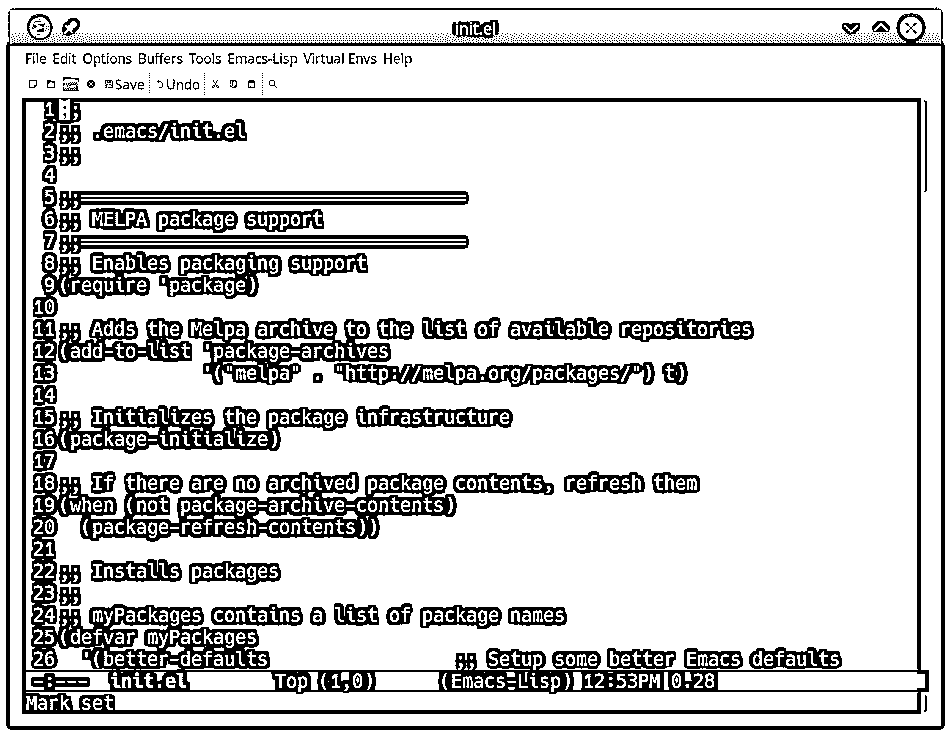](https://files.realpython.com/media/emacsv2-themed.19e8b3055961.png)

重启后，Emacs 跳过初始屏幕，打开最后一个活动文件。应用了材质主题，并在缓冲区中添加了行号。

**注意:**您可以在打包基础设施建立之后交互式地添加包。点击 `Alt` + `X` ，然后输入`package-show-package-list`查看 Emacs 中所有可安装的软件包。在撰写本文时，有超过 4300 个可用。

看到包列表后，您可以:

*   点击 `F` 快速过滤包名列表。
*   通过单击任何包的名称来查看其详细信息。
*   通过单击*安装*链接，从软件包视图安装软件包。
*   使用 `Q` 关闭套餐列表。

[*Remove ads*](/account/join/)

## 使用`elpy` 进行 Python 开发的 Emacs

Emacs 可以随时编辑 Python 代码。库文件`python.el`提供了 *python 模式*，支持基本的缩进和语法高亮显示。然而，这个内置的包并没有提供太多其他的东西。为了与特定于 Python 的[ide](https://realpython.com/python-ides-code-editors-guide/)(集成开发环境)竞争，您将添加更多的功能。

[`elpy`](https://elpy.readthedocs.org/en/latest/) 包( **Emacs Lisp Python 环境**)提供了一套近乎完整的 [Python IDE 特性](https://elpy.readthedocs.org/en/latest/ide.html)，包括:

*   自动缩进
*   语法突出显示
*   自动完成
*   语法检查
*   Python REPL 集成
*   虚拟环境支持

要安装并启用`elpy`，您需要将这个包添加到您的 Emacs 配置中。对`init.el`的以下更改将达到目的:

```py
23(defvar  myPackages 24  '(better-defaults  ;; Set up some better Emacs defaults 25  elpy  ;; Emacs Lisp Python Environment  26  material-theme  ;; Theme 27  ) 28  )
```

一旦`elpy`被安装，你需要启用它。在您的`init.el`文件的末尾之前添加以下代码:

```py
45;; ====================================  46;; Development Setup  47;; ====================================  48;; Enable elpy  49(elpy-enable)  50
51;; User-Defined init.el ends here
```

您现在有了一个名为`Development Setup`的新部分。线 49 使能`elpy`。

**注意:**遗憾的是，Emacs 在启动时只会读取一次初始化文件的内容。如果您对它做了任何更改，那么加载它们最简单、最安全的方法就是重启 Emacs。

要查看新模式的运行情况，请返回到您之前输入的的厄拉多塞代码的[屏幕。创建一个新的 Python 文件，并直接重新键入 Sieve 代码:](https://en.wikipedia.org/wiki/Sieve_of_Eratosthenes)

```py
 1MAX_PRIME = 100
 2
 3sieve = [True] * MAX_PRIME
 4for i as range(2, MAX_PRIME): 5  if sieve[i]:
 6    print(i)
 7    for j in range(i*i, MAX_PRIME, i):
 8      sieve[j] = False
```

注意第 4 行的故意的[语法错误](https://realpython.com/invalid-syntax-python/)。

这是您的 Python 文件在 Emacs 中的样子:

[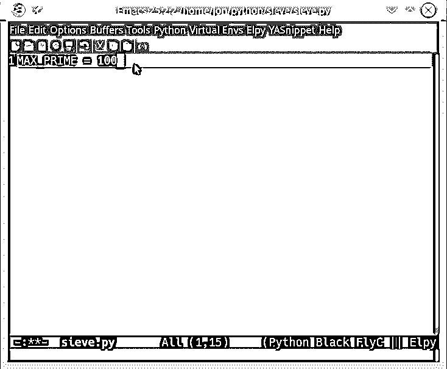](https://files.realpython.com/media/emacsv2-elpy-in-action2-new.0c6148bf17aa.gif)

自动缩进和关键字突出显示仍然像以前一样工作。但是，您还应该在第 4 行看到一个错误指示器:

[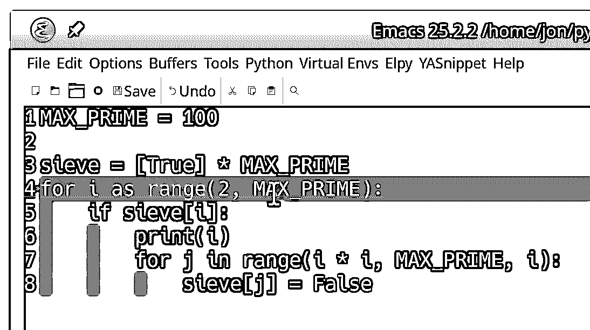](https://files.realpython.com/media/emacsv2-elpy-basic-error.bb845d5ed619.png)

当你键入`as`而不是`in`时，这个错误指示器会在`for`循环中弹出。

更正该错误，然后在 Python 缓冲区中键入`Ctrl`++`C``Ctrl`+`C`来运行文件，而不离开 Emacs:

[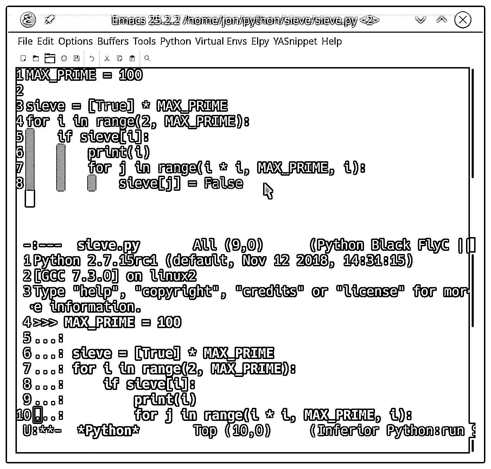](https://files.realpython.com/media/emacsv2-elpy-execute.cc6b3aa999b0.png)

使用该命令时，Emacs 将执行以下操作:

1.  创建一个名为 **Python** 的新缓冲区
2.  打开 Python 解释器并将其连接到缓冲区
3.  在当前代码窗口下创建一个新窗口来显示缓冲区
4.  将代码发送给解释器执行

您可以滚动浏览 **Python** 缓冲区，查看运行了哪个解释器以及代码是如何启动的。你甚至可以在底部的提示符(`>>>`)下输入命令。

通常，您会希望在一个[虚拟环境](https://realpython.com/python-virtual-environments-a-primer/)中使用为该环境指定的解释器和包来执行您的代码。幸运的是，`elpy`包含了 [`pyvenv`](http://melpa.org/#/pyvenv) 包，为虚拟环境提供了内置支持。

要使用 Emacs 中现有的虚拟环境，请键入 `Alt` + `X` `pyvenv-workon`。Emacs 将询问虚拟环境的名称以使用并激活它。可以用`Alt`+`X``pyvenv-deactivate`停用当前虚拟环境。您也可以从 Emacs 菜单的*虚拟环境*下访问该功能。

您也可以在 Emacs 中配置`elpy`。键入 `Alt` + `X` `elpy-config`显示如下对话框:

[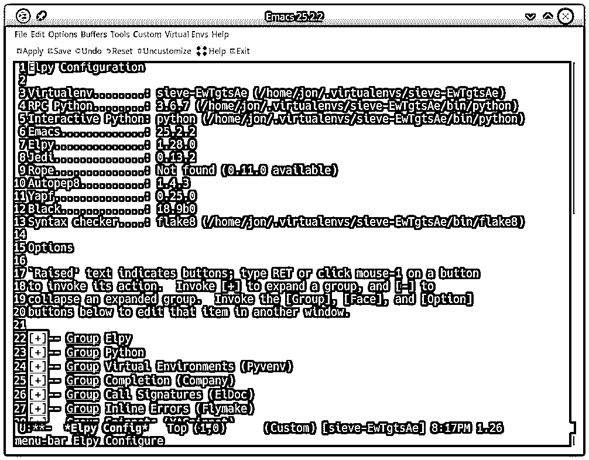](https://files.realpython.com/media/emacsv2-elpy-config.b7274dfd71da.png)

您应该看到有价值的调试信息，以及配置`elpy`的选项。

现在，您已经具备了在 Python 中使用 Emacs 的所有基础知识。是时候在蛋糕上加点糖霜了！

[*Remove ads*](/account/join/)

## 额外的 Python 语言特性

除了上面描述的所有基本 IDE 特性之外，还有其他语法特性可以与 Emacs 一起用于 Python 开发。在本教程中，您将涉及这三个方面:

1.  用 [`flycheck`](http://www.flycheck.org/) 进行语法检查
2.  代码格式化用 [PEP 8](https://realpython.com/python-pep8/) 和 [`black`](https://pypi.org/project/black/)
3.  与 Jupyter 和 IPython 集成

然而，这并不是一个详尽的列表！请随意使用 Emacs 和 Python，看看还能发现哪些语法特性。

### 语法检查

默认情况下，`elpy`使用一个名为 [`flymake`](https://www.gnu.org/software/emacs/manual/html_node/flymake/index.html) 的语法检查包。虽然`flymake`内置在 Emacs 中，但它只支持四种语言，而且要支持新的语言还需要很大的努力。

幸运的是，有一个更新更完整的解决方案可用！语法检查包 [`flycheck`](http://www.flycheck.org/) 支持 50 多种语言的实时语法检查，并设计用于快速配置新语言。你可以在[文档](https://www.flycheck.org/en/latest/user/flycheck-versus-flymake.html)中读到`flymake`和`flycheck`的区别。

可以快速切换`elpy`用`flycheck`代替`flymake`。首先，给你的`init.el`加上`flycheck`:

```py
23(defvar  myPackages 24  '(better-defaults  ;; Set up some better Emacs defaults 25  elpy  ;; Emacs Lisp Python Environment 26  flycheck  ;; On the fly syntax checking  27  material-theme  ;; Theme 28  ) 29  )
```

`flycheck`现在将与其他软件包一起安装。

然后，在`Development Setup`部分添加以下几行:

```py
46;; ==================================== 47;; Development Setup 48;; ==================================== 49;; Enable elpy 50(elpy-enable) 51
52;; Enable Flycheck  53(when  (require  'flycheck  nil  t)  54  (setq  elpy-modules  (delq  'elpy-module-flymake  elpy-modules))  55  (add-hook  'elpy-mode-hook  'flycheck-mode))
```

这将在 Emacs 运行您的初始化文件时启用`flycheck`。现在，无论何时使用 Emacs 编辑 Python 代码，您都会看到实时的语法反馈:

[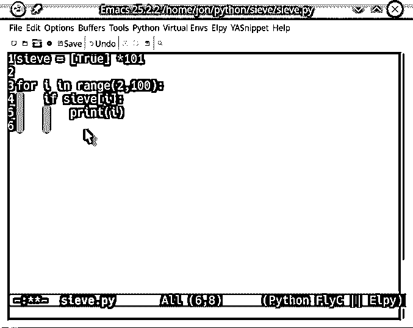](https://files.realpython.com/media/emacsv2-elpy-flycheck.283989e48c0f.gif)

请注意 [`range()`](https://realpython.com/python-range/) 的语法提醒，它会在您键入时出现在窗口的底部。

### 代码格式化

爱它或恨它， [PEP 8](https://www.python.org/dev/peps/pep-0008/) 在这里停留。如果您想要遵循所有或部分标准，那么您可能想要一种自动化的方式来做到这一点。比较流行的两种方案是 [`autopep8`](https://pypi.python.org/pypi/autopep8/) 和 [`black`](https://pypi.org/project/black/) 。这些代码格式化工具必须安装在 Python 环境中才能使用。要了解更多关于如何安装自动格式化程序的信息，请查看[如何用 PEP 8](https://realpython.com/python-pep8/#autoformatters) 编写漂亮的 Python 代码。

一旦自动格式化程序可用，您就可以安装适当的 Emacs 包来启用它:

*   [**`py-autopep8`**](http://melpa.org/#/py-autopep8) 将`autopep8`连接到 Emacs。
*   [**`blacken`**](http://melpa.org/#/blacken) 使`black`能够从 Emacs 内部运行。

您只需要在 Emacs 中安装其中一个。为此，在您的`init.el`中添加以下突出显示的行之一:

```py
23(defvar  myPackages 24  '(better-defaults  ;; Set up some better Emacs defaults 25  elpy  ;; Emacs Lisp Python Environment 26  flycheck  ;; On the fly syntax checking 27  py-autopep8  ;; Run autopep8 on save  28  blacken  ;; Black formatting on save  29  material-theme  ;; Theme 30  ) 31  )
```

如果你正在使用`black`，那么你就完成了！`elpy`识别`blacken`包并自动启用。

但是，如果您使用的是`autopep8`，那么您需要启用`Development Setup`部分中的格式化程序:

```py
48;; ==================================== 49;; Development Setup 50;; ==================================== 51;; Enable elpy 52(elpy-enable) 53
54;; Enable Flycheck 55(when  (require  'flycheck  nil  t) 56  (setq  elpy-modules  (delq  'elpy-module-flymake  elpy-modules)) 57  (add-hook  'elpy-mode-hook  'flycheck-mode)) 58
59;; Enable autopep8  60(require  'py-autopep8)  61(add-hook  'elpy-mode-hook  'py-autopep8-enable-on-save)  62
63;; User-Defined init.el ends here
```

现在，每次保存 Python 代码时，都会自动格式化和保存缓冲区，并重新加载内容。您可以看到这是如何与一些格式错误的 Sieve 代码和`black`格式化程序一起工作的:

[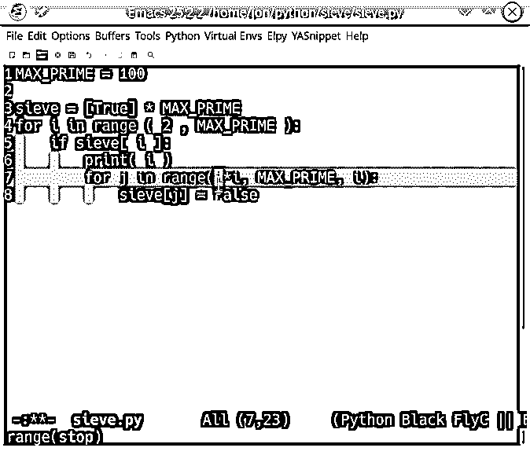](https://files.realpython.com/media/emacsv2-elpy-autopep8-cropped.2200a001b675.gif)

您可以看到，文件保存后，它被重新加载到缓冲区中，并应用了适当的`black`格式。

[*Remove ads*](/account/join/)

### 与 Jupyter 和 IPython 的集成

Emacs 也可以与 Jupyter 笔记本和 IPython REPL 一起工作。如果你还没有安装 Jupyter，那么看看 [Jupyter 笔记本:简介](https://realpython.com/jupyter-notebook-introduction/)。一旦 Jupyter 准备就绪，在调用启用`elpy`后，将以下行添加到您的`init.el`中:

```py
48;; ==================================== 49;; Development Setup 50;; ==================================== 51;; Enable elpy 52(elpy-enable) 53
54;; Use IPython for REPL  55(setq  python-shell-interpreter  "jupyter"  56  python-shell-interpreter-args  "console --simple-prompt"  57  python-shell-prompt-detect-failure-warning  nil)  58(add-to-list  'python-shell-completion-native-disabled-interpreters  59  "jupyter")  60
61;; Enable Flycheck 62(when  (require  'flycheck  nil  t) 63  (setq  elpy-modules  (delq  'elpy-module-flymake  elpy-modules)) 64  (add-hook  'elpy-mode-hook  'flycheck-mode))
```

这将更新 Emacs 以使用 IPython，而不是标准的 Python REPL。现在当你用`Ctrl`+`C``Ctrl`+`C`运行你的代码时，你会看到 IPython REPL:

[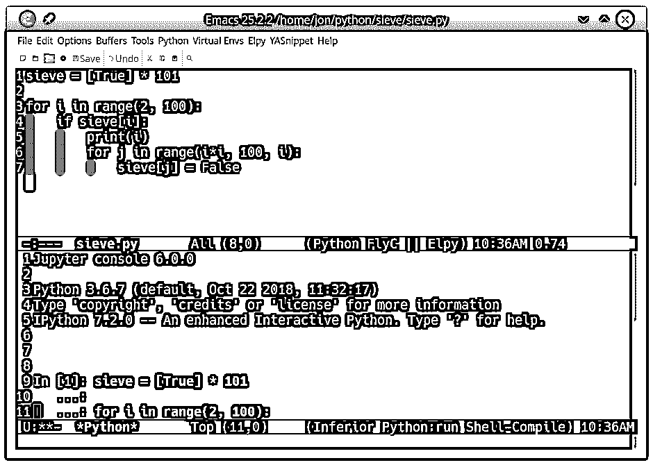](https://files.realpython.com/media/emacsv2-elpy-ipython.0ffd4ab8d398.png)

虽然这本身非常有用，但真正的魔力在于 Jupyter 笔记本的集成。和往常一样，您需要添加一些配置来实现所有功能。 [`ein`](http://melpa.org/#/ein) 包启用 Emacs 中的 IPython 笔记本客户端。您可以像这样将其添加到您的`init.el`中:

```py
23(defvar  myPackages 24  '(better-defaults  ;; Set up some better Emacs defaults 25  elpy  ;; Emacs Lisp Python Environment 26  flycheck  ;; On the fly syntax checking 27  py-autopep8  ;; Run autopep8 on save 28  blacken  ;; Black formatting on save 29  ein  ;; Emacs IPython Notebook  30  material-theme  ;; Theme 31  ) 32  )
```

您现在可以启动 Jupyter 服务器，并在 Emacs 中使用笔记本电脑。

要启动服务器，使用命令 `Alt` + `X` `ein:jupyter-server-start`。然后提供一个运行服务器的文件夹。您将看到一个新的缓冲区，显示所选文件夹中可用的 Jupyter 笔记本:

[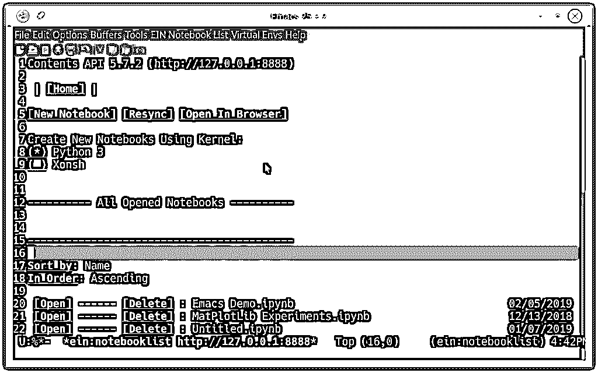](https://files.realpython.com/media/emacsv2-jupyter-notebook-list.0806e3866ca5.png)

在这里，您可以通过点击*新建笔记本*来创建一个具有选定内核的新笔记本，或者通过点击*打开*来打开底部列表中的现有笔记本:

[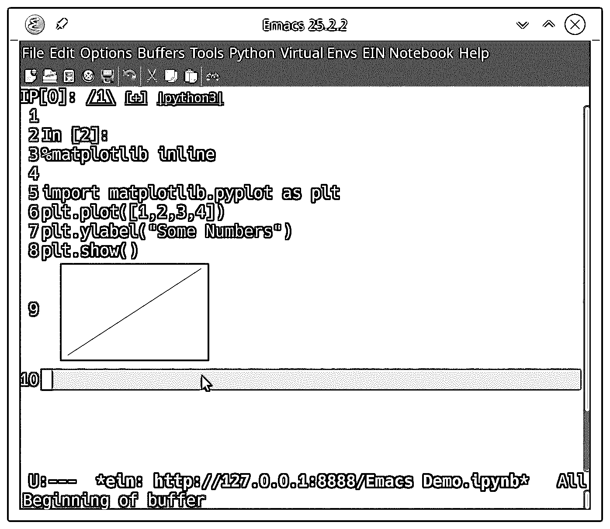](https://files.realpython.com/media/emacsv2-jupyter-open-notebook.4498d339bb47.png)

你可以通过键入`Ctrl`+`X``Ctrl`+`F`，然后键入`Ctrl`+`C``Ctrl`+`Z`来完成完全相同的任务。这将直接在 Emacs 中以文件形式打开 Jupyter 笔记本。

打开笔记本后，您可以:

*   使用箭头键在笔记本单元格中移动
*   使用 `Ctrl` + `A` 在当前单元格上方添加一个新单元格
*   使用 `Ctrl` + `B` 在当前单元格下方添加一个新单元格
*   使用`Ctrl`++`C``Ctrl`+`C`或 `Alt` + `Enter` 执行新单元格

以下是如何在笔记本上移动、添加新单元格并执行它的示例:

[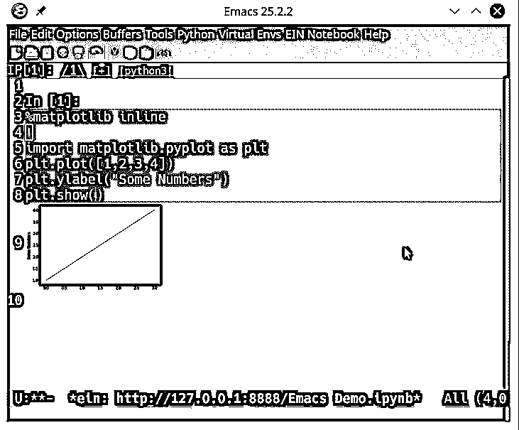](https://files.realpython.com/media/emacsv2-ein-add-new-cell-cropped.416eb37ae530.gif)

您可以使用`Ctrl`+`X``Ctrl`+`S`保存您的工作。

当您完成笔记本中的工作后，您可以使用`Ctrl`+`C``Ctrl`+`Shift`+`3`关闭笔记本。点击`Alt`+`X``ein:jupyter-server-stop`可以完全停止 Jupyter 服务器。Emacs 会问你是否要杀死服务器，关闭所有打开的笔记本。

当然，这只是 Jupyter 的冰山一角！你可以在[文档](https://tkf.github.io/emacs-ipython-notebook/)中探索`ein`包能做的一切。

[*Remove ads*](/account/join/)

## 测试支架

你能写出完美的代码，没有副作用，并且在任何情况下都运行良好吗？当然…不是！如果这听起来像你，那么你可以跳过一点。但是对于大多数开发人员来说，测试代码是一项要求。

`elpy`为运行[测试](https://elpy.readthedocs.io/en/latest/ide.html#testing)提供广泛的支持，包括支持:

*   [T2`unittest`](https://docs.python.org/3/library/unittest.html)
*   [T2`nose`](https://nose.readthedocs.io/en/latest/)
*   [T2`pytest`](https://docs.pytest.org/en/latest/)
*   [T2`green`](https://pypi.org/project/green/)
*   [扭氏`trial`](https://twistedmatrix.com/trac/wiki/TwistedTrial)
*   姜戈

为了展示测试能力，本教程的代码包括 Edsger Dijkstra 的[调车场算法](https://en.wikipedia.org/wiki/Shunting-yard_algorithm)的一个版本。该算法解析使用中缀符号编写的数学方程。您可以从下面的链接下载代码:

**下载代码:** [单击此处下载代码，您将在本教程中使用](https://realpython.com/bonus/emacs/)来了解用于 Python 的 Emacs。

首先，让我们通过查看项目文件夹来更全面地了解项目。您可以使用`Ctrl`+`X``D`在 Emacs 中打开文件夹。接下来，您将通过使用`Ctrl`+`X``3`垂直拆分框架，在同一框架中显示两个窗口。最后，您导航到左侧窗口中的测试文件，并单击它以在右侧窗口中打开它:

[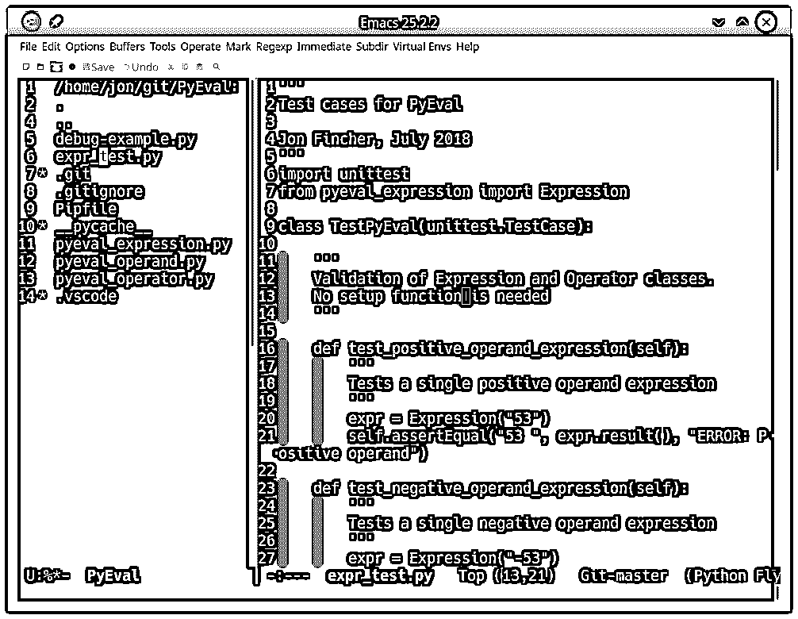](https://files.realpython.com/media/emacsv2-pyeval-split.ac6c0b9e67ce.png)

测试文件`expr_test.py`是一个基本的`unittest`文件，它包含一个包含六个测试的测试用例。要运行测试用例，键入`Ctrl`+`C``Ctrl`+`T`:

[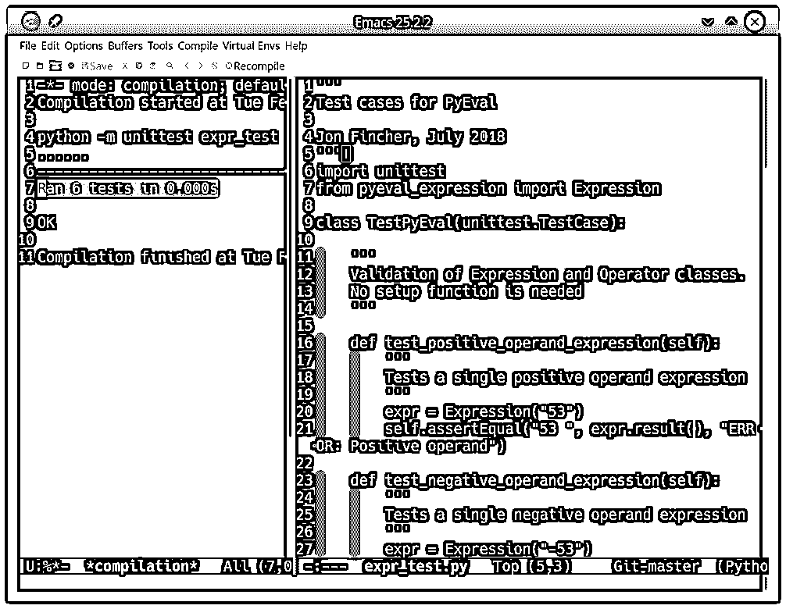](https://files.realpython.com/media/emacsv2-elpy-test-run.65dbd0ae9344.png)

结果显示在左侧窗口中。请注意所有六个测试是如何运行的。在键入`Ctrl`+`C``Ctrl`+`T`之前，您可以将光标放在测试文件中运行单个测试。

## 调试支持

当测试失败时，您需要钻研代码来找出原因。内置的 *python 模式*允许你使用 Emacs 通过`pdb`进行 python 代码调试。关于`pdb`的介绍，请查看[用 Pdb 进行 Python 调试](https://realpython.com/python-debugging-pdb/)。

下面是如何在 Emacs 中使用`pdb`:

1.  打开 PyEval 项目中的`debug-example.py`文件。
2.  键入 `Alt` + `X` `pdb`启动 Python 调试器。
3.  键入`debug-example.py` `Enter` 在调试器下运行文件。

一旦运行，`pdb`将水平分割框架，并在您正在调试的文件上方的窗口中打开它自己:

[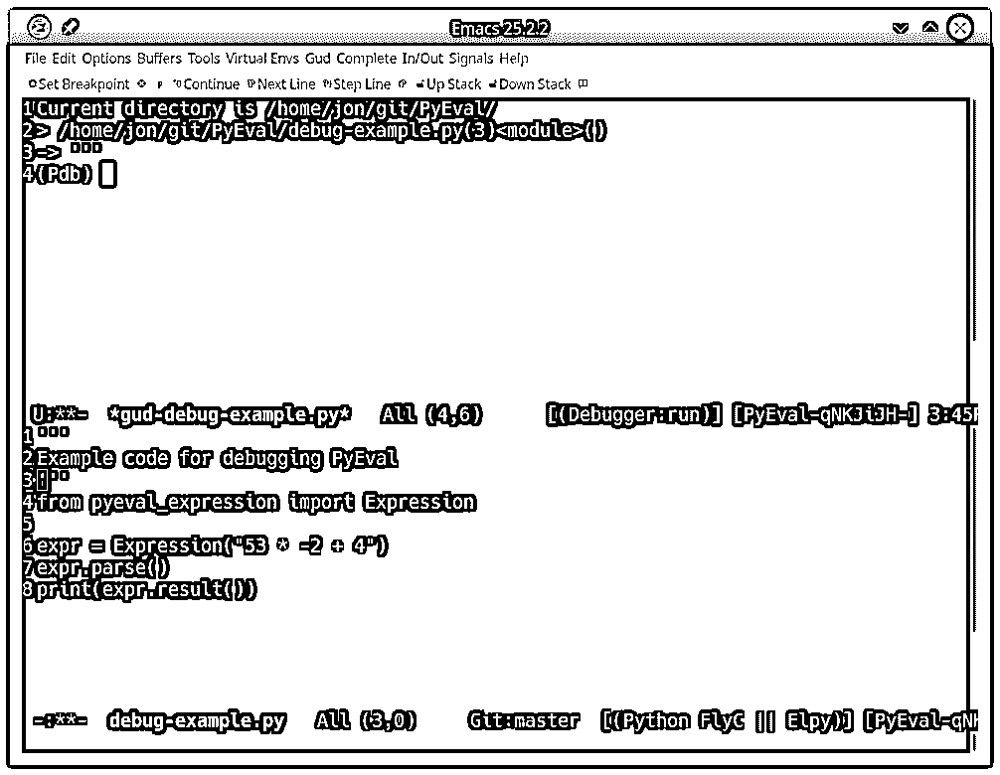](https://files.realpython.com/media/emacsv2-debug-start.ad624bb34c0d.png)

Emacs 中的所有调试器都作为 [**大统一调试器库**](https://www.gnu.org/software/emacs/manual/html_node/emacs/Debuggers.html#Debuggers) 的一部分运行，也称为 GUD。这个库为调试所有支持的语言提供了一致的接口。创建的缓冲区名称 **gud-debug-example.py** ，显示调试窗口是由 gud 创建的。

GUD 还将`pdb`连接到底部窗口中的实际源文件，该文件跟踪您的当前位置。让我们浏览一下这段代码，看看它是如何工作的:

[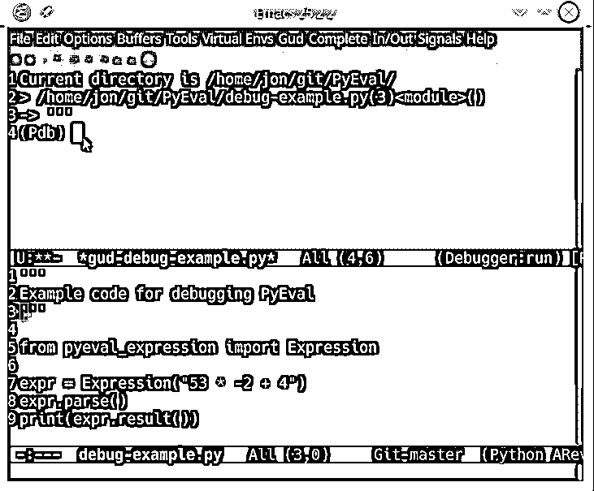](https://files.realpython.com/media/emacsv2-debug-step-cropped.026b32dea594.gif)

您可以使用两个键中的一个来单步调试`pdb`中的代码:

1.  `S` 步骤*进入*其他功能。
2.  `N` 步骤*结束*其他功能。

您将看到光标在下面的源代码窗口中移动，以跟踪执行点。当您执行函数调用时，`pdb`会根据需要打开本地文件以保持前进。

[*Remove ads*](/account/join/)

## Git 支持

没有对源代码控制的支持，任何现代的 IDE 都是不完整的。虽然存在许多源代码控制选项，但可以肯定的是大多数程序员都在使用 [Git](https://git-scm.com/) 。如果你没有使用源代码控制，或者需要学习更多关于 Git 的知识，那么请查看[为 Python 开发者提供的 Git 和 GitHub 介绍](https://realpython.com/python-git-github-intro/)。

在 Emacs 中，源代码控制支持由 [`magit`](http://magit.vc/) 包提供。通过在您的`init.el`文件中列出来安装`magit`:

```py
23(defvar  myPackages 24  '(better-defaults  ;; Set up some better Emacs defaults 25  elpy  ;; Emacs Lisp Python Environment 26  ein  ;; Emacs iPython Notebook 27  flycheck  ;; On the fly syntax checking 28  py-autopep8  ;; Run autopep8 on save 29  blacken  ;; Black formatting on save 30  magit  ;; Git integration  31  material-theme  ;; Theme 32  ) 33  )
```

重启 Emacs 后，`magit`就可以使用了。

让我们看一个例子。打开`PyEval`文件夹中的任意文件，然后输入 `Alt` + `X` `magit-status`。您将看到以下内容:

[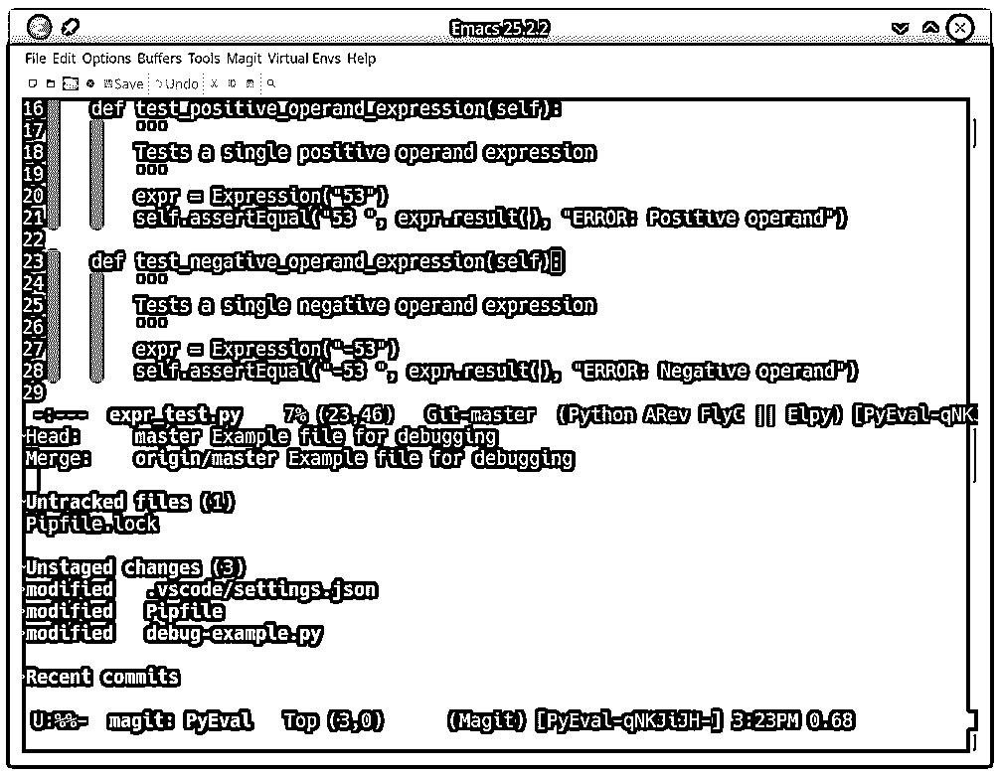](https://files.realpython.com/media/emacsv2-magit-status.cfea5c17003d.png)

激活后，`magit`分割 Emacs 帧，并在下方窗口显示其状态缓冲区。此快照列出了 repo 文件夹中已转移、未转移、未跟踪的文件以及任何其他文件。

你与`magit`的大部分交互都在这个状态缓冲区中。例如，您可以:

*   使用 `P` 和 `N` 在状态缓冲区的各部分之间移动
*   使用 `Tab` 展开或折叠一个部分
*   阶段变化使用 `S`
*   使用 `U` 取消登台变更
*   使用 `G` 刷新状态缓冲区的内容

一旦一个变更开始实施，您就可以使用 `C` 来提交它。您将看到各种提交变化。对于正常提交，再次点击 `C` 。您将看到两个新的缓冲区出现:

1.  下面的窗口包含 *COMMIT_EDITMSG* 缓冲区，这是您添加提交消息的地方。
2.  上面的窗口包含 *magit-diff* 缓冲区，显示您正在提交的更改。

输入提交消息后，键入`Ctrl`+`C``Ctrl`+`C`提交更改:

[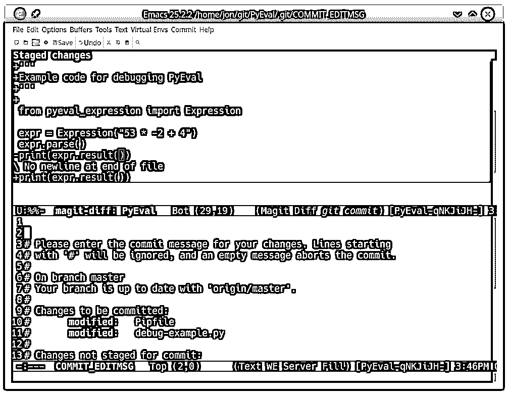](https://files.realpython.com/media/emacsv2-magit-commit.16e946ea787d.png)

您可能已经注意到状态缓冲区的顶部显示了*头*(本地)和*合并*(远程)分支。这允许您快速地将您的更改推送到远程分支。

查看*未合并到原点/主*下的状态缓冲区，找到您想要推送的更改。然后，点击 `Shift` + `P` 打开推送选项，点击 `P` 推送修改:

[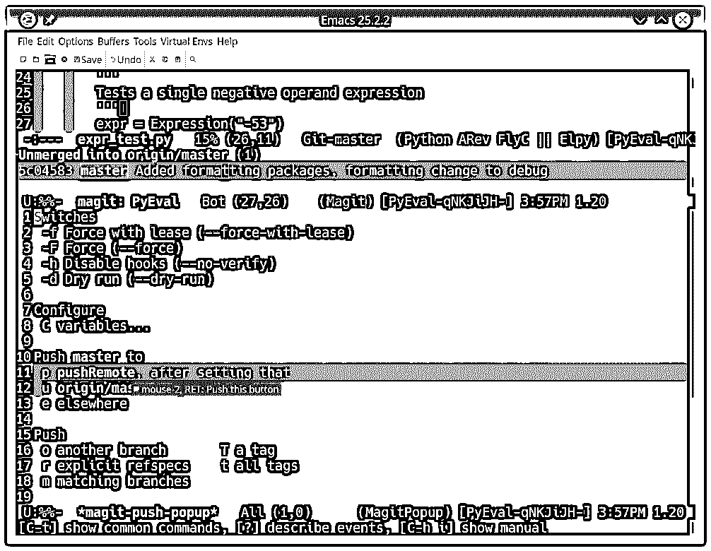](https://files.realpython.com/media/emacsv2-magit-push.5b46113558ba.png)

开箱即用，`magit`将与 GitHub 和 GitLab 以及许多其他源代码控制工具对话。关于`magit`及其功能的更多信息，请查看[的完整文档](https://magit.vc/manual/)。

## 附加 Emacs 模式

在特定于 Python 的 IDE 上使用 Emacs 的主要好处之一是能够使用其他语言。作为一名开发人员，您可能需要在一天之内处理 Python、Golang、JavaScript、Markdown、JSON、shell 脚本等等。在一个代码编辑器中对所有这些语言提供复杂而完整的支持将会提高您的效率。

有大量的示例 Emacs 初始化文件可供您查看并用来构建自己的配置。最好的来源之一是 GitHub。在 GitHub 上搜索 [emacs.d](https://github.com/search?q=emacs.d) 会出现大量选项供你筛选。

[*Remove ads*](/account/join/)

## 替代品

当然，Emacs 只是 Python 开发人员可以使用的几种编辑器之一。如果您对替代产品感兴趣，请查看:

*   [为全栈 Python 开发设置 Sublime Text 3](https://realpython.com/setting-up-sublime-text-3-for-full-stack-python-development/)
*   [Thonny:初学者友好的 Python 编辑器](https://realpython.com/python-thonny/)
*   [Python 开发中的 Visual Studio 代码](https://realpython.com/python-development-visual-studio-code/)
*   [VIM 和 Python——天作之合](https://realpython.com/vim-and-python-a-match-made-in-heaven/)
*   [PyCharm for Production Python 开发(指南)](https://realpython.com/pycharm-guide/)

## 结论

作为功能最丰富的编辑器之一，Emacs 非常适合 Python 程序员。Emacs 可在各种主流平台上使用，可定制性极强，可适应许多不同的任务。

现在您可以:

*   在您选择的平台上安装 Emacs
*   设置 Emacs 初始化文件来配置 Emacs
*   为 Emacs 构建基本的 Python 配置
*   编写 Python 代码来探索 Emacs 的功能
*   在 Emacs 环境中运行和测试 Python 代码
*   使用集成的 Emacs 工具调试 Python 代码
*   使用 Git 添加源代码控制功能

在您的下一个 Python 项目中尝试 Emacs 吧！您可以从下面的链接下载本教程中引用的所有文件:

**下载代码:** [单击此处下载代码，您将在本教程中使用](https://realpython.com/bonus/emacs/)来了解用于 Python 的 Emacs。**********