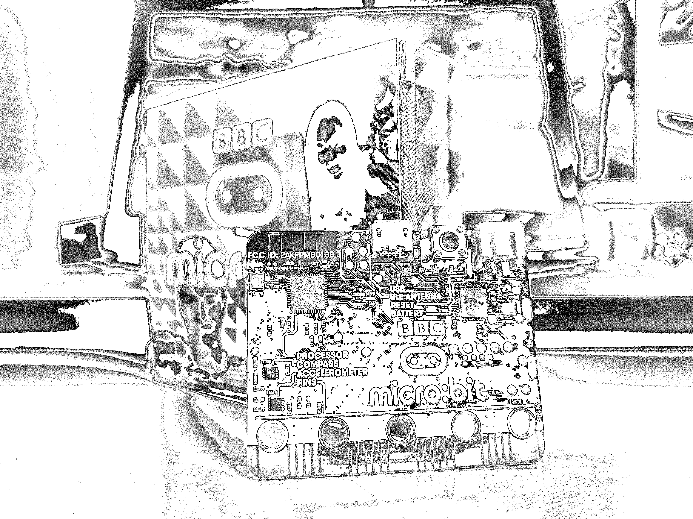
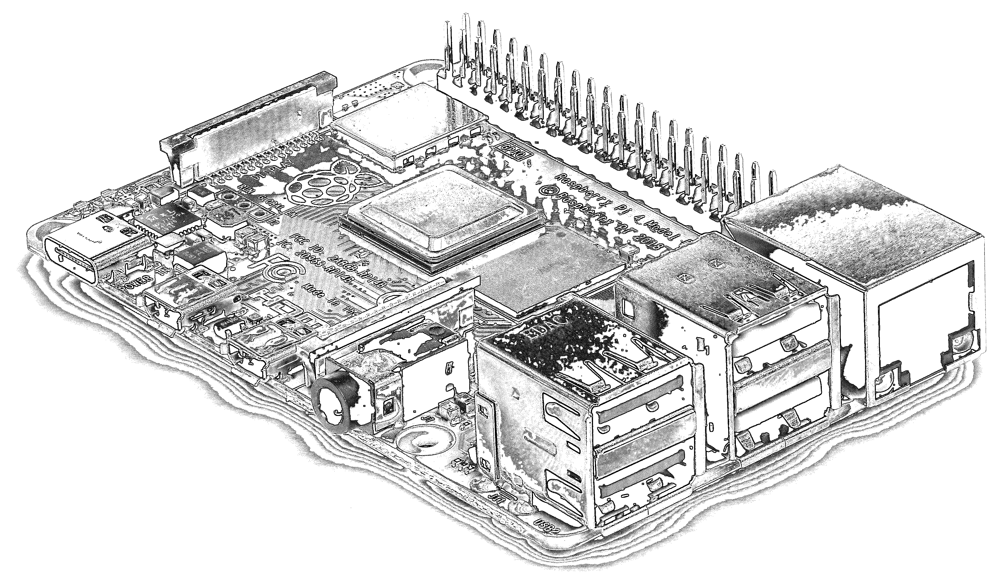
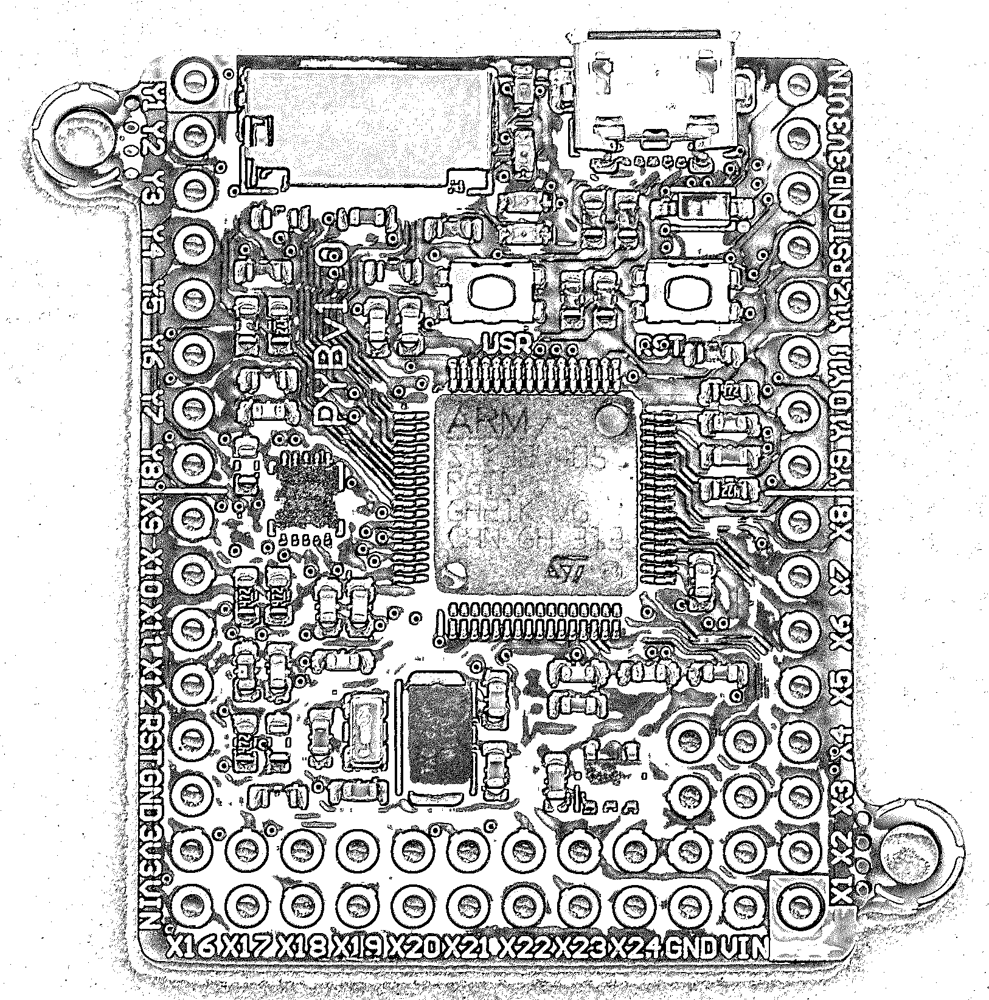
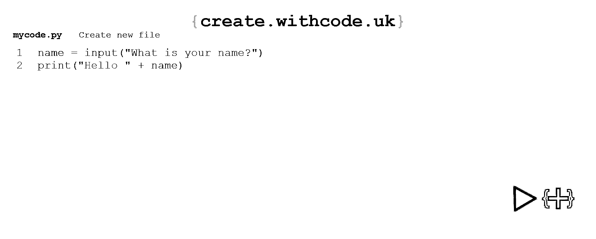
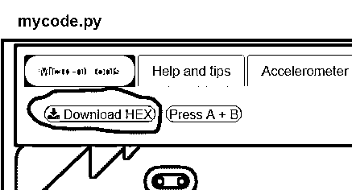
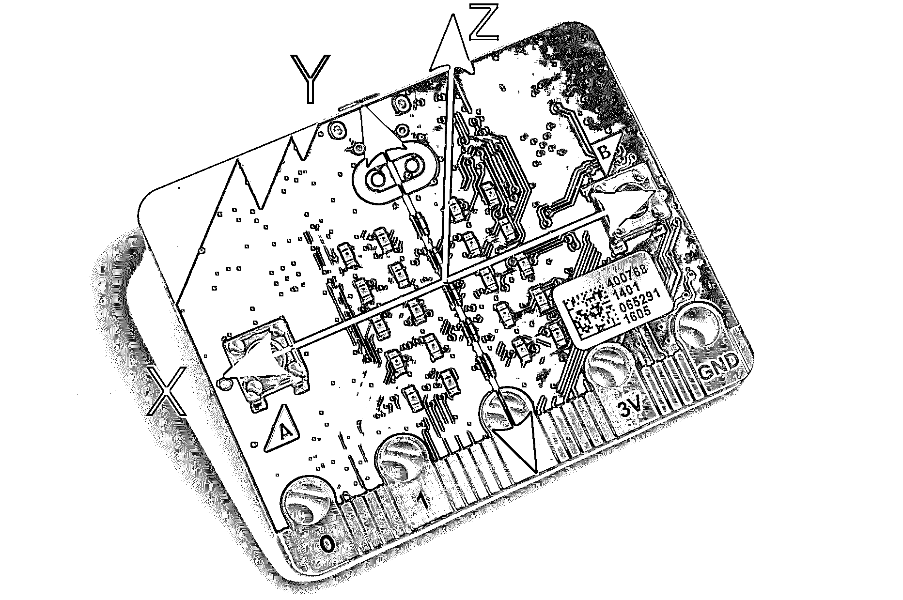

# 嵌入式 Python:在 BBC micro 上构建游戏:bit

> 原文：<https://realpython.com/embedded-python/>

编写在终端或网络浏览器中运行的代码很有趣。然而，编写影响现实世界的代码在另一个层面上是令人满意的。编写这种代码被称为**嵌入式开发**，Python 使得它比以往任何时候都更容易访问！

在本教程中，您将学习:

*   什么是**嵌入式开发**以及为什么你会使用 Python 来做这件事
*   在嵌入式系统上运行 Python，你的硬件和软件选项分别是什么
*   什么时候 Python 适合嵌入式系统，什么时候不适合
*   如何用 **MicroPython** 在 BBC micro:bit 上写一个基础游戏

本教程包含代码片段，允许你在 [BBC micro:bit](https://microbit.org/new-microbit/) 上构建一个简单的游戏。要访问完整代码并预览您将要构建的内容，请单击下面的链接:

**获取示例代码:** [单击此处获取示例代码，您将在本教程中使用](https://realpython.com/bonus/embedded-python-code/)来学习使用 Python 进行嵌入式开发。

## 什么是嵌入式开发？

嵌入式开发是为任何非通用计算机的设备编写代码。这个定义有点模糊，所以一些例子可能会有帮助:

*   **通用计算机**包括笔记本电脑、台式电脑、智能手机等等。
*   **嵌入式系统**包括洗衣机、数码机、机器人等等。

一般来说，如果你不把某个东西叫做计算机，但是它仍然有代码在上面运行，那么它很可能是一个嵌入式系统。这个名字来自于*将*一台计算机嵌入到一个物理系统中来执行一些任务的想法。

嵌入式系统往往被设计为执行单一任务，这就是为什么我们将普通计算机称为“通用计算机”:它们被设计为执行多项任务。

就像你需要一台计算机来运行常规代码一样，要运行嵌入式代码，你需要某种硬件。这些硬件通常被称为**开发板**，本教程将向您介绍一些用于运行 Python 的开发板。

[*Remove ads*](/account/join/)

## 用于嵌入式开发的 python

学习 Python 最大的好处之一就是它适用于很多地方。您可以编写在任何地方运行的代码，甚至可以在嵌入式系统上运行。在本节中，您将了解在嵌入式项目中使用 Python 的利弊，以及开始时需要注意的一些事情。

### 使用 Python 的好处

Python 在构建嵌入式系统时带来的核心好处是开发速度。Python 有可用于大多数任务的库，这对于它的嵌入式实现来说仍然是正确的。您可以专注于构建您的系统，因为您遇到的许多问题已经解决了。

因为 Python 比其他常见的嵌入式语言更高级，所以你将编写的代码会更简洁。这有助于提高开发速度，意味着您可以更快地编写代码，但也有助于让您的代码易于理解。

Python 是[内存管理的](https://realpython.com/python-memory-management/)。嵌入式开发的常见选择 C++，却不是。在 C++中，你负责在用完内存后释放内存，这是很容易忘记的事情，会导致你的程序耗尽内存。Python 会帮你做到这一点。

### 使用 Python 的缺点

虽然 Python 的内存管理很有帮助，但它确实会导致较小的速度和内存开销。MicroPython 文档对内存问题进行了很好的讨论。

另外要考虑的是 Python **解释器**本身占用空间。使用编译语言，程序的大小仅仅取决于你的程序，但是 Python 程序需要运行它们的解释器。Python 解释器也占用 RAM。在 micro:bit 上，你不能用 Python 写蓝牙代码，因为没有足够的空间同时容纳 Python 和蓝牙。

因为 Python 是被解释的，所以它永远不可能像编译语言一样快。解释语言在运行之前需要[解码每条指令](https://realpython.com/cpython-source-code-guide/)，但是编译语言可以直接运行。然而在实践中，这并不重要，因为 Python 程序对于大多数用例来说仍然运行得足够快。

### 初涉嵌入式开发时需要注意的事项

现代计算机有大量的内存可供使用。当你对它们编程时，你不必太担心你创建的列表的大小或者一次加载整个文件。然而，嵌入式系统的内存有限。当你写程序的时候，你必须小心，不要一次在内存中有太多的东西。

同样，嵌入式系统上的处理器速度比台式电脑慢得多。处理器的速度决定了代码执行的速度，所以在嵌入式计算机上运行程序比在台式计算机上运行要花更长的时间。更重要的是考虑嵌入式代码的效率——你不希望它永远运行下去！

对嵌入式系统进行编程时，最大的变化可能是电源需求。笔记本电脑、电话和台式电脑要么插在墙上，要么有大电池。嵌入式系统通常有很小的电池，并且必须持续很长时间，有时甚至几年。你运行的每一行代码都要消耗一点点电池寿命，所有这些加起来。

以下是你开始工作时应该注意的其他一些事情:

*   如果您的设备上有网络连接，那么它可能很慢或不可靠。
*   可供选择的库要少得多。
*   嵌入式系统通常没有大量的**持久存储**。

嵌入式开发是一个很大的领域，新人需要学习很多东西。但是现在，请记住在嵌入式系统上编写精益代码更重要。这使得嵌入式系统非常有利于提高代码的学习效率！

## 运行嵌入式 Python 的硬件选项

在编写任何嵌入式代码之前，您必须选择代码将在什么硬件上运行。有大量的开发板可供选择，即使是运行 Python 的开发板。您的选择将取决于您使用它们的项目。在本节中，您将了解一些可用的选项。

### BBC 微:位

BBC micro:bit 是一个为教育用途而设计的嵌入式系统。在 micro:bit 上有许多组件，包括按钮、5x5 LED 屏幕、扬声器和麦克风、加速度计和蓝牙模块。不幸的是，蓝牙模块[无法与 Python](https://microbit-micropython.readthedocs.io/en/v1.0.1/ble.html) 一起使用，但你仍然可以直接使用收音机。它可以在 Scratch、[、JavaScript](https://realpython.com/python-vs-javascript/) 以及最重要的 Python 中编程。

这里有一张背面的照片，展示了一些可用的酷组件:

[](https://files.realpython.com/media/BBC_Micro_Bit_with_original_Packaging.b37fdae5e6d4.jpg)

<figcaption class="figure-caption text-center">The BBC micro:bit (Image: [Wikipedia/Aruld](https://en.wikipedia.org/wiki/Micro_Bit#/media/File:BBC_Micro_Bit_with_original_Packaging.jpg))</figcaption>

micro:bit 在网上有很多[很棒的资源](https://microbit.org/projects/)可以帮助你开始并提出项目想法。

[*Remove ads*](/account/join/)

### 树莓派

大多数 Raspberry Pis 在技术上是单板计算机，而不是嵌入式系统，但它们仍然允许通过 GPIO 引脚访问外部硬件。该规则的一个例外是 [Raspberry Pi Pico](https://www.raspberrypi.org/products/raspberry-pi-pico/) ，它是一个微控制器开发板。其他 Raspberry Pis 运行 Linux，这意味着您可以将它们用作完整的计算机，并且所有 pi 都支持 Python。

有一些不同型号的 Raspberry Pi 可用，但它们都能够运行 Python 并与电子设备一起工作。您应该选择哪种模型取决于您的项目需求。这是最新型号之一:

[](https://files.realpython.com/media/Raspberry_Pi_4_Model_B_-_Side.f60d99207340.jpg)

<figcaption class="figure-caption text-center">The Raspberry Pi 4 Model B (Image: [Michael Henzler/Wikimedia Commons](https://en.wikipedia.org/wiki/Raspberry_Pi#/media/File:Raspberry_Pi_4_Model_B_-_Side.jpg))</figcaption>

你可以在[官方网站](https://www.raspberrypi.org/products/)上找到更多关于不同型号的树莓派的信息。关于一个你可以用 Raspberry Pi 和 Python 做的项目的例子，请看[在 Raspberry Pi](https://realpython.com/python-raspberry-pi/) 上用 Python 构建物理项目。

### pyboard

pyboard 是一种电子开发板，设计用于运行 MicroPython。它比 micro:bit 强大得多，但没有任何额外的好处，如 micro:bit 的板载屏幕和传感器。这是 pyboard 1.0:

[](https://files.realpython.com/media/PYBv10b-photo-front.7a5e34ff49e6.jpg)

<figcaption class="figure-caption text-center">The pyboard 1.0 (Image: [GitHub micropython/pyboard](https://github.com/micropython/pyboard/blob/ec17781d5b6ff0219b4674fbff17514f94fefaimg/PYBv10b-photo-front.jpg))</figcaption>

你可能会注意到黑板上有许多金色的圆圈。这些被称为**引脚**，用于将 pyboard 连接到其他电子元件。例如，如果你正在制造一辆遥控汽车，你可能会连接一些马达。

### 其他

有很多兼容 Python 的板和工具包，这里就不一一列举了。然而，有几个有趣的问题值得一提:

*   来自 Pycom 的 [LoPy](https://pycom.io/product/lopy4/) 连接到专门的物联网网络，如 [LoRa](https://en.wikipedia.org/wiki/LoRa) 和 [Sigfox](https://www.sigfox.com/en) 。
*   [基于 ESP8266](https://en.wikipedia.org/wiki/ESP8266) 的主板都运行 MicroPython。ESP8266 是一款支持 Wi-Fi 的廉价微控制器。它的继任者， [ESP32](https://en.wikipedia.org/wiki/ESP32) 系列芯片也全部运行 MicroPython。
*   Python 也在任天堂 DS 上运行。对于初学者来说，设置看起来有点复杂，但这个项目太有趣了，不能不提。

有许多兼容 MicroPython 的主板，超出了本教程的篇幅。你应该做一些研究，为你的项目找到合适的。一个好的起点可能是 Adafruit 的 MicroPython 商店。

## 编写嵌入式 Python 的软件选项

当你在电脑上安装 Python 时，你通常会安装 Python 的一个特定的**实现**，叫做 [CPython](https://realpython.com/products/cpython-internals-book/) 。Python 的实现是运行 Python 代码的程序。

您可以将 CPython 称为默认的 Python 实现，因为它是由定义语言本身的人编写的。然而，CPython 并不是 Python 的唯一实现。在这一节中，您将了解一些专门针对编写嵌入式代码的实现。

### MicroPython

MicroPython 是事实上的标准嵌入式 Python 实现。它是一个 Python 3.x 实现，设计用于在微控制器上运行。它不是 100%兼容 CPython，但是非常接近。这意味着，如果您已经编写了在 Python 3.4 版本上运行的代码，那么您很有可能让它在 MicroPython 上运行。

### 电路表面

CircuitPython 是 MicroPython 的一个分支，支持略有不同的[电路板列表](https://circuitpython.org/downloads)，并做了一些更改，使其对初学者更加友好。在很大程度上，使用 CircuitPython 和使用 MicroPython 的体验是非常相似的。如果您的主板只支持 CircuitPython 而不支持其他实现，您可能会选择使用 circuit python。

[*Remove ads*](/account/join/)

## 项目:一个西蒙说游戏在 BBC 微:位

没有什么比得上实践经验，所以在这一节中，您将在 BBC micro:bit 上构建一个 Simon Says 游戏。没有也不用担心！网上有**模拟器**供你入门。

西蒙说是一种儿童游戏，一个人向一群人发出指令。如果他们在他们的指令前加上“西蒙说”，那么团队就必须这么做。如果他们没有先说“西蒙说”就给出了指令，那么这个小组必须忽略这个指令。为了使我们的游戏更简单，我们将只关注给出指令的部分。

游戏将按如下方式运行:

*   微:bit 会想到一个方向，并告诉玩家。
*   玩家将尝试在那个方向倾斜微型钻头。
*   如果玩家设法及时正确地倾斜微型钻头，那么他们就得一分！
*   如果玩家没有及时做出正确的倾斜，那么 micro:bit 会显示他们的分数，游戏重新开始。

在开始编码之前，您需要设置您的环境。

### 设置您的环境

无论您是否有实际的 micro:bit，开始编码的最快途径是使用可用的在线编辑器。对于本教程，您将使用[create . with 代码编辑器](https://create.withcode.uk/)。当您打开编辑器时，您将看到以下屏幕:

[](https://files.realpython.com/media/createwithcodeeditor2.216d4ce48f8f.png)

文本缓冲区占据了屏幕的大部分，您可以在这里输入代码。在右下角，你会看到一个播放按钮。一旦你写了代码，这将允许你运行它。

### 在屏幕上显示指令

你的游戏需要做的第一件事是想出一个方向并告诉玩家。为了这个游戏的目的，你可以使用三个方向:`left`、`right`和`stay still`。您的代码需要选择其中一个方向，并显示给玩家。这将被包裹在一个[无限`while`循环](https://realpython.com/python-while-loop/)中，这样它就可以多次运行。

**注意:**无限`while`循环在嵌入式编程中比在其他类型的编程中更常见。这是因为嵌入式系统倾向于只做一项工作，所以没有挂起系统和阻止其他程序运行的风险。

下面是您的代码可能的样子:

```py
from microbit import *
from random import randrange

# Define left, stay still, and right
directions = ["L", "O", "R"]

# While the micro:bit is on
while True:
    # Pick a random direction
    direction = directions[randrange(3)]
    display.show(direction)
    # Sleep for a second (1000ms)
    sleep(1000)
```

这段代码将每秒显示一个不同的随机方向。前两行导入了必要的函数:

1.  `microbit`模块包含与 micro:bit 接口所需的所有代码。例如，`display`和`accelerometer`模块就在这里。`microbit`模块在 micro:bit 上预装了 MicroPython，因此当您在计算机上运行代码时，如果您试图导入它，可能会遇到错误。
2.  [`random`模块](https://realpython.com/python-random/)允许你选择一个随机数。

在[导入](https://realpython.com/python-import/)后，代码定义了`directions`列表。这包含三个代表可用方向的字符。用字符定义该列表的优点是它们可以直接显示，因为 micro:bit 屏幕一次只能显示一个字符。

`while True:`循环告诉 micro:bit 永远运行其中的代码。实际上，这意味着它将在 micro:bit 通电时运行。在内部，代码首先用`randrange()`选择一个随机方向并显示出来。之后，它[睡了](https://realpython.com/python-sleep/)一秒钟。这迫使 micro:bit 在一秒钟内什么也不做，这确保了播放器有时间看到指令。

### 运行您的代码

现在您已经有了一些代码，您可以运行它了！谢天谢地，你不需要一个 micro:bit 来运行你的代码，因为你的编辑器自带了一个内置的模拟器。您可以通过单击右下角的 play 按钮来访问它并运行您的代码。

当您点按播放按钮时，您将在编辑器中看到以下叠层弹出式菜单:

[https://player.vimeo.com/video/529426743?background=1](https://player.vimeo.com/video/529426743?background=1)

在它里面，你会看到一个 micro:bit，屏幕会显示方向列表中的随机字符。如果没有，那么尝试将上面的代码复制到编辑器中，然后再次单击 play 按钮。

注意:create . with code 模拟器是一个很好的资源，但是它有时会有一些问题。如果您遇到问题，以下内容可能会有所帮助:

*   有时，当您将代码粘贴到编辑器中时，它看起来像是编辑器屏幕的一半已经消失了。单击编辑器中的任意位置，让它返回。
*   如果在再次运行代码之前没有按下红色按钮来停止代码，它有时会同时运行代码的两个实例，从而导致奇怪的输出。在再次运行代码之前按下红色的停止按钮可以解决这个问题。

如果你是一个更高级的程序员，你可以使用用于代码自动完成的[Device Simulator Express extension](https://marketplace.visualstudio.com/items?itemName=ms-python.devicesimulatorexpress)和[伪 microbit 模块](https://pypi.org/project/pseudo-microbit/)将 [Visual Studio 代码](https://realpython.com/python-development-visual-studio-code/)设置为 micro:bit 开发环境。

这是您将在本教程的剩余部分遵循的一般开发流程。

[*Remove ads*](/account/join/)

### 可选:在物理微处理器上运行代码:bit

如果您有一个物理的 micro:bit，那么运行您的代码需要几个额外的步骤。你需要下载一个`.hex`文件，然后把它复制到你的 micro:bit 上。

要下载`.hex`文件，请在编辑器中查找以下按钮:

[](https://files.realpython.com/media/dothexbutton2.6af6b2b76848.png)

这将要求您将文件保存到您的计算机。保存它，然后抓住你的微:位。使用 USB 电缆将 micro:bit 连接到计算机。您应该会看到它以与 USB 驱动器相同的方式出现。

要对 micro:bit 编程，请将下载的`.hex`文件拖到您的 micro:bit 上。micro:bit 背面的红色 LED 应该会闪烁。一旦它停止，你的程序就被加载到设备上，并立即开始执行！

小贴士:如果你遇到困难，这里有一些小贴士可以帮到你:

*   如果你需要从头开始重新启动程序，在 micro:bit 的背面，USB 连接器旁边有一个重置按钮。
*   代码中的错误会在屏幕上滚动。如果你有耐心观察他们，他们会给你一些如何修改脚本的好线索。

你必须非常努力地打破你的微型钻头！如果出现问题，仔细检查你的代码，不要害怕尝试，即使你不确定它是否可行。

现在您已经为开发设置好了 micro:bit，您已经准备好继续进行一些编码工作了。

### 获取玩家输入

既然 micro:bit 可以告诉玩家该做什么，那么是时候获取玩家的输入了。为此，您将使用**加速度计**。加速度计是一种测量运动的设备。它可以判断 micro:bit 是否正在向特定方向移动，对于游戏来说重要的是，micro:bit 是否正在向特定方向倾斜。请看下图:

[](https://files.realpython.com/media/microbitaxes2.4496d874c662.png)

<figcaption class="figure-caption text-center">Image: [Gareth Halfacree, CC-BY-SA (modified)](https://www.flickr.com/photos/120586634@N05/26146399942)</figcaption>

在图中，你会看到三个**轴** : X、Y 和 z。这些轴就像你可能在学校的图表中看到的轴一样。X 轴代表左右运动，Y 轴代表上下运动，Z 轴代表朝向或远离你的运动。

micro:bit 上的加速度计返回这三个轴的值。因为你的游戏只关心左右倾斜，所以现在你只需要 X 轴。`accelerometer.get_x()`返回范围`(-2000, 2000)`内的值，其中`-2000`一直向左倾斜，`2000`一直向右倾斜。

您获取玩家输入的代码需要采取三个步骤:

1.  读取加速度计的 X 值。
2.  决定 X 值是代表向左、向右还是静止不动。
3.  判断这是否是正确的前进方向。

下面是完成这些步骤的代码:

```py
# Previous code...

while True:
    # Previous code...

    # Get the X-axis (left-right) tilt
    acc_x = accelerometer.get_x()
    # Determine direction
    if acc_x < -200:
        player_in = "L"
    elif abs(acc_x) < 200:
        player_in = "O"
    elif acc_x > 200:
        player_in = "R"

    # Check win condition
    if player_in == direction:
        # Player input correctly
        display.show(Image.HAPPY)
    else:
        display.show(Image.SAD)
    sleep(1000)
```

这段代码有点长，因为你必须检查许多不同的条件。你要做的第一件事是用`accelerometer.get_x()`从加速度计获得 X 轴值。记住，这将在`(-2000, 2000)`范围内。

获得 X 值后，您将运行一系列检查来确定它代表哪个运动。任何方向上大于`200`的都被认为是倾斜的，任何小于`200`的都被认为是静止的。

`abs()`通过从加速度计值中去除负号来帮助缩短代码。这意味着范围`(-200, 200)`内的数字将被视为静止不动。你可能想用这个门槛来让游戏变得更有挑战性。

从玩家那里得到方向输入后，你检查它是否正确。如果方向正确，那么代码会显示一张笑脸。否则，它会显示一张悲伤的脸。然后代码休眠一秒钟，让玩家看到结果，而不会很快消失。

[*Remove ads*](/account/join/)

### 在模拟器中测试加速度计代码

由于加速度计是一种检测物理运动的传感器，您可能想知道如何在模拟器中与之交互。幸运的是，模拟器提供了一个虚拟加速度计，你可以用鼠标控制。

[https://player.vimeo.com/video/529426412?background=1](https://player.vimeo.com/video/529426412?background=1)

通过单击右下角的 play 按钮，像以前一样运行代码。您将看到微:位叠加出现。覆盖图的顶部有一些选项卡，用于控制 micro:bit 的各个组件。点击标签为*加速计*的标签。

在该选项卡中，您将看到三个滑块，每个轴一个。您将使用 X 轴滑块来测试您的游戏。

当您向右移动滑块时，加速度计的 X 值将增加。同样，当您向左移动滑块时，X 值将减小。这相当于左右倾斜 micro:bit，让你在浏览器里玩游戏。

### 分与失

现在基础游戏已经就绪，是时候考虑增加点数和输掉来完成游戏了。请记住，规范中描述的行为是，当玩家失败时，micro:bit 将显示玩家到该点为止的总点数。如果玩家答对了，那么 micro:bit 不应该显示任何内容:

```py
# Previous code...
points = 0

while True:
    # Previous code...

    if player_in == direction:
        # Player's input is correct
        points += 1
    else:
        display.scroll(points)
        display.show(Image.SAD)
        points = 0
        sleep(1000)
```

谢天谢地，这是一个比前一步更小的变化。在`while`循环之外，定义一个[变量](https://realpython.com/python-variables/) `points`来跟踪玩家的点数。

再往下，您已经更改了对玩家输入方向是否正确的检查。如果玩家移动了正确的方向，你将增加他们的总点数`1`。否则，你用`display.scroll()`使总点数在屏幕上滚动，显示一张悲伤的脸，并重置总点数。

您还将`sleep()`移动到损失代码中，因为没有显示图像来纠正它。这使得游戏稍微更具挑战性！

为了帮助你检查你的代码并巩固你所学到的，这里是游戏的完整代码:

```py
from microbit import display, Image, accelerometer, sleep
from random import randrange

# Define left, stay still, and right
directions = ["L", "O", "R"]
points = 0

# While the micro:bit is on
while True:
    # Pick a random direction
    direction = directions[randrange(3)]
    display.show(direction)
    # Sleep for a second (1000ms)
    sleep(1000)

    # Get the X-axis (left-right) tilt
    acc_x = accelerometer.get_x()
    # Determine direction
    if acc_x < -200:
        player_in = "L"
    elif abs(acc_x) < 200:
        player_in = "O"
    elif acc_x > 200:
        player_in = "R"

    # Check win condition
    if player_in == direction:
        # Player's input is correct
        points += 1
    else:
        display.scroll(points)
        display.show(Image.SAD)
        points = 0
        sleep(1000)
```

恭喜你建立了自己的游戏！您会注意到，这段代码包括注释在内仅占 30 多行，比传统嵌入式语言中的等效程序要短得多。

### 更进一步

现在，您已经在嵌入式系统上构建了一个完整的游戏！如果你想要一些额外的挑战，这里有一些想法:

*   合并其他加速度计轴，并将其转换为微型:位版本的 [Bop It](https://en.wikipedia.org/wiki/Bop_It) ！
*   缩短玩家移动微型钻头的时间，如果他们得到正确的数字。你能做到的最短时间是多少？你认为这是为什么？
*   包括[加速度计手势](https://microbit-micropython.readthedocs.io/en/v1.0.1/accelerometer.html#microbit.accelerometer.current_gesture)。开箱后，micro:bit 可以检测抖动、面朝下或面朝上，甚至是自由落体。
*   加入多人游戏功能，这样你就可以和朋友一起玩了。micro:bit 有一个[无线电模块](https://microbit-micropython.readthedocs.io/en/v1.0.1/radio.html)，允许 micro:bit 之间的通信。

这份清单并不确定，但应该会让你思考。如果你想出了一个很酷的延长游戏的方法，那么请在评论中分享吧！

## 延伸阅读

嵌入式开发是一个巨大的领域，有很多东西需要学习。如果你想学习更多关于 Python 嵌入式开发的知识，那么谢天谢地，这里有很多很棒的资源。这里有一些链接让你开始。

[*Remove ads*](/account/join/)

### 微:位资源

micro:bit 最大的好处之一就是它收集了大量的教育资源:

*   **[【microbit.org】](https://microbit.org/)**:官微:bit 网站，有项目、课程和更多代码编辑器
*   **[micro:bit MicroPython docs](https://microbit-micropython.readthedocs.io/)**:micro:bit 上 Python 的高可读性文档
*   **[在 BBC 上建立一个贪吃蛇游戏微:bit](https://www.cameronmacleod.com/blog/microbit-snake)** :一个更复杂游戏的教程，带你慢慢完成这个过程

micro:bit 教育基金会最近发布了 Micro:bit 第二版,这将有望鼓励全新的资源浪潮。

### 其他运行 Python 的主板

micro:bit 并不是唯一的主板。为您的项目找到合适的解决方案绝对值得探索:

*   **[MicroPython 板卡教程](https://docs.micropython.org/en/latest/index.html)** : MicroPython 对其支持的部分板卡有一些官方教程。例如，这里有一个用于 [ESP8266](https://docs.micropython.org/en/latest/esp8266/tutorial/index.html) 的。
*   **[【Hackaday project tagged MicroPython](https://hackaday.io/projects?tag=micropython)**】:这个网站的特色是记录人们已经建立的项目，可以给你一些灵感！
*   **[Pycom 教程](https://docs.pycom.io/tutorials/)** : Pycom 制作兼容 MicroPython 的板卡，有能力连接各种网络。这些教程是了解可能性的好方法。

还有许多运行 Python 的有趣设备。你一定会找到一个适合你的项目。

## 结论

Python 是为嵌入式系统编写代码的绝佳选择。它使您能够更快地开发您的代码，并提供您在低级语言中找不到的安全保证。现在，您已经掌握了使用 Python 开始嵌入式开发之旅的知识，并且熟悉了一些可用的选项。

**在本教程中，您学习了:**

*   什么是**嵌入式开发**以及为什么你会使用 Python 来做这件事
*   编程**嵌入式系统**和**通用计算机**有什么区别
*   为嵌入式系统编写 **Python** 代码有哪些选项
*   如何用 **MicroPython** 在 BBC micro:bit 上写一个基础游戏

嵌入式开发是一个广阔而令人兴奋的领域，充满了有趣的发现。继续学习，一定要在下面的评论里分享你的发现！

如果您想从本教程下载代码以供离线参考，请单击下面的链接:

**获取示例代码:** [单击此处获取示例代码，您将在本教程中使用](https://realpython.com/bonus/embedded-python-code/)来学习使用 Python 进行嵌入式开发。******