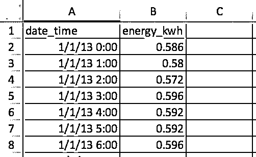

# 快速、灵活、简单和直观:如何加快您的熊猫项目

> 原文：<https://realpython.com/fast-flexible-pandas/>

如果您使用大数据集，您可能还记得在您的 Python 旅程中发现 [Pandas](https://realpython.com/pandas-python-explore-dataset/) 库的“啊哈”时刻。Pandas 是[数据科学和分析](https://realpython.com/tutorials/data-science/)的游戏规则改变者，特别是如果你来到 Python，因为你正在寻找比 Excel 和 VBA 更强大的东西。

那么，是什么让像我这样的数据科学家、分析师和工程师对熊猫赞不绝口呢？熊猫文件上说它使用了:

> "**快速**、**灵活**，以及富有表现力的数据结构，旨在使处理“关系型”或“标签型”数据既**简单**又**直观**。"

快速、灵活、简单、直观？听起来很棒！如果您的工作涉及构建复杂的数据模型，您不希望花费一半的开发时间来等待模块在大数据集中产生。您希望将您的时间和智慧用于解释您的数据，而不是费力地使用功能较弱的工具。

## 但是我听说熊猫很慢…

当我第一次开始使用 Pandas 时，我被告知，虽然它是一个剖析数据的伟大工具，但 Pandas 太慢了，不能用作[统计建模](https://realpython.com/python-statistics/)工具。一开始，这被证明是正确的。我花了几分钟多的时间摆弄我的拇指，等待熊猫通过数据搅动。

但后来我了解到，Pandas 是建立在 NumPy 数组结构之上的，它的许多操作都是用 C 实现的，要么通过 NumPy，要么通过 Pandas 自己的 Python 扩展模块的[库](https://github.com/pandas-dev/pandas/tree/master/pandas/_libs)，这些模块是用 Cython 编写并编译成 C 的。所以，Pandas 不应该也很快吗？

如果你按照预期的方式使用它，它绝对应该是！

矛盾的是，就效率而言，本来“看起来”像“T0”的 Pythonic 代码在熊猫身上可能不是最理想的。像 NumPy 一样， [Pandas 是为矢量化操作而设计的](https://realpython.com/numpy-array-programming/#what-is-vectorization)，可以在一次扫描中对整个列或数据集进行操作。单独考虑每个“单元格”或行通常应该是最后一招，而不是第一招。

[*Remove ads*](/account/join/)

## 本教程

需要明确的是，这不是一个关于如何过度优化你的熊猫代码的指南。如果使用正确，熊猫已经可以跑得很快。此外，优化和编写干净的代码有很大的区别。

这是一个使用熊猫 python 化的指南，以充分利用其强大和易于使用的内置功能。此外，您将学到一些实用的省时技巧，这样您就不会每次处理数据时都笨手笨脚。

在本教程中，您将涵盖以下内容:

*   将`datetime`数据用于时间序列的优势
*   进行批量计算的最有效途径
*   通过 HDFStore 存储数据节省时间

为了演示这些主题，我将举一个我日常工作中的例子，看看电力消耗的时间序列。加载完数据后，您将通过更有效的方式继续前进，以获得最终结果。对大多数熊猫来说都适用的一个格言是，从 A 到 b 有不止一种方法。然而，这并不意味着所有可用的选项都将同样适用于更大、要求更高的数据集。

假设你已经知道如何在熊猫中做一些基本的[数据选择，那就开始吧。](https://pandas.pydata.org/pandas-docs/stable/indexing.html)

## 手头的任务

此示例的目标是应用分时电价来计算一年的总能耗成本。也就是说，在一天中的不同时间，电价是不同的，因此任务是将每小时消耗的电力乘以该小时消耗电力的正确价格。

让我们从一个 [CSV 文件](https://github.com/realpython/materials/blob/master/pandas-fast-flexible-intuitive/tutorial/demand_profile.csv)中读取数据，该文件有两列:一列是日期加时间，另一列是以千瓦时(kWh)为单位的电能消耗:

[](https://files.realpython.com/media/csv_image.86d313f7aab0.jpg)

这些行包含每个小时的用电量，因此全年有 *365 x 24 = 8760* 行。每一行表示当时“小时开始”的用法，因此 1/1/13 0:00 表示 1 月 1 日第一个小时的用法。

## 使用日期时间数据节省时间

您需要做的第一件事是使用 Pandas 的一个 I/O 函数从 CSV 文件中读取数据:

>>>

```py
>>> import pandas as pd
>>> pd.__version__
'0.23.1'

# Make sure that `demand_profile.csv` is in your
# current working directory.
>>> df = pd.read_csv('demand_profile.csv')
>>> df.head()
 date_time  energy_kwh
0  1/1/13 0:00       0.586
1  1/1/13 1:00       0.580
2  1/1/13 2:00       0.572
3  1/1/13 3:00       0.596
4  1/1/13 4:00       0.592
```

乍一看这没什么问题，但是有一个小问题。熊猫和 NumPy 有一个`dtypes`(数据类型)的概念。如果没有指定参数，`date_time`将采用`object`数据类型:

>>>

```py
>>> df.dtypes
date_time      object
energy_kwh    float64
dtype: object

>>> type(df.iat[0, 0])
str
```

这并不理想。`object`不仅仅是`str`的容器，也是任何不适合一种数据类型的列的容器。将日期作为字符串来处理将是困难和低效的。(这也会造成内存效率低下。)

为了处理时间序列数据，您会希望将`date_time`列格式化为 datetime 对象的数组。(熊猫称这个为`Timestamp`。)熊猫让这里的每一步变得相当简单:

>>>

```py
>>> df['date_time'] = pd.to_datetime(df['date_time'])
>>> df['date_time'].dtype
datetime64[ns]
```

(注意，在这种情况下，你也可以使用熊猫 [`PeriodIndex`](https://pandas.pydata.org/pandas-docs/stable/generated/pandas.PeriodIndex.html) 。)

您现在有了一个名为`df`的数据帧，它看起来很像我们的 CSV 文件。它有两列和一个用于引用行的数字索引。

>>>

```py
>>> df.head()
 date_time    energy_kwh
0    2013-01-01 00:00:00         0.586
1    2013-01-01 01:00:00         0.580
2    2013-01-01 02:00:00         0.572
3    2013-01-01 03:00:00         0.596
4    2013-01-01 04:00:00         0.592
```

上面的代码简单易行，但是它有多快呢？让我们用一个[计时装饰器](https://github.com/realpython/materials/blob/master/pandas-fast-flexible-intuitive/tutorial/timer.py)来测试它，我最初称它为`@timeit`。这个装饰器很大程度上模仿了 Python 标准库中的`timeit.repeat()`,但是它允许您返回函数本身的结果，并打印多次试验的平均运行时间。(Python 的`timeit.repeat()`返回的是计时结果，而不是函数结果。)

创建一个函数并将`@timeit`装饰器直接放在它的上面，这意味着每次调用这个函数时，它都会被计时。装饰器运行一个外部循环和一个内部循环:

>>>

```py
>>> @timeit(repeat=3, number=10)
... def convert(df, column_name):
...     return pd.to_datetime(df[column_name])

>>> # Read in again so that we have `object` dtype to start 
>>> df['date_time'] = convert(df, 'date_time')
Best of 3 trials with 10 function calls per trial:
Function `convert` ran in average of 1.610 seconds.
```

结果呢？8760 行数据 1.6 秒。“太好了，”你可能会说，“根本没时间。”但是，如果您遇到更大的数据集，比如说，一年中每一分钟的用电量，该怎么办呢？这是数据量的 60 倍，所以你最终要等大约一分半钟。这听起来越来越难以忍受了。

实际上，我最近分析了 330 个站点 10 年的每小时电力数据。你认为我等了 88 分钟才转换日期时间吗？绝对不行！

你如何能加快这个速度？一般来说，熊猫解释你的数据越少，速度就越快。在这种情况下，只需使用 format 参数告诉 Pandas 您的时间和日期数据是什么样子，您就会看到速度的巨大提高。你可以通过使用在找到的[的`strftime`代码，并像这样输入它们:](http://strftime.org/)

>>>

```py
>>> @timeit(repeat=3, number=100)
>>> def convert_with_format(df, column_name):
...     return pd.to_datetime(df[column_name],
...                           format='%d/%m/%y %H:%M')
Best of 3 trials with 100 function calls per trial:
Function `convert_with_format` ran in average of 0.032 seconds.
```

新的结果？0.032 秒，快了 50 倍！所以你刚刚为我的 330 个站点节省了大约 86 分钟的处理时间。不错的进步！

一个更好的细节是 CSV 中的日期时间不是 ISO 8601 的[格式](https://en.wikipedia.org/wiki/ISO_8601):您需要`YYYY-MM-DD HH:MM`。如果不指定格式，Pandas 将使用 [`dateutil`](https://dateutil.readthedocs.io/en/stable/) 包将每个字符串转换成日期。

相反，如果原始日期时间数据已经是 ISO 8601 格式，熊猫可以立即采取[快速路线](https://github.com/pandas-dev/pandas/blob/08158c076d89177a962d00e4851649f1ef76d12f/pandas/_libs/tslib.pyx#L2129)来解析日期。这就是为什么在这里明确格式是如此有益的一个原因。另一种选择是传递`infer_datetime_format=True`参数，但是显式传递通常更好。

**注意** : Pandas 的 [`read_csv()`](https://pandas.pydata.org/pandas-docs/stable/generated/pandas.read_csv.html) 也允许你解析日期作为文件 I/O 步骤的一部分。参见`parse_dates`、`infer_datetime_format`和`date_parser`参数。

[*Remove ads*](/account/join/)

## 简单循环熊猫数据

现在，您的日期和时间已经有了方便的格式，您可以开始计算电费了。请记住，成本随小时而变化，因此您需要有条件地将成本系数应用于一天中的每个小时。在本例中，使用时间成本定义如下:

| 关税类型 | 每千瓦时美分 | 时间范围 |
| --- | --- | --- |
| 山峰 | Twenty-eight | 17 时至 24 时 |
| 肩膀 | Twenty | 7 时至 17 时 |
| 非高峰时间 | Twelve | 零点至七点 |

如果价格是每天每小时每度电 28 美分，大多数熟悉熊猫的人都会知道这个计算可以用一行代码来实现:

>>>

```py
>>> df['cost_cents'] = df['energy_kwh'] * 28
```

这将导致创建一个包含该小时电费的新列:

```py
 date_time    energy_kwh       cost_cents
0    2013-01-01 00:00:00         0.586           16.408
1    2013-01-01 01:00:00         0.580           16.240
2    2013-01-01 02:00:00         0.572           16.016
3    2013-01-01 03:00:00         0.596           16.688
4    2013-01-01 04:00:00         0.592           16.576
# ...
```

但是我们的成本计算是以一天中的时间为条件的。在这里，你会看到很多人使用 Pandas 的方式并不符合预期:通过编写一个循环来进行条件计算。

在本教程的其余部分，您将从一个不太理想的基线解决方案开始，逐步发展到一个完全利用 Pandas 的 Pythonic 解决方案。

但是对于熊猫来说，蟒蛇是什么呢？具有讽刺意味的是，那些对其他(不太友好的)编码语言如 C++或 Java 有经验的人特别容易受到这种影响，因为他们本能地“循环思考”

让我们来看一个[循环方法](https://dbader.org/blog/pythonic-loops)，它不是 Pythonic 式的，当许多人不知道熊猫是如何被设计使用时，他们会采取这种方法。我们将再次使用`@timeit`来看看这种方法有多快。

首先，让我们创建一个函数，将适当的费率应用于给定的小时:

```py
def apply_tariff(kwh, hour):
    """Calculates cost of electricity for given hour."""    
    if 0 <= hour < 7:
        rate = 12
    elif 7 <= hour < 17:
        rate = 20
    elif 17 <= hour < 24:
        rate = 28
    else:
        raise ValueError(f'Invalid hour: {hour}')
    return rate * kwh
```

这是一个不属于 Pythonic 的循环，尽管如此:

>>>

```py
>>> # NOTE: Don't do this!
>>> @timeit(repeat=3, number=100)
... def apply_tariff_loop(df):
...     """Calculate costs in loop.  Modifies `df` inplace."""
...     energy_cost_list = []
...     for i in range(len(df)):
...         # Get electricity used and hour of day
...         energy_used = df.iloc[i]['energy_kwh']
...         hour = df.iloc[i]['date_time'].hour
...         energy_cost = apply_tariff(energy_used, hour)
...         energy_cost_list.append(energy_cost)
...     df['cost_cents'] = energy_cost_list
... 
>>> apply_tariff_loop(df)
Best of 3 trials with 100 function calls per trial:
Function `apply_tariff_loop` ran in average of 3.152 seconds.
```

对于那些在之前写了一段时间《纯 Python》后接触熊猫的人来说，这种设计可能看起来很自然:你有一个典型的“for each *x* ，conditional with*y*，do *z*

然而，这个循环是笨拙的。出于几个原因，您可以将上述内容视为 Pandas 中的“反模式”。首先，它需要初始化一个[列表](https://realpython.com/python-lists-tuples/)，其中将记录输出。

其次，它使用不透明对象`range(0, len(df))`进行循环，然后在应用`apply_tariff()`之后，它必须将结果附加到一个用于创建新 DataFrame 列的列表中。它还使用`df.iloc[i]['date_time']`做所谓的[链式索引](https://pandas.pydata.org/pandas-docs/stable/indexing.html#returning-a-view-versus-a-copy)，这经常会导致意想不到的结果。

但是这种方法的最大问题是计算的时间成本。在我的机器上，对于 8760 行数据，这个循环用了 3 秒多。接下来，您将看到 Pandas 结构迭代的一些改进解决方案。

## 用`.itertuples()`和`.iterrows()` 循环

你还能采取什么方法？嗯，Pandas 通过引入`DataFrame.itertuples()`和`DataFrame.iterrows()`方法，实际上使得`for i in range(len(df))`语法变得多余。这两个生成器方法都是`yield`一次一行。

`.itertuples()`为每一行产生一个 [`namedtuple`](https://realpython.com/python-namedtuple/) ，该行的索引值作为元组的第一个元素。`nametuple`是来自 Python 的`collections`模块的数据结构，其行为类似于 Python 元组，但具有可通过属性查找访问的字段。

`.iterrows()`为数据帧中的每一行生成(index，`Series`)对(元组)。

虽然`.itertuples()`可能会快一点，但在这个例子中，我们还是使用`.iterrows()`，因为有些读者可能没有遇到过`nametuple`。让我们看看这实现了什么:

>>>

```py
>>> @timeit(repeat=3, number=100)
... def apply_tariff_iterrows(df):
...     energy_cost_list = []
...     for index, row in df.iterrows():
...         # Get electricity used and hour of day
...         energy_used = row['energy_kwh']
...         hour = row['date_time'].hour
...         # Append cost list
...         energy_cost = apply_tariff(energy_used, hour)
...         energy_cost_list.append(energy_cost)
...     df['cost_cents'] = energy_cost_list
...
>>> apply_tariff_iterrows(df)
Best of 3 trials with 100 function calls per trial:
Function `apply_tariff_iterrows` ran in average of 0.713 seconds.
```

已经取得了一些边际收益。语法更加明确，行值引用中的混乱更少，因此可读性更好。就时间增益而言，几乎快了 5 五倍！

然而，还有更大的改进空间。您仍然在使用某种形式的 Python for-loop，这意味着每一个函数调用都是用 Python 完成的，而理想情况下可以用 Pandas 内部架构中内置的更快的语言来完成。

[*Remove ads*](/account/join/)

## 熊猫的`.apply()`

您可以使用`.apply()`方法代替`.iterrows()`来进一步改进这个操作。Pandas 的`.apply()`方法接受函数(可调用的),并沿着数据帧的轴(所有行或所有列)应用它们。在这个例子中，一个 [lambda 函数](https://realpython.com/python-lambda/)将帮助您将两列数据传递到`apply_tariff()`:

>>>

```py
>>> @timeit(repeat=3, number=100)
... def apply_tariff_withapply(df):
...     df['cost_cents'] = df.apply(
...         lambda row: apply_tariff(
...             kwh=row['energy_kwh'],
...             hour=row['date_time'].hour),
...         axis=1)
...
>>> apply_tariff_withapply(df)
Best of 3 trials with 100 function calls per trial:
Function `apply_tariff_withapply` ran in average of 0.272 seconds.
```

`.apply()`的语法优势是显而易见的，它显著减少了行数，并且代码可读性很强。在这种情况下，花费的时间大约是`.iterrows()`方法的一半。

然而，这还不是“惊人的快”一个原因是`.apply()`将尝试在内部循环遍历 [Cython](http://cython.org/) 迭代器。但是在这种情况下，您传递的`lambda`不能在 Cython 中处理，所以它在 Python 中被调用，因此速度不是很快。

如果您使用`.apply()`来获得我 10 年来 330 个站点的每小时数据，您将会看到大约 15 分钟的处理时间。如果这个计算是一个更大模型的一小部分，你真的想加快速度。这就是矢量化运算派上用场的地方。

## 用`.isin()` 选择数据

在前面，您看到了如果有一个单一的电价，您可以在一行代码(`df['energy_kwh'] * 28`)中将该价格应用于所有的电力消耗数据。这个特殊的操作是向量化操作的一个例子，这是在 Pandas 中最快的操作方式。

但是在 Pandas 中，如何将条件计算应用为矢量化运算呢？一个技巧是根据您的条件选择和分组数据帧的各个部分，然后对每个选择的组应用矢量化运算。

在下一个例子中，您将看到如何使用 Pandas 的`.isin()`方法选择行，然后在矢量化操作中应用适当的关税。在您这样做之前，如果您将`date_time`列设置为 DataFrame 的索引，事情会变得更方便一些:

```py
df.set_index('date_time', inplace=True)

@timeit(repeat=3, number=100)
def apply_tariff_isin(df):
    # Define hour range Boolean arrays
    peak_hours = df.index.hour.isin(range(17, 24))
    shoulder_hours = df.index.hour.isin(range(7, 17))
    off_peak_hours = df.index.hour.isin(range(0, 7))

    # Apply tariffs to hour ranges
    df.loc[peak_hours, 'cost_cents'] = df.loc[peak_hours, 'energy_kwh'] * 28
    df.loc[shoulder_hours,'cost_cents'] = df.loc[shoulder_hours, 'energy_kwh'] * 20
    df.loc[off_peak_hours,'cost_cents'] = df.loc[off_peak_hours, 'energy_kwh'] * 12
```

让我们来比较一下:

>>>

```py
>>> apply_tariff_isin(df)
Best of 3 trials with 100 function calls per trial:
Function `apply_tariff_isin` ran in average of 0.010 seconds.
```

要理解这段代码中发生了什么，您需要知道`.isin()`方法正在返回一个由[布尔值](https://realpython.com/python-boolean/)组成的数组，如下所示:

```py
[False, False, False, ..., True, True, True]
```

这些值标识哪些数据帧索引(日期时间)在指定的小时范围内。然后，当您将这些布尔数组传递给数据帧的`.loc`索引器时，您会得到一个数据帧切片，其中只包含与这些小时相匹配的行。之后，只需将切片乘以适当的关税，这是一个快速的矢量化操作。

这与我们上面的循环操作相比如何？首先，您可能会注意到不再需要`apply_tariff()`，因为所有的条件逻辑都应用于行的选择。因此，您需要编写的代码行数和调用的 Python 代码都大大减少了。

办理时间呢？比非 Pythonic 循环快 315 倍，比`.iterrows()`快 71 倍，比`.apply()`快 27 倍。现在，您正以又好又快地处理大数据集所需的速度前进。

## 我们能做得更好吗？

在`apply_tariff_isin()`中，我们仍然承认通过调用`df.loc`和`df.index.hour.isin()`三次来做一些“手工工作”。如果我们有一个更细粒度的时隙范围，你可能会认为这个解决方案是不可扩展的。(每小时不同的费率将需要 24 次`.isin()`呼叫。幸运的是，在这种情况下，您可以使用 Pandas 的`pd.cut()`功能以更加程序化的方式做事:

```py
@timeit(repeat=3, number=100)
def apply_tariff_cut(df):
    cents_per_kwh = pd.cut(x=df.index.hour,
                           bins=[0, 7, 17, 24],
                           include_lowest=True,
                           labels=[12, 20, 28]).astype(int)
    df['cost_cents'] = cents_per_kwh * df['energy_kwh']
```

让我们花点时间看看这里发生了什么。根据每小时属于哪个箱子，应用一系列标签(我们的成本)。注意，`include_lowest`参数指示第一个区间是否应该是左包含的。(您想将`time=0`包含在一个组中。)

这是获得预期结果的完全矢量化的方法，并且在时间方面表现最佳:

>>>

```py
>>> apply_tariff_cut(df)
Best of 3 trials with 100 function calls per trial:
Function `apply_tariff_cut` ran in average of 0.003 seconds.
```

到目前为止，您已经从可能需要一个多小时到不到一秒的时间来处理完整的 300 个站点数据集。还不错！不过，还有最后一个选择，即使用 NumPy 函数来操作每个数据帧的底层 NumPy 数组，然后将结果集成回 Pandas 数据结构。

[*Remove ads*](/account/join/)

## 别忘了 NumPy！

当您使用 Pandas 时，不应该忘记的一点是 Pandas 系列和 DataFrames 是在 NumPy 库之上设计的。这为您提供了更大的计算灵活性，因为 Pandas 可以无缝地处理 NumPy 数组和操作。

在下一个例子中，您将使用 NumPy 的`digitize()`函数。它与 Pandas 的`cut()`相似，数据将被分箱，但这次它将由一个表示每小时属于哪个箱的索引数组来表示。然后将这些指数应用于价格数组:

```py
@timeit(repeat=3, number=100)
def apply_tariff_digitize(df):
    prices = np.array([12, 20, 28])
    bins = np.digitize(df.index.hour.values, bins=[7, 17, 24])
    df['cost_cents'] = prices[bins] * df['energy_kwh'].values
```

像`cut()`函数一样，这个语法非常简洁，易于阅读。但是在速度上相比如何？让我们看看:

>>>

```py
>>> apply_tariff_digitize(df)
Best of 3 trials with 100 function calls per trial:
Function `apply_tariff_digitize` ran in average of 0.002 seconds.
```

在这一点上，性能仍然有所提高，但本质上变得越来越微不足道。这可能是一个很好的时间来结束一天的代码改进，并考虑更大的图片。

对于 Pandas，它可以帮助维护“层次结构”，如果你愿意的话，就像你在这里所做的那样进行批量计算的首选选项。这些通常从最快到最慢排列(从最灵活到最不灵活):

1.  使用向量化操作:没有 for 循环的 Pandas 方法和函数。
2.  使用带有可调用函数的`.apply()`方法。
3.  使用`.itertuples()`:从 Python 的`collections`模块中以 [`namedtuples`](https://docs.python.org/3/library/collections.html#collections.namedtuple) 的形式迭代 DataFrame 行。
4.  使用`.iterrows()`:以(index，`pd.Series`)对的形式迭代 DataFrame 行。虽然 Pandas 系列是一种灵活的数据结构，但是将每一行构建成一个系列，然后访问它，成本可能会很高。
5.  使用“逐个元素”进行循环，用`df.loc`或`df.iloc`一次更新一个单元格或一行。(或者，`.at` / `.iat`用于快速标量访问。)

不要相信我的话:上面的优先顺序是直接来自熊猫核心开发者的建议[。](https://stackoverflow.com/a/24871316/7954504)

下面是上面的“优先顺序”,您在这里构建的每个函数:

| 功能 | 运行时间(秒) |
| --- | --- |
| `apply_tariff_loop()` | Three point one five two |
| `apply_tariff_iterrows()` | Zero point seven one three |
| `apply_tariff_withapply()` | Zero point two seven two |
| `apply_tariff_isin()` | Zero point zero one |
| `apply_tariff_cut()` | Zero point zero zero three |
| `apply_tariff_digitize()` | Zero point zero zero two |

## 用 HDFStore 防止再处理

现在你已经看到了熊猫的快速数据处理，让我们来探索如何使用最近集成到熊猫中的 [HDFStore](https://pandas.pydata.org/pandas-docs/stable/io.html#hdf5-pytables) 来完全避免重新处理时间。

通常，在构建复杂的数据模型时，对数据进行一些预处理是很方便的。例如，如果您有 10 年的分钟频率用电量数据，即使您指定了 format 参数，简单地将日期和时间转换为 datetime 也可能需要 20 分钟。您真的只想做一次，而不是每次运行模型进行测试或分析。

您可以在这里做的一件非常有用的事情是预处理，然后以处理后的形式存储数据，以便在需要时使用。但是，如何以正确的格式存储数据，而不必再次对其进行重新处理呢？如果您要另存为 CSV，您将会丢失日期时间对象，并且在再次访问时必须重新处理它。

Pandas 对此有一个内置的解决方案，它使用了 [HDF5](https://portal.hdfgroup.org/display/HDF5/HDF5) ，这是一种高性能的存储格式，专门用于存储数据的表格数组。Pandas 的 [`HDFStore`](https://pandas.pydata.org/pandas-docs/stable/api.html#hdfstore-pytables-hdf5) 类允许您将数据帧存储在 HDF5 文件中，以便可以有效地访问它，同时仍然保留列类型和其他元数据。这是一个类似字典的类，所以您可以像对待 Python `dict`对象一样读写。

以下是将预处理后的耗电量数据帧`df`存储在 HDF5 文件中的方法:

```py
# Create storage object with filename `processed_data`
data_store = pd.HDFStore('processed_data.h5')

# Put DataFrame into the object setting the key as 'preprocessed_df'
data_store['preprocessed_df'] = df
data_store.close()
```

现在，您可以关闭计算机，休息一会儿，因为您知道您可以回来，并且您处理的数据将在您需要时等待您。不需要再加工。以下是如何从 HDF5 文件中访问数据，并保留数据类型:

```py
# Access data store
data_store = pd.HDFStore('processed_data.h5')

# Retrieve data using key
preprocessed_df = data_store['preprocessed_df']
data_store.close()
```

一个数据存储可以包含多个表，每个表的名称作为一个键。

关于在 Pandas 中使用 HDFStore 的一个注意事项:您需要安装 PyTables >= 3.0.0，所以在您安装 Pandas 之后，请确保像这样更新 PyTables:

```py
pip install --upgrade tables
```

[*Remove ads*](/account/join/)

## 结论

如果你不觉得你的熊猫项目是**快速**、**灵活**、**简单**和**直观**，考虑一下你如何使用这个库。

您在这里探索的例子相当简单，但是说明了正确应用 Pandas 特性可以极大地提高运行时和代码可读性。下面是一些经验法则，下次在 Pandas 中处理大型数据集时可以应用:

*   尽可能使用[向量化操作](https://realpython.com/numpy-array-programming/#what-is-vectorization)，而不是用`for x in df...`的心态来处理问题。如果您的代码中有很多 for 循环，那么它可能更适合使用原生 Python 数据结构，因为 Pandas 会带来很多开销。

*   如果你有更复杂的操作，矢量化根本不可能或太难有效地完成，使用`.apply()`方法。

*   如果你不得不遍历你的数组(这种情况确实会发生)，使用`.iterrows()`或`.itertuples()`来提高速度和语法。

*   Pandas 有很多可选性，从 A 到 b 几乎总是有几种方法。请记住这一点，比较不同路线的表现，并选择最适合您的项目环境的路线。

*   一旦您构建了数据清理脚本，通过使用 HDFStore 存储中间结果来避免重新处理。

*   将 NumPy 集成到 Pandas 操作中通常可以提高速度并简化语法。*****