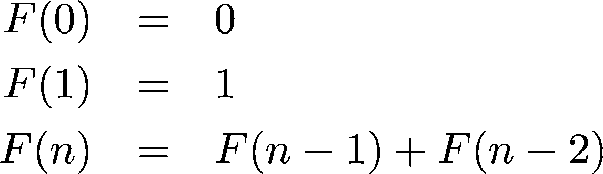
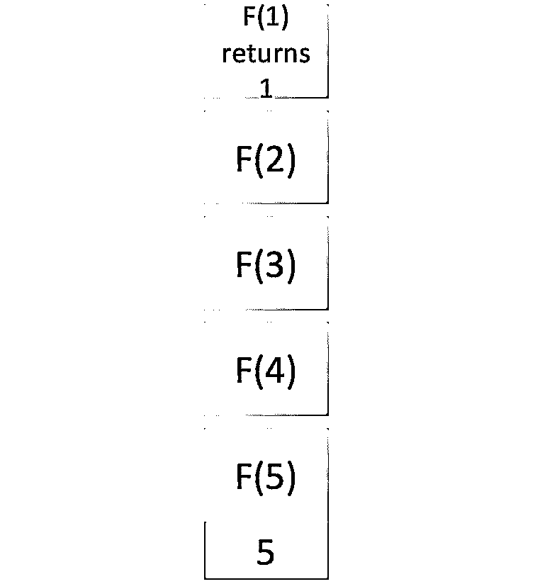

# 斐波纳契数列的 Python 指南

> 原文：<https://realpython.com/fibonacci-sequence-python/>

*立即观看**本教程有真实 Python 团队创建的相关视频课程。配合文字教程一起看，加深理解: [**用 Python 探索斐波那契数列**](/courses/python-fibonacci-sequence/)

斐波纳契数列是一个非常著名的整数数列。这个序列在许多问题中自然出现，并且有一个很好的递归定义。学习如何生成它是务实的程序员掌握[递归](https://realpython.com/python-recursion/)之旅的重要一步。在本教程中，您将重点学习什么是斐波纳契数列，以及如何使用 Python 生成它。

**在本教程中，您将学习如何:**

*   使用**递归算法**生成斐波那契数列
*   使用**记忆**优化递归斐波那契算法
*   使用**迭代算法**生成斐波那契数列

为了充分利用本教程，您应该了解[大 O 符号](https://realpython.com/sorting-algorithms-python/#measuring-efficiency-with-big-o-notation)、[面向对象编程](https://realpython.com/python3-object-oriented-programming/)、 [Python 的特殊方法](https://realpython.com/operator-function-overloading/#the-internals-of-operations-like-len-and)、[条件语句](https://realpython.com/python-conditional-statements/)、[函数](https://realpython.com/defining-your-own-python-function/)和[基本数据结构](https://realpython.com/python-data-structures/)如[列表](https://realpython.com/python-lists-tuples/)、[队列](https://realpython.com/python-deque/#building-efficient-queues-with-deque)和[堆栈](https://realpython.com/how-to-implement-python-stack/)。熟悉这些概念将极大地帮助您理解本教程中将要探索的新概念。

让我们开始吧！

**免费下载:** [从《Python 基础:Python 3 实用入门》中获取一个示例章节](https://realpython.com/bonus/python-basics-sample-download/)，看看如何通过 Python 3.8 的最新完整课程从初级到中级学习 Python。

## 斐波纳契数列入门

列奥纳多·斐波那契是一位意大利数学家，他能够很快回答斯瓦比亚皇帝腓特烈二世提出的一个问题:“假设每对夫妇每个月生一对兔子，最年轻的夫妇在出生后第二个月就已经能够繁殖后代，除去死亡的情况，一年可以得到多少对兔子？”

答案如下:


该模式在前两个数字 0 和 1 之后开始，其中序列中的每个数字总是它前面两个数字的和。自六世纪以来，印度数学家就知道这个序列，斐波那契利用它来计算兔子数量的增长。

*F* ( *n* )用来表示 *n* 月份中出现的兔子对的数量，所以顺序可以这样表示:



在数学术语中，你会称之为[递归关系](https://en.wikipedia.org/wiki/Recurrence_relation)，这意味着序列中的每一项(超过 0 和 1)都是前一项的[函数](https://en.wikipedia.org/wiki/Function_(mathematics))。

还有一个版本的序列，其中前两个数字都是 1，如下所示:


在这个备选版本中， *F* (0)仍然隐式为 0，但你改为从 *F* (1)和 *F* (2)开始。算法保持不变，因为您总是将前两个数字相加来获得序列中的下一个数字。

出于本教程的目的，您将使用从 0 开始的序列版本。

[*Remove ads*](/account/join/)

## 检查斐波那契数列背后的递归

生成斐波那契数列是一个经典的递归问题。递归是当一个函数引用它自己来分解它试图解决的问题。在每一次函数调用中，问题变得越来越小，直到它到达一个**基础用例**，之后它会将结果返回给每个中间调用者，直到[将最终结果返回给最初的调用者](https://realpython.com/python-return-statement/)。

如果你想计算 Fibonacci 数 *F* (5)，你需要先计算它的前辈， *F* (4)和 *F* (3)。为了计算 *F* (4)和 *F* (3)，你需要计算它们的前辈。将 *F* (5)分解成更小的子问题看起来像这样:


每次调用斐波那契函数，它都会被分解成两个更小的子问题，因为这就是你定义递归关系的方式。当它到达基础用例 *F* (0)或 *F* (1)时，它最终可以将一个结果返回给它的调用者。

为了计算斐波纳契数列中的第五个数字，您要解决较小但相同的问题，直到到达基本情况，在那里您可以开始返回一个结果:

[](https://files.realpython.com/media/Screen_Shot_2021-06-04_at_3.24.02_PM.49155bd58b7d.png)

该图中的彩色子问题代表同一问题的重复解决方案。如果你在树上走得更远，你会发现更多这些重复的解决方案。这意味着要递归生成斐波那契数列，你必须反复计算许多中间数。这是斐波纳契数列递归方法中的一个基本问题。

## 用 Python 递归生成斐波那契数列

生成斐波纳契数列的最常见和最简单的算法要求您编写一个递归函数，该函数根据需要多次调用自身，直到计算出所需的斐波纳契数:

>>>

```py
>>> def fibonacci_of(n):
...     if n in {0, 1}:  # Base case
...         return n
...     return fibonacci_of(n - 1) + fibonacci_of(n - 2)  # Recursive case
...

>>> [fibonacci_of(n) for n in range(15)]
[0, 1, 1, 2, 3, 5, 8, 13, 21, 34, 55, 89, 144, 233, 377]
```

在`fibonacci_of()`里面，你首先检查基本情况。然后，返回调用带有前面两个值`n`的函数所得到的值的总和。示例末尾的[列表理解](https://realpython.com/list-comprehension-python/)生成一个包含前十五个数字的斐波那契数列。

这个函数很快就陷入了你在上一节中看到的重复问题。随着`n`变大，计算变得越来越昂贵。所需时间呈指数增长，因为该函数反复计算许多相同的子问题。

**注意:**号码大于 50 的不要在家尝试此功能。取决于你的硬件，你可能要等很长时间才能看到结果——如果你坚持到最后的话。

为了计算 *F* (5)，`fibonacci_of()`要调用自己十五次。计算 *F* ( *n* )，调用树的最大深度为 *n* ，由于每个函数调用产生两个额外的函数调用，所以这个递归函数的[时间复杂度](https://en.wikipedia.org/wiki/Time_complexity)为*O*(2<sup>*n*</sup>)。

大多数调用都是多余的，因为你已经计算了它们的结果。 *F* (3)出现两次， *F* (2)出现三次。 *F* (1)和 *F* (0)是基例，多次调用也没问题。您可能希望避免这种浪费的重复，这是下面几节的主题。

## 优化斐波那契数列的递归算法

至少有两种技术可以用来提高生成斐波那契数列的算法的效率，换句话说，就是减少计算时间。这些技术确保您不会一遍又一遍地计算相同的值，而这正是最初的算法效率如此之低的原因。它们被称为[记忆化](https://en.wikipedia.org/wiki/Memoization)和[迭代](https://en.wikipedia.org/wiki/Iteration)。

### 记忆递归算法

正如您在上面的代码中看到的，Fibonacci 函数用相同的输入调用了自己几次。您可以将之前调用的结果存储在类似于内存[缓存](https://realpython.com/lru-cache-python/#caching-and-its-uses)的东西中，而不是每次都进行新的调用。您可以使用 Python [list](https://realpython.com/python-lists-tuples/) 来存储之前计算的结果。这种技术叫做**记忆化。**

记忆化通过将先前计算的结果存储在高速缓存中来加速昂贵的递归函数的执行。这样，当相同的输入再次出现时，函数只需查找相应的结果并返回，而不必再次运行计算。您可以将这些结果称为**缓存的**或**记忆的**:

[](https://files.realpython.com/media/Screen_Shot_2021-06-03_at_10.24.56_PM.dde28642334d.png)

有了记忆化，您只需在从基础用例返回后遍历一次深度为 *n* 的调用树，因为您从之前的缓存中检索了所有之前计算的值，这些值以黄色突出显示， *F* (2)和 *F* (3)。

橙色的路径显示斐波纳契函数的输入没有被调用一次以上。这大大降低了算法的时间复杂度，从指数级的*O*(2<sup>T3】nT5)降低到线性的 *O* ( *n* )。</sup>

即使对于基本情况，您也可以用直接从缓存中检索索引 0 和 1 处的值来代替调用 *F* (0)和 *F* (1 ),因此您最终只调用了该函数 6 次，而不是 15 次！

下面是将这种优化转换成 Python 代码的一种可能方式:

>>>

```py
>>> cache = {0: 0, 1: 1}

>>> def fibonacci_of(n):
...     if n in cache:  # Base case
...         return cache[n]
...     # Compute and cache the Fibonacci number
...     cache[n] = fibonacci_of(n - 1) + fibonacci_of(n - 2)  # Recursive case
...     return cache[n]

>>> [fibonacci_of(n) for n in range(15)]
[0, 1, 1, 2, 3, 5, 8, 13, 21, 34, 55, 89, 144, 233, 377]
```

在这个例子中，您使用 Python [字典](https://realpython.com/python-dicts/)来缓存计算出的斐波那契数。最初，`cache`包含斐波纳契数列的起始值，0 和 1。在函数内部，首先检查当前输入值`n`的斐波那契数是否已经在`cache`中。如果是这样，那么你把手头的号码还回去。

如果`n`的当前值没有斐波那契数，那么通过递归调用`fibonacci_of()`并更新`cache`来计算它。最后一步是返回请求的斐波那契数。

[*Remove ads*](/account/join/)

### 探索迭代算法

如果你根本不需要调用递归的斐波那契函数呢？您实际上可以使用迭代算法来计算斐波那契数列中位置`n`处的数字。

您知道序列中的前两个数字是 0 和 1，并且序列中的每个后续数字是其前两个前置数字的总和。因此，您可以创建一个循环，将前面的两个数字`n - 1`和`n - 2`加在一起，找到序列中位置`n`处的数字。

下图中加粗的紫色数字代表在每个迭代步骤中需要计算并添加到`cache`的新数字:

[](https://files.realpython.com/media/FibonacciSequenceDiagram1.42fd93a7229f.png)

为了计算位置`n`处的斐波那契数，将序列的前两个数字 0 和 1 存储在`cache`中。然后，连续计算下一个数字，直到你可以返回`cache[n]`。

## 在 Python 中生成斐波那契数列

现在您已经知道了如何生成斐波那契数列的基础知识，是时候更深入地探索用 Python 实现底层算法的不同方法了。在接下来的几节中，您将探索如何使用递归、Python 面向对象编程以及迭代来实现不同的算法来生成斐波那契数列。

### 使用递归和 Python 类

生成斐波那契数列的第一种方法将使用 Python 类和递归。与之前看到的记忆化递归函数相比，使用该类的一个优点是，一个类将状态和行为([封装](https://en.wikipedia.org/wiki/Encapsulation_(computer_programming)))一起保存在同一个对象中。然而，在函数示例中，`cache`是一个完全独立的对象，因此您无法控制它。

下面是实现基于类的解决方案的代码:

```py
 1# fibonacci_class.py
 2
 3class Fibonacci:
 4    def __init__(self):
 5        self.cache = [0, 1]
 6
 7    def __call__(self, n):
 8        # Validate the value of n
 9        if not (isinstance(n, int) and n >= 0):
10            raise ValueError(f'Positive integer number expected, got "{n}"')
11
12        # Check for computed Fibonacci numbers
13        if n < len(self.cache):
14            return self.cache[n]
15        else:
16            # Compute and cache the requested Fibonacci number
17            fib_number = self(n - 1) + self(n - 2)
18            self.cache.append(fib_number)
19
20        return self.cache[n]
```

下面是代码中发生的事情的分类:

*   **第 3 行**定义了`Fibonacci`类。

*   **第 4 行**定义了类初始化器，`.__init__()`。这是一个[特殊的方法](https://docs.python.org/3/reference/datamodel.html#special-method-names)，你可以用它来初始化你的类实例。特殊方法有时被称为**双下划线方法**，是**双下划线方法**的缩写。

*   **第 5 行**创建了`.cache`实例属性，这意味着无论何时你创建一个`Fibonacci`对象，都会有一个针对它的缓存。该属性最初包含斐波那契数列中的第一个数字。

*   **第 7 行**定义了另一个特殊的方法`.__call__()`。这个方法将`Fibonacci`的实例转换成可调用的对象。

*   **第 9 行和第 10 行**通过使用条件语句来验证`n`的值。如果`n`不是正整数，那么该方法产生一个`ValueError`。

*   **第 13 行**定义了一个条件语句来检查那些已经计算过的并且在`.cache`中可用的斐波纳契数。如果索引`n`处的数字已经在`.cache`中，那么第 14 行返回它。否则，第 17 行计算这个数字，第 18 行把它附加到`.cache`上，这样就不用再计算了。

*   **第 20 行**返回请求的斐波那契数。

要尝试此代码，请将其保存到`fibonacci_class.py`中。然后在您的交互式 shell 中运行以下代码:

>>>

```py
>>> from fibonacci_class import Fibonacci

>>> fibonacci_of = Fibonacci()

>>> fibonacci_of(5)
5
>>> fibonacci_of(6)
8
>>> fibonacci_of(7)
13

>>> [fibonacci_of(n) for n in range(15)]
[0, 1, 1, 2, 3, 5, 8, 13, 21, 34, 55, 89, 144, 233, 377]
```

在这里，您创建并调用名为`fibonacci_of`的`Fibonacci`类的实例。第一个调用使用`5`作为参数并返回`5`，这是第六个斐波那契数，因为您使用的是从零开始的索引。

斐波那契数列算法的这种实现是非常有效的。一旦有了这个类的实例，`.cache`属性就保存了从一个调用到另一个调用已经计算好的数字。

### 可视化记忆的斐波那契数列算法

您可以有效地理解如何使用[调用栈](https://en.wikipedia.org/wiki/Call_stack)表示来处理对递归 Fibonacci 函数的每个调用。每个调用被压入堆栈和弹出的方式准确地反映了程序的运行方式。它清楚地表明，如果不优化算法，计算大数将需要很长时间。

在调用堆栈中，每当函数返回结果时，表示函数调用的[堆栈帧](https://en.wikipedia.org/wiki/Call_stack#STACK-FRAME)就会弹出堆栈。每当你调用一个函数，你就在栈顶添加一个新的栈帧。一般来说，这个操作有一个 *O* ( *n* )的[空间复杂度](https://en.wikipedia.org/wiki/Space_complexity)，因为一次调用栈上的栈帧不超过 *n* 。

注意:有一个初学者友好的代码编辑器叫 Thonny，它允许你以图形化的方式可视化递归函数的调用栈。你可以查看 [Thonny:初学者友好的 Python 编辑器](https://realpython.com/python-thonny/)来了解更多。

为了可视化记忆化的递归 Fibonacci 算法，您将使用一组表示调用堆栈的图表。步骤号由每个调用堆栈下面的蓝色标签表示。

说你要计算 *F* (5)。为此，您将对该函数的第一次调用推送到调用堆栈上:

[](https://files.realpython.com/media/Screen_Shot_2021-06-02_at_2.04.45_PM.13bbb36aa87c.png)

要计算 *F* (5)，您必须按照斐波纳契递归关系计算 *F* (4)，因此您将新的函数调用添加到堆栈中:

[](https://files.realpython.com/media/Screen_Shot_2021-06-02_at_2.05.48_PM.86a9787743f1.png)

为了计算 *F* (4)，你必须计算 *F* (3)，所以你向堆栈添加了另一个函数调用:

[](https://files.realpython.com/media/Screen_Shot_2021-06-02_at_2.10.09_PM.57a1f4b9f165.png)

为了计算 *F* (3)，您必须计算 *F* (2)，因此您向调用堆栈添加了另一个函数调用:

[](https://files.realpython.com/media/Screen_Shot_2021-06-02_at_2.19.46_PM.a47c11ac6b34.png)

为了计算 *F* (2)，你必须计算 *F* (1)，所以你把它添加到堆栈中。由于 *F* (1)是一个基本情况，它立即返回 1，您从堆栈中删除这个调用:

[](https://files.realpython.com/media/Screen_Shot_2021-06-02_at_2.25.30_PM.9e61e62d4770.png)

现在你开始递归展开结果。 *F* (1)将结果返回给它的调用函数， *F* (2)。要计算 *F* (2)，还需要计算 *F* (0):

[](https://files.realpython.com/media/Screen_Shot_2021-06-02_at_2.30.08_PM.1b57f1018d51.png)

你将 *F* (0)添加到堆栈中。由于 *F* (0)是一个基本情况，它立即返回，给你 0。现在您可以将它从调用堆栈中移除:

[](https://files.realpython.com/media/Screen_Shot_2021-06-02_at_2.38.36_PM.9b4338c5dfaa.png)

这个调用 *F* (0)的结果返回给 *F* (2)。现在你有了计算 *F* (2)所需的东西，并将其从堆栈中移除:

[](https://files.realpython.com/media/Screen_Shot_2021-06-02_at_2.45.06_PM.0672a386ee0b.png)

将 *F* (2)的结果返回给它的调用者， *F* (3)。 *F* (3)也需要 *F* (1)的结果来完成它的计算，所以你把它加回堆栈:

[](https://files.realpython.com/media/Screen_Shot_2021-06-02_at_2.48.03_PM.0ab6a533d57f.png)

*F* (1)是一个基础用例，它的值在缓存中可用，所以您可以立即返回结果，并将 *F* (1)从堆栈中移除:

[](https://files.realpython.com/media/Screen_Shot_2021-06-02_at_2.50.44_PM.cc9726fd664a.png)

可以完成对 *F* (3)的计算，即 2:

[](https://files.realpython.com/media/Screen_Shot_2021-06-02_at_2.54.26_PM.fa576c07fb5f.png)

你在完成计算后从堆栈中移除 *F* (3)，并将结果返回给它的调用者， *F* (4)。 *F* (4)也需要 *F* (2)的结果来计算其值:

[](https://files.realpython.com/media/Screen_Shot_2021-06-02_at_3.01.58_PM.60a00cb5bb52.png)

您将对 *F* (2)的调用推送到堆栈上。这就是漂亮的缓存发挥作用的地方。您之前已经计算过了，所以您可以从缓存中检索该值，避免再次递归调用来计算 *F* (2)的结果。缓存返回 1，你从堆栈中移除 *F* (2):

[](https://files.realpython.com/media/Screen_Shot_2021-06-02_at_3.05.44_PM.c6de27a53703.png)

*F* (2)被返回给它的调用者，现在 *F* (4)拥有了计算它的值所需的所有东西，即 3:

[](https://files.realpython.com/media/Screen_Shot_2021-06-02_at_3.11.23_PM.0dba15f3c530.png)

接下来，您从堆栈中移除 *F* (4)，并将其结果返回给最终和最初的调用者， *F* (5):

[](https://files.realpython.com/media/Screen_Shot_2021-06-02_at_3.15.49_PM.a784bc92bfd1.png)

*F* (5)现在有了 *F* (4)的结果，也有了 *F* (3)的结果。您将一个 *F* (3)调用压入堆栈，漂亮的缓存再次发挥作用。您之前已经计算了 *F* (3)，所以您需要做的就是从缓存中检索它。没有计算 *F* (3)的递归过程。它返回 2，你从堆栈中移除 *F* (3):

[](https://files.realpython.com/media/Screen_Shot_2021-06-02_at_3.18.56_PM.7961410b3e9a.png)

现在 *F* (5)有了计算自己值所需的所有值。将 3 和 2 相加得到 5，这是将 *F* (5)调用弹出堆栈之前的最后一步。此操作结束递归函数调用序列:

[](https://files.realpython.com/media/Screen_Shot_2021-06-02_at_3.21.19_PM.2254f2a8a547.png)

调用堆栈现在是空的。您已经完成了计算 *F* (5)的最后一步:

[](https://files.realpython.com/media/Screen_Shot_2021-06-02_at_3.23.26_PM.e78bfc8430b9.png)

使用调用堆栈图表示递归函数调用有助于您理解在幕后发生的所有工作。它还允许您查看递归函数可以占用多少资源。

将所有这些图表放在一起，可以让您直观地看到整个过程:

[](https://files.realpython.com/media/mwong-memoized-fibonacci-stack-wide.3b3902052665.png)

你可以点击上面的图片放大单个步骤。如果不缓存之前计算的斐波那契数，这个图中的一些堆栈阶段会高得多，这意味着它们需要更长的时间向各自的调用方返回结果。

[*Remove ads*](/account/join/)

### 使用迭代和 Python 函数

前面几节中的例子实现了一个递归解决方案，它使用记忆化作为优化策略。在本节中，您将编写一个使用迭代的函数。下面的代码实现了斐波那契数列算法的迭代版本:

```py
 1# fibonacci_func.py
 2
 3def fibonacci_of(n):
 4    # Validate the value of n
 5    if not (isinstance(n, int) and n >= 0):
 6        raise ValueError(f'Positive integer number expected, got "{n}"')
 7
 8    # Handle the base cases
 9    if n in {0, 1}:
10        return n
11
12    previous, fib_number = 0, 1
13    for _ in range(2, n + 1):
14        # Compute the next Fibonacci number, remember the previous one
15        previous, fib_number = fib_number, previous + fib_number
16
17    return fib_number
```

现在，你不用在`fibonacci_of()`中使用递归，而是使用迭代。斐波那契序列算法的这种实现以 *O* ( *n* )的线性时间运行。下面是代码的细目分类:

*   **第 3 行**定义了`fibonacci_of()`，它以一个正整数`n`作为参数。

*   **第 5 行和第 6 行**执行`n`的常规验证。

*   **第 9 行和第 10 行**处理`n`为 0 或 1 的基本情况。

*   **第 12 行**定义了两个局部变量`previous`和`fib_number`，并用斐波那契数列中的前两个数初始化它们。

*   **第 13 行**开始一个 [`for`循环](https://realpython.com/python-for-loop/)，从`2`迭代到`n + 1`。循环使用下划线(`_`)作为循环变量，因为它是一个一次性变量，您不会在代码中使用这个值。

*   **第 15 行**计算序列中的下一个斐波那契数，并记住前一个。

*   **第 17 行**返回请求的斐波那契数。

要尝试一下这段代码，请返回到您的交互式会话并运行以下代码:

>>>

```py
>>> from fibonacci_func import fibonacci_of

>>> fibonacci_of(5)
5
>>> fibonacci_of(6)
8
>>> fibonacci_of(7)
13

>>> [fibonacci_of(n) for n in range(15)]
[0, 1, 1, 2, 3, 5, 8, 13, 21, 34, 55, 89, 144, 233, 377]
```

这个`fibonacci_of()`的实现非常简单。它使用**可迭代解包**来计算循环中的斐波纳契数，这在内存方面非常有效。然而，每次你用不同的值`n`调用函数时，它必须重新计算一遍序列。要解决这个问题，你可以使用[闭包](https://realpython.com/inner-functions-what-are-they-good-for/#retaining-state-in-a-closure)，让你的函数记住调用之间已经计算过的值。来吧，试一试！

## 结论

斐波那契数列可以帮助你提高对递归的理解。在本教程中，你已经学习了什么是斐波纳契数列。您还了解了生成序列的一些常用算法，以及如何将它们转换成 Python 代码。

斐波那契数列可以成为进入递归世界的一个很好的跳板和切入点，这是一个程序员必须掌握的基本技能。

**在本教程中，您学习了如何:**

*   使用**递归算法**生成斐波那契数列
*   使用**记忆**优化您的递归斐波那契算法
*   使用**迭代算法**生成斐波那契数列

您还可视化了记忆化的递归算法，以便更好地理解它在幕后是如何工作的。为此，您使用了一个**调用栈**图。

一旦您掌握了本教程中的概念，您的 Python 编程技能将随着您的递归算法思维一起提高。

*立即观看**本教程有真实 Python 团队创建的相关视频课程。配合文字教程一起看，加深理解: [**用 Python 探索斐波那契数列**](/courses/python-fibonacci-sequence/)*****