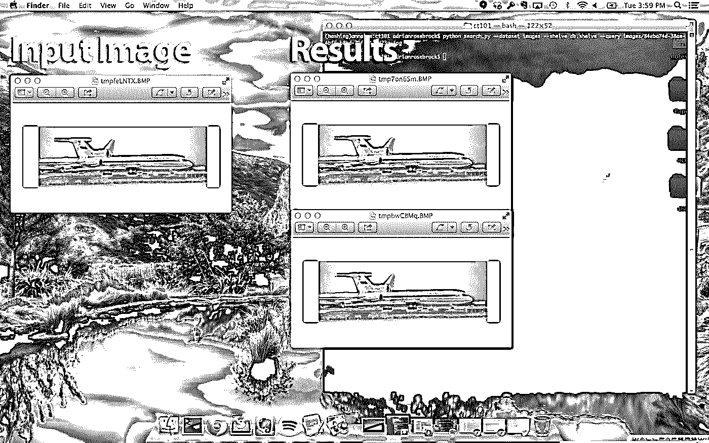
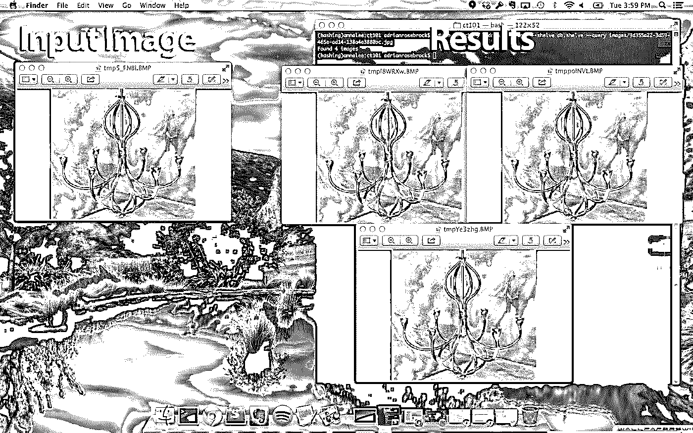
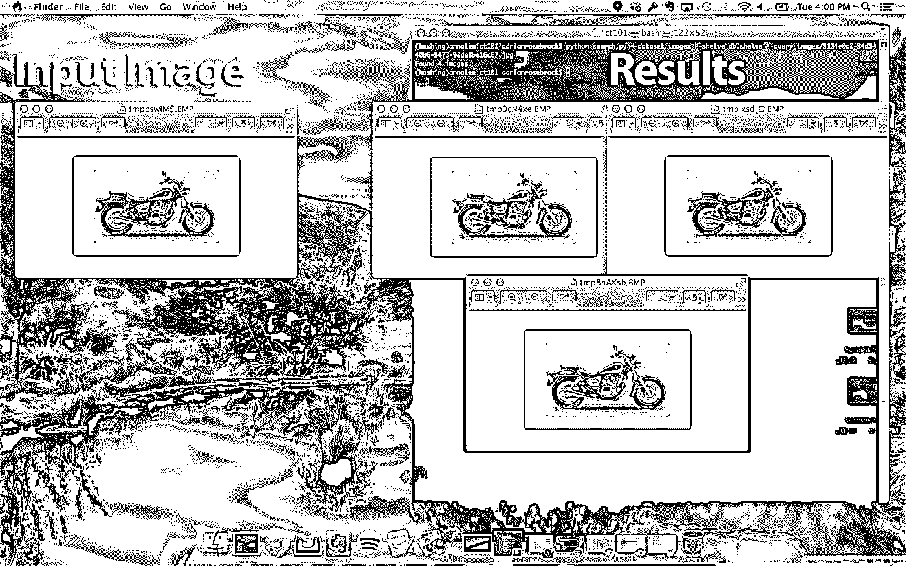

# 用于近似重复检测的指纹图像

> 原文：<https://realpython.com/fingerprinting-images-for-near-duplicate-detection/>

*这是来自[PyImageSearch.com](http://www.pyimagesearch.com)的 Adrian Rosebrock 的客座博文，这是一个关于计算机视觉、图像处理和构建图像搜索引擎的博客。*

**更新:**

1.  2014 年 12 月 22 日-删除了代码中对行号的引用。
2.  2015 年 5 月 22 日-添加了依赖版本。

* * *

大约五年前，我在一个交友网站做开发工作。他们是一家早期创业公司，但开始看到一些初步的牵引力。与其他交友网站不同，这家公司以清白的名声推销自己。这不是一个你可以去勾搭的网站——这是一个你可以去寻找真诚关系的地方。

在数百万风险资本的推动下(这是在美国经济衰退之前)，他们关于真爱和寻找灵魂伴侣的在线广告像大片一样转化了。他们被福布斯报道过。他们甚至出现在国家电视台的聚光灯下。这些早期的成功导致了令人垂涎的创业公司的指数增长——他们的用户数量每月翻一番。事情看起来对他们非常有利。

但是他们有一个严重的问题——色情问题。

交友网站的一小部分用户上传色情图片，并将其设置为个人资料图片。这种行为破坏了许多顾客的体验，导致他们取消了会员资格。

现在，也许对一些约会网站来说，这里有一些色情图片可能不是问题。或者它甚至可能被认为是“正常的”或“预期的”，只是被简单接受和忽视的网恋的副产品。

然而，这种行为既不能被接受，也不能被忽视。

请记住，这是一家将自己标榜为高级约会天堂的初创公司，没有困扰其他约会网站的污秽和垃圾。简而言之，他们需要维护一个非常真实的由风险投资支持的声誉。

绝望的是，约会网站争先恐后地阻止色情的爆发。他们雇佣了图像管理员团队，他们什么也不做，每天盯着管理页面 8 个多小时，删除上传到社交网络的任何新的色情图像。

他们实际上在这个问题上投入了数万美元(更不用说无数工时)，只是试图缓和和遏制疫情，而不是在源头上阻止它。

疫情在 2009 年 7 月达到临界水平。八个月来，用户数量首次未能翻番(甚至开始下降)。更糟糕的是，投资者威胁说，如果该公司不解决这个问题，他们就会撤资。

事实上，污秽的潮水冲击着象牙塔，威胁着要将它倾入大海。

随着约会巨头的膝盖开始弯曲，我提出了一个更稳健和长期的解决方案:**如果我们使用图像指纹来对抗疫情会怎么样？**

你看，每张照片都有指纹。就像指纹可以识别人一样，它也可以识别图像。

这导致三阶段算法的实现:

1.  对我们的一组不适当的图像进行指纹识别，并将图像指纹存储在数据库中。
2.  当用户上传新的个人资料图片时，我们会将其与我们的图像指纹数据库进行比较。如果上传的指纹与任何不适当图片的指纹匹配，我们会阻止用户将该图片设置为他们的个人资料图片。
3.  随着图像版主标记新的色情图像，它们也被采集指纹并存储在我们的数据库中，创建了一个不断发展的数据库，可用于防止无效上传。

我们的过程虽然不完美，但很有效。疫情缓慢但稳定地减缓了。它从未完全停止——但通过使用这种算法，我们成功地将不适当的上传数量**减少了 80%** 。

我们还设法让投资者满意。他们继续资助我们——直到经济衰退来袭。然后我们都失业了。

回想起来，我不禁笑了。我的工作没持续多久。公司没有持续下去。甚至有几个投资者被抛弃了。

但是有一件事幸存了下来。图像指纹算法。几年后，我想与你分享这个算法的基础，希望你能在自己的项目中使用它。

但最大的问题是，我们如何创建这个图像指纹？

请继续阅读，寻找答案。

## 我们要做什么？

我们将利用图像指纹来执行近似重复图像检测。这种技术通常被称为“感知图像哈希”或简称为“图像哈希”。

[*Remove ads*](/account/join/)

## 什么是图像指纹/哈希？

图像哈希是检查图像内容，然后基于这些内容构造唯一标识图像的值的过程。

例如，看看这篇文章顶部的图片。给定一个输入图像，我们将应用一个哈希函数，并根据图像的视觉外观计算一个“图像哈希”。“相似”的图像也应该有“相似”的散列。使用图像散列算法使得执行近似重复图像检测变得更加容易。

特别是，我们将使用“差异哈希”，或简单的 dHash 算法来计算我们的图像指纹。简单地说，dHash 算法查看相邻像素值之间的差异。然后，根据这些差异，创建一个哈希值。

## 为什么不能用 md5，sha-1 等。？

不幸的是，我们不能在实现中使用加密哈希算法。由于加密哈希算法的性质，输入文件中非常微小的变化都会导致一个完全不同的哈希。在图像指纹的情况下，我们实际上希望我们的*相似的输入*也有*相似的输出散列*。

## 图像指纹可以用在哪里？

就像我上面的例子一样，您可以使用图像指纹来维护一个不合适图像的数据库，并在用户试图上传这样的图像时提醒他们。

你可以建立一个反向图片搜索引擎，比如 [TinEye](http://www.tineye.com/) 来跟踪图片和它们出现的相关网页。

你甚至可以使用图像指纹来帮助管理你自己的个人照片收藏。想象一下，你有一个硬盘驱动器，里面装满了你的照片库的部分备份，但需要一种方法来修剪部分备份，只保留图像的唯一副本-图像指纹也可以帮助实现这一点。

简而言之，您可以在几乎任何与检测图像的近似副本有关的设置中使用图像指纹/散列。

## 我们需要什么样的图书馆？

为了构建我们的图像指纹解决方案，我们将利用三个主要的 Python 包:

*   [PIL/枕头](https://pillow.readthedocs.org/)便于读取和加载图像。
*   [ImageHash](https://pypi.python.org/pypi/ImageHash) ，它包含了我们的 dHash 实现。
*   以及 ImageHash 需要的 [NumPy](http://www.numpy.org/) / [SciPy](http://www.scipy.org/) 。

您可以通过执行以下命令来安装所有必需的先决条件:

```py
$ pip install pillow==2.6.1 imagehash==0.3
```

## 步骤 1:对数据集进行指纹识别

第一步是采集图像数据集的指纹。

在你问之前，不，我们不会像我在约会网站工作时那样使用色情图片。相反，我创造了一个我们可以使用的人工数据集。

在计算机视觉研究人员中， [CALTECH-101](http://www.vision.caltech.edu/Image_Datasets/Caltech101/) 数据集是传奇。它包含来自 101 个不同类别的 7，500 多张图像，包括人、摩托车和飞机。

从这 7500 张图片中，我随机选择了其中的 17 张。

然后，从这 17 个随机选择的图像中，我通过随机调整+/-几个百分点的大小，创建了 *N* 个新图像。我们的目标是找到这些近乎重复的图像——有点像大海捞针。

> 想要创建一个相似的数据集来使用吗？下载 [CALTECH-101](http://www.vision.caltech.edu/Image_Datasets/Caltech101/) 数据集，抓取 17 张左右的图像，然后运行在 [repo](https://github.com/realpython/image-fingerprinting) 中找到的 *gather.py* 脚本。

同样，这些图像在各个方面都是相同的，除了宽度和高度。由于它们没有相同的维数，我们不能依赖简单的 md5 校验和。更重要的是，内容相似的图像*可能有*显著不同的* md5 散列。相反，我们可以求助于图像哈希，其中具有相似内容的图像也将具有相似的哈希指纹。*

因此，让我们从编写代码来采集数据集的指纹开始。打开一个新文件，命名为`index.py`，让我们开始工作:

```py
# import the necessary packages
from PIL import Image
import imagehash
import argparse
import shelve
import glob

# construct the argument parse and parse the arguments
ap = argparse.ArgumentParser()
ap.add_argument("-d", "--dataset", required = True,
    help = "path to input dataset of images")
ap.add_argument("-s", "--shelve", required = True,
    help = "output shelve database")
args = vars(ap.parse_args())

# open the shelve database
db = shelve.open(args["shelve"], writeback = True)
```

我们要做的第一件事是导入我们需要的包。我们将使用来自`PIL`或`Pillow`的`Image`类从磁盘上加载我们的图像。然后可以利用`imagehash`库来构建感知哈希。

从那里， [`argparse`](https://realpython.com/command-line-interfaces-python-argparse/) 被用于解析命令行参数，`shelve`被用作驻留在磁盘上的简单的键值数据库(Python 字典)，而`glob`被用于轻松地收集到我们的图像的路径。

然后我们解析我们的命令行参数。第一个，`--dataset`是图像输入目录的路径。第二个，`--shelve`是我们的`shelve`数据库的输出路径。

接下来，我们打开我们的`shelve`数据库进行写入。这个`db`将存储我们的图像散列。更多关于下一个:

```py
# loop over the image dataset
for imagePath in glob.glob(args["dataset"] + "/*.jpg"):
    # load the image and compute the difference hash
    image = Image.open(imagePath)
    h = str(imagehash.dhash(image))

    # extract the filename from the path and update the database
    # using the hash as the key and the filename append to the
    # list of values
    filename = imagePath[imagePath.rfind("/") + 1:]
    db[h] = db.get(h, []) + [filename]

# close the shelf database
db.close()
```

这里是大部分工作发生的地方。我们开始遍历上的图像数据集，从磁盘加载它，然后创建图像指纹。

现在，我们来看整个教程中最重要的两行代码:

```py
filename = imagePath[imagePath.rfind("/") + 1:]
db[h] = db.get(h, []) + [filename]
```

就像我之前在这篇文章中提到的，指纹*相同的图片被认为是*相同的*。*

因此，如果我们的目标是找到几乎相同的图像，我们需要维护一个具有相同指纹值的图像列表。

这正是这些线条的作用。

前者提取图像的文件名。然后后者维护具有相同图像散列的文件名列表。

要从我们的数据集中提取图像指纹并构建我们的哈希数据库，发出以下命令:

```py
$ python index.py --dataset images --shelve db.shelve
```

该脚本将运行几秒钟，一旦完成，您将拥有一个名为`db.shelve`的文件，其中包含图像指纹和文件名的键值对。

这个相同的基本算法是我几年前为约会创业公司工作时使用的。我们获取不合适图像的数据集，为每个图像构建一个图像指纹，然后将它们存储在我们的数据库中。当一张新图片到达时，我简单地计算了图片的散列值，并检查数据库，看看上传的图片是否已经被标记为无效内容。

在下一步中，我将向您展示如何执行实际的搜索，以确定数据库中是否已经存在具有相同哈希值的图像。

[*Remove ads*](/account/join/)

## 步骤 2:搜索数据集

现在我们已经建立了一个图像指纹数据库，是时候*搜索*我们的数据集了。

打开一个新文件，命名为`search.py`，我们将得到代码:

```py
# import the necessary packages
from PIL import Image
import imagehash
import argparse
import shelve

# construct the argument parse and parse the arguments
ap = argparse.ArgumentParser()
ap.add_argument("-d", "--dataset", required = True,
    help = "path to dataset of images")
ap.add_argument("-s", "--shelve", required = True,
    help = "output shelve database")
ap.add_argument("-q", "--query", required = True,
    help = "path to the query image")
args = vars(ap.parse_args())
```

我们将再次在上导入我们的相关包。然后我们解析命令行参数。我们需要三个开关，`–dataset`，它是到我们的原始图像数据集的路径，`–shelve`，它是到我们的键-值对的`shelve`数据库的路径，以及`–query`，它是到我们的查询/上传图像的路径。我们的目标是获取查询图像并确定它是否已经存在于我们的数据库中。

现在，让我们编写代码来执行实际的搜索:

```py
# open the shelve database
db = shelve.open(args["shelve"])

# load the query image, compute the difference image hash, and
# and grab the images from the database that have the same hash
# value
query = Image.open(args["query"])
h = str(imagehash.dhash(query))
filenames = db[h]
print "Found %d images" % (len(filenames))

# loop over the images
for filename in filenames:
    image = Image.open(args["dataset"] + "/" + filename)
    image.show()

# close the shelve database
db.close()
```

我们首先打开数据库，然后从磁盘上加载图像，计算图像指纹，并找到具有相同指纹值的所有图像。

如果有任何图像具有相同的哈希值，我们循环遍历这些图像，并将它们显示在屏幕上。

使用这个代码，我们将能够确定一个图像是否已经存在于我们的数据库中，只使用指纹值。

## 结果

正如我在这篇文章前面提到的，我已经从 CALTECH-101 数据集中提取了大约 7500 张原始图像，随机选择了其中的 17 张，然后通过随机调整几个百分点的大小来生成 *N* 张新图像。

这些图像的尺寸仅相差几个像素，但正因为如此，我们不能依赖文件的 md5 散列(这一点将在“改进我们的算法”一节中进一步阐述)。相反，我们需要利用图像散列来找到近似重复的图像。

打开您的终端并执行以下命令:

```py
$ python search.py --dataset images --shelve db.shelve --query images/84eba74d-38ae-4bf6-b8bd-79ffa1dad23a.jpg
```

如果一切顺利，您应该会看到以下结果:

[](https://files.realpython.com/media/fingerprint_results_01.9c3ca46c13ec.jpg)

左边的**是我们的输入图像。我们获取这个图像，计算它的图像指纹，然后在我们的数据库中查找指纹，看看是否有任何其他图像具有相同的指纹。**

果不其然，我们的数据集中还有另外两张图像具有完全相同的指纹，如右边的**所示。虽然从截图上看不太明显，但这些图片虽然有完全相同的视觉内容，但并不完全相同！这三张图片都有不同的宽度和高度。**

让我们尝试另一个输入图像:

```py
$ python search.py --dataset images --shelve db.shelve --query images/9d355a22-3d59-465e-ad14-138a4e3880bc.jpg
```

结果如下:

[](https://files.realpython.com/media/fingerprint_results_02.387e8bfd608d.jpg)

我们再次将输入图像放在 ***左边*** 。我们的图像指纹算法能够找到三个具有相同指纹的相同图像，如右侧的 ***和*** 所示。

最后一个例子:

```py
$ python search.py --dataset images --shelve db.shelve --query images/5134e0c2-34d3-40b6-9473-98de8be16c67.jpg
```

[](https://files.realpython.com/media/fingerprint_results_03.17963f052d0f.jpg)

这次我们输入的图像是一辆摩托车上的 ***左边的*** 。我们拍摄了这张摩托车图像，计算了它的图像指纹，然后在我们的指纹数据库中查找。正如我们在右侧的 ***和*** 上看到的，我们能够确定数据库中还有另外三张图像具有相同的指纹。

[*Remove ads*](/account/join/)

## 改进我们的算法

有很多方法可以改进我们的算法——但最关键的方法是考虑到那些*相似*，但*不相同*的散列。

例如，这篇文章中的图片只被调整了几个百分点。如果一幅图像的大小被放大了一倍，或者纵横比改变了，那么散列就不一样了。

然而，图像仍然是*相似的*。

为了找到相似但不相同的图像，我们需要探索[汉明距离](http://en.wikipedia.org/wiki/Hamming_distance)。汉明距离可以用来计算散列中*不同*的比特数。因此，散列值只有 1 位差异的两个图像比散列值有 10 位差异的图像更加相似。

然而，我们遇到了第二个问题——我们算法的可扩展性。

考虑一下:给我们一个输入图像，并要求我们在数据库中找到所有相似的图像。然后，我们必须计算我们的输入图像和数据库中的每一个图像之间的汉明距离。

随着数据库规模的增长，比较所有哈希值所需的时间也会增长。最终，我们的散列数据库将达到这样的大小，以至于这种线性比较是不实际的。

解决方案，虽然超出了本文的范围，是利用 [K-d 树](http://en.wikipedia.org/wiki/K-d_tree)和 [VP 树](http://en.wikipedia.org/wiki/Vantage-point_tree)将搜索问题的复杂性从线性降低到子线性。

## 总结

在这篇博文中，我们学习了如何构建和利用图像哈希来执行近似重复图像检测。这些图像哈希是使用图像的可视内容构建的。

就像指纹可以识别一个人一样，图像哈希也可以唯一地识别图像。

利用我们的图像指纹知识，我们构建了一个系统，只使用图像哈希就可以找到并识别具有相似内容的图像。

然后，我们演示了如何使用这个图像散列来快速查找具有近似重复内容的图像。

哦，一定要从[回购](https://github.com/realpython/image-fingerprinting)那里拿到代码。

**在一个周末学习计算机视觉:**如果你喜欢这篇文章，并想了解更多关于计算机视觉、图像处理和构建图像搜索引擎的知识，请访问我在 PyImageSearch.com[的博客](http://www.pyimagesearch.com)。

干杯！***