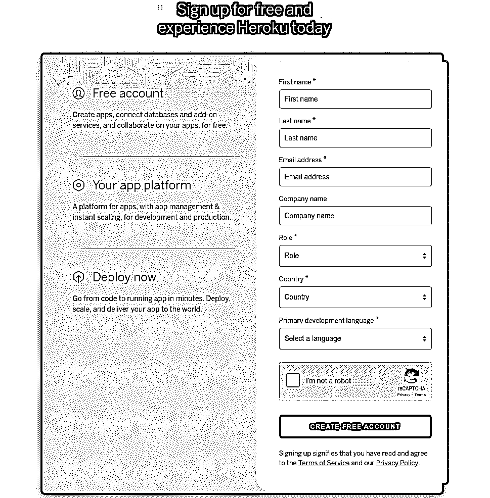
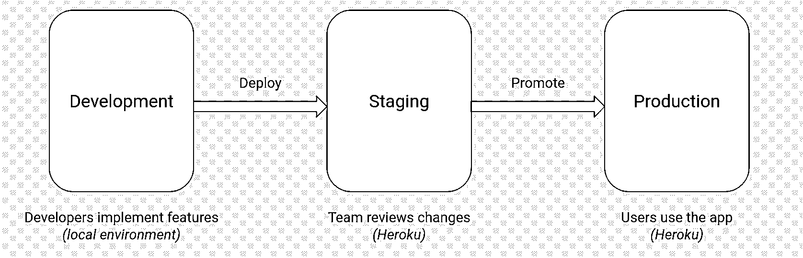

# 使用 Heroku 部署 Python Flask 示例应用程序

> 原文：<https://realpython.com/flask-by-example-part-1-project-setup/>

*立即观看**本教程有真实 Python 团队创建的相关视频课程。与书面教程一起观看，加深您的理解: [**使用 Heroku**](/courses/deploying-a-flask-application-using-heroku/) 部署 Flask 应用程序

在本教程中，您将创建一个 Python [Flask](https://flask.palletsprojects.com/) 示例应用程序，并使用 [Heroku](https://heroku.com) 部署它，使它在 web 上公开可用。Heroku 消除了许多与构建和运行[网络应用](https://realpython.com/python-web-applications/)相关的基础设施负担，让你专注于创建一个令人敬畏的应用。

除了部署应用程序之外，您还将使用 Git 来跟踪代码的更改，并且您还将使用不同的环境来配置一个部署工作流，以进行准备和生产。使用此设置，您将能够在发布应用程序之前对其进行测试和预览。

**在本教程中，您将学习如何:**

*   创建一个 Python **Flask 示例 web 应用**
*   使用 Heroku 部署 web 应用程序
*   使用 Heroku **管道**实现部署**工作流**
*   以安全的方式管理不同环境的**配置**和**机密**

本教程假设您了解 web 应用程序的基本工作原理，并且有一些使用 Git 的经验。要快速了解这些主题，请查看[Python Web Applications with Flask(教程系列)](https://realpython.com/python-web-applications-with-flask-part-i/)和[Python 开发人员 Git 和 GitHub 简介](https://realpython.com/python-git-github-intro/)。

正如您将通过本教程了解到的，通过结合 Flask 和 Heroku，您可以最大限度地减少创建和运行 web 应用程序所需的工作量。您可以单击下面的链接获得本教程应用程序的完整源代码:

**示例代码:** [单击此处下载源代码](https://realpython.com/bonus/python-flask-example-code/)，您将使用它来构建 Python Flask 示例应用程序。

## 创建 Python Flask 示例应用程序

在本节中，您将学习如何创建一个 Python Flask 示例应用程序并在本地运行它。您将初始化项目，安装 Flask，创建应用程序，并在您的计算机上运行它。您还将学习如何使用 Git 来版本化您的应用程序代码。

[*Remove ads*](/account/join/)

### 正在初始化项目

项目初始化包括为您的应用程序创建一个目录，设置一个将要安装依赖项的 [Python 虚拟环境](https://realpython.com/python-virtual-environments-a-primer/)，以及初始化 **Git 存储库**。您不必使用虚拟环境或 Git 进行本地开发，但它们非常方便，会使开发和部署到 Heroku 更简单。

首先为 Python Flask 示例应用程序创建一个新目录。您可以通过运行以下命令来实现:

```py
$ mkdir realpython-example-app
$ cd realpython-example-app
```

以上命令创建一个`realpython-example-app/`文件夹，并将当前工作目录更改为该文件夹。

接下来，您必须创建一个 Python 虚拟环境。使用虚拟环境允许您管理项目的依赖关系，而不会弄乱所有应用程序共享的系统级文件。运行以下命令，为您的应用程序创建并激活一个虚拟环境。如果您还没有将目录更改为`realpython-example-app/`,请记住:

```py
$ python3 -m venv venv
$ source venv/bin/activate
```

这些命令创建了一个名为`venv`的虚拟环境并激活它，因此将从这个环境中加载和安装包，而不是使用系统级的包。

### 安装依赖关系

第一步是安装 Flask Python 包。您可以使用 [`pip`](https://realpython.com/what-is-pip/) 运行以下命令来安装 Flask:

```py
$ python3 -m pip install Flask==1.1.2
```

上面的命令安装 Flask 版本`1.1.2`。这是您将在整个教程中使用的版本。接下来，您需要创建一个列出项目依赖项的`requirements.txt`文件。您可以使用`python3 -m pip freeze`命令来完成这项任务:

```py
$ python3 -m pip freeze > requirements.txt
```

在部署项目时，您将使用`requirements.txt`来告诉 Heroku 必须安装哪些包才能运行您的应用程序代码。要了解更多关于如何在虚拟环境中安装 Flask 和其他`pip`选项的信息，请查看 [Flask 安装文档](https://flask.palletsprojects.com/en/1.1.x/installation/)和[什么是 Pip？新蟒蛇指南](https://realpython.com/what-is-pip/)。

现在，应用程序目录应该如下所示:

```py
realpython-example-app/
│
├── venv/
│
└── requirements.txt
```

在接下来的小节中，您将添加更多的文件来实现应用程序逻辑，设置 Git，然后将其部署到 Heroku。

### 编写应用程序代码

在本节中，您将创建一个带有单个**路由**、`index`的小 Flask 应用程序，它在被请求时返回文本`Hello World!`。要创建 Flask 应用程序，您必须创建一个代表您的应用程序的`Flask`对象，然后将**视图**与路线关联起来。Flask 负责根据请求 URL 和您定义的路由将传入的请求分派到正确的视图。

您可以单击下面的链接获得本教程应用程序的完整源代码:

**示例代码:** [单击此处下载源代码](https://realpython.com/bonus/python-flask-example-code/)，您将使用它来构建 Python Flask 示例应用程序。

对于小型应用程序，如您在本教程中使用的应用程序，您可以在一个文件中编写所有代码，并按如下方式组织项目:

```py
realpython-example-app/
│
├── venv/
│
├── app.py
└── requirements.txt
```

`app.py`包含应用程序的代码，您可以在其中创建应用程序及其视图。以下代码块显示了应用程序的完整源代码:

```py
from flask import Flask

app = Flask(__name__)

@app.route("/")
def index():
    return "Hello World!"
```

在您[导入](https://realpython.com/python-import/) `flask`之后，代码创建了对象`app`，它属于`Flask`类。使用`app.route()` [装饰器](https://realpython.com/primer-on-python-decorators/)将视图功能`index()`链接到主路线。当主路由被请求时，Flask 将通过调用`index()`并使用其返回值作为响应来服务请求。

[*Remove ads*](/account/join/)

### 在本地运行 Python Flask 示例

有不同的方法可以运行您在上一节中创建的应用程序。启动 Flask 应用程序进行本地开发的最直接的方法之一是从终端使用`flask run`命令:

```py
$ flask run
```

默认情况下，Flask 将在端口`5000`上运行您在`app.py`中定义的应用程序。当应用程序运行时，使用您的网络浏览器进入`http://localhost:5000`。您将看到一个包含消息`Hello World!`的网页

在开发过程中，您通常希望在对应用程序进行更改时自动重新加载应用程序。您可以通过将环境变量`FLASK_ENV=development`传递给`flask run`来实现这一点:

```py
$ FLASK_ENV=development flask run
```

当你设置`FLASK_ENV=development`时，Flask 会监控应用文件的变化，并在有变化时重新加载服务器。这样，您就不需要在每次修改后手动停止并重启应用服务器。

### 使用 Git 跟踪变更

在本教程中，您将使用 Git 跟踪项目文件的变更，Git 是一个非常流行的**版本控制系统(VCS)** 。因此，作为第一步，您应该为您的项目创建一个 Git 存储库。您可以通过在项目目录中执行以下命令来实现这一点:

```py
$ git init
```

上面的命令初始化将用于跟踪项目文件的存储库。存储库元数据存储在一个名为`.git/`的隐藏目录中。

注意，有些文件夹不应该包含在 Git 存储库中，比如`venv/`和`__pycache__/`。您可以通过创建一个名为`.gitignore`的文件来告诉 Git 忽略它们。使用以下命令创建该文件:

```py
$ echo venv > .gitignore
$ echo __pycache__ >> .gitignore
$ git add .gitignore app.py requirements.txt
$ git commit -m "Initialize Git repository"
```

运行上述命令后，Git 将跟踪应用程序文件的变化，但它会忽略`venv/`和`__pycache__/`文件夹。现在的项目目录，`realpython-example-app/`，应该是这样的:

```py
realpython-example-app/
│
├── .git/
│
├── venv/
│
├── .gitignore
├── app.py
└── requirements.txt
```

您现在可以使用 Heroku 部署您的应用程序了。查看[面向 Python 开发者的 Git 和 GitHub 简介](https://realpython.com/python-git-github-intro/)，了解更多关于 Git 的信息，以及如何在 GitHub 中托管您的存储库。

## 将应用程序部署到 Heroku

Heroku 使得构建和部署应用程序对开发者来说非常友好。它消除了许多与构建和运行 web 应用程序相关的负担，负责大多数基础设施细节，让您专注于创建和改进应用程序。Heroku 处理的一些细节包括:

*   设置 HTTPS 证书
*   管理 DNS 记录
*   运行和维护服务器

在本节的其余部分，您将学习如何使用 Heroku 将之前创建的 web 应用程序部署到互联网上。到本节结束时，你的应用程序将在一个漂亮的网址下公开，并使用 [HTTPS](https://realpython.com/python-https/) 提供服务。

[*Remove ads*](/account/join/)

### Heroku 帐户设置

您的第一步是创建一个 Heroku 帐户。如果你还没有，你可以使用免费和业余爱好计划。它允许你在不花钱的情况下部署非商业应用程序、个人项目和实验。

如果您进入 [Heroku 注册页面](https://signup.heroku.com/)，您将在注册表单上看到以下字段:

[](https://files.realpython.com/media/mgarcia-heroku-signup.c6ea98615f60.png)

完成所需信息并确认您的电子邮件地址后，您就可以开始使用 Heroku 了。

### Heroku 命令行界面

Heroku 命令行界面(CLI)是一个允许您从终端创建和管理 Heroku 应用程序的工具。这是部署应用程序最快捷、最方便的方式。你可以查阅[开发者文档](https://devcenter.heroku.com/articles/heroku-cli)来获得你的操作系统的安装说明。在大多数 Linux 发行版上，您可以通过运行以下命令来安装 Heroku CLI:

```py
$ curl https://cli-assets.heroku.com/install.sh | sh
```

前面的命令下载并执行 Heroku CLI 安装程序。接下来，您必须通过运行以下命令登录:

```py
$ heroku login
```

这将打开一个带有按钮的网站，以完成登录过程。点击*登录*完成认证过程并开始使用 Heroku CLI:

[](https://files.realpython.com/media/mgarcia-heroku-login.8a271deda9af.png)

登录后，您就可以开始使用 Heroku CLI 来管理您的应用程序和工作流了。

### Heroku 的应用程序部署

在本节中，您将学习如何使用 Heroku CLI 和 Git 来部署您的 web 应用程序。第一步是在项目的根目录下创建一个名为`Procfile`的文件。这个文件告诉 Heroku 如何运行应用程序。您可以通过运行以下命令来创建它:

```py
$ echo "web: gunicorn app:app" > Procfile
```

注意，这个文件名必须以大写字母开头。这个文件告诉 Heroku 使用 [Gunicorn](https://gunicorn.org/) 为您的应用程序提供服务，这是一个 Python **Web 服务器网关接口(WSGI) HTTP 服务器**，兼容各种 Web 框架，包括 Flask。确保安装 Gunicorn 并使用`pip`更新`requirements.txt`文件:

```py
$ python3 -m pip install gunicorn==20.0.4
$ python3 -m pip freeze > requirements.txt
```

前面的命令安装 Gunicorn 并更新`requirements.txt`以包含所有依赖项的列表。因为您添加并更改了文件，所以您需要将它们提交给 Git。您可以通过执行以下两个命令来实现这一点:

```py
$ git add Procfile requirements.txt
$ git commit -m "Add Heroku deployment files"
```

当您执行上述命令时，您将把最新版本的`Procfile`和`requirements.txt`提交给 Git 存储库。现在您已经准备好将应用程序部署到 Heroku 了。从[使用 Heroku CLI 创建一个 Heroku 应用程序](https://devcenter.heroku.com/articles/creating-apps)开始。

**注意:**本教程使用`realpython-example-app`作为应用程序名称。因为应用程序名称在 Heroku 上需要是唯一的，所以您需要为您的部署选择一个不同的名称。

您可以通过运行以下命令在 Heroku 中创建应用程序:

```py
$ heroku create realpython-example-app
```

运行上面的命令初始化 Heroku 应用程序，创建一个名为`heroku`的 [Git remote](https://git-scm.com/book/en/v2/Git-Basics-Working-with-Remotes) 。接下来，您可以将 Git 存储库推送到这个远程，以触发构建和部署过程:

```py
$ git push heroku master
```

在将`master`分支推送到`heroku`遥控器之后，您会看到输出显示了关于构建和部署过程的信息:

```py
 1Enumerating objects: 6, done.
 2Counting objects: 100% (6/6), done.
 3Delta compression using up to 8 threads
 4Compressing objects: 100% (4/4), done.
 5Writing objects: 100% (6/6), 558 bytes | 558.00 KiB/s, done.
 6Total 6 (delta 0), reused 0 (delta 0)
 7remote: Compressing source files... done.
 8remote: Building source:
 9remote:
10remote: -----> Building on the Heroku-18 stack
11remote: -----> Python app detected
12remote: -----> Installing python-3.6.12
13remote: -----> Installing pip 20.1.1, setuptools 47.1.1 and wheel 0.34.2
14remote: -----> Installing SQLite3
15remote: -----> Installing requirements with pip
16remote:        Collecting click==7.1.2
17remote:          Downloading click-7.1.2-py2.py3-none-any.whl (82 kB)
18remote:        Collecting Flask==1.1.2
19remote:          Downloading Flask-1.1.2-py2.py3-none-any.whl (94 kB)
20remote:        Collecting itsdangerous==1.1.0
21remote:          Downloading itsdangerous-1.1.0-py2.py3-none-any.whl (16 kB)
22remote:        Collecting Jinja2==2.11.2
23remote:          Downloading Jinja2-2.11.2-py2.py3-none-any.whl (125 kB)
24remote:        Collecting MarkupSafe==1.1.1
25remote:          Downloading MarkupSafe-1.1.1-cp36-cp36m-manylinux1_x86_64.whl
26remote:        Collecting Werkzeug==1.0.1
27remote:          Downloading Werkzeug-1.0.1-py2.py3-none-any.whl (298 kB)
28remote:        Installing collected packages: click, Werkzeug, itsdangerous,
29MarkupSafe, Jinja2, Flask
30remote:        Successfully installed Flask-1.1.2 Jinja2-2.11.2 MarkupSafe-1.1.1
31Werkzeug-1.0.1 click-7.1.2 itsdangerous-1.1.0
32remote: -----> Discovering process types
33remote:        Procfile declares types -> (none)
34remote:
35remote: -----> Compressing...
36remote:        Done: 45.1M
37remote: -----> Launching...
38remote:        Released v1
39remote:        https://realpython-example-app.herokuapp.com/ deployed to Heroku
40remote:
41remote: Verifying deploy... done.
42To https://git.heroku.com/realpython-example-app.git
43 * [new branch]      master -> master
```

恭喜你，该应用程序现已上线！输出显示了构建过程，包括依赖项的安装和部署。在第 39 行，您将找到您的应用程序的 URL。这种情况下是`https://realpython-example-app.herokuapp.com/`。您也可以使用以下 Heroku CLI 命令打开您的应用程序的 URL:

```py
$ heroku open
```

上述命令将使用默认的 web 浏览器打开您的应用程序。

**注意:**输出的第 12 行表明 Python 3.6.12 将被用作应用程序的运行时。这是撰写本教程时的默认版本。要了解如何定制 Python 版本和其他运行时设置，请查看 [Heroku 的 Python 运行时文档](https://devcenter.heroku.com/articles/python-runtimes)。

现在，让我们对应用程序做一个小小的更改，看看如何重新部署它。编辑`app.py`并修改`index()`返回的字符串，如下一个代码块所示:

```py
 1from flask import Flask
 2
 3app = Flask(__name__)
 4
 5@app.route("/")
 6def index():
 7    return "Hello this is the new version!"
```

正如您在第 7 行看到的，`"Hello World!"`被替换为`"Hello this is the new version!"`。您可以通过将更改提交并推送到`heroku`遥控器来将这个版本部署到 Heroku:

```py
$ git add app.py
$ git commit -m "Change the welcome message"
$ git push heroku master
```

使用这些命令，您可以将更改提交到本地 Git 存储库，并将它们推送到`heroku` remote。这将再次触发构建和部署过程。每当您需要部署应用程序的新版本时，都可以重复这些步骤。您会注意到后续的部署通常会花费更少的时间，因为需求已经安装好了。

在本节中，您学习了如何使用 Git 和 Heroku CLI 在 Heroku 上创建和部署应用程序。有关使用 Heroku CLI 部署 Python 应用程序的更多详细信息，请查看[使用 Python 开始使用 Heroku](https://devcenter.heroku.com/articles/getting-started-with-python)。

[*Remove ads*](/account/join/)

## 使用 Heroku 管道实现部署工作流程

在本节中，您将学习如何使用 [Heroku pipelines](https://devcenter.heroku.com/articles/pipelines) 为您的应用程序部署实现工作流。这个特殊的工作流程使用三个独立的环境，分别叫做**本地**、**筹备**和**生产**。这种设置在专业项目中广泛使用，因为它允许在将新版本部署到生产环境并呈现给实际用户之前对其进行测试和检查。

### 了解部署工作流程

正如您在上面看到的，当您使用这个工作流时，您将在三个独立的环境中运行应用程序:

1.  **发展**是当地的环境。
2.  **试运行**是用于预览和测试的预生产环境。
3.  **生产**是最终用户访问的实时站点。

在前面的小节中，您看到了如何在本地环境和 Heroku 上的生产环境中运行应用程序。添加一个登台环境可以极大地有利于开发过程。这个环境的主要目的是集成来自所有新分支的变更，并针对构建运行集成测试，这将成为下一个版本。

接下来，您将看到如何在 Heroku 中创建登台环境，以及如何创建一个**管道**来**将**版本从登台推广到生产。下图显示了此工作流程:

[](https://files.realpython.com/media/Screenshot_from_2021-02-23_21-22-54.25cbf5994a91.png)

上图显示了三个环境、每个环境中发生的活动以及部署和升级步骤。

### 在 Heroku 中实现部署工作流

在 Heroku 中实施工作流包括两个步骤:

1.  为试运行和生产创建单独的应用程序
2.  使两个应用程序成为同一管道的一部分

Heroku pipeline 是一组由工作流联系在一起的应用程序。这些应用程序中的每一个都是开发工作流中的一个环境，就像登台或生产一样。使用管道可以保证，在升级后，产品将运行与您在试运行中审查的代码完全相同的代码。

在本教程中，之前创建的 Heroku 应用程序`realpython-example-app`用作生产环境。您应该使用以下命令为暂存环境创建一个新的 Heroku 应用程序:

```py
$ heroku create realpython-example-app-staging --remote staging
$ git push staging master
```

运行这些命令会创建一个名为`realpython-example-app-staging`的新 Heroku 应用程序，并使用 Git 将应用程序部署到其中。然后您可以在`https://realpython-example-app-staging.herokuapp.com/`访问分期应用程序。注意，名为`staging`的 Git remote 与这个应用程序相关联。

现在您已经有了用于生产和登台的 Heroku 应用程序，您已经准备好创建一个 Heroku 管道来将它们连接在一起。您可以使用 Heroku CLI 创建管道:

```py
$ heroku pipelines:create --app realpython-example-app \
    --stage production \
    realpython-example-app
Creating realpython-example-app pipeline... done
Adding ⬢ realpython-example-app to realpython-example-app pipeline as production
... done
```

上面的命令创建了一个名为`realpython-example-app`的管道，并将名为`realpython-example-app`的应用程序添加为生产环境。接下来，运行下面的命令来创建一个指向这个应用程序的 Git remote，将其命名为`prod`:

```py
$ heroku git:remote --app realpython-example-app --remote prod
```

从现在开始，你可以把生产部署称为`prod`。

接下来，通过运行以下命令，将临时应用程序添加到同一管道中:

```py
$ heroku pipelines:add realpython-example-app \
  --app realpython-example-app-staging \
  --stage staging
Adding ⬢ realpython-example-app-staging to realpython-example-app pipeline as
staging... done
```

该命令将应用程序`realpython-example-app-staging`添加到同一管道中，并指定该应用程序必须用于`staging`阶段。这意味着您的渠道现在由两个应用组成:

1.  `realpython-example-app`
2.  `realpython-example-app-staging`

第一个用作生产环境，第二个用作暂存环境。

[*Remove ads*](/account/join/)

### 部署并升级到试运行和生产

现在您已经配置了应用程序和管道，您可以使用它将应用程序部署到试运行，在那里进行检查，然后将其提升到生产环境。

例如，假设您想要再次更改由`index()`视图返回的消息。在这种情况下，您必须编辑`app.py`并更改由`index()`返回的字符串。以下代码块显示了新版本:

```py
 1from flask import Flask
 2
 3app = Flask(__name__)
 4
 5@app.route("/")
 6def index():
 7    return "This is yet another version!"
```

如第 7 行所示，`index()`返回`"This is yet another version!"`您可以通过运行以下命令将这个新版本部署到您的登台环境中:

```py
$ git add app.py
$ git commit -m "Another change to the welcome message"
$ git push staging master
```

这些命令提交`app.py`并将更改推送到`staging`遥控器，从而触发该环境的构建和部署过程。你应该会看到部署在`https://realpython-example-app-staging.herokuapp.com/`的新版本。请注意，生产环境仍然使用以前的版本。

当您对这些更改感到满意时，您可以使用 Heroku CLI 将新版本升级到生产环境:

```py
$ heroku pipelines:promote --remote staging
```

上述命令将与当前在试运行中运行的版本完全相同的版本部署到生产中。正如您将注意到的，在这种情况下，没有构建步骤，因为从产品化到生产环境使用和部署的是同一个构建。您可以在`https://realpython-example-app.herokuapp.com/`验证应用程序已经升级，并且运行的是最新版本。

在本节中，您了解了部署工作流，并在 Heroku 中实现了它。要了解有关使用管道和更高级的工作流的更多信息，请查看 Heroku pipelines 文档。

## 管理不同环境的设置和密码

大多数应用程序需要为每个环境进行不同的设置，以实现调试功能或指向其他数据库。其中一些设置，如**认证凭证**、**数据库密码**和 **API 密钥**，非常敏感，因此您必须避免将它们硬编码到应用程序文件中。

您可以创建一个`config.py`文件来保存不敏感的配置值，并从**环境变量**中读取敏感的配置值。在下面的代码块中，您可以看到`config.py`的源代码:

```py
 1import os
 2
 3class Config:
 4    DEBUG = False
 5    DEVELOPMENT = False
 6    SECRET_KEY = os.getenv("SECRET_KEY", "this-is-the-default-key")
 7
 8class ProductionConfig(Config):
 9    pass
10
11class StagingConfig(Config):
12    DEBUG = True
13
14class DevelopmentConfig(Config):
15    DEBUG = True
16    DEVELOPMENT = True
```

这段代码声明了一个`Config`类，用作每个环境配置的基础。注意，在第 6 行，`SECRET_KEY`是使用`os.getenv()`从环境变量中读取的。这避免了在源代码中公开实际的密钥。同时，您可以为每个环境定制任何选项。

接下来，您必须修改`app.py`以根据环境使用不同的配置类。这是`app.py`的完整源代码:

```py
 1import os 2from flask import Flask
 3
 4app = Flask(__name__)
 5env_config = os.getenv("APP_SETTINGS", "config.DevelopmentConfig") 6app.config.from_object(env_config) 7
 8@app.route("/")
 9def index():
10    secret_key = app.config.get("SECRET_KEY") 11    return f"The configured secret key is {secret_key}."
```

在第 5 行和第 6 行，从先前在`config.py`中定义的一个类中加载配置。具体的配置类将取决于存储在`APP_SETTINGS`环境变量中的值。如果变量未定义，配置将默认回退到`DevelopmentConfig`。

**注意:**对于这个例子，第 11 行的消息被修改以显示由`app.config.get()`获得的`SECRET_KEY`。你通常不会在回答中显示敏感信息。这只是一个展示如何读取这些值的示例。

现在，通过在启动应用程序时传递一些环境变量，您可以看到这是如何在本地工作的:

```py
$ SECRET_KEY=key-read-from-env-var flask run
```

上面的命令设置了`SECRET_KEY`环境变量并启动了应用程序。如果您导航到`http://localhost:5000`，那么您应该会看到消息`The configured secret key is key-read-from-env-var`。

接下来，通过运行以下命令，提交更改并将它们推送到暂存环境:

```py
$ git add app.py config.py
$ git commit -m "Add config support"
$ git push staging master
```

这些命令将`app.py`中的更改和新的`config.py`文件提交到本地 Git 存储库，然后将它们推送到登台环境，这触发了新的构建和部署过程。在继续之前，您可以使用 Heroku CLI 为此环境自定义环境变量:

```py
$ heroku config:set --remote staging \
  SECRET_KEY=the-staging-key \
  APP_SETTINGS=config.StagingConfig
```

使用`config:set`命令，您已经为 staging 设置了`SECRET_KEY`和`APP_SETTINGS`的值。您可以通过转到`https://realpython-example-app-staging.herokuapp.com/`并检查页面是否显示消息`The configured secret key is the-staging-key`来验证变更是否已经部署。

使用 Heroku CLI，您还可以获得任何应用程序的环境变量的值。以下命令从 Heroku 获取为转移环境设置的所有环境变量:

```py
$ heroku config --remote staging
=== realpython-example-app-staging Config Vars
APP_SETTINGS: config.StagingConfig
SECRET_KEY:   the-staging-key
```

如您所见，这些值与之前设置的值相匹配。

最后，您可以使用 Heroku CLI 将新版本升级到具有不同配置值的生产环境:

```py
$ heroku config:set --remote prod \
  SECRET_KEY=the-production-key \
  APP_SETTINGS=config.ProductionConfig
$ heroku pipelines:promote --remote staging
```

第一个命令为生产环境设置`SECRET_KEY`和`APP_SETTINGS`的值。第二个命令升级新的应用程序版本，这个版本有`config.py`文件。同样，您可以通过转到`https://realpython-example-app.herokuapp.com/`并检查页面是否显示`The configured secret key is the-production-key`来验证变更是否已经部署。

在本节中，您学习了如何为每个环境使用不同的配置，以及如何使用环境变量处理敏感设置。请记住，在现实世界的应用程序中，您不应该暴露像`SECRET_KEY`这样的敏感信息。

[*Remove ads*](/account/join/)

## 结论

恭喜你，你现在知道了如何使用 Flask 创建一个 web 应用程序，以及如何通过使用 Heroku 部署它来使它公开可用。您还知道如何设置不同的环境，以便您、您的团队和您的客户可以在发布应用程序之前对其进行审查。虽然本教程中创建的示例应用程序非常小，但是您可以将它作为下一个项目的起点！

**在本教程中，您学习了如何:**

*   创建一个 Python **Flask 示例 web 应用**
*   使用 **Heroku** 部署 web 应用程序
*   使用 Heroku **管道**实现部署**工作流**
*   以安全的方式管理不同环境的**配置和秘密**

Heroku 提供了许多前几节没有提到的特性，包括伸缩性、数据库等等。查看 [Heroku 开发中心](https://devcenter.heroku.com/)和 [Heroku 平台文档](https://www.heroku.com/platform)，了解将帮助您加速开发的其他特性。最后，看看教程系列 [Flask by Example](https://realpython.com/flask-by-example-part-1-project-setup/) ，看看如何创建和部署更复杂的应用程序。

您可以单击下面的链接获得本教程应用程序的完整源代码:

**示例代码:** [单击此处下载源代码](https://realpython.com/bonus/python-flask-example-code/)，您将使用它来构建 Python Flask 示例应用程序。

*立即观看**本教程有真实 Python 团队创建的相关视频课程。与书面教程一起观看，加深您的理解: [**使用 Heroku**](/courses/deploying-a-flask-application-using-heroku/) 部署 Flask 应用程序********